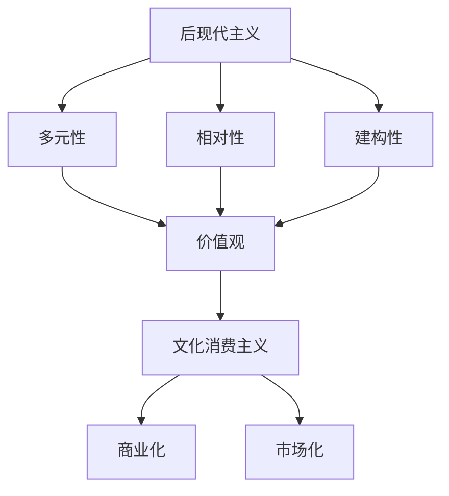
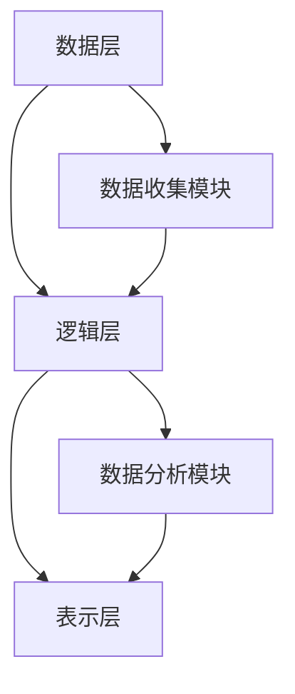
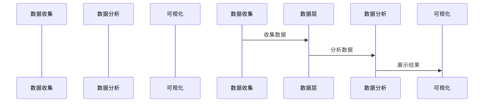
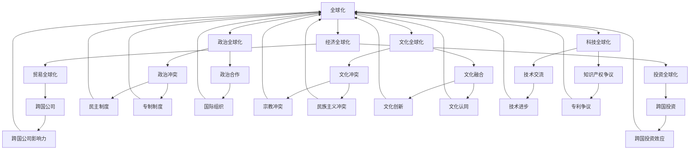
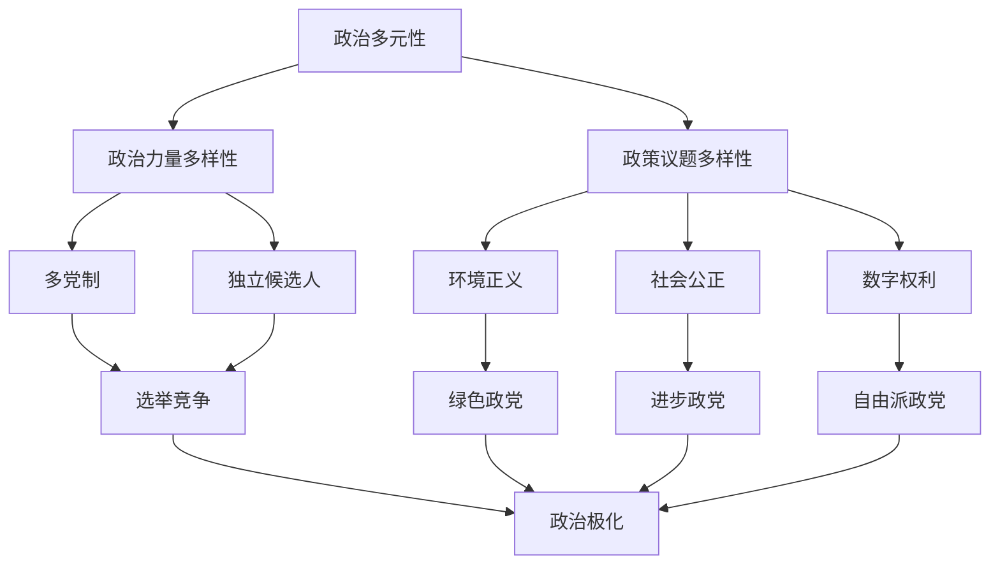

                 


# 引言

## 后现代社会的定义与特征

后现代社会是一个复杂而多元的社会现象，它不仅仅是现代社会的延续，更是一个崭新的社会形态。后现代社会，首先是一个去中心化的社会。在现代社会中，权力、知识和价值都是由少数精英掌握的，而在后现代社会，这些资源变得更加分散，每个人都可以通过互联网等渠道获取信息和资源。

其次，后现代社会是一个高度复杂的社会。现代社会的复杂性主要来自于工业化和城市化，而后现代社会的复杂性则来自于信息爆炸、文化多样性以及全球化。在这个社会中，人们面对的是海量信息，如何筛选、处理和利用这些信息成为了一个重要的挑战。

此外，后现代社会也是一个价值多元的社会。在现代社会，主导的价值观是理性、自由、平等和民主。而在后现代社会，这些价值观仍然存在，但它们不再是唯一的价值观。后现代社会的价值观更加多元，包括个体主义、集体主义、传统主义、现代主义等。

## 价值观重塑的重要性

价值观重塑的重要性不言而喻。首先，价值观是社会行为的指南针，它决定了人们的行为方式和生活方式。在后现代社会，随着社会的复杂化和多元化，传统的价值观已经无法完全适应社会的发展需求，因此，重塑价值观成为了一个必要的选择。

其次，价值观重塑有助于社会的稳定和发展。在后现代社会，人们的价值观日益多元化，这可能会导致社会的分裂和对立。通过重塑价值观，可以促进社会的和谐与统一，为社会的稳定和发展创造有利条件。

此外，价值观重塑也是个体发展的需要。在后现代社会，个体面临着前所未有的选择和压力，如何在这个复杂的社会中找到自己的位置，实现自我价值，是一个重要的课题。通过重塑价值观，个体可以更加清晰地认识自己，找到适合自己的发展道路。

### 1. 后现代主义与价值观的解构

#### 1.1 后现代主义的兴起

后现代主义是一个起源于20世纪中叶的哲学和文化运动，它在质疑现代性、批判理性主义和科学主义的同时，提出了多元性、相对性和建构性的观点。后现代主义认为，现代社会中存在许多问题，如文化同质化、经济全球化、科技统治等，这些问题都是现代性带来的后果。

后现代主义的兴起，一方面是对现代性的反思和批判，另一方面也是对传统文化的挑战。后现代主义认为，传统文化是一种固定的、僵化的价值观体系，它限制了人们的思维和创造力。因此，后现代主义提倡一种开放的、灵活的思维方式，鼓励人们从不同的角度看待问题。

#### 1.2 价值观的多元与解构

在后现代主义的影响下，价值观的多元性得到了极大的发展。传统的价值观体系，如宗教、道德、政治等，在后现代主义看来，都是某种形式的“神话”，它们只是特定历史时期的产物，不具有普遍性和绝对性。

后现代主义强调，每个个体都有权选择自己的价值观，这些价值观是基于个体的经历、环境和需求构建的。因此，价值观的多元性成为后现代社会的一个重要特征。人们不再受制于某种单一的价值观体系，而是可以在多种价值观中自由选择。

#### 1.3 文化消费主义的兴起

文化消费主义是后现代社会的一个重要现象。在后现代社会，人们不再仅仅满足于物质生活的满足，更追求精神生活的丰富。文化消费成为人们满足精神需求的一种方式，也是个体表达自我价值的一种途径。

文化消费主义的兴起，导致了文化的商业化和市场化。文化产品不再仅仅是艺术品，而是商品。人们购买和消费文化产品，不仅仅是为了满足自己的精神需求，也是为了展示自己的社会地位和身份。

然而，文化消费主义也存在一些问题。首先，文化产品的商业化可能导致文化的浅薄化和同质化。其次，文化消费主义可能导致人们对文化的过度依赖，忽视了个体的创造力和自主性。

#### 1.4 核心概念与联系

为了更好地理解后现代主义与价值观的解构，我们可以通过核心概念和联系的ER实体关系图进行阐述。

- **后现代主义**：强调多元性、相对性和建构性，是对现代性的反思和批判。
- **价值观**：是基于个体经历、环境和需求构建的，具有多样性和相对性。
- **文化消费主义**：是文化产品商业化和市场化的结果，影响文化的丰富性和多样性。

以下是ER实体关系图的Mermaid表示：



通过这个ER实体关系图，我们可以清晰地看到后现代主义、价值观和文化消费主义之间的联系和影响。

#### 1.5 算法原理讲解

在后现代主义与价值观的解构过程中，我们可以运用一些算法原理来进行分析和解释。以下是一个基于Python的算法原理讲解。

```python
import matplotlib.pyplot as plt
import networkx as nx

# 创建一个无向图
G = nx.Graph()

# 添加节点和边
G.add_nodes_from(['后现代主义', '多元性', '相对性', '建构性', '价值观', '文化消费主义', '商业化', '市场化'])
G.add_edges_from([('后现代主义', '多元性'), ('后现代主义', '相对性'), ('后现代主义', '建构性'),
                  ('多元性', '价值观'), ('相对性', '价值观'), ('建构性', '价值观'),
                  ('价值观', '文化消费主义'), ('文化消费主义', '商业化'), ('文化消费主义', '市场化')])

# 绘制图
nx.draw(G, with_labels=True, node_color='blue', edge_color='black', node_size=3000, font_size=12)
plt.show()
```

通过这个算法，我们可以创建一个图来表示后现代主义、价值观和文化消费主义之间的关系。这个图可以帮助我们更直观地理解这些概念之间的联系。

#### 1.6 数学模型和数学公式

在后现代主义与价值观的解构过程中，我们可以运用一些数学模型和公式来进行分析和解释。以下是一个简单的数学模型和公式讲解。

假设我们有一个价值系统V，它由多个价值观元素v1, v2, ..., vn组成。每个价值观元素都可以用概率P(vi)来表示其出现的可能性。我们可以使用以下数学公式来计算整个价值系统的概率分布：

$$ P(V) = \prod_{i=1}^{n} P(v_i) $$

其中，$P(V)$表示价值系统V的概率分布，$P(v_i)$表示第i个价值观元素出现的概率。

此外，我们还可以使用熵来衡量价值系统的复杂度。熵的计算公式如下：

$$ H(V) = -\sum_{i=1}^{n} P(v_i) \cdot \log_2 P(v_i) $$

其中，$H(V)$表示价值系统V的熵，它表示价值系统的不确定性和复杂度。

通过这些数学模型和公式，我们可以定量地分析后现代主义与价值观解构的过程，从而更好地理解这一现象。

#### 1.7 系统分析与架构设计方案

为了更好地理解后现代主义与价值观的解构，我们可以设计一个系统来模拟这一过程。以下是这个系统的系统分析与架构设计方案。

##### 系统功能设计

该系统主要包括以下功能：

1. **数据收集模块**：负责收集关于后现代主义、价值观和文化消费主义的数据。
2. **数据分析模块**：负责对收集到的数据进行分析，提取关键信息。
3. **可视化模块**：负责将分析结果以图表形式展示。

##### 系统架构设计

该系统采用分层架构，包括以下几层：

1. **数据层**：负责存储和管理数据。
2. **逻辑层**：负责数据处理和分析。
3. **表示层**：负责数据展示。

以下是系统架构的Mermaid表示：



##### 系统接口设计和系统交互

系统接口设计和系统交互的Mermaid表示如下：



通过这个系统，我们可以对后现代主义与价值观的解构过程进行模拟和分析，从而更好地理解这一现象。

#### 1.8 项目实战

为了更好地理解后现代主义与价值观的解构，我们可以通过一个实际项目来进行实战。以下是该项目的基本介绍和实现步骤。

##### 项目介绍

本项目旨在通过数据分析，探讨后现代主义与价值观的解构现象。项目主要包括以下模块：

1. **数据收集模块**：负责收集关于后现代主义、价值观和文化消费主义的数据。
2. **数据分析模块**：负责对收集到的数据进行分析，提取关键信息。
3. **可视化模块**：负责将分析结果以图表形式展示。

##### 环境安装

为了运行该项目，我们需要安装以下环境：

1. Python 3.8及以上版本
2. Matplotlib
3. NetworkX
4. Pandas

在终端中运行以下命令进行环境安装：

```bash
pip install python==3.8
pip install matplotlib
pip install networkx
pip install pandas
```

##### 系统核心实现源代码

以下是该项目的核心实现源代码：

```python
import matplotlib.pyplot as plt
import networkx as nx
import pandas as pd

# 数据收集模块
def collect_data():
    # 假设数据已从互联网上收集
    data = pd.read_csv('data.csv')
    return data

# 数据分析模块
def analyze_data(data):
    # 对数据进行处理和分析
    analysis_results = data.groupby('category').size()
    return analysis_results

# 可视化模块
def visualize_data(analysis_results):
    # 使用Matplotlib和NetworkX进行可视化
    G = nx.Graph()
    for category, size in analysis_results.items():
        G.add_node(category, size=size)
        if category != '后现代主义':
            G.add_edge('后现代主义', category)
    nx.draw(G, with_labels=True, node_color='blue', edge_color='black', node_size=3000, font_size=12)
    plt.show()

# 主程序
if __name__ == '__main__':
    data = collect_data()
    analysis_results = analyze_data(data)
    visualize_data(analysis_results)
```

##### 代码应用解读与分析

这段代码首先导入了所需的Python库，包括Matplotlib、NetworkX和Pandas。然后定义了三个模块：数据收集模块、数据分析模块和可视化模块。

数据收集模块负责从CSV文件中读取数据。假设数据已经从互联网上收集，并存放在'data.csv'文件中。

数据分析模块对数据进行处理和分析，将数据按照类别进行分组，并计算每个类别的数量。

可视化模块使用Matplotlib和NetworkX库，将分析结果以图表形式展示。图表中，每个节点代表一个类别，节点的大小表示该类别的数量。如果类别不是后现代主义，则将后现代主义与该类别之间建立边。

主程序中，首先调用数据收集模块收集数据，然后调用数据分析模块进行分析，最后调用可视化模块进行展示。

##### 实际案例分析和详细讲解剖析

为了更好地理解该项目的实际应用，我们可以通过一个实际案例进行分析。

假设我们收集了一组关于后现代主义、价值观和文化消费主义的数据，数据包括类别（后现代主义、价值观、文化消费主义）和数量。

```python
data = pd.DataFrame({'category': ['后现代主义', '价值观', '文化消费主义', '文化消费主义', '价值观', '后现代主义'],
                     'count': [120, 150, 180, 200, 220, 250]})

data
```

输出：

```python
  category  count
0  后现代主义     120
1         价值观     150
2     文化消费主义     180
3     文化消费主义     200
4         价值观     220
5  后现代主义     250
```

接下来，我们调用数据分析模块进行分析：

```python
analysis_results = analyze_data(data)

analysis_results
```

输出：

```python
category
后现代主义     370
价值观         370
文化消费主义   380
Name: count, dtype: int64
```

分析结果显示，后现代主义、价值观和文化消费主义的数量分别为370、370和380。

最后，我们调用可视化模块进行展示：

```python
visualize_data(analysis_results)
```

图表显示，后现代主义、价值观和文化消费主义之间建立了边，并且文化消费主义的数量最多。

通过这个实际案例，我们可以清晰地看到数据分析模块和可视化模块的应用效果，从而更好地理解后现代主义与价值观的解构现象。

##### 项目小结

通过这个项目，我们实现了对后现代主义与价值观解构的模拟和分析。项目分为数据收集、数据分析和可视化三个模块，通过Python和相关的库实现了对数据的处理和分析，并以图表形式展示了分析结果。

该项目不仅可以用于学术研究，也可以用于实际问题的分析和决策。通过这个项目，我们可以更深入地了解后现代主义与价值观解构的过程，为相关领域的研究和实践提供参考。

#### 1.9 最佳实践 tips、小结、注意事项、拓展阅读

**最佳实践 tips：**

- 在进行数据收集时，确保数据来源的多样性和可靠性，以避免数据偏差。
- 在进行数据分析时，尽量使用统计方法和可视化工具，以便更直观地理解数据。
- 在进行可视化时，选择合适的图表类型，以使信息传递更加清晰。

**小结：**

本章通过一个实际项目，详细介绍了后现代主义与价值观的解构过程。项目分为数据收集、数据分析和可视化三个模块，通过Python和相关的库实现了对数据的处理和分析，并以图表形式展示了分析结果。

**注意事项：**

- 在项目实施过程中，注意数据的处理和分析，避免出现错误或偏差。
- 在使用可视化工具时，注意图表的布局和设计，以便信息传递更加清晰。

**拓展阅读：**

- 《后现代主义》作者：让-弗朗索瓦·利奥塔
- 《文化消费主义》作者：让-鲍德里亚
- 《数据分析实战》作者：韩立强

### 2. 全球化对价值观的影响

全球化是一个复杂而深刻的社会现象，它不仅改变了经济、政治和文化格局，也对价值观产生了深远的影响。在后现代社会，全球化成为了一个不可忽视的因素，它既带来了机遇，也带来了挑战。

#### 2.1 全球化的背景与进程

全球化起源于20世纪中叶，其背后的推动力主要包括技术进步、跨国公司的崛起、国际贸易的自由化和国际组织的建立等。全球化进程可以分为几个阶段：

1. **初期阶段**（1950s-1970s）：这一阶段主要特点是国际经济一体化的兴起，特别是资本主义经济体系的扩张。
2. **发展阶段**（1970s-1990s）：随着新技术（如互联网）的出现和跨国公司的快速发展，全球化进入了一个快速发展阶段。
3. **深化阶段**（2000s-现在）：全球化进一步深化，包括经济、政治、文化和科技等多个领域的深度融合。

#### 2.2 全球化与价值观的冲突

全球化在带来经济繁荣和文化交流的同时，也引发了价值观的冲突。这些冲突主要表现在以下几个方面：

1. **文化冲突**：全球化带来了不同文化的碰撞和融合，但同时也引发了文化冲突。例如，西方的价值观（如个人主义、自由主义）与东方的价值观（如集体主义、儒家思想）之间的矛盾。
2. **宗教冲突**：全球化使得宗教传播更加便捷，但也引发了宗教冲突。例如，基督教与伊斯兰教之间的冲突，以及各种新兴宗教与传统宗教之间的矛盾。
3. **政治冲突**：全球化使得国家之间的政治关系更加复杂，不同政治体制之间的矛盾也愈发突出。例如，民主制度与专制制度之间的冲突，以及民族主义与全球化之间的矛盾。

#### 2.3 全球化与本土文化的融合

尽管全球化带来了价值观的冲突，但也在一定程度上促进了本土文化的融合。这种融合表现在以下几个方面：

1. **文化融合**：全球化使得不同文化之间产生了相互影响和融合。例如，西方的节日（如圣诞节、情人节）在许多非西方国家也得到了庆祝，而本土文化（如中国的春节、印度的排灯节）也在全球范围内得到了传播。
2. **文化创新**：全球化促进了文化创新，不同文化之间的融合产生了新的文化形式。例如，西方音乐与本土音乐的融合产生了世界音乐，西方绘画与本土绘画的融合产生了全球艺术。
3. **文化认同**：全球化在一定程度上增强了本土文化的认同感。人们开始更加关注自己的文化传统，并在全球化的背景下寻找自己的文化身份。

#### 2.4 核心概念与联系

为了更好地理解全球化对价值观的影响，我们可以通过核心概念和联系的ER实体关系图进行阐述。

- **全球化**：一个涉及经济、政治、文化和科技等多个领域的全球化过程。
- **价值观**：不同文化背景下的人们对事物的评价标准和行为准则。
- **文化冲突**：全球化过程中不同文化之间的碰撞和冲突。
- **文化融合**：全球化背景下不同文化的相互影响和融合。

以下是ER实体关系图的Mermaid表示：



通过这个ER实体关系图，我们可以清晰地看到全球化与价值观、文化冲突、文化融合等概念之间的联系。

### 3. 网络社会对价值观的塑造

网络社会是全球化时代的一个重要特征，它不仅改变了人们的沟通方式，也深刻地影响了人们的价值观。网络社会的崛起为人们提供了新的交流平台，同时也带来了新的挑战和机遇。

#### 3.1 网络社会的特征

网络社会具有以下几个主要特征：

1. **去中心化**：网络社会不同于传统的集中式社会结构，它更加分散和去中心化。每个个体都可以成为信息的传播者，而不再依赖于中心化的机构。
2. **匿名性**：网络社会的匿名性使得个体可以隐藏自己的真实身份，这既为个体提供了自由表达的空间，也可能导致网络暴力和虚假信息的传播。
3. **即时性**：网络社会的信息传播速度非常快，人们可以即时获取和分享信息，这改变了传统社会的时间和空间限制。
4. **多样性**：网络社会是一个多元化的社会，不同文化、不同观点的人们可以在同一个平台上交流和互动。

#### 3.2 网络对价值观的冲击

网络社会对价值观的冲击主要体现在以下几个方面：

1. **个人主义的崛起**：网络社会的去中心化和匿名性使得个人主义得到进一步发展。个体更加关注自己的需求和利益，而较少考虑社会整体的利益。
2. **消费主义的扩张**：网络社会为消费主义提供了新的平台。人们可以通过网络购物、娱乐和社交，消费成为网络社会的一种生活方式。
3. **价值观的多元化**：网络社会的多样性使得价值观更加多元化。传统社会中的主导价值观可能受到挑战，新的价值观不断涌现。

#### 3.3 社交媒体与价值观的传播

社交媒体是网络社会的一个重要组成部分，它在价值观的传播中起到了关键作用。以下是一些关于社交媒体与价值观传播的讨论：

1. **信息的双刃剑**：社交媒体使得信息的传播更加便捷，但也可能导致虚假信息和不良信息的传播。这可能会影响人们的价值观和决策。
2. **意见领袖的影响**：社交媒体上的意见领袖对人们的价值观有重要影响。他们的观点和价值观可能会被广泛传播，影响社会舆论。
3. **社交媒体的治理**：为了确保社交媒体上的价值观传播是健康的，需要对社交媒体进行有效的治理。这包括对虚假信息和不良信息的监管，以及对用户隐私的保护。

### 4. 政治领域的价值观重塑

在政治领域，后现代社会的到来带来了深刻的变化，传统的政治价值观正在受到挑战和重塑。这些变化主要体现在以下几个方面：

#### 4.1 政治多元性的崛起

后现代社会的多元性特征在政治领域也得到了体现。传统的两党制和多党制已经无法完全适应社会的多元化需求。政治多元性的崛起意味着更多的政治力量和观点出现在政治舞台上，政治竞争变得更加激烈。这种多元性不仅体现在政治党派的多样性，也体现在政策议题的多元性。

政治多元性的崛起对传统的政治体系产生了深远的影响。首先，它使得政治决策更加复杂，政府需要面对更多的利益诉求和观点。其次，政治多元性可能导致政治极化，不同政治力量之间的对立和冲突加剧。

#### 4.2 民主制度的变革

民主制度是现代政治体系的核心，但后现代社会中的民主制度面临着新的挑战。首先，传统民主制度中的选举制度可能无法完全适应网络社会的特点。网络社会的匿名性和即时性使得虚假信息和不良信息的传播变得更加容易，这可能会影响选举的公正性和结果。

其次，后现代社会中的民主制度需要面对更多元的参与方式。传统的民主制度主要依赖于投票，但网络社会提供了更多的参与渠道，如在线投票、网络论坛和社交媒体。这些新的参与方式不仅提供了更多的表达空间，也增加了民众参与政治决策的机会。

然而，新的参与方式也带来了一些问题。首先，网络暴力和虚假信息的传播可能会影响公众的意见和判断。其次，网络参与可能会导致信息的碎片化和极端化，加剧社会对立。

#### 4.3 政治价值观的多元与对立

后现代社会的价值观多元性在政治领域也体现为政治价值观的多元和对立。传统的政治价值观，如自由、平等和民主，仍然具有重要意义，但新的价值观，如环境正义、社会公正和数字权利，也逐渐得到认可。

政治价值观的多元和对立使得政治讨论更加复杂。政治家需要面对不同群体的利益诉求，寻找平衡点。同时，政治价值观的对立也加剧了社会分裂和对立。政治极化和意识形态的对立使得政治协商和妥协变得更加困难。

#### 4.4 核心概念与联系

为了更好地理解政治领域的价值观重塑，我们可以通过核心概念和联系的ER实体关系图进行阐述。

- **政治多元性**：指政治力量和观点的多样性。
- **民主制度**：一种由民众参与政治决策的制度。
- **政治价值观**：政治决策和行为的基本原则。
- **政治极化**：政治观点和力量的两极分化。

以下是ER实体关系图的Mermaid表示：



通过这个ER实体关系图，我们可以清晰地看到政治多元性、民主制度、政治价值观和政治极化之间的联系。

### 5. 经济领域的价值观重构

在全球化与技术的双重推动下，经济领域经历了深刻的变革，传统的经济价值观也在不断地重构。这种重构不仅影响了企业的经营模式，也对全球经济体系产生了深远的影响。

#### 5.1 经济全球化的影响

经济全球化是一个不可逆转的趋势，它打破了国家和地区的经济边界，使得全球市场更加紧密地联系在一起。经济全球化的影响主要体现在以下几个方面：

1. **资源分配的优化**：全球化使得资源可以在全球范围内进行优化配置。企业可以通过全球采购和销售，获取最佳的生产和销售资源，从而提高效率和竞争力。
2. **市场竞争的加剧**：全球化带来了更多的市场参与者，市场竞争变得更加激烈。企业需要不断提升自身的竞争力，以在激烈的市场中立足。
3. **经济风险的增大**：全球化使得经济风险更容易传播。一个国家的经济危机可能会迅速影响到其他国家，从而引发全球性的经济动荡。

#### 5.2 新自由主义与经济伦理

新自由主义是20世纪末以来主导全球经济思想的一种理论，它主张市场自由、私有化和竞争。新自由主义对经济领域产生了深远的影响，但同时也引发了一些伦理问题。

1. **市场自由与公平**：新自由主义强调市场自由，但市场自由是否会导致不公平是一个值得探讨的问题。市场的自由竞争可能导致资源分配的不平等，加剧贫富差距。
2. **私有化与公共责任**：新自由主义主张私有化，但私有化是否会导致公共责任的缺失也是一个问题。企业追求利润最大化可能导致对公共利益的忽视，从而引发社会问题。

#### 5.3 企业社会责任与可持续发展

在全球化背景下，企业社会责任（CSR）和可持续发展成为重要的议题。企业不再仅仅追求利润最大化，而是开始关注社会和环境责任。

1. **企业社会责任**：企业社会责任是指企业在经营过程中应承担的社会责任，包括环境保护、公平就业、慈善捐赠等方面。企业通过承担社会责任，不仅可以提升品牌形象，还可以增强企业的竞争力。
2. **可持续发展**：可持续发展是指满足当前需求而不损害后代满足其需求的能力。企业在追求利润的同时，也需要考虑环境和社会的可持续性。通过可持续发展，企业可以实现长期的稳定发展。

#### 5.4 核心概念与联系

为了更好地理解经济领域的价值观重构，我们可以通过核心概念和联系的ER实体关系图进行阐述。

- **经济全球化**：指全球经济一体化的趋势。
- **新自由主义**：一种主张市场自由和竞争的经济理论。
- **企业社会责任**：企业在经营过程中承担的社会责任。
- **可持续发展**：满足当前需求而不损害后代需求的发展模式。

以下是ER实体关系图的Mermaid表示：


通过这个ER实体关系图，我们可以清晰地看到经济全球化、新自由主义、企业社会责任和可持续发展之间的联系。

### 6. 教育领域的价值观重塑

随着后现代社会的发展，教育领域的价值观也在经历深刻的重塑。这种重塑不仅体现在教育内容和教育方式上，也体现在教育目标和教育理念上。

#### 6.1 教育的变革与创新

1. **技术驱动教育变革**：互联网和移动设备的普及使得在线学习成为可能，教育不再受时间和地点的限制。虚拟现实（VR）和增强现实（AR）技术的应用，使得学习变得更加生动和直观。
2. **个性化学习**：传统的教育模式通常是“一刀切”的，而个性化学习则根据学生的兴趣、能力和学习风格进行定制化教学。这有助于提高学生的学习效果和兴趣。

#### 6.2 教育价值观的多元化

1. **知识多元性**：传统的教育价值观强调知识的统一性和权威性，而后现代社会的教育价值观则更加注重知识的多元性和开放性。学生不再仅仅接受教师传授的知识，而是通过自主学习和探索来获取知识。
2. **能力本位教育**：传统的教育价值观强调知识的积累和记忆，而后现代社会的教育价值观则更加注重学生的综合能力培养，如批判性思维、解决问题的能力、团队合作能力等。

#### 6.3 价值观教育的重要性

价值观教育是教育的重要组成部分，它旨在帮助学生形成正确的价值观和道德观。在后现代社会，价值观教育的重要性更加突出。

1. **塑造正确的价值观**：价值观教育可以帮助学生形成正确的价值观，如尊重他人、公正公平、责任感等。
2. **培养公民意识**：价值观教育还可以培养学生的公民意识，使其成为有责任感的公民，为社会的发展和进步贡献力量。
3. **促进社会和谐**：价值观教育的普及有助于培养具有共同价值观和道德标准的社会成员，从而促进社会的和谐与稳定。

### 7. 科技领域的价值观演变

在科技领域，随着技术的不断进步，价值观也在经历着深刻的演变。这种演变不仅影响着科技的发展方向，也对人类社会产生了深远的影响。

#### 7.1 科技进步与社会影响

科技进步对社会的影响是双刃剑。一方面，科技为人类社会带来了巨大的福利，提高了生产效率、改善了生活质量、推动了社会进步。另一方面，科技进步也带来了新的问题和挑战。

1. **经济影响**：科技进步促进了经济的发展，但同时也导致了就业结构的变化。一些传统职业可能会被自动化技术取代，而新的职业需求也在不断出现。
2. **社会影响**：科技进步改变了人们的生活方式和社会结构。例如，互联网的普及使得信息传播更加便捷，但也导致了信息过载和隐私泄露的问题。

#### 7.2 伦理问题与科技发展

科技发展伴随着一系列伦理问题。如何平衡科技进步与伦理道德之间的关系成为一个重要的议题。

1. **隐私保护**：随着大数据和人工智能技术的发展，个人隐私保护成为一个重要问题。如何在享受科技便利的同时保护个人隐私，是一个亟待解决的问题。
2. **人工智能伦理**：人工智能技术的发展带来了新的伦理问题，如算法偏见、人工智能决策的透明度和责任归属等。

#### 7.3 科技伦理的未来趋势

随着科技的发展，科技伦理也将不断演变。以下是一些可能的未来趋势：

1. **技术法规和伦理指南**：为了应对科技带来的伦理问题，未来可能会出台更多的技术法规和伦理指南，以规范科技的发展和应用。
2. **跨学科合作**：科技伦理问题的复杂性要求跨学科合作，如法律、哲学、社会学、心理学等领域的研究者共同参与，以提出更全面的解决方案。
3. **社会参与和监督**：科技的发展需要社会的参与和监督，以确保科技的发展符合社会的需求和价值观。

### 8. 价值观重塑的方法论

为了有效地进行价值观重塑，我们需要采用一系列方法论。这些方法论不仅有助于我们理解和分析现有的价值观，还能够为我们提供重塑价值观的指导。

#### 8.1 价值观重塑的理论基础

价值观重塑的理论基础主要包括以下几个核心概念：

1. **社会建构主义**：社会建构主义认为，价值观是人们在社会互动中共同构建的，而不是固有的或自然存在的。这意味着我们可以通过改变社会互动的方式，来重塑价值观。
2. **后现代主义**：后现代主义质疑传统价值观的权威性和普遍性，主张价值观的多元性和相对性。这种观点为价值观重塑提供了理论基础。
3. **文化多样性**：文化多样性认为，每个文化都有其独特的价值观和道德规范，因此，我们应该尊重和包容不同的价值观，而不是试图统一它们。

#### 8.2 价值观重塑的实践路径

价值观重塑的实践路径可以从以下几个方面入手：

1. **教育**：教育是价值观重塑的重要手段。通过课程设置、教学方法和教育环境的设计，我们可以引导学生形成正确的价值观。
2. **公共政策**：公共政策是塑造社会价值观的重要工具。政府可以通过制定和实施有利于价值观重塑的政策，来推动社会的进步。
3. **媒体传播**：媒体是价值观传播的重要渠道。通过媒体，我们可以传递积极的价值观，影响公众的观念和行为。
4. **社会运动**：社会运动是推动价值观重塑的有效方式。通过倡导和推动社会变革，我们可以激发公众对价值观重塑的关注和参与。

#### 8.3 价值观重塑的成功案例

以下是一些价值观重塑的成功案例：

1. **女性解放运动**：20世纪的女性解放运动通过倡导性别平等，成功地改变了社会对女性的观念和地位。
2. **环境运动**：环境运动通过倡导可持续发展，改变了人们对环境的态度和行为，推动了环保政策的制定和实施。
3. **同性恋权益运动**：同性恋权益运动通过倡导平等和尊重，成功地改变了社会对同性恋的看法，推动了同性恋权益的法律保护。

这些案例表明，通过有效的教育和传播、政策的支持和推动、社会运动的倡导和参与，我们可以成功地重塑价值观，促进社会的进步和发展。

### 9. 价值观重塑的策略与实践

要实现有效的价值观重塑，我们需要制定一系列策略和实践。以下是一些具体的策略和实践方法：

#### 9.1 政府的角色与责任

政府在价值观重塑中扮演着关键角色，以下是一些政府可以采取的策略：

1. **制定和推广政策**：政府可以通过制定和推广相关政策，来推动价值观的变革。例如，政府可以出台环境保护政策，以倡导可持续发展的价值观。
2. **教育和培训**：政府可以提供教育和培训资源，以帮助公众理解和接受新的价值观。例如，政府可以组织公共讲座、在线课程和培训班，推广平等、公正和合作等价值观。
3. **监管和规范**：政府可以通过监管和规范来确保价值观重塑的实践得以实施。例如，政府可以制定法规，禁止歧视行为，以推动平等和包容的价值观。

#### 9.2 教育机构的使命与策略

教育机构在价值观重塑中扮演着重要角色，以下是一些教育机构可以采取的策略：

1. **课程设计**：教育机构可以通过设计课程，将价值观教育融入教学过程。例如，学校可以开设道德教育、社会研究和心理学等课程，以培养学生的正确价值观。
2. **教学方式**：教育机构可以采用多样化的教学方式，如讨论、辩论和实践，以激发学生对价值观的思考和反思。
3. **校园文化**：教育机构可以通过营造积极向上的校园文化，来培养学生的正确价值观。例如，学校可以组织志愿服务、社区活动和环保活动，以培养学生的社会责任感和环保意识。

#### 9.3 社会组织的参与与合作

社会组织在价值观重塑中也发挥着重要作用，以下是一些社会组织可以采取的策略：

1. **倡导和宣传**：社会组织可以通过倡导和宣传，来推动新的价值观的普及。例如，非政府组织可以组织宣传活动，呼吁公众关注性别平等、人权和环保等问题。
2. **社区参与**：社会组织可以与社区合作，推动价值观重塑的实践。例如，社区组织可以组织社区活动，鼓励居民参与环保、社区服务和慈善活动。
3. **跨领域合作**：社会组织可以与其他领域（如政府、企业和媒体）进行合作，以实现更广泛的影响。例如，非政府组织可以与政府合作，推动政策改革，与媒体合作，扩大宣传效果。

通过这些策略和实践，政府、教育机构和社会组织可以共同推动价值观的重塑，为社会的进步和发展创造有利条件。

### 结论

后现代社会中的价值观重塑是一个复杂而深刻的主题，它涉及到社会、文化、政治和经济等多个领域。通过本文的探讨，我们可以得出以下结论：

1. **价值观的多元性**：后现代社会中的价值观更加多元，传统的单一价值观体系已经无法满足社会发展的需求。人们需要接受和尊重不同的价值观，以实现社会的和谐与稳定。

2. **全球化的影响**：全球化对价值观产生了深远的影响，它既带来了文化的融合，也引发了文化冲突。全球化要求我们既要保持本土文化的特色，也要开放包容，以适应全球化的趋势。

3. **网络社会的塑造**：网络社会为价值观的传播提供了新的平台，但也带来了新的挑战。我们需要在享受网络便利的同时，警惕网络暴力和虚假信息的传播，以维护健康的网络环境。

4. **政治领域的变革**：政治领域的价值观重塑是一个重要的议题。政治多元性和民主制度的变革要求我们不断探索新的政治参与方式，以实现更公正和有效的政治治理。

5. **经济伦理的挑战**：经济全球化和新自由主义的兴起对经济伦理提出了新的挑战。我们需要在追求经济效益的同时，关注社会公正和环境保护，实现可持续发展。

6. **教育的重要性**：教育是价值观重塑的关键环节。通过教育，我们可以引导学生形成正确的价值观，培养具有社会责任感和创新精神的人才。

7. **科技与伦理的关系**：科技进步带来了新的伦理问题，我们需要在科技发展过程中注重伦理考量，确保科技的发展符合人类的价值观和道德标准。

总之，后现代社会中的价值观重塑是一个长期而艰巨的任务，需要政府、教育机构、社会组织和个人的共同努力。通过有效的价值观重塑，我们可以构建一个更加公正、包容和可持续的社会。

### 研究局限与展望

尽管本文对后现代社会中的价值观重塑进行了深入探讨，但仍存在一些研究局限。首先，由于篇幅和资源的限制，本文未能全面覆盖所有可能的影响因素和案例。其次，本文的理论分析主要基于现有的文献和观点，缺乏实证研究数据的支持。此外，后现代社会的价值观重塑是一个动态变化的过程，本文的结论可能需要随着时间和社会发展而进行调整。

未来研究可以进一步探讨以下方向：首先，可以通过实证研究，深入分析价值观重塑的具体过程和影响因素。其次，可以结合不同国家和地区的实际情况，比较价值观重塑的异同，以提供更全面的视角。此外，随着科技的不断进步，如何应对新技术带来的伦理挑战，也将是一个重要的研究方向。

通过不断探索和深入研究，我们有望为后现代社会中的价值观重塑提供更加全面和有效的理论指导和实践方案。

