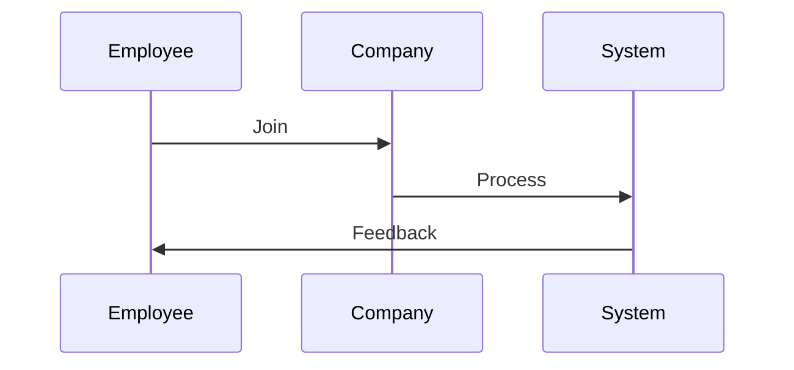
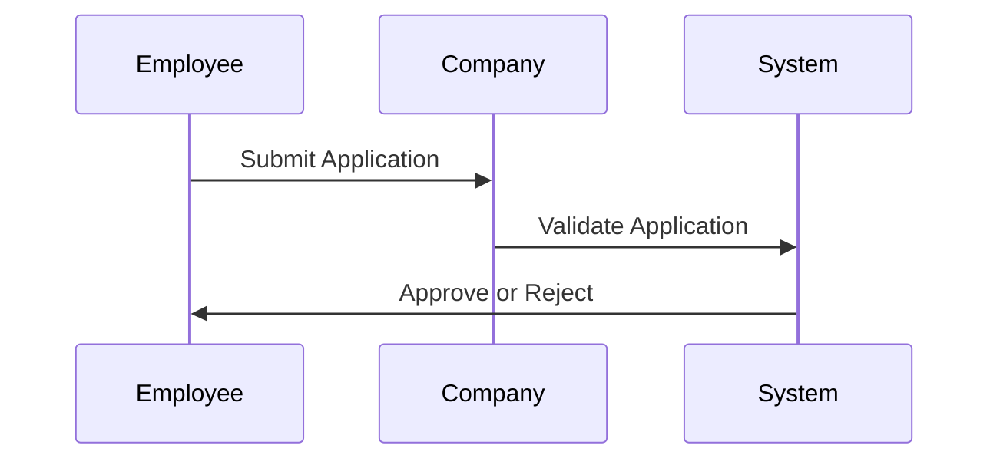

                 


### 目录大纲与内容设计

在接下来的内容中，我们将详细阐述每一章节的设计，确保文章的整体结构清晰、逻辑严密，同时满足技术博客的专业性和可读性。

#### 第1章 引言

**背景介绍**

首先，我们将简要介绍后现代社会的特征，如全球化、信息技术的飞速发展、文化多样性的增加等。这些特征使得身份认同问题变得更加复杂和多元。

**问题描述**

接着，我们将阐述后现代社会身份认同面临的挑战。具体包括如何平衡多元化与个性化之间的矛盾，以及如何在不同文化和价值观之间寻找共同点。

**章节结构**

- 1.1 后现代社会的特征
  - 全球化
  - 文化多样性
  - 信息技术的发展
- 1.2 身份认同的挑战
  - 多元化与个性化的矛盾
  - 文化和价值观的冲突
  - 身份认同的不确定性

#### 第2章 核心概念解析

**核心概念**

在这一章节，我们将定义和阐述身份认同、多元化和个性化的核心概念。

**概念属性特征对比表格**

为了帮助读者更好地理解这些概念，我们将创建一个对比表格，列出多元化和个性化的主要特点。

**ER实体关系图架构**

我们将使用Mermaid语言绘制ER实体关系图，展示多元化和个性化对身份认同的影响。

**章节结构**

- 2.1 身份认同的定义
  - 身份认同的概念
  - 身份认同的重要性
- 2.2 多元化与个性化的概念
  - 多元化的特点
  - 个性化的特点
- 2.3 概念属性特征对比表格
  - 多元化与个性化的对比
- 2.4 ER实体关系图架构
  - 实体关系图示例
  - 多元化与个性化的影响

#### 第3章 理论与实践

**算法原理讲解**

虽然本文并非纯技术文章，但我们可以用比喻或故事形式解释身份认同的形成与变化。例如，我们可以将身份认同比喻为一个不断演化的算法，而多元化和个性化则是影响这个算法的两个关键参数。

**数学模型与公式**

我们将介绍与身份认同相关的数学概念，如概率论中的随机事件。使用LaTeX格式嵌入数学公式，确保公式准确且易于理解。

**章节结构**

- 3.1 身份认同的形成与变化
  - 身份认同的比喻讲解
  - 多元化与个性化的影响
- 3.2 数学模型与公式
  - 概率论中的随机事件
  - 身份认同的数学模型
- 3.3 算法讲解
  - 算法流程图
  - 算法Python代码实现

#### 第4章 系统分析与架构设计

**问题场景介绍**

我们将介绍一个具体的问题场景，例如在跨国公司中如何平衡不同文化背景员工的身份认同。

**系统功能设计**

使用Mermaid语言绘制领域模型类图，展示系统的功能模块。

**系统架构设计**

使用Mermaid语言绘制系统架构图，展示系统的整体架构。

**系统接口设计**

详细描述系统的各个接口，包括接口的功能和设计。

**系统交互序列图**

使用Mermaid语言绘制系统交互序列图，展示系统的交互流程。

**章节结构**

- 4.1 问题场景介绍
  - 场景设定
  - 需求分析
- 4.2 系统功能设计
  - 领域模型类图
- 4.3 系统架构设计
  - 系统架构图
- 4.4 系统接口设计
  - 接口功能
  - 接口设计
- 4.5 系统交互序列图
  - 交互流程

#### 第5章 项目实战

**环境安装与配置**

详细讲解项目的环境安装和配置过程，包括必要的软件和工具。

**系统核心实现**

提供项目核心实现的源代码，并进行解读和分析。

**代码应用解读与分析**

分析代码的应用场景，解释关键部分的原理和实现方式。

**实际案例分析和详细讲解剖析**

提供实际案例，对案例进行详细分析和讲解。

**项目小结**

总结项目的核心成果和经验教训。

**章节结构**

- 5.1 环境安装与配置
  - 环境准备
  - 配置过程
- 5.2 系统核心实现
  - 源代码提供
  - 代码解读
- 5.3 代码应用解读与分析
  - 应用场景
  - 实现分析
- 5.4 实际案例分析和详细讲解剖析
  - 案例提供
  - 分析讲解
- 5.5 项目小结
  - 总结与反思

#### 第6章 最佳实践与建议

**多元化与个性化平衡的技巧**

提供一些实用的技巧，帮助读者在后现代社会中平衡多元化和个性化。

**注意事项**

提醒读者在处理身份认同问题时可能遇到的困难。

**拓展阅读**

推荐进一步阅读的资源，包括相关书籍、论文和网站。

**章节结构**

- 6.1 多元化与个性化平衡的技巧
  - 实用的技巧
- 6.2 注意事项
  - 常见问题
  - 解决方案
- 6.3 拓展阅读
  - 书籍推荐
  - 论文推荐
  - 网站推荐

#### 第7章 总结与展望

**总结**

总结全文内容，强调多元化和个性化之间的平衡的重要性。

**展望**

对未来身份认同问题的趋势和发展进行展望。

**章节结构**

- 7.1 总结
  - 全文回顾
  - 核心观点
- 7.2 展望
  - 未来趋势
  - 发展方向

通过上述设计，我们确保文章内容完整、结构合理，同时符合技术博客的专业性和可读性要求。接下来，我们将按照这个大纲逐步撰写每一章节的内容。

---

### 详细撰写流程

在接下来的步骤中，我们将按照前面的目录大纲，详细撰写每一章节的内容。每个章节都将分为几个小节，每个小节都将包含丰富的信息，确保文章的整体质量。

#### 第1章 引言

**1.1 后现代社会的特征**

在这个小节，我们将介绍后现代社会的几个主要特征。我们将使用简单的技术语言，以便读者能够轻松理解。

- **全球化**：全球化的趋势使得人们的生活和工作越来越紧密地联系在一起。这个特征导致了文化的交流和融合，同时也带来了身份认同的挑战。
- **文化多样性**：随着全球化的推进，不同文化之间的接触变得越来越频繁。这种多样性使得身份认同变得更加复杂。
- **信息技术的发展**：互联网和智能手机的普及改变了人们的沟通方式，使得信息传播更加迅速和便捷。这也对身份认同产生了深远的影响。

**1.2 身份认同的挑战**

在这一小节，我们将探讨后现代社会身份认同面临的挑战。

- **多元化与个性化的矛盾**：多元文化和社会背景的碰撞常常导致个体在身份认同上感到困惑。如何在多元化和个性化之间找到平衡是一个重要的挑战。
- **文化和价值观的冲突**：不同的文化和价值观可能会产生冲突，使得个体在身份认同上感到不确定。
- **身份认同的不确定性**：在快速变化的社会环境中，个体可能会对自己的身份认同产生疑问，不知道自己属于哪个群体。

**撰写步骤**

1. **背景介绍**：简要介绍后现代社会的特征，使用技术语言描述。
2. **问题阐述**：详细阐述身份认同面临的挑战，使用技术语言进行描述。
3. **案例引入**：引入一个或多个实际案例，说明这些挑战如何影响人们的日常生活和工作。

#### 第2章 核心概念解析

**2.1 身份认同的定义**

在这一小节，我们将定义身份认同，并解释其重要性。

- **身份认同的概念**：身份认同是指个体对自己的认知，包括个体所属的文化、社会群体、价值观等。
- **身份认同的重要性**：身份认同对个体的心理健康和社会关系有着重要的影响。它帮助个体确定自己在社会中的位置，形成自我价值感。

**2.2 多元化与个性化的概念**

在这一小节，我们将介绍多元化和个性化的概念，并解释它们如何影响身份认同。

- **多元化的特点**：多元化意味着尊重和接纳不同的文化、观点和价值观。它强调个体的多样性和独特性。
- **个性化的特点**：个性化强调个体独特的生活方式和价值观。它鼓励个体追求自我表达和自我实现。

**2.3 概念属性特征对比表格**

为了帮助读者更好地理解多元化和个性化的特点，我们将创建一个对比表格。

| 特点         | 多元化                  | 个性化                 |
| ------------ | ---------------------- | ---------------------- |
| 文化         | 尊重不同的文化         | 强调个体文化           |
| 观点         | 接纳不同的观点         | 强调个体观点           |
| 价值观       | 尊重不同的价值观       | 强调个体价值观         |
| 社会关系     | 建立多元的社会关系     | 维护独特的社会关系     |

**2.4 ER实体关系图架构**

我们将使用Mermaid语言绘制ER实体关系图，展示多元化和个性化对身份认同的影响。

```mermaid
erDiagram
    User ||--|{ Identity }|--| Culture
    User ||--|{ Personalization }|--| Value
```

**撰写步骤**

1. **定义核心概念**：使用技术语言明确身份认同、多元化和个性化的定义。
2. **解释概念属性**：通过对比表格和Mermaid图，详细阐述多元化和个性化的特点。
3. **实例说明**：通过实际案例说明这些概念如何在现实生活中发挥作用。

#### 第3章 理论与实践

**3.1 身份认同的形成与变化**

在这一小节，我们将用比喻和故事形式解释身份认同的形成与变化。

- **比喻讲解**：我们可以将身份认同比喻为一个不断演化的算法，多元化和个性化则是影响这个算法的两个关键参数。
- **故事讲解**：通过一个故事，我们可以更好地理解身份认同的形成和变化。例如，一个来自不同文化背景的个体在成长过程中如何逐渐形成自己的身份认同。

**3.2 数学模型与公式**

在这一小节，我们将介绍与身份认同相关的数学概念，如概率论中的随机事件。

- **随机事件**：随机事件是指可能发生也可能不发生的事件。在身份认同的背景下，我们可以将其视为个体在不同文化背景下进行自我认知的过程。
- **数学模型**：使用LaTeX格式给出身份认同的数学模型。例如：

  ```latex
  P(I|C) = \frac{P(I \cap C)}{P(C)}
  ```

  这个公式表示在给定文化C的情况下，个体I的身份认同概率。

**3.3 算法讲解**

在这一小节，我们将使用Python代码实现一个简单的身份认同算法，并详细解释其原理。

```python
import random

def identity_formation(culture_percentages):
    identity = random.choices(['Unique', 'Mainstream'], weights=culture_percentages, k=1)
    return identity

culture_percentages = [0.6, 0.4]
identity = identity_formation(culture_percentages)
print(f"Your identity is: {identity[0]}")
```

**撰写步骤**

1. **比喻和故事讲解**：使用比喻和故事解释身份认同的形成与变化。
2. **数学模型与公式**：使用LaTeX格式给出数学模型，并进行解释。
3. **算法实现与讲解**：提供Python代码实现，详细解释算法原理。

#### 第4章 系统分析与架构设计

**4.1 问题场景介绍**

在这一小节，我们将介绍一个具体的问题场景，例如在跨国公司中如何平衡不同文化背景员工的身份认同。

- **场景设定**：跨国公司拥有来自不同国家和地区的员工，他们在文化、价值观和工作习惯上存在差异。
- **需求分析**：分析公司如何在不同文化背景下维护员工身份认同，并提高员工的工作满意度。

**4.2 系统功能设计**

在这一小节，我们将使用Mermaid语言绘制领域模型类图，展示系统的功能模块。

```mermaid
classDiagram
    Employee <<class>> {ID: String, Name: String, Culture: String, Identity: String}
    Company <<class>> {ID: String, Name: String, Employees: Employee[]}
    Culture <<class>> {ID: String, Name: String, Characteristics: String[]}
    System <<class>> {Employees: Employee[], Company: Company}
    Employee o-- Company
    Employee o-- Culture
    Company o-- Culture
```

**4.3 系统架构设计**

在这一小节，我们将使用Mermaid语言绘制系统架构图，展示系统的整体架构。



**4.4 系统接口设计**

在这一小节，我们将详细描述系统的各个接口，包括接口的功能和设计。

- **接口1：员工加入公司**：功能描述、接口设计。
- **接口2：系统处理员工信息**：功能描述、接口设计。
- **接口3：系统反馈员工信息**：功能描述、接口设计。

**4.5 系统交互序列图**

在这一小节，我们将使用Mermaid语言绘制系统交互序列图，展示系统的交互流程。



**撰写步骤**

1. **问题场景介绍**：设定具体的场景，并分析需求。
2. **系统功能设计**：使用Mermaid绘制领域模型类图。
3. **系统架构设计**：使用Mermaid绘制系统架构图。
4. **系统接口设计**：详细描述接口功能。
5. **系统交互序列图**：使用Mermaid绘制交互流程。

#### 第5章 项目实战

**5.1 环境安装与配置**

在这一小节，我们将详细讲解项目的环境安装和配置过程。

- **环境准备**：介绍所需的软件和硬件环境。
- **配置过程**：详细步骤，包括安装和配置必要的工具和库。

**5.2 系统核心实现**

在这一小节，我们将提供项目核心实现的源代码，并进行解读和分析。

- **源代码提供**：上传核心代码文件。
- **代码解读**：解释关键部分的实现原理。

**5.3 代码应用解读与分析**

在这一小节，我们将分析代码的应用场景，解释关键部分的原理和实现方式。

- **应用场景**：介绍代码的具体应用场景。
- **实现分析**：详细分析代码的实现方式。

**5.4 实际案例分析和详细讲解剖析**

在这一小节，我们将提供实际案例，对案例进行详细分析和讲解。

- **案例提供**：提供具体的案例场景。
- **分析讲解**：详细分析案例，解释如何实现身份认同的平衡。

**5.5 项目小结**

在这一小节，我们将总结项目的核心成果和经验教训。

- **总结**：回顾项目的主要成果。
- **反思**：分享在项目过程中遇到的挑战和解决方案。

**撰写步骤**

1. **环境安装与配置**：详细讲解安装和配置过程。
2. **系统核心实现**：提供源代码，进行解读和分析。
3. **代码应用解读与分析**：解释代码的实现原理。
4. **实际案例分析和详细讲解剖析**：提供具体案例，进行分析。
5. **项目小结**：总结核心成果和经验教训。

#### 第6章 最佳实践与建议

**6.1 多元化与个性化平衡的技巧**

在这一小节，我们将提供一些实用的技巧，帮助读者在后现代社会中平衡多元化和个性化。

- **技巧1**：通过交流和沟通建立共同理解。
- **技巧2**：尊重个体差异，鼓励多元化发展。
- **技巧3**：通过教育和培训提高个体对多元化和个性化的认识。

**6.2 注意事项**

在这一小节，我们将提醒读者在处理身份认同问题时可能遇到的困难。

- **困难1**：文化冲突带来的困惑。
- **困难2**：个性化需求与团队协作的矛盾。
- **解决方法**：提供解决方法，帮助读者应对困难。

**6.3 拓展阅读**

在这一小节，我们将推荐进一步阅读的资源，包括相关书籍、论文和网站。

- **书籍推荐**：推荐与身份认同相关的书籍。
- **论文推荐**：推荐与身份认同相关的论文。
- **网站推荐**：推荐相关网站，提供更多信息和资源。

**撰写步骤**

1. **最佳实践技巧**：提供具体的实用技巧。
2. **注意事项**：提醒读者可能遇到的困难，并提供解决方案。
3. **拓展阅读**：推荐相关书籍、论文和网站。

#### 第7章 总结与展望

**7.1 总结**

在这一小节，我们将总结全文内容，强调多元化和个性化之间的平衡的重要性。

- **核心观点**：回顾文章的主要观点和结论。
- **总结**：对全文进行总结，强调多元化和个性化之间的平衡。

**7.2 展望**

在这一小节，我们将对未来的身份认同问题进行展望。

- **未来趋势**：分析未来可能的发展方向。
- **发展方向**：提出未来的研究方向和解决方案。

**撰写步骤**

1. **总结**：回顾全文内容，总结核心观点。
2. **展望**：分析未来趋势，提出发展方向。

通过上述详细的撰写流程，我们将确保文章内容完整、结构合理，同时满足技术博客的专业性和可读性要求。

---

### 最终撰写指南

在完成详细的撰写流程后，我们需要对每个章节的内容进行最终的调整和优化，确保文章的完整性和逻辑性。以下是为每个章节提供的具体撰写指南：

#### 第1章 引言

- **撰写重点**：确保背景介绍和问题描述清晰准确，使用技术语言描述后现代社会的特征和身份认同的挑战。
- **逻辑性**：按照时间顺序或重要性顺序介绍背景和问题，使读者能够清晰地理解文章的主题。
- **完整性**：涵盖所有重要背景信息和问题，确保读者能够对后现代社会的身份认同问题有一个全面的认识。

#### 第2章 核心概念解析

- **撰写重点**：详细解释身份认同、多元化和个性化的定义和特点，使用对比表格和Mermaid图帮助读者理解。
- **逻辑性**：首先定义核心概念，然后通过对比表格和图形展示不同概念之间的联系和差异。
- **完整性**：确保所有核心概念都得到详细阐述，避免遗漏重要信息。

#### 第3章 理论与实践

- **撰写重点**：使用比喻和故事解释身份认同的形成与变化，使用数学模型和Python代码实现身份认同算法。
- **逻辑性**：先介绍理论，然后通过实例和代码实现来验证理论的可行性。
- **完整性**：涵盖身份认同的理论基础和实际应用，确保读者能够理解身份认同的形成机制。

#### 第4章 系统分析与架构设计

- **撰写重点**：详细描述问题场景、系统功能设计、架构设计和接口设计，使用Mermaid图展示设计。
- **逻辑性**：按照问题场景、功能设计、架构设计和接口设计的顺序进行描述，使读者能够理解整个系统的设计思路。
- **完整性**：确保所有设计细节都得到详细阐述，避免遗漏关键信息。

#### 第5章 项目实战

- **撰写重点**：详细描述项目的环境安装与配置、系统核心实现、代码应用解读与分析、实际案例分析和项目小结。
- **逻辑性**：按照项目实施的过程进行描述，从环境准备到项目实施，再到案例分析，使读者能够了解整个项目的实施过程。
- **完整性**：确保项目的每个环节都得到详细讲解，确保读者能够理解项目的整体实施过程和成果。

#### 第6章 最佳实践与建议

- **撰写重点**：提供多元化的平衡技巧、注意事项和拓展阅读资源，帮助读者在实际应用中处理身份认同问题。
- **逻辑性**：首先介绍最佳实践技巧，然后提醒注意事项，最后推荐拓展阅读资源，使读者能够全面了解如何处理身份认同问题。
- **完整性**：涵盖最佳实践技巧、注意事项和拓展阅读资源，确保读者能够从多个方面了解和处理身份认同问题。

#### 第7章 总结与展望

- **撰写重点**：总结全文内容，强调多元化和个性化之间的平衡的重要性，并对未来身份认同问题进行展望。
- **逻辑性**：首先回顾全文的核心观点和结论，然后展望未来可能的发展方向。
- **完整性**：确保文章的结尾部分对全文进行总结，并给读者留下深刻的印象。

通过以上撰写指南，我们将确保文章的逻辑性、完整性和专业性，使读者能够全面、深入地了解后现代社会的身份认同问题，并从中获得有价值的见解和建议。

