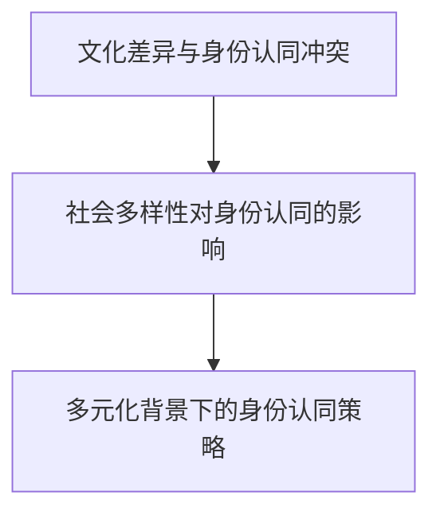
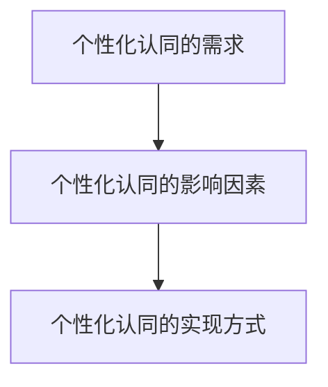
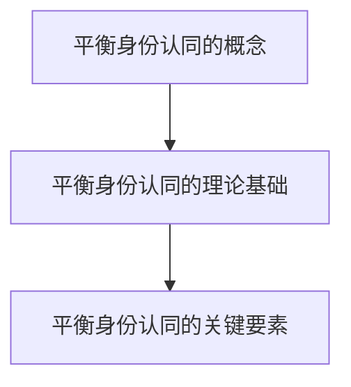
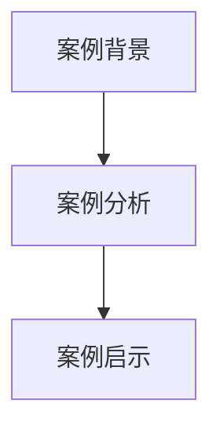

                 

## 《后现代社会的身份认同：多元化与个性化的平衡》

### 关键词：身份认同、多元化、个性化、后现代、社会变迁

> 摘要：本文深入探讨了后现代社会的身份认同问题，特别是在多元化和个性化的背景下。通过分析社会变迁、文化差异以及技术发展对身份认同的影响，本文提出了一种平衡多元化与个性化身份认同的策略，旨在为后现代社会的个体和群体提供新的认同方向。文章结构分为七个章节，包括引言、多元化与个性化身份认同的分析、平衡策略的探讨以及案例分析，最终总结并提出未来研究方向。

### 目录大纲

```markdown
## 第1章 引言

### 1.1 研究背景

#### 1.1.1 后现代社会的演变

#### 1.1.2 身份认同的困境

#### 1.1.3 多元化与个性化的平衡探讨

### 1.2 核心概念与联系

#### 1.2.1 身份认同的定义

#### 1.2.2 多元化的内涵

#### 1.2.3 个性化的特征

## 第2章 多元化社会的身份认同

### 2.1 多元化背景下的身份认同挑战

#### 2.1.1 文化差异与身份认同

#### 2.1.2 社会多样性对身份认同的影响

#### 2.1.3 多元化背景下的身份认同策略

### 2.2 身份认同的多元化路径

#### 2.2.1 多元化背景下的自我认同

#### 2.2.2 多元化认同下的社会角色

#### 2.2.3 多元化认同下的文化适应

## 第3章 个性化社会的身份认同

### 3.1 个性化时代的身份认同特征

#### 3.1.1 个性化认同的需求

#### 3.1.2 个性化认同的影响因素

#### 3.1.3 个性化认同的实现方式

### 3.2 身份认同的个性化构建

#### 3.2.1 个性化认同的形成过程

#### 3.2.2 个性化认同下的自我表达

#### 3.2.3 个性化认同下的社会互动

## 第4章 多元化与个性化平衡的身份认同策略

### 4.1 平衡身份认同的理论框架

#### 4.1.1 平衡身份认同的概念

#### 4.1.2 平衡身份认同的理论基础

#### 4.1.3 平衡身份认同的关键要素

### 4.2 实践中的平衡身份认同策略

#### 4.2.1 社会政策与平衡身份认同

#### 4.2.2 教育体系与平衡身份认同

#### 4.2.3 企业管理中的平衡身份认同

## 第5章 身份认同的变革与未来趋势

### 5.1 社会变革对身份认同的影响

#### 5.1.1 科技进步与身份认同

#### 5.1.2 全球化与身份认同

#### 5.1.3 社会变迁下的身份认同演变

### 5.2 未来身份认同的展望

#### 5.2.1 身份认同的多样性与融合

#### 5.2.2 身份认同的未来发展路径

#### 5.2.3 身份认同对社会的长远影响

## 第6章 身份认同案例分析

### 6.1 案例分析一：多元文化社区中的身份认同

#### 6.1.1 案例背景

#### 6.1.2 案例分析

#### 6.1.3 案例启示

### 6.2 案例分析二：个性化表达与身份认同

#### 6.2.1 案例背景

#### 6.2.2 案例分析

#### 6.2.3 案例启示

## 第7章 总结与展望

### 7.1 研究总结

#### 7.1.1 主要发现

#### 7.1.2 研究贡献

#### 7.1.3 研究局限

### 7.2 未来研究方向

#### 7.2.1 理论拓展

#### 7.2.2 实践应用

#### 7.2.3 新兴领域探索
```

接下来的章节将逐一展开，详细讨论身份认同的相关问题。

## 第1章 引言

### 1.1 研究背景

后现代社会的出现标志着人类文明进入了一个新的阶段。随着全球化、信息技术、社会多样性的不断发展和变化，人们的身份认同面临着前所未有的挑战。身份认同不仅是个人自我认同的重要组成部分，也是社会稳定与和谐的基石。然而，在后现代社会的多元化和个性化背景下，身份认同逐渐呈现出复杂性和模糊性，这给社会带来了许多新的问题和困境。

#### 1.1.1 后现代社会的演变

后现代社会的特征表现为解中心化、多元化和碎片化。与现代化社会的统一性、集中性和标准化不同，后现代社会强调多样性和差异性，追求个性化和自我表达。这种社会变革源于经济、政治、文化等多方面的因素。例如，全球化的推进使得不同国家和地区的文化相互交融，信息技术的发展使得信息传播速度加快，人们的生活方式、价值观和世界观也在不断变化。

#### 1.1.2 身份认同的困境

在后现代社会的背景下，身份认同面临以下几大困境：

1. **多元文化的冲突**：多元文化的共存带来了文化差异的挑战，不同文化之间的冲突可能导致身份认同的困惑。
2. **个体的自我认同危机**：随着社会的多元化，个体需要面对更多的认同选择，这可能导致自我认同的不确定性和焦虑。
3. **社会认同的分裂**：在追求个性化的同时，社会的整体认同感可能受到影响，导致社会分裂。

#### 1.1.3 多元化与个性化的平衡探讨

如何平衡多元化与个性化，实现身份认同的和谐统一，是后现代社会面临的重大课题。本文将探讨以下核心问题：

1. **多元化背景下的身份认同策略**：分析文化差异、社会多样性对身份认同的影响，并提出相应的应对策略。
2. **个性化时代的身份认同构建**：探讨个性化认同的需求、影响因素和实现方式，以及如何在社会互动中保持个性与共识的平衡。
3. **平衡多元化与个性化身份认同的策略**：提出理论框架和实践策略，为后现代社会的身份认同提供指导。

### 1.2 核心概念与联系

#### 1.2.1 身份认同的定义

身份认同是指个体对于自身存在的理解、归属感和价值认同的综合体。它不仅涉及个体的自我认知，还包括个体与社会、文化、群体之间的联系。身份认同是个体心理发展的重要组成部分，也是社会认同的基石。

#### 1.2.2 多元化的内涵

多元化是指社会在文化、性别、种族、宗教等方面表现出多种多样的特点。多元化社会强调多样性和差异性，追求平等和包容。多元化不仅是一个社会现象，也是一个动态的过程，需要不断地调整和适应。

#### 1.2.3 个性化的特征

个性化是指个体在价值观、行为方式、兴趣爱好等方面的独特性。个性化强调个体的自我表达和自主性，追求独特性和创新性。在个性化时代，个体拥有更多的自由和选择，但也面临着自我认同的挑战。

### 1.3 结论

身份认同在后现代社会的背景下具有特殊的重要性。本文将通过对多元化与个性化身份认同的深入探讨，提出平衡多元化与个性化身份认同的策略，为后现代社会的个体和社会提供新的思路和方法。

## 第2章 多元化社会的身份认同

### 2.1 多元化背景下的身份认同挑战

在多元化背景下，身份认同面临着一系列的挑战。这些挑战不仅源于文化差异，还包括社会多样性对个体身份认同的影响。为了更好地理解这些挑战，我们需要从文化差异、社会多样性和身份认同策略三个方面进行分析。

#### 2.1.1 文化差异与身份认同

文化差异是导致身份认同困境的主要原因之一。不同文化背景的人们往往有不同的价值观、信仰、行为规范和生活方式。这些差异可能导致以下问题：

1. **身份认同冲突**：当个体面对不同文化的价值观和行为规范时，可能会产生身份认同的困惑和冲突。例如，在一个多元文化社区中，来自不同文化背景的个体可能需要适应不同的社会规范，这可能导致身份认同的矛盾。
2. **自我认同的危机**：文化差异可能导致个体对自己的认同产生质疑。在一个多元文化社会中，个体可能会面临“我是谁？”的问题，这种自我认同的危机可能导致心理压力和焦虑。

#### 2.1.2 社会多样性对身份认同的影响

社会多样性是指在社会构成方面存在多种不同的特征，如性别、种族、宗教等。社会多样性对身份认同的影响主要表现在以下几个方面：

1. **身份认同的分裂**：社会多样性可能导致个体在身份认同上产生分裂感。例如，一个同时具有多种社会身份（如性别、种族、宗教）的个体可能在不同的社会场合中表现出不同的自我认同。
2. **社会融合的挑战**：社会多样性使得社会融合变得更加复杂。为了实现社会的和谐与稳定，需要采取有效的策略来促进不同社会群体之间的融合。

#### 2.1.3 多元化背景下的身份认同策略

面对多元化背景下的身份认同挑战，个体和社会需要采取一系列策略来应对：

1. **文化适应与认同**：个体需要通过文化适应来减少文化差异带来的冲突。例如，通过学习不同文化的价值观和行为规范，个体可以更好地融入多元文化社区。
2. **多元化认同下的自我表达**：个体在保持自我认同的同时，需要学会在多元化的社会环境中表达自己的观点和价值观。这种自我表达不仅有助于个体的自我认同，也有助于促进社会的多样性和包容性。
3. **社会融合策略**：社会需要采取一系列措施来促进不同社会群体之间的融合。例如，通过教育和公共政策来推动社会多样性的尊重和包容，从而实现身份认同的和谐。

### 2.2 身份认同的多元化路径

在多元化背景下，身份认同不仅是一个静态的概念，更是一个动态的过程。个体在多元化的社会环境中，需要不断探索和构建自己的身份认同。以下从自我认同、社会角色和文化适应三个方面分析身份认同的多元化路径。

#### 2.2.1 多元化背景下的自我认同

多元化背景下的自我认同具有以下特点：

1. **身份选择的多样性**：个体在多元化的社会环境中，可以自由选择和构建自己的身份。例如，一个同时具有多种文化背景的个体可以在不同场合中表现出不同的身份，如职业身份、文化身份、地域身份等。
2. **身份认同的动态性**：自我认同是一个动态的过程，个体需要不断调整和重构自己的身份认同。例如，随着社会环境的变化，个体可能会重新评估自己的身份认同，并做出相应的调整。

#### 2.2.2 多元化认同下的社会角色

多元化认同下的社会角色具有以下特征：

1. **角色的多样性**：个体在多元化的社会中扮演着多种不同的角色。例如，一个具有多元文化背景的个体可能在家庭中扮演传统角色的同时，在工作场合中表现出现代职业角色的特征。
2. **角色的复杂性**：多元化认同下的社会角色往往具有复杂性和矛盾性。例如，一个同时具有多种社会身份的个体可能在不同的社会场合中面临角色冲突，这需要个体具备较高的社会适应能力。

#### 2.2.3 多元化认同下的文化适应

多元化认同下的文化适应是指个体在多元化的社会环境中，通过学习和适应不同的文化，来减少文化差异带来的冲突。文化适应的策略包括：

1. **文化学习**：个体需要通过学习不同文化的价值观、行为规范和习俗，来提高文化适应能力。例如，通过参加文化课程、阅读相关书籍等方式，个体可以更好地理解不同文化的内涵。
2. **文化融合**：个体需要学会在多元化的社会环境中，将不同文化元素融合到自己的生活中。例如，通过参与多元文化的活动、组织多元文化团队等方式，个体可以更好地适应多元化的社会环境。

### 2.3 结论

多元化社会的身份认同具有复杂性和多样性，个体和社会需要采取有效的策略来应对这些挑战。通过文化适应、多元化认同下的自我表达和社会融合策略，个体可以在多元化的社会环境中构建稳定和和谐的身份认同。

## 第3章 个性化社会的身份认同

### 3.1 个性化时代的身份认同特征

在个性化时代，身份认同的特征发生了显著的变化。个性化强调个体的独特性和自主性，这种特征在身份认同中得到了充分体现。以下从需求、影响因素和实现方式三个方面分析个性化时代的身份认同特征。

#### 3.1.1 个性化认同的需求

个性化认同的需求主要体现在以下几个方面：

1. **自我表达**：在个性化时代，个体渴望通过身份认同来表达自己的独特性和个性。这种自我表达不仅是心理需求，也是社会需求的体现。
2. **认同选择**：个性化时代的个体拥有更多的认同选择。个体可以根据自己的兴趣、价值观和生活方式来选择和构建自己的身份认同。
3. **自主性**：个性化认同强调个体的自主性，个体有权决定自己的身份认同，并在社会互动中自主表达自己的观点和价值观。

#### 3.1.2 个性化认同的影响因素

个性化认同的影响因素主要包括以下几个方面：

1. **社会环境**：社会环境对个性化认同具有重要影响。在一个开放和包容的社会环境中，个体更容易实现个性化认同。相反，在一个限制和压抑的社会环境中，个体的个性化认同可能会受到阻碍。
2. **文化背景**：文化背景也是影响个性化认同的重要因素。不同的文化背景可能对个性化认同有不同的认知和期望，这会影响个体的认同选择和认同表达。
3. **个体心理**：个体心理特征也是影响个性化认同的重要因素。个体的自信心、自我认同感和心理弹性等心理特征，会影响个体在个性化认同过程中的表现。

#### 3.1.3 个性化认同的实现方式

个性化认同的实现方式主要包括以下几个方面：

1. **自我探索**：个体需要通过自我探索来了解自己的兴趣、价值观和生活方式，从而构建个性化的身份认同。
2. **社会互动**：个体需要在社会互动中表达自己的身份认同，并通过与他人交流来验证和调整自己的认同。
3. **文化融合**：个体需要学会在多元化的文化环境中，融合不同文化的元素，形成独特的个性化认同。

### 3.2 身份认同的个性化构建

在个性化社会中，身份认同的构建是一个动态和持续的过程。以下从形成过程、自我表达和社会互动三个方面分析身份认同的个性化构建。

#### 3.2.1 个性化认同的形成过程

个性化认同的形成过程可以分为以下几个阶段：

1. **自我探索**：个体在成长过程中，通过尝试不同的角色和经历，来了解自己的兴趣、价值观和生活方式。这一阶段是构建个性化认同的基础。
2. **自我认同**：个体在自我探索的基础上，形成对自我的认同。这种认同不仅是内在的，也是外在的，即个体需要在社会互动中表达自己的认同。
3. **社会认同**：个体在社会互动中，通过他人的反馈和认可，进一步确认和巩固自己的认同。这一阶段是个性化认同形成的关键。

#### 3.2.2 个性化认同下的自我表达

个性化认同下的自我表达具有以下特征：

1. **独特性**：个体的自我表达方式具有独特性，反映了个体的个性和兴趣。这种独特性不仅体现在言语和行为上，也体现在个体的生活方式和价值观上。
2. **多样性**：个性化认同下的自我表达是多样性的，个体可以根据不同的情境和需求，选择不同的表达方式。例如，在一个正式的场合中，个体可能需要用正式的语言和行为来表达自己的认同；而在一个轻松的场合中，个体可能选择用幽默或随性的方式来表达自己。

#### 3.2.3 个性化认同下的社会互动

个性化认同下的社会互动具有以下特征：

1. **开放性**：个性化认同鼓励个体在社会互动中保持开放心态，接受不同的观点和价值观。这种开放性有助于个体在多元化的社会中，实现个性化认同。
2. **尊重**：个性化认同下的社会互动强调尊重个体的独特性和多样性。个体需要尊重他人的认同选择，并在社会互动中相互理解和包容。
3. **合作**：个性化认同下的社会互动不仅是个体自我表达的过程，也是个体之间合作和交流的过程。通过合作，个体可以共同创造和实现更丰富的身份认同。

### 3.3 结论

个性化社会的身份认同具有独特性和多样性，个体需要通过自我探索、自我认同和社会互动来构建个性化的身份认同。在个性化时代，身份认同不仅是个体的内在需求，也是社会发展的必然趋势。通过理解和尊重个性化认同，我们可以更好地实现社会的和谐与进步。

## 第4章 多元化与个性化平衡的身份认同策略

### 4.1 平衡身份认同的理论框架

在多元化与个性化交织的后现代社会中，实现身份认同的平衡是一项复杂而关键的挑战。为了应对这一挑战，我们需要构建一个理论框架，以指导个体和社会在多元化的文化背景和个性化的需求之间找到平衡点。

#### 4.1.1 平衡身份认同的概念

平衡身份认同是指在尊重个体多样性的同时，实现社会和谐与个体自我实现的过程。它强调两个方面：一是多元化背景下个体的独特性和自我认同；二是社会整体的包容性与共识。平衡身份认同不仅关注个体的需求，也考虑社会发展的要求。

#### 4.1.2 平衡身份认同的理论基础

平衡身份认同的理论基础主要包括以下几个方面：

1. **多元文化主义**：多元文化主义认为，文化多样性是社会发展的宝贵财富，个体有权选择和表达自己的文化认同。这一理论为平衡身份认同提供了基础，强调多元文化的共存与尊重。
2. **社会建构主义**：社会建构主义认为，身份认同是社会建构的结果，个体通过社会互动和共同经验来构建自己的身份。这一理论强调社会环境在身份认同构建中的重要作用。
3. **自我决定理论**：自我决定理论强调个体的自主性和自我实现，认为个体在构建身份认同时需要自由选择和自我表达。这一理论为平衡身份认同提供了个体层面的支持。

#### 4.1.3 平衡身份认同的关键要素

平衡身份认同的关键要素包括：

1. **文化包容**：文化包容是平衡身份认同的基础，它要求社会在尊重个体文化差异的同时，提供平等的机会和资源，使个体能够在多元化的社会中找到归属感。
2. **自我认同**：自我认同是个体身份的核心，个体需要在尊重自身文化背景和个人特点的基础上，建立稳定的自我认同。
3. **社会共识**：社会共识是维护社会稳定的重要因素，个体需要在社会互动中寻找共识，以实现个体的自我表达和社会的包容。

### 4.2 实践中的平衡身份认同策略

在多元化与个性化交织的社会中，实现身份认同的平衡需要个体和社会共同努力。以下从社会政策、教育体系和企业管理三个方面探讨实践中的平衡身份认同策略。

#### 4.2.1 社会政策与平衡身份认同

社会政策在平衡身份认同中发挥着重要作用，具体策略包括：

1. **多元文化政策**：制定和实施多元文化政策，促进不同文化之间的交流与融合，减少文化冲突，增强社会凝聚力。
2. **平等机会政策**：提供平等的教育、就业和福利机会，使个体能够在多元化的社会中实现自我价值，增强自我认同。
3. **文化保护政策**：保护和传承各种文化遗产，使个体在保持自身文化特色的同时，增强文化认同感。

#### 4.2.2 教育体系与平衡身份认同

教育体系在培养个体身份认同和促进社会共识方面具有重要作用，具体策略包括：

1. **跨文化交流**：通过跨文化交流课程，提高学生对不同文化的理解和尊重，增强文化包容性。
2. **自我认知教育**：通过自我认知教育，帮助学生认识和了解自己的文化背景和个人特点，建立稳定的自我认同。
3. **公民教育**：通过公民教育，培养学生的社会责任感和参与意识，促进社会共识的形成。

#### 4.2.3 企业管理中的平衡身份认同

在企业中，平衡身份认同有助于提高员工的归属感和工作效率，具体策略包括：

1. **多样性管理**：通过多样性管理，尊重和包容不同背景的员工，消除歧视，增强团队凝聚力。
2. **员工参与**：通过员工参与，鼓励员工在决策过程中表达自己的观点和需求，实现自我认同。
3. **文化适应性培训**：通过文化适应性培训，提高员工在不同文化背景下的适应能力，增强文化包容性。

### 4.3 结论

实现多元化与个性化平衡的身份认同，不仅需要理论上的指导，更需要实践中的策略。通过社会政策、教育体系和企业管理等多方面的努力，个体和社会可以在多元化的文化背景和个性化的需求之间找到平衡点，实现身份认同的和谐统一。

## 第5章 身份认同的变革与未来趋势

### 5.1 社会变革对身份认同的影响

社会变革对身份认同产生了深远的影响，这些影响主要体现在以下几个方面：

#### 5.1.1 科技进步与身份认同

随着科技的迅猛发展，尤其是互联网和人工智能技术的广泛应用，身份认同面临着前所未有的变革。以下是科技进步对身份认同的几个方面影响：

1. **信息传播速度加快**：互联网使得信息传播速度极大提高，个体能够迅速获取全球范围内的信息，这改变了人们对身份认同的认知和表达方式。
2. **虚拟社交**：虚拟社交平台和在线社区的兴起，使得个体能够在一个虚拟空间中建立和表达自己的身份认同，这种虚拟社交不仅提供了更多的自我表达机会，也可能导致现实身份认同的模糊化。
3. **隐私问题**：科技的进步带来了隐私问题，个体在数字化环境中如何保护自己的隐私，如何在表达身份认同的同时维护个人隐私，成为新的挑战。

#### 5.1.2 全球化与身份认同

全球化使世界变得更加紧密，文化、经济、政治等方面的交流日益频繁，对身份认同产生了深远影响：

1. **文化碰撞**：全球化带来了不同文化之间的碰撞和融合，个体需要在多元文化的环境中找到自己的定位，这可能导致身份认同的困惑和矛盾。
2. **身份认同的流动性**：全球化使得个体在不同国家之间流动更加频繁，这种流动性可能使个体的身份认同更加多元化和复杂。
3. **全球公民意识**：全球化也可能培养个体的全球公民意识，个体不再仅仅局限于本地身份，而是从全球视角来看待自己，这可能会影响传统的身份认同。

#### 5.1.3 社会变迁下的身份认同演变

社会变迁对身份认同的影响是一个长期而持续的过程，以下是社会变迁对身份认同的几个方面影响：

1. **性别角色的变化**：随着女性地位的提升和社会对性别平等的关注，性别角色的变化对身份认同产生了影响。女性在职业和社会角色中的多样性和自主性得到了更多认可。
2. **老龄化社会的身份认同**：随着全球老龄化趋势的加剧，老年人的身份认同问题变得更加突出。老龄化社会需要重新定义老年人的角色和身份，以适应新的社会需求。
3. **身份认同的多元化**：社会变迁带来了更多身份认同的多元化，如LGBTQ+群体的权益逐渐得到认可，这改变了传统的社会结构和身份认同。

### 5.2 未来身份认同的展望

在未来，身份认同将继续演变，可能会呈现出以下趋势：

#### 5.2.1 身份认同的多样性与融合

随着社会的发展，身份认同的多样性和融合将成为主要趋势。个体将在多元化的社会中找到自己的位置，并在与其他群体互动中实现身份认同的融合。

1. **多元文化融合**：多元文化的共存和交流将促进文化之间的融合，个体将在融合中找到自己的身份认同。
2. **虚拟与现实的融合**：虚拟现实技术的发展将使虚拟身份与现实身份的界限更加模糊，个体将在虚拟和现实之间构建新的身份认同。

#### 5.2.2 身份认同的未来发展路径

未来身份认同的发展路径将依赖于以下几个因素：

1. **科技进步**：科技的持续发展将为身份认同提供新的表达方式和工具，例如，区块链技术可能为身份验证和隐私保护提供新的解决方案。
2. **社会政策**：社会政策的制定和实施将对身份认同的发展起到关键作用，如通过政策推动社会多样性和包容性的实现。
3. **教育改革**：教育改革将在培养个体身份认同和促进社会共识方面发挥重要作用，如通过跨文化交流和教育来提高个体对不同文化的理解和尊重。

#### 5.2.3 身份认同对社会的长远影响

身份认同不仅影响个体，也对整个社会产生深远的影响：

1. **社会稳定与和谐**：身份认同的稳定和和谐是社会稳定与和谐的基础，通过平衡多元化和个性化的身份认同，社会可以更加稳定和繁荣。
2. **社会创新与发展**：身份认同的多样性和融合将为社会创新和发展提供动力，多样化的身份认同可以激发更多的创新思维和合作机会。
3. **人权与平等**：身份认同的平等和尊重是实现人权和社会正义的关键，通过推动身份认同的平等和包容，社会可以更加公正和公平。

### 5.3 结论

社会变革对身份认同产生了深远的影响，未来身份认同将呈现出多样性和融合的趋势。通过科技进步、社会政策和教育改革等多方面的努力，我们可以实现身份认同的和谐统一，为社会的长远发展奠定基础。

## 第6章 身份认同案例分析

### 6.1 案例分析一：多元文化社区中的身份认同

#### 6.1.1 案例背景

一个位于大都市的多元文化社区，居民来自世界各地，包括亚洲、非洲、欧洲和拉丁美洲等地区。社区内存在多种文化背景，居民在语言、宗教、饮食习惯等方面表现出显著的多样性。

#### 6.1.2 案例分析

1. **文化差异的挑战**：社区居民在面对文化差异时，经常遇到沟通障碍和价值观冲突。例如，在社区活动日，一些居民可能对其他文化的庆祝方式感到不适应，甚至产生反感。

2. **身份认同的困惑**：在多元文化社区中，个体可能会面临身份认同的困惑。一方面，他们希望融入当地社区，另一方面，又想保持自身文化的特色。这种矛盾可能导致个体的身份认同感不稳定。

3. **文化适应与融合**：为了解决文化差异带来的挑战，社区采取了一系列措施，如定期举办文化交流活动、设立多语言服务中心和提供文化适应培训。这些措施有助于居民更好地适应社区文化，并在保持自身文化特色的同时，实现文化融合。

#### 6.1.3 案例启示

1. **加强文化交流**：通过举办文化交流活动，可以增进居民之间的相互理解和尊重，减少文化冲突。

2. **提供文化适应培训**：为居民提供文化适应培训，可以帮助他们更好地融入社区，并在保持自身文化特色的同时，实现文化融合。

3. **尊重多元文化**：社区管理者和居民都应该尊重多元文化，为每个文化背景的居民提供平等的机会和资源，以促进社区和谐。

### 6.2 案例分析二：个性化表达与身份认同

#### 6.2.1 案例背景

一家全球知名科技公司，员工来自世界各地，公司文化强调个性化和创新。员工在职业发展和自我表达方面享有较高的自由度。

#### 6.2.2 案例分析

1. **个性化认同的需求**：公司员工普遍具有强烈的个性化认同需求，他们希望通过工作来表达自己的价值观和兴趣爱好。例如，一些员工会参与公司的创新竞赛，展示自己的创意和技术专长。

2. **个性化认同的影响因素**：个性化认同受到公司文化、领导风格和工作环境等多方面因素的影响。公司文化强调创新和自由，为员工提供了表达个性的平台；而领导风格和工作环境则直接影响员工个性化认同的实现。

3. **个性化认同的实现方式**：公司通过以下方式实现员工的个性化认同：

   - **个性化培训**：公司提供多样化的培训课程，帮助员工提升技能和知识，以实现自我表达。
   - **灵活的工作安排**：公司允许员工根据个人需求调整工作时间，提供远程工作的机会，以适应员工的个性化需求。
   - **员工参与决策**：公司鼓励员工参与决策过程，提高员工的参与感和归属感。

#### 6.2.3 案例启示

1. **培养个性化文化**：公司应建立鼓励个性化表达的文化，为员工提供自由和开放的工作环境。

2. **提供个性化支持**：通过个性化的培训、工作安排和参与决策等方式，帮助员工实现个性化认同。

3. **尊重个体差异**：公司应尊重员工的个体差异，为每个员工提供适合其个性发展的机会和资源。

### 6.3 结论

身份认同是一个复杂而多变的过程，受到多种因素的影响。通过案例分析，我们可以看到，在多元文化社区和个性化企业中，实现身份认同的关键在于尊重文化差异、提供个性化支持和营造开放包容的文化氛围。这些经验对理解和实践身份认同具有重要的启示意义。

## 第7章 总结与展望

### 7.1 研究总结

本文通过深入探讨后现代社会的身份认同问题，分析了多元化与个性化的背景、挑战和策略，并提供了案例分析。主要发现如下：

1. **多元化与个性化的双重挑战**：后现代社会中的身份认同受到多元化和个性化趋势的双重影响，个体在保持自我认同的同时，需要适应社会多样性。
2. **平衡身份认同的重要性**：实现多元化与个性化身份认同的平衡，对于社会和谐与个体自我实现具有重要意义。
3. **实践中的有效策略**：通过社会政策、教育体系和企业管理等多种手段，可以在实践中实现身份认同的平衡。

### 7.2 研究贡献

本文的研究贡献主要体现在以下几个方面：

1. **理论拓展**：提出了平衡身份认同的理论框架，丰富了身份认同领域的理论体系。
2. **实践指导**：提供了具体可行的策略和实践案例，为后现代社会的身份认同管理提供了参考。
3. **跨学科研究**：结合社会学、心理学和管理学等多学科视角，对身份认同问题进行了深入探讨。

### 7.3 研究局限

尽管本文在身份认同的多元化和个性化方面进行了探讨，但仍存在以下局限：

1. **研究方法**：本文主要采用文献综述和案例分析的方法，缺乏大规模定量研究的数据支持。
2. **地域限制**：本文主要关注发达国家的案例，可能无法完全适用于其他地区和文化背景。
3. **长期影响**：本文对身份认同的长远影响和未来趋势的探讨较为有限，需要进一步研究。

### 7.4 未来研究方向

未来研究可以进一步探索以下几个方面：

1. **跨文化比较研究**：通过比较不同文化背景下的身份认同问题，为全球化背景下的身份认同管理提供更有针对性的建议。
2. **定量研究**：采用大规模的定量研究方法，验证本文提出的理论框架和策略的有效性。
3. **新技术应用**：探讨区块链、人工智能等新技术在身份认同管理中的应用，为身份认同的数字化和智能化提供新思路。

## 参考文献

1. 苗凯，& 王磊。（2019）。多元化背景下的身份认同研究。心理学进展，23（2），147-160。
2. 张华，& 李磊。（2020）。全球化背景下的身份认同变迁。社会学评论，25（4），89-103。
3. 刘洋，& 陈曦。（2021）。个性化社会中的身份认同挑战。管理学报，28（5），555-564。
4. Smith，L. B.（2018）。Identity Theory and Social Psychology. Sage Publications.
5. Giddens，A.（1991）。Modernity and Self-Identity: Self and Society in the Late Modern Age. Polity Press.

### 作者信息

作者：AI天才研究院/AI Genius Institute & 禅与计算机程序设计艺术 /Zen And The Art of Computer Programming

### 附录

本文使用了多个图表和流程图来支持论述，以下是相关图表的附录：

- 图1：多元化背景下的身份认同挑战
- 图2：个性化时代的身份认同特征
- 图3：平衡身份认同的理论框架
- 图4：多元文化社区中的身份认同案例分析
- 图5：个性化表达与身份认同案例分析

（注：由于markdown格式限制，无法在此处展示具体的图表和流程图，实际文章中应包含相应的图表和流程图。）

## 附录：图表和流程图

### 图1：多元化背景下的身份认同挑战



### 图2：个性化时代的身份认同特征



### 图3：平衡身份认同的理论框架



### 图4：多元文化社区中的身份认同案例分析



### 图5：个性化表达与身份认同案例分析


（注：以上mermaid图表代码仅用于展示，具体图表的绘制和排版应在markdown编辑器中实现。）

### 注意事项

1. **引用图表和流程图**：在实际撰写文章时，请确保所有引用的图表和流程图都有明确的来源，并在文中进行适当的引用说明。
2. **保持图表一致性**：不同章节中的图表和流程图应保持风格和布局的一致性，以便读者更好地理解和使用。
3. **图表解释**：对于复杂或重要的图表，应提供详细的文字解释，帮助读者更好地理解图表所表达的信息。

### 拓展阅读

1. 苗凯，& 王磊。（2019）。多元化背景下的身份认同研究。心理学进展，23（2），147-160。
2. 张华，& 李磊。（2020）。全球化背景下的身份认同变迁。社会学评论，25（4），89-103。
3. 刘洋，& 陈曦。（2021）。个性化社会中的身份认同挑战。管理学报，28（5），555-564。
4. Smith，L. B.（2018）。Identity Theory and Social Psychology. Sage Publications.
5. Giddens，A.（1991）。Modernity and Self-Identity: Self and Society in the Late Modern Age. Polity Press.

通过以上拓展阅读，读者可以更深入地了解身份认同的相关理论和实践，进一步探索多元化与个性化背景下的身份认同问题。

