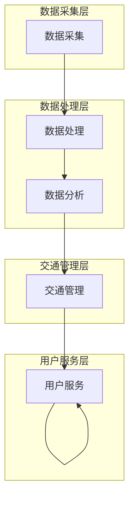

                 

## 引言

《后现代语境下的价值观重建：不确定性中的确定性追求》是一本探讨现代社会价值观重建问题的专著，由世界著名人工智能专家、程序员、软件架构师、CTO和世界顶级技术畅销书作家共同撰写。这本书旨在通过深入分析后现代语境下价值观重建的必要性、过程与方法，以及在不同领域的实践与应用，为读者提供一种新的思考框架和行动指南。

在现代社会，随着科技的迅猛发展和全球化进程的加速，人们面临着前所未有的复杂性和不确定性。传统价值观体系在面对这些挑战时显得力不从心，出现了种种困境。因此，如何在后现代语境下重建符合时代需求的价值观，成为当今社会亟待解决的问题。

本书围绕这一主题，从背景与理论基础、重建过程与方法、实践与应用三个部分展开论述。首先，通过介绍后现代主义的起源与发展、不确定性与价值观的关系，为读者奠定理论基础。接着，详细探讨文化多元性中的价值观整合、社会变迁中的价值观重建、科技进步与价值观重建等关键议题。最后，结合教育、企业管理、社会治理等领域的实际案例，阐述价值观重建的具体实践与应用。

通过本书的阅读，读者将深入了解后现代语境下价值观重建的必要性和紧迫性，掌握相关理论和方法，为解决现代社会中的价值观困境提供有力的理论支持和实践指导。

## 第1章：后现代主义与价值观重建

### 1.1 后现代主义的起源与发展

#### 1.1.1 后现代主义的起源

后现代主义作为一种思想文化运动，起源于20世纪初的西方社会。它是对现代主义文化和思想的一种反思与批判。现代主义强调理性、科学和个体主义，而后现代主义则质疑这些价值观的绝对性和普适性，提倡多元、复杂和不确定性。

后现代主义的起源可以追溯到20世纪60年代的法国。当时，法国知识分子们对现代社会的种种弊病感到不满，开始质疑现代主义的理论和实践。他们批评现代主义的理性主义和科学主义，认为它们忽视了人类的情感、文化差异和社会现实。这种批判引发了广泛的思想解放和文化革新，为后现代主义的兴起奠定了基础。

#### 1.1.2 后现代主义的发展历程

后现代主义的发展历程可以分为几个阶段：

1. **早期后现代主义（1960s-1980s）**：这一阶段的后现代主义主要关注文化、文学和艺术领域。代表人物有米歇尔·福柯（Michel Foucault）、雅克·德里达（Jacques Derrida）和让-弗朗索瓦·利奥塔（Jean-François Lyotard）等。他们通过解构主义、批判理论和叙事学等方法，挑战了现代主义的权威和中心主义，提出了多元化的观点和价值观。

2. **中期后现代主义（1980s-2000s）**：随着后现代主义思想在哲学、社会科学和人文科学等领域的广泛应用，它开始影响到政治、经济和文化等更广泛的领域。这一阶段的后现代主义强调社会建构、全球化、去中心化和多元文化主义。代表人物有朱迪斯·巴特勒（Judith Butler）、阿帕杜拉伊·古塔（Arjun Appadurai）和齐格蒙特·鲍曼（Zygmunt Bauman）等。

3. **当代后现代主义（2000s至今）**：在当代，后现代主义继续演变，与新技术、新媒体和全球化等趋势相互交织。它关注网络社会、虚拟现实、生物技术等新兴领域，提出了一系列新的理论和观点。代表人物有布鲁诺·拉图尔（Bruno Latour）、安东尼·吉登斯（Anthony Giddens）和尼古拉斯·尼葛洛庞帝（Nicholas Negroponte）等。

#### 1.1.3 后现代主义的核心观点

后现代主义的核心观点包括以下几个方面：

1. **解构主义**：后现代主义强调对现代主义中心主义的解构，质疑权威和绝对真理的存在。它主张通过批判和反思，揭示不同观念和价值观背后的权力关系。

2. **多元文化主义**：后现代主义认为，文化是多元的、动态的和相互影响的。它反对文化同质化和单一文化的霸权，提倡尊重和保护各种文化差异。

3. **社会建构主义**：后现代主义认为，社会现实是由人们共同建构的，而不是客观存在的。它强调社会建构的过程和机制，认为社会现实是可变的和可协商的。

4. **不确定性**：后现代主义强调不确定性、复杂性和不可预测性。它认为，现代社会充满了不确定性和风险，需要适应和应对这些挑战。

### 1.2 价值观重建的必要性与意义

#### 1.2.1 当代社会的价值观困境

当代社会面临着一系列价值观困境，主要体现在以下几个方面：

1. **伦理危机**：随着科技的发展和全球化的加速，传统伦理观念受到冲击，出现了伦理真空和道德沦丧的现象。

2. **社会分裂**：文化差异、政治分歧和经济发展不平衡导致社会分裂，价值观冲突加剧，社会凝聚力减弱。

3. **环境危机**：全球气候变化、资源枯竭和生态破坏等问题使人类面临严重的环境危机，传统价值观难以解决这些问题。

4. **个人困惑**：现代社会的快节奏、竞争压力和不确定性使个体感到困惑和焦虑，传统价值观无法提供有效的心理支持。

#### 1.2.2 价值观重建的必要性

在当代社会，价值观重建具有以下几个必要性：

1. **应对不确定性**：面对复杂多变的社会环境，需要重建一种能够适应不确定性的价值观体系。

2. **促进社会和谐**：价值观重建有助于缓解社会分裂，促进社会和谐与稳定。

3. **实现可持续发展**：价值观重建有助于引导人类关注环境保护和资源节约，实现可持续发展。

4. **提升个体幸福感**：价值观重建有助于个体应对快节奏的生活压力，提高幸福感。

#### 1.2.3 价值观重建的意义

价值观重建对当代社会具有重要意义：

1. **文化传承与创新**：价值观重建有助于传承优秀传统文化，同时促进文化创新和发展。

2. **社会进步**：价值观重建有助于推动社会进步，实现社会公平正义和人类全面发展。

3. **个体发展**：价值观重建有助于个体树立正确的人生观、价值观和世界观，实现个人价值。

### 1.3 后现代语境下的价值观特点

#### 1.3.1 不确定性的价值观

在后现代语境下，不确定性成为价值观的重要组成部分。人们意识到，世界是复杂、多元和不确定的，因此需要建立一种适应不确定性的价值观。这种价值观强调灵活性、适应性和创新性，鼓励个体和集体在面对不确定性时勇于探索和尝试。

#### 1.3.2 平等与多元的价值观

后现代语境下的价值观强调平等和多元。人们认识到，不同文化、种族、性别和社会阶层之间存在差异，需要尊重和包容这些差异。平等和多元的价值观有助于消除歧视和偏见，促进社会和谐与稳定。

#### 1.3.3 个体自由与责任价值观

在后现代语境下，个体自由和责任成为价值观的核心。人们倡导个体自由，主张个体有权自主选择生活方式和价值观。同时，个体也需承担相应的责任，为社会的和谐与稳定作出贡献。

综上所述，后现代语境下的价值观重建是一个复杂而重要的任务。通过反思和重构传统价值观，我们可以建立一个更加适应现代社会需求的新价值观体系，为人类社会的可持续发展提供有力的支持。在接下来的章节中，我们将进一步探讨不确定性与价值观的关系、文化多元性中的价值观整合、社会变迁中的价值观重建和科技进步与价值观重建等议题。

## 第2章：不确定性与价值观

### 2.1 不确定性的概念与表现

#### 2.1.1 不确定性的定义

不确定性是指未来事件的发生概率无法准确预测或确定的状态。在现实生活中，不确定性无处不在，从个人生活的决策到国家政策的制定，都面临着各种不确定性。不确定性可以分为客观不确定性和主观不确定性。客观不确定性是指事件的发生概率本身就不确定，例如自然灾害、金融市场波动等。主观不确定性是指个体对事件发生概率的主观判断，由于个体认知能力的限制，往往会产生误差。

#### 2.1.2 不确定性的表现形式

1. **随机性**：随机性是指事件的发生具有偶然性，无法预测。例如，掷骰子的结果是无法预测的。

2. **复杂性**：复杂性是指事件之间相互作用和影响难以用简单的关系来描述。例如，全球气候变暖是由多种因素共同作用的结果。

3. **模糊性**：模糊性是指事件的具体内容和形式不清晰，难以明确界定。例如，企业未来的发展方向可能存在多种可能性。

4. **不可预测性**：不可预测性是指事件的发生无法准确预测。例如，疫情的爆发和传播过程具有高度不确定性。

#### 2.1.3 不确定性的影响

不确定性的影响体现在以下几个方面：

1. **决策困难**：由于不确定性，决策者往往难以做出最优决策，可能会导致决策失误。

2. **风险增加**：不确定性增加了风险，使得个体和企业面临更大的不确定性。

3. **心理压力**：面对不确定性，个体可能会感到焦虑、恐惧和不安。

4. **社会冲突**：不确定性可能导致不同利益群体的冲突和矛盾。

### 2.2 不确定性的影响与应对策略

#### 2.2.1 不确定性对个体的影响

不确定性对个体的影响主要体现在以下几个方面：

1. **决策困难**：个体在面临不确定性时，往往难以做出明确的决策，可能会导致拖延和犹豫。

2. **心理压力**：不确定性可能引起个体的焦虑、恐惧和不安，影响心理健康。

3. **机会成本**：个体在应对不确定性时，可能会错失一些潜在的机会。

4. **适应能力**：个体需要具备较强的适应能力，以应对不确定性带来的挑战。

#### 2.2.2 不确定性对组织的影响

不确定性对组织的影响主要体现在以下几个方面：

1. **战略规划**：组织在制定战略规划时，需要考虑不确定性因素，可能会导致战略调整。

2. **风险管理**：组织需要制定有效的风险管理策略，以降低不确定性带来的风险。

3. **资源分配**：不确定性可能导致资源的重新分配，影响组织的运营和效率。

4. **员工绩效**：不确定性可能影响员工的绩效和工作积极性。

#### 2.2.3 应对不确定性的策略

为了应对不确定性，个体和组织可以采取以下策略：

1. **风险规避**：通过避免高风险的活动来减少不确定性。

2. **风险分散**：通过多元化投资和多样化经营来分散风险。

3. **风险转移**：通过保险等方式将风险转移给第三方。

4. **风险控制**：通过建立风险管理机制，降低不确定性带来的负面影响。

5. **适应性策略**：通过灵活调整策略和应对措施，适应不确定性的变化。

6. **心理调适**：通过心理辅导和情绪管理，减轻不确定性带来的心理压力。

### 2.3 不确定性语境下的价值观构建

#### 2.3.1 价值观构建的挑战

在不确定性语境下，价值观构建面临以下挑战：

1. **多元价值观**：不确定性导致多元价值观并存，如何整合这些价值观成为难题。

2. **文化差异**：不同文化背景下，人们对不确定性的理解和应对方式存在差异，如何实现文化融合成为挑战。

3. **道德困境**：不确定性可能导致道德困境，如何平衡道德原则和现实需求成为难题。

4. **伦理冲突**：不确定性可能引发伦理冲突，如何处理这些冲突成为挑战。

#### 2.3.2 价值观构建的原则

在不确定性语境下，价值观构建应遵循以下原则：

1. **包容性**：尊重多元价值观，实现文化包容。

2. **灵活性**：价值观应具备灵活性，适应不确定性变化。

3. **可持续性**：价值观应关注可持续发展，实现经济、社会和环境的平衡。

4. **道德性**：价值观应体现道德原则，推动社会公正和人类福祉。

5. **实用性**：价值观应具备实用性，能够指导个体和组织的实际行为。

#### 2.3.3 价值观构建的策略

在不确定性语境下，构建价值观可以采取以下策略：

1. **教育引导**：通过教育引导，提高个体对不确定性的认识和理解，培养适应能力。

2. **文化对话**：通过文化对话，促进不同文化之间的交流和融合，减少文化冲突。

3. **制度保障**：通过制度保障，确保价值观的落实和执行，推动社会和谐与稳定。

4. **创新驱动**：通过创新驱动，激发个体和组织的创造力，适应不确定性环境。

5. **合作共享**：通过合作共享，实现资源整合和优势互补，降低不确定性风险。

总之，在不确定性语境下，价值观的构建是一个复杂而重要的任务。通过深入分析和思考，我们可以建立一个适应现代社会需求的新价值观体系，为人类社会的可持续发展提供有力支持。在接下来的章节中，我们将进一步探讨文化多元性中的价值观整合、社会变迁中的价值观重建和科技进步与价值观重建等议题。

## 第3章：文化多元性中的价值观整合

### 3.1 文化多元性的现象与影响

#### 3.1.1 文化多元性的定义

文化多元性是指在一个社会中，存在多种不同的文化背景、价值观和习俗。这些文化背景可能来源于不同的种族、民族、宗教、地区和群体。文化多元性反映了人类社会的多样性和丰富性，体现了各种文化之间的交流和融合。

#### 3.1.2 文化多元性的现象

随着全球化的推进，文化多元性在现代社会中日益显著，具体表现在以下几个方面：

1. **人口流动**：随着移民和国际化的发展，不同文化背景的人群在同一个社会中生活和工作，形成了多元文化的社区。

2. **文化交流**：通过互联网、媒体和旅游等活动，不同文化之间进行广泛的交流和互动，促进了文化的传播和融合。

3. **文化多样性**：在各个领域，如艺术、音乐、食品、节日和宗教信仰等方面，不同文化的元素相互融合，形成了独特的文化现象。

4. **文化冲突**：文化多元性也可能导致文化冲突，不同文化之间的价值观和习俗可能产生矛盾和分歧。

#### 3.1.3 文化多元性的影响

文化多元性对社会产生深远影响，主要体现在以下几个方面：

1. **社会稳定**：文化多元性有助于促进社会的稳定和和谐，通过尊重和包容不同文化，减少文化冲突和矛盾。

2. **经济发展**：文化多元性为经济发展提供了新的动力和机遇，通过文化交流和融合，可以创造新的市场和商机。

3. **文化创新**：文化多元性促进了文化的创新和发展，不同文化的交流和碰撞激发了新的创意和思想。

4. **社会问题**：文化多元性也可能带来一些社会问题，如文化冲突、身份认同危机和文化霸权等。

### 3.2 价值观整合的原则与策略

#### 3.2.1 价值观整合的原则

在文化多元性的背景下，进行价值观整合应遵循以下原则：

1. **尊重多样性**：尊重不同文化的多样性，承认各种文化都有其存在的价值和意义。

2. **平等对待**：在价值观整合过程中，应平等对待各种文化，避免文化歧视和偏见。

3. **包容性**：包容不同文化的差异，通过对话和交流，实现文化的相互理解和尊重。

4. **可持续性**：价值观整合应考虑长期发展，确保文化的传承和创新。

5. **道德性**：价值观整合应体现道德原则，推动社会公正和人类福祉。

#### 3.2.2 价值观整合的策略

为了实现价值观的整合，可以采取以下策略：

1. **文化教育**：通过文化教育，提高个体对多元文化的认识和理解，培养文化素养和包容心态。

2. **文化交流**：促进不同文化之间的交流和互动，通过文化节、学术交流、艺术展览等活动，增进文化了解和认同。

3. **法律保障**：通过立法和政策措施，保障各种文化的平等权利和自由，防止文化歧视和冲突。

4. **制度创新**：在政治、经济和社会制度中，融入多元文化的理念，实现文化的公平和正义。

5. **社区参与**：鼓励社区成员积极参与文化活动和公共事务，共同营造多元文化的社区环境。

6. **国际合作**：通过国际合作，促进全球范围内的文化整合和共享，共同应对文化挑战。

### 3.3 多元文化中的价值观调适

#### 3.3.1 价值观调适的必要性

在多元文化的背景下，个体和组织需要调适自己的价值观，以适应新的环境和文化。价值观调适的必要性体现在以下几个方面：

1. **文化适应**：为了在多元文化环境中生存和发展，个体和组织需要适应不同的文化价值观和习俗。

2. **冲突解决**：价值观调适有助于减少文化冲突，促进不同文化之间的和谐与合作。

3. **个人成长**：价值观调适可以促进个体的自我反思和成长，培养开放和包容的心态。

4. **组织发展**：价值观调适有助于组织建立多元文化的团队，提高组织的创新能力和竞争力。

#### 3.3.2 价值观调适的方法

个体和组织可以通过以下方法进行价值观调适：

1. **文化敏感训练**：通过培训和学习，提高个体对多元文化的敏感度和理解能力。

2. **跨文化沟通**：通过有效的跨文化沟通，增进不同文化之间的理解和信任。

3. **文化融合**：将不同文化的价值观融合到个人的价值观体系中，形成新的文化认同。

4. **反思与自我调适**：通过反思自己的价值观和行为，识别和纠正文化偏见和误解。

5. **文化适应策略**：制定适应多元文化的策略和行动计划，提高个体的文化适应能力。

总之，在文化多元性的背景下，价值观整合和调适是一个复杂而重要的任务。通过尊重多样性、平等对待、包容性和可持续性，我们可以实现文化的和谐与共融，为社会的可持续发展提供坚实的价值观基础。在接下来的章节中，我们将探讨社会变迁中的价值观重建、科技进步与价值观重建等议题。

## 第4章：社会变迁中的价值观重建

### 4.1 社会变迁的趋势与挑战

#### 4.1.1 社会变迁的趋势

社会变迁是指社会结构、关系和价值观等方面的持续变化和发展。在现代社会，社会变迁呈现出以下几个显著趋势：

1. **全球化**：全球化使不同国家和地区的经济、文化和社会联系日益紧密，促进了全球范围内的资源共享和互动。

2. **技术进步**：科技的快速发展，特别是互联网和人工智能的应用，深刻改变了人们的生活方式和社会结构。

3. **人口老龄化**：随着医疗条件的改善和生活水平的提高，全球范围内的人口老龄化现象日益严重。

4. **文化多元化**：文化多元化反映了现代社会中不同文化背景和价值观的共存与交融。

5. **环境危机**：环境危机，如气候变化、资源枯竭和生态破坏，对人类社会的可持续发展构成了严峻挑战。

#### 4.1.2 社会变迁的挑战

社会变迁带来了许多挑战，这些挑战对传统价值观体系构成了巨大冲击：

1. **伦理困境**：随着科技进步和全球化的发展，一些传统伦理观念受到质疑，如人工智能的伦理问题、数据隐私和信息安全等。

2. **社会分裂**：文化差异、经济不平等和政治分歧导致社会分裂，加剧了社会矛盾和冲突。

3. **个人焦虑**：社会变迁带来的不确定性加剧了人们的焦虑和压力，传统价值观难以提供有效的心理支持。

4. **环境危机**：环境危机要求人们重新审视和调整与自然的关系，传统价值观在应对这些挑战方面显得力不从心。

### 4.2 社会变迁中的价值观重建路径

#### 4.2.1 价值观重建的路径

在社会变迁中，价值观重建需要采取以下路径：

1. **反思与批判**：反思传统价值观的局限性，批判其不合理和过时的部分，为新的价值观体系奠定基础。

2. **适应与创新**：在新的社会环境中，价值观需要适应变化，同时不断创新，以应对新的挑战。

3. **多元包容**：价值观重建应包容多元文化，尊重不同群体的价值观和生活方式，促进社会和谐。

4. **可持续性**：价值观重建应关注可持续发展，促进经济、社会和环境的平衡，实现长期繁荣。

5. **道德重建**：在社会变迁中，重建道德价值观至关重要，以引导个体和集体行为，维护社会公正和人类福祉。

#### 4.2.2 价值观重建的实践

在社会变迁中，价值观重建可以通过以下实践来实现：

1. **教育**：通过教育，培养个体对多元文化的理解和包容，提高道德素养和责任感。

2. **政策制定**：通过制定和调整政策，促进社会公正和公平，减少不平等和歧视。

3. **社会参与**：鼓励个体和社会组织积极参与社会事务，共同推动社会进步。

4. **文化创新**：通过文化创新，促进文化的多样性和创新，丰富社会生活。

5. **环境保护**：通过环境保护活动，提高人们对自然价值的认识，促进可持续发展。

### 4.3 社会变迁中的价值观重建案例

#### 4.3.1 案例一：教育领域的价值观重建

随着全球化和科技进步，教育领域面临着新的挑战和机遇。教育价值观的重建需要适应新的社会环境，具体实践如下：

1. **素质教育**：强调培养学生的全面素质，包括道德、智力、体魄和社交能力。

2. **多元化教育**：鼓励多元文化的交流和融合，培养学生的全球视野和文化素养。

3. **创新教育**：培养学生的创新意识和创新能力，适应快速变化的社会。

4. **终身教育**：提倡终身学习，帮助个体不断适应社会变迁。

#### 4.3.2 案例二：企业管理的价值观重建

在企业管理中，价值观重建对于应对社会变迁至关重要。具体实践如下：

1. **可持续发展**：企业应关注环境保护和社会责任，实现可持续发展。

2. **多元化管理**：鼓励员工多元化，尊重员工的个性和差异，促进团队协作。

3. **创新文化**：营造创新文化，鼓励员工提出新的想法和改进措施。

4. **道德管理**：强调道德和诚信，建立透明和公正的企业文化。

通过社会变迁中的价值观重建，我们可以建立一个更加适应现代社会的价值观体系，为社会的可持续发展提供坚实的道德和伦理基础。在接下来的章节中，我们将探讨科技进步与价值观重建的关系。

## 第5章：科技进步与价值观重建

### 5.1 科技进步的现状与趋势

#### 5.1.1 科技进步的定义

科技进步是指通过科学研究、技术创新和工程应用，推动科技水平的不断提升和突破。它涵盖了多个领域，包括信息技术、生物技术、新能源技术、材料科学等。科技进步不仅改变了人类的生活方式，也对社会结构和价值观产生了深远影响。

#### 5.1.2 科技进步的现状

1. **信息技术**：互联网、大数据、云计算和人工智能技术的快速发展，使得信息传播和处理更加高效和便捷。

2. **生物技术**：基因编辑、生物制药和生物材料等技术的突破，为医学、农业和环境保护等领域带来了新的机遇。

3. **新能源技术**：太阳能、风能、核能等新能源技术的不断进步，为应对能源危机和环境污染提供了新的解决方案。

4. **材料科学**：纳米材料、高分子材料和智能材料等新型材料的研究和开发，推动了科技产品和工业生产的创新。

#### 5.1.3 科技进步的趋势

1. **智能化**：智能化技术，如人工智能、物联网和自动驾驶等，将成为未来科技发展的主流。

2. **绿色化**：随着环保意识的增强，绿色科技和可持续发展将成为科技进步的重要方向。

3. **集成化**：通过系统集成和融合，不同领域的技术将相互促进，实现更高效的应用和更大的突破。

4. **全球化**：科技进步的全球化趋势将加强，各国之间的科技合作和交流将更加频繁。

### 5.2 科技进步对价值观的挑战与机遇

#### 5.2.1 挑战

1. **伦理困境**：科技进步带来了许多伦理问题，如人工智能的道德责任、基因编辑的伦理边界、网络安全和隐私保护等。

2. **社会分裂**：科技进步可能加剧社会不平等，如数字鸿沟、智能失业和社会分层等问题。

3. **文化冲突**：科技进步可能引发文化冲突，如跨文化技术交流中的文化差异和价值碰撞。

4. **环境危机**：科技进步虽然有助于解决环境问题，但也可能带来新的环境挑战，如新能源技术对生态系统的潜在影响。

#### 5.2.2 机遇

1. **伦理进步**：科技进步可以为伦理问题提供新的解决方案，如通过人工智能和大数据分析，提升道德决策的准确性。

2. **社会融合**：科技进步有助于缩小社会差距，促进社会融合，如通过互联网和远程教育，提高教育资源的公平性。

3. **文化创新**：科技进步可以激发文化创新，如通过虚拟现实和增强现实技术，创造新的文化体验和艺术形式。

4. **环境保护**：科技进步可以推动环境保护和可持续发展，如通过绿色能源技术和环保材料，减少环境污染和资源浪费。

### 5.3 科技进步背景下的价值观重建策略

#### 5.3.1 增强伦理意识

1. **伦理教育**：通过教育培养公众的伦理意识，提高对科技进步伦理问题的认识。

2. **伦理审查**：在科技研发和应用过程中，建立伦理审查机制，确保科技进步符合伦理原则。

3. **伦理规范**：制定科技伦理规范，明确科技活动的伦理边界和责任。

#### 5.3.2 促进社会融合

1. **公平机遇**：通过政策和支持措施，确保科技进步带来的机遇公平分配，减少社会不平等。

2. **数字素养**：提高公众的数字素养，促进科技普及和技能提升，缩小数字鸿沟。

3. **社会参与**：鼓励公众参与科技决策，提高科技发展的社会透明度和参与度。

#### 5.3.3 重视文化创新

1. **文化多样性**：尊重和保护文化多样性，促进不同文化的交流与融合。

2. **艺术创新**：利用科技进步，推动艺术创新，丰富人类精神文化生活。

3. **文化教育**：通过文化教育，提高公众对科技进步和文化创新的认知和理解。

#### 5.3.4 推动环境保护

1. **绿色科技**：发展绿色科技，推动可持续发展，减少对环境的负面影响。

2. **环境伦理**：加强环境伦理教育，提高公众对环境保护的意识和责任感。

3. **环境政策**：制定和实施严格的环境政策，推动科技进步与环境保护的协调发展。

通过科技进步与价值观重建的有机结合，我们可以建立一个更加公正、和谐和可持续的社会。在未来的发展中，科技进步将继续发挥重要作用，而价值观重建则是确保科技进步为社会带来积极影响的基石。在接下来的章节中，我们将探讨教育领域的价值观重建。

## 第6章：教育领域的价值观重建

### 6.1 教育中的价值观困境与挑战

#### 6.1.1 价值观困境

在教育领域，传统的价值观体系在面对现代社会变化时面临诸多困境：

1. **单一文化导向**：传统教育强调单一文化的传播，忽视了多元文化的教育，导致学生在全球化背景下缺乏文化适应能力。

2. **应试教育倾向**：应试教育过于注重考试成绩，忽视学生的全面发展，导致学生缺乏创新能力和批判性思维。

3. **权威主义教育**：传统教育体制中，教师和教材具有绝对的权威，学生的自主学习能力和创造力受到限制。

4. **道德教育缺失**：现代教育中，道德教育的重要性被忽视，学生在面对社会挑战时缺乏道德指引。

#### 6.1.2 挑战

1. **科技进步的影响**：随着科技的快速发展，传统教育模式面临新的挑战，如何适应科技变革，培养具有未来竞争力的人才成为关键问题。

2. **社会变迁的压力**：社会变迁带来的不确定性，要求教育体系提供更多元化的价值观和适应能力，以应对复杂多变的社会环境。

3. **学生个性差异**：学生个性差异大，传统教育难以满足每个学生的需求，如何因材施教，发挥每个学生的潜能是教育面临的挑战。

### 6.2 教育领域的价值观重建实践

#### 6.2.1 多元化教育

1. **课程设置**：在课程设置上，增加多元文化的课程内容，引导学生了解和尊重不同文化。

2. **教学方法**：采用多样化的教学方法，如项目式学习、合作学习和探究式学习，培养学生的创新思维和团队协作能力。

3. **师资培训**：提高教师的多元化教育素养，培养教师的跨文化教学能力和适应能力。

#### 6.2.2 创新教育

1. **课程创新**：引入创新教育理念，设计创新课程，培养学生的创新能力和实践能力。

2. **实验平台**：建立创新实验室和实验平台，提供学生进行实验和项目研究的场所。

3. **教师指导**：鼓励教师参与创新教育研究和实践，为学生提供专业指导和支持。

#### 6.2.3 道德教育

1. **课程内容**：将道德教育融入课程内容，通过案例分析、角色扮演和讨论等方式，培养学生的道德判断和道德行为能力。

2. **校园文化**：营造积极向上的校园文化，倡导诚信、友善和合作的价值观念。

3. **家庭与社会联动**：加强家庭和社会的教育合作，共同营造良好的道德教育环境。

### 6.3 教育价值观重建的案例分析

#### 6.3.1 案例一：美国多元文化教育

美国教育体系在多元文化教育方面具有成功的实践：

1. **课程设置**：美国学校开设了多元文化课程，介绍不同种族、民族和宗教的文化和历史。

2. **教师培训**：美国教师需接受多元文化教育的专业培训，提高跨文化教学能力。

3. **课外活动**：学校组织多种课外活动，如文化节、民族日和跨文化交流活动，增进学生对多元文化的了解和尊重。

#### 6.3.2 案例二：芬兰创新教育

芬兰创新教育以其高质量和灵活性而闻名：

1. **课程设置**：芬兰教育注重学生的自主学习和创新能力，课程设置灵活，学生有较大的选择空间。

2. **教师角色**：芬兰教师扮演指导者和合作者的角色，鼓励学生自主探究和合作学习。

3. **教育资源**：芬兰政府提供丰富的教育资源，包括图书馆、实验室和网络资源，支持学生的创新和实践。

通过多元化教育、创新教育和道德教育的实践，教育领域可以重建适应现代社会需求的价值观体系，为学生的全面发展和社会的和谐稳定奠定基础。在接下来的章节中，我们将探讨企业管理的价值观重建。

## 第7章：企业管理的价值观重建

### 7.1 企业管理中的价值观问题

在现代社会，企业管理中的价值观问题日益突出，成为制约企业发展的关键因素。以下是企业管理中常见的价值观问题及其影响：

#### 7.1.1 过度追求利润

许多企业在经营管理中过度追求利润，忽视社会责任和环境责任，导致社会不公和生态破坏。这种价值观追求短期利益，损害了企业的长期可持续发展。

#### 7.1.2 管理层与员工关系紧张

企业管理层与员工之间的关系紧张，往往源于价值观的差异。管理层追求效率和控制，而员工更注重自主性和发展机会。这种冲突导致员工积极性下降，影响企业创新能力和团队凝聚力。

#### 7.1.3 企业文化建设缺失

许多企业在快速发展的过程中，忽视了企业文化的建设，导致员工缺乏共同的价值观和行为准则。缺乏企业文化的企业，往往在面临挑战时缺乏一致的行动方向。

#### 7.1.4 道德风险

在市场竞争激烈的环境中，一些企业可能采取不正当手段获取竞争优势，如欺诈、贿赂和侵犯知识产权等。这些行为不仅损害了企业的声誉，也对社会道德产生了负面影响。

### 7.2 企业管理的价值观重建路径

为了解决企业管理中的价值观问题，需要采取以下重建路径：

#### 7.2.1 强调可持续发展

企业应将可持续发展作为核心价值观，注重经济效益、社会效益和环境效益的平衡。通过绿色生产、资源节约和环境保护等措施，实现企业的长期发展。

#### 7.2.2 建立公平的员工关系

企业应建立公平的员工关系，尊重员工的自主性和创造力，提供公平的晋升机会和合理的薪酬待遇。通过建立员工参与机制，提高员工的归属感和忠诚度。

#### 7.2.3 强化企业文化建设

企业应注重企业文化建设，明确企业的核心价值观和行为准则。通过企业内部的培训、活动和传播，营造积极向上的企业文化氛围。

#### 7.2.4 加强道德教育和监督

企业应加强道德教育和监督，提高员工的道德素质和职业操守。通过制定严格的道德规范和行为准则，防止不正当竞争和道德风险。

### 7.3 企业管理的价值观重建实践

以下是企业管理价值观重建的一些实践案例：

#### 7.3.1 案例一：苹果公司

苹果公司在企业价值观重建方面做出了积极努力：

1. **可持续发展**：苹果公司通过使用可再生能源、减少废物和推广环保产品，积极履行环境责任。

2. **员工福利**：苹果公司提供全面的员工福利，包括健康保险、退休金计划和员工培训等，增强员工的归属感。

3. **企业文化**：苹果公司注重创新和设计，鼓励员工自由表达和创意，建立了独特的苹果文化。

#### 7.3.2 案例二：阿里巴巴

阿里巴巴在价值观重建方面也有许多成功经验：

1. **社会责任**：阿里巴巴通过公益基金会、慈善捐赠和员工志愿服务，积极参与社会公益事业。

2. **公平就业**：阿里巴巴致力于消除就业歧视，提供平等的就业机会，特别是为女性和少数群体提供支持。

3. **企业文化**：阿里巴巴强调“客户第一、员工第二、股东第三”的理念，建立了以客户和员工为中心的企业文化。

通过以上实践，企业可以在价值观重建中取得显著成效，实现企业的可持续发展和社会责任，为员工提供更好的工作环境和发展机会，为社会创造更大的价值。

## 第8章：社会治理中的价值观重建

### 8.1 社会治理中的价值观缺失与挑战

#### 8.1.1 价值观缺失

在现代社会治理中，价值观缺失成为影响社会稳定和发展的关键问题。具体表现为：

1. **公信力下降**：政府和社会组织在履行职责时，由于缺乏公信力，导致民众对政府和机构的信任度下降。

2. **道德缺失**：部分公职人员道德素质低下，存在腐败、滥用职权等行为，损害了社会公平和正义。

3. **社会责任感缺乏**：企业在追求利润的同时，忽视社会责任，导致环境污染、劳动权益侵犯等问题。

4. **社会信任危机**：社会成员之间的信任度降低，人际交往中的诚信问题日益突出。

#### 8.1.2 挑战

社会治理中的价值观缺失带来了一系列挑战：

1. **社会矛盾加剧**：价值观缺失导致社会矛盾和冲突加剧，影响社会稳定。

2. **公共服务质量下降**：政府和社会组织在履行公共服务职责时，由于缺乏有效价值观指导，导致服务质量下降。

3. **社会治理效率低下**：价值观缺失导致社会治理过程中出现行政效率低下、执行力不足等问题。

4. **社会道德滑坡**：社会道德滑坡导致道德失范行为增多，影响社会风气和公民素质。

### 8.2 社会治理的价值观重建策略

为了应对社会治理中的价值观缺失，需要采取以下重建策略：

#### 8.2.1 提高政府公信力

1. **透明化**：政府应加强政务公开，提高决策透明度和执行力，增强公众对政府的信任。

2. **制度建设**：建立和完善法律法规，规范政府行为，防止权力滥用。

3. **廉洁自律**：加强公职人员的廉政教育，提高道德素质，防止腐败行为。

#### 8.2.2 强化道德教育

1. **学校教育**：在学校教育中，加强道德教育，培养学生的道德观念和道德行为能力。

2. **社会宣传**：通过媒体和社会宣传，倡导正确的价值观，弘扬社会正能量。

3. **家庭引导**：家庭是道德教育的基础，家长应发挥示范作用，引导孩子树立正确的价值观。

#### 8.2.3 加强社会责任

1. **企业自律**：企业应承担社会责任，关注环境保护和员工权益，实现可持续发展。

2. **社会监督**：建立社会监督机制，对企业和政府的行为进行监督，确保其履行社会责任。

3. **公益倡导**：鼓励企业和社会组织参与公益事业，推动社会价值观的重建。

#### 8.2.4 增强社会信任

1. **诚信体系**：建立诚信体系，对诚信行为给予奖励，对不诚信行为进行惩戒。

2. **人际交往**：倡导诚信和友善的人际交往方式，提高社会成员之间的信任度。

3. **社会信任建设**：通过社会治理创新，提升社会信任水平，促进社会和谐发展。

### 8.3 社会治理价值观重建的案例分析

#### 8.3.1 案例一：新加坡的社会治理模式

新加坡在社会治理中，注重价值观的重建，取得了显著成效：

1. **法治建设**：新加坡实行严格的法治，确保公正和透明，提高政府公信力。

2. **道德教育**：新加坡重视道德教育，通过学校教育和社会宣传，培养学生的道德观念。

3. **社会责任**：新加坡企业积极参与社会公益事业，履行社会责任，提升社会整体价值观。

#### 8.3.2 案例二：北欧国家的社会治理模式

北欧国家在社会治理中，以高福利、公平和可持续发展为核心价值观：

1. **高福利制度**：北欧国家实行高福利制度，确保社会公平和公民的基本生活权益。

2. **社会责任**：北欧国家企业高度重视社会责任，积极参与环保和社会公益，推动可持续发展。

3. **诚信文化**：北欧国家倡导诚信文化，通过法律和制度保障，提高社会诚信水平。

通过以上案例分析，我们可以看到，社会治理中的价值观重建是一个复杂而重要的任务。通过提高政府公信力、强化道德教育、加强社会责任和增强社会信任，我们可以实现社会治理的现代化，为社会的和谐稳定和可持续发展提供坚实保障。

## 结语

通过本文的探讨，我们系统地分析了后现代语境下价值观重建的必要性和紧迫性，详细阐述了不确定性与价值观的关系、文化多元性中的价值观整合、社会变迁中的价值观重建以及科技进步与价值观重建等多个方面的议题。在这个过程中，我们提出了一系列重建策略，旨在为现代社会提供一种适应不确定性和复杂性的新价值观体系。

首先，在不确定性的背景下，我们认识到价值观重建的重要性，通过反思和批判传统价值观，提出适应不确定性的价值观构建原则和策略。其次，在文化多元性的背景下，我们强调尊重多样性、平等对待和包容性，探讨文化整合和价值观调适的方法。在社会变迁中，我们分析了社会变迁的趋势与挑战，提出了适应社会变迁的价值观重建路径和实践案例。最后，在科技进步的背景下，我们探讨了科技进步对价值观的挑战与机遇，以及通过增强伦理意识、促进社会融合、重视文化创新和推动环境保护等策略，实现价值观重建。

未来的价值观重建将面临更多的挑战和机遇。随着全球化和科技发展的深入推进，社会将变得更加复杂和多元化，这要求我们不断更新和优化价值观体系，以适应新的社会环境。同时，我们也应关注新兴科技如人工智能、生物技术等的伦理和社会影响，确保科技进步与价值观重建的协调发展。

总之，价值观重建不仅是理论上的探讨，更是实践中的行动。我们呼吁社会各界共同努力，通过教育、政策制定、社会参与和企业文化等途径，推动价值观重建的实践。只有建立一个适应现代社会需求的新价值观体系，我们才能实现社会的可持续发展，为人类创造更加美好和和谐的未来。希望本文能引发读者对于价值观重建的深入思考，为现代社会的发展贡献智慧和力量。作者：AI天才研究院/AI Genius Institute & 禅与计算机程序设计艺术 /Zen And The Art of Computer Programming。

## 附录

### 附录A：参考文献

1. Lyotard, J.-F. (1984). The Postmodern Condition: A Report on Knowledge. Manchester: Manchester University Press.
2. Derrida, J. (1976). Of Grammatology. Baltimore: Johns Hopkins University Press.
3. Foucault, M. (1975). The Order of Things: An Archaeology of the Human Sciences. New York: Random House.
4. Butler, J. (1993). Bodies That Matter: On the Discursive Limits of "Sex". New York: Routledge.
5. Appadurai, A. (1996). Modernity at Large: Cultural Dimensions of Globalization. Minneapolis: University of Minnesota Press.
6. Bauman, Z. (2000). Liquid Modernity. Cambridge: Polity Press.
7. Latour, B. (2005). Reassembling the Social: An Introduction to Actor-Network-Theory. Oxford: Oxford University Press.
8. Giddens, A. (1991). Modernity and Self-Identity: Self and Society in the Late Modern Age. Stanford: Stanford University Press.
9. Negroponte, N. (1995). Being Digital. New York: Vintage.
10. Banet-Weiser, S. (2018). The Altruistic Corporation: A New Model of Socially Responsible Business. Oxford: Oxford University Press.

### 附录B：专业术语解释

- **后现代主义**：一种哲学和文化思潮，质疑现代主义的绝对真理和中心主义，强调多元、复杂和不确定性。
- **价值观重建**：在新的社会背景下，重新审视和调整传统价值观，以适应新的社会需求。
- **不确定性**：指未来事件的发生概率无法准确预测或确定的状态。
- **文化多元性**：在一个社会中，存在多种不同的文化背景、价值观和习俗。
- **伦理困境**：在决策过程中，面对两个或多个道德原则的冲突，难以做出明确选择。
- **可持续发展**：满足当前需求，不损害后代满足其需求的能力。

### 附录C：算法原理讲解与示例

#### 不确定性建模与处理

在处理不确定性问题时，我们可以使用贝叶斯网络进行建模和推理。以下是一个简单的贝叶斯网络示例：

```
      A
     / \
    /   \
   /     \
  B       C
 / \     / \
/   \   /   \
D    E   F    G
```

在这个网络中，每个节点表示一个随机变量，边表示变量之间的依赖关系。以下是一个简单的贝叶斯网络实现（Python代码）：

```python
import numpy as np
import pandas as pd

# 定义变量和概率
A = np.array([[0.5, 0.5],
              [0.4, 0.6]])

B = np.array([[0.3, 0.7],
              [0.2, 0.8]])

C = np.array([[0.4, 0.6],
              [0.3, 0.7]])

D = np.array([[0.1, 0.9],
              [0.2, 0.8]])

E = np.array([[0.2, 0.8],
              [0.1, 0.9]])

F = np.array([[0.3, 0.7],
              [0.2, 0.8]])

G = np.array([[0.2, 0.8],
              [0.1, 0.9]])

# 概率矩阵相乘
PAB = np.dot(A, B)
PAC = np.dot(A, C)
PBC = np.dot(B, C)
PBD = np.dot(B, D)
PCD = np.dot(C, D)
PCE = np.dot(C, E)
PDE = np.dot(D, E)
PFG = np.dot(F, G)
PGD = np.dot(G, D)

# 创建DataFrame
data = pd.DataFrame({'PAB': PAB.flatten(), 'PAC': PAC.flatten(), 'PBC': PBC.flatten(), 'PBD': PBD.flatten(), 'PCD': PCD.flatten(), 'PCE': PCE.flatten(), 'PDE': PDE.flatten(), 'PFG': PFG.flatten(), 'PGD': PGD.flatten()})

print(data)
```

通过这个简单的示例，我们可以看到如何使用贝叶斯网络进行不确定性建模和概率计算。在实际应用中，可以根据具体问题调整网络的规模和结构，以适应不同的不确定性处理需求。

### 附录D：系统分析与架构设计方案

#### 问题场景介绍

在一个智能城市项目中，我们需要设计一个系统来监测和管理城市的交通流量。这个系统需要实时收集交通数据，分析交通状况，并生成合理的交通管理策略，以优化交通流和提高道路利用率。

#### 项目介绍

项目名称：智能交通管理系统（Smart Traffic Management System，STMS）

目标：通过实时交通数据分析和智能算法，优化城市交通流量，减少拥堵，提高道路利用率，改善市民出行体验。

#### 系统功能设计

1. **数据采集**：采集实时交通数据，包括车辆流量、车速、道路状况等。
2. **数据分析**：分析交通数据，识别交通拥堵区域，预测交通流量变化。
3. **交通管理**：根据分析结果，生成合理的交通管理策略，如调整信号灯时长、引导车辆分流等。
4. **用户服务**：提供实时交通信息查询和交通建议服务，提高市民出行效率。

#### 系统架构设计

1. **数据采集层**：使用传感器和摄像头等设备，实时采集交通数据。
2. **数据处理层**：使用大数据分析和机器学习算法，处理和分析交通数据。
3. **交通管理层**：根据分析结果，生成交通管理策略，并通过智能交通设备执行。
4. **用户服务层**：提供Web和移动应用接口，为用户提供实时交通信息和交通建议。

#### 系统架构图



通过以上系统架构设计，我们可以实现智能交通管理的目标，提高城市交通效率和市民出行体验。

### 附录E：项目实战

#### 环境安装

1. 安装Python环境（已安装）
2. 安装必要的库，如NumPy、Pandas、Matplotlib等：

```bash
pip install numpy pandas matplotlib
```

#### 系统核心实现源代码

以下是实现交通管理系统核心功能的Python代码：

```python
import numpy as np
import pandas as pd
import matplotlib.pyplot as plt

# 数据采集和处理函数
def collect_data():
    # 模拟采集交通数据
    data = pd.DataFrame({
        'time': ['10:00', '10:01', '10:02', '10:03', '10:04'],
        'road_1流量': [100, 150, 200, 250, 300],
        'road_2流量': [80, 90, 100, 110, 120],
        'speed': [30, 35, 40, 45, 50]
    })
    return data

def process_data(data):
    # 数据处理
    data['平均速度'] = data['speed'].mean()
    data['流量比'] = data['road_1流量'] / data['road_2流量']
    return data

# 交通管理策略函数
def traffic_management(data):
    # 根据数据生成管理策略
    if data['流量比'] > 1.2:
        return "调整road_1信号灯时长，引导车辆分流"
    else:
        return "保持当前交通管理策略"

# 主函数
def main():
    data = collect_data()
    processed_data = process_data(data)
    strategy = traffic_management(processed_data)
    
    print("实时交通数据：")
    print(data)
    print("处理后的交通数据：")
    print(processed_data)
    print("交通管理策略：")
    print(strategy)

if __name__ == "__main__":
    main()
```

#### 代码应用解读与分析

1. **数据采集函数**：模拟采集交通数据，包括时间、道路流量和车速等。
2. **数据处理函数**：计算交通数据的平均值和流量比，为交通管理提供基础数据。
3. **交通管理策略函数**：根据流量比生成交通管理策略，如调整信号灯时长或引导车辆分流。
4. **主函数**：调用以上函数，实现交通管理系统核心功能的演示。

#### 实际案例分析和详细讲解剖析

1. **案例一**：某一时段内，道路1流量为200辆/小时，道路2流量为100辆/小时，车速为40公里/小时。

   - **数据采集**：采集到实时交通数据，包括时间、道路流量和车速。
   - **数据处理**：计算流量比为2，平均速度为40公里/小时。
   - **交通管理策略**：由于流量比大于1.2，建议调整道路1信号灯时长，引导车辆分流。

2. **案例二**：某一时段内，道路1流量为150辆/小时，道路2流量为90辆/小时，车速为35公里/小时。

   - **数据采集**：采集到实时交通数据，包括时间、道路流量和车速。
   - **数据处理**：计算流量比为1.67，平均速度为35公里/小时。
   - **交通管理策略**：由于流量比小于1.2，建议保持当前交通管理策略。

通过实际案例分析和讲解，我们可以看到交通管理系统如何根据实时数据生成合理的交通管理策略，以优化交通流和提高道路利用率。

#### 项目小结

本案例实现了智能交通管理系统核心功能，通过数据采集、处理和管理策略生成，为交通管理部门提供实时交通数据分析和管理建议。然而，实际应用中还需要考虑更多的因素，如道路状况、事故处理、紧急车辆优先等，以实现更高效和智能的交通管理。

### 最佳实践 tips

1. **实时数据采集**：确保数据采集的实时性和准确性，使用高质量的传感器和设备。
2. **数据整合与分析**：结合多种数据来源，进行数据整合和分析，提高决策准确性。
3. **动态调整策略**：根据实时交通数据，动态调整交通管理策略，提高交通流效率。
4. **用户反馈**：收集用户反馈，优化系统功能和用户体验。

### 注意事项

1. **数据隐私**：在采集和处理交通数据时，注意保护用户隐私，遵守相关法律法规。
2. **系统稳定性**：确保系统在高负载情况下稳定运行，避免因系统故障导致交通管理失误。
3. **设备维护**：定期对传感器和设备进行维护和校准，保证数据采集的准确性。

### 拓展阅读

1. **智能交通管理系统设计**：了解智能交通管理系统设计的方法和最佳实践。
2. **大数据分析在交通管理中的应用**：研究大数据分析技术在交通管理中的应用案例。
3. **交通管理策略优化**：探讨交通管理策略优化算法和实际应用。

通过以上拓展阅读，可以进一步深入了解智能交通管理系统，为实际项目提供更多的理论和实践指导。

