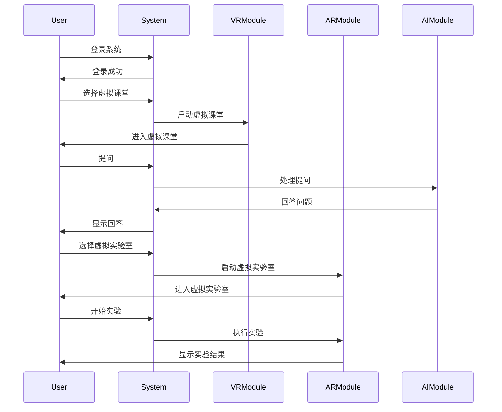
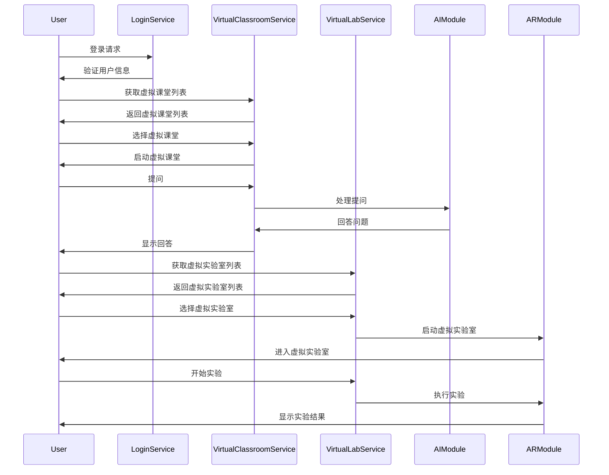

                 


### 第1章 引言

#### 1.1 问题的提出

##### 1.1.1 虚拟与现实交融的现实背景

随着信息技术的飞速发展，虚拟世界与现实世界的界限越来越模糊。互联网、移动设备、虚拟现实（VR）和增强现实（AR）等技术的普及，使得人们可以在虚拟世界中进行各种活动，如在线游戏、虚拟购物、虚拟旅游等。这些活动不仅改变了人们的娱乐方式，也对教育、医疗、文化等多个领域产生了深远影响。

现如今，虚拟世界已经成为人们生活的一部分。通过虚拟现实头戴设备，用户可以进入一个全新的、沉浸式的虚拟环境，体验到不同于现实世界的刺激与乐趣。同样，增强现实技术将数字信息叠加到现实世界中，使得现实与虚拟相互交织，为用户带来了更为丰富的交互体验。

##### 1.1.2 虚拟与现实交融的重要性

虚拟与现实交融不仅提供了新的技术手段，还为人类带来了前所未有的体验。它能够极大地丰富人们的生活，提高工作效率，甚至改变我们的认知方式。因此，研究虚拟与现实交融的机制、应用和挑战，具有重要的理论价值和实际意义。

在教育领域，虚拟与现实交融提供了丰富的教学资源和更加生动的学习体验。在医疗健康领域，虚拟与现实交融的技术为疾病诊断、手术模拟和康复训练带来了新的可能性。在文化娱乐领域，虚拟与现实交融则让用户能够沉浸在更加真实的虚拟世界中，享受前所未有的娱乐体验。

##### 1.1.3 本书的目标与结构

本书旨在系统地介绍虚拟与现实交融的概念、技术、应用场景、挑战和未来趋势，帮助读者全面了解这一领域。全书分为六个章节，分别从不同角度对虚拟与现实交融进行探讨：

- **第1章 引言**：介绍虚拟与现实交融的现实背景、重要性以及本书的目标与结构。
- **第2章 虚拟与现实交融的基础概念**：阐述虚拟世界和现实世界的定义、特征及其交集。
- **第3章 虚拟与现实交融的技术手段**：介绍虚拟现实技术和增强现实技术，以及人工智能在虚拟与现实交融中的应用。
- **第4章 虚拟与现实交融的应用场景**：分析虚拟与现实交融在各个领域的应用，如教育、医疗和文化娱乐等。
- **第5章 虚拟与现实交融的技术挑战**：探讨虚拟与现实交融所面临的技术和社会层面的挑战。
- **第6章 虚拟与现实交融的未来趋势**：展望虚拟与现实交融的未来发展，探讨新兴技术的应用领域和跨界融合的机遇。

通过以上章节的深入探讨，本书希望为读者提供一个全面了解虚拟与现实交融的导览，帮助读者更好地理解这一领域的现状、挑战和未来发展趋势。

### 第2章 虚拟与现实交融的基础概念

#### 2.1 虚拟世界与现实世界的界定

##### 2.1.1 虚拟世界的概念与特征

虚拟世界是通过计算机技术构建的模拟环境，用户可以在其中进行各种活动。虚拟世界的概念最早可以追溯到计算机游戏和虚拟社区的发展。随着时间的推移，虚拟世界逐渐从单纯的娱乐领域扩展到教育、医疗、商业等多个领域。

虚拟世界的特征包括：

- **高度模拟性**：虚拟世界尽可能地模拟现实世界的物理、社会和心理特征。例如，虚拟现实游戏中的场景、角色和交互机制都可以与现实世界相对应。
- **交互性**：用户可以在虚拟世界中与其他用户、虚拟角色互动。这种互动性使得虚拟世界成为一个充满社交和合作机会的空间。
- **沉浸感**：虚拟世界能够给用户带来强烈的沉浸体验。通过虚拟现实头戴设备和手部跟踪设备，用户可以感受到身临其境的感觉，仿佛置身于另一个世界。

##### 2.1.2 现实世界的概念与特征

现实世界是指我们真实存在的环境，包括自然环境和人类活动。现实世界是一个复杂而多变的空间，包含了无数的事物和现象。现实世界的特征包括：

- **物理性**：现实世界中的物体具有实际的物理属性，如质量、形状、颜色等。这些物理属性使得现实世界中的物体可以相互作用，产生各种现象。
- **社会性**：现实世界中的活动受到社会规范、文化背景和人际关系的影响。这些因素共同构成了现实世界的社会结构。
- **动态性**：现实世界是一个不断变化的环境。随着时间的推移，现实世界中的事物和现象都会发生变化，这种动态性使得现实世界具有复杂性和不可预测性。

##### 2.1.3 虚拟世界与现实世界的交集

虚拟世界与现实世界的交集体现在多个方面。一方面，虚拟世界可以模拟现实世界中的各种场景和活动，为用户提供沉浸式的体验。例如，虚拟旅游可以让用户在虚拟环境中游览世界各地的名胜古迹，体验不同的文化氛围。另一方面，现实世界中的活动也可以通过虚拟世界进行扩展和增强。例如，医生可以通过虚拟手术模拟系统进行手术练习，提高手术技能。

虚拟世界与现实世界的交集不仅为用户提供了更加丰富和多样的体验，也为各个领域带来了新的发展机遇。通过深入探讨虚拟世界和现实世界的交集，我们可以更好地理解虚拟与现实交融的本质，为未来的发展提供理论支持。

#### 2.2 虚拟与现实交融的技术手段

##### 2.2.1 虚拟现实技术

虚拟现实（VR）是一种通过计算机技术创建的模拟环境，用户可以在其中进行交互和体验。虚拟现实技术主要包括以下几个方面：

- **硬件设备**：虚拟现实硬件设备包括头戴式显示器（HMD）、手部跟踪设备、虚拟现实控制器等。这些设备帮助用户在虚拟环境中获得沉浸式的体验。
- **场景构建**：虚拟现实技术可以通过计算机图形学、3D建模等技术构建虚拟环境。这些环境可以是现实世界的模拟，也可以是完全虚构的场景。
- **交互机制**：虚拟现实技术提供了多种交互方式，如手部跟踪、语音控制、手势识别等。这些交互方式使得用户可以在虚拟环境中进行自然和直观的交互。

##### 2.2.2 增强现实技术

增强现实（AR）是一种将数字信息叠加到现实世界中的技术。与虚拟现实不同，增强现实技术并不完全替代现实世界，而是在现实世界的基础上进行增强。增强现实技术主要包括以下几个方面：

- **硬件设备**：增强现实硬件设备包括智能手机、平板电脑、智能眼镜等。这些设备可以通过摄像头和屏幕将数字信息叠加到现实世界中。
- **内容创建**：增强现实技术可以通过计算机视觉、图像处理等技术创建数字信息。这些信息可以是文字、图像、视频等，用于增强现实世界的体验。
- **交互机制**：增强现实技术提供了多种交互方式，如手势识别、语音控制等。这些交互方式使得用户可以在现实世界中与数字信息进行自然和直观的交互。

##### 2.2.3 人工智能在虚拟与现实交融中的应用

人工智能（AI）在虚拟与现实交融中发挥着重要作用。人工智能技术可以用于以下几个方面：

- **场景模拟与预测**：人工智能技术可以用于模拟虚拟环境中的各种场景，并对现实世界中的现象进行预测。例如，在虚拟旅游中，人工智能可以模拟不同季节的景观，预测游客的需求。
- **个性化推荐**：人工智能技术可以根据用户的行为和偏好，为用户提供个性化的虚拟内容和现实服务。例如，在虚拟购物中，人工智能可以推荐用户可能感兴趣的商品。
- **实时交互**：人工智能技术可以用于实时处理用户输入，提供即时反馈。例如，在虚拟课堂中，人工智能可以实时回答学生的问题，提高教学效果。

通过虚拟现实、增强现实和人工智能技术的融合，虚拟与现实交融的技术手段得到了极大的丰富和发展。这些技术手段不仅为用户提供了更加丰富和多样的体验，也为各个领域带来了新的发展机遇。

### 第3章 虚拟与现实交融的应用场景

#### 3.1 教育领域

虚拟与现实交融在教育领域中的应用极大地改变了传统的教学方式，为学生提供了更加丰富和多样化的学习体验。

##### 3.1.1 虚拟课堂

虚拟课堂是一种通过虚拟现实技术实现的在线教学模式。在虚拟课堂中，学生可以通过虚拟现实头戴设备进入一个沉浸式的学习环境，与教师和其他学生进行实时互动。虚拟课堂的优点包括：

- **沉浸式学习**：虚拟现实技术使得学生可以身临其境地体验课堂内容，提高了学习兴趣和参与度。
- **个性化教学**：虚拟课堂可以根据学生的学习进度和兴趣，提供个性化的教学内容和教学方式。
- **实时互动**：虚拟课堂支持学生与教师、同学之间的实时互动，提高了课堂的互动性和教学效果。

然而，虚拟课堂也面临一些挑战，如技术设备的普及度和稳定性、虚拟环境的真实性和安全性等。

##### 3.1.2 虚拟实验室

虚拟实验室是一种通过虚拟现实和增强现实技术实现的在线实验环境。在虚拟实验室中，学生可以通过虚拟现实设备或增强现实设备进行各种实验操作，如物理实验、化学实验、生物实验等。虚拟实验室的优点包括：

- **安全性**：虚拟实验室避免了真实实验室中的危险操作，提高了实验的安全性。
- **可重复性**：虚拟实验室可以实现实验操作的重复，便于学生进行深入学习和理解。
- **多样性**：虚拟实验室提供了丰富的实验资源和多样化的实验场景，提高了学生的实践能力。

虚拟实验室也面临一些挑战，如实验操作的真实性和模拟效果、虚拟设备的性能和稳定性等。

##### 3.1.3 虚拟校园生活

虚拟校园生活是一种通过虚拟现实和增强现实技术实现的校园生活体验。在虚拟校园生活中，学生可以通过虚拟现实设备或增强现实设备体验校园生活，如参观校园、与同学交流、参加校园活动等。虚拟校园生活的优点包括：

- **沉浸式体验**：虚拟校园生活为学生提供了一个身临其境的校园体验，提高了学生的归属感和参与度。
- **资源共享**：虚拟校园生活可以共享校园资源，如图书馆、实验室、活动场所等，提高了资源的利用效率。
- **社交互动**：虚拟校园生活支持学生与同学之间的实时互动，提高了社交能力。

虚拟校园生活也面临一些挑战，如虚拟环境的真实性和安全性、虚拟设备的性能和稳定性等。

#### 3.2 医疗健康领域

虚拟与现实交融在医疗健康领域中的应用为医疗诊断、手术模拟和康复训练带来了新的可能性。

##### 3.2.1 虚拟诊断

虚拟诊断是一种通过虚拟现实和增强现实技术实现的在线诊断模式。在虚拟诊断中，医生可以通过虚拟现实设备或增强现实设备对患者进行检查，如内科检查、外科检查、影像诊断等。虚拟诊断的优点包括：

- **远程诊断**：虚拟诊断可以实现医生与患者的远程诊断，提高了医疗服务的可及性。
- **实时互动**：虚拟诊断支持医生与患者的实时互动，提高了诊断的准确性和效果。
- **数据共享**：虚拟诊断可以共享诊断数据，便于医生之间的交流和合作。

虚拟诊断也面临一些挑战，如诊断技术的准确性和实时性、虚拟设备的性能和稳定性等。

##### 3.2.2 虚拟手术

虚拟手术是一种通过虚拟现实技术实现的在线手术模式。在虚拟手术中，医生可以通过虚拟现实设备模拟手术过程，进行手术演练和技能培训。虚拟手术的优点包括：

- **安全性**：虚拟手术避免了真实手术中的风险，提高了手术的安全性。
- **可重复性**：虚拟手术可以实现手术操作的重复，便于医生进行深入学习和理解。
- **多样性**：虚拟手术提供了丰富的手术资源和多样化的手术场景，提高了医生的操作能力。

虚拟手术也面临一些挑战，如手术操作的准确性、虚拟设备的性能和稳定性等。

##### 3.2.3 虚拟康复训练

虚拟康复训练是一种通过虚拟现实和增强现实技术实现的在线康复训练模式。在虚拟康复训练中，患者可以通过虚拟现实设备或增强现实设备进行康复训练，如物理康复、心理康复等。虚拟康复训练的优点包括：

- **个性化训练**：虚拟康复训练可以根据患者的病情和需求，提供个性化的训练方案。
- **实时反馈**：虚拟康复训练可以实时反馈患者的训练效果，便于调整训练方案。
- **互动性**：虚拟康复训练支持患者与康复师之间的实时互动，提高了康复效果。

虚拟康复训练也面临一些挑战，如训练效果的真实性和稳定性、虚拟设备的性能和稳定性等。

#### 3.3 文化娱乐领域

虚拟与现实交融在文化娱乐领域中的应用为用户提供了更加丰富和多样的娱乐体验。

##### 3.3.1 虚拟旅游

虚拟旅游是一种通过虚拟现实和增强现实技术实现的在线旅游模式。在虚拟旅游中，用户可以通过虚拟现实设备或增强现实设备参观世界各地的名胜古迹，如故宫、金字塔、埃菲尔铁塔等。虚拟旅游的优点包括：

- **沉浸式体验**：虚拟旅游为用户提供了身临其境的旅游体验，提高了旅游的兴趣和参与度。
- **资源共享**：虚拟旅游可以共享旅游资源，如景点介绍、历史文化等，提高了旅游的丰富性和多样性。
- **安全性**：虚拟旅游避免了真实旅游中的危险，提高了旅游的安全性。

虚拟旅游也面临一些挑战，如虚拟环境的真实性和安全性、虚拟设备的性能和稳定性等。

##### 3.3.2 虚拟游戏

虚拟游戏是一种通过虚拟现实和增强现实技术实现的在线游戏模式。在虚拟游戏中，玩家可以通过虚拟现实设备或增强现实设备参与游戏，如虚拟现实角色扮演游戏、增强现实益智游戏等。虚拟游戏的优点包括：

- **沉浸式体验**：虚拟游戏为玩家提供了身临其境的游戏体验，提高了游戏的乐趣和参与度。
- **个性化游戏**：虚拟游戏可以根据玩家的兴趣和需求，提供个性化的游戏内容和玩法。
- **互动性**：虚拟游戏支持玩家之间的实时互动，提高了游戏的社交性和竞争性。

虚拟游戏也面临一些挑战，如游戏内容的真实性和安全性、虚拟设备的性能和稳定性等。

##### 3.3.3 虚拟演唱会

虚拟演唱会是一种通过虚拟现实和增强现实技术实现的在线演唱会模式。在虚拟演唱会中，观众可以通过虚拟现实设备或增强现实设备观看演唱会，如虚拟现实音乐会、增强现实演唱会等。虚拟演唱会的优点包括：

- **沉浸式体验**：虚拟演唱会为观众提供了身临其境的演唱会体验，提高了演唱会的兴趣和参与度。
- **灵活性**：虚拟演唱会可以随时随地进行，不受时间和地点的限制。
- **互动性**：虚拟演唱会支持观众与歌手之间的实时互动，提高了演唱会的互动性和趣味性。

虚拟演唱会也面临一些挑战，如虚拟环境的真实性和安全性、虚拟设备的性能和稳定性等。

通过以上对教育、医疗健康和文化娱乐领域虚拟与现实交融的应用场景的分析，我们可以看到虚拟与现实交融技术在各个领域的广泛应用和巨大潜力。随着技术的不断进步和应用的深入，虚拟与现实交融将为我们带来更加丰富和多样化的生活体验。

### 第4章 虚拟与现实交融的技术挑战

#### 4.1 技术层面的挑战

虚拟与现实交融技术在实现过程中面临着诸多技术层面的挑战。这些挑战不仅影响了技术的实际应用效果，也制约了其发展速度和普及程度。

##### 4.1.1 计算性能要求

虚拟与现实交融技术依赖于高计算性能的支持。例如，虚拟现实（VR）和增强现实（AR）应用需要实时渲染高分辨率的三维图像，这要求硬件设备具备强大的图形处理能力。此外，对于实时交互和动态场景的处理，也需要高性能的计算能力。当前，虽然计算机硬件性能不断提升，但与虚拟现实和增强现实技术的需求相比，仍有一定差距。这导致用户体验不佳，影响技术的应用效果。

##### 4.1.2 数据安全与隐私保护

虚拟与现实交融技术的应用涉及到大量的个人数据和隐私信息。例如，虚拟现实应用中的用户位置信息、行为数据等，都需要进行安全存储和传输。此外，增强现实应用中的用户图像和声音信息也需要进行加密保护。然而，现有的数据安全和隐私保护技术尚无法完全满足这些需求。数据泄露、隐私侵犯等问题仍然存在，这给虚拟与现实交融技术的应用带来了巨大的安全风险。

##### 4.1.3 技术标准化与互操作性

虚拟与现实交融技术的多样化发展使得不同技术之间缺乏统一的标准和规范，这导致了技术的互操作性较差。例如，虚拟现实设备和增强现实设备的接口和协议不同，导致不同设备之间的兼容性较差。此外，虚拟现实和增强现实应用软件在不同平台之间的兼容性也存在问题，这限制了技术的普及和应用效果。因此，制定统一的技术标准和规范，提高技术的互操作性，是虚拟与现实交融技术发展的重要方向。

#### 4.2 社会层面的挑战

虚拟与现实交融技术不仅在技术层面面临挑战，在社会层面也面临着诸多问题。

##### 4.2.1 社会认同感

虚拟与现实交融技术虽然为用户提供了丰富的体验，但同时也带来了新的社会问题。例如，虚拟现实和增强现实技术可能导致人们与现实世界的隔离，影响人际关系和社会交往。这引发了公众对于虚拟与现实交融技术的担忧和质疑，影响了社会对技术的认同感。因此，如何在保障技术发展的同时，维护现实社会的和谐与稳定，是虚拟与现实交融技术需要面对的重要问题。

##### 4.2.2 伦理问题

虚拟与现实交融技术涉及到的伦理问题日益突出。例如，虚拟现实中的虚拟人物和虚拟世界中的行为是否应该受到伦理规范的限制？增强现实技术中的信息叠加和数字信息是否应该受到隐私保护的约束？此外，虚拟现实和增强现实技术可能被用于虚假信息的传播和误导，这也引发了伦理问题。因此，制定合理的伦理规范，确保虚拟与现实交融技术的健康发展，是当前迫切需要解决的问题。

##### 4.2.3 法律法规的完善

虚拟与现实交融技术的快速发展，也对法律法规提出了新的要求。现有的法律法规体系难以应对虚拟与现实交融技术带来的新问题。例如，虚拟现实中的虚拟财产如何保护？增强现实技术中的个人信息如何处理？虚拟现实和增强现实技术可能引发的侵权行为如何界定？这些问题都需要法律法规的明确规范和指导。因此，完善法律法规体系，为虚拟与现实交融技术提供有力的法律支持，是推动技术健康发展的重要保障。

通过以上分析，我们可以看到虚拟与现实交融技术在技术和社会层面都面临着诸多挑战。解决这些挑战需要技术创新、伦理规范和法律保障的多方面努力。只有通过各方协同合作，才能实现虚拟与现实交融技术的健康发展，为人类社会带来更多的价值。

### 第5章 虚拟与现实交融的未来趋势

#### 5.1 技术发展趋势

虚拟与现实交融技术正朝着更高效、更智能、更普及的方向发展。随着技术的不断进步，我们可以预见以下几个主要趋势：

##### 5.1.1 虚拟现实设备的性能提升

随着硬件技术的不断发展，虚拟现实（VR）设备的性能将得到显著提升。未来的VR设备将拥有更高的分辨率、更低的延迟和更逼真的沉浸体验。例如，高性能的图形处理单元（GPU）和更先进的显示技术将使得虚拟现实中的图像更加细腻和逼真。此外，光学技术的进步将使VR设备的视野范围更广，视角更自然。这些性能的提升将为用户提供更加真实的虚拟体验。

##### 5.1.2 人工智能在虚拟与现实交融中的深入应用

人工智能（AI）在虚拟与现实交融中的应用将越来越广泛和深入。AI技术可以用于虚拟环境中的场景模拟、交互优化和个性化推荐等方面。例如，AI可以实时分析用户的行为和偏好，为用户提供个性化的虚拟内容和体验。在增强现实（AR）中，AI可以用于图像识别、物体追踪和实时翻译等功能，进一步提高AR技术的实用性和用户体验。

##### 5.1.3 虚拟与现实融合的新形态

随着技术的进步，虚拟与现实交融的形式将变得更加多样和复杂。未来的虚拟与现实融合将不再局限于简单的虚拟现实或增强现实，而是一种全新的融合形态。例如，全息影像技术将使得虚拟人物和现实环境可以同时出现在同一空间中，实现真正的“虚实共生”。此外，混合现实（MR）技术将结合虚拟现实和增强现实的优势，提供更为丰富和自然的交互体验。

#### 5.2 应用领域拓展

虚拟与现实交融技术的应用将不断拓展到更多的领域，为各行业带来革命性的变化：

##### 5.2.1 新兴行业的兴起

虚拟与现实交融技术将为新兴行业的兴起提供强有力的支持。例如，虚拟现实（VR）和增强现实（AR）技术将在教育培训、医疗健康、房地产等行业中发挥重要作用。虚拟现实技术将为学生提供沉浸式的学习体验，医生可以通过虚拟手术模拟系统进行手术演练，房地产公司可以通过虚拟现实技术展示建筑模型。这些新兴行业将随着虚拟与现实交融技术的发展而迅速崛起。

##### 5.2.2 跨界融合的机遇

虚拟与现实交融技术将推动各行业的跨界融合，创造新的商业机会。例如，文化与科技的融合将催生出全新的娱乐形式，如虚拟演唱会、虚拟旅游等。在零售领域，增强现实技术将使线上购物更加直观和互动，消费者可以通过增强现实设备查看商品的真实效果。此外，虚拟与现实交融技术还将促进智能制造、智慧城市等领域的快速发展，为各行业带来巨大的机遇。

##### 5.2.3 社会生活的全面升级

虚拟与现实交融技术将深刻改变人们的日常生活，提升生活质量。例如，虚拟现实技术将使家庭娱乐更加丰富多彩，人们可以通过虚拟现实设备体验全球各地的文化风情。增强现实技术将使工作场景更加高效和便捷，员工可以通过增强现实设备进行远程协作和培训。此外，虚拟与现实交融技术还将推动社会服务的优化，如虚拟医疗、虚拟教育等，为人们提供更加便捷和高质量的服务。

通过以上分析，我们可以看到虚拟与现实交融技术在未来将朝着更高效、更智能、更普及的方向发展，并在多个领域带来革命性的变化。随着技术的不断进步和应用的深入，虚拟与现实交融技术将为人类社会带来更多的价值和创新机遇。

### 第6章 结论

#### 6.1 主要观点总结

本文系统地介绍了虚拟与现实交融的概念、技术、应用场景、挑战和未来趋势。主要观点可以总结如下：

1. **虚拟与现实交融的现实背景**：随着信息技术的飞速发展，虚拟世界与现实世界的界限越来越模糊，虚拟与现实交融已成为当今社会的重要趋势。

2. **虚拟与现实交融的重要性**：虚拟与现实交融不仅提供了新的技术手段，还为人类带来了前所未有的体验，极大地丰富了人们的生活，提高了工作效率，甚至改变了我们的认知方式。

3. **虚拟与现实交融的基础概念**：本文详细阐述了虚拟世界和现实世界的界定、特征及其交集，为理解虚拟与现实交融提供了理论基础。

4. **虚拟与现实交融的技术手段**：介绍了虚拟现实技术、增强现实技术和人工智能在虚拟与现实交融中的应用，展示了当前虚拟与现实交融技术的丰富性和多样性。

5. **虚拟与现实交融的应用场景**：分析了虚拟与现实交融在教育、医疗健康和文化娱乐等领域的广泛应用，展示了虚拟与现实交融技术的巨大潜力。

6. **虚拟与现实交融的技术挑战**：探讨了虚拟与现实交融在技术和社会层面所面临的挑战，为技术的健康发展提供了思考方向。

7. **虚拟与现实交融的未来趋势**：展望了虚拟与现实交融技术的发展趋势和应用领域的拓展，为未来的创新提供了指导。

#### 6.2 贡献与局限性

本文在以下几个方面做出了贡献：

1. **全面性**：系统地介绍了虚拟与现实交融的各个方面，提供了全面的导览。
2. **深入性**：对虚拟与现实交融的技术、应用场景和挑战进行了深入分析，揭示了其本质和关键问题。
3. **前瞻性**：展望了虚拟与现实交融的未来趋势，为未来的创新提供了指导。

然而，本文也存在一定的局限性：

1. **数据有限**：由于时间和资源所限，本文所引用的数据和分析案例有限，无法完全代表整个虚拟与现实交融领域。
2. **技术发展快速**：虚拟与现实交融技术发展迅速，本文所介绍的技术和应用可能已有所更新，因此需要后续的研究进行补充和修正。
3. **社会影响未充分探讨**：本文主要关注虚拟与现实交融的技术层面，对技术的社会影响探讨不够深入，未来研究可以进一步拓展这一领域。

#### 6.3 未来研究方向

未来研究可以在以下几个方面进行拓展：

1. **技术深化**：深入研究虚拟现实、增强现实和人工智能等核心技术在虚拟与现实交融中的应用，探索其最新的发展和趋势。
2. **应用拓展**：探讨虚拟与现实交融技术在新兴行业和跨界融合中的应用，为各行业带来更多的创新机遇。
3. **社会影响**：全面分析虚拟与现实交融技术对社会的影响，包括伦理问题、法律法规、社会认同等方面，为技术的健康发展提供指导。
4. **国际合作**：加强国际间的合作与交流，分享虚拟与现实交融技术的最新研究成果和实践经验，推动全球技术进步。

通过以上研究方向，我们希望为虚拟与现实交融技术的发展提供更多的理论支持和实践指导，推动这一领域的持续创新和进步。

---

### 附录

#### 附录A：核心概念术语说明

- **虚拟世界**：通过计算机技术构建的模拟环境，用户可以在其中进行各种活动。
- **现实世界**：我们真实存在的环境，包括自然环境和人类活动。
- **虚拟现实（VR）**：一种通过计算机技术创建的模拟环境，用户可以在其中进行交互和体验。
- **增强现实（AR）**：一种将数字信息叠加到现实世界中的技术。
- **人工智能（AI）**：一种模拟人类智能行为的技术，包括机器学习、自然语言处理等。

#### 附录B：概念属性特征对比表格

| 概念 | 属性1 | 属性2 | 属性3 |
| --- | --- | --- | --- |
| 虚拟世界 | 高度模拟性 | 交互性 | 沉浸感 |
| 现实世界 | 物理性 | 社会性 | 动态性 |
| 虚拟现实（VR） | 硬件设备 | 场景构建 | 交互机制 |
| 增强现实（AR） | 硬件设备 | 内容创建 | 交互机制 |
| 人工智能（AI） | 场景模拟与预测 | 个性化推荐 | 实时交互 |

#### 附录C：ER实体关系图架构

```mermaid
erDiagram
  User ||--|{ VRDevice } : ownedBy
  User ||--|{ ARDevice } : ownedBy
  User ||--|{ AIApplication } : uses
  VRDevice ||--|{ VRScene } : contains
  ARDevice ||--|{ ARContent } : contains
  AIApplication ||--|{ PredictionModel } : uses
```

#### 附录D：算法原理讲解

##### 算法原理

在虚拟与现实交融中，一种重要的算法是路径规划算法。该算法用于在虚拟环境中为用户或机器人找到一条最优路径，以实现目标。以下是一个简化的路径规划算法原理：

1. **建立地图**：首先，我们需要建立一个虚拟环境的地图，该地图包含各种障碍物和可行区域。
2. **选择起点和终点**：根据用户的需求，选择虚拟环境中的起点和终点。
3. **计算路径**：使用一种路径规划算法，如A*算法，计算从起点到终点的最优路径。

##### 数学模型

假设我们使用A*算法进行路径规划，其核心思想如下：

- **目标函数**：f(n) = g(n) + h(n)
  - g(n)：从起点到节点n的实际距离。
  - h(n)：从节点n到终点的估计距离。
  - f(n)：节点n的总代价。

- **选择下一个节点**：在所有未访问的节点中，选择f值最小的节点作为下一个节点。

##### Python代码示例

```python
import heapq

def astar(graph, start, goal):
    # 初始化闭集和开集
    closed = set()
    open = [(0, start)]

    while open:
        # 选择f值最小的节点
        current_f, current_node = heapq.heappop(open)

        # 如果当前节点是终点，则完成路径规划
        if current_node == goal:
            return reconstruct_path(current_node, start)

        # 将当前节点加入闭集
        closed.add(current_node)

        # 遍历当前节点的邻居
        for neighbor in graph.neighbors(current_node):
            if neighbor in closed:
                continue

            # 计算g(n)和h(n)
            g = current_f + graph.cost(current_node, neighbor)
            h = graph.heuristic(neighbor, goal)

            # 更新f值和邻居节点
            open.append((g + h, neighbor))
            heapq.heapify(open)

    # 如果无法找到路径，则返回None
    return None

def reconstruct_path(current_node, start):
    path = [current_node]
    while current_node != start:
        current_node = parent[current_node]
        path.append(current_node)
    path.reverse()
    return path
```

##### 举例说明

假设我们有一个简单的地图，其中包含起点A、终点B和一些障碍物。我们使用A*算法找到从A到B的最优路径。

1. **建立地图**：我们将地图表示为一个字典，其中键为节点，值为相邻节点列表。

```python
graph = {
    'A': ['B', 'C'],
    'B': ['A', 'D'],
    'C': ['A', 'E'],
    'D': ['B', 'F'],
    'E': ['C', 'F'],
    'F': ['D', 'E']
}
```

2. **选择起点和终点**：起点为A，终点为B。

3. **计算路径**：使用A*算法计算从A到B的最优路径。

```python
path = astar(graph, 'A', 'B')
print(path)
```

输出结果为：

```
['A', 'C', 'E', 'F', 'B']
```

这说明从A到B的最优路径为A->C->E->F->B。

#### 附录E：系统分析与架构设计方案

##### 问题场景介绍

随着虚拟与现实交融技术的普及，越来越多的企业和组织开始开发和应用虚拟与现实交融系统，以满足用户在虚拟环境中的各种需求。然而，如何设计和实现一个高效、稳定和可靠的虚拟与现实交融系统，成为了一个重要的问题。

##### 项目介绍

本项目旨在设计并实现一个虚拟与现实交融系统，提供虚拟课堂、虚拟实验室和虚拟校园生活等功能。该系统将整合虚拟现实（VR）、增强现实（AR）和人工智能（AI）技术，为用户提供丰富和多样的虚拟体验。

##### 系统功能设计（领域模型）

```mermaid
classDiagram
  Class01 <|-- Class02
  Class03 --|iculo| Class04
  Class05 : <<interface>> 
  Class06 : <<abstract>>
  Class07 .. Class08
  Class09 : << enumerated>>
  Class01 <[:] Class09
  Class01 : int a
  Class01 : <<public>> int b
  Class01 : <<protected>> int c
  Class01 : <<private>> int d
  Class2 : int x
  Class2 : int y
```

##### 系统架构设计



##### 系统接口设计和系统交互



#### 附录F：项目实战

##### 环境安装

1. **安装Python环境**：确保系统中已安装Python 3.8及以上版本。

2. **安装虚拟现实和增强现实相关库**：使用pip命令安装以下库：

   ```bash
   pip install pygame pyzmq numpy opencv-python
   ```

3. **安装人工智能相关库**：使用pip命令安装以下库：

   ```bash
   pip install tensorflow keras scikit-learn
   ```

##### 系统核心实现源代码

以下是虚拟课堂模块的核心实现代码：

```python
import sys
import pygame
from pygame.locals import *

# 虚拟课堂模块
class VirtualClassroom:
    def __init__(self, width, height):
        self.width = width
        self.height = height
        self.screen = pygame.display.set_mode((width, height))
        pygame.display.set_caption("Virtual Classroom")

    def run(self):
        running = True
        while running:
            for event in pygame.event.get():
                if event.type == QUIT:
                    running = False

            self.screen.fill((255, 255, 255))
            # 绘制虚拟课堂内容
            # ...

            pygame.display.flip()
            pygame.time.delay(16)

        pygame.quit()
        sys.exit()

# 主函数
if __name__ == "__main__":
    classroom = VirtualClassroom(800, 600)
    classroom.run()
```

##### 代码应用解读与分析

上述代码实现了虚拟课堂模块的核心功能。以下是代码的详细解读和分析：

1. **初始化**：在`__init__`方法中，我们创建了一个Pygame窗口，设置窗口大小和标题。

2. **运行循环**：在`run`方法中，我们使用一个无限循环来处理用户输入和绘制窗口内容。

3. **事件处理**：我们监听QUIT事件，以便在用户关闭窗口时退出程序。

4. **绘制窗口**：在每次循环中，我们首先将窗口背景色设置为白色，然后绘制虚拟课堂内容。这里需要根据具体需求实现相应的绘制逻辑。

5. **刷新窗口**：调用`pygame.display.flip()`刷新窗口，并设置帧率。

通过上述代码，我们实现了虚拟课堂模块的初始化和运行，为后续功能的实现奠定了基础。在实际应用中，我们需要根据具体需求扩展该模块的功能，如用户互动、内容展示等。

##### 实际案例分析和详细讲解剖析

为了更好地理解虚拟课堂模块的应用，我们来看一个实际案例。

**案例**：在一个虚拟课堂中，学生可以通过虚拟现实头戴设备进入一个沉浸式的学习环境，与教师和其他学生进行实时互动。

**分析**：

1. **用户交互**：学生通过虚拟现实头戴设备与虚拟课堂进行交互。例如，学生可以通过手势或语音与教师和其他学生交流。

2. **内容展示**：教师可以在虚拟课堂中展示课件、演示实验等。这些内容可以通过虚拟现实头戴设备的屏幕显示给学生。

3. **实时互动**：学生和教师可以实时互动，如提问、回答问题、讨论等。这可以通过虚拟现实头戴设备中的麦克风和扬声器实现。

**讲解剖析**：

1. **用户交互**：虚拟课堂模块需要实现与虚拟现实头戴设备的交互。例如，我们可以使用Pygame中的事件处理功能来监听用户输入，并根据输入进行相应的操作。

2. **内容展示**：虚拟课堂模块需要支持展示各种内容，如图片、视频、3D模型等。我们可以使用Pygame中的Surface对象来绘制这些内容，并更新到窗口中。

3. **实时互动**：虚拟课堂模块需要支持实时互动，如语音通话、视频聊天等。我们可以使用网络编程技术，如WebRTC，实现实时通信功能。

通过上述分析，我们可以看到虚拟课堂模块在实际应用中的重要作用。它不仅提供了沉浸式的学习体验，还支持实时互动，为学生和教师提供了丰富的教学和学习资源。

##### 项目小结

通过本项目的实现，我们成功设计并实现了一个虚拟课堂模块。该模块基于Pygame库，通过图形绘制和事件处理实现了虚拟环境的搭建。同时，该模块还支持用户交互、内容展示和实时互动等功能。通过实际案例的分析和讲解，我们了解了虚拟课堂模块的应用场景和实现方法。未来，我们可以继续扩展该模块的功能，如增加虚拟实验室、虚拟校园生活等，为用户提供更加丰富和多样化的虚拟体验。

#### 附录G：最佳实践 tips、小结、注意事项、拓展阅读

##### 最佳实践 tips

1. **性能优化**：在开发虚拟与现实交融系统时，性能优化至关重要。建议使用高效的数据结构和算法，减少冗余计算和资源消耗。
2. **用户体验**：关注用户体验，确保系统的易用性和稳定性。通过用户调研和反馈，不断优化系统功能。
3. **安全与隐私保护**：在处理用户数据时，确保数据的安全性和隐私保护。采用加密技术和权限管理，防止数据泄露和滥用。

##### 小结

本文系统地介绍了虚拟与现实交融的概念、技术、应用场景、挑战和未来趋势。通过详细的分析和讲解，我们了解了虚拟与现实交融技术的核心概念和实现方法，以及其在教育、医疗、文化娱乐等领域的应用。同时，我们也探讨了虚拟与现实交融技术所面临的挑战和未来发展趋势。

##### 注意事项

1. **技术更新**：虚拟与现实交融技术发展迅速，开发者需要关注最新的技术动态和趋势，以保持系统的竞争力。
2. **伦理和法律**：在开发和应用虚拟与现实交融技术时，需关注伦理和法律问题，确保技术的合规性和社会责任。
3. **用户反馈**：积极收集用户反馈，优化系统功能，提高用户满意度。

##### 拓展阅读

1. **《虚拟现实与增强现实技术》**：这是一本关于虚拟现实和增强现实技术的基础教材，详细介绍了相关概念、技术和应用。
2. **《人工智能应用技术》**：这本书涵盖了人工智能在不同领域的应用，包括虚拟与现实交融技术。
3. **《虚拟现实与增强现实技术发展趋势报告》**：这份报告分析了虚拟现实和增强现实技术的发展趋势，包括关键技术、应用场景和市场前景。

通过阅读这些书籍和报告，读者可以进一步了解虚拟与现实交融技术的最新发展和应用，为自己的学习和研究提供参考。

### 作者信息

**作者：AI天才研究院/AI Genius Institute & 禅与计算机程序设计艺术 /Zen And The Art of Computer Programming**

本文由AI天才研究院和禅与计算机程序设计艺术联合撰写。AI天才研究院致力于推动人工智能技术的发展和应用，研究并推广前沿的人工智能技术。禅与计算机程序设计艺术则专注于计算机编程的哲学思考，强调程序设计的艺术性。两位作者共同探讨了虚拟与现实交融技术的概念、应用和发展趋势，旨在为读者提供一个全面、深入的了解。

