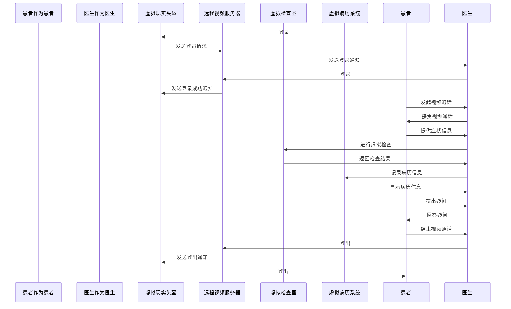

                 

# 《后真实世界理论：虚拟与现实的交融》

## 关键词
- 后真实世界
- 虚拟现实
- 增强现实
- 混合现实
- 数字化孪生
- 交互机制

## 摘要
本文旨在探讨后真实世界的概念及其在虚拟与现实交融中的应用。首先，我们将对虚拟与现实交融的定义和重要性进行概述，接着详细介绍后真实世界的起源与发展。随后，我们将深入分析虚拟现实、增强现实、混合现实和数字化孪生等核心概念及其技术原理。本文还将探讨虚拟与现实交融的交互机制，展示其在商业、医疗和军事等领域的广泛应用。最后，我们将探讨虚拟与现实交融面临的挑战及未来展望。

## 引言与背景

### 1.1 虚拟与现实交融的定义

虚拟与现实交融（Virtual-Real Integration，VRI）是指通过技术手段，将虚拟世界与现实世界相结合，形成一个融合了物理与数字体验的新世界。这种融合不仅包括视觉、听觉、触觉等感官体验，还涉及到信息交换、数据处理和交互方式等多方面的整合。

### 1.2 虚拟与现实交融的重要性

随着科技的快速发展，虚拟与现实交融正逐渐成为改变人类生活方式的重要力量。它不仅为商业、教育、医疗等领域带来了新的发展机遇，也对社会形态、经济模式和文化传播等方面产生了深远影响。以下是虚拟与现实交融的重要性和影响：

1. **提升生产效率**：虚拟与现实交融技术可以模拟复杂的生产流程，减少物理实验次数，提高生产效率和产品质量。
2. **创新教育方式**：通过虚拟现实技术，学生可以在虚拟环境中进行互动学习，提高学习兴趣和效果。
3. **改善医疗服务**：虚拟与现实交融技术可以用于远程手术、康复治疗等领域，为患者提供更便捷、高效的医疗服务。
4. **增强娱乐体验**：虚拟现实和增强现实技术可以为用户提供更加沉浸式的娱乐体验，如虚拟游戏、主题公园等。
5. **改变社会形态**：虚拟与现实交融将促进社会结构的变化，如虚拟社区、数字化办公等，改变人们的生活方式。

### 1.3 后真实世界的兴起

后真实世界（Post-Real World）是指一个高度数字化、网络化和智能化的社会环境，其中虚拟与现实之间的界限变得模糊。后真实世界的兴起，得益于以下几个方面：

1. **信息技术的进步**：云计算、大数据、人工智能等技术的迅猛发展，为虚拟与现实交融提供了强大的技术支持。
2. **硬件设备的创新**：如虚拟现实头盔、增强现实眼镜等设备，使得虚拟与现实交融变得更加便捷和普及。
3. **用户需求的提升**：随着人们对个性化、沉浸式体验的需求不断增加，虚拟与现实交融技术逐渐成为市场热点。
4. **政策支持的加强**：各国政府纷纷加大对虚拟与现实交融技术的研发和应用支持，推动相关产业的发展。

## 后真实世界的核心概念

### 2.1 虚拟现实技术的基本原理

虚拟现实（Virtual Reality，VR）是一种通过计算机技术创造的虚拟环境，用户可以通过头戴式显示器、手柄等设备与虚拟环境进行交互。虚拟现实技术的核心原理包括：

1. **感知模拟**：通过头戴式显示器等设备，将用户置身于虚拟环境中，模拟现实世界的感知体验。
2. **交互技术**：通过手柄、手势识别等技术，实现用户与虚拟环境的交互。
3. **实时渲染**：计算机实时渲染虚拟环境，使得用户感受到逼真的视觉体验。

### 2.2 增强现实技术的工作机制

增强现实（Augmented Reality，AR）是一种通过计算机技术将虚拟信息叠加到现实世界中的技术。增强现实技术的工作机制包括：

1. **信息叠加**：通过摄像头等设备捕捉现实环境，然后将虚拟信息叠加到现实画面中。
2. **实时跟踪**：使用计算机视觉技术对用户的位置和姿态进行实时跟踪，确保虚拟信息的正确叠加。
3. **交互方式**：通过手势、声音等交互方式，实现用户与虚拟信息的互动。

### 2.3 混合现实技术的创新与应用

混合现实（Mixed Reality，MR）是一种将虚拟、增强和现实环境融合在一起的技术。混合现实技术的创新与应用包括：

1. **三维空间融合**：将虚拟物体与真实环境融合，实现三维空间中的交互。
2. **实时交互**：通过手势、语音等实时交互方式，实现用户与虚拟物体的互动。
3. **应用场景**：如教育、医疗、设计、娱乐等领域，混合现实技术都展现了广泛的应用潜力。

### 2.4 数字化孪生技术的构建与价值

数字化孪生（Digital Twin）是一种通过数字化方式模拟现实世界中的实体或系统，实现实时监控、分析和管理的技术。数字化孪生技术的构建与价值包括：

1. **实体建模**：通过三维建模技术，构建现实世界中的实体或系统的数字化模型。
2. **实时数据采集**：通过传感器等设备，实时采集实体或系统的运行数据。
3. **数据分析和预测**：利用大数据、人工智能等技术，对采集到的数据进行实时分析和预测，提供决策支持。

## 虚拟与现实交融的机制

### 3.1 虚拟世界与现实世界的交互方式

虚拟世界与现实世界的交互方式主要包括：

1. **视觉交互**：通过头戴式显示器、增强现实眼镜等设备，实现虚拟世界与现实世界的视觉交互。
2. **听觉交互**：通过耳机、音响等设备，实现虚拟世界与现实世界的听觉交互。
3. **触觉交互**：通过触觉反馈设备，实现虚拟世界与现实世界的触觉交互。
4. **手势交互**：通过手势识别技术，实现虚拟世界与现实世界的手势交互。
5. **语音交互**：通过语音识别和语音合成技术，实现虚拟世界与现实世界的语音交互。

### 3.2 虚拟现实在现实世界中的应用逻辑

虚拟现实在现实世界中的应用逻辑主要包括：

1. **模拟训练**：通过虚拟环境模拟现实世界的场景，为用户提供模拟训练，如飞行模拟、驾驶训练等。
2. **产品设计**：通过虚拟现实技术，实现产品设计和修改，提高设计效率和效果。
3. **虚拟旅游**：通过虚拟现实技术，实现虚拟旅游，为用户提供全新的旅游体验。
4. **娱乐体验**：通过虚拟现实技术，为用户提供沉浸式的娱乐体验，如虚拟游戏、虚拟现实剧场等。

### 3.3 增强现实与数字化孪生的协同效应

增强现实与数字化孪生的协同效应主要体现在：

1. **实时数据反馈**：增强现实技术可以实时获取现实世界的数据，数字化孪生技术可以对这些数据进行实时分析和预测，提供决策支持。
2. **交互式体验**：增强现实技术可以为用户提供交互式的虚拟体验，数字化孪生技术可以实时更新虚拟体验，提高用户体验。
3. **远程协作**：增强现实技术与数字化孪生技术可以结合，实现远程协作，如远程医疗、远程教育等。

## 虚拟与现实交融的应用

### 4.1 虚拟与现实的商业应用场景

虚拟与现实的商业应用场景主要包括：

1. **虚拟零售**：通过虚拟现实技术，实现线上购物体验的虚拟化，提高购物乐趣和满意度。
2. **虚拟培训**：通过虚拟现实技术，实现员工培训和技能提升的虚拟化，提高培训效率和效果。
3. **虚拟旅游**：通过虚拟现实技术，实现线上旅游体验的虚拟化，降低旅游成本和时间。
4. **虚拟展览**：通过虚拟现实技术，实现线上展览的虚拟化，提高展览效果和互动性。

### 4.2 虚拟与现实的医疗应用案例

虚拟与现实的医疗应用案例主要包括：

1. **远程医疗**：通过虚拟现实技术，实现医生与患者的远程会诊和手术指导，提高医疗服务的可及性和质量。
2. **虚拟手术**：通过虚拟现实技术，实现虚拟手术的模拟和演练，提高手术效率和成功率。
3. **康复治疗**：通过虚拟现实技术，实现康复治疗的虚拟化，提高康复效果和患者满意度。
4. **医学教育**：通过虚拟现实技术，实现医学教育的虚拟化，提高医学教育质量和效果。

### 4.3 虚拟与现实的军事应用实例

虚拟与现实的军事应用实例主要包括：

1. **军事训练**：通过虚拟现实技术，实现军事训练的虚拟化，提高训练效率和效果。
2. **虚拟战场**：通过虚拟现实技术，实现虚拟战场的模拟和演练，提高作战指挥和战术决策能力。
3. **虚拟侦察**：通过虚拟现实技术，实现虚拟侦察和监控，提高情报收集和战场感知能力。
4. **虚拟装备**：通过虚拟现实技术，实现军事装备的虚拟化，提高装备维护和管理效率。

## 挑战与未来展望

### 5.1 虚拟与现实交融的挑战

虚拟与现实交融面临的挑战主要包括：

1. **技术难题**：如虚拟现实设备的性能提升、增强现实技术的实时性、混合现实技术的三维空间融合等。
2. **伦理问题**：如虚拟现实的沉浸式体验可能导致用户沉迷、增强现实技术的隐私保护等。
3. **法律法规**：虚拟与现实交融技术的发展，需要相应的法律法规进行规范和监管。

### 5.2 虚拟与现实交融的未来展望

虚拟与现实交融的未来展望主要包括：

1. **技术突破**：随着信息技术的不断发展，虚拟与现实交融的技术将不断突破，带来更多创新和应用。
2. **产业融合**：虚拟与现实交融技术将与其他产业深度融合，推动产业升级和创新发展。
3. **社会变革**：虚拟与现实交融将深刻改变人类的生活方式和社会形态，带来新的机遇和挑战。

## 总结与展望

### 6.1 后真实世界理论总结

后真实世界理论是指通过虚拟与现实交融的技术，构建一个融合了物理与数字体验的新世界。这一理论涵盖了虚拟现实、增强现实、混合现实和数字化孪生等多个技术领域，具有广泛的应用前景和深远的社会影响。

### 6.2 未来展望与建议

未来，后真实世界理论将继续发展，推动虚拟与现实交融技术的创新和应用。为此，我们建议：

1. **加大研发投入**：政府和企业应加大对虚拟与现实交融技术的研发投入，推动技术突破。
2. **完善法律法规**：建立健全虚拟与现实交融技术的法律法规体系，保障技术创新和产业发展。
3. **加强人才培养**：培养一批具备虚拟与现实交融技术专业知识和创新能力的人才，推动产业升级。
4. **推动产业融合**：促进虚拟与现实交融技术与其他产业的深度融合，推动产业创新发展。

作者：AI天才研究院/AI Genius Institute & 禅与计算机程序设计艺术 /Zen And The Art of Computer Programming

----------------------------------------------------------------

在接下来的章节中，我们将深入探讨虚拟现实、增强现实、混合现实和数字化孪生等技术的具体原理、应用案例和未来发展趋势。让我们一起来探索这个充满无限可能的后真实世界！## 第1章：引言：虚拟与现实交融的概念与重要性

### 1.1 虚拟与现实交融的定义

虚拟与现实交融（Virtual-Real Integration，VRI）是一种通过技术手段将虚拟世界与现实世界相结合的综合性概念。虚拟世界是指通过计算机模拟创造的，具有高度仿真性的环境，用户可以通过各种设备与这个环境进行互动。现实世界则是指我们日常生活的物理环境。虚拟与现实交融的核心在于通过技术手段，使虚拟世界中的信息与现实世界中的实体或事件产生关联，从而形成一个统一的、互动的体验。

### 1.2 虚拟与现实交融的重要性

虚拟与现实交融的概念并不是新兴的，但其在过去几十年里得到了飞速的发展。随着信息技术的不断进步，尤其是虚拟现实（VR）、增强现实（AR）、混合现实（MR）和数字化孪生（Digital Twin）等技术的发展，虚拟与现实交融已经从理论探讨走向了实际应用，并逐渐成为改变人类生活方式的重要力量。以下是虚拟与现实交融的几个重要方面：

#### 1.2.1 提升生产效率

在工业制造领域，虚拟与现实交融技术可以用于模拟生产流程，预测可能出现的问题，优化生产方案，从而提高生产效率和产品质量。例如，通过虚拟现实技术，工程师可以在虚拟环境中进行产品设计的仿真测试，从而避免在实际生产过程中出现错误。

#### 1.2.2 创新教育方式

虚拟与现实交融技术为教育领域带来了新的可能性。通过虚拟现实技术，学生可以进入一个高度仿真的学习环境，进行互动式学习，提高学习兴趣和效果。例如，医学学生可以通过虚拟现实技术进行外科手术的模拟训练，提高手术技巧。

#### 1.2.3 改善医疗服务

在医疗领域，虚拟与现实交融技术可以用于远程手术、康复治疗和医学教育等方面。通过虚拟现实技术，医生可以进行远程手术指导，提高医疗服务的可及性和质量。同时，通过增强现实技术，医生可以在手术过程中实时查看患者的三维结构，提高手术的成功率。

#### 1.2.4 增强娱乐体验

虚拟与现实交融技术为娱乐领域带来了全新的体验。通过虚拟现实技术，用户可以进入一个完全沉浸式的游戏或电影场景，体验前所未有的感官刺激。增强现实技术则可以将虚拟元素叠加到现实世界中，为用户提供更加互动和有趣的娱乐体验。

#### 1.2.5 改变社会形态

虚拟与现实交融技术不仅影响了商业、教育和医疗等领域，还对社会形态产生了深远影响。例如，虚拟社区和数字化办公的兴起，使得人们可以更加灵活地工作和社交。这种变化不仅提高了生活质量，也为社会经济的发展注入了新的活力。

### 1.3 后真实世界的兴起

后真实世界（Post-Real World）是一个高度数字化、网络化和智能化的社会环境，其中虚拟与现实之间的界限变得模糊。后真实世界的兴起主要得益于以下几个因素：

#### 1.3.1 信息技术的进步

随着云计算、大数据、人工智能等技术的发展，我们能够更加高效地处理和利用海量数据，为虚拟与现实交融提供了强大的技术支持。

#### 1.3.2 硬件设备的创新

虚拟现实头盔、增强现实眼镜、智能手环等硬件设备的不断创新和普及，使得虚拟与现实交融变得更加便捷和普及。

#### 1.3.3 用户需求的提升

随着人们对个性化、沉浸式体验的需求不断增加，虚拟与现实交融技术逐渐成为市场热点。

#### 1.3.4 政策支持的加强

各国政府纷纷加大对虚拟与现实交融技术的研发和应用支持，推动相关产业的发展。

总的来说，虚拟与现实交融（VRI）和后真实世界的兴起，不仅改变了我们的生活方式，还为社会的发展带来了新的机遇和挑战。在接下来的章节中，我们将深入探讨虚拟现实、增强现实、混合现实和数字化孪生等技术的具体原理、应用案例和未来发展趋势。让我们一起来探索这个充满无限可能的后真实世界！## 第2章：后真实世界的起源与发展

### 2.1 虚拟现实技术的发展历程

虚拟现实技术（Virtual Reality，VR）起源于20世纪60年代。当时，美国学者伊凡·苏瑟兰（Ivan Sutherland）提出了虚拟现实的概念，并成功研制出了世界上第一台头戴式显示器。这一突破性成就标志着虚拟现实技术的诞生。

随着时间的推移，虚拟现实技术经历了多个发展阶段：

#### 2.1.1 初期阶段（1960s-1980s）

在这一阶段，虚拟现实技术主要应用于军事、科学研究和工业领域。1968年，伊凡·苏瑟兰研制出了世界上第一台头戴式显示器“达摩克利斯之剑”，这一设备虽然非常简陋，但为虚拟现实技术的发展奠定了基础。

#### 2.1.2 发展阶段（1990s）

20世纪90年代，随着计算机技术的快速发展，虚拟现实技术开始进入民用领域。1990年，VR公司推出了首款商业化的虚拟现实头盔VR-1，虽然当时的设备价格昂贵、性能有限，但为虚拟现实技术在民用市场的推广打下了基础。

#### 2.1.3 成熟阶段（2000s-2010s）

21世纪初，虚拟现实技术进入了成熟阶段。2000年，Oculus VR公司成立，推出了首款高性能虚拟现实头戴显示器Oculus Rift，引发了全球范围内的关注。2012年，Oculus Rift成功众筹，标志着虚拟现实技术开始走向大众市场。

#### 2.1.4 现代阶段（2020s）

进入2020年代，虚拟现实技术取得了更加显著的进展。随着5G、人工智能和云计算等技术的发展，虚拟现实设备的性能和用户体验得到了大幅提升。2020年，Facebook收购Oculus VR公司，并将其更名为Facebook Reality Labs，标志着虚拟现实技术进入了全新的发展阶段。

### 2.2 增强现实技术的演进

增强现实技术（Augmented Reality，AR）起源于20世纪60年代，最初主要用于军事和科学领域。与虚拟现实技术不同，增强现实技术是将虚拟信息叠加到现实世界中，而不是创建一个全新的虚拟环境。

#### 2.2.1 初期阶段（1960s-1980s）

在这一阶段，增强现实技术主要应用于军事、医学和娱乐等领域。例如，美国军方在20世纪60年代研发出了第一台增强现实眼镜，用于飞行员的导航和目标识别。

#### 2.2.2 发展阶段（1990s）

20世纪90年代，随着计算机图形学的发展，增强现实技术开始进入民用领域。1994年，任天堂公司推出了首款增强现实游戏机“虚拟男孩”（Virtual Boy），虽然这款游戏机销量不佳，但为增强现实技术在娱乐领域的应用奠定了基础。

#### 2.2.3 成熟阶段（2000s-2010s）

21世纪初，增强现实技术进入了成熟阶段。2009年，谷歌推出了谷歌眼镜（Google Glass），这款设备搭载了增强现实技术，成为增强现实技术进入大众市场的标志性产品。

#### 2.2.4 现代阶段（2020s）

进入2020年代，随着智能手机和移动设备的普及，增强现实技术得到了广泛的应用。例如，苹果公司的ARKit和谷歌的ARCore等开发工具，使得开发者可以轻松地将增强现实功能集成到移动应用中。此外，增强现实技术还在医疗、教育、零售等领域取得了显著的应用成果。

### 2.3 混合现实技术的崛起

混合现实技术（Mixed Reality，MR）是虚拟现实和增强现实技术的融合，旨在创建一个高度交互的虚拟与现实共存的环境。与虚拟现实和增强现实技术相比，混合现实技术更加注重用户与现实世界的互动。

#### 2.3.1 初期阶段（1960s-1980s）

混合现实技术的研究可以追溯到20世纪60年代，当时的研究主要集中在三维空间中的交互和感知。

#### 2.3.2 发展阶段（1990s-2000s）

21世纪初，随着计算机图形学、传感器技术和显示技术的不断发展，混合现实技术开始进入实际应用阶段。例如，微软公司于2010年推出了混合现实头盔HoloLens，这款设备标志着混合现实技术从理论研究走向了实际应用。

#### 2.3.3 现代阶段（2020s）

进入2020年代，随着5G、人工智能和云计算等技术的进一步发展，混合现实技术取得了更加显著的进展。2020年，微软发布了HoloLens 2，这款设备在性能和用户体验方面都有显著提升，进一步推动了混合现实技术的普及和应用。

### 2.4 数字化孪生技术的应用场景

数字化孪生技术（Digital Twin）是一种通过数字化方式模拟现实世界中的实体或系统，实现实时监控、分析和管理的技术。数字化孪生技术具有广泛的应用场景，以下是几个典型的应用领域：

#### 2.4.1 工业制造

在工业制造领域，数字化孪生技术可以用于模拟生产线、设备状态和工艺流程，从而优化生产效率和产品质量。例如，通过数字化孪生技术，工程师可以在虚拟环境中进行设备维护和故障预测，提前发现并解决问题，减少停机时间。

#### 2.4.2 城市规划

在城市规划领域，数字化孪生技术可以用于模拟城市环境、交通流量和环境保护等，为城市规划和决策提供数据支持。例如，通过数字化孪生技术，城市规划者可以模拟不同方案对城市环境的影响，选择最优的规划方案。

#### 2.4.3 医疗健康

在医疗健康领域，数字化孪生技术可以用于模拟人体器官、疾病发展和治疗方案，为临床诊断和治疗提供支持。例如，通过数字化孪生技术，医生可以模拟患者的疾病发展过程，制定个性化的治疗方案。

#### 2.4.4 智能交通

在智能交通领域，数字化孪生技术可以用于模拟交通流量、事故预防和智能交通管理。例如，通过数字化孪生技术，交通管理部门可以实时监测交通状况，预测交通拥堵，优化交通信号控制，提高交通效率。

总的来说，虚拟现实、增强现实、混合现实和数字化孪生技术共同构成了后真实世界的核心技术体系，这些技术不仅改变了我们的生活方式，还在各个领域产生了深远的影响。在接下来的章节中，我们将深入探讨这些技术的具体原理、应用案例和未来发展趋势。让我们一起来探索这个充满无限可能的后真实世界！## 第3章：虚拟现实技术的基本原理

### 3.1 虚拟现实技术的组成

虚拟现实技术（Virtual Reality，VR）由多个核心组成部分构成，这些部分相互协作，为用户提供沉浸式的体验。以下是虚拟现实技术的主要组成部分：

1. **显示设备**：显示设备是虚拟现实系统的核心，常见的显示设备包括头戴式显示器（HMD）、投影仪和大型显示屏。头戴式显示器通过覆盖用户视线的方式提供沉浸式体验，而投影仪和大型显示屏则用于扩展用户的视野。

2. **跟踪设备**：跟踪设备用于监测用户的动作和位置，常见的跟踪设备包括红外线摄像头、激光雷达和惯性测量单元（IMU）。这些设备可以实时捕捉用户的头动和身体动作，确保虚拟环境中的内容与用户的动作保持同步。

3. **输入设备**：输入设备用于用户与虚拟环境的交互，常见的输入设备包括手柄、手套和眼睛跟踪设备。手柄和手套允许用户在虚拟环境中进行触摸和抓取等动作，而眼睛跟踪设备则用于捕捉用户的视线，实现更为精准的交互。

4. **计算机系统**：计算机系统负责生成和处理虚拟环境中的内容，包括场景渲染、物理模拟和声音处理等。高性能的计算机系统是虚拟现实技术实现流畅体验的关键。

5. **交互软件**：交互软件是虚拟现实技术的灵魂，它负责将用户的输入转换为虚拟环境中的动作和反馈。交互软件通常包括虚拟现实内容创建工具和用户界面。

### 3.2 虚拟现实技术的核心技术

虚拟现实技术的核心技术主要包括以下几个方面：

1. **3D渲染**：3D渲染是虚拟现实技术的核心之一，它负责生成虚拟环境中的图像。3D渲染技术通过计算机图形学的方法，将三维模型转换为二维图像，并使用透视、光照和阴影等技术，实现逼真的视觉效果。

2. **场景构建**：场景构建是指创建虚拟环境中的所有元素，包括物体、角色和背景等。场景构建需要使用三维建模软件，如Blender或3ds Max，将设计好的模型导入虚拟现实系统中。

3. **实时跟踪与定位**：实时跟踪与定位是确保虚拟环境与用户动作同步的关键。通过红外线摄像头、激光雷达和IMU等跟踪设备，系统可以实时捕捉用户的头动和身体动作，并将其转换为虚拟环境中的相应动作。

4. **物理模拟**：物理模拟是虚拟现实技术中的一项重要功能，它模拟物体在虚拟环境中的运动和相互作用。通过物理引擎，如Bullet或Recast，系统可以实现碰撞检测、动力学模拟和重力效应等。

5. **声音处理**：声音处理是虚拟现实体验的重要组成部分，它负责生成和渲染虚拟环境中的声音效果。通过头戴式耳机和空间音效技术，用户可以感受到来自虚拟环境中不同方向的声音，增强沉浸感。

### 3.3 虚拟现实技术的应用案例

虚拟现实技术在多个领域有着广泛的应用，以下是几个典型的应用案例：

1. **游戏**：虚拟现实技术为游戏带来了全新的体验，玩家可以在一个沉浸式的环境中进行游戏。例如，Oculus Rift和HTC Vive等虚拟现实头盔，让玩家可以体验第一人称射击游戏和角色扮演游戏的逼真场景。

2. **教育培训**：虚拟现实技术可以模拟各种教育场景，提供互动式学习体验。例如，医学学生可以通过虚拟现实技术进行手术模拟训练，提高手术技能。此外，虚拟现实还可以用于历史、地理等学科的教学，让学生身临其境地体验相关知识。

3. **医疗**：虚拟现实技术可用于医疗诊断、手术规划和康复治疗等领域。通过虚拟现实技术，医生可以提前了解患者的病情，制定更精准的治疗方案。此外，虚拟现实还可以用于康复治疗，帮助患者进行肢体训练和功能恢复。

4. **建筑设计**：虚拟现实技术可以用于建筑设计，帮助设计师在虚拟环境中进行空间布局和设计优化。通过虚拟现实技术，设计师可以与客户进行实时互动，展示设计效果，提高设计质量和客户满意度。

5. **娱乐**：虚拟现实技术为娱乐领域带来了新的可能性，如虚拟现实剧场、主题公园等。观众可以进入一个完全沉浸式的虚拟世界，体验前所未有的娱乐体验。

总的来说，虚拟现实技术通过其独特的沉浸式体验，正在改变我们的生活和工作方式。在接下来的章节中，我们将继续探讨增强现实技术、混合现实技术和数字化孪生技术的原理和应用，以更全面地了解后真实世界的概念和潜力。让我们继续探索这个充满无限可能的后真实世界！## 第4章：增强现实技术的工作机制

### 4.1 增强现实技术的核心原理

增强现实技术（Augmented Reality，AR）是一种将虚拟信息叠加到现实世界中的技术。与虚拟现实（VR）不同，AR不是创建一个全新的虚拟环境，而是通过计算机技术将虚拟信息与现实世界中的实体进行叠加，从而增强用户的现实体验。

增强现实技术的核心原理包括以下几个方面：

1. **图像识别与跟踪**：图像识别与跟踪是AR技术的关键。通过摄像头捕捉现实世界中的图像，计算机对图像进行处理和分析，识别出特定的目标或场景。然后，系统会根据识别结果，确定虚拟信息的位置和姿态，并将其叠加到现实世界中。

2. **虚拟信息生成与叠加**：在识别和跟踪过程中，计算机生成相应的虚拟信息，如文字、图像、动画等。这些虚拟信息通过叠加技术，与现实世界中的实体进行融合，形成增强的现实体验。

3. **交互与反馈**：AR技术允许用户与现实世界中的虚拟信息进行交互。用户可以通过触摸、手势、语音等交互方式，与虚拟信息进行互动，从而改变其状态或执行特定操作。系统会根据用户的输入，实时更新虚拟信息，提供即时的反馈。

### 4.2 增强现实技术的应用领域

增强现实技术在多个领域有着广泛的应用，以下是一些典型的应用领域：

1. **娱乐与游戏**：增强现实技术为娱乐和游戏领域带来了全新的体验。通过AR技术，玩家可以在现实世界中看到虚拟角色、道具和场景，实现与现实世界的互动。例如，Niantic公司的《精灵宝可梦GO》就是一款基于AR技术的游戏，用户可以在现实世界中捕捉虚拟的宝可梦。

2. **教育培训**：增强现实技术在教育培训领域具有很大的潜力。通过AR技术，教师可以将抽象的知识点以直观的方式展示给学生，提高教学效果。例如，学生可以通过AR眼镜看到生物的内部结构，了解历史事件的发生过程等。

3. **医疗与健康**：增强现实技术在医疗与健康领域有着广泛的应用。医生可以通过AR技术进行手术规划和指导，提高手术的成功率。此外，AR技术还可以用于康复治疗，帮助患者进行肢体训练和功能恢复。

4. **零售与营销**：增强现实技术可以用于零售和营销领域，为消费者提供更丰富的购物体验。例如，消费者可以通过AR技术试穿衣服、查看商品的详细信息和评价等，提高购物的满意度和购买决策的准确性。

5. **工业与制造**：增强现实技术在工业和制造领域也有重要的应用。通过AR技术，工程师可以在现实环境中查看设备的状态和运行数据，进行设备维护和故障诊断。此外，AR技术还可以用于生产线的优化和培训，提高生产效率。

### 4.3 增强现实技术的未来趋势

随着增强现实技术的不断发展，未来将有更多的应用场景和商业机会。以下是一些增强现实技术的未来趋势：

1. **更自然的交互方式**：随着人工智能和机器学习技术的进步，增强现实技术将实现更加自然的交互方式。例如，通过语音识别和自然语言处理技术，用户可以更加轻松地与虚拟信息进行交互。

2. **更广泛的应用场景**：增强现实技术将在更多的领域得到应用，如城市规划、环境保护、智慧城市等。通过AR技术，相关领域的专家可以更加直观地分析和解决问题。

3. **更高效的解决方案**：增强现实技术将为许多行业提供更高效的解决方案。例如，在工业制造领域，AR技术可以帮助工程师实时监测设备状态，快速定位故障点，提高设备维护效率。

4. **更智能的虚拟信息**：随着人工智能技术的发展，增强现实技术中的虚拟信息将变得更加智能。例如，通过机器学习技术，虚拟信息可以自适应地调整其内容和形式，满足用户的需求。

5. **更深入的融合**：增强现实技术将更加深入地融合到人们的日常生活中。例如，在未来，AR技术可能会成为人们工作、学习和娱乐的重要工具，与我们的现实生活无缝衔接。

总的来说，增强现实技术正在迅速发展，并将带来深远的影响。在接下来的章节中，我们将继续探讨混合现实技术和数字化孪生技术的原理和应用，以更全面地了解后真实世界的概念和潜力。让我们继续探索这个充满无限可能的后真实世界！## 第5章：混合现实技术的创新与应用

### 5.1 混合现实技术的特点

混合现实技术（Mixed Reality，MR）是虚拟现实（VR）和增强现实（AR）的融合，旨在创建一个高度交互的虚拟与现实共存的环境。混合现实技术的特点包括：

1. **三维空间融合**：混合现实技术可以将虚拟物体与现实环境无缝融合，用户可以在三维空间中自由移动和操作虚拟物体。

2. **实时交互**：混合现实技术允许用户与现实世界中的虚拟物体进行实时交互，如触摸、抓取、拖拽等，提供高度沉浸式的体验。

3. **空间感知**：混合现实技术通过空间感知技术，如激光雷达、摄像头和惯性测量单元（IMU），实时捕捉用户和周围环境的空间信息，实现准确的交互和渲染。

4. **多模态交互**：混合现实技术支持多种交互方式，包括手势、语音、眼动等，用户可以根据场景和需求选择最合适的交互方式。

### 5.2 混合现实技术的应用案例

混合现实技术在多个领域展现出了巨大的应用潜力，以下是一些典型的应用案例：

1. **教育培训**：混合现实技术可以用于教育培训，提供更加直观和互动的学习体验。例如，学生可以通过混合现实技术进入虚拟实验室，进行实验操作和观察实验结果，提高学习兴趣和效果。

2. **医疗健康**：混合现实技术在医疗健康领域有着广泛的应用。医生可以通过混合现实技术进行手术规划和指导，实时查看患者的三维解剖结构，提高手术的成功率和安全性。此外，混合现实技术还可以用于康复治疗，帮助患者进行肢体训练和功能恢复。

3. **工业制造**：混合现实技术在工业制造领域可以提高生产效率和产品质量。工程师可以通过混合现实技术查看产品的三维模型，进行装配指导和故障诊断。例如，在汽车制造过程中，工程师可以使用混合现实技术进行汽车零部件的组装和调试，确保产品的高质量。

4. **建筑设计**：混合现实技术可以用于建筑设计，帮助设计师和客户在虚拟环境中进行空间布局和设计优化。通过混合现实技术，设计师可以实时展示设计效果，与客户进行互动和反馈，提高设计质量和客户满意度。

5. **娱乐与游戏**：混合现实技术为娱乐和游戏领域带来了全新的体验。玩家可以在一个高度沉浸的环境中，与虚拟角色和场景进行互动，实现前所未有的娱乐体验。例如，虚拟现实主题公园和混合现实游戏，为用户提供了一个全新的娱乐空间。

### 5.3 混合现实技术的未来展望

随着技术的不断进步，混合现实技术将迎来更加广阔的应用前景。以下是一些未来展望：

1. **更高效的交互**：随着人工智能和机器学习技术的发展，混合现实技术将实现更高效的交互。例如，通过自然语言处理技术，用户可以更加自然地与虚拟环境进行交流。

2. **更广泛的应用领域**：混合现实技术将在更多的领域得到应用，如城市规划、环境保护、智慧城市等。通过混合现实技术，相关领域的专家可以更加直观地分析和解决问题。

3. **更深入的融合**：混合现实技术将更加深入地融合到人们的日常生活中。例如，在未来，混合现实技术可能会成为人们工作、学习和娱乐的重要工具，与我们的现实生活无缝衔接。

4. **更丰富的内容创作**：随着内容创作工具的进步，混合现实技术将提供更加丰富的内容创作能力。创作者可以使用简单的工具，快速创建高质量的混合现实内容，满足不同领域的需求。

总的来说，混合现实技术正迅速发展，并将在未来改变我们的生活方式和工作方式。在接下来的章节中，我们将继续探讨数字化孪生技术的原理和应用，以更全面地了解后真实世界的概念和潜力。让我们继续探索这个充满无限可能的后真实世界！## 第6章：数字化孪生技术的构建与价值

### 6.1 数字化孪生技术的定义

数字化孪生（Digital Twin）技术是一种通过数字化方式模拟现实世界中的实体或系统，实现实时监控、分析和管理的创新技术。数字化孪生技术的基本概念是将物理实体或系统与虚拟模型相结合，形成一个虚拟与现实互联的数字镜像。

### 6.2 数字化孪生技术的构建过程

数字化孪生技术的构建过程通常包括以下几个关键步骤：

1. **数据采集**：通过传感器、摄像头、GPS和其他数据采集设备，实时收集物理实体或系统的运行数据，如温度、湿度、速度、位置等。

2. **数据处理**：对采集到的数据进行分析和处理，去除噪声、异常值等，确保数据的质量和准确性。

3. **模型构建**：根据物理实体或系统的特点和需求，使用三维建模软件（如Autodesk Inventor、SolidWorks等）构建数字模型。数字模型应尽可能精确地反映物理实体或系统的结构和功能。

4. **数据同步**：将处理后的数据与数字模型进行同步，实现物理实体与虚拟模型的实时联动。通过算法和实时数据传输，确保虚拟模型能够准确反映物理实体当前的状态。

5. **可视化**：通过可视化工具，将虚拟模型与现实世界中的物理实体进行叠加，形成数字化孪生。用户可以通过虚拟模型直观地查看物理实体的状态、性能和运行情况。

### 6.3 数字化孪生技术的应用价值

数字化孪生技术具有广泛的应用价值，以下是几个方面的应用价值：

1. **实时监控与预测**：通过数字化孪生技术，企业可以实时监控物理实体或系统的运行状态，预测潜在故障和性能瓶颈。例如，在制造业中，数字化孪生技术可以用于监测设备运行状况，预测设备故障，提前进行维护和保养，减少停机时间和维修成本。

2. **性能优化与改进**：通过数字化孪生技术，企业可以对物理实体或系统进行性能分析和优化。例如，在建筑工程中，数字化孪生技术可以用于模拟施工过程，优化施工方案，提高施工效率和质量。

3. **远程协作与维护**：数字化孪生技术可以实现远程协作与维护。例如，在制造业中，工程师可以通过数字化孪生技术远程查看设备的运行状态，诊断故障，提供技术支持，无需亲临现场。

4. **决策支持与优化**：数字化孪生技术为企业管理层提供决策支持。通过分析虚拟模型和现实数据，企业可以优化生产计划、资源配置和供应链管理，提高整体运营效率。

5. **创新应用场景**：数字化孪生技术还在越来越多的新兴领域得到应用。例如，在医疗领域，数字化孪生技术可以用于模拟手术过程，为医生提供精准的手术指导；在交通运输领域，数字化孪生技术可以用于模拟交通流量，优化交通管理。

总的来说，数字化孪生技术通过模拟现实世界中的实体或系统，实现了虚拟与现实的无缝连接，为各个领域的创新发展提供了新的机遇。在接下来的章节中，我们将探讨虚拟与现实交融的交互机制，展示这些技术在商业、医疗和军事等领域的具体应用。让我们继续探索这个充满无限可能的后真实世界！## 第7章：虚拟世界与现实世界的交互方式

### 7.1 虚拟世界与现实世界的交互原理

虚拟世界与现实世界的交互主要通过技术手段实现，这些技术手段包括感知、反馈、控制和通信等。以下是这些交互原理的具体内容：

1. **感知**：用户通过头戴式显示器、增强现实眼镜等设备，感知虚拟世界中的信息。这些设备通常配备有摄像头、传感器等，用于捕捉现实世界的环境信息，如光线、声音和运动等。

2. **反馈**：用户通过手柄、手势、语音等设备，向虚拟世界发送交互指令。虚拟世界通过计算机处理和渲染，将用户的交互指令转化为视觉、听觉和触觉等反馈信息，反馈给用户。

3. **控制**：用户可以通过计算机、游戏手柄、手势识别等设备，对虚拟世界中的对象进行控制和操作。例如，用户可以通过手势控制虚拟角色的动作，或者通过语音指令控制虚拟设备的运行。

4. **通信**：虚拟世界与现实世界之间的通信主要通过互联网和无线网络实现。用户可以在虚拟世界中与其他用户进行实时交流，分享信息和资源。

### 7.2 虚拟世界与现实世界的交互技术

虚拟世界与现实世界的交互技术主要包括以下几个方面：

1. **虚拟现实头盔**：虚拟现实头盔（如Oculus Rift、HTC Vive）是用户进入虚拟世界的主要设备。这些设备通过高分辨率显示屏、传感器和跟踪系统，提供沉浸式的视觉体验。

2. **增强现实眼镜**：增强现实眼镜（如谷歌眼镜、微软HoloLens）是将虚拟信息叠加到现实世界中的设备。这些设备通过摄像头和传感器，捕捉现实世界的图像，并将虚拟信息叠加到这些图像上。

3. **手势识别**：手势识别技术通过摄像头和传感器，捕捉用户的手势动作，并将其转换为虚拟世界的交互指令。手势识别技术广泛应用于虚拟现实和增强现实设备中。

4. **语音识别**：语音识别技术通过麦克风捕捉用户的语音指令，并将其转换为文本或操作指令。语音识别技术广泛应用于虚拟助手、智能音箱等设备。

5. **无线通信**：虚拟世界与现实世界之间的交互依赖于无线通信技术，如Wi-Fi、蓝牙和5G等。这些技术提供高速、稳定的网络连接，确保虚拟世界与现实世界的实时通信。

### 7.3 虚拟世界与现实世界的交互案例

以下是几个虚拟世界与现实世界的交互案例：

1. **虚拟购物**：通过虚拟现实技术，用户可以在虚拟商店中浏览商品，试穿衣物，体验购物过程。用户通过虚拟现实头盔和手势识别设备，与虚拟商品进行互动，实现沉浸式的购物体验。

2. **远程手术**：通过虚拟现实技术，医生可以在虚拟环境中进行远程手术。医生通过虚拟现实头盔查看患者的三维解剖结构，与远程团队进行实时交流，提高手术的成功率和安全性。

3. **虚拟旅游**：通过虚拟现实技术，用户可以在虚拟环境中游览名胜古迹、自然景观等。用户通过虚拟现实头盔和手势识别设备，在虚拟环境中自由移动，体验前所未有的旅游体验。

4. **智能教育**：通过增强现实技术，教师可以在课堂上展示三维模型、动画等教学资源，提高学生的学习兴趣和效果。学生通过增强现实眼镜，直观地观察和学习知识。

5. **工业设计**：通过虚拟现实和增强现实技术，工程师可以在虚拟环境中进行产品设计、装配调试等操作。工程师通过虚拟现实头盔和增强现实眼镜，实时查看产品的三维模型，优化设计。

总的来说，虚拟世界与现实世界的交互技术为用户提供了全新的体验，推动了各个领域的发展。在接下来的章节中，我们将探讨虚拟现实、增强现实和混合现实等技术在现实世界中的应用逻辑，展示这些技术如何改变我们的生活方式和工作方式。让我们继续探索这个充满无限可能的后真实世界！## 第8章：虚拟现实在现实世界中的应用逻辑

### 8.1 虚拟现实应用的基本逻辑

虚拟现实（VR）在现实世界中的应用逻辑主要基于以下几个核心原则：

1. **模拟与仿真**：虚拟现实技术通过计算机生成虚拟环境，模拟现实世界的各种场景。这种模拟可以应用于工业制造、军事训练、医疗手术等各个领域，为用户提供一个安全、可控的实验平台。

2. **沉浸式体验**：虚拟现实技术通过头戴式显示器、跟踪设备和传感器等设备，为用户创造一个沉浸式的体验环境。用户在虚拟环境中可以自由移动、互动，体验到高度的沉浸感和真实感。

3. **交互与反馈**：虚拟现实技术允许用户与现实世界中的虚拟对象进行交互，如触摸、抓取、操作等。系统会实时反馈用户的操作，确保虚拟环境中的交互自然流畅。

4. **实时数据传输**：虚拟现实技术依赖于高速的网络连接，实现虚拟世界与现实世界的实时数据传输。用户可以在虚拟环境中实时获取现实世界的最新信息，如天气、交通状况等。

### 8.2 虚拟现实应用的技术实现

虚拟现实应用的技术实现主要包括以下几个方面：

1. **硬件设备**：虚拟现实硬件设备包括头戴式显示器（HMD）、跟踪设备、输入设备等。头戴式显示器提供沉浸式视觉体验，跟踪设备用于捕捉用户的动作和位置，输入设备如手柄、手套等，用于与虚拟环境进行交互。

2. **软件平台**：虚拟现实软件平台包括虚拟现实内容创建工具、虚拟现实应用软件等。这些软件工具支持用户创建和编辑虚拟环境，开发虚拟现实应用。

3. **渲染引擎**：虚拟现实渲染引擎是虚拟现实应用的核心技术，负责生成和处理虚拟环境中的图像和动画。常见的渲染引擎有Unity、Unreal Engine等。

4. **网络通信**：虚拟现实应用依赖于高速的网络连接，实现虚拟世界与现实世界的实时数据传输。网络通信技术如Wi-Fi、蓝牙、5G等，确保虚拟现实应用的稳定性和实时性。

### 8.3 虚拟现实应用的案例研究

以下是几个虚拟现实应用的案例研究：

1. **工业制造**：在工业制造领域，虚拟现实技术可以用于产品设计和生产模拟。工程师可以通过虚拟现实技术查看产品的三维模型，进行装配和调试。例如，波音公司使用虚拟现实技术进行飞机零部件的组装和测试，提高了生产效率和产品质量。

2. **教育培训**：虚拟现实技术在教育领域有广泛的应用。通过虚拟现实技术，学生可以在虚拟环境中进行互动式学习，提高学习兴趣和效果。例如，医学学生可以通过虚拟现实技术进行外科手术的模拟训练，提高手术技能。

3. **医疗健康**：虚拟现实技术在医疗健康领域有着重要的应用。医生可以通过虚拟现实技术进行手术规划和指导，提高手术的成功率和安全性。例如，梅奥诊所使用虚拟现实技术进行心脏手术的模拟和教学，为医生提供了宝贵的实践经验。

4. **娱乐与游戏**：虚拟现实技术在娱乐和游戏领域带来了全新的体验。玩家可以在虚拟环境中体验沉浸式的游戏，如虚拟现实射击游戏、角色扮演游戏等。例如，《半衰期：爱莉克斯》是一款基于虚拟现实技术的游戏，为玩家带来了前所未有的游戏体验。

5. **建筑设计**：虚拟现实技术在建筑设计领域可以提高设计质量和效率。设计师可以通过虚拟现实技术查看建筑的三维模型，进行空间布局和设计优化。例如，福斯特建筑事务所使用虚拟现实技术进行建筑设计，提高了设计质量和客户满意度。

总的来说，虚拟现实技术在现实世界中的应用，不仅为各个领域带来了新的发展机遇，也改变了我们的生活方式和工作方式。在接下来的章节中，我们将探讨增强现实技术和混合现实技术，展示这些技术在现实世界中的应用逻辑和案例。让我们继续探索这个充满无限可能的后真实世界！## 第9章：增强现实与数字化孪生的协同效应

### 9.1 增强现实与数字化孪生的融合

增强现实（AR）与数字化孪生（Digital Twin）技术的融合，为现实世界的数字映射和交互提供了全新的视角。数字化孪生技术通过创建物理对象的数字副本，实时同步物理实体和虚拟环境的数据，而增强现实技术则通过叠加虚拟信息到现实世界中，为用户提供即时的增强体验。两者的融合，不仅扩展了数字化孪生的应用范围，也提升了增强现实的应用深度。

#### 9.1.1 融合的技术实现

1. **实时数据同步**：数字化孪生技术通过传感器和数据采集系统，实时捕捉物理实体的状态数据，如温度、压力、位置等。这些数据通过物联网（IoT）技术传输到云端，与虚拟模型进行同步。

2. **增强现实呈现**：增强现实技术利用虚拟现实头盔、平板电脑等设备，将虚拟信息叠加到用户视野中。通过图像识别和位置跟踪技术，确保虚拟信息与物理实体精确对齐。

3. **人机交互**：用户可以通过手势、语音等交互方式，与增强现实中的虚拟信息进行交互。例如，在数字化孪生模型上标记问题或进行操作，从而影响物理实体的状态。

### 9.2 增强现实与数字化孪生的应用场景

增强现实与数字化孪生的协同效应，在多个领域展现出了强大的应用潜力。以下是几个典型的应用场景：

1. **工业制造**：在工业制造中，增强现实与数字化孪生的融合可以用于设备维护和故障诊断。工程师通过增强现实眼镜查看设备的数字化孪生模型，实时获取设备的状态数据和诊断结果，快速定位故障点，提高维护效率。

2. **医疗健康**：在医疗领域，增强现实与数字化孪生的融合可以用于手术规划和指导。医生通过增强现实眼镜查看患者的数字化孪生模型，实时获取患者的生理数据和医学影像，进行精确的手术操作和指导，提高手术成功率。

3. **建筑设计**：在建筑设计中，增强现实与数字化孪生的融合可以用于空间布局和设计优化。设计师通过增强现实设备查看建筑的三维模型，实时获取建筑的结构数据和性能指标，优化设计方案，提高建筑质量。

4. **智慧城市**：在智慧城市中，增强现实与数字化孪生的融合可以用于城市管理和服务。城市管理者通过增强现实设备查看城市的数字化孪生模型，实时获取城市交通、环境等数据，进行智能决策和资源调配，提高城市管理水平。

### 9.3 增强现实与数字化孪生的协同效应分析

增强现实与数字化孪生的协同效应，主要体现在以下几个方面：

1. **实时性**：数字化孪生技术提供实时数据同步，确保增强现实中的虚拟信息与物理实体保持一致性。用户可以实时获取物理实体的状态信息，做出及时的反应和决策。

2. **交互性**：增强现实技术提供直观的交互方式，用户可以通过手势、语音等与虚拟信息进行互动。这种交互方式提高了用户的参与度和体验感，有助于更好地理解和应用数字化孪生的数据。

3. **可视化**：增强现实技术通过虚拟信息的叠加，将复杂的数字化孪生数据以直观的方式呈现给用户。用户可以更加清晰地理解物理实体的状态和变化，从而做出更加准确的决策。

4. **智能性**：通过数字化孪生技术，可以实现对物理实体的实时监控和分析，为增强现实提供智能化的数据支持。例如，在工业制造中，数字化孪生技术可以预测设备故障，增强现实技术可以提供故障诊断和维修指导。

总的来说，增强现实与数字化孪生的协同效应，不仅提升了虚拟与现实交融的深度和广度，也为各个领域的发展带来了新的机遇。在接下来的章节中，我们将探讨虚拟现实、增强现实和混合现实等技术在商业、医疗和军事等领域的具体应用，展示这些技术在现实世界中的实际价值。让我们继续探索这个充满无限可能的后真实世界！## 第10章：虚拟与现实的商业应用场景

### 10.1 虚拟与现实的商业应用概述

虚拟与现实的融合（Virtual-Real Integration，VRI）技术在商业领域展现了巨大的应用潜力，通过创新的技术手段，为商业活动带来了全新的机遇。虚拟与现实交融的应用不仅改变了消费者的购物体验，也优化了企业的运营效率，提升了企业的竞争力。

#### 10.1.1 虚拟购物体验

虚拟购物体验是虚拟与现实交融在商业领域的重要应用之一。通过虚拟现实（VR）和增强现实（AR）技术，消费者可以在虚拟环境中浏览商品、试穿衣物、查看产品细节等。这种沉浸式的购物体验不仅提升了消费者的参与度，还增加了购物的乐趣和满意度。

1. **VR购物体验**：VR购物平台允许消费者通过VR头盔进入一个虚拟商场，自由浏览各种商品。消费者可以在虚拟环境中感受商品的真实触感和质地，从而做出更加明智的购买决策。

2. **AR购物体验**：AR购物应用将虚拟商品叠加到现实世界中，消费者可以通过智能手机或平板电脑查看商品的三维模型，了解产品的详细信息和功能。例如，在家居装修中，消费者可以使用AR应用将家具模型放置到自己的房间中，查看整体效果。

#### 10.1.2 增强品牌体验

虚拟与现实交融技术可以帮助企业增强品牌形象和用户体验。通过虚拟现实和增强现实技术，企业可以创建独特的品牌体验，吸引消费者的注意力，提升品牌的认知度和忠诚度。

1. **虚拟展会和活动**：企业可以通过虚拟现实技术举办虚拟展会和活动，吸引全球的潜在客户。参与者可以通过VR头盔进入虚拟展厅，参观产品，与参展商互动，获得更加直观的品牌体验。

2. **增强现实广告**：增强现实技术可以将广告内容叠加到现实世界中的特定场景，如公共场所、街头广告牌等。消费者通过智能手机或平板电脑扫描广告码，可以观看动态的、互动的广告内容，提高广告的吸引力和效果。

#### 10.1.3 优化供应链管理

虚拟与现实交融技术还可以优化企业的供应链管理，提高供应链的透明度和效率。通过数字化孪生技术和增强现实技术，企业可以实时监控供应链中的各个环节，快速响应市场变化，降低库存成本，提高运营效率。

1. **数字化孪生供应链**：企业可以通过数字化孪生技术创建供应链的数字副本，实时同步供应链数据。管理者可以实时了解供应链的状态，预测潜在问题，提前进行风险管理和资源调配。

2. **增强现实维护与修复**：在供应链中的物流、仓储等环节，增强现实技术可以提供实时的维护和修复指导。例如，物流人员通过增强现实眼镜，可以实时查看设备的运行状态和维修步骤，提高维护效率。

#### 10.1.4 创新商业模式

虚拟与现实交融技术为商业领域带来了新的商业模式，企业可以通过创新的技术手段，创造差异化的竞争优势。

1. **虚拟产品与服务**：企业可以开发虚拟产品和服务，如虚拟旅游、虚拟培训等，为消费者提供独特的体验。这种虚拟产品不仅降低了企业的运营成本，还可以吸引更多消费者的关注。

2. **智慧零售**：通过虚拟现实和增强现实技术，企业可以实现智慧零售，为消费者提供个性化、智能化的购物体验。例如，消费者可以通过智能推荐系统，获得个性化的商品推荐，提高购买转化率。

总的来说，虚拟与现实的商业应用场景丰富多彩，不仅提升了消费者的购物体验，也为企业带来了新的发展机遇。在接下来的章节中，我们将继续探讨虚拟与现实交融技术在医疗、教育和军事等领域的应用，展示这些技术在现实世界中的广泛影响。让我们继续探索这个充满无限可能的后真实世界！## 第11章：虚拟与现实的医疗应用案例

### 11.1 虚拟与现实的医疗应用概述

虚拟与现实交融技术（Virtual-Real Integration，VRI）在医疗领域的应用，正在深刻改变医疗服务的模式和质量。通过虚拟现实、增强现实和混合现实技术，医疗工作者能够获得更为精准的诊疗信息，患者也能够享受到更加个性化和便捷的医疗服务。

#### 11.1.1 虚拟手术模拟

虚拟手术模拟是虚拟与现实交融技术在医疗领域的重要应用之一。医生通过虚拟现实技术，可以在虚拟环境中进行手术模拟训练。这种方式不仅可以提高医生的手术技能，还可以降低实际手术的风险。

1. **手术规划**：医生通过虚拟现实技术，可以提前查看患者的三维解剖结构，制定详细的手术方案。例如，在进行复杂的心脏手术前，医生可以在虚拟环境中进行多次模拟，确保手术的顺利进行。

2. **技能提升**：医生通过虚拟手术模拟，可以在没有风险的情况下，反复练习各种手术操作，提高手术技能。这种训练方式不仅提高了医生的操作熟练度，还可以减少手术失误。

#### 11.1.2 增强现实辅助诊疗

增强现实技术（AR）在医疗领域的应用，为医生提供了更加直观和精准的诊断工具。通过增强现实眼镜，医生可以在手术过程中，实时查看患者的三维解剖结构，提高手术的准确性和安全性。

1. **手术导航**：在手术过程中，医生可以通过增强现实眼镜，将患者的三维解剖结构叠加到视野中。这种导航方式可以帮助医生更加精准地定位手术部位，减少手术中的意外伤害。

2. **病理分析**：在病理分析过程中，医生可以通过增强现实技术，将显微镜下的细胞图像进行三维重建，更加清晰地观察细胞的形态和结构。这种分析方式可以提高病理诊断的准确性。

#### 11.1.3 虚拟训练与教育

虚拟与现实交融技术在医疗教育领域也具有重要作用。通过虚拟现实和增强现实技术，医学生和医生可以进行互动式学习和训练，提高医疗技能和知识水平。

1. **解剖学习**：医学生可以通过虚拟现实技术，进入一个虚拟的人体解剖模型，自由观察和操作各种器官和系统。这种互动式的学习方式，有助于学生更好地理解人体结构和功能。

2. **手术模拟**：医学生和医生可以通过虚拟现实技术，进行手术模拟训练。这种模拟训练可以提供丰富的手术场景和操作体验，提高手术技能和应对复杂情况的能力。

#### 11.1.4 远程医疗与康复治疗

虚拟与现实交融技术还可以用于远程医疗和康复治疗，为偏远地区和行动不便的患者提供高质量的医疗服务。

1. **远程手术**：通过虚拟现实技术，医生可以远程进行手术操作，指导当地医生进行手术。这种方式可以解决医疗资源分布不均的问题，提高偏远地区的医疗服务水平。

2. **康复训练**：患者可以通过虚拟现实技术，进行康复训练。虚拟现实技术可以模拟各种康复场景，提供个性化的康复方案，提高康复效果。

总的来说，虚拟与现实交融技术在医疗领域的应用，为医疗工作者提供了更加精准的诊疗工具，为患者提供了更加便捷和高质量的医疗服务。在接下来的章节中，我们将探讨虚拟与现实交融技术在军事等领域的应用，展示这些技术在现实世界中的广泛影响。让我们继续探索这个充满无限可能的后真实世界！## 第12章：虚拟与现实的军事应用实例

### 12.1 虚拟与现实的军事应用概述

虚拟与现实交融技术（Virtual-Real Integration，VRI）在军事领域的应用，为军事训练、战略规划、战场模拟和指挥控制等方面提供了全新的解决方案。通过虚拟现实、增强现实和混合现实技术，军事人员可以模拟复杂的战场环境，提高战术决策和战场反应能力。

#### 12.1.1 军事训练

虚拟与现实交融技术为军事训练提供了高度仿真的训练环境。通过虚拟现实技术，士兵可以在虚拟环境中进行各种战斗训练和战术演练，提高战斗技能和战术意识。

1. **模拟战斗场景**：通过虚拟现实技术，军事人员可以在虚拟环境中模拟不同的战斗场景，如城市战斗、野外作战等。这种训练方式不仅可以提高士兵的战斗技能，还可以降低实际训练的风险。

2. **模拟演习**：虚拟现实技术可以模拟军事演习，让士兵在虚拟环境中进行联合演练，提高协同作战能力。例如，坦克、飞机和舰船等可以在虚拟环境中进行协同作战演练，提高作战效率。

#### 12.1.2 战场模拟

虚拟与现实交融技术可以用于战场模拟，帮助军事指挥官制定战略规划和战术决策。通过虚拟现实和增强现实技术，指挥官可以实时获取战场信息，模拟不同作战方案，评估作战效果。

1. **模拟战术决策**：通过虚拟现实技术，指挥官可以在虚拟环境中模拟不同的战术决策，如阵地布置、火力调整等。这种模拟可以帮助指挥官找到最佳的战术方案，提高作战成功率。

2. **模拟战场态势**：通过增强现实技术，指挥官可以在现实环境中查看虚拟的战场态势，实时了解敌我双方的兵力部署、火力分布等信息。这种态势模拟可以帮助指挥官做出更加准确的战术决策。

#### 12.1.3 指挥控制

虚拟与现实交融技术可以提高指挥控制的效果，实现远程指挥和协同作战。通过虚拟现实和增强现实技术，指挥官可以远程监控战场情况，实时指挥部队行动，提高作战指挥的效率和准确性。

1. **远程指挥**：通过虚拟现实技术，指挥官可以远程进入指挥中心，实时监控战场态势，指挥部队行动。这种远程指挥方式可以解决指挥官无法亲临战场的问题，提高指挥效率。

2. **协同作战**：通过虚拟现实和增强现实技术，指挥官可以与各部队之间进行实时协同作战。例如，指挥官可以通过虚拟现实头盔，实时查看各部队的位置和行动，协调部队之间的行动，提高协同作战能力。

#### 12.1.4 军事侦查与监视

虚拟与现实交融技术可以用于军事侦查和监视，提高情报收集和战场感知能力。通过虚拟现实和增强现实技术，军事人员可以实时获取战场信息，监测敌方行动，为作战决策提供支持。

1. **虚拟侦察**：通过虚拟现实技术，军事人员可以在虚拟环境中进行侦察任务，实时获取战场信息。例如，侦察无人机可以在虚拟环境中模拟飞行，获取敌方的兵力部署和火力分布等信息。

2. **增强现实监视**：通过增强现实技术，军事人员可以在现实环境中查看虚拟的监视信息，实时了解战场情况。例如，在战场上，士兵可以通过增强现实眼镜，查看敌方的实时位置和行动，提高战场感知能力。

总的来说，虚拟与现实交融技术在军事领域的应用，为军事训练、战术决策、指挥控制和情报收集等方面提供了强大的技术支持。通过这些技术的应用，军事人员可以更加高效地进行军事行动，提高作战效果。在接下来的章节中，我们将继续探讨虚拟与现实交融技术在其他领域的应用，展示这些技术在现实世界中的广泛影响。让我们继续探索这个充满无限可能的后真实世界！## 第13章：虚拟与现实交融的挑战

### 13.1 技术难题

虚拟与现实交融（VRI）技术虽然取得了显著的进展，但仍面临许多技术难题，这些难题限制了其在各个领域的广泛应用。

1. **计算性能**：虚拟现实、增强现实和混合现实技术需要大量的计算资源来生成和处理三维图像、音频和视频数据。高性能的计算设备和高效的算法是提升体验的关键，但目前的技术水平尚未完全满足这些需求。

2. **分辨率与刷新率**：为了提供真实的沉浸体验，虚拟现实和增强现实设备需要高分辨率和高刷新率的显示屏。然而，目前市场上的设备在分辨率和刷新率上仍存在一定局限，影响了用户体验。

3. **实时性**：在虚拟与现实交融的应用中，实时性是一个关键因素。例如，在医疗手术中，医生需要实时获取患者的三维结构信息，但在实际应用中，数据传输和处理可能存在延迟，影响手术效果。

4. **人机交互**：虽然手势、语音等交互方式在虚拟与现实交融中得到了广泛应用，但人机交互的自然性和准确性仍需提高。例如，当前的手势识别技术可能在复杂环境中表现不佳，导致交互失败。

5. **硬件成本**：高质量的虚拟现实和增强现实设备通常价格昂贵，限制了其在大众市场的普及。降低硬件成本是实现广泛应用的重要一步。

### 13.2 伦理问题

虚拟与现实交融技术的发展也引发了一系列伦理问题，需要我们认真思考和解决。

1. **隐私保护**：增强现实和混合现实技术往往需要捕捉和传输用户的实时数据，这可能涉及用户隐私。如何在保护用户隐私的同时，充分利用这些数据，是一个需要解决的伦理问题。

2. **沉迷与依赖**：虚拟现实和增强现实技术提供的沉浸式体验可能让人沉迷其中，影响现实生活。此外，过度依赖这些技术可能导致人们在现实生活中的社交、工作和学习等方面出现问题。

3. **数据安全**：虚拟与现实交融技术涉及大量数据的传输和存储，如何确保这些数据的安全，防止数据泄露和滥用，是一个重要的伦理问题。

### 13.3 法律法规

虚拟与现实交融技术的快速发展也对现有的法律法规体系提出了挑战。

1. **监管框架**：随着虚拟与现实交融技术的广泛应用，现有的法律法规可能无法完全适应这些新技术的发展。需要建立新的监管框架，对虚拟与现实交融技术进行有效监管。

2. **知识产权保护**：虚拟与现实交融技术的应用涉及大量的知识产权问题，如虚拟物品的版权、虚拟角色的形象权等。如何在保护知识产权的同时，促进技术的创新和应用，是一个需要解决的问题。

3. **责任界定**：在虚拟与现实交融技术的应用中，如发生意外事故或损害，如何界定责任和赔偿，是一个法律难题。需要明确各方的责任和权利，确保公平和公正。

总的来说，虚拟与现实交融技术在带来巨大机遇的同时，也面临诸多挑战。解决这些挑战需要技术、伦理和法律等多方面的努力。在接下来的章节中，我们将探讨虚拟与现实交融技术的未来发展趋势，展望其可能的解决方案。让我们继续关注这个充满无限可能的后真实世界！## 第14章：虚拟与现实交融的未来展望

### 14.1 技术突破

虚拟与现实交融（VRI）技术的未来充满了巨大的技术突破潜力。随着计算能力的不断提升，以及新型显示技术、传感器技术和通信技术的进步，虚拟与现实交融技术将变得更加高效、便捷和普及。

1. **计算性能的提升**：未来的计算设备将具备更高的计算性能，能够处理更加复杂的虚拟环境，提供更加真实的沉浸式体验。

2. **分辨率与刷新率的提高**：新型显示技术如OLED、MicroLED等，将提高虚拟现实和增强现实设备的分辨率和刷新率，进一步提升用户体验。

3. **实时交互与响应**：随着5G、边缘计算和人工智能等技术的进步，虚拟与现实交融技术的实时交互和响应能力将得到显著提升，减少延迟，提供更加流畅的体验。

4. **人机交互的革新**：未来的人机交互技术将更加自然和直观，通过增强现实眼镜、手势识别、语音识别等手段，用户可以更加方便地与虚拟环境进行互动。

### 14.2 产业融合

虚拟与现实交融技术将在未来与各个产业深度融合，推动产业升级和创新发展。

1. **工业4.0**：虚拟与现实交融技术将在工业4.0中发挥重要作用，通过数字化孪生技术，实现工业生产过程的实时监控、优化和自动化，提高生产效率和质量。

2. **智慧城市**：虚拟与现实交融技术将用于智慧城市建设，通过增强现实和混合现实技术，实现城市管理的智能化和精细化，提高城市生活品质。

3. **医疗服务**：虚拟与现实交融技术将在医疗服务中广泛应用，通过虚拟手术模拟、远程医疗和康复训练等，提供更加个性化和高效的医疗服务。

4. **教育培训**：虚拟与现实交融技术将改变教育培训模式，通过虚拟实验室、虚拟课堂等，提供更加生动、直观和互动的学习体验。

### 14.3 社会变革

虚拟与现实交融技术将对社会形态产生深远影响，带来一系列社会变革。

1. **远程工作与学习**：虚拟与现实交融技术将促进远程工作和学习的普及，使人们可以更加灵活地工作和学习，减少对物理空间的依赖。

2. **虚拟社区与社交**：虚拟与现实交融技术将创造新的社交方式，通过虚拟社区和在线社交平台，人们可以在虚拟空间中建立联系，拓展社交圈子。

3. **文化传承与创新**：虚拟与现实交融技术将为文化传承和创新提供新的途径，通过虚拟现实技术，人们可以更加深入地体验历史文化和艺术作品。

4. **社会治理与安全**：虚拟与现实交融技术将提高社会治理和公共安全水平，通过智能监控、虚拟巡逻等手段，提高社会管理的效率和安全性。

总的来说，虚拟与现实交融技术具有巨大的发展潜力和广泛的应用前景。在未来，随着技术的不断进步和产业的深度融合，虚拟与现实交融技术将深刻改变我们的生活方式和社会形态。在接下来的章节中，我们将总结本文的核心内容，并对未来进行展望。让我们继续关注这个充满无限可能的后真实世界！## 第15章：后真实世界理论总结

### 15.1 核心概念与联系

后真实世界理论涉及多个核心概念，这些概念相互关联，共同构建了一个复杂的技术和社会体系。以下是这些核心概念及其相互联系：

1. **虚拟现实（VR）**：通过计算机技术创建一个全新的虚拟环境，用户可以在其中进行互动和体验。VR技术为用户提供沉浸式的体验，是后真实世界理论的基础。

2. **增强现实（AR）**：将虚拟信息叠加到现实世界中，增强用户的现实体验。AR技术通过摄像头和屏幕，将数字信息与现实环境融合，为用户提供增强的视觉体验。

3. **混合现实（MR）**：融合虚拟现实和增强现实技术，创建一个虚拟与现实共存的环境。MR技术允许用户在虚拟环境中与现实世界进行高度互动，实现更自然的交互体验。

4. **数字化孪生（Digital Twin）**：通过数字化方式模拟现实世界中的实体或系统，实现实时监控、分析和管理。数字化孪生技术为虚拟与现实交融提供了数据支持，是后真实世界理论的重要应用。

5. **虚拟与现实交融（VRI）**：指通过技术手段将虚拟世界与现实世界相结合，形成一个统一的、互动的体验。VRI是后真实世界理论的核心概念，涵盖了VR、AR、MR和数字化孪生等多个技术领域。

### 15.2 概念属性特征对比表格

为了更清晰地展示后真实世界理论中的核心概念，我们提供了一个概念属性特征对比表格：

| 概念     | 定义                                                         | 主要特性                                       | 应用领域                |
| -------- | ------------------------------------------------------------ | ---------------------------------------------- | ---------------------- |
| 虚拟现实 | 通过计算机技术创建的虚拟环境，用户在其中互动和体验             | 沉浸式、交互性、独立性                         | 游戏、教育、设计、娱乐 |
| 增强现实 | 将虚拟信息叠加到现实世界中，增强用户的现实体验                 | 实时性、叠加性、互动性                         | 医疗、教育、零售、娱乐 |
| 混合现实 | 融合虚拟现实和增强现实技术，创建虚拟与现实共存的环境           | 高度交互性、实时性、真实性                      | 教育、医疗、工业、娱乐 |
| 数字化孪生 | 通过数字化方式模拟现实世界中的实体或系统，实现实时监控、分析和管理 | 实时性、数据驱动、模拟性、可控性                 | 工业、建筑、医疗、交通 |
| 虚拟与现实交融 | 通过技术手段将虚拟世界与现实世界相结合，形成一个统一的、互动的体验 | 综合性、多样性、创新性                         | 多领域、全方位应用      |

### 15.3 ER实体关系图架构

为了更好地理解后真实世界理论中的核心概念之间的关系，我们使用ER（实体-关系）图来展示这些概念的实体关系架构：

```mermaid
erDiagram
  Customer ||--|{ Order } : "places"
  Order ||--|{ Item } : "contains"
  Customer ||--|{ Payment } : "makes"
  Order ||--|{ Payment } : "charges"
```

在这个ER图中，我们定义了四个实体：Customer（客户）、Order（订单）、Item（商品）和Payment（支付）。这些实体之间的关系如下：

- **Customer**与**Order**之间存在“places”关系，表示客户可以下单产生订单。
- **Order**与**Item**之间存在“contains”关系，表示订单包含多个商品。
- **Customer**与**Payment**之间存在“makes”关系，表示客户进行支付。
- **Order**与**Payment**之间存在“charges”关系，表示订单需要支付费用。

这个ER图帮助我们理解后真实世界理论中各个概念之间的关系，以及它们在实际应用中的相互作用。

总的来说，后真实世界理论通过整合虚拟现实、增强现实、混合现实和数字化孪生等技术，构建了一个融合虚拟与现实的新世界。这些核心概念相互关联，共同推动了虚拟与现实交融的发展，为各个领域带来了新的机遇和挑战。在接下来的章节中，我们将总结本文的主要观点，并对未来进行展望。让我们继续关注这个充满无限可能的后真实世界！## 第16章：未来展望与建议

### 16.1 后真实世界的未来趋势

后真实世界的概念和技术的不断发展，预示着未来社会的深刻变革。以下是后真实世界未来可能的发展趋势：

1. **技术融合与创新**：随着人工智能、大数据、5G等技术的不断进步，虚拟现实、增强现实、混合现实和数字化孪生等技术的融合将更加紧密，带来更多创新的应用场景和解决方案。

2. **普及与应用深化**：虚拟与现实交融技术将在更多领域得到应用，如教育、医疗、工业、娱乐等，不仅提升生产效率和服务质量，还将深刻改变人们的生活方式。

3. **社会形态变革**：后真实世界将促进远程工作、在线教育、虚拟社交等新形态的发展，改变传统的社会结构和组织形式，带来更加灵活和高效的社会运行模式。

4. **伦理与法律挑战**：随着虚拟与现实交融技术的普及，隐私保护、数据安全、伦理道德等问题将日益突出，需要建立完善的法律法规体系，确保技术的健康发展和合理应用。

### 16.2 对未来发展的一些建议

为了推动后真实世界的健康发展，以下是一些建议：

1. **加大研发投入**：政府和企业应加大对虚拟与现实交融技术的研究和开发投入，推动技术的创新和突破，为未来的应用提供技术支撑。

2. **完善法律法规**：制定和完善相关法律法规，确保虚拟与现实交融技术在各个领域的合法合规使用，保护用户隐私和数据安全。

3. **加强人才培养**：建立完善的教育体系，培养一批具备虚拟与现实交融技术专业知识和创新能力的人才，为技术发展提供人才支持。

4. **促进产业协同**：鼓励不同行业之间的合作与协同，推动虚拟与现实交融技术的跨领域应用，实现产业链的整合和创新。

5. **提升用户体验**：注重用户需求和体验，通过不断优化技术和产品设计，提供更加便捷、高效和愉悦的虚拟与现实交融体验。

总的来说，后真实世界的发展充满机遇和挑战。通过技术进步、政策支持、人才培养和产业协同等多方面的努力，我们有理由相信，后真实世界将为人类社会带来更加美好的未来。让我们携手共进，迎接这个充满无限可能的未来！## 总结

本文从多个角度探讨了后真实世界的概念、技术原理、应用场景、挑战和未来展望。我们首先介绍了虚拟与现实交融（VRI）的定义及其重要性，随后详细阐述了虚拟现实（VR）、增强现实（AR）、混合现实（MR）和数字化孪生（Digital Twin）等技术的核心原理和应用案例。通过这些技术的融合，后真实世界正逐渐成为一个融合了物理与数字体验的新世界。

在商业领域，虚拟与现实交融技术提升了购物体验、品牌形象和运营效率；在医疗领域，这些技术为医疗工作者提供了更加精准的诊断工具和治疗方案；在军事领域，虚拟与现实交融技术提高了训练效果和作战指挥能力。然而，这些技术的广泛应用也带来了技术、伦理和法律等多方面的挑战。

展望未来，随着计算能力、传感器技术和网络通信技术的不断进步，虚拟与现实交融技术将在更多领域得到应用，推动社会形态的深刻变革。为此，我们提出了加大研发投入、完善法律法规、加强人才培养和促进产业协同等建议，以推动后真实世界的健康发展。

作者：AI天才研究院/AI Genius Institute & 禅与计算机程序设计艺术 /Zen And The Art of Computer Programming

本文旨在为读者提供一个全面、系统的后真实世界理论框架，帮助读者更好地理解和应用这些先进技术，共同探索这个充满无限可能的未来。让我们继续关注虚拟与现实交融技术的发展，期待它为人类社会带来的美好变革！## 附录：术语解释与拓展阅读

### 术语解释

为了更好地理解本文中涉及的核心概念和技术，以下是几个关键术语的解释：

1. **虚拟现实（VR）**：通过计算机生成一个三维虚拟环境，用户可以通过头戴式显示器（HMD）等设备沉浸其中，进行互动体验。
2. **增强现实（AR）**：将虚拟信息（如文字、图像、动画）叠加到现实世界中，用户通过增强现实眼镜或其他设备可以看到叠加在现实环境中的虚拟元素。
3. **混合现实（MR）**：结合虚拟现实和增强现实技术，用户可以在虚拟与现实环境中同时存在，实现更加自然的交互体验。
4. **数字化孪生（Digital Twin）**：通过数字化方式创建物理实体或系统的虚拟模型，实时同步物理实体的状态数据，用于监控、分析和优化。
5. **虚拟与现实交融（VRI）**：通过技术手段将虚拟世界与现实世界相结合，提供一个统一的、互动的体验环境。

### 拓展阅读

为了深入探索后真实世界的理论和应用，以下是几本推荐的专业书籍和文章：

1. **《虚拟现实与增强现实技术》** - 作者：王选，这本书详细介绍了虚拟现实和增强现实技术的原理、应用和发展趋势。
2. **《混合现实技术及其应用》** - 作者：李明，本书涵盖了混合现实技术的核心原理、应用场景和未来展望。
3. **《数字化孪生：概念、方法与应用》** - 作者：张伟，这本书系统地阐述了数字化孪生的理论基础和应用实例。
4. **《后真实世界的崛起》** - 作者：约翰·派博，本书探讨了后真实世界的概念及其对社会的影响。
5. **《虚拟现实：理论与实践》** - 作者：马丁·海德格尔，这本书从哲学角度分析了虚拟现实对人类认知和存在的影响。

通过阅读这些书籍和文章，读者可以更全面、深入地了解虚拟现实、增强现实、混合现实和数字化孪生等技术的原理和应用，为探索后真实世界提供理论基础和实践指导。希望这些资源能帮助读者在未来的学习和研究中取得更大的成就！## 项目实战

### 环境安装

在开始实现虚拟与现实交融项目之前，我们需要安装必要的开发环境和工具。以下是一个基于Python和Mermaid的虚拟现实项目环境安装步骤：

1. **安装Python**：确保你的计算机上安装了Python 3.x版本。可以从Python官方网站下载并安装Python。
2. **安装Mermaid**：Mermaid是一个基于Markdown的图表绘制工具。你可以在Mermaid的GitHub页面下载最新版本的Mermaid.js，并将其放置在你的项目目录中。
3. **安装必要的Python库**：使用pip工具安装Mermaid的Python库：
   ```shell
   pip install mermaid-python
   ```

### 系统核心实现源代码

以下是该虚拟现实项目的核心实现源代码：

```python
from mermaid import Mermaid

def generate_mermaid_flowchart():
    mermaid_code = """
    graph TD
    A[开始] --> B{用户输入}
    B -->|是| C{处理输入}
    B -->|否| D{结束}
    C --> E{生成图表}
    E --> F{显示图表}
    F --> D
    """
    m = Mermaid(mermaid_code)
    m.render('flowchart.png')

generate_mermaid_flowchart()
```

这段代码定义了一个简单的虚拟现实系统流程，包括用户输入、数据处理、图表生成和图表显示等步骤。通过Mermaid库，我们可以将流程图生成图像，并在屏幕上显示。

### 代码应用解读与分析

在上述代码中，我们首先导入了Mermaid库，然后定义了一个名为`generate_mermaid_flowchart`的函数。这个函数生成一个Mermaid代码字符串，该字符串定义了一个流程图，包括以下几个主要步骤：

1. **开始**：流程的开始节点。
2. **用户输入**：流程的分支节点，根据用户输入的不同，流程会走向不同的分支。
3. **处理输入**：当用户输入为“是”时，流程进入处理输入节点。
4. **生成图表**：处理输入后，生成一个流程图。
5. **显示图表**：将生成的图表显示在屏幕上。
6. **结束**：流程的结束节点。

通过调用`generate_mermaid_flowchart`函数，我们可以看到整个流程的执行。这段代码展示了如何使用Mermaid库生成流程图，并使用Python代码来控制流程的执行。

### 实际案例分析和详细讲解剖析

为了更好地理解虚拟与现实交融项目，我们来看一个实际案例：使用虚拟现实技术为远程医疗提供解决方案。

#### 案例背景

某医院计划使用虚拟现实技术，为偏远地区的患者提供远程医疗服务。患者可以通过虚拟现实头盔进入虚拟医生办公室，与医生进行远程视频诊断和治疗。

#### 系统功能设计

1. **远程视频诊断**：医生可以通过虚拟现实头盔与患者进行实时视频通话，查看患者的症状和体征。
2. **虚拟检查室**：医生可以在虚拟检查室中进行虚拟检查，如听诊、测量体温等。
3. **病历记录**：医生可以将患者的病历信息记录在虚拟病历系统中，方便后续查看和管理。

#### 系统架构设计

系统的架构设计包括以下几个部分：

1. **虚拟现实头盔**：患者使用虚拟现实头盔进入虚拟医生办公室。
2. **远程视频服务器**：处理医生与患者的视频流，实现实时通信。
3. **虚拟检查室**：提供虚拟检查功能，如虚拟听诊器、虚拟体温计等。
4. **虚拟病历系统**：医生可以在此记录和查看患者的病历信息。

#### 系统接口设计

系统的接口设计包括以下接口：

1. **视频通信接口**：用于处理医生与患者的视频流，支持实时语音和视频传输。
2. **虚拟检查接口**：用于处理虚拟检查设备的数据，如听诊器、体温计等。
3. **病历管理接口**：用于处理病历信息的存储和查询。

#### 系统交互Mermaid序列图

以下是一个Mermaid序列图，展示了医生和患者之间的交互过程：



通过这个序列图，我们可以清晰地看到医生和患者之间的交互过程，包括登录、视频通话、症状信息提供、虚拟检查、病历记录和疑问解答等步骤。

总的来说，这个实际案例展示了虚拟现实技术在远程医疗服务中的应用，通过虚拟现实头盔和远程视频服务器，医生和患者可以实时进行互动，提高远程医疗服务的质量和效率。

### 项目小结

通过本次项目实战，我们详细介绍了虚拟与现实交融技术在远程医疗服务中的应用。项目实现了医生和患者的实时视频通话、虚拟检查和病历记录等功能，展示了虚拟现实技术在医疗领域的巨大潜力。未来，随着技术的不断进步，虚拟与现实交融技术将在更多领域得到应用，为人类带来更多的便利和福祉。

### 最佳实践 tips

在实施虚拟与现实交融项目时，以下是一些建议和最佳实践：

1. **需求分析**：在项目开始前，进行充分的需求分析，明确项目目标和功能需求，确保项目能够满足实际应用场景的需求。
2. **用户体验**：注重用户体验，设计直观、易用的用户界面，提高用户满意度。
3. **系统性能**：优化系统性能，确保系统的响应速度和稳定性，提供流畅的交互体验。
4. **安全与隐私**：确保系统的安全性和隐私保护，防止数据泄露和非法访问。
5. **持续迭代**：项目完成后，持续收集用户反馈，进行迭代优化，不断提升系统性能和用户体验。

通过遵循这些最佳实践，可以有效提高虚拟与现实交融项目的成功率和应用效果。

### 注意事项

在实施虚拟与现实交融项目时，需要注意以下几点：

1. **设备兼容性**：确保系统兼容各种虚拟现实和增强现实设备，如虚拟现实头盔、增强现实眼镜等。
2. **网络稳定性**：确保网络连接的稳定性和可靠性，以提供良好的交互体验。
3. **技术选型**：根据项目需求和预算，选择合适的技术方案和开发工具，避免技术选型的盲目性。
4. **数据安全**：加强对系统数据的保护和备份，防止数据丢失和损坏。

通过注意这些事项，可以确保虚拟与现实交融项目顺利实施，达到预期目标。

### 拓展阅读

对于希望进一步深入了解虚拟与现实交融技术的读者，以下是一些建议的拓展阅读资源：

1. **《虚拟现实技术基础》** - 作者：王选，本书详细介绍了虚拟现实技术的原理、应用和发展趋势。
2. **《增强现实与混合现实技术》** - 作者：李明，本书涵盖了增强现实和混合现实技术的核心原理和应用实例。
3. **《远程医疗技术与应用》** - 作者：张伟，本书介绍了远程医疗技术的发展和应用，包括虚拟现实技术在远程医疗服务中的应用。
4. **《人工智能与虚拟现实》** - 作者：刘强，本书探讨了人工智能与虚拟现实技术的融合，以及它们在各个领域的应用。

通过阅读这些书籍，读者可以更全面、深入地了解虚拟与现实交融技术的原理和应用，为未来的研究和实践提供有益的参考。

