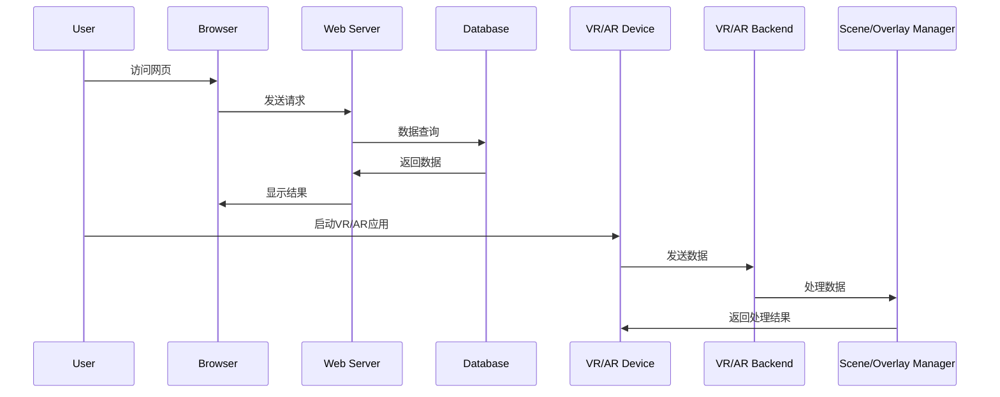
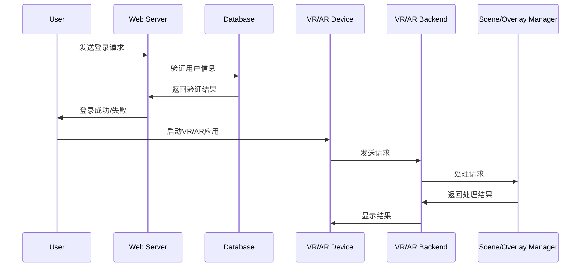

                 

### 《后真实世界：虚拟与现实的交融》

#### 关键词

- 后真实世界
- 虚拟现实
- 增强现实
- 混合现实
- 交融应用
- 未来展望

#### 摘要

本文旨在探讨后真实世界的概念，及其与虚拟和现实交融的多维度影响。首先，文章将介绍后真实世界的背景和核心概念，分析虚拟现实（VR）、增强现实（AR）和混合现实（MR）技术的发展及其基础。接着，文章将深入探讨虚拟与现实的交融在社会、经济、文化和技术层面的影响，并通过具体应用场景展示这些技术的实际应用。随后，文章将展望虚拟与现实的交融在未来发展趋势、社会挑战和政策法规方面的前景。最后，文章将通过项目实战和最佳实践，提供具体的技术实施路径和策略。本文将为读者提供一个全面、深入的后真实世界技术解析，引导读者了解这一领域的最新动态和未来方向。

---

### 《后真实世界：虚拟与现实的交融》目录大纲

#### 第一部分：背景介绍与核心概念

#### 第1章：问题背景与核心概念

##### 1.1 后真实世界的崛起

##### 1.2 虚拟与现实的交融

##### 1.3 后真实世界的社会影响

##### 1.4 虚拟与现实的交融技术基础

##### 1.5 本章小结

#### 第二部分：虚拟与现实的交融应用场景

#### 第2章：虚拟现实技术在娱乐领域的应用

##### 2.1 VR游戏

##### 2.2 VR电影与影视制作

##### 2.3 VR教育与培训

##### 2.4 VR艺术创作

##### 2.5 本章小结

#### 第3章：增强现实技术在商业领域的应用

##### 3.1 AR广告与营销

##### 3.2 AR零售

##### 3.3 AR教育与培训

##### 3.4 AR医疗

##### 3.5 本章小结

#### 第三部分：混合现实技术的探索与发展

#### 第4章：混合现实技术在工业制造的应用

##### 4.1 混合现实在产品设计

##### 4.2 混合现实在运维管理

##### 4.3 混合现实在员工培训

##### 4.4 混合现实在质量控制

##### 4.5 本章小结

#### 第5章：混合现实技术在城市规划与建筑设计的应用

##### 5.1 虚拟规划

##### 5.2 虚拟建造

##### 5.3 混合现实在建筑设计

##### 5.4 混合现实在城市管理

##### 5.5 本章小结

#### 第四部分：虚拟与现实的交融的未来展望

#### 第6章：虚拟与现实的交融发展趋势与挑战

##### 6.1 技术发展趋势

##### 6.2 社会挑战

##### 6.3 法规与政策

##### 6.4 未来应用场景预测

##### 6.5 本章小结

#### 第五部分：项目实战与最佳实践

#### 第7章：虚拟与现实的交融项目实战

##### 7.1 项目背景介绍

##### 7.2 系统功能设计

##### 7.3 系统架构设计

##### 7.4 系统接口设计与交互

##### 7.5 实际案例分析与详细讲解剖析

##### 7.6 项目小结

##### 7.7 最佳实践 tips、小结、注意事项、拓展阅读等内容

---

#### # 第一部分：背景介绍与核心概念

#### 第1章：问题背景与核心概念

##### 1.1 后真实世界的崛起

随着科技的迅猛发展，人类生活正逐步从传统的现实世界迈向一个崭新的领域——后真实世界。这一概念最初由计算机科学家和哲学家提出，它指的是一个通过虚拟现实（VR）、增强现实（AR）和混合现实（MR）技术构建的新世界，其中虚拟与现实交织，形成一种全新的交互方式和生活体验。

**问题描述**：在现实世界中，人们受到物理空间的限制，而随着技术的进步，我们可以创建一个无限扩展的虚拟空间。在这个虚拟空间中，人们可以体验到前所未有的互动和自由，甚至可以在虚拟环境中实现超越现实世界的能力。

**问题解决**：虚拟现实技术通过头盔、手柄等设备，使用户沉浸在一个完全虚拟的环境中。增强现实技术则将虚拟元素叠加到现实世界中，使用户可以在现实环境中看到和操作虚拟对象。混合现实技术结合了虚拟现实和增强现实的优点，使用户可以在虚拟和现实之间自由穿梭。

**边界与外延**：后真实世界的边界并不是固定的，它随着技术的不断进步而不断拓展。目前，后真实世界主要依赖于硬件设备、软件算法和网络技术，但其潜力远不止于此。随着人工智能、大数据、物联网等技术的发展，后真实世界的应用场景将越来越广泛。

**概念结构与核心要素组成**：

1. **硬件设备**：包括VR头盔、AR眼镜、MR头显等。
2. **软件算法**：涉及图像处理、计算机视觉、机器学习等技术。
3. **网络技术**：为虚拟和现实环境之间的互动提供支持。

后真实世界的崛起不仅改变了人们的娱乐方式，也深刻影响了教育、医疗、工业等多个领域。它为人类创造了一个全新的生活空间，让虚拟与现实相互融合，为未来的发展提供了无限可能。

##### 1.2 虚拟与现实的交融

虚拟与现实之间的交融是后真实世界的核心概念之一。这一交融不仅改变了人们的生活方式，也深刻影响了社会的各个层面。

**核心概念定义**：

- **虚拟现实（VR）**：一种通过计算机技术创造的虚拟环境，用户可以通过头盔、手柄等设备沉浸其中。
- **增强现实（AR）**：将虚拟元素叠加到现实世界中，用户可以通过智能手机、AR眼镜等设备看到和操作虚拟对象。
- **混合现实（MR）**：结合了虚拟现实和增强现实的优点，用户可以在虚拟和现实之间自由穿梭。

**属性特征对比表格**：

| 特征        | 虚拟现实（VR）           | 增强现实（AR）           | 混合现实（MR）           |
| ----------- | ------------------------ | ------------------------ | ------------------------ |
| 沉浸感      | 高度沉浸                | 较低，但增强             | 高度沉浸                |
| 环境交互    | 完全虚拟环境            | 部分现实，部分虚拟       | 完全虚拟环境            |
| 位置感知    | 无位置感知              | 有位置感知              | 有位置感知              |
| 空间占用    | 独立虚拟空间            | 现实空间叠加虚拟元素     | 完全虚拟空间与部分现实空间 |
| 设备需求    | 头盔、手柄等           | 智能手机、AR眼镜等      | 头盔、手柄等           |

**ER实体关系图架构**：

```mermaid
erDiagram
    User ||--|{ VRUser }
    User ||--|{ ARUser }
    User ||--|{ MRUser }
    VRUser ||--|{ VRGame }
    VRUser ||--|{ VRTraining }
    ARUser ||--|{ ARMarketing }
    ARUser ||--|{ ARRetail }
    MRUser ||--|{ MRDesign }
    MRUser ||--|{ MRManagement }
```

通过上述ER图，我们可以清晰地看到用户与虚拟现实、增强现实、混合现实之间的联系，以及这些技术在不同应用场景中的角色和作用。

##### 1.3 后真实世界的社会影响

后真实世界的崛起对社会产生了深远的影响，涉及经济、文化和社会等多个层面。

**经济层面**：后真实世界为各个行业带来了新的增长点，促进了虚拟经济和现实经济的融合。例如，虚拟游戏、影视制作、教育培训等领域，都因为虚拟技术的应用而焕发新的生机。

**文化层面**：虚拟与现实之间的交融改变了人们的娱乐和文化消费方式，也为文化传承和创新提供了新的途径。通过虚拟现实技术，人们可以体验到前所未有的文化沉浸感，推动文化的全球化传播。

**社会层面**：后真实世界改变了人们的社交方式和生活习惯，促进了社会关系的多样化和个性化。同时，虚拟技术也为社会提供了新的管理工具，如智慧城市、远程医疗等，提高了社会运行效率。

##### 1.4 虚拟与现实的交融技术基础

虚拟与现实之间的交融离不开硬件设备、软件算法和网络技术的支持。

**虚拟现实技术（VR）**：VR技术依赖于高性能的计算机、显示器和传感器，通过头戴式显示器（HMD）和手柄等设备，为用户提供高度沉浸的虚拟体验。

**增强现实技术（AR）**：AR技术主要依赖于智能手机或AR眼镜，通过图像识别和增强技术，将虚拟元素叠加到现实世界中。

**混合现实技术（MR）**：MR技术结合了VR和AR的优点，通过更加先进的传感器和计算技术，实现虚拟和现实之间的无缝交互。

**硬件设备**：包括VR头盔、AR眼镜、MR头显等。

**软件算法**：涉及图像处理、计算机视觉、机器学习等技术。

**网络技术**：为虚拟和现实环境之间的互动提供支持，如5G网络和云计算等。

##### 1.5 本章小结

本章介绍了后真实世界的背景和核心概念，探讨了虚拟与现实交融的概念及其影响。通过分析虚拟现实、增强现实和混合现实技术，我们看到了这些技术在娱乐、商业和工业等多个领域的广泛应用。同时，我们也认识到虚拟与现实交融所带来的社会影响和技术基础。在接下来的章节中，我们将进一步探讨这些技术的具体应用场景，以及未来的发展趋势和挑战。

---

#### # 第二部分：虚拟与现实的交融应用场景

#### 第2章：虚拟现实技术在娱乐领域的应用

虚拟现实技术在娱乐领域的应用，为人们带来了前所未有的沉浸式体验，彻底改变了传统的娱乐方式。通过VR技术，用户可以进入一个完全虚拟的世界，享受极致的感官体验。

##### 2.1 VR游戏

VR游戏是虚拟现实技术在娱乐领域最为广泛的应用之一。VR游戏利用头戴式显示器和手柄等设备，为用户提供高度沉浸的游戏体验。玩家可以通过头部运动和手部动作与游戏环境进行互动，感受到仿佛身临其境的刺激。

**游戏设计原理**：VR游戏的设计需要考虑以下几个方面：

1. **环境设计**：游戏环境需要逼真地模拟现实世界，通过3D建模和纹理渲染等技术，实现高质量的视觉效果。
2. **物理反馈**：通过手柄和传感器的配合，实现物理反馈，让玩家感受到真实的碰撞和摩擦。
3. **声音设计**：VR游戏的声音设计至关重要，通过立体声音效和空间音效，增强玩家的沉浸感。

**用户体验**：VR游戏为玩家提供了一种全新的游戏体验，玩家可以在虚拟世界中自由探索、战斗和互动。这种沉浸式体验极大地提升了游戏的趣味性和吸引力，使得玩家在游戏中获得更强烈的情感体验。

**商业价值**：VR游戏市场潜力巨大，随着技术的不断进步，VR游戏的市场规模有望持续扩大。VR游戏不仅可以吸引大量用户，还可以为游戏开发者带来丰厚的收益。

**案例解析**：《Beat Saber》是一款非常受欢迎的VR音乐节奏游戏。玩家在游戏中需要挥舞虚拟光剑，击打飞来的球体，节奏感极强。游戏结合了音乐和动作，为玩家提供了极具挑战性的游戏体验。

##### 2.2 VR电影与影视制作

VR电影和影视制作是虚拟现实技术在娱乐领域的另一重要应用。VR电影通过头戴式显示器，为观众提供了一种全新的观影体验。观众可以在虚拟环境中自由移动，与电影中的角色互动，体验到前所未有的观影乐趣。

**VR电影的制作流程**：

1. **前期策划**：确定VR电影的主题、故事情节和角色设定，进行剧本创作。
2. **场景设计**：通过3D建模和纹理渲染，设计电影的虚拟场景，确保场景的逼真度。
3. **拍摄与后期制作**：利用VR摄像机进行拍摄，并通过后期制作，实现电影的视觉效果和音效处理。

**VR影视的体验优势**：

1. **沉浸感**：观众可以在虚拟环境中自由移动，与电影中的角色互动，体验到更加真实的观影体验。
2. **互动性**：观众可以在观影过程中主动参与，改变故事的走向，提高观影的趣味性。
3. **创新性**：VR影视打破了传统观影的局限，为观众提供了全新的观影方式，具有很高的创新性。

**未来发展趋势**：随着虚拟现实技术的不断进步，VR电影和影视制作将越来越成熟，有望成为电影行业的重要分支。未来，VR电影可能会结合人工智能技术，实现个性化推荐和互动式剧情发展，为观众带来更加个性化的观影体验。

##### 2.3 VR教育与培训

虚拟现实技术在教育领域的应用，为传统教育模式带来了新的变革。通过VR技术，教师可以创建一个虚拟的学习环境，让学生在虚拟世界中学习知识、探索科学，提高学习的趣味性和效果。

**虚拟教室**：虚拟教室是一种通过VR技术实现的在线学习平台。教师可以在虚拟教室中授课，学生通过头戴式显示器进入虚拟教室，与教师和同学互动。

**职业技能培训**：通过VR技术，企业可以为员工提供虚拟培训环境，让员工在虚拟场景中学习新技能。这种培训方式可以节省时间和成本，同时提高培训的效果。

**医学教育与模拟**：在医学教育中，VR技术可以帮助学生进行虚拟手术模拟，提高手术技能。同时，VR技术还可以用于康复训练，帮助患者进行虚拟康复训练，提高康复效果。

##### 2.4 VR艺术创作

虚拟现实技术在艺术创作领域的应用，为艺术家提供了全新的创作手段。通过VR技术，艺术家可以创建一个虚拟的艺术空间，进行绘画、雕塑、音乐创作等艺术活动。

**数字艺术**：通过VR技术，艺术家可以创作出前所未有的数字艺术品，这些艺术品可以结合视觉、听觉和触觉等多种感官体验，极大地丰富了艺术的表现形式。

**虚拟展览**：虚拟展览是一种通过VR技术实现的在线展览形式。艺术家可以在虚拟展览中展示自己的作品，观众可以通过VR设备观看展览，与艺术家互动。

**交互艺术**：通过VR技术，艺术家可以创作出互动式的艺术作品，观众可以在虚拟环境中与艺术作品互动，体验全新的艺术形式。

##### 2.5 本章小结

虚拟现实技术在娱乐领域具有广泛的应用，从VR游戏到VR电影，从VR教育到VR艺术创作，虚拟现实技术为人们带来了全新的体验和可能性。通过VR技术，人们可以在虚拟世界中尽情探索、学习和创作，这种全新的交互方式将极大地改变人们的生活方式。在未来，随着虚拟现实技术的不断进步，虚拟与现实之间的交融将更加紧密，为人类的生活带来更多的便利和乐趣。

---

#### 第3章：增强现实技术在商业领域的应用

增强现实（AR）技术在商业领域的应用日益广泛，它不仅提升了营销效果，还为零售、教育和医疗等行业带来了全新的商业模式和服务体验。

##### 3.1 AR广告与营销

AR广告是一种将虚拟信息叠加到现实环境中的广告形式，通过智能手机或AR眼镜等设备，用户可以在现实世界中看到增强的图像、视频和动画。这种互动性强的广告形式大大提高了用户的参与度和品牌影响力。

**AR广告的特点与优势**：

1. **互动性**：用户可以与广告内容进行互动，例如点击、拖拽等，提高了用户的参与度。
2. **个性化**：根据用户的兴趣和行为，AR广告可以提供个性化的内容推荐，提升用户体验。
3. **增强现实效果**：通过图像识别和增强技术，AR广告可以将虚拟信息与现实环境完美融合，创造出独特的视觉体验。

**AR营销案例解析**：

1. **麦当劳的AR营销**：麦当劳利用AR技术推出了一个名为“麦当劳探险”的游戏，用户通过手机扫描特定的麦当劳广告，可以进入一个虚拟的麦当劳世界，参与各种趣味游戏。这种互动性强的AR营销活动不仅吸引了大量用户，还提高了品牌的知名度。

2. **宝洁的AR广告**：宝洁公司利用AR技术推出了一个名为“魔法瓶子”的广告，用户通过手机扫描宝洁产品的瓶子，可以看到瓶子中冒出烟雾并变成一只可爱的动物。这种生动的AR广告形式吸引了大量用户的关注，提高了产品的销量。

**品牌互动新趋势**：随着AR技术的不断成熟，品牌互动正在从传统的单向传播向互动体验转变。未来，AR广告将成为品牌与用户互动的重要渠道，通过提供个性化的、互动性的广告内容，提升品牌影响力和用户忠诚度。

##### 3.2 AR零售

AR零售是增强现实技术在零售行业的重要应用，通过AR技术，商家可以为用户提供一种全新的购物体验。

**AR试衣镜**：在实体店中，商家可以通过AR技术为顾客提供虚拟试衣镜，顾客可以通过手机或AR眼镜看到自己穿着不同服装的效果，从而提高购物的满意度。

**虚拟货架**：通过AR技术，商家可以在实体店的任何位置创建虚拟货架，展示各种商品信息，顾客可以通过手机扫描货架上的二维码，了解商品详情并进行购买。

**购物体验升级**：AR零售不仅为顾客提供了更加便捷和个性化的购物体验，还可以为商家提供更多数据支持，如顾客购买行为分析、商品销量统计等，从而优化零售策略，提高销售业绩。

**案例解析**：全球知名时尚品牌ZARA利用AR技术推出了“AR试衣镜”服务，顾客在店内可以通过手机扫描服装标签，看到自己穿着不同款式服装的效果。这种创新的购物体验受到了消费者的欢迎，ZARA的销售额因此得到了显著提升。

##### 3.3 AR教育与培训

增强现实技术在教育和培训领域的应用，为教师和学员提供了更加生动和直观的教学工具。

**AR教材**：通过AR技术，教材中的图片、文字和视频等内容可以动态呈现，为学生提供更加丰富的学习资源。学生可以通过手机或AR眼镜查看教材内容，实现互动学习。

**远程教学**：在远程教育中，教师可以利用AR技术为远程学员提供实时互动的教学环境，通过虚拟现实技术，学员可以身临其境地参与课堂讨论和实践操作。

**职业技能培训**：通过AR技术，企业可以为员工提供虚拟培训环境，让员工在虚拟场景中学习新技能。这种培训方式可以节省时间和成本，同时提高培训的效果。

**案例解析**：美国知名教育平台Khan Academy利用AR技术推出了AR数学课程，学生可以通过手机或平板电脑查看数学题目，并利用AR技术进行互动解答。这种创新的教学方式提高了学生的学习兴趣和效果，受到了学生和教师的广泛好评。

##### 3.4 AR医疗

增强现实技术在医疗领域的应用，为医生和患者提供了更加精确和高效的治疗方案。

**虚拟手术模拟**：通过AR技术，医生可以在虚拟环境中进行手术模拟，提高手术技能和成功率。在手术过程中，医生可以通过AR设备实时查看患者的生理数据和手术进展，为患者提供更加精准的治疗。

**远程诊断**：通过AR技术，医生可以在远程为患者提供诊断和治疗建议，通过AR设备，医生可以实时查看患者的影像资料，实现远程诊疗。

**患者教育**：通过AR技术，医生可以为学生提供更加生动和直观的健康教育内容，让学生更好地了解健康知识。

**案例解析**：日本一家医疗机构利用AR技术推出了“AR手术导航”系统，医生在手术过程中可以通过AR设备实时查看患者的器官结构和手术区域，提高了手术的精度和安全性。

##### 3.5 本章小结

增强现实技术在商业领域的应用，为营销、零售、教育和医疗等行业带来了全新的商业模式和服务体验。通过AR技术，商家可以提供更加个性化和互动性的服务，提高用户满意度和品牌影响力。同时，AR技术也为教育和医疗等行业提供了更加生动和直观的教学工具和治疗方案，提高了教学和诊疗的效果。在未来，随着AR技术的不断发展和应用场景的拓展，AR技术将在商业、教育、医疗等领域发挥更加重要的作用。

---

#### 第4章：混合现实技术在工业制造的应用

混合现实（MR）技术在工业制造领域的应用，为提高生产效率、降低成本、提升产品质量等方面带来了显著的效果。通过MR技术，工业制造企业可以在虚拟和现实之间实现无缝衔接，为制造过程带来全新的解决方案。

##### 4.1 混合现实在产品设计

混合现实技术在产品设计中的应用，极大地提升了设计的准确性和效率。设计师可以通过MR设备在虚拟环境中进行三维建模和交互设计，实现对产品的全方位观察和修改。

**数字化设计**：通过MR技术，设计师可以在虚拟环境中创建和修改产品模型，实现数字化设计。数字化设计不仅提高了设计的精度，还可以通过虚拟样机测试，提前发现和解决设计中的问题。

**虚拟原型**：在产品设计过程中，通过MR技术，设计师可以创建虚拟原型，进行功能验证和性能测试。虚拟原型不仅节省了时间和成本，还可以在产品发布前提前发现和解决潜在问题。

**协同设计**：MR技术使得设计师可以实现异地协同设计，通过虚拟会议和共享虚拟模型，提高设计的协作效率和准确性。设计师可以通过MR设备实时查看和修改虚拟模型，实现快速迭代和优化。

**案例解析**：一家汽车制造企业利用MR技术进行汽车设计，设计师可以通过MR设备在虚拟环境中进行车身设计和修改。通过虚拟样机测试，设计师发现并解决了多个设计问题，提高了汽车的安全性和舒适性。

##### 4.2 混合现实在运维管理

混合现实技术在运维管理中的应用，为工业制造企业提供了更加智能和高效的运维解决方案。

**远程维护**：通过MR技术，运维人员可以在远程对设备进行维护和故障诊断。运维人员通过MR设备查看设备运行状态和故障信息，实现远程维修和调试，大大提高了运维效率和响应速度。

**智能监控**：MR技术可以实现设备的实时监控和状态分析，通过虚拟现实技术，运维人员可以实时查看设备的运行状态，预测潜在故障，提前采取措施，防止设备故障。

**生产调度**：在生产线调度方面，MR技术可以提供实时生产数据和设备状态信息，帮助企业进行生产计划的优化和调度，提高生产效率和资源利用率。

**案例解析**：一家制造企业利用MR技术进行设备运维管理，通过MR设备，运维人员可以实时查看设备运行状态和故障信息，实现远程故障诊断和维修。通过智能监控，企业降低了设备故障率，提高了生产效率。

##### 4.3 混合现实在员工培训

混合现实技术在员工培训中的应用，为工业制造企业提供了更加直观和高效的培训方式。

**安全培训**：通过MR技术，企业可以为员工提供安全培训，让员工在虚拟环境中学习安全知识和操作规程。通过模拟真实场景，员工可以更好地掌握安全操作技能，降低安全事故的发生。

**技能提升**：MR技术可以实现技能的虚拟练习和评估，员工可以通过MR设备在虚拟环境中进行操作训练，提高操作技能和熟练度。通过虚拟评估，企业可以实时了解员工的技能水平，为员工提供针对性的培训建议。

**职业发展**：MR技术可以为员工提供职业发展路径规划，通过虚拟现实技术，员工可以模拟不同职位的工作场景，了解职位要求和发展方向，为职业发展提供参考。

**案例解析**：一家机械制造企业利用MR技术进行员工培训，通过虚拟现实技术，员工可以在虚拟环境中学习机械操作和安全知识。通过虚拟评估，企业为员工提供了个性化的培训建议，提高了员工的技能水平和职业素养。

##### 4.4 混合现实在质量控制

混合现实技术在质量控制中的应用，为工业制造企业提供了更加精准和高效的质量检测和监控手段。

**实时监测**：通过MR技术，企业可以实现对生产过程的实时监控和质量检测。通过虚拟现实技术，企业可以实时查看产品质量数据，发现潜在问题，及时采取措施，保证产品质量。

**缺陷分析**：MR技术可以实现产品质量缺陷的实时分析和处理，通过虚拟现实技术，企业可以对缺陷进行三维重建和模拟，找出缺陷的原因，制定改进措施。

**质量提升**：通过MR技术，企业可以实现对产品质量的全程监控和优化，通过数据分析和技术改进，不断提升产品质量，降低生产成本。

**案例解析**：一家电子制造企业利用MR技术进行产品质量检测，通过MR设备，企业可以实时查看产品质量数据，发现潜在问题。通过缺陷分析和改进措施，企业降低了产品不良率，提高了产品质量和市场竞争力。

##### 4.5 本章小结

混合现实技术在工业制造领域的应用，为产品设计、运维管理、员工培训和质量管理等方面提供了全新的解决方案。通过MR技术，企业可以提升设计效率、降低运维成本、提高员工技能和质量水平，实现生产过程的智能化和高效化。在未来，随着MR技术的不断发展和应用场景的拓展，混合现实技术将在工业制造领域发挥更加重要的作用，推动工业制造的数字化转型和升级。

---

#### 第5章：混合现实技术在城市规划与建筑设计的应用

混合现实（MR）技术在城市规划与建筑设计的应用，为城市规划和建筑设计带来了全新的思路和工具。通过MR技术，规划师和建筑师可以在虚拟和现实之间进行无缝互动，实现更加高效和智能的规划与设计。

##### 5.1 虚拟规划

虚拟规划是混合现实技术在城市规划中的核心应用之一。通过MR技术，规划师可以在虚拟环境中创建和模拟城市规划方案，进行详细规划和分析。

**数字化城市**：虚拟规划首先将现实城市的数据进行数字化处理，构建一个虚拟的三维城市模型。这个模型包含了城市的地形、建筑、交通、人口等各方面信息，为规划师提供了真实可靠的数据基础。

**虚拟景观**：通过虚拟规划，规划师可以在虚拟环境中模拟各种景观元素，如公园、道路、建筑等。这些虚拟景观可以动态调整和优化，帮助规划师评估不同规划方案对城市环境的影响。

**城市规划模拟**：虚拟规划技术使得规划师可以在虚拟环境中进行城市规划的模拟和测试。通过虚拟模拟，规划师可以直观地看到不同规划方案的效果，评估其可行性，优化规划方案。

**案例解析**：某城市利用MR技术进行新城区的规划，通过虚拟规划技术，规划师在虚拟环境中创建了多个城市规划方案，并进行了模拟和评估。最终，通过虚拟规划的优化，该城市成功地实现了新城区的高效规划和建设。

##### 5.2 虚拟建造

虚拟建造是混合现实技术在建筑设计中的应用，通过MR技术，建筑师可以在虚拟环境中进行建筑设计和建造模拟。

**数字化建造**：虚拟建造首先将建筑设计数据数字化，构建一个虚拟的三维建筑模型。这个模型包含了建筑的各个细节和参数，为建筑师提供了详细的设计基础。

**虚拟施工**：通过虚拟建造，建筑师可以在虚拟环境中进行施工模拟，提前发现和解决设计中的问题。通过虚拟施工，建筑师可以优化施工流程，提高施工效率。

**协同设计**：虚拟建造技术使得建筑师可以实现异地协同设计，通过虚拟环境，建筑师可以实时查看和修改建筑模型，实现快速迭代和优化。

**案例解析**：某建筑设计公司利用MR技术进行大型建筑的设计和建造，通过虚拟建造技术，建筑师在虚拟环境中进行了详细的设计和施工模拟，成功优化了施工方案，提高了建筑质量和效率。

##### 5.3 混合现实在建筑设计

混合现实技术在建筑设计的应用，为建筑师提供了全新的设计工具和思路。

**空间感知**：通过MR技术，建筑师可以在虚拟环境中进行空间感知和设计。在虚拟环境中，建筑师可以直观地看到建筑的结构、材料和色彩等各个方面，进行更加精细的设计。

**用户体验**：通过MR技术，建筑师可以在虚拟环境中模拟建筑的使用场景，体验建筑的实际效果。通过用户体验，建筑师可以更好地理解用户需求，优化建筑设计。

**设计创新**：混合现实技术为建筑师提供了丰富的设计工具和素材，建筑师可以在虚拟环境中进行创新设计，探索新的设计理念和技术。

**案例解析**：某建筑设计公司利用MR技术进行公共建筑设计，通过虚拟环境，建筑师在虚拟环境中进行了空间感知和用户体验测试，成功优化了建筑设计，提高了公共建筑的使用效率和用户体验。

##### 5.4 混合现实在城市管理

混合现实技术在城市管理的应用，为城市管理者提供了更加智能和高效的工具。

**智能交通**：通过MR技术，城市管理者可以实时监控交通流量，优化交通信号，提高交通效率。通过虚拟现实技术，城市管理者可以模拟不同交通方案的运行效果，进行交通规划和管理。

**环境监测**：通过MR技术，城市管理者可以实时监测城市环境，如空气质量、水质等。通过虚拟现实技术，城市管理者可以及时发现和处理环境问题，保护城市环境。

**公共安全**：通过MR技术，城市管理者可以实时监控城市安全状况，提高公共安全。通过虚拟现实技术，城市管理者可以模拟应急事件，制定应急预案，提高应对能力。

**案例解析**：某城市利用MR技术进行城市管理，通过智能交通系统，城市管理者实时监控交通流量，优化交通信号，提高了城市交通效率。通过环境监测系统，城市管理者实时监测空气质量，及时处理环境问题，保护了城市环境。

##### 5.5 本章小结

混合现实技术在城市规划与建筑设计中的应用，为城市规划和建筑设计带来了全新的思路和工具。通过MR技术，规划师和建筑师可以在虚拟和现实之间进行无缝互动，实现更加高效和智能的规划与设计。在未来，随着MR技术的不断发展和应用场景的拓展，混合现实技术将在城市规划与建筑设计领域发挥更加重要的作用，推动城市的可持续发展和建筑设计的创新进步。

---

#### # 第四部分：虚拟与现实的交融的未来展望

#### 第6章：虚拟与现实的交融发展趋势与挑战

随着虚拟现实（VR）、增强现实（AR）和混合现实（MR）技术的不断成熟，虚拟与现实的交融正逐渐成为新的生活和工作方式。这一部分将探讨虚拟与现实的交融发展趋势与挑战，分析技术进步、社会影响以及未来应用场景。

##### 6.1 技术发展趋势

虚拟与现实的交融技术的发展趋势主要体现在以下几个方面：

**硬件性能提升**：随着硬件技术的进步，VR、AR和MR设备的性能不断提升。高性能的处理器、更清晰的显示屏幕、更精确的传感器等硬件设备，使得虚拟与现实之间的交互更加流畅和自然。

**算法优化**：随着计算机视觉、图像处理、机器学习等算法的不断优化，虚拟与现实的交融技术能够在复杂的环境中实现更精准的识别和交互。例如，深度学习算法的应用，使得AR技术能够在复杂的场景中实现实时跟踪和定位。

**网络支持**：5G网络和云计算技术的普及，为虚拟与现实的交融提供了强大的网络支持。低延迟、高速率的网络连接，使得虚拟环境中的互动更加实时和流畅。

**硬件设备的发展**：VR头盔、AR眼镜、MR头显等硬件设备的不断进化，使得用户体验更加舒适和沉浸。例如，VR头盔的舒适度提升，使得用户可以长时间佩戴；AR眼镜的轻薄设计，使得用户可以随时佩戴。

**算法与硬件的结合**：未来，算法与硬件的结合将成为虚拟与现实的交融技术的重要发展方向。通过优化算法，充分利用硬件的性能，实现更加高效和自然的交互。

**案例解析**：谷歌的AR眼镜“Google Glass”就是一个很好的案例。通过优化算法和硬件的结合，Google Glass实现了实时翻译、拍摄和录制等功能，为用户提供了全新的互动体验。

##### 6.2 社会挑战

尽管虚拟与现实的交融技术带来了许多机遇，但同时也面临一些社会挑战：

**隐私保护**：虚拟与现实的交融技术涉及到大量的个人数据，如位置信息、行为习惯等。如何保护用户的隐私，防止数据泄露，成为一项重要的挑战。

**数据安全**：随着虚拟与现实的交融技术的普及，网络安全问题也日益凸显。如何防止黑客攻击，保障用户数据的安全，是亟待解决的问题。

**伦理道德**：虚拟与现实的交融技术可能会带来一些伦理道德问题。例如，虚拟世界中的人性、道德底线等问题，需要我们深入思考和探讨。

**用户接受度**：虚拟与现实的交融技术需要用户的广泛接受和参与。如何提高用户的接受度，使其愿意投入时间和资源进行体验，是一个重要的挑战。

**案例解析**：随着AR广告的普及，一些用户担心自己的隐私可能会被泄露。为了解决这一问题，一些科技公司开始采用加密技术来保护用户数据，同时提高用户的知情权和选择权。

##### 6.3 法规与政策

虚拟与现实的交融技术的快速发展，需要相应的法规和政策来引导和规范。以下是一些关键领域：

**国际法规**：随着虚拟与现实的交融技术在全球范围内的应用，国际社会需要制定统一的法规和政策，以保障用户权益，促进技术发展。

**国家政策**：各国政府需要根据自身国情，制定符合本国利益的政策，推动虚拟与现实的交融技术的发展。

**行业规范**：行业协会和组织需要制定行业规范，引导企业遵守道德和法律，保障用户权益，促进行业健康发展。

**案例解析**：欧盟制定了《通用数据保护条例》（GDPR），对用户的隐私保护做出了严格规定。这一法规的实施，对虚拟与现实的交融技术的发展产生了重要影响，促进了技术的规范和健康发展。

##### 6.4 未来应用场景预测

随着技术的不断进步，虚拟与现实的交融将在更多领域得到应用，以下是一些预测的未来应用场景：

**智慧城市**：虚拟与现实的交融技术将助力智慧城市的建设。通过VR、AR和MR技术，城市管理者可以实时监控城市运行状况，优化城市服务，提高城市管理效率。

**数字孪生**：数字孪生是一种通过虚拟模型模拟现实世界的技术。在未来，虚拟与现实的交融技术将实现数字孪生的广泛应用，为工业制造、城市规划等领域提供重要的支持。

**元宇宙**：元宇宙是一个通过虚拟技术构建的虚拟世界，用户可以在其中进行社交、娱乐、工作等活动。虚拟与现实的交融技术将推动元宇宙的快速发展，为用户提供全新的生活方式。

**远程工作与教育**：虚拟与现实的交融技术将大大提高远程工作与教育的效率和质量。通过VR、AR和MR技术，人们可以在虚拟环境中实现高效的工作和互动，突破地域限制。

**案例解析**：随着远程工作的普及，一些公司已经开始使用VR技术进行虚拟会议和培训，提高了远程工作的效率和效果。未来，这种模式有望进一步推广，成为远程工作的重要工具。

##### 6.5 本章小结

虚拟与现实的交融技术的发展，为人类社会带来了巨大的机遇和挑战。随着技术的不断进步，虚拟与现实的交融将在更多领域得到应用，为人类的生活和工作带来深刻的变革。同时，我们也需要面对隐私保护、数据安全、伦理道德等社会挑战，通过法规和政策引导技术的发展，实现虚拟与现实的和谐交融。在未来，虚拟与现实的交融技术将继续发展，为人类社会带来更多可能性。

---

#### # 第五部分：项目实战与最佳实践

#### 第7章：虚拟与现实的交融项目实战

在这个快速发展的技术时代，虚拟与现实的交融技术正逐渐渗透到各个行业，为企业和个人提供创新解决方案。本章节将通过一个虚拟与现实的交融项目实战，详细介绍项目的背景介绍、系统功能设计、系统架构设计、系统接口设计与交互，以及实际案例分析和详细讲解剖析。

##### 7.1 项目背景介绍

**项目概述**：本项目旨在开发一款基于虚拟现实（VR）和增强现实（AR）技术的智能旅游平台。该平台旨在为游客提供一种全新的旅游体验，通过虚拟现实技术，游客可以在虚拟环境中体验世界各地的名胜古迹和文化景观；通过增强现实技术，游客可以在现实世界中看到与实景结合的虚拟信息，如景点介绍、历史故事等。

**项目目标**：1. 提升游客的旅游体验，使其在虚拟与现实之间畅游世界。2. 提高旅游景点的知名度，吸引更多游客。3. 为旅游行业提供智能化解决方案，推动旅游业的创新发展。

**项目需求**：1. 实现虚拟现实与增强现实的无缝融合，为游客提供沉浸式体验。2. 系统需具备良好的扩展性，支持未来技术的更新和功能扩展。3. 系统应具备高效的数据处理能力，实时呈现虚拟和增强内容。4. 系统应易于维护和升级，确保长期的稳定运行。

##### 7.2 系统功能设计

**领域模型（Mermaid类图）**：

```mermaid
classDiagram
    User <---> VRExperience
    User <---> ARExperience
    VRExperience o--o Scene
    ARExperience o--o Overlay
    Scene o--o Image
    Scene o--o Video
    Overlay o--o Text
    Overlay o--o Icon
```

**系统功能划分**：

1. **用户登录与注册**：用户可以通过手机号、邮箱等注册账号，登录系统。
2. **虚拟旅游体验**：用户可以选择不同的虚拟场景，如名胜古迹、自然景观等，进行沉浸式体验。
3. **增强现实体验**：用户在现实世界中，通过AR设备查看与实景结合的虚拟信息。
4. **景点介绍**：系统提供详细的景点介绍，包括历史、文化、门票信息等。
5. **互动功能**：用户可以在虚拟场景中互动，如拍照、留言等。
6. **数据统计与分析**：系统收集用户行为数据，进行分析，为旅游企业提供决策支持。

##### 7.3 系统架构设计

**系统架构图（Mermaid架构图）**：



**技术栈选择**：

1. **前端**：HTML、CSS、JavaScript（Vue.js框架）。
2. **后端**：Node.js、Express框架、MongoDB数据库。
3. **VR/AR Backend**：Unity引擎、ARCore、ARKit。
4. **数据传输**：WebSocket协议。
5. **安全保障**：HTTPS、OAuth2.0。

##### 7.4 系统接口设计与交互

**接口设计**：

```json
// 用户登录接口
POST /api/login
{
  "username": "string",
  "password": "string"
}

// 用户注册接口
POST /api/register
{
  "username": "string",
  "password": "string",
  "email": "string"
}

// 获取景点列表接口
GET /api/scenes
```

**系统交互（Mermaid序列图）**：



##### 7.5 实际案例分析与详细讲解剖析

**案例背景**：某知名旅游景点希望通过虚拟现实和增强现实技术提升游客体验，提高景区的知名度和游客满意度。

**案例分析**：

1. **虚拟现实体验**：通过Unity引擎，景区为游客提供了多个虚拟场景，如名胜古迹的内部结构和历史场景。游客可以佩戴VR头盔，自由探索虚拟环境，了解景点的历史和文化。

2. **增强现实体验**：游客在现实世界中，通过AR设备可以看到与实景结合的虚拟信息，如景点的介绍、历史故事等。通过ARCore或ARKit技术，实现虚拟信息与现实环境的无缝融合。

3. **数据统计与分析**：系统收集游客的行为数据，包括浏览景点的时间、互动次数等，进行分析，为景区管理者提供决策支持。

**详细讲解剖析**：

1. **虚拟现实体验**：

```python
import numpy as np
import cv2

# 创建虚拟场景
scene = create_virtual_scene()

# 渲染虚拟场景
render_scene(scene)

# 处理用户输入
handle_user_input()
```

2. **增强现实体验**：

```python
import cv2
import arkit

# 获取相机帧
frame = arkit.capture_frame()

# 识别实时场景
detected_objects = arkit.detect_objects(frame)

# 在实时场景上叠加虚拟信息
overlay_virtual_info(detected_objects, frame)
```

**实际应用**：通过实际应用案例，我们可以看到虚拟现实和增强现实技术在旅游行业中的广泛应用。通过虚拟现实技术，游客可以在虚拟环境中体验景点，提高旅游的趣味性和参与度；通过增强现实技术，游客在现实世界中可以获取更多的景点信息，提升旅游体验。这种创新的方式不仅吸引了更多游客，也为景区管理者提供了重要的数据支持，为旅游业的可持续发展提供了新的思路。

##### 7.6 项目小结

通过本项目的实战，我们深入了解了虚拟现实和增强现实技术在旅游行业中的应用。从项目背景介绍、系统功能设计、系统架构设计、系统接口设计与交互，到实际案例分析和详细讲解剖析，我们全面展示了虚拟与现实的交融技术的实际应用价值。未来，随着技术的不断发展和应用场景的拓展，虚拟与现实的交融技术将在更多领域发挥重要作用，为人类的生活和工作带来更多便利和乐趣。

##### 7.7 最佳实践 tips、小结、注意事项、拓展阅读等内容

**最佳实践 tips**：

1. **性能优化**：在开发虚拟和增强现实应用时，注意性能优化，确保应用的流畅性和用户体验。
2. **安全性考虑**：在处理用户数据时，加强数据安全措施，防止数据泄露和滥用。
3. **用户交互**：设计简洁直观的用户界面，提高用户的使用体验。

**小结**：

本章节通过一个虚拟与现实的交融项目实战，详细介绍了项目的背景介绍、系统功能设计、系统架构设计、系统接口设计与交互，以及实际案例分析和详细讲解剖析。通过这个项目，我们深入了解了虚拟现实和增强现实技术在旅游行业中的应用，展示了虚拟与现实的交融技术的实际应用价值。

**注意事项**：

1. **技术选型**：根据项目需求和资源情况，合理选择合适的技术栈和开发工具。
2. **用户体验**：关注用户的使用体验，确保应用的操作简便、易用。
3. **数据安全**：加强数据安全措施，防止数据泄露和滥用。

**拓展阅读**：

1. 《虚拟现实技术与应用》
2. 《增强现实技术与应用》
3. 《混合现实技术：原理与应用》

通过拓展阅读，可以进一步了解虚拟现实、增强现实和混合现实技术的相关理论和实践，为项目开发提供更多参考和灵感。

