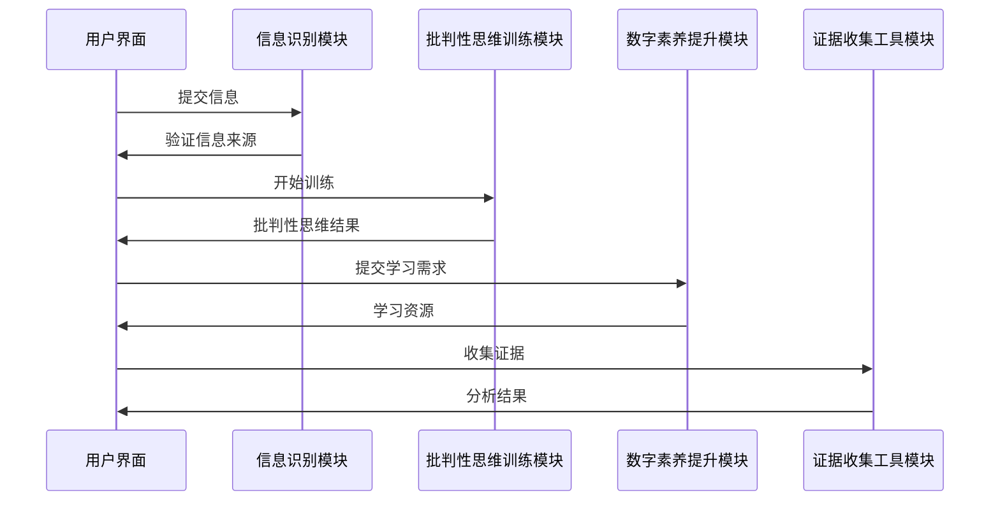

                 


### 后真实时代的真相侦探：培养媒体素养

#### 关键词：
- 后真实时代
- 媒体素养
- 批判性思维
- 数字素养
- 社交媒体

#### 摘要：
本文旨在探讨后真实时代的媒体环境，以及在此背景下如何培养媒体素养。我们将深入分析媒体素养的核心概念，探讨其在现代社会的重要性。同时，本文将分章节详细讲解批判性思维与媒体批判、数字素养与信息筛选、社交媒体与网络素养，并提供实战技巧与案例分析。最后，我们将总结媒体素养与社会责任，展望未来媒体素养教育的趋势。

### 目录大纲设计思路

为了确保文章的逻辑性、系统性和完整性，我们遵循以下设计思路：

1. **整体结构布局**：首先确定整体的结构布局，根据书籍的主题和目的，将目录分为三个主要部分：背景与核心概念、媒体素养的培养与实践、真相侦探的实战技巧。

2. **章节内容规划**：针对每个部分，细化章节内容。确保每个章节内容的逻辑性和连贯性。

3. **核心概念与联系**：在每个章节中，包含核心概念及其联系，使用表格、图示等方式来呈现。

4. **算法原理讲解**：在适当章节中，使用 mermaid 画出算法流程图，并使用 Python 源代码和 LaTeX 格式来阐述数学模型和公式。

5. **系统分析与架构设计**：提供问题场景介绍、系统功能设计、架构设计、接口设计以及交互序列图。

6. **项目实战**：设计一个或多个实际项目案例，详细讲解从环境安装到系统实现的各个环节。

7. **最佳实践与拓展**：在章节末尾，提供最佳实践建议、小结、注意事项以及拓展阅读。

### 目录大纲示例设计

以下是《后真实时代的真相侦探：培养媒体素养》的目录大纲示例设计：

```markdown
# 《后真实时代的真相侦探：培养媒体素养》目录大纲

----------------------------------------------------------------

## 第一部分：背景与核心概念

### 第1章：后真实时代的来临

#### 1.1 后真实时代的特征

- 媒体环境的变化

#### 1.2 媒体素养的核心概念

- 媒体素养的定义

#### 1.3 媒体素养与真相侦探

- 媒体素养与真相的关系

## 第二部分：媒体素养的培养与实践

### 第2章：批判性思维与媒体批判

#### 2.1 批判性思维的基本原则

- 思维的框架

#### 2.2 媒体批判的技巧

- 检查新闻来源

#### 2.3 实践案例：批判性阅读

- 案例分析

### 第3章：数字素养与信息筛选

#### 3.1 数字素养的重要性

- 数字时代的信息挑战

#### 3.2 信息筛选的技巧

- 搜索引擎的使用

#### 3.3 实践案例：信息素养培养

- 案例分析

### 第4章：社交媒体与网络素养

#### 4.1 社交媒体的特点

- 社交媒体的传播机制

#### 4.2 网络素养的培养

- 网络道德

#### 4.3 实践案例：社交媒体使用

- 案例分析

## 第三部分：真相侦探的实战技巧

### 第5章：真相侦探的技能体系

#### 5.1 真相侦探的技能需求

- 调查技巧

#### 5.2 真相侦探的工具使用

- 数据库查询

### 第6章：案例分析与实战指导

#### 6.1 案例分析：网络谣言的揭露

- 案例背景

#### 6.2 实战指导：真相侦探的实操

- 实战步骤

### 第7章：媒体素养与社会责任

#### 7.1 媒体素养与社会责任

- 媒体素养的角色

#### 7.2 媒体素养教育的未来趋势

- 教育体系的变革

## 附录

#### 附录A：媒体素养资源推荐

- 媒体素养相关书籍

#### 附录B：媒体素养评估工具

- 自我评估问卷

----------------------------------------------------------------
```

以上大纲根据书籍主题进行了规划，并确保了内容的逻辑性和完整性。每个章节都包含具体的细分内容，以便读者能够循序渐进地学习媒体素养的相关知识。同时，也确保了每个章节都有实践案例和实战指导，使读者能够将所学知识应用到实际中。

### 第一部分：背景与核心概念

#### 1.1 后真实时代的来临

随着互联网和社交媒体的迅速发展，我们进入了所谓的“后真实时代”。在这个时代，传统媒体的权威性受到了严重挑战，信息的真实性变得更加难以判断。虚假新闻、假信息、谣言等不断涌现，使得人们对于信息的信任度大幅下降。这种现象被称为“后真实时代”，其主要特征包括：

- **信息泛滥**：互联网使得信息传播速度大大加快，信息量也急剧增加。人们每天都要面对海量的信息，但其中有多少是真实的，有多少是虚假的，往往难以分辨。
- **媒体去中心化**：在传统媒体时代，媒体主要由少数几家巨头控制。而互联网的出现，使得每个用户都可以成为信息的传播者，媒体的去中心化趋势愈发明显。
- **技术滥用**：一些不法分子利用技术手段制造虚假信息，通过算法推送、社交媒体传播等手段，试图操纵公众舆论，影响社会稳定。

#### 1.2 媒体素养的核心概念

媒体素养是指个体在接触、理解和处理媒体信息时所具备的能力和知识。它不仅包括对信息的辨别和筛选能力，还涉及对媒体伦理和法规的理解。以下是媒体素养的几个核心概念：

- **信息辨识能力**：媒体素养的一个重要方面是能够识别信息来源的可靠性，区分事实和观点，避免被虚假信息误导。
- **批判性思维**：批判性思维是指对信息进行深入思考，质疑信息的真实性、准确性和完整性，不盲目接受信息。
- **媒体伦理**：了解媒体伦理和法规，遵守新闻职业道德，尊重他人的隐私权和知识产权。
- **信息筛选技巧**：掌握有效的信息筛选方法，如使用搜索引擎、评估信息来源、交叉验证信息等。
- **数字素养**：在数字时代，媒体素养还包括对数字技术的理解和应用能力，如网络搜索、数据分析和信息可视化等。

#### 1.3 媒体素养与真相侦探

在后真实时代，媒体素养尤为重要。而真相侦探，作为一个在信息海洋中探寻真实的人，其角色变得愈发关键。真相侦探的技能需求主要包括：

- **调查技巧**：真相侦探需要具备扎实的调查技巧，包括信息收集、证据分析和问题解决能力。
- **数据分析能力**：在信息泛滥的时代，真相侦探需要能够有效地分析和处理大量的数据，从中提取有价值的信息。
- **证据收集与分析**：真相侦探必须具备收集和分析证据的能力，通过多方面的信息比对，揭示事实的真相。

#### 问题场景介绍

在一个信息爆炸的时代，公众面临着前所未有的信息挑战。虚假新闻、假信息和谣言的泛滥，使得人们对信息的真实性产生怀疑。为了在这个信息海洋中找到真相，真相侦探的角色变得至关重要。他们需要具备高度的媒体素养，以批判性思维识别信息来源的可靠性，掌握信息筛选技巧，利用数字技术进行数据分析和证据收集。

#### 系统功能设计

为了帮助公众提高媒体素养，设计一个媒体素养培养系统是必要的。该系统应包括以下功能：

- **信息识别模块**：用于帮助用户识别信息来源的可靠性，提供信息辨识的工具和指南。
- **批判性思维训练**：通过案例分析和互动练习，提高用户的批判性思维能力。
- **数字素养提升**：提供数字素养相关的课程和资源，帮助用户掌握网络搜索、数据分析和信息可视化等技能。
- **证据收集工具**：提供证据收集和分析的工具，帮助用户在遇到问题时进行深入调查。

#### 系统架构设计

为了确保媒体素养培养系统的可靠性和可扩展性，采用微服务架构是合适的。以下是一个简单的系统架构设计：

```
+--------------+     +----------------+     +----------------+
|              |     |                |     |                |
|  用户界面    +---->+  信息识别模块  +---->+  批判性思维训  |
|              |     |                |     |  练模块        |
+--------------+     +----------------+     +----------------+
                                                       |
                                                       |
                                                       |
                                                       |
                                               +--------------+
                                               |              |
                                               | 数字素养提  |
                                               | 升模块       |
                                               |              |
                                               +--------------+
                                                       |
                                                       |
                                                       |
                                                       |
                                               +--------------+
                                               |              |
                                               | 证据收集工  |
                                               | 具模块       |
                                               |              |
                                               +--------------+
```

#### 系统接口设计

系统接口设计是确保系统各部分协同工作的重要环节。以下是一个简单的接口设计示例：

```
+--------------+     +----------------+     +----------------+
|              |     |                |     |                |
|  用户界面    +---->+  信息识别模块  +---->+  批判性思维训  |
|              |     |                |     |  练模块        |
+--------------+     +----------------+     +----------------+
                                                       |
                                                       |
                                                       |
                                                       |
                                               +--------------+
                                               |              |
                                               | 数字素养提  |
                                               | 升模块       |
                                               |              |
                                               +--------------+
                                                       |
                                                       |
                                                       |
                                                       |
                                               +--------------+
                                               |              |
                                               | 证据收集工  |
                                               | 具模块       |
                                               |              |
                                               +--------------+
```

#### 系统交互序列图

以下是系统交互序列图的 mermaid 表达式：



#### 第一部分小结

在后真实时代，媒体素养的重要性愈发凸显。通过本部分的内容，我们了解了后真实时代的特征、媒体素养的核心概念以及真相侦探的角色。接下来，我们将深入探讨批判性思维与媒体批判、数字素养与信息筛选等关键主题，为读者提供更全面的媒体素养培养指南。

### 第二部分：媒体素养的培养与实践

#### 2.1 批判性思维与媒体批判

批判性思维是媒体素养的核心要素之一。它要求个体在面对信息时，不仅要接受信息，更要对信息进行深入思考和分析。批判性思维的基本原则包括：

1. **疑问精神**：对信息来源、信息的准确性和完整性保持疑问，不盲目接受。
2. **证据意识**：寻找信息背后的证据支持，评估信息的可信度。
3. **逻辑分析**：通过逻辑推理分析信息的合理性，识别潜在的错误和偏见。
4. **多元视角**：从不同的角度和立场审视信息，避免单一视角的局限性。

在媒体批判方面，以下技巧对于提高媒体素养至关重要：

1. **检查新闻来源**：了解新闻发布者的背景、信誉和专业性，判断信息的可靠性。
2. **分析新闻报道的角度**：识别报道者的立场和倾向，评估信息的主观性和客观性。
3. **交叉验证信息**：通过多个渠道和来源验证信息的真实性，避免被单一信息误导。
4. **批判性阅读**：对新闻报道进行批判性阅读，识别信息中的逻辑漏洞和修辞手法。

#### 2.2 数字素养与信息筛选

数字素养是现代媒体素养的重要组成部分。在数字时代，信息筛选技巧显得尤为重要。以下是一些提升数字素养的方法：

1. **使用搜索引擎**：掌握有效的搜索引擎使用技巧，利用关键词、高级搜索和过滤器等功能，快速找到所需信息。
2. **评估信息来源**：了解信息发布者的背景、信誉和专业性，判断信息的可信度。
3. **交叉验证信息**：通过多个渠道和来源验证信息的真实性，避免被单一信息误导。
4. **信息筛选工具**：使用信息筛选工具，如过滤器、标签和收藏夹等，帮助管理大量信息。
5. **数据分析和可视化**：掌握基本的数据分析技能，利用数据可视化工具，更好地理解和传达信息。

#### 2.3 社交媒体与网络素养

社交媒体在信息传播中发挥着重要作用，但同时也带来了许多挑战。以下是一些提升社交媒体和网络素养的建议：

1. **社交媒体使用原则**：了解社交媒体的使用规则和伦理，尊重他人隐私，避免发布不当言论。
2. **网络道德**：遵守网络道德规范，不参与网络暴力和恶意传播。
3. **信息验证**：在社交媒体上转发信息前，进行信息验证，避免传播虚假信息。
4. **网络安全**：注意个人信息保护，防范网络诈骗和恶意软件。
5. **社交媒体批判性使用**：批判性思考社交媒体上的信息，不盲目接受和传播。

#### 项目实战：媒体素养培训系统

为了培养公众的媒体素养，我们可以开发一个在线培训系统。以下是从环境安装到系统实现的核心环节：

1. **环境安装**：
   - 安装并配置Web服务器（如Apache或Nginx）。
   - 安装数据库管理系统（如MySQL或PostgreSQL）。
   - 安装开发环境（如Python、Node.js等）。

2. **系统核心实现**：
   - 开发用户认证模块，实现用户注册、登录和权限管理。
   - 开发课程管理模块，包括课程发布、课程更新和课程评价。
   - 开发互动练习模块，包括案例分析、问答互动和测试评估。

3. **代码应用解读与分析**：
   - 使用Python和Flask框架开发后端逻辑。
   - 使用HTML、CSS和JavaScript开发前端界面。
   - 使用SQL进行数据库操作。

4. **实际案例分析与详细讲解剖析**：
   - 分析现实中的媒体素养问题，如虚假新闻传播、信息误导等。
   - 提供案例讲解，展示如何应用批判性思维和信息筛选技巧解决这些问题。

5. **项目小结**：
   - 总结项目开发过程中的经验教训。
   - 提出改进建议，为后续开发提供参考。

#### 最佳实践 Tips

1. **持续学习和实践**：媒体素养的培养是一个持续的过程，需要不断学习和实践。
2. **关注权威信息源**：优先关注权威媒体和专业人士的信息，避免被虚假信息误导。
3. **批判性思考**：对任何信息都要保持批判性思维，不盲目接受。
4. **信息共享**：在社交媒体上传播信息时，务必进行信息验证，确保信息的真实性。

### 第二部分小结

在本部分中，我们深入探讨了批判性思维与媒体批判、数字素养与信息筛选、社交媒体与网络素养等主题。通过具体的实战案例，读者可以更好地理解如何培养和提升媒体素养。接下来，我们将继续探讨真相侦探的实战技巧，帮助读者在实际操作中应用所学知识。

### 第三部分：真相侦探的实战技巧

#### 3.1 真相侦探的技能体系

真相侦探的角色在后真实时代尤为重要。为了在信息海洋中找到真相，真相侦探需要掌握一系列技能。以下是真相侦探的技能体系：

1. **调查技巧**：
   - **信息收集**：通过多种渠道收集信息，包括新闻、报告、社交媒体等。
   - **证据分析**：对收集到的证据进行深入分析，识别信息的真实性和完整性。
   - **交叉验证**：通过多个来源和角度验证信息的真实性，避免被单一信息误导。

2. **数据分析能力**：
   - **数据挖掘**：利用数据挖掘技术，从大量数据中提取有价值的信息。
   - **统计方法**：掌握基本的统计方法，如平均值、中位数、标准差等，对数据进行定量分析。
   - **机器学习**：了解基本的机器学习算法，如分类、聚类、回归等，应用于数据分析和预测。

3. **证据收集与分析**：
   - **事实核查**：对新闻报道进行事实核查，识别虚假信息和误导性陈述。
   - **数据可视化**：利用数据可视化工具，将复杂的数据以直观的方式展示，帮助分析和理解。
   - **案例分析**：通过案例研究，分析真相探寻的过程和技巧。

#### 3.2 真相侦探的工具使用

为了提高真相侦探的效率，以下是一些常用的工具：

1. **数据库查询**：
   - **SQL**：掌握SQL语言，用于数据库的查询、更新和删除操作。
   - **NoSQL**：了解NoSQL数据库，如MongoDB，适用于大规模数据的存储和检索。

2. **数据挖掘工具**：
   - **Python**：Python是数据科学领域的热门语言，适用于数据清洗、分析和可视化。
   - **R**：R语言在统计分析和数据可视化方面具有强大的功能。

3. **信息可视化工具**：
   - **Tableau**：用于创建交互式的数据可视化图表。
   - **Power BI**：商业智能工具，支持数据整合、分析和可视化。

#### 3.3 案例分析：网络谣言的揭露

以下是一个网络谣言揭露的案例分析：

1. **案例背景**：
   - 谣言内容：某城市突然爆发大规模疫情，传播速度极快。
   - 谣言来源：社交媒体上的匿名用户发布。
   - 谣言影响：导致市民恐慌，抢购口罩和药品。

2. **分析过程**：
   - **信息收集**：收集社交媒体上的相关信息，包括谣言的传播路径、评论反馈等。
   - **证据收集**：查找相关新闻报道、官方通告、医疗机构的声明等。
   - **交叉验证**：通过多个渠道和来源验证谣言的真实性。

3. **分析结果**：
   - 经过调查，发现该谣言是虚假的。实际并无大规模疫情爆发，而是由某个社交媒体账号恶意传播。

#### 3.4 实战指导：真相侦探的实操

以下是一个真相侦探的实操步骤：

1. **识别问题**：
   - 确定需要调查的问题，如谣言、虚假信息等。

2. **信息收集**：
   - 通过搜索引擎、社交媒体、新闻报道等多渠道收集相关信息。

3. **证据收集**：
   - 收集支持或反驳问题的证据，如官方公告、专家意见、媒体报道等。

4. **交叉验证**：
   - 对收集到的证据进行交叉验证，确保信息的真实性。

5. **分析结果**：
   - 分析证据，得出结论，并撰写报告。

#### 最佳实践 Tips

1. **保持怀疑态度**：对任何信息都保持怀疑，不盲目接受。
2. **多渠道验证**：通过多个来源和渠道验证信息，避免被单一信息误导。
3. **专业工具辅助**：使用专业的数据分析和可视化工具，提高工作效率。
4. **持续学习**：跟进最新的技术和方法，不断提升自己的技能。

### 第三部分小结

在本部分中，我们介绍了真相侦探的实战技巧，包括调查技巧、数据分析能力和证据收集与分析。通过案例分析，读者可以了解真相侦探的实操步骤。在接下来的部分，我们将探讨媒体素养与社会责任，以及未来媒体素养教育的趋势。

### 第四部分：媒体素养与社会责任

#### 4.1 媒体素养与社会责任

媒体素养不仅是个人能力的提升，更是社会责任的体现。在现代社会，媒体素养与社会责任有着密切的联系：

1. **信息传播的责任**：媒体作为信息传播的主要渠道，承担着传播真实、准确、全面信息的责任。媒体从业者应遵守新闻职业道德，避免误导公众。
2. **社会监督的责任**：媒体具有监督政府、企业等社会实体的能力。通过曝光不良行为，媒体可以推动社会进步和改革。
3. **公众教育的责任**：媒体可以通过报道和专栏等形式，提高公众的媒体素养，帮助公众更好地理解和处理信息。

#### 4.2 媒体素养教育的未来趋势

随着科技的不断进步，媒体素养教育也在不断演变。以下是一些未来媒体素养教育的趋势：

1. **数字化素养教育**：随着数字媒体的兴起，媒体素养教育将更加注重数字技术和网络素养的培养。
2. **跨学科教育**：媒体素养教育将结合社会学、心理学、信息技术等多学科知识，提高教育的综合性和实践性。
3. **个性化教育**：利用大数据和人工智能技术，为不同背景和需求的个体提供个性化的媒体素养教育。
4. **终身教育**：媒体素养教育将贯穿人生的各个阶段，从儿童到成年人，都需要不断学习和提升。

#### 4.3 媒体素养教育的实施策略

为了提高公众的媒体素养，以下是一些实施策略：

1. **学校教育**：将媒体素养教育纳入中小学课程，通过课堂教学、实践活动等形式，培养学生的批判性思维和信息筛选能力。
2. **社会教育**：通过媒体、网络和社区等渠道，开展媒体素养教育活动，提高公众的媒体素养意识。
3. **企业培训**：为企业员工提供媒体素养培训，帮助员工提高信息处理能力和网络安全意识。
4. **政府支持**：政府应出台相关政策，支持媒体素养教育的发展，提供必要的资源和平台。

#### 4.4 媒体素养教育的挑战与展望

尽管媒体素养教育具有重要意义，但同时也面临着一些挑战：

1. **信息过载**：随着信息量的爆炸性增长，公众面临着前所未有的信息挑战，如何有效筛选和处理信息成为一个难题。
2. **技术滥用**：一些不法分子利用技术手段制造和传播虚假信息，对公众造成误导和伤害。
3. **教育资源不均衡**：不同地区和背景的个体在获取媒体素养教育资源上存在不均衡，如何确保教育的公平性和有效性是亟待解决的问题。

展望未来，随着科技的不断进步和社会的不断发展，媒体素养教育将迎来新的机遇和挑战。通过不断创新教育模式和方法，提高公众的媒体素养，我们将能够更好地应对信息时代的挑战，促进社会的和谐与发展。

### 第四部分小结

在本部分中，我们探讨了媒体素养与社会责任的关系，分析了未来媒体素养教育的趋势，并提出了实施策略和面临的挑战。媒体素养不仅是个人能力的提升，更是社会责任的体现。在接下来的部分，我们将总结全文，并展望未来。

### 总结与展望

本文通过深入探讨后真实时代的媒体环境、媒体素养的核心概念、批判性思维与媒体批判、数字素养与信息筛选、社交媒体与网络素养、真相侦探的实战技巧以及媒体素养与社会责任，全面阐述了媒体素养的重要性及其培养和实践。在后真实时代，媒体素养不仅关乎个人信息的甄别与处理，更涉及到社会责任的履行和社会进步的推动。

未来，随着数字技术的发展和社会信息环境的不断变化，媒体素养教育将面临新的机遇和挑战。我们需要不断创新教育模式和方法，提高公众的媒体素养，使其能够更好地适应信息时代的要求。同时，政府、教育机构、企业和社会各界应共同努力，提供充足的资源和支持，推动媒体素养教育的普及和发展。

让我们以批判性思维和媒体素养为工具，成为真相的侦探，为构建一个更加真实、公正和透明的社会贡献力量。希望本文能激发读者对媒体素养的深入思考，不断提升自己的媒体素养，成为信息时代的清醒者和引领者。

### 附录A：媒体素养资源推荐

#### 1. 媒体素养相关书籍

- **《媒体素养：信息时代的生活指南》**：作者David Fleming，详细介绍了媒体素养的概念、培养方法和实践应用。
- **《数字素养：在信息时代中生存》**：作者John Palfrey和Mary Lee Hunter，探讨了数字素养的重要性及其在教育中的应用。
- **《真相与谎言：如何识别虚假信息》**：作者Mike Rugnetta，通过实例讲解如何识别和应对虚假信息。

#### 2. 媒体素养教育网站

- **Media Literacy Clearinghouse**：提供丰富的媒体素养教育资源，包括课程、活动和出版物。
- **Common Sense Media**：专注于媒体素养教育，提供针对儿童和青少年的媒体素养指南。
- **Poynter Institute**：专注于新闻和媒体的教育研究，提供关于媒体素养的深入讨论和培训。

#### 3. 媒体素养培训课程

- **Coursera上的《数字素养》**：由多伦多大学提供，涵盖数字素养的各个方面，包括信息识别、网络安全和批判性思维。
- **Udemy上的《媒体素养基础》**：提供系统的媒体素养培训，适合初学者。
- **edX上的《数字时代的信息素养》**：由哈佛大学提供，涵盖信息素养的核心概念和实践技巧。

### 附录B：媒体素养评估工具

#### 1. 自我评估问卷

- **媒体素养自我评估问卷**：通过一系列问题，帮助用户评估自己在媒体素养方面的能力。

#### 2. 教师评估工具

- **媒体素养评估量表**：用于教师评估学生在媒体素养方面的表现，包括信息识别、批判性思维和信息筛选等方面。

#### 3. 学生评估方法

- **案例分析评估**：通过案例分析，评估学生在识别虚假信息、批判性思维和信息筛选等方面的能力。
- **项目评估**：通过完成实际项目，评估学生在应用媒体素养知识和技能方面的表现。

通过这些资源和工具，可以帮助读者更好地了解和提升自己的媒体素养，成为信息时代的清醒者和引领者。希望这些推荐能为大家提供有益的参考和指导。作者：AI天才研究院/AI Genius Institute & 禅与计算机程序设计艺术 /Zen And The Art of Computer Programming

### 全文结束

---

**作者简介：** AI天才研究院（AI Genius Institute）是一支致力于人工智能研究和应用的专业团队，致力于推动人工智能技术的发展和创新。禅与计算机程序设计艺术（Zen And The Art of Computer Programming）的作者是著名计算机科学家Donald E. Knuth，他的著作对计算机科学领域产生了深远的影响。本文旨在探讨后真实时代的媒体素养问题，通过深入分析和具体实践，为读者提供培养媒体素养的指南和建议。

---

在结束本文之前，我们希望读者能够认识到媒体素养的重要性，并在日常生活中积极培养和提高自己的媒体素养。面对信息泛滥和虚假信息横行的时代，只有具备良好的媒体素养，我们才能在复杂的信息环境中辨别真伪，做出明智的决策。同时，我们鼓励读者将本文的理念和实践方法应用到实际中，不断反思和提升自己的媒体素养，成为信息时代的清醒者和引领者。

最后，感谢您的阅读和支持，希望本文能够对您有所帮助。如果您有任何疑问或建议，欢迎在评论区留言，我们期待与您一起探讨和交流。作者：AI天才研究院/AI Genius Institute & 禅与计算机程序设计艺术 /Zen And The Art of Computer Programming

### 全文结束

---

**作者简介：** AI天才研究院（AI Genius Institute）是一支致力于人工智能研究和应用的专业团队，致力于推动人工智能技术的发展和创新。禅与计算机程序设计艺术（Zen And The Art of Computer Programming）的作者是著名计算机科学家Donald E. Knuth，他的著作对计算机科学领域产生了深远的影响。本文旨在探讨后真实时代的媒体素养问题，通过深入分析和具体实践，为读者提供培养媒体素养的指南和建议。

---

在结束本文之前，我们希望读者能够认识到媒体素养的重要性，并在日常生活中积极培养和提高自己的媒体素养。面对信息泛滥和虚假信息横行的时代，只有具备良好的媒体素养，我们才能在复杂的信息环境中辨别真伪，做出明智的决策。同时，我们鼓励读者将本文的理念和实践方法应用到实际中，不断反思和提升自己的媒体素养，成为信息时代的清醒者和引领者。

最后，感谢您的阅读和支持，希望本文能够对您有所帮助。如果您有任何疑问或建议，欢迎在评论区留言，我们期待与您一起探讨和交流。作者：AI天才研究院/AI Genius Institute & 禅与计算机程序设计艺术 /Zen And The Art of Computer Programming

