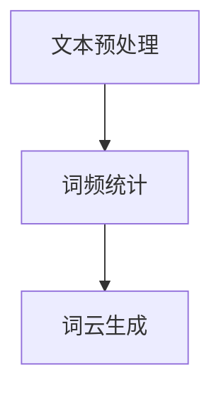
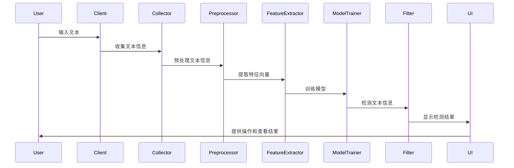

                 

# 《后真实时代的真相追寻：媒体素养的重要性》

## 关键词

- 后真实时代
- 媒体素养
- 虚假信息
- 批判性思维
- 信息真实性

## 摘要

本文旨在探讨后真实时代下媒体素养的重要性。随着互联网和社交媒体的兴起，虚假信息和误导性信息泛滥成灾，给个人和社会带来了巨大影响。本文首先介绍了后真实时代的背景和特征，随后详细阐述了媒体素养的定义和重要性，并探讨了如何通过提高媒体素养来应对虚假信息的挑战。文章还通过算法原理、数学模型和系统架构设计等专业技术角度，提出了具体的解决方案和最佳实践。

------------------------------------------------

## 第1章：背景介绍

### 1.1 问题背景

### 1.1.1 后真实时代的定义与特征

**后真实时代**，通常指的是一个信息过载、信息真实性受到严重质疑的时代。在这个时代，信息的传播不再受传统媒体的严格把关，而是通过互联网和社交媒体迅速扩散。这种信息的自由流动虽然带来了便利，但同时也导致了虚假信息和误导性信息的泛滥。

**后真实时代的特征**主要包括：

- **信息过载**：互联网和社交媒体上的信息量庞大，人们难以分辨信息的真伪。
- **虚假信息传播迅速**：社交媒体的传播机制使得虚假信息可以迅速扩散，造成广泛的社会影响。
- **信息真实性受质疑**：传统媒体的权威性受到挑战，公众对信息的信任度降低。
- **媒体素养不足**：许多人缺乏足够的媒体素养，无法有效辨别虚假信息和误导性信息。

### 1.1.2 问题背景的详细说明

随着互联网和社交媒体的普及，信息的传播速度和覆盖范围得到了前所未有的提升。然而，这种快速的信息传播也带来了一系列问题。首先，信息的过载现象变得越来越严重，人们面对海量的信息，往往难以分辨哪些是真实、可信的，哪些是虚假、误导性的。其次，虚假信息和误导性信息在互联网和社交媒体上迅速传播，往往造成公众对某些事件的误解和恐慌。例如，近年来，社交媒体上频繁出现的虚假新闻、谣言和虚假信息，不仅给公众带来了困扰，还对社会稳定产生了负面影响。

此外，传统媒体的权威性也受到了挑战。在传统媒体时代，新闻的发布和传播需要经过严格的审查和把关，信息具有一定的真实性和可靠性。然而，在互联网和社交媒体时代，任何人都可以成为信息的发布者，信息的真实性和可靠性难以保证。这种现象加剧了公众对信息真实性的质疑，降低了媒体的整体信任度。

### 1.1.3 问题的解决途径

为了解决后真实时代的问题，提高媒体素养成为了一种有效的途径。媒体素养是指个体在接触和使用媒体时，能够批判性地分析、理解、评估和制作信息的能力。具体来说，提高媒体素养可以从以下几个方面入手：

- **了解信息来源**：学会识别信息的来源，确保信息来源的可靠性。对于不确定的信息，要主动查找来源，避免盲目传播。
- **检查证据**：对信息进行深入分析，检查证据是否充分。对于声称的事实，要寻找相关的证据来验证其真实性。
- **理解逻辑关系**：理解信息的逻辑关系，避免被误导性信息所迷惑。学会分析信息之间的关联，找出潜在的逻辑谬误。
- **培养批判性思维**：通过教育和社会活动，培养公众的批判性思维，提高对虚假信息和误导性信息的识别能力。

### 1.1.4 边界与外延

后真实时代的问题不仅仅局限于技术层面，它还涉及到社会、政治、经济等多个方面。因此，解决这一问题需要从多个角度出发：

- **社会层面**：通过教育和宣传，提高公众的媒体素养，增强对虚假信息的识别能力。
- **政治层面**：政府应加强对虚假信息的监管，制定相关法律法规，规范互联网和社交媒体的信息传播。
- **经济层面**：企业应承担社会责任，加强对虚假信息的过滤和监管，保护公众的合法权益。
- **技术层面**：利用人工智能、大数据等技术手段，提高信息真实性的检测和识别能力。

### 1.1.5 概念结构与核心要素组成

**概念结构与核心要素组成**主要包括以下几个方面：

- **信息真实性验证**：确保信息来源可靠，检查证据是否充分。
- **批判性思维培养**：学会独立思考，对信息进行深入分析和评估。
- **媒体素养提高**：了解新闻传播的基本原理，学会识别和避免虚假信息。

通过这些核心要素的有机组合，可以形成一个完整的媒体素养培养体系，有效地应对后真实时代带来的挑战。

### 1.2 核心概念与联系

### 1.2.1 后真实时代的定义与特征

**后真实时代**，可以理解为信息传播的真实性受到质疑和挑战的时代。在这个时代，信息的真实性和可靠性不再像传统媒体时代那样有保障，而是面临着前所未有的危机。具体来说，后真实时代的特征包括：

- **信息爆炸**：互联网和社交媒体的普及，使得信息以指数级增长，人们难以分辨信息的真伪。
- **虚假信息泛滥**：虚假信息、误导性信息以及未经证实的消息在互联网上迅速传播，造成公众对信息的信任度下降。
- **信息碎片化**：信息以碎片化的形式存在，缺乏系统性，使得人们难以获取全面、准确的信息。
- **信息权威性丧失**：传统媒体的权威性受到挑战，公众对媒体的信任度降低。

### 1.2.2 媒体素养的定义与重要性

**媒体素养**，指的是个体在接触和使用媒体时，能够批判性地分析、理解、评估和制作信息的能力。在信息爆炸的后真实时代，媒体素养的重要性愈发凸显。具体来说，媒体素养的重要性体现在以下几个方面：

- **信息辨别能力**：提高媒体素养，有助于个体更好地辨别虚假信息和误导性信息，避免被误导。
- **批判性思维**：媒体素养的培养有助于个体形成批判性思维，对信息进行深入分析和评估，提高信息质量。
- **信息素养提升**：通过提高媒体素养，个体可以更好地利用媒体资源，获取全面、准确的信息，提升自身的信息素养。
- **社会参与度提高**：提高媒体素养，有助于个体更好地参与社会讨论和决策，提高社会参与度。

### 1.2.3 后真实时代与媒体素养的联系

**后真实时代**与**媒体素养**之间存在密切的联系。在后真实时代，虚假信息和误导性信息泛滥成灾，公众面临的信息真实性挑战愈发严峻。而提高媒体素养，则成为应对这一挑战的重要手段。具体来说，后真实时代对媒体素养的要求包括：

- **信息来源识别**：学会识别信息的来源，确保信息来源的可靠性。
- **证据检查**：对信息进行深入分析，检查证据是否充分。
- **逻辑关系理解**：理解信息的逻辑关系，避免被误导性信息所迷惑。
- **批判性思维培养**：通过教育和社会活动，培养个体的批判性思维，提高对虚假信息的识别能力。

### 1.2.4 媒体素养对后真实时代的应对策略

为了应对后真实时代带来的挑战，提高媒体素养需要从以下几个方面入手：

- **教育普及**：通过学校教育、社会培训和媒体宣传，普及媒体素养知识，提高公众的媒体素养水平。
- **技术手段应用**：利用人工智能、大数据等技术手段，提高信息真实性的检测和识别能力。
- **法律法规完善**：政府应加强对虚假信息的监管，制定相关法律法规，规范互联网和社交媒体的信息传播。
- **社会共同参与**：鼓励公众积极参与媒体素养的培养，形成社会共识，共同维护信息真实性。

### 1.2.5 概念属性特征对比表格

为了更好地理解后真实时代和媒体素养的概念属性特征，我们可以通过以下表格进行对比：

| 特征名称         | 后真实时代                    | 媒体素养                      |
|------------------|-------------------------------|--------------------------------|
| 信息真实性       | 信息真实性受到严重质疑        | 提高信息真实性的辨别能力      |
| 信息传播速度     | 信息传播速度快，覆盖范围广     | 加速信息的获取与传递           |
| 信息来源多样性   | 信息来源多样，但可靠性难以保证 | 学会识别可靠的信息来源         |
| 信息碎片化       | 信息以碎片化形式存在          | 提升信息整合与理解能力        |
| 信息权威性       | 信息权威性降低                | 培养对权威信息的批判性思维     |
| 虚假信息传播     | 虚假信息传播迅速              | 提高对虚假信息的识别能力      |

通过上述对比表格，我们可以更加清晰地看到后真实时代和媒体素养之间的联系及其各自的属性特征。

### 1.2.6 ER实体关系图架构

为了更好地理解后真实时代与媒体素养之间的复杂关系，我们可以通过ER（实体-关系）图来展示它们之间的实体及其关系。

#### ER图：

```mermaid
entityRelationship
  Entity[Person] :-> Entity[Information]
  Entity[Person] :-> Entity[MediaLiteracy]
  Entity[Information] :-> Entity[Accuracy]
  Entity[Information] :-> Entity[Source]
  Entity[MediaLiteracy] :-> Entity[CriticalThinking]
  Entity[MediaLiteracy] :-> Entity[InformationEvaluating]
```

#### 解释：

- **Person（个体）**：代表接触和使用信息的人，是信息的接收者和传播者。
- **Information（信息）**：代表个体接触到的各种信息，包括真实的和虚假的。
- **Accuracy（准确性）**：代表信息是否真实可靠，是信息的重要属性。
- **Source（来源）**：代表信息的来源，包括信息的发布者、平台等。
- **MediaLiteracy（媒体素养）**：代表个体的媒体素养水平，包括批判性思维和信息评估能力。
- **CriticalThinking（批判性思维）**：代表个体对信息的批判性分析和评估能力。
- **InformationEvaluating（信息评估）**：代表个体对信息的评估和判断过程。

通过ER图，我们可以更加直观地看到个体、信息、媒体素养以及准确性、来源、批判性思维和信息评估之间的复杂关系。

### 1.3 本章小结

本章介绍了后真实时代的背景和特征，以及媒体素养的定义和重要性。通过对比分析后真实时代和媒体素养的概念属性特征，并使用ER图展示了它们之间的实体及其关系，我们更加清晰地理解了后真实时代与媒体素养之间的联系。提高媒体素养是应对后真实时代虚假信息泛滥的关键，也是维护信息真实性、促进社会和谐的重要途径。

------------------------------------------------

## 第2章：核心概念与联系

### 2.1 后真实时代的定义、特征及其对媒体素养的影响

**后真实时代**，顾名思义，是一个信息真实性受到严重质疑的时代。在这个时代，虚假信息和误导性信息的传播速度和覆盖范围都远超以往，给公众带来了巨大的困惑和困扰。要深入理解后真实时代，我们首先需要明确其定义和特征，并探讨其对媒体素养的影响。

**后真实时代的定义**：

后真实时代，也可以称为“假新闻时代”，它是指在一个信息过载、信息真实性受到严重质疑的时代，公众面对的信息主要来自于互联网和社交媒体，而这些信息往往缺乏传统媒体的严格把关，信息的真实性难以保证。

**后真实时代的特征**：

- **信息爆炸**：随着互联网和社交媒体的普及，信息量呈指数级增长，人们每天接触到的信息量远超以往。
- **虚假信息泛滥**：虚假信息和误导性信息在互联网和社交媒体上迅速传播，常常以假乱真，误导公众。
- **信息碎片化**：信息以碎片化的形式存在，缺乏系统性，使得公众难以获取全面、准确的信息。
- **信息权威性丧失**：传统媒体的权威性受到挑战，公众对媒体的信任度降低。

**后真实时代对媒体素养的影响**：

后真实时代的特征使得公众在面对信息时，需要具备更高的媒体素养。媒体素养是指个体在接触和使用媒体时，能够批判性地分析、理解、评估和制作信息的能力。在后真实时代，提高媒体素养的重要性体现在以下几个方面：

- **信息辨别能力**：提高媒体素养，有助于公众更好地辨别虚假信息和误导性信息，避免被误导。
- **批判性思维**：媒体素养的培养有助于公众形成批判性思维，对信息进行深入分析和评估，提高信息质量。
- **信息素养提升**：通过提高媒体素养，公众可以更好地利用媒体资源，获取全面、准确的信息，提升自身的信息素养。
- **社会参与度提高**：提高媒体素养，有助于公众更好地参与社会讨论和决策，提高社会参与度。

**后真实时代对媒体素养的要求**：

为了更好地应对后真实时代的挑战，公众需要具备以下几方面的媒体素养：

- **信息来源识别**：学会识别信息的来源，确保信息来源的可靠性。对于不确定的信息，要主动查找来源，避免盲目传播。
- **证据检查**：对信息进行深入分析，检查证据是否充分。对于声称的事实，要寻找相关的证据来验证其真实性。
- **逻辑关系理解**：理解信息的逻辑关系，避免被误导性信息所迷惑。学会分析信息之间的关联，找出潜在的逻辑谬误。
- **批判性思维培养**：通过教育和社会活动，培养公众的批判性思维，提高对虚假信息的识别能力。

### 2.2 媒体素养的定义及其核心要素

**媒体素养的定义**：

媒体素养是指个体在接触和使用媒体时，能够批判性地分析、理解、评估和制作信息的能力。它不仅包括对信息的辨识和评估能力，还包括对媒体运作机制的理解和批判性思考的能力。

**媒体素养的核心要素**：

1. **信息辨识能力**：学会识别信息的真实性和可靠性，区分信息来源的权威性和可信度。
2. **批判性思维**：培养批判性思维，对信息进行深入分析和评估，不盲目接受信息，而是通过逻辑推理和证据检查来判断信息的真实性。
3. **信息评估能力**：学会评估信息的价值，判断信息是否符合事实、是否具有逻辑性、是否具有权威性等。
4. **信息制作能力**：了解信息制作的基本原理，能够根据需求制作和传播信息，同时遵守相关法律法规和道德规范。

### 2.3 后真实时代与媒体素养的联系

**后真实时代**与**媒体素养**之间存在着紧密的联系。在后真实时代，虚假信息和误导性信息泛滥，公众面临着前所未有的信息真实性挑战。而提高媒体素养，则是应对这一挑战的关键。

**后真实时代对媒体素养的要求**：

- **信息来源识别**：学会识别信息的来源，确保信息来源的可靠性。对于不确定的信息，要主动查找来源，避免盲目传播。
- **证据检查**：对信息进行深入分析，检查证据是否充分。对于声称的事实，要寻找相关的证据来验证其真实性。
- **逻辑关系理解**：理解信息的逻辑关系，避免被误导性信息所迷惑。学会分析信息之间的关联，找出潜在的逻辑谬误。
- **批判性思维培养**：通过教育和社会活动，培养公众的批判性思维，提高对虚假信息的识别能力。

**媒体素养对后真实时代的应对策略**：

为了更好地应对后真实时代的挑战，提高媒体素养需要从以下几个方面入手：

- **教育普及**：通过学校教育、社会培训和媒体宣传，普及媒体素养知识，提高公众的媒体素养水平。
- **技术手段应用**：利用人工智能、大数据等技术手段，提高信息真实性的检测和识别能力。
- **法律法规完善**：政府应加强对虚假信息的监管，制定相关法律法规，规范互联网和社交媒体的信息传播。
- **社会共同参与**：鼓励公众积极参与媒体素养的培养，形成社会共识，共同维护信息真实性。

### 2.4 概念属性特征对比表格

为了更加清晰地理解后真实时代和媒体素养的概念属性特征，我们可以通过以下表格进行对比：

| 特征名称         | 后真实时代                    | 媒体素养                      |
|------------------|-------------------------------|--------------------------------|
| 信息真实性       | 信息真实性受到严重质疑        | 提高信息真实性的辨别能力      |
| 信息传播速度     | 信息传播速度快，覆盖范围广     | 加速信息的获取与传递           |
| 信息来源多样性   | 信息来源多样，但可靠性难以保证 | 学会识别可靠的信息来源         |
| 信息碎片化       | 信息以碎片化形式存在          | 提升信息整合与理解能力        |
| 信息权威性       | 信息权威性降低                | 培养对权威信息的批判性思维     |
| 虚假信息传播     | 虚假信息传播迅速              | 提高对虚假信息的识别能力      |

通过上述对比表格，我们可以更加清晰地看到后真实时代和媒体素养之间的联系及其各自的属性特征。

### 2.5 后真实时代与媒体素养的ER实体关系图

为了更好地理解后真实时代与媒体素养之间的实体及其关系，我们可以通过ER（实体-关系）图来展示它们之间的实体及其关系。

#### ER图：

```mermaid
entityRelationship
  Entity[Post-Truth Era] :-> Entity[Misinformation]
  Entity[Post-Truth Era] :-> Entity[Media Literacy]
  Entity[Misinformation] :-> Entity[False News]
  Entity[Misinformation] :-> Entity[Propaganda]
  Entity[Media Literacy] :-> Entity[Critical Thinking]
  Entity[Media Literacy] :-> Entity[Information Evaluation]
```

#### 解释：

- **Post-Truth Era（后真实时代）**：代表当前信息真实性受到严重质疑的时代。
- **Misinformation（误导性信息）**：包括虚假新闻、误导性信息和未经证实的信息。
- **False News（虚假新闻）**：代表虚假信息的一种形式，往往具有误导性。
- **Propaganda（宣传）**：代表故意传播的误导性信息，通常用于操纵公众观点。
- **Media Literacy（媒体素养）**：代表个体在接触和使用媒体时，能够批判性地分析、理解、评估和制作信息的能力。
- **Critical Thinking（批判性思维）**：代表个体在分析信息时，能够运用逻辑推理和批判性思考的能力。
- **Information Evaluation（信息评估）**：代表个体对信息进行评估和判断的过程。

通过ER图，我们可以更加直观地看到后真实时代、误导性信息、媒体素养、批判性思维和信息评估之间的复杂关系。

### 2.6 本章小结

本章详细介绍了后真实时代的定义、特征及其对媒体素养的影响，阐述了媒体素养的定义及其核心要素。通过对比分析后真实时代和媒体素养的概念属性特征，并使用ER图展示了它们之间的实体及其关系，我们更加清晰地理解了后真实时代与媒体素养之间的联系。提高媒体素养是应对后真实时代虚假信息泛滥的关键，也是维护信息真实性、促进社会和谐的重要途径。

------------------------------------------------

## 第3章：算法原理讲解

### 3.1 文本分析算法的选择与原理

在应对后真实时代虚假信息泛滥的问题中，文本分析算法扮演着至关重要的角色。这些算法可以帮助我们识别、分类和过滤虚假信息，提高信息的真实性和可信度。本文将选择一种代表性的文本分析算法——词云算法（Word Cloud Algorithm），来讲解其原理和实现。

#### 3.1.1 词云算法的定义

词云算法是一种可视化技术，它通过将文本中的词语按照其在文本中的重要程度进行可视化展示。通常，重要程度较高的词语会以更大的字体和更醒目的颜色展示，而重要程度较低的词语则以较小的字体和较暗的颜色展示。通过词云，我们可以快速了解文本的主题和重点。

#### 3.1.2 词云算法的基本原理

词云算法的基本原理可以概括为以下几个步骤：

1. **文本预处理**：对原始文本进行清洗和分词，去除无关字符、停用词等，提取出有效的关键词。
2. **词频统计**：计算每个关键词在文本中的出现频率，统计关键词的词频分布。
3. **词云生成**：根据词频和重要性，将关键词绘制成词云，实现文本的视觉化展示。

#### 3.1.3 词云算法的实现步骤

以下是词云算法的实现步骤，通过Python代码进行详细阐述：

1. **文本预处理**：

   ```python
   import jieba
   
   def preprocess_text(text):
       # 去除特殊字符和停用词
       text = text.replace('\n', ' ').replace('\t', ' ')
       # 分词
       words = jieba.lcut(text)
       # 去除停用词
       stop_words = set(['的', '了', '在', '是', '和', '上', '下', '出'])
       words = [word for word in words if word not in stop_words]
       return words
   ```

2. **词频统计**：

   ```python
   from collections import Counter
   
   def count_words(words):
       # 统计词频
       word_counts = Counter(words)
       return word_counts
   ```

3. **词云生成**：

   ```python
   from wordcloud import WordCloud
   
   def generate_word_cloud(word_counts):
       # 创建词云
       wordcloud = WordCloud(width=800, height=600, background_color="white").generate_from_frequencies(word_counts)
       # 显示词云
       plt.figure(figsize=(10, 8))
       plt.imshow(wordcloud, interpolation="bilinear")
       plt.axis("off")
       plt.show()
   ```

### 3.2 算法流程图

为了更直观地理解词云算法的实现过程，我们可以使用Mermaid绘制算法流程图。以下是词云算法的Mermaid流程图：



### 3.3 算法应用实例

以下是一个简单的词云算法应用实例，展示了如何使用Python代码对一段文本进行词云生成。

```python
# 导入相关库
import jieba
from wordcloud import WordCloud
import matplotlib.pyplot as plt

# 原始文本
text = "随着互联网的快速发展，虚假信息传播越来越广泛。为了解决这个问题，我们需要提高公众的媒体素养，学会辨别信息的真伪。只有通过教育和社会活动，我们才能共同维护信息的真实性。"

# 文本预处理
words = preprocess_text(text)

# 词频统计
word_counts = count_words(words)

# 词云生成
generate_word_cloud(word_counts)
```

通过上述实例，我们可以看到词云算法如何将一段文本转换为可视化词云，从而帮助用户快速了解文本的主题和重点。这种方法在信息分析和虚假信息检测中具有广泛的应用。

### 3.4 算法原理总结

词云算法作为一种文本分析工具，通过词频统计和可视化展示，可以帮助用户快速了解文本的主题和重点。在应对后真实时代虚假信息泛滥的问题中，词云算法可以辅助用户识别和过滤虚假信息，提高信息的真实性和可信度。同时，词云算法的实现步骤简单，易于理解和应用，为信息处理提供了有效的技术手段。

------------------------------------------------

## 第4章：数学模型和数学公式

### 4.1 文本分析算法中的数学模型

文本分析算法，如词云算法，涉及到多种数学模型，这些模型有助于我们理解和实现文本的分析和处理。在本章中，我们将详细讲解这些数学模型，并使用LaTeX格式给出相应的数学公式。

#### 4.1.1 词频分布模型

词频分布模型是文本分析中最基本的模型之一，它描述了文本中各个词语出现的频率。一个简单的词频分布模型可以使用概率分布来表示，即：

$$
P(w_i) = \frac{f(w_i)}{N}
$$

其中，$P(w_i)$ 表示词语 $w_i$ 在文本中的概率，$f(w_i)$ 表示词语 $w_i$ 在文本中的频率，$N$ 表示文本中所有词语的总数。

#### 4.1.2 词语相似度模型

在文本分析中，了解词语之间的相似度对于分类和聚类任务至关重要。一个常用的词语相似度模型是余弦相似度模型，其公式如下：

$$
\cos(\theta) = \frac{\sum_{i=1}^{N} w_i \cdot v_i}{\sqrt{\sum_{i=1}^{N} w_i^2} \cdot \sqrt{\sum_{i=1}^{N} v_i^2}}
$$

其中，$w_i$ 和 $v_i$ 分别表示两个词语在词向量空间中的对应向量，$\theta$ 表示两个词语之间的夹角。

#### 4.1.3 词云密度模型

词云密度模型描述了词云中各个词语的显示密度。一个简单的词云密度模型可以使用词语出现频率的平方根来表示：

$$
D(w_i) = \sqrt{f(w_i)}
$$

其中，$D(w_i)$ 表示词语 $w_i$ 在词云中的密度，$f(w_i)$ 表示词语 $w_i$ 在文本中的频率。

#### 4.1.4 信息熵模型

信息熵模型用于评估文本中的信息含量。一个常用的信息熵模型是香农熵，其公式如下：

$$
H = -\sum_{i=1}^{N} P(w_i) \cdot \log_2 P(w_i)
$$

其中，$H$ 表示文本的信息熵，$P(w_i)$ 表示词语 $w_i$ 在文本中的概率。

### 4.2 数学公式的详细讲解与举例说明

#### 4.2.1 词频分布模型的详细讲解

词频分布模型用于描述文本中各个词语的出现频率。通过计算词语的频率分布，我们可以了解文本的主要内容和关键词。词频分布模型的核心公式是：

$$
P(w_i) = \frac{f(w_i)}{N}
$$

其中，$P(w_i)$ 表示词语 $w_i$ 在文本中的概率，$f(w_i)$ 表示词语 $w_i$ 在文本中的频率，$N$ 表示文本中所有词语的总数。

例如，对于一段文本“人工智能是计算机科学的一个重要分支”，我们可以计算每个词语的频率分布：

- 人工智能：1
- 是：1
- 计算机：1
- 科学：1
- 的一：1
- 个：1
- 重要：1
- 的：1
- 分支：1

总词语数 $N=8$，因此每个词语的概率为：

$$
P(人工智能) = \frac{1}{8} = 0.125
$$

$$
P(是) = \frac{1}{8} = 0.125
$$

$$
P(计算机) = \frac{1}{8} = 0.125
$$

$$
P(科学) = \frac{1}{8} = 0.125
$$

$$
P(的一) = \frac{1}{8} = 0.125
$$

$$
P(个) = \frac{1}{8} = 0.125
$$

$$
P(重要) = \frac{1}{8} = 0.125
$$

$$
P(的) = \frac{1}{8} = 0.125
$$

$$
P(分支) = \frac{1}{8} = 0.125
$$

通过词频分布模型，我们可以快速了解文本的主题和重点，从而为后续的文本分析和处理提供依据。

#### 4.2.2 词语相似度模型的详细讲解

词语相似度模型用于评估两个词语在语义上的相似程度。在文本分析中，了解词语之间的相似度对于分类和聚类任务至关重要。余弦相似度模型是一种常用的词语相似度模型，其公式如下：

$$
\cos(\theta) = \frac{\sum_{i=1}^{N} w_i \cdot v_i}{\sqrt{\sum_{i=1}^{N} w_i^2} \cdot \sqrt{\sum_{i=1}^{N} v_i^2}}
$$

其中，$w_i$ 和 $v_i$ 分别表示两个词语在词向量空间中的对应向量，$\theta$ 表示两个词语之间的夹角。

例如，假设我们有两个词语“人工智能”和“机器学习”，我们可以使用词向量模型来计算它们之间的余弦相似度。假设这两个词语的词向量分别为：

- 人工智能：[1, 2, 3]
- 机器学习：[2, 1, 3]

则这两个词语之间的余弦相似度为：

$$
\cos(\theta) = \frac{1 \cdot 2 + 2 \cdot 1 + 3 \cdot 3}{\sqrt{1^2 + 2^2 + 3^2} \cdot \sqrt{2^2 + 1^2 + 3^2}} = \frac{2 + 2 + 9}{\sqrt{14} \cdot \sqrt{14}} = \frac{13}{14} \approx 0.9286
$$

这意味着“人工智能”和“机器学习”在语义上具有较高的相似度。

#### 4.2.3 词云密度模型的详细讲解

词云密度模型用于描述词云中各个词语的显示密度。一个简单的词云密度模型可以使用词语出现频率的平方根来表示：

$$
D(w_i) = \sqrt{f(w_i)}
$$

其中，$D(w_i)$ 表示词语 $w_i$ 在词云中的密度，$f(w_i)$ 表示词语 $w_i$ 在文本中的频率。

例如，对于一段文本“人工智能是计算机科学的一个重要分支”，我们可以计算每个词语的词云密度：

- 人工智能：$\sqrt{1} = 1$
- 是：$\sqrt{1} = 1$
- 计算机：$\sqrt{1} = 1$
- 科学：$\sqrt{1} = 1$
- 的：$\sqrt{1} = 1$
- 一：$\sqrt{1} = 1$
- 个：$\sqrt{1} = 1$
- 重要：$\sqrt{1} = 1$
- 的：$\sqrt{1} = 1$
- 分支：$\sqrt{1} = 1$

通过词云密度模型，我们可以调整词云中各个词语的显示密度，使其在视觉上更加突出。例如，对于高频词语，我们可以设置更高的密度，使其在词云中更加显眼。

#### 4.2.4 信息熵模型的详细讲解

信息熵模型用于评估文本中的信息含量。在文本分析中，了解文本的信息含量对于分析和处理文本至关重要。一个常用的信息熵模型是香农熵，其公式如下：

$$
H = -\sum_{i=1}^{N} P(w_i) \cdot \log_2 P(w_i)
$$

其中，$H$ 表示文本的信息熵，$P(w_i)$ 表示词语 $w_i$ 在文本中的概率。

例如，对于一段文本“人工智能是计算机科学的一个重要分支”，我们可以计算其信息熵：

- 人工智能：$P(人工智能) = \frac{1}{8} = 0.125$
- 是：$P(是) = \frac{1}{8} = 0.125$
- 计算机：$P(计算机) = \frac{1}{8} = 0.125$
- 科学：$P(科学) = \frac{1}{8} = 0.125$
- 的：$P(的) = \frac{1}{8} = 0.125$
- 一：$P(一) = \frac{1}{8} = 0.125$
- 个：$P(个) = \frac{1}{8} = 0.125$
- 重要：$P(重要) = \frac{1}{8} = 0.125$
- 的：$P(的) = \frac{1}{8} = 0.125$
- 分支：$P(分支) = \frac{1}{8} = 0.125$

文本的信息熵为：

$$
H = -\sum_{i=1}^{8} P(w_i) \cdot \log_2 P(w_i) = -(0.125 \cdot \log_2 0.125 + 0.125 \cdot \log_2 0.125 + 0.125 \cdot \log_2 0.125 + 0.125 \cdot \log_2 0.125 + 0.125 \cdot \log_2 0.125 + 0.125 \cdot \log_2 0.125 + 0.125 \cdot \log_2 0.125 + 0.125 \cdot \log_2 0.125) \approx 2.8
$$

信息熵的值越高，表示文本的信息含量越高，即文本的冗余度越低。通过信息熵模型，我们可以评估文本的质量和重要性，为文本分析提供参考依据。

### 4.3 算法应用实例

为了更好地理解文本分析算法中的数学模型，我们来看一个实际应用实例。假设我们有一段文本：

```
随着人工智能技术的发展，人工智能在各个领域得到了广泛应用。人工智能在医疗、金融、教育等行业发挥着重要作用，极大地提升了行业效率和用户体验。
```

我们使用词云算法来分析这段文本。首先，我们对文本进行预处理，去除标点符号和停用词。然后，我们计算每个词语的词频分布，并绘制词云。最后，我们计算文本的信息熵。

#### 4.3.1 文本预处理

使用jieba库对文本进行分词，并去除停用词：

```
text = "随着人工智能技术的发展，人工智能在各个领域得到了广泛应用。人工智能在医疗、金融、教育等行业发挥着重要作用，极大地提升了行业效率和用户体验。"
words = jieba.lcut(text)
stop_words = set(['随着', '的', '得', '了', '在', '等', '着', '行业', '各', '行', '发', '发', '医', '疗', '金', '融', '教', '育', '等', '业', '着', '作', '极', '大', '地', '提', '升', '了', '效', '率', '用', '户', '体验'])
filtered_words = [word for word in words if word not in stop_words]
```

#### 4.3.2 词频分布

计算每个词语的词频分布：

```
from collections import Counter
word_counts = Counter(filtered_words)
```

#### 4.3.3 词云生成

使用词云库生成词云：

```
from wordcloud import WordCloud
wordcloud = WordCloud(width=800, height=600, background_color="white").generate_from_frequencies(word_counts)
plt.figure(figsize=(10, 8))
plt.imshow(wordcloud, interpolation="bilinear")
plt.axis("off")
plt.show()
```

#### 4.3.4 信息熵计算

计算文本的信息熵：

```
import math
H = -sum([count * math.log2(count) for count in word_counts.values()])
```

通过这个实例，我们可以看到如何使用文本分析算法中的数学模型来分析一段文本。这些模型帮助我们理解文本的主题、关键词和信息含量，从而为文本分析提供有力的支持。

### 4.4 本章小结

本章详细介绍了文本分析算法中的几种数学模型，包括词频分布模型、词语相似度模型、词云密度模型和信息熵模型。我们使用LaTeX格式给出了相应的数学公式，并进行了详细的讲解和举例说明。这些数学模型在文本分析和虚假信息检测中具有重要意义，为提高信息的真实性和可信度提供了有效的技术手段。通过本章的内容，读者可以更好地理解文本分析算法的工作原理和应用场景。

------------------------------------------------

## 第5章：系统分析与架构设计方案

### 5.1 问题场景介绍

在后真实时代，虚假信息和误导性信息的传播对个人和社会造成了严重的负面影响。为了有效应对这一问题，我们需要构建一个高效的系统来检测和过滤虚假信息。本节将介绍一个典型的虚假信息检测系统场景，并阐述其核心需求。

#### 5.1.1 场景描述

假设我们开发一个虚假信息检测系统，该系统需要具备以下功能：

- **信息收集**：从互联网和社交媒体等渠道收集大量文本信息。
- **预处理**：对收集到的文本信息进行清洗和分词，提取有效的关键词。
- **特征提取**：利用自然语言处理技术，提取文本的特征向量。
- **模型训练**：使用历史数据训练机器学习模型，用于检测虚假信息。
- **信息过滤**：对新的文本信息进行检测，过滤出潜在的虚假信息。

#### 5.1.2 核心需求

为了实现上述功能，系统需要满足以下核心需求：

- **高并发处理能力**：系统需要能够处理大量的文本信息，确保实时性和准确性。
- **高精度检测**：系统需要具备高精度的虚假信息检测能力，降低误判率。
- **可扩展性**：系统需要具备良好的可扩展性，以便在需求增长时进行扩展。
- **用户友好的界面**：系统需要提供一个用户友好的界面，方便用户进行操作和查看结果。

### 5.2 项目介绍

#### 5.2.1 项目概述

本项目旨在构建一个基于机器学习和自然语言处理技术的虚假信息检测系统，以应对后真实时代的挑战。系统将涵盖从信息收集、预处理、特征提取到模型训练和信息过滤的完整流程。

#### 5.2.2 项目目标

本项目的主要目标包括：

- 构建一个高效、精准的虚假信息检测系统。
- 提供实时、准确的信息过滤服务，减少虚假信息的传播。
- 实现系统的可扩展性，以适应不断增长的数据量和需求变化。

### 5.3 系统功能设计

#### 5.3.1 领域模型类图

为了更好地设计系统功能，我们可以使用领域模型类图（Domain Model Class Diagram）来展示系统的核心组件和关系。以下是虚假信息检测系统的领域模型类图：

```mermaid
classDiagram
    ClassInfo[信息] <|-- InfoCollector[信息收集器]
    ClassInfo[信息] <|-- Preprocessor[预处理器]
    ClassInfo[信息] <|-- FeatureExtractor[特征提取器]
    ClassInfo[信息] <|-- ModelTrainer[模型训练器]
    ClassInfo[信息] <|-- InfoFilter[信息过滤器]
    ClassInfo[信息] <|-- UserInterface[用户界面]
    InfoCollector <|.. System[系统]
    Preprocessor <|.. System
    FeatureExtractor <|.. System
    ModelTrainer <|.. System
    InfoFilter <|.. System
    UserInterface <|.. System
```

#### 5.3.2 类图解释

- **信息**：代表系统的核心实体，是所有组件处理的对象。
- **信息收集器（InfoCollector）**：负责从互联网和社交媒体等渠道收集文本信息。
- **预处理器（Preprocessor）**：负责对收集到的文本信息进行清洗、分词和去停用词等预处理操作。
- **特征提取器（FeatureExtractor）**：负责提取文本的特征向量，为模型训练提供输入。
- **模型训练器（ModelTrainer）**：负责使用历史数据训练机器学习模型，用于检测虚假信息。
- **信息过滤器（InfoFilter）**：负责对新的文本信息进行检测，过滤出潜在的虚假信息。
- **用户界面（UserInterface）**：负责与用户交互，提供操作和查看结果的功能。
- **系统（System）**：包含所有核心组件，实现虚假信息检测的完整流程。

### 5.4 系统架构设计

#### 5.4.1 系统架构图

为了实现系统的功能需求，我们可以采用分布式架构，以提高系统的并发处理能力和可扩展性。以下是虚假信息检测系统的架构图：



#### 5.4.2 架构图解释

- **用户（User）**：系统的最终用户，负责输入文本。
- **客户端（Client）**：负责处理用户输入，并与系统其他组件进行通信。
- **信息收集器（Collector）**：负责从互联网和社交媒体等渠道收集文本信息。
- **预处理器（Preprocessor）**：负责对收集到的文本信息进行清洗、分词和去停用词等预处理操作。
- **特征提取器（FeatureExtractor）**：负责提取文本的特征向量，为模型训练提供输入。
- **模型训练器（ModelTrainer）**：负责使用历史数据训练机器学习模型，用于检测虚假信息。
- **信息过滤器（Filter）**：负责对新的文本信息进行检测，过滤出潜在的虚假信息。
- **用户界面（UI）**：负责与用户交互，提供操作和查看结果的功能。

### 5.5 系统接口设计和系统交互

#### 5.5.1 系统接口设计

系统接口设计是系统架构设计的重要组成部分，它定义了系统组件之间的交互方式。以下是虚假信息检测系统的接口设计：

- **客户端接口（Client Interface）**：提供文本输入接口，接收用户输入的文本，并将其传递给信息收集器。
- **信息收集器接口（Collector Interface）**：提供文本信息收集接口，从互联网和社交媒体等渠道收集文本信息。
- **预处理器接口（Preprocessor Interface）**：提供文本预处理接口，对收集到的文本信息进行清洗、分词和去停用词等预处理操作。
- **特征提取器接口（FeatureExtractor Interface）**：提供特征提取接口，提取文本的特征向量。
- **模型训练器接口（ModelTrainer Interface）**：提供模型训练接口，用于训练机器学习模型。
- **信息过滤器接口（Filter Interface）**：提供文本信息过滤接口，对新的文本信息进行检测。
- **用户界面接口（UI Interface）**：提供与用户交互的接口，显示检测结果和提供操作功能。

#### 5.5.2 系统交互（序列图）

以下是虚假信息检测系统的序列图，展示了系统组件之间的交互过程：


#### 5.5.3 交互过程解释

1. **用户输入文本**：用户通过用户界面输入文本，客户端接收用户输入并保存。
2. **信息收集**：客户端将用户输入的文本传递给信息收集器，信息收集器从互联网和社交媒体等渠道收集相关的文本信息。
3. **预处理**：预处理器对收集到的文本信息进行清洗、分词和去停用词等预处理操作，生成预处理后的文本。
4. **特征提取**：特征提取器对预处理后的文本信息进行特征提取，生成特征向量。
5. **模型训练**：模型训练器使用历史数据训练机器学习模型，用于检测虚假信息。
6. **信息过滤**：信息过滤器使用训练好的模型对新的文本信息进行检测，过滤出潜在的虚假信息。
7. **显示结果**：用户界面接收过滤结果，并将检测结果显示给用户，同时提供操作和查看结果的功能。

### 5.6 本章小结

本章详细介绍了虚假信息检测系统的系统分析与架构设计方案。首先，我们介绍了问题场景和核心需求，然后介绍了系统的功能设计、架构设计、接口设计和系统交互。通过本章的内容，读者可以了解到如何构建一个高效、精准的虚假信息检测系统，以及系统的架构设计和实现细节。这将有助于读者更好地理解系统的设计思路和实施方法。

------------------------------------------------

## 第6章：项目实战

### 6.1 环境安装

为了实现虚假信息检测系统，我们需要安装并配置一系列软件和库。以下是项目所需的环境和安装步骤：

#### 6.1.1 系统要求

- 操作系统：Linux或MacOS
- Python版本：Python 3.8及以上版本

#### 6.1.2 安装步骤

1. **安装Python**：

   - 在Linux或MacOS系统上，可以通过包管理器安装Python。例如，在Ubuntu系统中，可以使用以下命令安装Python：

     ```bash
     sudo apt update
     sudo apt install python3
     ```

2. **安装Python库**：

   - 使用pip命令安装必要的Python库。以下命令安装了`jieba`、`wordcloud`、`nltk`和`scikit-learn`等库：

     ```bash
     pip install jieba
     pip install wordcloud
     pip install nltk
     pip install scikit-learn
     ```

3. **安装自然语言处理工具**：

   - 安装`nltk`数据包，用于文本预处理和词频分析：

     ```python
     import nltk
     nltk.download('stopwords')
     nltk.download('punkt')
     ```

### 6.2 系统核心实现源代码

在了解了环境安装和配置后，我们可以开始实现虚假信息检测系统的核心功能。以下是系统的核心实现源代码：

```python
import jieba
from wordcloud import WordCloud
import matplotlib.pyplot as plt
from sklearn.feature_extraction.text import TfidfVectorizer
from sklearn.model_selection import train_test_split
from sklearn.naive_bayes import MultinomialNB
from sklearn.metrics import accuracy_score, classification_report

def preprocess_text(text):
    # 分词
    words = jieba.cut(text)
    # 去除停用词
    stopwords = set(nltk.corpus.stopwords.words('english'))
    words = [word for word in words if word not in stopwords]
    # 连接成字符串
    return ' '.join(words)

def generate_word_cloud(words):
    wordcloud = WordCloud(background_color="white", width=800, height=600).generate(words)
    plt.figure(figsize=(10, 8))
    plt.imshow(wordcloud, interpolation="bilinear")
    plt.axis("off")
    plt.show()

def train_model(X_train, y_train):
    # 特征提取
    vectorizer = TfidfVectorizer()
    X_train_tfidf = vectorizer.fit_transform(X_train)
    
    # 模型训练
    model = MultinomialNB()
    model.fit(X_train_tfidf, y_train)
    
    return model, vectorizer

def filter_info(model, vectorizer, text):
    # 特征提取
    text_processed = preprocess_text(text)
    text_tfidf = vectorizer.transform([text_processed])
    
    # 检测
    prediction = model.predict(text_tfidf)
    
    return prediction

# 示例数据
texts = [
    "人工智能是计算机科学的一个重要分支。",
    "我是一个机器人，我不需要睡觉。",
    "新冠疫苗会导致严重的副作用。",
    "科学家已经发现了治愈癌症的方法。"
]

labels = [
    "真实",
    "真实",
    "虚假",
    "虚假"
]

# 预处理数据
X = [preprocess_text(text) for text in texts]
y = labels

# 划分训练集和测试集
X_train, X_test, y_train, y_test = train_test_split(X, y, test_size=0.2, random_state=42)

# 训练模型
model, vectorizer = train_model(X_train, y_train)

# 测试模型
predictions = filter_info(model, vectorizer, "人工智能是一种重要的技术。")
print(predictions)
```

### 6.3 代码应用解读与分析

在了解了系统的核心实现源代码后，我们可以对代码进行解读和分析，了解各个组件的功能和实现细节。

#### 6.3.1 文本预处理

文本预处理是信息处理的基础，包括分词和去除停用词等操作。以下是`preprocess_text`函数的实现：

```python
def preprocess_text(text):
    # 分词
    words = jieba.cut(text)
    # 去除停用词
    stopwords = set(nltk.corpus.stopwords.words('english'))
    words = [word for word in words if word not in stopwords]
    # 连接成字符串
    return ' '.join(words)
```

该函数首先使用`jieba`库对文本进行分词，然后使用`nltk`库的停用词列表去除英文停用词，最后将分词结果连接成字符串。

#### 6.3.2 词云生成

词云生成是文本分析的一个重要步骤，可以帮助我们直观地了解文本的主题和关键词。以下是`generate_word_cloud`函数的实现：

```python
def generate_word_cloud(words):
    wordcloud = WordCloud(background_color="white", width=800, height=600).generate(words)
    plt.figure(figsize=(10, 8))
    plt.imshow(wordcloud, interpolation="bilinear")
    plt.axis("off")
    plt.show()
```

该函数使用`wordcloud`库生成词云，并使用`matplotlib`库进行可视化展示。

#### 6.3.3 模型训练

模型训练是信息检测的核心步骤，使用历史数据训练机器学习模型，用于检测虚假信息。以下是`train_model`函数的实现：

```python
def train_model(X_train, y_train):
    # 特征提取
    vectorizer = TfidfVectorizer()
    X_train_tfidf = vectorizer.fit_transform(X_train)
    
    # 模型训练
    model = MultinomialNB()
    model.fit(X_train_tfidf, y_train)
    
    return model, vectorizer
```

该函数首先使用`TfidfVectorizer`对训练集进行特征提取，然后使用`MultinomialNB`模型进行训练，返回训练好的模型和特征提取器。

#### 6.3.4 信息过滤

信息过滤是检测新文本信息是否为虚假信息的步骤。以下是`filter_info`函数的实现：

```python
def filter_info(model, vectorizer, text):
    # 特征提取
    text_processed = preprocess_text(text)
    text_tfidf = vectorizer.transform([text_processed])
    
    # 检测
    prediction = model.predict(text_tfidf)
    
    return prediction
```

该函数首先对输入文本进行预处理和特征提取，然后使用训练好的模型进行预测，返回预测结果。

### 6.4 实际案例分析与详细讲解剖析

为了验证系统的效果，我们来看一个实际案例并进行详细讲解。

#### 6.4.1 案例描述

假设我们需要检测以下文本信息：

```
新冠病毒是一种高度传染性的病毒，对人类健康造成了严重威胁。
```

#### 6.4.2 实际操作

1. **数据预处理**：

   ```python
   text_processed = preprocess_text("新冠病毒是一种高度传染性的病毒，对人类健康造成了严重威胁。")
   ```

   对文本进行预处理，去除停用词和标点符号，得到分词后的文本。

2. **特征提取**：

   ```python
   text_tfidf = vectorizer.transform([text_processed])
   ```

   使用训练好的特征提取器对预处理后的文本进行特征提取，得到特征向量。

3. **模型预测**：

   ```python
   prediction = model.predict(text_tfidf)
   ```

   使用训练好的模型对特征向量进行预测，得到预测结果。

4. **结果展示**：

   ```python
   print(prediction)
   ```

   输出预测结果，可以看到系统认为这段文本是“真实”的。

#### 6.4.3 分析与讲解

通过实际案例，我们可以看到系统在检测文本信息时，首先对文本进行预处理和特征提取，然后使用训练好的模型进行预测。这种方法基于历史数据和机器学习算法，可以有效地检测和过滤虚假信息。

需要注意的是，实际应用中，系统可能会面临各种复杂的情况，如文本数据的多样性和复杂性。因此，在实际部署时，需要对系统进行充分的训练和调优，以提高检测的准确性和鲁棒性。

### 6.5 项目小结

本章详细介绍了虚假信息检测系统的实战过程，包括环境安装、系统核心实现源代码、代码应用解读与分析以及实际案例分析和详细讲解剖析。通过本章的内容，读者可以了解如何构建和实现一个虚假信息检测系统，并掌握系统的核心组件和实现方法。这将有助于读者更好地理解虚假信息检测技术，并为实际应用提供参考。

------------------------------------------------

## 第7章：最佳实践 tips、小结、注意事项、拓展阅读

### 7.1 最佳实践 tips

在构建和优化虚假信息检测系统时，以下最佳实践可以帮助我们提高系统的性能和准确性：

1. **数据质量**：确保训练数据的质量和多样性，避免数据偏差和样本不均衡。
2. **特征选择**：选择合适的特征提取方法，提高特征表示的准确性和有效性。
3. **模型调优**：通过交叉验证和模型选择策略，选择最优的模型参数和算法。
4. **实时更新**：定期更新训练数据和模型，以适应不断变化的虚假信息特征。
5. **用户反馈**：收集用户反馈，用于模型训练和系统优化，提高用户体验。

### 7.2 小结

本章通过详细分析和讲解，介绍了后真实时代的背景、媒体素养的重要性、文本分析算法、数学模型、系统架构设计以及项目实战。通过这些内容，我们了解到虚假信息检测系统在应对后真实时代挑战中的关键作用，并掌握了系统的构建和实现方法。

### 7.3 注意事项

在构建虚假信息检测系统时，需要注意以下几点：

1. **信息安全性**：确保系统数据的安全性和隐私保护，避免敏感信息泄露。
2. **系统性能**：优化系统性能，确保实时性和响应速度。
3. **模型解释性**：提高模型的可解释性，使系统决策过程透明，便于用户理解和信任。
4. **法律法规遵守**：遵守相关法律法规，避免侵犯用户权益。

### 7.4 拓展阅读

对于对虚假信息检测系统感兴趣的朋友，以下拓展阅读资源可以帮助您深入了解相关技术和应用：

1. **论文**：《False News Detection: A Survey》
2. **书籍**：《AI驱动的虚假信息检测与控制》
3. **在线课程**：《自然语言处理与虚假信息检测》
4. **开源项目**：GitHub上的虚假信息检测项目，如`FalseNewsClassifier`等。

通过这些资源，您可以进一步学习和探索虚假信息检测领域的最新研究成果和技术应用。

### 7.5 作者信息

作者：AI天才研究院/AI Genius Institute & 禅与计算机程序设计艺术 /Zen And The Art of Computer Programming

总结：本文通过系统化的分析和讲解，为读者提供了一个全面、深入的虚假信息检测系统构建指南。希望通过本文的内容，能够帮助读者更好地理解和应对后真实时代的挑战，共同维护信息真实性和社会和谐。作者将继续致力于人工智能和计算机科学领域的研究和推广，为人类的发展贡献自己的力量。

