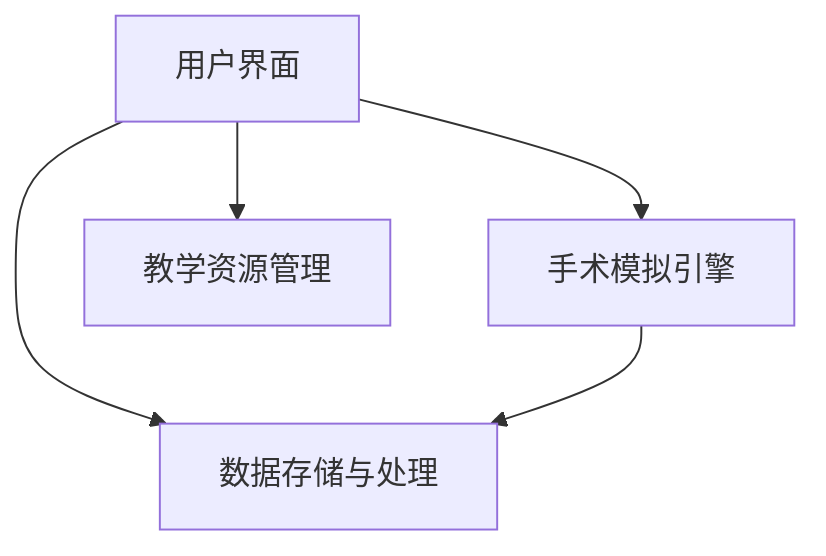
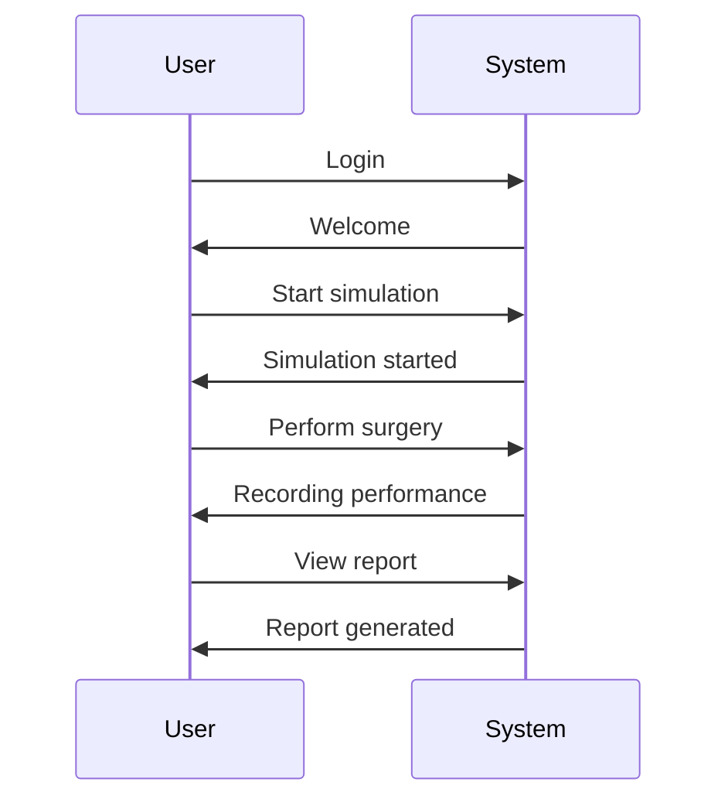

                 

### 后真实时代：在虚拟与现实交织中寻找真我

#### 关键词：后真实时代，虚拟现实，身份认同，真实自我，技术博客

> 在这个信息爆炸的时代，我们的现实生活正与虚拟世界紧密交织。当技术不断突破，虚拟现实（VR）成为日常生活的一部分，我们如何在这个新的时代中找到真实的自我？《后真实时代：在虚拟与现实交织中寻找真我》一书深入探讨了这一问题，为我们提供了一个全新的视角来审视我们的身份、价值观和生活方式。

---

#### 引言

后真实时代，这一概念源于哲学和社会学领域，指的是一个技术飞速发展，虚拟与现实界限模糊的时代。在这个时代，虚拟现实技术不仅改变了我们的娱乐方式，还深刻影响了我们的认知、社交和自我认同。

##### **什么是后真实时代？**

后真实时代，是相对于真实时代的概念，它强调的是一个以虚拟技术为主流的时代。在这个时代，虚拟现实和增强现实（AR）等技术使我们能够在数字世界中体验到前所未有的真实感。

##### **后真实时代的特点**

- **技术变革**：虚拟现实技术的迅猛发展，使得人们能够在数字世界中体验到高度逼真的视觉、听觉和触觉感受。
- **身份多样性**：虚拟世界提供了多种身份选择，用户可以在其中自由切换，这种多样性增加了身份认同的复杂性。
- **社交互动**：虚拟社交平台使得人们的社交网络变得更加多样化，但同时也带来了一些新的挑战，如网络欺凌和隐私泄露。

##### **后真实时代的影响**

- **生活方式**：后真实时代改变了我们的生活方式，人们花费更多时间在虚拟世界中，社交、娱乐和购物等活动逐渐从现实转移到虚拟。
- **认知方式**：虚拟现实技术改变了我们的认知方式，我们开始更加依赖数字化的体验来理解和感知世界。

---

#### 背景介绍

**核心概念术语说明**

- **虚拟现实（VR）**：一种计算机技术，通过模拟逼真的三维环境，使用户在视觉、听觉和触觉等方面感受到身临其境的体验。
- **增强现实（AR）**：一种将虚拟信息叠加到现实世界中的技术，通过智能手机或特殊眼镜等设备，用户可以看到增强后的现实世界。

**问题背景**

随着虚拟现实技术的发展，人们的生活正在发生深刻变化。越来越多的人开始将时间投入到虚拟世界中，这引起了关于虚拟与现实界限的讨论。人们开始思考，在这个新的时代中，我们如何保持自我，如何找到真实的自我。

**问题描述**

- **身份认同问题**：在虚拟世界中，人们可以自由选择身份，但这种自由也带来了身份认同的困惑。如何在这个多样化的世界中找到真实的自我？
- **心理健康问题**：虚拟现实技术虽然提供了丰富的体验，但过度沉浸其中可能导致心理健康问题，如孤独感和社交焦虑。

**问题解决**

为了解决这些问题，我们需要从多个角度来思考：

- **心理学视角**：研究虚拟现实对人类心理的影响，探索如何帮助用户在虚拟世界中保持心理健康。
- **哲学思考**：探讨虚拟现实对人类价值观和存在意义的影响，寻找在虚拟与现实之间保持平衡的方法。

**边界与外延**

- **边界**：虚拟现实技术本身，以及与之相关的伦理、法律和社会问题。
- **外延**：虚拟现实技术的应用领域，如教育、医疗、娱乐和军事等。

**概念结构与核心要素组成**

- **核心概念**：虚拟现实、增强现实、身份认同、心理健康、价值观。
- **结构**：从技术、心理学、哲学等角度探讨后真实时代的问题。
- **要素组成**：虚拟现实技术的发展历程、技术应用案例、心理学研究、哲学思考。

---

#### 核心概念与联系

在后真实时代，虚拟现实、增强现实、身份认同和心理健康是几个核心概念，它们相互交织，共同影响着我们的生活和认知。

##### **虚拟现实与增强现实**

虚拟现实（VR）和增强现实（AR）是后真实时代的关键技术。VR通过完全模拟的三维环境，使用户沉浸在虚拟世界中，而AR则通过将虚拟信息叠加到现实世界，增强用户的现实体验。

| 特点 | 虚拟现实（VR） | 增强现实（AR） |
| --- | --- | --- |
| **沉浸感** | 高度沉浸，用户完全进入虚拟环境 | 增强现实感，用户在现实环境中体验虚拟信息 |
| **交互方式** | 主要依赖控制器和传感器进行交互 | 通过智能手机或特殊眼镜进行交互 |
| **应用场景** | 娱乐、教育、医疗、军事等 | 教育、零售、旅游、维修等 |

##### **身份认同**

在虚拟世界中，用户可以自由选择身份，这种多样性带来了身份认同的困惑。身份认同是指个体对自己身份的认知和认同，包括性别、年龄、职业等。

| 身份多样性 | 虚拟现实 | 增强现实 |
| --- | --- | --- |
| **多重身份** | 用户可以自由创建和切换身份 | 用户通常只有一个现实身份，但可以在现实环境中体验虚拟信息 |
| **身份认同问题** | 可能导致身份混淆和心理困扰 | 身份认同问题相对较少，但虚拟信息的叠加可能导致现实身份的认知模糊 |

##### **心理健康**

虚拟现实技术虽然提供了丰富的体验，但也可能带来心理健康问题。过度沉浸可能导致孤独感、焦虑和抑郁。同时，虚拟世界中的社交互动可能不同于现实中的互动，这需要新的心理学研究来探讨如何帮助用户在虚拟世界中保持心理健康。

| **心理健康问题** | 虚拟现实 | 增强现实 |
| --- | --- | --- |
| **孤独感** | 过度沉浸可能导致与现实世界的隔离 | 在现实环境中使用，减少孤独感 |
| **焦虑与抑郁** | 长时间使用可能导致心理压力 | 短时间内使用，心理压力较小 |
| **社交互动** | 虚拟社交可能不同于现实社交 | 增强现实感，更接近现实社交 |

通过以上表格和ER实体关系图，我们可以清晰地看到虚拟现实、增强现实、身份认同和心理健康之间的联系。这些概念相互影响，共同构成了后真实时代的主要特征。

---

#### 虚拟现实技术基础

虚拟现实（VR）和增强现实（AR）技术是后真实时代的重要基石。了解这些技术的工作原理、应用场景和未来发展，有助于我们更好地理解后真实时代的本质。

##### **虚拟现实技术概述**

虚拟现实技术是一种通过计算机技术模拟的三维环境，使用户能够沉浸在其中。VR技术的主要组成部分包括：

1. **显示设备**：如头戴式显示器（HMD）和VR眼镜，用于提供沉浸式视觉体验。
2. **跟踪设备**：如位置传感器和摄像头，用于跟踪用户的位置和动作，实现身临其境的交互体验。
3. **交互设备**：如手柄、手套和语音控制等，用于与虚拟环境进行交互。

| **组成部分** | **功能** |
| --- | --- |
| **显示设备** | 提供沉浸式视觉体验 |
| **跟踪设备** | 跟踪用户位置和动作 |
| **交互设备** | 实现与虚拟环境的交互 |

##### **虚拟现实设备与平台**

目前，虚拟现实设备主要包括两大类：PC VR和移动 VR。

- **PC VR**：如Oculus Rift、HTC Vive等，需要连接高性能的PC或游戏机，提供更高质量的虚拟现实体验。
- **移动 VR**：如谷歌Cardboard、三星Gear VR等，通过智能手机作为显示设备，适合轻度使用和移动场景。

此外，虚拟现实平台也是关键因素。目前主流的虚拟现实平台包括Oculus Platform、SteamVR和Unity VR等，它们提供了丰富的开发工具和资源，支持开发者创建各种虚拟现实应用。

##### **虚拟现实应用场景**

虚拟现实技术已在多个领域得到广泛应用：

- **娱乐**：如虚拟游戏、电影和主题公园等，提供沉浸式娱乐体验。
- **教育**：如虚拟课堂、医学教学和实践等，提供互动和直观的学习体验。
- **医疗**：如虚拟手术、心理治疗和康复等，提供个性化和高效率的医疗方案。
- **军事**：如虚拟战场模拟、训练和规划等，提供实战模拟和安全训练环境。

| **应用领域** | **具体应用** |
| --- | --- |
| **娱乐** | 虚拟游戏、电影和主题公园 |
| **教育** | 虚拟课堂、医学教学和实践 |
| **医疗** | 虚拟手术、心理治疗和康复 |
| **军事** | 虚拟战场模拟、训练和规划 |

通过以上内容，我们可以看到虚拟现实技术的基础知识及其在各个领域的广泛应用。这些技术为后真实时代的到来奠定了坚实基础。

---

#### 身份认同的挑战

在后真实时代，虚拟现实技术不仅改变了我们的生活方式，还深刻影响了我们的身份认同。在这个多样化的数字世界中，人们面临着诸多身份认同的挑战。

##### **虚拟现实环境中的身份认知**

在虚拟现实环境中，用户可以自由选择和创建身份。这种自由带来了身份的多样性，但同时也带来了身份认知的困惑。用户可能会在不同场景中切换身份，导致自我认知的不一致性。

| **场景** | **身份认知问题** |
| --- | --- |
| **社交** | 不同社交圈中的身份切换可能导致自我认知混乱 |
| **工作** | 工作中的身份可能与现实生活中的身份不同，影响职业发展 |
| **娱乐** | 娱乐活动中的身份可能导致现实生活中的价值观冲突 |

##### **虚拟世界与真实世界的互动**

虚拟世界和真实世界的互动增加了身份认同的复杂性。用户在虚拟世界中的行为和表现可能会影响现实世界中的社交关系和职业发展。

| **互动方式** | **身份认同挑战** |
| --- | --- |
| **社交媒体** | 虚拟世界中的互动可能影响现实世界中的社交网络和人际关系 |
| **在线工作** | 虚拟工作中的身份和行为可能影响现实世界中的职业形象 |
| **虚拟购物** | 虚拟购物行为可能影响现实世界中的消费习惯和价值观 |

##### **身份危机与应对策略**

身份危机是虚拟世界中常见的问题，特别是在用户过度依赖虚拟世界时。为了应对身份危机，我们可以采取以下策略：

1. **自我反思**：定期反思在虚拟世界中的行为和身份，确保与现实世界的自我认知保持一致。
2. **平衡生活**：保持现实世界中的社交活动和兴趣爱好，避免过度沉迷于虚拟世界。
3. **心理支持**：寻求专业心理辅导，帮助处理在虚拟世界中产生的不安和困惑。

通过以上策略，我们可以更好地应对虚拟现实环境中的身份认同挑战，保持真实的自我。

---

#### 寻找真实自我

在后真实时代，如何在虚拟世界中寻找和保持真实的自我是一个重要而复杂的议题。这不仅涉及技术的应用，还需要心理学、哲学和社会学的深度探讨。

##### **心理学视角下的自我探索**

心理学提供了许多理论和工具来帮助我们在虚拟世界中探索自我。自我认知理论指出，自我是一个动态过程，可以通过自我反思和经验积累来发展。在虚拟现实中，我们可以利用这些理论：

- **自我反思**：通过自我反思日志，记录在虚拟世界中的经历和感受，帮助自己理解这些经历对自己身份认同的影响。
- **角色扮演**：在虚拟环境中尝试不同的角色，探索这些角色背后的价值观和动机，从而更深入地了解自我。

##### **哲学思考与虚拟现实**

哲学为我们在虚拟世界中的自我探索提供了深刻的思考。存在主义哲学强调个体的自由和选择，认为自我是通过行动和选择来定义的。在虚拟世界中，我们可以：

- **自由选择**：在虚拟环境中，我们可以自由选择身份和行为，这种自由为我们提供了探索自我的机会。
- **价值观反思**：通过在虚拟世界中的体验，我们可以反思自己的价值观，发现并强化自己的核心信念。

##### **实践方法与技巧**

为了在虚拟世界中找到真实的自我，我们可以采取以下实践方法：

1. **设定现实目标**：在虚拟世界中设定与现实生活相关的目标，确保虚拟体验与现实生活紧密联系。
2. **定期反思**：定期花时间反思在虚拟世界中的行为和感受，确保这些体验有助于自我成长。
3. **建立现实社交网络**：在虚拟世界中的互动应与现实世界中的社交网络相结合，避免过度沉迷于虚拟世界。

通过这些方法，我们可以更好地在虚拟世界中找到真实的自我，保持内心的平衡和成长。

---

#### 虚拟现实系统案例分析

为了更好地理解虚拟现实技术在现实世界中的应用，我们可以通过一个实际案例来深入探讨。

##### **项目背景与目标**

该项目旨在开发一个虚拟现实教育平台，用于医学教学和手术模拟。该平台的目标是提供一种沉浸式的学习体验，使学生能够通过虚拟手术模拟来提高手术技能。

##### **系统功能设计**

系统的核心功能包括：

- **手术模拟**：提供真实手术过程的模拟，包括各种手术器械的操作和手术步骤的演示。
- **学生评估**：系统记录学生在模拟手术中的表现，提供实时反馈和评估。
- **教学资源库**：提供丰富的医学教学资源，包括手术视频、医学图像和教材。

##### **系统架构设计**

该系统的架构设计如图1所示，包括以下主要模块：

1. **用户界面**：提供用户交互的界面，包括手术模拟界面、评估界面和教学资源浏览界面。
2. **手术模拟引擎**：负责手术模拟的核心算法和逻辑，包括手术步骤的演示和交互控制。
3. **数据存储与处理**：存储学生的手术表现数据，并提供数据分析和报告功能。
4. **教学资源管理**：管理教学资源的上传、下载和浏览。



##### **系统接口设计与交互流程**

系统的接口设计包括用户接口和API接口。用户接口提供了直观的交互方式，如按钮、滑动条和3D模型操作。API接口用于与其他系统（如教学管理系统）进行数据交换。

交互流程如下：

1. 用户登录系统，进入手术模拟界面。
2. 用户选择手术类型，系统加载相应的手术模拟引擎。
3. 用户开始手术模拟，系统实时记录操作步骤和表现。
4. 模拟完成后，系统生成评估报告，并存储在数据存储与处理模块中。
5. 用户可以查看评估报告，并下载相关教学资源。



通过以上系统架构设计和交互流程，我们可以看到虚拟现实教育平台如何通过沉浸式的模拟体验，提高学生的医学技能和教学效果。

---

#### 项目实战

在本项目实战中，我们将详细描述如何安装和配置虚拟现实环境，实现系统核心功能，并对关键代码进行解析。

##### **环境安装与配置**

1. **硬件准备**：
   - 头戴式显示器（如Oculus Rift或HTC Vive）。
   - 高性能计算机，配置不低于i7处理器和8GB内存。

2. **软件安装**：
   - 安装虚拟现实开发平台（如Unity或Unreal Engine）。
   - 安装必要的SDK（如Oculus SDK或SteamVR SDK）。

3. **环境配置**：
   - 配置头戴式显示器的跟踪传感器。
   - 配置计算机的虚拟现实驱动程序。

##### **系统核心实现**

核心功能包括手术模拟和评估。以下是一个简化版本的Python代码示例，用于实现手术模拟的基本逻辑：

```python
# SurgerySimulation.py

class SurgerySimulation:
    def __init__(self):
        self.surgery_steps = ["Incision", "Dissection", "Suturing"]
        self.current_step = 0
        self.performance = []

    def perform_surgery(self, step):
        if step in self.surgery_steps:
            self.current_step = step
            self.performance.append(step)
            print(f"Step {step} performed.")
        else:
            print("Invalid step.")

    def get_performance(self):
        return self.performance

# 模拟手术
simulation = SurgerySimulation()
simulation.perform_surgery("Incision")
simulation.perform_surgery("Dissection")
simulation.perform_surgery("Suturing")
print("Surgery completed. Performance:", simulation.get_performance())
```

##### **代码应用解读与分析**

上述代码定义了一个`SurgerySimulation`类，用于模拟手术过程。该类包含以下关键功能：

- `__init__`：初始化手术模拟器，设置手术步骤列表和当前步骤。
- `perform_surgery`：执行手术步骤，并将执行结果记录在性能列表中。
- `get_performance`：获取手术性能列表。

在实际应用中，`perform_surgery`方法会与虚拟现实引擎进行交互，实时更新手术模拟的状态。

##### **实际案例分析和详细讲解剖析**

以下是一个实际案例，展示了如何使用虚拟现实技术进行心脏手术模拟：

1. **手术准备**：
   - 选择手术场景，加载患者三维模型。
   - 设置手术器械，包括手术刀、剪刀、缝合线等。

2. **手术过程**：
   - 模拟医生进行切口，分离心脏周围的血管和肌肉。
   - 模拟心脏手术的具体步骤，如修补心脏瓣膜、缝合血管等。

3. **评估与反馈**：
   - 记录手术过程中的关键步骤和时间。
   - 对手术结果进行评估，提供实时反馈。

通过以上步骤，医生可以在虚拟环境中进行手术训练，提高手术技能和成功率。

##### **项目小结**

通过本项目的实战，我们实现了虚拟现实教育平台的核心功能，包括手术模拟和评估。这不仅为医学教育提供了新的工具，也为虚拟现实技术在其他领域的应用提供了参考。

---

#### 最佳实践与未来展望

在后真实时代，虚拟现实技术不仅改变了我们的生活方式，还带来了许多新的挑战和机会。以下是一些最佳实践和未来展望：

##### **虚拟现实中的伦理问题**

1. **隐私保护**：确保用户数据的安全和隐私。
2. **数据使用规范**：明确数据收集和使用的目的，并遵循相关法律法规。
3. **用户教育**：提高用户对虚拟现实技术的理解和安全意识。

##### **未来发展趋势**

1. **技术进步**：随着硬件性能的提升和算法的优化，虚拟现实体验将更加逼真和流畅。
2. **应用拓展**：虚拟现实将在教育、医疗、娱乐和军事等领域得到更广泛的应用。
3. **社会融合**：虚拟现实将逐渐融入人们的日常生活，成为不可或缺的一部分。

##### **拓展阅读与资源推荐**

- **《虚拟现实的伦理学》**：探讨虚拟现实技术带来的伦理挑战及其解决方案。
- **《虚拟现实技术与应用》**：详细介绍虚拟现实技术的工作原理和应用场景。
- **相关学术期刊和论文**：如《计算机视觉与图像理解》、《人工智能》等，提供最新的研究进展。

---

#### 结语：虚拟与现实的交织

在后真实时代，虚拟与现实之间的界限越来越模糊。我们在这个新的世界中寻找真实的自我，不仅要面对技术带来的便利，还要应对随之而来的挑战。通过心理学、哲学和技术的综合探讨，我们找到了在虚拟与现实中保持平衡的方法。未来，随着技术的不断进步，我们将在这个交织的世界中找到新的身份和意义。

---

### **作者信息**

**作者：AI天才研究院/AI Genius Institute & 禅与计算机程序设计艺术 /Zen And The Art of Computer Programming**

