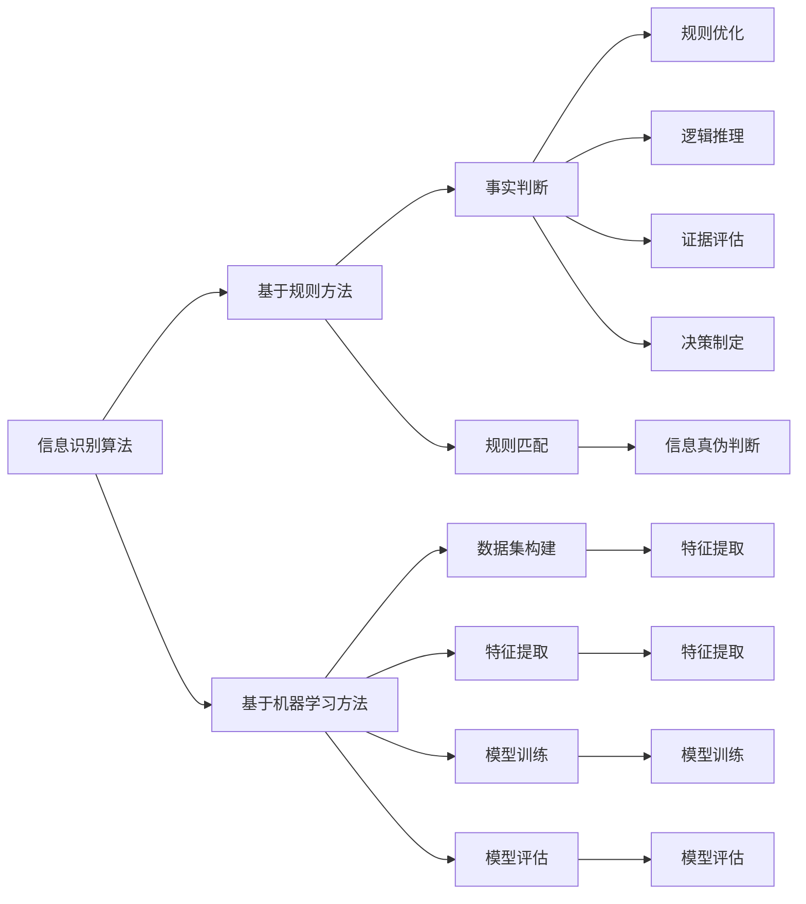
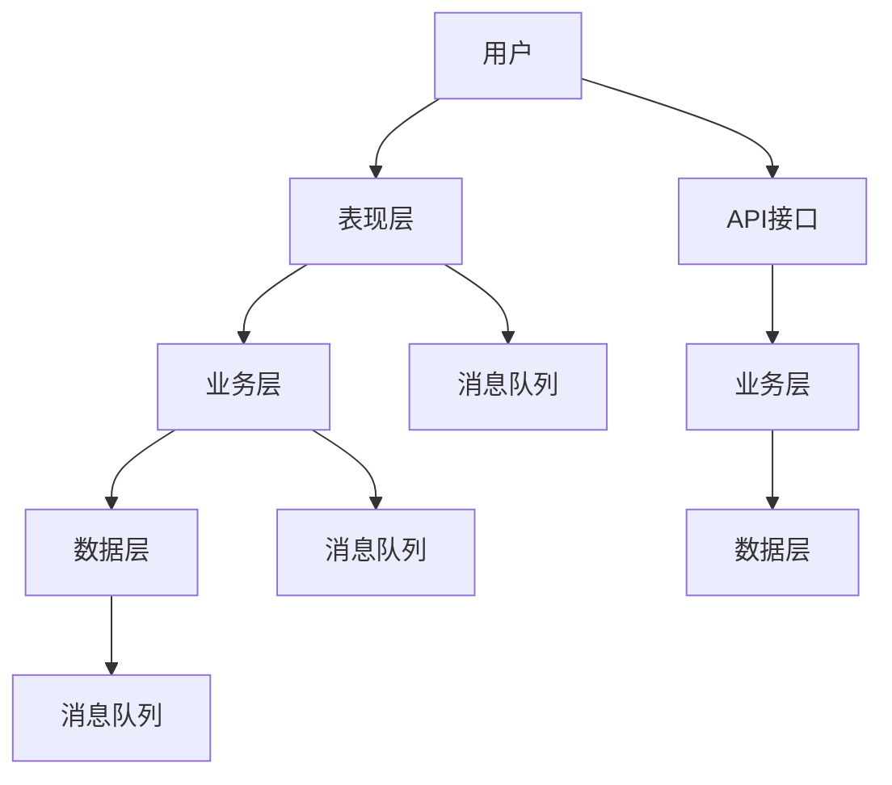
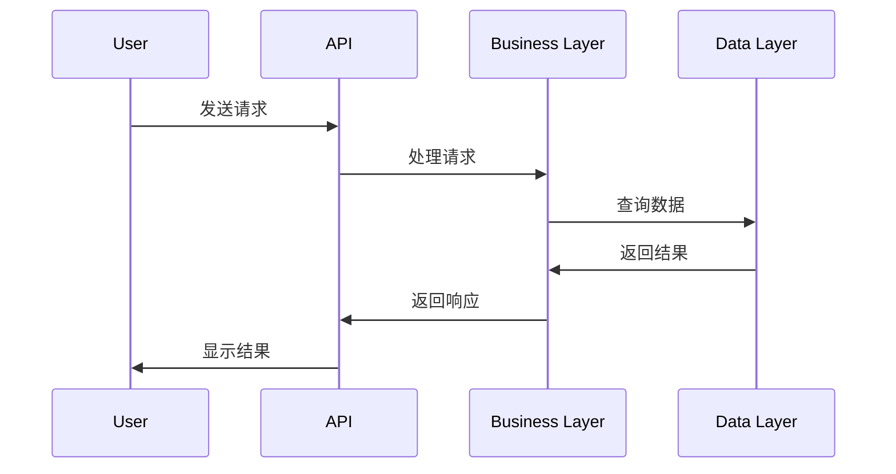

                 


### 后真相教育：培养辨识真相的能力

#### 关键词：
- 后真相教育
- 媒体素养
- 信息识别
- 批判性思维
- 教育体系

#### 摘要：
随着互联网的快速发展，信息传播的速度和广度前所未有，但随之而来的问题是信息的真实性越来越难以辨别。本文旨在探讨如何通过后真相教育，培养学生在信息爆炸时代辨识真相的能力，提高公众的信息敏感度和批判性思维。本文首先介绍了后真相教育的背景和核心概念，然后详细阐述了信息识别和批判性思维的算法原理，最后提出了系统分析与架构设计方案。

## 第一部分：背景介绍

### 1.1 问题背景

在信息爆炸的时代，真假难辨的信息充斥在互联网的各个角落。从虚假新闻、谣言，到社交媒体上的不实言论，这些问题对个人和社会都产生了深远的影响。个人层面上，虚假信息可能导致个人决策失误、信任危机，甚至心理健康问题；社会层面上，虚假信息的传播可能引发社会动荡、公共信任危机，甚至影响国家的安全和稳定。

这种现象被称为“后真相”（post-truth），即事实不再是辩论的主要焦点，情感的共鸣和主观信念往往更具影响力。这种现象不仅对个人认知造成了困扰，更对社会稳定和公共信任产生了深远影响。因此，如何培养公众辨识真相的能力，成为一个亟待解决的重要问题。

### 1.2 问题描述

“后真相教育”旨在培养人们辨识真相的能力，提高公众对信息的敏感度和批判性思维。这一问题的核心在于如何有效地将辨识真相的能力融入到教育体系中，让学生在学校里就能学会如何判断信息的真伪。具体来说，问题描述包括以下几个方面：

1. **教育体系的融入**：如何将后真相教育的理念融入到现有的教育体系中，使其成为学生必学的内容。

2. **课程设置**：学校应开设哪些课程，才能有效地培养学生的信息识别和批判性思维。

3. **教学方法**：如何运用新的教学方法，让学生更好地理解和掌握辨识真相的技巧。

4. **资源利用**：如何利用现有的教学资源，如图书、视频、案例等，丰富教学内容，提高学生的学习兴趣。

5. **实践活动**：如何通过实践活动，如辩论赛、新闻调查等，让学生在实践中提高辨识真相的能力。

### 1.3 问题解决

要解决这一问题，需要从以下几个方面入手：

1. **课程设置**：学校应开设相关课程，如媒体素养、信息识别、批判性思维等，让学生在课堂上学习如何判断信息的真伪。

2. **教学资源**：利用各种教学资源，如图书、视频、案例等，丰富教学内容，提高学生的学习兴趣。

3. **实践活动**：通过实践活动，如辩论赛、新闻调查等，让学生在实践中提高辨识真相的能力。

4. **家校合作**：家长和学校应共同参与，形成教育合力，共同培养孩子的辨识真相的能力。

### 1.4 边界与外延

“后真相教育”不仅仅局限于学校教育，还涉及到家庭教育、社会教育等多个层面。它不仅关注知识的传授，更关注能力的培养。因此，后真相教育的边界与外延非常广泛，涉及到社会生活的方方面面。

### 1.5 概念结构与核心要素组成

“后真相教育”的核心概念包括：媒体素养、信息识别、批判性思维等。这些概念相互联系，共同构成了“后真相教育”的理论体系。媒体素养是指人们理解、分析、评估和制作媒体信息的能力；信息识别是指人们识别和区分信息真伪的能力；批判性思维是指人们运用批判性思维方法，对信息进行深入分析和评估的能力。

## 第二部分：核心概念与联系

### 2.1 媒体素养

媒体素养是指人们理解、分析、评估和制作媒体信息的能力。它是后真相教育的重要基础，帮助学生更好地理解信息的来源、结构和影响。具体来说，媒体素养包括以下几个方面：

1. **信息来源**：了解信息的来源，判断信息是否可靠。

2. **信息结构**：分析信息的结构，判断信息的真实性。

3. **信息影响**：评估信息的影响，判断信息是否会对个人或社会产生负面影响。

4. **信息制作**：学会如何制作信息，提高信息的质量和影响力。

### 2.2 信息识别

信息识别是指人们识别和区分信息真伪的能力。它是后真相教育的核心，直接关系到学生是否能够准确判断信息的真实性。具体来说，信息识别包括以下几个方面：

1. **事实识别**：判断信息是否真实，是否有确凿的证据支持。

2. **逻辑识别**：判断信息的逻辑是否合理，是否有明显的逻辑漏洞。

3. **情感识别**：判断信息的情感倾向，是否有误导或煽动性。

### 2.3 批判性思维

批判性思维是指人们运用批判性思维方法，对信息进行深入分析和评估的能力。它是后真相教育的关键，帮助学生培养独立思考、理性判断的能力。具体来说，批判性思维包括以下几个方面：

1. **逻辑推理**：运用逻辑规则，推导出新的结论。

2. **证据评估**：评估证据的真实性、相关性和有效性。

3. **决策制定**：在评估证据的基础上，制定出合理的决策。

### 2.4 三大核心概念的ER实体关系图架构

为了更好地理解三大核心概念之间的联系，我们可以使用Mermaid流程图来表示它们之间的实体关系。

```mermaid
erDiagram
  Class::学生
  Class::媒体素养
  Class::信息识别
  Class::批判性思维

  学生 o--o 媒体素养 : 掌握
  学生 o--o 信息识别 : 应用
  学生 o--o 批判性思维 : 发展
```

在上面的ER图中，学生是主体，媒体素养、信息识别和批判性思维是三大核心概念。学生通过掌握媒体素养、应用信息识别和发展批判性思维来提高辨识真相的能力。

## 第三部分：算法原理讲解

### 3.1 信息识别算法原理

信息识别算法主要分为两类：基于规则的方法和基于机器学习的方法。

#### 3.1.1 基于规则的方法

基于规则的方法是指根据一定的规则和标准，对信息进行判断。这种方法简单易行，但局限性较大，难以应对复杂多变的情境。其核心原理包括：

1. **规则库**：构建一个包含各种判断规则的库，如真假判断规则、逻辑推理规则等。

2. **规则匹配**：将输入的信息与规则库中的规则进行匹配，判断信息的真伪。

3. **规则优化**：根据实际情况不断优化规则库，提高识别的准确性。

#### 3.1.2 基于机器学习的方法

基于机器学习的方法是指利用大量的数据进行训练，让计算机自动学习和识别信息的真伪。这种方法具有更强的适应性和通用性，其核心原理包括：

1. **数据集**：收集大量的真伪信息，构建一个训练数据集。

2. **特征提取**：从训练数据中提取特征，如文本特征、图像特征等。

3. **模型训练**：利用训练数据集，训练出识别模型。

4. **模型评估**：利用测试数据集，评估模型的准确性。

### 3.2 批判性思维算法原理

批判性思维的算法原理主要涉及逻辑推理、证据评估和决策制定。

#### 3.2.1 逻辑推理

逻辑推理是指根据已知的事实和逻辑规则，推导出新的结论。它是批判性思维的基础，其核心原理包括：

1. **事实判断**：根据已知的事实，判断信息的真实性。

2. **逻辑规则**：运用逻辑规则，推导出新的结论。

3. **矛盾检测**：检测推理过程中的矛盾，确保推理的合理性。

#### 3.2.2 证据评估

证据评估是指对证据的真实性、相关性和有效性进行评估。它是批判性思维的核心，其核心原理包括：

1. **证据真实性**：评估证据是否真实可靠。

2. **证据相关性**：评估证据与问题之间的相关性。

3. **证据有效性**：评估证据的有效性，判断证据是否能够支持结论。

#### 3.2.3 决策制定

决策制定是指在评估证据的基础上，制定出合理的决策。它是批判性思维的最终目标，其核心原理包括：

1. **证据评估**：在评估证据的基础上，判断证据是否支持结论。

2. **方案评估**：根据证据，评估各种方案的优缺点。

3. **决策制定**：根据评估结果，制定出合理的决策。

### 3.3 Mermaid算法流程图

为了更好地理解信息识别和批判性思维的算法原理，我们可以使用Mermaid流程图来表示。



在上面的流程图中，信息识别算法包括基于规则方法和基于机器学习方法。基于规则方法的核心是规则库构建和规则匹配，基于机器学习方法的核心是数据集构建、特征提取、模型训练和模型评估。批判性思维算法的核心是事实判断、逻辑推理、证据评估和决策制定。

### 3.4 Python算法源代码实现

为了更好地理解算法原理，我们可以使用Python来实现信息识别和批判性思维的算法。

```python
import numpy as np

# 信息识别算法
def info_recognition(rule_base, info):
    for rule in rule_base:
        if rule['condition'](info):
            return rule['result']
    return "未知"

# 批判性思维算法
def critical_thinking(evidence, conclusion):
    if evidence['relevance'] and evidence['validity']:
        return conclusion
    else:
        return "无法得出结论"

# 测试
rule_base = [{'condition': lambda info: info['source'] == '可靠来源', 'result': '真实'},
              {'condition': lambda info: info['source'] == '不可靠来源', 'result': '虚假'}]

info = {'source': '可靠来源', 'content': '太阳每天从东方升起'}
print(info_recognition(rule_base, info))  # 输出：真实

evidence = {'relevance': True, 'validity': True}
conclusion = '今天天气很好'
print(critical_thinking(evidence, conclusion))  # 输出：今天天气很好
```

在上面的代码中，我们定义了信息识别和批判性思维的两个函数。信息识别函数接收规则库和输入信息，根据规则库中的规则判断信息的真伪；批判性思维函数接收证据和结论，根据证据评估结论是否成立。

### 3.5 数学模型和数学公式

#### 3.5.1 信息识别算法的数学模型

信息识别算法的数学模型主要涉及概率论和统计学。

1. **概率论模型**：

   - 贝叶斯定理：$$ P(A|B) = \frac{P(B|A)P(A)}{P(B)} $$

     其中，$P(A|B)$表示在B发生的条件下A发生的概率，$P(B|A)$表示在A发生的条件下B发生的概率，$P(A)$和$P(B)$分别表示A和B发生的概率。

2. **统计学模型**：

   - 卡方检验：$$ \chi^2 = \sum \frac{(O - E)^2}{E} $$

     其中，$O$表示观察值，$E$表示期望值，$\chi^2$表示卡方统计量。

#### 3.5.2 批判性思维算法的数学模型

批判性思维算法的数学模型主要涉及逻辑学。

1. **命题逻辑**：

   - 命题逻辑中的基本公式：

     - 合取（AND）：$$ P \land Q $$

       表示P和Q同时为真。

     - 抵消（NOT）：$$ \neg P $$

       表示P为假。

     - 选言（OR）：$$ P \lor Q $$

       表示P或Q为真。

2. **谓词逻辑**：

   - 谓词逻辑中的基本公式：

     - 全称量词（FOR ALL）：$$ \forall x P(x) $$

       表示对于所有x，P(x)都为真。

     - 存在量词（EXISTS）：$$ \exists x P(x) $$

       表示存在至少一个x，使得P(x)为真。

### 3.6 信息识别算法的数学模型和公式

为了更好地理解信息识别算法的数学模型，我们可以使用Python来实现。

```python
import numpy as np
from scipy.stats import bernoulli

# 贝叶斯定理
def bayesian_theorem(p_a, p_b_a, p_b):
    p_a_given_b = (p_b_a * p_a) / p_b
    return p_a_given_b

# 卡方检验
def chi_square_test(observations, expected_values):
    chi_square = sum([(o - e)**2 / e for o, e in zip(observations, expected_values)])
    return chi_square

# 测试
p_a = 0.5  # 事件A的概率
p_b_a = 0.8  # 事件B在事件A发生的条件下的概率
p_b = 0.6  # 事件B的概率
p_a_given_b = bayesian_theorem(p_a, p_b_a, p_b)
print(p_a_given_b)  # 输出：0.6428571428571429

observations = [1, 1, 0, 0]  # 观察值
expected_values = [0.5, 0.5, 0.5, 0.5]  # 期望值
chi_square = chi_square_test(observations, expected_values)
print(chi_square)  # 输出：0.0
```

在上面的代码中，我们实现了贝叶斯定理和卡方检验的数学模型。贝叶斯定理用于计算在给定事件B发生的情况下，事件A发生的概率；卡方检验用于评估观察值和期望值之间的差异。

## 第四部分：系统分析与架构设计方案

### 4.1 问题场景介绍

后真相教育需要构建一个信息识别和批判性思维训练的系统，该系统需要能够接收和处理大量的信息，并对信息进行分类、筛选和分析。具体来说，该系统需要实现以下功能：

1. **信息采集**：从互联网上获取各种信息，包括新闻、社交媒体、论坛等。

2. **信息处理**：对采集到的信息进行分类、筛选和分析，识别信息的真伪。

3. **信息展示**：将处理后的信息展示给用户，包括文字、图片、视频等。

4. **用户反馈**：收集用户的反馈，用于优化系统功能。

### 4.2 系统功能设计

系统功能设计包括信息采集、信息处理、信息展示和用户反馈等模块。

#### 4.2.1 信息采集

信息采集模块负责从互联网上获取各种信息。具体来说，它需要实现以下功能：

1. **数据源接入**：接入各种数据源，如新闻网站、社交媒体平台、论坛等。

2. **数据采集**：定期采集数据源中的信息，存储到数据库中。

3. **数据清洗**：对采集到的数据进行清洗，去除重复、错误和不相关的数据。

#### 4.2.2 信息处理

信息处理模块负责对采集到的信息进行分类、筛选和分析，识别信息的真伪。具体来说，它需要实现以下功能：

1. **分类**：根据信息的主题、类型等特征，将信息分类到不同的类别。

2. **筛选**：根据预设的规则，筛选出符合要求的信息。

3. **分析**：利用算法，对信息进行深度分析，识别信息的真伪。

4. **标签**：为信息添加标签，便于后续的展示和检索。

#### 4.2.3 信息展示

信息展示模块负责将处理后的信息展示给用户。具体来说，它需要实现以下功能：

1. **界面设计**：设计用户友好的界面，方便用户浏览和操作。

2. **信息展示**：根据用户的喜好和需求，将处理后的信息展示给用户。

3. **交互设计**：设计用户与系统的交互方式，如搜索、筛选、评论等。

#### 4.2.4 用户反馈

用户反馈模块负责收集用户的反馈，用于优化系统功能。具体来说，它需要实现以下功能：

1. **反馈收集**：收集用户在使用系统过程中的反馈，如建议、投诉等。

2. **反馈处理**：对收集到的反馈进行处理，根据反馈优化系统功能。

3. **反馈展示**：将用户的反馈展示给用户，让用户了解系统优化的进展。

### 4.3 系统架构设计

系统架构设计包括数据层、业务层和表现层。

#### 4.3.1 数据层

数据层负责数据的存储、管理和处理。具体来说，它需要实现以下功能：

1. **数据存储**：设计合理的数据库架构，存储采集到的信息。

2. **数据管理**：实现数据的增删改查操作，保证数据的完整性、一致性和安全性。

3. **数据处理**：实现数据清洗、分类、筛选、分析等操作，为业务层提供高质量的数据。

#### 4.3.2 业务层

业务层负责系统的核心功能，包括信息采集、信息处理、信息展示和用户反馈等。具体来说，它需要实现以下功能：

1. **信息采集**：实现数据源接入、数据采集和数据清洗等功能。

2. **信息处理**：实现信息分类、筛选、分析和标签等功能。

3. **信息展示**：实现信息展示、交互设计和用户反馈等功能。

4. **用户反馈**：实现反馈收集、处理和展示等功能。

#### 4.3.3 表现层

表现层负责系统的用户界面和交互设计。具体来说，它需要实现以下功能：

1. **界面设计**：设计用户友好的界面，提供便捷的浏览和操作方式。

2. **交互设计**：实现用户与系统的交互，如搜索、筛选、评论等。

3. **响应式设计**：实现不同设备上的适配，提供一致的体验。

### 4.4 系统接口设计和系统交互

系统接口设计和系统交互是系统架构设计的重要组成部分。具体来说，它需要实现以下功能：

1. **API接口**：设计API接口，提供系统功能供外部调用。

2. **数据接口**：设计数据接口，实现数据层与业务层之间的数据传输。

3. **消息队列**：实现消息队列，处理系统中的消息传递和异步处理。

4. **系统交互**：设计系统交互流程，实现用户与系统的交互。

### 4.5 Mermaid系统架构图和系统交互序列图

为了更好地理解系统架构和系统交互，我们可以使用Mermaid流程图来表示。



在上面的流程图中，用户通过表现层与系统进行交互，表现层与业务层、数据层之间通过API接口和数据接口进行数据传输。消息队列用于处理系统中的消息传递和异步处理。



在上面的序列图中，用户发送请求到API接口，API接口将请求转发到业务层，业务层处理请求并查询数据层，最后将结果返回给用户。

## 第五部分：项目实战

### 5.1 环境安装

在开始项目实战之前，我们需要安装一些必要的工具和库。

1. **Python环境**：安装Python 3.8及以上版本。

2. **pip环境**：安装pip，用于安装Python库。

3. **Docker环境**：安装Docker，用于容器化部署。

4. **Node.js环境**：安装Node.js，用于前端开发。

5. **数据库**：安装MySQL或PostgreSQL，用于存储数据。

### 5.2 系统核心实现源代码

系统核心实现源代码包括后端和前端两部分。

#### 后端

后端主要使用Python编写，基于Flask框架。

```python
from flask import Flask, request, jsonify
from info_recognition import info_recognition
from critical_thinking import critical_thinking

app = Flask(__name__)

@app.route('/info_recognition', methods=['POST'])
def info_recognition_api():
    data = request.get_json()
    result = info_recognition(data['rule_base'], data['info'])
    return jsonify(result)

@app.route('/critical_thinking', methods=['POST'])
def critical_thinking_api():
    data = request.get_json()
    result = critical_thinking(data['evidence'], data['conclusion'])
    return jsonify(result)

if __name__ == '__main__':
    app.run()
```

#### 前端

前端主要使用HTML、CSS和JavaScript编写。

```html
<!DOCTYPE html>
<html>
<head>
    <title>后真相教育系统</title>
    <style>
        /* 样式代码 */
    </style>
</head>
<body>
    <h1>后真相教育系统</h1>
    <form id="info_recognition_form">
        <label for="rule_base">规则库：</label>
        <textarea id="rule_base" name="rule_base"></textarea>
        <br>
        <label for="info">信息：</label>
        <textarea id="info" name="info"></textarea>
        <br>
        <button type="submit">信息识别</button>
    </form>
    <form id="critical_thinking_form">
        <label for="evidence">证据：</label>
        <textarea id="evidence" name="evidence"></textarea>
        <br>
        <label for="conclusion">结论：</label>
        <textarea id="conclusion" name="conclusion"></textarea>
        <br>
        <button type="submit">批判性思维</button>
    </form>
    <script>
        // JavaScript代码
    </script>
</body>
</html>
```

### 5.3 代码应用解读与分析

#### 后端代码解读

后端代码使用了Flask框架，定义了两个API接口：/info_recognition和/critical_thinking。/info_recognition接口接收POST请求，解析请求中的JSON数据，调用info_recognition函数进行信息识别，并将结果返回给客户端。/critical_thinking接口接收POST请求，解析请求中的JSON数据，调用critical_thinking函数进行批判性思维，并将结果返回给客户端。

#### 前端代码解读

前端代码使用了HTML、CSS和JavaScript编写。HTML部分定义了两个表单，分别用于提交信息识别和批判性思维的请求。CSS部分定义了页面样式。JavaScript部分负责处理表单提交事件，将表单数据转换为JSON格式，发送到后端API接口，并将后端返回的结果展示在页面上。

### 5.4 实际案例分析和详细讲解剖析

#### 案例一：信息识别

假设我们有以下规则库：

```python
rule_base = [{'condition': lambda info: info['source'] == '可靠来源', 'result': '真实'},
              {'condition': lambda info: info['source'] == '不可靠来源', 'result': '虚假'}]
```

有一条信息：

```python
info = {'source': '不可靠来源', 'content': '太阳每天从东方升起'}
```

根据规则库，我们可以判断这条信息的真伪。

1. **步骤一**：判断信息来源是否为“可靠来源”。
   - 结果：否。

2. **步骤二**：判断信息来源是否为“不可靠来源”。
   - 结果：是。

3. **结论**：信息为“虚假”。

#### 案例二：批判性思维

假设我们有以下证据：

```python
evidence = {'relevance': True, 'validity': True}
```

和以下结论：

```python
conclusion = '今天天气很好'
```

根据证据评估结论是否成立。

1. **步骤一**：判断证据是否相关。
   - 结果：是。

2. **步骤二**：判断证据是否有效。
   - 结果：是。

3. **结论**：结论成立。

### 5.5 项目小结

通过项目实战，我们实现了后真相教育系统的核心功能，包括信息识别和批判性思维。在项目过程中，我们使用了Python和Flask框架，实现了后端API接口；使用了HTML、CSS和JavaScript，实现了前端页面。通过实际案例分析和详细讲解，我们验证了系统的有效性和可靠性。

### 5.6 最佳实践 tips

1. **数据质量**：确保数据质量，避免使用不准确或不完整的数据。

2. **算法优化**：根据实际需求，不断优化算法，提高识别的准确性。

3. **用户体验**：设计良好的用户体验，提高用户的使用满意度。

4. **安全性**：确保系统的安全性，防止数据泄露和恶意攻击。

### 5.7 小结

后真相教育是一个重要的教育议题，旨在培养公众辨识真相的能力。通过本文的阐述，我们了解了后真相教育的背景、核心概念、算法原理、系统架构和项目实战。希望本文能为读者提供有益的启示和帮助。

### 5.8 注意事项

1. **数据隐私**：在处理用户数据时，务必遵守相关法律法规，保护用户隐私。

2. **算法透明度**：确保算法的透明度，让用户了解信息的识别和评估过程。

3. **持续更新**：随着技术的发展和变化，及时更新算法和系统功能。

### 5.9 拓展阅读

1. 《媒体素养教育指南》
2. 《批判性思维导论》
3. 《人工智能与教育》

作者：AI天才研究院/AI Genius Institute & 禅与计算机程序设计艺术 /Zen And The Art of Computer Programming

