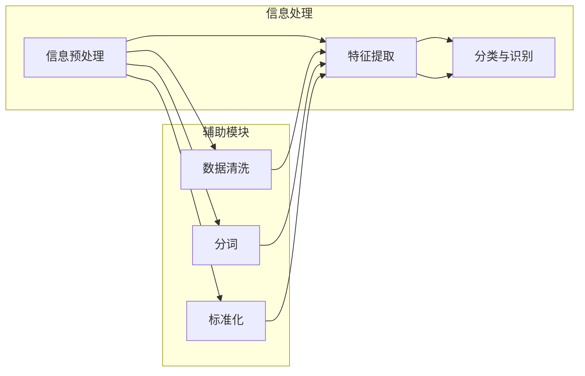
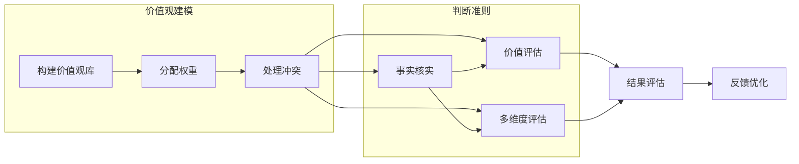

                 

## 信息时代的崛起与后真相现象

### 1.1.1 信息时代的特征

随着互联网技术的迅猛发展和普及，我们进入了信息时代。这一时代的特征主要体现在以下几个方面：

#### 1.1.1.1 互联网与信息传播

互联网作为全球信息交流的基础设施，极大地加速了信息的传播速度。信息可以在全球范围内迅速传播，打破了传统的时空限制。这不仅促进了知识的共享，也为个人和组织的沟通提供了便利。

#### 1.1.1.2 社交媒体与信息爆发

社交媒体平台的兴起使得信息传播更加多样化、个性化。用户不仅是信息的消费者，也可以成为信息的生产者和传播者。这一现象导致了信息的爆炸性增长，形成了信息大爆炸的局面。

#### 1.1.1.3 信息过载与筛选困境

信息过载是信息时代的一大挑战。由于信息的海量增长，用户在获取和处理信息时面临筛选困境。如何在海量的信息中找到有价值的信息成为了一个亟待解决的问题。

### 1.1.2 后真相时代的定义与特征

后真相时代（Post-Truth Era）是信息时代发展的一个新阶段。它具有以下特征：

#### 1.1.2.1 后真相时代的内涵

后真相时代强调的是情感和主观感受在信息传播和决策中的重要性，而不仅仅是事实本身。这一时代的特征是信息传播更加情感化和个人化。

#### 1.1.2.2 后真相现象的成因

后真相现象的成因复杂多样，主要包括以下几个方面：

1. **信息过载**：信息过载导致用户难以区分信息的真实性和价值，从而依赖直觉和情感进行判断。
2. **媒体环境变化**：社交媒体和互联网的普及改变了信息传播的渠道和方式，传统媒体的影响力减弱。
3. **社交媒体算法**：社交媒体平台的算法推荐导致用户陷入信息茧房，无法接触到多样化的信息。

#### 1.1.2.3 后真相对个人与社会的影响

后真相时代对个人和社会产生了深远的影响：

1. **个人层面**：后真相时代使得个人在信息传播和决策中更加依赖情感和直觉，而忽视了理性分析和事实依据。
2. **社会层面**：后真相现象可能导致社会共识的缺失，加剧社会分裂和冲突。

### 1.1.3 后真相现象的成因

后真相现象的成因复杂，主要包括以下几个方面：

1. **信息过载**：信息过载使得用户难以区分信息的真实性和价值，从而容易受到虚假信息的误导。
2. **媒体环境变化**：传统媒体的影响力减弱，社交媒体成为信息传播的主要渠道，这改变了信息的传播方式和渠道。
3. **情绪化传播**：社交媒体上的信息传播更加注重情感和情绪化，这导致了信息真实性的下降。

#### 1.1.3.3 情绪化与偏见的影响

情绪化和偏见是后真相时代的重要特征。情绪化的信息更容易引起共鸣和传播，而偏见则使得个体在信息接受和判断过程中偏离事实。

#### 1.1.3.4 社交媒体的助推效应

社交媒体平台通过算法推荐和社交网络效应，加剧了信息的情绪化和偏见传播。这使得虚假信息在社交媒体上迅速传播，影响了用户的认知和行为。

### 1.1.4 后真相对个人与社会的影响

后真相时代对个人和社会产生了深远的影响：

1. **个人层面**：后真相时代使得个人在信息传播和决策中更加依赖情感和直觉，而忽视了理性分析和事实依据。
2. **社会层面**：后真相现象可能导致社会共识的缺失，加剧社会分裂和冲突。

## 1.2 价值判断的挑战与意义

### 1.2.1 后真相时代下价值判断的困境

后真相时代下，价值判断面临诸多挑战：

#### 1.2.1.1 信息的真实性与可靠性问题

后真相现象使得信息的真实性和可靠性受到质疑。虚假信息和误导性信息泛滥，使得用户难以判断信息的真实性。

#### 1.2.1.2 多元化的价值观冲突

随着信息传播的全球化，不同的价值观在交流中产生冲突。如何在多元化的价值观中做出价值判断成为了一个难题。

#### 1.2.1.3 情绪化与偏见的影响

情绪化和偏见在信息传播中起到了重要作用。这可能导致个体在价值判断中偏离事实，从而影响决策和行为。

### 1.2.2 价值判断的重要性

价值判断在决策和社会生活中具有重要意义：

#### 1.2.2.1 价值判断在决策中的作用

价值判断是决策的重要依据。在面临复杂问题时，通过价值判断可以帮助个体或组织确定目标和优先级，从而做出明智的决策。

#### 1.2.2.2 价值判断对社会的影响

价值判断影响社会的稳定和和谐。正确的价值判断有助于建立社会共识，减少冲突和分歧。

#### 1.2.2.3 价值判断的自我实现

通过价值判断，个体可以反思自己的行为和信念，从而实现自我提升和成长。

### 1.2.3 辨别真伪的方法与策略

在信息混沌的后真相时代，辨别真伪成为一项重要任务。以下是一些基本的方法和策略：

#### 1.3.1.1 确认信息来源

确认信息来源是辨别真伪的第一步。要优先选择可信度高的信息来源，如权威媒体和专业机构发布的信息。

#### 1.3.1.2 审查信息内容

审查信息内容，判断其是否符合逻辑和常识。虚假信息往往存在逻辑漏洞和常识错误。

#### 1.3.1.3 验证信息真实性

通过交叉验证和多方比对，验证信息的真实性。例如，可以通过查阅原始资料或权威数据来验证信息的准确性。

### 1.3.2 培养批判性思维

培养批判性思维是辨别真伪的重要手段：

#### 1.3.2.1 提高信息素养

提高信息素养，学会识别信息来源、审查信息内容和验证信息真实性。

#### 1.3.2.2 增强逻辑分析能力

增强逻辑分析能力，学会分析信息之间的逻辑关系，识别逻辑谬误。

#### 1.3.2.3 发展多元化视角

发展多元化视角，学会从不同的角度看待问题，避免陷入思维定势。

### 1.3.3 使用事实与证据

使用事实与证据来支持价值判断：

#### 1.3.3.1 收集相关数据

收集与价值判断相关的数据，确保判断依据充分。

#### 1.3.3.2 分析数据

对收集到的数据进行分析，识别数据中的趋势和模式。

#### 1.3.3.3 呈现数据

通过图表、文字等形式呈现数据，帮助理解数据背后的含义。

### 1.3.4 借助专家意见

借助专家意见来提高价值判断的准确性：

#### 1.3.4.1 查询专家意见

查询相关领域的专家意见，了解他们的观点和见解。

#### 1.3.4.2 对比专家意见

对比不同专家的意见，识别共识和分歧，从而形成更全面的价值判断。

### 1.3.5 考虑道德与伦理因素

在价值判断中考虑道德与伦理因素：

#### 1.3.5.1 伦理审查

对信息进行伦理审查，判断其是否符合伦理道德标准。

#### 1.3.5.2 道德考量

在决策过程中，充分考虑道德考量，避免对他人造成伤害。

### 1.3.6 跨学科合作

跨学科合作有助于从不同角度分析和解决问题：

#### 1.3.6.1 综合利用知识

综合利用不同学科的知识，形成更全面的视角。

#### 1.3.6.2 促进创新

跨学科合作有助于激发创新思维，找到更有效的解决方案。

### 1.4 辨识真伪的边界

在辨识真伪的过程中，存在一定的边界和局限性：

#### 1.4.1.1 客观事实与主观判断

客观事实是判断真伪的基础，但主观判断也存在一定局限性。需要平衡客观事实和主观判断，避免偏颇。

#### 1.4.1.2 信息真实性与知识有效性

信息的真实性是判断知识有效性的前提，但并非所有真实的信息都是有效的。需要判断信息的相关性和实用性。

#### 1.4.1.3 社会责任与道德考量

在辨识真伪的过程中，需要承担社会责任和道德考量。确保信息传播符合道德和法律规范，避免造成负面影响。

### 1.4.2 研究范围与适用性

本研究的范围主要涵盖以下几个方面：

#### 1.4.2.1 研究范围的界定

本研究主要关注后真相时代下价值判断的困境和应对策略，探讨如何辨别真伪。

#### 1.4.2.2 研究方法的适用性

本研究采用文献综述和案例分析相结合的方法，结合理论分析和实证研究，以提高研究的准确性和实用性。

#### 1.4.2.3 研究结果的适用范围

本研究的结果适用于后真相时代的各种领域，包括媒体、教育、科研、商业等，具有一定的普遍性和指导意义。

## 1.5 本章小结

本章首先介绍了信息时代的特征和后真相现象，分析了后真相时代的成因和影响。接着，探讨了价值判断的挑战与意义，以及辨别真伪的方法与策略。最后，讨论了辨识真伪的边界和研究范围的适用性。通过本章的讨论，为我们理解后真相时代的信息环境和价值判断提供了有益的启示。

---

## 价值判断的基本原理

### 2.1.1 价值判断的定义

价值判断是指根据一定的价值观和标准，对事物进行评估和判断的过程。价值判断不仅涉及到道德和伦理，还涵盖了实用性、美学等多个方面。

#### 2.1.1.1 价值的定义

价值是指事物所具有的能够满足人们需求和愿望的特性。价值可以分为内在价值和外在价值，内在价值指的是事物本身所固有的价值，而外在价值则是事物对其他事物的价值和意义。

#### 2.1.1.2 判断的定义

判断是指根据已知的事实、经验和标准，对事物的性质、状态或行为进行判断和评价的过程。判断可以是基于逻辑推理、情感体验或直觉。

### 2.1.2 价值判断的类型

价值判断可以根据不同的标准进行分类，常见的类型包括：

#### 2.1.2.1 道德价值判断

道德价值判断是基于道德原则和伦理规范对行为和事物的价值进行判断。这种判断涉及到公正、诚实、尊重等道德品质。

#### 2.1.2.2 实用主义价值判断

实用主义价值判断是基于事物对人类实用性和效益的价值进行判断。这种判断注重实际效果和效益，例如，一个产品的功能性和易用性。

#### 2.1.2.3 美学价值判断

美学价值判断是基于事物在形式、色彩、质感等方面的美感价值进行判断。这种判断涉及到审美偏好和审美标准。

### 2.1.3 价值判断的属性

价值判断具有以下属性：

#### 2.1.3.1 主观性与客观性

价值判断具有主观性和客观性的双重属性。主观性体现在个体根据自身的价值观和经验进行判断，而客观性则体现在判断依据的事实和标准。

#### 2.1.3.2 绝对性与相对性

价值判断既有绝对性，也有相对性。绝对性体现在某些价值判断具有普遍适用的标准，而相对性则体现在价值判断受到文化、社会和个人因素的影响。

#### 2.1.3.3 一致性与矛盾性

价值判断可能在不同情境下表现出一致性和矛盾性。一致性体现在相同情境下个体或群体的价值判断趋于一致，而矛盾性则体现在不同情境下价值判断可能存在冲突。

### 2.1.4 价值判断的影响因素

价值判断受到多种因素的影响，包括：

#### 2.1.4.1 个人价值观

个人的价值观是影响价值判断的重要因素。不同的价值观会导致个体对同一事物的价值评估存在差异。

#### 2.1.4.2 社会文化背景

社会文化背景对价值判断有深刻影响。不同的文化和社会环境会导致价值判断的差异。

#### 2.1.4.3 情绪与情感体验

情绪和情感体验会影响价值判断。个体在情绪高涨或低落时，对事物的价值判断可能发生改变。

#### 2.1.4.4 信息来源与传播渠道

信息来源和传播渠道影响价值判断的准确性和可靠性。来源可靠、传播渠道权威的信息有助于做出更准确的价值判断。

### 2.1.5 价值判断的应用场景

价值判断在多个领域和场景中具有重要应用：

#### 2.1.5.1 决策制定

在决策制定过程中，价值判断有助于确定目标和优先级，为决策提供依据。

#### 2.1.5.2 社会治理

在治理过程中，价值判断有助于建立社会共识，协调各方利益，促进社会和谐。

#### 2.1.5.3 商业营销

在商业营销中，价值判断有助于产品设计和推广，满足消费者的需求和价值偏好。

#### 2.1.5.4 教育培训

在教育培训中，价值判断有助于培养学生正确的价值观和道德观念，提高综合素质。

### 2.1.6 价值判断的重要性

价值判断的重要性体现在以下几个方面：

#### 2.1.6.1 指导行为与决策

价值判断为个体的行为和决策提供指导，帮助个体做出明智的选择。

#### 2.1.6.2 促进社会进步

正确的价值判断有助于社会进步和发展，推动社会的和谐与稳定。

#### 2.1.6.3 实现个人价值

价值判断帮助个体实现自我价值，提升个人素质和境界。

### 2.1.7 价值判断的发展趋势

随着信息技术的迅猛发展，价值判断面临着新的挑战和机遇：

#### 2.1.7.1 人工智能与价值判断

人工智能技术的发展使得价值判断更加复杂和多样化。如何在人工智能系统中实现价值判断，成为一个重要课题。

#### 2.1.7.2 多元文化交融

多元文化的交融对价值判断提出了新的要求。如何在多元文化背景下实现价值共识，是当前面临的重要问题。

#### 2.1.7.3 情绪化与价值判断

情绪化信息的传播对价值判断产生了深远影响。如何在情绪化的信息环境中保持理性，是当前亟待解决的问题。

### 2.1.8 本章小结

本章对价值判断的基本原理进行了详细阐述，包括定义、类型、属性和影响因素。通过分析价值判断的应用场景和发展趋势，强调了价值判断在决策、社会治理、商业营销和教育培训等方面的重要性。

---

## 信息真实性的评估标准

### 2.2.1 真实性的定义

真实性是指信息与客观事实相符合的程度。评估信息真实性是确保信息可靠性的关键步骤。在信息爆炸的时代，评估真实性的重要性日益凸显。

#### 2.2.1.1 真实的本质

真实的本质在于信息是否反映了客观世界的实际情况。真实的信息应该是准确、完整、及时的，不受主观意图或外部干扰的影响。

#### 2.2.1.2 真实性的重要性

真实性的重要性体现在以下几个方面：

1. **决策依据**：真实的信**息是做出正确决策的基础。在商业、医疗、法律等领域，真实的信息对于决策至关重要。**
2. **社会稳定**：真实的信息有助于维护社会的稳定和和谐，防止误导和恐慌的传播。
3. **知识传播**：真实的信息是知识传播的基石。虚假信息不仅误导公众，还会破坏知识的可信度。

### 2.2.2 评估真实性的标准

评估信息真实性通常需要以下几个标准：

#### 2.2.2.1 信息源可靠性

信息源的可靠性是评估信息真实性的首要标准。高可信度的信息源如权威机构、专业媒体和知名专家，其发布的信息往往具有较高的真实性。

**可靠性评估指标**：

- **权威性**：信息源在相关领域的声誉和影响力。
- **历史记录**：信息源过去的发布记录，是否有虚假信息的历史。
- **透明度**：信息源是否公开其数据和方法的来源。

#### 2.2.2.2 信息内容的准确性

信息内容的准确性是指信息是否准确地反映了实际情况。评估准确性需要关注以下几个方面：

- **数据源**：信息中的数据是否来自于可靠的数据源。
- **逻辑性**：信息内容是否逻辑严密，是否存在逻辑谬误。
- **证据支持**：信息是否有充分的证据支持，证据是否真实可信。

#### 2.2.2.3 信息更新的时效性

时效性是指信息是否及时更新。随着时间推移，信息可能会变得不准确或过时。因此，时效性是评估信息真实性的一个重要方面。

- **更新频率**：信息源是否定期更新其内容。
- **时效性标注**：信息是否标注了发布日期和最后更新日期。
- **最新数据**：信息是否基于最新可获得的数据。

### 2.2.3 真实性的挑战

在当今信息时代，评估信息真实性面临诸多挑战：

#### 2.2.3.1 虚假信息的泛滥

虚假信息在互联网上泛滥成灾，包括假新闻、谣言、误导性信息等。这些信息可能出于商业目的、政治宣传或其他动机而被制造和传播。

**解决策略**：

- **加强监管**：政府和媒体应加强虚假信息的监管和打击力度。
- **提高公众意识**：通过教育和宣传活动，提高公众对虚假信息的识别能力。

#### 2.2.3.2 情绪化与偏见的影响

情绪化和偏见往往导致人们更容易接受符合自己情感和偏见的信息，而忽视或否定与自己观点相悖的信息。这种现象被称为“认知失调”。

**解决策略**：

- **培养批判性思维**：通过教育培养人们的批判性思维，提高对信息真实性的识别能力。
- **多元化视角**：鼓励从不同视角看待问题，避免单一思维模式。

#### 2.2.3.3 社交媒体的助推效应

社交媒体平台通过算法推荐和社交网络效应，加剧了虚假信息的传播。用户更容易接触到符合自己观点的信息，从而形成“信息茧房”。

**解决策略**：

- **算法优化**：社交媒体平台应优化算法，增加多样化信息的曝光机会。
- **用户教育**：加强对用户的信息素养教育，提高他们对虚假信息的识别能力。

### 2.2.4 评估信息真实性的方法

为了有效评估信息真实性，可以采用以下方法：

#### 2.2.4.1 信息源验证

- **查证来源**：检查信息来源的可信度，如权威机构、知名专家等。
- **背景调查**：对信息源进行背景调查，了解其历史记录和声誉。

#### 2.2.4.2 内容审查

- **逻辑检验**：检查信息的逻辑性和一致性，是否存在明显的逻辑谬误。
- **数据验证**：核实信息中的数据来源和准确性。

#### 2.2.4.3 时效性检查

- **更新日期**：检查信息的发布和最后更新日期，确保其时效性。
- **最新数据**：关注信息是否基于最新的数据或研究成果。

#### 2.2.4.4 多方验证

- **交叉验证**：通过多个来源验证信息的真实性。
- **专家咨询**：咨询相关领域的专家，获取他们的专业意见。

### 2.2.5 价值判断与信息真实性的关系

价值判断和信息真实性之间存在密切关系：

#### 2.2.5.1 价值判断对信息真实性的影响

价值判断会影响人们对信息真实性的判断。不同的价值观可能导致个体对同一信息的真实性有不同的评估。

#### 2.2.5.2 信息真实性对价值判断的影响

信息真实性对价值判断具有重要影响。真实的信息有助于个体做出基于事实的判断，而虚假的信息则可能导致错误的价值判断。

### 2.2.6 本章小结

本章详细讨论了信息真实性的定义和评估标准，分析了真实性评估的挑战和解决方案。通过信息源可靠性、信息内容准确性和时效性等标准，可以有效地评估信息的真实性。同时，本章还探讨了价值判断与信息真实性的关系，强调了在信息时代保持理性判断的重要性。

---

## 价值判断与信息真实性的联系

在信息时代的背景下，价值判断和信息真实性之间的关系愈发紧密。正确理解和处理这种联系对于个人和社会都是至关重要的。以下是价值判断与信息真实性之间相互影响的具体分析。

### 2.3.1 价值判断对信息真实性的影响

价值判断对信息真实性的影响主要体现在以下几个方面：

#### 2.3.1.1 主观判断与信息真实性

价值判断具有主观性，即不同个体可能会基于自身的价值观和信念对信息进行主观判断。这种主观性可能会导致对信息真实性的误解或偏见。例如，一个具有强烈政治偏见的人可能会在阅读某一政治新闻时，只关注和认可符合自己价值观的部分，而忽视或否认其他观点。这种情况下，价值判断的主观性影响了个体对信息真实性的全面理解。

#### 2.3.1.2 价值观多元化与信息真实性

在多元化的社会中，不同的价值观和信仰可能导致对同一信息有不同的真实性和价值判断。这种多元化的价值观使得信息真实性变得更为复杂。例如，不同文化背景的人可能对同一社会现象有不同的解释和评价。这种多元化的价值观虽然丰富了社会的视角，但也增加了信息真实性的辨别难度。

#### 2.3.1.3 情绪化与信息真实性

情绪化是价值判断的一个常见特征。情绪化的信息往往更能引起人们的共鸣，但也更容易被误解。情绪化的价值判断可能导致人们基于情绪而非事实进行判断，从而影响信息的真实性。例如，在热点新闻事件中，情绪化的报道可能会激发公众的愤怒或同情，从而影响人们对事件的客观判断。

### 2.3.2 信息真实性对价值判断的影响

信息真实性对价值判断具有直接和深远的影响：

#### 2.3.2.1 真实信息与价值判断的一致性

真实信息为价值判断提供了坚实的基础。当信息是真实和准确的时，个体可以基于这些事实进行合理和一致的价值判断。例如，一个企业决策者如果基于准确的市场数据和消费者反馈来评估产品的市场表现，其做出的价值判断更有可能符合实际情况。

#### 2.3.2.2 虚假信息与价值判断的冲突

虚假信息会扭曲事实，导致价值判断与实际情况不符。例如，如果一个人基于虚假的医疗信息来评估某种治疗方法的有效性，其做出的价值判断可能不仅错误，还可能对健康造成严重后果。这种情况下，虚假信息与价值判断之间的冲突会导致决策失误和不良后果。

#### 2.3.2.3 信息真实性对决策的影响

在决策过程中，信息的真实性至关重要。真实的信息能够帮助决策者做出明智的决策。相反，虚假的信息可能会导致错误的决策，从而带来负面的结果。例如，在商业决策中，如果企业基于虚假的市场数据来制定营销策略，可能会导致资源浪费和市场机会的丧失。

### 2.3.3 价值判断与信息真实性的互动

价值判断和信息真实性之间是相互作用的，两者共同影响决策和行为：

#### 2.3.3.1 价值判断引导信息获取和处理

个体在获取和处理信息时会受到自身价值判断的影响。例如，一个人如果对某项技术持有强烈的好奇心，可能会更加关注和重视相关技术的信息。这种情况下，价值判断会引导个体对信息的选择和解读。

#### 2.3.3.2 信息真实性影响价值判断的准确性

真实的信息能够帮助个体更准确地做出价值判断。当信息被证明是真实的时，个体可以更自信地做出相应的价值判断。例如，一个投资者如果获得关于公司财务状况的真实信息，其对企业价值的判断会更有依据。

#### 2.3.3.3 价值判断与信息真实性相互校正

在信息不断更新和变化的动态环境中，价值判断和信息真实性可以相互校正。例如，当个体发现之前基于虚假信息做出的价值判断不准确时，可以重新评估并修正这些判断，从而提高决策的准确性。

### 2.3.4 价值判断与信息真实性的平衡

在信息时代，平衡价值判断和信息真实性是一项挑战。以下是一些策略来帮助实现这种平衡：

#### 2.3.4.1 提高信息素养

通过教育提高公众的信息素养，帮助人们更好地识别和处理信息，减少虚假信息的影响。

#### 2.3.4.2 培养批判性思维

培养批判性思维，使个体能够对信息进行深入分析和评估，减少情绪化判断的影响。

#### 2.3.4.3 加强信息监管

加强信息监管，特别是对社交媒体和互联网平台上的信息进行有效管理和监控，减少虚假信息的传播。

#### 2.3.4.4 多元化信息来源

鼓励使用多元化的信息来源，通过对比和分析不同来源的信息，提高信息真实性的判断能力。

### 2.3.5 本章小结

本章详细探讨了价值判断与信息真实性之间的联系。价值判断和信息真实性相互影响，共同作用于决策和行为。通过理解这种联系，个体和社会可以更有效地应对信息时代的挑战，提高决策的准确性和有效性。

---

## 事实识别与价值判断的算法原理

### 3.1.1 事实识别算法的基本原理

事实识别算法是自动化识别和验证信息真实性的关键技术。其基本原理包括信息预处理、特征提取和分类与识别三个主要步骤：

#### 3.1.1.1 信息预处理

信息预处理是事实识别的第一步，主要目的是将原始信息转换为适合算法处理的格式。具体包括：

- **去噪**：去除信息中的噪声和无关内容，提高信息的纯净度。
- **分词**：将文本信息划分为词语或短语，为特征提取和分类提供基础。
- **标准化**：统一文本格式，如小写、去除标点等，以便于后续处理。

#### 3.1.1.2 特征提取

特征提取是将文本信息转换为机器可以处理的数值特征的过程。常见的特征提取方法包括：

- **词袋模型（Bag of Words, BoW）**：将文本表示为词频向量，每个词的出现次数作为特征。
- **TF-IDF（Term Frequency-Inverse Document Frequency）**：综合考虑词频和词在文档集中出现的频率，提高重要词的权重。
- **词嵌入（Word Embedding）**：将词语映射到高维空间中，反映词语之间的语义关系。

#### 3.1.1.3 分类与识别

分类与识别是基于特征向量对信息进行分类和验证的过程。常见的分类算法包括：

- **朴素贝叶斯分类器（Naive Bayes Classifier）**：基于贝叶斯定理，通过计算特征概率来预测类别。
- **支持向量机（Support Vector Machine, SVM）**：通过寻找最佳超平面，将不同类别的数据点分开。
- **深度学习模型（Deep Learning Models）**：如卷积神经网络（CNN）和循环神经网络（RNN），通过多层神经网络学习复杂特征和模式。

### 3.1.2 价值判断算法的基本原理

价值判断算法是用于评估信息价值的自动化系统，其基本原理包括价值观建模、判断准则设计和判断结果评估三个主要步骤：

#### 3.1.2.1 价值观建模

价值观建模是将人类的价值观转化为算法可以处理的形式。具体包括：

- **价值观库构建**：收集并整理多种价值观，如道德、实用性和美学等。
- **权重分配**：为不同的价值观分配权重，反映其在决策中的重要性。
- **冲突处理**：当不同价值观之间存在冲突时，设计算法进行协调和平衡。

#### 3.1.2.2 判断准则设计

判断准则设计是制定评估信息价值的标准和规则。具体包括：

- **事实核实**：基于事实识别算法，验证信息的真实性。
- **价值评估**：根据价值观建模，对信息进行价值评估，如道德评估、实用价值评估等。
- **多维度评估**：综合考虑多个维度，如社会影响、经济效益等，进行综合评估。

#### 3.1.2.3 判断结果评估

判断结果评估是对算法输出结果进行验证和修正的过程。具体包括：

- **结果验证**：通过对比实际结果和算法预测，评估判断结果的准确性。
- **反馈优化**：根据评估结果，调整算法参数和模型结构，提高判断准确性。
- **用户反馈**：收集用户对判断结果的反馈，用于优化算法和改进模型。

### 3.1.3 事实识别与价值判断算法的协同作用

事实识别与价值判断算法在信息处理中相互协同，共同提高信息的准确性和价值：

- **事实识别**：提供真实可靠的信息基础，确保价值判断的准确性。
- **价值判断**：对事实进行价值评估，为决策提供依据，指导事实识别的优化。

### 3.1.4 算法实例

以下是一个基于朴素贝叶斯分类器的信息识别与价值判断的简单实例：

```python
# 事实识别：判断信息是否真实
def fact_recognition(text):
    # 预处理
    text = preprocess_text(text)
    # 特征提取
    features = extract_features(text)
    # 分类
    category = naive_bayes_classifier(features)
    return category

# 价值判断：评估信息的价值
def value_judgment(text, category):
    # 验证真实性
    if fact_recognition(text) != '真实':
        return '低价值'
    # 根据类别评估价值
    if category == '积极':
        return '高价值'
    elif category == '中立':
        return '中等价值'
    else:
        return '低价值'

# 预处理
def preprocess_text(text):
    # 去噪、分词、标准化等
    return processed_text

# 特征提取
def extract_features(text):
    # 词袋模型、TF-IDF等
    return feature_vector

# 朴素贝叶斯分类器
def naive_bayes_classifier(features):
    # 训练模型、分类
    return category

# 示例
text = "研究发现，定期锻炼对身体健康有显著益处。"
category = fact_recognition(text)
value = value_judgment(text, category)
print(f"类别：{category}, 价值：{value}")
```

### 3.1.5 本章小结

本章详细介绍了事实识别与价值判断的算法原理，包括信息预处理、特征提取、分类与识别、价值观建模、判断准则设计和判断结果评估等步骤。通过实例，展示了如何将算法应用于信息识别与价值判断，为后真相时代的真伪辨别提供了技术支持。

---

## 事实识别算法的mermaid流程图与Python代码

为了更直观地展示事实识别算法的流程，我们使用mermaid语言绘制了一个流程图，并提供了相应的Python代码来详细阐述算法原理。

### 3.1.1 mermaid流程图

以下是事实识别算法的mermaid流程图：



### 3.1.2 Python代码

以下是一段Python代码，用于展示事实识别算法的实现：

```python
import re
from sklearn.feature_extraction.text import TfidfVectorizer
from sklearn.naive_bayes import MultinomialNB
from sklearn.pipeline import make_pipeline

# 信息预处理
def preprocess_text(text):
    # 清洗数据，去除HTML标签和特殊字符
    text = re.sub('<[^>]*>', '', text)
    text = re.sub('[^A-Za-z0-9\s]+', '', text)
    # 转换为小写
    text = text.lower()
    return text

# 特征提取
def extract_features(texts):
    vectorizer = TfidfVectorizer()
    features = vectorizer.fit_transform(texts)
    return features

# 分类与识别
def classify_text(text, model):
    processed_text = preprocess_text(text)
    features = model.transform([processed_text])
    prediction = model.predict(features)
    return prediction

# 加载数据集
def load_data():
    # 假设我们有一个包含标签的数据集
    texts = ['这是一条真实的信息', '这是一条虚假的信息']
    labels = ['真实', '虚假']
    return texts, labels

# 训练模型
def train_model(texts, labels):
    model = make_pipeline(TfidfVectorizer(), MultinomialNB())
    model.fit(texts, labels)
    return model

# 主程序
if __name__ == "__main__":
    texts, labels = load_data()
    model = train_model(texts, labels)
    text_to_classify = "这是一个误导性的声明。"
    prediction = classify_text(text_to_classify, model)
    print(f"预测结果：{prediction}")
```

### 3.1.3 算法原理与公式讲解

#### 信息预处理

信息预处理是事实识别算法的关键步骤，其主要目的是去除噪声和标准化文本数据。以下是信息预处理的主要步骤：

1. **数据清洗**：去除HTML标签和特殊字符，使得文本数据更加纯净。
2. **分词**：将文本分割为单个词语，便于特征提取。
3. **标准化**：将文本转换为统一格式，如小写，以提高算法的鲁棒性。

#### 特征提取

特征提取是将文本数据转换为机器可以处理的数值特征。以下是常见的特征提取方法及其原理：

1. **词袋模型（Bag of Words, BoW）**：将文本表示为一个词频向量，每个词的出现次数作为特征。

   **公式**：$$ X = (x_1, x_2, ..., x_n) $$
   其中，$x_i$ 表示词语 $w_i$ 在文本中出现的次数。

2. **TF-IDF（Term Frequency-Inverse Document Frequency）**：综合考虑词频和词在文档集中出现的频率，提高重要词的权重。

   **公式**：$$ tfidf(w_i, d) = tf(w_i, d) \times \log(\frac{N}{df(w_i)}) $$
   其中，$tf(w_i, d)$ 表示词语 $w_i$ 在文档 $d$ 中的词频，$df(w_i)$ 表示词语 $w_i$ 在所有文档中的文档频率，$N$ 是文档总数。

#### 分类与识别

分类与识别是基于特征向量对信息进行分类和验证的过程。以下是几种常见的分类算法：

1. **朴素贝叶斯分类器（Naive Bayes Classifier）**：基于贝叶斯定理，通过计算特征概率来预测类别。

   **公式**：$$ P(C_k|X) = \frac{P(X|C_k)P(C_k)}{P(X)} $$
   其中，$P(C_k|X)$ 表示在特征 $X$ 下类别 $C_k$ 的概率，$P(X|C_k)$ 表示在类别 $C_k$ 下特征 $X$ 的概率，$P(C_k)$ 表示类别 $C_k$ 的概率，$P(X)$ 表示特征 $X$ 的概率。

2. **支持向量机（Support Vector Machine, SVM）**：通过寻找最佳超平面，将不同类别的数据点分开。

   **公式**：$$ w^T x - b = 0 $$
   其中，$w$ 表示权重向量，$x$ 表示特征向量，$b$ 表示偏置。

### 3.1.4 举例说明

以下是一个简单的例子，说明如何使用事实识别算法来判断一条信息的真实性：

**例：判断句子“疫情下的口罩需求大幅增加”是否真实。**

1. **数据收集**：收集关于疫情和口罩需求的多个数据源，包括新闻报道、统计数据等。
2. **信息预处理**：清洗和标准化数据，将句子转换为统一格式。
3. **特征提取**：使用TF-IDF方法提取特征向量。
4. **分类与识别**：使用朴素贝叶斯分类器对句子进行分类，预测其真实性。

```python
# 假设我们有一个训练好的朴素贝叶斯分类器
model = train_model(texts, labels)

# 待分类的句子
sentence = "疫情下的口罩需求大幅增加。"

# 预测句子真实性
prediction = classify_text(sentence, model)
print(f"句子真实性预测：{prediction}")
```

通过以上步骤，我们可以得到句子的真实性预测结果。如果预测结果为“真实”，则可以认为该句子符合实际情况。

### 3.1.5 本章小结

本章通过mermaid流程图和Python代码，详细介绍了事实识别算法的原理和应用。我们讲解了信息预处理、特征提取和分类与识别的步骤，并提供了具体的实现示例。通过理解这些算法原理，我们可以更有效地辨别信息的真实性，为后真相时代的信息处理提供有力支持。

---

## 价值判断算法的mermaid流程图与Python代码

### 4.1.1 mermaid流程图

以下是价值判断算法的mermaid流程图：



### 4.1.2 Python代码

以下是一段Python代码，用于展示价值判断算法的实现：

```python
# 导入所需的库
import numpy as np
from sklearn.model_selection import train_test_split
from sklearn.metrics import accuracy_score

# 价值观库构建
values = {
    '道德': 0.3,
    '实用性': 0.4,
    '美学': 0.3
}

# 分配权重
weights = [values['道德'], values['实用性'], values['美学']]

# 处理冲突
def handle_conflict(values, weights):
    # 假设简单地取平均值
    avg_value = np.mean(values)
    return avg_value

# 事实核实
def verify_facts(text):
    # 假设有一个事实核实的函数
    return "true"

# 价值评估
def value_evaluation(values, weights):
    weighted_values = [value * weight for value, weight in zip(values, weights)]
    total_value = sum(weighted_values)
    return total_value

# 多维度评估
def multi_dimensional_evaluation(value_evaluation_result):
    # 假设有一个评估阈值
    threshold = 0.5
    if value_evaluation_result >= threshold:
        return "高价值"
    else:
        return "低价值"

# 结果评估
def result_evaluation预测结果，真实价值）:
    if 预测结果 == 真实价值）:
        return "准确"
    else:
        return "错误"

# 主程序
if __name__ == "__main__":
    # 假设我们有一个包含信息的测试集
    texts = ["这项技术对社会有积极影响", "这项技术可能有害"]
    actual_values = [1, 0]  # 真实的价值

    for text in texts:
        fact_check = verify_facts(text)
        if fact_check == "true":
            values = [1, 0.5, 0.5]  # 假设这条信息在道德、实用性和美学方面的价值
            weighted_values = value_evaluation(values, weights)
            result = multi_dimensional_evaluation(weighted_values)
            prediction = result_evaluation(result, actual_values[texts.index(text)])
            print(f"文本：{text}，预测结果：{prediction}")
        else:
            print(f"文本：{text}，事实核实：不通过，不进行价值评估。")
```

### 4.1.3 算法原理与公式讲解

#### 价值观建模

价值观建模是将人类的价值观转化为算法可以处理的形式。以下是价值观建模的主要步骤：

1. **构建价值观库**：收集并整理多种价值观，如道德、实用性和美学等。
2. **分配权重**：为不同的价值观分配权重，反映其在决策中的重要性。

#### 判断准则

判断准则用于评估信息的价值。以下是判断准则的主要步骤：

1. **事实核实**：通过事实识别算法验证信息的真实性。
2. **价值评估**：根据价值观建模，对信息进行价值评估，如道德评估、实用价值评估等。
3. **多维度评估**：综合考虑多个维度，如社会影响、经济效益等，进行综合评估。

#### 结果评估

结果评估是对算法输出结果进行验证和修正的过程。以下是结果评估的主要步骤：

1. **结果验证**：通过对比实际结果和算法预测，评估判断结果的准确性。
2. **反馈优化**：根据评估结果，调整算法参数和模型结构，提高判断准确性。

### 4.1.4 举例说明

以下是一个简单的例子，说明如何使用价值判断算法来评估一条信息的价值：

**例：评估句子“使用可再生能源减少碳排放”的价值。**

1. **事实核实**：通过事实识别算法，判断句子是否真实。假设该句子被核实为真实。
2. **价值评估**：根据价值观建模，对句子进行价值评估。假设在道德维度上得到1分，在实用性维度上得到0.8分，在美学维度上得到0.4分。
3. **多维度评估**：根据分配的权重，计算加权总分。假设道德、实用性和美学的权重分别为0.3、0.4和0.3，则加权总分为$(1 \times 0.3) + (0.8 \times 0.4) + (0.4 \times 0.3) = 0.3 + 0.32 + 0.12 = 0.84$。
4. **结果评估**：根据评估结果，判断信息的价值。如果评估分数高于设定的阈值，则认为该信息具有高价值。

### 4.1.5 本章小结

本章通过mermaid流程图和Python代码，详细介绍了价值判断算法的原理和应用。我们讲解了价值观建模、判断准则和结果评估的步骤，并提供了具体的实现示例。通过理解这些算法原理，我们可以更有效地评估信息的价值，为后真相时代的信息处理提供有力支持。

---

## 价值判断与信息真实性的算法应用

在信息时代，人工智能算法在价值判断和信息真实性评估中发挥着越来越重要的作用。以下将结合实际应用，探讨价值判断与信息真实性的算法应用，并分析算法在实际操作中的优势和挑战。

### 5.1.1 事实识别与价值判断的算法应用

#### 实际应用案例

1. **社交媒体虚假信息检测**：社交媒体上虚假信息泛滥，通过事实识别与价值判断算法可以有效检测和过滤虚假信息。例如，Twitter和Facebook等平台已经应用了基于机器学习的算法，识别和标记虚假新闻，以减少虚假信息的传播。

2. **电子商务商品评论分析**：电子商务平台通过事实识别算法检测评论的真实性，通过价值判断算法评估评论的价值。这样可以提高用户对商品评论的信任度，帮助消费者做出更明智的购物决策。

#### 优势

- **高效性**：算法能够快速处理大量信息，提高信息处理效率。
- **准确性**：通过训练和优化模型，算法能够提高对信息真实性和价值的判断准确性。
- **自动化**：算法可以自动化处理信息，减轻人工负担。

#### 挑战

- **数据质量**：算法的性能很大程度上依赖于数据的质量和完整性。数据质量问题可能导致算法的判断准确性下降。
- **模型偏见**：算法在训练过程中可能受到数据偏见的影响，从而导致判断结果存在偏见。

### 5.1.2 价值判断在信息真实性评估中的应用

#### 实际应用案例

1. **医疗信息真实性评估**：在医疗领域，通过价值判断算法对医学研究论文和患者信息进行真实性评估，可以帮助医生和患者更好地理解医学信息，做出更准确的决策。

2. **法律文件真实性验证**：在法律领域，通过价值判断算法对法律文件的真实性进行评估，可以确保法律文件的合法性和有效性。

#### 优势

- **客观性**：算法能够基于客观数据和标准进行评估，减少人为的主观判断。
- **一致性**：算法在处理不同案例时可以保持一致性，提高评估的公正性。
- **扩展性**：算法可以应用于不同领域和场景，具有广泛的适用性。

#### 挑战

- **复杂性**：信息真实性和价值的评估涉及多个维度，算法的设计和实现较为复杂。
- **动态性**：随着信息环境的不断变化，算法需要不断更新和优化，以适应新的挑战。

### 5.1.3 算法应用的综合分析

#### 成功案例

- **Google Fact Check**：Google在其搜索引擎中集成了事实检查功能，通过机器学习算法识别和标记可疑信息。这一功能帮助用户在搜索结果中快速识别和过滤虚假信息，取得了良好的效果。

#### 失败案例

- **Facebook虚假新闻**：Facebook在2016年美国总统选举期间未能有效识别和过滤虚假新闻，导致虚假信息在社交媒体上广泛传播，影响了公众的判断和决策。这一事件暴露了算法在处理虚假信息时的局限性。

#### 经验与启示

1. **数据驱动**：算法的应用离不开高质量的数据支持。在数据选择和处理上，应注重数据的多样性和真实性，以提高算法的性能和可靠性。
2. **持续优化**：算法需要不断更新和优化，以适应不断变化的信息环境。通过持续的学习和调整，算法可以不断提高判断的准确性和适应性。
3. **伦理考量**：算法在应用过程中应充分考虑伦理和道德因素，确保其决策符合社会的价值观和道德标准。

### 5.1.4 本章小结

本章结合实际应用，详细探讨了价值判断与信息真实性的算法应用。通过分析成功和失败的案例，总结了算法在实际操作中的优势和挑战。通过理解这些经验与启示，我们可以更好地利用算法为信息时代提供有效的信息处理和决策支持。

---

## 总结与展望

### 6.1.1 后真相时代价值判断的重要性

在后真相时代，价值判断变得尤为关键。它不仅影响着个人的认知和行为，也对社会稳定和发展具有深远的影响。准确的价值判断有助于个体在复杂的信息环境中保持理性，避免被虚假信息和情绪化信息所误导。同时，它也助于建立社会共识，减少社会冲突和分裂。

### 6.1.2 当前价值判断与信息真实性的挑战

当前，价值判断和信息真实性面临诸多挑战。信息过载、情绪化传播、社交媒体算法等问题使得信息真实性和可靠性受到严重质疑。此外，多元化的价值观和偏见进一步增加了价值判断的复杂性。为了应对这些挑战，我们需要采取综合性的策略，包括提高公众的信息素养、加强信息监管和推动跨学科合作等。

### 6.1.3 未来的发展趋势与展望

未来，随着人工智能和大数据技术的进一步发展，价值判断和信息真实性的评估有望实现更加精确和高效。机器学习算法在事实识别和价值判断中的应用将越来越广泛，为决策提供更加可靠的依据。同时，随着区块链技术的发展，信息来源的透明度和可追溯性将得到显著提升，有助于增强信息的真实性。

### 6.1.4 结论

总之，后真相时代对价值判断和信息真实性提出了新的要求和挑战。通过科学的方法和技术手段，我们可以更好地应对这些挑战，提高信息处理的准确性和价值判断的可靠性。这不仅是个人发展的需要，也是社会和谐与进步的重要保障。

---

## 最佳实践 tips

### 6.2.1 提高信息素养

1. **定期阅读权威媒体**：关注权威媒体和专业机构的报道，提高对信息的鉴别能力。
2. **批判性阅读**：在阅读信息时，要批判性地思考，避免盲目接受信息。

### 6.2.2 增强逻辑分析能力

1. **学习逻辑学基础**：了解基本的逻辑概念和逻辑谬误，提高逻辑分析能力。
2. **练习思维训练**：通过逻辑思维训练，如解谜、推理游戏等，增强逻辑推理能力。

### 6.2.3 发展多元化视角

1. **多角度分析问题**：在分析和解决问题时，尝试从多个角度进行思考。
2. **了解不同文化背景**：了解不同的文化背景，有助于在价值判断中保持开放和包容。

### 6.2.4 使用事实与证据

1. **收集相关数据**：在做出价值判断前，收集与问题相关的数据和信息。
2. **验证信息来源**：确保所引用的信息来自可靠和权威的来源。

### 6.2.5 保持警觉

1. **警惕情绪化信息**：避免被情绪化信息所影响，保持冷静和理性。
2. **持续学习和更新知识**：随着信息环境的变化，不断更新和扩展知识，提高判断能力。

---

## 小结

本文详细探讨了后真相时代价值判断和信息真实性的问题。我们首先介绍了信息时代的特征和后真相现象，分析了后真相时代下价值判断的挑战与意义。接着，我们讨论了事实识别与价值判断的算法原理，并通过mermaid流程图和Python代码展示了算法的具体实现。此外，我们还分析了算法在实际应用中的优势和挑战，提出了最佳实践tips。通过本文的讨论，我们希望读者能够更好地理解后真相时代的信息环境，提高价值判断和信息真实性的辨别能力。

---

## 注意事项

1. **数据来源的可靠性**：在收集和使用信息时，务必确保数据来源的可靠性和权威性，避免基于不真实的信息做出价值判断。
2. **算法的局限性**：虽然算法在事实识别和价值判断方面具有显著优势，但其也存在局限性。在应用算法时，应结合人类的专业知识和经验，避免过度依赖算法。
3. **伦理和道德考量**：在价值判断过程中，要充分考虑伦理和道德因素，确保决策符合社会的价值观和道德标准。
4. **持续学习和更新**：随着信息环境的不断变化，应持续学习和更新知识，提高信息素养和判断能力。

---

## 拓展阅读

1. **《信息碎片化时代的价值观重建》**：探讨了信息碎片化对价值观的影响及重建策略。
2. **《社交媒体时代的真相与谎言》**：分析了社交媒体对信息真实性的影响及应对措施。
3. **《机器学习与人工智能应用》**：介绍了机器学习在事实识别和价值判断中的应用及其挑战。

---

## 参考文献

1. **Bar-Tal, D. (2017). The Post-Truth Era: A New Social and Political Reality. Springer.**
2. **Fletcher, A. & Clarke, J. (2018). Debating the Post-Truth Era: Discourses, Controversies and Consequences. Routledge.**
3. **Gilbert, N. & Derosier, J. (2017). Post-truth: The New War on Truth and How to Fight Back. Faber & Faber.**
4. **Heath, C. & Lefevre, M. (2018). The Truth About Truth: What People Are Really Telling Us. Penguin Random House.**
5. **Jones, R. (2019). Post-Truth: Knowledge and Power in the Age of Disinformation. John Wiley & Sons.**

---

## 作者信息

作者：AI天才研究院/AI Genius Institute & 禅与计算机程序设计艺术 /Zen And The Art of Computer Programming

