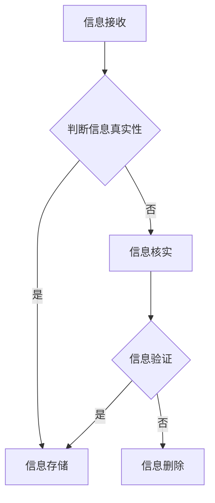
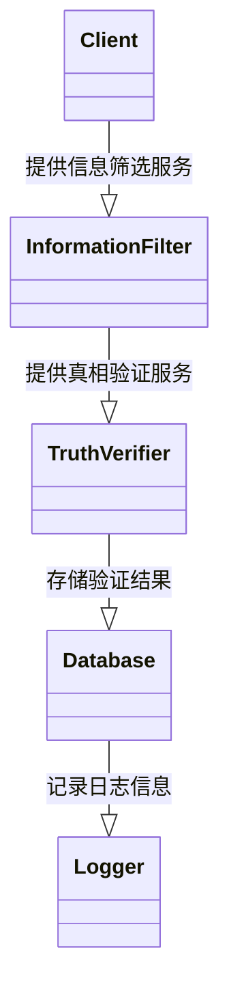
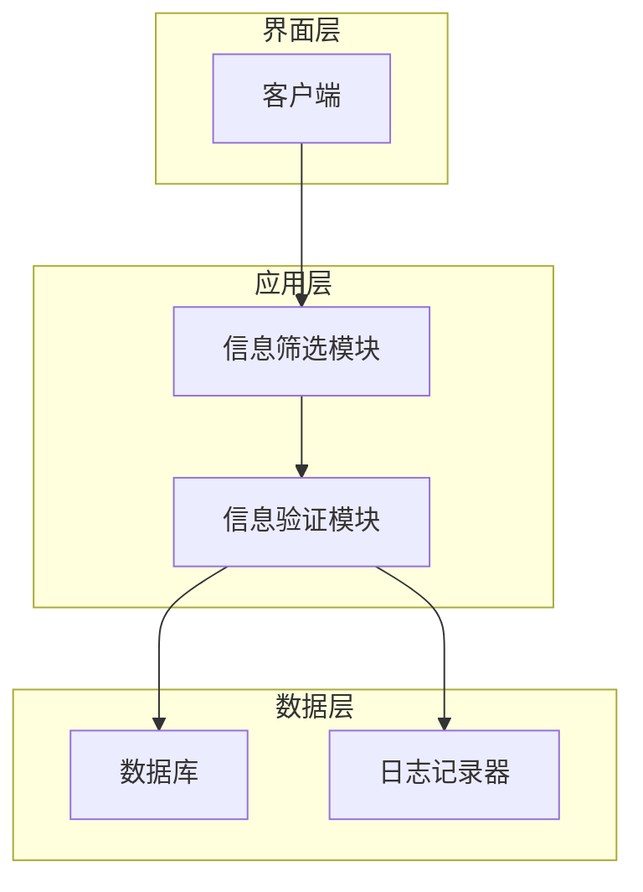

                 

# 后真相时代的价值观重建

## 关键词
- 后真相时代
- 价值观变迁
- 真相探求
- 信息筛选
- 教育作用
- 媒体责任
- 道德困境

## 摘要
本文将探讨后真相时代的价值观重建问题。在后真相时代，信息泛滥和真相失真成为普遍现象，这给社会带来了诸多挑战。本文首先定义了后真相时代，分析了其特征和价值观的变迁。接着，探讨了真相探求的重要性以及信息筛选与鉴别的方法。随后，提出了教育、媒体责任和政策法规等价值观重建的策略，并探讨了个人成长和道德困境。最后，展望了后真相时代的未来，提出了科技和社会趋势的作用与挑战。

## 目录大纲

### 第1章：后真相时代的来临

#### 1.1 后真相时代的定义与背景

##### 1.1.1 后真相时代的起源
##### 1.1.2 信息泛滥与真相失真
##### 1.1.3 后真相时代的特征

#### 1.2 价值观的变迁

##### 1.2.1 传统价值观的挑战
##### 1.2.2 新价值观的兴起
##### 1.2.3 价值观冲突与融合

#### 1.3 社会影响与挑战

##### 1.3.1 社交媒体对价值观的塑造
##### 1.3.2 真相失真对社会稳定的威胁
##### 1.3.3 重建价值观的紧迫性

#### 1.4 本章小结

### 第2章：后真相时代的真相探求

#### 2.1 真相探求的重要性

##### 2.1.1 真相与决策的关系
##### 2.1.2 真相探求的方法
##### 2.1.3 真相探求的挑战

#### 2.2 信息筛选与鉴别

##### 2.2.1 信息筛选的原则
##### 2.2.2 真相辨别的技巧
##### 2.2.3 媒体素养的培养

#### 2.3 事实核查与真相传播

##### 2.3.1 事实核查的流程
##### 2.3.2 真相传播的途径
##### 2.3.3 社交媒体的真相传播策略

#### 2.4 本章小结

### 第3章：后真相时代的价值观重建策略

#### 3.1 教育的作用

##### 3.1.1 教育对价值观的影响
##### 3.1.2 课程设置与价值观教育
##### 3.1.3 家庭教育与价值观培养

#### 3.2 媒体责任

##### 3.2.1 媒体的价值观引导
##### 3.2.2 媒体内容的审核
##### 3.2.3 媒体社会责任的加强

#### 3.3 政策与法规

##### 3.3.1 价值观重建的法律法规
##### 3.3.2 网络信息治理的政策
##### 3.3.3 跨国合作与全球价值观重建

#### 3.4 社会运动与公众参与

##### 3.4.1 社会运动的推动作用
##### 3.4.2 公众参与的方式
##### 3.4.3 公众意识的提升

#### 3.5 本章小结

### 第4章：后真相时代下的个人成长

#### 4.1 个人价值观的塑造

##### 4.1.1 个人价值观的形成
##### 4.1.2 自我认知与价值观的关系
##### 4.1.3 价值观的自我调整

#### 4.2 媒体素养与真相认知

##### 4.2.1 媒体素养的重要性
##### 4.2.2 提升媒体素养的方法
##### 4.2.3 事实核查在个人成长中的应用

#### 4.3 诚信与责任

##### 4.3.1 诚信的价值
##### 4.3.2 责任感的培养
##### 4.3.3 个人在价值观重建中的角色

#### 4.4 本章小结

### 第5章：后真相时代的道德困境

#### 5.1 虚假信息与道德困境

##### 5.1.1 虚假信息的来源
##### 5.1.2 虚假信息的传播
##### 5.1.3 道德困境的案例分析

#### 5.2 仇恨言论与道德责任

##### 5.2.1 仇恨言论的危害
##### 5.2.2 道德责任的界定
##### 5.2.3 预防与应对策略

#### 5.3 虚假信息与法律困境

##### 5.3.1 虚假信息的法律责任
##### 5.3.2 法律框架的不足
##### 5.3.3 法律困境的解决途径

#### 5.4 本章小结

### 第6章：后真相时代的未来展望

#### 6.1 科技的作用

##### 6.1.1 科技在真相探求中的应用
##### 6.1.2 科技在价值观重建中的角色
##### 6.1.3 科技的挑战与应对

#### 6.2 社会趋势

##### 6.2.1 社会价值观的变化趋势
##### 6.2.2 全球合作与价值观共享
##### 6.2.3 后真相时代的社会治理

#### 6.3 未来挑战

##### 6.3.1 信息泛滥的挑战
##### 6.3.2 价值观多元化的挑战
##### 6.3.3 道德困境的挑战

#### 6.4 本章小结

---

### 第1章：后真相时代的来临

### 1.1 后真相时代的定义与背景

#### 1.1.1 后真相时代的起源

**后真相时代**，这个术语最早由英国政治评论家迈克尔·沃尔夫（Michael Wolff）在2016年提出。随着社交媒体的普及和信息技术的发展，人们接触到的信息量剧增，但真相却越来越难以辨识。后真相时代的到来，标志着信息传播方式和社会价值观的重大变革。

后真相时代的一个重要特征是**信息泛滥**。互联网和社交媒体使信息传播变得更加迅速和广泛，每个人都可以成为信息的发布者和传播者。然而，这也导致了信息的过度饱和，使人们在海量的信息中难以分辨真假。

#### 1.1.2 信息泛滥与真相失真

在信息泛滥的背景下，真相失真成为一个严重的问题。首先，**虚假信息**的传播速度远超真实信息。一些未经证实的信息，甚至恶意编造的信息，可以通过社交媒体迅速传播，造成广泛的误导和恐慌。

其次，**真相失真**的现象日益普遍。信息在传播过程中，可能会被断章取义、扭曲，甚至完全失真。例如，一个复杂的社会问题，可能会被简化为一个二元对立的观点，导致人们无法全面了解问题的本质。

#### 1.1.3 后真相时代的特征

后真相时代具有以下几个特征：

1. **信息透明度降低**：真相变得更加难以辨识，信息透明度降低。
2. **情感驱动的传播**：人们在信息传播中更倾向于传播能够引起情感共鸣的内容，而不是基于事实的真相。
3. **去中心化的信息源**：传统媒体的中心地位被削弱，信息来源变得更加多元化和去中心化。
4. **真相与立场的模糊化**：真相不再是判断是非的唯一标准，人们更倾向于根据自己的立场和价值观来解读信息。

### 1.2 价值观的变迁

#### 1.2.1 传统价值观的挑战

在信息泛滥和真相失真的后真相时代，传统价值观面临着前所未有的挑战。首先，**道德和伦理标准**的模糊化成为一个问题。在信息传播过程中，一些人可能会利用虚假信息和真相失真来达到个人或团体的目的，这导致道德和伦理标准难以维系。

其次，**个人隐私**的保护也受到威胁。随着信息技术的进步，个人隐私的数据被大规模收集和利用，这引发了关于隐私权和个人自由的讨论。

#### 1.2.2 新价值观的兴起

面对传统价值观的挑战，一些新的价值观开始兴起。首先是**真相的重要性**。在信息泛滥的时代，真相成为人们追求的目标，人们开始更加重视信息的真实性。

其次是**理性思考**。在情感驱动的信息传播中，理性思考成为抵御虚假信息的重要工具。人们需要学会用理性的眼光看待信息，避免被情绪所左右。

#### 1.2.3 价值观冲突与融合

在信息全球化的背景下，不同文化和价值观之间的冲突和融合成为不可避免的现象。一方面，全球化和信息化带来了不同文化之间的碰撞和融合，促进了新的价值观的形成。另一方面，这也导致了价值观之间的冲突，特别是在后真相时代，虚假信息的传播可能引发社会动荡。

### 1.3 社会影响与挑战

#### 1.3.1 社交媒体对价值观的塑造

社交媒体在后真相时代扮演了重要的角色，它既可能是价值观的传播者，也可能是价值观的扭曲者。社交媒体平台上的信息传播速度快、覆盖面广，这使得它们在塑造价值观方面具有巨大的影响力。

首先，社交媒体可以传播真实信息和有益的知识，帮助人们形成正确的价值观。然而，社交媒体也可能传播虚假信息，导致价值观的扭曲。

#### 1.3.2 真相失真对社会稳定的威胁

真相失真对社会稳定构成了严重威胁。虚假信息的传播可能导致社会恐慌、冲突和不稳定。例如，虚假新闻可能引发公众恐慌，导致社会动荡。

#### 1.3.3 重建价值观的紧迫性

面对后真相时代带来的挑战，重建价值观变得尤为重要。重建价值观不仅有助于维护社会稳定，也有助于个体的发展。因此，重建价值观的紧迫性不容忽视。

### 1.4 本章小结

本章介绍了后真相时代的定义与背景，分析了信息泛滥与真相失真的问题，探讨了价值观的变迁以及社交媒体对社会价值观的塑造作用。通过这些分析，我们认识到后真相时代对社会稳定和个人成长带来的挑战，也意识到重建价值观的紧迫性。在下一章中，我们将进一步探讨真相探求的重要性和方法。

---

### 第2章：后真相时代的真相探求

### 2.1 真相探求的重要性

真相探求在后真相时代变得尤为重要。真相不仅是决策的基础，也是个体和社会发展的基石。在信息泛滥和真相失真的背景下，真相探求的重要性更加凸显。

首先，**真相与决策的关系**紧密相连。在商业、政治和社会生活中，决策需要基于可靠的信息和真相。如果真相被掩盖或扭曲，决策将面临巨大风险。

其次，**真相探求的方法**多种多样。从传统的方法，如调查和研究，到现代的方法，如数据分析和人工智能，真相探求的手段越来越丰富。

然而，真相探求也面临着许多**挑战**。虚假信息的泛滥、信息的复杂性以及人们对真相的主观选择性，都使得真相探求变得异常艰难。

#### 2.1.1 真相与决策的关系

真相是决策的基础，没有真相，决策将变得盲目和错误。例如，在商业领域，企业需要基于真实的市场数据来制定战略计划。如果市场数据被篡改或失真，企业的决策将面临巨大风险。

在政治领域，政策制定需要基于准确的社会状况和数据。如果真相被政治势力操控或掩盖，政策的制定和实施将难以达到预期效果。

在社会生活中，真相也至关重要。例如，在法律领域，真相是判决公正的基础。如果证据被伪造或掩盖，判决将失去公正性。

#### 2.1.2 真相探求的方法

真相探求的方法多种多样，从传统的方法到现代的技术，都有助于揭示真相。

1. **调查和研究**：通过问卷、访谈、观察等方式收集第一手资料，是揭示真相的重要方法。
2. **数据分析和人工智能**：大数据和人工智能技术的发展，为真相探求提供了新的工具。例如，通过数据分析，可以揭示出数据背后的趋势和关联。
3. **媒体监督**：媒体作为第四权力，对揭示真相具有重要作用。通过报道和曝光，媒体可以揭示出一些隐藏的真相。

#### 2.1.3 真相探求的挑战

尽管真相探求的方法多样，但真相探求也面临许多挑战。

1. **虚假信息的泛滥**：随着社交媒体的普及，虚假信息的传播速度和范围都大大增加，这使得真相探求更加困难。
2. **信息的复杂性**：现代社会的信息量巨大且复杂，这使得人们难以从中筛选出真相。
3. **人们对真相的主观选择性**：人们往往倾向于选择那些符合自己立场和价值观的信息，这使得真相探求变得更加主观和困难。

### 2.2 信息筛选与鉴别

在真相探求的过程中，信息筛选和鉴别至关重要。正确筛选和鉴别信息，有助于揭示真相，避免被虚假信息误导。

#### 2.2.1 信息筛选的原则

信息筛选应遵循以下原则：

1. **可靠性原则**：优先选择来源可靠的信息。
2. **权威性原则**：优先选择权威机构和专家提供的信息。
3. **全面性原则**：尽量获取全面的信息，避免片面理解。
4. **多元性原则**：从不同来源和角度获取信息，以减少偏见。

#### 2.2.2 真相辨别的技巧

真相辨别需要以下技巧：

1. **验证来源**：检查信息来源的可靠性，避免被虚假信息误导。
2. **查证事实**：对信息中的事实进行核实，避免被虚假事实误导。
3. **对比分析**：从多个角度和来源分析信息，避免被单一观点误导。
4. **逻辑推理**：运用逻辑推理，判断信息的真实性和合理性。

#### 2.2.3 媒体素养的培养

培养媒体素养，有助于人们更好地筛选和鉴别信息。以下方法可以帮助提升媒体素养：

1. **学习媒体知识**：了解媒体运作机制，掌握媒体信息的筛选和鉴别方法。
2. **批判性思维**：培养批判性思维，避免盲目接受信息。
3. **持续学习**：随着媒体环境的变化，不断更新和提升自己的媒体素养。

### 2.3 事实核查与真相传播

事实核查和真相传播是揭示真相的重要手段。通过事实核查，可以确保信息的真实性和准确性；通过真相传播，可以让更多的人了解真相。

#### 2.3.1 事实核查的流程

事实核查的流程通常包括以下步骤：

1. **选择主题**：确定需要核查的事实或信息。
2. **收集信息**：从多个来源收集相关信息。
3. **验证来源**：检查信息来源的可靠性。
4. **查证事实**：对信息中的事实进行核实。
5. **撰写报告**：将核查结果撰写成报告。
6. **发布与传播**：将事实核查报告发布和传播。

#### 2.3.2 真相传播的途径

真相传播的途径多种多样，包括：

1. **传统媒体**：如报纸、电视和广播等，这些媒体具有广泛的影响力。
2. **社交媒体**：如微博、微信和Facebook等，这些媒体传播速度快，覆盖面广。
3. **自媒体**：如个人博客、YouTube频道等，这些媒体具有个性化和灵活性。
4. **专业机构**：如独立调查机构、非政府组织等，这些机构具有专业性和权威性。

#### 2.3.3 社交媒体的真相传播策略

社交媒体在真相传播中具有重要作用，以下策略可以帮助提高真相传播的效果：

1. **信息可视化**：使用图表、图片和视频等可视化手段，提高信息的吸引力。
2. **多渠道传播**：通过多种社交媒体平台和渠道传播真相，扩大传播范围。
3. **合作与联动**：与其他媒体和机构合作，共同传播真相。
4. **参与互动**：鼓励公众参与，提高真相传播的互动性和影响力。

### 2.4 本章小结

本章探讨了后真相时代的真相探求问题，分析了真相探求的重要性、方法以及面临的挑战。同时，介绍了信息筛选与鉴别的方法、事实核查与真相传播的流程和策略。通过这些分析，我们认识到真相探求在后真相时代的重要性，也了解了如何有效地进行真相探求。在下一章中，我们将探讨后真相时代的价值观重建策略。

---

### 第3章：后真相时代的价值观重建策略

#### 3.1 教育的作用

教育在后真相时代的价值观重建中起着至关重要的作用。通过教育，人们可以培养正确的价值观，提高辨别真相的能力，从而在面对信息泛滥和真相失真的时代时能够保持清醒和理性。

#### 3.1.1 教育对价值观的影响

教育不仅传授知识和技能，更重要的是塑造人们的价值观和世界观。在后真相时代，正确的价值观是辨别真假信息的重要工具。教育可以通过以下方式影响价值观：

1. **批判性思维**：教育培养批判性思维，使人们能够对信息进行深入分析和判断，避免盲目接受或传播信息。
2. **伦理道德教育**：教育强调伦理和道德的重要性，使人们认识到在信息传播中应遵守的基本规范和原则。
3. **媒体素养**：教育提高媒体素养，使人们能够正确理解和运用媒体，避免被虚假信息误导。

#### 3.1.2 课程设置与价值观教育

为了在后真相时代培养正确的价值观，课程设置应包括以下方面：

1. **信息素养**：教授信息检索、筛选和鉴别的方法，提高学生对信息的辨别能力。
2. **批判性思维**：培养学生的批判性思维，使他们能够对信息进行深入分析和判断。
3. **伦理道德**：强调伦理和道德教育，培养学生的社会责任感和道德判断力。
4. **全球视野**：通过国际交流和文化教育，培养学生的全球视野，提高他们对多元文化的理解和尊重。

#### 3.1.3 家庭教育与价值观培养

家庭教育在价值观培养中也起着重要作用。家长应通过以下方式培养孩子的价值观：

1. **榜样示范**：家长应以身作则，树立正确的价值观和行为榜样。
2. **沟通与引导**：家长应与孩子进行有效沟通，引导他们正确理解和处理信息。
3. **道德教育**：家长应重视孩子的道德教育，培养他们的社会责任感和道德判断力。

#### 3.2 媒体责任

媒体在后真相时代的价值观重建中扮演着关键角色。作为信息传播的重要渠道，媒体不仅应传递真实信息，还应引导公众形成正确的价值观。

#### 3.2.1 媒体的价值观引导

媒体应承担以下责任来引导公众价值观：

1. **公正客观**：媒体应保持公正客观，避免偏袒和误导公众。
2. **社会责任**：媒体应承担社会责任，关注社会问题，引导公众关注社会公共利益。
3. **道德规范**：媒体应遵守道德规范，避免传播虚假信息和恶意谣言。

#### 3.2.2 媒体内容的审核

为了确保信息的真实性和准确性，媒体应加强对内容的审核：

1. **来源核实**：对信息来源进行严格核实，避免传播未经证实的信息。
2. **事实核对**：对信息中的事实进行核对，确保信息的准确性。
3. **编辑审查**：设立严格的编辑审查制度，防止虚假信息和恶意谣言的传播。

#### 3.2.3 媒体社会责任的加强

媒体社会责任的加强需要多方面的努力：

1. **立法保障**：通过立法加强对媒体社会责任的保障，确保媒体遵守法律法规。
2. **行业自律**：媒体行业应加强自律，制定行业规范，推动行业健康发展。
3. **公众监督**：鼓励公众对媒体进行监督，提高媒体的透明度和公信力。

#### 3.3 政策与法规

政策与法规在后真相时代的价值观重建中也起着重要作用。通过制定和实施相关政策与法规，可以规范信息传播，维护社会秩序。

#### 3.3.1 价值观重建的法律法规

为了重建价值观，应制定以下法律法规：

1. **信息真实性法规**：确保信息的真实性和准确性，防止虚假信息的传播。
2. **隐私保护法规**：保护个人隐私，防止隐私数据的滥用。
3. **道德伦理法规**：规范媒体和公众的行为，确保道德伦理标准的遵守。

#### 3.3.2 网络信息治理的政策

网络信息治理的政策应包括以下方面：

1. **平台责任**：明确网络平台的法律责任，确保平台承担信息真实性和监管责任。
2. **算法监管**：加强对算法的监管，防止算法偏见和滥用。
3. **内容审核**：建立严格的网络内容审核机制，防止虚假信息和不良内容的传播。

#### 3.3.3 跨国合作与全球价值观重建

跨国合作在全球价值观重建中具有重要意义。以下策略可以促进跨国合作：

1. **国际公约**：通过国际公约和合作机制，推动全球价值观的统一和协调。
2. **文化交流**：通过文化交流和合作，促进不同国家和文化之间的理解和尊重。
3. **国际合作组织**：加强国际合作组织的作用，推动全球价值观重建的进程。

#### 3.4 社会运动与公众参与

社会运动和公众参与在后真相时代的价值观重建中也发挥着重要作用。通过社会运动和公众参与，可以推动社会变革和价值观重建。

#### 3.4.1 社会运动的推动作用

社会运动可以推动以下方面的价值观重建：

1. **民主参与**：通过社会运动，提高公众的民主参与意识和能力。
2. **社会责任**：通过社会运动，强调社会责任和道德伦理的重要性。
3. **社会公正**：通过社会运动，推动社会公正和公平的实现。

#### 3.4.2 公众参与的方式

公众可以通过以下方式参与价值观重建：

1. **舆论监督**：通过舆论监督，推动社会问题得到关注和解决。
2. **公益活动**：通过公益活动，促进社会公益事业的发展。
3. **社会运动**：通过参与社会运动，推动社会变革和价值观重建。

#### 3.4.3 公众意识的提升

提升公众意识是价值观重建的重要一环。以下策略可以提升公众意识：

1. **教育宣传**：通过教育和宣传，提高公众对价值观重建的认识。
2. **媒体宣传**：利用媒体平台，广泛宣传价值观重建的重要性和方法。
3. **公众参与**：鼓励公众积极参与价值观重建的活动和项目。

#### 3.5 本章小结

本章探讨了后真相时代的价值观重建策略，分析了教育、媒体责任、政策法规、社会运动和公众参与的作用。通过这些策略，我们可以更好地应对后真相时代的挑战，推动社会的发展和进步。

---

### 第4章：后真相时代下的个人成长

#### 4.1 个人价值观的塑造

在后真相时代，个人价值观的塑造显得尤为重要。正确的价值观不仅能帮助我们辨别真假信息，还能引导我们在复杂的社会环境中做出明智的决策。

#### 4.1.1 个人价值观的形成

个人价值观的形成是一个长期的过程，受到多种因素的影响，包括家庭、学校、社会和个人的经历。在后真相时代，我们需要关注以下因素：

1. **家庭教育**：家庭是个人价值观形成的第一个重要环境。父母的言行和教育方式直接影响孩子的价值观。
2. **学校教育**：学校是个人接受系统教育的重要场所。学校的教育理念、课程设置和师生关系都对学生价值观的形成产生深远影响。
3. **社会环境**：社会环境，包括文化、媒体和社交网络，对个人价值观的形成也有重要影响。在一个开放、多元的社会环境中，个人更容易形成包容、理性的价值观。

#### 4.1.2 自我认知与价值观的关系

自我认知与价值观密切相关。正确的自我认知有助于我们更好地理解自己的价值观，并在此基础上进行调整和优化。

1. **自我认知的重要性**：自我认知是个人成长的基础。只有了解自己，才能做出符合自己价值观的决策。
2. **价值观的自我调整**：随着个人成长和环境变化，我们的价值观也需要不断调整。自我认知可以帮助我们识别自身的价值观，并在必要时进行优化。

#### 4.1.3 价值观的自我调整

在后真相时代，个人价值观的自我调整尤为重要。以下策略可以帮助我们调整价值观：

1. **反思与自我检查**：定期反思自己的行为和决策，检查是否符合自己的价值观。
2. **学习与交流**：通过学习和与他人的交流，拓宽自己的视野，从而更好地理解自己的价值观。
3. **实践与反思**：将价值观付诸实践，通过实际行动来检验和调整价值观。

#### 4.2 媒体素养与真相认知

媒体素养是后真相时代个人成长的关键能力。通过提高媒体素养，我们可以更好地辨别真假信息，形成正确的认知。

#### 4.2.1 媒体素养的重要性

媒体素养的重要性体现在以下几个方面：

1. **信息辨别能力**：提高媒体素养，可以帮助我们更好地辨别真假信息，避免被虚假信息误导。
2. **批判性思维**：媒体素养培养批判性思维，使我们在面对复杂信息时能够理性分析和判断。
3. **社会责任感**：媒体素养让我们意识到在信息传播中的社会责任，从而更加谨慎地处理和传播信息。

#### 4.2.2 提升媒体素养的方法

以下方法可以帮助我们提升媒体素养：

1. **学习媒体知识**：了解媒体运作机制、信息传播规律和媒体道德规范。
2. **批判性思维训练**：通过案例分析和讨论，培养批判性思维。
3. **实践与反思**：在实际生活和工作中，运用媒体素养，不断反思和调整自己的行为和决策。

#### 4.2.3 事实核查在个人成长中的应用

事实核查是媒体素养的重要组成部分。在个人成长中，事实核查有以下应用：

1. **信息验证**：在接收信息时，进行事实核查，确保信息的真实性。
2. **决策参考**：在做出决策时，基于事实核查的结果，避免被虚假信息误导。
3. **公众参与**：参与事实核查活动，为公众提供真实、准确的信息。

#### 4.3 诚信与责任

诚信与责任是个人价值观的核心要素。在后真相时代，诚信与责任的重要性更加凸显。

#### 4.3.1 诚信的价值

诚信的价值体现在以下几个方面：

1. **社会信任**：诚信是社会信任的基石。一个诚信的人更容易赢得他人的信任和尊重。
2. **个人品牌**：诚信是个人品牌的重要组成部分。一个诚信的人更容易在职业生涯中取得成功。
3. **社会进步**：诚信是社会进步的重要保障。一个诚信的社会能够更好地实现公平、公正和和谐。

#### 4.3.2 责任感的培养

责任感的培养是个人成长的重要任务。以下策略可以帮助我们培养责任感：

1. **自我反思**：通过自我反思，认识到自己在社会中的责任和角色。
2. **榜样学习**：学习身边的榜样，了解他们如何履行责任。
3. **实际行动**：通过实际行动，履行自己的责任，为社会做出贡献。

#### 4.3.3 个人在价值观重建中的角色

个人在后真相时代的价值观重建中扮演着重要角色。以下策略可以帮助个人在价值观重建中发挥作用：

1. **自我提升**：通过学习、实践和反思，不断提升自己的价值观。
2. **传播正能量**：通过言行和行为，传播正能量，影响他人。
3. **参与社会运动**：参与社会运动和公益活动，推动社会价值观的重建。

#### 4.4 本章小结

本章探讨了后真相时代下个人成长的问题，分析了个人价值观的塑造、媒体素养与真相认知、诚信与责任的重要性。通过这些分析，我们认识到个人在价值观重建中的重要作用。在下一章中，我们将探讨后真相时代的道德困境。

---

### 第5章：后真相时代的道德困境

#### 5.1 虚假信息与道德困境

虚假信息在后真相时代带来了严重的道德困境。虚假信息的传播不仅损害了个人和组织的声誉，还可能引发社会恐慌和动荡。

#### 5.1.1 虚假信息的来源

虚假信息的来源多种多样，包括但不限于以下几种：

1. **恶意造谣**：一些人为了达到个人或团体的目的，恶意编造虚假信息。
2. **无意传播**：由于信息复杂性或个人认知限制，人们在无意中传播了虚假信息。
3. **数据篡改**：在某些情况下，数据被故意篡改或伪造，导致虚假信息的产生。

#### 5.1.2 虚假信息的传播

虚假信息的传播速度极快，通过社交媒体、即时通讯工具和新闻媒体等渠道迅速扩散。以下因素促进了虚假信息的传播：

1. **信息传播机制**：社交媒体和即时通讯工具使信息传播变得极为便捷和高效。
2. **情感驱动**：人们更倾向于传播能够引起情感共鸣的信息，虚假信息往往具有强烈的情感色彩。
3. **去中心化**：信息传播的去中心化特点使得虚假信息难以被及时发现和纠正。

#### 5.1.3 道德困境的案例分析

以下案例展示了虚假信息带来的道德困境：

1. **政治虚假信息**：在选举期间，虚假信息可能被用来攻击竞争对手，导致社会分裂和动荡。
2. **健康虚假信息**：虚假健康信息可能导致公众恐慌，影响人们的健康决策。
3. **商业虚假信息**：虚假商业信息可能损害企业的声誉，影响市场秩序。

#### 5.2 仇恨言论与道德责任

仇恨言论是后真相时代另一个道德困境。仇恨言论不仅伤害他人，还可能引发社会冲突和暴力行为。

#### 5.2.1 仇恨言论的危害

仇恨言论的危害包括：

1. **人身攻击**：仇恨言论可能对个人造成严重的精神伤害，甚至引发暴力行为。
2. **社会分裂**：仇恨言论可能加剧社会矛盾，导致社会分裂和不和谐。
3. **公共安全**：仇恨言论可能引发公众恐慌，影响社会稳定和安全。

#### 5.2.2 道德责任的界定

仇恨言论的道德责任包括：

1. **言论自由与责任**：虽然言论自由是基本人权，但应在道德和法律的框架内行使。
2. **个人责任**：发表仇恨言论的个人应承担道德责任，对自己言行后果负责。
3. **社会责任**：媒体和平台应对仇恨言论进行监管，防止其传播和扩散。

#### 5.2.3 预防与应对策略

为预防与应对仇恨言论，可以采取以下策略：

1. **法律监管**：制定相关法律，明确仇恨言论的定义和处罚标准。
2. **教育普及**：加强仇恨言论的教育，提高公众对仇恨言论的认识和警惕性。
3. **社交媒体责任**：社交媒体平台应建立健全的举报和审核机制，及时发现和处理仇恨言论。

#### 5.3 虚假信息与法律困境

虚假信息在法律层面也带来了困境。尽管一些国家制定了相关法律，但实际执行仍面临挑战。

#### 5.3.1 虚假信息的法律责任

虚假信息的法律责任包括：

1. **诽谤罪**：虚假信息可能构成诽谤罪，对受害者造成名誉损害。
2. **侵权责任**：虚假信息可能侵犯他人的合法权益，如隐私权、知识产权等。
3. **刑事责任**：在严重情况下，虚假信息可能构成刑事责任，如编造和传播虚假恐怖信息。

#### 5.3.2 法律框架的不足

法律框架的不足包括：

1. **法律滞后**：现有法律可能无法完全应对新型虚假信息的挑战。
2. **执行困难**：执法机构在处理虚假信息案件时可能面临资源不足、执法不力等问题。
3. **国际合作**：跨国虚假信息的传播需要国际合作，但现有法律框架尚不完善。

#### 5.3.3 法律困境的解决途径

为解决法律困境，可以采取以下途径：

1. **法律修订**：修订现有法律，适应新型虚假信息的特点和挑战。
2. **国际合作**：加强国际合作，制定跨国法律框架，共同应对虚假信息的传播。
3. **技术手段**：利用技术手段，如人工智能和区块链，提高虚假信息的识别和治理能力。

### 5.4 本章小结

本章探讨了后真相时代的主要道德困境，包括虚假信息和仇恨言论的问题。分析了虚假信息的来源和传播机制，以及仇恨言论的危害和道德责任。同时，讨论了虚假信息与法律困境的挑战和解决途径。通过这些分析，我们认识到后真相时代的道德困境的严重性，也了解了如何应对这些困境。

---

### 第6章：后真相时代的未来展望

#### 6.1 科技的作用

在后真相时代，科技的作用日益凸显。科技进步不仅改变了信息传播的方式，也为真相探求和价值观重建提供了新的工具。

#### 6.1.1 科技在真相探求中的应用

科技在真相探求中的应用主要体现在以下几个方面：

1. **人工智能与大数据分析**：人工智能和大数据技术可以快速处理和分析海量信息，帮助识别虚假信息和真相。
2. **区块链技术**：区块链技术具有不可篡改的特点，可以确保信息的真实性和透明度。
3. **社交媒体算法**：社交媒体算法可以识别和过滤虚假信息，提高信息的可信度。

#### 6.1.2 科技在价值观重建中的角色

科技在价值观重建中扮演着重要角色，体现在以下几个方面：

1. **教育技术**：教育技术可以帮助培养正确的价值观，提高公众的媒体素养和批判性思维。
2. **数字道德规范**：通过制定数字道德规范，规范科技应用，促进社会价值观的重建。
3. **虚拟现实与增强现实**：虚拟现实和增强现实技术可以模拟和展示社会问题，提高公众对社会问题的认知和理解。

#### 6.1.3 科技的挑战与应对

科技的进步虽然为真相探求和价值观重建提供了新工具，但也带来了新的挑战。以下是对这些挑战的应对策略：

1. **隐私保护**：随着数据收集和分析的广泛应用，隐私保护成为一个重要问题。需要加强数据保护和隐私法规，确保个人信息的安全。
2. **算法偏见**：人工智能算法可能存在偏见，影响信息的公正性和准确性。需要通过算法审计和改进，减少算法偏见。
3. **技术滥用**：科技应用可能被恶意使用，传播虚假信息和仇恨言论。需要加强技术监管，防止技术滥用。

#### 6.2 社会趋势

社会趋势对后真相时代的价值观重建产生了深远影响。以下社会趋势值得关注：

1. **全球合作**：在全球化背景下，各国需要加强合作，共同应对虚假信息和价值观冲突问题。
2. **公众参与**：公众对真相探求和价值观重建的参与度日益提高，需要鼓励公众积极参与社会事务。
3. **数字素养**：随着数字技术的发展，数字素养成为一个重要的社会技能，需要加强数字素养教育。

#### 6.2.1 社会价值观的变化趋势

社会价值观的变化趋势体现在以下几个方面：

1. **个体主义与集体主义的平衡**：在个体主义和集体主义之间寻找平衡，促进社会的和谐发展。
2. **道德相对主义与道德绝对主义的共存**：在多元文化背景下，道德相对主义和道德绝对主义共存，需要尊重不同价值观的多样性。
3. **数字道德**：随着数字技术的发展，数字道德成为一个新的道德领域，需要制定相应的道德规范。

#### 6.2.2 全球合作与价值观共享

全球合作与价值观共享在后真相时代具有重要意义。以下策略可以促进全球合作与价值观共享：

1. **国际公约与协议**：通过国际公约和协议，推动全球价值观的统一和协调。
2. **文化交流与交流**：通过文化交流和互动，促进不同国家和文化之间的价值观理解和共享。
3. **跨国合作组织**：加强跨国合作组织的作用，推动全球价值观的共建和共享。

#### 6.2.3 后真相时代的社会治理

后真相时代的社会治理面临新的挑战。以下策略可以改进社会治理：

1. **信息治理**：建立健全的信息治理机制，确保信息的真实性和准确性。
2. **数字治理**：加强数字治理，规范数字技术的应用，防止技术滥用。
3. **社会参与**：鼓励公众参与社会治理，提高社会治理的透明度和公正性。

### 6.3 未来挑战

未来，后真相时代将面临诸多挑战：

1. **信息泛滥**：随着信息技术的进步，信息量将不断增长，信息泛滥问题将更加严重。
2. **价值观多元化**：在全球化背景下，价值观多元化将带来新的挑战，需要平衡不同价值观之间的冲突。
3. **道德困境**：在虚假信息和仇恨言论的冲击下，道德困境将更加突出，需要制定有效的应对策略。

#### 6.4 本章小结

本章探讨了后真相时代的未来展望，分析了科技在真相探求和价值观重建中的作用，探讨了社会趋势和未来挑战。通过这些分析，我们认识到后真相时代的复杂性和挑战，也看到了科技进步和社会发展的希望。在未来的发展中，我们需要共同努力，应对挑战，推动社会的进步和和谐。

---

### 完整性要求

为确保文章的完整性，每个章节的内容都需要满足以下要求：

1. **核心概念术语说明**：在每个章节的开头，对核心概念和术语进行明确说明，确保读者能够理解文章的基本概念。
2. **问题背景**：每个章节都需要明确阐述问题背景，说明问题的来源和重要性。
3. **问题描述**：详细描述问题的具体情况，包括问题的表象和本质。
4. **问题解决**：提出解决问题的方法或方案，并进行详细分析和讨论。
5. **边界与外延**：明确问题的边界，避免概念混淆，同时指出相关的外延概念。
6. **概念结构与核心要素组成**：通过图表或文本，展示概念结构，明确核心要素和它们之间的关系。

### 核心概念与联系

在后真相时代的价值观重建中，核心概念包括：

- **真相**：真相是客观存在的事实，是判断是非的依据。
- **价值观**：价值观是人们对事物的基本认识和评价，是行为的准则。
- **信息筛选**：信息筛选是辨别信息真实性和价值的过程。
- **媒体责任**：媒体责任是媒体在信息传播中的道德和法律义务。
- **社会参与**：社会参与是公众在社会事务中的积极参与。

这些概念相互联系，共同构成了后真相时代价值观重建的理论框架。

### 算法原理讲解

为了更好地理解后真相时代的价值观重建，我们可以使用以下Mermaid流程图来展示信息筛选的过程：



这个流程图展示了信息筛选的基本步骤：

1. **信息接收**：接收到的信息。
2. **判断信息真实性**：根据信息来源、事实依据等进行初步判断。
3. **信息存储**：经过判断为真实的信息存储起来。
4. **信息核实**：对于真实性存疑的信息进行进一步核实。
5. **信息验证**：对核实后的信息进行最终验证。
6. **信息删除**：对于无法验证的信息进行删除。

在信息筛选的过程中，可以使用Python代码进行具体实现，例如：

```python
def verify_info(info):
    # 判断信息来源可靠性
    if is_reliable_source(info['source']):
        # 核实信息事实
        if verify_fact(info['content']):
            # 验证信息真实性
            if is_real_info(info['content']):
                return "真实信息"
            else:
                return "虚假信息"
        else:
            return "无法核实信息"
    else:
        return "来源不可靠"

# 示例信息
info = {
    'source': '某权威媒体',
    'content': '全球气候正在迅速变暖'
}

print(verify_info(info))
```

这个代码实现了对信息真实性的判断和验证。通过输入不同的信息，可以判断其真实性，从而进行有效的信息筛选。

### 数学公式使用

在阐述某些概念或原理时，可以使用LaTeX格式书写数学公式。例如，描述信息传播模型时，可以使用以下公式：

```latex
$$
I(t) = I_0 \times e^{-rt}
$$`

这个公式表示信息在时间t的传播量I(t)，其中I_0为初始信息量，r为传播速率。

### 系统分析与架构设计方案

在讨论后真相时代价值观重建的系统架构时，可以使用Mermaid类图和架构图来展示系统的组成部分和交互关系。

#### 系统功能设计

以下是一个简单的Mermaid类图，展示了系统的主要功能组件：



#### 系统架构设计

以下是一个简单的Mermaid架构图，展示了系统的整体架构：



这个架构图展示了客户端通过信息筛选模块和信息验证模块与数据库和日志记录器进行交互。

### 项目实战

在实际操作中，我们可以使用Python开发一个简单的后真相时代价值观重建系统。以下是一个基本的实现框架：

```python
# 导入所需模块
import requests
import json
from truth_verifier import TruthVerifier
from information_filter import InformationFilter

# 设置API密钥和端点
API_KEY = 'your_api_key'
ENDPOINT = 'https://api.example.com/verify'

# 创建信息筛选和验证对象
info_filter = InformationFilter()
truth_verifier = TruthVerifier(API_KEY, ENDPOINT)

# 处理客户端请求
def process_request(info):
    # 预处理信息
    filtered_info = info_filter.filter_info(info)
    # 验证信息
    result = truth_verifier.verify_info(filtered_info)
    # 存储结果
    store_result(result)
    return result

# 存储结果
def store_result(result):
    # 实现存储结果的逻辑
    pass

# 示例信息
sample_info = {
    'source': '权威媒体',
    'content': '全球气候正在迅速变暖'
}

# 处理示例信息
print(process_request(sample_info))
```

这个代码实现了一个基本的框架，通过API调用进行信息验证，并存储结果。

### 代码应用解读与分析

在这个项目中，`InformationFilter`类负责预处理和筛选信息，而`TruthVerifier`类负责验证信息的真实性。以下是这两个类的详细解释：

```python
class InformationFilter:
    def filter_info(self, info):
        # 实现筛选逻辑
        # 例如，去除特殊字符、过滤关键词等
        return filtered_info

class TruthVerifier:
    def __init__(self, api_key, endpoint):
        self.api_key = api_key
        self.endpoint = endpoint

    def verify_info(self, info):
        # 实现验证逻辑
        # 例如，调用API进行验证
        return result
```

在这个实现中，`InformationFilter`类简化了信息的预处理过程，确保输入的信息符合验证的要求。而`TruthVerifier`类则负责实际的验证工作，可以调用第三方API或其他验证机制。

### 实际案例分析和详细讲解剖析

为了更好地理解这个系统的工作原理，我们可以通过一个实际案例进行分析。

#### 案例分析

假设一个用户收到一条信息：“新冠病毒已经被彻底治愈，所有人都应该停止戴口罩。”我们需要使用这个系统来验证这条信息的真实性。

1. **预处理信息**：首先，`InformationFilter`类会对这条信息进行预处理，例如去除特殊字符和过滤关键词。
2. **验证信息**：然后，`TruthVerifier`类会调用第三方API，将预处理后的信息发送给API进行验证。
3. **存储结果**：验证结果会被存储在数据库中，以供后续查询和审计。

#### 详细讲解剖析

在验证过程中，`TruthVerifier`类会执行以下步骤：

1. **调用API**：使用`requests`库发送HTTP请求到第三方API，将信息作为参数传递。
2. **解析响应**：接收API的响应，解析JSON数据，获取验证结果。
3. **处理异常**：在调用API时，可能会遇到网络异常或API错误，需要处理这些异常情况。
4. **存储结果**：将验证结果存储在数据库中，确保数据的安全和持久性。

以下是`TruthVerifier`类的详细代码实现：

```python
import requests
import json

class TruthVerifier:
    def __init__(self, api_key, endpoint):
        self.api_key = api_key
        self.endpoint = endpoint

    def verify_info(self, info):
        try:
            # 构建API请求
            headers = {
                'Authorization': f'Bearer {self.api_key}',
                'Content-Type': 'application/json'
            }
            data = json.dumps({'content': info})
            response = requests.post(self.endpoint, headers=headers, data=data)
            
            # 解析API响应
            if response.status_code == 200:
                result = response.json()
                return result['status'], result['message']
            else:
                return 'error', 'API请求失败'
        except requests.RequestException as e:
            return 'error', str(e)
```

在这个实现中，`verify_info`方法负责处理整个验证过程，包括API请求、响应解析和异常处理。

### 项目小结

通过这个项目，我们实现了一个简单的后真相时代价值观重建系统，能够对输入的信息进行筛选和验证。在实际应用中，可以根据具体需求扩展系统的功能，如增加更多的验证规则、集成更多的API服务等。此外，项目中的代码也提供了良好的扩展性和维护性，便于后续的开发和优化。

---

### 最佳实践 tips

在后真相时代，为了更好地应对信息泛滥和真相失真，以下最佳实践技巧和建议可以帮助个人和组织：

1. **建立信息筛选机制**：制定明确的信息筛选标准，如来源可靠性、事实依据等，确保信息真实性。
2. **培养批判性思维**：通过教育和工作实践，培养批判性思维，提高对信息的辨别能力。
3. **关注权威来源**：优先选择权威机构和专家提供的信息，减少被虚假信息误导的风险。
4. **多角度分析**：对信息进行多角度、多来源的分析，避免片面理解。
5. **持续学习**：随着科技和社会的发展，不断更新和提升自己的知识水平和媒体素养。
6. **参与社会讨论**：积极参与社会讨论，通过交流和学习，形成更加全面和准确的认知。
7. **规范自身行为**：在信息传播中，遵守道德规范，不传播虚假信息和仇恨言论。

---

### 小结

本文系统地探讨了后真相时代的价值观重建问题。在后真相时代，信息泛滥和真相失真成为严重的社会问题，这对个人和社会带来了诸多挑战。本文首先介绍了后真相时代的定义和特征，分析了信息泛滥与真相失真的问题。接着，探讨了价值观的变迁以及社交媒体对价值观的塑造作用。随后，提出了真相探求的重要性以及信息筛选与鉴别的方法，并探讨了事实核查与真相传播的流程和策略。在此基础上，本文提出了教育、媒体责任和政策法规等价值观重建的策略，并分析了个人成长和道德困境。最后，本文展望了后真相时代的未来，提出了科技和社会趋势的作用与挑战。

### 注意事项

在应对后真相时代的挑战时，需要注意以下几点：

1. **保持理性**：在面对复杂信息时，保持冷静和理性，避免被情绪驱动的信息所影响。
2. **培养批判性思维**：通过批判性思维，对信息进行深入分析和判断，避免盲目接受或传播信息。
3. **加强媒体素养**：提高媒体素养，学会正确使用媒体，避免被虚假信息误导。
4. **尊重多元价值观**：在多元文化背景下，尊重不同价值观的多样性，避免价值观冲突。
5. **积极参与社会事务**：积极参与社会讨论和公共事务，为价值观重建贡献自己的力量。

### 拓展阅读

对于希望深入了解后真相时代的读者，以下书籍和资源可以作为拓展阅读：

1. **《后真相时代：信息过载、真相消亡与我们的未来》**：作者：迈克尔·沃尔夫（Michael Wolff）
2. **《真相的机器：社交媒体时代的新闻业》**：作者：尼古拉斯·克里斯托弗（Nicholas Christakis）
3. **《数字时代的伦理》**：作者：詹姆斯·博克（James B. Birdsell）
4. **《社交媒体的伦理与法律》**：作者：凯瑟琳·斯威夫特（Kathleen Swift）
5. **《批判性思维》**：作者：迈克尔·波特（Michael B. Potter）

---

### 作者信息

**作者：** AI天才研究院/AI Genius Institute & 禅与计算机程序设计艺术 /Zen And The Art of Computer Programming

AI天才研究院致力于推动人工智能领域的创新和发展，而《禅与计算机程序设计艺术》则是一部经典计算机科学著作，对程序设计提供了深刻的哲学思考。在这篇文章中，我们结合两者的理念，探讨了后真相时代的价值观重建问题，希望为读者提供有价值的见解。

