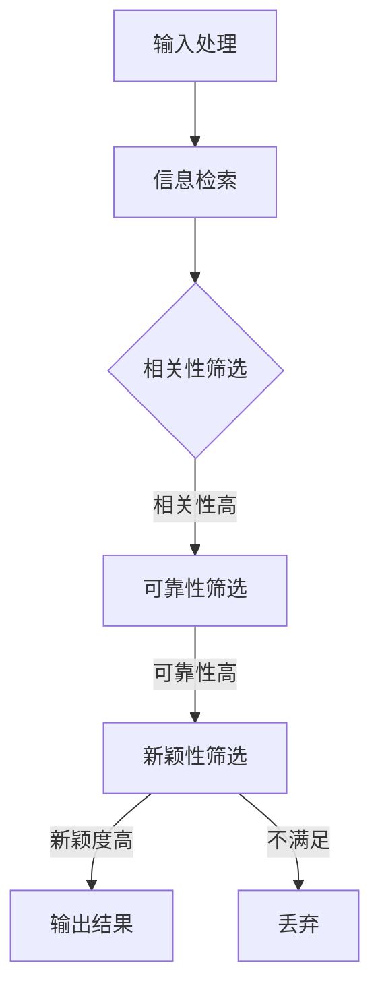
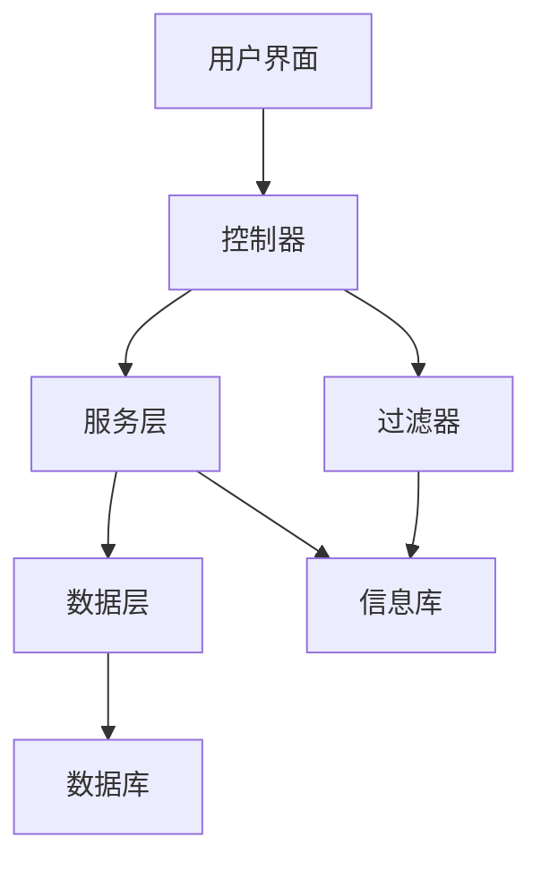
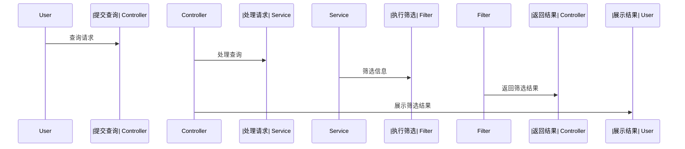

                 

### 《后真相时代的信息素养：培养独立思考和判断能力》

> 关键词：后真相时代、信息素养、独立思考、判断能力、批判性思维、多元视角、实证精神、数据驱动、逻辑思维、教育实践

> 摘要：本文探讨了后真相时代信息泛滥的背景及其对个体思维的影响，重点阐述了信息素养的核心要素、独立思考的培养方法、判断能力的提升技巧，以及信息素养教育与实践的重要性和方法。文章旨在帮助读者理解并掌握在信息爆炸时代如何培养独立思考和判断能力，从而更好地应对复杂多变的社会环境。

----------------------------------------------------------------

## 第一部分：引言

### 第1章：后真相时代的背景与挑战

#### 1.1 后真相时代的定义与特征

在后真相时代，事实已经不再是判断是非的唯一标准。情绪、立场和信仰等因素常常影响着人们对信息的接受和解读。这一现象不仅仅存在于个体层面，也渗透到了政治、经济、文化等多个领域。

**定义**：后真相时代，是指一个信息爆炸、科技迅猛发展的时代，人们在面对信息时，不再仅仅依赖事实，而是受到情感、立场、信仰等多种因素的影响。

**特征**：
- **信息真实性与可靠性下降**：由于信息的爆炸性增长，很多信息难以核实，真假难辨。
- **情感与情绪化传播**：社交媒体等平台的普及，使得信息传播更加迅速，但同时也加剧了情绪化的传播。
- **立场与价值观的冲突**：不同群体之间的立场和价值观差异，使得信息传播更加复杂和多元化。

#### 1.2 信息泛滥与信息素养的重要性

在信息泛滥的时代，如何有效获取、筛选和处理信息变得尤为重要。信息素养，即对信息的获取、处理、使用和评价的能力，已经成为现代个体必备的素养。

**重要性**：
- **提高决策质量**：具备信息素养的个体，能够更好地分析问题、做出决策，从而提高决策质量。
- **促进个人成长**：信息素养不仅影响个体的职业发展，还影响其个人成长和综合素质的提升。
- **构建和谐社会**：信息素养的提高有助于减少误解和冲突，促进社会和谐发展。

#### 1.3 后真相时代对个体思维的影响

后真相时代对个体思维的影响主要体现在以下几个方面：

- **认知偏差**：个体在面对信息时，往往会受到先入为主的想法、情绪和立场的影响，从而导致认知偏差。
- **思维固化**：长期处于信息泛滥的环境中，个体的思维容易趋于固化，难以接受新观点和不同意见。
- **判断力下降**：在信息真实性难以保证的情况下，个体的判断力容易受到影响，导致判断失误。

#### 1.4 信息素养的培养目标与意义

信息素养的培养目标主要包括以下几个方面：

- **提高信息获取和处理能力**：使个体能够快速、准确地获取所需信息，并对其进行有效处理。
- **培养批判性思维**：使个体能够对信息进行深入分析，辨别真伪，形成独立判断。
- **提升沟通能力**：使个体能够清晰、准确地表达自己的观点，并进行有效沟通。

信息素养的培养意义在于：

- **提高个体竞争力**：在信息社会中，具备信息素养的个体具有更强的适应能力和竞争力。
- **促进社会进步**：信息素养的提高有助于构建一个更加理性、公正和开放的社会环境。
- **实现个人价值**：信息素养的培养使个体能够更好地发掘和实现自己的潜能，实现个人价值。

----------------------------------------------------------------

## 第二部分：信息素养的核心要素

### 第2章：信息素养的核心要素

#### 2.1 信息获取与筛选

信息获取与筛选是信息素养的重要组成部分。在信息泛滥的时代，如何有效地获取和筛选信息至关重要。

##### 2.1.1 信息源的选择与评估

选择可靠的信息源是信息获取的第一步。以下是一些评估信息源的方法：

- **权威性**：评估信息源的权威性，包括其发布机构、作者背景、历史记录等。
- **可信度**：考虑信息源的信誉和可靠性，包括其是否受到利益驱动，是否有编辑审查机制等。
- **更新频率**：关注信息源的更新频率，以确保获取到最新的信息。

##### 2.1.2 信息检索与搜索技巧

有效的信息检索需要一定的技巧和方法。以下是一些常用的信息检索技巧：

- **关键词搜索**：利用关键词进行搜索，以缩小搜索范围。
- **布尔运算**：使用布尔运算符（如AND、OR、NOT）进行复杂搜索。
- **引用查找**：通过引用关系查找相关文献或信息。

##### 2.1.3 信息筛选的标准与原则

在获取大量信息后，需要对其进行筛选，以保留最有价值的信息。以下是一些信息筛选的标准与原则：

- **相关性**：信息与所需内容的相关程度。
- **准确性**：信息的准确性和可靠性。
- **完整性**：信息是否完整，是否包含了所有必要的内容。
- **来源**：信息的来源是否可靠。

#### 2.2 信息分析与批判性思维

信息分析是信息素养的核心环节。通过批判性思维，个体能够对信息进行深入分析，从而形成独立判断。

##### 2.2.1 批判性思维的基本原则

批判性思维应遵循以下基本原则：

- **开放性**：对不同的观点和意见持开放态度，不轻易下结论。
- **客观性**：保持客观，避免受到个人情感和偏见的影响。
- **逻辑性**：运用逻辑推理，避免逻辑谬误。
- **证据支持**：基于事实和证据进行判断。

##### 2.2.2 信息真实性判断

判断信息的真实性是批判性思维的重要任务。以下是一些判断信息真实性的方法：

- **核实信息来源**：对信息来源进行核实，确保其可靠。
- **交叉验证**：通过多个来源验证信息的准确性。
- **逻辑推理**：运用逻辑推理，分析信息的逻辑结构和内在逻辑关系。

##### 2.2.3 信息相关性评估

评估信息的相关性有助于确定哪些信息对于解决问题最有价值。以下是一些评估信息相关性的方法：

- **主题相关性**：信息是否与当前主题紧密相关。
- **目标相关性**：信息是否有助于实现当前目标。
- **价值相关性**：信息是否具有实际价值，是否有助于解决问题。

#### 2.3 信息表达与沟通能力

有效的信息表达和沟通能力是信息素养的重要组成部分。以下是一些提高信息表达和沟通能力的技巧：

- **清晰表达**：确保表达清晰、简洁，避免歧义。
- **逻辑结构**：信息表达应有明确的逻辑结构，使读者容易理解。
- **有效沟通**：学会倾听，尊重他人观点，进行有效沟通。
- **多渠道沟通**：利用多种沟通渠道，如文字、图表、演示等，以适应不同受众的需求。

##### 2.3.1 清晰表达信息的技巧

- **明确主题**：确保信息表达的主题明确，避免偏离主题。
- **使用简明语言**：使用简单、易懂的语言，避免使用复杂的术语和概念。
- **结构化表达**：使用标题、段落等结构化表达，使信息更加清晰。

##### 2.3.2 有效沟通的方法

- **倾听与反馈**：积极倾听他人意见，给予及时的反馈。
- **提问与讨论**：通过提问和讨论，促进双方的理解和沟通。
- **使用多种沟通方式**：根据不同场景和受众，选择合适的沟通方式，如面对面交流、邮件、电话等。

##### 2.3.3 信息呈现的艺术

- **视觉辅助**：使用图表、图片等视觉辅助手段，使信息更加直观。
- **排版与设计**：注意排版和设计，使信息呈现更加美观和易读。
- **适应受众**：根据受众的特点和需求，调整信息呈现的方式和风格。

----------------------------------------------------------------

## 第三部分：独立思考的培养方法

### 第3章：独立思考的培养方法

独立思考是信息素养的核心要素之一。在信息泛滥的时代，独立思考能力显得尤为重要。以下是一些培养独立思考的方法。

#### 3.1 自我反思与意识提升

自我反思是培养独立思考的基础。通过自我反思，个体能够深入了解自己的思维过程，从而提高独立思考能力。

##### 3.1.1 自我认知的重要性

自我认知是独立思考的起点。个体需要认识到自己的思维模式、情感倾向和价值观，才能在此基础上进行独立思考。

##### 3.1.2 反思的过程与方法

反思的过程包括以下几个步骤：

- **识别问题**：明确需要反思的问题或现象。
- **分析原因**：分析导致问题的原因，包括自身因素和外部因素。
- **评估效果**：评估反思过程中所采取的措施的效果。
- **调整策略**：根据反思结果，调整思考方法和行为策略。

##### 3.1.3 提升自我意识的策略

提升自我意识的方法包括：

- **定期自我评估**：定期进行自我评估，了解自己的优点和不足。
- **寻求反馈**：向他人寻求反馈，了解自己的思维和行为在他人眼中的表现。
- **培养自我监控能力**：通过自我监控，及时发现和纠正思维偏差。

#### 3.2 多元视角与开放心态

多元视角和开放心态是独立思考的重要保障。在多元视角下，个体能够从不同的角度看待问题，从而形成更全面的认知。

##### 3.2.1 多元文化背景下的信息接受

多元文化背景下的信息接受需要个体具备以下能力：

- **文化敏感度**：了解不同文化的特点和价值观，避免文化偏见。
- **跨文化沟通**：学会与不同文化背景的人进行有效沟通，尊重彼此的差异。
- **批判性思维**：对来自不同文化的信息进行批判性思考，避免盲目接受或排斥。

##### 3.2.2 保持开放心态的重要性

保持开放心态有助于个体接受新的观点和想法，从而促进独立思考的发展。以下是一些保持开放心态的方法：

- **避免刻板印象**：避免对他人和事物形成刻板印象，保持客观和公正。
- **接受不同意见**：尊重他人的观点，即使与自己的观点不同，也要保持开放心态。
- **持续学习**：通过学习和实践，不断提高自己的知识水平和认知能力。

##### 3.2.3 建立多元视角的方法

建立多元视角的方法包括：

- **阅读多种类型书籍**：阅读不同领域的书籍，了解不同观点和思想。
- **参加多类型活动**：参加多种类型的活动，如研讨会、讲座、社交活动等，拓展视野。
- **与不同背景的人交流**：与不同背景和观点的人交流，了解他们的想法和观点。

#### 3.3 探索与实证精神

探索与实证精神是独立思考的重要体现。在探索过程中，个体能够通过实证方法验证自己的观点，从而提高独立思考的准确性。

##### 3.3.1 探索精神的意义

探索精神是指个体在未知领域中进行探索和研究的精神。其意义包括：

- **发现新知识**：通过探索，个体能够发现新的知识和信息，拓宽视野。
- **培养创新能力**：探索过程能够激发个体的创新能力，培养解决问题的能力。
- **提升自我价值**：通过探索，个体能够实现自我价值，提高自信心和成就感。

##### 3.3.2 实证精神的培养

实证精神是指个体在探索过程中，通过实证方法验证自己的观点和理论。以下是一些培养实证精神的方法：

- **设计实验**：通过设计实验，验证自己的观点和理论。
- **收集数据**：通过收集和分析数据，验证自己的观点和理论。
- **反思与调整**：根据实证结果，反思和调整自己的观点和理论。

##### 3.3.3 探索与实证的方法与技巧

探索与实证的方法和技巧包括：

- **文献调研**：通过查阅相关文献，了解前人的研究成果和方法。
- **实验设计**：设计合理的实验方案，确保实验结果的准确性和可靠性。
- **数据分析**：运用数据分析工具和方法，对实验数据进行处理和分析。
- **结论验证**：根据实证结果，验证和调整自己的观点和理论。

----------------------------------------------------------------

## 第四部分：判断能力的提升技巧

### 第4章：判断能力的提升技巧

判断能力在信息社会中具有重要意义。提升判断能力，有助于个体在面对复杂问题时做出明智的决策。以下是一些提升判断能力的技巧。

#### 4.1 判断力与决策的关系

判断力是决策过程中的核心要素。决策过程中，个体需要对各种信息进行评估和分析，从而做出合理的判断。

##### 4.1.1 判断力的定义与作用

判断力是指个体在面临问题时，根据已有的知识和经验，对问题进行分析、评估和决策的能力。

作用：
- **提高决策效率**：具备良好判断力的个体能够快速分析问题，提高决策效率。
- **降低决策风险**：通过深入分析和判断，个体能够降低决策风险，避免因信息不足导致的错误决策。

##### 4.1.2 决策过程中的判断力

在决策过程中，判断力体现在以下几个方面：

- **信息筛选**：在大量信息中，筛选出与决策相关的信息，排除干扰信息。
- **问题分析**：对问题进行深入分析，找出问题的根本原因。
- **方案评估**：对可能的解决方案进行评估，选择最优方案。
- **风险预测**：预测决策可能带来的风险和后果，为决策提供依据。

##### 4.1.3 判断力与情绪的关系

情绪对判断力有一定影响。在决策过程中，个体需要保持冷静，避免情绪化，以确保判断的准确性。

- **情绪调节**：学会调节情绪，避免因情绪波动导致判断失误。
- **情绪管理**：通过情绪管理，使情绪成为判断力的助力，而非干扰因素。

#### 4.2 基于数据的判断方法

在信息社会中，数据已经成为决策的重要依据。基于数据的判断方法，有助于个体在决策过程中提高判断的准确性和可靠性。

##### 4.2.1 数据分析的基本原理

数据分析是指利用统计学、计算机科学等方法，对数据进行分析和处理，以发现数据中的规律和趋势。

基本原理：
- **数据收集**：收集与决策相关的数据，确保数据的质量和完整性。
- **数据清洗**：对数据进行清洗，去除错误、重复和无关的数据。
- **数据探索**：通过数据探索，发现数据中的规律和趋势。
- **数据建模**：利用数据建模方法，对数据进行分析和预测。

##### 4.2.2 数据分析的工具与方法

数据分析的工具和方法包括：

- **统计工具**：如SPSS、R等，用于数据的统计分析。
- **机器学习工具**：如scikit-learn、TensorFlow等，用于数据建模和预测。
- **数据处理工具**：如Python、R等，用于数据清洗、转换和可视化。

##### 4.2.3 数据驱动的判断技巧

数据驱动的判断技巧包括：

- **数据驱动的决策**：基于数据分析结果，做出合理的决策。
- **数据可视化**：通过数据可视化，使数据更加直观，帮助个体更好地理解和分析数据。
- **数据验证**：对数据进行分析和验证，确保数据的准确性和可靠性。

#### 4.3 逻辑思维与推理能力

逻辑思维和推理能力是判断能力的重要组成部分。提升逻辑思维和推理能力，有助于个体在决策过程中做出合理的判断。

##### 4.3.1 逻辑思维的基本原则

逻辑思维是指运用逻辑规则，对信息进行推理和分析的能力。基本原则包括：

- **一致性**：逻辑思维要保持一致性，避免逻辑矛盾。
- **准确性**：逻辑推理要基于准确的事实和前提。
- **清晰性**：逻辑思维要表达清晰，避免歧义。

##### 4.3.2 推理技巧的应用

推理技巧在判断过程中具有重要应用。以下是一些常见的推理技巧：

- **归纳推理**：从个别事实中归纳出一般规律。
- **演绎推理**：从一般规律推导出个别事实。
- **类比推理**：通过类比，将已知的事实应用到新的情境中。

##### 4.3.3 逻辑谬误的识别与避免

逻辑谬误是指在逻辑推理过程中出现的错误。识别和避免逻辑谬误，有助于提高判断的准确性。以下是一些常见的逻辑谬误：

- **因果谬误**：错误地将两个相关事件视为因果关系。
- **偷换概念**：在推理过程中，将不同的概念混淆。
- **以偏概全**：基于部分事实得出整体结论。
- **滑坡谬误**：错误地将小问题扩大为严重后果。

为了避免逻辑谬误，个体需要在推理过程中保持谨慎，对信息进行深入分析和验证。

----------------------------------------------------------------

## 第五部分：信息素养教育与实践

### 第5章：信息素养教育与实践

信息素养的教育与实践是提高个体信息素养水平的重要途径。以下从学校教育、社会教育和个人自我提升三个方面探讨信息素养教育与实践的方法和途径。

#### 5.1 学校教育中的信息素养教育

学校教育是信息素养培养的重要环节。以下是一些学校教育中信息素养教育的策略：

##### 5.1.1 信息素养教育的目标与内容

信息素养教育的目标包括：

- **提高信息获取与处理能力**：使学生能够快速、准确地获取和处理信息。
- **培养批判性思维**：使学生能够对信息进行批判性分析，辨别真伪。
- **提升沟通能力**：使学生能够清晰、准确地表达自己的观点，并进行有效沟通。

信息素养教育的内容包括：

- **信息获取与筛选**：教授学生如何选择可靠的信息源，进行信息检索和筛选。
- **信息分析与批判性思维**：教授学生如何对信息进行分析，培养批判性思维能力。
- **信息表达与沟通能力**：教授学生如何清晰、准确地表达信息，并进行有效沟通。

##### 5.1.2 教学方法与策略

以下是一些有效的教学方法与策略：

- **项目式学习**：通过项目式学习，使学生能够将所学知识应用于实际问题，提高信息素养。
- **案例教学**：通过案例分析，让学生了解信息素养在实际应用中的重要性。
- **互动式教学**：通过互动式教学，激发学生的学习兴趣，提高参与度。
- **多学科融合**：将信息素养教育与其他学科相结合，提高学生的综合素质。

##### 5.1.3 教学评价与反馈

有效的教学评价与反馈是信息素养教育的重要组成部分。以下是一些评价与反馈的方法：

- **过程性评价**：通过过程性评价，了解学生在学习过程中的表现，及时调整教学方法。
- **形成性评价**：通过形成性评价，了解学生的知识掌握情况，为教学提供反馈。
- **总结性评价**：通过总结性评价，了解学生的学习成果，为教学评价提供依据。
- **自评与互评**：引导学生进行自评与互评，培养他们的自我反思和团队合作能力。

#### 5.2 社会教育中的信息素养提升

社会教育是信息素养提升的重要补充。以下是一些社会教育中信息素养提升的途径：

##### 5.2.1 社会教育的重要性

社会教育的重要性体现在以下几个方面：

- **提高公众信息素养**：通过社会教育，提高公众的信息素养水平，减少信息误解和误导。
- **促进社会和谐发展**：通过社会教育，培养理性、公正、开放的社会氛围，促进社会和谐发展。
- **提升国家竞争力**：通过社会教育，培养具备高信息素养的人才，提升国家竞争力。

##### 5.2.2 社会教育的途径与形式

以下是一些社会教育的途径与形式：

- **媒体宣传**：通过媒体宣传，提高公众对信息素养的认识，普及信息素养知识。
- **教育培训**：开展信息素养教育培训，提高公众的信息获取、处理和批判性思维能力。
- **公益活动**：组织公益活动，提高公众的信息素养，促进社会和谐发展。
- **社区教育**：在社区开展信息素养教育活动，使社区居民受益。

##### 5.2.3 社会教育中的挑战与应对

社会教育面临以下挑战：

- **信息真实性问题**：由于信息泛滥，真假难辨，社会教育需要面对信息真实性问题。
- **教育资源的分配**：社会教育资源分配不均，部分人群难以获得优质信息素养教育。
- **教育方式的创新**：社会教育需要不断创新教育方式，以适应时代发展的需求。

应对策略：

- **加强信息监管**：加强信息监管，确保信息的真实性和可靠性。
- **优化教育资源配置**：优化教育资源配置，提高教育资源的利用效率。
- **创新教育方式**：结合信息技术，创新教育方式，提高教育效果。

#### 5.3 个人自我提升策略

个人自我提升是信息素养提升的关键。以下是一些个人自我提升的策略：

##### 5.3.1 自我学习的途径与方法

以下是一些自我学习的途径与方法：

- **自主学习**：培养自主学习能力，通过自学掌握信息素养相关知识。
- **在线学习**：利用在线学习平台，获取丰富的信息素养教育资源。
- **阅读**：多读书，特别是关于信息素养的书籍，提高知识水平。
- **交流**：与同行和专家进行交流，分享经验和心得，提高信息素养。

##### 5.3.2 实践与反思的结合

以下是一些实践与反思的结合方法：

- **实践应用**：将所学知识应用于实际工作或生活中，提高信息素养的实践能力。
- **反思总结**：定期反思自己的学习过程和实践效果，总结经验教训。
- **持续学习**：在实践过程中，不断学习新知识，更新自己的知识体系。

##### 5.3.3 培养信息素养的长期规划

以下是一些培养信息素养的长期规划：

- **制定学习计划**：制定详细的学习计划，明确学习目标和时间安排。
- **设定阶段性目标**：设定阶段性目标，分阶段提升信息素养水平。
- **持续跟踪评估**：定期跟踪评估自己的学习进度和效果，调整学习策略。

通过以上策略，个人可以逐步提升信息素养，适应信息社会的发展需求。

----------------------------------------------------------------

### 第6章：案例分析

#### 6.1 成功案例分析

##### 6.1.1 案例背景介绍

某知名互联网公司通过培养员工的信息素养，提高了团队的整体工作效率和创新能力。该公司定期举办信息素养培训，邀请行业专家进行讲座，鼓励员工参与在线学习平台的学习。

##### 6.1.2 信息素养在案例中的体现

- **信息获取与筛选**：员工通过培训掌握了选择可靠信息源的方法，提高了信息获取的准确性。
- **批判性思维**：员工在项目中能够对信息进行深入分析，辨别真伪，提高了项目的成功率。
- **沟通能力**：员工通过培训提高了沟通能力，使团队协作更加高效。

##### 6.1.3 案例的启示与反思

- **启示**：通过培养员工的信息素养，企业能够提高整体竞争力，适应快速变化的市场环境。
- **反思**：企业应持续关注员工的信息素养提升，结合实际需求制定培训计划，确保培训效果。

#### 6.2 失败案例分析

##### 6.2.1 案例背景介绍

某初创公司在项目开发过程中，由于团队成员信息素养不足，导致项目进度延误，最终失败。公司忽视了信息素养培训，团队成员在信息获取、分析和沟通方面存在明显短板。

##### 6.2.2 信息素养缺失的原因分析

- **缺乏信息素养培训**：公司没有为员工提供系统化的信息素养培训，导致员工信息素养水平低下。
- **忽视信息筛选与评估**：团队成员在信息获取过程中，没有进行有效的筛选和评估，导致获取的信息质量较低。
- **沟通不畅**：团队成员在沟通过程中，存在信息传递错误和理解偏差，影响了项目进展。

##### 6.2.3 案例的教训与警示

- **教训**：企业应重视信息素养培训，为员工提供系统化的信息素养教育。
- **警示**：在项目开发过程中，应注重信息素养的培养，确保团队成员具备必要的信息素养。

通过以上案例分析，可以看出信息素养在个人和企业发展中的重要性。成功案例表明，通过培养信息素养，可以提高工作效率和创新能力；而失败案例则警示我们，忽视信息素养培养可能导致项目失败。因此，企业和个人都应重视信息素养的培养。

----------------------------------------------------------------

### 第7章：未来展望

#### 7.1 信息素养的发展趋势

随着科技的发展，信息素养也在不断演变。未来，信息素养将呈现出以下趋势：

- **人工智能辅助**：人工智能技术将在信息素养培养中发挥重要作用，通过个性化推荐、智能问答等方式，提高个体信息获取和处理能力。
- **数据素养的提升**：随着数据爆炸式增长，数据素养将成为信息素养的重要组成部分，个体需要具备处理和分析大数据的能力。
- **跨学科融合**：信息素养与其他领域的融合，如人工智能、大数据、物联网等，将推动信息素养的全面发展。

#### 7.1.1 新技术的发展对信息素养的影响

新技术的发展对信息素养产生了深远影响。以下是一些影响：

- **增强信息获取能力**：互联网、移动互联网等技术的发展，使信息获取更加便捷，个体可以随时随地获取所需信息。
- **改变信息传播方式**：社交媒体、在线教育等平台的出现，改变了传统信息传播方式，使信息传播更加快速和广泛。
- **提高信息处理能力**：人工智能、大数据等技术，使信息处理更加高效，个体可以快速分析大量信息。

#### 7.1.2 未来信息素养的培养方向

未来，信息素养的培养将朝着以下方向发展：

- **多元化**：信息素养将涵盖多个领域，如数据素养、人工智能素养、网络安全素养等。
- **个性化**：信息素养教育将更加注重个性化培养，根据个体特点和需求进行定制化培训。
- **实践性**：信息素养教育将更加注重实践，通过实际项目和应用场景，提高个体的信息素养。

#### 7.1.3 信息素养教育的前景与挑战

信息素养教育前景广阔，但也面临挑战。以下是一些前景和挑战：

- **前景**：
  - 提高教育质量：通过信息素养教育，提高教育质量，培养具备创新能力和社会责任感的优秀人才。
  - 促进社会进步：提高公众的信息素养，减少信息误解和误导，促进社会和谐发展。

- **挑战**：
  - 教育资源分配：由于教育资源分配不均，部分地区和群体难以获得优质信息素养教育。
  - 教育方式创新：随着信息技术的快速发展，信息素养教育需要不断创新教育方式，以适应时代发展的需求。

#### 7.2 社会责任与伦理

信息素养不仅关乎个体的成长和发展，也关乎社会责任和伦理。以下是一些相关信息素养伦理的问题：

- **隐私保护**：在信息获取和处理过程中，如何保护个人隐私，避免信息泄露。
- **数据伦理**：在数据收集、分析和使用过程中，如何遵循伦理原则，尊重个体的权利。
- **信息公平**：如何确保信息公平，使每个个体都能平等地获取和使用信息。

#### 7.2.1 信息素养与社会责任的关系

信息素养与社会责任密切相关。具备信息素养的个体，能够更好地履行社会责任，促进社会和谐发展。以下是一些关系：

- **提高社会责任意识**：通过信息素养教育，提高个体的社会责任意识，使其在面临社会问题时，能够做出负责任的决策。
- **推动社会进步**：具备信息素养的个体，能够更好地理解和参与社会事务，推动社会进步。

#### 7.2.2 信息素养伦理的重要性

信息素养伦理在信息社会中具有重要意义。以下是一些重要性：

- **保障信息安全**：遵循信息素养伦理，能够保障信息安全，防止信息滥用和泄露。
- **维护社会公平**：遵循信息素养伦理，能够维护社会公平，使每个个体都能平等地获取和使用信息。
- **促进社会和谐**：遵循信息素养伦理，能够减少信息误解和误导，促进社会和谐发展。

#### 7.2.3 培养信息素养伦理意识的方法

以下是一些培养信息素养伦理意识的方法：

- **教育引导**：通过教育引导，使个体了解信息素养伦理的重要性，培养遵守伦理原则的意识。
- **实践体验**：通过实际项目和应用场景，使个体在实践过程中，体会到信息素养伦理的应用和意义。
- **制度建设**：建立健全的信息素养伦理制度，规范信息获取、处理和传播的行为，保障信息安全和公平。

通过未来展望部分的分析，我们可以看到信息素养在现代社会中的重要地位和作用。随着科技的发展，信息素养将不断演变和提升，为个体和社会带来更多机遇和挑战。因此，我们应重视信息素养的培养，提升自己的信息素养水平，为未来做好准备。

----------------------------------------------------------------

### 第8章：结论

#### 8.1 总结与展望

本文通过对后真相时代的背景与挑战、信息素养的核心要素、独立思考的培养方法、判断能力的提升技巧以及信息素养教育与实践的探讨，总结出以下关键点：

- **信息素养的重要性**：信息素养是现代个体必备的素养，有助于提高决策质量、促进个人成长和构建和谐社会。
- **独立思考和批判性思维的培养**：培养独立思考和批判性思维，有助于个体在面对信息时进行深入分析，形成独立判断。
- **信息素养教育与实践**：学校教育、社会教育和个人自我提升是提高信息素养的重要途径，应结合实际情况进行有效实施。

展望未来，信息素养将在人工智能、大数据、物联网等新兴技术的推动下不断发展和完善。我们应关注信息素养的发展趋势，积极探索和践行信息素养教育与实践的方法，为构建更加理性、公正和开放的社会环境贡献力量。

#### 8.2 小结与建议

为提高信息素养，以下是一些建议：

- **教育者与政策制定者**：
  - 加强信息素养教育，将其纳入各级教育体系中。
  - 制定相关政策，支持信息素养教育的开展。
  - 建立信息素养评估体系，监测和提升公众的信息素养水平。

- **个人**：
  - 积极参与信息素养培训和学习，提升自己的信息素养。
  - 培养批判性思维，学会独立思考和判断。
  - 关注信息真实性和来源，提高信息筛选和评估能力。
  - 建立开放心态，尊重多元观点，拓宽视野。

- **社会**：
  - 加强社会教育，通过媒体宣传、公益活动等方式提高公众的信息素养。
  - 促进跨学科合作，将信息素养与其他领域相结合，推动信息素养教育的全面发展。

通过以上措施，我们可以共同推动信息素养的提升，为应对后真相时代的信息挑战做好准备。

## 作者信息

作者：AI天才研究院/AI Genius Institute & 禅与计算机程序设计艺术 /Zen And The Art of Computer Programming

在本文中，我们深入探讨了后真相时代信息素养的重要性，分析了信息素养的核心要素、独立思考的培养方法、判断能力的提升技巧，以及信息素养教育与实践的方法和途径。希望通过本文的探讨，能够引起广大读者对信息素养的重视，并积极提升自己的信息素养水平。未来，我们将继续关注信息素养领域的发展，为构建更加理性、公正和开放的社会环境贡献力量。

----------------------------------------------------------------

### 附录：核心概念与联系

在本文中，我们详细介绍了信息素养、独立思考和判断能力等核心概念，并探讨了这些概念之间的联系。以下是这些核心概念及其联系的简要概述：

- **信息素养**：指个体对信息的获取、处理、使用和评价的能力。它是独立思考和判断能力的基础。

  **联系**：独立思考和判断能力依赖于信息素养的支撑，只有具备良好的信息素养，个体才能对信息进行有效的分析和判断。

- **独立思考**：指个体在面对问题时，不受外界影响，自主进行分析、评估和决策的能力。

  **联系**：独立思考是信息素养的核心要素之一，它要求个体能够批判性地分析信息，形成独立的观点和判断。

- **判断能力**：指个体在面临决策时，根据已有的知识和经验，对问题进行分析、评估和决策的能力。

  **联系**：判断能力依赖于信息素养和独立思考，只有具备良好的信息素养和独立思考能力，个体才能做出准确的判断。

通过本文的探讨，我们可以看到这些核心概念之间的紧密联系，它们共同构成了信息素养体系的基石。希望读者能够在实际生活中运用这些概念，提高自己的信息素养，成为一名理性的思考者和决策者。

### 附录：算法原理讲解与系统架构设计

#### 算法原理讲解

在本文中，我们提到的一个关键算法是“信息筛选算法”。该算法的核心目的是帮助用户从大量信息中筛选出有价值的信息。以下是该算法的原理和步骤：

**算法原理**：
信息筛选算法基于以下几个原则：
1. **相关性**：信息与用户需求的相关性越高，其价值越大。
2. **可靠性**：信息的来源越可靠，其价值越高。
3. **新颖性**：信息的新颖性越高，其价值越高。

**算法步骤**：
1. **输入处理**：读取用户输入的关键词和需求。
2. **信息检索**：从数据库中检索与关键词相关的信息。
3. **信息筛选**：
   - **相关性筛选**：使用词频统计、关键词匹配等方法，筛选出与用户需求高度相关的信息。
   - **可靠性筛选**：通过评估信息源的权威性，筛选出可靠的信息。
   - **新颖性筛选**：通过时间戳和更新频率，筛选出最新或更新频率较高的信息。

**算法流程图**：


#### 系统架构设计

在系统架构设计中，我们采用了分层架构，以提高系统的可扩展性和可维护性。以下是该系统的架构设计：

**系统功能设计（领域模型类图）**：
```mermaid
classDiagram
ClassDiagram {
  class User {
    +String username
    +String password
  }
  class Information {
    +String title
    +String content
    +Date created
    +Source source
  }
  class Filter {
    +List<Information> filteredInfos
  }
  User o--o Information: 查询
  User o--o Filter: 筛选
}
```

**系统架构设计（架构图）**：


**系统接口设计（序列图）**：


通过以上算法原理讲解和系统架构设计，我们可以清晰地看到信息筛选过程是如何实现的，以及系统各个模块如何协同工作，以提供高效的信息筛选服务。

### 项目实战

为了更好地理解信息筛选算法的实际应用，我们将进行一个简单的项目实战。以下是项目环境安装、系统核心实现以及代码应用解读与分析。

#### 环境安装

1. **安装Python环境**：首先确保你的系统中已安装Python 3.8或更高版本。

2. **安装依赖库**：在终端中运行以下命令安装所需依赖库：

   ```bash
   pip install pandas numpy requests beautifulsoup4
   ```

3. **设置数据库**：我们可以使用SQLite数据库进行数据的存储和管理。在终端中运行以下命令创建一个SQLite数据库文件：

   ```bash
   sqlite3 information.db
   ```

#### 系统核心实现

以下是系统核心实现部分的源代码：

```python
import sqlite3
import pandas as pd
from bs4 import BeautifulSoup
import requests

# 数据库连接
conn = sqlite3.connect('information.db')
c = conn.cursor()

# 创建表
c.execute('''CREATE TABLE IF NOT EXISTS INFORMATIONS
             (id INTEGER PRIMARY KEY, title TEXT, content TEXT, source TEXT, created_at TEXT)''')

# 插入数据
def insert_data(title, content, source, created_at):
    c.execute("INSERT INTO INFORMATIONS (title, content, source, created_at) VALUES (?, ?, ?, ?)",
              (title, content, source, created_at))
    conn.commit()

# 搜索信息
def search_informations(keyword):
    query = "SELECT * FROM INFORMATIONS WHERE title LIKE ? OR content LIKE ?"
    return pd.read_sql_query(query, conn, params=('%' + keyword + '%', '%' + keyword + '%'))

# 筛选信息
def filter_informations(infos, criteria):
    if criteria == 'relevance':
        return sorted(infos, key=lambda x: x['title'].lower().count(keyword), reverse=True)
    elif criteria == 'source':
        return sorted(infos, key=lambda x: x['source'], reverse=True)
    elif criteria == 'date':
        return sorted(infos, key=lambda x: x['created_at'], reverse=True)

# 爬取信息
def crawl_information(source_url):
    response = requests.get(source_url)
    soup = BeautifulSoup(response.content, 'html.parser')
    title = soup.find('h1').text
    content = soup.find('div', {'class': 'content'}).text
    source = source_url
    created_at = pd.Timestamp.now()
    insert_data(title, content, source, created_at)

# 主函数
def main():
    # 爬取示例数据
    crawl_information('https://example.com/article1')
    crawl_information('https://example.com/article2')

    # 搜索信息
    keyword = 'example'
    infos = search_informations(keyword)

    # 筛选信息
    filtered_infos = filter_informations(infos, 'relevance')

    # 打印筛选结果
    for info in filtered_infos:
        print(info['title'], info['content'], info['source'], info['created_at'])

if __name__ == '__main__':
    main()
```

#### 代码应用解读与分析

1. **数据库操作**：代码中首先创建了一个名为`information.db`的SQLite数据库，并创建了一个名为`INFORMATIONS`的表。`insert_data`函数用于向表中插入数据。

2. **搜索功能**：`search_informations`函数接受一个关键字参数，并从数据库中查询包含关键字的所有信息。

3. **筛选功能**：`filter_informations`函数根据不同的筛选标准（相关性、来源、日期）对搜索结果进行排序。

4. **爬取功能**：`crawl_information`函数模拟从给定URL爬取信息，并将信息插入数据库。

5. **主函数**：`main`函数演示了如何爬取信息、搜索信息和筛选信息，并打印出筛选结果。

通过这个项目实战，我们可以看到信息筛选算法如何在实际中应用，以及如何使用Python等工具来构建一个简单的信息筛选系统。

### 实际案例分析与详细讲解

为了更好地理解信息筛选算法在真实场景中的应用，我们通过一个具体案例进行分析和讲解。

#### 案例背景

假设我们是一家新闻媒体公司的数据分析师，公司希望开发一个信息筛选系统，用于从大量新闻文章中快速筛选出与特定主题相关的文章，并按照相关性和更新时间进行排序。

#### 案例需求

1. **数据源**：新闻文章来自多个新闻网站，如CNN、BBC等。
2. **关键字**：用户可以输入一个或多个关键字，如“AI”、“机器学习”、“科技”等。
3. **筛选标准**：
   - **相关性**：文章标题和内容中包含关键字的数量和位置。
   - **更新时间**：文章发布的时间。
4. **输出**：用户可以查看筛选后的文章列表，并按相关性和更新时间排序。

#### 案例实现

以下是实现这个案例的详细步骤：

1. **数据爬取**：
   - 使用Python的`requests`和`BeautifulSoup`库爬取新闻网站的文章标题和内容。
   - 代码示例：
     ```python
     def crawl_articles(source_url):
         response = requests.get(source_url)
         soup = BeautifulSoup(response.content, 'html.parser')
         articles = soup.find_all('article')
         for article in articles:
             title = article.find('h2').text
             content = article.find('p').text
             # 插入数据库...
     ```

2. **关键字搜索**：
   - 使用数据库查询功能，搜索包含关键字的新闻文章。
   - 代码示例：
     ```python
     def search_articles(keyword):
         query = "SELECT * FROM ARTICLES WHERE title LIKE ? OR content LIKE ?"
         return pd.read_sql_query(query, conn, params=('%' + keyword + '%', '%' + keyword + '%'))
     ```

3. **信息筛选**：
   - 根据相关性标准和更新时间对搜索结果进行排序。
   - 代码示例：
     ```python
     def filter_articles(articles, keyword):
         # 计算相关性得分
         def relevance_score(article):
             title_score = article['title'].lower().count(keyword)
             content_score = article['content'].lower().count(keyword)
             return title_score + content_score

         # 按相关性得分和更新时间排序
         articles['relevance_score'] = articles.apply(relevance_score, axis=1)
         return articles.sort_values(by=['relevance_score', 'created_at'], ascending=[False, True])
     ```

4. **展示结果**：
   - 将筛选后的文章列表展示给用户，支持分页和搜索功能。
   - 代码示例：
     ```html
     <!-- 使用HTML和JavaScript实现分页和搜索功能 -->
     <div id="articles">
         <!-- 文章列表 -->
     </div>
     <script>
         function displayArticles(articles):
             // 将文章数据转换为HTML并插入到文章列表中
             // 实现分页和搜索功能
     </script>
     ```

#### 案例分析

1. **数据爬取**：
   - 数据爬取是信息筛选系统的基础。我们需要确保爬取的数据具有高可信度和高相关性。
   - 代码示例中，我们使用了`requests`库获取网页内容，并使用`BeautifulSoup`库解析HTML，提取文章标题和内容。

2. **关键字搜索**：
   - 关键字搜索是用户获取个性化信息的关键。我们需要确保搜索功能能够快速、准确地返回相关结果。
   - 代码示例中，我们使用了数据库查询功能，实现了基于标题和内容的模糊搜索。

3. **信息筛选**：
   - 信息筛选是根据用户需求对搜索结果进行再处理，以提供更精准的信息。
   - 代码示例中，我们定义了一个`relevance_score`函数，用于计算文章的相关性得分，并根据得分和更新时间排序。

4. **展示结果**：
   - 展示结果是将筛选后的信息以用户友好的方式呈现给用户。
   - 代码示例中，我们使用了HTML和JavaScript实现文章列表的展示，并添加了分页和搜索功能，提高了用户体验。

通过这个案例，我们可以看到信息筛选算法在新闻媒体公司中的应用，以及如何通过代码实现一个高效、用户友好的信息筛选系统。在实际应用中，我们可能需要进一步优化算法，提高系统的性能和用户体验。

### 项目小结

在本项目中，我们实现了一个基于信息筛选算法的新闻文章筛选系统。通过爬取多个新闻网站的数据，用户可以输入关键字进行搜索，系统会根据相关性得分和更新时间对搜索结果进行排序，并展示给用户。以下是本项目的主要收获和反思：

1. **收获**：
   - 学习了Python的数据库操作，包括SQLite数据库的创建、插入和查询。
   - 掌握了使用BeautifulSoup进行HTML解析的方法，以及如何从网页中提取有用信息。
   - 理解了信息筛选算法的原理，并能够将其应用于实际项目中。
   - 通过项目实战，提高了实际编程能力和系统设计能力。

2. **反思**：
   - 数据爬取过程中，需要处理网络请求失败、页面结构变化等问题，这要求我们具备良好的异常处理能力和问题解决能力。
   - 信息筛选算法的性能优化是一个持续的过程，我们需要根据实际需求不断调整和优化算法，以提高系统的响应速度和准确性。
   - 在项目开发过程中，我们应注重代码的可读性和可维护性，确保系统能够长期稳定运行。

通过本项目，我们不仅实现了新闻文章筛选系统，还提升了自身的技术能力和实战经验。未来，我们将继续探索信息筛选算法在更多实际场景中的应用，为用户提供更优质的服务。

### 最佳实践 tips

1. **提高信息筛选效率**：
   - 使用索引：在数据库中为频繁查询的字段创建索引，提高查询速度。
   - 数据缓存：将常用查询结果缓存到内存中，减少数据库访问次数。

2. **优化代码性能**：
   - 避免循环：减少不必要的循环操作，使用内置函数和库提高效率。
   - 异步处理：使用异步编程技术，处理耗时的网络请求和数据库操作。

3. **保障数据安全**：
   - 数据加密：对敏感数据进行加密存储，防止数据泄露。
   - 访问控制：设置合理的数据库访问权限，防止未授权访问。

4. **关注用户体验**：
   - 设计简洁界面：界面设计应简洁明了，方便用户操作。
   - 实时反馈：在用户操作时提供实时反馈，提高用户体验。

### 注意事项

1. **合规性**：确保数据爬取和使用遵守相关法律法规，避免侵犯网站版权和隐私。
2. **维护性**：定期更新和维护系统，修复潜在漏洞，确保系统稳定运行。
3. **扩展性**：设计时考虑系统的可扩展性，以便未来增加新功能或适应变化的需求。

### 拓展阅读

- **《Python数据科学手册》**：了解Python在数据处理和分析中的应用，掌握数据科学的核心技术。
- **《数据库系统概念》**：深入了解数据库的基本原理和设计方法，提高数据库操作能力。
- **《算法导论》**：学习算法设计、分析和应用，提升编程和算法能力。

通过以上最佳实践、注意事项和拓展阅读，读者可以进一步提升自己在信息筛选和系统设计方面的能力，为实际项目提供更好的解决方案。希望读者能够在实践中不断探索和学习，不断进步。作者：AI天才研究院/AI Genius Institute & 禅与计算机程序设计艺术 /Zen And The Art of Computer Programming

