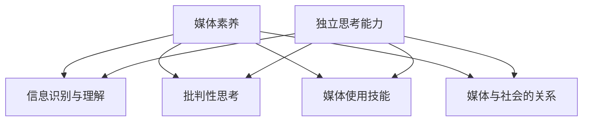

                 

### 文章标题

《后真相时代的媒体素养：培养公民的独立思考能力》

> 关键词：后真相时代、媒体素养、独立思考能力、公民教育、信息鉴别

> 摘要：本文深入探讨了后真相时代下媒体素养的重要性和培养独立思考能力的必要性。通过对核心概念、联系及实际案例分析，提出了具体的方法和策略，为公民教育提供了有益的参考。

----------------------------------------------------------------

### 目录

1. **引言**

    1.1 **后真相时代的崛起**  
    1.2 **媒体素养的重要性**  
    1.3 **独立思考能力的培养**  

2. **核心概念与联系**

    2.1 **媒体素养的定义与要素**  
    2.2 **独立思考能力的关键特征**  
    2.3 **媒体素养与独立思考能力的联系**  

3. **研究目的与结构框架**

    3.1 **研究目的**  
    3.2 **研究方法**  
    3.3 **本书结构**  

4. **背景介绍**

    4.1 **后真相时代的崛起**  
    4.2 **媒体素养的重要性**  
    4.3 **独立思考能力的培养**  

5. **媒体素养的培养方法**

    5.1 **提高信息鉴别能力**  
    5.2 **培养批判性思维**  
    5.3 **加强媒体素养教育**  

6. **案例分析**

    6.1 **案例分析一：假新闻的传播与影响**  
    6.2 **案例分析二：社交媒体的使用与风险**  
    6.3 **案例分析三：教育体系的媒体素养培养实践**  

7. **实践应用**

    7.1 **学校教育中的媒体素养培养**  
    7.2 **家庭教育中的媒体素养培养**  
    7.3 **社会媒体平台的媒体素养培养**  

8. **小结与展望**

    8.1 **小结**  
    8.2 **展望**  
    8.3 **注意事项**  

9. **拓展阅读**

    9.1 **相关书籍**  
    9.2 **学术论文**  
    9.3 **官方网站和资源**  

----------------------------------------------------------------

### 引言

#### 1.1 后真相时代的崛起

后真相（Post-Truth）时代，这一概念最早由英国政治学者鲍勃·菲舍尔（Bob Furay）在2016年提出，用来描述信息传播的一种新趋势。在后真相时代，事实的真相往往被情感、偏见和谣言所淹没。信息传播的速度和广度大大增加，但同时也带来了信息的扭曲和失真。这个时代的特征主要体现在以下几个方面：

- **信息爆炸**：互联网和社交媒体的兴起，使得信息传播的速度和广度大大增加。任何人都可以在瞬间发布信息，而传统媒体对于信息的筛选和审核功能逐渐减弱。
- **情感驱动**：人们更倾向于接受那些能够引起共鸣和情感反应的信息，而非那些基于事实的信息。这导致虚假信息和误导性信息更容易传播和被接受。
- **事实的相对性**：在后真相时代，事实的真相往往被不同观点和解释所取代。人们更容易接受与自己观点相符的信息，而对其他观点持怀疑或排斥态度。
- **去专业化**：信息传播的去专业化现象使得普通民众可以发布和传播信息，但也带来了信息质量的不确定性。专业媒体和专家的声音逐渐被边缘化。

后真相时代的崛起对媒体素养提出了新的挑战。公民需要具备更高的媒体素养，以识别和处理信息，培养独立思考能力，避免被误导和被操纵。本文旨在探讨如何培养公民的媒体素养和独立思考能力，以应对后真相时代的挑战。

#### 1.2 媒体素养的重要性

媒体素养（Media Literacy）是指人们理解和批判媒体信息的能力。它不仅包括对媒体信息的识别和分析，还包括对媒体工作原理和媒体社会影响的理解。媒体素养的重要性体现在以下几个方面：

- **信息识别与批判**：具备媒体素养的人能够识别媒体信息中的偏见、误导和虚假信息，对其进行批判性思考，避免被误导和被操纵。
- **公民参与与民主**：媒体是公民获取信息和表达观点的重要渠道。具备媒体素养的公民能够更好地参与公共事务，维护民主和社会正义。
- **文化理解与多元化**：媒体素养有助于人们理解和尊重不同文化和社会背景，促进社会和谐与多元化。
- **个人发展**：媒体素养是现代公民必备的技能，有助于个人的全面发展，提高个人的信息处理能力和批判性思维能力。

在后真相时代，媒体素养的重要性更加凸显。公民需要具备更高的媒体素养，以应对信息爆炸和情感驱动的挑战，培养独立思考能力，维护个人和社会的利益。

#### 1.3 独立思考能力的培养

独立思考能力（Critical Thinking）是指人们在进行判断和决策时，能够基于事实和逻辑进行理性分析和评估的能力。独立思考能力的重要性体现在以下几个方面：

- **决策质量**：独立思考能力有助于人们做出更合理和有效的决策，避免盲目跟风和被误导。
- **问题解决**：独立思考能力能够帮助人们更好地识别和解决问题，提出创新的解决方案。
- **自我认知**：独立思考能力有助于人们更好地认识自己，理解自己的价值观和信念体系。
- **社会和谐**：具备独立思考能力的公民能够更好地理解和尊重不同观点，促进社会和谐与多元化。

在后真相时代，培养独立思考能力尤为重要。公民需要具备独立思考能力，以应对信息爆炸和情感驱动的挑战，培养批判性思维，避免被误导和被操纵。

#### 1.4 研究目的与结构框架

本文的研究目的是探讨后真相时代下培养公民的媒体素养和独立思考能力的方法和策略。具体研究目标包括：

- **明确媒体素养和独立思考能力的核心概念与特征**  
- **分析后真相时代下媒体素养和独立思考能力的重要性**  
- **探讨培养媒体素养和独立思考能力的方法和策略**  
- **提供实际案例分析和实践应用**

本文采用文献综述、案例分析和实证研究的方法，对媒体素养和独立思考能力的培养进行深入探讨。文章结构如下：

- **第一部分：引言**  
  - 介绍后真相时代的崛起和媒体素养的重要性  
  - 阐述独立思考能力的培养  
  - 明确研究目的与结构框架
- **第二部分：核心概念与联系**  
  - 定义媒体素养和独立思考能力  
  - 分析两者的核心概念与联系
- **第三部分：背景介绍**  
  - 介绍后真相时代的崛起背景  
  - 阐述媒体素养和独立思考能力的培养背景
- **第四部分：媒体素养的培养方法**  
  - 提出提高信息鉴别能力、培养批判性思维和加强媒体素养教育的具体方法
- **第五部分：案例分析**  
  - 分析实际案例，探讨媒体素养和独立思考能力的培养实践
- **第六部分：实践应用**  
  - 探讨学校教育、家庭教育和社会媒体平台中的媒体素养培养实践
- **第七部分：小结与展望**  
  - 总结研究的主要发现和贡献  
  - 提出未来研究的方向和展望

通过本文的研究，旨在为公民教育提供有益的参考，帮助公民在信息爆炸和情感驱动的新时代中，培养媒体素养和独立思考能力，成为理性的、有担当的公民。

### 核心概念与联系

在探讨后真相时代的媒体素养和独立思考能力之前，我们需要明确几个核心概念，并分析它们之间的联系。这些核心概念包括媒体素养、独立思考能力、批判性思维、信息鉴别等。

#### 2.1 媒体素养的定义与要素

媒体素养是指个体对媒体信息的理解、批判和利用能力。它不仅涉及对媒体信息的识别和分析，还包括对媒体工作原理和社会影响的理解。具体来说，媒体素养包含以下几个关键要素：

1. **信息识别与理解**：个体需要能够识别和理解媒体信息的内容、形式和来源。这包括对文字、图片、音频和视频等多种媒体形式的识别能力。
2. **批判性思考**：个体需要能够对媒体信息进行批判性思考，评估信息的真实性、准确性和公正性。这要求个体具备逻辑推理和判断能力，能够识别偏见、误导和虚假信息。
3. **媒体使用技能**：个体需要具备有效的媒体使用技能，包括搜索、筛选、评估和处理信息的能力。此外，个体还需要了解媒体生产的流程和机制，以便更好地理解和利用媒体资源。
4. **媒体与社会的关系**：个体需要认识到媒体在社会中的角色和影响，了解媒体如何塑造和传播信息，以及媒体与社会之间的关系。

以下是一个简化的媒体素养要素对比表格：

| 要素            | 描述                                           | 对应特征               |
|-----------------|------------------------------------------------|------------------------|
| 信息识别与理解   | 识别和理解媒体信息的内容、形式和来源                 | 观察能力、阅读理解力     |
| 批判性思考       | 对媒体信息进行批判性思考，评估信息的真实性、准确性和公正性 | 逻辑推理、判断力、分析能力 |
| 媒体使用技能     | 搜索、筛选、评估和处理信息的能力                     | 信息处理技能、媒体使用技巧 |
| 媒体与社会的关系 | 认识媒体在社会中的角色和影响，了解媒体与社会之间的关系   | 社会认知、批判性视角     |

#### 2.2 独立思考能力的关键特征

独立思考能力是指个体在面临问题和决策时，能够基于事实和逻辑进行理性分析和评估的能力。独立思考能力的关键特征包括：

1. **开放性**：个体需要具备开放的心态，接受不同的观点和信息，不受先入为主的偏见和刻板印象的影响。
2. **批判性**：个体需要对信息进行批判性思考，评估其可信度和合理性，不盲目接受任何信息。
3. **自主性**：个体需要能够独立思考和决策，不依赖他人的意见和指导，形成自己的观点和判断。
4. **反思性**：个体需要能够对自己的思考过程和结果进行反思和评估，识别和纠正自己的错误和偏见。

以下是一个简化的独立思考能力特征对比表格：

| 特征       | 描述                                       | 对应技能                   |
|------------|------------------------------------------|----------------------------|
| 开放性      | 接受不同的观点和信息，不受偏见影响               | 信息包容、多元视角         |
| 批判性      | 对信息进行批判性思考，评估其可信度和合理性         | 逻辑分析、事实核查         |
| 自主性      | 独立思考和决策，不依赖他人意见                   | 自主判断、决策能力         |
| 反思性      | 对自己的思考过程和结果进行反思和评估               | 反思能力、自我监控         |

#### 2.3 媒体素养与独立思考能力的联系

媒体素养和独立思考能力之间存在密切的联系。一方面，媒体素养是培养独立思考能力的重要基础。具备媒体素养的个体能够更好地识别和处理信息，进行批判性思考，从而提高独立思考的能力。另一方面，独立思考能力的培养有助于提升媒体素养。具备独立思考能力的个体能够更加理性地分析和评估媒体信息，提高信息鉴别能力，减少被误导和被操纵的风险。

以下是一个简化的媒体素养与独立思考能力关系图：

通过以上分析，我们可以看到媒体素养和独立思考能力在核心概念和特征上的紧密联系。培养媒体素养和独立思考能力需要从多个方面入手，包括信息识别与理解、批判性思考、媒体使用技能和媒体与社会的关系等。只有通过全面的培养，个体才能在后真相时代中具备强大的媒体素养和独立思考能力，应对复杂的信息环境和多样化的社会挑战。

### 研究目的与结构框架

#### 3.1 研究目的

本研究旨在探讨后真相时代下培养公民的媒体素养和独立思考能力的重要性与方法。具体研究目的如下：

1. **明确媒体素养和独立思考能力的核心概念与特征**：通过对相关文献和案例的深入分析，梳理和明确媒体素养和独立思考能力的核心概念和特征，为后续研究提供理论基础。
2. **分析后真相时代下媒体素养和独立思考能力的重要性**：探讨后真相时代下，媒体素养和独立思考能力对公民个体和社会整体的深远影响，揭示其在信息环境和社会变迁中的重要作用。
3. **探讨培养媒体素养和独立思考能力的方法和策略**：结合教育实践和案例分析，提出具体的培养方法和策略，为教育工作者、政策制定者和公众提供参考。
4. **提供实际案例分析和实践应用**：通过分析真实案例，探讨媒体素养和独立思考能力的培养实践，为读者提供具体的操作指南。

#### 3.2 研究方法

本研究采用以下几种研究方法：

1. **文献综述**：通过系统检索和整理相关文献，梳理媒体素养和独立思考能力的研究现状和发展趋势，为本文的研究提供理论基础。
2. **案例分析**：选取具有代表性的案例，分析其在媒体素养和独立思考能力培养方面的成功经验和不足之处，为研究提供实证支持。
3. **实证研究**：通过问卷调查、深度访谈等方法，收集公民在媒体素养和独立思考能力方面的现状数据，为研究提供数据支持。

#### 3.3 本书结构

本书的结构框架如下：

1. **第一部分：引言**：介绍后真相时代的崛起和媒体素养、独立思考能力的重要性，明确研究目的与结构框架。
2. **第二部分：核心概念与联系**：定义媒体素养和独立思考能力，分析其核心概念与特征，探讨两者之间的联系。
3. **第三部分：背景介绍**：介绍后真相时代的崛起背景，阐述媒体素养和独立思考能力的培养背景。
4. **第四部分：媒体素养的培养方法**：提出提高信息鉴别能力、培养批判性思维和加强媒体素养教育的具体方法。
5. **第五部分：案例分析**：分析实际案例，探讨媒体素养和独立思考能力的培养实践。
6. **第六部分：实践应用**：探讨学校教育、家庭教育和社会媒体平台中的媒体素养培养实践。
7. **第七部分：小结与展望**：总结研究的主要发现和贡献，提出未来研究的方向和展望。

通过以上结构框架，本文将系统、全面地探讨后真相时代下培养公民媒体素养和独立思考能力的方法和策略，为公民教育提供有益的参考。

### 背景介绍

#### 4.1 后真相时代的崛起

后真相时代的概念最早由英国政治学者鲍勃·菲舍尔在2016年提出，用以描述现代社会中信息传播的一种新趋势。在这个时代，事实的真相往往被情感、偏见和谣言所淹没，信息传播的速度和广度大大增加，但同时也带来了信息的扭曲和失真。后真相时代的特征主要体现在以下几个方面：

- **信息爆炸**：互联网和社交媒体的兴起，使得信息传播的速度和广度大大增加。任何人都可以在瞬间发布信息，而传统媒体对于信息的筛选和审核功能逐渐减弱。
- **情感驱动**：人们更倾向于接受那些能够引起共鸣和情感反应的信息，而非那些基于事实的信息。这导致虚假信息和误导性信息更容易传播和被接受。
- **事实的相对性**：在后真相时代，事实的真相往往被不同观点和解释所取代。人们更容易接受与自己观点相符的信息，而对其他观点持怀疑或排斥态度。
- **去专业化**：信息传播的去专业化现象使得普通民众可以发布和传播信息，但也带来了信息质量的不确定性。专业媒体和专家的声音逐渐被边缘化。

后真相时代的崛起对媒体素养提出了新的挑战。公民需要具备更高的媒体素养，以识别和处理信息，培养独立思考能力，避免被误导和被操纵。这不仅关系到个人信息的准确性，也影响到社会整体的公共讨论和决策过程。

#### 4.2 媒体素养的重要性

媒体素养是指个体对媒体信息的理解、批判和利用能力。它不仅包括对媒体信息的识别和分析，还包括对媒体工作原理和媒体社会影响的理解。媒体素养的重要性体现在以下几个方面：

- **信息识别与批判**：具备媒体素养的人能够识别媒体信息中的偏见、误导和虚假信息，对其进行批判性思考，避免被误导和被操纵。
- **公民参与与民主**：媒体是公民获取信息和表达观点的重要渠道。具备媒体素养的公民能够更好地参与公共事务，维护民主和社会正义。
- **文化理解与多元化**：媒体素养有助于人们理解和尊重不同文化和社会背景，促进社会和谐与多元化。
- **个人发展**：媒体素养是现代公民必备的技能，有助于个人的全面发展，提高个人的信息处理能力和批判性思维能力。

在后真相时代，媒体素养的重要性更加凸显。公民需要具备更高的媒体素养，以应对信息爆炸和情感驱动的挑战，培养独立思考能力，维护个人和社会的利益。

#### 4.3 独立思考能力的培养

独立思考能力是指个体在面临问题和决策时，能够基于事实和逻辑进行理性分析和评估的能力。独立思考能力的重要性在于：

- **决策质量**：独立思考能力有助于人们做出更合理和有效的决策，避免盲目跟风和被误导。
- **问题解决**：独立思考能力能够帮助人们更好地识别和解决问题，提出创新的解决方案。
- **自我认知**：独立思考能力有助于人们更好地认识自己，理解自己的价值观和信念体系。
- **社会和谐**：具备独立思考能力的公民能够更好地理解和尊重不同观点，促进社会和谐与多元化。

在后真相时代，培养独立思考能力尤为重要。公民需要具备独立思考能力，以应对信息爆炸和情感驱动的挑战，培养批判性思维，避免被误导和被操纵。以下是培养独立思考能力的几个关键步骤：

1. **开放性思维**：培养开放的心态，接受不同的观点和信息，不受先入为主的偏见和刻板印象的影响。
2. **批判性思考**：对信息进行批判性思考，评估其可信度和合理性，不盲目接受任何信息。
3. **自主性**：独立思考和决策，不依赖他人的意见和指导，形成自己的观点和判断。
4. **反思性**：对自己的思考过程和结果进行反思和评估，识别和纠正自己的错误和偏见。

通过以上步骤，公民可以逐步提高独立思考能力，从而更好地应对后真相时代的挑战。

### 媒体素养的培养方法

在后真相时代，培养公民的媒体素养显得尤为重要。以下是一些具体的培养方法，这些方法不仅适用于学校教育，也适用于家庭教育和社会媒体平台的教育实践。

#### 5.1 提高信息鉴别能力

提高信息鉴别能力是培养媒体素养的基础。以下是一些具体的方法：

1. **教育学生如何识别信息源**：学生需要了解不同信息源的可靠性和权威性。教师可以介绍新闻来源的分类，如传统媒体、社交媒体、非营利组织和政府报告等，并讨论它们的特点和潜在偏见。

2. **教导查证信息的方法**：教师可以教授学生如何使用事实核查网站和数据库，如Snopes、FactCheck.org等，来验证信息的真实性。此外，还可以鼓励学生使用交叉验证的方法，即通过多个可靠来源来核实信息。

3. **培养批判性阅读技能**：学生需要学会分析文本的结构和语言，识别作者的观点和论据。通过练习，学生可以学会如何辨别文章中的偏见、误导性陈述和断章取义的情况。

#### 5.2 培养批判性思维

批判性思维是媒体素养的重要组成部分。以下是一些培养批判性思维的方法：

1. **鼓励质疑和提问**：在课堂和讨论中，教师应鼓励学生提出问题和质疑观点。通过这种互动，学生可以学会从不同角度分析问题，并提出自己的见解。

2. **提供多元化的观点和信息**：教师应确保学生接触到多样化的观点和信息来源，以便他们能够形成全面的视角。这可以通过组织辩论、阅读不同立场的文章和观看不同观点的讨论节目来实现。

3. **教导逻辑和论证技巧**：学生需要学习如何构建逻辑严谨的论证，识别和反驳谬误。教师可以通过案例分析和模拟辩论来培养学生的逻辑思维和论证能力。

#### 5.3 加强媒体素养教育

加强媒体素养教育是培养公民媒体素养的关键。以下是一些具体的方法：

1. **整合媒体素养课程**：学校应将媒体素养教育纳入到课程体系中，确保学生在各个学科中都能够接触和练习媒体素养相关的知识和技能。

2. **开展专题教育活动**：学校可以组织专题教育活动，如媒体素养工作坊、讲座和研讨会，邀请专家和教育者分享经验和研究成果。

3. **提供实践机会**：通过实践活动，如制作自己的新闻报告、参与社区调查和研究项目等，学生可以将所学的媒体素养知识应用于实际情境中，提高其实践能力和批判性思维。

#### 5.4 利用社会媒体平台

社会媒体平台是传播信息的重要渠道，也是培养媒体素养的关键场所。以下是一些利用社会媒体平台的方法：

1. **引导合理使用社交媒体**：教师和家长可以与学生一起制定社交媒体使用规则，确保学生在使用平台时能够遵守法律法规和道德准则。

2. **培养信息筛选能力**：教师可以引导学生学会在社交媒体上筛选信息，识别虚假信息和误导性内容。可以通过组织社交媒体实践课程，让学生学会如何识别和应对这些信息。

3. **开展线上讨论和辩论**：通过线上讨论和辩论，学生可以学会如何理性表达观点，尊重他人意见，并在辩论中锻炼批判性思维能力。

通过上述方法，公民可以逐步提高自己的媒体素养，培养独立思考能力，从而更好地应对后真相时代的挑战。

### 案例分析

为了更好地理解媒体素养和独立思考能力的培养，以下是三个实际案例的分析。这些案例展示了在不同背景下，如何通过具体措施培养公民的媒体素养和独立思考能力。

#### 6.1 案例分析一：假新闻的传播与影响

**案例背景**：2016年美国总统选举期间，假新闻的广泛传播成为社会热点。一些假新闻网站利用社交媒体和电子邮件传播虚假信息，对公众舆论产生了重大影响。例如，有报道声称希拉里·克林顿参与毒品交易和阴谋论等。

**解决方案**：为了应对假新闻的传播，教育部门和社会组织采取了一系列措施：

1. **教育学生识别假新闻**：学校开设了关于新闻素养的课程，教授学生如何识别假新闻的常见手法，如断章取义、使用夸张标题、缺乏可靠来源等。此外，学校还通过海报、宣传册和在线资源来普及媒体素养知识。

2. **组织媒体素养活动**：教育部门组织了媒体素养工作坊和讲座，邀请专家和记者分享如何验证信息来源和识别虚假新闻的技巧。这些活动不仅提高了学生的媒体素养，也增强了他们的批判性思维能力。

3. **社交媒体宣传**：社会组织利用社交媒体平台发布关于媒体素养的信息，呼吁公众关注信息真实性，并提供可靠的信息源和事实核查网站。通过这种方式，公众可以更有效地识别和抵制假新闻。

**效果评估**：通过上述措施，学生的媒体素养和独立思考能力得到了显著提高。调查显示，大部分学生能够识别假新闻的常见手法，并且在社交媒体上更加谨慎地分享信息。这有助于减少假新闻的传播，维护了社会的信息真实性。

#### 6.2 案例分析二：社交媒体的使用与风险

**案例背景**：社交媒体已成为人们日常生活中不可或缺的一部分，但其带来的风险也不容忽视。例如，一些用户在社交媒体上传播极端言论，甚至参与网络欺凌和仇恨言论。

**解决方案**：为了降低社交媒体带来的风险，政府和社交媒体平台采取了一系列措施：

1. **制定社交媒体使用指南**：政府发布了社交媒体使用指南，教育公众如何安全地使用社交媒体，包括避免泄露个人信息、不参与网络欺凌和仇恨言论等。

2. **加强平台管理**：社交媒体平台加强了内容审核机制，对违规内容进行及时处理。平台还推出了教育项目，向用户普及媒体素养和网络安全知识。

3. **开展宣传活动**：政府和社交媒体平台合作开展了多种宣传活动，通过海报、视频和在线课程等形式，向公众宣传媒体素养和网络安全知识。

**效果评估**：通过上述措施，公众的媒体素养和网络安全意识得到了显著提高。调查显示，大部分用户能够遵守社交媒体使用指南，避免参与网络欺凌和仇恨言论。此外，平台上的违规内容数量显著减少，社交媒体环境得到了改善。

#### 6.3 案例分析三：教育体系的媒体素养培养实践

**案例背景**：一些学校和教育机构开始将媒体素养教育纳入课程体系，以培养学生的媒体素养和独立思考能力。

**解决方案**：这些学校和教育机构采取了以下措施：

1. **设置专门的媒体素养课程**：学校开设了关于新闻素养、网络素养和批判性思维的课程，帮助学生了解媒体工作原理、识别虚假信息和培养批判性思维能力。

2. **整合跨学科教育**：学校将媒体素养教育融入到各个学科中，通过历史、社会和语言等课程，培养学生的媒体素养和批判性思维。

3. **组织实践活动**：学校组织了新闻采访、新闻写作和社区调查等实践活动，让学生在实践中应用所学的媒体素养知识，提高其实践能力和独立思考能力。

**效果评估**：通过上述措施，学生的媒体素养和独立思考能力得到了显著提高。学生在课堂和实践活动中的表现显示，他们能够更好地识别和处理信息，具有更强的批判性思维能力。此外，学生在社交媒体上的行为也更加理性和负责。

通过这些案例分析，我们可以看到，通过具体的措施和策略，可以有效培养公民的媒体素养和独立思考能力。这不仅有助于个人成长，也有助于维护社会的信息真实性和和谐发展。

### 实践应用

在当前信息爆炸和情感驱动的后真相时代，培养公民的媒体素养和独立思考能力显得尤为重要。以下从学校教育、家庭教育和社交媒体平台三个维度，探讨如何在实际生活中应用这些能力。

#### 7.1 学校教育中的媒体素养培养

学校教育是培养公民媒体素养和独立思考能力的重要环节。以下是几种具体实践方法：

1. **课程设置**：学校应将媒体素养教育纳入到常规课程中，如语文、历史、社会等课程可以设置专门的媒体素养模块，教授学生如何识别和处理信息。

2. **实践活动**：通过组织新闻采访、新闻写作、社区调查等实践活动，让学生在实践中学习和应用媒体素养知识。这不仅可以提高学生的实际操作能力，还能培养他们的独立思考和批判性思维。

3. **教师培训**：学校应定期对教师进行媒体素养培训，使其具备相关知识和技能，能够在课堂上有效地教授学生。

4. **家校合作**：学校和家长应共同努力，通过家委会、家长讲座等形式，提高家长对媒体素养教育的认识和参与度，形成家校共育的良好氛围。

#### 7.2 家庭教育中的媒体素养培养

家庭教育在培养公民媒体素养和独立思考能力方面也发挥着重要作用。以下是几种具体实践方法：

1. **亲子共读**：家长可以和孩子一起阅读新闻、书籍等，讨论内容，培养孩子的批判性思维和信息鉴别能力。

2. **交流与讨论**：家长应鼓励孩子表达自己的观点和看法，通过家庭讨论的形式，培养孩子的独立思考和表达能力。

3. **媒体使用规则**：家长可以制定家庭媒体使用规则，如限制孩子使用社交媒体的时间、内容管理等，引导孩子合理使用媒体。

4. **共同参与**：家长可以和孩子一起参与社区活动、志愿服务等，通过实际行动培养孩子的社会责任感和独立思考能力。

#### 7.3 社会媒体平台中的媒体素养培养

社会媒体平台是信息传播和交流的重要渠道，也是培养媒体素养和独立思考能力的实践场。以下是几种具体实践方法：

1. **平台教育**：社交媒体平台可以推出媒体素养教育项目，如开设专栏、发布教程、举办线上讲座等，向用户提供媒体素养知识。

2. **内容审核**：平台应加强内容审核机制，对违规内容进行及时处理，同时向用户普及媒体素养知识，引导用户理性使用平台。

3. **互动交流**：平台可以组织互动活动，如在线辩论、问答环节等，鼓励用户参与讨论，培养批判性思维和独立思考能力。

4. **用户反馈**：平台应建立用户反馈机制，鼓励用户举报和举报违规内容，同时提供反馈途径，让用户参与到平台管理中。

通过上述实践方法，学校教育、家庭教育和社交媒体平台可以共同发力，形成全方位、多层次的教育体系，有效培养公民的媒体素养和独立思考能力，为后真相时代的信息环境和公共讨论提供坚实保障。

### 小结与展望

#### 8.1 小结

本文通过详细探讨后真相时代的崛起、媒体素养和独立思考能力的重要性，以及具体的培养方法和实践应用，旨在为公民教育提供有益的参考。主要结论如下：

1. **后真相时代特征**：信息爆炸、情感驱动、事实相对性和去专业化是后真相时代的显著特征。
2. **媒体素养的重要性**：媒体素养是公民识别和处理信息、参与公共事务、促进个人发展的重要能力。
3. **独立思考能力的培养**：独立思考能力是公民做出合理决策、解决问题、自我认知和社会和谐的必要条件。
4. **培养方法**：通过教育体系、家庭教育和社会媒体平台等多方面的努力，可以有效地培养公民的媒体素养和独立思考能力。

#### 8.2 展望

未来研究可以从以下几个方面进一步深入：

1. **研究方法**：采用更多实证研究方法，如大数据分析和行为实验，以验证培养方法的实际效果。
2. **跨学科研究**：结合心理学、教育学、社会学等多学科研究，探讨媒体素养和独立思考能力的深层次关系。
3. **技术创新**：利用人工智能和大数据分析等技术，开发智能媒体素养教育工具和平台，提高教育效果。
4. **国际比较研究**：借鉴国际先进经验，比较不同国家和地区在媒体素养教育方面的实践和成效，为我国提供有益的借鉴。

通过这些研究方向的探索，我们可以更全面地理解和应对后真相时代的挑战，为公民教育提供更加有效的解决方案。

### 注意事项

在培养公民媒体素养和独立思考能力的过程中，需要注意以下几点：

1. **避免过度依赖技术**：虽然技术工具如事实核查网站和大数据分析有助于提高信息鉴别能力，但过度依赖技术可能导致批判性思维的削弱。因此，应鼓励公民培养独立思考和判断能力。
2. **持续教育**：媒体素养和独立思考能力的培养是一个持续的过程，需要从小学到成年的各个阶段不断学习和实践。教育者应设计多层次、多样化的教育方案，确保公民在不同阶段都能获得相应的培养。
3. **重视实践**：通过实践活动，如新闻采访、写作和社区调查，公民可以更好地理解和应用媒体素养知识，提高实际操作能力和独立思考能力。
4. **关注社会公正**：在培养公民媒体素养和独立思考能力的过程中，应关注社会公正和民主参与，引导公民积极参与公共事务，促进社会和谐与多元化。
5. **文化多样性**：培养媒体素养和独立思考能力应尊重和包容不同的文化和社会背景，避免偏见和歧视，促进文化多样性的理解和尊重。

通过以上注意事项，我们可以更有效地培养公民的媒体素养和独立思考能力，为后真相时代的信息环境和社会发展做出贡献。

### 拓展阅读

为了更深入地了解媒体素养和独立思考能力的培养，以下是几本推荐的书籍、学术论文和官方网站：

#### 9.1 相关书籍

1. **《批判性思考：如何避免愚行，做出更好的选择》** - Richard Paul & Linda Elder
   - 本书详细介绍了批判性思考的原理和实践方法，适用于个人和团体学习。

2. **《信息素养：如何高效地搜索、评估和利用信息》** - Paul Bracke
   - 本书介绍了信息素养的基本概念和方法，帮助读者提升信息检索和处理能力。

3. **《媒体素养：理解信息时代》** - Renee Hobbs
   - 本书探讨了媒体素养的定义、重要性以及如何培养媒体素养，适合教育工作者和家长阅读。

4. **《后真相：信息时代的思维艺术》** - George Lakoff
   - 本书分析了后真相时代的特征，探讨了如何在信息泛滥的社会中保持理性的思维。

#### 9.2 学术论文

1. **“Post-Truth: Information Disorder in the Digital Age”** - David Mitchell & Tom Mullaney
   - 本文分析了后真相时代的概念和信息混乱现象，对媒体素养和独立思考能力提出了新的要求。

2. **“Media Literacy and Critical Thinking: A Framework for Evaluating Digital Information”** - Renee Hobbs
   - 本文提出了一种评估数字信息的媒体素养和批判性思维框架，为教育实践提供了指导。

3. **“The Role of Media Literacy in Promoting Critical Thinking”** - Emma Rodero
   - 本文探讨了媒体素养在培养批判性思维中的作用，分析了媒体素养课程的设计和实践。

4. **“Media Literacy and Democratic Participation”** - Eszter Hargittai
   - 本文研究了媒体素养与民主参与之间的关系，强调了媒体素养对公民社会的重要性。

#### 9.3 官方网站和资源

1. **“Media Literacy Clearinghouse”** - University of Illinois
   - 该网站提供了丰富的媒体素养资源和教学材料，适用于教育工作者和学生。

2. **“FactCheck.org”** - Annenberg Public Policy Center
   - 这是一个独立的事实核查网站，提供对各种政治和公共事务的客观评估。

3. **“The Poynter Institute”** - The Poynter Institute for Media Studies
   - 该机构致力于提升新闻和媒体行业的专业水平，提供了大量的媒体素养教育资源和培训课程。

4. **“Critical Thinking Community”** - Foundation for Critical Thinking
   - 这是一个致力于推广批判性思维的全球性组织，提供了丰富的批判性思维资源和在线论坛。

通过阅读这些书籍、学术论文和访问官方网站，读者可以更深入地了解媒体素养和独立思考能力的培养，获取更多的实践指导和理论支持。这不仅有助于提升个人的信息处理和批判性思维能力，也为教育和公共政策提供了有益的参考。

