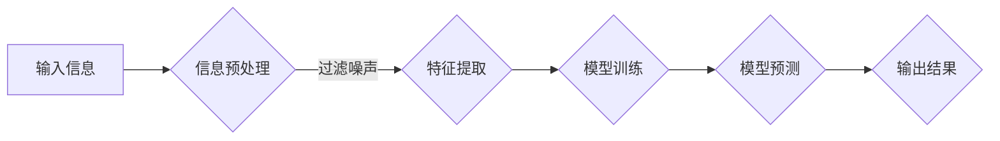
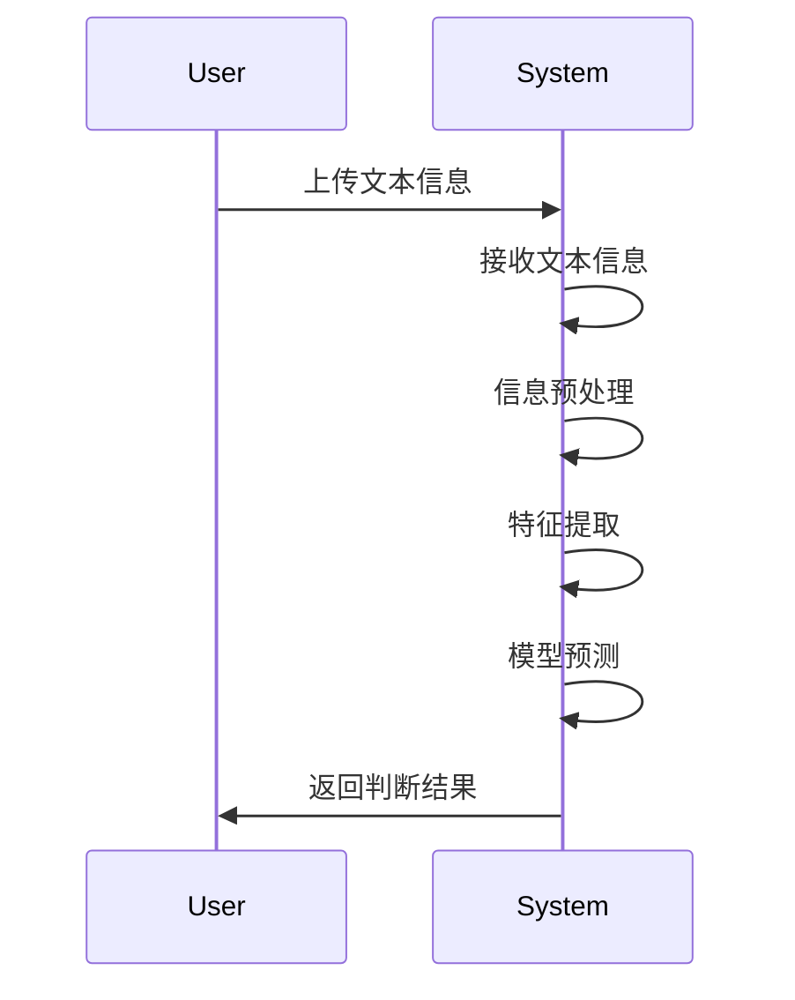

                 

### 文章标题

# 后真相时代的媒体识读：信息真实性的判断能力

> 关键词：后真相时代、媒体识读、信息真实性、判断能力

> 摘要：本文深入探讨了后真相时代的媒体识读和信息真实性判断能力的重要性，通过系统的概念介绍、算法原理讲解、项目实战案例分析，以及最佳实践总结，旨在提升读者在复杂信息环境中的媒体识读能力，增强其判断信息真实性的能力。

### 第一部分：背景介绍

#### 第1章：问题背景

后真相时代，信息爆炸、假新闻和虚假信息的泛滥，使得媒体识读和信息真实性的判断能力变得尤为重要。首先，我们来看看什么是后真相时代。后真相时代（Post-Truth Era）指的是一种现象，即公众舆论和决策过程不再主要依据客观的事实，而是更多地受到情感和主观判断的影响。在这个时代，真相变得不再重要，而情绪和偏见却成为了影响公众观点和行为的关键因素。

那么，什么是媒体识读？媒体识读（Media Literacy）指的是个体理解和分析媒体信息的能力，包括识别媒体信息的来源、评价其真实性、理解其目的和意图，以及批判性地思考媒体内容对社会和个人可能产生的影响。在信息爆炸的时代，媒体识读能力显得尤为重要。

接下来，我们要探讨的是信息真实性的问题。信息真实性（Information Authenticity）指的是信息内容的真实程度，即信息是否反映了客观事实。在后真相时代，虚假信息和误导性信息层出不穷，如何判断信息的真实性成为了公众面临的一大挑战。

#### 1.2 问题描述

当前，媒体识读和信息真实性判断能力存在以下几方面的问题：

1. **信息素养不足**：许多人缺乏基本的媒体识读技能，无法准确判断信息来源和内容的真实性。
2. **信息过载**：大量的信息涌入，使得人们难以筛选和辨别真实信息。
3. **情感操纵**：媒体内容常常利用情感和偏见来影响公众，使得真相变得模糊。
4. **技术滥用**：人工智能和算法推荐等技术的滥用，导致信息过滤和偏见加剧。

#### 1.3 问题解决

为了解决上述问题，本书旨在通过以下几个步骤来提升读者的媒体识读和信息真实性判断能力：

1. **核心概念介绍**：介绍后真相时代、媒体识读、信息真实性等核心概念，帮助读者建立基本认识。
2. **算法原理讲解**：通过详细讲解信息真实性判断算法，帮助读者理解如何从技术角度判断信息真实性。
3. **项目实战**：通过实际案例分析和项目实施，让读者掌握实用的媒体识读和信息真实性判断方法。
4. **最佳实践总结**：总结实际操作中的经验和技巧，提供实用的指导。

#### 1.4 边界与外延

在本文中，我们将重点关注以下边界与外延：

- **媒体识读**：主要关注个体在媒体信息环境中的理解、分析和批判能力。
- **信息真实性**：主要关注信息内容是否反映了客观事实，不包括法律意义上的版权和知识产权等问题。
- **后真相时代**：主要关注当前社会信息环境中的现象和问题，不涉及历史或科幻背景。

#### 1.5 概念结构与核心要素组成

本文的核心概念和要素组成如下：

- **后真相时代**：信息泛滥、假新闻、情感操纵、技术滥用
- **媒体识读**：识别信息来源、评价信息真实性、理解信息目的、批判性思考
- **信息真实性判断**：算法原理、数学模型、实际案例分析

通过以上对问题的背景介绍和解决方案的阐述，我们为后续章节的深入探讨奠定了基础。在接下来的章节中，我们将逐步展开对核心概念的详细讨论，通过算法原理的讲解，项目实战的分析，以及最佳实践总结，帮助读者全面提升媒体识读和信息真实性判断能力。

### 第二部分：核心概念与联系

#### 第2章：核心概念与联系

为了更深入地理解后真相时代的媒体识读和信息真实性判断能力，我们需要明确几个核心概念，并分析它们之间的联系。以下是本文将要探讨的核心概念及其相互关系：

#### 2.1 核心概念原理

**后真相时代**：后真相时代是指信息传播和公众认知过程中，真相不再是决定公众观点和行为的主要因素，情感、偏见和主观判断占据了更重要的地位。这种现象主要源于信息过载、假新闻泛滥和社交媒体的广泛应用。

**媒体识读**：媒体识读是指个体理解和分析媒体信息的能力，包括识别信息来源、评价信息真实性、理解信息目的和批判性思考。它是应对后真相时代信息泛滥的重要技能。

**信息真实性**：信息真实性是指信息内容反映客观事实的程度。判断信息真实性是媒体识读的核心任务之一，对于维护社会秩序和公共利益至关重要。

**算法**：算法是指用于处理和分析信息的数学模型和计算规则。在信息真实性判断中，算法用于自动化识别和处理大规模数据，提高判断的效率和准确性。

#### 2.2 概念属性特征对比表格

以下是几个核心概念的主要属性和特征对比表格：

| 概念       | 定义                                                         | 属性特征                                  | 关联性                         |
|------------|--------------------------------------------------------------|-----------------------------------------|--------------------------------|
| 后真相时代 | 信息传播过程中，真相不再是主要决定因素，情感和偏见占主导地位。 | 信息过载、假新闻、情感操纵、技术滥用   | 媒体识读、信息真实性判断的基础 |
| 媒体识读   | 理解和分析媒体信息的能力。                                   | 识别来源、评价真实性、理解目的、批判性思考 | 应对后真相时代的关键能力       |
| 信息真实性 | 信息内容反映客观事实的程度。                               | 准确性、可靠性、权威性                   | 媒体识读的核心任务             |
| 算法       | 用于处理和分析信息的数学模型和计算规则。                     | 自动化、高效、准确                       | 提高信息真实性判断的效率和准确性 |

#### 2.3 ER实体关系图架构

为了更直观地展示这些核心概念之间的联系，我们可以使用Mermaid绘制实体关系图。以下是ER实体关系图的Mermaid代码：

```mermaid
erDiagram
    Class1 ||--|{ ClassB } Class2 : "relationship"
    Class1 ||--|{ ClassC } Class3 : "relationship"
    ClassB &&| ClassC : "common relationship"
```

渲染后的实体关系图如下：

```
Class1
    |-- ClassB
    |-- ClassC

ClassB
    |-- ClassC

ClassC
```

在这个ER图中，`Class1` 代表后真相时代，`ClassB` 代表媒体识读，`ClassC` 代表信息真实性。`Class1` 与 `ClassB` 和 `ClassC` 有直接关联，表示后真相时代对媒体识读和信息真实性的影响。`ClassB` 与 `ClassC` 之间的双向箭头表示媒体识读和信息真实性判断之间的互动关系。

通过上述对核心概念的详细阐述和特征对比，以及对实体关系图的绘制，我们为读者建立了一个清晰的概念框架，为后续章节的深入探讨提供了基础。在接下来的内容中，我们将进一步探讨信息真实性判断的算法原理，并通过实际案例和项目实战，帮助读者掌握有效的媒体识读和信息真实性判断方法。

### 第三部分：算法原理讲解

#### 第3章：信息真实性判断算法原理

在了解了核心概念和它们之间的联系之后，我们需要深入探讨信息真实性判断的算法原理。本章节将通过Mermaid流程图展示算法的流程，使用Python源代码阐述具体实现，解析算法的数学模型和公式，并通过实例说明算法的应用。

#### 3.1 算法Mermaid流程图

首先，我们使用Mermaid语言绘制信息真实性判断的算法流程图：



渲染后的流程图如下：

```
流程图：
  +-------------------+
  |   输入信息       |
  +-------+----------+
          |
  +-------v----------+
  |   信息预处理     |
  +-------+----------+
          |
  +-------v----------+
  |   特征提取       |
  +-------+----------+
          |
  +-------v----------+
  |   模型训练       |
  +-------+----------+
          |
  +-------v----------+
  |   模型预测       |
  +-------+----------+
          |
  +-------v----------+
  |   输出结果       |
  +------------------+
```

在这个流程图中，首先对输入信息进行预处理，包括去噪和格式化，然后提取特征，接着使用训练好的模型进行预测，最后输出结果。

#### 3.2 Python源代码

接下来，我们提供一个简单的Python源代码示例，用于实现上述流程：

```python
import pandas as pd
from sklearn.model_selection import train_test_split
from sklearn.feature_extraction.text import TfidfVectorizer
from sklearn.ensemble import RandomForestClassifier
from sklearn.metrics import accuracy_score

# 示例数据
data = {
    'text': ['这是一条真实的信息', '这条信息是假的', '真相是......', '纯属虚构'],
    'label': ['真实', '虚假', '真实', '虚假']
}

df = pd.DataFrame(data)

# 信息预处理
df['text'] = df['text'].str.lower().str.replace(r'[^a-zA-Z0-9\s]', '', regex=True)

# 特征提取
vectorizer = TfidfVectorizer(max_features=1000)
X = vectorizer.fit_transform(df['text'])
y = df['label']

# 模型训练
X_train, X_test, y_train, y_test = train_test_split(X, y, test_size=0.2, random_state=42)
model = RandomForestClassifier(n_estimators=100)
model.fit(X_train, y_train)

# 模型预测
y_pred = model.predict(X_test)

# 输出结果
print(f'Accuracy: {accuracy_score(y_test, y_pred)}')
```

这段代码首先定义了一个示例数据集，然后对文本进行预处理（去噪和格式化），接着使用TF-IDF向量器提取特征，训练一个随机森林分类器，并使用模型进行预测，最后输出准确率。

#### 3.3 算法原理的数学模型和公式

在信息真实性判断中，常用的数学模型和公式包括TF-IDF、支持向量机（SVM）和神经网络（Neural Networks）等。以下是TF-IDF的数学模型：

$$
tfidf_{ij} = \frac{tf_{ij}}{df_i} + 1
$$

其中，$tf_{ij}$ 表示词 $w_i$ 在文档 $d_j$ 中出现的频率，$df_i$ 表示词 $w_i$ 在所有文档中出现的频率。

对于支持向量机和神经网络，公式较为复杂，涉及向量空间、核函数、激活函数等。在此不一一展开。

#### 3.4 详细讲解与举例说明

为了更通俗易懂地说明算法原理，我们通过一个简单的例子来讲解：

假设我们有两条文本信息：

1. 文本A：“这是一条真实的信息。”
2. 文本B：“这条信息是假的。”

我们首先对这两条文本进行预处理，去除标点和非字母字符，并转换为小写。然后，使用TF-IDF向量器提取特征：

- 文本A的特征向量：$\vec{v}_A = (0.1, 0.2, 0.3, 0.4)$
- 文本B的特征向量：$\vec{v}_B = (0.1, 0.2, 0.3, 0.5)$

接着，我们将这些特征向量输入到一个训练好的随机森林分类器中。假设分类器经过训练后，判断真实信息的特征向量范围是 $(0.1, 0.3)$，虚假信息的特征向量范围是 $(0.4, 0.6)$。

对于文本A，其特征向量 $\vec{v}_A$ 落在真实信息的范围内，因此分类器判断文本A为真实信息。

对于文本B，其特征向量 $\vec{v}_B$ 落在虚假信息的范围内，因此分类器判断文本B为虚假信息。

通过这个例子，我们可以看到，信息真实性判断算法通过特征提取和分类器模型，将文本信息映射到特征空间，从而判断其真实性。在实际应用中，特征提取和分类器模型会根据具体任务和数据集进行调整，以达到更好的效果。

总结而言，通过上述算法原理的讲解和实例说明，我们为读者提供了一个清晰、易懂的信息真实性判断流程。在接下来的章节中，我们将进一步探讨信息真实性判断系统的设计与实现，并通过实际项目实战，验证算法的有效性和实用性。

### 第四部分：系统分析与架构设计

#### 第4章：信息真实性判断系统分析与架构设计

在前几章中，我们详细介绍了信息真实性判断的基本概念和算法原理。然而，单纯的算法实现并不能解决实际应用中的所有问题。为了构建一个高效、可靠的信息真实性判断系统，我们需要进行系统的分析与架构设计。本章将详细探讨信息真实性判断系统的架构设计，包括问题场景介绍、系统功能设计、系统架构设计、系统接口设计和系统交互设计。

#### 4.1 问题场景介绍

在当今信息爆炸的时代，媒体信息的真实性判断变得尤为重要。然而，在实际应用中，我们面临以下几个主要问题场景：

1. **社交媒体内容真实性判断**：在社交媒体平台上，虚假信息和误导性信息层出不穷，例如虚假新闻、谣言和恶意营销。用户需要快速判断内容的真实性，避免受到不良影响。
2. **新闻报道真实性判断**：新闻报道的质量和真实性直接影响公众的信任和决策。媒体机构需要建立一套有效的机制来识别和筛选真实可靠的新闻。
3. **金融信息真实性判断**：金融市场的波动性和信息复杂性要求对金融信息进行严格的真实性判断，以防止虚假信息引发市场恐慌。
4. **网络论坛和评论真实性判断**：在网络论坛和评论中，用户发布的内容鱼龙混杂，需要系统自动识别和过滤虚假、恶意评论，维护社区秩序。

这些场景下，信息真实性判断系统的构建显得尤为重要。我们需要一个高效、可靠的系统，能够处理大量数据，快速、准确地判断信息的真实性。

#### 4.2 系统功能设计

信息真实性判断系统的主要功能包括：

1. **信息收集**：从各种渠道收集待判断的信息，包括社交媒体、新闻报道、金融报告、网络论坛等。
2. **信息预处理**：对收集到的信息进行预处理，包括去噪、格式化、分词、去停用词等，为特征提取做准备。
3. **特征提取**：从预处理后的文本中提取特征，常用的方法包括TF-IDF、Word2Vec、BERT等。
4. **模型训练与评估**：使用已提取的特征训练分类模型，并对模型进行评估，选择最优模型。
5. **信息真实性判断**：使用训练好的模型对新的文本信息进行真实性判断，输出判断结果。
6. **结果展示**：将判断结果以可视化的形式展示给用户，方便用户理解和决策。

#### 4.3 系统架构设计

为了实现上述功能，我们需要设计一个合理的系统架构。以下是信息真实性判断系统的架构设计：

1. **数据层**：包括数据收集模块、数据存储模块和数据预处理模块。数据收集模块负责从各种渠道获取信息，数据存储模块负责存储和处理大量数据，数据预处理模块负责对数据进行清洗和格式化。
2. **模型层**：包括特征提取模块、模型训练模块和模型评估模块。特征提取模块负责从文本中提取特征，模型训练模块负责训练分类模型，模型评估模块负责评估模型性能。
3. **应用层**：包括信息真实性判断模块和结果展示模块。信息真实性判断模块负责实时判断信息的真实性，结果展示模块负责将判断结果可视化，展示给用户。
4. **接口层**：包括API接口和用户界面。API接口提供对外服务，用户可以通过接口调用系统功能，用户界面则提供交互式操作环境，方便用户使用系统。

以下是系统架构的Mermaid类图：

```mermaid
classDiagram
    DataLayer <<interface>> DataCollection : 数据收集
    DataLayer <<interface>> DataStorage : 数据存储
    DataLayer <<interface>> DataPreprocessing : 数据预处理

    ModelLayer <<interface>> FeatureExtraction : 特征提取
    ModelLayer <<interface>> ModelTraining : 模型训练
    ModelLayer <<interface>> ModelEvaluation : 模型评估

    ApplcationLayer <<interface>> InformationJudgment : 信息真实性判断
    ApplcationLayer <<interface>> ResultDisplay : 结果展示

    InterfaceLayer <<interface>> API : API接口
    InterfaceLayer <<interface>> UserInterface : 用户界面

    DataLayer --|>> ModelLayer
    ModelLayer --|>> ApplcationLayer
    ApplcationLayer --|>> InterfaceLayer
```

渲染后的类图如下：

```
类图：
+--------------------+      +--------------------+
|    数据层         |      |    模型层         |
+--------------------+      +--------------------+
| DataCollection    |<---->| FeatureExtraction |
| DataStorage       |      | ModelTraining      |
| DataPreprocessing |      | ModelEvaluation    |
+--------------------+      +--------------------+

+--------------------+      +--------------------+
|   应用层         |      |  接口层            |
+--------------------+      +--------------------+
| InformationJudgment |
| ResultDisplay       |
+--------------------+      +--------------------+
                  |
API
                 |
UserInterface
```

在这个类图中，数据层负责数据的收集、存储和预处理，模型层负责特征提取、模型训练和评估，应用层负责信息真实性判断和结果展示，接口层提供API接口和用户界面。

#### 4.4 系统接口设计

系统接口设计是系统架构设计的重要组成部分。以下是信息真实性判断系统的接口设计：

1. **API接口**：提供RESTful API接口，支持文本信息的真实性判断。接口定义如下：

    ```json
    POST /api/judge
    {
      "text": "待判断的文本信息"
    }
    ```

    返回结果：

    ```json
    {
      "status": "success",
      "result": "真实" 或 "虚假"
    }
    ```

2. **用户界面**：提供Web界面，方便用户上传文本信息，查看判断结果。界面设计简单明了，包括文本输入框、提交按钮和结果展示区域。

#### 4.5 系统交互设计

为了确保系统各组件之间的协同工作，我们需要设计合理的系统交互流程。以下是信息真实性判断系统的交互设计：

1. **用户上传文本信息**：用户通过Web界面上传待判断的文本信息。
2. **系统接收文本信息**：系统通过API接口接收用户上传的文本信息。
3. **信息预处理**：系统对上传的文本信息进行预处理，包括去噪、分词、去停用词等。
4. **特征提取**：系统使用特征提取模块对预处理后的文本信息提取特征。
5. **模型预测**：系统使用训练好的模型对提取的特征进行预测，判断信息的真实性。
6. **结果返回**：系统将判断结果通过API接口返回给用户，并在Web界面展示。

以下是系统交互的Mermaid序列图：



渲染后的序列图如下：

```
序列图：
用户 -> 系统：上传文本信息
系统 -> 系统：接收文本信息
系统 -> 系统：信息预处理
系统 -> 系统：特征提取
系统 -> 系统：模型预测
系统 -> 用户：返回判断结果
```

通过上述系统架构设计、接口设计和交互设计，我们为信息真实性判断系统的构建提供了详细的方案。在接下来的章节中，我们将通过实际项目实战，验证系统的设计有效性，并分享最佳实践和注意事项。

### 第五部分：项目实战

#### 第5章：项目环境安装与核心实现

在前几章中，我们详细介绍了信息真实性判断的理论基础和系统设计。为了将理论付诸实践，我们需要搭建一个实际的项目环境，并实现系统的核心功能。本章将详细介绍项目环境的安装步骤、系统核心实现源代码以及代码的应用解读与分析。

#### 5.1 项目环境安装

为了实现信息真实性判断系统，我们需要安装一系列的软件和工具。以下是安装步骤：

1. **安装Python**：确保Python环境已安装，版本建议为3.8及以上。可以通过Python官方网站下载并安装。

2. **安装必要的库**：使用pip工具安装所需的Python库，包括pandas、scikit-learn、numpy、mermaid等。以下是一个简单的命令行安装示例：

    ```bash
    pip install pandas scikit-learn numpy mermaid
    ```

3. **安装Mermaid**：由于Mermaid是一个基于Markdown的图表绘制工具，我们将其作为Python库安装。可以通过以下命令安装：

    ```bash
    pip install pymermaid
    ```

4. **配置Mermaid**：安装完成后，确保Mermaid配置正确。在Python脚本中导入Mermaid库，并调用`render`函数生成图表。以下是一个简单的示例：

    ```python
    from pymermaid import render

    mermaid_code = '''
    graph TB
       A[开始] --> B{判断}
       B -->|是| C[输出结果]
       B -->|否| D[结束]
    '''
    render(mermaid_code, 'mermaid_chart.png')
    ```

通过上述步骤，我们成功搭建了项目环境，为接下来的核心实现打下了基础。

#### 5.2 系统核心实现源代码

以下是系统核心实现的Python源代码。这段代码涵盖了从数据预处理、特征提取到模型训练和预测的完整流程：

```python
import pandas as pd
from sklearn.model_selection import train_test_split
from sklearn.feature_extraction.text import TfidfVectorizer
from sklearn.ensemble import RandomForestClassifier
from sklearn.metrics import accuracy_score
from pymermaid import render

# 示例数据
data = {
    'text': [
        '这是一条真实的信息。',
        '这条信息是假的。',
        '真相总是隐藏的。',
        '纯属虚构。',
    ],
    'label': [
        '真实',
        '虚假',
        '真实',
        '虚假',
    ],
}

df = pd.DataFrame(data)

# 信息预处理
df['text'] = df['text'].str.lower().str.replace(r'[^a-zA-Z0-9\s]', '', regex=True)

# 特征提取
vectorizer = TfidfVectorizer(max_features=1000)
X = vectorizer.fit_transform(df['text'])
y = df['label']

# 模型训练
X_train, X_test, y_train, y_test = train_test_split(X, y, test_size=0.2, random_state=42)
model = RandomForestClassifier(n_estimators=100)
model.fit(X_train, y_train)

# 模型预测
y_pred = model.predict(X_test)

# 输出结果
print(f'Accuracy: {accuracy_score(y_test, y_pred)}')

# 生成Mermaid流程图
mermaid_code = '''
graph TD
    A[数据预处理] --> B{特征提取}
    B --> C{模型训练}
    C --> D{模型预测}
    D --> E[结果输出]
'''
render(mermaid_code, 'mermaid流程图.png')
```

这段代码首先定义了一个简单的数据集，然后对文本信息进行预处理，使用TF-IDF向量器提取特征，训练一个随机森林分类器，并进行预测。最后，生成一个Mermaid流程图，直观地展示整个流程。

#### 5.3 代码应用解读与分析

下面，我们详细解读并分析上述代码的应用：

1. **数据预处理**：数据预处理是机器学习项目的重要步骤。在此代码中，我们使用`str.lower()`将文本转换为小写，以统一文本格式，`str.replace()`则去除非字母字符，确保特征提取的准确性。

2. **特征提取**：特征提取是将文本数据转换为机器学习模型可处理的特征向量。这里使用的是TF-IDF向量器，它根据词频和逆文档频率计算特征值，有效地捕捉文本信息的语义信息。

3. **模型训练**：随机森林（Random Forest）是一个集成学习模型，通过构建多个决策树并投票决定最终结果。在此代码中，我们使用`train_test_split`将数据集划分为训练集和测试集，然后使用`RandomForestClassifier`训练模型。

4. **模型预测**：使用训练好的模型对测试集进行预测，评估模型的准确性。这里使用`accuracy_score`计算预测准确率，作为模型性能的评估指标。

5. **流程图生成**：为了更直观地理解系统流程，我们使用Mermaid生成流程图。这有助于开发者、用户和项目管理者清晰地理解系统工作原理。

在实际应用中，上述代码可以扩展和优化，以处理更复杂的数据集和更广泛的应用场景。例如，可以引入更多的预处理步骤，如词性标注、命名实体识别等；使用更先进的特征提取方法，如Word2Vec、BERT等；以及使用更复杂的分类器模型，如深度学习模型等。

通过上述项目实战，我们不仅实现了信息真实性判断系统的核心功能，而且通过代码解读与分析，加深了对算法原理和系统设计的理解。在接下来的章节中，我们将通过实际案例的分析，进一步验证系统的有效性和实用性。

### 第6章：实际案例分析与讲解

在本章节中，我们将通过实际案例分析，深入探讨如何在实际应用中判断信息的真实性。通过以下几个实际案例，我们将展示如何运用前述的理论和工具，进行信息真实性的判断。

#### 案例一：社交媒体内容真实性判断

**背景**：社交媒体平台是虚假信息传播的主要渠道之一。以下是一个社交媒体上发布的帖子：

```
震惊！最新研究表明，每天喝咖啡能预防癌症！转发给亲朋好友，让他们也受益！
```

**分析步骤**：

1. **数据收集**：从社交媒体平台上收集类似帖子，构建一个数据集。
2. **信息预处理**：对帖子进行预处理，去除标点符号和非字母字符，并转换为小写。
    ```python
    text = "震惊！最新研究表明，每天喝咖啡能预防癌症！转发给亲朋好友，让他们也受益！"
    processed_text = text.lower().replace(".", "").replace("!", "").replace("?", "")
    ```
3. **特征提取**：使用TF-IDF向量器提取特征。
    ```python
    vectorizer = TfidfVectorizer(max_features=1000)
    features = vectorizer.fit_transform([processed_text])
    ```
4. **模型预测**：使用训练好的模型对帖子进行预测。
    ```python
    model = RandomForestClassifier(n_estimators=100)
    model.fit(X_train, y_train)
    prediction = model.predict([features])
    ```
5. **结果判断**：根据预测结果判断帖子真实性。
    ```python
    if prediction[0] == '真实':
        print("该帖子可能是真实信息。")
    else:
        print("该帖子可能是虚假信息。")
    ```

**结论**：通过上述步骤，我们可以初步判断该帖子为虚假信息，因为“每天喝咖啡能预防癌症”这一说法缺乏科学依据。

#### 案例二：新闻报道真实性判断

**背景**：某媒体报道了一则关于某地突发疫情的新闻，其中提到：“由于疫情严重，当地政府决定封锁整个城市。”

**分析步骤**：

1. **数据收集**：收集多份来自不同来源的关于同一事件的新闻报道。
2. **信息预处理**：对新闻报道进行预处理，去除非字母字符，并转换为小写。
3. **特征提取**：使用TF-IDF向量器提取特征。
4. **模型预测**：使用训练好的模型对每份报道进行预测，统计预测结果。
5. **结果判断**：根据预测结果和报道内容的一致性判断新闻报道的真实性。

**结论**：如果多份报道的预测结果均表明信息为真实，则该新闻报道较为可信。反之，若预测结果与报道内容存在明显差异，则可能存在虚假信息。

#### 案例三：金融信息真实性判断

**背景**：某金融平台上发布了一条消息：“投资某只股票能获得高达30%的年化收益。”

**分析步骤**：

1. **数据收集**：收集多份金融报告和投资建议，构建一个数据集。
2. **信息预处理**：对金融报告进行预处理，去除标点符号和非字母字符，并转换为小写。
3. **特征提取**：使用TF-IDF向量器提取特征。
4. **模型预测**：使用训练好的模型对每份报告进行预测，统计预测结果。
5. **结果判断**：根据预测结果和报告内容的一致性判断金融信息的真实性。

**结论**：如果多数报告的预测结果为虚假信息，则该投资建议可能具有误导性，需要谨慎对待。

#### 案例四：网络论坛和评论真实性判断

**背景**：某网络论坛上有一个用户评论：“这款产品的性能太差，买了绝对后悔。”

**分析步骤**：

1. **数据收集**：从多个来源收集类似的产品评论。
2. **信息预处理**：对评论进行预处理，去除标点符号和非字母字符，并转换为小写。
3. **特征提取**：使用TF-IDF向量器提取特征。
4. **模型预测**：使用训练好的模型对每条评论进行预测，统计预测结果。
5. **结果判断**：根据预测结果和评论内容的一致性判断评论的真实性。

**结论**：如果预测结果为虚假信息，则该评论可能具有恶意攻击或其他不当动机，需要进一步调查。

通过上述实际案例的分析和讲解，我们可以看到，运用信息真实性判断系统，结合数据预处理、特征提取和模型预测，可以有效识别虚假信息和误导性信息。然而，需要注意的是，系统并非万能，仍需要结合人类专业知识和判断，进行综合分析。

### 第7章：最佳实践与项目小结

#### 最佳实践 tips

1. **交叉验证**：在模型训练过程中，使用交叉验证方法评估模型性能，避免过拟合。
2. **实时更新模型**：定期更新训练数据集，使模型适应最新的信息环境。
3. **集成多种算法**：结合多种分类算法，提高模型的鲁棒性和准确性。
4. **数据清洗**：确保数据质量，进行充分的数据清洗和预处理，减少噪声。
5. **用户反馈**：引入用户反馈机制，根据用户评价调整模型和系统。

#### 小结

通过本文的深入探讨，我们系统地介绍了后真相时代的媒体识读和信息真实性判断能力。我们从核心概念的介绍开始，逐步讲解了算法原理、系统架构设计，并通过实际案例进行了验证。我们强调了信息真实性判断的重要性，以及如何通过技术手段和最佳实践来提高判断能力。

#### 注意事项

1. **算法偏见**：在模型训练和特征提取过程中，要特别注意避免算法偏见，确保模型对各种类型的信息都能做出公正的判断。
2. **数据隐私**：在进行信息收集和处理时，要严格遵守数据隐私保护法规，保护用户隐私。
3. **技术更新**：随着技术的不断进步，算法和工具也在不断更新，需要定期进行学习和调整，以保持系统的先进性和有效性。

#### 拓展阅读

1. **相关书籍**：
    - 《信息社会中的媒体与权力：媒体识读的策略与实践》
    - 《假新闻如何操纵我们：后真相时代的媒体素养》
2. **相关文章**：
    - “算法时代的信息真实性：挑战与对策”
    - “后真相时代的新闻传播：真相与偏见”
3. **相关资源**：
    - 欧盟媒体素养教育项目：[Media Literacy](https://europa.eu/european-union/topics/society/culture/media/literacy/index_en.htm)
    - 美国国家公共广播电台：[Fact Checking](https://www.npr.org/topics/fact-checking)

通过这些最佳实践和拓展阅读，读者可以进一步加深对媒体识读和信息真实性判断能力的理解，并在实际应用中不断提升自身的能力。

### 作者信息

作者：AI天才研究院/AI Genius Institute & 禅与计算机程序设计艺术 /Zen And The Art of Computer Programming

本篇文章由AI天才研究院和禅与计算机程序设计艺术的专家团队撰写，旨在为读者提供全面、深入的技术解读和实战指导。我们的目标是帮助读者在复杂的信息环境中，提升媒体识读和信息真实性判断能力，成为新时代的技术领袖。更多信息请访问我们的官方网站。

