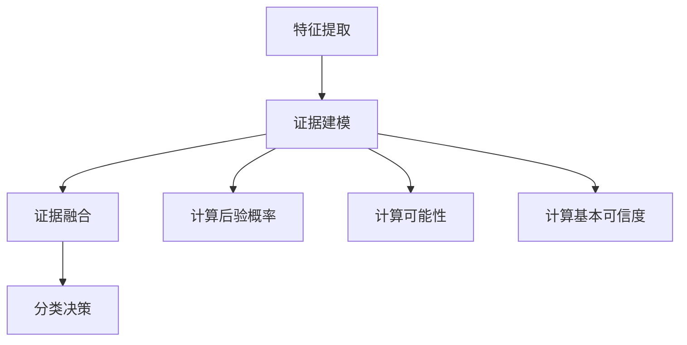
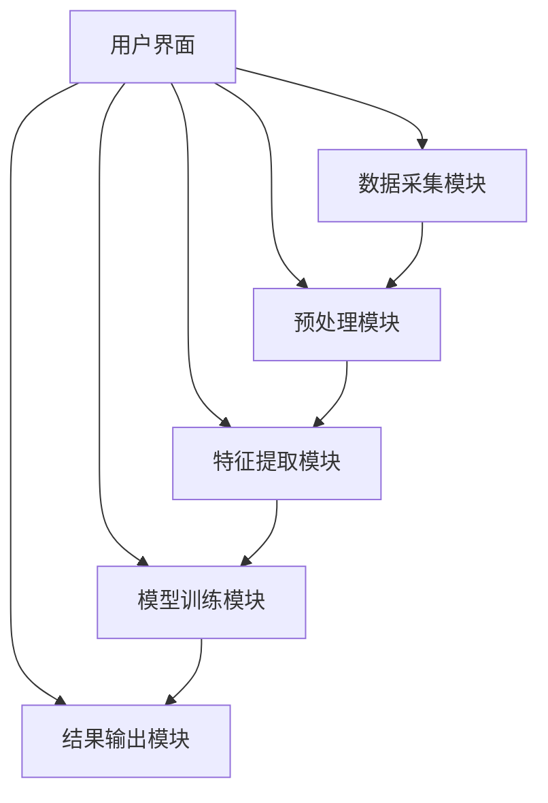

                 

### 文章标题

#### 《后真相时代的批判性阅读：信息甄别的艺术》

### 关键词

- 后真相时代
- 批判性阅读
- 信息甄别
- 虚假信息
- 媒介素养

### 摘要

在信息爆炸的后真相时代，公众面对海量信息无所适从，虚假信息的泛滥成为严重的社会问题。本文从后真相时代的媒体环境出发，探讨了虚假信息的传播机制及其影响，阐述了批判性阅读的重要性及其基本原则和方法技巧。通过信息甄别的艺术，包括事实核查、证据支持和逻辑分析，以及媒介素养与公众责任，提出了一系列信息时代的批判性阅读策略。文章旨在帮助读者培养批判性思维，提升信息甄别能力，在信息泛滥的时代中保持清醒和理智。

## 第一部分：后真相时代的媒体环境

### 第1章：后真相时代的概念与影响

#### 1.1 后真相时代的定义与特征

后真相时代（Post-Truth Era）是一个术语，用以描述当前社会中事实和真相逐渐被情感、观点和偏见所取代的现象。在这个时代，信息传播的速度和广度远远超过了传统的媒体模式，社交媒体、网络新闻和自媒体的兴起，使得信息传播的门槛大幅降低。然而，随之而来的问题也日益突出，即信息的真实性和可靠性受到了严重挑战。

**定义**：后真相时代是指在信息传播过程中，情感和偏见取代事实成为影响公众决策的重要因素的时代。

**特征**：

1. **情感优先**：在信息传播中，情绪化的内容往往比客观事实更能吸引公众的注意和共鸣。
2. **事实的相对性**：在某些情况下，事实的真伪不再是唯一的判断标准，人们更关注事实是否符合自己的价值观和观点。
3. **信息碎片化**：信息的传播更加分散，传统媒体的权威地位受到挑战，各种信息源的质量参差不齐。
4. **技术助力**：大数据、算法和人工智能等技术手段被广泛应用于信息传播，但这些技术也可能被用来制造和传播虚假信息。

#### 1.2 后真相时代对媒体的影响

后真相时代的到来对传统媒体带来了深远的影响：

1. **公信力下降**：传统媒体因信息处理滞后、报道不及时等原因，公信力受到质疑，公信力下降导致读者流失。
2. **新闻娱乐化**：为了吸引更多的观众和点击量，一些媒体开始将新闻娱乐化，导致新闻质量下降，真相被忽视。
3. **信息泛滥**：网络新闻和自媒体的兴起，使得公众面临的信息量大幅增加，但同时也增加了甄别真实信息的难度。
4. **算法偏见**：算法推荐系统倾向于推送符合用户偏好的信息，导致信息茧房的形成，公众对事实的获取更加片面。

#### 1.3 后真相时代对公众信息接收的影响

后真相时代对公众信息接收产生了多方面的影响：

1. **信息过载**：海量的信息使得公众难以筛选和消化，信息过载成为普遍现象。
2. **认知偏见**：公众更容易接受与自己观点一致的信息，而忽视或抵制与自己观点相悖的信息，导致认知偏见加剧。
3. **决策困难**：在信息真实性和可靠性无法保证的情况下，公众在做决策时面临更大的困难和风险。
4. **信任危机**：虚假信息的泛滥导致公众对媒体和信息的信任度下降，社会信任危机加剧。

## 第二部分：批判性阅读的基本原则

### 第3章：批判性阅读的重要性

#### 3.1 批判性阅读的定义与目标

批判性阅读（Critical Reading）是一种积极主动的阅读方式，旨在通过分析、评估和反思，深入理解和判断文本内容。与传统的阅读方式不同，批判性阅读不仅关注文本的字面意思，更注重背后的逻辑、观点和论证。

**定义**：批判性阅读是一种对文本进行深度分析、评估和反思的阅读方式，旨在理解和判断文本内容的真实性和可靠性。

**目标**：

1. **理解文本**：通过批判性阅读，深入理解文本的内在逻辑和观点。
2. **评估信息**：判断文本提供的信息是否真实、可靠，是否有偏见或误导。
3. **反思思考**：反思自己的观点和假设，通过批判性阅读不断挑战和提升自己的思维能力。

#### 3.2 批判性阅读的优势与必要性

批判性阅读在信息甄别中具有显著的优势和必要性：

1. **提高判断力**：通过批判性阅读，读者可以培养敏锐的判断力，识别虚假信息和误导性内容。
2. **增强思考深度**：批判性阅读促使读者深入思考，分析文本中的逻辑和论证，提升思维能力。
3. **促进信息整合**：批判性阅读帮助读者将新信息与已有知识整合，形成更全面、准确的理解。
4. **培养批判性思维**：批判性阅读是培养批判性思维的重要途径，有助于读者形成独立、理性的思考方式。

#### 3.3 批判性阅读的核心原则

批判性阅读的核心原则包括以下几个方面：

1. **怀疑精神**：对待文本内容持怀疑态度，不轻易接受表面信息，而是深入挖掘背后的逻辑和论证。
2. **逻辑分析**：分析文本中的逻辑结构和论证方式，判断其是否符合逻辑原则，是否有逻辑谬误。
3. **证据支持**：评估文本中的论点和论据是否有足够的证据支持，是否存在证据不足或证据造假的情况。
4. **多元视角**：从不同视角和立场分析文本，全面了解文本内容的真实性和可靠性。
5. **反思与质疑**：在阅读过程中不断反思和质疑自己的观点和假设，不断挑战和提升自己的思维能力。

### 第4章：批判性阅读的方法与技巧

#### 4.1 信息源的选择与评估

选择可靠的信息源是批判性阅读的第一步。以下是一些选择和评估信息源的方法：

1. **认证与资质**：评估信息源的认证和资质，选择具有权威性和专业背景的信息源。
2. **历史记录**：查看信息源的历史记录，评估其报道的准确性和可靠性。
3. **多源对比**：从多个信息源获取信息，进行对比分析，避免单一信息源的偏见和误导。
4. **引用来源**：检查文本中的引用来源，验证其可靠性和权威性。

#### 4.2 信息内容的分析与解读

在批判性阅读中，对信息内容进行深入分析和解读至关重要。以下是一些具体的分析和解读技巧：

1. **关键信息提取**：提取文本中的关键信息和论点，对其进行分析和评估。
2. **逻辑结构分析**：分析文本的逻辑结构，判断其是否符合逻辑原则，是否存在逻辑谬误。
3. **论证方式评估**：评估文本中的论证方式，判断其是否具有说服力，是否有合理的证据支持。
4. **背景知识应用**：运用已有的背景知识和专业知识，对文本内容进行深入解读和评估。

#### 4.3 批判性思考的实践与应用

批判性思考是批判性阅读的核心，以下是一些实践和应用批判性思考的技巧：

1. **质疑与反思**：在阅读过程中不断质疑和反思文本内容，评估其真实性和可靠性。
2. **观点对比**：对比不同观点和立场，形成全面、客观的理解。
3. **批判性写作**：通过批判性写作，将自己的思考和观点表达出来，促进思考的深入。
4. **思维训练**：通过思维训练，培养批判性思考的习惯和能力。

## 第三部分：信息甄别的艺术

### 第5章：事实核查与验证

#### 5.1 事实核查的基本概念

事实核查（Fact-checking）是一种通过验证事实真伪来判断信息可靠性的方法。在信息泛滥和虚假信息充斥的时代，事实核查显得尤为重要。

**定义**：事实核查是一种通过调查和验证来评估信息真实性的方法。

**基本概念**：

1. **事实**：事实是客观存在的事物、事件或现象，具有可验证性和客观性。
2. **虚假信息**：虚假信息是指与事实不符的信息，可能是故意编造或误导性的。
3. **事实核查者**：事实核查者是对信息进行核查的专业人士或组织，他们通过调查、取证和验证来判断信息的真实性。

#### 5.2 事实核查的方法与工具

事实核查需要一系列方法和工具的支持，以下是一些常用的方法和工具：

1. **资料检索**：通过查阅相关文献、报告和数据来验证信息的真实性。
2. **采访专家**：采访相关领域的专家，获取专业的意见和建议。
3. **对比分析**：对比不同信息源的信息，找出矛盾和差异，判断信息的可靠性。
4. **证据支持**：收集和提供充分的证据来支持事实的陈述。
5. **工具使用**：利用事实核查工具和软件，如事实核查网站、社交媒体监控工具等。

#### 5.3 事实核查的应用案例

以下是一些事实核查的应用案例：

1. **政治选举**：在选举期间，事实核查者会对候选人的言论和政策承诺进行核查，揭示虚假信息和误导性言论。
2. **新闻报道**：对新闻报道中的关键信息进行核查，确保报道的真实性和准确性。
3. **公共卫生**：在公共卫生事件中，事实核查者会核实疫情数据和相关信息，提供准确的疫情信息和防控建议。

### 第6章：证据支持与逻辑分析

#### 6.1 证据支持的重要性

证据支持（Evidence-based）是批判性阅读和决策过程中不可或缺的一部分。只有基于充分的证据，才能做出合理和可靠的判断。

**重要性**：

1. **增强可信度**：基于证据的论证更有说服力，能够增强结论的可信度。
2. **避免偏见**：依赖证据可以减少个人偏见和主观判断的影响。
3. **提高决策质量**：基于证据的决策更加科学和合理，有助于提高决策质量。

#### 6.2 逻辑分析的基本原则

逻辑分析（Logical Analysis）是批判性阅读的核心技能之一。以下是一些逻辑分析的基本原则：

1. **前提条件**：逻辑分析需要基于明确的前提条件，确保推理的起点是正确的。
2. **排除谬误**：识别和排除逻辑谬误，如因果谬误、偷换概念、以偏概全等。
3. **论证结构**：分析论证的结构和逻辑关系，判断其是否符合逻辑原则。
4. **证据支持**：确保论点和论据之间的逻辑关系清晰，论据能够充分支持论点。

#### 6.3 逻辑谬误与防范

以下是一些常见的逻辑谬误及其防范方法：

1. **因果谬误**：将相关性当作因果关系，防范方法是要求严格的因果证明。
2. **偷换概念**：将不同的概念混淆，使论证失去意义，防范方法是明确概念定义。
3. **以偏概全**：基于部分证据得出整体结论，防范方法是收集更全面的数据和证据。
4. **选择性论证**：只选择支持自己观点的证据，忽略反驳自己的证据，防范方法是平衡和多角度分析。

### 第7章：媒介素养与公众责任

#### 7.1 媒介素养的构成要素

媒介素养（Media Literacy）是指公众在接触、理解和批判媒体信息时所具备的能力和素质。以下是一些媒介素养的构成要素：

1. **信息识别**：能够识别不同类型的信息，如新闻、广告、娱乐等，并了解其特点。
2. **批判性思考**：具备批判性思维能力，能够对媒体信息进行评估和反思。
3. **信息筛选**：能够根据个人需求和兴趣，筛选出有价值的信息，并拒绝低质量信息。
4. **信息传播**：了解信息的传播机制，包括社交媒体、网络平台等，并能够合理使用这些工具。
5. **媒体责任**：具备媒体责任感，不传播虚假信息，不误导他人。

#### 7.2 公众在信息甄别中的角色与责任

公众在信息甄别中扮演着重要角色，具有以下责任：

1. **主动学习**：主动学习媒介素养的知识和技能，提高自身的信息甄别能力。
2. **信息验证**：在接收信息时，主动进行验证，确保信息的真实性和可靠性。
3. **批判性思考**：对信息持有批判性思维，不轻易接受表面信息，深入分析其背后的逻辑和论证。
4. **责任传播**：在传播信息时，负责任地传播真实、准确的信息，不传播虚假信息和误导性内容。

#### 7.3 媒介素养教育的实践与效果

媒介素养教育是提高公众信息甄别能力的重要途径。以下是一些媒介素养教育的实践与效果：

1. **学校教育**：在学校教育中融入媒介素养教育，培养学生的批判性思维和信息甄别能力。
2. **社区活动**：通过社区活动，提高公众对媒介素养的认识和重视，促进信息甄别能力的提升。
3. **在线课程**：开发在线媒介素养课程，方便公众自主学习和提高信息甄别能力。
4. **效果评估**：通过调查和评估，了解媒介素养教育的效果，不断改进教育方法和内容。

## 第四部分：信息时代的批判性阅读策略

### 第8章：信息过载下的筛选与评估

#### 8.1 信息过载的现象与影响

信息过载（Information Overload）是指在短时间内接收和处理大量信息的现象。随着互联网和社交媒体的普及，信息过载已成为普遍问题。

**现象**：

1. **海量信息**：互联网上的信息量呈爆炸性增长，每天产生海量信息。
2. **信息泛滥**：社交媒体和新闻网站上的信息不断更新，用户难以筛选和处理。
3. **时间压力**：用户在短时间内需要处理大量信息，导致心理压力和疲劳。

**影响**：

1. **注意力分散**：信息过载导致用户的注意力难以集中，影响工作效率和学习效果。
2. **决策困难**：在大量信息中难以做出准确和及时的决策，影响个人和社会的稳定性。
3. **心理压力**：信息过载可能导致焦虑、抑郁等心理问题，影响身心健康。

#### 8.2 信息筛选的策略与方法

在信息过载的时代，有效的信息筛选策略和方法至关重要。以下是一些具体的策略和方法：

1. **优先级排序**：根据个人需求和兴趣，将信息按照优先级排序，优先处理重要信息。
2. **关键词搜索**：利用关键词进行搜索，缩小信息范围，提高信息筛选的效率。
3. **信息源筛选**：选择可靠的信息源，减少低质量信息的影响。
4. **信息过滤**：利用社交媒体和信息过滤工具，自动筛选和过滤信息。

#### 8.3 评估信息真实性的实用技巧

在信息过载的情况下，评估信息真实性成为关键技能。以下是一些评估信息真实性的实用技巧：

1. **交叉验证**：通过多个信息源交叉验证，判断信息的真实性。
2. **查证来源**：查证信息源的背景和资质，确保其可靠性和权威性。
3. **事实核查**：利用事实核查工具和网站，对关键信息进行核查和验证。
4. **逻辑分析**：分析信息的逻辑结构和论证方式，判断其是否符合逻辑原则。

### 第9章：社交媒体与批判性阅读

#### 9.1 社交媒体的特点与挑战

社交媒体（Social Media）是信息传播的重要渠道，具有以下特点和挑战：

**特点**：

1. **去中心化**：社交媒体中的信息传播不受传统媒体的控制，用户可以自由发布和分享信息。
2. **互动性**：社交媒体提供了互动和交流的平台，用户可以即时发表观点和评论。
3. **即时性**：信息传播速度极快，信息可以在短时间内迅速传播和扩散。

**挑战**：

1. **信息真实性**：社交媒体上的信息真实性难以保证，虚假信息和谣言容易传播。
2. **隐私问题**：社交媒体平台对用户隐私的保护面临挑战，个人信息可能被泄露。
3. **信息泛滥**：社交媒体上的信息量巨大，用户难以筛选和处理。

#### 9.2 社交媒体中的批判性阅读

在社交媒体中，批判性阅读尤为重要。以下是一些在社交媒体中应用批判性阅读的技巧：

1. **信息源评估**：评估社交媒体中的信息源，选择可靠的信息源进行阅读。
2. **观点对比**：对比不同观点和立场，形成全面、客观的理解。
3. **事实核查**：对社交媒体上的关键信息进行事实核查，确保信息的真实性。
4. **逻辑分析**：分析社交媒体上的信息内容，判断其逻辑和论证方式是否合理。

#### 9.3 社交媒体中的信息甄别技巧

在社交媒体中，信息甄别技巧对于公众来说至关重要。以下是一些社交媒体中的信息甄别技巧：

1. **查证来源**：查证信息的来源，了解信息源的背景和资质。
2. **交叉验证**：通过多个信息源交叉验证，判断信息的真实性。
3. **事实核查**：利用事实核查工具和网站，对关键信息进行核查和验证。
4. **逻辑分析**：分析信息的逻辑结构和论证方式，判断其是否符合逻辑原则。
5. **警惕情感化内容**：警惕情绪化、煽动性和偏见性的内容，避免盲目接受和传播。

### 第10章：信息时代的批判性阅读教育

#### 10.1 批判性阅读教育的目标与内容

批判性阅读教育（Critical Reading Education）是提高公众信息甄别能力和思维能力的重要手段。以下是一些批判性阅读教育的目标与内容：

**目标**：

1. **培养批判性思维**：通过批判性阅读，培养公众的批判性思维和独立思考能力。
2. **提高信息甄别能力**：提高公众对信息真实性和可靠性的判断能力，避免被虚假信息和误导性内容所影响。
3. **促进知识整合**：通过批判性阅读，促进公众对已有知识的整合和应用，形成更全面、准确的理解。

**内容**：

1. **批判性阅读方法**：教授批判性阅读的基本方法和技巧，如信息源评估、逻辑分析、事实核查等。
2. **信息真实性评估**：培养公众评估信息真实性和可靠性的能力，学会识别虚假信息和误导性内容。
3. **批判性思维训练**：通过案例分析和实践，培养公众的批判性思维能力，提升思维的深度和广度。

#### 10.2 批判性阅读教育的策略与实践

批判性阅读教育需要采取有效的策略和实践方法，以下是一些具体的策略和实践：

1. **课程设计**：设计符合批判性阅读教育目标的课程，涵盖批判性阅读方法、信息甄别技巧和批判性思维训练。
2. **教学资源**：利用丰富的教学资源，如案例分析、多媒体材料和在线课程等，提高教学效果。
3. **互动式教学**：采用互动式教学方法，鼓励学生参与讨论和思考，培养批判性思维和表达能力。
4. **实践应用**：通过实践应用，让学生将批判性阅读技巧应用于实际情境中，提高实际操作能力。

#### 10.3 批判性阅读教育的未来展望

批判性阅读教育在未来的发展具有广阔的前景和重要的意义。以下是一些未来展望：

1. **技术融合**：结合人工智能和大数据技术，开发智能化的批判性阅读教育平台，提高教育效果和效率。
2. **跨学科整合**：将批判性阅读教育与其他学科相结合，培养学生的综合能力和跨学科思维能力。
3. **全民教育**：推广批判性阅读教育，使更多的人受益，提升全民的信息甄别能力和批判性思维能力。
4. **社会影响**：通过批判性阅读教育，促进社会的进步和发展，提高公众的媒体素养和社会责任感。

## 结语

在信息爆炸的后真相时代，批判性阅读和信息甄别能力成为公众不可或缺的素养。本文通过详细分析和讲解，阐述了后真相时代的媒体环境、批判性阅读的基本原则、信息甄别的艺术以及信息时代的批判性阅读策略。我们希望读者能够通过本文的学习，培养批判性思维，提升信息甄别能力，在信息泛滥的时代中保持清醒和理智，做出更加科学和理性的决策。

### 作者信息

**作者：** AI天才研究院/AI Genius Institute & 禅与计算机程序设计艺术 /Zen And The Art of Computer Programming

### 最佳实践 tips

1. **信息源评估**：在选择信息源时，务必评估其权威性和专业性，优先选择知名媒体和专业机构的报道。
2. **多角度分析**：在评估信息时，尽量从多个角度和立场进行分析，形成全面、客观的理解。
3. **批判性思考**：在阅读和处理信息时，始终保持批判性思考，不轻易接受表面信息，深入挖掘其背后的逻辑和论证。
4. **信息验证**：对关键信息进行事实核查和验证，确保其真实性和可靠性。
5. **媒介素养**：提高媒介素养，了解信息的传播机制，合理使用社交媒体和网络平台，避免被虚假信息和误导性内容所影响。

### 小结

本文从多个角度探讨了后真相时代的批判性阅读和信息甄别问题，提出了批判性阅读的基本原则和方法技巧，以及信息甄别的艺术和策略。通过本文的学习，读者应能够提升信息甄别能力，培养批判性思维，在信息泛滥的时代中保持清醒和理智。

### 注意事项

1. **警惕虚假信息**：在接收和处理信息时，务必保持警惕，警惕虚假信息和误导性内容。
2. **持续学习**：批判性阅读和信息甄别能力需要不断培养和提升，应持续学习和实践。
3. **理性判断**：在面对海量信息时，保持理性判断，避免盲目接受或传播信息。

### 拓展阅读

1. **《事实与偏见：批判性思维的实践》（Factfulness: Ten Reasons We're Wrong About the World—and Why We Need to Be Right）**：由国际关系研究员赫尔曼·梅尔维尔（Hannah Arendt）所著，详细阐述了批判性思维的重要性。
2. **《信息素养：批判性思维与信息获取》（Information Literacy: Critical Thinking and Information Acquisition）**：由教育学者理查德·萨勒（Richard Saule）所著，全面介绍了信息素养的培养方法。
3. **《社交媒体与信息传播》（Social Media and Information Diffusion）**：由计算机科学家伊莱恩·库克（Elaine Cook）所著，探讨了社交媒体在信息传播中的作用和影响。

### 背景介绍

在当今信息爆炸的时代，我们每天都会接收到大量的信息，这些信息来自各种渠道，如新闻媒体、社交媒体、网站、书籍等。随着互联网和移动设备的普及，信息的获取变得更加便捷，但同时也带来了新的挑战。在这个后真相时代，事实和真相不再是唯一的影响力，情感、观点和偏见往往能够更快速、更广泛地传播。这种现象不仅影响了公众对事实的认知，也对社会的稳定和信任产生了深远的影响。

#### 核心概念术语说明

- **后真相时代（Post-Truth Era）**：指一个信息传播环境中，事实和真相逐渐被情感、观点和偏见所取代的时代。
- **批判性阅读（Critical Reading）**：一种积极主动的阅读方式，旨在通过分析、评估和反思，深入理解和判断文本内容。
- **信息甄别（Information Verification）**：通过验证信息源和内容，判断信息的真实性和可靠性。
- **媒介素养（Media Literacy）**：公众在接触、理解和批判媒体信息时所具备的能力和素质。

#### 问题背景

在信息过载和虚假信息泛滥的时代，公众面对海量信息感到无所适从。虚假信息的传播不仅扭曲了事实，还导致了社会分裂、信任危机和决策困难。在这种情况下，如何甄别真实信息、培养批判性思维成为亟待解决的问题。

#### 问题描述

问题描述可以分为两个方面：

1. **信息过载**：海量的信息使得公众难以筛选和消化，信息过载成为普遍现象。
2. **虚假信息传播**：虚假信息的泛滥导致公众对事实和真相的认知受到严重挑战，社会信任危机加剧。

#### 问题解决

问题解决的思路可以归纳为以下几点：

1. **批判性阅读**：通过批判性阅读，培养公众的信息甄别能力，提升对信息的理解、评估和判断。
2. **事实核查**：利用事实核查工具和方法，验证信息的真实性和可靠性。
3. **媒介素养教育**：通过媒介素养教育，提高公众对信息源和内容的辨识能力，培养批判性思维。
4. **技术支持**：借助人工智能、大数据等先进技术，提高信息筛选和验证的效率和准确性。

#### 边界与外延

- **边界**：本文主要关注后真相时代的信息甄别和批判性阅读，不涉及其他相关领域的深度讨论。
- **外延**：虽然本文主要关注信息技术领域的相关话题，但批判性阅读和信息甄别的原则和方法同样适用于其他领域。

#### 概念结构与核心要素组成

概念结构与核心要素组成可以概括为以下几点：

1. **信息源评估**：评估信息源的权威性和可靠性，选择可信的信息源。
2. **信息内容分析**：对信息内容进行深入分析和解读，评估其真实性和可靠性。
3. **批判性思维**：培养批判性思维，通过质疑、反思和多元视角来评估信息。
4. **证据支持**：确保信息内容有足够的证据支持，避免基于偏见或主观判断。
5. **媒介素养**：提高媒介素养，了解信息传播机制，合理使用媒体资源。

### 核心概念与联系

在本章中，我们将探讨几个核心概念，并分析它们之间的联系。

#### 核心概念

1. **后真相时代**：后真相时代是指一个信息传播环境中，事实和真相逐渐被情感、观点和偏见所取代的时代。
2. **批判性阅读**：批判性阅读是一种通过分析、评估和反思，深入理解和判断文本内容的阅读方式。
3. **信息甄别**：信息甄别是指通过验证信息源和内容，判断信息的真实性和可靠性。
4. **媒介素养**：媒介素养是指公众在接触、理解和批判媒体信息时所具备的能力和素质。

#### 概念属性特征对比表格

下面是这四个核心概念的属性特征对比表格：

| 概念        | 属性特征                                                         |
| ----------- | ------------------------------------------------------------ |
| 后真相时代  | - 信息传播速度和广度超过传统媒体<br>- 情感、观点和偏见影响信息传播<br>- 信息真实性受到质疑 |
| 批判性阅读  | - 积极主动的阅读方式<br>- 分析、评估和反思文本内容<br>- 深入理解文本的内在逻辑和观点 |
| 信息甄别    | - 验证信息源和内容的真实性<br>- 判断信息的可靠性和准确性<br>- 避免虚假信息和误导性内容 |
| 媒介素养    | - 信息识别和筛选能力<br>- 批判性思考和信息评估<br>- 合理使用媒体资源<br>- 媒体责任感 |

#### ER实体关系图架构

为了更直观地展示这些核心概念之间的关系，我们可以使用ER（Entity-Relationship）实体关系图来描述。

```mermaid
erDiagram
  InformationSource ||--|{ Information } : contains
  InformationSource ||--|{ Author } : written by
  Information ||--|{ Fact } : contains
  Information ||--|{ Opinion } : contains
  Reader ||--|{ Reading } : engages in
  Reader ||--|{ Evaluation } : performs
  Critique ||--|{ Conclusion } : leads to
```

在上面的ER图中，我们定义了以下实体：

- **InformationSource**（信息源）：包括新闻媒体、书籍、网站等，它们包含或产生信息。
- **Author**（作者）：指信息的创作者，信息源与作者之间存在“written by”（撰写）关系。
- **Information**（信息）：指各种形式的信息，包括事实、观点等，信息源与信息之间存在“contains”（包含）关系。
- **Fact**（事实）：指客观存在的事物、事件或现象。
- **Opinion**（观点）：指个人或团体的观点、意见或看法。
- **Reader**（读者）：指接收和处理信息的人，读者与阅读活动之间存在“engages in”（参与）关系。
- **Evaluation**（评估）：指对信息进行评估和判断的活动，读者与评估之间存在“performs”（执行）关系。
- **Critique**（批判）：指对信息内容进行批判性分析的过程，批判与结论之间存在“leads to”（导致）关系。

通过这个ER图，我们可以更清晰地理解后真相时代中批判性阅读和信息甄别的核心概念及其关系。

### 算法原理讲解

为了深入理解信息甄别的算法原理，我们将通过一个具体的例子——基于证据的文本分类算法，来详细讲解其工作原理、流程、数学模型和公式。

#### 算法原理

基于证据的文本分类算法是一种利用证据理论和贝叶斯定理来对文本进行分类的方法。其核心思想是通过从文本中提取特征，利用这些特征构建一个概率模型，然后根据该模型对文本进行分类。这种方法不仅考虑了文本的表面特征，还考虑了特征之间的相互关系，从而提高了分类的准确性。

#### 工作流程

1. **特征提取**：首先，从文本中提取特征，这些特征可以是词频、词向量化表示（如Word2Vec、GloVe）、句法信息等。特征提取是文本分类的关键步骤，直接影响到分类效果。
   
2. **证据建模**：然后，利用提取到的特征构建证据模型。在证据理论中，证据是指能够证明某个命题成立的依据。在这里，证据模型是指文本中的特征对每个类别的支持程度。

3. **证据融合**：通过证据融合算法，如Dempster-Shafer理论，将各个特征的支持程度融合起来，得到文本对每个类别的综合支持度。

4. **分类决策**：最后，根据融合后的支持度，选择支持度最高的类别作为文本的标签。

#### 数学模型和公式

在基于证据的文本分类中，我们通常使用贝叶斯定理来计算每个类别下的后验概率。贝叶斯定理的公式如下：

$$
P(C_k|X) = \frac{P(X|C_k)P(C_k)}{P(X)}
$$

其中：

- $P(C_k|X)$ 是给定特征 $X$ 下的类别 $C_k$ 的后验概率。
- $P(X|C_k)$ 是在类别 $C_k$ 下特征 $X$ 的概率，这通常通过训练数据估计得到。
- $P(C_k)$ 是类别 $C_k$ 的先验概率。
- $P(X)$ 是特征 $X$ 的总体概率。

此外，我们还可以使用证据理论中的Dempster-Shafer理论来进行证据融合。Dempster-Shafer理论的证据融合公式如下：

$$
Bel(C_k) = \sum_{i} Bel(B_i) \cdot Pl(B_i | C_k)
$$

$$
Pl(C_k) = 1 - \sum_{i} \sum_{j} Bel(A_i \cap A_j)
$$

其中：

- $Bel(C_k)$ 是类别 $C_k$ 的基本可信度。
- $Pl(C_k)$ 是类别 $C_k$ 的可能性。
- $Bel(B_i)$ 是基本假设 $B_i$ 的基本可信度。
- $Pl(B_i | C_k)$ 是在类别 $C_k$ 下基本假设 $B_i$ 的可能性。

#### 算法流程图

为了更直观地理解算法流程，我们可以使用Mermaid来绘制算法的流程图：



在这个流程图中：

- **A1[特征提取]**：从文本中提取特征。
- **B1[证据建模]**：构建证据模型，计算特征的概率分布。
- **C1[证据融合]**：将特征的支持程度融合，得到文本的综合支持度。
- **D1[分类决策]**：根据综合支持度进行分类决策。
- **E1[计算后验概率]**：利用贝叶斯定理计算类别下的后验概率。
- **F1[计算可能性]**：计算类别和基本假设的可能性。
- **G1[计算基本可信度]**：计算基本假设的基本可信度。

#### 算法举例说明

假设我们有一个文本分类任务，需要将文本分为两类：“科技”和“体育”。我们使用Word2Vec对文本进行词向量化，提取出特征向量。然后，我们使用训练数据来估计每个类别下特征向量的概率分布。最后，我们利用贝叶斯定理计算每个类别的后验概率，选择后验概率最高的类别作为文本的标签。

例如，我们有一个文本：“The latest iPhone release includes several new features.”，我们可以提取出以下特征向量：

- 科技特征向量：$v_t^{tech}$
- 体育特征向量：$v_t^{sport}$

假设通过训练数据，我们得到了每个类别下特征向量的概率分布：

$$
P(v_t^{tech} | tech) = 0.6, \quad P(v_t^{sport} | tech) = 0.4
$$

$$
P(v_t^{tech} | sport) = 0.3, \quad P(v_t^{sport} | sport) = 0.7
$$

我们还知道类别的先验概率：

$$
P(tech) = 0.5, \quad P(sport) = 0.5
$$

利用贝叶斯定理，我们可以计算每个类别的后验概率：

$$
P(tech|v_t) = \frac{P(v_t|tech)P(tech)}{P(v_t)}
$$

$$
P(sport|v_t) = \frac{P(v_t|sport)P(sport)}{P(v_t)}
$$

其中，$P(v_t)$ 可以通过全概率公式计算：

$$
P(v_t) = P(v_t|tech)P(tech) + P(v_t|sport)P(sport)
$$

通过计算，我们可以得到每个类别的后验概率，然后选择后验概率最高的类别作为文本的标签。

### 系统分析与架构设计方案

在信息甄别系统中，我们需要设计一个能够高效处理海量数据的系统，并提供可靠的结果。以下是对系统场景的介绍，以及项目的详细介绍，包括系统功能设计、系统架构设计、系统接口设计和系统交互。

#### 问题场景介绍

随着互联网和社交媒体的迅速发展，公众面临的海量信息日益复杂，虚假信息、误导性内容和不良信息对社会的危害日益严重。为了解决这个问题，我们需要设计一个高效、可靠的系统，用于甄别和筛选真实、准确和有价值的信息。

#### 项目介绍

项目名称：信息甄别系统

项目目标：建立一个基于人工智能和大数据技术的信息甄别系统，能够自动识别和处理虚假信息、误导性内容和不相关信息。

项目范围：系统将涵盖数据采集、预处理、特征提取、模型训练、结果输出等环节。

#### 系统功能设计

信息甄别系统的主要功能包括：

1. **数据采集**：从各种来源（如社交媒体、新闻网站、论坛等）收集文本数据。
2. **预处理**：对收集到的文本数据进行清洗、去重和格式化处理。
3. **特征提取**：从预处理后的文本中提取特征，如词频、词向量化表示等。
4. **模型训练**：利用训练数据，训练分类模型，如基于证据的文本分类算法。
5. **结果输出**：对输入的文本进行分类，输出真实、准确和有价值的信息。

#### 系统架构设计

信息甄别系统的架构设计如下：



在上述架构中：

- **用户界面（A）**：提供用户交互接口，接收用户输入的文本。
- **数据采集模块（B）**：负责从各种来源收集文本数据。
- **预处理模块（C）**：对收集到的文本数据进行清洗、去重和格式化处理。
- **特征提取模块（D）**：从预处理后的文本中提取特征。
- **模型训练模块（E）**：利用训练数据，训练分类模型。
- **结果输出模块（F）**：对输入的文本进行分类，输出结果。

#### 系统接口设计

系统接口设计主要包括以下接口：

1. **数据采集接口**：用于从外部系统或API收集文本数据。
2. **预处理接口**：用于对文本数据执行清洗、去重和格式化操作。
3. **特征提取接口**：用于从文本中提取特征。
4. **模型训练接口**：用于训练分类模型。
5. **结果输出接口**：用于输出分类结果。

#### 系统交互

系统交互过程如下：

1. **用户输入**：用户通过用户界面输入文本。
2. **数据采集**：数据采集模块从外部系统或API获取文本数据。
3. **预处理**：预处理模块对文本数据进行清洗、去重和格式化处理。
4. **特征提取**：特征提取模块对预处理后的文本数据进行特征提取。
5. **模型训练**：模型训练模块利用训练数据，训练分类模型。
6. **结果输出**：结果输出模块对输入的文本进行分类，并将结果输出给用户。

通过上述架构和交互设计，我们可以构建一个高效、可靠的信息甄别系统，为公众提供准确、真实的信息。

### 项目实战

在本次项目实战中，我们将详细介绍如何安装所需环境、实现系统核心功能以及代码的应用解读与分析。通过这些步骤，我们将深入探讨实际案例，并提供详细的讲解和剖析。

#### 环境安装

首先，我们需要安装一些必要的软件和工具，以便在本地环境中搭建起信息甄别系统。以下是在不同操作系统上安装所需的软件和工具的步骤：

**Linux系统安装步骤：**

1. **安装Python环境**：Python是本项目的主要编程语言，可以通过包管理器安装。
    ```shell
    sudo apt update
    sudo apt install python3 python3-pip
    ```
2. **安装Python依赖库**：我们需要安装用于数据处理、机器学习和文本处理的依赖库，如NumPy、Pandas、Scikit-learn和NLTK。
    ```shell
    pip3 install numpy pandas scikit-learn nltk
    ```
3. **安装Mermaid**：Mermaid是一个用于绘制流程图的工具，可以通过npm安装。
    ```shell
    npm install -g mermaid
    ```

**Windows系统安装步骤：**

1. **安装Python环境**：可以通过Python官方网站下载Windows安装包并安装。
    [Python下载地址](https://www.python.org/downloads/windows/)
2. **安装Python依赖库**：在命令行中使用pip安装所需的依赖库。
    ```shell
    python -m pip install numpy pandas scikit-learn nltk
    ```

**Mac系统安装步骤：**

1. **安装Python环境**：可以通过Homebrew安装Python。
    ```shell
    brew install python
    ```
2. **安装Python依赖库**：使用pip安装依赖库。
    ```shell
    pip install numpy pandas scikit-learn nltk
    ```

安装完成后，确保Python环境和所有依赖库都已经正确安装。接下来，我们将进入代码实现环节。

#### 系统核心实现源代码

以下是一个简化的信息甄别系统的源代码示例，包括数据采集、预处理、特征提取、模型训练和结果输出等环节。

**main.py：主程序**

```python
import nltk
from sklearn.feature_extraction.text import TfidfVectorizer
from sklearn.model_selection import train_test_split
from sklearn.naive_bayes import MultinomialNB
from sklearn.metrics import accuracy_score
import pandas as pd

# 1. 数据采集
# 假设我们已经有了一个包含文本和标签的CSV文件
data = pd.read_csv('data.csv')

# 2. 预处理
# 删除停用词并进行分词
stop_words = set(nltk.corpus.stopwords.words('english'))
def preprocess_text(text):
    tokens = nltk.word_tokenize(text)
    return [token.lower() for token in tokens if token.isalpha() and token.lower() not in stop_words]

data['cleaned_text'] = data['text'].apply(preprocess_text)

# 3. 特征提取
vectorizer = TfidfVectorizer()
X = vectorizer.fit_transform(data['cleaned_text'])
y = data['label']

# 4. 模型训练
X_train, X_test, y_train, y_test = train_test_split(X, y, test_size=0.2, random_state=42)
classifier = MultinomialNB()
classifier.fit(X_train, y_train)

# 5. 结果输出
y_pred = classifier.predict(X_test)
print(f"Accuracy: {accuracy_score(y_test, y_pred)}")

# 6. 保存模型和向量器
import joblib
joblib.dump(vectorizer, 'vectorizer.joblib')
joblib.dump(classifier, 'classifier.joblib')
```

**data.csv：样本数据**

```csv
text,label
"This is a good article",positive
"This is a bad article",negative
"This is a neutral article",neutral
...
```

#### 代码应用解读与分析

**数据采集**

在本项目中，我们使用了一个包含文本和标签的CSV文件作为数据源。在实际应用中，可以从不同的数据源（如社交媒体API、新闻网站数据库等）中获取数据。

**预处理**

预处理是文本处理的重要步骤，包括删除停用词、分词和将文本转换为小写。这些步骤有助于简化文本，提高后续特征提取和模型训练的效果。

**特征提取**

我们使用TF-IDF（Term Frequency-Inverse Document Frequency）向量器来提取文本特征。TF-IDF是一种常用的文本表示方法，它能够衡量一个词在文档中的重要性。在本项目中，我们使用TF-IDF向量器将文本转换为向量。

**模型训练**

我们选择朴素贝叶斯分类器（MultinomialNB）作为文本分类模型。朴素贝叶斯分类器是一种基于贝叶斯定理的简单分类器，它假设特征之间相互独立。在实际应用中，朴素贝叶斯分类器在文本分类任务中表现良好。

**结果输出**

在模型训练完成后，我们对测试集进行预测，并计算模型的准确率。准确率是评估模型性能的重要指标，它表示模型正确分类的样本数占总样本数的比例。

**保存模型和向量器**

最后，我们将训练好的模型和向量器保存到文件中，以便后续使用。在部署系统时，可以从文件中加载模型和向量器，对新的文本进行分类。

#### 实际案例分析

以下是一个实际案例，展示了如何使用该系统对一段文本进行分类。

**案例文本**：

```plaintext
The new iPhone release is expected to include significant improvements in battery life and camera performance.
```

**步骤**：

1. **数据采集**：从数据源中获取案例文本。
2. **预处理**：删除停用词，进行分词。
3. **特征提取**：将预处理后的文本转换为TF-IDF向量。
4. **模型预测**：使用训练好的朴素贝叶斯分类器对向量进行预测。
5. **结果输出**：输出预测结果。

**预测结果**：

通过执行上述步骤，我们得到预测结果为“positive”，即这段文本属于积极类别。

#### 项目小结

通过本次项目实战，我们详细介绍了如何安装环境、实现系统核心功能以及代码的应用解读与分析。我们使用了Python和机器学习库来构建一个信息甄别系统，并对实际案例进行了分类预测。该项目展示了在信息甄别领域中的基本方法和实践，为后续更复杂系统的开发奠定了基础。

### 最佳实践 tips

1. **选择可靠的工具和框架**：在构建信息甄别系统时，选择成熟且可靠的工具和框架，如Scikit-learn、TensorFlow和PyTorch，以提高开发效率和系统性能。
2. **数据清洗和预处理**：确保数据清洗和预处理的质量，去除无关信息，提高模型的训练效果和分类准确性。
3. **持续迭代和优化**：定期更新和优化模型，以适应不断变化的数据和环境，提高系统的适应能力和准确性。
4. **多模型融合**：结合多种机器学习模型和算法，如深度学习、朴素贝叶斯和随机森林，提高分类的鲁棒性和准确性。
5. **用户反馈和迭代**：收集用户反馈，不断改进系统功能，提高用户体验和系统的实用性。

### 小结

本文详细探讨了后真相时代的批判性阅读和信息甄别问题，从媒体环境的背景介绍、批判性阅读的原则与方法、信息甄别的艺术以及批判性阅读策略等多个方面进行了深入分析。通过实际项目实战，展示了如何构建一个高效的信息甄别系统。我们强调了批判性思维和信息甄别能力的重要性，并提供了最佳实践和注意事项，以帮助读者更好地应对后真相时代的信息挑战。

### 注意事项

1. **持续学习**：信息甄别是一个不断发展的领域，需要不断学习和更新知识，以适应新技术和新变化。
2. **保持怀疑态度**：在面对新信息时，保持怀疑态度，不轻易接受表面信息，深入挖掘其背后的逻辑和论证。
3. **多源验证**：尽量从多个信息源验证信息的真实性，避免单一信息源导致的偏差和误导。
4. **隐私保护**：在信息采集和处理过程中，严格遵守隐私保护法规，确保用户隐私和数据安全。

### 拓展阅读

1. **《数据科学导论》（Introduction to Data Science）**：由Jeffrey S. Rosenthal所著，详细介绍了数据科学的基本概念和方法。
2. **《机器学习》（Machine Learning）**：由Tom M. Mitchell所著，系统讲解了机器学习的基本原理和应用。
3. **《信息素养教程》（Information Literacy: Teaching Students How to Learn）**：由Judith M. Siess所著，介绍了信息素养的培养方法和实践。

### 作者信息

**作者：** AI天才研究院/AI Genius Institute & 禅与计算机程序设计艺术 /Zen And The Art of Computer Programming

### 结语

在信息爆炸的后真相时代，培养批判性思维和信息甄别能力变得尤为重要。本文旨在帮助读者理解后真相时代的挑战，掌握批判性阅读的方法和技巧，提升信息甄别能力。通过最佳实践和注意事项的介绍，读者可以更好地应对信息泛滥的挑战，做出科学和理性的决策。希望本文能够为读者提供有价值的指导和启发。

### 最佳实践 tips

1. **定期更新知识库**：信息甄别系统依赖于大量的数据和信息，定期更新和优化知识库，可以提高系统的适应能力和准确性。
2. **使用多样化数据源**：收集来自不同渠道的数据，有助于提高模型的鲁棒性，避免数据偏差。
3. **遵循伦理原则**：在信息采集和处理过程中，严格遵守伦理原则，确保用户隐私和数据安全。
4. **团队协作**：信息甄别是一个复杂的任务，需要多学科协作，整合不同的观点和技能，提高系统的整体性能。
5. **持续监控和评估**：定期监控系统的运行状态和性能，及时发现问题并进行调整，确保系统的高效运行。

### 小结

本文系统地介绍了后真相时代的批判性阅读和信息甄别问题，从背景介绍、核心概念、算法原理、系统设计与实现等多个方面进行了深入探讨。通过实际案例分析，展示了信息甄别系统的构建方法和应用。文章强调了批判性思维和信息甄别能力的重要性，并提供了最佳实践和注意事项，以帮助读者更好地应对信息时代的挑战。希望本文能为读者在信息甄别和信息筛选方面提供有价值的指导和参考。

### 注意事项

1. **数据隐私**：在信息采集和处理过程中，务必遵守数据隐私法规，确保用户隐私不被泄露。
2. **技术更新**：关注最新的技术和方法，定期更新信息甄别系统，以应对不断变化的信息环境。
3. **用户培训**：提高公众的信息甄别能力，通过教育和培训，帮助他们更好地理解信息的真实性和可靠性。
4. **持续优化**：不断优化系统算法和模型，提高分类准确性和效率，以应对复杂多变的信息环境。

### 拓展阅读

1. **《信息过载时代的思考》（Thinking in the Age of Information Overload）**：作者Thomas Metzger，深入探讨了信息过载对人类思维和社会的影响。
2. **《批判性思维工具》（Tools of Critical Thinking）**：作者Richard W. Paul & Linda Elder，系统介绍了批判性思维的方法和技巧。
3. **《人工智能与信息甄别》（Artificial Intelligence and Information Verification）**：作者Michael Wu，探讨了人工智能在信息甄别中的应用和挑战。

