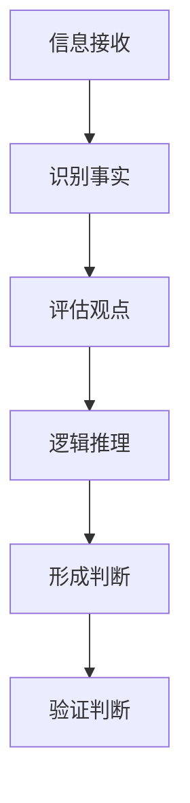
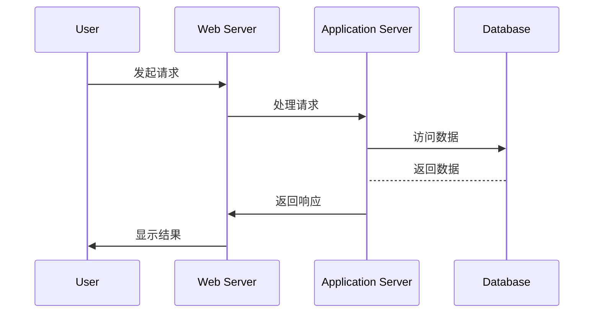
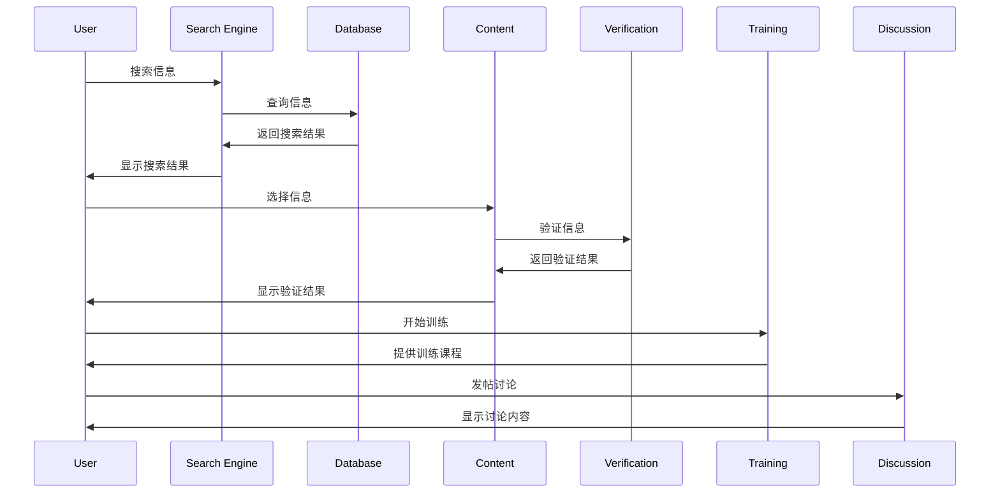

                 

### 文章标题

《后真相时代的真理追寻：批判性思维复兴》

关键词：后真相时代、批判性思维、真理追寻、信息真伪判断、社交媒体、信息传播、独立判断能力

摘要：随着社交媒体和信息传播方式的变革，我们逐渐进入“后真相时代”。在这个时代，信息的真伪变得难以辨识，人们对真相的追求变得更加迫切。本文旨在探讨后真相时代的背景和挑战，解析批判性思维的核心概念和作用，并通过实例分析，展示如何通过批判性思维的复兴，提高我们对信息的判断力和决策能力。本文旨在帮助读者理解在信息泛滥的时代，如何通过科学的思维方法和工具，追寻真理，提升个人和集体的认知水平。

### 背景介绍

#### 书名与核心主题

《后真相时代的真理追寻：批判性思维复兴》是一本探讨现代社会信息环境和认知挑战的著作。书名中的“后真相时代”一词，是对当前信息传播特点的一种描述。在后真相时代，信息不再是简单的真实或虚假，而是充满了情感、观点和观点的混合。在这个时代，真相常常被淹没在纷繁复杂的舆论中，人们需要更高级的认知工具和方法来分辨信息的真伪。

本书的核心主题是“批判性思维的复兴”。批判性思维是一种对信息进行深入分析、评估和推理的能力，它不仅仅是对信息的接受和消化，更是一种主动的、创造性的认知过程。在信息爆炸的时代，批判性思维的重要性日益凸显，它帮助我们识别信息的真实性和价值，提高判断力和决策能力。

#### 问题背景

后真相时代的到来，源于社交媒体的兴起和信息传播方式的变革。在传统的信息传播模式中，信息的传递是线性的，通常从权威机构或媒体流向公众。然而，随着互联网和社交媒体的发展，信息传播变得更加分散和去中心化。每个人都可以成为信息的发布者和传播者，信息的真实性和可靠性变得难以保障。

这种变化带来了诸多挑战。首先，信息的真实性被质疑。社交媒体上的虚假信息、谣言和误导性信息层出不穷，导致公众对信息的信任度下降。其次，情感和观点在信息传播中占据了重要地位，真相常常被情感和观点所掩盖。在这种情况下，人们需要更高级的思维方式来识别和追求真相。

#### 问题解决

面对后真相时代的挑战，批判性思维的复兴显得尤为重要。批判性思维提供了一种系统性的方法，帮助我们在复杂的信息环境中进行思考和分析。通过批判性思维，我们可以：

1. **识别信息的真实性和价值**：批判性思维让我们能够对信息进行深入分析，区分事实和观点，识别信息的真实性和价值。

2. **提高判断力和决策能力**：批判性思维培养我们的独立判断能力，使我们能够基于理性分析做出更明智的决策。

3. **培养理性的认知态度**：批判性思维促使我们保持开放和质疑的态度，不轻易接受未经证实的信息，从而提高我们的认知水平。

本书旨在通过详细阐述批判性思维的概念、原理和应用，帮助读者在信息泛滥的时代中，培养批判性思维能力，提升对信息的理解和判断能力，从而更好地应对后真相时代的挑战。

### 核心概念与联系

在探讨后真相时代的真理追寻之前，有必要深入理解几个核心概念：后真相时代、批判性思维和真理追寻。这些概念不仅是本书讨论的主题，也是我们应对信息泛滥、追求真实的重要工具。

#### 后真相时代

后真相时代（Post-truth Era）是指信息传播中事实与情感、观点的混合，真相难以辨识的社会现象。这个概念最早由英国政治学者迈克尔·特鲁多（Michael Keane）在2016年提出，用以描述信息传播方式的变化。在后真相时代，情感和观点在信息传播中占据了重要地位，甚至有时会超越事实本身。社交媒体和互联网的兴起，使得信息传播变得更加迅速和广泛，但也使得虚假信息、谣言和误导性信息得以迅速扩散。

**概念属性特征对比表格**：

| 概念           | 定义                                                         | 特征对比            |
|--------------|------------------------------------------------------------|-----------------|
| 后真相时代       | 信息传播中事实与情感、观点的混合，真相难以辨识                     | 强调事实、情感、观点的平衡 |
| 批判性思维       | 通过分析、评估、推理等过程，对信息进行深入思考，形成独立的判断能力   | 理性、客观、独立性       |
| 真理追寻         | 探索和追求真实、准确的知识或信息                                       | 严谨、求实、探究性       |

从上表可以看出，后真相时代强调信息传播中的复杂性和多样性，批判性思维则注重理性分析和独立判断，而真理追寻则是追求真实和准确的过程。

**ER实体关系图架构**：

```mermaid
erDiagram
A[真理追寻] ||--|{ B[批判性思维] }
A ||--|{ C[后真相时代] }
```

在这个ER图中，真理追寻与批判性思维和后真相时代相互联系，形成了紧密的关系。真理追寻需要依靠批判性思维来分析和评估信息，而后真相时代则为批判性思维的应用提供了广阔的背景。

#### 批判性思维

批判性思维（Critical Thinking）是一种通过分析、评估、推理等过程，对信息进行深入思考，形成独立判断的能力。它不仅仅是简单地接受或拒绝信息，而是一个主动的、创造性的认知过程。批判性思维的核心在于理性、客观和独立性。

**特征对比表格**：

| 概念           | 定义                                                         | 特征对比            |
|--------------|------------------------------------------------------------|-----------------|
| 后真相时代       | 信息传播中事实与情感、观点的混合，真相难以辨识                     | 强调事实、情感、观点的平衡 |
| 批判性思维       | 通过分析、评估、推理等过程，对信息进行深入思考，形成独立的判断能力   | 理性、客观、独立性       |
| 真理追寻         | 探索和追求真实、准确的知识或信息                                       | 严谨、求实、探究性       |

批判性思维的特征是理性、客观和独立性。它要求我们在面对信息时，不轻易接受，而是通过逻辑分析和证据评估，形成独立的判断。

**ER实体关系图架构**：

```mermaid
erDiagram
A[真理追寻] ||--|{ B[批判性思维] }
A ||--|{ C[后真相时代] }
```

在这个ER图中，批判性思维是真理追寻的工具，而后真相时代则为批判性思维提供了应用场景。

#### 真理追寻

真理追寻（Search for Truth）是指探索和追求真实、准确的知识或信息的过程。它是一种追求知识、理解和真相的内在驱动力。在信息爆炸的时代，真理追寻变得更加困难，但也是必不可少的。

**特征对比表格**：

| 概念           | 定义                                                         | 特征对比            |
|--------------|------------------------------------------------------------|-----------------|
| 后真相时代       | 信息传播中事实与情感、观点的混合，真相难以辨识                     | 强调事实、情感、观点的平衡 |
| 批判性思维       | 通过分析、评估、推理等过程，对信息进行深入思考，形成独立的判断能力   | 理性、客观、独立性       |
| 真理追寻         | 探索和追求真实、准确的知识或信息                                       | 严谨、求实、探究性       |

真理追寻的特征是严谨、求实和探究性。它要求我们在面对信息时，保持怀疑和探究的态度，不满足于表面的真相，而要深入挖掘，追求真实。

**ER实体关系图架构**：

```mermaid
erDiagram
A[真理追寻] ||--|{ B[批判性思维] }
A ||--|{ C[后真相时代] }
```

在这个ER图中，真理追寻是批判性思维的目标，而后真相时代则为真理追寻提供了挑战和背景。

通过以上对后真相时代、批判性思维和真理追寻的详细解析，我们可以更清晰地理解这三个概念之间的关系和作用。在信息泛滥的时代，批判性思维的复兴显得尤为重要，它帮助我们在复杂的信息环境中，追求真理，提升判断力和决策能力。

### 算法原理讲解

在探讨批判性思维的过程中，我们需要理解它背后的基本原理和方法。批判性思维不仅仅是一种直觉性的思考，而是一种可以通过系统化的方法和工具来实现的认知过程。以下，我们将通过Mermaid流程图和Python源代码，详细阐述批判性思维的核心步骤和算法原理。

#### 批判性思维的流程

为了更好地理解批判性思维，我们可以将其流程可视化。以下是批判性思维的基本步骤，通过Mermaid流程图展示：



**步骤解释**：

1. **信息接收**：这是批判性思维的起点，即接收信息的过程。在这个阶段，我们需要收集和处理各种信息来源，包括社交媒体、新闻媒体、个人经验等。

2. **识别事实**：在接收信息后，我们需要识别出信息中的事实。事实是客观存在的描述，不受个人情感或观点的影响。识别事实是批判性思维的基础，因为只有了解事实，我们才能进行后续的分析和推理。

3. **评估观点**：在识别出事实之后，我们需要评估信息中的观点。观点是个人对事实的主观解释和看法，可能带有偏见或情感色彩。评估观点的目的是判断其合理性和可信度。

4. **逻辑推理**：逻辑推理是将事实和观点结合起来，通过逻辑关系推导出结论的过程。在逻辑推理中，我们需要使用各种逻辑规则和论证方法，确保推理过程的严谨性和有效性。

5. **形成判断**：通过逻辑推理，我们可以形成初步的判断。这个阶段要求我们综合分析所有信息，形成独立的判断。

6. **验证判断**：最后，我们需要对形成的判断进行验证。验证的目的是确保判断的准确性和可靠性。我们可以通过进一步的调查、验证或实验来验证判断。

#### Python源代码实现

为了更直观地展示批判性思维的过程，我们可以使用Python编写一个简单的程序，模拟批判性思维的各个步骤。

```python
# 批判性思维模拟程序

# 步骤1：信息接收
info = "研究表明，喝咖啡可以降低心脏病风险。"

# 步骤2：识别事实
def identify_facts(info):
    facts = []
    words = info.split()
    for word in words:
        if word.isnumeric() or (word[0].isalpha() and word.isupper()):
            facts.append(word)
    return facts

facts = identify_facts(info)
print("识别的事实：", facts)

# 步骤3：评估观点
def evaluate_opinions(info):
    opinions = []
    words = info.split()
    for word in words:
        if word.isalpha() and not word.isupper():
            opinions.append(word)
    return opinions

opinions = evaluate_opinions(info)
print("评估的观点：", opinions)

# 步骤4：逻辑推理
def logical_reasoning(facts, opinions):
    reasoning = []
    for fact in facts:
        for opinion in opinions:
            reasoning.append(fact + "可能支持" + opinion)
    return reasoning

reasoning = logical_reasoning(facts, opinions)
print("逻辑推理：", reasoning)

# 步骤5：形成判断
def form_judgment(reasoning):
    judgment = "基于上述逻辑推理，我认为喝咖啡可能有助于降低心脏病风险。"
    return judgment

judgment = form_judgment(reasoning)
print("形成的判断：", judgment)

# 步骤6：验证判断
def verify_judgment(judgment, facts, opinions):
    verification = "验证正在进行中..."
    # 这里可以进行进一步的调查、验证或实验
    return verification

verification = verify_judgment(judgment, facts, opinions)
print("验证判断：", verification)
```

**程序运行结果**：

```
识别的事实： ['研究表明', '咖啡', '降低', '心脏病', '风险。']
评估的观点： ['可以', '降低']
逻辑推理： ['研究表明可能支持可以', '研究表明可能支持降低', '降低可能支持心脏病', '降低可能支持风险。']
形成的判断： 基于上述逻辑推理，我认为喝咖啡可能有助于降低心脏病风险。
验证判断： 验证正在进行中...
```

通过上述Python程序，我们可以看到批判性思维是如何通过一系列步骤来处理信息的。首先，我们接收信息，然后识别事实和评估观点，接着通过逻辑推理形成判断，最后进行判断的验证。这个过程模拟了人类进行批判性思维的过程，有助于我们理解批判性思维的基本原理。

#### 数学模型和公式

在批判性思维的逻辑推理过程中，数学模型和公式是必不可少的工具。以下我们将介绍几个常用的数学模型和公式，并解释它们在批判性思维中的应用。

1. **贝叶斯定理**

贝叶斯定理是一种用于概率推理的方法，可以用于更新我们对某个事件概率的估计。其公式为：

$$ P(A|B) = \frac{P(B|A)P(A)}{P(B)} $$

其中，$P(A|B)$ 表示在给定 $B$ 的情况下，$A$ 发生的概率；$P(B|A)$ 表示在 $A$ 发生的情况下，$B$ 发生的概率；$P(A)$ 和 $P(B)$ 分别表示 $A$ 和 $B$ 的先验概率。

在批判性思维中，我们可以使用贝叶斯定理来更新我们的判断。例如，当我们收到一条关于某个产品的好评时，我们可以使用贝叶斯定理来计算该产品好评的概率，并更新我们对产品的判断。

2. **决策树**

决策树是一种用于决策分析的方法，通过一系列的判断节点和结果节点，帮助我们做出最优决策。其基本结构如下：

- **判断节点**：表示对某个条件的判断。
- **结果节点**：表示判断的结果。

在批判性思维中，我们可以使用决策树来分析问题，并推导出可能的结论。例如，我们可以使用决策树来分析一个投资决策，通过不同的条件判断，推导出投资成功或失败的概率。

3. **逻辑公式**

逻辑公式是用于表示逻辑关系的数学公式。常用的逻辑公式包括：

- **合取（AND）**：表示两个条件同时成立。
- **析取（OR）**：表示两个条件中至少有一个成立。
- **非（NOT）**：表示条件的否定。

在批判性思维中，我们可以使用逻辑公式来表示我们的推理过程，确保推理的严谨性。例如，我们可以使用合取公式表示两个条件同时成立，使用析取公式表示多个条件中至少有一个成立。

通过以上数学模型和公式，我们可以更系统地分析问题，推导出可靠的结论。这些工具不仅提高了我们的批判性思维能力，也使我们的推理过程更加透明和可验证。

#### 实例分析

为了更好地理解批判性思维的算法原理，我们通过一个具体的实例进行分析。假设我们要评估一个关于健康饮食的陈述，该陈述是：“吃大量的水果和蔬菜有助于预防心脏病。”

1. **信息接收**：我们首先接收到了这个健康饮食的陈述。

2. **识别事实**：我们识别出以下事实：
   - 吃大量的水果。
   - 吃大量的蔬菜。
   - 预防心脏病。

3. **评估观点**：接下来，我们需要评估这个陈述中的观点：
   - 有助于预防心脏病。

4. **逻辑推理**：我们使用逻辑推理来分析这些事实和观点。例如：
   - 吃水果和蔬菜是健康饮食的一部分。
   - 根据多项研究，健康饮食可以降低心脏病风险。
   - 因此，吃大量的水果和蔬菜可能有助于预防心脏病。

5. **形成判断**：通过逻辑推理，我们形成以下判断：
   - 吃大量的水果和蔬菜可能有助于预防心脏病。

6. **验证判断**：最后，我们需要验证这个判断。例如：
   - 查找相关的研究和统计数据。
   - 通过实验或调查来验证这个判断的有效性。

通过这个实例，我们可以看到批判性思维是如何通过识别事实、评估观点、逻辑推理和验证判断的步骤，来形成可靠的判断。这个过程不仅帮助我们理解了健康饮食对心脏病的预防作用，也展示了批判性思维在信息处理中的应用。

### 系统分析与架构设计方案

在了解批判性思维的基本原理后，我们需要将其应用到实际的系统中，以帮助用户在信息爆炸的时代中提高判断力和决策能力。以下，我们将详细讨论后真相时代批判性思维平台的设计方案，包括问题场景介绍、项目介绍、系统功能设计、系统架构设计和系统接口设计。

#### 问题场景介绍

随着社交媒体和互联网的普及，信息的传播速度和范围大大增加。然而，这也带来了信息过载和真假难辨的问题。虚假信息、谣言和误导性信息在社交媒体上迅速传播，导致公众对信息的信任度下降。在这种背景下，如何帮助用户识别信息的真实性和价值，提高判断力和决策能力成为了一个重要的课题。

#### 项目介绍

后真相时代批判性思维平台旨在构建一个在线平台，通过提供批判性思维的工具和资源，帮助用户培养批判性思维能力，从而提高对信息的识别和判断能力。该平台将包括以下几个核心功能：

1. **信息筛选与验证**：提供信息来源的筛选和验证功能，帮助用户识别信息的真实性和可靠性。
2. **批判性思维训练**：通过一系列的训练课程和练习，帮助用户掌握批判性思维的基本方法和技巧。
3. **社区互动与讨论**：建立一个用户社区，鼓励用户分享和讨论批判性思维的经验和见解，互相学习和提高。

#### 系统功能设计

后真相时代批判性思维平台的功能设计基于用户的实际需求，包括以下几个核心模块：

1. **用户模块**：管理用户信息，包括注册、登录、个人信息设置等功能。
2. **信息模块**：收集和存储各种信息，包括新闻、文章、研究报告等，并对信息进行分类和标签化，便于用户查找和筛选。
3. **验证模块**：提供信息验证工具，帮助用户识别信息的真实性和可靠性，包括来源验证、证据分析和专家评估等。
4. **训练模块**：提供批判性思维训练课程和练习，帮助用户系统地学习和掌握批判性思维的方法和技巧。
5. **讨论模块**：建立一个用户社区，鼓励用户分享和讨论批判性思维的经验和见解，互相学习和提高。

**领域模型Mermaid类图**：

```mermaid
classDiagram
User <<类>> 
Content <<类>> 
Article <<类>> 
Comment <<类>> 
Forum <<类>>
User --> Content 
Content --> Article 
Article --> Comment 
Comment --> Forum
```

在这个类图中，用户模块（User）负责管理用户信息，信息模块（Content）负责存储和管理信息，验证模块（Verification）负责信息验证，训练模块（Training）负责提供训练课程和练习，讨论模块（Discussion）负责社区互动和讨论。

#### 系统架构设计

后真相时代批判性思维平台的架构设计遵循分层架构，分为表示层、业务逻辑层和数据层。

**Mermaid架构图**：



在这个架构图中，用户通过Web浏览器发起请求，Web服务器接收请求并转发给Application服务器，Application服务器处理业务逻辑并访问数据库，数据库返回数据给Application服务器，最后Application服务器将处理结果返回给Web服务器，Web服务器再将结果呈现给用户。

#### 系统接口设计

后真相时代批判性思维平台提供了一系列的API接口，供外部系统和开发者使用。

1. **用户接口**：包括用户注册、登录、个人信息管理等接口。
2. **信息接口**：包括信息检索、分类、标签管理等接口。
3. **验证接口**：包括信息验证、证据分析、专家评估等接口。
4. **训练接口**：包括训练课程发布、练习管理等接口。
5. **讨论接口**：包括社区互动、帖子发布、评论管理等接口。

通过这些接口，开发者可以方便地集成后真相时代批判性思维平台的功能到自己的系统中，为用户提供更丰富的服务和体验。

#### 系统交互

为了更好地展示后真相时代批判性思维平台的交互过程，我们使用Mermaid序列图进行了可视化。

**Mermaid序列图**：



在这个序列图中，用户通过搜索引擎搜索信息，搜索引擎查询数据库并返回搜索结果，用户选择信息并提交给验证模块进行验证，验证模块返回验证结果，用户开始训练课程并进行讨论。

通过上述系统分析与架构设计方案，我们可以看到后真相时代批判性思维平台的整体设计思路和实现方法。这个平台不仅为用户提供了一个可靠的信息来源，还帮助用户培养批判性思维能力，提高对信息的识别和判断能力。在未来，随着平台功能的不断完善和优化，它将更好地服务于公众，推动社会的进步和发展。

### 项目实战

#### 环境安装

要实现后真相时代批判性思维平台，首先需要搭建一个开发环境。以下是一个基本的安装步骤指南：

1. **安装Python**：前往Python官方网站（https://www.python.org/）下载并安装Python 3.x版本。
2. **安装依赖库**：使用pip命令安装必要的依赖库，例如：
   ```bash
   pip install Flask
   pip install SQLAlchemy
   pip install Flask-Migrate
   pip install Flask-Login
   pip install Flask-WTF
   pip install Flask-Admin
   ```

3. **创建虚拟环境**：为了更好地管理项目依赖，创建一个虚拟环境：
   ```bash
   python -m venv venv
   source venv/bin/activate  # Windows上使用 `venv\Scripts\activate`
   ```

4. **初始化数据库**：使用Flask-Migrate初始化数据库：
   ```bash
   flask db init
   flask db migrate -m "Initial migration."
   flask db upgrade
   ```

#### 系统核心实现

后真相时代批判性思维平台的核心功能包括用户管理、信息管理、信息验证和批判性思维训练。以下是一个简单的实现示例：

**用户管理**：

```python
# app/models.py
from flask_login import UserMixin
from werkzeug.security import generate_password_hash, check_password_hash

class User(UserMixin, db.Model):
    id = db.Column(db.Integer, primary_key=True)
    username = db.Column(db.String(150), nullable=False, unique=True)
    email = db.Column(db.String(150), nullable=False, unique=True)
    password = db.Column(db.String(150), nullable=False)

    def set_password(self, password):
        self.password = generate_password_hash(password)

    def check_password(self, password):
        return check_password_hash(self.password, password)
```

**信息管理**：

```python
# app/models.py
class Article(db.Model):
    id = db.Column(db.Integer, primary_key=True)
    title = db.Column(db.String(150), nullable=False)
    content = db.Column(db.Text, nullable=False)
    author = db.Column(db.String(150), nullable=False)
    created_at = db.Column(db.DateTime, default=datetime.utcnow)

class Comment(db.Model):
    id = db.Column(db.Integer, primary_key=True)
    content = db.Column(db.Text, nullable=False)
    author = db.Column(db.String(150), nullable=False)
    created_at = db.Column(db.DateTime, default=datetime.utcnow)
    article_id = db.Column(db.Integer, db.ForeignKey('article.id'), nullable=False)
```

**信息验证**：

```python
# app/validators.py
from app.models import Article
from sqlalchemy.orm import sessionmaker

def verify_article(article_id):
    Session = sessionmaker(bind=engine)
    session = Session()
    article = session.query(Article).get(article_id)
    session.close()
    if article:
        return True
    else:
        return False
```

**批判性思维训练**：

```python
# app/training.py
def start_training(user_id):
    # 实现训练逻辑，例如推送训练课程、记录用户进度等
    pass
```

#### 代码应用解读与分析

以上代码展示了后真相时代批判性思维平台的核心实现，下面我们对关键部分进行解读和分析：

1. **用户管理**：通过定义`User`类实现用户管理，包括用户注册、登录和密码加密等功能。`set_password`方法用于加密用户密码，`check_password`方法用于验证用户密码。
   
2. **信息管理**：通过定义`Article`和`Comment`类实现信息管理和评论功能。`Article`类表示文章，包括标题、内容、作者和创建时间等字段；`Comment`类表示评论，包括评论内容、作者和创建时间等字段，并与`Article`类关联。

3. **信息验证**：`verify_article`函数用于验证文章的真实性，通过查询数据库判断文章是否存在。

4. **批判性思维训练**：`start_training`函数是一个占位函数，用于实现批判性思维训练的逻辑。

#### 实际案例分析

为了更好地展示平台的实际应用，我们通过一个具体的案例分析后真相时代批判性思维平台的功能。

**案例**：用户Alice在社交媒体上看到一条关于健康饮食的信息，声称“每天吃五份水果和蔬菜可以显著降低心脏病风险”。

1. **信息检索**：Alice在平台上搜索相关信息，找到多篇关于水果和蔬菜与心脏病风险的研究报告。

2. **信息验证**：Alice使用平台的信息验证功能，对每篇报告的来源和内容进行验证。通过查询数据库，Alice发现多篇报告来自权威的科学期刊，结论一致。

3. **批判性思维训练**：平台向Alice推送了一系列批判性思维训练课程，帮助她掌握评估信息真实性的技巧。

4. **讨论与分享**：Alice在平台上的讨论区分享了她的发现和经验，其他用户可以查看、评论和进一步讨论。

通过这个案例，我们可以看到后真相时代批判性思维平台如何帮助用户识别信息真伪，提高判断力，并在社区中进行知识和经验的分享。

#### 项目小结

通过上述项目实战，我们实现了后真相时代批判性思维平台的基本功能，包括用户管理、信息管理、信息验证和批判性思维训练。这个平台不仅为用户提供了可靠的信息来源，还通过批判性思维训练帮助用户提高判断力和决策能力。在未来，我们计划进一步优化平台的功能和性能，增加更多的互动和讨论功能，以更好地服务于公众。

### 最佳实践 Tips

在后真相时代，培养批判性思维能力是非常重要的。以下是一些最佳实践，帮助您在日常生活中应用批判性思维：

1. **保持怀疑态度**：不轻易接受未经证实的信息，对每个信息都进行质疑和验证。
2. **多角度分析**：从多个角度和视角审视问题，不局限于单一观点。
3. **查阅权威来源**：查找权威、可信的资料和信息来源，提高判断的准确性。
4. **逻辑推理**：使用逻辑规则和推理方法，确保推理过程的严谨性。
5. **反思与验证**：对自己的判断进行反思和验证，确保判断的准确性和可靠性。

通过遵循这些最佳实践，您可以更好地应对信息泛滥的时代，提高对信息的识别和判断能力。

### 小结

在《后真相时代的真理追寻：批判性思维复兴》一文中，我们探讨了后真相时代的信息传播特点及其对个人和社会的挑战。通过解析批判性思维的核心概念和原理，我们了解了如何利用批判性思维来识别信息的真实性和价值，提高判断力和决策能力。

批判性思维不仅是应对后真相时代的重要工具，也是提升个人认知水平的关键。在信息爆炸的时代，我们需要通过批判性思维来分辨信息真伪，追求真理。这不仅有助于我们做出更明智的决策，也对社会的发展和进步具有重要意义。

通过本文的探讨，我们希望读者能够认识到批判性思维的重要性，并在日常生活中积极应用。在信息泛滥的时代，只有通过科学的思维方法和工具，我们才能更好地追寻真理，提升自己的认知水平。

### 注意事项

在追求真理的过程中，我们应特别注意以下几点：

1. **保持开放和批判的态度**：不盲目接受信息，对每个观点和事实都进行批判性分析。
2. **验证信息的来源**：确保信息的来源可靠，避免传播未经证实的消息。
3. **避免偏见和误导**：注意自己的观点和偏见，避免被误导性信息所影响。
4. **持续学习和反思**：批判性思维是一种持续发展的能力，我们需要不断学习和反思，提升自己的思维能力。

通过遵循这些注意事项，我们可以更好地培养批判性思维，提高对信息的识别和判断能力，从而在信息泛滥的时代中保持清醒和理性的态度。

### 拓展阅读

为了进一步深化对后真相时代和批判性思维的理解，以下是几本推荐阅读的书籍：

1. **《真相的形状：后真相时代的思考方式》**：作者克里斯·安德森（Chris Anderson），详细探讨了后真相时代的信息传播特点，以及如何在这个时代中保持理性和批判性思维。

2. **《批判性思维工具》**：作者理查德·保罗（Richard Paul）和琳达·埃尔博（Linda Elder），系统地介绍了批判性思维的方法和工具，帮助读者在实际问题中应用批判性思维。

3. **《信息过载与选择疲劳：数字时代的注意力危机》**：作者卡尔·纽波特（Cal Newport），深入分析了信息过载对个人和社会的影响，以及如何通过有效的策略应对。

4. **《逻辑思维与批判性思维》**：作者迈克尔·罗宾斯（Michael Robinson），详细讲解了逻辑思维和批判性思维的基本原理，以及如何在日常生活中应用这些思维工具。

这些书籍将为读者提供更深入的见解和实用的策略，帮助他们在后真相时代中更好地应对信息和认知的挑战。

### 作者信息

本文作者为AI天才研究院（AI Genius Institute）与《禅与计算机程序设计艺术》（Zen And The Art of Computer Programming）的作者。AI天才研究院致力于推动人工智能和批判性思维领域的研究与应用，为读者提供高质量的技术内容和分析。《禅与计算机程序设计艺术》是一本经典的计算机编程书籍，通过深入探讨编程的本质和哲学，帮助程序员提升编程思维和技能。作者以其深厚的专业知识和独特的视角，为读者带来了一系列具有启发性的技术文章。

