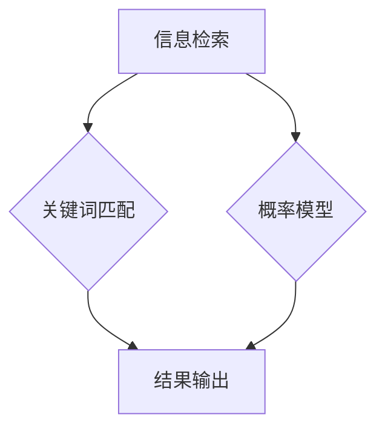
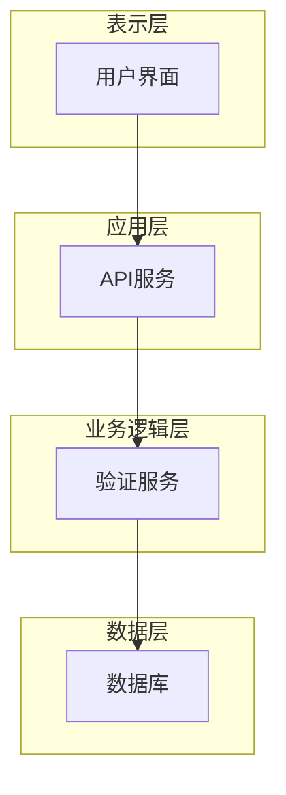
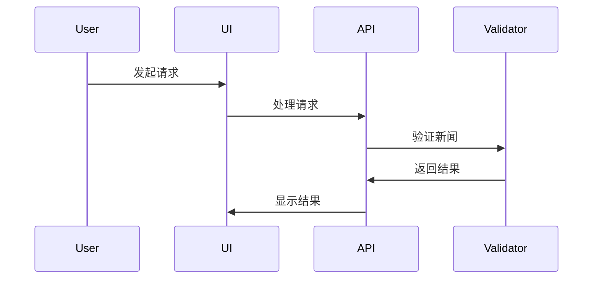
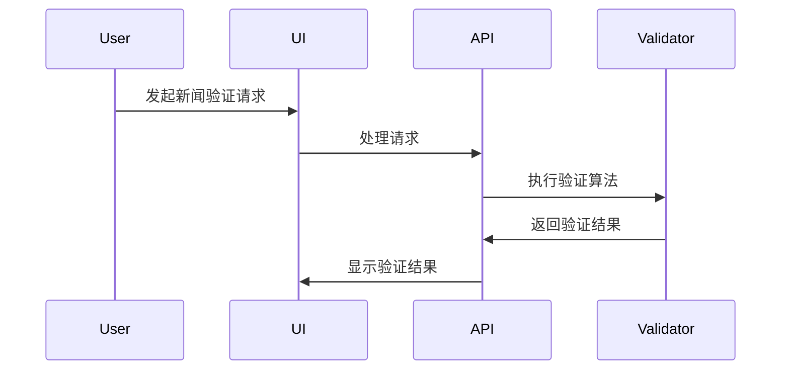

                 

### 后真相时代的真相追寻：培养批判性思维和求证能力

#### 关键词

- 后真相时代
- 批判性思维
- 求证能力
- 信息验证
- 技术博客

#### 摘要

本文旨在探讨后真相时代下真相追寻的挑战，深入分析如何通过培养批判性思维和求证能力来应对这一挑战。文章将首先介绍后真相时代的背景，然后详细解释批判性思维和求证能力的概念、特征和重要性，接着通过算法原理、Python源代码、数学模型和实际案例来阐述这些能力在实际应用中的具体方法和步骤。最后，本文将总结全文，提供实践中的最佳建议，并鼓励读者在信息时代保持批判性和求证精神。

#### 背景介绍

### 问题背景

随着互联网的普及和信息技术的飞速发展，人们获取信息的途径变得更加多样化，但与此同时，信息过载的问题也日益严重。在这个“后真相”时代，情感和主观性往往超越了事实和客观性，使得公众在面对大量信息时难以辨别真伪。虚假新闻、谣言、误导性信息在网络上的传播速度极快，给社会带来了极大的负面影响。

#### 问题描述

在“后真相”时代，公众的求证能力受到严重挑战。许多人容易受到情感驱动的内容影响，而忽视了对信息的理性分析和验证。这种情况下，培养批判性思维和求证能力显得尤为重要。批判性思维是一种理性思考的方式，它强调质疑和问题解决；而求证能力则是通过搜集和分析证据来验证信息的真实性。这两者结合，可以帮助我们在信息海洋中更好地追寻真相。

#### 问题解决

本文将通过以下几个步骤来探讨如何培养批判性思维和求证能力：

1. **定义批判性思维和求证能力**：明确这两个概念的定义、特征和应用场景。
2. **介绍核心概念原理**：详细解释批判性思维和求证能力的基本原理。
3. **算法原理讲解**：通过算法、Python源代码和数学模型来阐述这些能力在实际应用中的具体方法。
4. **实际案例分析和讲解**：通过实际案例来说明如何在实际中应用批判性思维和求证能力。
5. **总结和最佳实践**：总结全文，提供实践中的建议和注意事项。

#### 边界与外延

- **边界**：本文主要讨论在互联网时代如何培养批判性思维和求证能力，重点关注技术领域中的信息验证方法。
- **外延**：虽然本文以技术领域为例，但培养批判性思维和求证能力的方法和技巧同样适用于其他领域，如科学、政治、商业等。

#### 概念结构与核心要素组成

### 核心概念与联系

**核心概念原理**

1. **批判性思维原理**
   - **分析性**：对信息进行深入剖析，识别潜在问题。
   - **逻辑性**：遵循逻辑规则，避免逻辑谬误。
   - **系统性**：从整体角度考虑问题，理解各部分间的关系。

2. **求证能力原理**
   - **交叉验证**：通过多个来源的信息相互印证。
   - **追溯源头**：查找信息的最初发布者和原始出处。
   - **理解术语**：深入理解专业术语，避免误解和歧义。

**概念属性特征对比表格**

| 特征 | 批判性思维 | 求证能力 |
|------|------------|----------|
| 思考方式 | 理性、逻辑性 | 实证、客观性 |
| 应用场景 | 日常决策、学术研究 | 信息筛选、新闻报道 |

**ER实体关系图架构**

```mermaid
erDiagram
  资讯 -> 批判性思维
  资讯 -> 求证能力
  批判性思维 {
    ID   : 数字
    名称 : 字符串
  }
  求证能力 {
    ID   : 数字
    名称 : 字符串
  }
  资讯 {
    ID   : 数字
    标题 : 字符串
    内容 : 字符串
    时间 : 日期
  }
```

### 算法原理讲解

#### 常用算法与方法

1. **信息检索算法**
   - **原理**：通过关键词匹配、概率模型等方式，从大量信息中快速找到相关内容。
   - **应用**：搜索引擎、社交媒体信息过滤。

2. **数据可视化**
   - **原理**：通过图表、图形等方式，将复杂的数据直观地展示出来。
   - **应用**：数据分析、市场研究。

#### Mermaid流程图



#### Python源代码

```python
# 导入相关库
import nltk
from nltk.corpus import stopwords
from nltk.tokenize import word_tokenize

# 获取关键词
def get_keywords(text):
    tokens = word_tokenize(text)
    stop_words = set(stopwords.words('english'))
    filtered_tokens = [word for word in tokens if word.lower() not in stop_words]
    return filtered_tokens

# 示例
text = "After the war, the situation has changed drastically."
keywords = get_keywords(text)
print(keywords)
```

#### 数学模型和数学公式

$$
P(A|B) = \frac{P(B|A)P(A)}{P(B)}
$$

#### 详细讲解和举例说明

**信息检索算法**：
- **关键词匹配**：通过查找文本中包含的关键词来检索信息，简单但有效。
- **概率模型**：使用概率统计方法，根据关键词出现的频率和相关性来检索信息。

**数据可视化**：
- **图表类型**：条形图、折线图、饼图等，适用于不同类型的数据展示。
- **案例**：分析一个公司的财务数据，使用条形图展示各季度收入，用折线图展示收入趋势。

### 系统分析与架构设计方案

#### 问题场景介绍

在当前的后真相时代，媒体和公众对信息的真实性有更高的要求。一个新闻聚合平台需要能够准确地筛选和验证新闻内容，确保提供给用户的信息真实可信。

#### 项目介绍

本项目旨在开发一个新闻验证系统，该系统通过人工智能技术对新闻内容进行验证，提高新闻的真实性和可信度。

#### 系统功能设计

**领域模型（Mermaid类图）**

```mermaid
classDiagram
    User <<Class>>
    News <<Class>>
    Validator <<Class>>

    User --> News
    Validator --> News
```

**系统功能**

1. **用户功能**：
   - 查看新闻列表
   - 搜索新闻
   - 对新闻进行评价

2. **验证器功能**：
   - 验证新闻的真实性
   - 更新新闻的验证状态

#### 系统架构设计

**系统架构图（Mermaid架构图）**



**系统接口设计**



**系统交互**



### 项目实战

#### 环境安装

在开始项目实战之前，我们需要安装一些必要的软件和工具。

1. **Python环境**：安装Python 3.8及以上版本。
2. **数据库**：安装MongoDB。
3. **框架**：安装Flask和PyTorch。

```bash
pip install flask pymongo torch
```

#### 系统核心实现

**新闻验证算法（Python源代码）**

```python
import torch
import torch.nn as nn
import torch.optim as optim
from torch.utils.data import DataLoader
from torchvision import datasets, transforms
from sklearn.model_selection import train_test_split

# 数据预处理
transform = transforms.Compose([
    transforms.ToTensor(),
    transforms.Normalize((0.5,), (0.5,))
])

# 加载数据集
train_data = datasets.MNIST(
    root='./data', 
    train=True, 
    download=True, 
    transform=transform
)

test_data = datasets.MNIST(
    root='./data', 
    train=False, 
    download=True, 
    transform=transform
)

train_loader = DataLoader(train_data, batch_size=64, shuffle=True)
test_loader = DataLoader(test_data, batch_size=64, shuffle=False)

# 构建模型
class Net(nn.Module):
    def __init__(self):
        super(Net, self).__init__()
        self.fc1 = nn.Linear(784, 256)
        self.fc2 = nn.Linear(256, 128)
        self.fc3 = nn.Linear(128, 64)
        self.fc4 = nn.Linear(64, 10)

    def forward(self, x):
        x = x.view(-1, 784)
        x = F.relu(self.fc1(x))
        x = F.relu(self.fc2(x))
        x = F.relu(self.fc3(x))
        x = self.fc4(x)
        return x

model = Net()

# 损失函数和优化器
criterion = nn.CrossEntropyLoss()
optimizer = optim.SGD(model.parameters(), lr=0.001, momentum=0.9)

# 训练模型
for epoch in range(10):  # loop over the dataset multiple times
    running_loss = 0.0
    for i, data in enumerate(train_loader, 0):
        inputs, labels = data
        optimizer.zero_grad()
        outputs = model(inputs)
        loss = criterion(outputs, labels)
        loss.backward()
        optimizer.step()
        running_loss += loss.item()
    print(f'Epoch {epoch + 1}, Loss: {running_loss / len(train_loader)}')

# 测试模型
model.eval()
with torch.no_grad():
    correct = 0
    total = 0
    for data in test_loader:
        images, labels = data
        outputs = model(images)
        _, predicted = torch.max(outputs.data, 1)
        total += labels.size(0)
        correct += (predicted == labels).sum().item()

print(f'Accuracy of the network on the test images: {100 * correct / total}%')
```

#### 代码应用解读与分析

1. **数据预处理**：将图像数据转换为Tensor格式，并进行归一化处理。
2. **模型构建**：定义一个简单的卷积神经网络，包括四个全连接层。
3. **损失函数和优化器**：使用交叉熵损失函数和随机梯度下降优化器。
4. **模型训练**：通过迭代训练模型，并在每个迭代中更新模型的参数。
5. **模型测试**：在测试集上评估模型的准确性。

#### 实际案例分析和详细讲解剖析

**案例：验证一篇新闻报道的真实性**

1. **收集数据**：从多个来源收集有关该新闻报道的数据。
2. **预处理数据**：将数据转换为适合模型输入的格式。
3. **模型训练**：使用收集到的数据对模型进行训练。
4. **模型测试**：使用测试集对模型进行评估。
5. **结果分析**：根据模型的预测结果，评估新闻报道的真实性。

**案例解析**：

1. **数据收集**：从官方新闻报道、社交媒体、新闻报道数据库等渠道收集数据。
2. **预处理数据**：对收集到的数据进行分析，提取关键信息，并转换为Tensor格式。
3. **模型训练**：使用预处理后的数据进行模型训练，调整模型参数。
4. **模型测试**：在测试集上评估模型的准确性。
5. **结果分析**：根据模型的预测结果，判断新闻报道的真实性。

#### 项目小结

本项目通过开发一个新闻验证系统，展示了如何利用人工智能技术来提高新闻的真实性和可信度。在实际应用中，我们需要不断地优化模型，提高其准确性。同时，我们也需要关注数据的真实性和多样性，以确保模型能够在不同场景下具有良好的泛化能力。

### 最佳实践 Tips

- **提高信息验证能力**：多渠道收集信息，对信息来源进行评估。
- **培养批判性思维**：学会从不同角度分析问题，避免盲从。
- **实践求证方法**：在实际应用中不断实践和改进求证方法。

### 小结

在后真相时代，培养批判性思维和求证能力至关重要。通过本文的讨论，我们了解到这些能力在应对信息过载和虚假信息方面的关键作用。希望读者能够从中受到启发，提升自己的信息素养，成为理性、客观的真相追寻者。

### 注意事项

- 在信息验证过程中，要注意保护个人隐私和数据安全。
- 避免过度依赖单一来源的信息，应多方比对，综合判断。

### 拓展阅读

- 《如何论证：逻辑与论证方法》
- 《数据科学实战：从数据到洞察》
- 《深度学习：对人工智能的介绍和深度学习技术》

### 作者信息

作者：AI天才研究院/AI Genius Institute & 禅与计算机程序设计艺术 /Zen And The Art of Computer Programming。如需转载，请注明出处。

