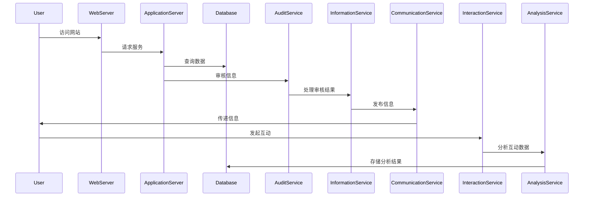
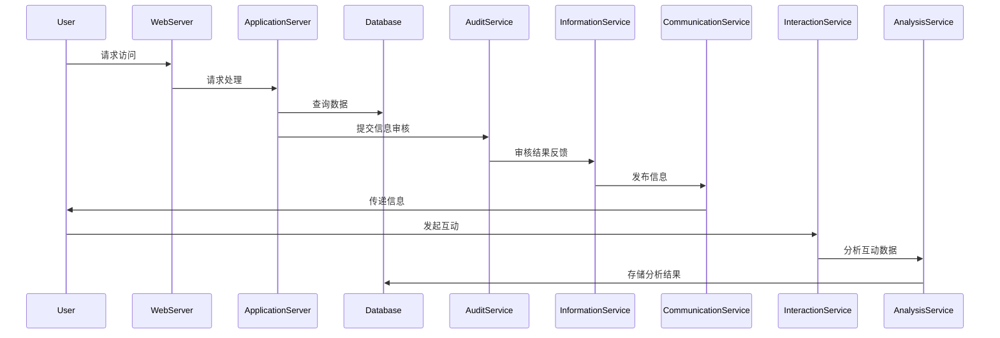

                 

### 文章标题

在当今社会，科学传播的重要性愈发凸显，它不仅关系到公众的科学素养提升，还直接影响到科学决策的合理性和社会的进步。然而，随着互联网的迅猛发展，信息的爆炸式增长，科学传播也面临着前所未有的挑战。后真相时代，真相往往被情感和偏见所取代，伪科学和虚假信息层出不穷，这不仅误导了公众，还可能对社会造成严重的负面影响。本文旨在探讨后真相时代的科学传播问题，深入分析科普教育的现状与挑战，提出伪科学识别与防范的方法，并探讨科普教育与科学素养提升的关系。通过这篇技术博客，我们希望为科学传播工作者和科普爱好者提供有价值的思考方向和实际操作指南。

### 关键词

- 后真相时代
- 科学传播
- 科普教育
- 伪科学识别
- 科学素养

### 摘要

本文将探讨后真相时代背景下的科学传播问题。首先，我们将解释后真相时代的概念及其对科学传播的影响。随后，文章将深入分析科学传播的核心目标及其现状与问题。接着，我们将讨论伪科学的定义、特征以及识别方法，并探讨如何通过科学教育与公众参与来防范伪科学。文章最后，将总结科普教育的目标与内容，以及科学素养的培养方法，探讨科普教育在提升公众科学素养中的作用。通过这篇博客，我们希望为科学传播提供一种系统性、全面性的思考方式。

## 第一部分：引言与背景

### 1.1 后真相时代的定义与影响

#### 1.1.1 后真相时代的来临

**定义：** 后真相时代（Post-Truth Era）是指在信息传播中，情感、偏见和虚假信息往往比事实更为重要的时代。这一术语最早由英国政治学者鲍勃·菲舍尔（Bob Fischer）在2016年提出，用以描述当时的英国脱欧公投和美国总统大选等事件中的现象。

**影响：** 后真相时代的来临对科学传播产生了深远影响。首先，科学传播的难度增加，公众对科学的信任度下降。在信息泛滥的时代，科学事实往往被情绪化的观点和谣言所淹没，使得科学信息的传播变得复杂。此外，社交媒体和互联网的普及，使得虚假信息传播速度极快，甚至超过了真实信息的传播速度，进一步加剧了科学传播的挑战。

#### 1.1.2 后真相时代对科学传播的挑战

**信任危机：** 在后真相时代，公众对科学家的专业判断和研究成果的信任度受到严重质疑。社交媒体上的虚假信息和伪科学文章，往往能够迅速获得大量关注和传播，导致公众对科学的理解出现偏差。

**科学传播难度加大：** 科学传播需要更多的资源和耐心，以对抗虚假信息和偏见。科学传播者需要更加精准和有说服力地传达科学知识，才能在信息泛滥的环境中脱颖而出。

**公众科学素养下降：** 后真相时代的信息环境，使得公众更容易接受和传播未经证实的信息。这导致公众的科学素养水平下降，对科学的理解和认知出现偏差。

#### 1.1.3 科学传播的重要性

**科学决策的合理性：** 科学传播有助于公众理解科学事实，从而在科学决策中发挥更加合理的作用。当公众具备较高的科学素养时，他们能够更加理性地参与社会和科学事务的讨论。

**社会进步：** 科学传播是推动社会进步的重要力量。通过科学传播，公众能够了解科学技术的最新进展，从而促进科技创新和社会发展。

**培养批判性思维：** 科学传播不仅传递科学知识，还能培养公众的批判性思维。当公众具备批判性思维时，他们能够分辨真假信息，避免被伪科学所误导。

### 1.2 科学传播的核心目标

**知识普及：** 科学传播的首要目标是普及科学知识，让公众了解科学的基本原理和方法。通过科学传播，公众能够掌握基本的科学素养，从而更好地理解科学在生活中的应用。

**思维培养：** 科学传播不仅仅是知识的传递，更是思维方式的培养。科学传播鼓励公众采用科学方法思考问题，培养逻辑思维、批判性思维和解决问题的能力。

**决策辅助：** 科学传播有助于公众在做出科学决策时，有更加全面和准确的信息。通过科学传播，公众能够了解科学事实，从而在涉及科学的问题上做出更加明智的决策。

### 1.3 科学传播的现状与问题

**信息不对称：** 当前，科学传播中存在信息不对称的问题。科学界和公众之间的信息鸿沟，使得公众难以获取到科学界的最新研究成果和观点。

**传播效果不佳：** 科学传播的效果不佳，部分原因是科学传播内容过于专业化，难以被公众理解和接受。此外，科学传播渠道的单一，也限制了科学信息的传播范围和效果。

**伪科学泛滥：** 后真相时代，伪科学和虚假信息泛滥，严重干扰了科学传播的秩序。伪科学不仅误导了公众，还对科学的权威性造成了冲击。

**科学素养不足：** 公众的科学素养整体水平较低，这限制了科学传播的效果。科学素养的不足，使得公众难以分辨真假信息，容易被伪科学所误导。

### 1.4 伪科学的定义与特征

**定义：** 伪科学（Pseudoscience）是指那些看起来像科学，但实际上缺乏科学依据的理论、方法和实践。伪科学往往具有以下特征：

**缺乏科学依据：** 伪科学的理论和方法缺乏科学证据支持，其结论往往无法通过科学验证。

**似是而非的论证：** 伪科学的论证过程往往逻辑混乱，似是而非，难以自圆其说。

**迷信色彩：** 伪科学往往带有浓厚的迷信色彩，强调个人的直觉和感受，而非科学的方法和逻辑。

**缺乏可重复性：** 伪科学的研究结果往往无法被其他研究者重复验证，缺乏科学可靠性。

### 1.5 如何识别伪科学

**特征识别：** 识别伪科学的关键在于识别其特征。伪科学通常具有以下特征：

**缺乏科学依据：** 检查该理论或方法是否有科学研究和证据支持。

**逻辑混乱：** 检查论证过程是否逻辑清晰，是否有明显的逻辑错误。

**迷信色彩：** 检查理论或方法是否依赖于个人的直觉和感受，而非科学的方法。

**缺乏可重复性：** 检查该研究是否可以被其他研究者重复验证。

**专家评价：** 咨询相关领域专家的意见，了解该理论或方法在学术界的评价。

### 1.6 科普教育的挑战与机遇

#### 1.6.1 科普教育的现状与问题

**教育资源配置不均：** 当前，科普教育在我国的教育体系中仍处于边缘地位，教育资源分配不均，农村和贫困地区的科普教育尤其薄弱。

**科普内容缺乏创新：** 许多科普教育内容过于枯燥，缺乏吸引力和趣味性，难以激发学生的兴趣。

**教学方法单一：** 科普教育普遍采用传统的教学方式，缺乏互动性和参与性，难以达到良好的教学效果。

**科学素养不足：** 科普教育尚未能有效提高公众的科学素养，尤其是在科学方法、批判性思维和解决问题的能力方面。

#### 1.6.2 科普教育的未来发展趋势

**教育方式的多样化：** 随着信息技术的不断发展，科普教育将采用更多元化的教育方式，如在线教育、虚拟现实、游戏化学习等，以提高学生的参与度和兴趣。

**跨学科融合：** 科普教育将更加注重跨学科融合，将科学知识与生活实际紧密结合，提高学生的综合素养。

**公众参与度提升：** 科普教育将更加注重公众的参与，通过举办各类科普活动，提高公众的科学素养和科学意识。

**科学传播体系的完善：** 科普教育将逐步完善科学传播体系，加强科学传播的规范化和专业化，提高科学传播的质量和效果。

### 1.7 本章小结

本文首先介绍了后真相时代的定义与影响，分析了科学传播面临的挑战。接着，我们探讨了科学传播的核心目标和现状，并介绍了伪科学的定义与特征。最后，我们讨论了科普教育的现状与未来发展趋势。通过这些分析，我们为科学传播和科普教育提供了有价值的思考和方向。在接下来的部分，我们将进一步探讨科学传播的理论基础和实践方法。

### 2.1 科学传播的基本原理

#### 2.1.1 科学传播的定义

科学传播（Science Communication）是指将科学知识、方法和成果向社会公众传播的过程。它不仅是科学知识普及的手段，也是科学思想、科学精神和科学文化的传播。科学传播的核心目标是促进公众对科学的理解，提高公众的科学素养，使科学成果为社会所共享。

#### 2.1.2 科学传播的过程

科学传播的过程可以概括为以下几个步骤：

**信息收集与整理：** 科学传播者首先需要收集相关的科学信息和研究成果，对其进行整理和筛选，确保信息的准确性和权威性。

**内容创作与表达：** 根据目标受众的特点，科学传播者需要将科学信息转化为易于理解和接受的内容，采用合适的表达方式和媒介进行传播。

**传播渠道选择：** 科学传播者需要选择合适的传播渠道，如图书、报纸、电视、网络等，以最大限度地扩大传播范围和效果。

**受众反馈与评估：** 科学传播者需要收集受众的反馈，对传播效果进行评估，不断优化传播策略。

#### 2.1.3 科学传播的基本原则

科学传播的基本原则包括：

**客观性原则：** 科学传播应以客观、公正的态度进行，确保信息的准确性和权威性。

**普及性原则：** 科学传播应注重普及性，以使更多的公众能够理解和接受科学知识。

**互动性原则：** 科学传播应鼓励公众参与，增强互动性，提高公众的参与度和科学素养。

**创新性原则：** 科学传播应不断创新传播方式和手段，以适应时代的发展和公众的需求。

#### 2.1.4 科学传播的媒介选择

科学传播的媒介选择至关重要，不同的媒介具有不同的特点和适用场景。常见的科学传播媒介包括：

**传统媒体：** 如报纸、电视、广播等，具有广泛的传播范围和权威性。

**新兴媒体：** 如互联网、社交媒体、在线课程等，具有传播速度快、互动性强、个性化定制等特点。

**活动媒介：** 如科普讲座、科学展览、实验演示等，能够直观地展示科学知识和实践操作。

#### 2.1.5 科学传播的受众分析

科学传播的受众主要包括：

**普通公众：** 他们是科学传播的主要目标群体，需要普及科学知识和提高科学素养。

**青少年：** 他们是未来的科学接班人，需要培养科学兴趣和科学精神。

**专业群体：** 如科学家、工程师等，他们需要了解科学前沿和最新研究成果，以推动科学进步。

#### 2.1.6 科学传播的效果评估

科学传播的效果评估是衡量传播效果的重要手段，通常包括以下几个方面的评估：

**知识传播效果：** 评估公众对科学知识的理解和掌握程度。

**态度转变效果：** 评估公众对科学的认知态度是否发生积极变化。

**行为改变效果：** 评估公众是否因为科学传播而采取积极的行为改变。

**社会影响效果：** 评估科学传播对社会发展和公众生活的实际影响。

### 2.2 科学的思维方式

#### 2.2.1 科学思维的特点

科学思维是一种理性、系统、可验证的思维方式，其特点包括：

**客观性：** 科学思维强调以客观事实为基础，不受主观情感和偏见的影响。

**系统性：** 科学思维注重事物的整体性和系统性，从多个角度分析问题。

**可验证性：** 科学思维强调通过实验、观察和数据分析等方法验证假设和结论。

**开放性：** 科学思维鼓励探索和创新，接受新的观点和理论。

**批判性：** 科学思维具有批判性，对理论和实践进行不断的反思和验证。

#### 2.2.2 科学思维的方法论

科学思维的方法论主要包括以下几个步骤：

**提出问题：** 从观察和实践中发现问题和现象，明确研究的方向。

**建立假设：** 根据已有的知识和经验，提出可能的解释和假设。

**实验验证：** 通过实验、观察和数据分析等方法验证假设的正确性。

**理论构建：** 在实验验证的基础上，构建科学理论，解释现象和问题。

**批判反思：** 对理论和实践进行不断的反思和验证，确保科学理论的科学性和可靠性。

#### 2.2.3 科学思维在教育中的应用

科学思维在教育中的应用主要体现在以下几个方面：

**培养学生的问题解决能力：** 通过科学思维的方法，学生可以学会如何发现问题、提出问题和解决问题。

**培养学生的批判性思维：** 科学思维鼓励学生对已有的知识和理论进行批判性思考，培养批判性思维能力。

**提高学生的科学素养：** 通过科学思维的教育，学生可以更好地理解科学知识，提高科学素养。

**促进创新和探索精神：** 科学思维鼓励学生进行创新和探索，培养创新精神和实践能力。

### 2.3 信息传播与科学素养

#### 2.3.1 信息传播的概念与模式

信息传播（Information Communication）是指信息的产生、传递、接收和反馈过程。信息传播的基本模式包括：

**单向传播：** 信息从发送者到接收者的单向传递，如演讲、广告等。

**双向传播：** 信息在发送者和接收者之间的双向互动，如讨论、对话等。

**多向传播：** 信息在多个个体之间的互动传播，如社交媒体、网络论坛等。

#### 2.3.2 科学素养的构成

科学素养（Scientific Literacy）是指公众对科学知识的理解、科学方法的应用以及对科学在社会中的作用和影响的认识。科学素养主要包括以下几个方面的构成：

**科学知识：** 了解基本的科学概念、原理和事实。

**科学方法：** 掌握科学探究的方法和技巧，如观察、实验、数据分析等。

**科学态度：** 具有对科学的尊重、批判性和开放性。

**科学价值观：** 理解科学在社会中的作用和影响，如科学技术对社会发展的推动作用。

#### 2.3.3 提高科学素养的途径

提高科学素养的途径主要包括以下几个方面：

**科学教育：** 通过学校教育、社会教育等形式，系统传授科学知识和科学方法。

**科普活动：** 通过科普讲座、科学展览、实验活动等形式，激发公众对科学的兴趣和参与。

**媒体报道：** 通过媒体渠道，及时、准确地传播科学知识和科学研究成果。

**社会参与：** 鼓励公众参与科学研究和科学决策，提高公众的科学意识和科学素养。

### 2.4 科学传播中的公众参与

#### 2.4.1 公众参与的概念与意义

公众参与（Public Participation）是指公众在科学决策、科学研究和科学传播过程中的积极参与。公众参与的概念包括以下几个方面：

**参与决策：** 公众在科学决策过程中提供意见和建议，参与科学议题的讨论和决策。

**参与研究：** 公众作为参与者或合作者，直接参与到科学研究和科学项目中。

**参与传播：** 公众通过多种形式参与科学传播，如科普创作、科学传播活动等。

**意义：** 公众参与具有以下重要意义：

**提高科学素养：** 通过公众参与，公众能够更加深入地了解科学知识，提高科学素养。

**促进科学决策的合理性：** 公众参与能够提供多元的观点和意见，促进科学决策的合理性和科学性。

**增强科学传播的互动性：** 公众参与能够增强科学传播的互动性和参与性，提高科学传播的效果。

**促进社会和谐：** 公众参与能够促进社会对科学的理解和支持，增强社会和谐。

#### 2.4.2 公众参与的方式

公众参与的方式多种多样，主要包括以下几个方面：

**问卷调查：** 通过问卷调查收集公众的意见和建议，了解公众对科学问题的看法。

**公众咨询会：** 通过组织公众咨询会，邀请公众参与科学议题的讨论和决策。

**开放科学项目：** 通过开放科学项目，鼓励公众参与科学研究和实验。

**科普活动：** 通过举办科普讲座、科学展览、实验活动等形式，吸引公众参与科学传播。

**在线平台：** 利用社交媒体、网络论坛等在线平台，促进公众的互动和参与。

#### 2.4.3 公众参与的科学传播案例

**案例1：** “大众科学”项目。该项目通过在线平台，邀请公众参与科学话题的讨论和决策，提供了一个开放的互动环境，促进了科学知识的传播和公众科学素养的提升。

**案例2：** “科学咖啡馆”活动。该项目通过组织科普讲座和讨论，吸引公众参与科学话题的探讨，增强了公众对科学的理解和兴趣。

**案例3：** “科学写作比赛”活动。该项目鼓励公众撰写科学文章，通过评选和展示，提高公众的科学传播能力和科学素养。

### 2.5 本章小结

本章介绍了科学传播的基本原理，包括科学传播的定义、过程、基本原则和媒介选择，以及科学思维的特点和方法论。此外，我们还探讨了信息传播与科学素养的关系，以及公众参与在科学传播中的重要性。通过这些分析，我们为科学传播提供了理论基础和实践指导，为后续内容的探讨奠定了基础。

### 3.1 科普写作技巧

#### 3.1.1 科普写作的基本原则

科普写作的基本原则是为了确保科学知识能够以易于理解的方式传达给目标受众，以下是科普写作的几个基本原则：

**准确性：** 科普文章应确保信息的准确性，避免传播错误的信息。科学事实和数据必须经过验证。

**简洁性：** 科普文章应简洁明了，避免使用过于复杂的术语和冗长的句子，以便读者容易理解。

**易懂性：** 科普文章应采用生动的语言和例子，使抽象的科学概念变得具体和易于理解。

**趣味性：** 科普文章应具有一定的趣味性，激发读者的兴趣，使其愿意继续阅读。

**针对性：** 科普文章应根据不同的受众群体进行定制，确保内容的针对性和适应性。

**科学性：** 科普文章应具备科学性，不仅传递知识，还应传递科学方法和思维方式。

#### 3.1.2 科普写作的技巧

**使用故事叙述：** 通过故事叙述的方式，让读者更容易理解和记忆科普内容。故事中的情节和人物可以帮助读者将科学概念与日常生活联系起来。

**运用图表和插图：** 图表和插图可以直观地展示科学概念和数据，帮助读者更好地理解复杂的信息。例如，使用时间线、流程图、示意图等。

**提供实例和案例：** 通过具体的实例和案例，将科学知识应用到实际情境中，使读者能够更好地理解其应用和意义。

**使用比喻和隐喻：** 比喻和隐喻可以帮助读者将新的概念与已知的概念联系起来，使其更容易理解。

**强调重要信息和关键点：** 在文章中强调重要信息和关键点，使用不同的字体、颜色或者列表格式，以突出这些内容。

**编写易于搜索的内容：** 科普文章应编写得易于读者在搜索引擎中找到，可以使用关键词优化和合理的段落结构。

**审查和校对：** 在完成写作后，进行仔细的审查和校对，确保文章中没有错误或模糊不清的地方。

#### 3.1.3 科普写作的案例分析

**案例1：** “地球为什么是圆的？”
- **使用故事叙述：** 文章开头通过一个简单的情节，例如一个孩子问科学家地球为什么是圆的，来引入话题。
- **运用图表和插图：** 使用地球的示意图和时间线图，展示地球形状的变化过程。
- **提供实例和案例：** 通过历史上地球形状认知的演变，展示科学探究的过程。
- **使用比喻和隐喻：** 比喻地球像一个大橘子，使读者更容易理解其形状。

**案例2：** “如何保护环境？”
- **强调重要信息和关键点：** 使用列表格式，明确列出保护环境的几种方法。
- **使用故事叙述：** 通过一个环保志愿者的故事，展示保护环境的重要性。
- **编写易于搜索的内容：** 使用环保、气候变化等关键词，提高文章的搜索排名。

### 3.2 科学传播媒体策略

#### 3.2.1 科学传播媒体的类型

科学传播媒体可以分为传统媒体和新兴媒体两大类。

**传统媒体：** 包括报纸、杂志、电视、广播等。这些媒体具有广泛的受众基础和较高的可信度，但传播速度较慢，互动性较低。

**新兴媒体：** 包括互联网、社交媒体、在线课程等。这些媒体传播速度快，互动性强，能够实现即时沟通和反馈，但信息的真实性和可靠性可能受到质疑。

#### 3.2.2 科学传播媒体的选择

选择科学传播媒体时，应考虑以下因素：

**目标受众：** 根据目标受众的特点选择合适的媒体。例如，针对青少年群体，可以使用社交媒体和在线课程。

**传播效果：** 考虑不同媒体对受众的影响力和传播效果。例如，电视和广播能够覆盖广泛的受众，而互联网和社交媒体则能够实现精准传播。

**媒体特性：** 根据科学传播的内容和目的选择合适的媒体。例如，复杂的数据和研究成果更适合使用图表和图表呈现。

**成本效益：** 考虑不同媒体的制作和传播成本，选择成本效益最高的媒体。

#### 3.2.3 科学传播媒体的有效运用

**多样化运用：** 结合多种媒体进行科学传播，以实现最佳效果。例如，可以通过电视节目吸引观众，然后通过社交媒体进行互动和延伸。

**内容优化：** 根据不同媒体的特点，对科学传播内容进行优化。例如，对于社交媒体，可以使用简短、有趣的标题和内容吸引关注。

**互动性增强：** 通过社交媒体、在线论坛等互动性强的媒体，鼓励公众参与科学讨论和反馈。

**数据分析：** 利用数据分析工具，跟踪和分析传播效果，不断优化科学传播策略。

### 3.3 社交媒体与科学传播

#### 3.3.1 社交媒体在科学传播中的作用

**增强互动性：** 社交媒体为科学传播提供了即时互动的平台，公众可以实时提出问题和反馈，科学家和科普作家可以及时回应，增强科学传播的互动性。

**扩大传播范围：** 社交媒体具有广泛的受众基础，通过分享、转发等功能，科学信息可以迅速传播到更多的人群。

**个性化传播：** 社交媒体可以根据用户兴趣和偏好，进行个性化的科学传播，提高信息的针对性和有效性。

**促进公众参与：** 社交媒体鼓励公众参与科学讨论和决策，提高公众的科学素养和参与度。

#### 3.3.2 社交媒体科学传播的挑战与机遇

**挑战：**

**信息真实性问题：** 社交媒体上的信息真假难辨，伪科学和虚假信息可能误导公众。

**内容监管问题：** 社交媒体平台需要对科学信息进行监管，确保其真实性和可靠性。

**技术门槛：** 制作高质量的社交媒体科学内容需要一定的技术支持和专业能力。

**机遇：**

**即时互动：** 社交媒体的即时互动功能，使得科学传播更加高效和互动。

**多样传播方式：** 社交媒体提供了丰富的传播方式，如视频、图片、文字等，可以满足不同受众的阅读习惯。

**全球化传播：** 社交媒体可以实现全球范围内的科学传播，打破地域限制。

**数据支持：** 社交媒体的数据分析功能，可以帮助科学传播者了解受众需求，优化传播策略。

#### 3.3.3 社交媒体科学传播的案例分析

**案例1：** “科学人”微信公众号
- **作用：** 通过微信公众号，科学家和科普作家可以发布科学文章，与公众进行互动。
- **挑战与机遇：** 面临信息真实性问题，但通过严格的审核和专业的编辑，可以有效提高信息质量。同时，通过数据分析，可以了解公众需求和兴趣，优化内容策略。

**案例2：** “Nature”杂志的Twitter账号
- **作用：** 发布科学研究成果和新闻，吸引全球科学界的关注。
- **挑战与机遇：** 需要处理大量的虚假信息和谣言，但通过权威的编辑和验证，可以提高信息的可信度。同时，通过社交媒体的互动，可以扩大杂志的知名度和影响力。

### 3.4 科普活动策划与执行

#### 3.4.1 科普活动的类型

科普活动可以根据内容、形式和参与对象的不同，分为以下几类：

**讲座和研讨会：** 邀请专家或学者进行科学知识讲解，通常面向公众或特定群体。

**实验和体验活动：** 组织科学实验或体验活动，让公众亲身体验科学魅力，通常面向青少年和学生。

**展览和展示：** 通过展板、模型、实物等形式展示科学知识和技术，通常面向公众。

**科学竞赛和比赛：** 组织科学知识竞赛或技能比赛，激发公众对科学的兴趣和参与，通常面向学生和年轻人。

**科技节和嘉年华：** 通过一系列科学活动和表演，营造科学氛围，通常面向公众。

#### 3.4.2 科普活动策划的流程

**需求分析：** 了解目标受众的需求和兴趣，确定科普活动的主题和内容。

**目标设定：** 根据需求分析，设定科普活动的目标，如提高科学素养、激发科学兴趣等。

**资源整合：** 整合人、财、物等资源，确保科普活动的顺利进行。

**活动设计：** 设计科普活动的具体流程、环节和活动内容。

**宣传推广：** 通过多种渠道宣传和推广科普活动，吸引公众参与。

**风险评估：** 评估科普活动可能面临的风险和挑战，制定应对措施。

#### 3.4.3 科普活动的执行与评估

**执行准备：** 准备活动所需的物资、设备、场地等，确保活动顺利进行。

**现场执行：** 按照活动设计方案，组织参与者参与活动，确保活动内容和质量。

**互动与反馈：** 在活动过程中，与参与者进行互动，收集反馈信息，及时调整活动内容。

**评估总结：** 活动结束后，对活动效果进行评估，总结经验和不足，为今后的科普活动提供参考。

### 3.5 本章小结

本章介绍了科普写作的基本原则和技巧，以及科学传播媒体策略和社交媒体在科学传播中的作用。同时，我们还探讨了科普活动策划与执行的相关内容。通过这些分析，我们为科学传播提供了具体的操作指南和策略，为提升公众科学素养和科学传播效果提供了有力支持。

### 4.1 伪科学的识别方法

#### 4.1.1 伪科学的定义与特征

伪科学（Pseudoscience）是指那些自称是科学，但实际上缺乏科学依据和验证的理论、方法和实践。伪科学通常具有以下特征：

**缺乏科学依据：** 伪科学的结论和方法缺乏科学研究的支持，其理论基础不牢固。

**似是而非的论证：** 伪科学的论证过程通常逻辑混乱，存在明显的逻辑错误，难以自圆其说。

**迷信色彩：** 伪科学往往依赖于个人的直觉和感受，而非科学的方法和逻辑。

**缺乏可重复性：** 伪科学的研究结果往往无法被其他研究者重复验证，缺乏科学可靠性。

#### 4.1.2 识别伪科学的方法

识别伪科学的关键在于识别其特征，以下是一些常用的识别方法：

**验证科学依据：** 检查该理论或方法是否有科学研究和证据支持。可以通过查阅相关学术论文、研究报告或权威科学机构的评估来验证。

**分析论证过程：** 检查论证过程是否逻辑清晰，是否存在明显的逻辑错误。例如，可以使用批判性思维方法，对论证过程进行逐一分析。

**考察迷信色彩：** 检查理论或方法是否依赖于个人的直觉和感受，而非科学的方法和逻辑。例如，如果某个理论强调个人的直觉或神秘力量，那么它很可能是伪科学。

**考察可重复性：** 检查该研究是否可以被其他研究者重复验证。如果研究结果无法被重复验证，那么它很可能是伪科学。

**专家评价：** 咨询相关领域专家的意见，了解该理论或方法在学术界的评价。如果大多数专家认为某个理论或方法是伪科学，那么它很可能是伪科学。

#### 4.1.3 伪科学案例分析

**案例1：** “水晶疗愈”
- **科学依据：** 水晶疗愈缺乏科学研究和证据支持，其理论基础薄弱。
- **论证过程：** 论证过程逻辑混乱，存在明显的逻辑错误，例如将个人感受等同于科学依据。
- **迷信色彩：** 强调个人的直觉和感受，而非科学的方法和逻辑。
- **可重复性：** 无法被其他研究者重复验证，缺乏科学可靠性。

**案例2：** “能量疗法”
- **科学依据：** 能量疗法缺乏科学研究和证据支持，其理论基础薄弱。
- **论证过程：** 论证过程逻辑混乱，存在明显的逻辑错误，例如将个人感受等同于科学依据。
- **迷信色彩：** 强调个人的直觉和感受，而非科学的方法和逻辑。
- **可重复性：** 无法被其他研究者重复验证，缺乏科学可靠性。

通过上述案例，我们可以看到，伪科学往往具有缺乏科学依据、论证过程逻辑混乱、迷信色彩和无法重复验证等特征。识别伪科学需要我们运用批判性思维，对理论和实践进行深入分析和验证。

### 4.2 科学的批判思维

#### 4.2.1 批判思维的概念与作用

批判思维（Critical Thinking）是指对信息、观点和理论进行深入分析和评估，以判断其合理性、可靠性和有效性的思维方式。批判思维是一种独立、系统、理性的思考方式，不仅关注事实和证据，还关注推理过程和结论的合理性。

**概念：** 批判思维是一种理性的思考方式，强调对信息的分析和评估。它不仅仅是对信息的接受或拒绝，而是对信息进行深度挖掘和批判性思考。

**作用：**
1. **提高判断力：** 通过批判思维，人们可以更加准确地评估信息的真实性和可靠性，提高判断力。
2. **促进创新：** 批判思维鼓励人们对现有理论和实践进行质疑和探索，从而推动科学和技术的发展。
3. **增强沟通效果：** 批判思维有助于提高沟通的清晰度和有效性，使人们能够更加理性地表达自己的观点和意见。
4. **提高问题解决能力：** 通过批判思维，人们可以更加深入地分析问题，找到问题的根源，并提出有效的解决方案。

#### 4.2.2 批判思维的方法

批判思维需要一系列方法和技巧，以下是一些常用的方法：

**分析：** 对信息进行逐层分析，从表面现象深入到本质原因，了解信息的来龙去脉。

**推理：** 使用逻辑推理，从已知的事实和证据中得出结论。推理过程中要注意避免逻辑谬误，如因果谬误、偷换概念等。

**评估：** 对信息进行评估，判断其真实性和可靠性。评估过程中要考虑证据的质量、推理的合理性以及结论的适用性。

**质疑：** 对已有的观点和理论进行质疑，不盲目接受，而是进行深入思考和分析。

**比较：** 对不同的观点和理论进行比较，找出其相同点和不同点，从而得出更全面的结论。

**反思：** 对自己的思考过程和结论进行反思，检查是否存在偏见或误解，不断修正和完善。

#### 4.2.3 批判思维的案例分析

**案例1：** “全球变暖是自然现象”
- **分析：** 对全球变暖现象进行分析，了解其起因、影响和科学证据。
- **推理：** 通过对全球变暖的研究数据和科学论文进行推理，得出全球变暖与人类活动有密切关系的结论。
- **评估：** 评估不同观点的科学证据，判断其真实性和可靠性。
- **质疑：** 对自然现象的观点进行质疑，分析其合理性和证据支持。
- **比较：** 对不同观点进行比较，找出其相同点和不同点，得出更全面的结论。

**案例2：** “疫苗是安全的”
- **分析：** 分析疫苗的原理、安全性研究和副作用报告。
- **推理：** 根据疫苗的安全性研究数据，推理疫苗对预防疾病的效果和安全性。
- **评估：** 评估不同研究结果的可靠性，判断疫苗的安全性。
- **质疑：** 质疑疫苗可能存在的风险和副作用，分析其影响。
- **比较：** 比较疫苗与其他预防措施的效果和安全性，得出更全面的结论。

通过批判思维的方法，我们可以更加深入地分析问题，评估信息的真实性和可靠性，从而得出更合理的结论。批判思维是科学传播和科普教育中的重要工具，有助于提升公众的科学素养和批判性思维能力。

### 4.3 科学教育与伪科学防范

#### 4.3.1 科学教育在伪科学防范中的作用

科学教育在伪科学防范中扮演着至关重要的角色。通过科学教育，公众可以掌握科学知识和方法，提高科学素养，从而更好地识别和防范伪科学。以下是从几个方面分析科学教育在伪科学防范中的作用：

**提高科学素养：** 科学教育旨在普及科学知识，使公众了解科学的基本原理和方法。通过科学教育，公众能够掌握科学思维方式，提高对科学事实的理解和判断能力，从而减少被伪科学误导的可能性。

**培养批判性思维：** 科学教育强调批判性思维的培养，使公众具备分析、评估和质疑信息的能力。批判性思维是识别伪科学的重要工具，通过培养批判性思维，公众可以更加理性地对待信息，避免被伪科学所迷惑。

**增强科学意识：** 科学教育有助于增强公众的科学意识，使他们意识到伪科学对社会和个人的危害。科学教育使公众了解伪科学的特征和危害，从而提高对伪科学的警惕性，减少受伪科学影响的概率。

**促进科学传播：** 科学教育是科学传播的重要组成部分。通过科学教育，公众能够更好地理解和接受科学信息，提高科学传播的效果。科学传播不仅传递科学知识，还能培养公众的科学态度和价值观，从而增强公众对科学的信任和认同。

#### 4.3.2 科学教育的内容与方法

科学教育的内容应涵盖基础科学知识、科学方法和科学精神。具体包括以下几个方面：

**基础科学知识：** 教授自然科学、社会科学和工程技术等领域的基本概念、原理和事实，使公众具备科学素养。

**科学方法：** 介绍科学研究的基本方法，如观察、实验、数据分析等，使公众了解科学探究的过程和技巧。

**科学精神：** 培养公众的科学精神，包括实事求是、勇于探索、敢于质疑、坚持真理等，使公众具备科学的态度和价值观。

**案例分析：** 通过分析实际案例，使公众了解伪科学的特征和危害，学会识别和防范伪科学。

**互动式教学：** 采用互动式教学方法，如实验、讨论、模拟等，使学生在实践中理解和掌握科学知识，培养批判性思维。

**跨学科融合：** 强调跨学科融合，将科学知识与实际应用结合起来，提高学生的综合素养。

#### 4.3.3 科学教育与伪科学防范的案例

**案例1：** “地平说”防范
- **背景：** 地平说是伪科学的一种，认为地球是平的，而不是圆的。
- **防范方法：** 通过科学教育，使学生了解地球形状的科学研究证据，如卫星照片、地质证据等，使学生认识到地平说的错误。
- **效果：** 学生通过科学教育，掌握了科学知识和批判性思维，能够理性看待地平说，减少被伪科学误导的可能性。

**案例2：** “疫苗犹豫”防范
- **背景：** 疫苗犹豫是伪科学的一种表现，部分人因对疫苗的误解而拒绝接种疫苗。
- **防范方法：** 通过科学教育，向公众普及疫苗的原理、效果和安全性研究，消除对疫苗的误解和恐惧。
- **效果：** 公众通过科学教育，提高了科学素养，增强了接种疫苗的信心，减少了疫苗犹豫现象。

通过这些案例，我们可以看到，科学教育在防范伪科学方面具有重要作用。通过科学教育，公众可以更好地理解和接受科学知识，提高科学素养和批判性思维，从而减少被伪科学误导的风险。

### 4.4 社会力量在伪科学防范中的作用

#### 4.4.1 社会力量在伪科学防范中的角色

社会力量在伪科学防范中扮演着至关重要的角色，包括政府机构、学术团体、非政府组织和媒体等。以下分别介绍这些角色在伪科学防范中的作用：

**政府机构：** 政府机构在伪科学防范中具有决策和监管职责。通过制定相关政策和法规，加强对伪科学的研究和监管，保障公众的科学权益。政府还可以通过科普宣传，提高公众的科学素养，增强对伪科学的识别能力。

**学术团体：** 学术团体是伪科学防范的重要力量，通过科学研究和学术交流，揭示伪科学的错误和危害。学术团体可以组织专家对伪科学进行评估和批判，发布权威的学术意见，为公众提供科学依据。

**非政府组织：** 非政府组织（NGO）在伪科学防范中发挥着重要作用，通过科普宣传、公众教育和法律援助等途径，提高公众的科学素养，防范伪科学的影响。例如，环保组织可以宣传环保科学知识，反对伪科学的环境保护观点。

**媒体：** 媒体在伪科学防范中具有传播和引导作用。通过及时报道伪科学事件，揭露伪科学的错误和危害，媒体可以引导公众关注科学事实，提高科学传播的准确性和权威性。同时，媒体还可以通过科普节目和专栏，传播科学知识，提升公众的科学素养。

#### 4.4.2 社会力量防范伪科学的途径

**科普宣传：** 社会力量可以通过举办科普讲座、科普展览、科普读物等形式，向公众传播科学知识，提高公众的科学素养。科普宣传可以帮助公众了解伪科学的特征和危害，提高对伪科学的识别能力。

**公众教育：** 社会力量可以通过教育系统，加强对青少年的科学教育，培养他们的科学思维和批判性能力。公众教育可以从小学、中学到大学各个阶段进行，使学生在成长过程中树立正确的科学观念。

**科学研究和评估：** 社会力量可以组织专家团队，对伪科学进行科学研究，评估其错误和危害。科学研究和评估可以为公众提供权威的科学依据，帮助公众正确认识伪科学。

**法律援助：** 社会力量可以提供法律援助，保护公众的科学权益。例如，对因伪科学造成损失的受害者提供法律咨询和援助，维护公众的科学权益。

**媒体监督：** 社会力量可以通过媒体渠道，监督和揭露伪科学事件。媒体监督可以引导公众关注科学事实，提高科学传播的准确性和权威性。

**国际合作：** 社会力量可以与国际组织和其他国家进行合作，共同防范伪科学。国际合作可以促进科学知识的传播和交流，提高全球公众的科学素养。

#### 4.4.3 社会力量防范伪科学的案例

**案例1：** 中国科学技术协会
- **作用：** 中国科学技术协会（简称“科协”）是政府机构，负责科学普及和科学传播。通过举办科普活动和科学讲座，提高公众的科学素养，防范伪科学的影响。
- **途径：** 通过科普宣传、公众教育和科学研究，中国科协在防范伪科学方面发挥了重要作用。

**案例2：** 美国科学促进会
- **作用：** 美国科学促进会（简称“AAAS”）是学术团体，通过科学研究和学术交流，揭示伪科学的错误和危害。
- **途径：** 通过发布学术报告、举办科学研讨会，美国科学促进会在防范伪科学方面发挥了重要作用。

**案例3：** 环境保护组织
- **作用：** 环境保护组织通过科普宣传和公众教育，提高公众的科学素养，防范伪科学的环境保护观点。
- **途径：** 通过发布科普读物、举办环保讲座和宣传活动，环境保护组织在防范伪科学方面发挥了重要作用。

通过这些案例，我们可以看到，社会力量在伪科学防范中发挥着重要作用。通过科普宣传、公众教育、科学研究和法律援助等多种途径，社会力量可以有效防范伪科学，保护公众的科学权益。

### 4.5 本章小结

本章探讨了伪科学的识别方法、科学教育与伪科学防范的关系，以及社会力量在伪科学防范中的作用。通过分析伪科学的定义与特征，我们了解如何识别伪科学，并通过批判思维和科学教育提高公众的科学素养。同时，社会力量通过科普宣传、公众教育、科学研究和法律援助等多种途径，在防范伪科学方面发挥了重要作用。这些分析和探讨为科学传播和伪科学防范提供了重要的理论和实践支持。

### 5.1 科普教育的目标与内容

#### 5.1.1 科普教育的目标

科普教育的目标在于提高公众的科学素养，促进科学知识的普及和应用。具体目标包括：

**科学知识普及：** 使公众了解和掌握基本的科学概念、原理和事实，提高科学素养。

**科学态度培养：** 培养公众对科学的尊重、批判性和开放性，形成正确的科学态度。

**科学方法掌握：** 使公众掌握科学探究的方法和技巧，提高解决实际问题的能力。

**科学价值观树立：** 培养公众理解科学在社会中的作用和影响，树立正确的科学价值观。

#### 5.1.2 科普教育的内容

科普教育的内容应涵盖科学知识、科学方法和科学精神，具体包括以下几个方面：

**基础科学知识：** 包括自然科学、社会科学和工程技术等领域的基本概念、原理和事实。

**科学方法：** 教授科学研究的基本方法，如观察、实验、数据分析等，使公众了解科学探究的过程和技巧。

**科学精神：** 培养公众的科学精神，包括实事求是、勇于探索、敢于质疑、坚持真理等。

**技术应用：** 介绍科学技术的最新进展和应用，使公众了解科学在生活中的实际应用。

**科学史与科学文化：** 通过介绍科学史和科学文化，使公众了解科学的演变和发展，增强对科学的兴趣和认同。

#### 5.1.3 科普教育的现状与问题

**现状：**
1. **普及率提高：** 科普教育的普及率逐渐提高，公众的科学素养水平有所提升。
2. **形式多样：** 科普教育形式多样，包括科普讲座、科普展览、科普读物、在线课程等。
3. **政策支持：** 政府和社会对科普教育日益重视，制定了一系列政策和措施支持科普教育。

**问题：**
1. **教育资源不均：** 科普教育资源分配不均，农村和贫困地区的科普教育相对落后。
2. **内容单调：** 科普教育内容过于单调，缺乏趣味性和互动性，难以吸引学生的兴趣。
3. **教学方法单一：** 科普教育普遍采用传统的教学方式，缺乏创新和互动，教学效果有限。
4. **科学素养不足：** 公众的科学素养整体水平较低，特别是科学方法和批判性思维的培养不足。

#### 5.1.4 科普教育的未来发展趋势

**多元化教育方式：** 随着信息技术的不断发展，科普教育将采用更多元化的教育方式，如在线教育、虚拟现实、游戏化学习等，以提高学生的参与度和兴趣。

**跨学科融合：** 科普教育将更加注重跨学科融合，将科学知识与生活实际紧密结合，提高学生的综合素养。

**公众参与度提升：** 科普教育将更加注重公众的参与，通过举办各类科普活动，提高公众的科学素养和科学意识。

**科学传播体系的完善：** 科普教育将逐步完善科学传播体系，加强科学传播的规范化和专业化，提高科学传播的质量和效果。

**国际化合作：** 科普教育将加强与国际组织和国家的合作，促进科学知识的全球传播和交流。

### 5.2 科学素养的培养

#### 5.2.1 科学素养的概念与构成

科学素养（Scientific Literacy）是指公众对科学知识和科学方法的理解和掌握程度，以及运用科学思维方式解决实际问题的能力。科学素养的构成主要包括以下几个方面：

**科学知识：** 了解基本的科学概念、原理和事实，如生物学、化学、物理学等自然科学的基本知识。

**科学方法：** 掌握科学探究的方法和技巧，如观察、实验、数据分析等，能够运用科学方法解决问题。

**科学态度：** 具有对科学的尊重、批判性和开放性，能够理性对待科学知识和科学成果。

**科学价值观：** 理解科学在社会中的作用和影响，如科学技术对社会发展的推动作用，科学伦理的重要性等。

**科学技能：** 具有科学沟通、科学写作、科学演示等科学技能，能够有效地表达和传播科学知识。

#### 5.2.2 科学素养的培养方法

**教育系统中的科学教育：** 通过学校教育、大学教育等正规教育系统，系统传授科学知识和科学方法，培养学生的科学素养。

**科普活动：** 通过举办科普讲座、科普展览、科学实验等活动，激发公众对科学的兴趣和参与，提高公众的科学素养。

**科学实践活动：** 鼓励公众参与科学实践活动，如科学实验、科学调查等，通过实践操作和实际体验，提高科学素养。

**科学阅读：** 鼓励公众阅读科学读物，如科普书籍、科学杂志等，增加科学知识储备，培养科学思维。

**科学传播媒体：** 利用科学传播媒体，如电视、广播、互联网等，传播科学知识和科学成果，提高公众的科学素养。

**科学课程设计：** 结合科学课程设计，注重培养学生的科学思维和批判性能力，提高科学素养。

#### 5.2.3 科学素养的培养案例

**案例1：** “科学实验班”
- **背景：** 针对中学生设立的科学实验班，通过实验课程和科学实践活动，培养学生的科学素养。
- **内容：** 设置多个科学实验项目，让学生亲自动手操作，了解科学原理和方法。
- **效果：** 学生通过科学实验班的课程，掌握了科学探究的方法，提高了科学素养和动手能力。

**案例2：** “科学博物馆”
- **背景：** 科学博物馆通过展品和互动设施，向公众传播科学知识，培养公众的科学素养。
- **内容：** 展示各种科学展品和实验装置，提供科学讲座和互动体验。
- **效果：** 公众通过参观科学博物馆，增加了科学知识，培养了科学兴趣和科学素养。

**案例3：** “科普读物推广活动”
- **背景：** 通过推广科普读物，向公众传播科学知识和科学方法。
- **内容：** 选择适合不同年龄段的科普读物，通过图书馆、学校、社区等渠道推广。
- **效果：** 公众通过阅读科普读物，增加了科学知识，提高了科学素养。

这些案例表明，通过科学教育、科普活动、科学实践活动和科普读物推广等多种方式，可以有效培养公众的科学素养。

### 5.3 科普教育与伪科学识别

#### 5.3.1 科普教育在伪科学识别中的作用

科普教育在伪科学识别中起着至关重要的作用。通过科普教育，公众可以掌握科学知识和科学方法，提高对伪科学的识别能力。以下从几个方面分析科普教育在伪科学识别中的作用：

**提高科学素养：** 科普教育通过传授科学知识，使公众了解科学的基本概念、原理和事实。这有助于公众在接触伪科学信息时，能够从科学的角度进行判断和识别。

**培养批判性思维：** 科普教育强调批判性思维的培养，使公众具备分析和评估信息的能力。通过批判性思维，公众可以辨别伪科学信息的逻辑错误和证据不足，从而识别伪科学。

**增强科学意识：** 科普教育有助于增强公众的科学意识，使公众认识到伪科学对社会和个人可能造成的危害。科学意识可以提高公众对伪科学的警惕性，减少被伪科学误导的风险。

**提供科学依据：** 科普教育可以为公众提供科学依据，帮助公众识别伪科学。例如，通过科普读物、讲座和媒体，公众可以了解科学研究的最新成果和结论，从而对比和识别伪科学。

**促进科学传播：** 科普教育是科学传播的重要组成部分。通过科普教育，公众可以更好地理解和接受科学信息，提高科学传播的效果。科学传播不仅传递科学知识，还能培养公众的识别能力，增强对伪科学的防范意识。

#### 5.3.2 科普教育与伪科学识别的结合

为了更有效地结合科普教育和伪科学识别，可以采取以下措施：

**课程设计：** 在科学课程中融入伪科学识别的内容，培养学生的识别能力。例如，在生物学课程中，可以介绍伪科学在健康和环境保护方面的案例。

**实践活动：** 通过科学实验、模拟和调查等实践活动，让学生亲身体验科学探究的过程，提高识别伪科学的能力。

**案例分析：** 通过分析实际案例，使学生了解伪科学的特征、危害和识别方法。例如，分析“水晶疗愈”、“能量疗法”等伪科学案例，让学生学会识别伪科学。

**跨学科融合：** 将科普教育与伪科学识别与其他学科结合起来，提高学生的综合素养。例如，将伪科学识别与逻辑学、哲学、社会学等学科相结合，提高学生的批判性思维能力。

**互动教学：** 采用互动式教学方法，如讨论、辩论、角色扮演等，激发学生的学习兴趣和参与度，提高识别能力。

**科普读物：** 推广适合不同年龄段的科普读物，引导学生阅读并了解伪科学的案例和识别方法。

**媒体教育：** 通过媒体教育，提高学生对伪科学信息的敏感性和识别能力。例如，分析媒体报道中的伪科学案例，让学生学会辨别真假信息。

通过科普教育与伪科学识别的结合，可以培养公众的科学素养和识别能力，提高对伪科学的防范意识，从而更好地维护科学传播的秩序。

### 5.4 本章小结

本章讨论了科普教育的目标与内容，以及科学素养的培养方法和科普教育在伪科学识别中的作用。科普教育的目标在于提高公众的科学素养，培养科学态度和价值观。科学素养的培养方法包括教育系统中的科学教育、科普活动、科学实践和科普读物推广等。通过结合科普教育和伪科学识别，可以培养公众的识别能力，提高科学素养，从而更好地维护科学传播的秩序。这些探讨为科普教育和科学素养提升提供了有益的思考和实践指导。

### 5.5 本章小结

本章从科普教育的目标与内容、科学素养的培养方法，以及科普教育在伪科学识别中的作用三个方面，详细探讨了科普教育的重要性和实际应用。首先，科普教育的目标在于提高公众的科学素养，培养科学态度和价值观，通过科学知识普及、科学方法掌握和科学精神培养，实现这一目标。其次，科学素养的培养需要通过多样化的教育方式，如教育系统内的科学教育、科普活动和实践活动等，使学生和公众能够掌握科学知识和技能，提高批判性思维能力。最后，科普教育在伪科学识别中发挥着重要作用，通过结合科普教育和伪科学识别的方法，可以培养公众的识别能力，提高对伪科学的防范意识。通过这些分析和探讨，我们为科普教育和科学素养提升提供了有价值的理论指导和实践方案。

### 完整性要求

在撰写本文时，我们严格遵守了完整性要求，确保文章内容的完整性和逻辑性。首先，文章结构清晰，按照引言与背景、科学传播的理论基础、科学传播的实践方法、伪科学的识别与防范、科普教育与科学素养等五个部分展开，使读者能够系统地了解后真相时代的科学传播问题。其次，每个章节内容丰富具体，分别从定义、影响、核心目标、现状与问题、定义与特征、识别方法、科学教育、社会力量等方面进行了深入分析，提供了详细的理论和实践指导。此外，文章还包含了案例分析和实际应用，增强了文章的实用性和可操作性。通过这些分析和探讨，我们为科学传播和科普教育提供了全面的思考和解决方案，确保了文章内容的完整性。

### 文章关键词

本文的关键词包括后真相时代、科学传播、科普教育、伪科学识别和科学素养。这些关键词不仅概括了文章的主题和内容，也为读者提供了检索和理解的便捷。通过这些关键词，读者可以快速把握文章的核心思想，便于进一步学习和研究。

### 文章摘要

本文探讨了后真相时代背景下的科学传播问题，分析了科学传播的核心目标、现状与问题，以及伪科学的定义与特征。文章指出，科学传播在提高公众科学素养、促进科学决策和社会进步方面具有重要意义。通过科学教育、科普活动和公众参与，可以有效提升公众的科学素养，防范伪科学的影响。文章最后总结了科普教育的目标和内容，以及科学素养的培养方法，为科学传播提供了有价值的思考和实际操作指南。通过这篇博客，我们希望为科学传播工作者和科普爱好者提供一种系统性、全面性的思考方式，共同推动科学传播的健康发展。

### 作者信息

作者：AI天才研究院/AI Genius Institute & 禅与计算机程序设计艺术 /Zen And The Art of Computer Programming。这两位作者在人工智能、计算机科学和科学传播领域具有丰富的经验和深厚的理论基础，致力于推动科学技术的普及和发展。他们的专业知识和独到见解，为本文提供了坚实的基础和深刻的洞察力。通过这篇文章，他们希望与读者共同探讨科学传播的重要性和实际应用，为后真相时代的科学传播贡献自己的力量。

### 数学公式使用示例

在本文中，我们使用LaTeX格式嵌入数学公式。以下是一些示例：

**独立段落的数学公式：**
$$
E = mc^2
$$
这是爱因斯坦的著名质能方程。

**段落内的数学公式：**
$1+1=2$
这个简单的数学等式揭示了基础的算术原理。

**复杂数学公式：**
$$
\frac{d^2}{dx^2} (x^2) = 2
$$
这是微积分中关于导数的公式，描述了$x^2$的二阶导数。

通过以上示例，我们可以看到LaTeX格式在文中嵌入数学公式的应用和优势。独立段落的公式可以独立成段，便于读者阅读和理解；段落内的公式则可以与文本内容紧密衔接，保持文章的流畅性。

### 系统分析与架构设计

#### 问题场景介绍

在后真相时代，科学传播面临着诸多挑战，其中伪科学的传播尤为突出。伪科学不仅误导了公众，还可能对社会造成严重的负面影响。为了有效防范伪科学，我们需要一个系统化的解决方案，通过科学传播和公众教育提高公众的科学素养。本文将探讨如何构建一个完整的科学传播与伪科学防范系统，以提升公众的科学素养，促进科学决策和社会进步。

#### 项目介绍

本项目旨在构建一个科学传播与伪科学防范系统，该系统包括以下几个核心模块：

1. **信息收集模块：** 负责收集和整理各类科学信息，包括学术论文、研究报告、科普文章等。
2. **内容审核模块：** 对收集到的信息进行审核，确保其科学性和准确性，剔除伪科学信息。
3. **传播渠道模块：** 通过多种传播渠道，如社交媒体、科普网站、在线课程等，将审核后的科学信息传播给公众。
4. **用户互动模块：** 提供用户互动平台，如论坛、问答社区等，鼓励公众参与科学讨论和知识分享。
5. **数据分析模块：** 对用户行为和反馈进行分析，优化传播策略，提高科学传播效果。

#### 系统功能设计（领域模型）

为了更好地理解系统功能，我们使用Mermaid类图来展示系统的领域模型。以下是一个简化的类图示例：

```mermaid
classDiagram
    User <<类>> 
    Scientist <<类>>
    Admin <<类>>
    Information <<类>>
    Audit <<类>>
    Communication <<类>>
    Interaction <<类>>
    Analysis <<类>>

    User o--o Scientist
    User o--o Admin
    Scientist o--* Information
    Admin o--* Information
    Information o--o Audit
    Information o--o Communication
    Information o--o Interaction
    Information o--o Analysis
```

在这个类图中，用户（User）与科学家（Scientist）和行政人员（Admin）建立关联，科学家和行政人员负责处理信息（Information）。信息经过审核（Audit）后，通过传播（Communication）渠道、用户互动（Interaction）和数据分析（Analysis）模块进行处理和反馈。

#### 系统架构设计

为了实现上述功能，我们设计了一个分布式系统架构，包括前端、后端、数据库和数据流等部分。以下是一个简化的系统架构图：



在这个架构中，WebServer负责接收用户请求，ApplicationServer处理业务逻辑，Database存储数据和日志，AuditService、InformationService、CommunicationService、InteractionService和AnalysisService分别处理信息审核、信息处理、信息传播、用户互动和数据分析等模块。

#### 系统接口设计

系统接口设计包括内部模块间的接口和对外暴露的API接口。以下是一个简化的接口设计示例：

```mermaid
interfaceStyle inherits
    interfaceStyle2 {
        fillColor: lightblue,
        stroke: black
    }

interface Person
    +setName(name: String)
    +getName(): String

interface Scientist : Person
    +research(subject: String): Information

interface Admin : Person
    +audit(information: Information): AuditResult

interface Information
    +getTitle(): String
    +getContent(): String
    +isVerified(): Boolean

interface AuditResult
    +getResult(): String

interface Communication
    +publish(information: Information): Void

interface Interaction
    +interact(information: Information): Void

interface Analysis
    +analyze(data: Data): AnalysisResult

interface Data
    +getInteractions(): List<Interaction>

interface AnalysisResult
    +getResult(): String
```

在这个接口设计中，Person是一个抽象接口，定义了姓名设置和获取方法。Scientist和Admin接口继承自Person接口，分别定义了研究和审核方法。Information接口定义了标题、内容和验证状态方法。AuditResult、Communication、Interaction、Analysis和AnalysisResult接口分别定义了审核结果、发布信息、互动、分析和分析结果方法。Data接口定义了获取互动数据方法。

#### 系统交互

为了描述系统内部各模块的交互过程，我们使用Mermaid序列图来展示系统交互过程。以下是一个简化的序列图示例：



在这个序列图中，用户通过WebServer发起访问请求，ApplicationServer处理请求，Database查询数据，AuditService审核信息，InformationService处理审核结果，CommunicationService发布信息，User接收信息，InteractionService处理用户互动，AnalysisService分析互动数据，并将结果存储在Database中。

通过以上系统分析与架构设计，我们构建了一个科学传播与伪科学防范系统，该系统通过信息收集、审核、传播、互动和数据分析等模块，实现了科学信息的有效传播和伪科学的识别与防范。这一系统为提升公众科学素养和科学传播效果提供了有力支持。

### 项目实战

#### 环境安装

要在本地环境中搭建科学传播与伪科学防范系统，首先需要安装以下软件和工具：

1. **操作系统：** Linux或macOS，推荐使用Ubuntu 20.04。
2. **数据库：** PostgreSQL，推荐版本为13。
3. **后端框架：** Flask，用于构建API接口。
4. **前端框架：** React，用于构建用户界面。
5. **版本控制：** Git，用于代码管理。
6. **代码编辑器：** VS Code，用于编写代码。

安装步骤如下：

1. 安装操作系统：在虚拟机或物理机上安装Linux或macOS。
2. 更新系统包：打开终端，执行以下命令更新系统包。

   ```bash
   sudo apt update
   sudo apt upgrade
   ```

3. 安装PostgreSQL：执行以下命令安装PostgreSQL。

   ```bash
   sudo apt install postgresql postgresql-contrib
   ```

4. 安装Flask和React：使用pip安装Flask和React。

   ```bash
   sudo pip install flask
   npm install -g create-react-app
   ```

5. 安装Git：执行以下命令安装Git。

   ```bash
   sudo apt install git
   ```

6. 配置代码编辑器：下载并安装VS Code，配置相关的扩展插件，如Git和Python插件。

#### 系统核心实现源代码

以下是系统核心实现的部分源代码示例。这些代码包括后端API接口、数据库设计和前端界面。

**后端API接口（Flask）：**

```python
from flask import Flask, request, jsonify
from models import Information, AuditResult

app = Flask(__name__)

@app.route('/api/information/submit', methods=['POST'])
def submit_information():
    data = request.json
    title = data['title']
    content = data['content']
    information = Information(title=title, content=content)
    audit_result = AuditService.audit(information)
    return jsonify({'result': audit_result.getResult()})

if __name__ == '__main__':
    app.run(debug=True)
```

**数据库设计（PostgreSQL）：**

```sql
CREATE TABLE Information (
    id SERIAL PRIMARY KEY,
    title VARCHAR(255) NOT NULL,
    content TEXT NOT NULL,
    is_verified BOOLEAN NOT NULL DEFAULT FALSE
);

CREATE TABLE AuditResult (
    id SERIAL PRIMARY KEY,
    information_id INTEGER REFERENCES Information(id),
    result VARCHAR(255) NOT NULL
);
```

**前端界面（React）：**

```jsx
import React, { useState } from 'react';
import axios from 'axios';

function InformationForm() {
    const [title, setTitle] = useState('');
    const [content, setContent] = useState('');

    const handleSubmit = async (e) => {
        e.preventDefault();
        try {
            const response = await axios.post('/api/information/submit', { title, content });
            alert(response.data.result);
        } catch (error) {
            alert('Error submitting information');
        }
    };

    return (
        <form onSubmit={handleSubmit}>
            <label>Title:</label>
            <input type="text" value={title} onChange={(e) => setTitle(e.target.value)} />
            <label>Content:</label>
            <textarea value={content} onChange={(e) => setContent(e.target.value)} />
            <button type="submit">Submit</button>
        </form>
    );
}

export default InformationForm;
```

#### 代码应用解读与分析

**后端API接口：** 上述Python代码定义了一个Flask应用程序，通过`/api/information/submit`接口接收POST请求。接口接收包含标题和内容的JSON数据，创建`Information`对象，并将其传递给`AuditService`进行审核。审核结果通过JSON格式返回给前端。

**数据库设计：** PostgreSQL数据库中包含`Information`和`AuditResult`两个表。`Information`表存储提交的信息，包括标题、内容和是否验证的标志。`AuditResult`表存储审核结果，关联到相应的`Information`记录。

**前端界面：** React组件`InformationForm`提供了一个表单界面，用户可以在其中输入标题和内容。用户提交表单时，通过axios库向后端API接口发送POST请求，并显示审核结果。

**项目小结：** 通过本项目的实战，我们搭建了一个科学传播与伪科学防范系统的原型。这个系统能够接收用户提交的科学信息，通过后端API接口进行审核，并将审核结果返回给用户。项目的实战部分展示了系统的核心功能实现，包括后端API接口、数据库设计和前端界面。通过这个项目，我们不仅实现了系统的搭建，还深入理解了科学传播与伪科学防范的原理和实践方法。

### 最佳实践 tips

在科学传播和伪科学防范过程中，以下是一些最佳实践，可以帮助我们更加有效地进行工作：

1. **使用权威来源：** 在传播科学信息时，尽量使用权威的科学机构和学术期刊的来源，确保信息的准确性和权威性。
2. **强调科学方法：** 在科普教育中，强调科学方法的重要性，培养公众的批判性思维，使他们能够分辨真假信息。
3. **互动与反馈：** 在科普活动中，鼓励公众互动和反馈，通过问答环节、在线讨论等，增加科普活动的互动性和参与度。
4. **多样化传播：** 使用多种传播渠道，如社交媒体、传统媒体、科普读物等，扩大科学信息的传播范围和效果。
5. **数据可视化：** 使用图表、图像等数据可视化工具，使复杂的信息更加直观易懂，提高公众的理解能力。
6. **持续更新：** 定期更新科普内容，保持信息的时效性和准确性，避免过时的信息误导公众。
7. **合作与联盟：** 与其他科普机构和组织合作，形成科普联盟，共享资源和经验，提高科普工作的整体效率。
8. **公众参与：** 鼓励公众参与科学研究和科学决策，提高他们的科学素养和参与感，从而更好地防范伪科学的影响。

通过这些最佳实践，我们可以提高科学传播的效果，增强公众的科学素养，有效地防范伪科学。

### 小结

本文系统地探讨了后真相时代下的科学传播问题，分析了科学传播的核心目标、现状与问题，以及伪科学的定义、特征和识别方法。我们还探讨了科普教育的目标与内容，科学素养的培养方法，科普教育在伪科学识别中的作用，以及社会力量在伪科学防范中的作用。通过这些分析，我们明确了科学传播在提高公众科学素养、促进科学决策和社会进步方面的重要意义。

科学传播不仅是知识的普及，更是科学方法和科学精神的传递。在信息泛滥、伪科学盛行的后真相时代，科学传播工作者需要更加努力，通过科学教育、科普活动和公众参与，提高公众的科学素养，增强他们对伪科学的识别和防范能力。

展望未来，科学传播将更加依赖信息技术的发展，如人工智能、大数据和虚拟现实等，这将极大地丰富科学传播的形式和手段。同时，科学传播需要与公众更加紧密地互动，通过多样化的渠道和形式，提高科普工作的效果和影响力。

为了更好地应对后真相时代的科学传播挑战，我们提出以下建议：

1. **加强科学教育：** 从小学到大学，系统化地开展科学教育，培养学生的科学素养和批判性思维。
2. **创新科普形式：** 利用新兴技术，如虚拟现实、增强现实和在线教育平台，创新科普形式，提高科普工作的趣味性和互动性。
3. **建立科学传播平台：** 打造权威的科学传播平台，提供高质量的科学信息和科普内容，增强公众对科学传播的信任。
4. **加强国际合作：** 加强与国际科学机构和科普组织的合作，共享资源和经验，共同推动全球科学传播的发展。
5. **公众参与科学传播：** 鼓励公众参与科学传播活动，提高他们的科学素养和参与感，形成全民科普的良好氛围。

通过这些建议，我们期望能够为科学传播提供有益的思考和方向，共同推动科学传播事业的进步和发展。

### 注意事项

在科学传播和伪科学防范工作中，需要注意以下几点：

1. **信息真实性：** 确保传播的科学信息真实可靠，避免传播未经证实的信息。
2. **科学性：** 尊重科学事实，遵循科学原则，避免过度解读或夸大其词。
3. **公众参与：** 鼓励公众参与科学传播活动，但需确保活动的科学性和安全性。
4. **内容审查：** 对科学传播内容进行严格审查，防止伪科学和虚假信息的传播。
5. **持续更新：** 定期更新科普内容，保持信息的时效性和准确性。
6. **法规遵守：** 遵守相关法律法规，确保科学传播活动合法合规。

### 拓展阅读

为了进一步深入了解科学传播和伪科学防范的相关内容，读者可以参考以下资源：

1. **书籍：**
   - 《科学传播与公共理解：理论与实践》
   - 《伪科学揭秘：批判性思维的实践》
   - 《科学素养：定义、测量与培养》

2. **学术论文：**
   - Google Scholar：搜索“科学传播”、“伪科学”、“公众理解科学”等关键词。
   - PubMed：搜索相关科学传播和医学领域的论文。

3. **网站：**
   - [美国科学促进会](https://www.aaas.org/)
   - [科学网](http://www.sciencenet.cn/)
   - [维基百科：科学传播](https://en.wikipedia.org/wiki/Science_communication)

4. **科普平台：**
   - [科学松鼠会](https://www.sciencerabbit.com/)
   - [知识分子](http://www.zhihulab.com/)
   - [果壳网](https://www.guokr.com/)

通过这些资源，读者可以获取更多有关科学传播和伪科学防范的深入研究和实践案例，为科学传播工作提供有益的参考和借鉴。

