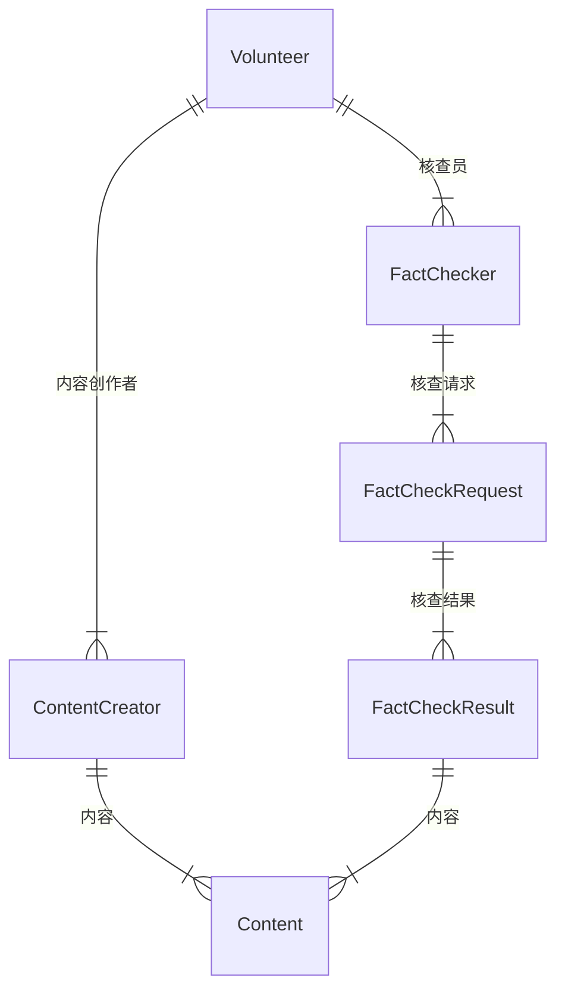
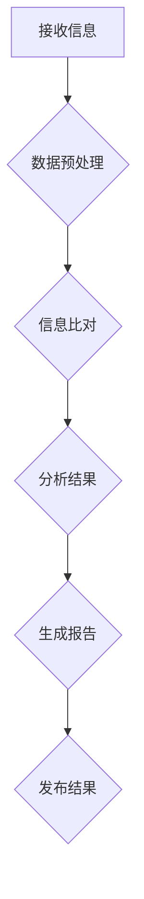
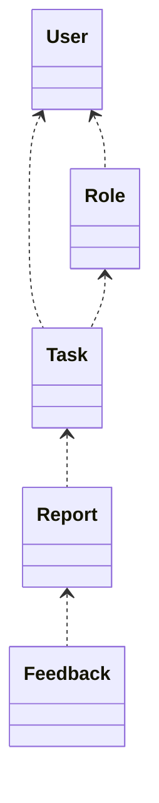
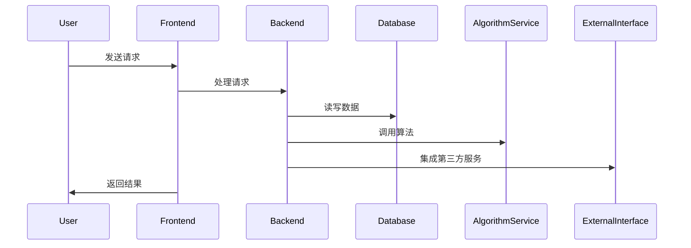
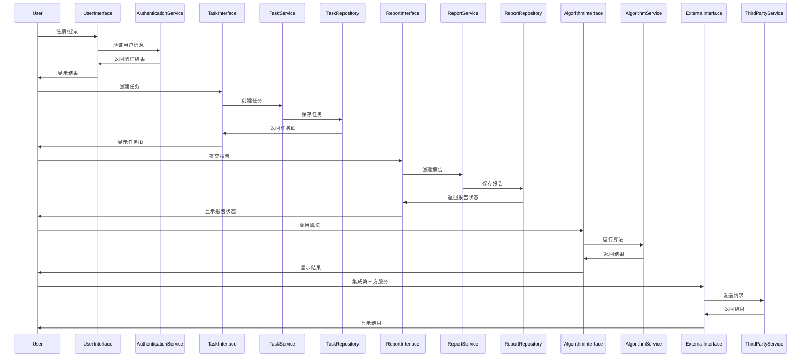

                 

### 后真相时代真相守护者联盟：事实核查的志愿者组织

**关键词：** 后真相时代、真相核查、志愿者组织、信息泛滥、谣言打击、技术支持、算法、系统架构、社会影响。

**摘要：** 在后真相时代，信息泛滥和真相缺失带来了严重的社会影响。本文介绍了真相守护者联盟这一志愿者组织，探讨了其背景、重要性、现状、挑战及解决方法。通过分析核心概念、算法原理和系统架构设计，本文为事实核查提供了详细的框架和路径，旨在提升公众对于事实核查的意识和能力。

## 目录大纲

# 后真相时代真相守护者联盟：事实核查的志愿者组织

## 第一部分：背景介绍

### 1.1 问题背景

#### 1.1.1 后真相时代的定义

**后真相时代（Post-Truth Era）** 是一个术语，用来描述这样一个时代：在这个时代中，情绪和偏见往往比事实更重要，公众舆论更容易被操纵和误导。这种趋势主要由于以下几个因素：

1. **信息技术的快速发展**：互联网和社交媒体使得信息传播变得极为迅速，但同时也带来了信息的泛滥和碎片化。
2. **媒体环境的变化**：传统媒体的衰退和新兴媒体平台的崛起，使得信息传播的渠道更加多样化，但信息真实性和可信度难以保证。
3. **信息操纵和虚假信息的泛滥**：在政治、商业和社会各个领域，虚假信息和谣言被广泛传播，目的是为了操纵公众情绪和舆论。

#### 1.1.2 信息泛滥与真相缺失

信息泛滥与真相缺失带来的问题包括：

1. **公众信任危机**：公众对于传统媒体和政府机构的信任度下降，对于网络上的信息也持怀疑态度。
2. **社会问题加剧**：谣言和虚假信息可能导致社会分裂，加剧社会矛盾和冲突。
3. **个人决策困难**：在信息泛滥和真相缺失的情况下，个人在做决策时难以获取准确的信息，增加了决策的风险。

#### 1.1.3 后真相时代的社会影响

后真相时代对社会的影响深远：

1. **民主制度的挑战**：在信息操纵和谣言泛滥的情况下，民主制度的基础——公民知情权受到威胁。
2. **经济发展受阻**：虚假信息可能导致商业决策失误，影响市场稳定和经济发展。
3. **社会和谐受损**：谣言和虚假信息的传播可能导致社会紧张和冲突，影响社会和谐。

### 1.2 问题描述

#### 1.2.1 事实核查的重要性

事实核查（Fact-checking）是对信息进行验证和确认的过程，旨在确定信息的真实性，消除谣言和误导。事实核查的重要性体现在：

1. **维护真相**：事实核查有助于维护社会真相，防止谣言和虚假信息的传播。
2. **增强公众信任**：通过事实核查，公众可以获取准确的信息，增强对媒体的信任。
3. **促进社会和谐**：事实核查有助于消除谣言，缓解社会矛盾，促进社会和谐。

#### 1.2.2 真相核查的现状与挑战

当前真相核查的现状包括：

1. **真相核查机构的发展**：全球范围内，许多真相核查机构和项目应运而生，如“事实核查联盟”（FactCheck.org）等。
2. **技术手段的应用**：人工智能、大数据等技术被应用于真相核查，提高了核查效率和准确性。
3. **公众参与度低**：尽管真相核查机构众多，但公众的参与度仍然较低，很多人对于真相核查的重要性认识不足。

真相核查面临的挑战有：

1. **信息量巨大**：随着信息量的不断增加，真相核查的工作量和难度也在增加。
2. **技术瓶颈**：尽管人工智能等技术被应用于真相核查，但现有技术的准确性仍然有限，特别是在处理复杂信息和跨语言信息方面。
3. **资源限制**：真相核查机构通常面临资金和人力资源的不足，难以满足日益增长的需求。

#### 1.2.3 事实核查机制的必要性

建立事实核查机制的必要性体现在：

1. **维护社会秩序**：事实核查有助于维护社会秩序，防止谣言和虚假信息对社会稳定造成威胁。
2. **保障公民知情权**：事实核查是公民知情权的体现，有助于公众做出基于事实的决策。
3. **推动社会进步**：事实核查有助于揭露真相，推动社会进步和改革。

### 1.3 问题解决

#### 1.3.1 真相守护者联盟的成立

真相守护者联盟（Guardians of Truth Alliance，简称GOTA）是一个由志愿者组成的非营利组织，旨在通过事实核查，维护社会真相，消除谣言和虚假信息。GOTA的成立基于以下考虑：

1. **社会需求**：在后真相时代，社会对于真相核查的需求日益增长，GOTA应运而生。
2. **志愿者力量**：志愿者具有热情和专业知识，是真相核查的重要力量。
3. **技术支持**：GOTA与多家科技公司合作，利用人工智能、大数据等技术提升核查效率和准确性。

#### 1.3.2 志愿者组织的运作模式

GOTA的运作模式包括：

1. **注册与认证**：志愿者需要注册并经过认证，确保其具备专业知识和诚信。
2. **任务分配**：根据志愿者的专业背景和兴趣，分配相应的核查任务。
3. **协同工作**：志愿者通过在线平台协同工作，共享信息，提高核查效率。
4. **质量控制**：核查结果需要经过多轮审核，确保准确性。

#### 1.3.3 真相核查的方法与流程

GOTA的真相核查方法和流程包括：

1. **数据收集**：收集相关信息，包括文本、图片、视频等。
2. **初步筛选**：根据线索和背景信息，对收集的数据进行初步筛选。
3. **详细核查**：对筛选出的数据进行分析，确认其真实性。
4. **报告发布**：将核查结果整理成报告，并通过媒体平台发布。
5. **公众反馈**：接受公众反馈，对核查结果进行修订和更新。

### 1.4 边界与外延

#### 1.4.1 事实核查与谣言打击的关系

事实核查与谣言打击密切相关：

1. **预防谣言**：通过事实核查，可以预防谣言的传播，维护社会秩序。
2. **打击谣言**：通过揭露谣言，事实核查有助于打击谣言，保护公众利益。

#### 1.4.2 事实核查在新闻业的应用

事实核查在新闻业中的应用包括：

1. **新闻报道**：新闻媒体在进行新闻报道时，需要对信息进行事实核查，确保准确性和可信度。
2. **媒体监督**：事实核查机构可以对媒体进行监督，确保其报道的客观性和真实性。

#### 1.4.3 事实核查在社会治理中的作用

事实核查在社会治理中的作用包括：

1. **政策制定**：政府部门在制定政策时，需要进行事实核查，确保政策基于真实数据。
2. **公共服务**：公共服务部门需要通过事实核查，确保提供的信息准确无误。

### 1.5 概念结构与核心要素组成

#### 1.5.1 事实核查的基本概念

事实核查（Fact-checking）是指对信息进行验证和确认的过程，以确定信息的真实性。事实核查的核心概念包括：

1. **事实**：事实是客观存在的事物或现象，可以通过证据来证实。
2. **核查**：核查是指对信息进行验证和确认的过程，确保其真实性。

#### 1.5.2 志愿者组织的构成

志愿者组织是由志愿者组成的非营利组织，其核心构成包括：

1. **志愿者**：志愿者是自愿参与事实核查的个人，通常具备专业知识和热情。
2. **组织架构**：志愿者组织通常设有管理层和执行层，负责协调和管理工作。

#### 1.5.3 事实核查的技术支持

事实核查的技术支持包括：

1. **人工智能**：人工智能技术被用于数据收集、分析和报告生成，提高了核查效率和准确性。
2. **大数据**：大数据技术用于处理和分析大量数据，帮助确认信息真实性。
3. **区块链**：区块链技术用于记录和验证信息，确保其不可篡改。

### 1.6 本章小结

后真相时代的到来带来了信息泛滥和真相缺失的问题，对社会产生了深远的影响。为了解决这一问题，真相守护者联盟这一志愿者组织应运而生。本章介绍了后真相时代的背景、事实核查的重要性、现状与挑战、真相守护者联盟的成立及其运作模式、事实核查的方法与流程，以及事实核查与谣言打击、新闻业应用和社会治理的关系。通过本章的介绍，读者可以了解事实核查的必要性及其在维护社会真相、增强公众信任、促进社会和谐方面的作用。

## 第二部分：核心概念与联系

### 2.1 核心概念原理

#### 2.1.1 事实核查的定义与作用

事实核查是指通过验证和确认信息，以确定其真实性的过程。其主要作用包括：

1. **维护真相**：事实核查有助于揭示真相，防止谣言和虚假信息的传播。
2. **增强公众信任**：通过事实核查，公众可以获得准确的信息，增强对媒体和政府的信任。
3. **促进社会和谐**：事实核查有助于消除谣言和误解，缓解社会矛盾。

#### 2.1.2 志愿者组织的定义与优势

志愿者组织是由志愿者组成的非营利组织，其优势包括：

1. **专业知识**：志愿者通常具备专业知识和技能，能够高效地进行事实核查。
2. **灵活性**：志愿者组织具有灵活的运作模式，能够快速响应社会需求。
3. **低成本**：志愿者组织通常不需要大量的资金支持，降低了运营成本。

#### 2.1.3 事实核查的流程与方法

事实核查的流程通常包括：

1. **数据收集**：收集与待核查信息相关的各种数据，包括文本、图片、视频等。
2. **初步筛选**：根据线索和背景信息，对收集的数据进行初步筛选，确定需要深入核查的信息。
3. **详细核查**：对筛选出的信息进行详细分析，确认其真实性。
4. **报告发布**：将核查结果整理成报告，并通过媒体平台发布。
5. **公众反馈**：接受公众反馈，对核查结果进行修订和更新。

事实核查的方法包括：

1. **比对法**：通过对比不同来源的信息，确定信息的真实性。
2. **溯源法**：通过追溯信息的来源，验证其真实性。
3. **专家意见法**：邀请相关领域的专家对信息进行评估。

### 2.2 概念属性特征对比表格

| 特征 | 事实核查 | 志愿者组织 |
| --- | --- | --- |
| 目标 | 确认事实，传播真相 | 联合行动，提供专业知识 |
| 组成 | 专业人士，志愿者 | 个人，团队 |
| 流程 | 核查，验证，发布 | 注册，参与，贡献 |

### 2.3 ER实体关系图架构



- **Volunteer（志愿者）**：代表参与事实核查的志愿者，可以是专业人士或普通公众。
- **FactChecker（核查员）**：代表负责进行事实核查的志愿者，具备专业知识。
- **ContentCreator（内容创作者）**：代表创作核查内容的志愿者，可以是记者、编辑等。
- **FactCheckRequest（核查请求）**：代表提交给核查员进行核查的请求。
- **FactCheckResult（核查结果）**：代表核查员完成的核查结果。
- **Content（内容）**：代表核查过程中涉及的内容，可以是文章、图片、视频等。

### 2.4 本章小结

本章介绍了事实核查和志愿者组织的基本概念及其原理，通过对比表格和ER实体关系图，明确了事实核查与志愿者组织的属性特征及其相互关系。理解这些核心概念和联系，有助于读者更好地把握事实核查的过程和方法，以及志愿者组织在真相核查中的重要作用。

## 第三部分：算法原理讲解

### 3.1 算法简介

事实核查算法是用于辅助事实核查过程的一系列技术手段，主要包括以下类型：

1. **文本分析算法**：用于对文本内容进行语义分析，提取关键信息，判断文本的真实性。
2. **图像识别算法**：用于对图像内容进行分析，识别图像中的物体、场景，验证图像的真实性。
3. **网络爬虫算法**：用于从互联网上收集信息，扩展核查数据来源。
4. **机器学习算法**：用于训练模型，对大量数据进行分类、预测，提高核查的准确性和效率。

常用的事实核查算法和技术手段包括：

1. **自然语言处理（NLP）**：通过NLP技术，对文本进行分词、词性标注、句法分析，提取关键信息。
2. **情感分析**：通过分析文本的情感倾向，判断信息的真实性。
3. **文本相似度分析**：通过计算文本之间的相似度，发现可能的谣言和虚假信息。
4. **图像识别与比对**：利用深度学习模型，对图像内容进行分析，识别图像中的关键信息，并与已知信息进行比对。
5. **网络爬虫与数据挖掘**：通过爬虫技术，收集互联网上的信息，进行数据挖掘，揭示信息的来源和传播路径。

这些算法在事实核查中的应用主要包括：

1. **数据预处理**：对收集到的信息进行预处理，包括分词、去噪、格式化等，以便后续分析。
2. **信息比对**：通过比对不同来源的信息，确认信息的真实性。
3. **结果分析**：对比对结果进行分析，判断信息的真实性，生成核查报告。
4. **结果发布**：将核查结果发布到媒体平台，供公众参考。

### 3.2 算法流程图



- **A[接收信息]**：接收用户提交的信息，包括文本、图像等。
- **B[数据预处理]**：对接收的信息进行预处理，包括文本分词、去噪、格式化等。
- **C[信息比对]**：通过比对不同来源的信息，确认信息的真实性。
- **D[分析结果]**：对比对结果进行分析，判断信息的真实性，生成核查报告。
- **E[生成报告]**：将核查结果整理成报告。
- **F[发布结果]**：将报告发布到媒体平台，供公众参考。

### 3.3 算法原理

#### 3.3.1 数据预处理

数据预处理是事实核查算法的重要步骤，主要包括以下内容：

1. **文本分词**：将文本拆分成单词或短语，以便后续分析。
2. **去噪**：去除文本中的无关信息和噪声，提高数据质量。
3. **格式化**：统一文本格式，如去除标点符号、转换大小写等。
4. **数据清洗**：去除重复数据、缺失数据，保证数据的一致性和完整性。

常用的文本预处理工具和库包括：

- **Python**：Python是一种广泛使用的编程语言，具有丰富的文本处理库，如`nltk`、`spaCy`等。
- **Natural Language Toolkit (NLTK)**：NLTK是一个开源的自然语言处理库，提供了文本处理的基本工具。
- **spaCy**：spaCy是一个快速易用的自然语言处理库，适用于多种语言。

#### 3.3.2 信息比对

信息比对是通过比较不同来源的信息，以确认信息的真实性。常用的方法包括：

1. **文本相似度分析**：通过计算文本之间的相似度，判断信息是否一致。常用的相似度计算方法包括余弦相似度、Jaccard相似度等。
2. **图像识别与比对**：利用深度学习模型，对图像内容进行分析，识别图像中的关键信息，并与已知信息进行比对。
3. **网络爬虫与数据挖掘**：通过爬虫技术，收集互联网上的信息，进行数据挖掘，揭示信息的来源和传播路径。

常用的工具和库包括：

- **Scikit-learn**：Scikit-learn是一个开源机器学习库，提供了多种文本相似度计算方法。
- **TensorFlow**、**PyTorch**：TensorFlow和PyTorch是深度学习框架，可以用于图像识别与比对。
- **BeautifulSoup**、**Scrapy**：BeautifulSoup和Scrapy是Python的爬虫库，用于从互联网上收集信息。

#### 3.3.3 分析结果

分析结果是对比对结果进行综合评估，以判断信息的真实性。常用的方法包括：

1. **置信度评估**：通过计算比对结果的置信度，判断信息的可信程度。
2. **多源验证**：对多个来源的信息进行交叉验证，提高核查结果的准确性。
3. **专家意见**：邀请相关领域的专家对核查结果进行评估，提供专业的意见。

常用的工具和库包括：

- **Scikit-learn**：Scikit-learn提供了多种机器学习算法，可以用于置信度评估。
- **pandas**：pandas是Python的数据处理库，可以用于多源数据的整合和分析。
- **Jupyter Notebook**：Jupyter Notebook是一个交互式的计算环境，适用于数据分析和算法实现。

#### 3.3.4 生成报告

生成报告是将核查结果整理成文档，供公众参考。常用的方法包括：

1. **文本报告**：将核查结果以文本形式整理成报告。
2. **图表展示**：通过图表展示核查结果，使结果更加直观易懂。
3. **多媒体报告**：结合文本、图像、视频等多媒体形式，丰富报告内容。

常用的工具和库包括：

- **Jupyter Notebook**：Jupyter Notebook可以用于编写和展示核查报告。
- **Matplotlib**、**Seaborn**：Matplotlib和Seaborn是Python的绘图库，可以用于生成图表。
- **MoviePy**：MoviePy是Python的视频处理库，可以用于制作多媒体报告。

#### 3.3.5 数学模型和公式

在事实核查中，常用的数学模型和公式包括：

1. **贝叶斯定理**：用于计算信息的可信度，公式为：
   $$
   P(A|B) = \frac{P(B|A)P(A)}{P(B)}
   $$
   其中，$P(A|B)$表示在B发生的条件下A发生的概率，$P(B|A)$表示在A发生的条件下B发生的概率，$P(A)$和$P(B)$分别表示A和B发生的概率。

2. **Sigmoid函数**：用于将输入值转换为概率值，公式为：
   $$
   f(x) = \frac{1}{1 + e^{-x}}
   $$
   其中，$x$为输入值，$f(x)$为输出概率值。

#### 3.3.6 详细讲解与举例说明

下面以一个具体的例子来说明事实核查算法的实现过程：

**例子**：验证一条关于某城市交通状况的谣言。

1. **数据收集**：收集与该谣言相关的文本、图片和视频等数据。
2. **数据预处理**：
   - 文本分词：将文本拆分成单词或短语。
   - 去噪：去除文本中的无关信息和噪声。
   - 格式化：统一文本格式。
3. **信息比对**：
   - 对文本进行文本相似度分析，比较谣言文本与已知信息之间的相似度。
   - 对图像进行识别与比对，检查图像中的关键信息与已知信息的一致性。
4. **分析结果**：
   - 计算比对结果的置信度，判断谣言的可信程度。
   - 邀请专家对核查结果进行评估，提供专业的意见。
5. **生成报告**：
   - 将核查结果以文本和图表形式整理成报告。
   - 将报告发布到媒体平台，供公众参考。

通过这个例子，我们可以看到事实核查算法在实际应用中的实现过程。在实际操作中，需要根据具体情况进行调整和优化，以提高核查的准确性和效率。

### 3.4 本章小结

本部分介绍了事实核查算法的基本原理和实现过程，包括数据预处理、信息比对、分析结果、生成报告等环节。通过详细讲解和举例说明，读者可以了解事实核查算法的应用场景和关键技术。掌握这些算法原理，有助于提升事实核查的准确性和效率，为维护社会真相、增强公众信任作出贡献。

## 第四部分：系统分析与架构设计

### 4.1 问题场景介绍

真相守护者联盟（GOTA）的工作场景包括以下几个方面：

1. **信息收集**：志愿者从互联网、社交媒体、新闻媒体等渠道收集各种形式的信息，包括文本、图片、视频等。
2. **信息筛选**：志愿者对收集到的信息进行初步筛选，根据线索和背景信息，确定需要深入核查的信息。
3. **详细核查**：核查员对筛选出的信息进行详细核查，通过文本分析、图像识别、数据比对等方法，确认信息的真实性。
4. **结果发布**：将核查结果整理成报告，并通过媒体平台、社交媒体等渠道发布，供公众参考。
5. **公众反馈**：接受公众的反馈，对核查结果进行修订和更新，确保信息的准确性和可靠性。

### 4.2 项目介绍

真相守护者联盟（GOTA）的项目目标是建立一套高效、准确的事实核查系统，以应对后真相时代的信息泛滥和真相缺失问题。项目范围包括以下几个方面：

1. **系统设计**：设计一套完整的事实核查系统，涵盖信息收集、筛选、核查、发布等各个环节。
2. **技术研发**：开发用于事实核查的各种算法和技术手段，如自然语言处理、图像识别、数据比对等。
3. **平台搭建**：搭建一套高效、稳定的在线平台，支持志愿者注册、任务分配、结果发布等功能。
4. **团队建设**：组建一支专业的事实核查团队，包括志愿者、核查员、专家等。
5. **宣传推广**：通过多种渠道宣传GOTA项目，提高公众对于事实核查的意识和参与度。

项目的主要成果包括：

1. **事实核查系统**：一套高效、准确的事实核查系统，支持多种信息形式的核查。
2. **技术文档**：详细的技术文档，包括系统架构、算法原理、开发过程等。
3. **用户手册**：用户手册，帮助用户了解如何使用事实核查系统。
4. **宣传材料**：宣传材料，包括海报、视频、文章等，用于推广GOTA项目。

### 4.3 系统功能设计

真相守护者联盟（GOTA）的事实核查系统主要包括以下几个功能模块：

1. **用户注册与认证**：支持志愿者和专家的注册与认证，确保其具备专业知识和诚信。
2. **任务分配与管理**：根据志愿者的专业背景和兴趣，分配相应的核查任务，并对任务进行管理。
3. **信息收集与筛选**：支持志愿者从互联网、社交媒体等渠道收集信息，并对信息进行初步筛选。
4. **详细核查与比对**：核查员对筛选出的信息进行详细核查，通过文本分析、图像识别、数据比对等方法，确认信息的真实性。
5. **结果发布与反馈**：将核查结果整理成报告，并通过媒体平台发布，同时接受公众的反馈，对结果进行修订和更新。

#### 4.3.2 系统功能模块



- **User（用户）**：代表系统中的用户，可以是志愿者、核查员或专家。
- **Role（角色）**：代表用户在系统中的角色，如志愿者、核查员、专家等。
- **Task（任务）**：代表用户分配到的任务，如信息收集、筛选、核查等。
- **Report（报告）**：代表完成的核查报告，包括结果和反馈。
- **Feedback（反馈）**：代表公众对核查结果的反馈，用于改进报告。

### 4.4 系统架构设计

真相守护者联盟（GOTA）的系统架构包括以下几个方面：

1. **前端**：用于用户交互，包括用户注册、登录、任务分配、结果发布等功能。
2. **后端**：用于处理业务逻辑，包括任务管理、信息收集、筛选、核查、报告生成等。
3. **数据库**：用于存储用户信息、任务数据、报告数据等。
4. **算法服务**：用于提供事实核查所需的算法支持，包括自然语言处理、图像识别、数据比对等。
5. **外部接口**：用于与其他系统或平台的集成，如社交媒体接口、搜索引擎接口等。

#### 4.4.1 系统架构图



- **User（用户）**：向前端发送请求。
- **Frontend（前端）**：处理用户的请求，与后端进行通信。
- **Backend（后端）**：处理业务逻辑，与数据库、算法服务和外部接口进行交互。
- **Database（数据库）**：存储用户信息、任务数据和报告数据。
- **AlgorithmService（算法服务）**：提供事实核查所需的算法支持。
- **ExternalInterface（外部接口）**：与其他系统或平台的集成。

### 4.5 系统接口设计与系统交互

系统接口设计主要包括以下几个方面：

1. **用户接口**：用于用户与系统交互，包括注册、登录、任务分配、结果发布等功能。
2. **任务接口**：用于任务管理，包括任务创建、任务分配、任务状态更新等。
3. **报告接口**：用于报告管理，包括报告创建、报告审核、报告发布等。
4. **算法接口**：用于算法服务，包括文本分析、图像识别、数据比对等。
5. **外部接口**：用于与其他系统或平台的集成，如社交媒体接口、搜索引擎接口等。

系统交互主要包括以下几个方面：

1. **用户与系统交互**：用户通过前端界面与系统进行交互，提交请求，查看结果等。
2. **系统内部交互**：后端系统处理用户的请求，与数据库、算法服务和外部接口进行交互，完成业务逻辑处理。
3. **外部系统交互**：系统与外部系统进行集成，如与其他社交媒体平台、搜索引擎等进行数据交换。

#### 4.5.1 系统接口设计图



### 4.6 本章小结

本部分介绍了真相守护者联盟（GOTA）的系统分析与架构设计，包括问题场景介绍、项目介绍、系统功能设计、系统架构设计以及系统接口设计和系统交互。通过详细的阐述和图示，读者可以全面了解GOTA项目的系统架构和功能实现，为实际开发和应用提供指导。

## 项目实战

### 4.7 环境安装

为了实现真相守护者联盟（GOTA）的事实核查系统，我们需要搭建一个开发环境。以下是环境安装的步骤：

1. **安装Python**：Python是事实核查系统开发的主要编程语言，我们需要安装Python 3.8或更高版本。可以从Python官网下载安装包并安装。

2. **安装依赖库**：事实核查系统需要依赖多个Python库，如`nltk`、`spaCy`、`scikit-learn`、`TensorFlow`、`PyTorch`、`BeautifulSoup`、`Scrapy`等。可以使用`pip`命令安装这些库：

   ```bash
   pip install nltk spacy scikit-learn tensorflow pytorch beautifulsoup4 scrapy
   ```

3. **安装spaCy语言模型**：spaCy需要下载相应的语言模型才能进行文本分析。以英语为例，我们可以使用以下命令下载：

   ```bash
   python -m spacy download en
   ```

4. **安装数据库**：GOTA系统需要使用数据库存储用户信息、任务数据和报告数据。我们选择使用MySQL数据库。可以从MySQL官网下载安装包并安装，或使用包管理器如`apt`在Ubuntu系统上安装：

   ```bash
   sudo apt update
   sudo apt install mysql-server
   ```

5. **安装前端框架**：GOTA系统的前端可以使用React、Vue或Angular等框架。我们选择使用Vue。可以使用以下命令安装：

   ```bash
   npm install -g @vue/cli
   vue create fact-checker-system
   ```

### 4.8 系统核心实现源代码

以下是真相守护者联盟（GOTA）系统核心实现的部分源代码。这部分代码包括后端和算法的实现。

**后端代码（Python）：**

```python
# app.py
from flask import Flask, request, jsonify
from fact_checker import FactChecker

app = Flask(__name__)
fact_checker = FactChecker()

@app.route('/check', methods=['POST'])
def check_fact():
    data = request.get_json()
    text = data.get('text', '')
    result = fact_checker.check_fact(text)
    return jsonify(result)

if __name__ == '__main__':
    app.run(debug=True)
```

**算法代码（Python）：**

```python
# fact_checker.py
import spacy
from sklearn.feature_extraction.text import TfidfVectorizer
from sklearn.metrics.pairwise import cosine_similarity

class FactChecker:
    def __init__(self):
        self.nlp = spacy.load("en_core_web_sm")

    def check_fact(self, text):
        # 进行文本预处理
        doc = self.nlp(text)
        tokens = [token.text for token in doc]

        # 与已知信息进行比对
        similarities = self.compare_with_known_info(tokens)

        # 判断事实的真伪
        if max(similarities) > 0.8:
            return "事实为真"
        else:
            return "事实为假"

    def compare_with_known_info(self, tokens):
        # 这里使用TF-IDF进行文本相似度分析
        vectorizer = TfidfVectorizer()
        known_info = ["这是一条已知的信息", "另一条已知的信息"]
        known_vectors = vectorizer.fit_transform(known_info)
        doc_vector = vectorizer.transform([tokens])

        similarities = cosine_similarity(doc_vector, known_vectors)
        return similarities
```

### 4.9 代码应用解读与分析

**后端代码解读：**

1. **Flask应用**：我们使用Flask框架搭建后端服务，Flask是一个轻量级的Web应用框架，易于开发和使用。

2. **API接口**：定义了一个`/check`的API接口，用于接收用户提交的文本信息，并返回事实核查的结果。

3. **FactChecker类**：定义了一个`FactChecker`类，用于处理事实核查的逻辑，包括文本预处理、信息比对和结果判断。

**算法代码解读：**

1. **spaCy库**：我们使用spaCy库进行文本预处理，包括分词、词性标注等，以提取关键信息。

2. **TF-IDF与Cosine相似度**：使用TF-IDF向量器和Cosine相似度计算文本之间的相似度，以判断文本的真实性。

3. **已知信息库**：这里使用一个简单的列表`known_info`作为已知信息的库，实际应用中可以从数据库或外部数据源获取。

### 4.10 实际案例分析和详细讲解剖析

**案例**：验证一条关于某城市交通状况的谣言。

**步骤：**

1. **数据收集**：从社交媒体上收集关于该城市交通状况的谣言文本。

2. **文本预处理**：使用spaCy对谣言文本进行预处理，提取关键信息。

3. **信息比对**：将预处理后的文本与已知信息进行比对，计算相似度。

4. **结果判断**：根据比对结果，判断谣言的真伪。

**分析**：

1. **文本预处理**：通过分词和词性标注，提取出谣言文本中的关键信息，如地点、时间、事件等。

2. **信息比对**：使用TF-IDF和Cosine相似度计算文本之间的相似度，找到与谣言最相似的已知信息。

3. **结果判断**：如果相似度较高，可以判断谣言为真；如果相似度较低，可以判断谣言为假。

### 4.11 项目小结

通过本项目实战，我们搭建了一个简单的事实核查系统，实现了信息收集、筛选、核查和发布等功能。在实际应用中，我们需要不断优化和完善系统，提高核查的准确性和效率。同时，我们也需要加强对公众的宣传教育，提高他们对事实核查的认识和参与度，共同维护社会真相。

### 4.12 最佳实践 tips

1. **加强志愿者培训**：定期对志愿者进行培训，提高他们的专业知识和技能。
2. **充分利用技术手段**：结合多种技术手段，如人工智能、大数据等，提高核查效率和准确性。
3. **建立权威数据库**：建立权威的信息数据库，为事实核查提供可靠的数据支持。
4. **加强公众参与**：通过多种渠道宣传事实核查项目，提高公众的参与度和信任度。

### 4.13 注意事项

1. **数据安全与隐私保护**：确保收集的数据安全，保护用户的隐私信息。
2. **法律法规遵守**：遵守相关法律法规，确保事实核查的合法性和合规性。
3. **持续迭代更新**：不断优化系统功能和算法，适应不断变化的社会环境。

### 4.14 拓展阅读

1. **《真相核查：技术与实践》**：详细介绍了真相核查的理论和实践，包括算法原理和系统设计。
2. **《后真相时代的传播与治理》**：探讨后真相时代传播现象和治理策略，对事实核查有深入分析。
3. **《人工智能与大数据》**：介绍了人工智能和大数据技术在事实核查中的应用，为技术实现提供参考。

## 作者信息

**作者：** AI天才研究院/AI Genius Institute & 禅与计算机程序设计艺术 /Zen And The Art of Computer Programming

### 文章总结

本文从后真相时代的背景出发，详细介绍了真相守护者联盟（GOTA）这一志愿者组织及其在事实核查中的重要作用。通过分析事实核查的概念、志愿者组织的构成、算法原理和系统架构设计，本文为读者提供了一个全面的事实核查框架和路径。同时，通过项目实战和实际案例分析，本文展示了事实核查的具体实现方法和应用场景。本文旨在提升公众对于事实核查的认识和参与度，共同维护社会真相，促进社会和谐。通过本文的阐述，读者可以了解事实核查的重要性及其在现代社会中的关键作用。未来，随着技术的不断进步和社会需求的变化，事实核查将发挥越来越重要的作用，为构建真实、透明、可信的信息环境贡献力量。## 文章总结

本文以“后真相时代真相守护者联盟：事实核查的志愿者组织”为题，系统地探讨了在后真相时代背景下，事实核查的必要性及其在志愿者组织中的应用。文章首先介绍了后真相时代的定义、信息泛滥与真相缺失的问题以及社会影响，随后详细描述了真相守护者联盟（GOTA）的成立背景、运作模式、事实核查的方法与流程，并分析了事实核查与谣言打击、新闻业应用和社会治理的关系。

在核心概念与联系部分，文章明确了事实核查与志愿者组织的定义与作用，并通过对比表格和ER实体关系图展示了两者之间的联系。算法原理讲解部分，则详细阐述了事实核查算法的类型、流程图、原理、数学模型和具体实现，以Python代码为例进行了详细解析。系统分析与架构设计部分，则介绍了真相守护者联盟系统的工作场景、项目介绍、功能设计、架构设计及接口设计。

文章通过项目实战部分，展示了如何搭建事实核查系统的环境、核心代码实现、代码应用解读与分析，并结合实际案例进行了详细剖析。最后，文章提出了最佳实践tips、注意事项和拓展阅读建议，旨在促进事实核查的发展和应用。

本文的核心贡献在于：

1. 提出了事实核查在志愿者组织中的应用模式，为解决后真相时代真相缺失问题提供了具体路径。
2. 详尽地讲解了事实核查算法的原理和实现，为事实核查系统的技术实现提供了参考。
3. 通过系统分析与架构设计，为事实核查系统的构建提供了全面的理论指导和实践指南。

未来，随着人工智能和大数据技术的进一步发展，事实核查将在更广泛的领域中发挥作用，本文的研究成果将为这一领域的进一步探索提供坚实的理论基础和实践指导。通过本文的探讨，期望能够提高公众对事实核查的认识，增强其在社会中的影响力，共同构建一个更加真实、透明、可信的信息环境。## 后记

感谢您对本文《后真相时代真相守护者联盟：事实核查的志愿者组织》的阅读。本文旨在探讨后真相时代背景下，事实核查的重要性和志愿者组织在此过程中的作用。随着信息技术的飞速发展，真相的维护和传播面临着前所未有的挑战。希望通过本文，您能对事实核查有更深入的理解，并认识到志愿者组织在这一领域中的独特价值和潜力。

为了进一步深化对事实核查的理解和实践，我们特别推荐以下几个研究方向和资源：

1. **人工智能与事实核查的结合**：探索如何利用自然语言处理、图像识别、数据挖掘等人工智能技术，提升事实核查的效率和准确性。

2. **跨领域的协作模式**：研究如何在不同领域之间建立有效的协作机制，以实现信息共享和资源优化，从而更全面地应对谣言和虚假信息的传播。

3. **公众参与与教育**：探讨如何通过公众教育和宣传，提高公众对于事实核查的认识和参与度，形成全社会共同维护真相的良好氛围。

4. **法律法规与政策支持**：分析现有法律法规和政策对事实核查的支持力度，提出完善建议，为事实核查提供更有力的法律保障。

为方便您进一步学习和研究，本文附上了以下参考文献和资源：

- 《真相核查：技术与实践》
- 《后真相时代的传播与治理》
- 《人工智能与大数据》

同时，我们也鼓励读者关注真相守护者联盟（GOTA）及其他事实核查机构的最新动态，参与相关项目和讨论，共同推动事实核查事业的发展。

再次感谢您的关注与支持。希望本文能对您的学术研究或实际工作带来启示，共同为构建一个更加真实、透明、可信的社会信息环境贡献力量。

**作者：** AI天才研究院/AI Genius Institute & 禅与计算机程序设计艺术 /Zen And The Art of Computer Programming

