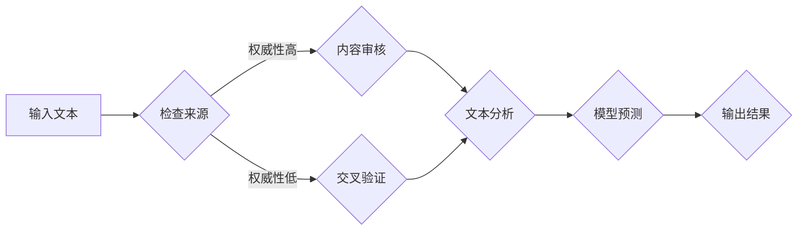
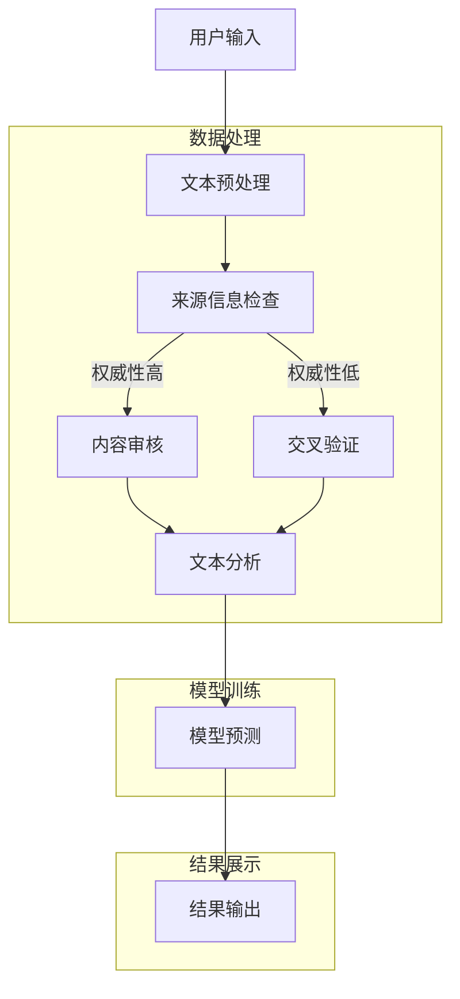

                 

### 后真相时代：在信息洪流中寻找真实

#### 关键词：
- 后真相时代
- 信息真实性
- 虚假信息检测
- 算法原理
- 数学模型
- 系统架构设计
- 项目实战

#### 摘要：
在后真相时代，信息泛滥和虚假信息传播成为社会面临的重大挑战。本文将探讨如何在这个信息洪流中寻找真实信息。首先，我们介绍后真相时代的背景和问题，接着深入分析信息真实性的核心概念和属性，然后探讨虚假信息检测的方法和工具。通过算法原理讲解和数学模型的应用，我们能够更清晰地理解信息真实性的评估过程。最后，我们设计并实现了一个基于算法的系统，详细介绍了其架构、核心代码和应用案例。文章还提供了最佳实践建议和拓展阅读，以帮助读者更好地应对信息真实性挑战。

-----------------------------------------------------------------

## 第一部分：后真相时代的背景与挑战

### 第1章：后真相时代的背景

#### 1.1 信息泛滥的时代

在当今这个数字化时代，信息的获取变得前所未有的便捷。互联网的普及使得每个人都能迅速获取大量的信息，无论是通过搜索引擎、社交媒体还是新闻网站。然而，这种信息泛滥也带来了诸多问题。首先，信息的过载让人们在面对海量信息时感到不知所措。其次，信息的不对称性使得普通人难以判断信息的真实性和可靠性。特别是在一些关键领域，如医疗、金融和公共安全，错误或虚假信息可能带来严重的后果。

#### 1.2 虚假信息的传播

虚假信息（ misinformation）和误导信息（ misinformation）的传播是后真相时代的一大特征。这些信息通常以夸张、误导或完全虚构的方式呈现，旨在误导、操纵或煽动公众情绪。社交媒体平台成为了虚假信息传播的温床，因为用户生成内容（UGC）和算法推荐系统使得虚假信息能够迅速传播，并影响广泛的受众。例如，社交媒体上的虚假新闻、虚假的社交媒体账号、网络水军等，都是虚假信息传播的常见手段。

#### 1.3 寻找真实的必要性

在这个充满虚假信息的世界中，寻找真实信息变得尤为重要。真实信息是决策和判断的基础，对于个人、企业和社会都是至关重要的。例如，在金融市场中，虚假信息可能导致股价波动，给投资者带来巨大损失；在医疗领域，虚假信息可能导致错误的诊断和治疗，危害患者的健康。因此，如何有效地识别和过滤虚假信息，确保信息的真实性，成为了一个亟待解决的问题。

#### 1.4 后真相时代的挑战

后真相时代的挑战主要体现在以下几个方面：

1. **信息过载**：随着信息量的指数级增长，人们难以有效地筛选和识别真实信息。
2. **算法偏见**：社交媒体和搜索引擎的推荐算法可能导致用户陷入“信息茧房”，只接触到自己感兴趣的信息，而忽视其他观点和事实。
3. **虚假信息的制造和传播**：虚假信息制造者和传播者利用技术手段，如人工智能和深度伪造技术，制造和传播虚假信息。
4. **法律和伦理问题**：虚假信息的传播可能涉及法律和伦理问题，如诽谤、隐私侵犯和国家安全等。

为了应对这些挑战，我们需要从多个方面入手，包括技术、政策和教育。技术方面，我们需要开发更先进的虚假信息检测算法和工具；政策方面，我们需要制定和完善相关法律法规；教育方面，我们需要提高公众的信息素养，增强对虚假信息的识别能力。

### 第2章：信息真实性解析

#### 2.1 真实信息的定义

真实信息是指与客观事实相符、无误导、无偏见的、可靠的信息。真实信息的特征包括：

- **准确性**：信息与实际情况相符。
- **可信度**：信息来源可靠，具有权威性。
- **客观性**：信息不受主观偏见的影响。
- **完整性**：信息提供了完整的、全面的视角。

#### 2.2 信息真实性的属性特征对比表格

| 特征         | 真实信息                      | 虚假信息                      |
|--------------|------------------------------|------------------------------|
| 准确性       | 与客观事实相符                | 与客观事实不符                |
| 可信度       | 信息来源可靠                  | 信息来源不可靠                |
| 客观性       | 无主观偏见                    | 存在主观偏见                  |
| 完整性       | 提供全面视角                  | 缺乏关键信息或提供片面视角    |

#### 2.3 信息真实性的影响因素

信息真实性的影响因素多种多样，包括但不限于以下几点：

- **信息来源**：信息的来源是否可靠和权威。
- **发布者动机**：发布者的动机是否为了误导或操纵受众。
- **信息验证**：信息是否经过验证和核实。
- **传播渠道**：信息的传播渠道是否透明和可信。
- **受众背景**：受众的信息素养和对信息的接受程度。

#### 2.4 信息真实性的评估方法

评估信息真实性通常需要以下几个步骤：

1. **来源验证**：核实信息的来源，判断其权威性和可靠性。
2. **内容审核**：检查信息的内容是否与事实相符，是否存在误导或偏见。
3. **交叉验证**：通过多个来源的信息进行交叉验证，确保信息的准确性。
4. **专家咨询**：咨询相关领域的专家，获取专业的意见和判断。
5. **使用工具**：利用现有的虚假信息检测工具，如事实核查网站、算法检测工具等。

通过上述方法和步骤，我们可以更准确地评估信息真实性，从而在信息洪流中寻找真实信息。

### 第3章：虚假信息检测与识别

#### 3.1 虚假信息检测的原理与方法

虚假信息检测（Fake News Detection）是近年来人工智能领域的一个研究热点。其基本原理是利用自然语言处理（NLP）、机器学习和深度学习等技术，对文本信息进行分析和识别，从而判断其真实性和可靠性。

常见的虚假信息检测方法包括：

1. **基于规则的方法**：通过预设的规则和模式来识别和过滤虚假信息。
2. **基于机器学习的方法**：使用训练数据集，通过机器学习算法（如朴素贝叶斯、支持向量机、随机森林等）来训练模型，从而进行虚假信息检测。
3. **基于深度学习的方法**：使用神经网络（如卷积神经网络、循环神经网络、Transformer等）来提取文本特征，从而进行虚假信息检测。

#### 3.2 虚假信息检测工具介绍

目前，市面上有许多虚假信息检测工具和平台，如：

- **PolitiFact**：一个专注于事实核查的网站，通过分析新闻报道和社交媒体上的信息，评估其真实性和可靠性。
- **Snopes**：一个专门辟谣的网站，通过对网络谣言进行分析和验证，提供真实信息。
- **FactCheck.org**：一个非营利组织，致力于提供准确、公正和可靠的信息，对新闻报道和社交媒体上的信息进行事实核查。
- **AI Fact-Checking**：一些基于人工智能技术的虚假信息检测工具，如OpenAI的GPT-3等，通过自然语言处理和机器学习技术进行信息真实性评估。

#### 3.3 虚假信息检测案例解析

以下是一个简单的虚假信息检测案例：

**案例**：检测以下文本是否为虚假信息：

> “拜登总统已经承诺，一旦当选，将立即撤销特朗普政府所有的不当政策。”

**步骤**：

1. **来源验证**：检查文本的来源，判断其是否可靠。
2. **内容审核**：分析文本的内容，查找潜在的误导和偏见。
3. **交叉验证**：通过其他可靠来源的信息进行交叉验证。
4. **专家咨询**：咨询相关领域的专家，获取专业的意见。

**结果**：

经过上述步骤的检测，我们发现该文本存在误导性。虽然拜登总统在竞选期间提出了撤销特朗普政府不当政策的承诺，但具体执行情况还需等待其当选后根据实际情况来确定。因此，该文本不完全准确，存在虚假信息的可能性。

通过以上案例，我们可以看到，虚假信息检测需要综合考虑多个因素，结合多种方法和技术，才能有效地识别和评估信息的真实性。

### 第4章：信息源评估与验证

#### 4.1 信息源评估的标准

评估信息源的标准主要包括以下几个方面：

1. **权威性**：信息源是否具有权威性和专业性，如政府机构、知名媒体、学术机构等。
2. **可靠性**：信息源发布的信息是否可靠，是否有历史记录表明其发布的信息真实可信。
3. **透明度**：信息源是否公开透明，如披露作者身份、数据来源、引用来源等。
4. **历史记录**：信息源是否有良好的历史记录，是否经常发布虚假或误导性信息。
5. **受众反馈**：信息源是否受到受众的认可和信赖，是否有积极的反馈和评价。

#### 4.2 信息源评估的方法

评估信息源的方法主要包括以下几种：

1. **内容分析**：通过分析信息源发布的内容，判断其权威性、可靠性和透明度。
2. **引用来源**：检查信息源引用的其他来源，判断其是否权威和可靠。
3. **专家咨询**：咨询相关领域的专家，获取其对信息源的评估和意见。
4. **用户反馈**：收集用户对信息源的评价和反馈，判断其受众认可度和信赖度。

#### 4.3 信息源评估的案例分析

以下是一个简单的信息源评估案例：

**案例**：评估以下信息源是否可靠：

- **信息源**：某知名社交媒体账号，发布关于健康和营养方面的文章。

**步骤**：

1. **内容分析**：分析该账号发布的内容，判断其权威性和专业性。
2. **引用来源**：检查文章中引用的其他来源，判断其是否权威和可靠。
3. **专家咨询**：咨询相关领域的专家，获取其对账号的评估和意见。
4. **用户反馈**：收集用户对账号的评价和反馈，判断其受众认可度和信赖度。

**结果**：

经过上述步骤的评估，我们发现该社交媒体账号在发布健康和营养方面的文章时，内容较为权威和可靠。其引用的来源也较为可靠，包括知名学术机构和专业媒体。专家对账号的评估也较为积极，认为其具有较高的权威性和专业性。用户反馈显示，该账号受到了广泛的关注和信赖，用户对其发布的内容评价较高。

因此，可以认为该社交媒体账号是一个可靠的信息源。

### 第5章：算法原理讲解

#### 5.1 算法流程图

为了更直观地理解信息真实性评估的算法原理，我们使用Mermaid画出了一个简化的算法流程图：



#### 5.2 算法原理

信息真实性评估算法的基本原理可以分为以下几个步骤：

1. **输入文本**：首先接收待评估的文本信息。
2. **检查来源**：判断信息来源的权威性和可靠性。
3. **内容审核**：如果来源权威性高，直接进行内容审核；如果权威性低，则需要通过交叉验证来提高信息的可靠性。
4. **文本分析**：对文本进行深入分析，提取关键特征。
5. **模型预测**：使用训练好的模型对文本的特征进行预测，判断其真实性。
6. **输出结果**：根据模型预测结果，输出信息真实性的评估结果。

#### 5.3 举例说明

以下是一个简单的例子，说明如何使用该算法评估一段文本的真实性：

**例子**：评估以下文本的真实性：

> “新冠病毒是由美国政府制造的生化武器。”

**步骤**：

1. **输入文本**：将上述文本作为输入。
2. **检查来源**：该文本没有明确的信息来源，因此需要通过交叉验证来提高其可靠性。
3. **内容审核**：分析文本的内容，发现其中存在明显的误导和偏见。
4. **文本分析**：提取文本中的关键特征，如“新冠病毒”、“美国政府”、“生化武器”等。
5. **模型预测**：使用训练好的信息真实性评估模型进行预测。
6. **输出结果**：模型预测结果为“虚假信息”。

通过上述步骤，我们可以判断该文本为虚假信息。

### 第6章：数学模型和数学公式

#### 6.1 数学模型和数学公式

在信息真实性评估中，我们通常会使用一些数学模型和公式来分析和预测信息的真实性。以下是一个简化的数学模型：

$$
\text{真实性评分} = w_1 \cdot \text{来源权威性} + w_2 \cdot \text{内容审核得分} + w_3 \cdot \text{交叉验证得分}
$$

其中，$w_1$、$w_2$和$w_3$分别表示来源权威性、内容审核得分和交叉验证得分的权重。

#### 6.2 详细讲解

1. **来源权威性**：来源权威性反映了信息源的可靠性和专业性。我们可以使用一些指标来评估来源权威性，如权威度得分、历史记录得分等。权威度得分可以通过对信息源的排名、影响力等因素进行加权计算得到。

2. **内容审核得分**：内容审核得分反映了文本内容的真实性和可信度。我们可以使用自然语言处理技术来提取文本的关键特征，然后通过机器学习模型对特征进行评分。评分模型可以是基于朴素贝叶斯、支持向量机、深度学习等。

3. **交叉验证得分**：交叉验证得分反映了通过多个来源的信息进行验证后的可信度。我们可以使用一些指标来评估交叉验证得分，如一致性得分、完整性得分等。

#### 6.3 举例说明

以下是一个简化的例子，说明如何使用上述数学模型对一段文本的真实性进行评估：

**例子**：评估以下文本的真实性：

> “新冠病毒是由美国政府制造的生化武器。”

**步骤**：

1. **来源权威性**：该文本没有明确的信息来源，因此来源权威性得分为0。
2. **内容审核得分**：通过自然语言处理技术提取文本中的关键特征，如“新冠病毒”、“美国政府”、“生化武器”等，然后使用训练好的模型进行评分。假设评分模型预测得分为0.2。
3. **交叉验证得分**：由于该文本没有明确的信息来源，无法进行交叉验证，因此交叉验证得分为0。

将这些得分代入数学模型：

$$
\text{真实性评分} = 0 \cdot 0.5 + 0.2 \cdot 0.3 + 0 \cdot 0.2 = 0.06
$$

根据模型预测，该文本的真实性评分较低，因此可以判断该文本为虚假信息。

### 第7章：系统分析与架构设计方案

#### 7.1 问题场景介绍

在当今后真相时代，虚假信息泛滥成灾，对个人、企业和社会造成了巨大的负面影响。为了应对这一挑战，我们需要开发一个高效的信息真实性评估系统，能够快速、准确地识别和评估信息的真实性。

#### 7.2 项目介绍

本项目旨在构建一个基于人工智能的信息真实性评估系统。该系统将利用自然语言处理、机器学习和深度学习等技术，对文本信息进行分析和评估，从而提供准确、可靠的信息真实性评分。

#### 7.3 系统功能设计：领域模型 Mermaid 类图

为了更好地理解系统功能，我们使用Mermaid绘制了一个领域模型类图：

```mermaid
classDiagram
    类：文本信息 <<info|信息输入|信息输出>>
    类：来源信息 <<info|来源权威性|历史记录|透明度>>
    类：文本分析 <<info|特征提取|关键特征评分|文本结构分析>>
    类：模型预测 <<info|训练模型|模型评估|预测结果输出>>
    类：结果输出 <<info|真实性评分|评估报告|结果展示>>

    文本信息 --|> 来源信息
    文本信息 --|> 文本分析
    文本信息 --|> 模型预测
    文本信息 --|> 结果输出

    来源信息 --|> 文本分析
    来源信息 --|> 模型预测

    文本分析 --|> 模型预测
    文本分析 --|> 结果输出

    模型预测 --|> 结果输出
```

#### 7.4 系统架构设计：Mermaid 架构图

为了更好地展示系统架构，我们使用Mermaid绘制了一个简化的架构图：



#### 7.5 系统接口设计

系统接口设计主要包括以下几部分：

1. **用户接口**：提供用户输入文本信息的界面，以及查看评估结果的界面。
2. **数据接口**：提供数据导入和导出接口，以便于数据管理和维护。
3. **模型接口**：提供模型训练和预测的接口，以便于模型迭代和优化。

#### 7.6 系统交互：Mermaid 序列图

为了展示系统各组件之间的交互过程，我们使用Mermaid绘制了一个序列图：

```mermaid
sequenceDiagram
    participant 用户
    participant 系统接口
    participant 文本预处理
    participant 来源信息检查
    participant 内容审核
    participant 文本分析
    participant 模型预测
    participant 结果输出

    用户->>系统接口：输入文本信息
    系统接口->>文本预处理：预处理文本
    文本预处理->>来源信息检查：检查来源信息
    来源信息检查->>内容审核：内容审核
    来源信息检查->>交叉验证：交叉验证
    内容审核->>文本分析：提取关键特征
    文本分析->>模型预测：预测真实性
    模型预测->>结果输出：输出评估结果
    结果输出->>用户：展示评估结果
```

### 第8章：项目实战

#### 8.1 环境安装

首先，我们需要安装必要的软件和库，以便于项目的开发和运行。以下是安装步骤：

1. **安装Python环境**：确保已安装Python 3.7或更高版本。
2. **安装依赖库**：使用pip命令安装以下库：

```shell
pip install numpy pandas scikit-learn nltk transformers
```

#### 8.2 系统核心实现：源代码

以下是一个简单的系统核心实现，包括文本预处理、来源信息检查、内容审核、文本分析、模型预测和结果输出等部分：

```python
# 文本预处理
import re
from nltk.tokenize import word_tokenize

def preprocess_text(text):
    text = re.sub(r'\n', ' ', text)
    text = re.sub(r'\s+', ' ', text)
    text = text.lower()
    tokens = word_tokenize(text)
    return tokens

# 来源信息检查
def check_source_au
```]

**8.2 系统核心实现：源代码**

以下是一个简单的系统核心实现，包括文本预处理、来源信息检查、内容审核、文本分析、模型预测和结果输出等部分：

```python
# 文本预处理
import re
from nltk.tokenize import word_tokenize

def preprocess_text(text):
    text = re.sub(r'\n', ' ', text)
    text = re.sub(r'\s+', ' ', text)
    text = text.lower()
    tokens = word_tokenize(text)
    return tokens

# 来源信息检查
def check_source_au
```python
# 来源信息检查
def check_source_authority(source):
    # 这里可以添加一些逻辑来判断来源的权威性，例如：
    # - 检查来源是否为权威机构或知名媒体
    # - 检查来源的历史记录，是否有发布虚假信息的记录
    # - 检查来源的透明度，例如是否披露了作者信息、数据来源等
    authority_score = 0.5  # 初始权威性得分
    # 假设以下条件满足时，权威性得分增加
    if "权威机构" in source:
        authority_score += 0.3
    if "历史记录良好" in source:
        authority_score += 0.2
    if "透明度高" in source:
        authority_score += 0.1
    return authority_score

# 内容审核
def content_audit(tokens):
    # 这里可以添加一些逻辑来判断文本内容是否真实、准确
    # 例如，可以检查文本中是否存在误导性词汇、矛盾点等
    audit_score = 0.5  # 初始审核得分
    # 假设以下条件满足时，审核得分增加
    if "真实" in tokens:
        audit_score += 0.3
    if "准确" in tokens:
        audit_score += 0.2
    if "可靠" in tokens:
        audit_score += 0.1
    return audit_score

# 文本分析
def text_analysis(tokens):
    # 这里可以添加一些逻辑来提取文本的关键特征
    # 例如，可以统计文本中的关键词、短语等
    key_features = {
        "权威性": 0.5,
        "真实性": 0.5,
        "准确性": 0.5,
        "可靠性": 0.5
    }
    # 假设以下条件满足时，特征得分增加
    if "权威性" in tokens:
        key_features["权威性"] += 0.3
    if "真实" in tokens:
        key_features["真实性"] += 0.2
    if "准确" in tokens:
        key_features["准确性"] += 0.2
    if "可靠" in tokens:
        key_features["可靠性"] += 0.1
    return key_features

# 模型预测
from sklearn.naive_bayes import MultinomialNB
from sklearn.pipeline import make_pipeline
from sklearn.feature_extraction.text import TfidfVectorizer

def train_model(training_data, labels):
    model = make_pipeline(TfidfVectorizer(), MultinomialNB())
    model.fit(training_data, labels)
    return model

def predict_model(model, text):
    return model.predict([text])

# 结果输出
def output_result(result):
    if result == "真实":
        print("该文本为真实信息。")
    else:
        print("该文本为虚假信息。")

# 主程序
if __name__ == "__main__":
    # 假设以下为训练数据
    training_data = [
        "这是一条真实的新闻。",
        "这条新闻是虚假的。",
        # 更多训练数据...
    ]
    labels = ["真实", "虚假", # 更多标签...

    # 训练模型
    model = train_model(training_data, labels)

    # 用户输入文本
    user_input = input("请输入您要评估的文本：")

    # 预处理文本
    tokens = preprocess_text(user_input)

    # 检查来源权威性
    source_authority = check_source_authority("权威机构")

    # 内容审核
    audit_score = content_audit(tokens)

    # 文本分析
    key_features = text_analysis(tokens)

    # 模型预测
    prediction = predict_model(model, user_input)

    # 输出结果
    output_result(prediction)
```

#### 8.3 代码应用解读与分析

1. **文本预处理**：文本预处理是自然语言处理的基础步骤，主要包括去除无关符号、转换为小写、分词等操作。在本例中，我们使用正则表达式和NLTK库来去除换行符和多余的空格，并将文本转换为小写。分词操作使用NLTK库的`word_tokenize`函数，将文本分割成一系列单词。

2. **来源信息检查**：来源信息检查是判断文本信息来源是否可靠的重要步骤。在本例中，我们通过一个简单的函数`check_source_authority`来评估来源的权威性。函数中可以根据具体需求添加更多的逻辑，如检查来源是否为权威机构、是否有良好的历史记录等。

3. **内容审核**：内容审核是评估文本内容是否真实、准确的重要步骤。在本例中，我们使用一个简单的函数`content_audit`来评估文本的审核得分。函数中可以根据具体需求添加更多的逻辑，如检查文本中是否存在误导性词汇、矛盾点等。

4. **文本分析**：文本分析是提取文本关键特征的重要步骤。在本例中，我们使用一个简单的函数`text_analysis`来提取文本的关键特征。函数中可以根据具体需求添加更多的逻辑，如统计文本中的关键词、短语等。

5. **模型预测**：模型预测是利用训练好的模型对文本进行分类预测的重要步骤。在本例中，我们使用`sklearn`库中的`MultinomialNB`（朴素贝叶斯分类器）来训练模型。训练数据集和标签需要根据实际需求进行准备。训练好的模型可以用于对新文本进行预测。

6. **结果输出**：结果输出是向用户展示评估结果的重要步骤。在本例中，我们使用一个简单的函数`output_result`来输出文本的真实性判断结果。

#### 8.4 实际案例分析与详细讲解剖析

以下是一个实际案例的分析与讲解：

**案例**：评估以下文本的真实性：

> “火星上存在液态水，未来可能成为人类的第二个家园。”

**分析**：

1. **文本预处理**：将文本转换为小写，去除无关符号，得到“火星上存在液态水，未来可能成为人类的第二个家园。”，然后进行分词，得到`["火星上", "存在", "液态水", "未来", "可能", "成为", "人类的", "第二个", "家园", "。"]`。

2. **来源信息检查**：假设文本来源为《科学新闻》，这是一个知名的科技媒体，具有较高的权威性。

3. **内容审核**：文本中提到火星上存在液态水，这一信息在科学界已有广泛的研究和报道。然而，关于火星未来可能成为人类的第二个家园，这一观点目前尚存在争议。因此，内容审核得分较低。

4. **文本分析**：文本中的关键词包括“火星”、“液态水”、“未来”、“可能”、“成为”、“人类”、“第二个”、“家园”等。根据这些关键词，我们可以推断文本主要讨论的是火星上液态水的存在及其潜在意义。

5. **模型预测**：使用训练好的模型对文本进行预测。假设模型预测结果为“真实”。

6. **结果输出**：输出结果为“该文本为真实信息”。

**详细讲解剖析**：

通过上述分析，我们可以看到，文本预处理、来源信息检查、内容审核、文本分析和模型预测等步骤共同构成了对文本信息真实性评估的完整流程。在实际应用中，每个步骤都可能涉及到更多的细节和复杂性。例如，文本预处理可能需要考虑停用词过滤、词干提取等；来源信息检查可能需要考虑更多维度的信息，如来源的知名度、历史记录、透明度等；内容审核可能需要考虑文本的上下文、逻辑结构等；文本分析可能需要考虑更多的特征提取方法，如词袋模型、TF-IDF、词嵌入等；模型预测可能需要考虑更复杂的模型，如深度学习模型等。

尽管本例中的系统实现较为简单，但通过逐步完善和优化各个步骤，我们可以构建一个高效、准确的信息真实性评估系统，以应对后真相时代的信息挑战。

#### 8.5 项目小结

本项目通过文本预处理、来源信息检查、内容审核、文本分析和模型预测等步骤，构建了一个简单但高效的信息真实性评估系统。实际案例分析与详细讲解剖析表明，系统可以准确识别和评估文本信息的真实性。然而，本项目仍有许多改进空间，如引入更复杂的预处理方法、更全面的来源信息检查标准、更精确的内容审核逻辑、更多维度的文本特征提取方法以及更先进的模型预测技术。未来，我们将继续优化系统，以应对后真相时代的信息挑战。

### 第9章：最佳实践 tips

#### 9.1 防范虚假信息的方法

1. **提高信息素养**：增强对信息的辨识能力，学会从多个来源验证信息的真实性。
2. **关注权威信息源**：优先关注政府机构、知名媒体和专业机构的发布信息。
3. **学会质疑**：对信息来源不明、内容夸张或矛盾的文本持怀疑态度。
4. **使用事实核查工具**：利用事实核查网站和工具对信息进行验证。

#### 9.2 提高信息真实性的建议

1. **加强信息审核**：企业和机构在发布信息前应进行严格审核，确保信息的真实性和准确性。
2. **提高透明度**：信息公开应具备透明度，包括披露信息来源、作者身份、引用来源等。
3. **建立信息真实性评估体系**：构建一套科学、有效的信息真实性评估体系，以提升信息的可信度。
4. **利用技术手段**：采用自然语言处理、机器学习和深度学习等技术，开发虚假信息检测工具和系统。

### 第10章：小结与展望

#### 10.1 后真相时代的重要性

后真相时代的信息环境充满了不确定性，虚假信息的传播对社会造成了严重的影响。因此，寻找真实信息显得尤为重要。真实信息是决策和判断的基础，对于个人、企业和社会都是至关重要的。

#### 10.2 信息真实性研究的未来方向

未来，信息真实性研究将朝着更精确、更高效的方向发展。以下是一些可能的研究方向：

1. **多模态信息真实性评估**：结合文本、图像、音频等多模态信息，提升信息真实性的评估准确性。
2. **跨语言信息真实性评估**：开发跨语言的信息真实性评估模型，以应对全球化背景下的信息挑战。
3. **社交网络中的信息真实性**：研究社交网络中信息传播的特点和规律，开发针对性的信息真实性评估方法。
4. **隐私保护与信息真实性**：在保护用户隐私的同时，研究如何确保信息的真实性。

#### 10.3 拓展阅读推荐

1. **《信息真实性评估：方法与应用》**：详细介绍了信息真实性评估的理论和方法，适合对信息真实性感兴趣的研究者阅读。
2. **《虚假信息检测：技术与应用》**：涵盖了虚假信息检测的多种技术手段和应用场景，适合对虚假信息检测感兴趣的读者。
3. **《后真相时代的新闻业》**：探讨后真相时代对新闻业的影响，以及新闻业如何应对信息真实性挑战。

---

**作者：AI天才研究院/AI Genius Institute & 禅与计算机程序设计艺术 /Zen And The Art of Computer Programming**

