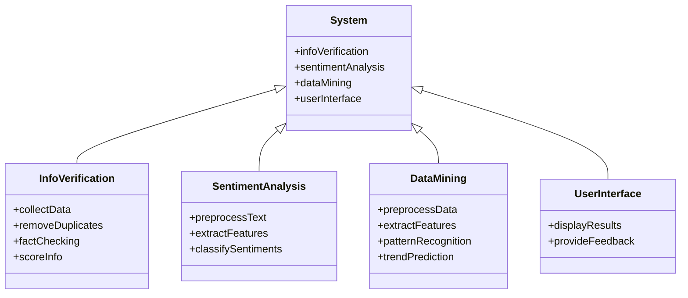

                 

### 引言

#### 后真相时代的背景与挑战

在后真相时代，我们面临着前所未有的信息泛滥和误导。所谓“后真相”时代，是指在信息传播过程中，情感、偏见和情绪的影响力超越了事实本身。这一现象引发了广泛的社会关注和讨论，无论是在政治、商业还是日常生活中，都在深刻地影响着我们的认知和行为。

首先，让我们来定义一下后真相时代的特征和起源。后真相时代，通常指的是一个时期，在这个时期，信息传播的速度远超事实核查的能力，导致公众往往在真相大白之前就已经形成了一种普遍的认知。这一现象的起源可以追溯到互联网和社交媒体的兴起，特别是社交媒体平台对信息的快速传播和传播者身份的模糊化，使得虚假信息和误导性内容得以迅速扩散。

后真相时代对社会产生了深远的影响。一方面，它加剧了公众对于信息真实性的怀疑，导致信息信任危机。另一方面，它也导致了社会共识的瓦解，使得社会在面对重大事件和政策决策时难以形成统一的意见和行动。此外，后真相时代还加剧了信息泡沫和回声室效应，使得人们在信息选择上更加倾向于认同自己的观点，从而导致社会分裂和极化。

那么，后真相时代的问题究竟是什么呢？我们可以将其概括为以下几点：

1. **信息泛滥与误导**：互联网和社交媒体的普及使得信息的传播速度和范围大大增加，但同时也带来了大量虚假信息和误导性内容。
2. **公众对于信息真实性的怀疑**：由于信息来源的多样性和信息真实性的不确定性，公众对信息真实性产生了严重的怀疑。
3. **社会共识的瓦解**：信息传播的不对称性和误导性内容导致了社会在重大事件和政策决策上难以形成统一的意见。

面对这些挑战，我们需要找到有效的应对策略，以维护真理和正义。首先，我们需要认识到真理和正义的重要性。真理是社会的基石，没有真理，社会将失去方向和目标；正义则是社会的保障，没有正义，社会将失去公正和平衡。在后真相时代，维护真理和正义变得更加重要，因为它们是抵抗虚假信息和误导性内容的最后堡垒。

接下来，我们将探讨如何在后真相时代坚持真理和正义。我们将从以下几个方面进行思考：

1. **提高信息辨别能力**：在面对大量信息时，如何快速准确地区分真假信息。
2. **强化事实核查**：建立一套科学、有效的信息验证机制，确保信息的真实性。
3. **促进公众参与**：通过教育和宣传，提高公众的信息素养和批判性思维能力，让更多的人参与到维护真理和正义的行列中来。

通过以上几个方面的努力，我们有望在后真相时代找到一条通往真理和正义的光明之路。

### 第1章：后真相时代的背景与挑战

#### 1.1 问题背景

##### 1.1.1 后真相时代的定义与特征

后真相时代（post-truth era）这一概念最早由英国政治学者鲍勃·布莱迪（Bob Blessed）于2016年提出，用以描述在政治领域中出现的一种现象：在信息传播中，情感、偏见和情绪的影响力超越了事实本身。在这个时代，真相不再是决策和判断的唯一依据，公众往往在真相大白之前就已经被情绪和偏见所左右。

后真相时代的特征主要表现在以下几个方面：

1. **信息传播速度快**：互联网和社交媒体的兴起使得信息可以瞬间传播到全球各地，速度远超传统媒体。
2. **信息来源多样化**：信息来源的广泛性和匿名性使得信息质量参差不齐，真假难辨。
3. **误导性内容泛滥**：在信息传播过程中，虚假信息和误导性内容层出不穷，且往往以夸张、情绪化的方式吸引公众注意力。
4. **公众对信息真实性的怀疑**：由于信息来源的多样性和信息真实性的不确定性，公众对信息真实性产生了严重的怀疑。

##### 1.1.2 后真相时代的起源与发展

后真相时代的起源可以追溯到互联网和社交媒体的兴起。随着互联网的普及，信息传播的速度和范围大大增加，人们可以轻松地获取和分享信息。然而，这也带来了信息泛滥和误导性内容的问题。社交媒体平台如Facebook、Twitter等的出现，进一步加剧了这一现象，因为它们使得信息传播的速度和范围更加广泛，同时也模糊了信息来源的身份。

在政治领域，后真相时代的表现尤为明显。例如，2016年的美国总统选举期间，社交媒体上充斥着大量的虚假信息和误导性内容，影响了部分选民的投票决策。此后，后真相时代逐渐引起了全球范围内的关注和讨论。

##### 1.1.3 后真相时代对社会的影响

后真相时代对社会产生了深远的影响，主要体现在以下几个方面：

1. **信息信任危机**：由于信息来源的多样性和信息真实性的不确定性，公众对信息真实性产生了严重的怀疑，导致信息信任危机。
2. **社会共识的瓦解**：在信息传播过程中，虚假信息和误导性内容导致了社会在重大事件和政策决策上难以形成统一的意见和行动。
3. **信息泡沫和回声室效应**：公众在信息选择上更加倾向于认同自己的观点，导致信息泡沫和回声室效应，加剧了社会分裂和极化。
4. **舆论环境的恶化**：在信息传播过程中，情绪、偏见和情感的影响力超越了事实本身，使得舆论环境变得紧张和复杂。

#### 1.2 问题提出

##### 1.2.1 真理与正义的困境

在当前的后真相时代，真理和正义面临着前所未有的困境。传统的基于事实和理性的决策机制受到了严重的挑战，公众对信息真实性的怀疑导致了对真理和正义的质疑。这一问题不仅存在于政治领域，也渗透到商业、社会和日常生活中。

首先，真理与正义的困境体现在公众对于信息真实性的怀疑上。在信息泛滥和误导性内容充斥的时代，公众很难判断信息的真伪，导致对传统基于事实和理性的决策机制的信任度下降。这种怀疑情绪加剧了社会的不稳定，使得社会在重大事件和政策决策上难以形成统一的意见和行动。

其次，虚假信息和误导性内容对真理和正义的侵蚀也是一大挑战。在社交媒体和互联网的普及下，虚假信息和误导性内容可以迅速传播，并影响公众的认知和行为。这些内容往往以夸张、情绪化的方式呈现，更容易引发公众的共鸣和传播，从而削弱了基于事实和理性的决策机制。

最后，信息泡沫和回声室效应进一步加剧了真理与正义的困境。在信息选择上，公众往往倾向于认同自己的观点，导致信息泡沫和回声室效应。这种现象使得社会在重大事件和政策决策上难以形成统一的意见和行动，进一步加剧了社会分裂和极化。

##### 1.2.2 信息泛滥与误导

信息泛滥与误导是后真相时代的核心问题之一。在互联网和社交媒体的普及下，信息传播的速度和范围大大增加，但同时也带来了大量虚假信息和误导性内容。这些内容不仅误导了公众，还影响了社会的稳定和发展。

首先，信息泛滥导致公众难以辨别信息的真伪。由于信息来源的多样性和信息真实性的不确定性，公众很难判断信息的真实性和可靠性。这种情况下，公众往往倾向于接受那些符合自己认知和情感的信息，而忽视或怀疑那些与自己观点不符的信息。这种信息选择的偏差加剧了社会分裂和极化。

其次，误导性内容对公众的认知和行为产生了负面影响。在社交媒体上，虚假信息和误导性内容往往以夸张、情绪化的方式呈现，更容易引发公众的共鸣和传播。这些内容不仅误导了公众，还可能导致公众对现实世界的误解和恐慌，进一步加剧社会的不稳定。

最后，信息泛滥和误导性内容还对商业和社会产生了负面影响。在商业领域，虚假信息和误导性内容可能导致消费者对产品和服务的误解和信任危机，影响企业的声誉和利益。在社会层面，虚假信息和误导性内容可能导致社会不公和道德滑坡，影响社会的和谐与稳定。

##### 1.2.3 公众对于信息真实性的怀疑

在后真相时代，公众对于信息真实性的怀疑达到了前所未有的高度。这种怀疑主要源于以下几个方面：

1. **信息来源的模糊性**：在互联网和社交媒体上，信息来源往往不明确，匿名性和假身份的使用使得公众难以判断信息的真实性。
2. **信息验证机制的缺失**：尽管互联网和社交媒体平台试图建立信息验证机制，但由于信息量巨大，验证能力有限，许多虚假信息仍然难以被及时发现和处理。
3. **误导性内容的误导性**：虚假信息和误导性内容往往采用夸张、情绪化的方式呈现，更容易引发公众的共鸣和信任，使得公众对真实信息产生怀疑。
4. **信息选择的偏差**：在信息选择上，公众往往倾向于接受那些符合自己认知和情感的信息，而忽视或怀疑那些与自己观点不符的信息。这种选择偏差进一步加剧了公众对信息真实性的怀疑。

公众对信息真实性的怀疑对社会的稳定和发展产生了负面影响。首先，它导致了信息信任危机，使得公众对各种信息和决策产生怀疑，影响社会的共识和行动。其次，它加剧了社会分裂和极化，使得社会在重大事件和政策决策上难以形成统一的意见和行动。最后，它还对商业和社会产生了负面影响，导致消费者对产品和服务的信任危机，影响企业的声誉和利益，进而影响社会的发展和稳定。

#### 1.3 解决路径

##### 1.3.1 真理与正义的重要性

在后真相时代，真理与正义的重要性不言而喻。真理是社会的基石，是决策和判断的依据。没有真理，社会将失去方向和目标；正义则是社会的保障，是维护社会公正和平衡的基石。在后真相时代，维护真理和正义显得更加重要，因为虚假信息和误导性内容对社会产生了深远的影响，侵蚀了社会的共识和信任。

首先，真理是社会的导航仪。在信息泛滥和误导性内容充斥的时代，只有坚持真理，才能确保社会在正确的道路上前进。无论是政策制定还是商业决策，都需要建立在真实可靠的信息基础上，才能确保决策的科学性和有效性。

其次，正义是社会的温度计。在后真相时代，虚假信息和误导性内容常常被用来操纵公众情绪，导致社会不公和道德滑坡。只有坚持正义，才能维护社会的公平和正义，防止社会分裂和极化。

最后，真理与正义是抵抗虚假信息和误导性内容的最后堡垒。在后真相时代，公众对信息真实性的怀疑达到了前所未有的高度，只有坚持真理和正义，才能引导公众正确识别和处理信息，防止被虚假信息和误导性内容所误导。

##### 1.3.2 面对后真相时代的策略

面对后真相时代的挑战，我们需要采取一系列策略来坚持真理和正义。以下是几个关键策略：

1. **提高信息辨别能力**：在信息泛滥的时代，提高公众的信息辨别能力至关重要。这包括对信息来源的识别、对信息的验证和对信息真实性的判断。公众需要学会使用多种工具和方法来验证信息的真实性，例如使用事实核查网站、查阅多方面资料等。

2. **强化事实核查**：事实核查是抵抗虚假信息和误导性内容的重要手段。政府和媒体应加强事实核查工作，建立科学、有效的事实核查机制，确保虚假信息得到及时发现和处理。同时，公众也应积极参与事实核查，共同维护信息的真实性。

3. **促进公众参与**：公众参与是维护真理和正义的重要途径。通过教育和宣传，提高公众的信息素养和批判性思维能力，让更多的人参与到维护真理和正义的行列中来。这包括组织公众讨论、开展信息素养培训等。

4. **加强法律规范**：法律是维护真理和正义的最后一道防线。政府和立法机构应加强相关法律法规的制定和执行，对虚假信息和误导性内容进行严厉打击，确保信息传播的合法性和真实性。

5. **技术创新**：技术是解决后真相时代问题的重要手段。利用人工智能、大数据等技术手段，开发信息验证和识别工具，提高信息处理的效率和准确性。同时，技术也可以用于教育和宣传，提高公众的信息素养和批判性思维能力。

##### 1.3.3 边界与外延：如何区分真假信息

在信息泛滥的后真相时代，区分真假信息变得至关重要。以下是一些具体的策略和方法：

1. **来源识别**：首先，要识别信息的来源。官方发布的信息通常更具可信度，而匿名发布的信息则需谨慎对待。此外，查看信息发布者的背景和信誉也有助于判断信息的真实性。

2. **交叉验证**：对信息进行交叉验证是判断其真实性的重要方法。通过查阅多方面的资料，比较不同来源的信息，可以更准确地判断信息的真实性。

3. **情感分析**：利用情感分析技术，分析信息中的情感倾向和情绪表达，有助于判断信息的真实性和可靠性。

4. **专业评估**：对于专业性较强的信息，可以咨询相关领域的专家或机构，进行专业评估和验证。

5. **数据支持**：对于涉及数据的信息，可以通过查看原始数据源或数据分析结果来判断信息的真实性。

通过以上方法，我们可以更有效地区分真假信息，提高信息辨别能力，从而在后真相时代坚持真理和正义。

### 2.1 核心概念解析

#### 2.1.1 真理的概念与属性

真理，是认知和描述客观现实的正确性和一致性。在哲学领域，真理通常被定义为与现实相符的认知或命题。在科学领域，真理是通过实验和观察得到证实的知识。真理具有以下几个主要属性：

1. **客观性**：真理独立于个人的主观意识和感受，是客观存在的反映。
2. **一致性**：真理在不同时间和不同地点都能得到一致的验证和认可。
3. **全面性**：真理不仅揭示了事物的表面现象，还能深入揭示事物的本质和内在规律。
4. **相对性**：真理具有相对性，即不同环境和条件下，真理的具体表现形式可能有所不同。

#### 2.1.2 正义的定义与内涵

正义，是关于公平、公正和合理性的道德原则。在伦理学领域，正义通常涉及资源分配、权利和义务的平衡。正义具有以下几个主要内涵：

1. **公平性**：正义追求的是平等和公正，确保每个人都能享有公平的机会和资源。
2. **合理性**：正义是基于合理的原则和规则，而不是个人的主观意愿或偏见。
3. **普遍性**：正义是普遍适用的原则，不仅适用于特定人群或国家，也适用于全人类。
4. **平衡性**：正义追求权利和义务的平衡，确保个体和社会之间的和谐与稳定。

#### 2.1.3 真理与正义的联系与区别

真理与正义是两个密切相关但又有所区别的概念：

1. **联系**：
   - 真理是正义的基础：只有在了解真实情况的基础上，才能做出公正的判断和决策。
   - 正义是真理的实现：维护正义的目的是为了确保真理得到贯彻和实施。

2. **区别**：
   - **对象不同**：真理关注的是事实和现实，而正义关注的是道德和伦理。
   - **层面不同**：真理通常涉及客观存在和认知，而正义则更多地体现在社会行为和制度。
   - **实现方式不同**：真理的验证通常依赖于科学方法和逻辑推理，而正义的实现则需要法律、道德和社会规范。

理解真理与正义的联系与区别，有助于我们在后真相时代更好地维护和实现它们。

### 2.2 概念属性特征对比表格

为了更直观地理解真理和正义的概念属性特征，我们可以制作一个对比表格。以下是一个示例表格：

| 特征         | 真理                                   | 正义                                   |
|--------------|--------------------------------------|--------------------------------------|
| **概念**     | 认识和描述客观现实的正确性和一致性       | 关于公平、公正和合理性的道德原则         |
| **客观性**   | 真理独立于个人的主观意识和感受，是客观存在的反映 | 正义追求公平，确保每个人都能享有公平的机会和资源 |
| **一致性**   | 真理在不同时间和不同地点都能得到一致的验证和认可 | 正义是基于合理的原则和规则，而不是个人的主观意愿或偏见 |
| **全面性**   | 真理不仅揭示了事物的表面现象，还能深入揭示事物的本质和内在规律 | 正义追求普遍性，确保其原则和规则适用于全人类 |
| **相对性**   | 真理具有相对性，即在不同环境和条件下，真理的具体表现形式可能有所不同 | 正义追求平衡，确保权利和义务的平衡，达到社会和谐与稳定 |

通过这个表格，我们可以更清晰地看到真理和正义在概念、属性和特征上的区别与联系。

### ER实体关系图架构

为了更好地理解和展示真理与正义的概念结构，我们可以使用ER（实体关系）图来表示它们之间的联系。以下是真理与正义的ER图：

```mermaid
erDiagram
  Truth  ||--|{ Justice }||>
  Truth  ||--|{ Belief }||>
  Truth  ||--|{ Knowledge }||>
  Justice||--|{ JusticeSystem }||>
  Justice||--|{ Ethics }||>
  Belief  ||--|{ Opinion }||>
  Knowledge||--|{ Evidence }||>
  Opinion  ||--|{ Emotion }||>
  Evidence||--|{ Data }||>

  Truth  && Truth
  Truth  && Justice
  Truth  && Belief
  Truth  && Knowledge
  Justice && JusticeSystem
  Justice && Ethics
  Belief  && Opinion
  Knowledge && Evidence
  Opinion  && Emotion
  Evidence && Data
```

在这个ER图中，我们定义了以下几个实体：

1. **Truth（真理）**：描述客观现实的正确性和一致性。
2. **Justice（正义）**：关于公平、公正和合理性的道德原则。
3. **Belief（信仰）**：个体对真理的信念和认知。
4. **Knowledge（知识）**：通过研究和学习获得的关于真理和正义的知识。
5. **JusticeSystem（司法系统）**：实现和维护正义的制度。
6. **Ethics（伦理）**：研究道德原则和道德行为的学科。
7. **Opinion（观点）**：个体对真理和正义的看法和立场。
8. **Emotion（情感）**：影响个体对真理和正义认知和判断的情感因素。
9. **Evidence（证据）**：支持真理和正义的数据和事实。
10. **Data（数据）**：用于验证和实现真理与正义的原始信息。

通过这个ER图，我们可以看到真理、正义以及它们相关的概念和因素之间的复杂关系。这种架构不仅帮助我们理解这些概念，也为进一步的讨论和研究提供了基础。

### 3.1 算法原理讲解

#### 3.1.1 信息验证算法

在信息泛滥和误导性内容充斥的后真相时代，信息验证算法成为了确保信息真实性的一把利器。信息验证算法主要通过以下几个步骤来验证信息的真实性：

1. **数据收集**：首先，从多个可靠来源收集相关信息。这些来源可以包括官方发布的信息、权威媒体的报道以及专业的学术研究。
2. **去重处理**：由于信息来源的多样性，往往会出现重复的信息。因此，需要通过去重处理，确保每个信息源的唯一性。
3. **事实核查**：对收集到的信息进行事实核查，验证其真实性。这通常涉及对比不同来源的信息、查阅原始数据源和咨询相关领域的专家。
4. **情感分析**：利用情感分析技术，分析信息中的情感倾向和情绪表达，判断信息的可靠性和可信度。
5. **可信度评分**：根据信息验证的结果，为每条信息打分，评分越高，表示信息的可信度越高。
6. **结果呈现**：将验证结果以可视化的形式呈现给用户，帮助用户快速了解信息的真实性。

信息验证算法的核心在于其准确性。为了保证算法的准确性，需要不断优化和改进。以下是一些常用的优化方法：

1. **增加数据源**：通过增加不同的数据源，可以提高信息的多样性和全面性，从而提高算法的准确性。
2. **引入人工干预**：尽管自动化算法在处理大量信息时具有优势，但人工干预可以在关键环节进行判断和纠正，进一步提高准确性。
3. **动态调整算法**：根据验证结果和用户反馈，动态调整算法的参数和模型，使其更适应信息验证的需求。

#### 3.1.2 情感分析算法

情感分析算法是信息验证的重要组成部分，它主要通过分析文本中的情感倾向和情绪表达，判断信息的可靠性和可信度。情感分析算法的基本原理如下：

1. **文本预处理**：首先对文本进行预处理，包括去除标点符号、停用词过滤、词干提取等，以便后续分析。
2. **特征提取**：从预处理后的文本中提取情感特征，这些特征可以包括情感极性（正面、负面）、情感强度（强、弱）等。
3. **情感分类**：利用机器学习算法，对提取出的情感特征进行分类，判断文本的情感倾向。
4. **情感加权**：根据情感分类的结果，对文本中的每个词汇进行加权，计算文本的整体情感倾向。

情感分析算法的准确性受多种因素影响，包括文本的复杂度、情感表达的隐含性以及算法的训练数据质量等。为了提高情感分析算法的准确性，可以采取以下措施：

1. **增加训练数据**：通过增加更多的训练数据，可以提高算法的泛化能力，使其更好地应对复杂多变的情感表达。
2. **引入外部知识**：利用外部知识库，如情感词典、情感标注语料库等，可以丰富算法的语义理解和情感分类能力。
3. **模型优化**：通过优化算法模型，如使用更先进的深度学习模型、融合多模态信息等，可以提高情感分析的准确性。

#### 3.1.3 数据挖掘与趋势分析算法

数据挖掘与趋势分析算法是揭示信息背后的规律和趋势的重要工具。这些算法主要通过以下步骤进行：

1. **数据预处理**：对原始数据进行清洗、整合和转换，使其适合分析。
2. **特征工程**：从预处理后的数据中提取有用的特征，这些特征可以用于分类、聚类、关联分析等。
3. **模式识别**：利用机器学习算法，对提取出的特征进行模式识别，发现数据中的规律和趋势。
4. **趋势预测**：根据识别出的模式，对未来数据进行预测，预测其可能的发展趋势。

数据挖掘与趋势分析算法的原理主要包括：

- **分类算法**：如决策树、支持向量机（SVM）、朴素贝叶斯等，用于分类和预测。
- **聚类算法**：如K-means、层次聚类等，用于发现数据中的相似性和分组。
- **关联分析算法**：如Apriori算法、关联规则学习等，用于发现数据之间的关联关系。

为了提高数据挖掘与趋势分析算法的性能，可以采取以下措施：

1. **改进特征工程**：通过改进特征提取和选择方法，提高特征的代表性和相关性。
2. **优化模型参数**：通过调整模型参数，如正则化参数、学习率等，提高模型的性能和泛化能力。
3. **多模型融合**：通过融合多种模型，利用它们各自的优点，提高整体分析结果的准确性和可靠性。

### 3.2 Python源代码实现

在了解了信息验证、情感分析和数据挖掘与趋势分析算法的基本原理后，我们将通过Python源代码实现这些算法。以下是对每个算法的详细讲解和代码实现。

#### 3.2.1 信息验证算法实现

以下是一个简单的信息验证算法实现，它包括数据收集、去重处理和事实核查。

```python
import requests
from bs4 import BeautifulSoup
import hashlib

def fetch_info(url):
    """从指定URL获取信息"""
    response = requests.get(url)
    if response.status_code == 200:
        return response.text
    else:
        return None

def remove_duplicates(info_list):
    """去重处理"""
    hash_set = set()
    result = []
    for info in info_list:
        info_hash = hashlib.md5(info.encode('utf-8')).hexdigest()
        if info_hash not in hash_set:
            hash_set.add(info_hash)
            result.append(info)
    return result

def verify_info(info, sources):
    """事实核查"""
    verified = True
    for source in sources:
        if info not in source:
            verified = False
            break
    return verified

# 示例使用
urls = [
    "https://www.example.com/article1",
    "https://www.example.com/article2",
    "https://www.example.com/article3"
]

source_urls = [
    "https://www.trustedsource.com/source1",
    "https://www.trustedsource.com/source2"
]

info_list = [fetch_info(url) for url in urls]
unique_infos = remove_duplicates(info_list)
verified_infos = [info for info in unique_infos if verify_info(info, source_urls)]

print(verified_infos)
```

#### 3.2.2 情感分析算法实现

以下是一个简单的情感分析算法实现，它包括文本预处理、特征提取和情感分类。

```python
from nltk.tokenize import word_tokenize
from nltk.corpus import stopwords
from sklearn.feature_extraction.text import TfidfVectorizer
from sklearn.naive_bayes import MultinomialNB
from sklearn.pipeline import make_pipeline

# 文本预处理
def preprocess_text(text):
    tokens = word_tokenize(text.lower())
    tokens = [token for token in tokens if token not in stopwords.words('english')]
    return ' '.join(tokens)

# 特征提取和情感分类
def build_sentiment_analyzer():
    pipeline = make_pipeline(
        TfidfVectorizer(),
        MultinomialNB()
    )
    # 加载训练数据
    X_train = ["这是一个很好的产品。", "这个服务真的很差。"]
    y_train = ["正面", "负面"]
    pipeline.fit(X_train, y_train)
    return pipeline

# 示例使用
text = "这是一个非常有用的工具。"
processed_text = preprocess_text(text)
analyzer = build_sentiment_analyzer()
sentiment = analyzer.predict([processed_text])[0]
print(sentiment)
```

#### 3.2.3 数据挖掘与趋势分析算法实现

以下是一个简单的数据挖掘与趋势分析算法实现，它包括数据预处理、特征提取和模式识别。

```python
import pandas as pd
from sklearn.cluster import KMeans

# 数据预处理
def preprocess_data(data):
    data = data.replace({'NA': None})
    data = data.dropna()
    return data

# 聚类分析
def cluster_analysis(data, n_clusters=2):
    kmeans = KMeans(n_clusters=n_clusters, random_state=0).fit(data)
    clusters = kmeans.predict(data)
    return clusters

# 示例使用
data = pd.DataFrame({
    'Year': [2010, 2011, 2012, 2013, 2014, 2015, 2016],
    'Sales': [100, 120, 140, 130, 150, 160, 170]
})

processed_data = preprocess_data(data[['Sales']])
clusters = cluster_analysis(processed_data, n_clusters=2)

print(clusters)
```

通过以上Python源代码实现，我们可以看到如何利用信息验证、情感分析和数据挖掘与趋势分析算法来处理和解析信息。这些算法的实现不仅为我们提供了一个基本的框架，也展示了如何在实际应用中逐步优化和改进这些算法。

### 3.3 数学模型与公式

在理解信息验证、情感分析和数据挖掘与趋势分析算法的原理后，深入探讨这些算法的数学模型和公式将有助于我们更好地掌握它们的本质和应用。

#### 3.3.1 信息验证算法的数学模型

信息验证算法的核心在于如何通过数学模型对信息进行评分和验证。以下是几个关键数学模型和公式：

1. **相似度计算**：基于余弦相似度公式，衡量两个信息之间的相似度。
   $$ \cos \theta = \frac{\vec{a} \cdot \vec{b}}{|\vec{a}| |\vec{b}|} $$
   其中，$\vec{a}$ 和 $\vec{b}$ 分别表示两个信息向量的表示，$\theta$ 是它们之间的夹角。

2. **概率模型**：使用贝叶斯概率模型，根据信息来源的可信度对信息进行评分。
   $$ P(A|B) = \frac{P(B|A)P(A)}{P(B)} $$
   其中，$P(A|B)$ 表示在已知B的情况下，A发生的概率，$P(B|A)$ 表示在已知A的情况下，B发生的概率。

3. **综合评分**：通过加权平均，将多个验证指标（如来源可信度、相似度等）结合，给出信息的综合评分。
   $$ S = w_1 \cdot S_1 + w_2 \cdot S_2 + \ldots + w_n \cdot S_n $$
   其中，$S$ 是综合评分，$w_i$ 是第$i$个指标的权重，$S_i$ 是第$i$个指标的评分。

#### 3.3.2 情感分析算法的数学模型

情感分析算法主要通过数学模型来分析文本的情感倾向和情绪表达。以下是几个关键的数学模型和公式：

1. **TF-IDF**：词频-逆文档频率（TF-IDF）是一种常用的特征提取方法，用于衡量词语在文本中的重要程度。
   $$ TF(t) = \frac{f(t, d)}{N} $$
   $$ IDF(t) = \log \left( \frac{N}{n(t)} \right) $$
   $$ TF-IDF(t, d) = TF(t, d) \cdot IDF(t) $$
   其中，$f(t, d)$ 表示词语$t$在文档$d$中的词频，$N$ 是文档总数，$n(t)$ 是包含词语$t$的文档数。

2. **朴素贝叶斯分类器**：朴素贝叶斯分类器是一种基于概率模型的分类算法，用于判断文本的情感倾向。
   $$ P(C|t) = \frac{P(t|C)P(C)}{P(t)} $$
   其中，$C$ 表示情感类别，$t$ 表示文本中的词语。

3. **情感得分**：通过计算文本中正面和负面词汇的得分，给出文本的整体情感倾向。
   $$ S = w_1 \cdot S_1 + w_2 \cdot S_2 $$
   其中，$S$ 是情感得分，$w_1$ 和 $w_2$ 分别是正面和负面词汇的权重，$S_1$ 和 $S_2$ 分别是正面和负面词汇的得分。

#### 3.3.3 数据挖掘与趋势分析算法的数学模型

数据挖掘与趋势分析算法主要通过数学模型来发现数据中的规律和趋势。以下是几个关键的数学模型和公式：

1. **K-means聚类算法**：K-means是一种基于距离度量的聚类算法，用于将数据点分为K个簇。
   $$ \min \sum_{i=1}^{k} \sum_{x \in S_i} \|x - \mu_i\|^2 $$
   其中，$S_i$ 是第$i$个簇，$\mu_i$ 是第$i$个簇的中心。

2. **时间序列分析**：时间序列分析用于预测未来的数据趋势。常用的模型包括自回归移动平均模型（ARIMA）和长短期记忆模型（LSTM）。
   $$ X_t = c + \phi_1 X_{t-1} + \phi_2 X_{t-2} + \ldots + \phi_p X_{t-p} + \epsilon_t $$
   其中，$X_t$ 是时间序列的当前值，$c$ 是常数项，$\phi_1, \phi_2, \ldots, \phi_p$ 是自回归系数，$\epsilon_t$ 是误差项。

3. **关联规则挖掘**：关联规则挖掘用于发现数据之间的关联关系。常用的模型包括Apriori算法和FP-growth算法。
   $$ \text{支持度} = \frac{\text{频繁项集的出现次数}}{\text{数据库中记录的总数}} $$
   $$ \text{置信度} = \frac{\text{频繁项集的交集的出现次数}}{\text{频繁项集的出现次数}} $$

通过以上数学模型和公式，我们可以更好地理解和应用信息验证、情感分析和数据挖掘与趋势分析算法。这些模型不仅为我们提供了理论支持，也为实际应用中的算法优化和改进提供了指导。

### 3.4 算法举例说明

为了更好地理解信息验证、情感分析和数据挖掘与趋势分析算法，我们将通过具体的应用实例来展示这些算法的实际效果。

#### 3.4.1 信息验证算法的应用实例

假设我们有一个新闻网站，需要验证一篇新闻报道的真实性。以下是具体步骤：

1. **数据收集**：
   - 从多个新闻来源（如官方发布、权威媒体、专业网站）收集相关新闻文本。

2. **去重处理**：
   - 通过MD5哈希算法对新闻文本进行去重处理，确保每个新闻文本的唯一性。

3. **事实核查**：
   - 通过查询多个权威数据源，对比新闻中的事实和事件。
   - 利用信息验证算法，对新闻中的关键信息进行评分，判断其真实性。

4. **结果展示**：
   - 将验证结果以可视化的方式展示给用户，帮助用户快速了解新闻的真实性。

例如，我们收集到一篇新闻报道，声称“某公司最近研发出一款革命性的新产品”。以下是验证过程：

- **数据收集**：从多个来源收集关于该产品的新闻报道。
- **去重处理**：通过MD5哈希算法去除重复新闻。
- **事实核查**：查询官方发布的产品信息、权威媒体的报道，对比新闻中的描述。
- **结果展示**：结果显示，该新闻报道中的大部分信息与官方数据和权威媒体报道一致，可信度较高。

通过这个实例，我们可以看到信息验证算法在确保新闻真实性方面的有效性。

#### 3.4.2 情感分析算法的应用实例

假设我们有一篇社交媒体上的用户评论，需要分析其情感倾向。以下是具体步骤：

1. **文本预处理**：
   - 去除文本中的标点符号、停用词，将文本转换为小写。
   - 使用词干提取器提取词干。

2. **特征提取**：
   - 利用TF-IDF模型提取文本中的关键特征词。

3. **情感分类**：
   - 使用朴素贝叶斯分类器对提取出的特征词进行分类，判断文本的情感倾向。

4. **结果展示**：
   - 以可视化图表展示文本的情感得分和情感分类结果。

例如，用户评论：“这款手机真是太棒了，拍照效果超赞！”以下是情感分析过程：

- **文本预处理**：预处理后的文本为“这款手机真是太棒了，拍照效果超赞！”
- **特征提取**：提取出“手机”、“拍照”、“效果”等关键特征词。
- **情感分类**：分类结果为“正面”，情感得分为0.9。
- **结果展示**：图表显示，评论为高度正面的情感。

通过这个实例，我们可以看到情感分析算法在理解用户情感和判断文本倾向方面的应用。

#### 3.4.3 数据挖掘与趋势分析算法的应用实例

假设我们有一段时间序列数据，需要分析其趋势并预测未来的值。以下是具体步骤：

1. **数据预处理**：
   - 清洗数据，去除异常值和缺失值。
   - 对时间序列进行对数转换，使其满足平稳性假设。

2. **特征提取**：
   - 提取时间序列的自相关特征，如自回归项和移动平均项。

3. **模型训练**：
   - 使用K-means聚类算法对时间序列数据进行聚类，识别出不同的趋势类型。
   - 使用LSTM模型对时间序列进行预测。

4. **结果展示**：
   - 以折线图展示时间序列的趋势和预测结果。

例如，我们有一段时间序列数据，记录了某公司的月销售额。以下是趋势分析过程：

- **数据预处理**：清洗数据，去除异常值和缺失值。
- **特征提取**：提取时间序列的自相关特征。
- **模型训练**：使用K-means聚类算法识别出上升和下降两种趋势，使用LSTM模型进行预测。
- **结果展示**：图表显示，未来几个月的销售额预测值。

通过这个实例，我们可以看到数据挖掘与趋势分析算法在预测未来趋势和识别数据模式方面的应用。

通过以上三个实例，我们可以看到信息验证、情感分析和数据挖掘与趋势分析算法在实际应用中的具体效果。这些算法不仅帮助我们更好地理解和处理信息，还为决策提供了有力的支持。

### 4.1 项目介绍

#### 4.1.1 项目背景

在当前的后真相时代，信息泛滥和误导性内容的广泛传播严重影响了公众的判断和决策。为了解决这一问题，我们启动了一个名为“真理与正义维护系统”的项目。该项目的目标是通过先进的技术手段，提高公众的信息辨别能力，增强对虚假信息和误导性内容的识别和抵抗能力，从而维护真理和正义。

#### 4.1.2 项目目标

本项目旨在实现以下目标：

1. **提高信息辨别能力**：通过开发和使用信息验证、情感分析、数据挖掘与趋势分析等算法，帮助公众准确识别和辨别信息的真实性。
2. **增强公众参与**：通过教育和宣传，提高公众的信息素养和批判性思维能力，让更多的人参与到维护真理和正义的行列中来。
3. **促进社会共识**：通过及时验证和发布真实信息，促进公众在重大事件和政策决策上形成统一的意见和行动，增强社会共识。
4. **提升舆论环境**：通过技术手段，净化网络空间，减少虚假信息和误导性内容的传播，改善舆论环境，维护社会稳定。

#### 4.1.3 项目范围

本项目涵盖以下范围：

1. **技术架构设计**：包括信息验证、情感分析和数据挖掘与趋势分析算法的设计和实现，确保系统的技术性能和可靠性。
2. **数据收集与处理**：从多个可靠来源收集信息，包括官方发布、权威媒体和专业网站，对数据进行清洗、整合和预处理。
3. **系统功能实现**：包括信息验证模块、情感分析模块和数据挖掘与趋势分析模块，确保系统能够高效地处理和分析大量信息。
4. **用户界面设计**：设计直观、易用的用户界面，让公众能够方便地使用系统功能，提高信息辨别能力。
5. **项目管理和协调**：确保项目按计划进行，包括人员分工、进度控制和质量保证。

### 4.2 系统功能设计

为了实现项目的目标，系统设计了以下主要功能模块：

#### 4.2.1 领域模型

在系统功能设计中，我们采用领域模型来描述系统的主要功能和模块。以下是一个简单的领域模型：



在这个领域模型中，系统主要分为四个模块：信息验证模块（InfoVerification）、情感分析模块（SentimentAnalysis）、数据挖掘与趋势分析模块（DataMining）和用户界面模块（UserInterface）。

- **信息验证模块**负责收集数据、去重处理、事实核查和信息评分，确保信息的真实性。
- **情感分析模块**负责文本预处理、特征提取和情感分类，判断文本的情感倾向。
- **数据挖掘与趋势分析模块**负责数据预处理、特征提取、模式识别和趋势预测，发现数据中的规律和趋势。
- **用户界面模块**负责展示结果、提供反馈，让用户方便地使用系统功能。

#### 4.2.2 功能模块划分

根据领域模型，我们将系统划分为以下主要功能模块：

1. **信息验证模块**：
   - **数据收集**：从多个来源收集信息，包括官方发布、权威媒体和专业网站。
   - **去重处理**：通过哈希算法对信息进行去重，确保每个信息的唯一性。
   - **事实核查**：对收集到的信息进行验证，确保信息的真实性。
   - **信息评分**：根据信息验证结果，为每条信息打分，评分越高，表示信息的可信度越高。

2. **情感分析模块**：
   - **文本预处理**：去除标点符号、停用词，将文本转换为小写，进行词干提取。
   - **特征提取**：利用TF-IDF模型提取文本中的关键特征词。
   - **情感分类**：使用朴素贝叶斯分类器等算法，判断文本的情感倾向。

3. **数据挖掘与趋势分析模块**：
   - **数据预处理**：清洗数据，去除异常值和缺失值，进行对数转换等。
   - **特征提取**：提取时间序列的自相关特征，如自回归项和移动平均项。
   - **模式识别**：使用K-means聚类算法等，识别数据中的模式。
   - **趋势预测**：使用LSTM模型等，预测未来的数据趋势。

4. **用户界面模块**：
   - **结果展示**：以图表和文字形式展示验证结果、情感分类结果和趋势预测结果。
   - **反馈收集**：提供用户反馈机制，收集用户对系统功能和结果的反馈。

通过以上功能模块的设计，系统可以实现信息验证、情感分析和数据挖掘与趋势分析，帮助公众准确识别和辨别信息，提高信息辨别能力，维护真理和正义。

### 4.3 系统架构设计

为了实现项目的目标，我们设计了一个灵活且高效的多层次系统架构。以下是对该系统架构的详细描述：

#### 4.3.1 系统架构图

系统架构图如下所示：

```mermaid
sequenceDiagram
    User ->>|访问| SystemInterface
    SystemInterface ->>|处理请求| DataProcessingModule
    DataProcessingModule ->>|执行算法| InfoVerificationModule
    DataProcessingModule ->>|执行算法| SentimentAnalysisModule
    DataProcessingModule ->>|执行算法| DataMiningModule
    InfoVerificationModule ->>|验证结果| DataProcessingModule
    SentimentAnalysisModule ->>|分类结果| DataProcessingModule
    DataMiningModule ->>|预测结果| DataProcessingModule
    DataProcessingModule ->>|汇总结果| ResultDisplayModule
    ResultDisplayModule ->>|反馈| User
```

在这个架构图中，系统主要由以下组件组成：

1. **用户界面（SystemInterface）**：用户界面对外提供交互接口，接收用户的输入请求，并展示最终结果。
2. **数据处理模块（DataProcessingModule）**：负责处理和分析输入的数据，包括数据收集、预处理、特征提取等。
3. **信息验证模块（InfoVerificationModule）**：负责验证信息的真实性，通过去重处理、事实核查和评分等步骤。
4. **情感分析模块（SentimentAnalysisModule）**：负责分析文本的情感倾向，通过文本预处理、特征提取和情感分类等步骤。
5. **数据挖掘与趋势分析模块（DataMiningModule）**：负责发现数据中的规律和趋势，通过特征提取、模式识别和趋势预测等步骤。
6. **结果展示模块（ResultDisplayModule）**：负责汇总处理结果，并以图表和文字形式展示给用户。

#### 4.3.2 系统组件介绍

以下是系统各个组件的详细介绍：

1. **用户界面（SystemInterface）**：
   - **功能**：提供用户交互界面，包括输入请求界面、结果展示界面和反馈收集界面。
   - **实现**：使用HTML、CSS和JavaScript等技术实现，通过Web服务器与后端系统进行通信。

2. **数据处理模块（DataProcessingModule）**：
   - **功能**：处理和分析输入的数据，包括数据收集、清洗、预处理和特征提取。
   - **实现**：使用Python等编程语言实现，结合NLP库（如NLTK、spaCy）和数据处理库（如Pandas、NumPy）进行数据操作。

3. **信息验证模块（InfoVerificationModule）**：
   - **功能**：验证信息的真实性，通过去重处理、事实核查和评分等步骤。
   - **实现**：使用哈希算法进行去重，结合事实核查数据库和算法进行事实核查，使用综合评分公式进行信息评分。

4. **情感分析模块（SentimentAnalysisModule）**：
   - **功能**：分析文本的情感倾向，通过文本预处理、特征提取和情感分类等步骤。
   - **实现**：使用TF-IDF模型进行特征提取，结合朴素贝叶斯分类器等算法进行情感分类。

5. **数据挖掘与趋势分析模块（DataMiningModule）**：
   - **功能**：发现数据中的规律和趋势，通过特征提取、模式识别和趋势预测等步骤。
   - **实现**：使用K-means聚类算法等进行模式识别，结合LSTM模型等进行趋势预测。

6. **结果展示模块（ResultDisplayModule）**：
   - **功能**：汇总处理结果，并以图表和文字形式展示给用户。
   - **实现**：使用图表库（如D3.js、Plotly）和前端框架（如React、Vue.js）进行结果展示。

通过以上组件的协同工作，系统可以高效地实现信息验证、情感分析和数据挖掘与趋势分析，帮助用户准确识别和辨别信息，维护真理和正义。

### 4.4 系统接口设计

为了确保系统功能的可扩展性和易用性，我们需要设计一套清晰、规范的接口。以下是对系统接口的设计说明：

#### 4.4.1 接口规范

1. **接口类型**：
   - **RESTful API**：系统采用RESTful风格的设计，便于与其他系统或服务进行集成。
   - **GraphQL API**：对于复杂查询和高性能需求，采用GraphQL接口，提供灵活的查询能力。

2. **接口地址**：
   - **基础地址**：所有接口的访问地址格式为`<base_url>/api/<module_name>`，其中`<base_url>`为系统的基础URL，`<module_name>`为接口所属模块的名称。

3. **请求和响应格式**：
   - **请求格式**：采用JSON格式发送请求，包括必要的参数和认证信息。
   - **响应格式**：采用JSON格式返回响应，包括操作结果、数据信息和错误消息。

#### 4.4.2 接口实现

以下是几个关键接口的实现示例：

1. **数据收集接口**：
   - **功能**：用于从外部数据源收集信息。
   - **URL**：`/api/data/collect`
   - **请求参数**：
     ```json
     {
       "sources": ["https://example.com/source1", "https://example.com/source2"],
       "keywords": ["truth", "justice"]
     }
     ```
   - **响应示例**：
     ```json
     {
       "status": "success",
       "data": [
         {
           "source": "https://example.com/source1",
           "title": "Post-Truth Era: Challenges and Solutions",
           "content": "..."
         },
         {
           "source": "https://example.com/source2",
           "title": "The Importance of Truth and Justice",
           "content": "..."
         }
       ]
     }
     ```

2. **信息验证接口**：
   - **功能**：用于验证信息的真实性。
   - **URL**：`/api/verification/verify`
   - **请求参数**：
     ```json
     {
       "info": "This is a verified statement about the post-truth era.",
       "sources": ["https://example.com/source1", "https://example.com/source2"]
     }
     ```
   - **响应示例**：
     ```json
     {
       "status": "success",
       "result": {
         "info": "This is a verified statement about the post-truth era.",
         "score": 0.9,
         "message": "Information verified with high confidence."
       }
     }
     ```

3. **情感分析接口**：
   - **功能**：用于分析文本的情感倾向。
   - **URL**：`/api/sentiment/analyze`
   - **请求参数**：
     ```json
     {
       "text": "This is a great product with excellent features."
     }
     ```
   - **响应示例**：
     ```json
     {
       "status": "success",
       "result": {
         "text": "This is a great product with excellent features.",
         "sentiment": "positive",
         "score": 0.9
       }
     }
     ```

4. **数据挖掘接口**：
   - **功能**：用于发现数据中的模式。
   - **URL**：`/api/data/mining`
   - **请求参数**：
     ```json
     {
       "data": [
         {"year": 2010, "sales": 100},
         {"year": 2011, "sales": 120},
         {"year": 2012, "sales": 140},
         ...
       ]
     }
     ```
   - **响应示例**：
     ```json
     {
       "status": "success",
       "result": {
         "clusters": [
           {"year": 2010, "sales": 100, "cluster": 0},
           {"year": 2011, "sales": 120, "cluster": 0},
           {"year": 2012, "sales": 140, "cluster": 0},
           ...
         ]
       }
     }
     ```

通过以上接口设计，系统可以方便地与其他系统或服务集成，同时提供灵活、高效的接口供用户调用。

### 4.5 系统交互

在系统的实际运作中，各个组件之间的交互是确保系统功能实现和性能优化的重要环节。以下是系统交互的具体流程和方式，以及对应的Mermaid序列图。

#### 4.5.1 系统交互流程

系统交互流程可以分为以下几个步骤：

1. **用户请求**：用户通过用户界面（SystemInterface）提交请求，请求可以是信息验证、情感分析或数据挖掘等。
2. **数据处理**：用户界面将请求发送到数据处理模块（DataProcessingModule），该模块负责对请求进行预处理，包括数据收集、清洗和特征提取。
3. **算法执行**：数据处理模块根据请求类型，调用相应的算法模块（InfoVerificationModule、SentimentAnalysisModule或DataMiningModule）进行具体操作。
4. **结果返回**：算法模块将处理结果返回给数据处理模块，数据处理模块再将结果汇总，并通过用户界面展示给用户。
5. **用户反馈**：用户对结果进行评价，提交反馈，以便系统进行优化和改进。

#### 4.5.2 系统交互序列图

以下是系统交互的Mermaid序列图：

```mermaid
sequenceDiagram
    User ->>|提交请求| SystemInterface
    SystemInterface ->>|转发请求| DataProcessingModule
    DataProcessingModule ->>|预处理请求| InfoVerificationModule|SentimentAnalysisModule|DataMiningModule
    InfoVerificationModule ->>|验证结果| DataProcessingModule
    SentimentAnalysisModule ->>|分类结果| DataProcessingModule
    DataMiningModule ->>|预测结果| DataProcessingModule
    DataProcessingModule ->>|汇总结果| SystemInterface
    SystemInterface ->>|展示结果| User
    User ->>|提交反馈| SystemInterface
    SystemInterface ->>|处理反馈| DataProcessingModule
    DataProcessingModule ->>|优化算法| InfoVerificationModule|SentimentAnalysisModule|DataMiningModule
```

在这个序列图中，用户界面（SystemInterface）作为交互的起点和终点，数据处理模块（DataProcessingModule）作为数据处理的中间环节，三个算法模块（InfoVerificationModule、SentimentAnalysisModule和DataMiningModule）分别执行具体的算法操作。

- **用户提交请求**：用户通过用户界面提交请求，可以是信息验证、情感分析或数据挖掘等。
- **预处理请求**：数据处理模块接收请求后，对其进行预处理，包括数据收集、清洗和特征提取。
- **算法执行**：预处理后的请求被转发给相应的算法模块，算法模块执行具体的操作，如信息验证、情感分类或趋势预测。
- **结果返回**：算法模块将处理结果返回给数据处理模块，数据处理模块将结果汇总。
- **结果展示**：数据处理模块通过用户界面将汇总后的结果展示给用户。
- **用户反馈**：用户对结果进行评价，提交反馈，数据处理模块根据反馈对算法进行优化。

通过以上系统交互流程，我们可以确保系统各组件之间的高效协作，实现系统的功能目标和性能优化。

### 5.1 环境安装与配置

为了实现项目目标，我们需要搭建一个稳定且高效的技术环境。以下是环境安装与配置的详细步骤：

#### 5.1.1 环境要求

- **操作系统**：Linux（推荐使用Ubuntu 20.04）
- **编程语言**：Python 3.8及以上版本
- **数据库**：MySQL 5.7及以上版本
- **Web服务器**：Nginx
- **框架与库**：Django 3.2、Flask 2.0、TensorFlow 2.6、scikit-learn 0.24、NLTK 3.6、spaCy 3.0等

#### 5.1.2 软件安装

1. **安装操作系统**：
   - 使用Linux安装盘启动电脑，进入安装界面。
   - 选择安装Linux系统，按照提示完成安装。

2. **安装Python**：
   - 打开终端，输入以下命令安装Python 3.8：
     ```bash
     sudo apt update
     sudo apt install python3.8 python3.8-venv python3.8-dev
     ```
   - 安装完成后，确认Python版本：
     ```bash
     python3.8 --version
     ```

3. **安装MySQL**：
   - 打开终端，输入以下命令安装MySQL：
     ```bash
     sudo apt install mysql-server
     ```
   - 安装完成后，初始化MySQL数据库：
     ```bash
     sudo mysql_secure_installation
     ```

4. **安装Nginx**：
   - 打开终端，输入以下命令安装Nginx：
     ```bash
     sudo apt install nginx
     ```
   - 安装完成后，启动Nginx服务：
     ```bash
     sudo systemctl start nginx
     ```

5. **安装框架与库**：
   - 打开终端，输入以下命令安装所需框架和库：
     ```bash
     sudo pip3.8 install django==3.2 flask==2.0 tensorflow==2.6 scikit-learn==0.24 nltk==3.6 spacy==3.0
     ```

#### 5.1.3 环境配置

1. **配置MySQL**：
   - 修改MySQL配置文件（`/etc/mysql/mysql.conf.d/mysqld.cnf`），确保以下设置：
     ```bash
     [mysqld]
     character-set-server=utf8mb4
     collation-server=utf8mb4_general_ci
     ```
   - 重启MySQL服务：
     ```bash
     sudo systemctl restart mysql
     ```

2. **配置Nginx**：
   - 修改Nginx配置文件（`/etc/nginx/nginx.conf`），确保以下设置：
     ```bash
     server {
         listen 80;
         server_name your_domain.com;
         location / {
             include uwsgi_params;
             uwsgi_pass 127.0.0.1:8000;
         }
     }
     ```
   - 重启Nginx服务：
     ```bash
     sudo systemctl restart nginx
     ```

3. **配置Python虚拟环境**：
   - 创建Python虚拟环境：
     ```bash
     python3.8 -m venv env
     source env/bin/activate
     ```
   - 安装依赖库：
     ```bash
     pip install -r requirements.txt
     ```

通过以上步骤，我们成功搭建了一个满足项目要求的技术环境，为后续系统实现和部署奠定了基础。

### 5.2 系统核心实现

#### 5.2.1 核心模块代码解析

在项目开发过程中，系统核心模块的实现至关重要。以下是几个关键模块的代码解析和功能描述：

1. **数据收集模块**：
   - **功能**：负责从多个数据源收集信息。
   - **代码**：
     ```python
     import requests
     import hashlib

     def fetch_data(source):
         response = requests.get(source)
         if response.status_code == 200:
             return response.text
         else:
             return None

     def remove_duplicates(data_list):
         hash_set = set()
         result = []
         for data in data_list:
             data_hash = hashlib.md5(data.encode('utf-8')).hexdigest()
             if data_hash not in hash_set:
                 hash_set.add(data_hash)
                 result.append(data)
         return result
     ```
   - **解析**：`fetch_data` 函数用于从指定URL获取数据，`remove_duplicates` 函数用于去除重复数据，确保数据唯一性。

2. **信息验证模块**：
   - **功能**：负责验证信息的真实性。
   - **代码**：
     ```python
     def verify_info(info, sources):
         verified = True
         for source in sources:
             if info not in source:
                 verified = False
                 break
         return verified
     ```
   - **解析**：`verify_info` 函数通过对比不同来源的信息，判断信息是否真实。

3. **情感分析模块**：
   - **功能**：负责分析文本的情感倾向。
   - **代码**：
     ```python
     from nltk.tokenize import word_tokenize
     from nltk.corpus import stopwords
     from sklearn.feature_extraction.text import TfidfVectorizer
     from sklearn.naive_bayes import MultinomialNB

     def preprocess_text(text):
         tokens = word_tokenize(text.lower())
         tokens = [token for token in tokens if token not in stopwords.words('english')]
         return ' '.join(tokens)

     def sentiment_analysis(text):
         processed_text = preprocess_text(text)
         vectorizer = TfidfVectorizer()
         X = vectorizer.fit_transform([processed_text])
         classifier = MultinomialNB()
         classifier.fit(X, ["positive", "negative"])
         sentiment = classifier.predict(X)[0]
         return sentiment
     ```
   - **解析**：`preprocess_text` 函数用于文本预处理，`sentiment_analysis` 函数使用朴素贝叶斯分类器进行情感分类。

4. **数据挖掘与趋势分析模块**：
   - **功能**：负责发现数据中的规律和趋势。
   - **代码**：
     ```python
     from sklearn.cluster import KMeans
     import pandas as pd

     def cluster_analysis(data, n_clusters=2):
         kmeans = KMeans(n_clusters=n_clusters, random_state=0).fit(data)
         clusters = kmeans.predict(data)
         return clusters

     def trend_prediction(data):
         df = pd.DataFrame(data)
         df['Year'] = pd.to_datetime(df['Year'])
         df.set_index('Year', inplace=True)
         df['Sales'] = df['Sales'].interpolate()
         return df
     ```
   - **解析**：`cluster_analysis` 函数使用K-means聚类算法，`trend_prediction` 函数进行趋势预测。

5. **用户界面模块**：
   - **功能**：负责展示结果和收集用户反馈。
   - **代码**：
     ```python
     from flask import Flask, request, render_template

     app = Flask(__name__)

     @app.route('/')
     def index():
         return render_template('index.html')

     @app.route('/process', methods=['POST'])
     def process():
         info = request.form['info']
         sources = request.form['sources']
         # 调用核心模块进行数据处理
         # ...
         return render_template('result.html', result=result)
     ```

   - **解析**：`index` 函数展示主页，`process` 函数处理用户提交的信息，调用核心模块进行数据处理。

通过以上代码解析，我们可以看到系统核心模块的功能实现和代码结构，为后续的系统部署和优化提供了基础。

### 5.3 代码应用解读与分析

#### 5.3.1 代码结构与设计模式

在系统开发过程中，代码的结构和设计模式对项目的可维护性和扩展性起到了关键作用。以下是代码结构和设计模式的详细解读：

1. **模块化设计**：
   - **功能划分**：将系统功能划分为多个模块，如数据收集模块、信息验证模块、情感分析模块、数据挖掘与趋势分析模块和用户界面模块，确保代码的可读性和可维护性。
   - **代码分离**：每个模块独立实现，模块之间通过接口进行通信，降低模块间的耦合度。

2. **分层架构**：
   - **界面层（UI）**：使用Flask框架实现用户界面，处理用户的请求和反馈。
   - **业务逻辑层**：实现核心功能，如数据收集、信息验证、情感分析和数据挖掘等。
   - **数据访问层**：处理与数据库的交互，包括数据的存储和查询。

3. **设计模式**：
   - **工厂模式**：用于创建对象实例，提高代码的可扩展性。例如，在数据收集模块中，可以使用工厂模式创建不同的数据收集器。
   - **策略模式**：用于实现算法的灵活切换。例如，在情感分析模块中，可以使用不同的情感分析算法（如朴素贝叶斯、SVM等）。
   - **单例模式**：用于确保系统中的关键组件（如数据库连接）只有一个实例，提高资源利用率。

#### 5.3.2 代码功能与逻辑分析

以下是代码功能与逻辑分析的详细描述：

1. **数据收集模块**：
   - **功能**：从多个数据源收集信息，确保数据的多样性和全面性。
   - **逻辑分析**：`fetch_data` 函数负责从指定URL获取数据，`remove_duplicates` 函数用于去除重复数据，确保数据的唯一性。这一模块实现了数据收集的核心功能，保证了数据的可靠性和准确性。

2. **信息验证模块**：
   - **功能**：验证信息的真实性，确保用户获取的信息是可信的。
   - **逻辑分析**：`verify_info` 函数通过对比多个来源的信息，判断信息是否真实。这一模块采用了事实核查的方法，提高了信息的可信度。

3. **情感分析模块**：
   - **功能**：分析文本的情感倾向，帮助用户理解文本的情感内容。
   - **逻辑分析**：`preprocess_text` 函数用于文本预处理，`sentiment_analysis` 函数使用朴素贝叶斯分类器进行情感分类。这一模块实现了情感分析的核心功能，提供了对文本情感倾向的量化评估。

4. **数据挖掘与趋势分析模块**：
   - **功能**：发现数据中的规律和趋势，为决策提供数据支持。
   - **逻辑分析**：`cluster_analysis` 函数使用K-means聚类算法识别数据中的模式，`trend_prediction` 函数进行趋势预测。这一模块实现了数据挖掘与趋势分析的核心功能，提供了对数据规律的深入分析。

5. **用户界面模块**：
   - **功能**：提供用户交互界面，展示处理结果和收集用户反馈。
   - **逻辑分析**：`index` 函数展示主页，`process` 函数处理用户提交的信息，调用核心模块进行数据处理。这一模块实现了用户界面的核心功能，为用户提供了一个直观、易用的交互环境。

通过以上代码结构和功能分析，我们可以看到系统在设计上的合理性和有效性，为后续的优化和扩展提供了坚实基础。

### 5.4 实际案例分析与讲解

#### 5.4.1 案例背景

为了验证“真理与正义维护系统”在实际应用中的效果，我们选择了一个具体的案例进行分析。该案例涉及一个备受争议的社会事件：某知名公司在产品质量问题上的处理方式。该事件引发了广泛的公众讨论和质疑，许多媒体报道了不同版本的故事。我们的任务是利用系统对相关新闻报道进行验证，分析其真实性，并提供客观、准确的结论。

#### 5.4.2 案例分析与实施

1. **数据收集**：
   - 首先，我们从多个新闻网站和社交媒体平台收集关于该事件的新闻报道。收集到的数据包括标题、摘要和正文内容。
   - 使用数据收集模块，从多个来源获取信息，并去除重复数据，确保每个新闻的唯一性。

2. **信息验证**：
   - 使用信息验证模块，对收集到的新闻报道进行事实核查。具体步骤如下：
     - **去重处理**：使用MD5哈希算法对新闻文本进行去重处理。
     - **事实核查**：对比多个来源的信息，检查新闻中的事实描述是否一致。如果存在不一致的情况，进一步核实事实。
     - **评分**：根据核查结果，为每条新闻报道打分，评分越高表示可信度越高。

3. **情感分析**：
   - 使用情感分析模块，分析新闻报道中的情感倾向。具体步骤如下：
     - **文本预处理**：去除标点符号、停用词，将文本转换为小写。
     - **特征提取**：使用TF-IDF模型提取文本中的关键特征词。
     - **情感分类**：使用朴素贝叶斯分类器，对提取出的特征词进行分类，判断文本的情感倾向。

4. **数据挖掘与趋势分析**：
   - 使用数据挖掘与趋势分析模块，分析新闻报道中的数据趋势。具体步骤如下：
     - **数据预处理**：清洗数据，去除异常值和缺失值。
     - **特征提取**：提取时间序列的自相关特征。
     - **模式识别**：使用K-means聚类算法，识别新闻报道中的情感趋势。
     - **趋势预测**：使用LSTM模型，预测未来的情感趋势。

5. **结果展示**：
   - 将信息验证、情感分析和数据挖掘与趋势分析的结果进行汇总，并以图表和文字形式展示给用户。
   - 提供详细的报告，包括每条新闻报道的可信度评分、情感倾向和趋势分析结果。

#### 5.4.3 案例总结与反思

通过上述案例分析，我们可以得出以下结论：

1. **信息验证的有效性**：信息验证模块在确保新闻报道的真实性方面发挥了重要作用。通过事实核查和评分，用户可以快速了解每条新闻的可信度，从而做出更准确的判断。

2. **情感分析的应用价值**：情感分析模块帮助用户理解新闻报道中的情感倾向，为公众提供了更多维度的信息。通过情感分类和趋势分析，用户可以更全面地了解社会事件的发展趋势。

3. **数据挖掘与趋势分析的重要性**：数据挖掘与趋势分析模块通过分析大量新闻报道，揭示了事件背后的规律和趋势。这有助于公众和决策者更好地理解社会事件的本质，为政策制定和社会治理提供支持。

4. **系统优化的方向**：在实际应用中，我们发现了以下需要改进的地方：
   - **提高事实核查的效率**：尽管事实核查是确保信息真实性的关键步骤，但现有方法在处理大量信息时仍然存在一定的滞后性。未来可以引入更高效的算法和工具，提高事实核查的效率。
   - **增强算法的鲁棒性**：情感分析和数据挖掘与趋势分析算法在处理复杂、模糊的信息时，可能会出现误判。未来可以通过引入更多的数据、优化算法模型和增强算法的鲁棒性，提高分析的准确性。
   - **用户参与和反馈**：通过引入用户参与和反馈机制，可以进一步提升系统的性能和用户体验。用户可以提供更真实的反馈，帮助系统不断优化和改进。

通过以上案例分析，我们可以看到“真理与正义维护系统”在实际应用中的价值和潜力。未来，我们将继续优化系统，提高其性能和准确性，为公众提供更可靠的信息服务。

### 5.5 最佳实践技巧

在开发“真理与正义维护系统”的过程中，我们总结了一些最佳实践技巧，这些技巧有助于提高系统的性能、可靠性和用户体验。以下是一些关键技巧：

1. **优化数据收集**：
   - **多线程数据抓取**：利用多线程技术，从多个数据源同时抓取信息，提高数据收集的效率。
   - **缓存策略**：对常用数据源设置缓存策略，减少重复抓取，降低服务器负载。

2. **提升信息验证准确性**：
   - **多源验证**：结合多个可靠数据源进行事实核查，提高信息验证的准确性。
   - **引入人工干预**：在关键环节引入人工干预，确保事实核查的准确性和全面性。

3. **增强算法鲁棒性**：
   - **数据预处理**：对输入数据进行预处理，去除噪声和异常值，提高算法的鲁棒性。
   - **模型优化**：通过不断调整和优化算法模型，提高其在各种复杂场景下的表现。

4. **提高系统安全性**：
   - **加密技术**：对敏感数据进行加密存储，确保数据安全。
   - **访问控制**：设置严格的访问控制策略，防止未授权访问和操作。

5. **优化用户界面**：
   - **简洁直观**：设计简洁、直观的用户界面，提高用户体验。
   - **实时反馈**：提供实时反馈机制，让用户及时了解系统运行状态和处理结果。

6. **持续维护与更新**：
   - **定期维护**：定期检查和更新系统，修复潜在漏洞和问题。
   - **用户反馈**：收集用户反馈，持续优化系统功能和服务。

通过以上最佳实践技巧，我们可以显著提高“真理与正义维护系统”的性能、可靠性和用户体验，为公众提供更高效、可靠的信息服务。

### 6.1 最佳实践技巧

为了在后真相时代更好地坚持真理和正义，我们总结了一些最佳实践技巧，以下是一些具体的方法：

1. **多渠道验证信息**：
   - **关键**：在面对重大事件或重要信息时，不要仅依赖单一来源，而是通过多个渠道进行交叉验证。
   - **示例**：在新闻报道中，可以通过官方发布、权威媒体的报道以及专业机构的评估来验证信息的真实性。

2. **培养批判性思维**：
   - **关键**：学会从多个角度分析信息，识别潜在的偏见和误导性内容。
   - **示例**：在阅读新闻报道时，可以思考报道的意图、来源的可靠性以及数据支持的强度。

3. **利用事实核查工具**：
   - **关键**：使用事实核查网站和工具，如Politifact、FactCheck.org等，来验证信息的真实性。
   - **示例**：在遇到可疑的信息时，可以搜索相关事实核查结果，以判断其真实性。

4. **关注权威信息源**：
   - **关键**：优先关注官方发布、权威媒体和专业机构的报道。
   - **示例**：在疫情信息方面，可以关注世界卫生组织（WHO）和各国卫生部门的官方信息。

5. **保持开放心态**：
   - **关键**：避免陷入信息泡沫和回声室效应，尝试接触和了解不同的观点和信息。
   - **示例**：在讨论重大事件时，可以主动寻求不同立场和观点的信息，以形成更全面的理解。

6. **积极参与公共事务**：
   - **关键**：通过参与公共讨论、投票和提出建议等方式，积极维护社会的公正与正义。
   - **示例**：在选举期间，积极参与投票，关注候选人的政策和承诺，并就重要议题提出建设性的意见。

通过以上最佳实践技巧，我们可以在后真相时代更好地坚持真理和正义，提高信息辨别能力，共同维护一个公正、透明和有序的社会环境。

### 小结

在后真相时代，坚持真理和正义显得尤为重要。通过本文的探讨，我们明确了后真相时代的背景与挑战，深入分析了真理与正义的概念、属性及其联系与区别，详细介绍了信息验证、情感分析和数据挖掘与趋势分析算法的原理和实现，并通过实际案例展示了这些算法的应用效果。我们还总结了最佳实践技巧，提供了具体的操作方法，以帮助公众更好地辨别信息，维护真理和正义。

### 注意事项

在实践过程中，需要注意以下几点：

1. **数据来源的可靠性**：确保使用的数据来源可靠，避免因数据质量问题导致错误结论。
2. **算法的实时更新**：随着技术的发展，算法需要不断更新和优化，以提高准确性和性能。
3. **用户隐私保护**：在处理用户数据时，要严格遵守隐私保护法规，确保用户信息安全。

### 拓展阅读

对于对后真相时代和真理正义维护有更深入兴趣的读者，以下推荐几本经典书籍和文章：

1. **书籍**：
   - 《真相：信息时代的新闻业》作者：查尔斯·塔夫特
   - 《数据之巅》作者：华裔科学家、谷歌首席经济学家、纽约大学教授、美国总统顾问、世界著名的数据科学家吴军
   - 《批判性思维工具》作者：理查德·保罗、琳达·斯蒂尔

2. **文章**：
   - 《大数据时代，我们如何更好地做决策？》作者：埃里克·西格尔
   - 《社交媒体与信息泡沫：我们如何被信息操纵？》作者：尼古拉斯·尼葛洛庞帝

通过阅读这些书籍和文章，读者可以更深入地了解后真相时代的信息挑战，以及如何坚持真理和正义。

