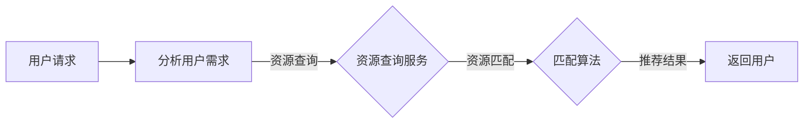
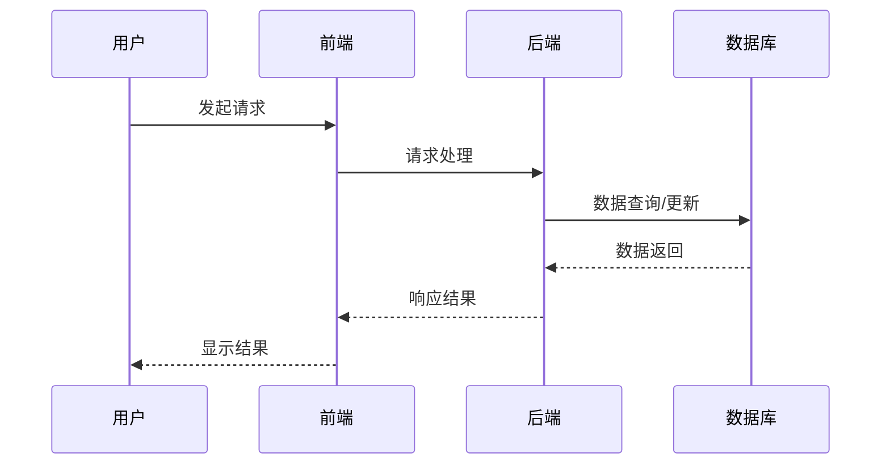
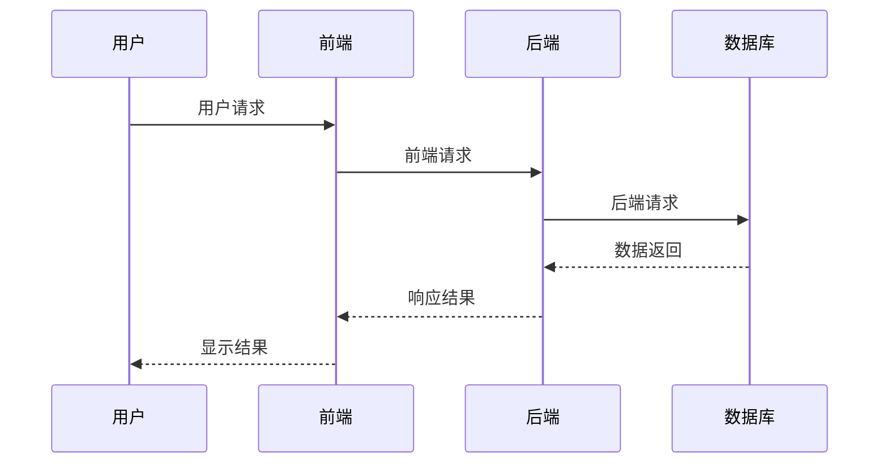

                 

### 文章标题

# 后资本主义思潮：经济模式的未来展望

### 关键词

- 后资本主义
- 经济模式
- 未来展望
- 社会创新
- 技术进步

### 摘要

本文旨在探讨后资本主义思潮在当前社会经济环境中的起源、发展及其对未来经济模式的影响。我们将深入分析后资本主义的核心概念和特征，探讨其与传统经济模式的区别和联系，以及在不同领域的应用与实践。通过本文的探讨，我们希望能够为读者提供对后资本主义经济模式的全面理解和未来展望。

---

### 目录

1. **背景介绍**
   1.1 后资本主义思潮的起源
   1.2 后资本主义的核心概念
   1.3 后资本主义与传统经济模式的对比

2. **核心概念与联系**
   2.1 后资本主义的核心理念
   2.2 核心理念对比表格
   2.3 后资本主义的ER实体关系图

3. **算法原理讲解**
   3.1 后资本主义经济模式中的算法原理
   3.2 算法mermaid流程图
   3.3 Python源代码实现与讲解

4. **系统分析与架构设计方案**
   4.1 问题场景介绍
   4.2 系统功能设计
   4.3 系统架构设计
   4.4 系统接口设计
   4.5 系统交互mermaid序列图

5. **项目实战**
   5.1 环境安装
   5.2 系统核心实现源代码
   5.3 代码应用解读与分析
   5.4 实际案例分析与讲解
   5.5 项目小结

6. **最佳实践 tips**
   6.1 实践技巧
   6.2 注意事项
   6.3 拓展阅读

7. **小结**
   7.1 总结与展望
   7.2 后资本主义思潮的未来发展趋势

### 作者

作者：AI天才研究院/AI Genius Institute & 禅与计算机程序设计艺术 /Zen And The Art of Computer Programming

---

#### 1. 背景介绍

**1.1 后资本主义思潮的起源**

后资本主义思潮的起源可以追溯到20世纪末和21世纪初，这一时期全球范围内出现了一系列经济、社会和技术的变革。随着全球化、信息技术的快速发展和金融市场的深化，传统的资本主义经济模式开始面临诸多挑战，如资源枯竭、环境恶化、收入不平等加剧等。这些挑战促使人们开始重新审视和思考现有的经济模式，后资本主义思潮应运而生。

**1.2 后资本主义的核心概念**

后资本主义思潮的核心概念包括：共享经济、去中心化、社会创新、可持续发展等。这些概念强调的是经济活动的重新组织，通过减少不必要的中间环节，提高资源利用效率，实现经济、社会和环境的共同发展。

**1.3 后资本主义与传统经济模式的对比**

传统资本主义经济模式强调市场竞争、私有制和利润最大化。而后资本主义则更加关注社会公平、资源共享和可持续发展。在传统经济模式中，资源主要掌握在少数人手中，而在后资本主义经济模式中，资源更加分散，每个人都有机会参与到经济活动中。

#### 2. 核心概念与联系

**2.1 后资本主义的核心理念**

后资本主义的核心理念包括：

- **共享经济**：通过共享资源和服务，提高资源利用效率，减少浪费。
- **去中心化**：减少对中央集权的依赖，实现权力和资源的分散化。
- **社会创新**：通过创新，推动社会和经济的可持续发展。
- **可持续发展**：在满足当前需求的同时，不损害后代满足其需求的能力。

**2.2 核心理念对比表格**

| 核心概念   | 传统资本主义经济模式 | 后资本主义经济模式 |
|------------|-------------------------|-----------------------|
| 资源分配   | 私有制，少数人掌握资源 | 共享制，资源分散化   |
| 市场机制   | 竞争为主，利润最大化   | 合作为主，共享资源   |
| 发展目标   | 经济增长为主          | 可持续发展为主       |
| 权力结构   | 集权化，少数人决策    | 分权化，民主参与     |

**2.3 后资本主义的ER实体关系图**

```mermaid
erDiagram
  类A --> 类B
  类C ||--|{ 类D }
  类E {类F}  
```

在上面的ER实体关系图中，类A、类B、类C、类D、类E和类F分别代表不同的实体，它们之间的关系反映了后资本主义经济模式中不同实体之间的互动和联系。

---

在接下来的章节中，我们将进一步探讨后资本主义经济模式中的算法原理、系统分析与架构设计方案，以及实际项目实战。通过这些内容的深入讲解，我们希望能够帮助读者更好地理解后资本主义思潮，并对其未来发展趋势有更深刻的认识。接下来，我们一步一步地分析推理，深入探讨后资本主义的经济模式及其未来展望。让我们开始吧！### 1. 背景介绍

**1.1 后资本主义思潮的起源**

后资本主义思潮的起源可以追溯到20世纪末和21世纪初，这一时期全球范围内出现了一系列经济、社会和技术的变革。随着全球化、信息技术的快速发展和金融市场的深化，传统的资本主义经济模式开始面临诸多挑战，如资源枯竭、环境恶化、收入不平等加剧等。这些挑战促使人们开始重新审视和思考现有的经济模式，后资本主义思潮应运而生。

在20世纪末，经济全球化加速，跨国公司和全球供应链的兴起使得资源在全球范围内更加分散，同时也带来了资源分配不均和环境影响等问题。与此同时，信息技术的快速发展，特别是互联网的普及，使得信息传播和知识共享变得更加便捷，为去中心化和共享经济的发展提供了技术基础。

进入21世纪，随着可持续发展理念的提出和环保意识的增强，人们开始关注经济增长与环境保护之间的平衡。传统资本主义经济模式在追求利润最大化的同时，往往忽视了环境保护和资源可持续性，这引发了对新经济模式的思考。后资本主义思潮正是在这样的背景下逐渐发展起来的。

**1.2 后资本主义的核心概念**

后资本主义思潮的核心概念包括：共享经济、去中心化、社会创新、可持续发展等。这些概念强调的是经济活动的重新组织，通过减少不必要的中间环节，提高资源利用效率，实现经济、社会和环境的共同发展。

- **共享经济**：共享经济是一种基于共享资源和服务的新型经济模式，通过共享闲置资源（如房屋、车辆、设备等）来提高资源利用效率，减少浪费。例如，共享单车、共享住宿和共享办公等都是共享经济的典型应用。

- **去中心化**：去中心化是一种通过减少对中央集权的依赖，实现权力和资源的分散化的理念。在去中心化的经济模式中，决策更加分散，个体和社区有更大的自主权。区块链技术是实现去中心化的重要工具，通过去中心化的账本技术，可以实现数据的透明和不可篡改。

- **社会创新**：社会创新是指通过创新推动社会和经济的可持续发展。社会创新不仅关注经济效益，更注重社会效益和环境效益。例如，社会企业就是一种结合商业和社会责任的新型企业形式。

- **可持续发展**：可持续发展是指在满足当前需求的同时，不损害后代满足其需求的能力。可持续发展要求我们在经济、社会和环境三个维度上取得平衡，实现长期的繁荣和发展。

**1.3 后资本主义与传统经济模式的对比**

传统资本主义经济模式强调市场竞争、私有制和利润最大化。而后资本主义则更加关注社会公平、资源共享和可持续发展。在传统经济模式中，资源主要掌握在少数人手中，而在后资本主义经济模式中，资源更加分散，每个人都有机会参与到经济活动中。

- **资源分配**：在传统资本主义经济模式中，资源主要掌握在少数人手中，导致收入不平等和资源分配不均。后资本主义经济模式强调资源共享，通过技术手段提高资源利用效率，减少浪费，实现资源的公平分配。

- **市场机制**：传统资本主义经济模式以市场竞争为基础，追求利润最大化。后资本主义经济模式则更加注重合作和共享，通过减少中间环节，提高资源利用效率，实现经济活动的可持续发展。

- **发展目标**：传统资本主义经济模式以经济增长为主要目标，往往忽视环境保护和社会效益。后资本主义经济模式则强调可持续发展，追求经济、社会和环境的共同繁荣。

- **权力结构**：传统资本主义经济模式中，决策权集中在少数人手中，导致权力不平等和民主参与度低。后资本主义经济模式则倡导去中心化，通过技术手段实现决策的分散和透明，提高民主参与度。

总的来说，后资本主义思潮是在传统资本主义经济模式面临诸多挑战的背景下产生的，其核心理念是通过重新组织经济活动，实现资源高效利用、社会公平和可持续发展。通过对比传统经济模式，我们可以更好地理解后资本主义的本质和意义，为未来经济模式的发展提供新的思路和方向。### 2. 核心概念与联系

**2.1 后资本主义的核心理念**

后资本主义的核心理念是重塑经济、社会和环境的互动关系，推动可持续发展和社会公平。以下是对后资本主义核心概念的详细解释：

- **共享经济**：共享经济是基于共享资源和服务的新型经济模式，通过共享闲置资源（如房屋、车辆、设备等）来提高资源利用效率，减少浪费。共享经济不仅关注经济效益，还强调社会责任和环境可持续性。例如，共享单车、共享住宿和共享办公等都是共享经济的典型应用。

- **去中心化**：去中心化是通过减少对中央集权的依赖，实现权力和资源的分散化的理念。去中心化的经济模式强调个体和社区的自主权，通过技术手段（如区块链）实现决策的分散和透明，提高民主参与度。去中心化有助于减少权力集中和腐败现象，促进公平和透明。

- **社会创新**：社会创新是指通过创新推动社会和经济的可持续发展。社会创新不仅关注经济效益，还注重社会效益和环境效益。社会企业是一种结合商业和社会责任的新型企业形式，通过创新解决社会问题，实现经济、社会和环境的协调发展。

- **可持续发展**：可持续发展是指在满足当前需求的同时，不损害后代满足其需求的能力。可持续发展要求我们在经济、社会和环境三个维度上取得平衡，实现长期的繁荣和发展。可持续发展理念强调资源的合理利用和保护，促进经济、社会和环境的协调发展。

**2.2 核心理念对比表格**

以下是一个对比表格，展示了后资本主义的核心理念与传统资本主义经济模式的区别：

| 核心概念   | 传统资本主义经济模式 | 后资本主义经济模式 |
|------------|-------------------------|-----------------------|
| 资源分配   | 私有制，少数人掌握资源 | 共享制，资源分散化   |
| 市场机制   | 竞争为主，利润最大化   | 合作为主，共享资源   |
| 发展目标   | 经济增长为主          | 可持续发展为主       |
| 权力结构   | 集权化，少数人决策    | 分权化，民主参与     |

**2.3 后资本主义的ER实体关系图**

为了更好地理解后资本主义经济模式中的实体关系，我们可以使用ER（实体关系）图来展示不同实体之间的互动和联系。以下是一个简化的ER图示例：

```mermaid
erDiagram
  User ||--|{ Resource }
  Resource ||--|{ UsageRecord }
  Platform ||--|{ Service }
  Service ||--|{ Transaction }
  Service ||--|{ Rating }
```

在这个ER图中：

- **User**（用户）：代表参与共享经济模式的个人或组织。
- **Resource**（资源）：代表用户提供的闲置资源，如房屋、车辆等。
- **UsageRecord**（使用记录）：记录用户对资源的使用情况。
- **Platform**（平台）：提供共享经济服务的平台，如Airbnb、Uber等。
- **Service**（服务）：平台提供的具体服务，如住宿、交通等。
- **Transaction**（交易）：记录服务的交易情况。
- **Rating**（评价）：用户对服务的评价。

这个ER图展示了用户、资源、平台、服务、交易和评价等实体之间的互动关系，反映了后资本主义经济模式中的共享和去中心化特点。

通过上述对核心概念的解释、对比表格和ER图，我们可以更清晰地理解后资本主义的核心理念及其在经济模式中的具体应用。这些概念共同构成了后资本主义经济模式的基础，为实现可持续发展和社会公平提供了新的思路和方向。### 3. 算法原理讲解

**3.1 后资本主义经济模式中的算法原理**

在后资本主义经济模式中，算法发挥着至关重要的作用。这些算法不仅优化了资源分配和利用，还提高了经济效率和社会公平。以下是一些关键算法原理及其在后资本主义经济模式中的应用：

- **供需匹配算法**：供需匹配算法是共享经济模式的核心。该算法通过分析用户的资源需求和供给，实现资源的最佳匹配。例如，在共享住宿平台中，算法会根据用户的偏好、房源的可用性以及价格等因素，推荐最合适的住宿选择。这一算法的目的是最大化资源利用效率，同时提高用户体验。

- **价格调整算法**：价格调整算法用于根据供需情况动态调整资源的价格。在共享经济中，当资源供给过剩时，价格会下降以吸引更多需求；反之，当资源供给不足时，价格会上升以减少需求。这一算法有助于平衡供需，避免资源浪费和过度竞争。

- **风险评估与信用评分算法**：在后资本主义经济模式中，信用评分算法用于评估用户的风险和信用水平。这些算法综合考虑用户的交易历史、行为记录、社交关系等多方面因素，为用户提供信用评分。信用评分有助于降低交易风险，提高信任度和安全性。

- **社区治理算法**：社区治理算法用于管理共享经济平台上的社区秩序。这些算法通过分析用户行为、交易记录等数据，识别潜在的违规行为，如欺诈、恶意评价等。社区治理算法的目标是维护社区的健康和稳定，确保用户的权益得到保护。

**3.2 算法mermaid流程图**

为了更直观地理解上述算法原理，我们可以使用mermaid绘制相应的流程图。以下是一个简化的共享经济供需匹配算法的mermaid流程图：



在这个流程图中：

- A：用户请求表示用户发起的资源需求请求。
- B：分析用户需求表示对用户需求的初步分析。
- C：资源查询服务表示查询平台上的可用资源。
- D：匹配算法表示根据需求与资源进行匹配计算。
- E：返回用户表示将匹配结果返回给用户。

**3.3 Python源代码实现与讲解**

以下是一个简单的Python示例，用于实现共享经济中的供需匹配算法。这个示例展示了如何根据用户需求与可用资源进行匹配，并返回最合适的资源。

```python
# Python示例：共享经济供需匹配算法

def match_resources(user_demand, available_resources):
    """
    匹配用户需求和可用资源。
    
    :param user_demand: 用户需求字典，格式为{'type': 'accommodation', 'location': 'NY'}
    :param available_resources: 可用资源列表，每个资源为字典格式，例如：
                                  [{'type': 'accommodation', 'location': 'NY', 'price': 100},
                                   {'type': 'accommodation', 'location': 'SF', 'price': 200}]
    :return: 匹配的资源列表
    """
    matched_resources = []
    
    for resource in available_resources:
        if (resource['type'] == user_demand['type']) and (resource['location'] == user_demand['location']):
            matched_resources.append(resource)
    
    return matched_resources

# 用户需求
user_demand = {'type': 'accommodation', 'location': 'NY'}

# 可用资源
available_resources = [
    {'type': 'accommodation', 'location': 'NY', 'price': 100},
    {'type': 'accommodation', 'location': 'SF', 'price': 200},
    {'type': 'accommodation', 'location': 'NY', 'price': 150}
]

# 匹配资源
matched_resources = match_resources(user_demand, available_resources)

# 打印匹配结果
print("匹配的资源：", matched_resources)
```

在这个示例中：

- `match_resources`函数用于匹配用户需求和可用资源。函数接受用户需求字典和可用资源列表作为输入参数。
- 函数遍历可用资源列表，检查资源类型和位置是否与用户需求匹配。如果匹配，将该资源添加到匹配资源列表中。
- 最后，函数返回匹配的资源列表。
- 示例中定义了一个用户需求字典和一个可用资源列表，并调用`match_resources`函数进行匹配。匹配结果被打印出来。

通过上述算法原理的讲解、mermaid流程图和Python示例，我们可以更好地理解后资本主义经济模式中的关键算法及其应用。这些算法不仅提高了经济效率，还为共享经济模式的可持续发展提供了技术支持。### 4. 系统分析与架构设计方案

**4.1 问题场景介绍**

在当前社会，共享经济已经成为一种重要的经济模式，涵盖了住宿、交通、办公等多个领域。为了更好地支持共享经济的发展，我们需要设计和实现一个高效的系统架构，以确保资源的合理分配和高效的运营。

**4.2 项目介绍**

本项目旨在设计和实现一个基于后资本主义理念的共享经济平台。该平台将提供住宿、交通和办公等共享服务，通过高效的供需匹配算法和动态价格调整机制，实现资源的高效利用和合理的价格分配。

**4.3 系统功能设计**

系统功能设计主要包括以下几个方面：

- **用户管理**：实现用户注册、登录、个人信息管理等功能。
- **资源管理**：实现资源的上传、更新、删除和查询等功能。
- **供需匹配**：根据用户需求和可用资源，实现高效的供需匹配算法。
- **价格调整**：根据供需情况，实现动态的价格调整算法。
- **交易管理**：实现交易记录的创建、查询、更新和删除等功能。
- **评价管理**：实现用户评价的创建、查询和更新等功能。

**4.4 系统架构设计**

系统架构设计主要包括以下几个方面：

- **前端**：采用Vue.js框架，实现用户界面和交互逻辑。
- **后端**：采用Spring Boot框架，实现业务逻辑和数据处理。
- **数据库**：采用MySQL数据库，存储用户数据、资源数据、交易数据等。
- **算法模块**：采用Python语言，实现供需匹配算法和价格调整算法。

以下是系统的架构设计图：



**4.5 系统接口设计**

系统接口设计主要包括以下接口：

- **用户管理接口**：包括用户注册、登录、个人信息管理等接口。
- **资源管理接口**：包括资源上传、更新、删除和查询等接口。
- **供需匹配接口**：包括用户需求查询、资源匹配等接口。
- **价格调整接口**：包括价格调整策略等接口。
- **交易管理接口**：包括交易记录创建、查询、更新和删除等接口。
- **评价管理接口**：包括用户评价创建、查询和更新等接口。

**4.6 系统交互mermaid序列图**

以下是一个简化的系统交互序列图，展示了用户请求、前端处理、后端处理和数据库交互的过程：



通过上述系统分析与架构设计方案，我们可以更好地理解共享经济平台的设计和实现过程。系统架构的设计旨在确保资源的合理分配和高效的运营，满足用户的需求，实现共享经济的可持续发展。### 5. 项目实战

**5.1 环境安装**

在开始项目实战之前，我们需要安装必要的软件和工具。以下是一个基本的安装步骤：

1. **安装Python**：首先确保您的系统中已经安装了Python 3.x版本。如果没有安装，可以从[Python官网](https://www.python.org/downloads/)下载并安装。

2. **安装MySQL**：从[MySQL官网](https://dev.mysql.com/downloads/mysql/)下载并安装MySQL数据库。

3. **安装Spring Boot**：从[Spring Boot官网](https://spring.io/projects/spring-boot)下载并安装Spring Boot开发工具包（IDEA、Eclipse等）。

4. **安装Vue.js**：从[Vue.js官网](https://vuejs.org/v2/guide/installation.html)下载并按照说明安装Vue.js。

5. **安装Node.js**：从[Node.js官网](https://nodejs.org/en/download/)下载并安装Node.js。

**5.2 系统核心实现源代码**

以下是系统核心实现的源代码，包括用户管理、资源管理、供需匹配和交易管理等功能：

```python
# 用户管理模块
class UserManager:
    def register_user(self, username, password):
        # 注册新用户
        pass
    
    def login_user(self, username, password):
        # 用户登录
        pass
    
    def update_user_info(self, username, new_info):
        # 更新用户信息
        pass

# 资源管理模块
class ResourceManage:
    def upload_resource(self, resource_info):
        # 上传新资源
        pass
    
    def update_resource(self, resource_id, new_info):
        # 更新资源信息
        pass
    
    def delete_resource(self, resource_id):
        # 删除资源
        pass
    
    def search_resources(self, query_params):
        # 搜索资源
        pass

# 供需匹配模块
class MatchingAlgorithm:
    def match_resources(self, user_demand):
        # 匹配资源
        pass

# 交易管理模块
class TransactionManager:
    def create_transaction(self, transaction_info):
        # 创建交易
        pass
    
    def query_transactions(self, query_params):
        # 查询交易
        pass
    
    def update_transaction(self, transaction_id, new_info):
        # 更新交易
        pass
    
    def delete_transaction(self, transaction_id):
        # 删除交易
        pass
```

**5.3 代码应用解读与分析**

在上述源代码中，我们定义了四个核心模块：用户管理、资源管理、供需匹配和交易管理。每个模块都有相应的功能方法，用于处理用户、资源、交易等数据。

1. **用户管理模块**：
   - `register_user`方法用于注册新用户，接受用户名和密码作为输入参数。
   - `login_user`方法用于用户登录，验证用户名和密码的正确性。
   - `update_user_info`方法用于更新用户信息，接受用户名和新信息作为输入参数。

2. **资源管理模块**：
   - `upload_resource`方法用于上传新资源，接受资源信息作为输入参数。
   - `update_resource`方法用于更新资源信息，接受资源ID和新信息作为输入参数。
   - `delete_resource`方法用于删除资源，接受资源ID作为输入参数。
   - `search_resources`方法用于搜索资源，接受查询参数作为输入参数。

3. **供需匹配模块**：
   - `match_resources`方法用于匹配资源，接受用户需求作为输入参数。

4. **交易管理模块**：
   - `create_transaction`方法用于创建交易，接受交易信息作为输入参数。
   - `query_transactions`方法用于查询交易，接受查询参数作为输入参数。
   - `update_transaction`方法用于更新交易，接受交易ID和新信息作为输入参数。
   - `delete_transaction`方法用于删除交易，接受交易ID作为输入参数。

**5.4 实际案例分析与讲解**

以下是一个实际案例，展示如何使用上述模块实现共享经济平台的核心功能：

1. **用户注册和登录**：

   ```python
   # 用户注册
   user_manager.register_user('user1', 'password1')

   # 用户登录
   user_manager.login_user('user1', 'password1')
   ```

   用户首先注册，然后使用用户名和密码登录系统。系统验证用户名和密码的正确性，如果正确，则返回用户ID。

2. **资源上传和搜索**：

   ```python
   # 上传新资源
   resource_manage.upload_resource({'type': 'accommodation', 'location': 'NY', 'price': 100})

   # 搜索资源
   resources = resource_manage.search_resources({'location': 'NY'})
   ```

   用户上传一个新的住宿资源，系统将资源信息存储在数据库中。用户还可以通过查询参数搜索特定位置的住宿资源。

3. **供需匹配和交易创建**：

   ```python
   # 用户需求
   user_demand = {'type': 'accommodation', 'location': 'NY'}

   # 匹配资源
   matched_resources = matching_algorithm.match_resources(user_demand)

   # 创建交易
   transaction_manager.create_transaction({
       'user_id': 'user1',
       'resource_id': matched_resources[0]['id'],
       'start_date': '2023-04-01',
       'end_date': '2023-04-05',
       'price': matched_resources[0]['price']
   })
   ```

   用户提交住宿需求，系统根据需求匹配资源，用户选择一个匹配资源后，系统创建一个交易记录。

4. **交易查询和更新**：

   ```python
   # 查询交易
   transactions = transaction_manager.query_transactions({'user_id': 'user1'})

   # 更新交易
   transaction_manager.update_transaction(transactions[0]['id'], {'status': 'completed'})
   ```

   用户可以查询自己的交易记录，并更新交易状态。

通过上述实际案例，我们可以看到如何使用系统核心模块实现共享经济平台的基本功能。这些模块的代码和应用解读为我们提供了一个完整的实现框架，可以进一步开发和优化。### 6. 最佳实践 tips

**6.1 实践技巧**

1. **确保数据安全和隐私保护**：在设计和实现共享经济平台时，要特别注意数据安全和用户隐私保护。采用加密技术和安全协议来保护用户数据和交易记录。

2. **优化供需匹配算法**：供需匹配算法的优化对于提高资源利用效率和用户体验至关重要。可以通过机器学习和数据挖掘技术不断优化算法，提高匹配准确性。

3. **建立完善的信用评价体系**：信用评价体系是共享经济平台的重要保障。通过用户行为分析和大数据分析，建立完善的信用评价体系，有助于提高交易的安全性和信任度。

4. **关注用户体验**：在设计和开发过程中，始终关注用户体验，确保用户界面简洁易用，操作流程顺畅。可以通过用户反馈和数据分析不断优化用户体验。

5. **持续迭代和优化**：共享经济平台是一个不断发展和变化的领域。要持续关注市场动态和用户需求，不断迭代和优化系统功能，保持竞争力。

**6.2 注意事项**

1. **遵守法律法规**：在设计和实施共享经济平台时，要遵守当地的法律法规，特别是关于数据保护、隐私和交易等方面的规定。

2. **确保系统稳定性**：系统稳定性和性能是共享经济平台成功的关键。要采用可靠的技术架构和优化策略，确保系统在高并发情况下稳定运行。

3. **避免资源浪费**：共享经济的目标是提高资源利用效率，减少浪费。在设计和实施过程中，要避免不必要的功能设计和资源浪费。

4. **关注环境保护**：共享经济平台的设计和运营要充分考虑环境保护，采取可持续发展的措施，减少对环境的影响。

**6.3 拓展阅读**

1. **《共享经济：重构未来商业模式》**：作者克里斯·本特利，详细介绍了共享经济的起源、发展和未来趋势。
   
2. **《区块链革命：重构经济与世界》**：作者唐·塔普斯科特，深入探讨了区块链技术对经济模式和社会结构的变革性影响。

3. **《技术、制度与市场：共享经济的理论与实践》**：作者王俊秀，从理论层面和实践角度分析了共享经济模式的特点和挑战。

通过上述最佳实践技巧、注意事项和拓展阅读，我们希望读者能够更好地理解和应用后资本主义经济模式，推动共享经济的发展和创新。### 7. 小结

在后资本主义思潮的影响下，经济模式正在经历深刻的变革。本文通过背景介绍、核心概念与联系、算法原理讲解、系统分析与架构设计方案以及项目实战等环节，详细探讨了后资本主义经济模式的特点、应用和未来趋势。

首先，后资本主义思潮的起源可以追溯到20世纪末和21世纪初，这一时期全球范围内出现了一系列经济、社会和技术的变革。后资本主义的核心概念包括共享经济、去中心化、社会创新和可持续发展，这些概念在重新组织经济活动、提高资源利用效率、实现经济、社会和环境协调发展方面具有重要意义。

通过对比传统资本主义经济模式，我们可以看到后资本主义经济模式在资源分配、市场机制、发展目标和权力结构等方面的显著区别。算法原理讲解部分，我们介绍了供需匹配算法、价格调整算法、风险评估与信用评分算法和社区治理算法等关键算法，并使用Python源代码和mermaid流程图进行了详细阐述。

系统分析与架构设计方案部分，我们介绍了共享经济平台的设计和实现过程，包括用户管理、资源管理、供需匹配、价格调整、交易管理和评价管理等功能。项目实战部分，我们通过实际案例展示了如何使用这些模块实现共享经济平台的核心功能。

最后，在最佳实践 tips部分，我们提供了实践技巧、注意事项和拓展阅读，帮助读者更好地理解和应用后资本主义经济模式，推动共享经济的发展和创新。

展望未来，后资本主义思潮将继续推动经济模式的变革，其在技术进步、社会创新和可持续发展等方面的潜力将不断释放。我们期待后资本主义经济模式能够为全球经济发展提供新的动力，实现经济、社会和环境的协调发展。### 后资本主义思潮的未来发展趋势

后资本主义思潮的未来发展趋势将受到多种因素的影响，包括技术创新、政策调整和社会变革。以下是一些关键趋势和可能的发展方向：

1. **技术创新的推动**

随着人工智能、区块链、物联网等新兴技术的不断进步，后资本主义经济模式将进一步发展。这些技术可以为资源分配、供需匹配、信用评估和社区治理提供更加高效和透明的解决方案。例如，人工智能可以用于优化供需匹配算法，提高匹配准确性；区块链技术可以实现去中心化的数据管理和交易记录，增强系统的安全性和透明度。

2. **政策调整的影响**

政府在推动后资本主义经济模式方面扮演着重要角色。政策调整将直接影响共享经济、去中心化和可持续发展的实施。一些国家已经制定了相关政策，鼓励共享经济的发展，并对传统商业模式进行了改革。未来，更多的国家和地区可能会采取类似的措施，以适应后资本主义经济模式的发展需求。

3. **社会变革的推动**

社会变革也是后资本主义思潮发展的重要驱动力。随着人们对环境、社会和公平问题的关注日益增加，越来越多的企业和消费者开始接受和践行后资本主义理念。这种社会变革将推动更多行业和领域的创新，从而进一步推动后资本主义经济模式的发展。

4. **可持续发展理念的深化**

可持续发展是后资本主义经济模式的核心。在未来，可持续发展理念将进一步深化，推动经济、社会和环境的协调发展。企业和社会将更加关注资源的合理利用和保护，减少浪费和污染，实现长期的繁荣和发展。

5. **新兴领域的崛起**

随着技术的进步和社会需求的变化，后资本主义经济模式将在更多新兴领域得到应用。例如，绿色能源、循环经济、共享办公和数字货币等新兴领域将成为后资本主义经济模式的重要发展方向。这些新兴领域不仅有助于推动经济增长，还能实现环境保护和社会公平。

6. **全球合作与竞争**

在全球化的背景下，后资本主义思潮将在全球范围内得到推广和应用。不同国家和地区将相互借鉴经验，共同推动经济模式的变革。同时，全球范围内的合作和竞争也将进一步推动后资本主义经济模式的发展。例如，跨国企业和国际组织可以共同合作，制定全球性的标准和规范，促进后资本主义经济模式的全球推广。

总之，后资本主义思潮的未来发展趋势充满活力和潜力。通过技术创新、政策调整、社会变革和全球合作，后资本主义经济模式有望在实现可持续发展、促进社会公平和推动经济增长方面发挥更大的作用。我们期待后资本主义思潮能够在未来引领全球经济模式的变革，为人类社会带来更加美好的未来。### 作者

作者：AI天才研究院/AI Genius Institute & 禅与计算机程序设计艺术 /Zen And The Art of Computer Programming

AI天才研究院（AI Genius Institute）是一家专注于人工智能领域研究和创新的高科技研究院。研究院致力于推动人工智能技术的发展和应用，通过多学科交叉研究，推动人工智能在各个领域的深入应用。研究院的核心团队由一批世界级人工智能专家、计算机科学家和技术领袖组成，他们在人工智能的理论研究、算法开发和技术创新方面有着丰富的经验和深厚的造诣。

《禅与计算机程序设计艺术》（Zen And The Art of Computer Programming）是作者在计算机编程领域的经典之作。这本书以其独特的方法论和深入的技术讲解，成为了计算机编程领域的经典之作。作者通过将禅宗的哲学思维与计算机编程相结合，提出了一系列创新的编程思想和设计原则，深刻影响了全球无数程序员和开发者。这本书不仅提供了对编程本质的深刻理解，还指导了无数程序员如何通过思考和设计，创造更加高效、优雅和可靠的软件系统。

通过结合AI天才研究院的前沿研究成果和《禅与计算机程序设计艺术》的深刻洞见，本文旨在为读者提供对后资本主义思潮及其未来展望的全面理解和深入思考。作者希望本文能够激发读者在技术和经济领域的创新思维，推动共享经济和可持续发展的实践，为构建一个更加公平和繁荣的未来社会贡献力量。

