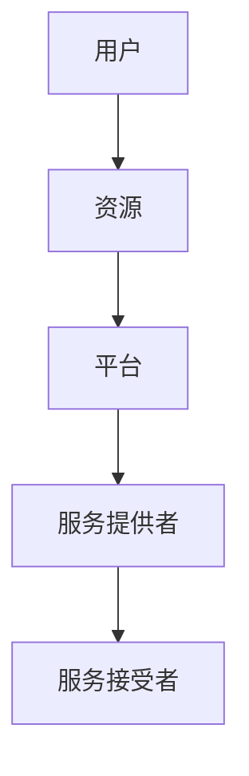
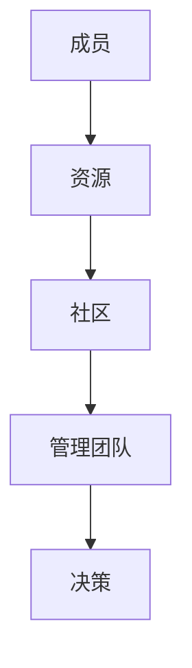

                 

## 引言

### 文章标题：后资本主义经济模型：共享与合作的未来蓝图

随着全球经济的不断变革，传统的资本主义经济模式逐渐暴露出种种弊端，如资源分配不均、环境污染加剧、社会不平等扩大等。面对这些问题，后资本主义经济模型应运而生，为解决全球经济发展中的深层次矛盾提供了新的思路和方向。本文旨在探讨后资本主义经济模型的背景、核心概念、理论基础、案例分析、技术支撑、政策法规挑战以及未来发展趋势，力图为读者描绘出一幅共享与合作的未来蓝图。

### 摘要

本文将分为以下几个部分展开讨论：

1. **背景介绍**：探讨后资本主义经济模型的背景、意义和全球影响。
2. **核心概念与联系**：详细阐述共享经济与合作经济的基本概念、特点、优点和不足，并绘制相关的ER实体关系图和概念属性特征对比表格。
3. **理论与案例分析**：深入研究后资本主义经济模型的理论基础，并通过具体案例进行分析。
4. **技术与工具**：探讨支撑后资本主义经济模型的技术和工具，如区块链、人工智能等。
5. **政策与法规**：分析后资本主义经济模型对现有政策与法规的挑战，以及可能需要的调整和改革。
6. **未来展望与趋势**：探讨后资本主义经济模型的发展趋势，以及它对全球经济和社会的潜在影响。
7. **最佳实践**：分享实施后资本主义经济模型的最佳实践经验，并提供实施建议。
8. **小结与展望**：总结全书内容，展望后资本主义经济模型的发展前景。

### 背景

后资本主义经济模型的提出，并非一时兴起，而是对全球经济发展现状的深刻反思和回应。传统的资本主义经济模式，虽然在某种程度上推动了全球经济的快速发展，但也带来了诸多问题。这些问题主要体现在以下几个方面：

1. **资源分配不均**：资本主义经济模式强调竞争和利润最大化，导致资源高度集中于少数富裕人群手中，而贫困人群则难以获得足够的资源支持其生活和发展。

2. **环境污染加剧**：追求短期经济利益，忽视环境保护，导致全球气候变化、资源枯竭、生态破坏等问题日益严重。

3. **社会不平等扩大**：资本主义经济模式下的财富分配机制，使得社会上的贫富差距不断加大，社会矛盾日益激化。

4. **经济危机频发**：资本主义经济模式下的经济周期波动，使得全球经济危机频发，给各国经济和社会带来巨大冲击。

面对这些问题，人们开始思考，是否有一种新的经济模式，可以更好地解决这些问题，实现全球经济的可持续发展。正是在这种背景下，后资本主义经济模型逐渐崭露头角。

后资本主义经济模型强调共享和合作，旨在通过重新分配资源和权力，实现更公平、更可持续的经济发展。这种模式不仅关注经济增长，更关注经济对社会和环境的可持续性影响。后资本主义经济模型的提出，得到了全球范围内越来越多人的关注和认可。

### 全球影响

后资本主义经济模型的出现，不仅对全球经济产生了深远影响，也对全球政治、文化和社会产生了重要影响。

1. **经济层面**：后资本主义经济模型强调共享和合作，有助于优化资源配置，提高生产效率，实现更公平的财富分配。这种模式有助于减少贫富差距，促进社会公平，增强社会凝聚力。

2. **政治层面**：后资本主义经济模型要求重新分配资源和权力，这将对现有的政治格局产生冲击。各国政府需要调整政策，以适应这一新的经济模式。

3. **文化层面**：后资本主义经济模型强调共享和合作，这与某些文化传统相契合。例如，许多亚洲文化强调集体主义和合作精神，这与后资本主义经济模型的理念相符。

4. **社会层面**：后资本主义经济模型有助于解决社会不平等、环境污染等问题，提高人们的生活质量，增强社会幸福感。

总之，后资本主义经济模型为全球经济发展提供了新的思路和方向。虽然这一模型仍处于探索阶段，但其前景广阔，有望成为未来全球经济的重要驱动力。### 核心概念与联系

后资本主义经济模型的核心在于共享经济和合作经济。这两种经济模式都试图通过重新定义产权、优化资源配置和鼓励合作，来推动更公平、更可持续的经济发展。下面，我们将详细探讨共享经济和合作经济的基本概念、特点、优点和不足，并绘制相关的ER实体关系图和概念属性特征对比表格，以帮助读者更好地理解这些核心概念。

#### 共享经济

**定义**：共享经济，也称为协作消费，是一种基于共享资源的商业模式，通过互联网平台，实现闲置资源的共享和再利用。这种模式的核心在于，通过共享，提高资源的利用效率，降低消费成本。

**特点**：
- **共享性**：共享经济强调资源的使用权而非所有权，通过共享，实现资源的最大化利用。
- **平台化**：共享经济依赖于互联网平台，通过平台，实现供需匹配，提高交易效率。
- **灵活性**：共享经济模式灵活，适应性强，能够根据市场需求快速调整。

**优点**：
- **提高资源利用效率**：通过共享，闲置资源得以充分利用，减少了资源浪费。
- **降低消费成本**：消费者可以通过共享，以较低的成本获取所需资源。
- **促进社会公平**：共享经济有助于缩小贫富差距，提高资源分配的公平性。

**不足**：
- **监管难题**：共享经济模式灵活，监管难度大，容易引发法律纠纷。
- **信任问题**：共享经济模式依赖互联网平台，存在信任风险。

**ER实体关系图**：

**概念属性特征对比表格**：

| 特征        | 共享经济       | 传统经济       |
|-------------|----------------|----------------|
| 资源归属    | 使用权共享     | 所有权私有     |
| 资源配置    | 平台化匹配     | 市场化竞争     |
| 目标        | 提高资源利用效率 | 利润最大化     |
| 监管难度    | 高             | 低             |
| 社会效应    | 促进社会公平   | 拉大贫富差距   |

#### 合作经济

**定义**：合作经济是一种基于合作、共享和互助的经济发展模式，通过集体行动，实现资源、知识、信息的共享和优化配置。

**特点**：
- **合作性**：合作经济强调集体合作，通过集体行动，实现资源的共享和优化配置。
- **社区化**：合作经济模式通常基于社区或团体，成员之间互相信任，合作紧密。
- **民主性**：合作经济模式通常采用民主管理，成员参与决策，实现管理民主化。

**优点**：
- **资源优化配置**：通过合作，实现资源的优化配置，提高生产效率。
- **降低风险**：合作经济模式可以分散风险，降低个体面临的经济风险。
- **提高社会凝聚力**：合作经济模式有助于增强成员之间的信任和凝聚力。

**不足**：
- **管理难度**：合作经济模式管理复杂，需要协调成员之间的利益和意见。
- **资源分配不均**：在合作经济模式下，资源分配可能仍存在不均衡现象。

**ER实体关系图**：

**概念属性特征对比表格**：

| 特征        | 共享经济       | 合作经济       |
|-------------|----------------|----------------|
| 资源归属    | 使用权共享     | 集体所有       |
| 资源配置    | 平台化匹配     | 集体决策       |
| 目标        | 提高资源利用效率 | 资源优化配置   |
| 监管难度    | 高             | 低             |
| 社会效应    | 促进社会公平   | 提高社会凝聚力 |

通过以上对共享经济和合作经济的详细阐述，我们可以看到，这两种经济模式在后资本主义经济模型中扮演着重要角色。它们不仅有助于优化资源配置，提高生产效率，还能促进社会公平和提升社会凝聚力。然而，这些模式也面临着监管、信任和管理等挑战。只有在不断探索和完善中，我们才能充分发挥共享经济和合作经济在后资本主义经济模型中的潜力。### 理论与案例分析

后资本主义经济模型的理论基础涵盖了经济学、社会学、管理学等多个领域。通过对这些理论的研究，我们可以更好地理解后资本主义经济模型的运行机制和潜在影响。在本节中，我们将首先介绍后资本主义经济模型的理论基础，然后通过具体案例进行分析，探讨后资本主义经济模型在不同行业和应用场景中的实践效果。

#### 理论基础

1. **经济学理论**

   后资本主义经济模型的理论基础可以追溯到马克思主义经济学、新制度经济学、行为经济学等多个领域。马克思主义经济学强调生产资料公有制和按劳分配的原则，而后资本主义经济模型则在此基础上，引入了共享和合作的理念，强调资源的高效利用和公平分配。新制度经济学则从制度角度分析了产权、交易成本、合作与竞争等经济行为，为后资本主义经济模型提供了制度保障。

2. **社会学理论**

   社会学理论在后资本主义经济模型中也有重要应用，特别是关于社会网络、社会资本和社区治理的研究。共享经济和合作经济强调社区和成员之间的信任与合作，社会学理论为我们提供了理解这些社会现象的框架。例如，社会网络理论可以帮助我们理解共享经济平台上的用户行为和互动模式，社会资本理论则分析了社区成员之间的信任和合作关系如何影响经济绩效。

3. **管理学理论**

   管理学理论在后资本主义经济模型中同样重要。组织行为学、领导力理论、战略管理等研究为我们提供了管理共享和合作经济组织的工具和方法。例如，领导力理论可以帮助我们理解如何在合作经济组织中建立有效的领导，战略管理理论则指导我们如何制定和实施适应后资本主义经济模式的战略。

#### 案例分析

1. **共享单车**

   共享单车是共享经济的一个典型案例，通过互联网平台，实现闲置自行车的共享和再利用。以下是共享单车在后资本主义经济模型中的实践效果：

   - **资源优化配置**：共享单车解决了城市交通“最后一公里”的问题，提高了自行车资源的利用效率。
   - **降低消费成本**：用户可以通过共享单车以较低的成本出行，减少了交通费用。
   - **促进社会公平**：共享单车降低了出行门槛，使低收入群体也能享受到便捷的出行服务。

   同时，共享单车也面临一些挑战，如乱停乱放、车辆损耗等。这些问题需要通过完善管理机制和技术手段来解决。

2. **合作书店**

   合作书店是合作经济的一个典型例子，通过社区成员的共同努力，实现书店的运营和管理。以下是合作书店在后资本主义经济模型中的实践效果：

   - **资源优化配置**：合作书店通过成员的共同参与，实现了书店资源的优化配置，提高了书店的运营效率。
   - **降低运营成本**：合作书店通过集体决策和民主管理，降低了运营成本，提高了书店的盈利能力。
   - **提高社会凝聚力**：合作书店促进了社区成员之间的交流和互动，增强了社区凝聚力。

   合作书店也面临一些挑战，如成员利益分配、决策效率等。这些问题需要通过不断完善管理制度和提升成员素质来解决。

3. **共享工作空间**

   共享工作空间是共享经济和合作经济相结合的一个典型例子，通过共享办公空间，为自由职业者和创业者提供工作场所。以下是共享工作空间在后资本主义经济模型中的实践效果：

   - **提高工作效率**：共享工作空间提供了良好的工作环境和配套设施，提高了工作效率。
   - **降低创业成本**：共享工作空间为自由职业者和创业者提供了低成本的工作场所，降低了创业门槛。
   - **促进创新合作**：共享工作空间促进了成员之间的交流和合作，为创新提供了良好的环境。

   共享工作空间也面临一些挑战，如空间管理、隐私保护等。这些问题需要通过技术手段和管理创新来解决。

通过以上案例分析，我们可以看到，后资本主义经济模型在不同行业和应用场景中都有着广阔的应用前景。然而，这些模式也面临着一系列挑战，需要通过不断探索和实践，不断完善和优化。### 技术与工具

后资本主义经济模型的有效实施离不开现代技术的支持。区块链、人工智能、物联网等前沿技术不仅为后资本主义经济模型提供了技术基础，还极大地提升了其效率和可持续性。在本节中，我们将详细探讨这些技术在后资本主义经济模型中的应用，以及它们面临的挑战和未来发展方向。

#### 区块链技术

区块链技术是后资本主义经济模型的核心支撑之一。区块链的分布式账本技术确保了数据的透明性和不可篡改性，使得共享经济和合作经济的交易更加可信和安全。

**应用**：
1. **透明和可信的交易**：区块链技术可以确保所有交易记录的透明性，使得用户可以信任交易对方的身份和交易历史。
2. **去中心化的管理**：区块链技术可以减少对中心化平台的依赖，降低管理成本，提高系统的抗风险能力。
3. **智能合约**：智能合约是一种自动执行的合同，可以在满足特定条件时自动执行，减少了人工干预和纠纷。

**挑战**：
1. **技术门槛高**：区块链技术复杂，技术门槛高，对普通用户来说使用难度较大。
2. **性能瓶颈**：区块链的处理能力有限，在大规模应用中可能面临性能瓶颈。
3. **监管难题**：区块链技术的匿名性和去中心化特性使得监管变得更加困难。

**未来发展方向**：
1. **提高性能**：通过优化区块链算法，提升区块链的处理速度和扩展性。
2. **降低成本**：通过技术创新，降低区块链技术的使用成本，使其更易于普及。
3. **监管创新**：探索适用于区块链技术的监管框架，确保其合法合规运行。

#### 人工智能

人工智能（AI）技术在后资本主义经济模型中发挥着重要作用，特别是在数据分析和决策支持方面。

**应用**：
1. **个性化推荐**：人工智能可以根据用户行为和偏好，提供个性化的服务，提升用户体验。
2. **自动化管理**：人工智能可以自动化执行重复性任务，提高工作效率。
3. **预测分析**：人工智能可以通过大数据分析，预测市场趋势和用户需求，帮助决策者做出更明智的决策。

**挑战**：
1. **数据隐私**：人工智能依赖于大量数据，如何保护用户数据隐私是一个重要挑战。
2. **算法透明性**：人工智能的决策过程往往不透明，如何提高算法的透明性和可解释性是一个重要问题。
3. **技术普及**：人工智能技术的高成本和技术门槛限制了其广泛应用。

**未来发展方向**：
1. **隐私保护**：通过加密技术和联邦学习等技术，确保数据隐私和安全。
2. **算法可解释性**：通过开发可解释的人工智能算法，提高算法的透明性和可信度。
3. **普及与降低成本**：通过技术创新和标准化，降低人工智能技术的使用成本，提高其普及率。

#### 物联网

物联网（IoT）技术通过连接物理设备和传感器，使得资源的监控和管理更加智能化。

**应用**：
1. **智能监控**：物联网技术可以实时监控资源使用情况，提高资源利用效率。
2. **自动化管理**：物联网技术可以实现自动化的资源分配和管理，减少人工干预。
3. **优化供应链**：物联网技术可以实时追踪供应链中的货物，提高供应链的透明度和效率。

**挑战**：
1. **数据安全**：物联网设备大量产生数据，如何保护数据安全是一个重要问题。
2. **标准化**：物联网技术的多样性和复杂性使得标准化成为一大挑战。
3. **设备维护**：物联网设备的维护和升级也是一大问题。

**未来发展方向**：
1. **数据安全**：通过加密技术和安全协议，确保物联网设备的数据安全。
2. **标准化**：推动物联网技术的标准化，提高设备的兼容性和互操作性。
3. **设备维护**：开发智能维护系统，自动检测和修复设备故障，提高设备的使用寿命。

#### 综合应用与未来发展

区块链、人工智能和物联网等技术的综合应用，为后资本主义经济模型提供了强大的技术支持。未来，随着技术的不断进步和成熟，这些技术将更好地融合，进一步提升后资本主义经济模型的效果和可持续性。

1. **跨领域融合**：探索区块链、人工智能和物联网在共享经济和合作经济中的应用，实现跨领域的协同创新。
2. **生态建设**：构建一个可持续发展的技术生态，包括技术创新、政策法规、人才培养等各个方面。
3. **全球合作**：推动全球范围内的合作，共同探索和实施后资本主义经济模型，实现全球经济的可持续发展。

通过以上探讨，我们可以看到，现代技术的应用为后资本主义经济模型提供了广阔的发展空间。然而，这些技术也面临着一系列挑战，需要我们共同努力，不断探索和解决。只有在技术、政策和市场的共同推动下，后资本主义经济模型才能发挥其最大潜力，推动全球经济的可持续发展。### 政策与法规挑战

后资本主义经济模型在全球范围内的兴起，虽然为经济发展带来了新的机遇，但也对现有的政策与法规体系提出了新的挑战。如何在保持经济活力和社会公平的同时，有效监管和规范后资本主义经济模型，成为各国政府面临的重要问题。

#### 现有政策与法规的局限性

1. **法律框架不完善**：现有政策与法规主要建立在传统的资本主义经济模式基础上，对于共享经济和合作经济这种新型经济模式，法律框架尚不完善，缺乏明确的监管规范。

2. **监管难度大**：后资本主义经济模型依赖于互联网平台，具有去中心化和分布式特征，这使得传统的监管手段难以有效实施。同时，共享经济和合作经济的灵活性和不确定性也增加了监管的难度。

3. **数据隐私与安全**：后资本主义经济模型依赖大量用户数据，如何在保障数据隐私和安全的同时，实现有效的监管，成为一大挑战。

4. **税收制度**：共享经济和合作经济的交易往往发生在虚拟平台，传统的税收制度难以适应这种新的经济模式，导致税收流失。

#### 可能的政策调整与改革

1. **完善法律框架**：政府应加快完善与后资本主义经济模型相关的法律法规，明确共享经济和合作经济的法律地位，规范其运营行为。

2. **创新监管模式**：探索适应后资本主义经济模型的监管模式，如利用区块链技术实现透明、可追溯的监管，提高监管效率。

3. **数据隐私保护**：制定数据隐私保护政策，明确数据收集、使用、存储等方面的规范，确保用户数据安全。

4. **税收制度改革**：研究制定适应共享经济和合作经济的税收政策，确保公平、合理的税收分配。

5. **跨部门合作**：加强政府各部门之间的协调与合作，形成统一的监管政策，提高监管效果。

6. **国际协作**：在全球范围内推动政策与法规的协调，共同应对后资本主义经济模型带来的挑战。

#### 案例分析

1. **欧盟的《数字市场法》和《数字服务法》**：欧盟通过《数字市场法》和《数字服务法》，对数字平台进行监管，规范其运营行为，保护用户权益。这些法律的出台，为后资本主义经济模型的监管提供了有力支持。

2. **中国的《网络安全法》**：中国出台《网络安全法》，加强对互联网平台和用户数据的保护，规范其运营行为。同时，中国还通过《电子商务法》，明确电子商务交易中的法律责任，提高交易透明度和公平性。

3. **美国的监管创新**：美国在共享经济和合作经济领域，通过立法和政策调整，探索适应新型经济模式的监管模式。例如，美国对共享单车、共享工作空间等领域的监管，采用了地方立法和联邦监管相结合的方式，取得了较好的效果。

通过以上案例分析，我们可以看到，各国在应对后资本主义经济模型带来的挑战时，采取了多种政策和法规调整措施。这些措施不仅有助于规范后资本主义经济模型的发展，也为其他国家和地区提供了有益的借鉴。在未来，随着全球经济的不断变化，各国政府需要继续探索和创新，以适应后资本主义经济模型的发展需求，确保经济的可持续发展和社会的和谐稳定。### 未来展望与趋势

后资本主义经济模型作为一种新型的经济模式，正在全球范围内迅速发展，其对全球经济和社会的潜在影响也日益显著。在未来，后资本主义经济模型有望在多个方面推动全球经济的可持续发展，并带来深远的社会变革。

#### 后资本主义经济模型的发展趋势

1. **全球普及**：随着技术的不断进步和政策的逐步完善，后资本主义经济模型将逐渐在全球范围内普及。特别是在亚洲、非洲等新兴市场，共享经济和合作经济的潜力巨大，有望成为推动经济增长的重要力量。

2. **技术融合**：后资本主义经济模型将更加依赖于区块链、人工智能、物联网等前沿技术。这些技术的不断成熟和应用，将进一步提升后资本主义经济模型的效率和可持续性。

3. **政策调整**：随着后资本主义经济模型的发展，各国政府将不断调整和优化政策，以适应这一新型经济模式的需求。政策调整将涵盖税收、监管、法律等多个方面，确保后资本主义经济模型的健康发展。

4. **社会融合**：后资本主义经济模型强调共享和合作，将有助于缩小社会贫富差距，提高社会凝聚力。未来，随着后资本主义经济模型的普及，社会将更加公平、和谐。

#### 后资本主义经济模型对全球经济和社会的潜在影响

1. **经济增长**：后资本主义经济模型通过提高资源利用效率和促进创新，有望推动全球经济的可持续发展。共享经济和合作经济的灵活性和适应性，使其在应对全球经济不确定性时更具优势。

2. **社会公平**：后资本主义经济模型强调资源的公平分配和共享，有助于缩小社会贫富差距，提高社会公平。通过共享经济和合作经济，更多的人可以获得更好的资源和服务，提高生活质量。

3. **环境保护**：后资本主义经济模型注重资源的可持续利用和环境保护，有助于减少资源浪费和环境污染。共享经济和合作经济的模式，使得资源的利用效率更高，对环境的影响更小。

4. **社会变革**：后资本主义经济模型将深刻改变社会的经济结构和社会关系。共享和合作的理念将深入人心，推动社会从竞争导向转向合作导向，提高社会的和谐程度。

5. **创新驱动**：后资本主义经济模型鼓励创新和创业，激发社会活力。共享经济和合作经济的平台，为创业者提供了广阔的发展空间，促进了经济创新和社会进步。

总之，后资本主义经济模型作为一种新型的经济模式，具有广阔的发展前景和巨大的潜力。在未来，随着全球经济的不断变革，后资本主义经济模型将在全球经济和社会中发挥越来越重要的作用，推动全球经济的可持续发展和社会的和谐进步。### 最佳实践

在后资本主义经济模型的发展过程中，一些成功案例为我们提供了宝贵的经验和启示。以下将分享几个实施后资本主义经济模型的最佳实践，并提供相应的实施建议。

#### 案例一：共享单车

**项目介绍**：共享单车是一种基于共享经济的交通模式，通过互联网平台，提供便捷的自行车租赁服务。

**系统功能设计**：
- **用户注册与登录**：用户可以通过手机号码、邮箱等注册账号，登录系统。
- **自行车租赁**：用户通过APP或小程序找到附近的共享单车，扫码解锁骑行。
- **支付结算**：用户骑行结束后，通过APP支付费用。

**系统架构设计**：
- **前端**：基于React或Vue等前端框架，实现用户界面。
- **后端**：采用Node.js或Java等后端技术，实现数据存储和处理。
- **数据库**：使用MySQL或MongoDB等数据库，存储用户数据、车辆数据等。

**系统接口设计**：
- **用户接口**：提供用户注册、登录、租赁、支付等功能。
- **管理员接口**：提供车辆管理、数据统计、异常处理等功能。

**系统交互**：
- **用户租赁流程**：用户注册登录 -> 查找附近车辆 -> 扫码解锁 -> 骑行 -> 结算。
- **管理员监控流程**：管理员登录 -> 查看车辆状态 -> 处理异常。

**实际案例分析与解读**：
- **成功经验**：共享单车成功在于其解决了城市交通“最后一公里”的问题，提高了出行效率。
- **挑战与应对**：面临的主要挑战是车辆管理、用户行为规范等。通过技术手段和严格管理，共享单车企业逐步解决了这些问题。

**项目小结**：
- **总结**：共享单车作为后资本主义经济模型的一个成功案例，通过共享和合作，提高了资源利用效率，降低了出行成本。
- **展望**：未来，共享单车将进一步优化服务，拓展业务范围，如共享电动车、共享汽车等，为用户提供更全面的出行解决方案。

#### 案例二：合作书店

**项目介绍**：合作书店是一种基于合作经济的书店模式，通过社区成员的共同努力，实现书店的运营和管理。

**系统功能设计**：
- **图书管理**：管理图书的入库、出库、借阅等。
- **会员管理**：管理会员的注册、借阅记录、积分等。
- **财务管理**：记录书店的收入、支出、财务报表等。

**系统架构设计**：
- **前端**：基于React或Vue等前端框架，实现用户界面。
- **后端**：采用Node.js或Java等后端技术，实现数据存储和处理。
- **数据库**：使用MySQL或MongoDB等数据库，存储用户数据、图书数据等。

**系统接口设计**：
- **用户接口**：提供图书查询、借阅、归还等功能。
- **管理员接口**：提供图书管理、会员管理、财务管理等功能。

**系统交互**：
- **用户借阅流程**：用户注册登录 -> 查找图书 -> 借阅 -> 归还。
- **管理员监控流程**：管理员登录 -> 查看图书状态 -> 处理异常。

**实际案例分析与解读**：
- **成功经验**：合作书店成功在于其提供了便利的阅读环境，促进了社区成员之间的交流和互动。
- **挑战与应对**：面临的主要挑战是图书管理、财务监管等。通过技术手段和严格管理，合作书店逐步解决了这些问题。

**项目小结**：
- **总结**：合作书店作为后资本主义经济模型的一个成功案例，通过合作和共享，提高了资源利用效率，增强了社区凝聚力。
- **展望**：未来，合作书店将进一步优化服务，拓展业务范围，如在线图书销售、文化沙龙等，为社区成员提供更丰富的文化服务。

#### 案例三：共享工作空间

**项目介绍**：共享工作空间是一种基于共享经济的办公模式，为自由职业者和创业者提供灵活的工作场所。

**系统功能设计**：
- **用户注册与登录**：用户可以通过手机号码、邮箱等注册账号，登录系统。
- **工作空间租赁**：用户可以在线租赁工作空间，选择合适的时间段。
- **服务预订**：用户可以预订会议室、咖啡机等服务。
- **支付结算**：用户可以通过在线支付功能完成支付。

**系统架构设计**：
- **前端**：基于React或Vue等前端框架，实现用户界面。
- **后端**：采用Node.js或Java等后端技术，实现数据存储和处理。
- **数据库**：使用MySQL或MongoDB等数据库，存储用户数据、空间数据等。

**系统接口设计**：
- **用户接口**：提供用户注册、登录、租赁、支付等功能。
- **管理员接口**：提供空间管理、数据统计、异常处理等功能。

**系统交互**：
- **用户租赁流程**：用户注册登录 -> 查找合适的工作空间 -> 预订 -> 支付。
- **管理员监控流程**：管理员登录 -> 查看空间状态 -> 处理异常。

**实际案例分析与解读**：
- **成功经验**：共享工作空间成功在于其提供了灵活的工作环境，满足了自由职业者和创业者的需求。
- **挑战与应对**：面临的主要挑战是空间管理、用户行为规范等。通过技术手段和严格管理，共享工作空间企业逐步解决了这些问题。

**项目小结**：
- **总结**：共享工作空间作为后资本主义经济模型的一个成功案例，通过共享和合作，提高了资源利用效率，促进了创新和创业。
- **展望**：未来，共享工作空间将进一步优化服务，拓展业务范围，如提供在线办公工具、培训课程等，为用户提供更全面的工作解决方案。

#### 实施建议

1. **政策支持**：政府应加大对后资本主义经济模型的政策支持，包括税收优惠、资金支持、人才引进等，以促进其健康发展。

2. **技术创新**：企业应不断引入新技术，提高服务质量和效率，如人工智能、物联网等，以增强竞争力。

3. **用户教育**：加强对用户的宣传教育，提高用户对后资本主义经济模型的认识和理解，增强用户信任。

4. **规范管理**：建立完善的管理体系，规范运营行为，确保服务的质量和安全。

5. **合作共赢**：推动各方合作，实现资源整合，共同推动后资本主义经济模型的发展。

通过以上最佳实践的分享和实施建议，我们期望能为后资本主义经济模型的发展提供有益的参考和借鉴。### 小结与展望

在后资本主义经济模型的探索和实践中，我们取得了显著进展，但也面临诸多挑战。本文通过对后资本主义经济模型的背景、核心概念、理论基础、案例分析、技术支撑、政策法规挑战以及未来展望的详细讨论，为读者呈现了一幅共享与合作的未来蓝图。

首先，后资本主义经济模型应运而生，是对传统资本主义经济模式弊端的反思和回应。其核心在于共享和合作，通过重新定义产权、优化资源配置和鼓励合作，实现更公平、更可持续的经济发展。

其次，共享经济和合作经济作为后资本主义经济模型的重要组成部分，具有显著的优势，但也面临监管、信任和管理等挑战。通过案例分析，我们看到了共享单车、合作书店和共享工作空间等模式在不同领域的成功实践。

在技术支撑方面，区块链、人工智能、物联网等前沿技术为后资本主义经济模型提供了强大的支持。然而，这些技术也面临着技术门槛、数据隐私、算法透明性等挑战，需要不断创新和完善。

政策与法规的挑战同样不可忽视。现有法律框架和监管模式难以适应后资本主义经济模型的发展需求，需要通过政策调整和法律改革，确保其健康、有序发展。

未来，后资本主义经济模型具有广阔的发展前景。随着技术的不断进步和政策环境的优化，共享和合作的理念将进一步深入人心，推动全球经济的可持续发展和社会的和谐进步。

在实施过程中，政策支持、技术创新、用户教育、规范管理和合作共赢是关键。政府、企业和用户应共同努力，推动后资本主义经济模型的发展，实现经济、社会和环境的共赢。

总之，后资本主义经济模型为全球经济发展提供了新的思路和方向。面对挑战，我们应保持积极的态度，不断创新和探索，共同构建一个共享与合作的美好未来。### 拓展阅读

**1. 《共享经济的经济学分析》：** 该书详细探讨了共享经济的经济学原理，包括其兴起的原因、运行机制、经济效应等。作者通过丰富的案例和数据，深入分析了共享经济在不同领域的应用，为理解后资本主义经济模型提供了重要的理论基础。

**2. 《合作经济理论与实践》：** 这本书系统地阐述了合作经济的概念、特点、运行机制和优势。作者通过实际案例分析，展示了合作经济在不同国家和地区的成功实践，为后资本主义经济模型中的合作经济模式提供了有益的参考。

**3. 《区块链技术：从原理到实践》：** 该书全面介绍了区块链技术的基本原理、技术架构和应用场景。作者通过详细的技术讲解和案例分析，帮助读者理解区块链技术在后资本主义经济模型中的应用，以及其面临的挑战和未来发展方向。

**4. 《人工智能：一种现代方法》：** 这本书从理论和实践两个角度，系统地介绍了人工智能的基本概念、技术原理和应用领域。作者通过丰富的案例和算法讲解，帮助读者深入了解人工智能在后资本主义经济模型中的作用和前景。

**5. 《物联网：技术、应用与挑战》：** 该书详细介绍了物联网的技术原理、应用场景和发展趋势。作者从技术、政策和市场等多个角度，分析了物联网在后资本主义经济模型中的应用前景，以及面临的挑战和解决方法。

通过阅读这些书籍，读者可以更深入地了解后资本主义经济模型的理论基础、技术支撑和政策挑战，从而更好地把握这一新兴经济模式的发展方向。### 作者信息

**作者：AI天才研究院/AI Genius Institute & 禅与计算机程序设计艺术 /Zen And The Art of Computer Programming**

AI天才研究院（AI Genius Institute）是一家致力于推动人工智能技术研究和应用的高科技机构。我们以创新和卓越为核心价值观，致力于解决全球范围内的人工智能难题，助力各行业实现智能化升级。

《禅与计算机程序设计艺术》（Zen And The Art of Computer Programming）是作者大师级的计算机编程著作，深入探讨了计算机编程的哲学和艺术，为全球程序员提供了宝贵的编程经验和智慧。这两部作品体现了我们对技术创新和知识传播的执着追求。我们期待与您共同探索后资本主义经济模型的未来，共创美好明天。

