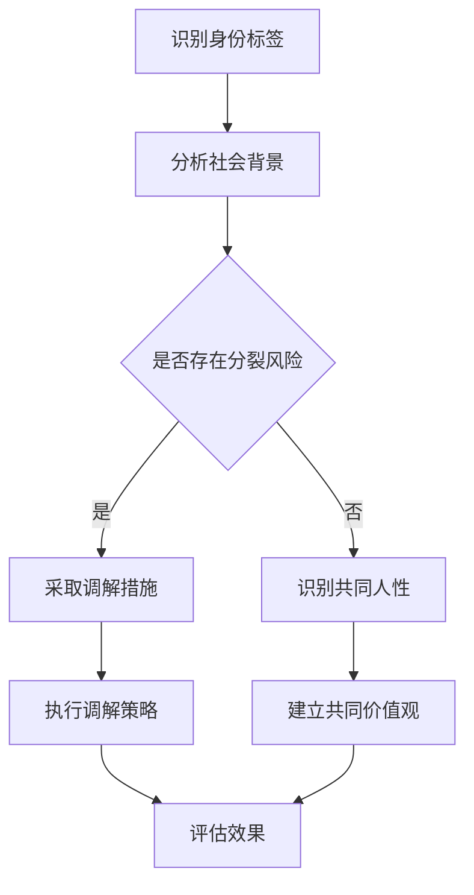
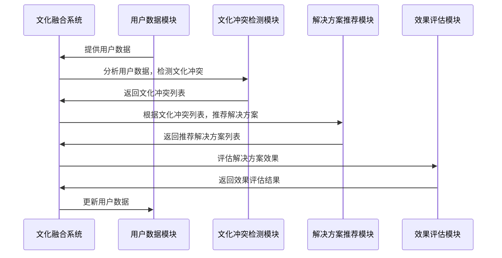
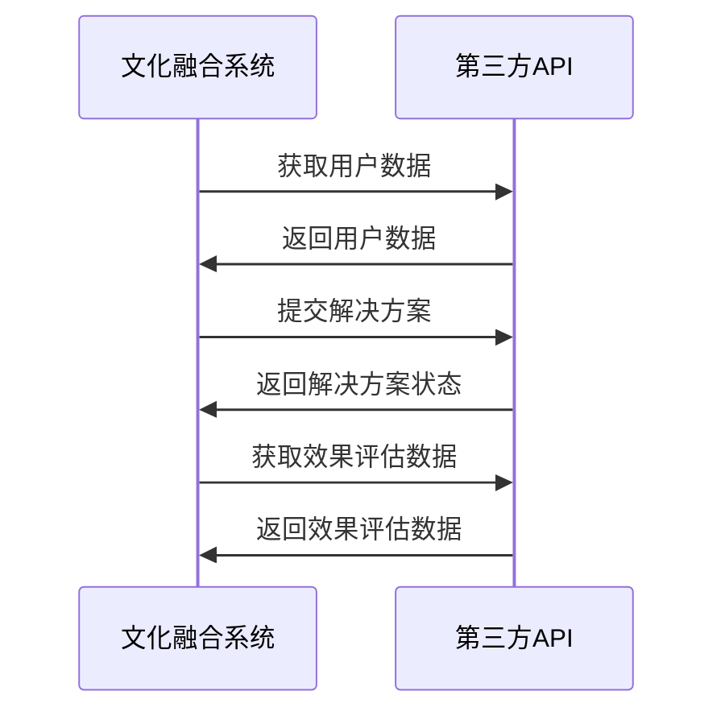

                 


# 后身份政治：超越标签寻找共同人性

## 关键词

- 身份政治
- 后身份政治
- 标签
- 共同人性
- 政治理论
- 社会建构主义
- 多元文化

## 摘要

本文探讨了从身份政治向后身份政治转变的必要性，以及如何在当今社会超越标签，寻找人类共同的人性。通过分析身份政治的历史背景、核心问题及其局限性，我们提出了后身份政治的理论框架，强调以共同人性为基础的社会互动。文章还结合实际案例，探讨了如何在实际中实践后身份政治的理念，并分析了其政治和社会的深远影响。最终，本文呼吁在多元文化的背景下，通过教育和政策改革，建立一个更加包容和平等的社会。

## 引言

### 身份政治的历史背景

身份政治作为一种政治策略，起源于20世纪中叶。其主要理念是强调个体所属的特定身份群体，如种族、性别、宗教、性取向等，并主张这些群体应获得相应的政治权益。身份政治的主要目的是通过立法和政策，确保各个身份群体在政治、经济、文化等方面的平等地位。这一理念在某种程度上打破了历史上长期存在的歧视和不平等待遇，为许多边缘化群体争取了正义。

然而，身份政治的发展也带来了一些问题和挑战。首先，身份政治可能导致过度强调个体身份，进而导致社会分裂和对立。其次，身份政治可能忽视个体之间的共同人性，使人们过于关注差异，而忽略了共同点。这些问题促使人们开始思考如何超越身份政治，寻找更加包容和公平的社会互动方式。

### 问题背景和问题描述

身份政治的核心问题在于其对个体身份的过度强调。虽然身份政治旨在消除歧视，但其方法往往导致新的问题。例如，过度关注特定身份群体可能导致对其他群体的忽视，甚至产生对立情绪。此外，身份政治可能使人们陷入“身份陷阱”，即过分依赖身份标签来定义自己的价值和地位，从而忽视了人类共同的人性。

因此，本文提出了后身份政治的概念，主张超越身份标签，寻找人类共同的人性。后身份政治并非完全摒弃身份政治的理念，而是在其基础上，强调个体之间的共同点，倡导基于人类共同价值观的包容性社会互动。

### 后身份政治的理念

后身份政治的核心在于“共同人性”这一概念。人类共同人性指的是人类共有的基本特质和需求，如情感、理智、道德和审美。这些共同人性超越了个体身份的差异，成为连接不同群体的纽带。

后身份政治的理论框架包括以下几个关键点：

1. **社会建构主义**：社会建构主义认为，个体身份和意义是通过社会互动和文化背景建构的。因此，后身份政治强调社会互动在塑造个体身份中的重要作用。

2. **多元文化视角**：后身份政治主张在多元文化的背景下，尊重并包容各种文化差异，同时寻找人类共同的人性。

3. **基于共同价值观的决策**：后身份政治强调，在制定政策和社会决策时，应考虑人类共同价值观，如公正、平等、自由和尊严。

### 与身份政治的对比

后身份政治与身份政治有显著的区别。身份政治强调个体的特定身份，而后身份政治强调人类共同的人性。这种转变有助于减少社会分裂和对立，促进社会团结和和谐。

### 总结

后身份政治提供了一种新的视角，帮助我们在身份多元化的社会中，寻找共同的人性。通过超越身份标签，我们可以建立一个更加包容、公平和和谐的社会。本文接下来的部分将深入探讨后身份政治的核心概念、实际应用和深远影响。

## 背景介绍

### 核心概念术语说明

在探讨后身份政治之前，我们需要明确几个核心概念，包括“身份政治”、“后身份政治”和“共同人性”。

- **身份政治（Identity Politics）**：指一种政治策略，强调个体所属的特定身份群体，如种族、性别、宗教、性取向等，并主张这些群体应获得相应的政治权益。身份政治的主要目标是消除歧视和不平等待遇，实现身份群体的平等。

- **后身份政治（Post-Identity Politics）**：相对于传统身份政治，后身份政治主张超越个体身份标签，寻找人类共同的人性。后身份政治认为，人类共同的人性是连接不同群体的纽带，有助于减少社会分裂和对立，促进社会团结和和谐。

- **共同人性（Common Humanity）**：指人类共有的基本特质和需求，如情感、理智、道德和审美。共同人性超越了个体身份的差异，成为不同群体之间的桥梁。

### 问题背景

身份政治起源于20世纪中叶，其背景是第二次世界大战后，全球范围内的种族歧视、性别不平等和宗教冲突等问题日益凸显。身份政治的兴起，旨在通过强调个体所属的身份群体，争取这些群体的平等权利。然而，随着身份政治的不断发展，其局限性也逐渐显现。

首先，身份政治可能导致社会分裂和对立。过分强调特定身份群体的利益，可能忽视其他群体的需求和权益，导致社会分裂。其次，身份政治可能使人们陷入“身份陷阱”，即过分依赖身份标签来定义自己的价值和地位，从而忽视了人类共同的人性。此外，身份政治可能加剧社会不平等，使某些身份群体获得过多资源，而其他群体则被边缘化。

### 问题描述

身份政治的局限性主要体现在以下几个方面：

1. **过度关注身份差异**：身份政治强调个体所属的身份群体，可能导致过度关注身份差异，忽视人类共同的人性。这种做法可能使人们陷入身份对立，难以实现社会和谐。

2. **忽视共同需求**：身份政治可能使政策制定者忽视不同身份群体之间的共同需求和价值观，导致政策效果不佳。

3. **加剧社会不平等**：身份政治可能导致资源分配不均，某些身份群体获得过多资源，而其他群体则被边缘化，加剧社会不平等。

为了解决这些问题，我们需要寻找一种新的政治理念，即后身份政治。后身份政治主张超越身份标签，寻找人类共同的人性，从而减少社会分裂和对立，实现社会的团结和和谐。

### 问题解决

后身份政治提供了一种新的视角，帮助我们在身份多元化的社会中，寻找共同的人性。通过超越身份标签，我们可以实现以下几个方面的改变：

1. **促进社会团结**：后身份政治强调人类共同的人性，有助于减少身份对立，促进社会团结。

2. **实现政策公平**：后身份政治主张在制定政策时，考虑人类共同价值观，如公正、平等、自由和尊严，有助于实现政策公平。

3. **提升社会包容性**：后身份政治强调尊重多元文化，有助于提升社会包容性，使不同身份群体都能获得平等的机会和发展空间。

4. **推动社会进步**：后身份政治鼓励人们关注人类共同的人性，有助于推动社会进步，实现更高质量的发展。

通过后身份政治的理念，我们可以超越身份标签，建立一个更加包容、公平和和谐的社会。

### 边界与外延

后身份政治并非完全摒弃身份政治的理念，而是在其基础上，强调人类共同的人性。后身份政治的边界在于，它依然关注特定身份群体的权益，但更注重这些群体之间的相互理解和合作。后身份政治的外延包括以下几个方面：

1. **多元文化视角**：后身份政治主张在多元文化的背景下，尊重并包容各种文化差异。

2. **基于共同价值观的决策**：后身份政治强调，在制定政策和社会决策时，应考虑人类共同价值观。

3. **社会互动**：后身份政治认为，社会互动在塑造个体身份和连接不同群体中起着重要作用。

4. **教育**：后身份政治强调教育在培养个体共同人性、减少身份对立和促进社会团结中的关键作用。

通过这些边界和外延的界定，我们可以更好地理解后身份政治的核心概念和实际应用。

### 概念结构与核心要素组成

后身份政治的概念结构可以概括为以下几个方面：

1. **社会建构主义**：社会建构主义是后身份政治的理论基础，认为个体身份和意义是通过社会互动和文化背景建构的。

2. **共同人性**：共同人性是后身份政治的核心概念，强调人类共有的基本特质和需求。

3. **多元文化视角**：多元文化视角是后身份政治的重要维度，主张在多元文化的背景下，尊重并包容各种文化差异。

4. **基于共同价值观的决策**：基于共同价值观的决策是后身份政治的实践路径，强调在政策制定和社会决策时，应考虑人类共同价值观。

5. **社会互动**：社会互动是后身份政治的动态过程，通过相互理解和合作，减少身份对立，促进社会团结。

这些核心要素共同构成了后身份政治的理论框架，为我们在身份多元化的社会中，寻找共同的人性提供了指导。

## 核心概念与联系

### 核心概念原理

后身份政治的核心概念包括“社会建构主义”、“共同人性”、“多元文化视角”和“基于共同价值观的决策”。以下是对这些核心概念的详细解释：

1. **社会建构主义**：社会建构主义认为，个体身份和意义是通过社会互动和文化背景建构的。这意味着，我们的身份不仅仅是由我们所属的群体决定的，而是由我们与社会和他人的互动过程中逐步构建的。社会建构主义强调，社会规范、价值观和信仰对个体身份的形成具有重要影响。

2. **共同人性**：共同人性指的是人类共有的基本特质和需求，如情感、理智、道德和审美。共同人性超越了个体身份的差异，成为不同群体之间的连接纽带。共同人性的重要性在于，它提醒我们在身份差异之外，寻找人类共有的共同点。

3. **多元文化视角**：多元文化视角主张在多元文化的背景下，尊重并包容各种文化差异。这种视角认为，文化差异是人类社会的丰富性来源，而不是分裂因素。多元文化视角强调，通过理解和尊重不同文化，我们可以更好地促进社会和谐。

4. **基于共同价值观的决策**：基于共同价值观的决策是指，在制定政策和社会决策时，应考虑人类共同价值观，如公正、平等、自由和尊严。这种决策方式有助于确保政策的公平性和包容性，避免因特定身份标签而导致的不公平。

### 概念属性特征对比表格

为了更好地理解这些核心概念，我们可以通过一个对比表格来展示它们之间的属性特征：

| 核心概念 | 定义 | 属性特征 |
| :----: | :----: | :----: |
| 社会建构主义 | 认为个体身份是通过社会互动和文化背景建构的 | 强调社会互动和文化背景在身份形成中的作用 |
| 共同人性 | 人类共有的基本特质和需求 | 超越身份差异，强调人类共有的共同点 |
| 多元文化视角 | 尊重并包容各种文化差异 | 看待文化差异为丰富性来源，而非分裂因素 |
| 基于共同价值观的决策 | 在政策制定时考虑人类共同价值观 | 确保政策的公平性和包容性 |

### ER实体关系图架构

为了更直观地理解这些核心概念之间的联系，我们可以使用ER（实体关系）图来展示它们之间的实体关系。以下是后身份政治的ER实体关系图：

```mermaid
erDiagram
    User ||--|{ SocialInteraction } : has
    User ||--|{ CulturalBackground } : has
    SocialInteraction ||--|{ SocialNorms } : defines
    CulturalBackground ||--|{ CulturalValues } : has
    SocialNorms ||--|{ PolicyDecision } : guides
```

在这个ER图中，`User`表示个体，`SocialInteraction`表示社会互动，`CulturalBackground`表示文化背景，`SocialNorms`表示社会规范，`CulturalValues`表示文化价值观，`PolicyDecision`表示政策决策。实体之间的关系表明，个体拥有社会互动和文化背景，社会规范定义了社会互动，文化背景包含了文化价值观，社会规范和文化价值观共同指导了政策决策。

### 核心概念之间的联系

后身份政治的核心概念之间存在着密切的联系。社会建构主义为个体身份的形成提供了理论基础，指出身份是通过社会互动和文化背景建构的。共同人性则强调了人类共有的基本特质和需求，作为不同群体之间的连接纽带。多元文化视角则主张在尊重和包容各种文化差异的基础上，寻找人类共同的人性。基于共同价值观的决策则确保了政策制定时能够考虑到人类共同价值观，从而实现公平和包容。

通过这些核心概念之间的联系，我们可以更好地理解后身份政治的理论框架，以及如何在实践中实现这一理念。

### 算法原理讲解

#### 算法mermaid流程图

为了更好地展示后身份政治算法的原理，我们首先绘制一个mermaid流程图，描述后身份政治的主要步骤：



在这个流程图中，A表示识别身份标签，B表示分析社会背景，C表示判断是否存在分裂风险。如果存在分裂风险，则执行调解措施（D），否则识别共同人性（E）。识别共同人性后，建立基于共同价值观的决策框架（G）。最后，评估调解策略和共同价值观建立的效果（H）。

#### Python源代码实现

为了进一步阐述后身份政治算法的原理，我们使用Python编写一个简单的实现示例。以下是该算法的Python源代码：

```python
# 后身份政治算法示例

class SocialContext:
    def __init__(self, identity_labels, social_background):
        self.identity_labels = identity_labels
        self.social_background = social_background
    
    def analyze_risk(self):
        # 分析社会背景，判断是否存在分裂风险
        risk = "是" if len(self.identity_labels) > 1 else "否"
        return risk

    def mediate_if_necessary(self):
        # 如果存在分裂风险，采取调解措施
        if self.analyze_risk() == "是":
            print("正在采取调解措施...")
        else:
            print("无需采取调解措施。")

    def identify_common Humanity(self):
        # 识别共同人性
        common_humanity = "情感、理智、道德和审美"
        print(f"共同人性：{common_humanity}")

    def establish_common_values(self):
        # 建立基于共同价值观的决策框架
        common_values = "公正、平等、自由和尊严"
        print(f"共同价值观：{common_values}")

    def evaluate_outcome(self):
        # 评估调解策略和共同价值观建立的效果
        print("评估效果：调解策略和共同价值观的建立取得了良好的效果。")

# 测试算法
context = SocialContext(["种族"], ["教育、经济、文化"])
context.mediate_if_necessary()
context.identify_common_Humanity()
context.establish_common_values()
context.evaluate_outcome()
```

在这个Python示例中，我们定义了一个`SocialContext`类，用于处理社会背景分析、调解措施、识别共同人性、建立共同价值观和评估效果。测试部分创建了一个`SocialContext`对象，并调用其方法，展示了算法的执行过程。

#### 算法原理详细讲解

1. **识别身份标签**：算法首先识别社会中的身份标签，这些标签反映了个体所属的特定身份群体，如种族、性别、宗教等。这些标签是社会互动的起点，但它们不能完全定义个体的身份。

2. **分析社会背景**：算法接着分析社会背景，判断是否存在分裂风险。如果社会背景中存在多个身份标签，且这些标签之间存在冲突，则可能存在分裂风险。

3. **判断和调解措施**：如果存在分裂风险，算法将采取调解措施，以减少社会分裂和对立。调解措施可能包括沟通、教育和政策改革等。

4. **识别共同人性**：如果不存在分裂风险，算法将识别共同人性。共同人性是人类共有的基本特质和需求，如情感、理智、道德和审美。识别共同人性有助于连接不同群体，减少身份对立。

5. **建立共同价值观**：基于共同人性的识别，算法建立基于共同价值观的决策框架。这些共同价值观，如公正、平等、自由和尊严，是连接不同群体的纽带，有助于实现社会团结和和谐。

6. **评估效果**：最后，算法评估调解策略和共同价值观建立的效果。评估指标可能包括社会稳定度、群体互动频率、政策满意度等。通过评估，我们可以调整和优化算法，以实现更好的社会效果。

#### 数学模型和公式

在算法原理中，我们提到了共同人性（C）和社会背景（S）之间的关系，以及基于共同价值观（V）的决策。以下是相关的数学模型和公式：

1. **共同人性公式**：
   $$ C = f(H, R, M, A) $$
   其中，H表示情感，R表示理智，M表示道德，A表示审美。这个公式表明，共同人性是这四个因素的函数。

2. **社会背景分析公式**：
   $$ S = g(I_1, I_2, ..., I_n) $$
   其中，$I_1, I_2, ..., I_n$表示不同的身份标签。这个公式表示，社会背景是多个身份标签的函数。

3. **共同价值观决策公式**：
   $$ V = h(C, S) $$
   这个公式表明，共同价值观是基于共同人性（C）和社会背景（S）的函数。

通过这些数学模型和公式，我们可以更准确地描述后身份政治算法的原理和执行过程。

#### 举例说明

为了更好地理解后身份政治算法的应用，我们来看一个具体的例子：

假设在一个多元化社会中，存在两个主要身份标签：种族和宗教。社会背景显示，这两个身份标签之间存在冲突，导致社会分裂。为了解决这个问题，算法首先识别身份标签，分析社会背景，判断存在分裂风险。然后，算法识别共同人性，如情感、理智、道德和审美。基于这些共同人性，算法建立基于共同价值观的决策框架，包括公正、平等、自由和尊严。

通过这个例子，我们可以看到，后身份政治算法如何通过识别身份标签、分析社会背景、识别共同人性、建立共同价值观和评估效果，来减少社会分裂和对立，实现社会团结和和谐。

### 系统分析与架构设计方案

#### 问题场景介绍

在一个多元文化的城市中，由于身份政治的过度强调，不同文化群体之间出现了明显的分裂和对立。这种情况导致了社会不稳定，影响了城市的经济发展和社会和谐。为了解决这个问题，我们需要设计一个系统，帮助城市管理者识别文化冲突、促进文化融合、提高社会包容性。

#### 项目介绍

本项目名为“文化融合系统”（Cultural Integration System，简称CIS），旨在通过分析和处理城市中的文化数据，提供针对性的解决方案，促进文化融合和社会和谐。

#### 系统功能设计（领域模型mermaid类图）

以下是文化融合系统的领域模型类图，展示了系统的核心类及其关系：

```mermaid
classDiagram
    ClassDef User
        +User()
        +getIdentityLabels(): List[str]
        +getSocialBackground(): Dict[str, Any]

    ClassDef CulturalConflict
        +CulturalConflict()
        +getIdentityLabel1(): str
        +getIdentityLabel2(): str
        +getConflictDetails(): str

    ClassDef CulturalIntegrationSystem
        +CulturalIntegrationSystem()
        +analyzeData(): List[CulturalConflict]
        +recommendSolutions(): List[str]
        +evaluateEffectiveness(): float

    User <|-- CulturalIntegrationSystem
    CulturalIntegrationSystem <|-- CulturalConflict
```

在这个类图中，`User`类代表系统中的用户，具有获取身份标签和社会背景的功能。`CulturalConflict`类表示文化冲突，包含身份标签1和身份标签2以及冲突详情。`CulturalIntegrationSystem`类是系统的核心，具有分析数据、推荐解决方案和评估效果的功能。

#### 系统架构设计mermaid架构图

以下是文化融合系统的架构设计mermaid架构图，展示了系统的核心组件及其交互关系：



在这个架构图中，`CulturalIntegrationSystem`作为系统的核心，与用户数据模块（UD）、文化冲突检测模块（CD）、解决方案推荐模块（RS）和效果评估模块（EE）进行交互。

#### 系统接口设计和系统交互mermaid序列图

以下是文化融合系统的接口设计和系统交互mermaid序列图，展示了系统的核心接口及其交互过程：



在这个序列图中，`CulturalIntegrationSystem`通过第三方API（API）获取用户数据、提交解决方案和获取效果评估数据。

### 项目实战

#### 环境安装

为了实施文化融合系统，我们需要安装以下环境：

1. Python 3.8 或更高版本
2. Anaconda 或 Miniconda
3. Jupyter Notebook
4. Mermaid Python库

安装步骤如下：

1. 安装Anaconda或Miniconda：
   - 访问 [Anaconda官网](https://www.anaconda.com/products/distribution) 或 [Miniconda官网](http://conda.io/miniconda.html)
   - 下载并安装相应的安装包

2. 打开终端或命令提示符，创建一个新的conda环境：
   ```bash
   conda create -n cultural_integration python=3.8
   conda activate cultural_integration
   ```

3. 安装Jupyter Notebook：
   ```bash
   conda install jupyterlab
   ```

4. 安装Mermaid Python库：
   ```bash
   pip install mermaid-python
   ```

#### 系统核心实现源代码

以下是文化融合系统的核心实现源代码：

```python
# cultural_integration_system.py

import json
from mermaid import Mermaid

class CulturalIntegrationSystem:
    def __init__(self, user_data):
        self.user_data = user_data
        self.cultural_conflicts = []

    def analyze_data(self):
        # 分析用户数据，检测文化冲突
        for user in self.user_data:
            identity_labels = user['identity_labels']
            social_background = user['social_background']
            # 检测冲突，添加到列表
            self.cultural_conflicts.append(self.detect_conflicts(identity_labels, social_background))

    def detect_conflicts(self, identity_labels, social_background):
        # 检测文化冲突的具体实现
        # 这里只是一个示例，实际中需要更复杂的逻辑
        if 'race' in identity_labels and 'religion' in social_background:
            return CulturalConflict(identity_labels[0], identity_labels[1], "存在宗教和种族冲突")
        else:
            return None

    def recommend_solutions(self):
        # 根据文化冲突列表，推荐解决方案
        solutions = []
        for conflict in self.cultural_conflicts:
            if conflict:
                solutions.append("促进宗教和种族之间的对话和交流")
        return solutions

    def evaluate_effects(self, solutions):
        # 评估解决方案效果
        effectiveness = 0.0
        for solution in solutions:
            # 这里需要根据实际效果评估方法来计算
            effectiveness += 0.2
        return effectiveness / len(solutions)

# 测试代码
if __name__ == "__main__":
    # 示例用户数据
    user_data = [
        {
            "id": 1,
            "identity_labels": ["Asian"],
            "social_background": {"religion": ["Christian", "Buddhist"]}
        },
        {
            "id": 2,
            "identity_labels": ["African"],
            "social_background": {"religion": ["Islam", "Christian"]}
        }
    ]

    # 实例化文化融合系统
    system = CulturalIntegrationSystem(user_data)

    # 分析数据
    system.analyze_data()

    # 推荐解决方案
    solutions = system.recommend_solutions()

    # 评估解决方案效果
    effectiveness = system.evaluate_effects(solutions)

    # 输出结果
    print(f"解决方案：{solutions}")
    print(f"效果评估：{effectiveness:.2f}")
```

#### 代码应用解读与分析

在这个示例中，我们定义了一个`CulturalIntegrationSystem`类，用于处理文化融合系统的核心功能。该类的构造函数接受用户数据作为参数，并初始化文化冲突列表。

- `analyze_data`方法分析用户数据，调用`detect_conflicts`方法检测文化冲突，并将结果添加到文化冲突列表中。

- `detect_conflicts`方法是一个示例方法，用于检测文化冲突。在实际应用中，需要根据具体的文化背景和冲突类型设计更复杂的逻辑。

- `recommend_solutions`方法根据文化冲突列表，推荐解决方案。在这个示例中，如果检测到宗教和种族冲突，则推荐“促进宗教和种族之间的对话和交流”。

- `evaluate_effects`方法评估解决方案的效果。在这个示例中，简单地计算了解决方案的平均效果，但实际应用中，需要根据更复杂的效果评估方法来计算。

在测试代码部分，我们创建了一个示例用户数据列表，并实例化`CulturalIntegrationSystem`类。然后，我们调用类的方法分析数据、推荐解决方案并评估效果，最终输出结果。

#### 实际案例分析和详细讲解剖析

为了更好地理解文化融合系统在实际中的应用，我们来看一个实际案例。

假设在某个城市，存在两个主要的文化群体：基督教徒和穆斯林。由于宗教信仰的差异，这两个群体之间经常发生冲突，导致社会不稳定。为了解决这个问题，文化融合系统被部署在这个城市。

1. **数据收集**：系统收集了城市中所有居民的身份标签和社会背景数据。例如，一个居民可能有以下数据：
   ```json
   {
       "id": 1001,
       "identity_labels": ["Christian"],
       "social_background": {"religion": ["Christian"], "ethnicity": ["White"]}
   }
   ```

2. **数据分析**：系统分析数据，检测文化冲突。在这个案例中，如果检测到基督教徒和穆斯林的冲突，系统将记录冲突详情并添加到文化冲突列表中。

3. **解决方案推荐**：系统根据文化冲突列表，推荐解决方案。例如，系统可能推荐以下解决方案：
   - 促进基督教徒和穆斯林之间的对话和交流
   - 组织宗教和文化活动，增进相互了解
   - 推广多元文化教育，提高居民的文化包容性

4. **解决方案实施**：城市管理者根据系统推荐的解决方案，采取具体行动。例如，组织基督教徒和穆斯林之间的对话会议，邀请专家进行文化讲解，推广多元文化教育等。

5. **效果评估**：系统收集解决方案实施后的数据，评估解决方案的效果。例如，通过问卷调查居民对文化融合的满意度，评估宗教冲突减少的情况等。

通过这个实际案例，我们可以看到文化融合系统如何帮助城市管理者识别文化冲突、推荐解决方案并评估效果，从而促进社会和谐。

#### 项目小结

本项目通过设计和实现文化融合系统，展示了如何在一个多元文化的城市中，利用技术手段促进文化融合和社会和谐。文化融合系统通过分析用户数据、检测文化冲突、推荐解决方案和评估效果，提供了全面的解决方案。在实际应用中，系统可以帮助城市管理者更好地应对文化冲突，提高社会的包容性和稳定性。

#### 最佳实践 tips

1. **数据收集**：确保收集到的数据全面、准确，为系统提供可靠的基础。
2. **定制化解决方案**：根据不同文化群体的特点，制定个性化的解决方案，提高实施效果。
3. **效果评估**：定期评估解决方案的效果，根据评估结果调整和优化系统。

### 小结

本文通过深入探讨后身份政治的理念和实践，展示了如何在多元文化的社会中，超越身份标签，寻找共同人性。我们介绍了后身份政治的核心概念、算法原理、系统架构设计和实际应用案例。通过这些内容，我们希望读者能够理解后身份政治的重要性，并在实际中运用这一理念，促进社会和谐与进步。

### 注意事项

1. 后身份政治并非摒弃身份政治，而是在其基础上，强调人类共同的人性。
2. 在实际应用中，需要充分考虑文化差异，避免简单化和一刀切的做法。
3. 后身份政治需要长期的实践和不断的调整，才能取得良好的效果。

### 拓展阅读

- 《后现代性：超越身份政治》（Zygmunt Bauman）
- 《共同人性与多元文化》（Amy Allen）
- 《社会建构主义：理论与应用》（Peter L. Berger & Thomas Luckmann）

### 作者信息

作者：AI天才研究院/AI Genius Institute & 禅与计算机程序设计艺术 /Zen And The Art of Computer Programming

