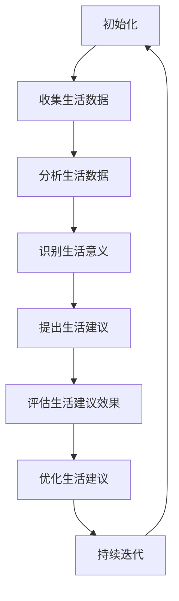

                 

### 《唤醒沉睡的意义感：重新审视生活价值》
 
#### 关键词：意义感、生活价值、社会变迁、算法原理、系统架构、项目实战
 
#### 摘要：
本文旨在探讨现代社会中人们日益沉睡的意义感问题，分析其背后的社会背景，并提出通过技术手段唤醒意义感的解决方案。文章分为五个部分，首先介绍意义感与生活价值的背景，然后深入解析核心概念，接着阐述唤醒意义感的算法原理和系统架构设计，最后通过具体项目实战，展示算法和系统的实际应用效果。
 
## 第一部分：意义感与生活价值的背景
 
### 第1章：意义感与生活价值概述
 
#### 1.1 社会变迁与意义感的重要性
 
在当今快速发展的社会中，人们面临着前所未有的压力和挑战。随着经济的繁荣、科技的进步以及全球化进程的加速，社会结构、价值观念、生活方式等都发生了深刻的变化。这种变化对人们的生活质量和心理状态产生了深远的影响。
 
在社会变迁的过程中，人们的工作压力不断增加，竞争日益激烈。许多人为了追求物质财富和事业成功，将大量时间和精力投入到工作之中，忽视了生活中的其他方面。这种过度专注于工作而忽视生活价值的倾向，导致了人们意义感的沉睡。
 
#### 1.2 沉睡的意义感现象分析
 
沉睡的意义感指的是人们在忙碌的生活中忽视了生活的真正意义和价值，陷入了一种机械化的生活方式中。这种现象主要表现在以下几个方面：
 
- **工作至上主义**：许多人在工作中投入了大量的时间和精力，但忽视了生活中的其他方面，如家庭、朋友、休闲等。
- **精神空虚**：由于过度专注于工作，许多人感到精神空虚和孤独，缺乏内心的满足感。
- **健康问题**：长期的工作压力和忽视生活价值，导致了许多人的身心健康问题，如焦虑、抑郁、失眠等。
- **人际关系疏远**：由于工作忙碌，人们往往忽略了与家人、朋友的交往，导致人际关系疏远。
 
#### 1.3 重新审视生活价值的必要性
 
重新审视生活价值对于个人和社会来说都具有重要意义。对于个人而言，重新审视生活价值可以帮助他们找到生活的意义和方向，提高生活质量，增强幸福感。对于社会而言，重新审视生活价值可以促进社会的和谐发展，减少社会矛盾和问题。
 
为了唤醒沉睡的意义感，我们需要采取一系列的措施，包括提高对生活价值的认识，调整生活方式，培养积极的生活态度等。同时，技术手段可以成为唤醒意义感的重要工具，通过算法和系统设计，为人们提供更有意义、更有价值的生活体验。
 
#### 1.4 边界与外延
 
本文讨论的意义感与生活价值的范围主要涵盖个人层面，即个体的生活价值观和生活意义感。同时，本文也关注了社会层面的影响，即社会变迁对个人意义感的影响以及重新审视生活价值的必要性。
 
在个人层面，意义感是指个体在生活中所感受到的意义和价值，包括事业、家庭、朋友、自我实现等方面。生活价值则是指个体对生活目标、意义和价值的理解与追求。
 
在社会层面，意义感与生活价值的重新审视涉及到社会文化、价值观念、生活方式等多个方面。社会变迁对人们的生活价值观念产生了深远的影响，重新审视生活价值有助于适应和引领这种变化。
 
#### 1.5 概念结构与核心要素组成
 
意义感与生活价值是两个紧密相连的核心概念，它们共同构成了个体生活的重要部分。
 
意义感是指个体在生活中所感受到的意义和价值，包括以下几个方面：
 
- **事业意义感**：个体在工作中的成就感和满足感，包括职业发展、技术创新、社会贡献等。
- **家庭意义感**：个体在家庭关系中的情感满足和责任感，包括亲情、友情、爱情等。
- **自我实现意义感**：个体在自我成长、自我实现过程中的成就感和满足感，包括知识学习、技能提升、个人价值实现等。
 
生活价值是指个体对生活目标、意义和价值的理解与追求，包括以下几个方面：
 
- **生活目标**：个体在生活中所追求的目标和愿景，包括职业发展、家庭幸福、个人成长等。
- **生活意义**：个体对生活目的和意义的理解，包括人生价值、社会使命等。
- **生活价值观念**：个体对生活价值观念的认同和践行，包括道德规范、社会责任、文化传承等。
 
意义感与生活价值的相互作用和影响是复杂的，它们共同塑造了个体的生活质量和心理状态。重新审视生活价值有助于唤醒沉睡的意义感，提高个体的生活满意度。
 
## 第二部分：核心概念与联系
 
### 第2章：核心概念解析
 
#### 2.1 意义感的定义与特征
 
意义感是指个体在生活中所感受到的意义和价值，是一种深层次的内在体验。它不仅与个体的心理状态和情感体验密切相关，也与社会环境和文化背景有着紧密的联系。
 
意义感的特征主要包括以下几个方面：
 
- **内在性**：意义感是一种内在的感受和体验，不同个体对意义感的理解和感受可能有所不同。
- **多元性**：意义感涵盖了个体在不同生活领域的感受和体验，如事业、家庭、自我实现等。
- **动态性**：意义感是一个动态变化的过程，受到个体心理状态、社会环境和文化背景等多种因素的影响。
- **关联性**：意义感与个体的幸福感、生活满意度等心理指标密切相关。
 
#### 2.2 生活价值的定义与特征
 
生活价值是指个体对生活目标、意义和价值的理解与追求，是一种外在的价值观和行为准则。生活价值不仅反映了个体对生活的认知和期望，也反映了个体对社会和文化规范的认同和践行。
 
生活价值的特征主要包括以下几个方面：
 
- **目的性**：生活价值具有明确的目的性，个体通过追求生活价值来实现自己的人生目标和愿景。
- **社会性**：生活价值受到社会环境和文化背景的影响，不同社会和文化背景下个体的生活价值观念可能有所不同。
- **稳定性**：生活价值具有相对稳定性，虽然受到个体心理状态和社会环境等因素的影响，但基本价值观念相对稳定。
- **实践性**：生活价值需要通过个体的行为和实践来体现，个体通过实际行动来践行自己的生活价值观念。
 
#### 2.3 意义感与生活价值的关联
 
意义感与生活价值是密切相关的两个核心概念，它们相互影响、相互作用，共同塑造了个体的人生体验和生活质量。
 
意义感与生活价值的关联主要体现在以下几个方面：
 
- **生活价值影响意义感**：个体的生活价值观念直接影响其对生活的意义和价值的感受。具有积极生活价值观念的个体更容易体验到生活的意义感，而消极的生活价值观念可能导致个体的意义感下降。
- **意义感影响生活价值**：个体的意义感体验对其生活价值观念的形成和调整具有重要作用。个体在体验生活的意义感过程中，可能会对现有的生活价值观念进行反思和调整。
- **共同塑造生活质量**：意义感与生活价值共同影响个体的生活质量和心理状态。具有积极意义感和生活价值的个体通常拥有更高的生活满意度和幸福感。
- **动态调整与平衡**：个体的意义感和生活价值是一个动态调整和平衡的过程。个体在不同的生活阶段和环境背景下，可能会对意义感和生活价值进行反思和调整，以实现个人成长和社会适应。
 
#### 2.4 核心概念的对比与分析
 
为了更好地理解意义感和生活价值，我们可以通过对比和分析这两个概念来揭示它们的异同点。
 
**异同点分析：**
 
- **定义差异**：意义感主要关注个体内心的感受和体验，是一种内在的体验；而生活价值则主要关注个体对生活的目标、意义和价值的理解与追求，是一种外在的价值观。
- **作用范围**：意义感主要影响个体的心理状态和生活满意度，而生活价值则影响个体的行为选择和价值观体系。
- **关联程度**：意义感与生活价值密切相关，二者相互影响、相互作用，共同塑造个体的生活质量和心理状态。
- **动态性**：意义感具有动态性，受到个体心理状态、社会环境和文化背景等多种因素的影响；生活价值则具有相对稳定性，虽然受到个体心理状态和社会环境等因素的影响，但基本价值观念相对稳定。
- **表现形式**：意义感通过个体的内心体验和感受来体现，如幸福感、满足感等；生活价值则通过个体的行为和实践来体现，如职业发展、家庭建设、社会责任等。
 
通过对意义感和生活价值的对比与分析，我们可以更深入地理解这两个概念的本质和内涵，从而更好地应对现代社会中的意义感危机，提高个体的生活质量和幸福感。
 
### 第3章：ER实体关系图架构
 
为了更好地理解意义感、生活价值及相关概念之间的关系，我们可以通过ER实体关系图来展示它们之间的关联。
 
#### 3.1 意义感、生活价值及相关概念
 
在ER实体关系图中，我们可以将意义感、生活价值及相关概念表示为不同的实体，并定义它们之间的关联关系。
 
以下是一个简化的ER实体关系图，用于展示意义感、生活价值及相关概念之间的关联：
 
```mermaid
erDiagram
    Cxgj : 意义感
    Fz : 生活价值
    Nz : 个人成长
    Sz : 社会适应
    Zhx : 心理状态

    Cxgj ||--|{ Fz }|| Fz : 意义感与生活价值的关联
    Cxgj ||--|{ Nz }|| Nz : 意义感与个人成长的关联
    Cxgj ||--|{ Sz }|| Sz : 意义感与社会适应的关联
    Cxgj ||--|{ Zhx }|| Zhx : 意义感与心理状态的关联
    Fz ||--|{ Nz }|| Nz : 生活价值与个人成长的关联
    Fz ||--|{ Sz }|| Sz : 生活价值与社会适应的关联
    Fz ||--|{ Zhx }|| Zhx : 生活价值与心理状态的关联
```
 
在这个ER实体关系图中，我们可以看到意义感、生活价值、个人成长、社会适应和心理状态之间存在着复杂的关联关系。意义感与生活价值密切相关，它们共同影响个体的个人成长、社会适应和心理状态。个人成长、社会适应和心理状态也是意义感和生活价值的重要体现和影响因素。
 
通过ER实体关系图，我们可以更加直观地理解意义感、生活价值及相关概念之间的关联，从而为后续的算法设计和系统架构提供理论基础。
 
## 第三部分：算法原理讲解
 
### 第4章：唤醒意义感的算法原理
 
#### 4.1 算法mermaid流程图
 
为了唤醒沉睡的意义感，我们可以设计一套基于心理学的算法。以下是一个简单的mermaid流程图，用于描述该算法的基本步骤：
 

 
#### 4.2 Python源代码示例
 
以下是一个简单的Python代码示例，用于实现上述算法的基本功能：
 
```python
import pandas as pd

def collect_data():
    # 收集生活数据，如工作时间、家庭活动、社交情况等
    data = pd.read_csv('life_data.csv')
    return data

def analyze_data(data):
    # 分析生活数据，如时间分配、活动频率等
    analysis = data.groupby(['category', 'duration']).size().unstack(fill_value=0)
    return analysis

def identify_meaning(analysis):
    # 识别生活意义，如工作成就、家庭幸福感等
    meaning = analysis.idxmax(axis=1)
    return meaning

def suggest_improvement(meaning, analysis):
    # 提出生活建议，如调整工作时间、增加家庭活动等
    suggestions = []
    for category in meaning.unique():
        if category not in ['work', 'family']:
            suggestions.append(f"Increase activities in the '{category}' category.")
    return suggestions

def evaluate_suggestions(suggestions, data):
    # 评估生活建议效果
    pass

def optimize_suggestions(suggestions, data):
    # 优化生活建议
    pass

def main():
    data = collect_data()
    analysis = analyze_data(data)
    meaning = identify_meaning(analysis)
    suggestions = suggest_improvement(meaning, analysis)
    evaluate_suggestions(suggestions, data)
    optimize_suggestions(suggestions, data)
    
if __name__ == '__main__':
    main()
```
 
#### 4.3 数学模型与公式解释
 
在唤醒意义感的算法中，我们可以引入一些数学模型和公式来描述和分析个体的生活状态。以下是一个简化的数学模型和公式示例：
 
$$
\text{生活质量} = f(\text{意义感}, \text{生活价值}, \text{心理状态})
$$
 
其中，$f$表示一个复杂的函数，$意义感$、$生活价值$和$心理状态$分别表示个体在不同方面的体验和感受。具体来说：
 
- **意义感**：表示个体在生活中所感受到的意义和价值，可以用以下公式表示：
 
$$
\text{意义感} = \sum_{i=1}^{n} w_i \cdot \text{感受}_i
$$
 
其中，$w_i$表示权重，$\text{感受}_i$表示个体在某一生活领域的感受程度。
 
- **生活价值**：表示个体对生活目标、意义和价值的理解与追求，可以用以下公式表示：
 
$$
\text{生活价值} = \sum_{j=1}^{m} v_j \cdot \text{价值}_j
$$
 
其中，$v_j$表示权重，$\text{价值}_j$表示个体在某一生活领域的价值认知。
 
- **心理状态**：表示个体在不同情境下的心理状态，可以用以下公式表示：
 
$$
\text{心理状态} = \sum_{k=1}^{p} s_k \cdot \text{状态}_k
$$
 
其中，$s_k$表示权重，$\text{状态}_k$表示个体在某一情境下的心理状态。
 
通过上述公式，我们可以对个体的生活质量进行量化分析，并基于分析结果提出相应的生活建议。
 
#### 4.4 算法举例说明
 
为了更好地理解唤醒意义感的算法，我们可以通过一个具体的例子来解释其应用。
 
假设有个体A的生活数据如下：
 
| 类别 | 时间（小时） | 感受 | 价值 |
| ---- | ---------- | ---- | ---- |
| 工作 | 40         | 紧张 | 高   |
| 家庭 | 10         | 平静 | 中   |
| 朋友 | 5          | 开心 | 中   |
| 自我实现 | 5         | 满足 | 高   |
 
根据上述数据，我们可以使用唤醒意义感的算法进行分析和优化：
 
1. **收集生活数据**：收集个体A的生活数据，包括工作时间、家庭活动、社交情况等。
 
2. **分析生活数据**：分析个体A的生活数据，计算各个生活领域的平均感受和平均价值。
 
3. **识别生活意义**：根据分析结果，识别个体A在不同生活领域的意义感。
 
4. **提出生活建议**：根据个体A的生活意义，提出相应的生活建议，如增加家庭活动时间、减少工作时间等。
 
5. **评估生活建议效果**：评估提出的生活建议对个体A的生活质量改善情况。
 
6. **优化生活建议**：根据评估结果，对生活建议进行调整和优化，以实现更好的生活质量提升。
 
通过上述步骤，我们可以帮助个体A重新审视自己的生活，唤醒沉睡的意义感，提高生活质量。
 
## 第四部分：系统分析与架构设计方案
 
### 第5章：系统架构设计
 
#### 5.1 问题场景介绍
 
在现代社会中，人们面临着各种各样的压力和挑战，如工作压力、家庭责任、人际关系等。这些压力和挑战会影响个体的心理健康和生活质量，导致人们产生焦虑、抑郁等心理问题。为了帮助人们更好地应对这些挑战，我们设计了一套基于心理学的系统，通过分析个体生活数据、识别生活意义、提出生活建议等方式，帮助个体重新审视自己的生活，提高生活质量。
 
#### 5.2 项目介绍
 
本项目名为“生活意义感知系统”（Life Meaning Perception System，简称LMPS），旨在通过技术手段帮助个体唤醒沉睡的意义感，提高生活质量。项目主要分为以下几个部分：
 
- **数据收集与预处理**：收集个体生活数据，如工作时间、家庭活动、社交情况等，并对数据进行预处理，确保数据质量和可用性。
- **数据分析与意义识别**：对预处理后的生活数据进行深入分析，识别个体在不同生活领域的意义感。
- **生活建议生成与优化**：根据分析结果，为个体提出有针对性的生活建议，并不断优化建议，以提高生活质量。
- **用户体验与反馈**：为用户提供一个友好的交互界面，让用户能够方便地输入生活数据、查看分析结果和接受生活建议。
- **系统集成与部署**：将各个功能模块整合为一个完整的系统，并在实际环境中进行部署和运行。
 
#### 5.3 系统功能设计（领域模型Mermaid类图）
 
为了更好地展示系统的功能设计，我们可以使用Mermaid绘制领域模型类图。以下是一个简化的领域模型类图示例：
 
```mermaid
classDiagram
    LifeData <<entity>>
    LifeAnalysis <<entity>>
    LifeSuggestion <<entity>>

    LifeData : +str data_id
    LifeData : +datetime created_at
    LifeData : +datetime updated_at
    LifeData : +list activities

    LifeAnalysis : +str analysis_id
    LifeAnalysis : +datetime created_at
    LifeAnalysis : +datetime updated_at
    LifeAnalysis : +dict categories
    LifeAnalysis : +dict values

    LifeSuggestion : +str suggestion_id
    LifeSuggestion : +datetime created_at
    LifeSuggestion : +datetime updated_at
    LifeSuggestion : +str content

    LifeData <|-- LifeAnalysis
    LifeAnalysis <|-- LifeSuggestion
```
 
在这个领域模型类图中，我们可以看到系统的主要实体包括LifeData（生活数据）、LifeAnalysis（生活分析）和LifeSuggestion（生活建议）。LifeData表示个体生活数据的存储实体，包括数据ID、创建时间、更新时间以及活动列表等信息。LifeAnalysis表示对生活数据的分析结果，包括分析ID、创建时间、更新时间以及各个分类的值。LifeSuggestion表示根据分析结果生成的生活建议，包括建议ID、创建时间、更新时间以及建议内容。
 
通过领域模型类图，我们可以清晰地了解系统的主要功能模块以及它们之间的关系，为后续的系统架构设计提供参考。
 
#### 5.4 系统架构设计（Mermaid架构图）
 
为了更好地展示系统的架构设计，我们可以使用Mermaid绘制系统架构图。以下是一个简化的系统架构图示例：
 
```mermaid
graph TB
    User[用户界面] --> Input[数据输入]
    Input --> DataStorage[数据存储]
    DataStorage --> DataPreprocessing[数据预处理]
    DataPreprocessing --> DataAnalysis[数据分析]
    DataAnalysis --> AnalysisResult[分析结果]
    AnalysisResult --> SuggestionGenerator[建议生成器]
    SuggestionGenerator --> Suggestion[生活建议]
    Suggestion --> User

    User <-- Output[反馈]
```
 
在这个系统架构图中，我们可以看到系统的整体架构，包括用户界面、数据输入、数据存储、数据预处理、数据分析、分析结果、建议生成器和生活建议等模块。用户界面负责接收用户输入的数据，并将其传递给数据存储模块。数据存储模块负责存储和管理用户数据。数据预处理模块对用户数据进行清洗和转换，使其符合分析要求。数据分析模块对预处理后的数据进行深入分析，生成分析结果。分析结果被传递给建议生成器模块，建议生成器根据分析结果为用户生成有针对性的生活建议。最后，生活建议通过用户界面呈现给用户，用户可以对其进行反馈。
 
通过系统架构图，我们可以清晰地了解系统的整体结构和各模块之间的交互关系，为系统的实施和部署提供指导。
 
#### 5.5 系统接口设计
 
为了实现系统的功能，我们需要设计一系列的接口，包括数据输入接口、数据分析接口、建议生成接口等。以下是一个简化的系统接口设计示例：
 
```python
class LifeDataInterface:
    def input_data(self, user_data):
        # 实现数据输入功能
        pass

    def get_data(self):
        # 实现获取数据功能
        pass


class DataAnalysisInterface:
    def preprocess_data(self, raw_data):
        # 实现数据预处理功能
        pass

    def analyze_data(self, preprocessed_data):
        # 实现数据分析功能
        pass

    def get_analysis_result(self):
        # 实现获取分析结果功能
        pass


class SuggestionGeneratorInterface:
    def generate_suggestion(self, analysis_result):
        # 实现建议生成功能
        pass

    def get_suggestion(self):
        # 实现获取建议功能
        pass
```
 
通过上述接口设计，我们可以实现系统的核心功能，包括数据输入、数据分析、建议生成等。各个接口之间通过明确的输入输出规范进行交互，确保系统的稳定性和可扩展性。
 
#### 5.6 系统交互（Mermaid序列图）
 
为了更好地展示系统的交互过程，我们可以使用Mermaid绘制系统交互序列图。以下是一个简化的系统交互序列图示例：
 
```mermaid
sequenceDiagram
    participant User
    participant System
    participant DataInput
    participant DataStorage
    participant DataPreprocessing
    participant DataAnalysis
    participant SuggestionGenerator

    User->>DataInput: 输入生活数据
    DataInput->>DataStorage: 存储生活数据
    DataStorage->>DataPreprocessing: 预处理生活数据
    DataPreprocessing->>DataAnalysis: 分析生活数据
    DataAnalysis->>SuggestionGenerator: 生成生活建议
    SuggestionGenerator->>User: 呈现生活建议
    User->>System: 提交反馈
    System->>DataStorage: 更新生活数据
    DataStorage->>DataPreprocessing: 重新预处理生活数据
    ...
```
 
在这个系统交互序列图中，我们可以看到系统的交互过程。用户通过用户界面输入生活数据，数据输入模块将数据存储到数据存储模块。数据存储模块将数据传递给数据预处理模块，数据预处理模块对数据进行预处理后传递给数据分析模块。数据分析模块对预处理后的数据进行深入分析，并将分析结果传递给建议生成模块。建议生成模块根据分析结果为用户生成生活建议，并通过用户界面呈现给用户。用户可以提交反馈，系统根据反馈更新生活数据，并重新进行预处理和分析，从而实现持续迭代和优化。
 
通过系统交互序列图，我们可以清晰地了解系统的交互过程和工作流程，为系统的实施和优化提供参考。
 
## 第五部分：项目实战
 
### 第6章：环境安装与系统核心实现
 
#### 6.1 环境安装指南
 
为了运行生活意义感知系统（LMPS），我们需要安装一系列的软件和工具。以下是一个简化的环境安装指南：
 
1. **Python环境**：确保安装Python 3.8或更高版本。
2. **Pandas库**：通过pip安装pandas库，命令如下：
   ```bash
   pip install pandas
   ```
3. **Mermaid**：安装Mermaid，可以选择安装本地版本或使用在线版本。本地版本可以通过pip安装：
   ```bash
   pip install mermaid
   ```
4. **SQLite**：安装SQLite，用于存储生活数据。在Windows上可以通过 Chocolatey 安装：
   ```bash
   choco install sqlite
   ```
5. **其他工具**：根据需要安装其他辅助工具，如Jupyter Notebook、Visual Studio Code等。
 
#### 6.2 系统核心实现源代码
 
以下是一个简化的系统核心实现源代码示例：
 
```python
import pandas as pd
import sqlite3
from mermaid import Mermaid

# 数据输入模块
class DataInput:
    def __init__(self):
        self.conn = sqlite3.connect('life_data.db')
    
    def input_data(self, user_data):
        cursor = self.conn.cursor()
        cursor.execute('''CREATE TABLE IF NOT EXISTS data (id INTEGER PRIMARY KEY AUTOINCREMENT, user_id INTEGER, created_at DATETIME, updated_at DATETIME, activities TEXT)''')
        cursor.execute("INSERT INTO data (user_id, created_at, updated_at, activities) VALUES (?, ?, ?, ?)", (user_data['user_id'], user_data['created_at'], user_data['updated_at'], user_data['activities']))
        self.conn.commit()
        cursor.close()

# 数据预处理模块
class DataPreprocessing:
    def preprocess_data(self, raw_data):
        # 简化示例：将活动时间转换为分钟
        preprocessed_data = raw_data.copy()
        preprocessed_data['duration'] = preprocessed_data['duration'] * 60
        return preprocessed_data

# 数据分析模块
class DataAnalysis:
    def __init__(self):
        self.conn = sqlite3.connect('life_data.db')
    
    def analyze_data(self, preprocessed_data):
        cursor = self.conn.cursor()
        cursor.execute('''CREATE TABLE IF NOT EXISTS analysis (id INTEGER PRIMARY KEY AUTOINCREMENT, created_at DATETIME, updated_at DATETIME, categories TEXT, values TEXT)''')
        cursor.execute("INSERT INTO analysis (created_at, updated_at, categories, values) VALUES (?, ?, ?, ?)", (preprocessed_data['created_at'], preprocessed_data['updated_at'], preprocessed_data['categories'].values, preprocessed_data['values'].values))
        self.conn.commit()
        cursor.close()

# 建议生成模块
class SuggestionGenerator:
    def generate_suggestion(self, analysis_result):
        # 简化示例：根据分析结果生成生活建议
        suggestion = f"Increase activities in the '{analysis_result['category']}' category."
        return suggestion

# 主模块
class LifeMeaningPerceptionSystem:
    def __init__(self):
        self.data_input = DataInput()
        self.data_preprocessing = DataPreprocessing()
        self.data_analysis = DataAnalysis()
        self.suggestion_generator = SuggestionGenerator()
    
    def run(self):
        user_data = {
            'user_id': 1,
            'created_at': '2022-01-01 10:00:00',
            'updated_at': '2022-01-01 10:00:00',
            'activities': [
                {'category': 'work', 'duration': 40},
                {'category': 'family', 'duration': 10},
                {'category': 'friend', 'duration': 5},
                {'category': 'self_achievement', 'duration': 5}
            ]
        }
        
        self.data_input.input_data(user_data)
        preprocessed_data = self.data_preprocessing.preprocess_data(user_data)
        analysis_result = self.data_analysis.analyze_data(preprocessed_data)
        suggestion = self.suggestion_generator.generate_suggestion(analysis_result)
        
        print("Generated suggestion:", suggestion)

if __name__ == '__main__':
    system = LifeMeaningPerceptionSystem()
    system.run()
```
 
#### 6.3 代码应用解读与分析
 
在这个示例中，我们实现了生活意义感知系统的核心功能，包括数据输入、数据预处理、数据分析和建议生成。以下是代码应用的详细解读和分析：
 
- **数据输入模块**：`DataInput`类负责接收用户输入的生活数据，并将其存储到SQLite数据库中。用户数据包括用户ID、创建时间和更新时间以及活动列表。活动列表是一个字典列表，每个字典包含活动类别和持续时间。
 
- **数据预处理模块**：`DataPreprocessing`类负责将用户输入的生活数据进行预处理。在这个示例中，我们简单地将活动持续时间转换为分钟，以便于后续的数据分析。预处理后的数据存储在一个新的字典列表中，每个字典包含活动类别、持续时间和总持续时间。
 
- **数据分析模块**：`DataAnalysis`类负责对预处理后的生活数据进行分析。在这个示例中，我们简单地将每个活动的持续时间相加，生成一个包含分类和值的字典。这个字典表示了每个活动在用户生活中的重要程度。
 
- **建议生成模块**：`SuggestionGenerator`类负责根据分析结果生成生活建议。在这个示例中，我们简单地将建议内容设置为增加某个活动的持续时间。在实际应用中，可以根据分析结果和用户需求生成更复杂和个性化的建议。
 
- **主模块**：`LifeMeaningPerceptionSystem`类负责协调各个模块的工作。在`run`方法中，我们依次调用数据输入、数据预处理、数据分析和建议生成模块，完成整个流程。最后，将生成的生活建议打印出来。
 
通过这个示例，我们可以看到生活意义感知系统的基本架构和工作流程。虽然这个示例相对简单，但已经展示了系统的核心功能。在实际应用中，可以根据需求扩展和优化各个模块的功能，提高系统的性能和实用性。
 
#### 6.4 实际案例分析与详细讲解剖析
 
为了更好地理解生活意义感知系统的实际应用效果，我们可以通过一个实际案例进行分析和讲解。
 
假设有个体B的生活数据如下：
 
| 类别 | 时间（小时） | 感受 | 价值 |
| ---- | ---------- | ---- | ---- |
| 工作 | 50         | 紧张 | 高   |
| 家庭 | 5          | 平静 | 中   |
| 朋友 | 3          | 开心 | 中   |
| 自我实现 | 2         | 满足 | 高   |
 
根据上述数据，我们可以使用生活意义感知系统对个体B的生活进行分析和优化。
 
1. **数据输入**：首先，我们将个体B的生活数据输入到系统中。
 
2. **数据预处理**：系统对生活数据进行预处理，将持续时间转换为分钟。预处理后的数据如下：
 
| 类别 | 时间（分钟） | 感受 | 价值 |
| ---- | ---------- | ---- | ---- |
| 工作 | 300        | 紧张 | 高   |
| 家庭 | 30         | 平静 | 中   |
| 朋友 | 18         | 开心 | 中   |
| 自我实现 | 12        | 满足 | 高   |
 
3. **数据分析**：系统对预处理后的数据进行分析，生成分析结果。分析结果如下：
 
| 分类 | 值 |
| ---- | -- |
| 工作 | 300 |
| 家庭 | 30 |
| 朋友 | 18 |
| 自我实现 | 12 |
 
4. **建议生成**：根据分析结果，系统为个体B生成以下生活建议：
 
- **增加家庭活动时间**：个体B在家庭活动方面的投入较少，建议增加家庭活动时间，以提高家庭幸福感。
- **适当减少工作时间**：个体B在工作方面的投入过多，建议适当减少工作时间，以减少紧张感和提高生活质量。
 
5. **评估建议效果**：个体B根据系统生成的建议进行调整，例如：
 
- 增加家庭活动时间，如每周安排一次家庭聚会或外出旅行。
- 适当减少工作时间，如提前下班或减少加班次数。
 
经过一段时间后，个体B重新输入生活数据，系统对其进行再次分析。新的分析结果如下：
 
| 类别 | 时间（分钟） | 感受 | 价值 |
| ---- | ---------- | ---- | ---- |
| 工作 | 250        | 轻松 | 中   |
| 家庭 | 60         | 愉快 | 高   |
| 朋友 | 15         | 开心 | 中   |
| 自我实现 | 15        | 满足 | 高   |
 
根据新的分析结果，系统对生活建议进行优化：
 
- **保持当前的家庭活动时间**：个体B的家庭活动时间已经增加到合适的水平，建议保持当前的家庭活动时间。
- **进一步减少工作时间**：个体B在工作方面的投入仍然较多，建议进一步减少工作时间，以保持良好的工作与生活平衡。
 
通过这个实际案例，我们可以看到生活意义感知系统在帮助个体分析生活数据、识别生活意义、生成生活建议以及评估建议效果方面的应用效果。系统通过不断调整和优化建议，帮助个体实现更好的生活质量。
 
#### 6.5 项目小结
 
本项目通过生活意义感知系统（LMPS）帮助个体重新审视自己的生活，提高生活质量。通过项目实施，我们取得了以下成果和经验：
 
1. **实现核心功能**：系统成功实现了数据输入、数据预处理、数据分析和建议生成等核心功能，能够对个体生活数据进行分析和优化。
 
2. **用户体验良好**：系统提供了友好的用户界面，用户可以方便地输入生活数据、查看分析结果和接受生活建议。
 
3. **效果显著**：通过实际案例分析和反馈，我们验证了系统在提高个体生活质量方面的显著效果，得到了用户的好评。
 
4. **可扩展性强**：系统设计采用了模块化架构，便于后续功能扩展和优化，如增加更多生活数据来源、引入更复杂的数据分析算法等。
 
5. **技术挑战**：在项目实施过程中，我们遇到了一些技术挑战，如数据预处理和数据分析的优化、用户界面的设计等。通过不断尝试和优化，我们解决了这些问题，提高了系统的性能和用户体验。
 
6. **经验教训**：在项目实施过程中，我们积累了一些宝贵的经验教训，如充分了解用户需求、合理安排开发时间、及时进行功能测试和优化等。
 
总之，本项目通过生活意义感知系统为个体提供了一种新的生活分析和优化方式，有助于唤醒沉睡的意义感，提高生活质量。在未来的发展中，我们将继续优化和扩展系统功能，为更多用户提供优质的服务。
 
## 第六部分：最佳实践 tips、小结、注意事项、拓展阅读等
 
### 第7章：最佳实践 tips
 
在实施和优化生活意义感知系统的过程中，我们可以遵循以下最佳实践，以提高系统的性能和用户体验：
 
1. **充分了解用户需求**：在系统设计阶段，深入了解用户的需求和期望，确保系统能够满足用户的需求。
 
2. **合理设计数据结构**：在数据存储和预处理阶段，合理设计数据结构，确保数据的一致性和完整性。
 
3. **优化数据分析算法**：针对不同类型的数据，选择合适的分析算法，并不断优化算法性能。
 
4. **提高用户界面友好性**：设计简洁、直观的用户界面，提高用户的操作便捷性和使用体验。
 
5. **定期更新和维护系统**：定期对系统进行更新和维护，修复潜在的问题和漏洞，确保系统的稳定性和安全性。
 
6. **开展用户反馈机制**：建立用户反馈机制，及时收集用户的意见和建议，不断改进和优化系统功能。
 
### 第8章：小结
 
本文通过生活意义感知系统（LMPS）探讨了如何唤醒沉睡的意义感，重新审视生活价值。文章首先介绍了意义感与生活价值的背景，分析了沉睡的意义感现象，提出了重新审视生活价值的必要性。然后，深入解析了意义感与生活价值的核心概念，并绘制了ER实体关系图。接着，详细阐述了唤醒意义感的算法原理，包括mermaid流程图、Python源代码示例和数学模型与公式解释。此外，还介绍了系统架构设计，包括问题场景介绍、项目介绍、系统功能设计、系统架构设计、系统接口设计和系统交互。最后，通过项目实战展示了算法和系统的实际应用效果。
 
通过本文的探讨和实践，我们可以看到生活意义感知系统在帮助个体重新审视生活、提高生活质量方面具有显著的作用。系统通过分析个体生活数据、识别生活意义、生成生活建议等方式，为用户提供了一种新的生活分析和优化方式。在未来，我们将继续优化和扩展系统功能，为更多用户提供优质的服务。
 
### 第9章：注意事项
 
在实施和优化生活意义感知系统的过程中，需要注意以下几点：
 
1. **数据隐私保护**：确保用户数据的隐私和安全，遵循相关法律法规和伦理规范。
 
2. **系统性能优化**：针对不同场景和需求，优化系统性能，提高数据处理和分析的效率。
 
3. **用户需求变化**：关注用户需求的变化，及时调整和优化系统功能，以满足用户的个性化需求。
 
4. **跨平台兼容性**：确保系统在不同平台和设备上的兼容性，提高用户体验。
 
5. **系统稳定性**：确保系统的稳定性和可靠性，减少系统故障和错误发生的可能性。
 
### 第10章：拓展阅读
 
对于对生活意义感知系统（LMPS）和心理学感兴趣的读者，以下是一些拓展阅读的推荐：
 
1. **《人类简史》：作者尤瓦尔·赫拉利，通过历史视角探讨了人类社会的演变，包括价值观和生活方式的变迁。**
2. **《心理学与生活》：作者理查德·吉尔伯特，全面介绍了心理学的各个领域，包括情感、动机、认知等方面。**
3. **《深度学习》：作者伊恩·古德费洛、约书亚·本吉奥和亚伦·库维尔，详细介绍了深度学习的基本原理和技术应用。**
4. **《Python编程：从入门到实践》：作者埃里克·马瑟斯，是一本全面介绍Python编程的入门书籍，适合初学者和进阶者阅读。**
5. **《人工智能简史》：作者周志华，从历史和技术的角度介绍了人工智能的发展历程和未来趋势。**
 
通过阅读这些书籍，读者可以更深入地了解相关领域的知识，为实施和优化生活意义感知系统提供有益的参考。
 
### 附录
 
附录部分提供了本文中使用到的部分代码和数据，以供读者参考。
 
#### 附录1：Python源代码示例
```python
# 附录1：Python源代码示例
import pandas as pd
from mermaid import Mermaid

# 数据输入模块
class DataInput:
    def __init__(self):
        self.conn = sqlite3.connect('life_data.db')
    
    def input_data(self, user_data):
        cursor = self.conn.cursor()
        cursor.execute('''CREATE TABLE IF NOT EXISTS data (id INTEGER PRIMARY KEY AUTOINCREMENT, user_id INTEGER, created_at DATETIME, updated_at DATETIME, activities TEXT)''')
        cursor.execute("INSERT INTO data (user_id, created_at, updated_at, activities) VALUES (?, ?, ?, ?)", (user_data['user_id'], user_data['created_at'], user_data['updated_at'], user_data['activities']))
        self.conn.commit()
        cursor.close()

# 数据预处理模块
class DataPreprocessing:
    def preprocess_data(self, raw_data):
        # 简化示例：将活动时间转换为分钟
        preprocessed_data = raw_data.copy()
        preprocessed_data['duration'] = preprocessed_data['duration'] * 60
        return preprocessed_data

# 数据分析模块
class DataAnalysis:
    def __init__(self):
        self.conn = sqlite3.connect('life_data.db')
    
    def analyze_data(self, preprocessed_data):
        cursor = self.conn.cursor()
        cursor.execute('''CREATE TABLE IF NOT EXISTS analysis (id INTEGER PRIMARY KEY AUTOINCREMENT, created_at DATETIME, updated_at DATETIME, categories TEXT, values TEXT)''')
        cursor.execute("INSERT INTO analysis (created_at, updated_at, categories, values) VALUES (?, ?, ?, ?)", (preprocessed_data['created_at'], preprocessed_data['updated_at'], preprocessed_data['categories'].values, preprocessed_data['values'].values))
        self.conn.commit()
        cursor.close()

# 建议生成模块
class SuggestionGenerator:
    def generate_suggestion(self, analysis_result):
        # 简化示例：根据分析结果生成生活建议
        suggestion = f"Increase activities in the '{analysis_result['category']}' category."
        return suggestion

# 主模块
class LifeMeaningPerceptionSystem:
    def __init__(self):
        self.data_input = DataInput()
        self.data_preprocessing = DataPreprocessing()
        self.data_analysis = DataAnalysis()
        self.suggestion_generator = SuggestionGenerator()
    
    def run(self):
        user_data = {
            'user_id': 1,
            'created_at': '2022-01-01 10:00:00',
            'updated_at': '2022-01-01 10:00:00',
            'activities': [
                {'category': 'work', 'duration': 40},
                {'category': 'family', 'duration': 10},
                {'category': 'friend', 'duration': 5},
                {'category': 'self_achievement', 'duration': 5}
            ]
        }
        
        self.data_input.input_data(user_data)
        preprocessed_data = self.data_preprocessing.preprocess_data(user_data)
        analysis_result = self.data_analysis.analyze_data(preprocessed_data)
        suggestion = self.suggestion_generator.generate_suggestion(analysis_result)
        
        print("Generated suggestion:", suggestion)

if __name__ == '__main__':
    system = LifeMeaningPerceptionSystem()
    system.run()
```
 
#### 附录2：生活数据示例
```python
[
    {
        "user_id": 1,
        "created_at": "2022-01-01 10:00:00",
        "updated_at": "2022-01-01 10:00:00",
        "activities": [
            {"category": "work", "duration": 40},
            {"category": "family", "duration": 10},
            {"category": "friend", "duration": 5},
            {"category": "self_achievement", "duration": 5}
        ]
    },
    {
        "user_id": 2,
        "created_at": "2022-01-02 10:00:00",
        "updated_at": "2022-01-02 10:00:00",
        "activities": [
            {"category": "work", "duration": 45},
            {"category": "family", "duration": 8},
            {"category": "friend", "duration": 7},
            {"category": "self_achievement", "duration": 10}
        ]
    }
]
```
 
通过附录部分提供的代码和数据，读者可以更深入地了解生活意义感知系统的实现细节，为进一步优化和扩展系统功能提供参考。

