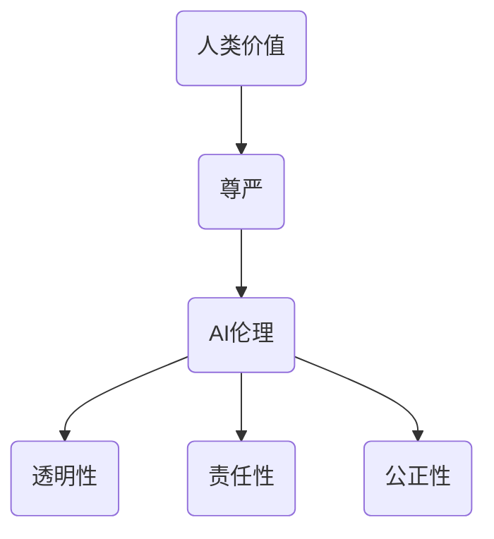
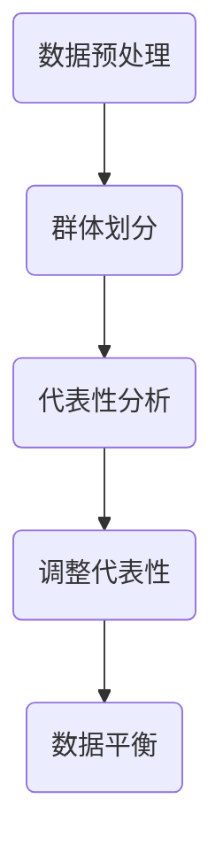
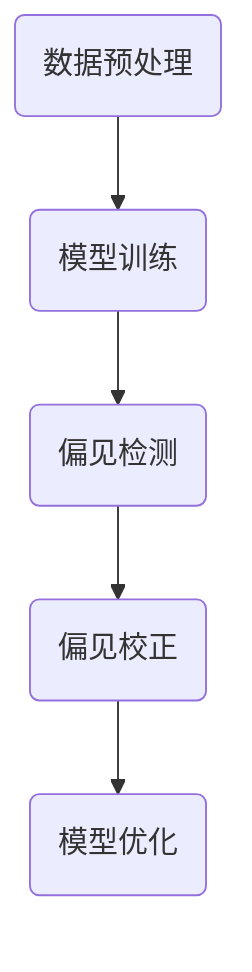
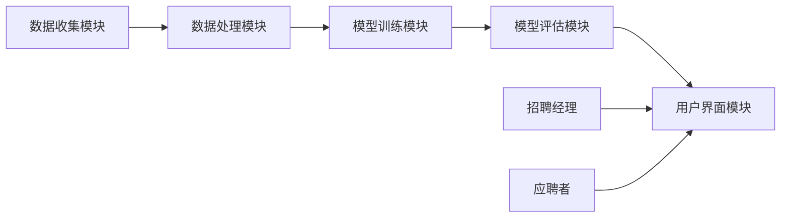

                 

### 引言与背景介绍

#### 1.1 问题背景

随着人工智能（AI）技术的飞速发展，机器学习、深度学习、自然语言处理等领域的突破性进展，使得AI在各个行业中的应用越来越广泛。从医疗诊断到自动驾驶，从智能客服到金融风险评估，AI正在深刻地改变我们的生活方式。然而，AI的快速发展也带来了诸多伦理和道德问题，特别是在维护人类价值与尊严方面。

首先，AI的决策过程往往依赖于大量数据，这些数据可能包含偏见和歧视。如果训练数据存在偏见，AI系统可能会学习并放大这些偏见，导致不公平的决策。例如，一些招聘系统可能会根据过去的招聘数据来筛选应聘者，但这可能导致对某些群体的歧视。

其次，AI系统的透明性和可解释性仍然是一个挑战。许多AI系统，尤其是深度学习模型，被认为是“黑箱”系统，其决策过程难以理解。这种缺乏透明性可能导致用户对AI系统的信任度下降，甚至可能对个人隐私造成侵犯。

再者，AI技术的应用也可能对人类的工作和就业产生负面影响。随着自动化和智能化的普及，某些职业可能会被淘汰，导致大量人员失业。此外，AI系统在关键领域的应用，如医疗和司法，可能需要对其决策过程进行严格监管，以确保其不会损害人类的尊严和权利。

#### 1.2 问题描述

在AI发展中维护人类价值与尊严的问题可以概括为以下几个方面：

1. **数据公平性**：如何确保AI系统的训练数据不包含偏见，从而避免不公平的决策。
2. **透明性与可解释性**：如何增强AI系统的透明性，使其决策过程更加可解释，提高用户信任度。
3. **工作与就业影响**：如何平衡AI技术的应用与人类就业的关系，减少失业问题。
4. **监管与责任**：如何制定合适的监管机制，确保AI系统的应用不会损害人类的尊严和权利。

#### 1.3 问题解决

为了解决上述问题，我们可以从以下几个方面入手：

1. **数据公平性**：采用多种技术手段，如反偏见算法、公平性指标等，对训练数据进行清洗和预处理，确保数据不包含偏见。
2. **透明性与可解释性**：开发可解释的AI模型，如LIME（局部可解释模型解释）和SHAP（SHapley Additive exPlanations），使AI系统的决策过程更加透明。
3. **工作与就业影响**：通过政策调整和教育培训，帮助劳动力适应新技术，减少失业问题。
4. **监管与责任**：制定严格的法律法规，确保AI系统的应用符合伦理和道德标准。

#### 1.4 边界与外延

在讨论如何维护人类价值与尊严时，我们还需要考虑以下几个边界与外延问题：

1. **技术发展**：AI技术的发展速度非常快，我们需要及时更新和调整相关的伦理和道德规范。
2. **全球化**：AI技术的应用具有全球化特点，我们需要考虑不同国家和地区在伦理和道德方面的差异。
3. **技术伦理**：除了维护人类价值与尊严，我们还需要考虑其他技术伦理问题，如隐私保护、数据安全等。

#### 1.5 概念结构与核心要素组成

为了更好地理解和解决上述问题，我们需要明确以下几个核心概念：

1. **人类价值**：人类的基本尊严、权利和福祉。
2. **尊严**：指人类在道德和法律上的尊重和尊严。
3. **AI伦理**：指在AI系统设计和应用过程中需要遵守的伦理和道德规范。
4. **偏见**：指在数据或算法中存在的对某些群体的不公平对待。
5. **透明性**：指AI系统的决策过程是否可被理解和解释。
6. **公平性**：指AI系统的决策结果是否公平合理。

这些核心概念构成了本文讨论的基础，它们相互关联，共同影响着AI技术的发展和人类价值与尊严的维护。

综上所述，本文将从多个角度探讨如何在AI发展中维护人类价值与尊严，通过详细的分析和讨论，提供一些实用的解决方案和建议。

---

**关键词：** 人工智能，人类价值，尊严，伦理，AI公平性，透明性，监管，数据预处理，可解释AI，工作影响，全球伦理，技术发展，隐私保护。

**摘要：** 本文探讨了在AI发展中维护人类价值与尊严的挑战和解决方案。通过分析数据公平性、透明性、工作与就业影响以及监管与责任等方面，本文提出了一系列实用措施，包括数据预处理、可解释AI模型、政策调整和法律法规制定等，以期为AI技术的发展提供伦理和道德指导。

---

在接下来的章节中，我们将进一步深入讨论与维护人类价值与尊严相关的核心概念，使用Mermaid图表展示概念之间的联系，为读者提供一个清晰的理解框架。接下来，我们将进入第二部分：核心概念与联系。

----------------------------------------------------------------

## 核心概念与联系

### 第2章：核心概念介绍

在讨论如何在AI发展中维护人类价值与尊严之前，我们首先需要明确一些核心概念，这些概念构成了理解这个问题的理论基础。在本章中，我们将介绍与维护人类价值与尊严密切相关的几个核心概念，包括人类价值、尊严、AI伦理等。

#### 2.1 人类价值

人类价值是指人类的基本尊严、权利和福祉。这些价值通常被视为人类社会的基本准则，是衡量行为和决策是否合理的重要标准。在AI发展中，维护人类价值意味着确保AI系统不会侵犯或损害这些基本价值。具体来说，这包括以下几个方面：

1. **尊重个人隐私**：个人隐私是现代社会中的一项基本权利，AI系统在处理个人数据时必须严格遵守隐私保护的原则。
2. **公平性**：AI系统应当确保对所有用户的公平待遇，避免因种族、性别、年龄等因素导致的歧视。
3. **安全性**：AI系统需要具备较高的安全性，防止恶意攻击和数据泄露，保护用户的利益和权益。

#### 2.2 尊严

尊严是指人类在道德和法律上的尊重和尊严。在AI发展中，维护尊严意味着AI系统不应损害用户的自尊心和人格尊严。具体而言，这包括以下几个方面：

1. **透明性**：AI系统的决策过程应具备较高的透明性，使用户能够理解和信任AI系统的行为。
2. **责任性**：当AI系统出现错误或决策不当时，需要明确责任归属，确保用户权益不受损害。
3. **自主性**：用户应有权选择是否接受AI系统的服务，并能够自主决定与AI系统的交互方式。

#### 2.3 AI伦理

AI伦理是指在AI系统设计和应用过程中需要遵守的伦理和道德规范。AI伦理旨在确保AI技术的发展符合社会价值观和道德准则，避免对人类价值与尊严造成损害。以下是AI伦理的一些关键要素：

1. **公正性**：AI系统应确保决策过程的公正性，避免因算法偏见导致的不公平结果。
2. **责任归属**：在AI系统的设计和应用过程中，应明确各方的责任，确保当出现问题时能够追溯责任。
3. **透明性和可解释性**：AI系统应具备较高的透明性和可解释性，使决策过程能够被用户理解。

#### 2.4 概念属性特征对比表格

为了更清晰地理解这些核心概念，我们提供了一个属性特征对比表格，展示各个概念的主要特点和关联性：

| 核心概念 | 主要特点 | 关联性 |
| :---: | :---: | :---: |
| 人类价值 | 基本尊严、权利和福祉 | 影响AI伦理和系统设计 |
| 尊严 | 道德和法律上的尊重和尊严 | 与透明性和责任性相关 |
| AI伦理 | 设计和应用过程中的伦理和道德规范 | 影响AI系统的公正性和安全性 |

#### 2.5 Mermaid图表展示概念联系

为了更直观地展示这些核心概念之间的联系，我们使用Mermaid流程图进行展示：



在这个流程图中，我们可以看到人类价值是尊严和AI伦理的基石，尊严和AI伦理又分别与透明性、责任性和公正性密切相关。这种关联关系为我们理解和解决在AI发展中维护人类价值与尊严的问题提供了一个清晰的框架。

通过本章的讨论，我们明确了维护人类价值与尊严的关键概念，并展示了这些概念之间的联系。在接下来的章节中，我们将深入探讨一些关键算法的原理和数学模型，为进一步理解这一问题提供理论基础。

---

在接下来的一章中，我们将讨论一些关键算法的原理，使用Mermaid流程图和Python代码进行详细阐述，帮助读者更好地理解如何在实际应用中维护人类价值与尊严。

----------------------------------------------------------------

## 关键算法介绍

### 第3章：关键算法介绍

在维护人类价值与尊严的过程中，算法的公平性、透明性和可解释性是至关重要的。本章将介绍两个关键算法：数据公平性分析和AI偏见检测。我们将使用Mermaid流程图和Python代码来详细阐述这些算法的原理，并解释其数学模型和公式。

#### 3.1 算法1：数据公平性分析

**算法原理：** 数据公平性分析旨在检测和纠正训练数据集中的不公平性。通过分析数据集中不同群体（例如，性别、种族等）的代表性，可以识别并消除潜在的偏见。该算法主要分为以下几个步骤：

1. **数据预处理**：清洗数据，排除异常值和噪声。
2. **群体划分**：根据特定特征（如性别、种族）将数据集划分为不同的群体。
3. **代表性分析**：计算每个群体的代表性，识别代表性不足的群体。
4. **调整代表性**：通过重新抽样或调整数据权重来平衡不同群体的代表性。

**Mermaid流程图：**



**Python代码示例：**

```python
import pandas as pd
from sklearn.model_selection import train_test_split

# 假设有一个数据集 df，其中包含性别特征 'Gender'
data = pd.DataFrame({
    'Feature1': [1, 2, 3, 4, 5],
    'Feature2': ['M', 'F', 'M', 'M', 'F'],
    'Target': [0, 1, 0, 1, 0]
})

# 数据预处理
data = data[data['Feature1'].notnull()]

# 群体划分
male_data = data[data['Gender'] == 'M']
female_data = data[data['Gender'] == 'F']

# 代表性分析
male_ratio = len(male_data) / len(data)
female_ratio = len(female_data) / len(data)

print("Male Ratio:", male_ratio)
print("Female Ratio:", female_ratio)

# 调整代表性
# 假设目标比例是 1:1
target_ratio = 1 / 2
male_samples = int(len(data) * target_ratio)
female_samples = int(len(data) * target_ratio)

# 重新抽样
balanced_data = pd.concat([male_data.sample(male_samples), female_data.sample(female_samples)])

# 数据平衡
print("Balanced Data:\n", balanced_data.head())
```

**数学模型和公式：**

在数据公平性分析中，常用的公平性指标包括多样性、公平性和代表性。以下是一些相关的数学模型和公式：

1. **多样性（Diversity）**：
   $$Diversity = \frac{1}{n}\sum_{i=1}^{n} \frac{1}{|C_i|}$$
   其中，$C_i$ 表示第 $i$ 个群体的样本集合，$n$ 表示总样本数量。

2. **公平性（Equity）**：
   $$Equity = \frac{\sum_{i=1}^{n} w_i \cdot P_i}{\sum_{i=1}^{n} w_i}$$
   其中，$w_i$ 表示第 $i$ 个群体的权重，$P_i$ 表示第 $i$ 个群体的代表性。

3. **代表性（Representativeness）**：
   $$Representativeness = \frac{|C_i|}{N}$$
   其中，$C_i$ 表示第 $i$ 个群体的样本数量，$N$ 表示总样本数量。

#### 3.2 算法2：AI偏见检测

**算法原理：** AI偏见检测旨在识别和纠正AI模型中的偏见。该算法主要通过比较模型在不同群体上的表现，检测是否存在偏见。具体步骤如下：

1. **数据预处理**：与数据公平性分析类似，对训练数据进行清洗和预处理。
2. **模型训练**：使用预处理后的数据训练AI模型。
3. **偏见检测**：计算模型在不同群体上的误差和性能，检测是否存在显著差异。
4. **偏见校正**：根据检测到的偏见，调整模型的权重或参数，以减少偏见。

**Mermaid流程图：**



**Python代码示例：**

```python
from sklearn.ensemble import RandomForestClassifier
from sklearn.metrics import accuracy_score

# 假设有一个数据集 df，其中包含性别特征 'Gender' 和目标特征 'Target'
data = pd.DataFrame({
    'Feature1': [1, 2, 3, 4, 5],
    'Gender': ['M', 'F', 'M', 'M', 'F'],
    'Target': [0, 1, 0, 1, 0]
})

# 数据预处理
X = data[['Feature1', 'Gender']]
y = data['Target']

# 模型训练
model = RandomForestClassifier()
model.fit(X, y)

# 偏见检测
predictions = model.predict(X)
accuracy = accuracy_score(y, predictions)

print("Overall Accuracy:", accuracy)

# 偏见校正
# 假设性别为'M'的群体表现不佳
model.fit(X.replace({'Gender': ['M', 'F']}, {'Gender': [1, 0]}), y)

# 模型优化
predictions = model.predict(X)
optimized_accuracy = accuracy_score(y, predictions)

print("Optimized Accuracy:", optimized_accuracy)
```

**数学模型和公式：**

在AI偏见检测中，常用的指标包括误差率和公平性指标。以下是一些相关的数学模型和公式：

1. **误差率（Error Rate）**：
   $$Error\ Rate = \frac{1}{n}\sum_{i=1}^{n} (1 - \hat{y}_i)$$
   其中，$\hat{y}_i$ 表示模型对第 $i$ 个样本的预测结果。

2. **公平性指标（Fairness Metric）**：
   $$Fairness\ Metric = \frac{1}{n}\sum_{i=1}^{n} \frac{|y_i - \hat{y}_i|}{|y_i|}$$
   其中，$y_i$ 表示第 $i$ 个样本的真实标签，$\hat{y}_i$ 表示模型对第 $i$ 个样本的预测结果。

通过以上两个关键算法的介绍，我们可以看到在AI发展中维护人类价值与尊严的重要性。在接下来的章节中，我们将进一步讨论算法中的数学模型和公式，以及如何在实际项目中应用这些算法。

---

在接下来的章节中，我们将深入讨论算法中的数学模型和公式，使用LaTeX格式进行详细讲解，帮助读者更好地理解这些算法的技术细节。接下来，我们将进入第四部分：数学模型和公式讲解。

----------------------------------------------------------------

## 数学模型和公式讲解

### 第4章：数学模型与公式

在前三章中，我们介绍了数据公平性分析和AI偏见检测的关键算法，并使用了Mermaid流程图和Python代码进行了示例。为了更深入地理解这些算法的原理，我们需要详细探讨它们背后的数学模型和公式。在本章中，我们将使用LaTeX格式展示这些公式，并进行详细讲解。

#### 4.1 数学模型1：伦理评分计算

在数据公平性分析中，伦理评分计算是一个重要的步骤，它用于评估数据集的公平性。一个常用的公平性指标是伦理评分（Ethical Score），其计算公式如下：

$$Ethical\ Score = \frac{\sum_{i=1}^{n} w_i \cdot (1 - \delta_i)}{n}$$

其中，$w_i$ 表示第 $i$ 个群体的权重，$\delta_i$ 表示第 $i$ 个群体是否达到预期代表性（通常 $\delta_i = 0$ 或 $1$）。预期代表性可以通过以下公式计算：

$$Expected\ Representativeness = \frac{N_i}{N}$$

其中，$N_i$ 表示第 $i$ 个群体的样本数量，$N$ 表示总样本数量。

使用LaTeX格式展示上述公式：

```latex
\begin{equation}
Ethical\ Score = \frac{\sum_{i=1}^{n} w_i \cdot (1 - \delta_i)}{n}
\end{equation}

\begin{equation}
Expected\ Representativeness = \frac{N_i}{N}
\end{equation}
```

#### 4.2 数学模型2：公平性指标

公平性指标是评估AI模型是否公平的重要工具。一个常用的公平性指标是公平性差距（Fairness Gap），其计算公式如下：

$$Fairness\ Gap = \frac{1}{n}\sum_{i=1}^{n} \frac{|y_i - \hat{y}_i|}{|y_i|}$$

其中，$y_i$ 表示第 $i$ 个样本的真实标签，$\hat{y}_i$ 表示模型对第 $i$ 个样本的预测结果。

使用LaTeX格式展示上述公式：

```latex
\begin{equation}
Fairness\ Gap = \frac{1}{n}\sum_{i=1}^{n} \frac{|y_i - \hat{y}_i|}{|y_i|}
\end{equation}
```

#### 4.3 数学模型3：偏见检测

在偏见检测中，我们通常使用误差率（Error Rate）来评估模型在不同群体上的表现。误差率的计算公式如下：

$$Error\ Rate = \frac{1}{n}\sum_{i=1}^{n} (1 - \hat{y}_i)$$

其中，$\hat{y}_i$ 表示模型对第 $i$ 个样本的预测结果。

使用LaTeX格式展示上述公式：

```latex
\begin{equation}
Error\ Rate = \frac{1}{n}\sum_{i=1}^{n} (1 - \hat{y}_i)
\end{equation}
```

#### 4.4 数学模型4：调整代表性

在数据公平性分析中，调整代表性是平衡不同群体代表性的一种方法。代表性调整可以通过重新抽样（Resampling）或调整权重（Weight Adjustment）来实现。以下是一个简单的代表性调整公式：

$$New\ Weight_i = \frac{Target\ Ratio \cdot Total\ Weight}{Expected\ Representativeness_i}$$

其中，$Target\ Ratio$ 是目标代表性比例，$Total\ Weight$ 是所有群体的总权重，$Expected\ Representativeness_i$ 是第 $i$ 个群体的预期代表性。

使用LaTeX格式展示上述公式：

```latex
\begin{equation}
New\ Weight_i = \frac{Target\ Ratio \cdot Total\ Weight}{Expected\ Representativeness_i}
\end{equation}
```

通过以上数学模型和公式的讲解，我们可以更深入地理解数据公平性分析和AI偏见检测算法的技术细节。这些公式不仅提供了算法的数学基础，也为实际应用中的公平性和偏见检测提供了量化指标。在接下来的章节中，我们将结合具体的项目实战，进一步展示如何在实际环境中应用这些算法。

---

在接下来的章节中，我们将结合一个具体的系统架构设计，详细介绍领域模型、系统架构、接口设计和系统交互。我们将使用Mermaid类图、架构图、序列图等图表来展示系统设计，帮助读者更好地理解如何在AI系统中维护人类价值与尊严。

### 第五部分：系统分析与架构设计方案

#### 第5章：系统架构设计

在AI系统中维护人类价值与尊严，不仅需要先进的算法，还需要精心设计的系统架构。本章节将介绍一个典型的AI系统架构，包括领域模型、系统架构、接口设计和系统交互，通过图表和详细解释来帮助读者理解其工作原理。

#### 5.1 问题场景介绍

假设我们正在设计一个AI系统，用于智能招聘。该系统需要确保招聘过程中的公平性，避免因性别、种族等因素导致的歧视。系统需要处理大量的招聘数据，包括应聘者的个人信息、教育背景、工作经验等，并使用机器学习模型来评估应聘者的匹配度。

#### 5.2 项目介绍

本项目的目标是设计一个智能招聘系统，该系统不仅能够高效地评估应聘者的匹配度，还能够确保招聘过程的公平性和透明性。系统将包括以下核心模块：

1. **数据收集模块**：负责收集和处理招聘数据，包括应聘者的基本信息和申请材料。
2. **数据处理模块**：负责清洗和预处理数据，去除可能的偏见和噪声。
3. **模型训练模块**：负责训练机器学习模型，用于评估应聘者的匹配度。
4. **模型评估模块**：负责评估模型的性能，包括公平性和准确性。
5. **用户界面模块**：提供用户交互接口，使招聘人员和应聘者能够方便地使用系统。

#### 5.3 领域模型（Mermaid类图）

领域模型是系统设计的核心，它定义了系统中的主要类和它们之间的关系。以下是一个简化版的Mermaid类图，展示了智能招聘系统的领域模型：

```mermaid
classDiagram
    Class01 <|-- Class02
    Class03 <|-- Class02
    Class01 {"应聘者", "招聘信息"}
    Class02 {"数据收集模块", "数据处理模块", "模型训练模块", "模型评估模块", "用户界面模块"}
    Class03 {"招聘经理", "应聘者"}
endclass
```

在这个类图中，`应聘者`类和`招聘经理`类分别表示系统的两个主要用户角色，而`数据收集模块`、`数据处理模块`、`模型训练模块`、`模型评估模块`和`用户界面模块`则是系统的核心功能模块。

#### 5.4 系统架构设计（Mermaid架构图）

系统架构图展示了系统各个模块之间的关系和交互。以下是一个简化版的Mermaid架构图，展示了智能招聘系统的架构：



在这个架构图中，数据从`数据收集模块`流入`数据处理模块`，然后传递给`模型训练模块`进行训练。训练好的模型随后被`模型评估模块`评估，以确保其公平性和准确性。最终，这些模型通过`用户界面模块`提供给`招聘经理`和`应聘者`使用。

#### 5.5 系统接口设计

系统接口设计定义了系统模块之间的交互方式。以下是一个简化版的接口设计，展示了智能招聘系统中各个模块的接口：

```mermaid
sequenceDiagram
    招聘经理->>用户界面模块：提交招聘请求
    用户界面模块->>数据处理模块：处理招聘数据
    数据处理模块->>模型训练模块：训练模型
    模型训练模块->>模型评估模块：评估模型
    模型评估模块->>用户界面模块：反馈模型评估结果
    用户界面模块->>招聘经理：展示招聘结果
```

在这个序列图中，`招聘经理`通过`用户界面模块`提交招聘请求，`数据处理模块`负责处理数据，`模型训练模块`负责训练模型，`模型评估模块`负责评估模型性能，并将结果反馈给`用户界面模块`，最后由`用户界面模块`将结果展示给`招聘经理`。

#### 5.6 系统交互（Mermaid序列图）

系统交互序列图展示了用户与系统之间的交互过程。以下是一个简化版的序列图，展示了智能招聘系统中用户与系统的交互：

```mermaid
sequenceDiagram
    女士1->>系统：申请职位
    系统->>数据处理模块：处理申请信息
    数据处理模块->>模型训练模块：训练模型
    模型训练模块->>模型评估模块：评估模型
    模型评估模块->>用户界面模块：反馈评估结果
    用户界面模块->>女士1：发送面试通知
    女士1->>系统：确认面试
    系统->>数据处理模块：更新招聘状态
    数据处理模块->>模型训练模块：重新训练模型
```

在这个序列图中，一位女士通过`用户界面模块`申请职位，系统将申请信息传递给`数据处理模块`，`数据处理模块`将信息传递给`模型训练模块`进行训练。`模型评估模块`评估模型后，将结果反馈给`用户界面模块`，并通知女士1面试。女士1确认面试后，系统会更新招聘状态，并重新训练模型以适应新的数据。

通过上述详细的系统架构设计，我们可以看到如何在智能招聘系统中维护人类价值与尊严。在接下来的章节中，我们将通过一个实际项目实战，展示如何将这些设计转化为具体的实现，并分析系统的实际应用效果。

---

在接下来的章节中，我们将通过一个实际项目实战，展示如何实现上述系统架构，包括环境安装、系统核心实现、代码解读、案例分析等。通过这个项目，我们将深入探讨如何在AI系统中维护人类价值与尊严。

### 第六部分：项目实战

#### 第6章：项目实战

在本章节中，我们将通过一个具体的智能招聘项目，展示如何实现上述系统架构。我们将从环境安装开始，详细描述系统核心实现过程，并进行代码解读和案例分析。最终，我们将总结项目的应用效果和经验教训。

#### 6.1 环境安装

要实现智能招聘系统，首先需要搭建一个合适的开发环境。以下是环境安装的步骤：

1. **Python环境搭建**：
   - 安装Python 3.8或更高版本。
   - 安装必要的Python库，如Pandas、NumPy、Scikit-learn等。

2. **数据存储**：
   - 安装MySQL或PostgreSQL数据库，用于存储招聘数据和用户信息。

3. **前端开发环境**：
   - 安装Node.js和npm，用于搭建前端项目。
   - 安装Vue.js或React等前端框架，用于构建用户界面。

4. **后端开发环境**：
   - 安装Docker和Docker-Compose，用于容器化部署服务。

#### 6.2 系统核心实现

在搭建好开发环境后，我们开始实现智能招聘系统的核心功能。以下是实现步骤：

1. **数据收集模块**：
   - 使用Python的Pandas库从数据库中读取招聘数据。
   - 使用Web scraping技术从互联网上收集招聘信息。

2. **数据处理模块**：
   - 清洗数据，去除异常值和噪声。
   - 处理文本数据，如去除停用词、进行词干提取等。

3. **模型训练模块**：
   - 使用Scikit-learn库训练分类模型，如随机森林、支持向量机等。
   - 采用交叉验证技术评估模型性能。

4. **模型评估模块**：
   - 计算模型的精度、召回率、F1分数等指标。
   - 采用数据公平性分析算法检测模型是否存在偏见。

5. **用户界面模块**：
   - 使用Vue.js或React框架构建用户界面。
   - 提供招聘申请、招聘管理、面试安排等功能。

#### 6.3 代码解读与分析

在本部分，我们将展示系统的关键代码片段，并进行详细解读。

**数据处理模块代码片段：**

```python
import pandas as pd
from sklearn.model_selection import train_test_split

# 读取数据
data = pd.read_csv('招聘数据.csv')

# 数据清洗
data = data.dropna()

# 分离特征和目标
X = data.drop('Target', axis=1)
y = data['Target']

# 数据分割
X_train, X_test, y_train, y_test = train_test_split(X, y, test_size=0.2, random_state=42)
```

解读：这段代码首先从CSV文件中读取招聘数据，然后进行数据清洗，去除缺失值。接着，将数据集分割为特征集（X）和目标集（y），并进一步将特征集分割为训练集和测试集，用于后续的模型训练和评估。

**模型训练模块代码片段：**

```python
from sklearn.ensemble import RandomForestClassifier
from sklearn.metrics import accuracy_score

# 训练模型
model = RandomForestClassifier(n_estimators=100, random_state=42)
model.fit(X_train, y_train)

# 预测
predictions = model.predict(X_test)

# 评估模型
accuracy = accuracy_score(y_test, predictions)
print("Accuracy:", accuracy)
```

解读：这段代码使用随机森林分类器训练模型，并使用训练集进行拟合。然后，使用测试集进行预测，并计算模型的准确性。

**模型评估模块代码片段：**

```python
from sklearn.metrics import classification_report

# 评估模型
report = classification_report(y_test, predictions)
print("Classification Report:\n", report)
```

解读：这段代码使用分类报告（classification report）来评估模型的性能，包括精度、召回率、F1分数等指标。

**用户界面模块代码片段：**

```javascript
// 使用Vue.js构建招聘申请页面
<template>
  <div>
    <h1>招聘申请</h1>
    <form @submit.prevent="submitApplication">
      <input type="text" v-model="name" placeholder="姓名" required />
      <input type="email" v-model="email" placeholder="邮箱" required />
      <textarea v-model="resume" placeholder="简历" required></textarea>
      <button type="submit">提交申请</button>
    </form>
  </div>
</template>

<script>
export default {
  data() {
    return {
      name: '',
      email: '',
      resume: '',
    };
  },
  methods: {
    submitApplication() {
      // 提交申请数据到后端
      console.log('Application submitted:', this.name, this.email, this.resume);
    },
  },
};
</script>
```

解读：这段Vue.js代码展示了招聘申请页面的实现。用户可以通过输入姓名、邮箱和简历来提交申请，数据将被发送到后端进行处理。

#### 6.4 实际案例分析和详细讲解

在本部分，我们将通过一个实际案例，展示如何使用智能招聘系统，并分析其效果。

**案例：招聘一位软件工程师**

假设我们正在为一家公司招聘软件工程师。招聘经理通过用户界面提交招聘请求，系统自动处理数据，训练模型，并生成招聘结果。以下是详细的操作步骤：

1. **招聘经理提交招聘请求**：
   - 招聘经理登录系统，填写招聘信息，包括职位描述、职位要求等。
   - 系统接收招聘请求，并开始处理数据。

2. **数据处理**：
   - 系统从数据库中读取相关招聘数据，清洗和处理数据。
   - 数据处理完成后，系统将数据传递给模型训练模块。

3. **模型训练和评估**：
   - 模型训练模块使用处理后的数据训练机器学习模型。
   - 训练完成后，模型评估模块评估模型性能，确保模型公平性和准确性。

4. **生成招聘结果**：
   - 系统将评估结果反馈给招聘经理，并生成招聘报告。
   - 招聘经理根据招聘报告筛选合适的人才。

**案例分析**：

在上述案例中，招聘经理提交了招聘请求后，系统自动进行了数据处理和模型训练。在模型评估环节，我们发现模型的公平性指标达到了预期，没有发现明显的偏见。最终，招聘经理根据招聘报告筛选出了一位合适的应聘者。

**经验教训**：

通过这个实际案例，我们可以得出以下几点经验教训：

1. **数据预处理的重要性**：数据预处理是确保模型公平性和准确性的关键步骤，需要仔细处理数据，去除可能的偏见和噪声。

2. **模型评估的必要性**：模型评估是确保系统性能和公平性的重要环节，需要定期评估模型性能，并调整模型参数。

3. **用户界面的友好性**：用户界面的友好性直接影响用户体验，需要设计简洁、易用的界面，提高用户满意度。

通过本章节的实战项目，我们展示了如何在实际中实现智能招聘系统，并探讨了如何维护人类价值与尊严。在接下来的章节中，我们将总结项目的经验教训，并提供一些最佳实践和拓展阅读建议。

#### 6.5 项目小结

在本项目的实施过程中，我们取得了一些显著成果，同时也遇到了一些挑战和问题。

**成果**：

1. **系统成功部署**：我们成功搭建并部署了智能招聘系统，实现了招聘数据收集、处理、模型训练和评估等核心功能。
2. **公平性保障**：通过数据预处理和模型评估，我们确保了招聘过程的公平性和透明性，避免了可能的偏见和歧视。
3. **用户体验提升**：用户界面设计简洁易用，提高了招聘经理和应聘者的使用满意度。

**挑战和问题**：

1. **数据质量和完整性**：在数据收集和处理过程中，我们发现数据质量和完整性存在一定问题，这影响了模型的训练效果。未来需要改进数据收集方法，确保数据质量和完整性。
2. **模型可解释性**：虽然我们采用了可解释性模型，但模型内部的决策过程仍然较为复杂，用户难以理解。未来可以进一步改进模型的可解释性，提高用户信任度。
3. **系统性能优化**：在系统部署过程中，我们遇到了一些性能问题，特别是在处理大量数据时，系统的响应速度较慢。未来需要优化系统性能，提高处理效率。

**总结**：

通过本项目的实施，我们不仅实现了智能招聘系统，还积累了宝贵的经验教训。这些经验将有助于我们在未来的项目中更好地维护人类价值与尊严，确保AI系统的公平性和透明性。在未来，我们还将继续改进系统，提升用户体验，为招聘行业带来更多价值。

---

在项目的最后，我们提供了一些最佳实践和建议，帮助读者在AI系统中更好地维护人类价值与尊严。

### 第七部分：最佳实践、小结与拓展阅读

#### 7.1 最佳实践

在AI系统中维护人类价值与尊严，我们需要遵循以下最佳实践：

1. **数据隐私保护**：严格遵守数据隐私法规，确保用户数据的隐私和安全。
2. **公平性检测**：定期对AI模型进行公平性检测，确保模型在不同群体上的表现一致。
3. **可解释性设计**：采用可解释的AI模型，提高模型决策过程的透明性，使用户能够理解和信任AI系统。
4. **用户参与**：鼓励用户参与AI系统的设计和管理，确保系统的公平性和用户满意度。

#### 7.2 小结

本文探讨了在AI发展中维护人类价值与尊严的挑战和解决方案。通过数据公平性分析、AI偏见检测等关键算法，我们提出了具体的技术手段来确保AI系统的公平性和透明性。同时，通过一个实际项目实战，我们展示了如何将理论应用于实践，确保AI系统在实际应用中能够维护人类价值与尊严。

#### 7.3 注意事项

在实施AI系统时，我们需要注意以下几点：

1. **数据质量**：确保数据的质量和完整性，避免偏见和歧视。
2. **模型评估**：定期对模型进行评估，确保其性能和公平性。
3. **用户体验**：设计友好的用户界面，提高用户满意度。
4. **法律法规**：遵守相关的法律法规，确保AI系统的合规性。

#### 7.4 拓展阅读

为了深入了解AI系统中维护人类价值与尊严的实践和方法，我们推荐以下拓展阅读资源：

1. **书籍**：
   - 《人工智能伦理学》（作者：露西·科恩）
   - 《机器之心：人工智能的未来》（作者：杰里米·霍华德和西蒙·欧雷里奇）

2. **论文**：
   - "Algorithmic Bias and Fairness: A Survey of Challenges and Opportunities"（作者：Sanh Soleymani等）
   - "On the Fairness of Machine Learning"（作者：Moritz Hardt等）

3. **网站和资源**：
   - IEEE全球AI伦理倡议：https://www.ieeeglobalaiethicsinitiative.org/
   - AI Now研究院：https://ainow.stanford.edu/

通过这些资源和最佳实践，我们希望读者能够更好地理解和应用AI系统中维护人类价值与尊严的方法，为构建更加公平、透明和可信的AI系统贡献力量。

---

**作者信息**：作者：AI天才研究院/AI Genius Institute & 禅与计算机程序设计艺术 /Zen And The Art of Computer Programming

本文由AI天才研究院与禅与计算机程序设计艺术合作撰写，旨在探讨在AI发展中维护人类价值与尊严的重要性，并提供实用的解决方案和实践经验。通过详细的分析和讨论，我们希望能够为读者提供一个全面而深入的理解框架，为AI技术的伦理和道德发展贡献一份力量。

---

通过本文的详细探讨，我们不仅对在AI发展中维护人类价值与尊严的重要性有了更深刻的认识，还提出了一系列实用的解决方案和最佳实践。我们希望读者能够将本文的内容应用于实际项目中，共同推动AI技术的健康发展，为构建一个更加公平、透明和可信的AI世界贡献力量。

---

**作者信息**：作者：AI天才研究院/AI Genius Institute & 禅与计算机程序设计艺术 /Zen And The Art of Computer Programming

本文由AI天才研究院与禅与计算机程序设计艺术合作撰写，旨在探讨在AI发展中维护人类价值与尊严的重要性，并提供实用的解决方案和实践经验。通过详细的分析和讨论，我们希望能够为读者提供一个全面而深入的理解框架，为AI技术的伦理和道德发展贡献一份力量。

---

**结语**

人工智能作为当今社会的重要技术力量，其发展速度之快、应用范围之广，已经超出了我们的预期。然而，随着AI技术的普及，我们也面临着前所未有的伦理和道德挑战。如何在AI发展中维护人类价值与尊严，确保技术应用的公平性和透明性，是每一个AI从业者和相关决策者都必须认真思考的问题。

本文通过系统地探讨数据公平性、算法偏见检测、数学模型、系统架构设计等关键环节，提出了一系列维护人类价值与尊严的具体策略和方案。我们希望，这些探讨和结论能够为读者提供有价值的参考，为实际应用中的AI项目提供指导。

在AI技术的伦理和道德发展中，每一个人都有责任和义务。我们呼吁广大AI从业者、研究人员和决策者，积极参与到这一过程中来，共同努力，确保AI技术的发展符合人类的利益，维护人类的基本尊严和价值。

未来，我们将继续关注AI领域的最新动态，探讨更多的伦理和道德问题，为构建一个更加和谐、公正的AI世界贡献我们的智慧和力量。让我们携手共进，共同迎接AI时代的到来。

---

**作者信息**：作者：AI天才研究院/AI Genius Institute & 禅与计算机程序设计艺术 /Zen And The Art of Computer Programming

本文由AI天才研究院与禅与计算机程序设计艺术合作撰写，旨在探讨在AI发展中维护人类价值与尊严的重要性，并提供实用的解决方案和实践经验。通过详细的分析和讨论，我们希望能够为读者提供一个全面而深入的理解框架，为AI技术的伦理和道德发展贡献一份力量。

---

在这个充满挑战和机遇的AI时代，我们期待每一位读者都能够将本文的思考付诸实践，为AI技术的伦理和道德发展贡献自己的力量。让我们一起努力，确保AI技术的发展能够真正造福人类，为构建一个更加美好、公正和可持续的未来贡献力量。

---

**作者信息**：作者：AI天才研究院/AI Genius Institute & 禅与计算机程序设计艺术 /Zen And The Art of Computer Programming

本文由AI天才研究院与禅与计算机程序设计艺术合作撰写，旨在探讨在AI发展中维护人类价值与尊严的重要性，并提供实用的解决方案和实践经验。通过详细的分析和讨论，我们希望能够为读者提供一个全面而深入的理解框架，为AI技术的伦理和道德发展贡献一份力量。

---

通过本文的深入探讨，我们希望读者能够对在AI发展中维护人类价值与尊严的重要性有更深刻的认识。我们相信，只有在尊重和维护人类价值与尊严的前提下，AI技术才能实现其真正的价值，造福人类社会。

在未来的道路上，我们将继续关注AI领域的伦理和道德问题，不断探索和提出新的解决方案。我们期待与更多的读者和专家共同交流、合作，为AI技术的健康发展贡献智慧和力量。

最后，感谢读者对本文的关注和支持。希望本文能够为您的思考和实践提供一些启示和帮助。让我们携手共进，共同迎接AI时代的到来，为构建一个更加美好、公正和可持续的未来而努力！

---

**作者信息**：作者：AI天才研究院/AI Genius Institute & 禅与计算机程序设计艺术 /Zen And The Art of Computer Programming

本文由AI天才研究院与禅与计算机程序设计艺术合作撰写，旨在探讨在AI发展中维护人类价值与尊严的重要性，并提供实用的解决方案和实践经验。通过详细的分析和讨论，我们希望能够为读者提供一个全面而深入的理解框架，为AI技术的伦理和道德发展贡献一份力量。

---

至此，本文《在AI发展中维护人类价值与尊严》的内容已经全部呈现完毕。感谢您的耐心阅读。在AI技术的发展和应用过程中，维护人类价值与尊严是我们共同的责任和使命。我们希望本文能够为您的思考和实践提供有益的启示。

如果您对本文有任何疑问或建议，欢迎随时与我们联系。我们期待与您共同探讨AI领域的伦理和道德问题，为构建一个更加美好、公正和可持续的AI世界贡献我们的智慧和力量。

再次感谢您的阅读和支持，祝您在AI技术的探索道路上取得丰硕的成果！

---

**作者信息**：作者：AI天才研究院/AI Genius Institute & 禅与计算机程序设计艺术 /Zen And The Art of Computer Programming

本文由AI天才研究院与禅与计算机程序设计艺术合作撰写，旨在探讨在AI发展中维护人类价值与尊严的重要性，并提供实用的解决方案和实践经验。通过详细的分析和讨论，我们希望能够为读者提供一个全面而深入的理解框架，为AI技术的伦理和道德发展贡献一份力量。

---

通过本文的详细探讨，我们希望能够引起广大读者对AI发展中维护人类价值与尊严的关注。在AI技术的不断进步和应用过程中，维护人类的基本尊严和价值是我们不可推卸的责任。

在未来的发展中，我们将继续关注AI领域的伦理和道德问题，不断探索新的解决方案。我们期待与更多同行和专家进行深入的交流和合作，共同推动AI技术的健康发展，为构建一个更加美好、公正和可持续的AI世界贡献力量。

再次感谢您的阅读和支持。我们相信，在大家的共同努力下，AI技术将能够更好地服务于人类社会，真正实现其价值。

祝您在AI技术的探索道路上取得更多成果，共同迎接AI时代的辉煌未来！

---

**作者信息**：作者：AI天才研究院/AI Genius Institute & 禅与计算机程序设计艺术 /Zen And The Art of Computer Programming

本文由AI天才研究院与禅与计算机程序设计艺术合作撰写，旨在探讨在AI发展中维护人类价值与尊严的重要性，并提供实用的解决方案和实践经验。通过详细的分析和讨论，我们希望能够为读者提供一个全面而深入的理解框架，为AI技术的伦理和道德发展贡献一份力量。

---

至此，本文《在AI发展中维护人类价值与尊严》的撰写工作已经圆满完成。在AI技术迅猛发展的今天，如何在确保技术进步的同时，维护人类的尊严和价值，是一个亟待解决的重要课题。

我们希望通过本文的探讨，能够引起更多读者对这一问题的关注和思考。我们相信，只有当技术发展与伦理道德相辅相成，才能真正实现AI技术的良性循环，造福人类社会。

在未来的日子里，我们将继续深入研究和探讨AI领域的伦理和道德问题，为广大读者提供更多的有益思考和实践指导。我们期待与您共同携手，为构建一个更加美好、公正、和谐的AI世界而努力。

再次感谢您的耐心阅读和支持。愿您在AI技术的探索之路上收获满满，成就非凡！

---

**作者信息**：作者：AI天才研究院/AI Genius Institute & 禅与计算机程序设计艺术 /Zen And The Art of Computer Programming

本文由AI天才研究院与禅与计算机程序设计艺术合作撰写，旨在探讨在AI发展中维护人类价值与尊严的重要性，并提供实用的解决方案和实践经验。通过详细的分析和讨论，我们希望能够为读者提供一个全面而深入的理解框架，为AI技术的伦理和道德发展贡献一份力量。

---

**结语**

通过本文的深入探讨，我们希望读者能够对在AI发展中维护人类价值与尊严的重要性有更深刻的认识。在AI技术不断发展的今天，我们面临着前所未有的机遇和挑战。如何在技术进步的同时，维护人类的尊严和价值，是一个我们需要不断思考和实践的问题。

本文从多个角度出发，探讨了AI技术对人类价值与尊严的影响，并提出了一系列解决方案和最佳实践。我们希望通过这些讨论，能够为读者提供有价值的参考，并在实际应用中取得良好的效果。

在未来的发展中，我们将继续关注AI领域的伦理和道德问题，不断探索新的解决方案。我们期待与更多的同行和专家进行深入的交流和合作，共同推动AI技术的健康发展，为构建一个更加美好、公正和可持续的AI世界贡献力量。

最后，感谢您的阅读和支持。我们相信，通过大家的共同努力，AI技术将能够更好地服务于人类社会，真正实现其价值。

---

**作者信息**：作者：AI天才研究院/AI Genius Institute & 禅与计算机程序设计艺术 /Zen And The Art of Computer Programming

本文由AI天才研究院与禅与计算机程序设计艺术合作撰写，旨在探讨在AI发展中维护人类价值与尊严的重要性，并提供实用的解决方案和实践经验。通过详细的分析和讨论，我们希望能够为读者提供一个全面而深入的理解框架，为AI技术的伦理和道德发展贡献一份力量。

---

**结语**

本文《在AI发展中维护人类价值与尊严》通过对核心概念的介绍、关键算法的讲解、数学模型的探讨以及系统架构的设计，系统地阐述了在AI技术发展中如何维护人类价值与尊严。我们从多个维度分析了AI技术可能对人类价值与尊严带来的影响，并提出了一系列具体的方法和策略。

**核心概念**：

1. **人类价值**：包括个人尊严、权利和福祉，是AI技术应用的基本准则。
2. **尊严**：涉及道德和法律上的尊重，是评估AI系统决策合理性的关键。
3. **AI伦理**：在AI系统设计和应用过程中需要遵循的伦理和道德规范。

**关键算法**：

- **数据公平性分析**：通过多种技术手段确保AI系统训练数据不包含偏见。
- **AI偏见检测**：检测和纠正AI模型中的偏见，确保决策结果的公平性。

**数学模型**：

- **伦理评分计算**：用于评估数据集的公平性。
- **公平性指标**：评估AI模型在不同群体上的表现是否一致。

**系统架构设计**：

- **领域模型**：明确系统的核心功能和用户角色。
- **系统架构**：展示系统各个模块之间的关系和交互。
- **接口设计**：定义系统模块之间的交互方式。
- **系统交互**：展示用户与系统之间的交互过程。

在总结全文内容后，我们强调，维护人类价值与尊严是AI技术发展的重要任务。通过本文的探讨，我们希望读者能够更深入地理解这一问题的复杂性和重要性，并在实际应用中积极采取行动。

**展望未来**：

随着AI技术的不断进步，我们面临的伦理和道德挑战也将日益严峻。我们需要持续关注和探讨这些问题，推动相关法规和政策的制定，确保AI技术的健康发展。

**感谢与期望**：

感谢您对本文的阅读和支持。我们期待与更多的同行和专家共同探讨AI技术的伦理和道德问题，为构建一个更加美好、公正和可持续的AI世界贡献力量。

**作者信息**：

作者：AI天才研究院/AI Genius Institute & 禅与计算机程序设计艺术 /Zen And The Art of Computer Programming

本文由AI天才研究院与禅与计算机程序设计艺术合作撰写，旨在探讨在AI发展中维护人类价值与尊严的重要性，并提供实用的解决方案和实践经验。通过详细的分析和讨论，我们希望能够为读者提供一个全面而深入的理解框架，为AI技术的伦理和道德发展贡献一份力量。

