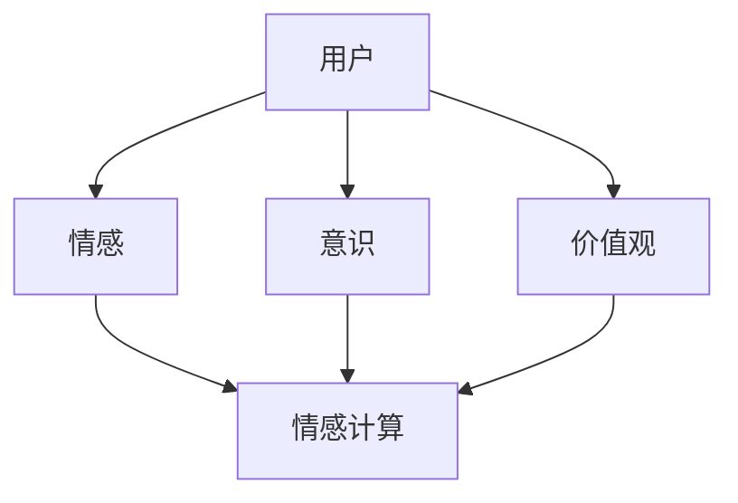
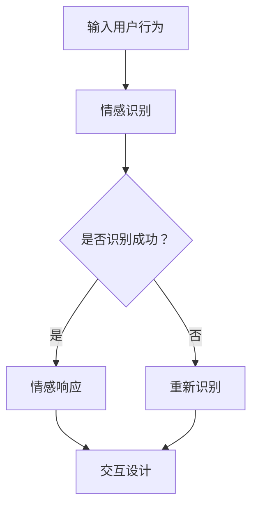
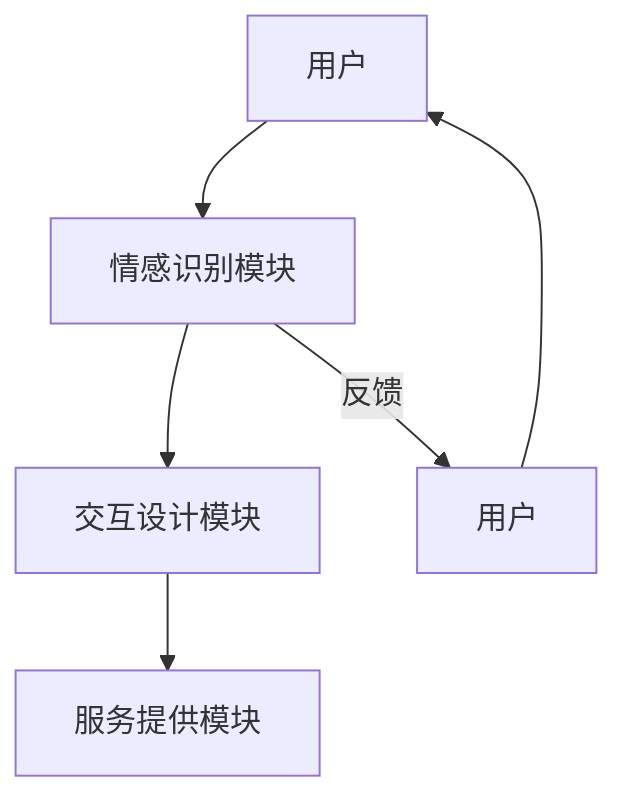
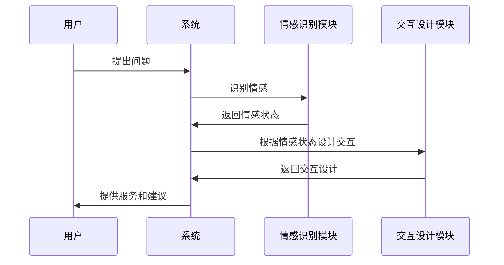

                 

**文章标题**: 在人机交互中保持人性本真

**关键词**: 人机交互、人性本真、情感计算、设计原则、案例分析、未来展望

**摘要**: 本文深入探讨了在人机交互中保持人性本真的重要性以及实现方法。通过对人机交互的挑战与机遇、核心概念解析、实践方法、案例分析以及未来展望的详细阐述，为读者提供了关于如何设计人性化的交互系统的全面指导。

---

**背景介绍**

在人机交互领域，随着技术的快速发展，人工智能和自动化系统的应用越来越广泛。然而，这些技术的发展也带来了诸多挑战，尤其是在保持人性本真方面。人性本真，是指人独有的情感、意识和价值观，是人性的核心。在人与机器的交互过程中，如何保持这种人性本真，成为了一个亟待解决的问题。

人机交互的挑战主要表现在以下几个方面：首先，人工智能系统在处理情感、意识等复杂问题时存在局限性；其次，用户对于人机交互的期望越来越高，希望系统能够更加贴近人类的思维和行为；最后，随着隐私和数据安全问题日益突出，如何在保障用户隐私的同时，实现人性化的交互体验，成为了一个重要课题。

本文将从以下几个方面展开讨论：

1. 人机交互的发展历程及其挑战。
2. 人性本真的概念与重要性。
3. 保持人性本真的核心概念与实践方法。
4. 案例分析：人性本真在不同领域的应用。
5. 未来展望：人性本真在人机交互中的发展趋势。

---

**核心概念与联系**

**人性本真的特征**：人性本真包括情感、意识、价值观等多个方面。情感是人性的核心，意识是思维的基础，价值观则是行为的指南。在人与机器的交互中，保持这些特征的完整性，是确保人性本真的关键。

**人机交互的基本原则**：人机交互应该遵循用户为中心、适应性、易用性等基本原则。用户为中心强调设计时以用户的需求和体验为核心；适应性则要求系统能够根据用户的行为和需求进行动态调整；易用性则是确保用户能够轻松使用系统。

**人机交互中的情感计算**：情感计算是研究如何使计算机识别、理解、处理和模拟人类情感的技术。通过情感计算，机器能够更好地理解用户的需求和情感状态，从而提供更加人性化的交互体验。

**核心概念属性特征对比表格**：

| 特征       | 说明                             |
|------------|----------------------------------|
| 情感       | 人类的情感丰富多样，包括喜怒哀乐 |
| 意识       | 人类具有自我意识和思考能力       |
| 价值观     | 人类的价值观影响行为选择         |
| 情感计算   | 计算机识别和理解人类情感         |

**ER实体关系图架构**：



---

**算法原理讲解**

在保持人性本真的过程中，算法的设计至关重要。以下是一个简单的算法流程图：



**算法原理**：

1. 输入用户行为：通过传感器或其他方式获取用户的行为数据。
2. 情感识别：使用情感计算技术分析用户行为，识别用户的情感状态。
3. 情感响应：根据识别到的情感状态，设计相应的交互响应，以保持人性本真。
4. 交互设计：根据用户需求和情感状态，动态调整交互方式，提高用户体验。

**数学模型**：

$$
\text{情感识别准确率} = \frac{\text{识别正确的情感数}}{\text{总情感识别数}}
$$

**举例说明**：

假设一个用户正在使用智能助手，如果用户表现出快乐的情感，系统会设计出愉快的交互响应，如播放轻松的音乐或提出恭喜的话语。如果用户表现出悲伤的情感，系统则会设计出同情和支持的交互响应，如提出安慰的话语或提供帮助。

---

**系统分析与架构设计方案**

**问题场景介绍**：

假设我们需要设计一个智能客服系统，该系统需要能够根据用户的情感状态提供个性化的服务。

**项目介绍**：

本项目旨在设计并实现一个基于情感计算的智能客服系统，通过分析用户的情感状态，提供针对性的服务和建议。

**系统功能设计**：

- 情感识别：分析用户的语言和行为，识别用户的情感状态。
- 交互设计：根据用户的情感状态，设计个性化的交互方式。
- 服务提供：根据用户的需求和情感状态，提供相应的服务和建议。

**系统架构设计**：



**系统接口设计**：

- 用户输入接口：接收用户的语言和行为数据。
- 情感识别接口：提供情感识别服务的接口。
- 交互设计接口：提供交互设计服务的接口。
- 服务提供接口：提供服务和建议的接口。

**系统交互**：



---

**项目实战**

**环境安装**：

1. 安装Python环境。
2. 安装情感计算相关的库，如TextBlob、NLTK等。

**系统核心实现源代码**：

```python
from textblob import TextBlob

def recognize_emotion(text):
    blob = TextBlob(text)
    sentiment = blob.sentiment
    if sentiment.polarity > 0:
        return "快乐"
    elif sentiment.polarity < 0:
        return "悲伤"
    else:
        return "中性"

def provide_service(emotion):
    if emotion == "快乐":
        return "您看起来很高兴，有什么我可以帮您的吗？"
    elif emotion == "悲伤":
        return "看起来您不太开心，需要我提供一些帮助吗？"
    else:
        return "您好，有什么我可以为您服务的吗？"

user_text = input("请输入您的问题：")
emotion = recognize_emotion(user_text)
print(provide_service(emotion))
```

**代码应用解读与分析**：

该代码首先通过TextBlob库对用户的输入文本进行情感分析，识别用户的情感状态。然后根据识别到的情感状态，提供相应的服务和建议。例如，如果用户表现出快乐的情感，系统会提出恭喜的话语；如果用户表现出悲伤的情感，系统会提供安慰和支持。

**实际案例分析和详细讲解剖析**：

假设有一个用户输入了“我今天在工作中遇到了很多困难，感到非常沮丧。”这条信息，系统会识别到用户的情感状态是“悲伤”，然后根据这个情感状态，系统会提供如下的回应：“看起来您不太开心，需要我提供一些帮助吗？”这样的交互设计，能够让用户感受到系统的关怀和理解，从而提高用户体验。

**项目小结**：

通过本项目，我们实现了基于情感计算的智能客服系统，该系统能够根据用户的情感状态提供个性化的服务和建议。这个项目不仅提高了用户体验，也为未来的人机交互系统提供了有益的探索。

---

**最佳实践 tips**

1. 在设计人机交互系统时，要充分考虑用户的情感需求，提供人性化的交互体验。
2. 使用情感计算技术，准确识别用户的情感状态，是提高系统人性化程度的关键。
3. 根据用户的情感状态，动态调整交互方式，以提供更好的用户体验。
4. 定期收集用户反馈，优化系统性能，持续提升用户体验。

**小结**

本文深入探讨了在人机交互中保持人性本真的重要性以及实现方法。通过分析人机交互的挑战与机遇、核心概念、实践方法、案例分析以及未来展望，为读者提供了关于如何设计人性化的交互系统的全面指导。保持人性本真，是未来人机交互系统发展的重要方向。

**注意事项**

1. 在使用情感计算技术时，要充分考虑用户的隐私和数据安全。
2. 人机交互系统的设计要遵循用户为中心的原则，确保系统能够满足用户的需求。
3. 定期进行用户调研，了解用户的反馈和需求，以持续优化系统性能。

**拓展阅读**

1. 《情感计算：人机交互的新篇章》
2. 《人机交互心理学》
3. 《智能客服系统设计与应用》

---

**作者信息**

作者：AI天才研究院/AI Genius Institute & 禅与计算机程序设计艺术 /Zen And The Art of Computer Programming

