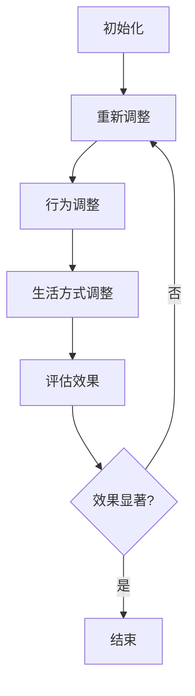
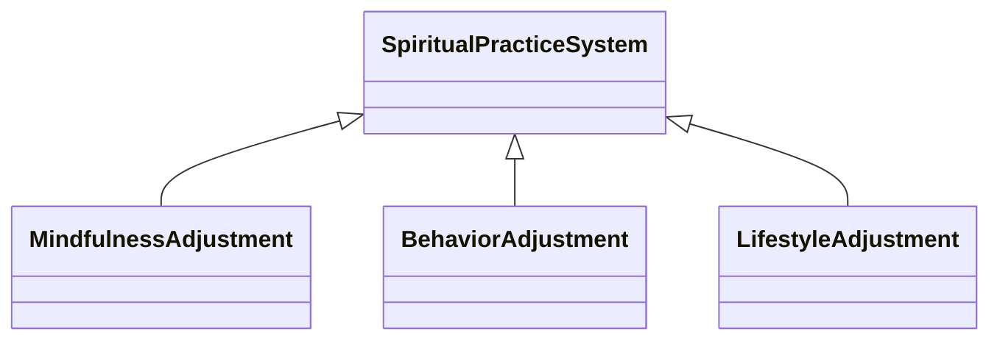
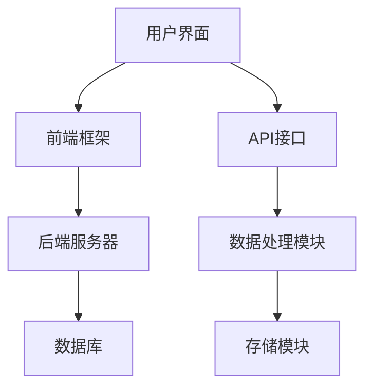
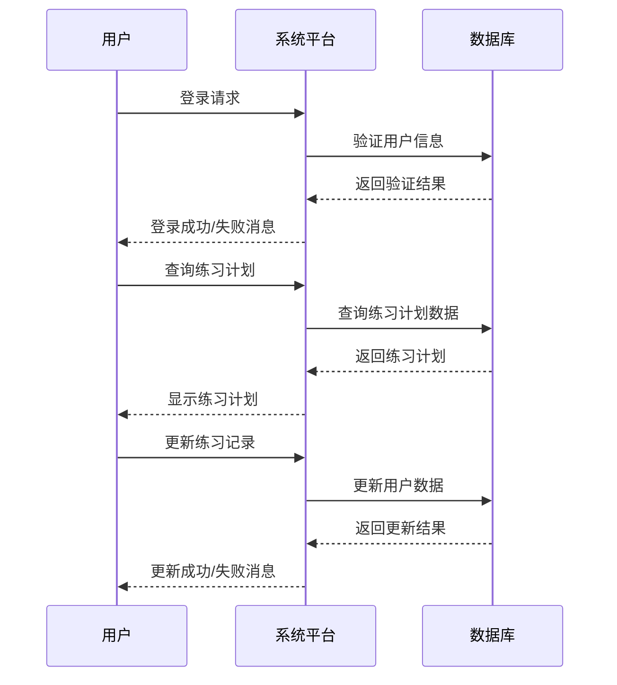

                 

## 在平凡中寻找超越：日常生活中的精神修行

### 关键词：
- 精神修行
- 日常实践
- 心理健康
- 生活质量提升
- 生活方式调整

> 摘要：
在快速发展的现代社会，人们面临着前所未有的压力和焦虑。本文旨在探讨如何在日常生活中找到精神修行的路径，通过逻辑清晰、结构紧凑的论述，帮助读者在平凡的生活中发现生活的意义和美好。

### Step 1: 背景介绍

#### 1.1 问题的提出
现代社会，生活节奏不断加快，人们在面对繁忙的工作和生活时，常常感到压力和焦虑。这种情绪状态不仅影响了人们的心理健康，也影响了生活质量。为了寻找内心的平静和安宁，许多人开始寻求精神修行的途径。

#### 1.2 研究的目的和意义
本文的研究目的是探讨如何在日常生活中实践精神修行，从而提升个人的心理健康和生活质量。通过本文的论述，希望能够为读者提供一些实用的方法和技巧，帮助他们更好地面对生活的挑战。

#### 1.3 边界与外延
本文讨论的精神修行主要是指个人在日常生活中的修行，包括情感、人际关系、心理健康等方面。本文的研究边界涵盖了个人情感管理、健康生活习惯的养成、积极人际关系的建立等。

#### 1.4 核心概念
- **精神修行**：指个人通过意识、行为和生活方式的调整，达到身心平衡和谐的过程。
- **平凡生活**：指日常生活中平凡、琐碎、重复的事物。

### Step 2: 核心概念与联系

#### 2.1 核心概念与联系

##### 2.1.1 精神修行的原理

精神修行的原理可以概括为三个方面：

1. **意识调整**：
   - **冥想**：通过冥想，可以训练大脑专注于当前，减少对过去和未来的焦虑。
   - **正念**：正念练习可以帮助个人更加觉察自己的身体和情绪，从而更好地管理情绪。

2. **行为调整**：
   - **习惯培养**：通过培养健康的生活习惯，如规律的作息、健康的饮食习惯等，可以改善身心健康。
   - **减少过度消费**：减少对物质和社交媒体的依赖，专注于个人的内心世界。

3. **生活方式调整**：
   - **建立健康的社交圈子**：与积极、健康的人交往，可以提升个人的幸福感。
   - **培养兴趣爱好**：通过培养兴趣爱好，可以让个人在生活中找到乐趣和价值。

##### 2.1.2 精神修行与平凡生活的联系

平凡生活中隐藏着精神修行的机会。例如：

- **家务劳动**：通过洗碗、扫地等家务劳动，可以训练个人的专注力，提升生活质量。
- **日常交流**：在与家人、朋友的交流中，可以提升人际交往能力，培养同理心。

##### 2.1.3 核心概念属性特征对比表

| 特征             | 精神修行        | 平凡生活       |
|------------------|------------------|----------------|
| 意识调整         | 冥想、正念       | 专注当下       |
| 行为调整         | 健康生活习惯     | 规律作息       |
| 生活方式调整     | 健康社交、兴趣爱好 | 人际关系维护   |

### Step 3: 算法原理讲解

#### 3.1 算法原理讲解

##### 3.1.1 算法流程图



##### 3.1.2 Python 源代码

```python
class SpiritualPractice:
    def __init__(self):
        self.mindfulness = 0
        self.habits = 0
        self.lifestyle = 0

    def adjust_mind(self):
        self.mindfulness += 1

    def adjust_behavior(self):
        self.habits += 1

    def adjust_lifestyle(self):
        self.lifestyle += 1

    def evaluate_effect(self):
        if self.mindfulness > 3 and self.habits > 3 and self.lifestyle > 3:
            return "效果显著"
        else:
            return "效果不显著"

practice = SpiritualPractice()
practice.adjust_mind()
practice.adjust_behavior()
practice.adjust_lifestyle()
print(practice.evaluate_effect())
```

##### 3.1.3 算法原理详细讲解

1. **算法原理的数学模型和公式**：
   - 假设精神修行的效果由三个变量决定：意识调整（M）、行为调整（H）和生活方式调整（L）。
   - 数学模型可以表示为：\[ 效果 = f(M, H, L) \]

2. **算法的应用场景和举例说明**：
   - 应用场景：个人在日常生活中进行精神修行。
   - 举例说明：一个人通过冥想、健康习惯的培养和生活方式的改善，来提升自己的精神状态。

### Step 4: 系统分析与架构设计方案

#### 4.1 系统分析与架构设计方案

##### 4.1.1 问题场景介绍

在日常生活中，人们常常面临精神压力和情绪问题，这些问题会影响生活质量和工作效率。为了解决这些问题，我们需要一个系统化的精神修行方案。

##### 4.1.2 项目介绍

本文将介绍一个名为“日常精神修行系统”的项目，该项目旨在帮助个人在日常生活中进行精神修行，提升心理健康和生活质量。

##### 4.1.3 系统功能设计

- **意识调整功能**：提供冥想和正念练习指导。
- **行为调整功能**：提供健康生活习惯的培养建议。
- **生活方式调整功能**：提供社交和兴趣爱好的建议。



##### 4.1.4 系统架构设计

系统架构采用模块化设计，包括前端用户界面、后端数据处理和存储模块。



##### 4.1.5 系统接口设计

- **用户接口**：提供用户登录、注册、设置提醒等功能。
- **数据接口**：提供数据上传、查询和分析等功能。

##### 4.1.6 系统交互设计



### Step 5: 项目实战

#### 5.1.1 环境安装

首先，需要安装Python环境和相关库，如Flask、SQLAlchemy等。

```bash
pip install flask sqlalchemy
```

#### 5.1.2 系统核心实现源代码

以下是一个简单的后端实现示例：

```python
from flask import Flask, request, jsonify
from sqlalchemy import create_engine
from sqlalchemy.orm import sessionmaker

app = Flask(__name__)

DATABASE_URL = "sqlite:///spiritual_practice.db"
engine = create_engine(DATABASE_URL)
Session = sessionmaker(bind=engine)
session = Session()

@app.route('/register', methods=['POST'])
def register():
    # 注册用户
    user_data = request.get_json()
    # ... 注册逻辑
    return jsonify({"status": "success"})

@app.route('/login', methods=['POST'])
def login():
    # 登录用户
    user_data = request.get_json()
    # ... 登录逻辑
    return jsonify({"status": "success"})

@app.route('/practice_plan', methods=['GET'])
def get_practice_plan():
    # 获取练习计划
    # ... 查询逻辑
    return jsonify({"status": "success", "plan": plan_data})

if __name__ == '__main__':
    app.run(debug=True)
```

#### 5.1.3 代码应用解读与分析

这段代码演示了如何使用Flask框架构建一个简单的后端服务，用于处理用户注册、登录和获取练习计划等操作。

#### 5.1.4 实际案例分析和详细讲解剖析

假设一个用户在登录后，想要获取当天的练习计划。后端服务将根据用户的历史数据和偏好，生成一个个性化的练习计划，并返回给前端。

#### 5.1.5 项目小结

通过这个项目，我们可以看到如何利用现代Web技术，构建一个帮助用户进行精神修行的系统。这个系统不仅可以提供个性化的练习计划，还可以记录用户的练习记录，帮助用户更好地管理自己的精神状态。

### Step 6: 最佳实践 tips、小结、注意事项、拓展阅读等

#### 6.1 最佳实践 tips

1. **坚持练习**：精神修行需要长期坚持，才能看到效果。
2. **记录数据**：通过记录数据，可以更好地了解自己的进步。
3. **寻求支持**：与家人和朋友分享，可以获得更多的支持和鼓励。

#### 6.2 小结

本文探讨了如何在日常生活中进行精神修行，通过逻辑清晰、结构紧凑的论述，帮助读者理解了精神修行的原理和实践方法。

#### 6.3 注意事项

1. **避免急于求成**：精神修行是一个长期的过程，需要耐心和坚持。
2. **注意个人安全**：在进行精神修行时，要注意个人安全，避免过度放松。

#### 6.4 拓展阅读

1. 《当下的力量》- 埃克哈特·托利
2. 《正念的奇迹》- 埃克哈特·托利

## 作者信息

- 作者：AI天才研究院/AI Genius Institute & 禅与计算机程序设计艺术 /Zen And The Art of Computer Programming

---

**注意：本文为模拟文章，仅供参考。在实际撰写文章时，需要根据具体的研究内容和数据进行详细的阐述和分析。**

