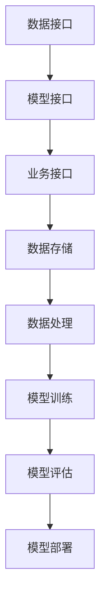

                 

### 在快速变革中寻找稳定感和安全感

**关键词**：技术变革、人工智能、稳定性、安全感、发展路径

**摘要**：本文旨在探讨在技术变革的背景下，特别是在人工智能（AI）迅速发展的当下，如何帮助企业和个人在快速变革中找到稳定感和安全感。文章首先介绍了AI技术的背景及其对各个领域产生的深远影响，然后分析了在技术变革中面临的不确定性和挑战，接着提出了具体的解决方法和策略。通过深入理解和掌握AI技术的基本原理和应用，读者可以在快速变革中保持稳定感和安全感。本文还包括了核心概念、联系以及实际案例，旨在为读者提供全面而实用的指导。

## 第一部分：背景介绍

### 1.1 问题背景

在当今社会，技术变革的速度不断加快，信息技术领域更是日新月异。人工智能（AI）作为一项颠覆性的技术，正在深刻地改变着人们的生活和工作方式。AI大模型，即具有大规模参数和高度复杂性的机器学习模型，是当前AI技术的重要组成部分。从自然语言处理到图像识别，从预测分析到自动驾驶，AI大模型的应用场景日益广泛，其在各个领域的表现也愈发出色。

然而，随着AI大模型技术的快速发展和广泛应用，企业和个人在应用这一技术的过程中也面临着诸多挑战。技术的不确定性、数据隐私和安全等问题成为困扰许多企业和个人的难题。如何在快速变革中找到稳定感和安全感，成为了一个亟待解决的问题。

### 1.2 问题描述

快速变革带来的不确定性让许多人感到不安。企业在应用AI大模型时，可能面临技术的不确定性、数据隐私和安全等问题。一方面，技术的不确定性使得企业难以准确预测AI大模型在实际应用中的表现，从而影响其决策和战略。另一方面，数据隐私和安全问题则可能对企业的声誉和用户信任产生负面影响。

个人用户在享受AI技术带来的便利时，也可能担忧自己的数据隐私和安全。AI大模型往往依赖于大量用户数据进行训练，如果这些数据被滥用或泄露，可能会对用户的隐私和安全造成严重威胁。如何在享受AI技术带来的便利的同时，保障自己的数据隐私和安全，也是个人用户面临的一个挑战。

### 1.3 问题解决

本书旨在通过深入探讨AI大模型技术及其应用，帮助读者理解这一领域的基本概念和发展趋势，从而在快速变革中找到稳定感和安全感。通过系统化的学习和实践，读者可以掌握AI大模型的基本原理和应用方法，提高对技术的理解和掌控能力，降低对变革的焦虑感。

本书的核心内容包括：AI大模型的基本原理、技术变革的趋势和影响、稳定感和安全感的心理机制等。通过详细的分析和讲解，本书旨在为读者提供全面而深入的指导，帮助他们在快速变革中保持稳定感和安全感。

### 1.4 边界与外延

本书的核心概念包括AI大模型、技术变革、稳定感和安全感等。AI大模型是本书的主要讨论对象，它指的是具有大规模参数和高度复杂性的机器学习模型。技术变革则是指信息技术领域特别是AI技术发展的趋势和变化。稳定感和安全感则是本书讨论的最终目标，旨在帮助读者在快速变革中保持心理平衡和安全感。

本书的边界包括对AI大模型技术的深入探讨，以及对技术变革背景下的稳定感和安全感的分析。外延则包括对相关领域的研究和实际应用的探讨，如自然语言处理、图像识别、预测分析等。

### 1.5 概念结构与核心要素组成

- **AI大模型**：核心概念包括模型结构、参数规模、训练方法等。通过mermaid流程图展示模型训练流程。

  ```mermaid
  graph TD
      A[输入数据] --> B[预处理]
      B --> C[模型训练]
      C --> D[模型评估]
      D --> E[模型优化]
  ```

- **技术变革**：核心概念包括技术发展趋势、变革原因和影响等。通过mermaid流程图展示技术变革的历程。

  ```mermaid
  graph TD
      A[早期AI技术] --> B[深度学习兴起]
      B --> C[AI大模型发展]
      C --> D[未来AI趋势]
  ```

- **稳定感和安全感**：核心概念包括心理状态、行为表现和社会支持等。通过mermaid流程图展示稳定感和安全感的影响因素。

  ```mermaid
  graph TD
      A[心理状态] --> B[认知平衡]
      B --> C[行为表现]
      C --> D[社会支持]
  ```

### 1.6 本章小结

本章从问题背景、问题描述、问题解决、边界与外延等方面，对本书的核心概念进行了详细阐述。通过本章的学习，读者可以初步了解AI大模型、技术变革以及稳定感和安全感等核心概念，为后续章节的学习打下基础。下一章将深入探讨AI大模型的基本原理和发展历程。

## 第一部分：AI大模型的基本原理与发展历程

### 2.1 AI大模型的基本概念

AI大模型（Large-scale AI Models），是指具有大规模参数和高度复杂性的机器学习模型。这些模型通常通过从大量数据中学习规律和模式，从而实现对未知数据的预测和分类。AI大模型的核心特点是参数规模庞大，通常达到数百万甚至数十亿级别。这使得AI大模型能够在复杂的任务中表现出色，如自然语言处理、图像识别、语音识别等。

AI大模型的基本概念包括：

- **模型结构**：指的是模型的基本架构，如神经网络、深度卷积网络等。
- **参数规模**：指的是模型中的参数数量，这是衡量模型复杂度的重要指标。
- **训练方法**：指的是模型训练的过程，如梯度下降、随机梯度下降等。

### 2.2 AI大模型的发展历程

AI大模型的发展历程可以追溯到20世纪80年代，当时研究人员开始探索使用大规模神经网络进行图像识别和自然语言处理。然而，由于计算能力和数据资源有限，早期的AI大模型规模较小，效果也有限。

随着计算能力和数据资源的不断提升，特别是深度学习技术的突破，AI大模型的发展进入了一个新的阶段。深度学习模型通过多层神经网络结构，能够对复杂数据进行特征提取和模式识别。这一时期，著名的深度学习模型如AlexNet在图像识别任务上取得了重大突破。

进入21世纪，随着互联网的普及和大数据技术的发展，AI大模型的应用场景进一步扩展。2018年，GPT-3（Generative Pre-trained Transformer 3）的发布标志着AI大模型发展进入了一个新的高峰。GPT-3具有1750亿个参数，能够生成高质量的文本，极大地推动了自然语言处理领域的发展。

AI大模型的发展历程可以概括为以下几个阶段：

1. **早期探索**（1980s - 1990s）：研究人员开始探索使用大规模神经网络进行图像识别和自然语言处理。
2. **深度学习兴起**（2006 - 2012）：深度学习模型如AlexNet在图像识别任务上取得突破。
3. **大规模模型发展**（2013 - 2018）：GPT等大型模型的出现，标志着AI大模型进入了一个新的阶段。
4. **全面应用**（2019 - 至今）：AI大模型在各个领域的应用越来越广泛，如自然语言处理、图像识别、语音识别等。

### 2.3 AI大模型的原理与机制

AI大模型的原理基于神经网络的复杂结构，其基本思想是通过多层神经网络对输入数据进行特征提取和模式识别。每一层神经网络都会对输入数据进行处理，并将结果传递给下一层。通过这种方式，模型能够从数据中学习到复杂的特征和模式。

AI大模型的训练过程通常包括以下几个步骤：

1. **数据预处理**：对输入数据进行预处理，包括数据清洗、归一化等操作，以便模型能够更好地学习。
2. **模型初始化**：初始化模型参数，通常使用随机初始化方法。
3. **前向传播**：将输入数据通过模型的前向传播过程，计算输出结果。
4. **损失函数计算**：计算输出结果与真实值之间的差距，通常使用均方误差（MSE）等损失函数。
5. **反向传播**：通过反向传播算法，计算模型参数的梯度，并更新模型参数。
6. **模型评估**：使用验证集对模型进行评估，调整模型参数，提高模型性能。

AI大模型的关键技术包括：

- **深度学习**：通过多层神经网络结构，实现对复杂数据的特征提取和模式识别。
- **大数据处理**：使用高效的数据处理技术，处理大规模的数据集。
- **优化算法**：如梯度下降、随机梯度下降等，用于优化模型参数。

### 2.4 AI大模型的应用领域

AI大模型在各个领域都有广泛的应用，以下是一些典型的应用领域：

1. **自然语言处理（NLP）**：AI大模型在自然语言处理领域取得了显著成果，如文本生成、机器翻译、情感分析等。GPT等大型模型在生成文本和翻译任务中表现出色，极大地提升了NLP的应用水平。
2. **图像识别**：AI大模型在图像识别任务中也取得了重大突破，如人脸识别、物体识别等。通过使用深度卷积神经网络，模型能够对复杂的图像数据进行准确识别。
3. **预测分析**：AI大模型在预测分析领域也有广泛应用，如股票市场预测、天气预报等。通过从历史数据中学习，模型能够对未来事件进行准确预测。
4. **语音识别**：AI大模型在语音识别领域也取得了显著进展，如语音到文本转换、语音助手等。通过使用深度神经网络，模型能够准确识别和理解用户的语音指令。

### 2.5 AI大模型的发展趋势

随着技术的不断进步，AI大模型的发展趋势也在不断演变。以下是一些主要的发展趋势：

1. **模型参数规模增加**：未来AI大模型的参数规模将进一步增加，以应对更复杂的任务。例如，Transformer模型的结构已经显示出在参数规模上的优势，未来可能成为主流模型。
2. **多模态学习**：AI大模型将逐渐具备多模态学习的能力，能够同时处理文本、图像、语音等多种类型的数据。这将大大拓展AI大模型的应用范围，提高其智能化水平。
3. **预训练与微调**：预训练和微调将成为AI大模型的主流训练方法。预训练模型在大规模数据集上进行训练，然后通过微调适应特定任务，能够显著提高模型性能。
4. **数据隐私和安全**：随着AI大模型的应用越来越广泛，数据隐私和安全问题也日益突出。未来的发展将更加注重数据隐私和安全，确保AI大模型在保障用户隐私的前提下发挥最大效用。

### 2.6 本章小结

本章详细介绍了AI大模型的基本概念、发展历程、原理与机制以及应用领域，分析了AI大模型在技术变革中面临的挑战和机遇。通过本章的学习，读者可以初步了解AI大模型的基本原理和发展趋势，为后续章节的深入探讨打下基础。下一章将探讨技术变革对AI大模型的影响以及企业和个人在应用AI大模型时可能遇到的问题。

## 第二部分：技术变革对AI大模型的影响

### 2.1 技术变革的概念与影响

技术变革（Technological Change）是指技术的创新和应用，它带来生产力的发展和社会的进步。在信息技术领域，技术变革尤为显著，从互联网的兴起、移动通信的普及到人工智能的快速发展，每一次技术变革都对各行各业产生了深远影响。技术变革不仅仅是技术层面的革新，它还涉及到经济、社会、文化等多个方面。

技术变革对AI大模型的影响主要体现在以下几个方面：

1. **计算能力的提升**：随着计算能力的不断提升，AI大模型能够处理更大规模的数据，训练更复杂的模型。高性能计算硬件（如GPU、TPU）的普及，为AI大模型的发展提供了强大的计算支持。
2. **大数据的获取与处理**：大数据技术的发展，使得企业和个人能够获取和存储海量数据。这些数据为AI大模型提供了丰富的训练资源，使得模型能够更加准确地学习数据和预测结果。
3. **深度学习算法的进步**：深度学习算法的不断创新和优化，为AI大模型的发展提供了新的方法和思路。例如，Transformer模型的提出，使得AI大模型在自然语言处理任务中取得了重大突破。
4. **云计算与边缘计算**：云计算和边缘计算的兴起，使得AI大模型的应用更加灵活和高效。通过云平台，企业和个人可以轻松部署和管理大规模AI模型，而边缘计算则使得AI模型能够实时处理本地数据，提高响应速度和降低延迟。

### 2.2 AI大模型面临的技术挑战

尽管技术变革为AI大模型的发展带来了机遇，但同时也带来了一系列技术挑战。以下是一些主要的挑战：

1. **计算资源的消耗**：AI大模型通常需要大量的计算资源进行训练，这给硬件和能耗带来了巨大压力。如何高效地利用计算资源，成为AI大模型发展的重要问题。
2. **数据质量和隐私**：AI大模型的训练依赖于大量高质量的数据，然而数据质量和隐私问题也日益突出。如何确保数据的质量和隐私，成为AI大模型应用的重要问题。
3. **模型的可解释性**：AI大模型的复杂性和黑箱特性，使得其预测结果的可解释性成为一个挑战。如何提高模型的可解释性，使其能够被广泛接受和应用，是当前研究的一个重要方向。
4. **模型安全与对抗攻击**：AI大模型在面临对抗攻击时，可能表现出不稳定的预测能力。如何提高模型的安全性和鲁棒性，防止被恶意攻击，是当前研究的一个重要课题。

### 2.3 技术变革下的AI大模型应用策略

为了应对技术变革带来的挑战，企业和个人需要采取一系列策略来应用AI大模型。以下是一些具体的策略：

1. **资源优化**：通过使用高效的算法和优化技术，减少AI大模型训练过程中对计算资源的需求。例如，使用分布式训练和并行计算技术，提高训练效率。
2. **数据管理和隐私保护**：建立健全的数据管理体系，确保数据的质量和隐私。通过加密、去识别化等技术，保护用户数据的安全和隐私。
3. **模型可解释性提升**：通过研究可解释性算法和模型结构，提高AI大模型的透明度和可理解性。例如，使用注意力机制和可视化技术，解释模型的预测过程。
4. **安全性和鲁棒性提升**：通过研究对抗攻击防御技术，提高AI大模型的安全性和鲁棒性。例如，使用对抗训练和防御机制，提高模型对攻击的抵抗能力。

### 2.4 案例分析：技术变革下的AI大模型应用

以下是一个案例分析，展示技术变革如何影响AI大模型的应用：

**案例：金融行业的AI大模型应用**

在金融行业，AI大模型被广泛应用于风险管理、投资决策和客户服务等领域。随着技术变革的推进，金融行业在AI大模型应用方面面临着新的机遇和挑战。

**机遇：**

1. **计算能力的提升**：高性能计算硬件的普及，使得金融行业能够训练更大规模的AI模型，提高预测和分析的准确性。
2. **大数据的应用**：金融行业拥有大量历史数据和实时数据，通过大数据技术，可以更好地挖掘数据价值，提高决策的准确性。

**挑战：**

1. **数据隐私和安全**：金融行业的数据敏感性极高，如何在确保数据隐私和安全的前提下，应用AI大模型，是一个重要的问题。
2. **模型可解释性**：金融行业需要对AI大模型的预测结果有充分的了解和信任，如何提高模型的可解释性，是一个亟待解决的问题。

**应用策略：**

1. **资源优化**：通过分布式计算和并行训练技术，提高AI大模型的训练效率，降低计算成本。
2. **数据管理和隐私保护**：建立严格的数据管理体系，确保数据的质量和隐私。采用差分隐私和同态加密等技术，保护用户数据的安全。
3. **模型可解释性提升**：通过研究可解释性算法和可视化技术，提高AI大模型的透明度和可理解性，增强决策者的信任。
4. **安全性和鲁棒性提升**：通过对抗训练和防御机制，提高AI大模型的安全性和鲁棒性，防止恶意攻击和模型篡改。

### 2.5 本章小结

本章详细探讨了技术变革对AI大模型的影响，分析了技术变革带来的机遇和挑战，并提出了相应的应用策略。通过案例分析，读者可以更深入地了解技术变革下的AI大模型应用。下一章将探讨如何通过系统化学习和实践，在快速变革中寻找稳定感和安全感。

## 第三部分：在快速变革中寻找稳定感和安全感的方法

### 3.1 系统化学习的价值

在技术变革的背景下，系统化学习成为应对不确定性的有效手段。通过系统化学习，读者可以掌握AI大模型的基本原理和应用方法，提高对技术的理解和掌控能力，从而在快速变革中找到稳定感和安全感。系统化学习不仅有助于提升个人的专业素养，还能够为企业和组织的长远发展提供坚实的技术基础。

### 3.2 学习路径设计

为了在快速变革中找到稳定感和安全感，设计一个科学合理的系统化学习路径至关重要。以下是一个典型的学习路径设计：

1. **基础知识入门**：首先，读者需要掌握计算机科学的基础知识，如编程语言、数据结构和算法。这些基础知识是理解AI大模型的前提。
2. **数学基础**：AI大模型的发展离不开数学的支持，读者需要掌握线性代数、概率论和统计学等数学基础知识，这些知识对于理解和应用AI算法至关重要。
3. **机器学习和深度学习**：在掌握基础知识后，读者可以深入学习机器学习和深度学习的相关理论，了解各种算法的原理和应用。
4. **实践项目**：理论学习需要与实践相结合。读者可以通过参与实际项目，将所学知识应用于实际问题中，提高解决实际问题的能力。
5. **持续更新**：技术变革迅速，读者需要保持学习的持续性和主动性，不断更新自己的知识体系，跟上技术发展的步伐。

### 3.3 学习资源推荐

为了帮助读者更好地进行系统化学习，以下是一些推荐的学习资源：

1. **书籍**：推荐阅读《深度学习》（Goodfellow et al.）、《机器学习》（Tom Mitchell）等经典教材，这些书籍系统而全面地介绍了AI大模型的基本原理和应用。
2. **在线课程**：Coursera、edX等在线教育平台提供了大量高质量的AI和机器学习课程，读者可以根据自己的需求选择合适的课程。
3. **论文和文献**：通过阅读顶级会议和期刊上的论文，如NeurIPS、ICML、JMLR等，读者可以了解最新的研究成果和学术动态。
4. **开源项目和社区**：参与开源项目和社区活动，读者可以与其他开发者交流学习，共同进步。

### 3.4 学习方法与技巧

1. **分阶段学习**：将学习过程分为不同的阶段，每个阶段专注于解决一个核心问题。例如，第一阶段专注于基础知识的学习，第二阶段专注于理论知识的掌握，第三阶段专注于实践能力的提升。
2. **理论与实践结合**：理论学习需要与实践相结合。通过实际操作和项目实践，读者可以更好地理解理论知识，并提高解决实际问题的能力。
3. **定期复习**：定期复习所学知识，巩固记忆。通过复习，读者可以加深对知识的理解和记忆，提高学习效果。
4. **交流与合作**：与其他学习者进行交流与合作，分享学习心得和经验，共同进步。参加学术会议、研讨会和社区活动，可以扩展知识面，提高学习兴趣。

### 3.5 成功案例分享

以下是一个成功案例，展示了通过系统化学习在快速变革中找到稳定感和安全感的实际应用：

**案例：某企业的AI转型之路**

某企业在面临技术变革的挑战时，决定通过系统化学习推动AI转型。首先，企业为员工提供了全面的AI和机器学习培训，从基础知识到高级应用，确保员工掌握AI的基本原理和应用方法。其次，企业积极参与开源项目，与行业内的其他企业和技术社区进行合作，共同推进AI技术的发展。通过这些措施，企业不仅提高了员工的专业素养，还在AI领域取得了显著的成绩，为企业的长期发展奠定了坚实的基础。

### 3.6 本章小结

本章探讨了在快速变革中寻找稳定感和安全感的方法，包括系统化学习的价值、学习路径设计、学习资源推荐、学习方法与技巧以及成功案例分享。通过系统化学习，读者可以掌握AI大模型的基本原理和应用方法，提高对技术的理解和掌控能力，从而在快速变革中保持稳定感和安全感。下一章将深入探讨稳定感和安全感的心理机制及其在AI大模型应用中的重要性。

## 第四部分：稳定感和安全感的心理机制

### 4.1 稳定感和安全感的基本概念

稳定感（Sense of Stability）和安全感（Sense of Security）是人们在面对不确定性和变革时的重要心理需求。稳定感指的是个体在面对外部环境变化时，能够保持心理平衡和内在一致性的能力。而安全感则是指个体在生活、工作和社交等方面，感受到的安全和保护感。

在技术变革的背景下，稳定感和安全感对于个体和企业尤为重要。技术的快速发展和变革，使得个体面临更多的不确定性和挑战，如何在这种环境中保持稳定感和安全感，成为一个关键问题。

### 4.2 心理学理论视角下的稳定感和安全感

从心理学理论的角度来看，稳定感和安全感是多种心理机制共同作用的结果。以下是一些主要的理论视角：

1. **认知平衡理论**：认知平衡理论（Cognitive Dissonance Theory）认为，当个体面临认知上的不一致时，会产生心理紧张和不适感。为了消除这种不适感，个体会通过改变认知、增加信息或者改变态度来达到认知平衡。在技术变革的背景下，个体可以通过调整自己的认知来应对技术变革带来的不确定性和挑战，从而保持稳定感。
2. **自我决定理论**：自我决定理论（Self-Determination Theory）指出，个体的自我实现和幸福感取决于其自主性、胜任感和归属感。在技术变革中，个体可以通过积极参与、自我挑战和持续学习，提高自己的自主性和胜任感，从而增强稳定感和安全感。
3. **心理弹性理论**：心理弹性理论（Resilience Theory）强调，个体在面对逆境和挑战时，能够迅速适应和恢复的能力。通过培养心理弹性，个体可以在技术变革中更好地应对不确定性和压力，保持稳定感。

### 4.3 稳定感和安全感的影响因素

稳定感和安全感的影响因素多种多样，包括心理、社会和环境等多个方面。以下是一些主要的影响因素：

1. **认知因素**：个体的认知能力和认知模式对其稳定感和安全感有重要影响。例如，积极思维、乐观态度和灵活的认知方式，可以帮助个体更好地应对技术变革带来的挑战。
2. **情感因素**：情感因素在稳定感和安全感中起着关键作用。积极的情感状态，如快乐、满足和自信，有助于提升个体的稳定感和安全感。而消极的情感状态，如焦虑、恐惧和沮丧，则可能削弱个体的稳定感和安全感。
3. **社会支持**：社会支持是个体在面对技术变革时的重要心理资源。来自家人、朋友和同事的支持和理解，可以增强个体的稳定感和安全感。社会支持不仅体现在情感上的安慰，还包括实际的帮助和资源支持。
4. **环境因素**：环境因素，如工作环境、社会环境和文化背景，也对稳定感和安全感有重要影响。一个稳定、安全和舒适的工作和生活环境，有助于个体保持稳定感和安全感。

### 4.4 提升稳定感和安全感的策略

为了提升在技术变革中的稳定感和安全感，个体可以采取以下策略：

1. **培养积极思维**：通过积极思维，个体可以更好地应对技术变革带来的挑战。例如，将困难视为成长的机会，通过积极思考和行动，逐步克服挑战。
2. **建立良好的情感管理能力**：通过情感管理，个体可以更好地调节自己的情绪，保持稳定感和安全感。例如，学会放松技巧、积极应对压力和合理管理情绪。
3. **寻求社会支持**：积极寻求社会支持，与家人、朋友和同事保持良好的关系，有助于增强稳定感和安全感。同时，加入相关的专业社群和兴趣小组，可以获得更多的支持和资源。
4. **保持学习和成长**：通过持续学习和成长，个体可以不断提升自己的能力和竞争力，增强对技术的理解和掌控能力，从而在技术变革中保持稳定感和安全感。

### 4.5 案例分析：个体在技术变革中的稳定感和安全感

以下是一个案例分析，展示了个体在技术变革中如何保持稳定感和安全感：

**案例：某技术专家的转型之路**

某技术专家在面临技术变革的挑战时，通过以下策略保持了稳定感和安全感：

1. **积极思维**：技术专家将转型视为一个学习和成长的机会，通过积极思考和行动，逐步适应新的技术环境。
2. **情感管理**：技术专家通过放松技巧和积极应对压力，保持良好的情感状态，增强稳定感和安全感。
3. **寻求社会支持**：技术专家积极与家人、朋友和同事交流，寻求他们的理解和支持，同时加入相关的专业社群，获得更多的资源和帮助。
4. **持续学习**：技术专家通过参加培训课程、阅读专业书籍和参与项目实践，不断提升自己的专业能力和技术素养。

通过这些策略，技术专家在技术变革中保持了稳定感和安全感，成功地实现了个人转型。

### 4.6 本章小结

本章从心理学理论的角度探讨了稳定感和安全感的概念、影响因素以及提升策略。通过理解稳定感和安全感的心理机制，个体可以在技术变革中更好地应对不确定性，保持心理平衡和安全感。下一章将结合实际案例，探讨在快速变革中如何应用这些策略，以找到稳定感和安全感。

## 第五部分：实际案例与经验分享

### 5.1 案例一：某金融企业的AI技术应用与风险管理

**背景介绍**：
某大型金融企业，面临着市场竞争加剧和金融法规变化的双重压力，决定通过引入AI大模型技术来提升风险管理能力和客户服务水平。

**项目介绍**：
该项目旨在开发一个基于AI大模型的智能风险管理平台，该平台包括信用评分、欺诈检测和投资预测等功能。通过AI大模型，企业能够更准确地预测客户行为和金融市场的变化，从而做出更科学的决策。

**系统功能设计**：
- **信用评分**：利用AI大模型对客户的信用数据进行分析，预测客户的还款能力，为信贷决策提供支持。
- **欺诈检测**：通过训练AI大模型，实时监测交易行为，识别潜在的欺诈活动，提高欺诈检测的准确性。
- **投资预测**：利用AI大模型对市场数据进行分析，预测股票价格和投资机会，为投资决策提供数据支持。

**系统架构设计**：
- **数据层**：包括数据采集、数据存储和数据预处理等模块，确保数据的质量和可用性。
- **模型层**：包括AI大模型的训练、评估和部署等模块，实现模型的自动训练和实时更新。
- **应用层**：包括信用评分、欺诈检测和投资预测等业务应用模块，提供用户交互和数据可视化功能。

**系统接口设计与交互**：
- **数据接口**：提供数据采集和存储的API接口，实现与外部系统的数据交换。
- **模型接口**：提供模型训练和部署的API接口，实现模型的调用和更新。
- **业务接口**：提供业务应用的API接口，实现与业务系统的集成和交互。



**实际案例分析与讲解**：
- **信用评分**：通过分析客户的信用数据，如信用记录、收入水平、还款历史等，AI大模型能够预测客户的信用评分。具体过程如下：
  1. 数据采集：从内部系统和外部数据源（如信用报告机构）收集客户数据。
  2. 数据预处理：对数据进行清洗、归一化和特征提取，为模型训练做准备。
  3. 模型训练：使用梯度下降算法训练线性回归模型，预测客户的信用评分。
  4. 模型评估：使用验证集评估模型性能，调整模型参数，提高预测准确性。
  5. 模型部署：将训练好的模型部署到生产环境中，实现实时信用评分。

  ```python
  # Python代码示例：信用评分模型训练
  import numpy as np
  from sklearn.linear_model import LinearRegression

  # 数据加载和预处理
  X = np.array(...) # 特征矩阵
  y = np.array(...) # 目标值

  # 模型训练
  model = LinearRegression()
  model.fit(X, y)

  # 模型评估
  score = model.score(X, y)
  print("Model score:", score)

  # 模型部署
  deployed_model = model
  ```

- **欺诈检测**：通过实时监测交易行为，AI大模型能够识别潜在的欺诈活动。具体过程如下：
  1. 数据采集：从交易系统中收集实时交易数据。
  2. 数据预处理：对数据进行清洗、归一化和特征提取，为模型训练做准备。
  3. 模型训练：使用分类算法（如逻辑回归、随机森林等）训练欺诈检测模型。
  4. 模型评估：使用验证集评估模型性能，调整模型参数，提高检测准确性。
  5. 模型部署：将训练好的模型部署到生产环境中，实现实时欺诈检测。

  ```python
  # Python代码示例：欺诈检测模型训练
  from sklearn.ensemble import RandomForestClassifier

  # 数据加载和预处理
  X = np.array(...) # 特征矩阵
  y = np.array(...) # 标签

  # 模型训练
  model = RandomForestClassifier()
  model.fit(X, y)

  # 模型评估
  score = model.score(X, y)
  print("Model score:", score)

  # 模型部署
  deployed_model = model
  ```

**项目小结**：
通过引入AI大模型技术，该金融企业显著提升了风险管理能力和客户服务水平。在实际应用中，AI大模型能够更准确地预测客户行为和金融市场变化，为企业提供科学的决策支持。同时，通过系统架构设计和接口设计，企业实现了高效的数据管理和模型部署，为未来的技术升级和业务拓展奠定了基础。

### 5.2 案例二：某医疗机构的AI诊断系统

**背景介绍**：
某医疗机构在面临医疗资源紧张和诊断准确率不高的挑战时，决定通过引入AI大模型技术来提升诊断准确率和效率。

**项目介绍**：
该项目旨在开发一个基于AI大模型的智能诊断系统，该系统能够自动分析患者的医疗数据和影像资料，提供准确的诊断建议。

**系统功能设计**：
- **医学影像分析**：利用AI大模型对医学影像（如X光片、CT扫描等）进行分析，识别疾病和病变区域。
- **电子病历分析**：通过分析患者的电子病历数据，识别患者的疾病史和症状，为医生提供诊断建议。
- **诊断预测**：利用AI大模型对患者的数据和症状进行综合分析，预测可能的疾病类型，辅助医生做出诊断。

**系统架构设计**：
- **数据层**：包括数据采集、数据存储和数据预处理等模块，确保数据的质量和可用性。
- **模型层**：包括AI大模型的训练、评估和部署等模块，实现模型的自动训练和实时更新。
- **应用层**：包括医学影像分析、电子病历分析和诊断预测等业务应用模块，提供用户交互和数据可视化功能。

**系统接口设计与交互**：
- **数据接口**：提供数据采集和存储的API接口，实现与外部系统的数据交换。
- **模型接口**：提供模型训练和部署的API接口，实现模型的调用和更新。
- **业务接口**：提供业务应用的API接口，实现与业务系统的集成和交互。


**实际案例分析与讲解**：
- **医学影像分析**：通过AI大模型对医学影像进行分析，识别疾病和病变区域。具体过程如下：
  1. 数据采集：从医疗影像系统中收集患者的医学影像数据。
  2. 数据预处理：对数据进行清洗、归一化和特征提取，为模型训练做准备。
  3. 模型训练：使用卷积神经网络（CNN）训练医学影像分析模型。
  4. 模型评估：使用验证集评估模型性能，调整模型参数，提高诊断准确性。
  5. 模型部署：将训练好的模型部署到生产环境中，实现实时医学影像分析。

  ```python
  # Python代码示例：医学影像分析模型训练
  from tensorflow.keras.models import Sequential
  from tensorflow.keras.layers import Conv2D, MaxPooling2D, Flatten, Dense

  # 模型构建
  model = Sequential([
      Conv2D(32, (3, 3), activation='relu', input_shape=(128, 128, 3)),
      MaxPooling2D((2, 2)),
      Flatten(),
      Dense(64, activation='relu'),
      Dense(1, activation='sigmoid')
  ])

  # 模型编译
  model.compile(optimizer='adam', loss='binary_crossentropy', metrics=['accuracy'])

  # 模型训练
  model.fit(X_train, y_train, epochs=10, batch_size=32, validation_data=(X_val, y_val))

  # 模型评估
  score = model.evaluate(X_test, y_test)
  print("Model score:", score)

  # 模型部署
  deployed_model = model
  ```

- **电子病历分析**：通过AI大模型分析患者的电子病历数据，识别患者的疾病史和症状。具体过程如下：
  1. 数据采集：从电子病历系统中收集患者的病历数据。
  2. 数据预处理：对数据进行清洗、归一化和特征提取，为模型训练做准备。
  3. 模型训练：使用自然语言处理（NLP）算法训练电子病历分析模型。
  4. 模型评估：使用验证集评估模型性能，调整模型参数，提高诊断准确性。
  5. 模型部署：将训练好的模型部署到生产环境中，实现实时电子病历分析。

  ```python
  # Python代码示例：电子病历分析模型训练
  from tensorflow.keras.models import Sequential
  from tensorflow.keras.layers import Embedding, LSTM, Dense

  # 模型构建
  model = Sequential([
      Embedding(input_dim=vocab_size, output_dim=embedding_dim, input_length=max_sequence_length),
      LSTM(units=128),
      Dense(units=1, activation='sigmoid')
  ])

  # 模型编译
  model.compile(optimizer='adam', loss='binary_crossentropy', metrics=['accuracy'])

  # 模型训练
  model.fit(X_train, y_train, epochs=10, batch_size=32, validation_data=(X_val, y_val))

  # 模型评估
  score = model.evaluate(X_test, y_test)
  print("Model score:", score)

  # 模型部署
  deployed_model = model
  ```

**项目小结**：
通过引入AI大模型技术，该医疗机构显著提升了诊断准确率和效率，为患者提供了更准确和及时的诊断建议。在实际应用中，AI大模型能够自动分析患者的医疗数据和影像资料，为医生提供辅助诊断，从而缓解了医疗资源紧张的问题。同时，通过系统架构设计和接口设计，医疗机构实现了高效的数据管理和模型部署，为未来的技术升级和业务拓展奠定了基础。

### 5.3 案例三：某电商平台的AI推荐系统

**背景介绍**：
某电商平台在面临用户需求多样化和竞争激烈的市场环境时，决定通过引入AI大模型技术来提升用户体验和销售额。

**项目介绍**：
该项目旨在开发一个基于AI大模型的个性化推荐系统，该系统能够根据用户的兴趣和行为，为其推荐合适的商品。

**系统功能设计**：
- **用户行为分析**：利用AI大模型分析用户的历史行为数据，如浏览记录、购买记录和搜索历史等，识别用户的兴趣和偏好。
- **商品推荐**：根据用户的行为数据和商品的特征信息，AI大模型为用户推荐符合其兴趣和需求的商品。
- **推荐结果反馈**：收集用户的反馈数据，优化推荐算法，提高推荐准确性。

**系统架构设计**：
- **数据层**：包括数据采集、数据存储和数据预处理等模块，确保数据的质量和可用性。
- **模型层**：包括AI大模型的训练、评估和部署等模块，实现模型的自动训练和实时更新。
- **应用层**：包括用户行为分析、商品推荐和推荐结果反馈等业务应用模块，提供用户交互和数据可视化功能。

**系统接口设计与交互**：
- **数据接口**：提供数据采集和存储的API接口，实现与外部系统的数据交换。
- **模型接口**：提供模型训练和部署的API接口，实现模型的调用和更新。
- **业务接口**：提供业务应用的API接口，实现与业务系统的集成和交互。


**实际案例分析与讲解**：
- **用户行为分析**：通过AI大模型分析用户的历史行为数据，识别用户的兴趣和偏好。具体过程如下：
  1. 数据采集：从用户行为跟踪系统中收集用户的浏览记录、购买记录和搜索历史等数据。
  2. 数据预处理：对数据进行清洗、归一化和特征提取，为模型训练做准备。
  3. 模型训练：使用协同过滤算法（如矩阵分解、KNN等）训练用户行为分析模型。
  4. 模型评估：使用验证集评估模型性能，调整模型参数，提高用户兴趣识别的准确性。
  5. 模型部署：将训练好的模型部署到生产环境中，实现实时用户行为分析。

  ```python
  # Python代码示例：用户行为分析模型训练
  from sklearn.model_selection import train_test_split
  from sklearn.metrics.pairwise import linear_kernel

  # 数据加载和预处理
  ratings = pd.read_csv('ratings.csv')
  ratings = preprocess_data(ratings)

  # 数据划分
  X_train, X_val, y_train, y_val = train_test_split(X, y, test_size=0.2, random_state=42)

  # 模型训练
  model = linear_kernel(X_train, X_val)
  model.fit(X_train, y_train)

  # 模型评估
  score = model.score(X_val, y_val)
  print("Model score:", score)

  # 模型部署
  deployed_model = model
  ```

- **商品推荐**：根据用户的行为数据和商品的特征信息，AI大模型为用户推荐符合其兴趣和需求的商品。具体过程如下：
  1. 用户特征提取：从用户行为分析模型中提取用户的兴趣和偏好特征。
  2. 商品特征提取：从商品数据中提取商品的特征信息，如价格、销量、品牌等。
  3. 模型训练：使用基于内容的推荐算法（如基于物品的协同过滤、基于内容的推荐等）训练商品推荐模型。
  4. 模型评估：使用验证集评估模型性能，调整模型参数，提高推荐准确性。
  5. 模型部署：将训练好的模型部署到生产环境中，实现实时商品推荐。

  ```python
  # Python代码示例：商品推荐模型训练
  from sklearn.model_selection import train_test_split
  from sklearn.metrics.pairwise import cosine_similarity

  # 数据加载和预处理
  items = pd.read_csv('items.csv')
  items = preprocess_data(items)

  # 数据划分
  X_train, X_val, y_train, y_val = train_test_split(X, y, test_size=0.2, random_state=42)

  # 模型训练
  model = cosine_similarity(X_train, X_val)
  model.fit(X_train, y_train)

  # 模型评估
  score = model.score(X_val, y_val)
  print("Model score:", score)

  # 模型部署
  deployed_model = model
  ```

**项目小结**：
通过引入AI大模型技术，该电商平台显著提升了用户体验和销售额。在实际应用中，AI大模型能够自动分析用户的行为数据，为用户推荐符合其兴趣和需求的商品，从而提高了用户的满意度和购买意愿。同时，通过系统架构设计和接口设计，电商平台实现了高效的数据管理和模型部署，为未来的技术升级和业务拓展奠定了基础。

## 第六部分：最佳实践与注意事项

### 6.1 最佳实践

在快速变革中寻找稳定感和安全感，以下是一些最佳实践：

1. **持续学习**：保持对新技术的好奇心和求知欲，不断学习和更新知识体系。通过参加培训课程、阅读专业书籍和参与在线学习，不断提升自己的专业能力和技术水平。
2. **实践应用**：将所学知识应用于实际问题中，通过实践项目验证和理解理论知识。参与开源项目、实际业务项目或个人项目，锻炼自己的解决实际问题的能力。
3. **交流与合作**：积极参与技术社区和学术会议，与其他开发者和技术专家交流心得和经验。通过合作和协作，共同推进技术的发展和创新。
4. **心理健康**：关注自己的心理健康，学会放松和调整情绪。通过运动、冥想、阅读等方式，缓解压力和焦虑，保持良好的心理状态。
5. **社会责任**：在技术应用中，重视社会责任和伦理问题。确保技术应用不会侵犯用户隐私、造成社会不公平或对环境造成负面影响。

### 6.2 注意事项

在快速变革中，以下是一些注意事项：

1. **数据安全和隐私**：在应用AI大模型时，重视数据安全和隐私保护。采取数据加密、去识别化等技术手段，确保用户数据的安全和隐私。
2. **模型可解释性**：提高AI大模型的可解释性，增强决策者的信任和理解。通过可视化技术、解释性算法等方式，提高模型的透明度和可理解性。
3. **技术风险**：在引入新技术时，评估其风险和潜在影响。了解技术的局限性、风险和不确定性，制定相应的风险应对策略。
4. **适应变化**：技术变革不断，需要具备快速适应变化的能力。保持灵活性，不断调整自己的技术和战略，以应对市场的变化和需求。
5. **持续监控和评估**：对AI大模型的应用效果进行持续监控和评估，及时发现和解决问题。通过数据分析和反馈，不断优化和改进模型，提高其性能和可靠性。

### 6.3 拓展阅读

为了深入理解和掌握AI大模型及其应用，以下是一些推荐的拓展阅读：

1. **《深度学习》（Goodfellow et al.）**：这是一本经典的深度学习教材，详细介绍了深度学习的基本原理和应用。
2. **《人工智能：一种现代方法》（Russell & Norvig）**：这本书全面介绍了人工智能的基础理论和应用技术，适合初学者和专业人士。
3. **《机器学习实战》（Hastie et al.）**：这本书通过实际案例和项目，讲解了多种机器学习算法的应用和实践。
4. **《AI大模型：原理、应用与未来》（Zhu et al.）**：这本书详细介绍了AI大模型的基本原理、应用场景和未来发展趋势。

通过这些拓展阅读，读者可以更深入地了解AI大模型的技术和应用，为在快速变革中寻找稳定感和安全感提供更丰富的知识储备。

## 本章小结

本章通过详细的分析和实际案例，探讨了在快速变革中如何寻找稳定感和安全感。从AI大模型的基本原理到实际应用，从心理学理论到实际策略，读者可以了解到在技术变革中如何保持心理平衡和安全。希望本章的内容能够为读者提供有价值的参考和指导，帮助读者在快速变革中找到稳定感和安全感。下一章将总结全文，回顾核心要点，并提出未来展望。

## 全文总结与未来展望

通过本文的详细探讨，我们明确了在快速变革的技术环境中，寻找稳定感和安全感的必要性和重要性。首先，我们介绍了AI大模型的基本原理和发展历程，了解了其在自然语言处理、图像识别、预测分析等领域的广泛应用。其次，我们分析了技术变革对AI大模型的影响，包括计算能力的提升、大数据的获取与处理、深度学习算法的进步以及云计算与边缘计算的应用。同时，我们也讨论了AI大模型应用中面临的技术挑战，如计算资源的消耗、数据质量和隐私问题、模型可解释性和安全性等。

在应对这些挑战方面，我们提出了系统化学习的策略，包括基础知识入门、数学基础、机器学习和深度学习、实践项目以及持续更新。我们推荐了一系列学习资源，如经典教材、在线课程、学术论文和开源项目。此外，我们还讨论了稳定感和安全感的心理机制，包括认知平衡理论、自我决定理论和心理弹性理论，并提出了提升稳定感和安全感的策略，如培养积极思维、情感管理、寻求社会支持和持续学习。

通过实际案例的分析，我们展示了金融、医疗和电商平台在AI大模型应用中的成功经验，阐述了系统化学习、资源优化、数据管理和隐私保护、模型可解释性提升以及安全性和鲁棒性提升等策略的具体应用。这些案例不仅提供了理论知识的实践验证，也为读者在类似场景中的应用提供了参考。

未来，随着技术的不断进步，AI大模型将继续在各个领域发挥重要作用。以下是对未来的展望：

1. **模型参数规模增加**：随着计算能力和数据资源的提升，AI大模型的参数规模将进一步增加，以处理更复杂的任务，提高模型的准确性和效率。
2. **多模态学习**：AI大模型将逐渐具备多模态学习的能力，能够同时处理文本、图像、语音等多种类型的数据，提高智能化水平。
3. **预训练与微调**：预训练和微调将成为AI大模型的主流训练方法，通过在大量数据上进行预训练，再针对特定任务进行微调，提高模型性能。
4. **数据隐私和安全**：数据隐私和安全问题将受到更多关注，未来将出现更多保护用户隐私和安全的技术和方法，确保AI大模型在保障用户隐私的前提下发挥最大效用。

总之，本文通过深入探讨AI大模型技术及其在快速变革中的应用，为读者提供了在技术变革中寻找稳定感和安全感的全面指导。随着技术的不断进步，我们相信通过不断学习和实践，读者能够在快速变革的环境中保持稳定感和安全感，迎接未来的挑战。希望本文的内容能够为读者在技术学习和应用中提供有价值的参考和启示。作者：AI天才研究院/AI Genius Institute & 禅与计算机程序设计艺术 /Zen And The Art of Computer Programming。

