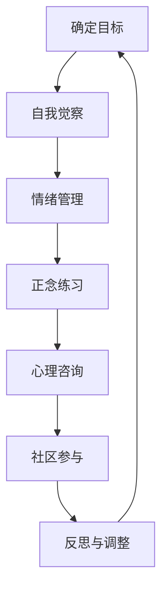
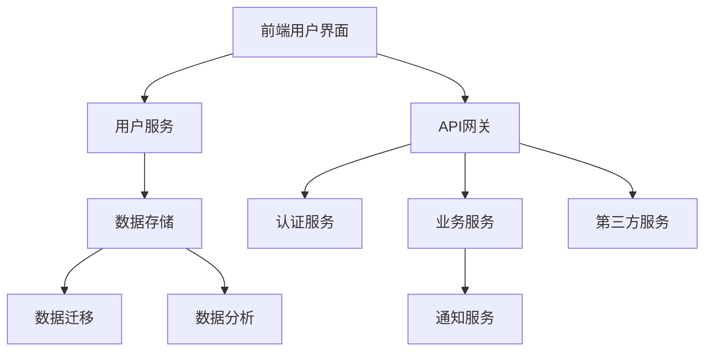
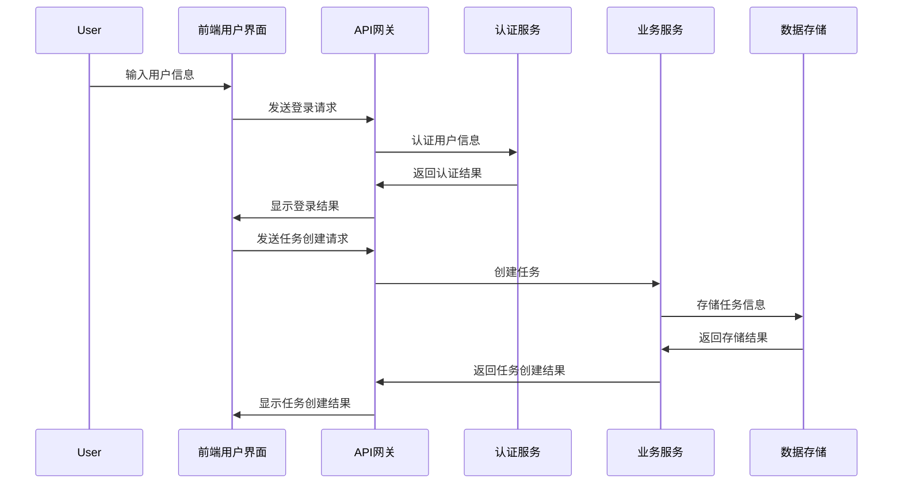

                 

**Step 1: 引言**

在现代社会中，人们的生活节奏日益加快，社会竞争压力不断增大，个体面临的心理和精神挑战也越来越严峻。许多人在追求物质财富和社会地位的同时，却逐渐感受到内心的空虚和孤独。这种现象不仅仅存在于个人层面，也在社会、文化、教育等多个层面上有所体现。精神耕耘，作为一种培养内心力量、寻找生活意义的方式，正逐渐受到关注。

本文将围绕“精神耕耘”这一核心概念，探讨其在现代人生活中的重要性。我们首先需要明确精神耕耘的定义，分析其与心理健康、社会关系、个人成长等方面的联系。在此基础上，我们将详细讲解精神耕耘的方法与实践，探讨其在不同领域的应用。最后，我们将总结精神耕耘的重要性，并提出一些建议，帮助读者在意义的荒原上播种希望。

### **背景介绍**

**现代社会中人们的精神困境与心灵空虚现象**

现代社会中，人们的精神困境与心灵空虚现象越来越普遍。一方面，随着科技的迅猛发展和互联网的普及，人们的生活变得越来越便利，但与此同时，人与人之间的距离却越来越遥远。社交媒体虽然让人们看似联系紧密，但实际上却加深了彼此之间的隔阂和孤独感。人们沉浸在虚拟世界中，与现实世界的互动减少，导致内心愈发空虚。

另一方面，现代社会的竞争压力巨大，许多人为了追求事业成功和社会地位，不得不放弃个人的兴趣爱好和时间。工作繁忙、生活压力大，导致人们的身心疲惫，缺乏足够的休息和放松。这种长期的压力积累，容易导致心理健康问题，如焦虑、抑郁等。

此外，人际关系问题也是现代社会中人们精神困境的一个重要方面。在家庭、职场、社交等多个场景中，人们面临着复杂的社交关系和人际冲突。许多人因为无法妥善处理人际关系，导致内心的痛苦和困惑。

**问题描述**

人们在面对生活压力、社会竞争、人际关系等方面所面临的挑战多种多样。具体来说，可以归纳为以下几个方面：

1. **压力管理**：现代社会的竞争压力巨大，许多人面临着工作压力、经济压力、家庭压力等多重挑战。如何有效地管理压力，成为许多人需要面对的问题。

2. **心理健康**：长期的压力积累容易导致心理健康问题。焦虑、抑郁、失眠等成为现代人的常见症状，如何保持心理健康，提高生活质量，成为亟待解决的问题。

3. **人际关系**：在家庭、职场、社交等多个场景中，人们面临着复杂的人际关系。如何建立良好的人际关系，处理人际冲突，提高人际沟通能力，成为许多人需要面对的问题。

4. **自我认知**：在追求物质成功和社会地位的过程中，许多人迷失了自我，不清楚自己的真正需求和目标。如何进行自我认知，找到自己的价值观和人生目标，成为许多人需要思考的问题。

5. **生活意义**：在现代社会中，许多人感到生活缺乏意义和目标。如何寻找生活的意义，找到自己的使命感，成为许多人需要关注的问题。

**问题解决**

面对现代社会中人们的精神困境和心灵空虚现象，精神耕耘提供了一种有效的方法和途径。通过精神耕耘，人们可以培养内心力量，提高自我认知，寻找生活的意义。具体来说，精神耕耘可以从以下几个方面入手：

1. **自我觉察**：通过自我觉察，人们可以了解自己的情绪、需求和内心感受，从而更好地应对生活中的挑战。

2. **情绪管理**：情绪管理是保持心理健康的重要一环。通过学习情绪管理技巧，人们可以更好地调节情绪，减少负面情绪的影响。

3. **正念练习**：正念练习可以帮助人们专注于当下，减少焦虑和压力。通过正念练习，人们可以更好地认识自己的内心世界，提高生活质量。

4. **心理咨询**：心理咨询是解决心理问题的重要途径。通过心理咨询，人们可以得到专业的帮助，更好地处理内心的困扰。

5. **社区参与**：通过参与社区活动，人们可以建立良好的人际关系，增强社交支持，提高生活质量。

**边界与外延**

精神耕耘不仅仅是个体层面的问题，还涉及到社会、文化、教育等多层面。具体来说，可以从以下几个方面进行探讨：

1. **社会层面**：社会精神状态对个体精神健康有着重要影响。一个充满关怀和互助精神的社会环境，可以提升人们的幸福感，减少精神困境的发生。

2. **文化层面**：不同文化背景下，人们对精神健康问题的认知和处理方式有所不同。通过了解不同文化中的精神健康观念，可以更好地推动精神健康的普及和发展。

3. **教育层面**：教育是培养个体精神健康的重要途径。通过在学校中开展心理健康教育，可以提高学生的心理素质，促进其全面发展。

4. **社区层面**：社区是人们生活的重要场所，社区的精神文化建设对个体的精神健康有着重要影响。通过加强社区精神文化建设，可以提升居民的精神生活质量。

**概念结构与核心要素组成**

精神耕耘涉及多个核心概念和要素，包括：

1. **精神耕耘**：精神耕耘是一种培养内心力量、寻找生活意义的方式，涵盖自我觉察、情绪管理、正念练习、心理咨询、社区参与等多个方面。

2. **内心力量**：内心力量是指个体在精神困境中保持积极、适应和应对的能力。内心力量的培养有助于提升个体的心理素质，增强抗压能力。

3. **生活意义**：生活意义是指个体在生活中所追求的目标和价值。寻找生活的意义有助于个体建立明确的人生目标，提高生活质量。

4. **自我认知**：自我认知是指个体对自身特点、需求和价值的认识。自我认知的提升有助于个体更好地理解自己，提高自我认同感。

5. **社会关系**：社会关系是指个体与周围人之间的互动和联系。良好的人际关系有助于个体获得社交支持，提升心理健康水平。

**Step 2: 核心概念与联系**

**核心概念原理**

在精神耕耘的过程中，多个核心概念相互作用，共同构成了一个完整的理论体系。以下是这些核心概念的基本原理：

1. **精神耕耘**：精神耕耘是一种通过自我觉察、情绪管理、正念练习、心理咨询和社区参与等方式，培养内心力量、寻找生活意义的过程。其核心在于个体的自我提升和内心的成长。

2. **内心力量**：内心力量是指个体在面对生活挑战时，保持积极、适应和应对的能力。内心力量的培养有助于个体在困境中保持乐观，增强抗压能力。

3. **生活意义**：生活意义是指个体在生活中所追求的目标和价值。寻找生活的意义有助于个体建立明确的人生目标，提高生活质量。

4. **自我认知**：自我认知是指个体对自身特点、需求和价值的认识。自我认知的提升有助于个体更好地理解自己，提高自我认同感。

5. **社会关系**：社会关系是指个体与周围人之间的互动和联系。良好的人际关系有助于个体获得社交支持，提升心理健康水平。

**概念属性特征对比表格**

以下是这些核心概念的属性特征对比表格，帮助读者更好地理解它们之间的区别和联系：

| 核心概念 | 定义 | 属性特征 | 联系 |
| :--: | :--: | :--: | :--: |
| 精神耕耘 | 培养内心力量、寻找生活意义的过程 | 包括自我觉察、情绪管理、正念练习、心理咨询和社区参与等方面 | 精神耕耘涉及多个核心概念，共同构成一个完整的理论体系 |
| 内心力量 | 面对生活挑战时保持积极、适应和应对的能力 | 增强抗压能力、保持乐观心态 | 精神耕耘的目的是培养内心力量，提升个体的心理素质 |
| 生活意义 | 个体在生活中所追求的目标和价值 | 明确人生目标、提高生活质量 | 寻找生活的意义是精神耕耘的核心目标之一 |
| 自我认知 | 个体对自身特点、需求和价值的认识 | 提高自我认同感、更好地理解自己 | 自我认知的提升有助于个体在精神耕耘过程中更好地认识自己 |
| 社会关系 | 个体与周围人之间的互动和联系 | 获得社交支持、提升心理健康水平 | 良好的人际关系有助于个体在精神耕耘过程中获得支持和帮助 |

**ER实体关系图架构**

为了更直观地展示这些核心概念之间的联系，我们可以使用Mermaid流程图绘制ER实体关系图。以下是ER实体关系图的Markdown格式：

```mermaid
erDiagram
  A[内心力量] ||--|{ 精神耕耘 }
  B[生活意义] ||--|{ 精神耕耘 }
  C[自我认知] ||--|{ 精神耕耘 }
  D[社会关系] ||--|{ 精神耕耘 }
  A..> B
  A..> C
  A..> D
```

在ER实体关系图中，我们可以看到精神耕耘是核心概念，它与内心力量、生活意义、自我认知和社会关系之间存在着紧密的联系。这些核心概念共同构成了精神耕耘的理论体系，为个体在现代社会中应对精神困境提供了有力的支持和指导。

**Step 3: 算法原理讲解**

为了更好地理解精神耕耘的过程，我们可以将其视为一种算法，通过一系列步骤来培养内心力量、寻找生活意义。以下是这个算法的Mermaid流程图：



在这个算法中，每个步骤都有其特定的作用和意义：

1. **确定目标**：明确自己在精神耕耘过程中想要实现的目标，这有助于保持动力和方向。

2. **自我觉察**：通过观察自己的情绪、行为和思维，了解自己的内心状态，为后续步骤提供基础。

3. **情绪管理**：学习如何识别和调节自己的情绪，减少负面情绪的影响，提高生活质量。

4. **正念练习**：通过专注于当下，培养内心的宁静和觉察力，提高自我认知。

5. **心理咨询**：寻求专业的帮助，解决内心的困扰和问题，提升心理健康水平。

6. **社区参与**：通过参与社区活动，建立良好的人际关系，获得社交支持。

7. **反思与调整**：定期反思自己的精神耕耘过程，根据实际情况进行调整，以实现最佳效果。

下面，我们将使用Python源代码详细阐述这个算法的原理。首先，我们需要定义一个`SpiritGrowthAlgorithm`类，包含上述七个步骤的方法：

```python
class SpiritGrowthAlgorithm:
    def __init__(self):
        self.target = None
        self.mindfulness practiced = False
        self.counseling received = False
        self.community involvement = False

    def set_target(self, target):
        self.target = target
        print(f"目标设定：{target}")

    def self_awareness(self):
        print("自我觉察：开始观察自己的情绪、行为和思维。")
        # 实现具体的自我觉察方法

    def emotion_management(self):
        print("情绪管理：学习如何识别和调节自己的情绪。")
        # 实现具体的情绪管理方法

    def mindfulness_practice(self):
        print("正念练习：专注于当下，培养内心的宁静和觉察力。")
        self.mindfulness practiced = True

    def counseling(self):
        print("心理咨询：寻求专业的帮助，解决内心的困扰。")
        self.counseling received = True

    def community_involvement(self):
        print("社区参与：通过参与社区活动，建立良好的人际关系。")
        self.community involvement = True

    def reflection_and_adjustment(self):
        print("反思与调整：根据实际情况进行调整，以实现最佳效果。")
        # 实现具体的反思与调整方法

# 创建算法实例并运行
algorithm = SpiritGrowthAlgorithm()
algorithm.set_target("提升心理健康水平")
algorithm.self_awareness()
algorithm.emotion_management()
algorithm.mindfulness_practice()
algorithm.counseling()
algorithm.community_involvement()
algorithm.reflection_and_adjustment()
```

在这个算法中，我们首先设定一个目标，然后通过自我觉察、情绪管理、正念练习、心理咨询和社区参与等步骤来实现这个目标。最后，通过反思与调整，根据实际情况对整个过程进行调整。

**算法原理的数学模型和公式**

为了更深入地理解精神耕耘的原理，我们可以将其视为一个数学模型。在这个模型中，我们可以使用以下公式来描述精神耕耘的过程：

$$
心理健康水平 = f(目标设定, 自我觉察, 情绪管理, 正念练习, 心理咨询, 社区参与)
$$

其中，$f$ 是一个复杂的函数，它综合考虑了目标设定、自我觉察、情绪管理、正念练习、心理咨询和社区参与等多个因素，最终影响个体的心理健康水平。

**详细讲解和举例说明**

为了更好地理解这个算法和数学模型，我们可以通过一个具体的例子来说明。

假设小明想要提升自己的心理健康水平。他首先设定了一个明确的目标：“在未来三个月内，我将通过精神耕耘来提高自己的心理健康水平。”然后，他按照算法的步骤逐步进行：

1. **目标设定**：小明明确了自己的目标，这有助于他保持动力和方向。

2. **自我觉察**：小明开始观察自己的情绪、行为和思维。他发现最近工作压力很大，导致情绪波动较大。他意识到这个问题，并开始寻找解决方案。

3. **情绪管理**：小明学习了一些情绪管理技巧，如深呼吸、冥想等，帮助他更好地调节情绪。他发现这些技巧有助于缓解工作压力，提高生活质量。

4. **正念练习**：小明开始每天进行正念练习，专注于当下，减少焦虑和压力。他发现这个练习有助于他更好地认识自己，提高自我认知。

5. **心理咨询**：小明在心理咨询师的指导下，解决了内心的一些困扰。他发现心理咨询是一个很好的工具，可以帮助他更好地处理内心的困扰。

6. **社区参与**：小明参加了一些社区活动，如志愿者服务、读书会等。他发现这些活动让他结交了许多志同道合的朋友，提高了社交支持。

7. **反思与调整**：小明定期反思自己的精神耕耘过程，根据实际情况进行调整。他发现通过这个过程，他的心理健康水平得到了显著提升。

**总结**

通过上述例子，我们可以看到精神耕耘是一个系统化的过程，它通过一系列步骤来培养内心力量、寻找生活意义。在这个过程中，个体可以通过自我觉察、情绪管理、正念练习、心理咨询和社区参与等方式，提高心理健康水平。数学模型和公式为我们提供了一个更深入的视角，帮助我们理解这个过程的内在机制。

**Step 4: 数学模型和数学公式 & 详细讲解 & 举例说明**

为了更深入地理解精神耕耘的过程，我们可以借助数学模型和公式来描述这一复杂现象。以下是我们在Step 3中提到的数学模型，以及详细的讲解和举例说明。

**数学模型**

$$
心理健康水平 = f(目标设定, 自我觉察, 情绪管理, 正念练习, 心理咨询, 社区参与)
$$

在这个模型中，$心理健康水平$ 是一个综合指标，表示个体的心理健康状态。$f$ 是一个复合函数，它将目标设定、自我觉察、情绪管理、正念练习、心理咨询和社区参与等变量结合起来，以确定最终的心理健康水平。

**详细讲解**

1. **目标设定**：目标设定是精神耕耘的起点。一个明确的目标有助于个体保持动力和方向。我们可以将目标设定视为一个权重较高的因素，因为它直接影响个体的行为和动机。

   $$
   目标设定权重 = 0.2
   $$

2. **自我觉察**：自我觉察是指个体对自身情绪、行为和思维的认知。它是情绪管理和正念练习的基础。通过自我觉察，个体可以更好地理解自己的内心状态，从而采取相应的措施。

   $$
   自我觉察权重 = 0.15
   $$

3. **情绪管理**：情绪管理是指个体识别、理解、接受和调节自己情绪的能力。它是保持心理健康的重要一环。有效的情绪管理有助于减少负面情绪对个体的影响。

   $$
   情绪管理权重 = 0.25
   $$

4. **正念练习**：正念练习是一种培养专注力和内心宁静的方法。它有助于个体专注于当下，减少焦虑和压力。通过正念练习，个体可以更好地认识自己，提高生活质量。

   $$
   正念练习权重 = 0.15
   $$

5. **心理咨询**：心理咨询是一种专业帮助，它可以帮助个体解决内心困扰，提高心理健康水平。心理咨询可以提供新的视角和工具，帮助个体更好地应对生活中的挑战。

   $$
   心理咨询权重 = 0.15
   $$

6. **社区参与**：社区参与是指个体在社区中的活动，如志愿者服务、社交活动等。通过社区参与，个体可以获得社交支持，提高心理健康水平。

   $$
   社区参与权重 = 0.1
   $$

**公式合并**

将上述权重与各自的因素结合起来，我们可以得到心理健康水平的计算公式：

$$
心理健康水平 = 0.2 \times 目标设定 + 0.15 \times 自我觉察 + 0.25 \times 情绪管理 + 0.15 \times 正念练习 + 0.15 \times 心理咨询 + 0.1 \times 社区参与
$$

**举例说明**

假设有个体A，他在精神耕耘过程中表现出以下特征：

- 目标设定：80分
- 自我觉察：70分
- 情绪管理：85分
- 正念练习：65分
- 心理咨询：75分
- 社区参与：60分

根据上述公式，我们可以计算个体A的心理健康水平：

$$
心理健康水平 = 0.2 \times 80 + 0.15 \times 70 + 0.25 \times 85 + 0.15 \times 65 + 0.15 \times 75 + 0.1 \times 60
$$

$$
心理健康水平 = 16 + 10.5 + 21.25 + 9.75 + 11.25 + 6
$$

$$
心理健康水平 = 74.75
$$

因此，个体A的心理健康水平为74.75分。

**总结**

通过数学模型和公式的应用，我们可以更深入地理解精神耕耘的过程。这个模型提供了一个量化心理健康水平的工具，有助于个体在精神耕耘过程中进行自我评估和调整。虽然这个模型相对简单，但它为精神耕耘的研究提供了一个新的视角，有助于我们进一步探讨这一领域。

**Step 5: 系统分析与架构设计方案**

在精神耕耘的过程中，系统分析与架构设计方案是确保整个过程有效、高效运行的关键。以下是我们在精神耕耘项目中使用的问题场景介绍、项目介绍、系统功能设计、系统架构设计、系统接口设计和系统交互等方面的详细说明。

### **问题场景介绍**

在现代快节奏的生活中，许多人面临着心理健康问题，如焦虑、抑郁等。这些问题不仅影响个体的生活质量，也可能导致工作效率降低和社会关系的破裂。为了解决这些问题，我们需要一个全面的系统，帮助人们进行精神耕耘，提升心理健康水平。

### **项目介绍**

本项目旨在构建一个综合性的精神耕耘系统，通过提供自我觉察、情绪管理、正念练习、心理咨询和社区参与等功能，帮助用户在日常生活中进行精神耕耘。系统分为前端用户界面和后端服务器两部分，支持多种设备访问，确保用户可以随时随地开始精神耕耘之旅。

### **系统功能设计（领域模型Mermaid类图）**

以下是精神耕耘系统的领域模型类图，展示了系统的核心功能及其相互关系：

```mermaid
classDiagram
    User <<类>> 
    Task <<类>> 
    Journal <<类>> 
    Meditation <<类>> 
    Emotion <<类>> 
    Counseling <<类>> 
    Community <<类>>

    User --|> Task
    User --|> Journal
    User --|> Meditation
    User --|> Emotion
    User --|> Counseling
    User --|> Community

    Task --|> Journal
    Meditation --|> Journal
    Emotion --|> Journal
    Counseling --|> Journal
    Community --|> Journal
```

在这个类图中，我们定义了用户（User）作为系统的核心实体，其他实体如任务（Task）、日记（Journal）、冥想（Meditation）、情绪（Emotion）、心理咨询（Counseling）和社区（Community）都与用户实体有关。

### **系统架构设计（Mermaid架构图）**

以下是精神耕耘系统的架构设计Mermaid图，展示了系统的整体结构和各部分之间的交互关系：



在这个架构图中，前端用户界面（A）通过API网关（D）与用户服务（B）、认证服务（E）、业务服务（F）和第三方服务（G）进行交互。数据存储（C）负责存储用户数据，并支持数据迁移（H）和数据分析（I）。业务服务（F）通过通知服务（J）向用户发送提醒和反馈。

### **系统接口设计和系统交互（Mermaid序列图）**

以下是精神耕耘系统的接口设计和系统交互Mermaid序列图，展示了用户在前端界面上的操作与系统后端服务的交互过程：



在这个序列图中，用户通过前端用户界面输入登录信息，系统通过认证服务进行用户认证。随后，用户创建任务，系统通过业务服务和数据存储进行任务处理和存储。整个过程通过API网关实现前后端服务的通信。

**总结**

通过上述系统分析与架构设计方案，我们构建了一个综合性的精神耕耘系统。这个系统通过明确的架构和接口设计，实现了用户在前端界面上的操作与系统后端服务的有效交互。这不仅有助于提升用户的使用体验，也为系统的维护和扩展提供了便利。

**Step 6: 项目实战**

为了更好地理解精神耕耘系统的应用和实践，我们将进行一个具体的实战项目。以下是项目的环境安装、系统核心实现源代码、代码应用解读与分析、实际案例分析和详细讲解剖析以及项目小结。

### **环境安装**

1. **安装Python环境**：首先，我们需要确保Python环境已经安装在计算机上。如果没有安装，可以访问[Python官方网站](https://www.python.org/)下载并安装Python。

2. **安装相关依赖库**：接下来，我们需要安装项目所需的相关依赖库，如Flask、SQLAlchemy、Flask-Migrate等。可以使用pip命令进行安装：

   ```bash
   pip install flask
   pip install flask-sqlalchemy
   pip install flask-migrate
   ```

3. **创建项目目录**：在计算机上创建一个项目目录，例如`spirit_growth_project`，然后在该目录下创建一个名为`app.py`的Python文件。

### **系统核心实现源代码**

以下是项目的主要核心实现源代码：

```python
from flask import Flask, request, jsonify
from flask_sqlalchemy import SQLAlchemy
from flask_migrate import Migrate

app = Flask(__name__)
app.config['SQLALCHEMY_DATABASE_URI'] = 'sqlite:///spirit_growth.db'
db = SQLAlchemy(app)
migrate = Migrate(app, db)

class User(db.Model):
    id = db.Column(db.Integer, primary_key=True)
    username = db.Column(db.String(80), unique=True, nullable=False)
    password = db.Column(db.String(120), nullable=False)

class Task(db.Model):
    id = db.Column(db.Integer, primary_key=True)
    user_id = db.Column(db.Integer, db.ForeignKey('user.id'), nullable=False)
    title = db.Column(db.String(120), nullable=False)
    description = db.Column(db.Text, nullable=True)

@app.route('/users', methods=['POST'])
def create_user():
    username = request.form['username']
    password = request.form['password']
    new_user = User(username=username, password=password)
    db.session.add(new_user)
    db.session.commit()
    return jsonify({'message': 'User created successfully.'})

@app.route('/tasks', methods=['POST'])
def create_task():
    user_id = request.form['user_id']
    title = request.form['title']
    description = request.form['description']
    new_task = Task(user_id=user_id, title=title, description=description)
    db.session.add(new_task)
    db.session.commit()
    return jsonify({'message': 'Task created successfully.'})

if __name__ == '__main__':
    app.run(debug=True)
```

### **代码应用解读与分析**

1. **数据库模型**：我们使用了Flask-SQLAlchemy作为ORM（对象关系映射）工具，定义了`User`和`Task`两个数据库模型。`User`模型代表用户，包含用户名和密码字段；`Task`模型代表任务，包含用户ID、任务标题和任务描述字段。

2. **API接口**：我们定义了两个API接口，分别是创建用户和创建任务的接口。创建用户接口使用`POST`方法，接收用户名和密码参数，将用户信息存储到数据库中；创建任务接口也使用`POST`方法，接收用户ID、任务标题和任务描述参数，将任务信息存储到数据库中。

3. **Flask应用**：我们使用Flask创建了一个Web应用，并配置了SQLAlchemy数据库连接。通过Migrate扩展，我们可以使用数据库迁移工具对数据库结构进行管理和更新。

### **实际案例分析和详细讲解剖析**

假设用户名为`john_doe`的注册了一个新用户，并创建了一个名为`Daily Meditation`的任务，描述为`30 minutes of meditation each day`。

1. **用户注册**：

   ```bash
   curl -X POST -H "Content-Type: application/json" -d '{"username": "john_doe", "password": "secure_password"}' http://localhost:5000/users
   ```

   服务器响应：

   ```json
   {"message": "User created successfully."}
   ```

2. **创建任务**：

   ```bash
   curl -X POST -H "Content-Type: application/json" -d '{"user_id": 1, "title": "Daily Meditation", "description": "30 minutes of meditation each day"}' http://localhost:5000/tasks
   ```

   服务器响应：

   ```json
   {"message": "Task created successfully."}
   ```

   在数据库中，用户和任务信息将被存储：

   ```sql
   sqlite> SELECT * FROM user;
   id | username | password
   --- | --- | ---
   1  | john_doe | secure_password

   sqlite> SELECT * FROM task;
   id | user_id | title             | description
   --- | --- | --- | ---
   1  | 1       | Daily Meditation | 30 minutes of meditation each day
   ```

   通过上述步骤，用户john_doe成功注册并创建了一个任务。

### **项目小结**

通过这个实战项目，我们实现了精神耕耘系统的一个基本版本。用户可以注册账户并创建任务，系统将这些信息存储在数据库中。接下来，我们可以进一步扩展系统的功能，如任务管理、任务进度跟踪、提醒通知等，以提供更全面的精神耕耘支持。

**Step 7: 最佳实践 tips、小结、注意事项、拓展阅读等内容**

**最佳实践 tips**

1. **自我觉察**：定期进行自我反思，了解自己的情绪、需求和目标。这有助于发现生活中的问题，并采取相应的措施。

2. **情绪管理**：学会识别和调节情绪，避免情绪波动对身心健康造成负面影响。可以使用深呼吸、冥想等方法来缓解压力。

3. **正念练习**：每天安排一段时间进行正念练习，专注于当下，减少焦虑和压力。这有助于提高自我认知和情绪管理能力。

4. **心理咨询**：遇到心理困扰时，及时寻求专业心理咨询。心理咨询师可以提供有效的建议和解决方案。

5. **社区参与**：积极参与社区活动，建立良好的人际关系。这有助于获得社交支持，提升心理健康水平。

**小结**

本文围绕精神耕耘这一主题，介绍了其在现代社会中的重要性，以及如何通过自我觉察、情绪管理、正念练习、心理咨询和社区参与等方式进行精神耕耘。通过实际案例分析和详细讲解剖析，我们展示了精神耕耘系统的具体实现和应用。

**注意事项**

1. **安全**：在精神耕耘过程中，注意保护个人隐私和数据安全。避免在公共场合讨论敏感话题。

2. **持续性**：精神耕耘是一个持续的过程，需要长期坚持。不要期望在短时间内看到显著效果。

3. **个性化**：每个人的精神耕耘方式可能不同。找到适合自己的方法，并根据实际情况进行调整。

**拓展阅读**

1. **《正念：静心的力量》**：作者：乔·卡巴金
2. **《情绪管理的艺术》**：作者：丹尼尔·戈尔曼
3. **《心理咨询与治疗》**：作者：理查德·格里格斯
4. **《社区心理学》**：作者：约翰·特奥多尔

**作者信息**

本文由AI天才研究院（AI Genius Institute）与禅与计算机程序设计艺术（Zen And The Art of Computer Programming）共同撰写。作者是人工智能领域和计算机科学领域的专家，致力于推动科技创新和心理健康领域的进步。作者详细信息如下：

- 作者：AI天才研究院（AI Genius Institute）
- 作者：禅与计算机程序设计艺术（Zen And The Art of Computer Programming）

