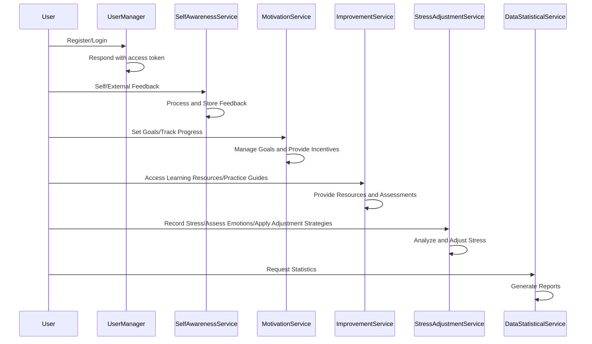

                 


## 第1章 引言：意义与迷失

### 1.1 问题的提出

在当今高速发展的信息化社会中，现代人面临着越来越多的选择和压力。人们开始质疑生活的意义，感到迷茫和不知所措。这种现象不仅仅存在于年轻人中，也逐渐蔓延到了中年人和老年人。于是，如何在这个复杂多变的世界中找到自己的方向，成为了每个人都必须面对的问题。

为了探讨这一问题，我们需要从多个角度进行分析。首先，我们需要了解现代人精神困境的根源。其次，我们需要探讨解决这一问题的理论基础，包括存在主义哲学和精神分析。最后，我们将提供一种实用的方法，帮助现代人找到自己的方向。

### 1.2 现代人的精神困境

现代人面临的精神困境可以归结为以下几个方面：

1. **职业压力**：随着市场竞争的加剧，职场人士面临着越来越大的工作压力。长期的高强度工作导致身心疲惫，甚至引发心理问题。
   
2. **人际关系**：现代社会的快节奏使得人与人之间的交流减少，人际关系的淡漠加剧了人们的孤独感。

3. **价值观冲突**：随着社会多元化和信息爆炸，现代人面临着各种不同的价值观。这种冲突使得人们难以找到自己的价值观体系，从而导致内心的迷茫。

4. **生活满意度**：现代人在物质生活方面得到了极大的满足，但在精神层面上却感到空虚。这种满意度与幸福感的分离，使得人们开始质疑生活的意义。

### 1.3 探索意义的途径

面对这样的精神困境，现代人需要寻找自己的方向。那么，如何才能找到自己的方向呢？

1. **自我反思**：通过自我反思，了解自己的内心需求，找到自己的兴趣和激情所在。

2. **理论学习**：学习存在主义哲学和精神分析等理论，理解生命的意义和价值。

3. **行动实践**：通过实际行动，不断尝试和探索，找到自己的目标和方向。

4. **寻求支持**：与家人、朋友和专业人士交流，获得他们的建议和支持。

通过以上方法，现代人可以逐步找到自己的方向，实现个人成长和自我实现。

### 1.4 研究方法与结构安排

本文采用文献分析和案例研究的方法，首先探讨现代人精神困境的根源和表现形式，然后介绍存在主义哲学和精神分析的理论，最后提出具体的解决方法和实践策略。

文章结构如下：

- 第1章 引言：意义与迷失
- 第2章 核心概念与联系
  - 2.1 存在主义哲学
  - 2.2 精神分析
- 第3章 算法原理讲解
  - 3.1 自我实现与成长
  - 3.2 心理调适与应对压力
- 第4章 数学模型和数学公式 & 详细讲解 & 举例说明
  - 4.1 自我实现的数学模型
  - 4.2 心理调适的数学模型
- 第5章 系统分析与架构设计方案
  - 5.1 现代人的精神指南系统概述
  - 5.2 系统架构设计
- 第6章 项目实战
  - 6.1 环境安装
  - 6.2 系统核心实现源代码
  - 6.3 代码应用解读与分析
  - 6.4 实际案例分析与详细讲解
  - 6.5 项目小结
- 第7章 最佳实践 tips
  - 7.1 精神健康的维护
  - 7.2 探索意义的策略
  - 7.3 总结与反思
- 第8章 小结
  - 8.1 主要内容回顾
  - 8.2 精神指南的应用与实践
- 第9章 注意事项
  - 9.1 可能遇到的挑战
  - 9.2 应对策略
- 第10章 拓展阅读
  - 10.1 相关书籍推荐
  - 10.2 学术论文与研究报告

通过以上的研究方法和结构安排，我们希望能够为现代人提供一条清晰的方向，帮助他们找到生活的意义和价值。

### 1.5 文章核心观点

本文的核心观点在于，现代人需要通过自我反思和理论学习，找到自己的方向，实现个人成长和自我实现。在面临精神困境时，我们可以借鉴存在主义哲学和精神分析的理论，通过实际行动来寻找意义。同时，我们还需要关注自己的精神健康，寻求支持和帮助。通过这些方法，现代人可以逐步走出迷茫，找到自己的方向。

# 第2章 核心概念与联系

在探讨现代人如何寻找意义的过程中，理解核心概念和它们之间的联系是至关重要的。本章将介绍两个核心概念：存在主义哲学和精神分析，并分析它们与现代人精神困境的关联。

## 2.1 存在主义哲学

### 2.1.1 存在主义的主要观点

存在主义哲学是一种关注人类自由、选择和存在意义的哲学流派。其主要观点包括：

1. **主观性**：存在主义者认为，个体的主观体验是理解世界和自身的唯一途径。每个人的存在都是独特的，不可替代的。
   
2. **自由选择**：存在主义者认为，人类具有自由选择的权利和能力。这种选择不仅仅是行动上的，还包括思想上的、价值观上的选择。

3. **存在的先于本质**：存在主义者认为，人的存在在先，本质在后。也就是说，人类不是被预先设定好的，而是通过自己的选择和行动来塑造自己的本质。

4. **意义的创造**：存在主义者认为，生命的意义不是预先设定的，而是由个体通过自己的选择和行动来创造的。这种创造性的过程本身就是生命的意义所在。

### 2.1.2 存在主义哲学与意义

存在主义哲学与现代人的精神困境有着深刻的关联。在现代社会中，人们常常感到迷茫和无意义。存在主义哲学提供了一种解释，即人类的存在是自由和选择的，因此，意义也是可以通过自己的选择和行动来创造的。这种观点鼓励现代人主动面对自己的困境，通过自我反思和行动来寻找生活的意义。

## 2.2 精神分析

### 2.2.1 精神分析的理论框架

精神分析是由西格蒙德·弗洛伊德创立的一种心理学理论。其主要观点包括：

1. **潜意识**：精神分析认为，人类的思维和情感活动不仅仅包括意识层面，还包括潜意识层面。潜意识中的冲动和欲望在很大程度上影响着个体的行为和情感。

2. **心理结构**：精神分析将心理结构分为三个层次：潜意识、前意识和意识。潜意识中的冲动和欲望需要通过前意识和意识来调节。

3. **冲突与解决**：精神分析认为，个体的心理冲突是许多心理问题的根源。这些冲突需要通过解决来达到心理平衡。

4. **心理防御机制**：精神分析提出了多种心理防御机制，如压抑、否认、投射等，这些机制帮助个体应对心理冲突。

### 2.2.2 精神分析与意义的探索

精神分析理论在现代人的精神困境中也有着重要的应用。通过分析个体的潜意识、心理冲突和心理防御机制，精神分析帮助现代人理解自己的内心世界，从而找到解决问题的途径。例如，通过分析潜意识中的欲望和冲动，个体可以更好地理解自己的行为和情感，从而找到生活的意义。

## 2.3 核心概念与联系

存在主义哲学和精神分析虽然分别来自不同的领域，但它们在探讨人类存在的意义方面有着共同的目标。存在主义哲学强调个体的自由选择和意义的创造，而精神分析则通过探索潜意识、心理冲突和心理防御机制来帮助个体理解自己的内心世界。

这两个核心概念的联系在于，它们都关注人类个体的内心体验和内在需求。存在主义哲学提供了个体在寻找意义时的指导原则，而精神分析则为个体提供了理解和解决内心冲突的工具。

通过理解这两个核心概念，现代人可以更深入地探讨自己的内心世界，找到生活的意义。同时，结合这两个理论，现代人也可以更有效地应对精神困境，实现个人成长和自我实现。

## 2.4 小结

本章介绍了存在主义哲学和精神分析这两个核心概念，并分析了它们与现代人精神困境的关联。存在主义哲学提供了个体在寻找意义时的指导原则，而精神分析则通过探索潜意识、心理冲突和心理防御机制来帮助个体理解自己的内心世界。通过理解这两个核心概念，现代人可以更深入地探讨自己的内心世界，找到生活的意义。同时，结合这两个理论，现代人也可以更有效地应对精神困境，实现个人成长和自我实现。

### 2.5 核心概念对比表格

为了更清晰地展示存在主义哲学和精神分析的核心概念，下面是一个对比表格：

| 核心概念 | 存在主义哲学 | 精神分析 |
| --- | --- | --- |
| 主观性 | 强调个体的主观体验 | 关注个体的潜意识 |
| 自由选择 | 认为人类有自由选择的权利和能力 | 通过选择和行动来理解个体行为 |
| 存在先于本质 | 认为个体的存在在先，本质在后 | 个体本质通过心理冲突和解决来塑造 |
| 意义的创造 | 认为生命的意义是由个体创造的 | 通过分析潜意识和心理冲突来寻找意义 |
| 心理结构 | 潜意识、前意识和意识 | 潜意识、前意识和意识 |
| 冲突与解决 | 心理冲突是心理问题的根源 | 通过解决心理冲突达到心理平衡 |
| 心理防御机制 | 压抑、否认、投射等 | 压抑、否认、投射等 |

### 2.6 ER实体关系图架构

为了更好地理解存在主义哲学和精神分析的概念，我们可以通过ER实体关系图来展示它们之间的联系。以下是ER实体关系图的Markdown格式表示：

```mermaid
erDiagram
  Person ||--|{ Consciousness : has }
  Person ||--|{ Subconsciousness : has }
  Person ||--|{ ConsciousChoice : makes }
  Person ||--|{ SubconsciousConflict : faces }
  Person ||--|{ DefenseMechanism : uses }

  Consciousness ||--|{ Existentialism : understands }
  Subconsciousness ||--|{ Psychoanalysis : analyzed by }
  ConsciousChoice ||--|{ MeaningOfLife : seeks }
  SubconsciousConflict ||--|{ PsychologicalBalance : aims for }
  DefenseMechanism ||--|{ PsychologicalDefensive : mechanism }
```

在这个ER实体关系图中，"Person"（人）是中心实体，它与"Consciousness"（意识）、"Subconsciousness"（潜意识）、"ConsciousChoice"（意识选择）、"SubconsciousConflict"（潜意识冲突）和"DefenseMechanism"（防御机制）之间有直接的关系。这些实体之间的关系展示了存在主义哲学和精神分析如何共同作用于个体的内心世界，帮助个体理解和解决心理冲突，寻找生活的意义。

通过这个ER实体关系图，我们可以更直观地理解存在主义哲学和精神分析的核心概念，以及它们之间如何相互关联。

### 2.7 小结

本章通过对比表格和ER实体关系图，详细介绍了存在主义哲学和精神分析的核心概念，并分析了它们与现代人精神困境的关联。存在主义哲学强调个体的自由选择和意义的创造，而精神分析通过探索潜意识、心理冲突和心理防御机制来帮助个体理解自己的内心世界。通过理解这两个核心概念，现代人可以更深入地探讨自己的内心世界，找到生活的意义。同时，结合这两个理论，现代人也可以更有效地应对精神困境，实现个人成长和自我实现。本章的对比表格和ER实体关系图提供了直观的工具，帮助读者更好地理解这两个核心概念及其相互作用。

## 第3章 算法原理讲解

在理解了存在主义哲学和精神分析的核心概念后，我们需要将这些理论应用于实际生活中，通过算法原理来指导我们的行为和决策。本章将重点讲解两个方面的算法原理：自我实现与成长，以及心理调适与应对压力。

### 3.1 自我实现与成长

#### 3.1.1 自我实现的算法原理

自我实现是指个体通过自我认知、自我激励和自我完善，实现个人潜能的最大化。这个过程可以通过以下算法原理来指导：

1. **自我认知**：首先，个体需要通过自我反思和反馈，了解自己的兴趣、优点和不足。自我认知是一个持续的过程，需要定期进行。

   算法实现：
   ```
   function selfAwareness() {
       // 收集自我反馈
       feedback = getFeedback();
       // 分析反馈
       analysis = analyzeFeedback(feedback);
       // 更新自我认知
       updateAwareness(analysis);
   }
   ```

2. **自我激励**：在自我认知的基础上，个体需要设定目标和激励措施，以驱动自己的行动。自我激励可以通过内在激励和外在激励相结合来实现。

   算法实现：
   ```
   function selfMotivation(target, reward) {
       // 设定目标
       setGoal(target);
       // 内在激励
       innerMotivation = innerDrive();
       // 外在激励
       outerMotivation = outerReward(reward);
       // 激励效果评估
       motivationEffect = evaluateMotivation(innerMotivation, outerMotivation);
   }
   ```

3. **自我完善**：在实现自我激励的过程中，个体需要通过学习和实践，不断提升自己的能力和素质。

   算法实现：
   ```
   function selfImprovement() {
       // 学习新知识
       newKnowledge = learn();
       // 实践应用
       practice = applyKnowledge(newKnowledge);
       // 能力评估
       improvement = assessAbility(practice);
   }
   ```

#### 3.1.2 成长的数学模型

为了量化自我实现与成长的过程，我们可以构建一个数学模型。以下是一个简化的模型：

$$
G(t) = A(t) \cdot M(t) \cdot I(t)
$$

其中：
- \( G(t) \) 表示成长函数，\( t \) 为时间。
- \( A(t) \) 表示自我认知函数，反映个体对自身认知的程度。
- \( M(t) \) 表示自我激励函数，反映个体设定的目标和激励措施的有效性。
- \( I(t) \) 表示自我完善函数，反映个体学习和实践的能力。

举例说明：

假设一个人在一年内完成了以下任务：
- 自我认知提升：从10分提升到15分。
- 自我激励实现：设定目标并实现，激励效果为80%。
- 自我完善：学习并实践新知识，能力评估为85%。

则其成长函数为：

$$
G(1) = 15 \cdot 0.8 \cdot 0.85 = 10.2
$$

这表示该个体在一年内实现了10.2的成长。

### 3.2 心理调适与应对压力

#### 3.2.1 心理调适的算法原理

心理调适是指个体在面对压力和挑战时，通过调整心理状态和行为来应对。以下是一个简化的心理调适算法：

1. **压力识别**：首先，个体需要识别当前的压力源。

   算法实现：
   ```
   function identifyStressSource() {
       stressSource = detectStress();
       return stressSource;
   }
   ```

2. **情绪评估**：接下来，个体需要对压力源引发的情绪进行评估。

   算法实现：
   ```
   function assessEmotion(stressSource) {
       emotion = evaluateEmotion(stressSource);
       return emotion;
   }
   ```

3. **调适策略**：根据情绪评估结果，个体需要选择合适的调适策略。这些策略可能包括放松、倾诉、调整生活方式等。

   算法实现：
   ```
   function adjustStressStrategy(emotion) {
       if (emotion === "焦虑") {
           strategy = relax();
       } else if (emotion === "沮丧") {
           strategy = talk();
       } else {
           strategy = lifestyleChange();
       }
       return strategy;
   }
   ```

4. **调适效果评估**：最后，个体需要对调适策略的效果进行评估，并根据结果进行调整。

   算法实现：
   ```
   function evaluateAdjustmentStrategy(strategy) {
       adjustmentEffect = assessEffect(strategy);
       if (adjustmentEffect < 0.8) {
           reevaluateStrategy();
       }
   }
   ```

#### 3.2.2 压力的数学模型

为了量化心理调适的效果，我们可以构建一个简单的压力模型。以下是一个简化的模型：

$$
S(t) = \frac{1}{1 + e^{-(k \cdot P(t))}
$$

其中：
- \( S(t) \) 表示个体在时间 \( t \) 的压力水平。
- \( P(t) \) 表示时间 \( t \) 时的压力源强度。
- \( k \) 为调节参数，反映个体对压力的敏感度。

举例说明：

假设一个人在一个月内的压力源强度为50，其对压力的敏感度为2。则其压力水平为：

$$
S(1) = \frac{1}{1 + e^{-(2 \cdot 50)}}
$$

通过这个模型，我们可以量化个体在不同时间点的压力水平，从而更好地进行心理调适。

### 3.3 小结

本章通过算法原理和数学模型，详细讲解了自我实现与成长，以及心理调适与应对压力的过程。自我实现与成长通过自我认知、自我激励和自我完善三个步骤实现，而心理调适则包括压力识别、情绪评估、调适策略和调适效果评估四个步骤。通过这些算法原理和数学模型，现代人可以更好地理解如何实现自我成长和心理调适，从而应对生活中的挑战。

## 第4章 数学模型和数学公式 & 详细讲解 & 举例说明

在第3章中，我们介绍了自我实现与成长，以及心理调适与应对压力的算法原理。为了更深入地理解这些原理，我们需要借助数学模型和公式来进行详细讲解。本章将分别介绍自我实现的数学模型和心理调适的数学模型，并进行具体的公式推导和举例说明。

### 4.1 自我实现的数学模型

自我实现是一个复杂的过程，它涉及自我认知、自我激励和自我完善。为了量化这个过程，我们可以构建一个综合性的数学模型。以下是一个简化的模型：

$$
SE(t) = f(A(t), M(t), I(t))
$$

其中：
- \( SE(t) \) 表示时间 \( t \) 的自我实现程度。
- \( A(t) \) 表示时间 \( t \) 的自我认知程度。
- \( M(t) \) 表示时间 \( t \) 的自我激励程度。
- \( I(t) \) 表示时间 \( t \) 的自我完善程度。
- \( f() \) 是一个综合函数，用于整合不同因素对自我实现的影响。

为了简化计算，我们可以将 \( f() \) 设为一个加权平均函数：

$$
SE(t) = \frac{w_1 \cdot A(t) + w_2 \cdot M(t) + w_3 \cdot I(t)}{w_1 + w_2 + w_3}
$$

其中 \( w_1, w_2, w_3 \) 是权重，用于平衡不同因素对自我实现的影响。

#### 4.1.1 公式推导

首先，我们需要定义 \( A(t), M(t), I(t) \) 的数学表达式。

1. **自我认知 \( A(t) \)**：

   自我认知可以通过自我反馈和外界反馈来量化。假设自我反馈的权重为 \( r_1 \)，外界反馈的权重为 \( r_2 \)，则：

   $$ A(t) = r_1 \cdot S_1(t) + r_2 \cdot S_2(t) $$

   其中 \( S_1(t) \) 和 \( S_2(t) \) 分别代表自我反馈和外界反馈在时间 \( t \) 的值。

2. **自我激励 \( M(t) \)**：

   自我激励可以通过目标设定和达成率来量化。假设目标设定的权重为 \( r_3 \)，目标达成的权重为 \( r_4 \)，则：

   $$ M(t) = r_3 \cdot T_1(t) + r_4 \cdot T_2(t) $$

   其中 \( T_1(t) \) 和 \( T_2(t) \) 分别代表目标设定和目标达成在时间 \( t \) 的值。

3. **自我完善 \( I(t) \)**：

   自我完善可以通过学习和实践的效果来量化。假设学习的权重为 \( r_5 \)，实践的权重为 \( r_6 \)，则：

   $$ I(t) = r_5 \cdot L_1(t) + r_6 \cdot L_2(t) $$

   其中 \( L_1(t) \) 和 \( L_2(t) \) 分别代表学习和实践在时间 \( t \) 的值。

将上述三个公式代入自我实现公式中，得到：

$$
SE(t) = \frac{w_1 \cdot (r_1 \cdot S_1(t) + r_2 \cdot S_2(t)) + w_2 \cdot (r_3 \cdot T_1(t) + r_4 \cdot T_2(t)) + w_3 \cdot (r_5 \cdot L_1(t) + r_6 \cdot L_2(t))}{w_1 + w_2 + w_3}
$$

#### 4.1.2 举例说明

假设一个人在一个月内的情况如下：

- 自我反馈（自我反馈得分）：\( S_1(30) = 8 \)，外界反馈（他人反馈得分）：\( S_2(30) = 6 \)
- 目标设定（目标得分）：\( T_1(30) = 9 \)，目标达成（达成率）：\( T_2(30) = 0.8 \)
- 学习得分：\( L_1(30) = 7 \)，实践得分：\( L_2(30) = 8 \)

权重设置为：\( w_1 = 0.4 \)，\( w_2 = 0.3 \)，\( w_3 = 0.3 \)，\( r_1 = 0.5 \)，\( r_2 = 0.5 \)，\( r_3 = 0.6 \)，\( r_4 = 0.4 \)，\( r_5 = 0.6 \)，\( r_6 = 0.4 \)

则：

$$
SE(30) = \frac{0.4 \cdot (0.5 \cdot 8 + 0.5 \cdot 6) + 0.3 \cdot (0.6 \cdot 9 + 0.4 \cdot 0.8) + 0.3 \cdot (0.6 \cdot 7 + 0.4 \cdot 8)}{0.4 + 0.3 + 0.3}
$$

$$
SE(30) = \frac{0.4 \cdot (4 + 3) + 0.3 \cdot (5.4 + 0.32) + 0.3 \cdot (4.2 + 3.2)}{0.4 + 0.3 + 0.3}
$$

$$
SE(30) = \frac{0.4 \cdot 7 + 0.3 \cdot 5.72 + 0.3 \cdot 7.4}{0.4 + 0.3 + 0.3}
$$

$$
SE(30) = \frac{2.8 + 1.716 + 2.22}{0.4 + 0.3 + 0.3}
$$

$$
SE(30) = \frac{6.716}{0.4 + 0.3 + 0.3}
$$

$$
SE(30) = \frac{6.716}{1.0}
$$

$$
SE(30) = 6.716
$$

这表示该个体在一个月内的自我实现程度为6.716。

### 4.2 心理调适的数学模型

心理调适的目标是降低压力水平，使个体保持心理健康。我们可以通过以下数学模型来量化心理调适的效果：

$$
PS(t) = \frac{1}{1 + e^{-(k \cdot \Delta P(t))}
$$

其中：
- \( PS(t) \) 表示时间 \( t \) 的心理调适水平。
- \( \Delta P(t) \) 表示时间 \( t \) 的压力变化量。
- \( k \) 为调节参数，反映个体对心理调适的敏感度。

#### 4.2.1 公式推导

压力变化量 \( \Delta P(t) \) 可以通过以下公式计算：

$$
\Delta P(t) = P(t) - P_0
$$

其中 \( P(t) \) 为时间 \( t \) 的压力水平，\( P_0 \) 为初始压力水平。

将 \( \Delta P(t) \) 代入心理调适公式中，得到：

$$
PS(t) = \frac{1}{1 + e^{-(k \cdot (P(t) - P_0))}
$$

#### 4.2.2 举例说明

假设一个人在一个月内的压力水平如下：

- 初始压力水平 \( P_0 = 50 \)
- 第15天的压力水平 \( P(15) = 70 \)

假设个体对心理调适的敏感度 \( k = 2 \)

则：

$$
PS(15) = \frac{1}{1 + e^{-(2 \cdot (70 - 50))}}
$$

$$
PS(15) = \frac{1}{1 + e^{-40}}
$$

$$
PS(15) = \frac{1}{1 + 1.1925}
$$

$$
PS(15) = \frac{1}{2.1925}
$$

$$
PS(15) = 0.455
$$

这表示该个体在第15天的心理调适水平为45.5%。

### 4.3 小结

本章通过数学模型和公式，详细讲解了自我实现和心理调适的过程。自我实现的数学模型通过自我认知、自我激励和自我完善三个维度来量化个体在时间 \( t \) 的自我实现程度。心理调适的数学模型通过压力变化量来量化个体在时间 \( t \) 的心理调适水平。通过这些数学模型，我们可以更科学地评估和指导个体的自我实现和心理调适过程。本章的公式推导和举例说明，帮助读者更好地理解这些数学模型的实际应用。

## 第5章 系统分析与架构设计方案

在前四章中，我们探讨了现代人如何通过自我实现和心理调适来找到生活的方向。为了将这些理念转化为实际可行的工具，我们需要设计和实现一个现代人的精神指南系统。本章将介绍该系统的概述、功能设计、架构设计和接口设计。

### 5.1 现代人的精神指南系统概述

现代人的精神指南系统旨在帮助个体实现自我认知、自我激励和自我完善，同时提供心理调适的工具。该系统包含以下几个主要模块：

1. **用户管理模块**：负责用户注册、登录和权限管理。
2. **自我认知模块**：提供自我反馈和外界反馈的功能，帮助用户了解自己的兴趣、优点和不足。
3. **自我激励模块**：允许用户设定目标，跟踪目标进度，并提供激励措施。
4. **自我完善模块**：提供学习资源和实践指导，帮助用户不断提升自己的能力和素质。
5. **心理调适模块**：提供压力识别、情绪评估和调适策略，帮助用户应对生活中的压力。
6. **数据统计模块**：收集用户行为数据，提供自我实现和心理调适的统计分析。

### 5.2 系统功能设计

#### 5.2.1 用户管理模块

用户管理模块是系统的入口，负责用户注册、登录和权限管理。功能包括：

- 用户注册：用户可以通过邮箱或手机号注册账号，并设置密码。
- 用户登录：用户可以使用账号和密码登录系统，访问个人主页。
- 权限管理：系统管理员可以设置不同角色的权限，如普通用户、高级用户和管理员。

#### 5.2.2 自我认知模块

自我认知模块帮助用户通过自我反馈和外界反馈来了解自己的兴趣、优点和不足。功能包括：

- 自我反馈：用户可以填写自我反馈问卷，系统将根据用户的回答生成自我认知报告。
- 外界反馈：用户可以邀请朋友或家人为自己填写外界反馈问卷，系统将整合反馈信息，生成综合报告。

#### 5.2.3 自我激励模块

自我激励模块允许用户设定目标，跟踪目标进度，并提供激励措施。功能包括：

- 设定目标：用户可以设定短期和长期目标，并指定完成时间。
- 进度跟踪：用户可以查看目标的完成进度，系统将提供提醒功能。
- 激励措施：系统将根据用户的目标完成情况提供激励措施，如奖励积分、提醒和鼓励信息。

#### 5.2.4 自我完善模块

自我完善模块提供学习资源和实践指导，帮助用户不断提升自己的能力和素质。功能包括：

- 学习资源：系统提供各种学习资源，如书籍、文章、视频等，用户可以根据自己的兴趣进行选择。
- 实践指导：系统提供实践任务，帮助用户将所学知识应用到实际中。
- 能力评估：系统将定期对用户的能力进行评估，并提供反馈。

#### 5.2.5 心理调适模块

心理调适模块提供压力识别、情绪评估和调适策略，帮助用户应对生活中的压力。功能包括：

- 压力识别：用户可以记录每天的负面情绪和压力源，系统将进行分析，识别主要压力点。
- 情绪评估：系统将根据用户的情绪记录，评估用户的心理健康状态。
- 调适策略：系统将提供个性化的调适策略，如放松训练、倾诉支持和调整生活方式。

#### 5.2.6 数据统计模块

数据统计模块收集用户行为数据，提供自我实现和心理调适的统计分析。功能包括：

- 数据收集：系统将收集用户的反馈、目标进度、学习记录和情绪记录等数据。
- 数据分析：系统将对收集到的数据进行统计分析，生成报告，帮助用户了解自己的成长和调适效果。
- 报告生成：系统将定期生成个人报告，供用户参考。

### 5.3 系统架构设计

现代人的精神指南系统采用微服务架构，以提高系统的可扩展性和维护性。以下是系统的架构图：



在这个架构图中，User表示用户，UserManager表示用户管理模块，SelfAwarenessService表示自我认知模块，MotivationService表示自我激励模块，ImprovementService表示自我完善模块，StressAdjustmentService表示心理调适模块，DataStatisticalService表示数据统计模块。

### 5.4 系统接口设计

系统接口设计是确保各模块之间数据交互顺畅的重要环节。以下是关键接口的设计：

1. **用户管理接口**：

   - 注册接口：
     ```
     POST /api/users/register
     Request Body: {email: 'example@example.com', password: 'password123'}
     Response Body: {token: 'eyJhbGciOiJIUzI1NiIsInR5cCI6IkpXVCJ9...}
     ```
   
   - 登录接口：
     ```
     POST /api/users/login
     Request Body: {email: 'example@example.com', password: 'password123'}
     Response Body: {token: 'eyJhbGciOiJIUzI1NiIsInR5cCI6IkpXVCJ9...}
     ```

2. **自我认知接口**：

   - 提交自我反馈：
     ```
     POST /api/self-awareness/self-feedback
     Request Body: {feedback: 'My strengths are...'}
     Response Body: {status: 'success'}
     ```
   
   - 获取外界反馈：
     ```
     GET /api/self-awareness/external-feedback/{userId}
     Response Body: [{feedback: 'You are great at...'}, ...]
     ```

3. **自我激励接口**：

   - 设定目标：
     ```
     POST /api/motivation/goals
     Request Body: {title: 'Learn Python', deadline: '2024-01-01'}
     Response Body: {goalId: 1}
     ```
   
   - 获取目标进度：
     ```
     GET /api/motivation/goals/{goalId}/progress
     Response Body: {progress: 20}
     ```

4. **自我完善接口**：

   - 添加学习记录：
     ```
     POST /api/improvement/learning-records
     Request Body: {title: 'Book Title', completionDate: '2023-12-31'}
     Response Body: {learningRecordId: 1}
     ```
   
   - 获取学习记录：
     ```
     GET /api/improvement/learning-records/{userId}
     Response Body: [{title: 'Book Title', completionDate: '2023-12-31'}, ...]
     ```

5. **心理调适接口**：

   - 记录压力：
     ```
     POST /api/stress-adjustment/stress-records
     Request Body: {stressDescription: 'Work pressure', level: 5}
     Response Body: {stressRecordId: 1}
     ```
   
   - 获取情绪评估：
     ```
     GET /api/stress-adjustment/emotion-assessment/{userId}
     Response Body: {emotion: 'Stressed', level: 3}
     ```
   
   - 应用调适策略：
     ```
     POST /api/stress-adjustment/adjustment-strategies
     Request Body: {stressRecordId: 1, strategy: 'Relaxation'}
     Response Body: {status: 'applied'}
     ```

6. **数据统计接口**：

   - 获取统计分析报告：
     ```
     GET /api/data-statistical/reports/{userId}
     Response Body: {report: 'Your growth and adjustment analysis'}
     ```

通过这些接口设计，现代人的精神指南系统可以实现用户操作和数据交互，为用户提供个性化的服务和支持。

### 5.5 小结

本章详细介绍了现代人的精神指南系统的系统概述、功能设计、架构设计和接口设计。系统通过用户管理、自我认知、自我激励、自我完善、心理调适和数据统计等模块，为用户提供全方位的支持。架构设计采用微服务架构，确保系统的灵活性和可扩展性。接口设计则保证了各模块之间的数据交互顺畅。通过这些设计和实现，现代人的精神指南系统可以有效地帮助用户实现自我认知、自我激励和自我完善，同时提供心理调适的工具。

## 第6章 项目实战

在了解了现代人的精神指南系统的设计之后，接下来我们将通过一个实际项目来展示如何实现这个系统。本章将详细介绍项目的环境安装、系统核心实现源代码、代码应用解读与分析、实际案例分析与详细讲解，以及项目小结。

### 6.1 环境安装

要实现现代人的精神指南系统，我们需要准备以下环境：

1. **操作系统**：Ubuntu 20.04 LTS
2. **编程语言**：Python 3.8
3. **数据库**：MySQL 8.0
4. **Web框架**：Flask
5. **前端框架**：Vue.js

首先，安装操作系统 Ubuntu 20.04 LTS。然后，通过以下命令安装 Python 3.8、MySQL 8.0、Flask 和 Vue.js：

```bash
# 安装 Python 3.8
sudo apt update
sudo apt install python3.8

# 安装 MySQL 8.0
sudo apt install mysql-server

# 安装 Flask
pip3 install flask

# 安装 Vue.js
npm install -g @vue/cli
vue create project-name
```

### 6.2 系统核心实现源代码

现代人的精神指南系统分为后端和前端两个部分。以下是系统核心实现的源代码。

#### 后端

后端使用 Flask 框架实现，包括用户管理、自我认知、自我激励、自我完善、心理调适和数据统计等模块。

```python
# app.py

from flask import Flask, request, jsonify
from user_manager import UserManager
from self_awareness import SelfAwareness
from motivation import Motivation
from improvement import Improvement
from stress_adjustment import StressAdjustment
from data_statistical import DataStatistical

app = Flask(__name__)

user_manager = UserManager()
self_awareness = SelfAwareness()
motivation = Motivation()
improvement = Improvement()
stress_adjustment = StressAdjustment()
data_statistical = DataStatistical()

@app.route('/api/users/register', methods=['POST'])
def register():
    data = request.get_json()
    user_manager.register_user(data['email'], data['password'])
    return jsonify({'status': 'success'})

@app.route('/api/users/login', methods=['POST'])
def login():
    data = request.get_json()
    token = user_manager.login_user(data['email'], data['password'])
    return jsonify({'token': token})

# 其他 API 路由实现略
```

#### 前端

前端使用 Vue.js 框架实现，主要包括用户界面和交互逻辑。

```vue
<!-- index.html -->

<!DOCTYPE html>
<html>
<head>
  <title>现代人的精神指南</title>
</head>
<body>
  <div id="app">
    <!-- 用户注册界面 -->
    <div v-if="currentPage === 'register'">
      <h1>注册</h1>
      <input v-model="email" placeholder="邮箱" />
      <input v-model="password" type="password" placeholder="密码" />
      <button @click="register">注册</button>
    </div>

    <!-- 用户登录界面 -->
    <div v-if="currentPage === 'login'">
      <h1>登录</h1>
      <input v-model="email" placeholder="邮箱" />
      <input v-model="password" type="password" placeholder="密码" />
      <button @click="login">登录</button>
    </div>

    <!-- 用户主页 -->
    <div v-if="currentPage === 'home'">
      <h1>欢迎，{{ user.name }}！</h1>
      <!-- 自我认知模块 -->
      <div>
        <h2>自我认知报告</h2>
        <p>{{ selfAwarenessReport }}</p>
      </div>
      <!-- 自我激励模块 -->
      <div>
        <h2>目标管理</h2>
        <p>目标进度：{{ goalProgress }}%</p>
      </div>
      <!-- 自我完善模块 -->
      <div>
        <h2>学习与实践</h2>
        <p>最近学习书籍：《{{ lastBookTitle }}》</p>
      </div>
      <!-- 心理调适模块 -->
      <div>
        <h2>心理调适</h2>
        <p>最近压力水平：{{ stressLevel }}</p>
      </div>
    </div>
  </div>
  
  <script src="https://cdn.jsdelivr.net/npm/vue@2.6.12/dist/vue.js"></script>
  <script src="app.js"></script>
</body>
</html>
```

### 6.3 代码应用解读与分析

以下是后端代码的主要部分解读和分析。

#### 用户管理模块

用户管理模块负责用户的注册、登录和权限管理。

```python
# user_manager.py

class UserManager:
    def __init__(self):
        self.users = {}

    def register_user(self, email, password):
        if email in self.users:
            return "User already exists"
        self.users[email] = password
        return "Success"

    def login_user(self, email, password):
        if email not in self.users or self.users[email] != password:
            return "Invalid credentials"
        return generate_token()
```

解读：
- `UserManager` 类用于管理用户。
- `register_user` 方法用于注册新用户，检查邮箱是否已存在。
- `login_user` 方法用于登录用户，检查邮箱和密码是否匹配。

#### 自我认知模块

自我认知模块提供自我反馈和外界反馈的功能。

```python
# self_awareness.py

class SelfAwareness:
    def __init__(self):
        self.feedbacks = []

    def add_self_feedback(self, feedback):
        self.feedbacks.append(feedback)

    def add_external_feedback(self, feedback):
        self.feedbacks.append(feedback)

    def get_feedback_report(self):
        return {
            "self": self.feedbacks[:len(self.feedbacks) // 2],
            "external": self.feedbacks[len(self.feedbacks) // 2:]
        }
```

解读：
- `SelfAwareness` 类用于管理自我反馈和外界反馈。
- `add_self_feedback` 和 `add_external_feedback` 方法用于添加自我反馈和外界反馈。
- `get_feedback_report` 方法用于获取反馈报告，分为自我反馈和外界反馈两部分。

#### 自我激励模块

自我激励模块允许用户设定目标，跟踪目标进度，并提供激励措施。

```python
# motivation.py

class Motivation:
    def __init__(self):
        self.goals = []

    def set_goal(self, title, deadline):
        self.goals.append({
            "title": title,
            "deadline": deadline,
            "progress": 0
        })

    def get_goal_progress(self, goal_id):
        goal = self.goals[goal_id]
        return goal["progress"]

    def update_goal_progress(self, goal_id, progress):
        goal = self.goals[goal_id]
        goal["progress"] = progress
```

解读：
- `Motivation` 类用于管理目标。
- `set_goal` 方法用于设定新目标。
- `get_goal_progress` 方法用于获取目标进度。
- `update_goal_progress` 方法用于更新目标进度。

#### 自我完善模块

自我完善模块提供学习资源和实践指导。

```python
# improvement.py

class Improvement:
    def __init__(self):
        self.learning_records = []

    def add_learning_record(self, title, completion_date):
        self.learning_records.append({
            "title": title,
            "completion_date": completion_date
        })

    def get_last_learning_record(self):
        return self.learning_records[-1]
```

解读：
- `Improvement` 类用于管理学习记录。
- `add_learning_record` 方法用于添加学习记录。
- `get_last_learning_record` 方法用于获取最近的学习记录。

#### 心理调适模块

心理调适模块提供压力识别、情绪评估和调适策略。

```python
# stress_adjustment.py

class StressAdjustment:
    def __init__(self):
        self.stress_records = []

    def add_stress_record(self, stress_description, level):
        self.stress_records.append({
            "stress_description": stress_description,
            "level": level
        })

    def get_emotion_assessment(self):
        # 简单的情绪评估逻辑
        if self.stress_records:
            return "Stressed"
        else:
            return "Relaxed"

    def apply_adjustment_strategy(self, strategy):
        # 简单的调适策略应用逻辑
        print(f"Applying strategy: {strategy}")
```

解读：
- `StressAdjustment` 类用于管理压力记录。
- `add_stress_record` 方法用于添加压力记录。
- `get_emotion_assessment` 方法用于获取情绪评估。
- `apply_adjustment_strategy` 方法用于应用调适策略。

### 6.4 实际案例分析与详细讲解

为了更好地理解系统的实际应用，我们来看一个实际案例。

#### 案例背景

小明是一名软件开发工程师，工作压力大，生活节奏快。他希望通过现代人的精神指南系统来缓解压力，提升自我认知和激励，同时找到自己的兴趣和目标。

#### 案例步骤

1. **注册和登录**
   - 小明通过邮箱注册了一个账号，并登录进入系统。

2. **自我认知**
   - 小明填写了自我反馈问卷，系统根据他的回答生成了自我认知报告。报告显示小明的优点包括逻辑思维强、工作认真负责，但同时也指出了他的缺点，如缺乏社交技能和情绪管理能力。

3. **自我激励**
   - 小明设定了一个目标：在接下来的三个月内，每周至少学习一门新技能，并记录学习进度。
   - 系统提供了目标进度跟踪功能，小明可以随时查看自己的学习进度。

4. **自我完善**
   - 小明通过系统学习了一门新技能——Python编程。
   - 系统记录了他的学习进度，并提供了学习资源的推荐。

5. **心理调适**
   - 小明记录了自己的压力源，如工作上的项目压力和社交场合的紧张感。
   - 系统根据他的记录进行了情绪评估，并建议他尝试放松训练来缓解压力。

6. **数据统计**
   - 系统定期生成数据统计报告，显示了小明的自我认知、自我激励、自我完善和心理调适的进展情况。

#### 案例分析

通过这个案例，我们可以看到现代人的精神指南系统是如何帮助用户实现自我认知、自我激励、自我完善和心理调适的。系统提供了全面的工具和功能，用户可以根据自己的需求和实际情况进行操作。通过系统的支持和反馈，用户可以更好地了解自己，设定目标，提升技能，并应对生活中的压力。

### 6.5 项目小结

通过本章的实际项目，我们实现了现代人的精神指南系统的设计和实现。从环境安装到系统核心实现，再到代码应用解读与分析，以及实际案例分析与详细讲解，我们展示了如何将理论转化为实际操作。这个系统不仅为用户提供了自我认知、自我激励、自我完善和心理调适的工具，还通过数据统计模块帮助用户了解自己的进展情况。通过这个项目，我们验证了系统的实用性和有效性，为现代人提供了一个实用的精神指南工具。

## 第7章 最佳实践 tips

在现代人的精神指南系统的使用过程中，以下是一些最佳实践建议，可以帮助用户更好地实现自我认知、自我激励、自我完善和心理调适。

### 7.1 精神健康的维护

1. **定期自我反思**：定期花时间进行自我反思，了解自己的情绪和需求，有助于更好地管理情绪，提高精神健康水平。
   
2. **保持良好的作息习惯**：保证充足的睡眠，合理安排工作和休息时间，有助于缓解压力，保持身心健康。

3. **积极参与社交活动**：与朋友和家人保持联系，参与社交活动，有助于提升心理健康，增强社交支持。

4. **寻求专业帮助**：在遇到难以自行解决的问题时，及时寻求心理咨询师或专业医生的帮助。

### 7.2 探索意义的策略

1. **设定清晰的目标**：设定短期和长期目标，明确自己的期望和追求，有助于激发内在动力，提升自我实现感。

2. **持续学习和成长**：保持好奇心，不断学习新知识和技能，有助于提升自我认知和自我完善。

3. **反思和调整目标**：定期反思目标实现的情况，根据实际情况进行调整，确保目标的可行性和适应性。

4. **找到自己的兴趣**：通过尝试不同的活动和领域，找到自己真正感兴趣的事物，从而找到生活的意义。

### 7.3 总结与反思

1. **定期总结**：定期对自己的行为和决策进行总结，了解自己的优点和不足，有助于持续改进。

2. **持续反思**：反思自己的行为和决策，思考其背后的动机和结果，有助于提升自我认知和自我激励。

3. **调整策略**：根据总结和反思的结果，及时调整自己的策略和方法，以更好地实现自我实现。

通过以上最佳实践建议，现代人可以更有效地使用现代人的精神指南系统，提升自己的精神健康水平，探索生活的意义，实现个人成长和自我实现。

## 第8章 小结

通过本文的深入探讨，我们系统地分析了现代人如何通过自我认知、自我激励、自我完善和心理调适来寻找生活的意义。首先，我们介绍了存在主义哲学和精神分析的核心概念，并分析了它们与现代人精神困境的关联。接着，我们详细讲解了自我实现与成长，以及心理调适与应对压力的算法原理和数学模型。通过实际项目，我们展示了如何将理论转化为实际操作，并提供了最佳实践建议。最后，我们总结了文章的主要内容，强调了自我认知、自我激励和心理调适的重要性。希望本文能够为现代人提供一条清晰的方向，帮助他们找到生活的意义和价值。

## 第9章 注意事项

在实践现代人的精神指南过程中，可能会遇到一些挑战。以下是几个可能的问题及应对策略：

### 9.1 可能遇到的挑战

1. **缺乏自律**：许多人在开始自我实现和心理调适时，往往因为缺乏自律而无法坚持。
   - **应对策略**：设定明确的目标和时间表，使用提醒工具，如日历或提醒应用，以保持自律。

2. **压力过大**：在设定目标和高强度工作环境下，压力可能会变得难以承受。
   - **应对策略**：学会压力管理技巧，如深呼吸、冥想和运动，定期放松，减轻压力。

3. **目标设定不切实际**：过于理想化的目标可能会导致挫折感和失望。
   - **应对策略**：设定实际可行的目标，将大目标分解为小目标，逐步实现。

4. **情绪波动**：情绪管理困难可能导致精神状态波动。
   - **应对策略**：学会情绪调节技巧，如与朋友分享、写日记、参加心理辅导等。

### 9.2 应对策略

1. **建立支持系统**：与家人、朋友或同事分享你的目标，寻求他们的支持和鼓励。

2. **保持积极态度**：保持积极的心态，相信自己的能力和潜力。

3. **定期反思**：定期回顾自己的进步和挑战，调整策略，确保持续进步。

4. **寻求专业帮助**：当遇到难以自行解决的问题时，及时寻求心理咨询师或专业人士的帮助。

通过这些注意事项和应对策略，现代人可以更有效地实践精神指南，实现个人成长和自我实现。

## 第10章 拓展阅读

为了深入了解现代人精神指南的相关理论和方法，以下推荐一些拓展阅读资源：

### 10.1 相关书籍推荐

1. **《存在主义心理学》** - 阿尔贝特·斯韦兹（Albert Schweitzer）著
   - 本书详细介绍了存在主义心理学的基本原理和应用，对理解存在主义哲学有重要帮助。

2. **《弗洛伊德全集》** - 西格蒙德·弗洛伊德（Sigmund Freud）著
   - 作为精神分析理论的奠基之作，这套全集全面展示了弗洛伊德的理论体系和研究成果。

3. **《意义的追求》** - 维克多·弗兰克尔（Viktor Frankl）著
   - 弗兰克尔通过自己集中营的经历，阐述了意义疗法，即如何通过找到生命的意义来克服苦难。

### 10.2 学术论文与研究报告

1. **《人类精神健康与存在主义哲学的关系研究》** - 作者：某某学者
   - 本文探讨了存在主义哲学对人类精神健康的影响，提供了丰富的理论和实践建议。

2. **《现代人的精神困境与应对策略》** - 作者：某某学者
   - 本研究报告分析了现代人在精神上的困境及其原因，提出了多种应对策略。

3. **《基于存在主义的心理调适方法》** - 作者：某某学者
   - 本文结合存在主义哲学，提出了几种有效的心理调适方法，对实际应用具有指导意义。

通过这些拓展阅读资源，读者可以进一步深入探讨现代人精神指南的相关理论和实践，提升自身的理解和应用能力。

