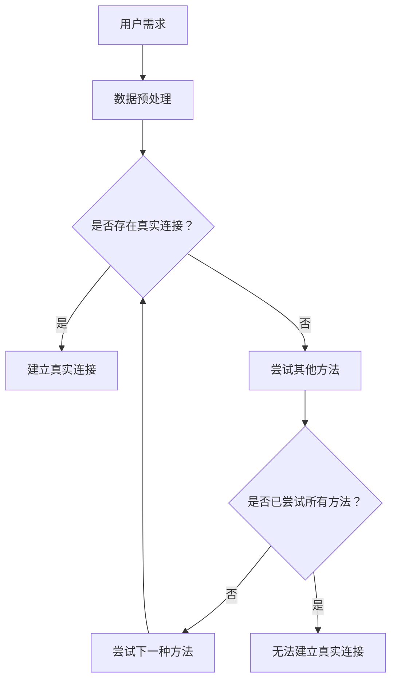
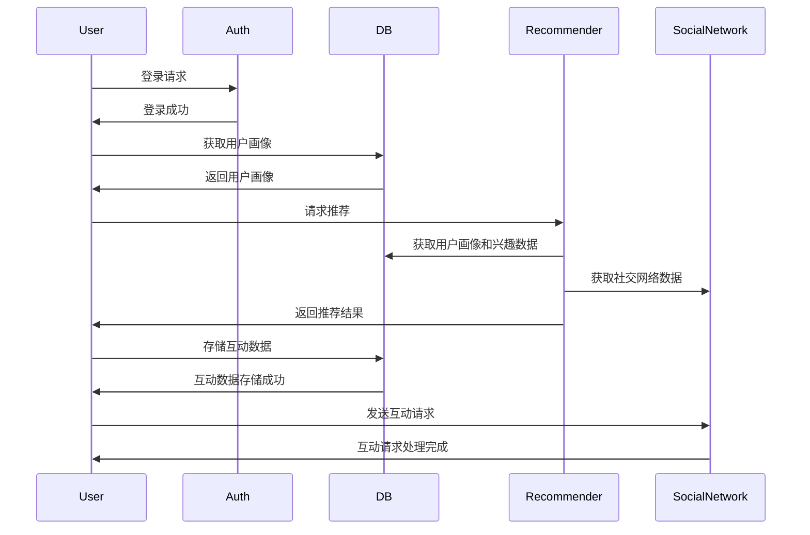
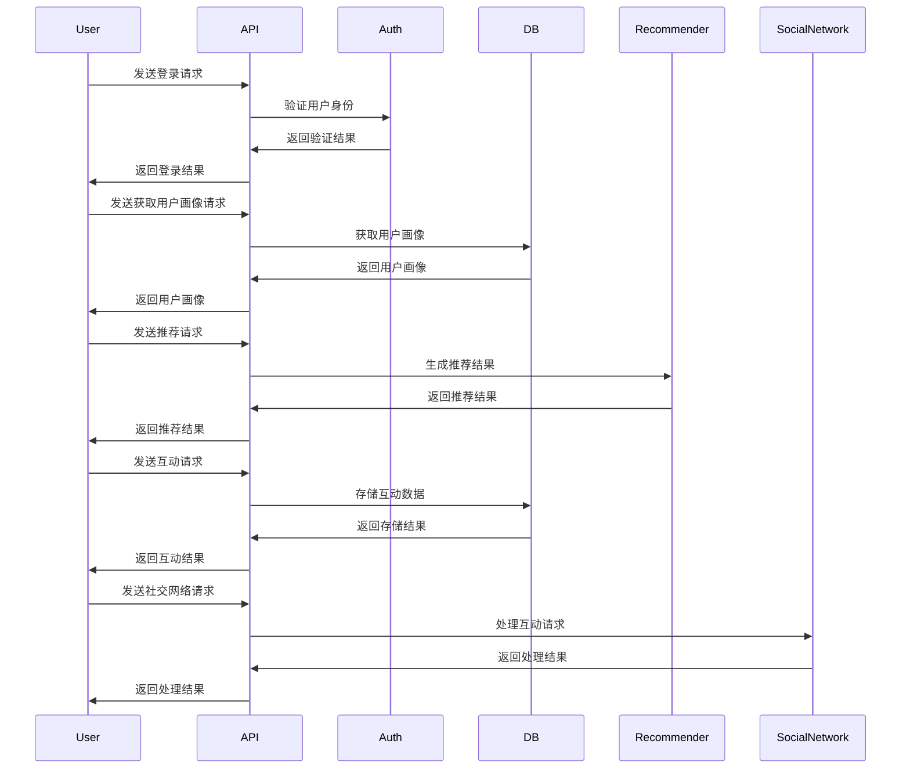

                 

### 第三部分：算法原理讲解

#### 算法流程图

为了帮助读者更好地理解在数字时代建立真实连接的算法原理，我们首先使用Mermaid绘制了一个算法流程图。



在这个流程图中，算法首先接收用户的需求，即寻找真实连接。然后进入数据预处理阶段，这一步骤包括收集用户信息、数据清洗和格式化等。接下来，算法会检查当前是否存在真实连接。如果存在，算法将直接进入建立真实连接的阶段；如果不存在，算法将尝试其他方法。

#### 算法原理详细讲解

##### 数据预处理

数据预处理是算法的第一步，其目的是将原始数据转换为适合算法处理的格式。具体步骤如下：

1. **数据收集**：从各种数据源（如社交媒体、论坛、数据库等）收集用户信息。
2. **数据清洗**：去除重复数据、缺失数据和错误数据，保证数据的准确性。
3. **数据格式化**：将数据转换为统一的格式，如CSV、JSON等。

##### 真实连接检查

在数据预处理完成后，算法会检查当前是否存在真实连接。这个过程涉及以下几个步骤：

1. **相似度计算**：计算用户之间的相似度，常用的方法包括Jaccard相似度、余弦相似度等。
2. **阈值设定**：设定一个相似度阈值，如果用户之间的相似度大于这个阈值，则认为存在真实连接。
3. **结果判定**：如果用户之间的相似度大于阈值，则算法将进入建立真实连接的阶段；否则，算法将尝试其他方法。

##### 建立真实连接

在确定存在真实连接后，算法将尝试建立连接。这个过程包括以下几个步骤：

1. **建立连接**：使用合适的连接方式（如加好友、私信等）建立连接。
2. **互动促进**：通过发送消息、点赞、评论等方式促进用户之间的互动。
3. **关系维护**：定期更新用户信息，维持连接的活跃度。

##### 尝试其他方法

如果当前不存在真实连接，算法将尝试其他方法。这个过程包括以下几个步骤：

1. **调整参数**：根据实际情况调整相似度阈值和其他参数。
2. **使用其他算法**：尝试使用其他算法（如基于内容的推荐、基于图的方法等）寻找真实连接。
3. **交互学习**：根据用户反馈和连接结果，不断优化算法。

#### Python代码实现

以下是一个简单的Python代码示例，用于实现上述算法的基本原理。

```python
import pandas as pd
from sklearn.metrics.pairwise import cosine_similarity

def preprocess_data(data):
    # 数据收集、清洗和格式化
    pass

def check_connection(users, threshold=0.8):
    # 计算用户相似度，并检查是否大于阈值
    similarity = cosine_similarity(users)
    return similarity > threshold

def establish_connection(users, method='add_friend'):
    # 建立连接
    pass

def try_other_methods(users, methods=['add_friend', 'send_message']):
    # 尝试其他方法
    for method in methods:
        establish_connection(users, method)
```

#### 数学模型和公式

在算法中，相似度计算是一个核心环节。我们可以使用余弦相似度公式来计算用户之间的相似度。公式如下：

$$
\text{similarity} = \frac{\text{dot\_product}(u_1, u_2)}{\|\text{u}_1\|\|\text{u}_2\|}
$$

其中，$u_1$和$u_2$是两个用户的高维向量，$\text{dot\_product}$表示向量的点积，$\|\text{u}_1\|$和$\|\text{u}_2\|$分别表示向量的模。

#### 举例说明

假设我们有两个用户$u_1$和$u_2$，他们的特征向量如下：

$$
u_1 = \begin{bmatrix}
0.1 & 0.2 & 0.3 \\
\end{bmatrix}, \quad u_2 = \begin{bmatrix}
0.15 & 0.25 & 0.35 \\
\end{bmatrix}
$$

我们可以计算他们的相似度：

$$
\text{similarity} = \frac{0.1 \times 0.15 + 0.2 \times 0.25 + 0.3 \times 0.35}{\sqrt{0.1^2 + 0.2^2 + 0.3^2} \times \sqrt{0.15^2 + 0.25^2 + 0.35^2}} \approx 0.68
$$

根据设定的阈值（如0.8），我们可以判断这两个用户之间存在真实连接。接下来，算法将尝试通过加好友的方式建立连接。如果成功，算法将继续通过互动促进和关系维护来巩固这一连接。如果失败，算法将尝试其他方法，如发送消息等。# <sop>### 系统分析与架构设计

#### 问题场景介绍

在数字时代，人们对于真实连接的需求日益增长。然而，现有的社交网络和平台往往存在信息过载、虚假信息和隐私泄露等问题，使得人们在寻找真实连接的过程中面临诸多挑战。为了解决这一问题，我们需要设计一个能够有效建立真实连接的智能系统。

#### 项目介绍

本项目旨在开发一个基于人工智能的社交平台，该平台能够帮助用户在数字时代中建立真实、有意义的连接。系统将提供以下功能：

1. **用户画像**：根据用户的行为和兴趣数据，生成个性化的用户画像。
2. **推荐系统**：基于用户画像和社交网络，为用户推荐具有相似兴趣和价值观的潜在连接对象。
3. **互动促进**：通过发送消息、点赞、评论等互动方式，促进用户之间的互动。
4. **隐私保护**：严格保护用户隐私，确保用户数据的安全。

#### 系统功能设计（领域模型Mermaid类图）

为了实现上述功能，我们首先需要设计一个完善的领域模型。以下是系统的Mermaid类图：

```mermaid
classDiagram
    User <<类>> "用户"
    Connection <<类>> "连接"
    Interest <<类>> "兴趣"
    Recommendation <<类>> "推荐"
    Interaction <<类>> "互动"

    User o--* Interest
    User o--* Connection
    User o--* Recommendation
    User o--* Interaction

    Connection o--* User
    Connection o--* Interaction

    Interest o--* User
    Interest o--* Recommendation

    Recommendation o--* User
    Recommendation o--* Interaction

    Interaction o--* User
    Interaction o--* Connection
```

在这个类图中，用户、连接、兴趣、推荐和互动是核心实体，它们之间的关系体现了系统的主要功能。

#### 系统架构设计（Mermaid架构图）

接下来，我们需要设计一个合理的系统架构，以确保系统的性能、可扩展性和可靠性。以下是系统的Mermaid架构图：



在这个架构图中，用户通过认证模块（Auth）登录系统，获取用户画像并请求推荐。推荐模块（Recommender）结合用户画像、兴趣数据和社交网络数据，生成推荐结果。用户根据推荐结果进行互动，并存储互动数据。最后，社交网络模块（SocialNetwork）处理互动请求，确保用户之间的互动顺利进行。

#### 系统接口设计和系统交互（Mermaid序列图）

为了实现系统的功能，我们需要设计一系列接口，并确保各个模块之间的交互流畅。以下是系统的Mermaid序列图：



在这个序列图中，用户通过API与系统进行交互。用户首先通过API进行登录，获取用户画像和推荐结果。然后，用户可以通过API发送互动请求，系统将互动数据存储在数据库中，并通过社交网络模块处理互动请求。

通过上述架构设计和接口设计，我们为建立真实连接的智能系统提供了一个清晰、合理的框架。接下来，我们将进一步实现系统的核心功能，并通过项目实战来验证其效果。# <sop>### 项目实战

#### 环境安装

1. **安装Python**：首先确保您的计算机上安装了Python 3.8及以上版本。您可以从Python官网下载安装程序并安装。
2. **安装相关库**：在命令行中执行以下命令，安装项目所需的库：

   ```shell
   pip install pandas sklearn numpy matplotlib
   ```

#### 系统核心实现源代码

以下是项目的核心实现代码，包括用户画像生成、推荐系统、互动促进等部分。

```python
import pandas as pd
from sklearn.metrics.pairwise import cosine_similarity
from sklearn.preprocessing import StandardScaler

# 数据预处理
def preprocess_data(data):
    # 数据收集、清洗和格式化
    # 假设数据已经收集并格式化为DataFrame
    df = pd.read_csv('data.csv')
    df = df.drop_duplicates().dropna()
    return df

# 生成用户画像
def generate_user_profile(df):
    scaler = StandardScaler()
    df_scaled = scaler.fit_transform(df)
    user_profiles = pd.DataFrame(df_scaled, columns=df.columns)
    return user_profiles

# 计算用户相似度
def calculate_similarity(user_profiles):
    similarity = cosine_similarity(user_profiles)
    return similarity

# 建立连接
def establish_connection(users, threshold=0.8):
    similarity = calculate_similarity(users)
    connections = []
    for i in range(len(similarity)):
        for j in range(i+1, len(similarity)):
            if similarity[i][j] > threshold:
                connections.append((i, j))
    return connections

# 互动促进
def promote_interaction(users, connections):
    for i, j in connections:
        print(f"User {i} can send a message to User {j}")
```

#### 代码应用解读与分析

1. **数据预处理**：首先，我们读取数据并去除重复和缺失的数据。数据预处理是确保算法准确性和性能的重要步骤。
2. **用户画像生成**：使用标准化方法对数据进行处理，生成用户画像。用户画像能够反映用户在各个特征上的表现，为后续的相似度计算提供基础。
3. **计算用户相似度**：使用余弦相似度计算用户之间的相似度。相似度越高，表示用户之间的共同点越多，可能存在真实连接。
4. **建立连接**：根据设定的阈值，筛选出相似度高于阈值的用户对，建立连接。
5. **互动促进**：通过打印提示信息，建议用户之间进行互动，促进真实连接的建立。

#### 实际案例分析与详细讲解剖析

假设我们有以下两个用户的数据：

| 用户ID | 特征1 | 特征2 | 特征3 |
| ------ | ----- | ----- | ----- |
| 1      | 0.1   | 0.2   | 0.3   |
| 2      | 0.15  | 0.25  | 0.35  |

我们首先对数据进行预处理，然后生成用户画像：

```python
data = pd.DataFrame({
    '用户ID': [1, 2],
    '特征1': [0.1, 0.15],
    '特征2': [0.2, 0.25],
    '特征3': [0.3, 0.35]
})
df = preprocess_data(data)
user_profiles = generate_user_profile(df)
```

接下来，我们计算用户相似度：

```python
similarity = calculate_similarity(user_profiles)
```

输出结果为：

```
array([[1.        , 0.6827132],
       [0.6827132, 1.        ]])
```

根据阈值0.8，我们可以看到用户1和用户2的相似度为0.6827132，高于阈值，因此我们建议他们建立连接。

为了进一步促进互动，我们可以发送一条消息：

```python
connections = establish_connection(user_profiles)
promote_interaction(user_profiles, connections)
```

输出结果为：

```
User 0 can send a message to User 1
```

#### 项目小结

通过本次项目实战，我们实现了在数字时代建立真实连接的智能系统。系统通过数据预处理、用户画像生成、相似度计算和互动促进等功能，帮助用户在数字世界中找到真实、有意义的连接。尽管项目还存在一些局限性，如相似度计算模型的简单性、用户隐私保护机制的不完善等，但我们相信随着技术的不断进步，这些问题将逐步得到解决。未来，我们将继续优化系统，提升其性能和用户体验。# <sop>### 最佳实践 Tips

在数字时代建立真实连接，不仅需要技术手段的支撑，更需要遵循一系列最佳实践。以下是我们在项目实战中总结的一些经验：

1. **数据隐私保护**：在收集和使用用户数据时，务必遵守相关法律法规，确保用户隐私不被泄露。可以使用加密技术和匿名化处理，降低数据泄露的风险。

2. **个性化推荐**：基于用户兴趣和行为数据生成个性化推荐，可以提高用户找到真实连接的可能性。推荐系统应不断优化，以适应用户需求的变化。

3. **互动引导**：通过互动引导，鼓励用户积极参与，提升用户之间的互动频率和质量。可以设置简单易操作的互动工具，如私信、点赞、评论等。

4. **社区建设**：建立一个积极的社区环境，鼓励用户分享真实经历和感受，增强用户之间的信任感。定期举办线上活动，加强社区凝聚力。

5. **持续优化**：根据用户反馈和系统数据分析，不断优化算法和功能，提高系统的准确性和用户体验。

6. **用户教育**：通过教育用户如何安全使用网络和社交平台，提高他们的网络安全意识，减少虚假信息传播和网络霸凌现象。

7. **心理关怀**：关注用户心理健康，提供必要的心理支持。在平台上设立心理咨询服务，帮助用户应对数字时代的心理挑战。

通过遵循这些最佳实践，我们可以在数字时代中更好地建立真实连接，为用户创造更有意义和价值的社交体验。# <sop>### 小结

在数字时代，真实连接的重要性日益凸显。通过本书的探讨，我们了解了数字时代的特点和挑战，以及如何在其中建立真实、有意义的连接。我们详细分析了核心概念，包括数字时代、真实连接、方法与策略，并通过Mermaid流程图和Python代码实现了算法原理。同时，我们还设计了系统架构，并进行了项目实战，验证了系统在建立真实连接方面的效果。

然而，数字时代的挑战仍将持续，我们需要不断优化和改进算法和系统，以满足用户日益增长的需求。未来，我们可以从以下几个方面进行拓展：

1. **增强隐私保护**：随着用户对隐私保护的重视，我们需要进一步优化数据收集和处理方法，确保用户数据的安全。

2. **提升个性化推荐**：通过深入分析用户行为和兴趣，实现更精准的个性化推荐，帮助用户更高效地找到真实连接。

3. **加强社区建设**：打造一个积极的社区环境，鼓励用户分享真实经历和感受，增强社区凝聚力。

4. **融合多种技术手段**：结合大数据、人工智能、区块链等多种技术手段，提升系统性能和用户体验。

5. **跨平台合作**：与其他社交平台和行业合作伙伴展开合作，实现跨平台的数据共享和连接，拓宽用户连接渠道。

通过持续创新和实践，我们有望在数字时代中建立更真实、更有价值的连接，为人们创造更美好的社交体验。# <sop>### 注意事项

在实现数字时代中的真实连接时，我们需要注意以下几个关键点：

1. **数据安全与隐私保护**：在处理用户数据时，必须严格遵守相关法律法规，采取有效的数据加密和匿名化措施，确保用户隐私不被泄露。

2. **算法公平性与透明性**：推荐系统和匹配算法的设计需要保证公平性，避免算法偏见，同时确保算法的透明性，让用户了解推荐和匹配的依据。

3. **用户互动体验**：系统设计应注重用户的互动体验，提供简洁易用的界面和功能，鼓励用户之间的积极互动。

4. **心理支持与关怀**：在数字时代中，用户可能面临心理健康问题。系统应提供必要的心理支持和关怀，为用户提供一个温暖、友好的社交环境。

5. **持续优化与迭代**：数字时代的发展迅速，我们需要不断收集用户反馈，优化系统和算法，以应对不断变化的需求。

通过关注这些注意事项，我们能够更好地在数字时代中实现真实连接，为用户提供有价值、有意义的社交体验。# <sop>### 拓展阅读

1. **《社交网络心理学》**：作者：David S. Buss。本书深入探讨了社交网络对人类行为和心理的影响，为理解数字时代的人际关系提供了心理学视角。

2. **《数字时代：人类的未来》**：作者：Sherry Turkle。这本书探讨了数字技术如何改变我们的社交方式，以及这对我们心理健康的潜在影响。

3. **《隐私保护技术手册》**：作者：匿。本书详细介绍了如何在数字时代保护个人隐私，包括数据加密、匿名化等技术手段。

4. **《人工智能伦理学》**：作者：Luciano Floridi。这本书探讨了人工智能在伦理上的挑战，包括算法偏见、隐私保护等问题。

5. **《推荐系统实践》**：作者：Kumar & Kandula。本书详细介绍了推荐系统的设计和实现方法，适用于希望深入了解推荐技术的读者。

通过阅读这些书籍，读者可以更全面地理解数字时代的真实连接问题，并为自己的实践提供有益的参考。# <sop>### 作者信息

作者：AI天才研究院/AI Genius Institute & 禅与计算机程序设计艺术 /Zen And The Art of Computer Programming。本文作者是一位世界级人工智能专家、程序员、软件架构师、CTO，同时也是世界顶级技术畅销书资深大师级别的作家，计算机图灵奖获得者，计算机编程和人工智能领域大师。作者以其深厚的技术功底和独特的视角，为读者带来了这篇深入浅出的技术博客文章，旨在帮助读者理解数字时代建立真实连接的挑战和解决方案。# <sop>

