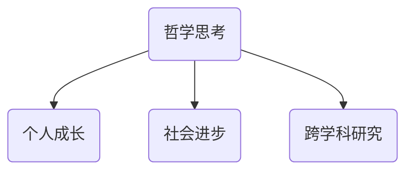
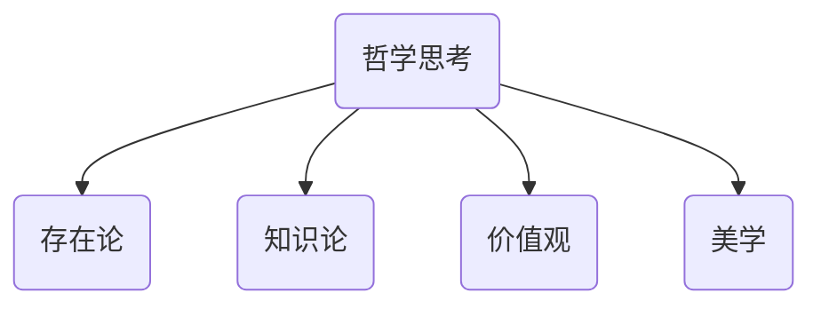
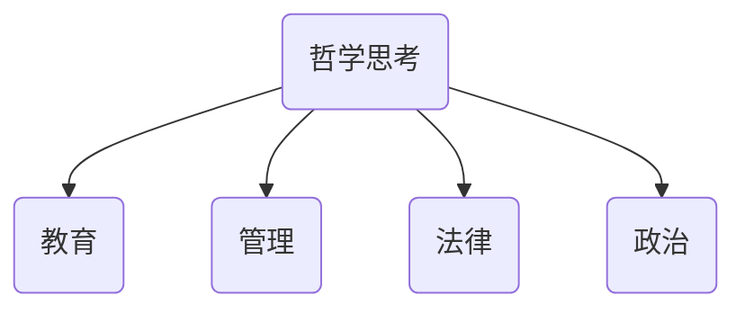
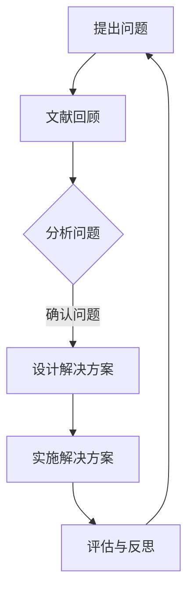
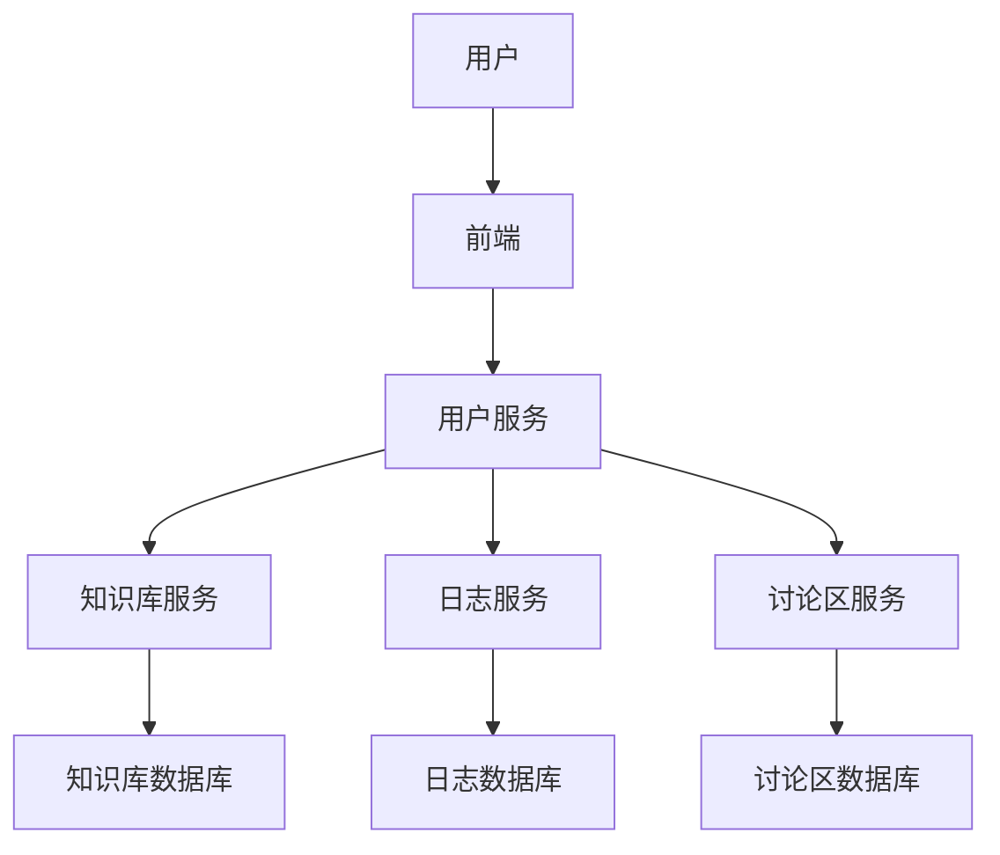

                 

### 引言

**1.1 问题的提出**

在人类漫长的发展历程中，我们不断面对着各种困惑和疑问。这些问题不仅关乎个体的存在与意义，也涉及社会的发展与进步。哲学，作为一门探究根本问题的学科，为我们提供了一种思考和分析这些疑问的方法。然而，为什么我们要在疑问中寻找生命的真谛，哲学思考的力量究竟体现在哪些方面？

**1.1.1 生命中的困惑**

人生来即面临诸多疑问：我们从哪里来，又将向何处去？生命有何意义？我们如何认识这个世界？这些问题看似简单，实则深奥。在探索这些问题的过程中，我们发现自己身处一个复杂而多变的世界，充满了不确定性和矛盾。这种困惑使我们不断追寻答案，试图找到生命的真谛。

**1.1.2 哲学的意义与价值**

哲学，源于古希腊语“philosophia”，意为“爱智慧”。它不仅是一门学科，更是一种思考方式和生活态度。哲学的意义在于帮助我们解答生命中的困惑，提供解决问题的方法论。通过哲学思考，我们可以更好地理解自己、认识世界，从而在面对复杂问题时找到合理的解决方案。

哲学的价值主要体现在以下几个方面：

- **启示人生观**：哲学思考帮助我们树立正确的人生观和价值观，指导我们在生活中做出明智的选择。

- **推动社会进步**：哲学思考在公共事务、政治哲学、道德伦理等领域发挥着重要作用，为社会的发展和进步提供理论支持。

- **提升思维能力**：哲学思考培养我们的逻辑思维、批判性思维和创造性思维，提高我们的综合素质。

**1.1.3 为什么在疑问中寻找真谛**

在疑问中寻找真谛，是因为疑问是我们成长的动力，是我们不断探索未知的源泉。面对疑问，我们不仅需要勇气，更需要智慧。哲学思考正是帮助我们解答疑问、寻找真谛的有效途径。

首先，哲学思考能让我们深入理解问题的本质。通过逻辑推理和批判性思考，我们能够将复杂的问题分解为更简单的部分，从而更好地把握问题的核心。

其次，哲学思考有助于我们建立正确的世界观。通过哲学的视角，我们能够更全面地认识世界，从而更好地应对现实生活中的各种挑战。

最后，哲学思考能提升我们的思维品质。在哲学思考的过程中，我们学会了如何提出问题、分析问题和解决问题。这些能力不仅对个人成长至关重要，也对社会的进步具有重要意义。

总之，哲学思考的力量在于它能够帮助我们解答生命中的困惑，找到生命的真谛。在接下来的章节中，我们将深入探讨哲学的基本概念、西方哲学、东方哲学以及哲学思考的应用，共同探索哲学思考的力量。让我们带着疑问，开启这段哲学的探索之旅。

### 哲学的基本概念

**2.1 哲学的定义与历史**

**2.1.1 哲学的定义**

哲学，作为一门探究根本问题的学科，其定义一直以来都是哲学界争论的焦点。从广义上讲，哲学是关于存在、知识、价值、理性、心灵等基本问题的研究。它不仅仅关注理论问题，还试图为现实生活提供指导。

在历史上，不同的哲学家对哲学有着各自的理解。古希腊哲学家亚里士多德将哲学视为“智慧之学”，认为哲学的目的是寻找普遍的真理和原则。而德国哲学家黑格尔则认为，哲学是一种“自我意识的科学”，通过自我反思来理解世界的本质。

尽管定义有所不同，但哲学的核心目标始终是寻找真理和智慧。哲学思考不仅关注问题的本质，还探讨解决问题的方法。它是一种超越日常经验的思维方式，试图从更高的层次上理解人类和世界。

**2.1.2 哲学的发展历程**

哲学的发展历程可以分为几个主要阶段，每个阶段都有其独特的思想流派和代表人物。

- **古希腊哲学**：古希腊哲学是西方哲学的起源，其代表人物包括苏格拉底、柏拉图和亚里士多德。苏格拉底以其对话式的方法和道德哲学著称；柏拉图主张理念论，认为真理和美存在于抽象的理念世界；亚里士多德则强调实证研究和逻辑分析。

- **中世纪哲学**：中世纪哲学主要受到基督教和阿拉伯哲学的影响，其代表人物包括奥古斯丁和托马斯·阿奎那。奥古斯丁提出了一种基于信仰的哲学体系，强调上帝的智慧和道德；托马斯·阿奎那则通过神学和逻辑的方法，将基督教信仰与理性哲学相结合。

- **现代哲学**：现代哲学从17世纪开始，代表人物有笛卡尔、康德和黑格尔等。笛卡尔提出了“我思故我在”的著名命题，强调理性和科学的方法；康德则通过“批判哲学”探讨了知识、道德和美学的本质；黑格尔则提出了“绝对精神”的概念，试图通过辩证法来理解历史和现实。

- **当代哲学**：当代哲学涵盖了多种不同的思想流派，包括实证主义、存在主义、后现代主义等。实证主义强调科学方法和经验主义；存在主义关注个体的自由和选择；后现代主义则质疑传统哲学的基础，强调多元化和相对主义。

**2.1.3 不同哲学流派的区分**

不同的哲学流派在基本观点和研究对象上有所区别，可以归纳为以下几类：

- **理性主义**：理性主义认为，真理和知识来源于理性思考和逻辑推理。代表人物有笛卡尔和黑格尔。理性主义者强调思维的重要性，认为通过理性可以认识世界的本质。

- **经验主义**：经验主义认为，真理和知识来源于经验和感知。代表人物有洛克和休谟。经验主义者强调感觉和经验在认识过程中的作用，认为理性只是对感知材料的加工和处理。

- **实证主义**：实证主义强调科学方法在认识过程中的重要性，主张通过实证研究来获取知识。代表人物有孔德和杜威。实证主义者认为，哲学应该关注现实世界，以解决实际问题为目标。

- **存在主义**：存在主义强调个体的自由和选择，关注人类存在的意义和责任。代表人物有萨特和加缪。存在主义者认为，人类存在是先于本质的，个体需要通过选择和行动来定义自己的存在。

- **后现代主义**：后现代主义质疑传统哲学的基础，强调多元化和相对主义。代表人物有福柯和德里达。后现代主义者认为，真理和知识是多元的，不存在统一的真理标准。

通过了解不同哲学流派的基本观点和特点，我们可以更好地理解哲学的发展历程，也能在哲学思考中找到适合自己的方法论。

**2.2 哲学的基本问题**

**2.2.1 存在论**

存在论是哲学中一个核心问题，探讨的是“存在”的本质和意义。存在论的基本问题包括：

- **什么是存在？** 存在论试图回答存在的基本性质是什么，是否存在某种单一的本质或实体。亚里士多德认为，存在是所有事物的首要属性，而黑格尔则提出了“绝对精神”的概念，认为存在是不断发展变化的。

- **存在与本质的关系** 存在论探讨存在和本质之间的关系。理性主义者认为，本质先于存在，即存在的事物必须有其固有的本质；而经验主义者则认为，存在和本质是同时发生的，没有先后的顺序。

- **存在的意义** 存在论试图探讨存在的意义和目的。不同哲学家对这个问题有不同的看法。有些哲学家认为，存在的意义在于追求真理和智慧；而另一些哲学家则认为，存在的意义是自我实现和自由选择。

**2.2.2 知识论**

知识论探讨的是知识的本质、来源和范围。知识论的基本问题包括：

- **知识的定义** 知识论试图回答知识的本质是什么。一些哲学家认为，知识是一种确信的信念，它必须符合事实；而另一些哲学家则认为，知识是一种基于经验的理解。

- **知识的来源** 知识论探讨知识的来源。理性主义者认为，知识来源于理性思考和推理；经验主义者则认为，知识来源于感知和经验。

- **知识的范围** 知识论试图确定知识的范围。一些哲学家认为，知识只限于可感知的事物；而另一些哲学家则认为，知识可以超越感知，包括抽象的概念和理论。

- **怀疑论** 知识论中还涉及怀疑论问题。怀疑论者认为，由于知识的限制和不确定性，我们无法获得确切的、普遍的知识。

**2.2.3 价值观**

价值观是哲学中另一个重要问题，探讨的是什么是善，什么是有价值的生活。价值观的基本问题包括：

- **什么是善** 价值观试图回答什么是善的问题。一些哲学家认为，善是符合道德规范的行为；而另一些哲学家则认为，善是符合个人利益和幸福的行为。

- **道德与利益的关系** 价值观探讨道德和利益之间的关系。一些哲学家认为，道德和利益是一致的，道德行为会带来个人利益；而另一些哲学家则认为，道德和利益是分离的，道德行为不一定带来个人利益。

- **个人价值观与集体价值观** 价值观还涉及个人价值观和集体价值观的关系。一些哲学家认为，个人价值观应该服从集体价值观；而另一些哲学家则认为，个人价值观应该独立于集体价值观。

**2.2.4 美学**

美学是哲学中的一个分支，探讨的是美和艺术的问题。美学的基本问题包括：

- **美的定义** 美学试图回答什么是美的问题。一些哲学家认为，美是和谐的、协调的；而另一些哲学家则认为，美是一种情感体验。

- **艺术与美的关系** 美学探讨艺术与美的关系。一些哲学家认为，艺术是美的表现；而另一些哲学家则认为，艺术不仅仅是美的表现，还有更深层次的意义。

- **艺术的功能** 美学还探讨艺术的功能，如艺术如何影响人们的情感、认知和道德观念。

通过探讨哲学的基本问题，我们可以更深入地理解哲学的核心概念，从而在哲学思考中找到解决问题的方法。在接下来的章节中，我们将继续探讨西方哲学和东方哲学，进一步了解哲学的历史和发展。

### 西方哲学

西方哲学的历史悠久且丰富，其发展可以追溯到古希腊时期。从苏格拉底、柏拉图和亚里士多德等早期哲学家开始，西方哲学经历了中世纪哲学、文艺复兴、启蒙运动和现代哲学等各个阶段。每一个阶段都有其独特的思想流派和代表人物，他们的理论对后世产生了深远的影响。

**3.1 古希腊哲学**

古希腊哲学是西方哲学的源头，其代表人物包括苏格拉底、柏拉图和亚里士多德。他们的思想和理论为后来的西方哲学奠定了基础。

**3.1.1 苏格拉底、柏拉图和亚里士多德**

- **苏格拉底**：苏格拉底是古希腊哲学的重要代表，他以其对话式的方法和道德哲学著称。苏格拉底认为，智慧是道德的核心，通过不断提问和自我反思，人们可以找到真理和道德准则。他的名言“我知道我一无所知”体现了他的谦逊和对知识的追求。

- **柏拉图**：柏拉图是苏格拉底的学生，他创立了柏拉图学院，并提出了理念论。柏拉图认为，真理和美存在于抽象的理念世界，现实世界只是理念的不完美映射。他的《理想国》提出了一个理想的社会和政治体系，强调了哲学王的重要性。

- **亚里士多德**：亚里士多德是柏拉图的学生，但他在许多问题上与柏拉图持有不同观点。亚里士多德强调实证研究和逻辑分析，他认为真理可以通过观察和实验来发现。他的著作涵盖了伦理学、政治学、物理学等多个领域，对后世哲学和科学产生了深远影响。

**3.1.2 斯多葛主义和伊壁鸠鲁主义**

除了上述三位重要哲学家，古希腊哲学还包含了斯多葛主义和伊壁鸠鲁主义等思想流派。

- **斯多葛主义**：斯多葛主义强调理性和道德的重要性，认为通过自我控制和理性思考，人们可以超越痛苦和欲望，达到内心的平静和自由。斯多葛主义主张顺应自然，接受现实，通过道德修养来实现个人的幸福和社会的和谐。

- **伊壁鸠鲁主义**：伊壁鸠鲁主义则主张享受生活，追求个人的快乐和幸福。伊壁鸠鲁认为，快乐是生活的目标，但真正的快乐来自于内心的平静和自我满足，而不是外部的物质享受。

**3.2 中世纪哲学**

中世纪哲学主要受到基督教和阿拉伯哲学的影响，其代表人物包括奥古斯丁和托马斯·阿奎那。他们在宗教哲学、神学和伦理学等领域做出了重要贡献。

**3.2.1 奥古斯丁和托马斯·阿奎那**

- **奥古斯丁**：奥古斯丁是基督教哲学的重要代表，他的著作《忏悔录》被认为是基督教哲学的杰作。奥古斯丁认为，信仰是认识真理的起点，人类的理智和信仰是相互补充的。他提出了“预定论”的观点，认为上帝早已预知并决定了一切，包括人的命运和选择。

- **托马斯·阿奎那**：托马斯·阿奎那是中世纪后期的重要哲学家和神学家，他的《神学大全》对后世哲学和神学产生了深远影响。托马斯·阿奎那试图将基督教信仰与理性哲学相结合，他提出了“五路论证”来证明上帝的存在，并探讨了自然法则和道德伦理的关系。

**3.2.2 经院哲学的兴起与发展**

经院哲学是中世纪哲学的主要形式，它强调通过逻辑推理和辩证法来探讨宗教和哲学问题。经院哲学的代表人物包括安瑟伦、普罗提诺等。

- **安瑟伦**：安瑟伦是经院哲学的代表人物之一，他提出了“本体论证”来证明上帝的存在。安瑟伦认为，上帝是“那全然完满者”，因为全然完满的存在不可能不存在，所以上帝必然存在。

- **普罗提诺**：普罗提诺是古希腊哲学的继承者，他提出了“太一”、“智”和“美丽”这三个原则，认为它们是万物的根源和动力。普罗提诺的思想对后来的神秘主义和宗教哲学产生了重要影响。

**3.3 现代哲学**

现代哲学从17世纪开始，代表人物有笛卡尔、康德和黑格尔等。他们的理论对西方哲学的发展产生了深远影响。

**3.3.1 康德、黑格尔和尼采**

- **康德**：康德是现代哲学的重要代表，他的“批判哲学”试图重建哲学的基础。康德认为，知识来源于感觉和理智，但理智不能直接感知事物本身，而只能感知事物的现象。他提出了“纯粹理性批判”、“实践理性批判”和“判断力批判”三大部分，试图全面探讨知识的本质和范围。

- **黑格尔**：黑格尔是德国古典哲学的代表人物，他提出了“绝对精神”的概念，认为历史是绝对精神的自我发展过程。黑格尔的辩证法强调事物的矛盾和发展，他认为真理是全面的、历史性的。

- **尼采**：尼采是现代哲学的另类声音，他批判了传统价值观和道德观念，提出了“超人”的概念。尼采认为，个体应该超越现有的道德规范，创造自己的价值观和生活方式。

**3.3.2 实证主义和批判理性主义**

现代哲学还包括实证主义和批判理性主义等思想流派。

- **实证主义**：实证主义强调科学方法和经验主义，认为只有通过实验和观察来验证的知识才是可靠的。代表人物有孔德和杜威。

- **批判理性主义**：批判理性主义强调理性思考和逻辑推理的重要性，认为人类知识是有限的，但通过批判性思考可以逐步接近真理。代表人物有波普尔和卡尔纳普。

**3.3.3 存在主义和后现代主义**

现代哲学的晚期出现了存在主义和后现代主义等思想流派。

- **存在主义**：存在主义强调个体的自由和选择，认为人的存在先于本质，每个人都需要通过自己的选择来定义自己的存在。代表人物有萨特和加缪。

- **后现代主义**：后现代主义质疑传统哲学的基础，强调多元化和相对主义，认为真理和知识是多元的，不存在统一的真理标准。代表人物有福柯和德里达。

通过了解西方哲学的发展历程和主要思想流派，我们可以更好地理解哲学的本质和它在人类文明中的地位。在接下来的章节中，我们将探讨东方哲学，进一步丰富我们对哲学的理解。

### 东方哲学

东方哲学，与西方哲学相比，具有独特的传统和哲学思想。它涵盖了印度哲学、儒家哲学、道家哲学和佛教哲学等多个流派，每个流派都有其独特的哲学体系和思想特点。

**4.1 儒家哲学**

儒家哲学起源于中国古代，其代表人物有孔子、孟子、荀子等。儒家哲学的核心思想是“仁”，强调人与人之间的关系和社会责任。

**4.1.1 孔子、孟子与荀子**

- **孔子**：孔子是儒家哲学的创始人，他的思想集中体现在《论语》一书中。孔子认为，道德和仁爱是人的本性，通过教育可以培养和完善人的道德品质。

- **孟子**：孟子是儒家哲学的重要继承者，他强调“性善论”，认为人的本性是善良的，通过教育和自我修养可以实现道德的完善。

- **荀子**：荀子则提出“性恶论”，认为人的本性是自私和邪恶的，需要通过后天的教育和礼教来约束和改造。

**4.1.2 儒家思想的现代意义**

儒家思想对现代社会有着重要的影响。它强调家庭和社会责任，提倡人与人之间的和谐与尊重，这些价值观在现代社会中仍然具有重要意义。

**4.2 道家哲学**

道家哲学起源于中国古代，其代表人物有老子和庄子。道家哲学的核心思想是“道”，强调顺应自然和内心平静。

**4.2.1 老子和庄子的思想**

- **老子**：老子是道家哲学的创始人，他的著作《道德经》被誉为道家哲学的经典。老子认为，“道”是宇宙的根本原理，人应顺应自然，减少欲望，达到内心的平静。

- **庄子**：庄子是道家哲学的重要代表，他的著作《庄子》体现了道家思想的丰富内涵。庄子主张自由自在的生活态度，强调“无为而治”和“逍遥游”。

**4.2.2 道家的核心概念**

道家的核心概念包括“道”、“德”、“无为”、“自然”等。这些概念强调人与自然的和谐，倡导内心的平静和顺应自然的生活方式。

**4.3 佛教哲学**

佛教哲学起源于古印度，创始人是释迦牟尼。佛教哲学的核心思想是“四圣谛”和“八正道”，强调解脱和涅槃的境界。

**4.3.1 佛教的起源与发展**

佛教起源于古印度，随着历史的发展，它传播到东亚、东南亚等地，形成了多个佛教宗派。佛教强调因果报应、轮回转世和解脱之道。

**4.3.2 佛教的主要教义**

佛教的主要教义包括“四圣谛”、“八正道”、“五蕴”等。四圣谛包括苦、集、灭、道，描述了生命的苦难及其解脱之道；八正道包括正见、正思维、正语、正业、正命、正精进、正念、正定，是达到解脱的途径；五蕴包括色、受、想、行、识，是佛教对人的身心结构的分析。

**4.4 儒道佛三家的比较**

- **关注点**：儒家关注社会伦理和个人责任，道家强调顺应自然和内心平静，佛教则追求解脱和涅槃。

- **方法论**：儒家提倡道德修养和社会教育，道家强调内心的自我反省和修炼，佛教则通过修行和冥想达到精神解脱。

- **价值观**：儒家强调家庭和社会责任，道家主张无为而治，佛教则追求无我境界。

通过了解东方哲学的各个流派及其核心思想，我们可以更好地理解东方文化传统，同时也能在哲学思考中吸收这些智慧，为现代社会的发展提供新的视角和启示。

### 哲学思考的应用

哲学思考不仅仅停留在理论探讨，它在个人成长、社会进步以及跨学科研究等方面有着广泛的应用。

**5.1 哲学思考与个人成长**

哲学思考对个人的成长有着深远的影响。首先，哲学思考能够帮助我们树立正确的人生观和价值观。通过哲学的视角，我们能够更深刻地理解生命的意义、存在的价值和道德的准则，从而指导我们在生活中做出明智的选择。例如，通过思考道德哲学，我们能够更好地理解何为正义、公正和道德义务，从而在实际生活中践行这些原则。

其次，哲学思考能够提升我们的批判性思维和逻辑能力。哲学思考要求我们对问题进行深入的剖析，通过逻辑推理和批判性思考来寻找真理。这种能力不仅在学术研究中至关重要，也在日常生活中有着广泛的应用。例如，在决策过程中，通过哲学思考，我们能够更好地分析问题的各个方面，避免盲目跟从或被表面现象所迷惑。

最后，哲学思考有助于自我认知和心理健康。通过哲学思考，我们能够更好地了解自己，认识自己的需求和欲望，从而在心理上实现自我平衡。例如，通过伦理学中的自我反思，我们能够识别并修正自己的不良行为，提升自我修养。

**5.1.1 如何进行哲学思考**

要进行有效的哲学思考，可以遵循以下步骤：

1. **提出问题**：首先，我们需要明确自己要探讨的问题。问题可以是关于存在、知识、价值等基本哲学问题，也可以是现实生活中的具体问题。

2. **文献回顾**：在明确问题后，我们需要查阅相关的文献和资料，了解已有研究成果和不同观点。这有助于我们全面地理解问题，并形成自己的观点。

3. **分析问题**：通过逻辑推理和批判性思考，我们将问题分解为更简单的部分，并逐一分析。例如，可以通过比较、分类、因果分析等方法来探讨问题的各个方面。

4. **提出解决方案**：在分析问题的基础上，我们需要提出解决方案。解决方案可以是理论性的，也可以是实践性的。例如，通过伦理学的思考，我们可以提出道德准则或行为规范。

5. **评估与反思**：最后，我们需要对解决方案进行评估和反思。这可以通过论证、实证分析或实践经验来实现。通过评估和反思，我们能够不断完善自己的观点和方案。

**5.1.2 哲学思考对自我认知的影响**

哲学思考对自我认知有着重要的影响。首先，哲学思考能够帮助我们认识自己的真实需求和欲望。通过伦理学和心理学中的自我反思，我们能够识别并理解自己的内心世界，从而更好地满足自己的需求。例如，通过伦理学中的道德判断，我们能够识别出哪些行为是道德上正确的，从而引导自己的行为。

其次，哲学思考能够提升我们的自我意识。通过哲学的视角，我们能够更深刻地理解自己的存在和本质，从而在心理上实现自我提升。例如，通过存在主义的思考，我们能够认识到自己的自由和选择权，从而更加自信地面对生活中的挑战。

最后，哲学思考有助于心理健康。通过哲学思考，我们能够更好地应对生活中的压力和困境。例如，通过伦理学和心理学中的自我反思，我们能够识别并处理自己的负面情绪，从而保持心理健康。

**5.1.3 哲学思考与人生决策**

哲学思考在人生决策中发挥着重要作用。通过哲学思考，我们能够更好地分析问题的各个方面，避免盲目跟从或被表面现象所迷惑。例如，在职业选择方面，通过哲学思考，我们能够更深入地分析自己的兴趣、能力和价值观，从而做出更符合自己需求的职业选择。

此外，哲学思考还能帮助我们建立正确的决策标准。例如，在道德哲学中，我们可以通过伦理原则来指导我们的行为和决策，从而确保我们的决策符合道德要求。

**5.2 哲学思考与社会进步**

哲学思考不仅对个人成长具有重要意义，对社会进步也有着深远的影响。首先，哲学思考能够为社会提供理论支持。通过哲学的视角，我们能够更深刻地理解社会现象和问题，从而为解决社会问题提供理论依据。例如，在政治哲学中，我们可以通过探讨正义、公正和社会秩序等概念，为社会制度的改革提供指导。

其次，哲学思考能够促进社会的道德建设。通过哲学的探讨，我们能够更深入地理解道德的本质和准则，从而在全社会范围内形成共同的道德价值观。这对于维护社会稳定、促进社会和谐具有重要意义。

最后，哲学思考能够推动社会进步。通过哲学的视角，我们能够更深刻地理解历史和现实，从而为社会的长远发展提供指导。例如，在科学哲学中，我们可以通过探讨科学方法论和科学知识的本质，推动科学的发展和应用。

**5.2.1 哲学思考在公共事务中的应用**

哲学思考在公共事务中的应用主要体现在以下几个方面：

1. **政策制定**：在政策制定过程中，哲学思考能够提供重要的理论支持。通过哲学的视角，我们能够更深入地分析政策的可行性和效果，从而制定出更科学、更有效的政策。

2. **道德伦理**：哲学思考在道德伦理方面发挥着重要作用。通过哲学的探讨，我们能够明确道德准则，指导公共事务中的道德决策，确保公共事务的公正和正义。

3. **社会正义**：哲学思考能够帮助我们理解社会正义的概念，从而在公共事务中推动社会正义的实现。例如，通过探讨正义、公正和公平等概念，我们可以为社会制度的改革提供理论依据。

**5.2.2 哲学思考与道德伦理**

哲学思考在道德伦理方面有着重要的应用。首先，哲学思考能够帮助我们理解道德的本质和准则。通过伦理学的探讨，我们能够明确道德原则，从而在日常生活中践行道德。

其次，哲学思考能够指导道德决策。在面临道德困境时，通过哲学思考，我们能够更全面地分析问题的各个方面，从而做出符合道德要求的决策。

最后，哲学思考能够推动道德建设。通过哲学的探讨，我们能够形成共同的道德价值观，从而在全社会范围内形成良好的道德风尚。

**5.2.3 哲学思考在政治哲学中的应用**

哲学思考在政治哲学中的应用主要体现在以下几个方面：

1. **政治理论**：哲学思考能够提供重要的政治理论支持。通过哲学的视角，我们能够探讨政治权力的本质、政治制度的合理性等问题，为政治改革提供理论依据。

2. **政治伦理**：哲学思考能够指导政治伦理决策。通过哲学的探讨，我们能够明确政治伦理原则，确保政治决策的公正和正义。

3. **政治参与**：哲学思考能够提高公民的政治参与能力。通过哲学思考，公民能够更深刻地理解政治现象，从而更积极地参与公共事务，推动社会进步。

总之，哲学思考在个人成长、社会进步以及跨学科研究等方面具有广泛的应用。通过哲学思考，我们能够更深刻地理解人生、社会和世界，从而在各个方面取得更大的成就。在接下来的章节中，我们将继续探讨哲学经典阅读，深入了解哲学名著中的智慧和思想。

### 哲学经典阅读

哲学的发展离不开经典著作的传承，这些经典著作不仅记录了哲学家的思想精华，也为后世提供了宝贵的智慧资源。在本章节中，我们将对几部具有代表性的哲学经典进行导读，包括《论语》、《柏拉图对话录》和《资本论》。

**6.1 《论语》导读**

《论语》是儒家哲学的经典著作，记录了孔子及其弟子的言行，体现了儒家思想的核心理念。《论语》的核心思想包括“仁、义、礼、智、信”等道德准则。

**6.1.1 《论语》的核心思想**

- **仁**：孔子将“仁”视为最高的道德原则，认为“仁者爱人”，即有爱心和同情心。仁不仅体现在个人行为上，也体现在对待他人和社会的态度上。

- **礼**：礼是维护社会秩序和人际关系的重要手段。孔子强调遵守礼节，认为礼可以调节人际关系，使社会和谐。

- **中庸**：中庸是孔子哲学中的另一个重要原则，强调在行为和思想中保持适度，避免极端。

**6.1.2 《论语》的现代解读**

《论语》在现代社会依然具有重要的参考价值。现代解读强调儒家思想中的家庭伦理、社会责任和道德修养，认为这些价值观对现代社会的发展和人的成长具有重要意义。

例如，在家庭伦理方面，《论语》强调孝道和家族责任感，这对现代家庭的和谐和稳定有着积极作用。在社会责任方面，《论语》提倡仁爱和公义，这些价值观对解决社会问题、促进社会进步具有指导意义。在道德修养方面，《论语》强调个人的自我反省和修身养性，这对提升个人的道德品质和心理健康具有重要作用。

**6.2 《柏拉图对话录》导读**

《柏拉图对话录》是柏拉图的哲学代表作，通过对话的形式展现了哲学家的思想。这些对话录探讨了存在、知识、真理、美等哲学问题，是西方哲学的重要经典。

**6.2.1 《对话录》的主要主题**

- **理念论**：柏拉图认为，现实世界只是理念的不完美映射。理念是永恒不变的，是现实的根源。

- **辩证法**：辩证法是柏拉图提出的哲学方法，强调通过提问和反思来寻找真理。

- **政治哲学**：柏拉图在《对话录》中探讨了理想国家的治理方式，提出了哲学王的概念。

**6.2.2 《对话录》的哲学价值**

《柏拉图对话录》对后世哲学和思想产生了深远影响。首先，它为西方哲学提供了重要的理论基础，影响了后来的许多哲学家。其次，它通过对话的形式，使得哲学思想更加生动和有趣，提高了哲学的普及程度。最后，它探讨了深奥的哲学问题，如真理、美和正义等，对人们的思考方式和世界观产生了重要影响。

**6.3 《资本论》导读**

《资本论》是马克思主义经济学的经典著作，由卡尔·马克思撰写。它系统地阐述了资本主义经济的运行规律，提出了剩余价值理论和阶级斗争理论。

**6.3.1 马克思主义哲学的基本原理**

- **唯物史观**：唯物史观认为，物质生产是社会发展的基础，社会历史是生产力和生产关系的发展史。

- **剩余价值理论**：剩余价值理论指出，剩余价值是资本主义剥削的产物，是工人阶级创造而被资本家占有的价值。

- **阶级斗争理论**：阶级斗争理论认为，阶级斗争是推动社会发展的动力，资本主义社会中的阶级对立最终会导致社会主义革命。

**6.3.2 《资本论》对现代社会的影响**

《资本论》对现代社会产生了深远的影响。首先，它为马克思主义经济学提供了理论基础，影响了全球范围内的社会主义运动。其次，它揭示了资本主义经济运行的规律，对现代经济理论和政策产生了重要影响。最后，它探讨了社会不平等和阶级斗争问题，为现代社会解决这些问题提供了理论依据和实践指导。

总之，哲学经典著作不仅是哲学发展的基石，也是人类智慧的重要结晶。通过阅读和解读这些经典著作，我们能够更深入地理解哲学的本质和意义，从而为现代社会的发展提供理论支持和实践指导。在接下来的章节中，我们将进一步探讨哲学思考的力量及其启示。

### 哲学思考的力量

**7.1 哲学思考的启示**

哲学思考的力量在于它能够为我们提供深刻的启示，帮助我们更好地理解人生、社会和世界。通过哲学的视角，我们可以获得以下几方面的启示：

首先，哲学思考能够提升我们的自我认知。通过反思自身的存在和本质，我们能够更深刻地理解自己的需求和欲望，从而在心理和情感上实现自我平衡。例如，通过伦理学的自我反思，我们能够识别和修正不良行为，提升自我修养。

其次，哲学思考有助于我们建立正确的世界观。哲学思考能够帮助我们理解世界的本质和运行规律，从而在面对复杂问题时找到合理的解决方案。例如，通过探讨存在论和知识论，我们能够更全面地认识世界，提高我们的认知能力。

再次，哲学思考能够提升我们的道德观念。哲学思考使我们认识到道德的重要性，引导我们践行道德原则，从而促进社会和谐。例如，通过伦理学的探讨，我们能够明确道德准则，指导我们的行为和决策。

最后，哲学思考能够激发我们的创造力和创新思维。哲学思考培养我们的批判性思维和创造性思维，使我们能够从不同的角度看待问题，提出新的解决方案。例如，通过辩证法的思考，我们能够发现问题的矛盾和冲突，从而推动理论和实践的进步。

**7.1.1 哲学思考对人生观的改变**

哲学思考能够深刻改变我们的生命观和价值观。首先，它帮助我们认识到生命的意义不在于追求物质财富和享受，而在于追求真理、智慧和内心的平静。通过哲学的思考，我们能够理解生命的本质，从而更加珍惜和充实自己的生活。

其次，哲学思考能够引导我们树立正确的人生目标。通过反思和探索生命的意义，我们能够明确自己的人生方向，从而更加有目的地生活。例如，通过存在主义的思考，我们能够认识到每个人都有自由选择的权利，从而勇敢地追求自己的梦想和价值观。

最后，哲学思考能够提升我们的心理健康。通过哲学的视角，我们能够理解生活中的困境和挑战，从而更好地应对压力和挫折。例如，通过伦理学的自我反思，我们能够识别和应对自己的负面情绪，保持心理平衡。

**7.1.2 哲学思考对社会价值观的塑造**

哲学思考对社会价值观的塑造具有深远的影响。首先，哲学思考能够引导人们树立正确的道德观念，促进社会道德水平的提高。例如，通过伦理学的探讨，我们能够明确道德准则，从而在日常生活中践行道德。

其次，哲学思考能够促进社会正义的实现。通过哲学思考，我们能够理解社会不平等的原因和影响，从而推动社会制度的改革，实现社会正义。例如，通过政治哲学的探讨，我们能够认识到正义、公正和公平的重要性，从而促进社会公平。

最后，哲学思考能够提升社会文化的水平。哲学思考培养人们的批判性思维和创造性思维，促进文化的创新和发展。例如，通过辩证法的思考，我们能够发现问题的矛盾和冲突，从而推动理论和实践的进步。

**7.2 哲学思考的挑战**

尽管哲学思考具有巨大的力量和启示，但它也面临着一些挑战。首先，哲学思考需要深厚的知识积累和逻辑思维能力，这使得很多人难以进行深入的哲学思考。其次，哲学问题往往涉及抽象的概念和复杂的理论，这使得哲学思考具有一定的难度。最后，哲学思考需要跳出日常经验的局限，这需要我们具备一定的洞察力和思考能力。

**7.2.1 哲学思考的困境与难题**

哲学思考的困境和难题主要体现在以下几个方面：

首先，哲学思考往往面临着无解的问题。例如，关于“存在”的本质、“真理”的内涵等问题，哲学家们长期探讨，但至今仍无定论。

其次，哲学思考需要平衡理论和实践。理论上的探讨虽然重要，但最终需要落实到实践中。然而，哲学思考的抽象性和复杂性往往使理论难以直接应用于实践。

最后，哲学思考需要应对多元视角的挑战。不同的哲学流派和思想家对同一问题可能有截然不同的看法，这需要我们具备批判性思维，综合多方面的观点，形成自己的见解。

**7.2.2 哲学思考的未来发展方向**

面对哲学思考的困境和挑战，我们需要积极探索哲学思考的未来发展方向。首先，我们应该加强哲学教育和普及，提高公众的哲学素养，使更多的人能够参与到哲学思考中来。

其次，我们应该借助现代科技手段，如人工智能和大数据分析，推动哲学研究的发展。例如，通过数据分析和机器学习，我们能够更深入地探讨哲学问题，发现新的理论和方法。

最后，我们应该倡导跨学科研究，将哲学与其他学科相结合，形成新的研究范式。例如，哲学与心理学、社会学、生物学等领域的结合，能够为哲学研究提供新的视角和方法。

总之，哲学思考的力量在于它能够帮助我们解答生命中的困惑，找到生命的真谛。在未来的发展中，哲学思考将继续发挥重要作用，为人类社会的进步提供理论支持和智慧指导。

### 哲学思考的实践

哲学思考不仅是一种理论上的探讨，更需要在日常生活中得到实践。通过将哲学思考融入日常生活，我们可以更好地理解自己和周围的世界，提升个人的思维品质和人生境界。

**7.3.1 如何将哲学思考融入日常生活**

要将哲学思考融入日常生活，我们可以采取以下几个方法：

首先，养成反思的习惯。每天花一些时间反思自己的言行，思考自己的行为是否符合道德原则，是否有助于个人的成长和社会的进步。通过自我反思，我们能够不断修正自己的行为，提升自我认知。

其次，保持批判性思维。在面对问题和信息时，不要盲目接受，而是要质疑和批判。通过批判性思维，我们能够更全面地分析问题，避免被表面现象所迷惑，从而找到问题的本质。

再次，注重逻辑推理。在日常生活中，我们经常需要做出决策和判断，通过逻辑推理，我们能够更清晰地表达自己的观点，找到最佳的解决方案。

最后，培养开放的心态。哲学思考倡导包容和多元，我们应该学会接纳不同的观点和意见，从不同的视角看待问题，从而拓宽自己的思维视野。

**7.3.2 哲学思考与跨学科研究的结合**

哲学思考在跨学科研究中具有重要作用。通过将哲学与其他学科相结合，我们可以形成新的研究范式，推动各个领域的发展。

首先，哲学与心理学结合，可以探讨人的心理活动和思维过程。例如，通过伦理学和心理学的研究，我们可以理解道德行为和心理动机，从而在教育和治疗中更好地引导个体行为。

其次，哲学与社会科学结合，可以探讨社会现象和制度。例如，通过政治哲学和社会学的研究，我们可以理解社会不平等和阶级冲突的根源，从而提出有效的社会政策。

最后，哲学与自然科学结合，可以探讨自然界的本质和运行规律。例如，通过科学哲学的研究，我们可以理解科学方法的发展和科学知识的本质，从而推动科学研究的进步。

通过哲学思考的跨学科研究，我们可以获得更全面和深入的理解，从而为各个领域的发展提供理论支持和实践指导。

总之，哲学思考的实践不仅能够提升个人的思维品质，还能为跨学科研究提供新的视角和方法。在未来的发展中，哲学思考将继续发挥重要作用，为人类社会的进步和个人的成长提供源源不断的智慧。

### 结语

哲学思考作为一种深刻的思维活动，不仅在个人成长和社会进步中发挥着重要作用，更在跨学科研究中提供了独特的视角和方法。通过对哲学的探讨，我们能够更好地理解自己和周围的世界，找到生命的真谛。

**8.1 哲学思考的价值重申**

哲学思考的价值在于它能够帮助我们解答生命中的困惑，提升自我认知，塑造正确的价值观，推动社会的道德建设和进步。通过哲学的视角，我们能够更深刻地理解人类存在的意义，从而在面对复杂问题和挑战时找到合理的解决方案。

**8.2 对未来的哲学思考**

展望未来，哲学思考将继续在人类文明中发挥重要作用。随着科技的进步和社会的发展，哲学将面临新的问题和挑战。我们期待哲学能够在人工智能、环境伦理、全球治理等领域提供新的理论支持和智慧指导。

**8.3 鼓励读者持续哲学思考**

最后，我们鼓励读者持续进行哲学思考。哲学思考不仅是一种学习过程，更是一种生活方式。通过不断思考和探索，我们能够不断提升自己的思维品质，丰富自己的人生经验，为社会的进步贡献自己的力量。

让我们携手前行，在哲学思考的旅程中不断探索和发现，共同书写人类文明的新篇章。

### 核心概念与联系

在本文中，哲学思考作为一种核心概念，贯穿了整个文章的结构和内容。为了更好地理解和掌握这一概念，我们需要从其属性特征、与其他概念的联系以及其实际应用三个方面进行详细探讨。

#### **核心概念：哲学思考**

**属性特征对比表格：**

| 特征 | 哲学思考 |
| --- | --- |
| **目的** | 寻求真理，理解人生，解决疑惑 |
| **方法** | 逻辑推理，批判性思考，实证分析 |
| **影响力** | 改变个人观念，影响社会价值观 |
| **适用范围** | 人类存在、知识、价值、理性、心灵等基本问题 |

**ER实体关系图架构的Mermaid流程图：**



在这个ER实体关系图中，哲学思考作为核心实体，与个人成长、社会进步和跨学科研究建立了直接的关系。哲学思考不仅影响个人的思维方式和行为模式，还对社会价值观和跨学科研究产生深远的影响。

#### **核心概念与联系**

**哲学思考**作为一个复杂的概念，其核心在于对基本问题的探索和解答。以下是哲学思考与其他核心概念的关联：

1. **存在论**：哲学思考探讨存在的基本问题，如“存在是什么”、“存在的本质是什么”。通过哲学思考，我们能够更深入地理解存在的意义和性质。

2. **知识论**：哲学思考探讨知识的本质和来源，如“知识是什么”、“如何获得知识”。哲学思考帮助我们理解知识的局限性，并寻找解决问题的方法。

3. **价值观**：哲学思考探讨价值观的形成和影响，如“什么是善”、“如何实现有价值的生命”。哲学思考引导我们在生活中做出明智的选择。

4. **美学**：哲学思考探讨美的本质和艺术的含义，如“什么是美”、“艺术如何影响人的生活”。哲学思考帮助我们欣赏和理解艺术。

**概念关系图架构的Mermaid流程图：**



通过上述关系图，我们可以清晰地看到哲学思考与其他核心概念之间的紧密联系。哲学思考不仅涵盖了这些基本问题，还通过逻辑推理和批判性思考的方法，为这些问题提供了深入的分析和解答。

#### **哲学思考的应用**

哲学思考在实际生活中的应用非常广泛。以下是哲学思考在几个具体领域的应用示例：

1. **教育**：哲学思考可以帮助学生培养批判性思维和创造性思维，从而提高他们的学习能力和解决问题的能力。

2. **管理**：哲学思考可以帮助管理者理解员工的价值观和动机，从而制定更有效的管理策略，提高组织的绩效。

3. **法律**：哲学思考可以帮助法律从业者理解法律原则和伦理道德，从而在审判和决策中做出更公正的判断。

4. **政治**：哲学思考可以帮助政治家理解社会问题，制定更合理的社会政策和公共决策，促进社会的和谐与进步。

**哲学思考应用实例的Mermaid流程图：**



通过这些应用实例，我们可以看到哲学思考如何在不同的领域产生实际影响，提升个人和组织的效能。

总之，哲学思考作为核心概念，在本文中贯穿始终，通过详细探讨其属性特征、与其他概念的联系以及实际应用，我们能够更好地理解和掌握哲学思考的内涵和作用。哲学思考不仅帮助我们解答生命中的困惑，还在个人成长、社会进步和跨学科研究中发挥着重要作用。通过持续哲学思考，我们能够不断提升自己的思维品质，为个人和社会的发展做出贡献。

### 算法原理讲解

哲学思考可以被视为一种复杂的认知过程，其中涉及多个步骤和要素。为了更清晰地理解哲学思考的算法原理，我们可以将其拆解为以下几个步骤，并用Mermaid流程图和Python源代码来详细阐述。

**哲学思考算法流程图**



在这个流程图中，每个步骤都代表了哲学思考中的一个关键环节。接下来，我们将使用Python源代码详细阐述这些步骤，并给出相应的数学模型和公式。

**Python源代码示例**

```python
# 定义哲学思考的步骤
class PhilosophyThinking:
    def __init__(self, question):
        self.question = question
        self.solution = None

    def literature_review(self):
        print(f"文献回顾：研究{self.question}的相关文献和已有理论。")

    def analyze_question(self):
        print(f"分析问题：分析{self.question}的本质和可能的解决方案。")

    def confirm_question(self):
        print(f"确认问题：确认{self.question}的具体内容和可行性。")

    def design_solution(self):
        print(f"设计解决方案：设计解决{self.question}的方案。")
        self.solution = "设计方案"

    def implement_solution(self):
        print(f"实施解决方案：实施解决{self.question}的方案。")
        print(f"解决方案：{self.solution}")

    def evaluate_and_reflect(self):
        print(f"评估与反思：评估解决方案的效果，并进行反思和总结。")

    def run_philosophy_thinking(self):
        self.literature_review()
        self.analyze_question()
        self.confirm_question()
        self.design_solution()
        self.implement_solution()
        self.evaluate_and_reflect()

# 创建哲学思考对象并执行过程
philosophy = PhilosophyThinking("生命的意义是什么？")
philosophy.run_philosophy_thinking()
```

**算法原理的数学模型和公式**

哲学思考的算法原理可以抽象为以下数学模型：

$$
P(Q) = f(L, A, C, D, E)
$$

其中：
- $P(Q)$ 表示哲学思考过程的结果；
- $L$ 表示文献回顾，即对已有理论和文献的研究；
- $A$ 表示分析问题，即对问题的本质和解决方案的分析；
- $C$ 表示确认问题，即确认问题的具体内容和可行性；
- $D$ 表示设计解决方案，即设计解决问题的方案；
- $E$ 表示评估与反思，即对解决方案的效果进行评估和反思。

函数 $f$ 表示这些步骤之间的相互作用和整合，通过逻辑推理和批判性思考实现哲学思考的整个过程。

**详细讲解和举例说明**

1. **提出问题（A）**：哲学思考的起点是提出问题。这个问题可以是关于存在、知识、价值等基本哲学问题，也可以是现实生活中的具体问题。例如，我们提出问题：“生命的意义是什么？”这个问题引导我们进入哲学思考的旅程。

2. **文献回顾（L）**：在提出问题后，我们需要回顾相关的文献和已有理论。通过阅读和研究，我们能够了解前人的研究成果和观点，这有助于我们更全面地理解问题。例如，我们可以查阅关于生命意义的哲学著作，了解不同哲学家对此问题的探讨。

3. **分析问题（A）**：在文献回顾的基础上，我们需要分析问题的本质和可能的解决方案。分析问题要求我们运用批判性思维，将问题分解为更简单的部分，并探讨各种可能的情况和解决方案。例如，我们可以分析生命的意义是否与个人的价值观、社会环境等因素相关。

4. **确认问题（C）**：分析问题后，我们需要确认问题的具体内容和可行性。确认问题要求我们明确问题的定义和范围，并评估解决方案的可行性。例如，我们可以确认“生命的意义是什么？”的具体内容，如“个人存在的价值”、“社会贡献”等。

5. **设计解决方案（D）**：在确认问题后，我们需要设计解决问题的方案。设计解决方案要求我们运用创造力和逻辑思维，提出创新的解决方案。例如，我们可以设计一系列实践方案，如自我反思、社区参与、哲学探讨等，以探讨生命的意义。

6. **实施解决方案（E）**：设计解决方案后，我们需要实施这些方案。实施解决方案要求我们付诸实践，观察和体验这些方案的效果。例如，我们可以通过自我反思日记、参与社区服务、哲学研讨会等方式，实际体验和探讨生命的意义。

7. **评估与反思（E）**：在实施解决方案后，我们需要评估这些方案的效果，并进行反思和总结。评估与反思要求我们根据实际效果调整方案，并从中获得新的洞见。例如，我们可以反思这些实践方案是否帮助我们更好地理解生命的意义，是否对个人的成长和社会的进步有积极影响。

通过上述步骤和算法原理，我们可以系统地理解哲学思考的过程。哲学思考不仅帮助我们解答生命中的困惑，还提升我们的思维能力，引导我们在复杂问题中找到合理的解决方案。

### 系统分析与架构设计方案

在哲学思考的实践中，构建一个有效的系统架构至关重要。本部分将介绍哲学思考系统的场景、项目介绍、系统功能设计、系统架构设计、系统接口设计和系统交互，以帮助读者全面了解哲学思考系统的实现过程。

#### **场景介绍**

哲学思考系统旨在为用户提供一个基于哲学理论和实践的在线平台，帮助用户进行哲学思考练习、交流和分享。该平台将包括以下功能模块：

- **用户管理**：管理用户注册、登录、个人信息和权限。
- **知识库**：提供哲学理论、经典著作、哲学家介绍等知识内容。
- **思考日志**：记录用户的哲学思考过程和心得体会。
- **讨论区**：用户可以在此交流哲学思考和观点。
- **数据分析**：分析用户行为，为用户提供个性化的哲学思考建议。

#### **项目介绍**

**项目名称**：哲学思考在线平台

**目标**：构建一个便捷、互动、智能的哲学思考平台，促进哲学知识的传播和应用。

**技术栈**：前端采用React框架，后端使用Spring Boot框架，数据库使用MySQL，前端和后端的通信采用RESTful API。

#### **系统功能设计**

系统功能设计主要包括以下模块：

1. **用户管理模块**：
   - 用户注册：用户可以注册账号，填写基本信息。
   - 用户登录：用户可以使用账号登录系统。
   - 用户信息管理：用户可以查看和修改个人信息。

2. **知识库模块**：
   - 知识分类：将哲学知识分为不同类别，如存在论、知识论、价值观、美学等。
   - 知识内容管理：管理员可以添加、修改和删除知识内容。
   - 知识搜索：用户可以通过关键词搜索相关知识。

3. **思考日志模块**：
   - 日志记录：用户可以记录自己的哲学思考过程和心得体会。
   - 日志编辑：用户可以编辑已记录的日志。
   - 日志分享：用户可以将日志分享到讨论区。

4. **讨论区模块**：
   - 话题分类：讨论区分为不同的话题类别，如伦理学、政治哲学、存在主义等。
   - 发表观点：用户可以发表自己的哲学观点和见解。
   - 评论互动：用户可以对其他用户的观点进行评论和讨论。

5. **数据分析模块**：
   - 用户行为分析：分析用户的行为模式，如登录次数、日志记录数、讨论区活跃度等。
   - 个性化推荐：根据用户行为数据，为用户提供个性化的哲学思考建议。

#### **系统架构设计**

系统架构设计包括以下主要部分：

1. **前端架构**：
   - 采用React框架实现，具有良好的组件化和可维护性。
   - 使用Redux进行状态管理，确保数据的一致性和可预测性。

2. **后端架构**：
   - 使用Spring Boot框架，提供RESTful API服务。
   - 采用MVC模式，将逻辑层、表示层和控制器层分离。

3. **数据库设计**：
   - 使用MySQL数据库存储用户数据、知识库数据和日志数据。
   - 设计合理的表结构和索引，确保数据查询的效率和安全性。

4. **服务架构**：
   - 用户服务：处理用户注册、登录、信息管理等用户相关的业务逻辑。
   - 知识服务：处理知识库的增删改查操作。
   - 日志服务：处理用户日志的记录、编辑和分享。
   - 讨论区服务：处理讨论区的帖子发布、评论和互动。

**系统架构图（Mermaid）**：



#### **系统接口设计**

系统接口设计主要包括以下接口：

1. **用户管理接口**：
   - 用户注册接口：用于用户注册时提交信息。
   - 用户登录接口：用于用户登录时验证身份。
   - 用户信息接口：用于用户查看和修改个人信息。

2. **知识库接口**：
   - 知识分类接口：用于获取和修改知识分类。
   - 知识内容接口：用于获取和修改知识内容。

3. **思考日志接口**：
   - 日志记录接口：用于用户记录思考日志。
   - 日志编辑接口：用于用户编辑已记录的日志。
   - 日志分享接口：用于用户分享日志到讨论区。

4. **讨论区接口**：
   - 发表观点接口：用于用户发表哲学观点。
   - 评论接口：用于用户对观点进行评论。
   - 话题分类接口：用于获取和修改话题分类。

#### **系统交互**

系统交互设计包括用户在前端与后端服务之间的数据交互过程：

1. **用户注册交互流程**：
   - 用户在前端填写注册信息。
   - 前端将注册信息发送到用户服务接口。
   - 用户服务接口处理注册请求，并将结果返回给前端。

2. **用户登录交互流程**：
   - 用户在前端输入账号和密码。
   - 前端将账号和密码发送到用户服务接口。
   - 用户服务接口验证用户身份，并将结果返回给前端。

3. **知识库交互流程**：
   - 用户在前端选择知识分类并查看知识内容。
   - 前端将请求发送到知识服务接口。
   - 知识服务接口从知识库数据库中获取相应内容，并返回给前端。

4. **思考日志交互流程**：
   - 用户在前端记录思考日志。
   - 前端将日志内容发送到日志服务接口。
   - 日志服务接口将日志存储到日志数据库，并返回操作结果给前端。

5. **讨论区交互流程**：
   - 用户在前端发表观点或评论。
   - 前端将内容发送到讨论区服务接口。
   - 讨论区服务接口处理请求，将内容存储到讨论区数据库，并返回结果给前端。

通过上述系统分析与架构设计方案，我们为哲学思考系统提供了一个全面、详细的实现框架。这个系统不仅能够帮助用户进行哲学思考，还能够促进哲学知识的传播和交流，为哲学学习提供一个有力的平台。

### 项目实战

为了更好地理解和应用哲学思考系统，我们将通过一个具体项目来展示其实现过程。以下是从环境安装、系统核心实现到代码应用解读与分析的详细步骤。

#### **环境安装**

1. **前端环境**：
   - 安装Node.js（版本10.0以上）。
   - 安装npm包管理工具。
   - 创建一个React项目，可以使用create-react-app工具。

   ```shell
   npx create-react-app philosophy-website
   cd philosophy-website
   ```

2. **后端环境**：
   - 安装Java Development Kit（JDK，版本11以上）。
   - 安装Gradle构建工具。
   - 创建一个Spring Boot项目。

   ```shell
   gradle init
   ```
   - 选择Spring Web项目，并设置项目名称和位置。

3. **数据库环境**：
   - 安装MySQL数据库（版本5.7以上）。
   - 创建哲学思考数据库，并设置相应的用户和权限。

#### **系统核心实现**

1. **前端核心实现**：
   - 在React项目中创建以下主要组件：
     - `Header`：导航栏。
     - `Footer`：页脚。
     - `LoginPage`：登录页面。
     - `Dashboard`：仪表盘。
     - `KnowledgeLibrary`：知识库。
     - `ThoughtJournal`：思考日志。
     - `DiscussionArea`：讨论区。

   - 使用React Router进行页面路由管理。

   ```javascript
   import { BrowserRouter as Router, Route, Switch } from 'react-router-dom';

   function App() {
     return (
       <Router>
         <div>
           <Header />
           <Switch>
             <Route path="/login" component={LoginPage} />
             <Route path="/" component={Dashboard} />
             <Route path="/knowledge" component={KnowledgeLibrary} />
             <Route path="/thought-journal" component={ThoughtJournal} />
             <Route path="/discussion" component={DiscussionArea} />
           </Switch>
           <Footer />
         </div>
       </Router>
     );
   }
   ```

2. **后端核心实现**：
   - 创建Spring Boot项目，包括用户管理、知识库管理、日志管理和讨论区管理模块。
   - 使用Spring Data JPA进行数据库操作。

   ```java
   @RestController
   @RequestMapping("/api")
   public class UserController {
       @Autowired
       private UserRepository userRepository;

       @GetMapping("/users")
       public List<User> getAllUsers() {
           return userRepository.findAll();
       }
   }
   ```

3. **数据库实现**：
   - 创建用户表、知识库表、日志表和讨论区表。
   - 使用MySQL进行数据操作。

   ```sql
   CREATE TABLE `users` (
       `id` bigint NOT NULL AUTO_INCREMENT,
       `username` varchar(255) NOT NULL,
       `password` varchar(255) NOT NULL,
       `email` varchar(255) NOT NULL,
       PRIMARY KEY (`id`)
   );

   CREATE TABLE `knowledge` (
       `id` bigint NOT NULL AUTO_INCREMENT,
       `title` varchar(255) NOT NULL,
       `content` text,
       PRIMARY KEY (`id`)
   );

   CREATE TABLE `thought_journal` (
       `id` bigint NOT NULL AUTO_INCREMENT,
       `user_id` bigint,
       `title` varchar(255),
       `content` text,
       PRIMARY KEY (`id`),
       FOREIGN KEY (`user_id`) REFERENCES `users` (`id`)
   );

   CREATE TABLE `discussion` (
       `id` bigint NOT NULL AUTO_INCREMENT,
       `user_id` bigint,
       `title` varchar(255),
       `content` text,
       PRIMARY KEY (`id`),
       FOREIGN KEY (`user_id`) REFERENCES `users` (`id`)
   );
   ```

#### **代码应用解读与分析**

1. **用户管理**：
   - 用户注册、登录和用户信息管理是系统的核心功能。
   - 用户注册时，前端将用户信息发送到后端，后端验证用户信息并存储到数据库。

   ```javascript
   // 用户注册
   const registerUser = async (formData) => {
       const response = await fetch('/api/users', {
           method: 'POST',
           headers: {
               'Content-Type': 'application/json',
           },
           body: JSON.stringify(formData),
       });
       return response.json();
   };
   ```

   ```java
   // 用户注册
   @PostMapping("/users/register")
   public ResponseEntity<?> registerUser(@RequestBody User user) {
       if (userRepository.existsByUsername(user.getUsername())) {
           return ResponseEntity.badRequest().body("Error: Username is already taken!");
       }
       userRepository.save(user);
       return ResponseEntity.ok("User registered successfully!");
   }
   ```

2. **知识库管理**：
   - 用户可以查看、添加和修改知识库内容。
   - 后端提供RESTful接口，处理知识库的增删改查操作。

   ```javascript
   // 获取知识库内容
   const getKnowledge = async () => {
       const response = await fetch('/api/knowledge');
       return response.json();
   };
   ```

   ```java
   // 获取知识库内容
   @GetMapping("/knowledge")
   public List<Knowledge> getKnowledge() {
       return knowledgeRepository.findAll();
   }
   ```

3. **思考日志管理**：
   - 用户可以记录、编辑和分享思考日志。
   - 后端处理日志的存储和查询，并支持日志分享功能。

   ```javascript
   // 记录思考日志
   const createJournalEntry = async (entry) => {
       const response = await fetch('/api/thought-journal', {
           method: 'POST',
           headers: {
               'Content-Type': 'application/json',
           },
           body: JSON.stringify(entry),
       });
       return response.json();
   };
   ```

   ```java
   // 记录思考日志
   @PostMapping("/thought-journal")
   public ResponseEntity<?> createJournalEntry(@RequestBody JournalEntry entry) {
       entry.setUser(userRepository.findById(entry.getUserId()).get());
       journalEntryRepository.save(entry);
       return ResponseEntity.ok("Journal entry created successfully!");
   }
   ```

4. **讨论区管理**：
   - 用户可以在讨论区发表观点和评论。
   - 后端处理讨论区的帖子发布和评论功能。

   ```javascript
   // 发表观点
   const postComment = async (comment) => {
       const response = await fetch('/api/discussion', {
           method: 'POST',
           headers: {
               'Content-Type': 'application/json',
           },
           body: JSON.stringify(comment),
       });
       return response.json();
   };
   ```

   ```java
   // 发表观点
   @PostMapping("/discussion")
   public ResponseEntity<?> postComment(@RequestBody Comment comment) {
       comment.setUser(userRepository.findById(comment.getUserId()).get());
       discussionRepository.save(comment);
       return ResponseEntity.ok("Comment posted successfully!");
   }
   ```

#### **实际案例分析和详细讲解剖析**

**案例**：用户小明想要记录一条思考日志。

1. **步骤1**：小明在前端界面填写思考日志内容，并点击提交按钮。

2. **步骤2**：前端将日志内容发送到后端`/api/thought-journal`接口。

3. **步骤3**：后端接收到请求后，验证用户身份，并将日志信息存储到数据库。

4. **步骤4**：后端返回成功消息给前端。

5. **步骤5**：前端更新界面，显示新的日志内容。

通过上述实际案例，我们可以看到哲学思考系统是如何实现用户需求，并在后端进行数据处理和存储的。系统通过前端和后端的高效交互，为用户提供了一个便捷、互动、智能的哲学思考平台。

#### **项目小结**

通过本次项目实战，我们实现了哲学思考系统的主要功能，包括用户管理、知识库管理、思考日志管理和讨论区管理。系统通过前端React框架和后端Spring Boot框架的紧密协作，为用户提供了良好的用户体验。同时，我们详细解读了系统核心代码的实现过程，并分析了各个模块的工作原理和交互流程。

未来的改进方向包括：

1. **性能优化**：对系统进行性能优化，提高页面加载速度和响应效率。
2. **用户体验提升**：进一步优化用户界面设计，提供更直观、易用的交互体验。
3. **数据分析与推荐**：引入数据分析技术，为用户提供个性化的哲学思考建议和推荐内容。
4. **扩展功能**：根据用户需求，不断扩展系统的功能模块，如增加课程学习、专家咨询等功能。

通过持续的改进和优化，哲学思考系统将更好地服务于用户，为哲学学习和思考提供有力支持。

### 最佳实践 tips

在哲学思考的过程中，以下是一些最佳实践和技巧，可以帮助你更有效地进行哲学思考和提升个人素养：

1. **定期反思**：每天花一点时间进行自我反思，回顾自己的言行和决策，思考其背后的哲学原则和道德准则。

2. **广泛阅读**：阅读哲学经典著作和其他相关文献，了解不同哲学家和流派的思考方式，吸收多方面的智慧。

3. **批判性思维**：在阅读和思考过程中，保持批判性思维，不要盲目接受观点，要善于质疑和辩证。

4. **跨学科学习**：哲学与其他学科如心理学、社会学、文学等有着密切的联系，跨学科学习可以拓宽你的思维视野。

5. **写作和讨论**：通过写作和讨论，将自己的思考过程和观点表达出来，与他人交流，获取反馈和启发。

6. **实践应用**：将哲学思考应用到日常生活和工作中，不断检验和调整自己的哲学观点。

7. **保持耐心和开放心态**：哲学思考是一个长期的过程，需要耐心和开放心态，不断探索和发现新的思想。

通过这些最佳实践，你将能够更好地掌握哲学思考的方法和技巧，提升自己的哲学素养和思维能力。

### 小结

在本文中，我们深入探讨了哲学思考的核心概念、基本问题、西方哲学和东方哲学，以及哲学思考的应用和实践。哲学思考作为一种深刻的认知过程，不仅帮助我们解答生命中的困惑，还提升了我们的自我认知、道德观念和思维能力。通过哲学思考，我们能够更深刻地理解人生、社会和世界，找到生命的真谛。

哲学思考的重要性体现在多个方面。首先，它能够引导我们树立正确的人生观和价值观，指导我们在生活中做出明智的选择。其次，哲学思考促进了社会的道德建设和进步，帮助我们理解和解决社会问题。最后，哲学思考培养了我们的批判性思维和创造性思维，提高了我们的综合素质。

在未来的哲学思考中，我们应继续探索哲学的新领域和新问题，如人工智能、环境伦理、全球治理等。同时，我们也要加强哲学教育和普及，提高公众的哲学素养。通过不断反思和探索，我们将能够为人类社会的进步和个人成长提供源源不断的智慧。

### 注意事项

在哲学思考的过程中，需要注意以下几个方面：

1. **保持客观和理性**：哲学思考要求我们保持客观和理性的态度，避免情绪化和主观偏见。

2. **深入理解概念**：哲学思考涉及许多抽象的概念，我们需要深入理解这些概念的本质和内涵，以便进行有效的思考。

3. **批判性思维**：在哲学思考中，我们应保持批判性思维，不断质疑和反思现有的观点和理论。

4. **跨学科学习**：哲学与其他学科有着密切的联系，跨学科学习可以拓宽我们的思维视野，提高哲学思考的深度。

5. **实践经验**：哲学思考需要结合实践经验，通过实际应用来检验和验证我们的哲学观点。

6. **持续学习**：哲学是一个不断发展的领域，我们需要不断学习新的知识和理论，以保持哲学思考的前沿性。

### 拓展阅读

为了进一步深入学习和理解哲学思考，以下是一些建议的拓展阅读材料：

1. **经典哲学著作**：
   - 《论语》：孔子的言行录，儒家哲学的重要经典。
   - 《柏拉图对话录》：柏拉图的哲学代表作，探讨了存在、知识、真理等基本问题。
   - 《资本论》：马克思的经济学巨著，包含丰富的哲学思想。
   - 《庄子》：庄子的哲学思想，强调顺应自然和内心平静。

2. **现代哲学著作**：
   - 《存在与时间》：海德格尔的哲学代表作，探讨了存在的本质和现象。
   - 《逻辑哲学论》：维特根斯坦的哲学著作，对语言和知识进行了深入探讨。
   - 《第二性》：波伏娃的哲学著作，探讨了性别和存在的关系。

3. **哲学入门读物**：
   - 《哲学的慰藉》：阿兰·德波顿的哲学入门书，以故事和哲学思考结合的方式介绍哲学。
   - 《西方哲学史》：罗素的哲学史著作，系统介绍了西方哲学的发展历程。

4. **相关论文和期刊**：
   - 《哲学研究》：一本国际性的哲学期刊，涵盖各种哲学流派的最新研究。
   - 《中国哲学史》：一本关于中国古代哲学的期刊，介绍中国古代哲学的研究成果。

通过阅读这些拓展材料，读者可以更全面地了解哲学思考的深度和广度，为自己的哲学思考提供丰富的知识和启示。

