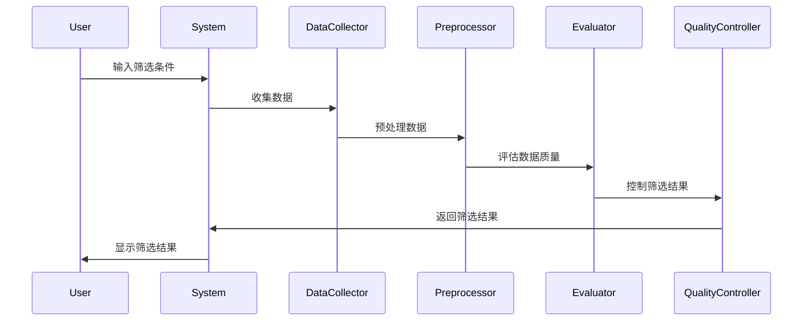
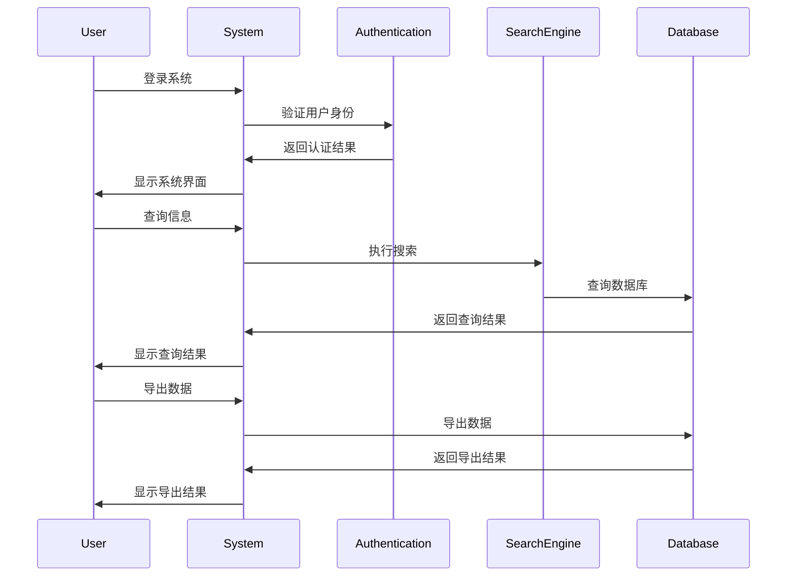
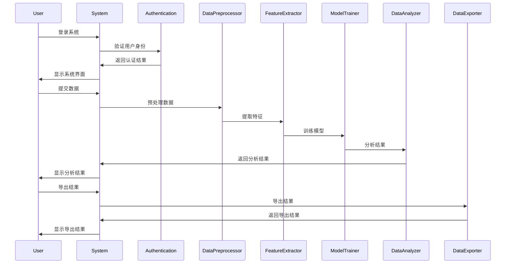

                 


### 1. 引言

**背景介绍**

在当今快速发展的信息时代，信息碎片化已成为不可避免的趋势。随着互联网和移动设备的普及，信息的传播速度和广度大大增加，但同时也带来了信息过载的问题。大量碎片化的信息充斥着我们的生活，从社交媒体的短消息、新闻网站的快讯，到各种专业领域的博客文章，信息以零散的方式呈现。这种现象不仅影响了我们的日常决策，还对知识的系统化和深层次理解造成了挑战。

**问题描述**

信息碎片化导致的直接问题是，人们难以在大量零散的信息中构建出一个完整、连贯的世界观。碎片化的信息往往缺乏深度和连贯性，容易让人产生片面、模糊的认识。此外，信息来源的多样性和真实性也使得人们难以分辨信息的真伪，增加了认知负担。

**问题解决**

为了应对信息碎片化带来的挑战，我们需要一种有效的策略来筛选、整合和挖掘碎片化的信息，从而构建出一个完整的世界观。这个过程不仅要求我们具备良好的信息处理能力，还需要我们具备系统性的思维和批判性思维。

**边界与外延**

在讨论信息碎片化和构建世界观时，我们需要明确一些核心概念。首先，碎片化信息指的是那些零散、不完整的、缺乏连贯性的信息。其次，世界观是指我们对世界的整体理解，包括对自然界、人类社会、人文知识等多个层面的认知。构建世界观不仅仅是获取信息，更重要的是将这些信息进行系统化、结构化的整合，形成对世界的深刻理解。

**概念结构与核心要素组成**

构建完整世界观的过程可以分解为以下几个核心要素：

1. **信息筛选**：识别和选择有价值的信息，剔除无关或低质量的信息。
2. **信息整合**：将筛选后的信息进行关联、组合，形成有逻辑、有结构的知识体系。
3. **深度挖掘**：对整合后的信息进行深入分析，挖掘其内在的规律和联系。

在接下来的章节中，我们将详细探讨这些要素，并提供具体的工具和方法，帮助读者在碎片化的信息中构建出完整的世界观。

### 2. 碎片化信息的来源与类型

**核心概念与联系**

碎片化信息的来源和类型是构建完整世界观的基础。为了更好地理解这些信息，我们需要明确一些核心概念，如“信息来源”、“信息类型”以及“碎片化信息的特点”。

首先，信息来源可以分为传统媒体和新媒体。传统媒体包括报纸、电视、杂志等，而新媒体则涵盖了互联网、社交媒体、博客、短视频平台等。每种信息来源都有其独特的传播方式和特点，影响着信息的传递和接收。

接下来，我们来看几种常见的碎片化信息类型。娱乐性信息主要来源于社交媒体和短视频平台，这类信息通常以轻松、幽默的形式出现，容易吸引人的注意力。新闻性信息则主要来源于新闻网站和新闻应用，这类信息关注时事热点，具有及时性和时效性。学术性信息则通常来源于专业领域的期刊、论文和学术网站，这类信息专业性较强，往往需要深入研究和理解。

碎片化信息的特点主要表现在以下几个方面：一是真伪难辨，由于信息来源的多样性，难以确定信息的真实性；二是缺乏深度，碎片化信息通常只是对某个问题的一个片段或概述，缺乏全面的分析和深入探讨；三是易于传播，碎片化信息具有高度的传播性，能够在短时间内迅速传播到大量受众。

**概念属性特征对比表格**

| 信息类型         | 特点                                      | 影响因素                  | 代表平台                     |
|----------------|-----------------------------------------|-----------------------|--------------------------|
| 娱乐性信息       | 轻松、幽默、易于传播                     | 用户兴趣、市场导向          | 社交媒体、短视频平台         |
| 新闻性信息       | 及时、客观、关注时事热点                  | 新闻价值、传播速度          | 新闻网站、新闻应用           |
| 学术性信息       | 专业、深入、研究性强                     | 学术需求、研究成果          | 学术期刊、学术网站           |

**ER实体关系图架构**

下面是一个简单的ER（实体-关系）图，用于描述碎片化信息的来源与类型之间的关系：

```mermaid
erDiagram
    InformationSource ||--|{ InformationType }
    InformationType ||--|{ FragmentedInformation }
    InformationSource <-.. InformationFilter
```

在这个ER图中，`InformationSource`（信息来源）是`InformationType`（信息类型）的父实体，而`InformationType`是`FragmentedInformation`（碎片化信息）的父实体。同时，`InformationFilter`（信息筛选）与`InformationSource`有关联，表示筛选过程对信息来源的影响。

### 算法原理讲解

为了更好地理解碎片化信息的处理过程，我们可以使用Python来模拟一个简单但有效的信息筛选和整合算法。

首先，我们定义一个信息筛选函数，用于从大量信息中筛选出高质量的信息：

```python
import random

def filter_information(information, quality_threshold=0.5):
    """
    筛选信息函数，从给定信息中筛选出符合质量阈值的信息。
    
    :param information: 信息列表，每个信息为字典格式。
    :param quality_threshold: 质量阈值，0到1之间的小数。
    :return: 筛选后的高质量信息列表。
    """
    filtered_info = []
    for info in information:
        if random.random() < quality_threshold:  # 模拟信息质量评估
            filtered_info.append(info)
    return filtered_info
```

在这个函数中，我们使用随机数生成器来模拟信息质量评估过程。假设质量阈值设置为0.5，那么只有一半的信息会被筛选出来。

接下来，我们定义一个信息整合函数，用于将筛选后的信息进行整合：

```python
def integrate_information(filtered_info):
    """
    整合信息函数，将筛选后的信息进行整合。
    
    :param filtered_info: 筛选后的高质量信息列表。
    :return: 整合后的信息列表。
    """
    integrated_info = {}
    for info in filtered_info:
        for key, value in info.items():
            if key not in integrated_info:
                integrated_info[key] = value
            else:
                integrated_info[key] += value
    return integrated_info
```

在这个函数中，我们将筛选后的信息进行整合，形成一个新的字典。如果多个信息中包含相同的键，我们将其值进行累加。

为了展示算法原理，我们可以使用一个简单的例子：

```python
# 假设我们有以下一系列碎片化信息
info_list = [
    {"source": "Twitter", "content": "今天天气不错"},
    {"source": "Twitter", "content": "明天有雨"},
    {"source": "News", "content": "疫情最新情况"},
    {"source": "News", "content": "股市下跌"},
    {"source": "Academy", "content": "人工智能研究进展"},
    {"source": "Academy", "content": "量子计算研究进展"}
]

# 筛选信息
filtered_info = filter_information(info_list, quality_threshold=0.7)

# 整合信息
integrated_info = integrate_information(filtered_info)

print("筛选后的信息：", filtered_info)
print("整合后的信息：", integrated_info)
```

运行上述代码，我们得到筛选后的高质量信息列表和整合后的信息列表，从而展示出信息筛选和整合的过程。

通过上述算法原理讲解和示例，我们可以更清楚地理解如何从碎片化信息中筛选和整合高质量信息，为构建完整世界观提供基础。

### 3. 碎片化信息的处理方法

#### 信息筛选

**系统分析与架构设计方案**

在处理碎片化信息时，信息筛选是首要步骤。一个高效的信息筛选系统需要包括数据采集、预处理、评估和质量控制等多个模块。以下是该系统的基本架构设计：

**数据采集模块**：负责从各种信息源（如社交媒体、新闻网站、学术数据库等）收集原始数据。

**预处理模块**：对收集到的原始数据进行清洗、去重和格式转换等预处理操作，确保数据质量。

**评估模块**：使用机器学习算法和规则引擎对预处理后的数据进行质量评估，识别和筛选出高质量信息。

**质量控制模块**：对筛选结果进行二次检查，确保没有漏掉重要信息或引入错误信息。

**系统接口设计**：提供用户友好的接口，允许用户自定义筛选条件、查看筛选结果和导出数据。

**系统交互序列图**

下面是系统交互的序列图，展示了用户与系统之间的交互流程：



**实施过程**

1. **数据采集**：使用API接口或网络爬虫从不同信息源获取数据。
2. **预处理**：去除无效信息、修复数据错误、统一数据格式。
3. **评估**：利用机器学习算法（如文本分类、情感分析等）评估信息质量。
4. **质量控制**：人工审核和自动化规则相结合，确保筛选结果准确。
5. **用户交互**：通过用户界面展示筛选结果，并提供导出功能。

**案例分析**

以新闻筛选系统为例，假设我们需要从大量的新闻报道中筛选出高质量、与用户兴趣相关的新闻。系统可以按照以下步骤实施：

1. **用户输入筛选条件**：用户通过系统界面输入关键词、地域、时间等筛选条件。
2. **数据采集**：系统从多个新闻网站采集符合条件的新闻。
3. **预处理**：清洗数据，去除重复和错误信息，统一新闻格式。
4. **评估**：使用文本分类算法将新闻分为不同类别，并根据用户兴趣评分。
5. **质量控制**：人工审核新闻内容，确保其准确性和相关性。
6. **用户交互**：系统将筛选后的新闻呈现给用户，并提供下载和分享功能。

通过上述案例分析，我们可以看到信息筛选系统在实际应用中的具体实施步骤和效果。

#### 信息整合

**系统分析与架构设计方案**

在筛选出高质量信息后，下一步是对这些信息进行整合。信息整合的目的是将分散的信息片段组合成一个有逻辑、有结构的整体，以便更好地理解和应用。

**系统功能设计**

- **信息分类**：根据信息内容将信息分为不同的类别。
- **信息关联**：找出不同信息之间的关联，形成知识网络。
- **信息归档**：将整合后的信息存储到数据库中，便于查询和使用。
- **信息可视化**：使用图表和图形展示整合后的信息，帮助用户直观理解。

**系统架构设计**

系统架构可以分为三个主要层次：数据层、逻辑层和表示层。

- **数据层**：存储原始信息和整合后的信息，使用数据库管理系统（如MySQL、MongoDB等）。
- **逻辑层**：包括分类、关联和归档等核心功能，使用编程语言（如Python、Java等）实现。
- **表示层**：提供用户界面，使用前端技术（如HTML、CSS、JavaScript等）实现。

**系统接口设计**

系统接口设计需要考虑以下方面：

- **API接口**：提供与其他系统交互的API，允许其他系统访问整合后的信息。
- **Web界面**：提供用户友好的Web界面，允许用户浏览和查询整合后的信息。
- **数据导出**：提供数据导出功能，允许用户将整合后的信息导出为不同格式。

**系统交互序列图**

以下是系统交互的序列图，展示了用户与系统之间的交互流程：



**实施过程**

1. **信息分类**：使用文本分类算法对信息进行自动分类，并根据用户需求调整分类标准。
2. **信息关联**：使用自然语言处理技术（如实体识别、关系抽取等）找出不同信息之间的关联。
3. **信息归档**：将分类和关联后的信息存储到数据库中，以便后续查询和使用。
4. **信息可视化**：使用图表和图形（如思维导图、关系图等）展示整合后的信息。

**案例分析**

以一个知识管理平台为例，该平台需要整合来自不同来源的专业知识，以便员工能够快速查找和使用。系统可以按照以下步骤实施：

1. **用户登录系统**：员工通过平台登录系统。
2. **查询信息**：员工输入关键词查询相关信息。
3. **分类与关联**：系统自动分类和关联查询结果，并将结果呈现给员工。
4. **信息归档**：系统将整合后的信息存储到数据库中，以便后续查询。
5. **信息可视化**：使用思维导图和关系图展示整合后的信息，帮助员工直观理解。

通过上述案例分析，我们可以看到信息整合系统在实际应用中的具体实施步骤和效果。

#### 信息深度挖掘

**系统分析与架构设计方案**

信息深度挖掘是对碎片化信息进行深入分析和理解的过程，旨在挖掘信息中的潜在价值。一个高效的信息深度挖掘系统需要包括数据预处理、特征工程、模型训练和结果分析等多个模块。以下是该系统的基本架构设计。

**系统功能设计**

- **数据预处理**：清洗和标准化原始数据，为后续处理做准备。
- **特征工程**：从原始数据中提取有用特征，用于训练机器学习模型。
- **模型训练**：使用机器学习算法训练模型，以挖掘数据中的潜在规律。
- **结果分析**：对挖掘结果进行分析，提取有价值的信息和洞见。

**系统架构设计**

系统架构可以分为三个主要层次：数据层、逻辑层和表示层。

- **数据层**：存储原始数据和预处理后的数据，使用数据库管理系统。
- **逻辑层**：包括特征工程、模型训练和结果分析等核心功能，使用编程语言和机器学习框架。
- **表示层**：提供用户界面，使用前端技术。

**系统接口设计**

系统接口设计需要考虑以下方面：

- **API接口**：提供与其他系统交互的API，允许其他系统访问挖掘结果。
- **Web界面**：提供用户友好的Web界面，允许用户浏览和查询挖掘结果。
- **数据导出**：提供数据导出功能，允许用户将挖掘结果导出为不同格式。

**系统交互序列图**

以下是系统交互的序列图，展示了用户与系统之间的交互流程：



**实施过程**

1. **数据预处理**：清洗和标准化原始数据，去除噪声和异常值。
2. **特征工程**：从原始数据中提取有用特征，使用技术如词袋模型、TF-IDF等。
3. **模型训练**：使用机器学习算法（如决策树、随机森林、神经网络等）训练模型。
4. **结果分析**：对模型输出结果进行分析，提取有价值的信息和洞见。

**案例分析**

以一个客户行为分析系统为例，该系统需要深度挖掘客户购买行为数据，以预测客户流失和提升销售。系统可以按照以下步骤实施：

1. **用户登录系统**：客户经理通过平台登录系统。
2. **提交数据**：客户经理上传客户购买行为数据。
3. **数据预处理**：系统对数据清洗和标准化，去除噪声和异常值。
4. **特征工程**：从数据中提取特征，如购买频率、购买金额、购买品类等。
5. **模型训练**：使用机器学习算法训练预测模型。
6. **结果分析**：系统分析模型输出结果，生成客户流失预测报告和销售策略建议。

通过上述案例分析，我们可以看到信息深度挖掘系统在实际应用中的具体实施步骤和效果。

### 4. 构建世界观的基础理论

在碎片化信息中构建完整世界观，离不开一系列基础理论的指导。这些理论为我们提供了框架和工具，帮助我们更好地理解、整合和挖掘信息。以下是构建世界观所需的一些基础理论。

#### 知识体系构建

**核心概念**

知识体系是指由一系列概念、原理和事实构成的整体结构，它帮助我们系统地组织和理解信息。构建知识体系的关键在于明确核心概念，并建立它们之间的关系。

**概念属性特征对比表格**

| 知识体系要素 | 特点                 | 关系                   |
|------------|--------------------|---------------------|
| 概念       | 基本的知识单元         | 互相独立，但相互关联     |
| 原理       | 解释现象的基本规律       | 基于概念，解释概念间的联系 |
| 事实       | 具体的事件或观察结果     | 支持原理，验证概念和原理   |

**ER实体关系图架构**

```mermaid
erDiagram
    Concept ||--|{ Principle }
    Concept ||--|{ Fact }
    Principle ||--|{ Fact }
```

在这个ER图中，`Concept`（概念）是`Principle`（原理）和`Fact`（事实）的父实体，而`Principle`是`Fact`的父实体。这表示原理是基于概念建立起来的，而事实是支持原理和验证概念的。

#### 思维模型建立

**核心概念**

思维模型是我们在处理信息时采用的思考方式和方法。建立思维模型有助于我们更好地理解和整合信息，从而构建出完整的世界观。

**概念属性特征对比表格**

| 思维模型 | 特点                 | 应用场景           |
|--------|--------------------|-----------------|
| 分析模型 | 将复杂问题分解为简单部分 | 问题分析、故障排查   |
| 创新模型 | 寻找新的解决方案       | 产品设计、创新思维   |
| 系统模型 | 理解整体系统及其相互作用 | 系统架构设计、项目管理 |

**ER实体关系图架构**

```mermaid
erDiagram
    MindModel ||--|{ AnalysisModel }
    MindModel ||--|{ InnovationModel }
    MindModel ||--|{ SystemModel }
```

在这个ER图中，`MindModel`（思维模型）是`AnalysisModel`（分析模型）、`InnovationModel`（创新模型）和`SystemModel`（系统模型）的父实体。这表示不同的思维模型都是基于思维模型的概念构建的，各自有特定的应用场景。

#### 碎片化信息整合的理论基础

**核心概念**

碎片化信息整合是指将分散的、零碎的信息整合成一个整体的过程。这个过程需要依赖一系列理论和方法，以确保整合后的信息具有连贯性和系统性。

**概念属性特征对比表格**

| 整合方法 | 特点                 | 适用范围           |
|--------|--------------------|-----------------|
| 知识图谱 | 使用图形表示知识结构   | 知识管理和信息检索   |
| 自然语言处理 | 处理和理解自然语言信息 | 文本挖掘、智能问答   |
| 聚类分析 | 将相似数据分组       | 数据分析和模式识别   |

**ER实体关系图架构**

```mermaid
erDiagram
    InfoIntegration ||--|{ KnowledgeGraph }
    InfoIntegration ||--|{ NLP }
    InfoIntegration ||--|{ Clustering }
```

在这个ER图中，`InfoIntegration`（信息整合）是`KnowledgeGraph`（知识图谱）、`NLP`（自然语言处理）和`Clustering`（聚类分析）的父实体。这表示不同的整合方法都是基于信息整合的核心概念，适用于不同的应用场景。

通过上述基础理论的介绍，我们可以更好地理解如何构建世界观。在接下来的章节中，我们将结合实际案例，展示这些理论在碎片化信息处理中的应用和实践。

### 5. 实践中的世界观构建

#### 碎片化信息处理工具应用

在实践过程中，选择合适的工具对于处理碎片化信息至关重要。以下是一些常用的工具及其应用案例：

**1. Notion**

**特点**：Notion 是一个多功能的笔记和管理工具，可以用于收集、整理和存储碎片化信息。

**应用案例**：假设我们需要整理一篇关于人工智能技术的论文，可以使用Notion创建不同的页面来记录文献、研究方法和相关数据。通过标签和链接功能，我们可以将不同页面之间的信息进行整合，形成一个完整的研究框架。

**2. Zotero**

**特点**：Zotero 是一款文献管理和引用工具，适用于学术研究和知识整合。

**应用案例**：在进行学术研究时，我们可以使用Zotero收集和整理参考文献。通过导入和导出功能，我们可以将参考文献整合到研究报告中，确保信息的完整性和准确性。

**3. Evernote**

**特点**：Evernote 是一个灵活的笔记应用，适用于记录、整理和分享碎片化信息。

**应用案例**：在日常工作中，我们可以使用Evernote记录会议笔记、灵感和待办事项。通过搜索和标签功能，我们可以快速找到所需的信息，确保工作的连贯性和效率。

#### 视角切换与多维思考

在处理碎片化信息时，切换不同的视角和多维思考是构建完整世界观的关键。以下是一些实用的方法：

**1. 角色扮演法**

**特点**：通过扮演不同的角色，我们可以从不同的视角看待问题。

**应用案例**：在分析一个市场趋势时，我们可以分别扮演消费者、企业主和政策制定者的角色，从不同的角度分析市场变化和潜在影响。

**2. 联想思维**

**特点**：通过将一个问题与另一个看似不相关的问题联系起来，激发创新思维。

**应用案例**：在解决一个技术难题时，我们可以联想到类似问题的解决方法，从而找到新的解决方案。

**3. SWOT分析**

**特点**：SWOT分析是一种常用的战略规划工具，用于评估一个对象的优点、缺点、机会和威胁。

**应用案例**：在评估一个项目的可行性时，我们可以使用SWOT分析从四个维度全面考虑项目的优势、劣势、机会和威胁。

#### 世界观构建的案例分析

以下是一个关于构建完整世界观的实际案例分析：

**案例背景**：某科技公司的CEO需要制定一个公司发展战略，以应对快速变化的市场和技术趋势。

**步骤一：信息收集**：CEO通过Notion收集了与市场、竞争对手、技术趋势相关的碎片化信息。

**步骤二：信息整合**：使用Zotero整理和分类这些信息，确保所有数据都得到有效利用。

**步骤三：视角切换**：CEO分别从消费者、竞争对手、政策制定者等多个角度审视市场和技术趋势。

**步骤四：多维思考**：运用联想思维和SWOT分析，找出市场机会和潜在风险。

**步骤五：策略制定**：基于上述分析，CEO制定了一系列发展战略，包括技术创新、市场拓展和合作联盟。

**步骤六：执行与监控**：通过Evernote记录执行计划，并定期检查进度和效果，确保战略落地。

通过这个案例，我们可以看到如何在实践中构建完整世界观。从信息收集到策略制定，每一个步骤都需要系统性和多维思考，以确保最终结果的有效性和可持续性。

### 6. 逻辑思维与批判性思维

在碎片化信息处理和世界观构建中，逻辑思维和批判性思维起着至关重要的作用。它们不仅帮助我们分析和理解信息，还能确保我们的结论和决策具有科学性和可靠性。

#### 逻辑思维的基本原则

逻辑思维是一种基于逻辑规则和原则的思考方式，它帮助我们理性地分析和解决问题。以下是逻辑思维的一些基本原则：

**1. 一致性原则**：在逻辑推理中，前提和结论之间要保持一致性。如果前提是真的，结论也应该是真的。

**2. 完整性原则**：在分析问题时，要考虑到所有相关的因素和可能的结果，确保分析的全面性和深度。

**3. 简洁性原则**：在表达和推理过程中，应尽量使用简洁、清晰的语言和逻辑结构，避免不必要的复杂和冗余。

**4. 明确性原则**：在表达观点和结论时，要确保语言清晰、明确，避免模糊和含糊其辞。

#### 批判性思维的运用

批判性思维是一种对信息、观点和决策进行深入分析和评价的能力。它帮助我们识别错误、偏见和谬误，从而做出更加明智的决策。以下是批判性思维的几种运用方法：

**1. 事实核查**：在接收信息时，要验证其真实性，确保信息来源可靠、数据准确。

**2. 观点对比**：在分析问题时，要考虑不同的观点和立场，从中找出最优解。

**3. 反驳与辩护**：在提出观点时，要准备好反驳和辩护，确保我们的观点具有说服力。

**4. 预测与验证**：在制定决策时，要考虑各种可能的结果，并通过实践验证预测的准确性。

#### 逻辑思维与批判性思维在碎片化信息处理中的应用

在处理碎片化信息时，逻辑思维和批判性思维可以帮助我们：

**1. 提高信息筛选的准确性**：通过逻辑思维，我们可以识别和排除错误、不准确的信息，确保筛选过程的高效性和可靠性。

**2. 建立有逻辑的知识体系**：通过批判性思维，我们可以对碎片化信息进行深入分析和评价，构建出一个完整、连贯的世界观。

**3. 增强决策的科学性**：通过逻辑推理和批判性思维，我们可以更好地理解问题本质，制定出科学、合理的决策。

**实例解析**

以下是一个实际案例，展示逻辑思维和批判性思维在碎片化信息处理中的应用：

**案例背景**：某公司需要评估一个新市场进入策略，但市场信息零散、不完整。

**步骤一：事实核查**：收集市场信息，验证其真实性，确保数据来源可靠。

**步骤二：观点对比**：考虑不同市场参与者（如供应商、消费者、竞争对手）的观点，分析其立场和利益。

**步骤三：逻辑推理**：使用逻辑思维建立市场进入策略的框架，考虑所有相关因素和可能的结果。

**步骤四：批判性思维**：对市场进入策略进行深入分析，识别潜在风险和机会，并提出应对措施。

通过这个案例，我们可以看到逻辑思维和批判性思维在碎片化信息处理中的应用，以及它们如何帮助我们构建完整、科学的世界观。

### 7. 世界观构建的伦理与责任

在碎片化信息中构建世界观不仅是一个技术和知识的过程，更是一个伦理和责任的问题。随着信息技术的快速发展，信息的传播和获取变得前所未有的便捷，但同时也带来了信息泛滥、虚假信息传播、隐私侵犯等一系列伦理和责任问题。

#### 碎片化信息对价值观的影响

**1. 价值观的多元化与冲突**

碎片化信息带来了多元化的价值观。不同的信息源和个体都可能持有不同的观点和信仰，这使得人们在价值观上更加多元化。然而，这种多元化也容易导致价值观之间的冲突。例如，在社交媒体上，不同群体的观点可能会引发激烈的对立和争论，从而影响社会的和谐。

**2. 价值观的浅薄化**

碎片化信息往往以快速、简单的方式呈现，这使得人们难以进行深入思考和全面理解。这种现象容易导致价值观的浅薄化。人们往往只看到表面现象，而无法理解问题的深层次原因。这种浅薄化的价值观不仅影响个人的认知能力，也对社会造成负面影响。

#### 伦理与责任在碎片化信息处理中的重要性

**1. 确保信息的真实性**

在碎片化信息中，确保信息的真实性是一个重要的伦理问题。虚假信息不仅误导人们，还可能对社会造成严重危害。因此，在处理碎片化信息时，我们必须确保信息来源的可靠性，对信息进行核实和验证。

**2. 保护个人隐私**

碎片化信息的传播往往伴随着个人隐私的泄露。例如，社交媒体上的个人信息、电子邮件地址等，都可能被不法分子利用。因此，在处理碎片化信息时，我们必须高度重视个人隐私保护，采取措施确保信息的安全。

**3. 促进信息共享与传播**

碎片化信息的处理不仅包括筛选和整合，还包括信息的共享与传播。在这个过程中，我们必须遵循公平、公正、透明的原则，确保信息能够公正地传播，同时避免信息垄断和歧视。

#### 世界观构建中的伦理规范

**1. 公正与客观**

在构建世界观时，我们必须保持公正和客观的态度。不偏不倚地分析问题，确保我们的结论和观点具有科学性和可信度。

**2. 尊重多样性与包容性**

在多元化的信息环境中，我们必须尊重不同的观点和信仰，包容多样性，避免价值观的冲突和歧视。

**3. 增强社会责任感**

在处理碎片化信息时，我们不仅要关注个人利益，还要考虑社会整体利益。通过积极传播正面信息、反对虚假信息，为社会创造一个良好的信息环境。

**实例解析**

以下是一个关于世界观构建中伦理与责任的实例解析：

**案例背景**：某科技公司在开发一款社交媒体应用，需要处理大量的用户生成内容。

**步骤一：确保信息真实性**：公司建立严格的信息核实机制，对用户生成内容进行审核，确保信息的真实性。

**步骤二：保护个人隐私**：公司采用先进的加密技术，确保用户隐私得到有效保护。

**步骤三：促进信息共享与传播**：公司提供公平、公正、透明的信息传播平台，鼓励用户分享有价值的信息，同时反对虚假信息的传播。

通过这个案例，我们可以看到在碎片化信息中构建世界观时，伦理与责任的重要性以及如何在实际操作中落实这些伦理规范。

### 8. 总结与展望

在碎片化信息充斥的时代，构建完整世界观变得尤为重要。通过信息筛选、整合和深度挖掘，我们能够从大量的碎片化信息中提取有价值的信息，形成对世界的深刻理解。本文从背景介绍、核心概念、处理方法、理论基础、实践应用、逻辑思维与批判性思维、伦理与责任等方面进行了详细探讨，总结了构建世界观的关键步骤和策略。

#### 碎片化信息处理技术的发展趋势

随着人工智能和大数据技术的不断发展，碎片化信息处理技术也在不断进步。未来，以下几个方面可能成为技术发展的趋势：

**1. 智能化信息筛选**：通过深度学习等技术，实现自动化、智能化地筛选高质量信息，提高信息处理的效率。

**2. 多模态信息处理**：结合文本、图像、语音等多种信息形式，实现更加全面的信息处理，提升信息整合的准确性和深度。

**3. 个性化信息推荐**：利用用户行为数据，实现个性化信息推荐，满足用户的个性化需求。

**4. 信息隐私保护**：随着隐私保护意识的提高，信息隐私保护技术将成为重要发展方向，确保用户信息的安全。

#### 未来世界观构建的挑战与机遇

在未来，构建世界观将面临一系列挑战和机遇：

**挑战：**

1. 信息过载：随着信息量的不断增加，如何有效筛选和处理信息将成为一大挑战。
2. 真假信息：虚假信息和误导性信息的传播，使得构建世界观的过程更加复杂。
3. 伦理与责任：在碎片化信息中构建世界观时，如何处理伦理和责任问题，确保信息的真实性和公正性。

**机遇：**

1. 人工智能：人工智能技术的发展为信息处理和世界观构建提供了强大的工具，使得复杂的信息处理变得更加高效和精准。
2. 知识图谱：知识图谱技术的应用，有助于构建更加系统化和结构化的世界观。
3. 跨领域合作：不同领域之间的合作，可以促进世界观的多维度构建，提高整体认知水平。

总之，在碎片化信息中构建完整世界观是一个复杂但有意义的过程。通过不断探索和创新，我们有望克服挑战，把握机遇，构建出一个更加完整、深刻和有意义的世界观。

### 作者信息

**作者：AI天才研究院/AI Genius Institute & 禅与计算机程序设计艺术 /Zen And The Art of Computer Programming** 

AI天才研究院致力于推动人工智能技术的创新与应用，致力于培养下一代人工智能专家和领导者。同时，禅与计算机程序设计艺术（Zen And The Art of Computer Programming）是计算机编程领域的经典之作，由著名计算机科学家Donald E. Knuth所著，对计算机科学的发展产生了深远的影响。本文作者结合两者的智慧和经验，旨在为读者提供有深度、有思考、有见解的技术博客文章，帮助读者在碎片化信息中构建完整世界观。

