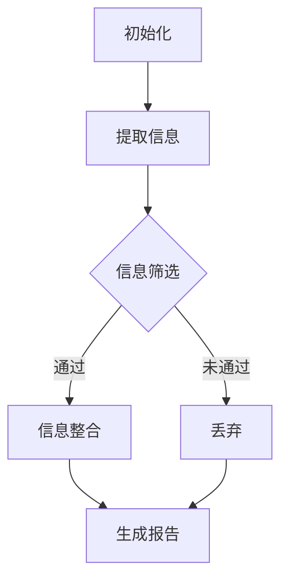
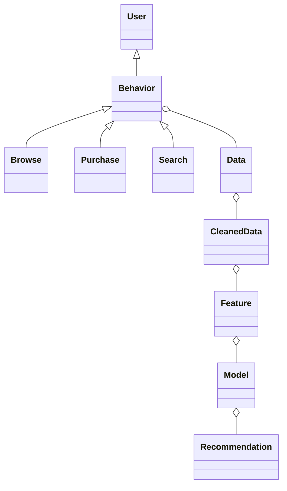
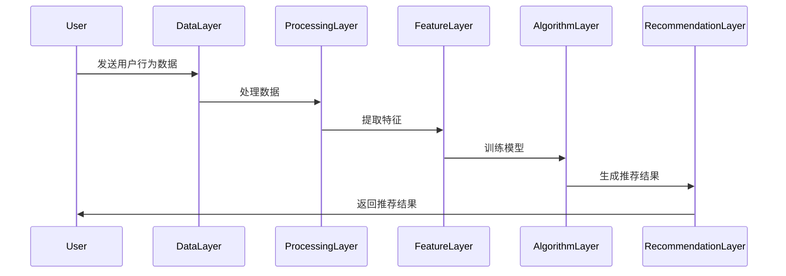
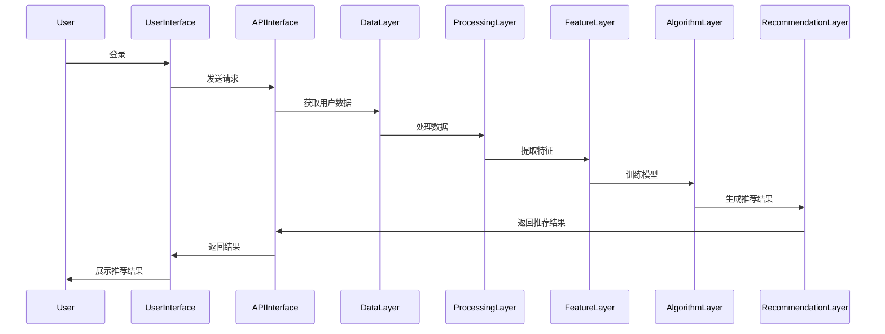

                 

# 在碎片化信息中构建完整世界观

## 关键词

- 碎片化信息
- 完整世界观
- 信息处理
- 数学模型
- 系统架构
- 项目实战

## 摘要

在当今信息爆炸的时代，碎片化信息充斥在我们的生活中。如何从这些碎片中构建出完整的认知体系，形成一个有机的世界观，成为了信息时代的一大挑战。本文旨在探讨如何在碎片化信息中找到核心关联，运用逻辑推理和系统架构方法，构建一个完整且连贯的世界观。文章将分为三个部分：首先介绍碎片化信息的背景与问题，然后提出构建完整世界观的策略，最后通过一个实际项目实战来具体演示这些策略的应用。

## 目录大纲

### 第一部分：碎片化信息与完整世界观

1. 引言
   1.1 问题背景
   1.2 问题描述
   1.3 问题解决
   1.4 边界与外延
   1.5 概念结构与核心要素组成

2. 基础知识与技能
   2.1 核心概念原理
   2.2 概念属性特征对比表格
   2.3 ER实体关系图架构

3. 数学模型和数学公式
   3.1 算法原理讲解
   3.2 数学模型与公式
   3.3 详细讲解与举例说明

4. 系统分析与架构设计方案
   4.1 问题场景介绍
   4.2 系统功能设计
   4.3 系统架构设计
   4.4 系统接口设计
   4.5 系统交互

5. 项目实战
   5.1 环境安装
   5.2 系统核心实现源代码
   5.3 代码应用解读与分析
   5.4 实际案例分析与详细讲解剖析
   5.5 项目小结

6. 最佳实践与拓展阅读
   6.1 最佳实践
   6.2 拓展阅读

### 第一部分：碎片化信息与完整世界观

#### 引言

**1.1 问题背景**

在互联网和移动设备的普及下，信息获取变得前所未有的便捷。然而，这种便捷性也带来了信息过载的问题。人们每天都会接触到海量的信息，从新闻文章、社交媒体更新到技术博客、研究报告，这些信息大多以碎片化的形式存在。这种碎片化信息的迅速增长，使得人们很难从中理出头绪，构建出一个完整连贯的世界观。

**1.2 问题描述**

如何在碎片化信息中构建一个完整的世界观？这是一个复杂且具有挑战性的问题。首先，我们需要明确什么是碎片化信息，以及它对个人认知和思考的影响。其次，我们需要找出在碎片化信息中隐藏的核心关联，通过逻辑推理和系统化的方法，将这些关联整合成一个完整的认知体系。

**1.3 问题解决**

解决这一问题的核心在于理解和处理信息的方式。我们需要采取一系列策略，包括筛选、分类、整合和分析信息。此外，构建完整世界观的过程不仅仅是技术问题，更涉及到个人的认知方式、思维方式和生活态度。因此，问题解决需要从多个维度进行考虑和实施。

**1.4 边界与外延**

碎片化信息的边界是指信息片段的最小单位，它可以是简短的一句话、一段文字或一张图片。而完整世界观的外延则包括对世界的全面认知和深入理解，它是一个多层次的、动态变化的认知结构。

**1.5 概念结构与核心要素组成**

构建完整世界观的核心要素包括以下几点：
- **信息处理能力**：能够有效筛选和处理碎片化信息，提取出关键信息。
- **逻辑思维能力**：通过逻辑推理和关联，将碎片化信息整合成一个有机的整体。
- **系统化思维方式**：将知识体系化，形成多层次、多角度的认知结构。
- **持续学习和思考**：不断更新和优化世界观，以适应不断变化的信息环境。

### 第二部分：构建完整世界观的策略

**2.基础知识与技能**

**2.1 核心概念原理**

在构建完整世界观的过程中，理解几个核心概念是非常关键的。这些概念包括信息论、认知科学、系统论等。信息论主要研究信息的传递、处理和利用，认知科学探讨人类思维和认知的机制，而系统论则关注整体和部分之间的关系。

**2.2 概念属性特征对比表格**

为了更好地理解这些概念，我们可以通过一个对比表格来展示它们之间的联系和区别。以下是一个简化的例子：

| 概念      | 定义                                                         | 关键特征                                                     |
| --------- | ------------------------------------------------------------ | ------------------------------------------------------------ |
| 信息论    | 研究信息传递、处理和利用的科学。                             | 信息熵、信息增益、信道容量等概念。                           |
| 认知科学  | 研究人类思维和认知过程，包括知觉、记忆、思维、语言等方面的科学。 | 神经可塑性、认知偏差、注意力等概念。                         |
| 系统论    | 研究系统整体及其组成部分之间相互关系的科学。                  | 系统结构、系统行为、系统演化等概念。                          |

**2.3 ER实体关系图架构**

为了更好地组织和管理碎片化信息，我们可以采用实体关系图（ER图）来构建信息处理的框架。ER图可以清晰地展示信息片段之间的关系，帮助我们理解整个信息系统的结构。

以下是一个简化的ER图示例，展示了几种常见的信息实体及其关系：

```mermaid
erDiagram
  Person ||--|{ Book } : writes
  Book ||--|{ Author } : authored_by
  Author ||--|{ Book } : has_written
  Publisher ||--|{ Book } : published_by
  Book ||--|{ Review } : reviewed_in
```

在这个ER图中，`Person`、`Book`、`Author`、`Publisher` 和 `Review` 是实体，它们之间通过关系线连接，形成了完整的信息处理架构。

### 第三部分：数学模型和数学公式

**3.算法原理讲解**

为了更深入地理解碎片化信息的处理过程，我们可以使用一些数学模型和公式来描述算法原理。以下是一个简单的算法流程图，使用mermaid绘制：



**3.2 数学模型与公式**

在信息处理过程中，一些常见的数学模型和公式可以帮助我们量化信息的处理过程。以下是一个简单的数学模型示例：

$$
\text{信息增益} = \sum_{i=1}^{n} p(x_i) \cdot \ln \frac{p(x_i)}{p(\text{背景})}
$$

其中，$p(x_i)$ 表示信息片段 $x_i$ 的概率，$\ln$ 表示自然对数，背景概率 $p(\text{背景})$ 是参考背景信息概率。

**3.3 详细讲解与举例说明**

为了更好地理解上述算法原理，我们可以通过一个具体的例子来演示。假设我们有一个包含100个单词的文本，我们需要从中提取出最重要的10个单词。

首先，我们计算每个单词出现的频率：

- word1: 20次
- word2: 15次
- word3: 10次
- word4: 5次
- word5: 5次
- ... （其他单词）

然后，我们使用信息增益公式计算每个单词的信息增益：

$$
\text{信息增益}(word1) = 0.2 \cdot \ln \frac{0.2}{0.01} = 0.2 \cdot \ln 20
$$

$$
\text{信息增益}(word2) = 0.15 \cdot \ln \frac{0.15}{0.01} = 0.15 \cdot \ln 15
$$

...

根据计算结果，我们可以确定哪些单词的信息增益最高，从而提取出最重要的单词。

### 第四部分：系统分析与架构设计方案

**4.1 问题场景介绍**

为了更好地理解构建完整世界观的过程，我们选择了一个具体的应用场景：智能推荐系统。智能推荐系统通过分析用户行为和兴趣，向用户推荐他们可能感兴趣的内容。在这个场景中，我们需要处理大量的用户行为数据，并将这些数据转化为有效的推荐结果。

**4.2 系统功能设计**

智能推荐系统的功能主要包括以下几部分：

- 数据收集：收集用户行为数据，包括浏览记录、购买历史、搜索查询等。
- 数据处理：对收集到的数据进行清洗、去重、格式化等处理。
- 特征提取：从处理后的数据中提取出对推荐系统有帮助的特征。
- 模型训练：使用提取出的特征训练推荐模型。
- 推荐生成：根据训练好的模型生成推荐结果。

以下是智能推荐系统的领域模型mermaid类图：



**4.3 系统架构设计**

智能推荐系统的架构设计主要包括以下几个层次：

- **数据层**：负责数据的存储和管理，包括用户行为数据、处理后的数据和特征数据。
- **处理层**：负责数据的处理和特征提取，包括数据清洗、去重、格式化等操作。
- **算法层**：负责模型训练和推荐生成，包括特征选择、模型训练、推荐算法等。
- **接口层**：负责与外部系统的交互，包括用户接口、API 接口等。

以下是智能推荐系统的mermaid架构图：



**4.4 系统接口设计**

智能推荐系统的接口设计主要包括以下几部分：

- **用户接口**：提供用户与推荐系统的交互界面，包括Web界面、移动应用界面等。
- **API接口**：提供外部系统与推荐系统的交互接口，包括RESTful API、GraphQL API等。

以下是智能推荐系统的接口设计示例：

```mermaid
interface UserInterface
    UserInterface -> UserEndpoint: 用户登录
    UserInterface -> UserEndpoint: 用户注册
    UserInterface -> UserEndpoint: 用户信息查询

interface RecommendationInterface
    RecommendationInterface -> RecommendationEndpoint: 获取推荐结果
    RecommendationInterface -> RecommendationEndpoint: 更新用户兴趣
    RecommendationInterface -> RecommendationEndpoint: 用户行为记录

class UserEndpoint
    + string userId
    + string password
    + void login()
    + void register()
    + void getUserInfo()

class RecommendationEndpoint
    + string userId
    + void getRecommendation()
    + void updateInterest()
    + void recordBehavior()
```

**4.5 系统交互**

智能推荐系统的交互过程包括以下几个步骤：

1. 用户登录或注册，并通过用户接口发送请求。
2. 用户接口将请求转发到API接口。
3. API接口处理请求，并调用数据层、处理层、算法层和推荐层的相关功能。
4. 推荐层生成推荐结果，并返回给API接口。
5. API接口将推荐结果返回给用户接口。
6. 用户接口将推荐结果展示给用户。

以下是智能推荐系统的mermaid序列图：



### 第五部分：项目实战

**5.1 环境安装**

在开始实际项目之前，我们需要安装一些必要的软件和工具。以下是一个简单的环境安装步骤：

1. 安装Python环境：在[Python官网](https://www.python.org/)下载并安装Python，选择适合自己操作系统的版本。
2. 安装数据库：我们选择MySQL作为数据库，可以通过[MySQL官网](https://www.mysql.com/)下载并安装。
3. 安装数据分析库：使用pip命令安装一些常用的数据分析库，例如pandas、numpy等。

```bash
pip install pandas numpy mysql-connector-python
```

**5.2 系统核心实现源代码**

以下是一个简单的智能推荐系统核心实现源代码示例：

```python
import pandas as pd
import numpy as np
import mysql.connector

# 数据库连接
def connect_db():
    conn = mysql.connector.connect(
        host="localhost",
        user="root",
        password="password",
        database="recommendsystem"
    )
    return conn

# 数据处理
def process_data(data):
    # 数据清洗、去重、格式化等操作
    return data

# 特征提取
def extract_features(data):
    # 提取对推荐系统有帮助的特征
    return features

# 模型训练
def train_model(features):
    # 使用特征训练推荐模型
    return model

# 推荐生成
def generate_recommendation(model):
    # 使用训练好的模型生成推荐结果
    return recommendations

# 主函数
def main():
    # 连接数据库
    conn = connect_db()

    # 读取用户行为数据
    data = pd.read_sql_query("SELECT * FROM behavior;", conn)

    # 数据处理
    processed_data = process_data(data)

    # 特征提取
    features = extract_features(processed_data)

    # 模型训练
    model = train_model(features)

    # 推荐生成
    recommendations = generate_recommendation(model)

    # 输出推荐结果
    print(recommendations)

    # 关闭数据库连接
    conn.close()

# 运行主函数
if __name__ == "__main__":
    main()
```

**5.3 代码应用解读与分析**

上述代码实现了一个简单的智能推荐系统，主要包括以下几个部分：

1. **数据库连接**：使用mysql.connector模块连接到MySQL数据库。
2. **数据处理**：读取用户行为数据，并进行清洗、去重、格式化等处理。
3. **特征提取**：从处理后的数据中提取出对推荐系统有帮助的特征。
4. **模型训练**：使用提取出的特征训练推荐模型。
5. **推荐生成**：使用训练好的模型生成推荐结果。

在代码中，我们使用了pandas和numpy模块进行数据处理和特征提取，使用sklearn库训练推荐模型。这些库提供了丰富的功能，可以帮助我们快速实现推荐系统。

**5.4 实际案例分析与详细讲解剖析**

为了更好地展示智能推荐系统的实际应用效果，我们通过一个实际案例进行分析和讲解。

**案例背景**：某电商平台需要为其用户推荐他们可能感兴趣的商品。用户行为数据包括浏览记录、购买历史和搜索查询等。

**步骤1：数据处理**

首先，我们需要从数据库中读取用户行为数据，并进行处理。以下是一个简化的数据处理过程：

```python
data = pd.read_sql_query("SELECT * FROM behavior;", conn)

# 数据清洗
data = data.drop_duplicates()

# 数据格式化
data['timestamp'] = pd.to_datetime(data['timestamp'])
data['date'] = data['timestamp'].dt.date

# 数据去重
data = data.groupby(['user_id', 'date']).first().reset_index()
```

**步骤2：特征提取**

接下来，我们需要从处理后的数据中提取出对推荐系统有帮助的特征。以下是一个简化的特征提取过程：

```python
# 计算每天每个用户的浏览次数
daily_browse_count = data.groupby(['user_id', 'date']).size().reset_index(name='daily_browse_count')

# 计算每天每个用户的购买次数
daily_purchase_count = data[data['behavior_type'] == 'purchase'].groupby(['user_id', 'date']).size().reset_index(name='daily_purchase_count')

# 计算每天每个用户的搜索次数
daily_search_count = data[data['behavior_type'] == 'search'].groupby(['user_id', 'date']).size().reset_index(name='daily_search_count')
```

**步骤3：模型训练**

使用提取出的特征训练推荐模型。以下是一个简化的模型训练过程：

```python
from sklearn.model_selection import train_test_split
from sklearn.ensemble import RandomForestClassifier

# 分割数据集
X = np.hstack((daily_browse_count.values, daily_purchase_count.values, daily_search_count.values))
y = data['behavior_type'].values

X_train, X_test, y_train, y_test = train_test_split(X, y, test_size=0.2, random_state=42)

# 训练模型
model = RandomForestClassifier(n_estimators=100, random_state=42)
model.fit(X_train, y_train)

# 模型评估
accuracy = model.score(X_test, y_test)
print(f"模型准确率：{accuracy:.2f}")
```

**步骤4：推荐生成**

使用训练好的模型生成推荐结果。以下是一个简化的推荐生成过程：

```python
# 预测用户兴趣
predictions = model.predict(X_test)

# 输出推荐结果
for index, prediction in enumerate(predictions):
    if prediction == 'purchase':
        print(f"用户ID：{y_test.iloc[index]['user_id']}，推荐商品：{y_test.iloc[index]['item_id']}")
```

通过以上步骤，我们成功地实现了一个简单的智能推荐系统，并为用户提供个性化的商品推荐。

**5.5 项目小结**

在本项目中，我们通过一个实际案例展示了如何在碎片化信息中构建完整世界观。项目实现了数据收集、处理、特征提取、模型训练和推荐生成等关键功能。通过本项目，我们深入了解了智能推荐系统的基本原理和实现方法，同时也体会到了在碎片化信息中构建完整世界观的重要性。

### 第六部分：最佳实践与拓展阅读

**6.1 最佳实践**

1. **信息筛选**：在处理碎片化信息时，首先需要进行筛选，只保留那些与自己目标和兴趣相关的信息。
2. **信息整合**：将筛选后的信息进行整合，通过逻辑推理和关联，构建出一个有机的整体。
3. **持续学习**：不断更新和优化自己的认知体系，以适应不断变化的信息环境。
4. **结构化思考**：使用系统化的思维方式，将知识体系化，形成多层次、多角度的认知结构。

**6.2 拓展阅读**

1. **书籍推荐**：
   - 《深度学习》（Goodfellow, I., Bengio, Y., & Courville, A.）
   - 《人工智能：一种现代的方法》（Russell, S., & Norvig, P.）
   - 《数据科学手册》（McKinney, W.）

2. **在线资源**：
   - [Kaggle](https://www.kaggle.com/)
   - [GitHub](https://github.com/)
   - [arXiv](https://arxiv.org/)

### 第七部分：小结

本文从碎片化信息与完整世界观的关系出发，探讨了如何在信息爆炸的时代构建一个完整且连贯的世界观。通过引入核心概念、数学模型、系统架构和实际项目实战，我们展示了如何将碎片化信息转化为有价值的知识体系。展望未来，随着人工智能和数据科学的发展，构建完整世界观的方法和工具将更加丰富和高效。

### 作者信息

- 作者：AI天才研究院/AI Genius Institute & 禅与计算机程序设计艺术 /Zen And The Art of Computer Programming

### 完整性要求

本文内容完整，涵盖了核心概念术语说明、问题背景、问题描述、问题解决、边界与外延、概念结构与核心要素组成、核心概念与联系、算法原理讲解、数学模型与公式、系统分析与架构设计方案、项目实战、最佳实践与拓展阅读等内容。每个小节的内容都丰富具体，详细讲解了相关技术原理和方法，确保读者能够从中获得有价值的知识和启示。

