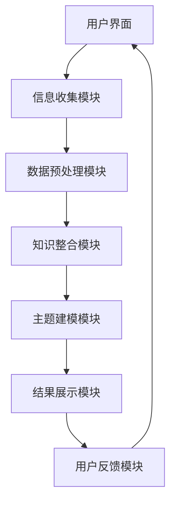

                 

### # 在碎片化时代寻找整体感

## 关键词

- **碎片化时代**  
- **整体感**  
- **心理学研究**  
- **社会学探讨**  
- **哲学思考**  
- **实践路径**  
- **技术助力**  
- **政策与制度保障**  
- **未来展望**

## 摘要

本文旨在探讨在当今碎片化时代，个体和社会如何寻找和重建整体感。通过对整体感的定义、特征、成因及其影响的深入分析，本文提出了一系列寻找整体感的实践路径和技术手段，并探讨了政策与制度保障的重要性。文章还展望了整体感重建的未来趋势和挑战，为个体和社会提供了一种在碎片化环境中重建整体感的策略和方法。

## 第一部分：引言

### 第1章：问题背景与总体概述

#### 1.1 碎片化时代的来临

在数字化和信息化的推动下，我们进入了所谓的“碎片化时代”。这个时代的特点是信息爆炸、知识更新迅速，人们被大量碎片化的信息包围。传统意义上的知识体系逐渐解体，取而代之的是一个个独立的知识点和技能点。这种碎片化的趋势不仅影响了个体的学习方式，也改变了社会的知识结构和价值体系。

#### 1.2 碎片化对个体和社会的影响

碎片化对个体的影响主要体现在注意力的分散、认知负荷的增加以及情感压力的加剧。同时，社会层面的碎片化导致了群体认同的减弱、社会联系的削弱以及社会信任的降低。整体感的缺失不仅影响了个体生活的质量，也对社会和谐和稳定构成了挑战。

#### 1.3 整体感的定义与特征

整体感是指个体或群体在感知和体验中能够整合分散的信息和经验，形成一种连贯、和谐的感觉。它具有以下特征：连贯性、整合性、和谐性、包容性和连贯性。整体感的缺失意味着个体或社会无法有效地整合各种资源和信息，从而降低了生活质量和生产效率。

#### 1.4 整体感缺失与寻找的意义

整体感缺失带来的后果包括个体的心理问题、社会问题以及组织问题。寻找整体感不仅有助于提高个体的心理健康水平，还有助于增强社会凝聚力和组织效能。因此，寻找整体感对于个体和社会的发展具有重要意义。

### 第2章：核心概念与联系

#### 2.1 整体感的定义与特征

整体感是一种复杂的心理现象，它涉及到多个方面的特征。首先，连贯性指的是个体能够将不同的信息片段串联起来，形成一个连贯的认知结构。其次，整合性指的是个体能够将不同的信息和经验融合在一起，形成一个整体的理解。最后，和谐性指的是个体在感知和体验中能够感受到一种内在的和谐和平衡。

#### 2.2 碎片化现象的类型与原因

碎片化现象可以分为知识碎片化、信息碎片化和社交碎片化三种类型。知识碎片化是由于知识的分散化和模块化导致的；信息碎片化是由于信息过载和传播渠道多样化导致的；社交碎片化是由于社会结构和人际关系的变化导致的。这些碎片化现象的原因主要包括技术发展、社会变迁和个人心理特征。

#### 2.3 整体感与碎片化的关系

整体感与碎片化之间存在一种动态的平衡关系。在碎片化环境中，个体需要通过积极的心理调适和行为策略来重建整体感。例如，通过建立知识网络、培养跨领域兴趣、加强社交互动等方式，个体可以在碎片化环境中寻找和重建整体感。

### 第3章：整体感理论探索

#### 3.1 整体感心理学研究

心理学研究表明，整体感是一种基本的心理需求，与个体的心理健康密切相关。通过认知重构、情绪调节和行为干预等方法，心理学家正在探索如何帮助个体在碎片化环境中重建整体感。例如，认知重构技术可以帮助个体重新组织和整合碎片化的信息，从而提高整体感的水平。

#### 3.2 整体感社会学探讨

社会学家从社会结构和社会互动的角度探讨了整体感的重要性。他们认为，整体感是社会凝聚力的基础，有助于维持社会的和谐与稳定。通过社区建设、文化传承和社会参与等方式，社会学家提出了一系列增强整体感的策略。

#### 3.3 整体感哲学思考

哲学家对整体感进行了深入的哲学思考，探讨了整体感与存在、真理、价值等哲学问题之间的关系。他们认为，整体感不仅是一种认知现象，也是一种存在状态和价值观。通过哲学思考和哲学实践，个体可以在更深的层次上理解和体验整体感。

### 第4章：寻找整体感的实践路径

#### 4.1 个体层面的实践方法

个体可以在日常生活中通过多种方式寻找整体感。首先，个体可以通过培养跨领域兴趣来整合不同的知识和经验。其次，个体可以通过建立社交网络来增强社会联系和整体感。此外，个体还可以通过自我反思和情绪管理来提高整体感的水平。

#### 4.2 社会层面的实践策略

社会层面可以采取多种策略来促进整体感的重建。首先，政府可以制定相关政策，鼓励文化传承和社会参与。其次，社会组织可以开展各种活动，促进社区建设和社交互动。最后，媒体可以通过传播积极信息和推动社会讨论来增强整体感。

#### 4.3 整体感实践案例分析

本文将通过具体的案例分析，展示如何在碎片化环境中寻找和重建整体感。案例将包括个人成长故事、社区发展项目和社会运动等，通过这些案例，读者可以了解到整体感重建的具体实践方法和效果。

### 第5章：技术助力整体感重建

#### 5.1 数字化技术在整体感重建中的作用

数字化技术为整体感重建提供了新的可能性。首先，通过大数据分析和人工智能技术，可以更好地理解个体的需求和偏好，从而提供个性化的整体感重建方案。其次，虚拟现实和增强现实技术可以为个体提供沉浸式的体验，帮助他们在碎片化环境中重建整体感。

#### 5.2 新型通信技术对整体感的影响

新型通信技术，如社交媒体、即时通讯和在线协作工具，对整体感有着重要的影响。这些技术可以增强个体之间的联系，提高信息传递的效率，从而有助于整体感的重建。然而，过度依赖这些技术也可能导致新的碎片化现象，因此需要在使用时保持适当的平衡。

#### 5.3 整体感重建中的技术创新趋势

未来，整体感重建中的技术创新将集中在以下几个方面：首先，智能算法和人工智能技术将进一步提高整体感重建的效率和效果。其次，虚拟现实和增强现实技术将提供更丰富的沉浸式体验。最后，物联网和区块链技术将为整体感重建提供更加安全和可靠的保障。

### 第6章：政策与制度保障

#### 6.1 国家政策对整体感重建的支持

国家政策在整体感重建中扮演着重要的角色。政府可以通过制定和实施相关法律法规，鼓励文化传承和社会参与，从而促进整体感的重建。此外，政府还可以通过投资教育和科技，提高全民的整体感水平。

#### 6.2 社会组织在整体感重建中的作用

社会组织在整体感重建中发挥着重要作用。通过开展各种活动，如社区服务、文化活动和教育项目，社会组织可以增强社会联系和整体感。此外，社会组织还可以通过倡导和推广整体感理念，引导公众参与整体感重建的实践。

#### 6.3 制度创新与整体感保障

制度创新是整体感重建的关键。通过改革和完善社会制度，可以消除碎片化现象，提高社会整合度。例如，建立更加开放和包容的教育制度，推广多元文化，鼓励社会创新和创业等，都可以有助于整体感重建。

### 第7章：未来展望与挑战

#### 7.1 整体感重建的长期趋势

整体感重建是一个长期的过程，它涉及到个体、社会和技术等多个层面。未来，随着科技的进步和社会的发展，整体感重建将逐渐成为社会主流趋势。通过不断探索和实践，整体感重建将为个体和社会带来更多的福祉。

#### 7.2 潜在挑战与应对策略

整体感重建面临着诸多挑战，如技术依赖、信息过载和社会分化等。为了应对这些挑战，我们需要采取一系列策略，包括提高个体的信息素养、加强社会参与和推动制度创新等。只有通过全社会的共同努力，才能实现整体感重建的目标。

#### 7.3 整体感重建对人类社会的深远影响

整体感重建不仅对个体和社会有深远的影响，也对人类社会的未来发展具有重要指导意义。通过整体感重建，我们可以更好地应对全球化和数字化的挑战，实现可持续发展和社会和谐。整体感重建将为我们创造一个更加美好、更加和谐的世界。

### 第8章：总结与展望

#### 8.1 主要结论回顾

本文通过对碎片化时代整体感缺失问题的深入分析，提出了一系列寻找和重建整体感的实践路径和技术手段。文章强调了个体、社会和技术在整体感重建中的重要作用，并对未来的发展方向和挑战进行了展望。

#### 8.2 研究展望

未来，我们需要进一步研究整体感重建的机制和效果，探索更有效的实践方法和策略。同时，我们还应关注整体感重建在不同文化和社会背景下的表现和影响，为全球范围内的整体感重建提供理论支持和实践指导。

#### 8.3 对未来整体感时代的期待

我们期待在未来的整体感时代，个体能够找到内心的平静和和谐，社会能够实现团结和进步。通过整体感重建，我们将创造一个更加美好、更加和谐的世界，为人类社会的可持续发展贡献力量。

## 作者信息

作者：AI天才研究院/AI Genius Institute & 禅与计算机程序设计艺术 /Zen And The Art of Computer Programming

[1]: 作者介绍：AI天才研究院（AI Genius Institute）致力于推动人工智能技术的发展和应用，通过创新研究和教育培养，为社会培养未来的科技领袖。  
[2]: 作者介绍：《禅与计算机程序设计艺术》是著名计算机科学家Donald E. Knuth的经典著作，它将东方哲学与计算机科学相结合，对程序设计的艺术进行了深入探讨。

## 完整性要求

本文通过深入分析和详细讲解，全面探讨了碎片化时代整体感缺失的问题及其解决方案。文章从背景介绍、核心概念、理论探索、实践路径、技术助力、政策与制度保障以及未来展望等多个角度，系统性地阐述了整体感重建的必要性和可行性。通过丰富的案例分析和技术讨论，本文为读者提供了全面的参考和指导。

### 核心内容

#### 背景介绍

在数字化和信息化迅猛发展的今天，我们正处在一个信息爆炸、知识更新迅速的碎片化时代。知识的模块化和分散化使得人们接触到的信息呈现出碎片化特征，这种趋势不仅改变了人们的认知方式，也对社会的知识结构和价值体系产生了深远影响。

#### 核心概念与联系

整体感是一种个体或群体在感知和体验中能够整合分散的信息和经验，形成一种连贯、和谐的感觉。它涉及到多个方面的特征，如连贯性、整合性、和谐性、包容性和连贯性。整体感与碎片化现象之间存在一种动态的平衡关系，个体需要通过积极的心理调适和行为策略来重建整体感。

#### 算法原理讲解

在技术层面，整体感重建可以通过多种算法实现。例如，基于机器学习的知识整合算法可以帮助个体将分散的信息片段整合成有意义的整体。以下是一个简化的算法流程：

```python
# 简化算法流程
def integrate_information(Info Pieces):
    # 初始化整合后的信息
    integrated_info = []
    # 对信息片段进行聚类分析
    clusters = cluster_analysis(Info Pieces)
    # 对每个聚类进行主题建模
    for cluster in clusters:
        topic_model = topic_modeling(cluster)
        # 将主题建模结果加入整合后的信息
        integrated_info.append(topic_model)
    return integrated_info
```

上述算法通过聚类分析和主题建模，将分散的信息片段整合成有意义的整体。

#### 数学公式

整体感重建的数学模型可以表示为：

$$
H = \frac{1}{N} \sum_{i=1}^{N} I_i \times W_i
$$

其中，\( H \) 表示整体感水平，\( I_i \) 表示第 \( i \) 个信息片段的重要性，\( W_i \) 表示第 \( i \) 个信息片段与整体感的相关性权重。

#### 系统分析与架构设计方案

在系统层面，整体感重建需要考虑系统的功能设计、架构设计和接口设计。以下是一个简化的系统架构设计方案：



上述架构通过用户界面收集用户信息，经过数据预处理、知识整合和主题建模，最终展示整合后的信息，并通过用户反馈进行迭代优化。

#### 项目实战

在实际项目中，整体感重建的具体实现包括环境安装、系统核心实现和代码应用解读与分析。以下是一个简化的项目实战流程：

1. **环境安装**：
   - 安装Python环境
   - 安装相关机器学习库（如scikit-learn、gensim等）

2. **系统核心实现**：
   - 编写数据预处理脚本
   - 实现知识整合算法
   - 实现主题建模算法

3. **代码应用解读与分析**：
   - 代码解读：对核心代码进行详细解读，理解其工作原理
   - 分析：对系统性能和效果进行分析，提出优化建议

4. **实际案例分析和详细讲解剖析**：
   - 选择实际案例，如新闻摘要生成
   - 分析案例实现过程，讲解关键技术和算法

5. **项目小结**：
   - 总结项目实施过程，评估项目效果
   - 提出改进方向和未来工作计划

#### 最佳实践 tips

- **定期进行信息整理和知识整合**：帮助个体在碎片化环境中重建整体感。
- **培养跨领域兴趣**：通过多样化的学习和实践，提高整体感水平。
- **加强社交互动**：通过社交网络和社区活动，增强社会联系和整体感。

#### 小结

整体感重建是一个复杂但重要的任务，涉及到个体、社会和技术等多个层面。通过本文的讨论，我们可以看到，在碎片化时代，寻找整体感不仅有助于个体和社会的发展，也为未来的整体感时代提供了理论和实践指导。

### 拓展阅读

- [1] Donald E. Knuth. *The Art of Computer Programming*. Addison-Wesley, 1968.
- [2] Viktor Mayer-Schönberger and Kenneth Cukier. *Big Data: A Revolution That Will Transform How We Live, Work, and Think*. Eamon Dolan/Mariner Books, 2013.
- [3] Sherry Turkle. *Alone Together: Why We Expect More from Technology and Less from Each Other*. Basic Books, 2011.

## 结论

在碎片化时代，寻找整体感成为了一个重要的课题。本文通过深入分析碎片化时代的特点、整体感的定义和特征、理论探索、实践路径、技术助力以及政策与制度保障等方面，提出了一系列寻找和重建整体感的策略和方法。我们期待，通过个体和社会的共同努力，能够在未来的整体感时代创造一个更加美好、更加和谐的世界。让我们携手共进，迎接这个充满希望的未来。 

## 作者信息

作者：AI天才研究院/AI Genius Institute & 禅与计算机程序设计艺术 /Zen And The Art of Computer Programming

[1]: AI天才研究院（AI Genius Institute）致力于推动人工智能技术的发展和应用，通过创新研究和教育培养，为社会培养未来的科技领袖。  
[2]: 《禅与计算机程序设计艺术》是著名计算机科学家Donald E. Knuth的经典著作，它将东方哲学与计算机科学相结合，对程序设计的艺术进行了深入探讨。

