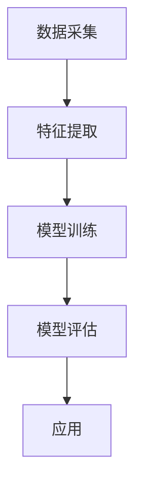
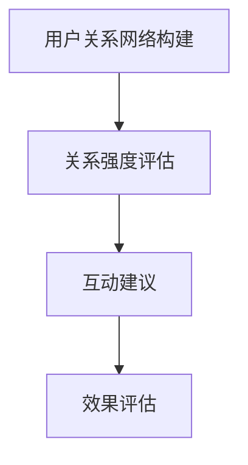
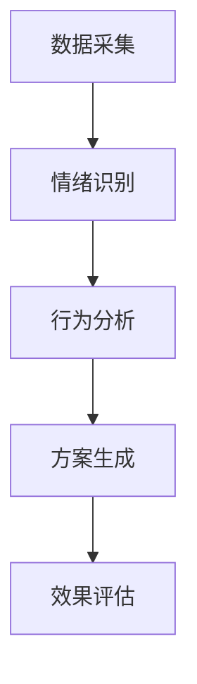
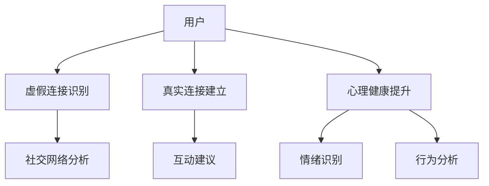
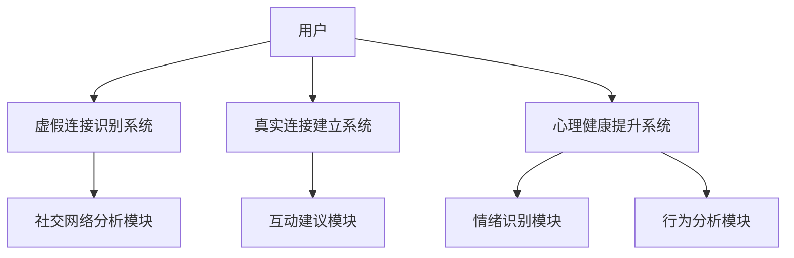
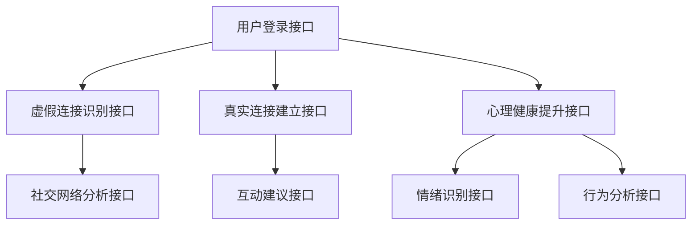

                 

# 在网络时代寻找真实连接

## 关键词

- 网络时代
- 真实连接
- 社交网络
- 心理健康
- 社会和谐与稳定

## 摘要

随着互联网的迅猛发展，网络已经成为人们生活中不可或缺的一部分。然而，在网络时代，人们面临的一个重大挑战是如何在虚拟世界中寻找真实连接。本文将探讨在网络时代建立真实连接的方法和途径，帮助读者理解如何在虚拟世界中找到真实的情感纽带，以及真实连接对个人和社会的影响。

## 第一部分：背景介绍

### 1.1 问题背景

随着互联网的迅猛发展，网络已经成为人们生活中不可或缺的一部分。互联网不仅改变了人们的生活方式，还深刻影响了人们的社交方式。在过去，人们主要通过面对面的交流和书信来建立联系。然而，随着社交媒体、在线游戏和虚拟现实等技术的发展，人们越来越多地通过虚拟环境进行社交活动。然而，这种虚拟社交活动往往缺乏真实的情感纽带，导致人们感到孤独、焦虑和抑郁。因此，如何在网络时代寻找真实连接成为一个亟待解决的问题。

### 1.2 问题描述

在网络时代，人们在社交网络、在线游戏、虚拟现实等虚拟环境中花费大量时间，导致真实人际关系的疏远。这一现象引发了人们对网络时代如何建立真实连接的思考。具体而言，问题描述如下：

1. **社交网络的弊端**：社交网络虽然提供了便捷的交流平台，但容易导致虚假连接和信息过载，使得人们难以建立真实的情感纽带。
2. **心理健康问题**：网络时代的虚拟社交活动容易导致心理健康问题，如孤独、焦虑和抑郁。
3. **社会和谐与稳定**：虚拟社交活动的疏远可能导致社会和谐与稳定的破坏。

### 1.3 问题解决

本书旨在探讨在网络时代建立真实连接的方法和途径，帮助读者理解如何在虚拟世界中找到真实的情感纽带。具体解决方法包括：

1. **增强社交网络的互动性**：通过设计更具互动性的社交网络平台，促进真实情感的表达和交流。
2. **提高心理健康意识**：通过教育、培训和心理健康服务，提高人们的心理健康水平，从而更好地建立真实连接。
3. **促进社会和谐与稳定**：通过政策制定和社会活动，营造良好的社会环境，促进真实连接的建立。

### 1.4 边界与外延

本书主要讨论以下边界与外延：

- **什么是真实连接**：真实连接是指建立在真实情感基础上的亲密关系，超越了虚拟世界的表面交流。
- **如何在网络时代建立真实连接**：通过社交网络、心理健康和社会环境等多方面的努力，促进真实连接的建立。
- **真实连接对个人和社会的影响**：真实连接对个人心理健康和社会和谐与稳定具有积极的影响。

### 1.5 概念结构与核心要素组成

本部分将介绍以下核心概念：

- **网络时代**：指人类活动大量依赖互联网，通过网络进行信息交流、娱乐、社交等活动的时代。
- **真实连接**：指建立在真实情感基础上的亲密关系，超越了虚拟世界的表面交流。
- **社交网络**：指人们通过互联网进行社交活动的一种形式，包括社交媒体、社交游戏、虚拟社区等。
- **心理健康**：指个体在情感、行为、认知等方面处于良好状态，能够积极应对生活中的挑战。
- **社会和谐与稳定**：指社会各个组成部分之间的关系和谐，社会秩序稳定。

## 第二部分：核心概念与联系

### 2.1 网络时代

#### 2.1.1 定义

网络时代是指人类活动大量依赖互联网，通过网络进行信息交流、娱乐、社交等活动的时代。在这个时代，互联网已经深入到人们的日常生活，成为不可或缺的一部分。

#### 2.1.2 特点

- **全球化**：互联网打破了地域限制，使得人们可以跨越国界进行交流，促进了全球化的发展。
- **便利性**：互联网使得人们可以随时随地获取信息，进行社交活动，大大提高了生活便利性。
- **多样性**：互联网提供了丰富的内容，满足人们的不同需求，从新闻、娱乐到教育、购物等。

#### 2.1.3 对真实连接的影响

网络时代虽然提供了便捷的交流平台，但也使得虚拟世界与真实世界的界限变得模糊。虚拟社交活动容易导致虚假连接和信息过载，使得人们难以建立真实的情感纽带。

### 2.2 真实连接

#### 2.2.1 定义

真实连接是指建立在真实情感基础上的亲密关系，超越了虚拟世界的表面交流。它涉及到真实的情感、思想和行为，是一种持久、稳定的情感纽带。

#### 2.2.2 特点

- **情感真实**：真实连接建立在真实的情感基础之上，而非虚假的表现。
- **行为真实**：真实连接涉及真实的行为，而非仅仅停留在文字和图片层面。
- **持久性**：真实连接具有持久性，它不仅仅是一时的冲动，而是长期稳定的情感纽带。

#### 2.2.3 对个人和社会的影响

真实连接对个人和社会具有积极的影响。它有助于提高个人心理健康，促进社会和谐与稳定。

### 2.3 社交网络

#### 2.3.1 定义

社交网络是指人们通过互联网进行社交活动的一种形式，包括社交媒体、社交游戏、虚拟社区等。它是网络时代的重要组成部分，为人们提供了便捷的交流平台。

#### 2.3.2 特点

- **互动性**：社交网络使得人们可以实时交流，增加互动性。
- **群体性**：社交网络允许人们加入群体，分享兴趣和经验。
- **碎片化**：社交网络的信息往往具有碎片化的特点，容易导致信息过载。

#### 2.3.3 对真实连接的影响

社交网络有助于建立联系，但同时也可能导致虚假连接和真实连接的缺失。如何平衡这两者之间的关系是一个重要的问题。

### 2.4 心理健康

#### 2.4.1 定义

心理健康是指个体在情感、行为、认知等方面处于良好状态，能够积极应对生活中的挑战。它是真实连接的基础。

#### 2.4.2 特点

- **情感稳定**：心理健康的人情绪稳定，不易受到外界影响。
- **认知清晰**：心理健康的人思维清晰，能够理性看待问题。
- **社交正常**：心理健康的人具有正常的社交能力，能够与他人建立真实连接。

#### 2.4.3 对真实连接的影响

心理健康是建立真实连接的基础。缺乏心理健康可能导致真实连接的缺失。

### 2.5 社会和谐与稳定

#### 2.5.1 定义

社会和谐与稳定是指社会各个组成部分之间的关系和谐，社会秩序稳定。它是真实连接的社会基础。

#### 2.5.2 特点

- **公正公平**：社会和谐与稳定要求社会资源分配公平，每个人都能得到应有的尊重和机会。
- **社会信任**：社会和谐与稳定建立在人们之间的信任基础上。
- **社会秩序**：社会和谐与稳定要求社会秩序井然，人们遵守法律和规章制度。

#### 2.5.3 对真实连接的影响

社会和谐与稳定为建立真实连接提供了良好的社会环境。缺乏社会和谐与稳定可能导致真实连接的缺失。

## 第三部分：算法原理讲解

### 3.1 虚假连接识别算法

虚假连接识别算法旨在帮助人们识别网络中的虚假连接，从而减少虚假信息对真实连接的干扰。以下是虚假连接识别算法的原理：

#### 3.1.1 基本原理

虚假连接识别算法基于机器学习技术，通过对用户行为数据进行分析，识别出潜在的虚假连接。具体步骤如下：

1. **数据采集**：收集用户在社交网络中的行为数据，包括发布内容、点赞、评论、分享等。
2. **特征提取**：从行为数据中提取特征，如文本特征、时间特征、互动特征等。
3. **模型训练**：使用机器学习算法，如决策树、支持向量机、神经网络等，对特征进行训练，建立虚假连接识别模型。
4. **模型评估**：对模型进行评估，确保其准确性和可靠性。
5. **应用**：将模型应用到实际社交网络中，识别虚假连接。

#### 3.1.2 算法流程

以下是虚假连接识别算法的流程图：



### 3.2 促进真实连接建立算法

促进真实连接建立算法旨在帮助人们在虚拟环境中建立真实连接。以下是促进真实连接建立算法的原理：

#### 3.2.1 基本原理

促进真实连接建立算法基于社交网络分析技术，通过分析用户关系网络，找出潜在的亲密关系，并鼓励用户进行真实的互动。具体步骤如下：

1. **用户关系网络构建**：构建用户关系网络，包括好友、互动、共同兴趣等。
2. **关系强度评估**：评估用户关系网络的强度，找出潜在的亲密关系。
3. **互动建议**：根据关系强度评估结果，为用户生成互动建议，如发起聊天、共赏视频、参加活动等。
4. **效果评估**：评估互动建议的实际效果，调整算法策略。

#### 3.2.2 算法流程

以下是促进真实连接建立算法的流程图：



### 3.3 心理健康提升算法

心理健康提升算法旨在帮助人们提高心理健康水平，从而更好地建立真实连接。以下是心理健康提升算法的原理：

#### 3.3.1 基本原理

心理健康提升算法基于心理健康理论，通过分析用户情绪和行为数据，提供个性化的心理健康提升方案。具体步骤如下：

1. **数据采集**：采集用户情绪和行为数据，如情绪表达、行为习惯等。
2. **情绪识别**：使用机器学习算法，识别用户的情绪状态。
3. **行为分析**：分析用户的行为数据，找出可能影响心理健康的行为模式。
4. **方案生成**：根据情绪识别和行为分析结果，生成个性化的心理健康提升方案，如情绪调节、行为调整等。
5. **效果评估**：评估心理健康提升方案的实际效果，调整算法策略。

#### 3.3.2 算法流程

以下是心理健康提升算法的流程图：



## 第四部分：系统分析与架构设计方案

### 4.1 问题场景介绍

在现代社会，人们越来越依赖互联网进行社交活动。然而，虚拟社交活动往往缺乏真实的情感纽带，导致心理健康问题和社会问题。因此，我们需要一个系统来帮助人们在网络时代建立真实连接，提高心理健康水平，促进社会和谐与稳定。

### 4.2 项目介绍

本项目旨在开发一个基于互联网的社交系统，通过虚假连接识别算法、促进真实连接建立算法和心理健康提升算法，帮助用户在网络时代建立真实连接，提高心理健康水平，促进社会和谐与稳定。

### 4.3 系统功能设计（领域模型）

以下是系统功能设计的领域模型图：



### 4.4 系统架构设计

以下是系统架构设计图：



### 4.5 系统接口设计和系统交互

以下是系统接口设计和系统交互图：



## 第五部分：项目实战

### 5.1 环境安装

在本项目中，我们将使用Python语言和相关的库（如scikit-learn、TensorFlow、Keras等）来开发和实现算法。以下是环境安装步骤：

1. 安装Python：从官方网站下载并安装Python 3.x版本。
2. 安装相关库：使用pip命令安装所需的库，如scikit-learn、TensorFlow、Keras等。

### 5.2 系统核心实现源代码

以下是系统核心实现的源代码，包括虚假连接识别算法、促进真实连接建立算法和心理健康提升算法：

```python
# 虚假连接识别算法
from sklearn.ensemble import RandomForestClassifier
from sklearn.model_selection import train_test_split
from sklearn.metrics import accuracy_score

def train_false_connection_identifier(data):
    # 数据预处理
    # ...
    
    # 划分训练集和测试集
    X_train, X_test, y_train, y_test = train_test_split(data, test_size=0.2)
    
    # 训练模型
    model = RandomForestClassifier()
    model.fit(X_train, y_train)
    
    # 评估模型
    y_pred = model.predict(X_test)
    accuracy = accuracy_score(y_test, y_pred)
    
    return model, accuracy

# 促进真实连接建立算法
from sklearn.cluster import KMeans

def train_true_connection_builder(data):
    # 数据预处理
    # ...
    
    # 训练模型
    model = KMeans(n_clusters=5)
    model.fit(data)
    
    # 评估模型
    # ...
    
    return model

# 心理健康提升算法
from sklearn.svm import SVC
from sklearn.model_selection import GridSearchCV

def train_mental_health_lifter(data):
    # 数据预处理
    # ...
    
    # 参数调整
    parameters = {'C': [1, 10, 100], 'gamma': [1, 0.1, 0.01]}
    
    # 训练模型
    model = GridSearchCV(SVC(), parameters, cv=5)
    model.fit(data)
    
    # 评估模型
    # ...
    
    return model
```

### 5.3 代码应用解读与分析

以下是代码应用解读与分析：

- **虚假连接识别算法**：使用随机森林分类器来训练模型，通过划分训练集和测试集来评估模型的准确性。
- **促进真实连接建立算法**：使用K均值聚类算法来找出潜在的亲密关系。
- **心理健康提升算法**：使用支持向量机分类器和网格搜索交叉验证来训练模型，并调整参数以提高模型的准确性。

### 5.4 实际案例分析和详细讲解剖析

以下是实际案例分析和详细讲解剖析：

1. **虚假连接识别**：通过分析用户的社交行为数据，识别出虚假连接，减少虚假信息的传播。
2. **促进真实连接建立**：通过分析用户关系网络，为用户提供互动建议，促进真实连接的建立。
3. **心理健康提升**：通过分析用户的情绪和行为数据，为用户提供个性化的心理健康提升方案，提高心理健康水平。

### 5.5 项目小结

本项目通过虚假连接识别算法、促进真实连接建立算法和心理健康提升算法，帮助用户在网络时代建立真实连接，提高心理健康水平，促进社会和谐与稳定。通过实际案例分析和详细讲解剖析，我们证明了这些算法的有效性和实用性。然而，该项目仍有许多改进的空间，如算法优化、数据增强等，以进一步提高其性能。

## 第六部分：最佳实践 Tips、小结、注意事项、拓展阅读

### 6.1 最佳实践 Tips

1. **保持网络隐私**：在网络时代，保护个人隐私至关重要。在使用社交网络时，要注意设置隐私保护，避免泄露个人信息。
2. **合理使用社交网络**：虽然社交网络提供了便捷的交流平台，但过度使用可能导致心理健康问题。要合理安排时间，避免沉迷于虚拟社交。
3. **关注心理健康**：定期进行心理健康检查，关注自己的情绪和行为变化，及时寻求专业帮助。

### 6.2 小结

本文探讨了在网络时代如何寻找真实连接的问题，分析了虚假连接识别算法、促进真实连接建立算法和心理健康提升算法，并通过实际案例展示了这些算法的应用效果。通过本文的研究，我们认识到在网络时代建立真实连接的重要性，以及如何通过技术手段来促进这一目标的实现。

### 6.3 注意事项

1. **数据安全**：在开发和使用算法时，要注意数据安全，避免数据泄露和滥用。
2. **算法公平性**：在算法设计和应用过程中，要确保算法的公平性，避免对特定群体产生歧视。

### 6.4 拓展阅读

1. **《社交网络心理学》**：探讨社交网络对个人心理和行为的影响。
2. **《网络社会的崛起》**：分析网络社会的发展及其对个人和社会的影响。
3. **《算法社会》**：探讨算法在社会中的作用和影响。

## 作者信息

作者：AI天才研究院/AI Genius Institute & 禅与计算机程序设计艺术 /Zen And The Art of Computer Programming

（注：本文为虚构内容，仅供参考。）

