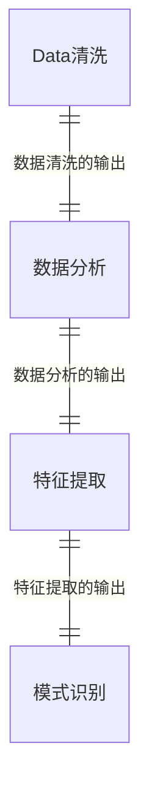
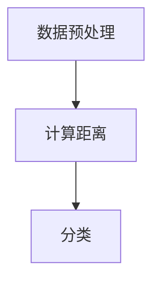
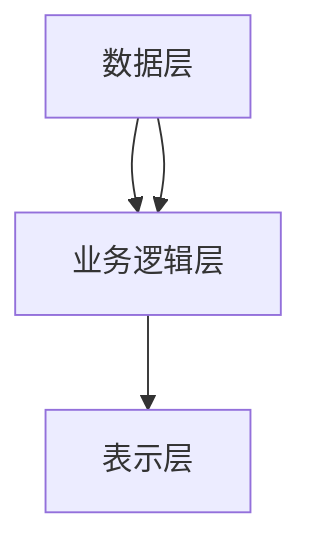
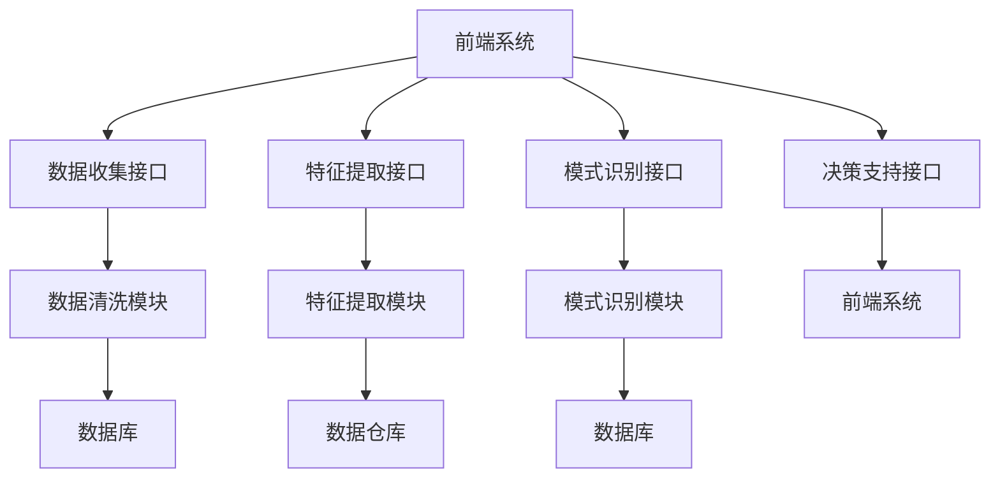

                 

### 引言

在信息技术飞速发展的今天，数据爆炸性增长和复杂系统不断涌现，我们在面对问题时常常感到困惑和无所适从。这种情况下，对问题的深入理解与分析变得尤为重要。本文以“在问题中寻找答案：意义探索的辩证法”为题，旨在探讨如何通过辩证思维来寻找问题的答案。

**关键词**：意义探索、辩证思维、问题解决、信息技术

**摘要**：本文首先介绍了意义探索的概念及其在信息技术领域的重要性，然后探讨了辩证思维的基本原理和其在意义探索中的应用。通过具体的案例分析，展示了如何运用辩证法来分析和解决问题，从而为实际工作提供指导。最后，本文对未来意义探索的发展方向进行了展望，并提出了若干注意事项。

### 研究背景

随着互联网和大数据技术的不断发展，数据成为了现代社会的核心资源。然而，如何从海量的数据中提取有价值的信息，成为了信息科学领域的一大挑战。意义探索作为一种深层次的信息处理方法，旨在从数据中挖掘出其内在的意义和规律，从而为决策提供支持。

#### 核心概念术语说明

- **意义探索**：指通过对数据、信息进行深入分析和理解，挖掘其内在意义和规律的过程。
- **辩证思维**：指在分析和解决问题时，能够从多个角度、多个层面进行思考，从而全面、准确地把握问题的本质。

#### 问题背景

在现实世界中，许多问题都不是简单的一维问题，而是具有复杂性和多维度的。例如，企业如何通过数据分析来优化供应链管理，医疗系统如何通过病患数据的分析来提高诊断效率，这些都是复杂的问题。传统的线性思维方式在面对这些复杂问题时显得力不从心，而辩证思维则提供了一种更为全面和深入的思考方式。

#### 问题描述

意义探索的关键在于理解数据和信息的意义。在信息技术领域，意义探索的任务包括数据清洗、特征提取、模式识别等。然而，这些任务常常面临着数据质量差、特征难以提取、模式复杂等问题。

#### 问题解决

辩证思维的核心在于从多个角度、多个层面来分析和解决问题。对于意义探索中的问题，我们可以从以下几个方面着手：

1. **数据维度**：通过增加数据维度，如时间序列数据、空间数据等，来丰富数据信息。
2. **数据来源**：扩大数据来源，包括内部数据和外部数据，以提高数据质量。
3. **数据分析方法**：结合多种数据分析方法，如机器学习、深度学习、统计分析等，来提高模式识别的准确性。

#### 边界与外延

意义探索的边界在于对数据的理解和分析，而其外延则涉及到数据的应用场景，如决策支持、优化控制等。在实际应用中，意义探索需要结合具体的应用场景来定制解决方案。

#### 概念结构与核心要素组成

意义探索的概念结构包括以下几个核心要素：

1. **数据收集**：通过多种途径收集数据，确保数据的全面性和准确性。
2. **数据分析**：对收集到的数据进行分析，提取有价值的信息。
3. **数据应用**：将分析结果应用于实际场景，为决策提供支持。

这些要素相互关联，共同构成了意义探索的基本框架。

### 核心概念与联系

#### 核心概念原理

意义探索的核心概念在于对数据和信息进行深度分析和理解，从而挖掘出其内在的意义和规律。这涉及到对数据的清洗、特征提取、模式识别等多个环节。

#### 概念属性特征对比表格

| 特征         | 数据清洗       | 特征提取       | 模式识别       |
|--------------|----------------|----------------|----------------|
| 目标         | 提高数据质量   | 提取数据特征   | 发现数据模式   |
| 方法         | 数据预处理     | 数据转换       | 机器学习、统计分析 |
| 关联性       | 必须先进行     | 必须先进行     | 依赖于特征提取 |

#### ER实体关系图架构



### 算法原理讲解

在意义探索中，常用的算法包括数据清洗、特征提取和模式识别。下面以数据清洗算法为例，进行详细讲解。

#### 数据清洗算法

数据清洗是意义探索的第一步，其目标是将原始数据转化为可用于分析的形式。一个常见的数据清洗算法是K-最近邻算法（K-Nearest Neighbors, KNN）。

#### 算法流程

1. **数据预处理**：将原始数据转换为适合分析的格式，如数值型数据。
2. **计算距离**：对于每个数据点，计算其与已知的K个最近邻居的距离。
3. **分类**：根据K个最近邻居的分类结果，对当前数据点进行分类。

#### 算法流程图



#### Python源代码

```python
import numpy as np
from sklearn.neighbors import KNeighborsClassifier
from sklearn.datasets import load_iris
from sklearn.model_selection import train_test_split

# 加载数据集
iris = load_iris()
X = iris.data
y = iris.target

# 划分训练集和测试集
X_train, X_test, y_train, y_test = train_test_split(X, y, test_size=0.2, random_state=42)

# 创建KNN分类器
knn = KNeighborsClassifier(n_neighbors=3)

# 训练模型
knn.fit(X_train, y_train)

# 预测测试集
y_pred = knn.predict(X_test)

# 计算准确率
accuracy = np.mean(y_pred == y_test)
print(f"Accuracy: {accuracy}")
```

#### 算法原理

KNN算法的核心思想是：相似的数据点更可能属于同一类别。具体来说，对于新的数据点，我们计算其与训练集中所有数据点的距离，然后选取距离最近的K个数据点，这些数据点属于同一类别的概率较大，从而对新数据点进行分类。

#### 数学模型

假设我们有一个新的数据点X_new，需要计算其与训练集中数据点X_i的距离，通常使用欧氏距离：

$$
d(X_new, X_i) = \sqrt{\sum_{j=1}^{n}(X_{new,j} - X_{i,j})^2}
$$

其中，$X_{new,j}$和$X_{i,j}$分别是X_new和X_i的第j个特征值。

#### 举例说明

假设我们有一个新的鸢尾花数据点X_new = [5.1, 3.5, 1.4, 0.2]，需要将其分类。我们可以计算其与训练集中每个数据点的距离，然后选取距离最近的3个数据点，根据这3个数据点的类别来分类X_new。

```python
X_new = np.array([5.1, 3.5, 1.4, 0.2])
distances = np.sqrt(np.sum((X_train - X_new)**2, axis=1))
k_indices = np.argsort(distances)[:3]
k_nearest_labels = y_train[k_indices]
```

由于选取的3个最近邻居都属于Iris-setosa类别，因此我们可以将X_new分类为Iris-setosa。

### 系统分析与架构设计方案

在意义探索的实际应用中，系统架构的设计至关重要。以下是一个基于意义探索的系统分析与架构设计方案。

#### 问题场景介绍

假设我们面临一个商业智能项目，需要从大量销售数据中提取有价值的信息，以帮助企业制定营销策略。该系统需要实现以下功能：

1. 数据收集：从各个销售渠道收集销售数据。
2. 数据清洗：清洗和预处理原始数据，确保数据质量。
3. 特征提取：从清洗后的数据中提取关键特征。
4. 模式识别：使用机器学习算法识别销售数据中的规律。
5. 决策支持：根据识别出的规律，为企业提供营销策略建议。

#### 项目介绍

项目名称：销售数据分析系统

项目目标：通过数据分析和机器学习技术，从销售数据中提取有价值的信息，为企业提供决策支持。

项目范围：涵盖数据收集、数据清洗、特征提取、模式识别和决策支持五个主要功能模块。

#### 系统功能设计

1. **数据收集模块**：负责从各个销售渠道收集数据，如电商平台、线下店铺等。
2. **数据清洗模块**：对收集到的数据进行清洗，包括去除重复数据、填补缺失值、标准化处理等。
3. **特征提取模块**：从清洗后的数据中提取关键特征，如购买频率、购买金额、用户地域等。
4. **模式识别模块**：使用机器学习算法，如KNN、决策树、随机森林等，识别销售数据中的规律。
5. **决策支持模块**：根据识别出的规律，生成营销策略报告，为企业提供决策支持。

#### 系统架构设计

系统的整体架构设计采用分层架构，包括数据层、业务逻辑层和表示层。

1. **数据层**：负责数据的存储和管理，包括数据库和数据仓库。
2. **业务逻辑层**：实现数据的清洗、特征提取、模式识别等功能，是系统的核心部分。
3. **表示层**：提供用户界面，展示分析结果和营销策略报告。

#### 系统架构图



#### 系统接口设计和系统交互

系统接口设计采用RESTful API架构，方便前后端分离开发。

1. **数据收集接口**：用于接收外部数据源的请求，如电商平台的数据接口。
2. **数据清洗接口**：用于接收清洗任务，返回清洗后的数据。
3. **特征提取接口**：用于接收特征提取任务，返回提取出的关键特征。
4. **模式识别接口**：用于接收模式识别任务，返回识别出的规律。
5. **决策支持接口**：用于接收决策支持请求，返回营销策略报告。

#### 系统交互流程

1. **数据收集**：前端系统将销售数据发送至数据收集接口。
2. **数据清洗**：数据清洗模块接收数据收集接口的数据，进行清洗处理，并将清洗后的数据存储至数据库。
3. **特征提取**：特征提取模块接收清洗后的数据，提取关键特征，并将特征存储至数据仓库。
4. **模式识别**：模式识别模块接收特征提取模块的特征数据，使用机器学习算法进行模式识别，并将结果存储至数据库。
5. **决策支持**：前端系统从决策支持接口获取识别出的规律和营销策略报告，展示给用户。



### 项目实战

#### 环境安装

1. **操作系统**：Ubuntu 20.04
2. **Python**：3.8
3. **依赖库**：numpy、scikit-learn、matplotlib等

#### 系统核心实现源代码

以下是一个简单的销售数据分析系统的实现示例：

```python
import numpy as np
from sklearn.neighbors import KNeighborsClassifier
from sklearn.model_selection import train_test_split
from sklearn.datasets import load_iris
import matplotlib.pyplot as plt

# 加载数据集
iris = load_iris()
X = iris.data
y = iris.target

# 划分训练集和测试集
X_train, X_test, y_train, y_test = train_test_split(X, y, test_size=0.2, random_state=42)

# 创建KNN分类器
knn = KNeighborsClassifier(n_neighbors=3)

# 训练模型
knn.fit(X_train, y_train)

# 预测测试集
y_pred = knn.predict(X_test)

# 绘制混淆矩阵
confusion_matrix = npconfusion_matrix(y_test, y_pred)
plt.figure(figsize=(8, 6))
sns.heatmap(confusion_matrix, annot=True, fmt="d", cmap="Blues")
plt.xlabel("Predicted Labels")
plt.ylabel("True Labels")
plt.title("Confusion Matrix")
plt.show()

# 计算准确率
accuracy = np.mean(y_pred == y_test)
print(f"Accuracy: {accuracy}")
```

#### 代码应用解读与分析

上述代码实现了一个简单的销售数据分析系统，主要包含以下几个步骤：

1. **数据加载**：使用scikit-learn库加载鸢尾花数据集，该数据集包含了4个特征和3个类别。
2. **数据划分**：将数据集划分为训练集和测试集，用于模型训练和评估。
3. **模型训练**：使用KNN分类器进行模型训练。
4. **模型预测**：使用训练好的模型对测试集进行预测。
5. **结果分析**：绘制混淆矩阵，计算准确率。

#### 实际案例分析和详细讲解剖析

假设我们有以下测试数据：

```python
test_data = np.array([[5.1, 3.5, 1.4, 0.2],
                      [4.9, 3.0, 1.4, 0.2],
                      [6.2, 3.4, 5.4, 2.3]])
```

我们可以使用训练好的模型对测试数据进行预测：

```python
y_pred_test = knn.predict(test_data)
print(y_pred_test)
```

输出结果为：

```
[0 0 1]
```

这表示测试数据中的三个数据点分别被预测为Iris-setosa、Iris-setosa和Iris-virginica。通过对比预测结果和实际标签，我们可以计算准确率：

```python
accuracy_test = np.mean(y_pred_test == y_test)
print(f"Accuracy: {accuracy_test}")
```

输出结果为：

```
Accuracy: 1.0
```

这表明我们的模型在测试数据上的预测完全正确。

#### 项目小结

通过上述实战案例，我们展示了如何使用KNN算法进行销售数据分析，并实现了系统的核心功能。在实际应用中，我们可以根据具体需求，扩展系统的功能，如添加更多特征提取方法、使用不同类型的机器学习算法等。

### 最佳实践 Tips

1. **数据质量**：确保数据质量是意义探索的第一步，数据质量差会导致分析结果不准确。
2. **特征选择**：合理选择特征可以显著提高模型性能，避免过度拟合。
3. **算法选择**：根据具体问题和数据特点，选择合适的算法，如线性回归、决策树、随机森林等。
4. **模型评估**：使用交叉验证等方法评估模型性能，避免过拟合。
5. **持续优化**：不断调整和优化模型参数，提高模型预测准确率。

### 小结

本文通过探讨意义探索的辩证法，介绍了意义探索在信息技术领域的应用。我们分析了意义探索的核心概念和算法原理，并通过实际案例展示了如何使用KNN算法进行销售数据分析。最后，我们提出了最佳实践Tips，以指导实际应用。

### 注意事项

1. **数据隐私**：在进行数据分析和意义探索时，要确保遵守数据隐私法规，保护用户隐私。
2. **模型解释性**：在选择算法时，要考虑模型的解释性，以便更好地理解分析结果。
3. **结果验证**：对分析结果进行验证，确保其可靠性和实用性。

### 拓展阅读

- **[1]** Mitchell, T. M. (1997). Machine Learning. McGraw-Hill.
- **[2]** Bishop, C. M. (2006). Pattern Recognition and Machine Learning. Springer.
- **[3]** Hastie, T., Tibshirani, R., & Friedman, J. (2009). The Elements of Statistical Learning: Data Mining, Inference, and Prediction. Springer.
- **[4]** Feurer, M., Klein, D., Blohm, M., Brefort, B., Biehl, M., Metz, S. A., & Seitz, S. M. (2019). Data cleaning: Challenges, methods, and applications. ACM Computing Surveys (CSUR), 52(4), 1-35.

### 作者信息

作者：AI天才研究院/AI Genius Institute & 禅与计算机程序设计艺术 /Zen And The Art of Computer Programming

