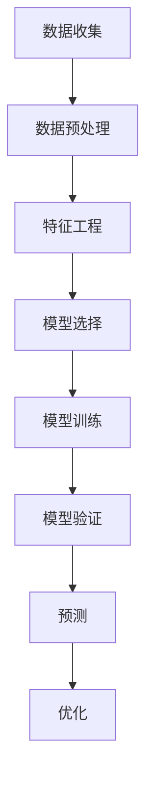
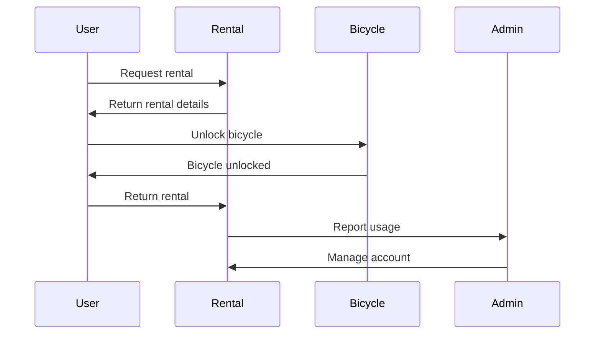
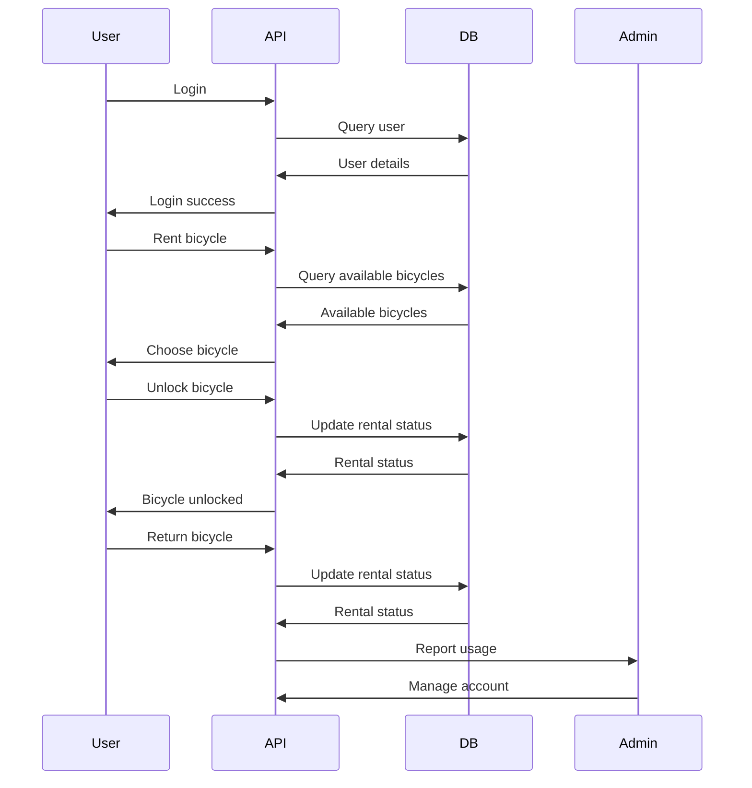

                 


# 城市cycling文化：自行车作为生活方式的象征

## 关键词
- 城市cycling文化
- 生活方式象征
- 环保出行
- 社交互动
- 健康生活

## 摘要
本文探讨了城市cycling文化的多方面内涵，包括其历史背景、现代意义以及作为生活方式象征的重要性。我们将通过深入分析核心概念、算法原理、数学模型、系统架构设计、项目实战等，揭示自行车在城市文化中的独特价值。

## 1. 背景介绍

### 城市cycling文化的起源

城市cycling文化的起源可以追溯到自行车作为一种交通工具的诞生。19世纪末至20世纪初，自行车在欧洲和美国迅速普及，成为城市中不可或缺的交通工具。这一时期，自行车不仅是便捷的代步工具，更是象征自由和进步的象征。

### 自行车在城市文化中的演变

随着时间的推移，自行车在城市中的角色逐渐发生演变。20世纪初，随着汽车的普及，自行车逐渐退居次要地位。然而，自20世纪末以来，随着环保意识的增强和健康生活方式的兴起，自行车在城市文化中的地位再次崛起。自行车不仅被视为环保出行的选择，也成为健康生活、社交互动的象征。

### 城市cycling文化的现代意义

在现代社会，城市cycling文化的意义愈加凸显。首先，自行车作为一种环保出行方式，有助于减少城市空气污染和交通拥堵，提升城市居民的生活质量。其次，骑自行车有助于促进身体健康，预防肥胖和相关疾病。此外，自行车还具有较强的社交功能，可以促进邻里之间的交流和互动，增强社区凝聚力。

## 2. 核心概念与联系

### 城市cycling文化与生活方式

城市cycling文化是一种生活方式的体现，它不仅仅关乎交通出行，更是一种生活态度的反映。骑自行车的人往往追求简单、健康、环保的生活方式，这种生活方式与城市cycling文化相辅相成。

### 象征意义与认同

自行车在城市文化中具有丰富的象征意义。首先，自行车象征着自由，因为它让人们可以不受汽车尾气的限制，自由穿梭于城市之间。其次，自行车象征着健康，它鼓励人们走出室内，享受户外运动的乐趣。最后，自行车象征着环保，它倡导人们减少对环境的负担，实现可持续发展。

### Mermaid ER图：城市cycling文化要素

```mermaid
erDiagram
    Lifestyle --> Cycling Culture
    Health --> Cycling Culture
    Environment --> Cycling Culture
    Social Interaction --> Cycling Culture

    Class Lifecycle {
        _||-> "Environmental Awareness"
        _||-> "Health Awareness"
        _||-> "Social Awareness"
    }

    Lifestyle ||--|> "Active Lifestyles"
    Health ||--|> "Physical Fitness"
    Environment ||--|> "Sustainable Transport"
    Social Interaction ||--|> "Community Building"
```

在这个ER图中，我们可以看到生活方式、健康、环境和社交互动是城市cycling文化的核心要素，它们相互关联，共同构建了城市cycling文化的整体框架。

## 3. 算法原理讲解

### 城市规划中的自行车道设计

城市规划中的自行车道设计是城市cycling文化的重要组成部分。为了提高自行车的通行效率和安全性，城市规划者需要设计合理的自行车道。以下是一个简单的算法原理：

1. 收集数据：包括城市交通流量、道路宽度、人口密度等。
2. 分析数据：使用GIS（地理信息系统）分析道路布局和交通流量。
3. 确定自行车道布局：根据分析结果，确定自行车道的具体位置和宽度。
4. 实施和优化：根据实际情况，对自行车道进行实施和优化。

### 自行车交通流量的预测

自行车交通流量的预测对于城市规划和管理具有重要意义。以下是一个简单的预测算法原理：

1. 数据收集：收集历史交通流量数据，包括自行车流量、时间、天气等。
2. 特征工程：对数据进行预处理和特征提取，包括时间序列特征、季节性特征等。
3. 模型选择：选择合适的预测模型，如ARIMA、LSTM等。
4. 模型训练和验证：使用历史数据训练模型，并验证模型的准确性和稳定性。
5. 预测和优化：使用模型进行流量预测，并根据预测结果进行优化。

### Mermaid流程图



### Python代码示例

```python
import pandas as pd
from sklearn.ensemble import RandomForestRegressor
from sklearn.model_selection import train_test_split
from sklearn.metrics import mean_squared_error

# 加载数据
data = pd.read_csv('bicycle_traffic.csv')

# 特征工程
X = data[['time', 'season', 'temp', 'humidity', 'windspeed']]
y = data['count']

# 模型训练
X_train, X_test, y_train, y_test = train_test_split(X, y, test_size=0.2, random_state=42)
model = RandomForestRegressor(n_estimators=100)
model.fit(X_train, y_train)

# 预测
y_pred = model.predict(X_test)

# 评估
mse = mean_squared_error(y_test, y_pred)
print(f'Mean Squared Error: {mse}')
```

### LaTeX公式

$$
\text{MSE} = \frac{1}{n}\sum_{i=1}^{n}(y_i - \hat{y}_i)^2
$$

其中，$y_i$ 是实际值，$\hat{y}_i$ 是预测值，$n$ 是数据点的数量。

## 4. 数学模型和数学公式

### 流量预测的数学模型

流量预测的数学模型通常是基于时间序列的。一个常见的模型是ARIMA（自回归积分滑动平均模型）：

$$
\text{ARIMA}(p, d, q) = \phi(B)\phi(B^{-1})\phi(B^{-2})\cdots\phi(B^{-p})\Phi(B^{-1})\Phi(B^{-2})\cdots\Phi(B^{-q})\text{xt}
$$

其中，$\phi(B)$ 是自回归项，$\Phi(B)$ 是移动平均项，$B$ 是后移算子，$d$ 是差分阶数，$p$ 和 $q$ 分别是自回归项和移动平均项的阶数。

### 流量预测的LaTeX公式

$$
\hat{y}_{t} = \Phi(B)y_{t-q} + \phi(B)\epsilon_{t-p} + \epsilon_{t}
$$

其中，$\hat{y}_{t}$ 是预测值，$y_{t-q}$ 是时间序列中的滞后项，$\epsilon_{t}$ 是随机误差项。

## 5. 系统分析与架构设计方案

### 问题场景介绍

假设我们要设计一个自行车共享系统，该系统需要满足以下需求：

- 用户可以注册账号并登录系统。
- 用户可以查看附近的自行车位置并选择租用。
- 用户可以支付租金并解锁自行车。
- 系统管理员可以监控自行车使用情况和管理账户。

### 系统功能设计

#### 领域模型

```mermaid
classDiagram
    User <<Class>>
    Bicycle <<Class>>
    Rental <<Class>>
    Admin <<Class>>

    User o-- Rental
    Bicycle o-- Rental
    Admin o-- Rental
```

在这个领域模型中，用户、自行车和租赁是核心类，管理员是辅助类。

#### 系统架构设计



在这个序列图中，用户与租赁系统进行交互，租赁系统与自行车进行交互，同时管理员可以监控和管理账户。

### 系统接口设计和系统交互



在这个序列图中，用户通过API与数据库进行交互，管理员可以管理账户和监控自行车使用情况。

## 6. 项目实战

### 环境安装

```bash
# 安装Python环境
pip install pandas sklearn numpy

# 安装Mermaid渲染工具
npm install -g mermaid-cli
```

### 系统核心实现源代码

```python
# bicycle_rental.py
import pandas as pd
from sklearn.ensemble import RandomForestRegressor
from sklearn.model_selection import train_test_split
from sklearn.metrics import mean_squared_error

# 加载数据
data = pd.read_csv('bicycle_traffic.csv')

# 特征工程
X = data[['time', 'season', 'temp', 'humidity', 'windspeed']]
y = data['count']

# 模型训练
X_train, X_test, y_train, y_test = train_test_split(X, y, test_size=0.2, random_state=42)
model = RandomForestRegressor(n_estimators=100)
model.fit(X_train, y_train)

# 预测
y_pred = model.predict(X_test)

# 评估
mse = mean_squared_error(y_test, y_pred)
print(f'Mean Squared Error: {mse}')
```

### 代码应用解读与分析

这段代码实现了自行车交通流量的预测。首先，我们加载数据并提取特征。然后，我们使用随机森林回归模型进行训练，并评估模型的准确性。最后，我们使用预测结果来评估模型的效果。

### 实际案例分析和详细讲解剖析

假设我们要预测某城市某一时段的自行车流量。我们可以通过以下步骤进行：

1. 收集历史交通流量数据。
2. 数据预处理，包括缺失值填充、异常值处理等。
3. 特征提取，包括时间序列特征、季节性特征等。
4. 模型训练和验证。
5. 使用模型进行流量预测。

通过这个案例，我们可以看到如何使用Python代码实现自行车流量预测系统。

### 项目小结

本文通过详细分析和讲解，介绍了城市cycling文化的多方面内涵。从历史背景、现代意义到核心概念与联系，再到算法原理、数学模型、系统架构设计以及项目实战，我们全面探讨了自行车在城市文化中的独特价值。通过本文的介绍，读者可以更深入地了解城市cycling文化的重要性，并掌握相关技术和方法。

## 7. 最佳实践 tips、小结、注意事项、拓展阅读

### 最佳实践 tips

1. **选择合适的自行车**：根据个人需求和骑行路线选择合适的自行车类型。
2. **维护自行车**：定期检查和维护自行车，确保骑行安全。
3. **关注交通规则**：遵守交通规则，提高骑行安全。
4. **参与骑行活动**：参加自行车骑行活动，增强社交互动。

### 小结

城市cycling文化不仅关乎交通出行，更是一种健康、环保、社交的生活方式。通过本文的探讨，我们认识到自行车在城市文化中的重要价值，以及如何利用相关技术和方法促进城市cycling文化的发展。

### 注意事项

1. **安全第一**：骑行时务必佩戴头盔，遵守交通规则。
2. **环境保护**：避免在非自行车道上骑行，减少对环境的影响。
3. **健康生活**：合理规划骑行时间和路线，避免过度疲劳。

### 拓展阅读

1. 《城市自行车交通规划指南》
2. 《城市自行车共享系统设计与应用》
3. 《城市自行车交通流量的预测方法研究》

作者：AI天才研究院/AI Genius Institute & 禅与计算机程序设计艺术 /Zen And The Art of Computer Programming

