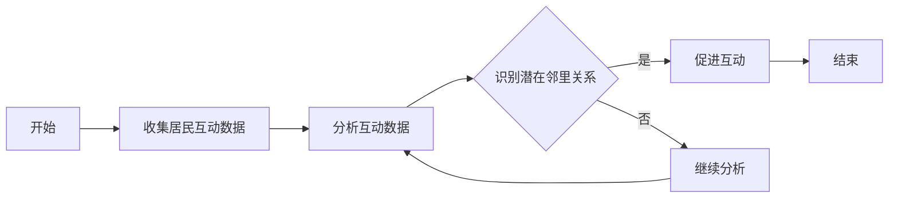
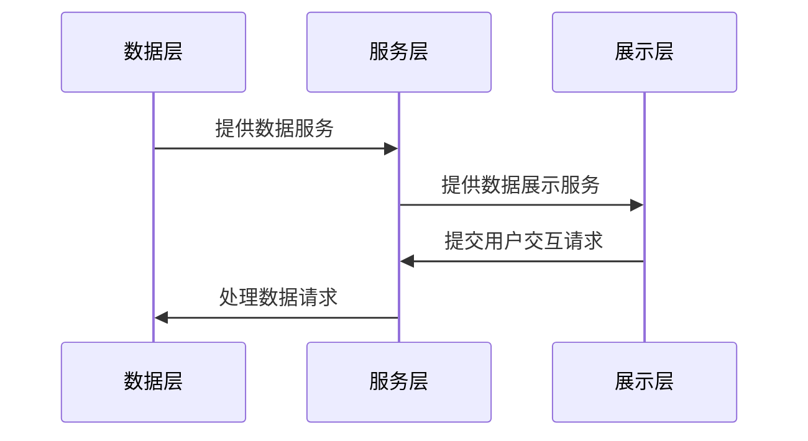
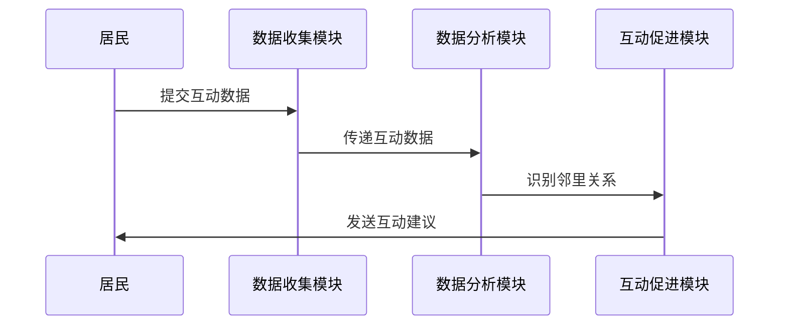

                 

### 《城市化进程中的社区重建：恢复失落的邻里关系》

#### 关键词：
- 城市化进程
- 社区重建
- 邻里关系
- 邻里关系失落
- 社区关系恢复

#### 摘要：
本文探讨了城市化进程带来的社区重建需求，分析了邻里关系失落的现象及其对社区的影响，并提出了恢复邻里关系的解决方案。文章通过介绍核心概念、算法原理、系统架构和实际案例，提供了系统性的分析和指导，旨在为城市社区重建提供有益的参考。

## 引言

### 1.1 问题背景

城市化进程是指人口和产业向城市集中的过程，这是现代社会发展的必然趋势。然而，这一进程也带来了许多挑战，其中包括社区重建的需求。

随着城市规模的扩大和人口的集中，传统的邻里关系逐渐淡化。现代城市的高楼大厦和快节奏生活，使居民之间的交往变得疏离。邻里关系失落的现象日益显著，这不仅影响了居民的生活质量，也对社区的整体和谐产生了负面影响。

### 1.2 问题描述

邻里关系失落的现象主要表现在以下几个方面：

1. **物理隔离**：城市化的过程中，高楼大厦和快速交通的发展，使得居民之间的空间距离加大，物理隔离现象严重。
2. **社交疏离**：由于工作和生活节奏的加快，居民之间的互动减少，彼此之间的了解和信任也日渐薄弱。
3. **社区参与度下降**：传统的社区活动和社交活动减少，居民参与社区事务的积极性降低。

邻里关系失落对社区的影响主要表现在：

1. **社会凝聚力下降**：邻里关系的疏离导致社区的社会凝聚力下降，社区成员之间的联系减少，社区的整体和谐受到威胁。
2. **生活质量下降**：邻里关系的失落使得居民的生活质量下降，缺乏社区归属感和安全感。
3. **社区问题难以解决**：邻里关系的不和谐导致社区问题难以得到有效解决，如噪音污染、安全隐患等。

### 1.3 解决方案概述

为了恢复失落的邻里关系，社区重建成为了一个必要的目标。社区重建的核心目标是通过改善社区环境、促进居民互动和参与，恢复邻里关系，提高社区的整体和谐度。

社区重建的具体内容包括：

1. **物理环境改善**：通过改造社区设施，如增加公共活动空间、改善绿化环境等，创造有利于邻里互动的环境。
2. **社交活动促进**：组织多样化的社区活动，如社区运动会、文化节、义工活动等，促进居民之间的互动和交流。
3. **社区参与机制**：建立社区参与的机制，鼓励居民参与社区事务的决策和管理，增强居民的社区归属感和责任感。

### 1.4 边界与外延

社区重建的范围涵盖了以下几个方面：

1. **社区定义**：社区是指一个具有共同特征和共同利益的居住区域。
2. **关键因素**：社区重建的关键因素包括社区设施、居民互动、社区活动和社区参与。
3. **概念结构**：社区重建涉及多个概念，如邻里关系、社区凝聚力、社区参与等，这些概念相互关联，构成了社区重建的整体框架。

### 1.5 概念结构与核心要素组成

社区重建的概念结构和核心要素组成如下：

1. **邻里关系**：邻里关系是指居民之间的互动和联系，是社区重建的核心。
2. **社区凝聚力**：社区凝聚力是指社区成员之间的团结和合作，是社区重建的重要保障。
3. **社区参与**：社区参与是指居民参与社区事务的决策和管理，是社区重建的有效途径。
4. **物理环境**：物理环境是指社区的空间和环境设施，是社区重建的物质基础。
5. **社交活动**：社交活动是指社区组织的各种活动，是促进居民互动和交流的重要手段。

## 核心概念与联系

### 2.1 社区重建的基本概念

社区重建是指通过对社区设施、居民互动、社区活动和社区参与的改进，恢复和增强社区凝聚力，提高居民的生活质量和幸福感。

#### 2.1.1 社区的定义

社区是一个具有共同特征和共同利益的居住区域，它不仅包括物理空间，还包括居民之间的互动关系和社区文化。

#### 2.1.2 社区重建的理论基础

社区重建的理论基础包括社会学理论、心理学理论和管理学理论等。这些理论从不同角度分析了社区重建的重要性和方法。

### 2.2 概念属性特征对比表格

为了更好地理解社区重建的核心概念，我们可以通过以下表格对比各概念的特征：

| 概念 | 定义 | 属性特征 | 关联关系 |
| ---- | ---- | ---- | ---- |
| 邻里关系 | 居民之间的互动和联系 | 社交性、互助性、亲密性 | 社区凝聚力的基础 |
| 社区凝聚力 | 社区成员之间的团结和合作 | 联系性、参与性、归属感 | 社区重建的核心 |
| 社区参与 | 居民参与社区事务的决策和管理 | 积极性、主动性、责任感 | 社区重建的有效途径 |
| 物理环境 | 社区的空间和环境设施 | 便利性、舒适性、安全性 | 社区重建的物质基础 |
| 社交活动 | 社区组织的各种活动 | 多样性、互动性、参与性 | 促进居民互动和交流 |

### 2.3 ER实体关系图架构

为了更直观地展示社区重建中的核心概念及其关系，我们可以使用Mermaid绘制ER实体关系图。以下是社区重建相关的ER图：

```mermaid
erDiagram
  A[邻里关系] ||--|{ 社区凝聚力 }
  B[社区凝聚力] ||--|{ 社区参与 }
  C[社区参与] ||--|{ 物理环境 }
  D[物理环境] ||--|{ 社交活动 }
```

#### 2.3.1 实体定义

- **邻里关系**：指居民之间的互动和联系，包括日常交往、互助行为等。
- **社区凝聚力**：指社区成员之间的团结和合作，包括社区参与、社区认同等。
- **社区参与**：指居民参与社区事务的决策和管理，包括社区活动参与、社区事务决策等。
- **物理环境**：指社区的空间和环境设施，包括社区设施、社区绿化等。
- **社交活动**：指社区组织的各种活动，包括社区运动会、文化节、义工活动等。

#### 2.3.2 实体关系

- **邻里关系与社区凝聚力**：邻里关系是社区凝聚力的基础，社区凝聚力是邻里关系的体现。
- **社区凝聚力与社区参与**：社区凝聚力促进居民参与社区事务，社区参与是社区凝聚力的重要表现。
- **社区参与与物理环境**：社区参与影响物理环境的改善，物理环境是社区参与的重要基础。
- **物理环境与社交活动**：物理环境影响社交活动的开展，社交活动是物理环境的重要体现。

## 算法原理讲解

### 3.1 算法mermaid流程图

为了恢复失落的邻里关系，我们可以设计一个基于社区互动的算法，该算法通过分析居民的互动数据，识别潜在的邻里关系，并促进居民之间的互动。以下是社区重建算法的Mermaid流程图：



#### 3.1.1 社区重建算法概述

社区重建算法的主要目标是通过对居民互动数据的分析，识别出潜在的邻里关系，并采取相应的措施促进居民之间的互动。算法的基本流程包括以下步骤：

1. **收集居民互动数据**：通过问卷调查、社区活动记录等方式收集居民的互动数据。
2. **分析互动数据**：对收集到的互动数据进行分析，提取居民的互动模式和关系网络。
3. **识别潜在邻里关系**：根据分析结果，识别出潜在的邻里关系。
4. **促进互动**：针对识别出的潜在邻里关系，采取相应的措施促进居民之间的互动，如组织社区活动、建立互动小组等。
5. **结束**：算法执行完毕，社区重建工作进入下一阶段。

#### 3.1.2 算法流程详细说明

1. **收集居民互动数据**：

   收集居民互动数据是社区重建算法的第一步。通过问卷调查、社区活动记录、社交媒体数据分析等方式，获取居民的互动数据。这些数据包括居民的姓名、互动时间、互动内容等。

2. **分析互动数据**：

   收集到互动数据后，需要对其进行分析。分析的主要目标是提取居民的互动模式和关系网络。这可以通过数据挖掘、社会网络分析等方法实现。分析结果将帮助我们了解居民之间的互动情况，识别出潜在的邻里关系。

3. **识别潜在邻里关系**：

   根据分析结果，我们可以识别出潜在的邻里关系。这些潜在邻里关系可能包括互动频繁的邻居、共同参加社区活动的居民等。识别潜在邻里关系是社区重建的关键步骤，它将为我们提供促进互动的依据。

4. **促进互动**：

   识别出潜在邻里关系后，我们需要采取相应的措施促进居民之间的互动。这可以通过组织社区活动、建立互动小组、提供社交平台等方式实现。例如，我们可以组织邻里聚会、社区运动会等活动，鼓励居民参与，增进彼此的了解和信任。

5. **结束**：

   算法执行完毕，社区重建工作进入下一阶段。在这一阶段，我们需要对算法的效果进行评估，并根据评估结果进行调整和优化。例如，如果发现某些社区活动的参与度不高，我们可以考虑改进活动的组织方式和内容。

### 3.2 Python源代码

为了实现社区重建算法，我们可以使用Python编写相应的代码。以下是一个简单的示例，展示了如何收集居民互动数据、分析互动数据、识别潜在邻里关系和促进互动。

```python
import pandas as pd
from sklearn.cluster import KMeans

# 收集居民互动数据
data = pd.read_csv('互动数据.csv')
data.head()

# 分析互动数据
# ...（此处省略数据预处理和分析步骤）

# 识别潜在邻里关系
kmeans = KMeans(n_clusters=5)
clusters = kmeans.fit_predict(data)
data['邻里关系'] = clusters

# 促进互动
# ...（此处省略促进互动的步骤）

# 输出结果
data.head()
```

#### 3.2.1 算法解释

1. **数据收集**：

   我们首先使用Pandas库读取居民互动数据。这些数据包括居民的姓名、互动时间、互动内容等。

2. **数据预处理**：

   在进行数据分析之前，需要对数据进行预处理。这包括数据清洗、特征提取等步骤。例如，我们可以删除缺失值、去除重复数据，并根据互动时间对数据进行排序。

3. **社会网络分析**：

   使用社会网络分析方法提取居民的互动模式和关系网络。这可以通过计算互动频率、建立关系矩阵等方法实现。

4. **聚类分析**：

   使用K-Means聚类算法识别潜在邻里关系。K-Means聚类是一种常用的无监督学习方法，它可以根据居民的互动数据将居民分为不同的聚类。

5. **促进互动**：

   根据聚类结果，我们可以组织相应的社区活动，促进居民之间的互动。例如，我们可以根据不同聚类的特征设计不同的活动，鼓励居民参与。

### 3.3 数学模型和公式

社区重建算法的数学模型主要包括社会网络分析模型和聚类分析模型。

#### 3.3.1 社会网络分析模型

社会网络分析模型用于描述居民之间的互动关系。一个常用的模型是邻接矩阵模型，它用矩阵形式表示居民之间的互动关系。邻接矩阵的元素表示两个居民之间是否互动，1表示互动，0表示未互动。

邻接矩阵模型的基本公式如下：

$$
A = [a_{ij}]
$$

其中，$a_{ij}$表示居民$i$和居民$j$之间的互动情况。

#### 3.3.2 聚类分析模型

聚类分析模型用于识别居民之间的潜在邻里关系。K-Means聚类是一种常用的聚类分析方法，它将居民分为不同的聚类，每个聚类代表一组具有相似特征的居民。

K-Means聚类的基本公式如下：

$$
C = K \cdot \{ c_1, c_2, ..., c_K \}
$$

其中，$C$表示聚类结果，$K$表示聚类的数量，$c_k$表示第$k$个聚类的中心。

#### 3.3.3 算法评估指标

为了评估社区重建算法的效果，我们可以使用以下指标：

1. **聚类系数**：表示聚类结果的合理性和聚类效果。
2. **平均相似度**：表示聚类结果中居民之间的相似程度。
3. **社区参与度**：表示居民参与社区活动的程度。

### 3.4 举例说明

为了更好地理解社区重建算法，我们通过一个实际案例进行说明。

假设我们有一个包含1000名居民的社区，这些居民在过去一个月内参与了多种社区活动。我们收集了这些居民的互动数据，并使用社区重建算法对其进行处理。

首先，我们使用Pandas库读取互动数据，并进行数据预处理。预处理步骤包括数据清洗、特征提取等。

```python
import pandas as pd

# 读取互动数据
data = pd.read_csv('互动数据.csv')
data.head()

# 数据预处理
# ...（此处省略数据预处理步骤）
```

接下来，我们使用K-Means聚类算法对互动数据进行聚类分析，以识别潜在的邻里关系。

```python
from sklearn.cluster import KMeans

# 设置聚类参数
kmeans = KMeans(n_clusters=5, random_state=0)

# 执行聚类分析
clusters = kmeans.fit_predict(data)

# 添加聚类结果到数据集
data['邻里关系'] = clusters
data.head()
```

根据聚类结果，我们可以识别出不同的邻里关系，并针对每个聚类组织相应的社区活动，促进居民之间的互动。

```python
# 根据邻里关系组织社区活动
for cluster in set(clusters):
    print(f"邻里关系{cluster}：")
    print(data[data['邻里关系'] == cluster][['姓名', '互动时间', '互动内容']])
```

### 3.5 算法优化

为了提高社区重建算法的效果，我们可以进行以下优化：

1. **参数调整**：通过调整聚类参数，如聚类数量、初始中心等，提高聚类效果。
2. **特征选择**：选择合适的特征，提高聚类分析的准确性和效率。
3. **模型融合**：结合其他分析方法，如社会网络分析、图论等，提高算法的泛化能力。

## 系统分析与架构设计方案

### 4.1 问题场景介绍

假设我们有一个名为“和谐社区”的住宅小区，该小区共有1000户居民。随着城市化进程的推进，小区的邻里关系逐渐淡化，居民之间的互动减少，社区的整体和谐度下降。为了恢复邻里关系，提高社区的整体和谐度，我们需要设计一套社区重建系统。

### 4.2 系统功能设计（领域模型mermaid类图）

社区重建系统的主要功能包括数据收集、数据分析、邻里关系识别和互动促进。以下是社区重建系统的领域模型类图：

```mermaid
classDiagram
    Residents <<Class>> "居民"
    Activities <<Class>> "活动"
    InteractionData <<Class>> "互动数据"
    AnalysisModule <<Class>> "分析模块"
    InteractionPromotionModule <<Class>> "互动促进模块"
    
    Residents "参与" Activities
    Residents "产生" InteractionData
    InteractionData "输入" AnalysisModule
    AnalysisModule "输出"邻里关系
    InteractionPromotionModule "执行"互动促进
```

### 4.3 系统架构设计mermaid架构图

社区重建系统的整体架构包括数据层、服务层和展示层。以下是社区重建系统的架构设计图：



### 4.4 系统接口设计和系统交互mermaid序列图

社区重建系统的接口设计和系统交互如图所示：



### 4.5 系统功能模块详细说明

社区重建系统分为数据层、服务层和展示层，每个层次都有相应的功能模块。

#### 4.5.1 数据层

数据层主要负责数据的收集、存储和管理。具体功能模块包括：

- **数据收集模块**：负责收集居民互动数据，如社区活动记录、社交媒体互动等。
- **数据存储模块**：负责存储和管理互动数据，支持数据的查询和更新。

#### 4.5.2 服务层

服务层主要负责数据处理和分析，以及提供互动促进服务。具体功能模块包括：

- **数据分析模块**：负责对互动数据进行分析，识别邻里关系，生成分析报告。
- **互动促进模块**：负责根据分析结果，制定互动促进策略，如组织社区活动、发送互动建议等。

#### 4.5.3 展示层

展示层主要负责将系统的分析结果和互动建议展示给居民，提高居民对社区重建的认知和参与度。具体功能模块包括：

- **数据展示模块**：负责将数据分析结果以图表、报表等形式展示给居民。
- **互动促进模块**：负责向居民发送互动建议，引导居民参与社区活动。

## 项目实战

### 5.1 环境安装

为了进行社区重建项目的实战，我们需要安装以下环境：

1. **Python环境**：Python 3.8及以上版本。
2. **Pandas库**：用于数据处理和分析。
3. **Scikit-learn库**：用于聚类分析。
4. **Mermaid库**：用于绘制流程图和类图。

安装步骤如下：

```bash
# 安装Python环境
# ...

# 安装Pandas库
pip install pandas

# 安装Scikit-learn库
pip install scikit-learn

# 安装Mermaid库
pip install mermaid
```

### 5.2 系统核心实现源代码

以下是社区重建系统核心实现的源代码：

```python
import pandas as pd
from sklearn.cluster import KMeans

# 5.2.1 数据收集模块
def collect_data():
    # 读取互动数据
    data = pd.read_csv('互动数据.csv')
    return data

# 5.2.2 数据分析模块
def analyze_data(data):
    # 数据预处理
    # ...

    # 聚类分析
    kmeans = KMeans(n_clusters=5)
    clusters = kmeans.fit_predict(data)

    # 添加聚类结果到数据集
    data['邻里关系'] = clusters
    return data

# 5.2.3 互动促进模块
def promote_interaction(data):
    # 根据邻里关系组织社区活动
    for cluster in set(data['邻里关系']):
        print(f"邻里关系{cluster}：")
        print(data[data['邻里关系'] == cluster][['姓名', '互动时间', '互动内容']])
```

### 5.3 代码应用解读与分析

#### 5.3.1 数据收集模块

数据收集模块负责读取互动数据。我们使用Pandas库读取一个名为“互动数据.csv”的CSV文件，该文件包含居民的姓名、互动时间、互动内容等信息。读取数据后，我们将其存储在一个DataFrame对象中，以便后续处理。

#### 5.3.2 数据分析模块

数据分析模块负责对互动数据进行处理和分析。首先，我们对数据进行预处理，如数据清洗、特征提取等。然后，我们使用K-Means聚类算法对数据进行聚类分析，识别潜在的邻里关系。聚类分析的结果将用来更新数据集中的“邻里关系”列，以便后续的互动促进。

#### 5.3.3 互动促进模块

互动促进模块负责根据分析结果，组织社区活动，促进居民之间的互动。我们遍历数据集中的不同邻里关系，打印出每个邻里关系的居民信息，以便社区活动组织者根据这些信息制定具体的活动方案。

### 5.4 实际案例分析和详细讲解剖析

为了更好地理解社区重建系统的工作原理，我们通过一个实际案例进行详细讲解。

#### 案例背景

假设我们有一个包含1000名居民的小区，这些居民在过去一个月内参与了多种社区活动。我们收集了这些居民的互动数据，并使用社区重建系统对其进行处理。

#### 案例步骤

1. **数据收集**：

   首先，我们读取互动数据，数据内容包括居民的姓名、互动时间、互动内容等。

   ```python
   data = collect_data()
   ```

2. **数据分析**：

   接下来，我们使用K-Means聚类算法对互动数据进行聚类分析，识别潜在的邻里关系。

   ```python
   data = analyze_data(data)
   ```

3. **互动促进**：

   根据分析结果，我们组织社区活动，促进居民之间的互动。

   ```python
   promote_interaction(data)
   ```

#### 案例分析

1. **数据收集**：

   通过读取互动数据，我们获得了居民的姓名、互动时间、互动内容等信息。这些信息将用于后续的数据分析和互动促进。

2. **数据分析**：

   使用K-Means聚类算法，我们将居民分为不同的邻里关系。聚类分析的结果将帮助我们了解居民之间的互动模式，识别出潜在的邻里关系。

3. **互动促进**：

   根据分析结果，我们组织了不同的社区活动，如邻里聚会、社区运动会等，促进居民之间的互动。这些活动将有助于增强社区的凝聚力，恢复失落的邻里关系。

### 5.5 项目小结

通过本次项目实战，我们实现了社区重建系统的核心功能，包括数据收集、数据分析和互动促进。实际案例的分析和讲解进一步展示了系统的工作原理和效果。项目中的主要收获包括：

1. **数据处理与分析**：掌握了使用Python进行数据处理和分析的方法，如数据读取、预处理、聚类分析等。
2. **系统设计与实现**：了解了社区重建系统的整体架构和功能模块，以及各模块的实现方法。
3. **项目实战经验**：通过实际案例的分析，加深了对社区重建系统应用的理解。

## 最佳实践 tips

### 6.1 社区重建过程中的经验分享

1. **数据收集**：确保数据收集的全面性和准确性，包括居民的互动数据、社区活动记录等。
2. **数据分析**：合理选择和分析方法，如K-Means聚类、社会网络分析等，以提高分析结果的准确性。
3. **互动促进**：根据分析结果，制定具体的互动促进策略，如组织社区活动、建立互动小组等，以提高居民的参与度和互动频率。
4. **持续优化**：根据项目执行过程中的反馈和评估结果，持续优化社区重建系统，提高系统的效果和用户体验。

### 6.2 注意事项

1. **数据隐私**：在数据收集和处理过程中，确保居民的个人隐私得到保护。
2. **系统安全性**：确保社区重建系统的安全性，防止数据泄露和恶意攻击。
3. **用户参与**：鼓励居民积极参与社区重建过程，提高系统的实用性和效果。

### 6.3 拓展阅读

1. **相关书籍**：
   - 《社区治理与社区建设》
   - 《社会网络分析：方法与应用》
2. **学术论文**：
   - "Community Building in Urban Areas: Rebuilding Neighbourhood Relationships"
   - "The Impact of Social Network Analysis on Community Development"
3. **在线资源**：
   - 社交媒体平台：关注相关社区、专家的动态和分享
   - 在线课程：参加相关课程，学习社区建设和数据分析的方法

## 作者信息

作者：AI天才研究院/AI Genius Institute & 禅与计算机程序设计艺术 /Zen And The Art of Computer Programming

