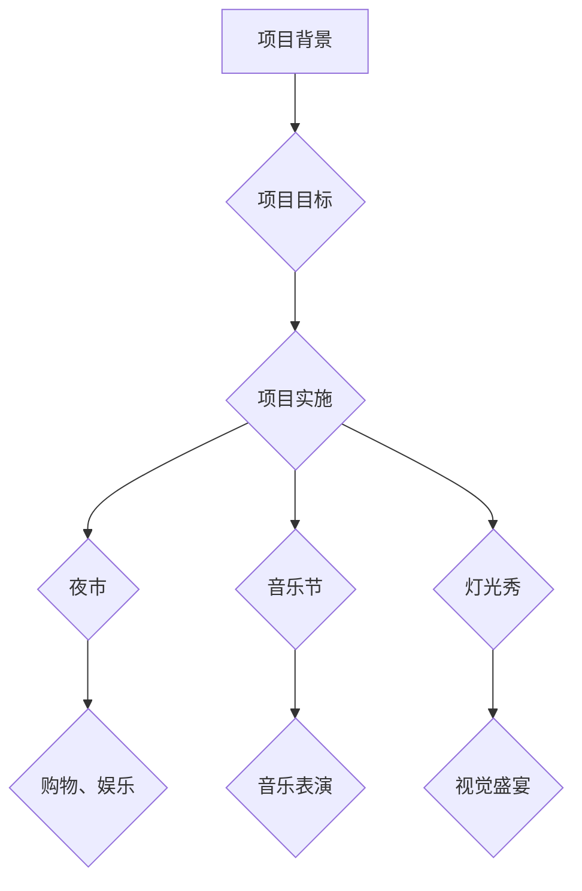
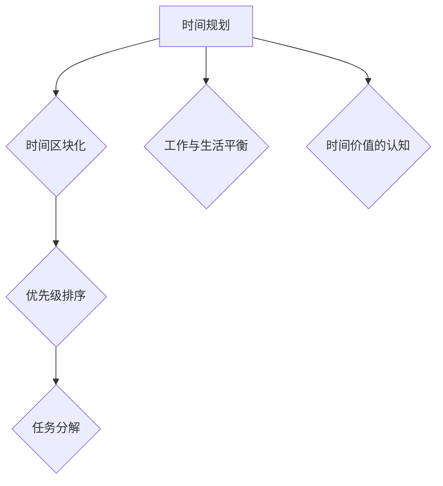

                 

### 文章标题

# 城市夜生活文化：24/7社会中的时间哲学

> 关键词：城市夜生活，时间哲学，24/7社会，文化变迁，时间管理

> 摘要：本文通过深入探讨城市夜生活文化在24/7社会中的演变，结合时间哲学的基本原理，分析了这一文化现象背后的时间观念和社会影响。文章旨在揭示夜生活文化在现代社会中的重要性，以及如何通过时间哲学的视角来理解和优化这一文化形态。

### 引言

随着全球化和城市化进程的加速，城市夜生活文化逐渐成为现代都市生活的重要组成部分。从霓虹闪烁的酒吧街到灯火通明的美食广场，从深夜狂欢的音乐节到深夜书店的静谧阅读，城市夜生活不仅丰富了人们的日常生活，也反映了社会文化和价值观念的变迁。而这一现象背后的时间哲学，更是值得我们深入探讨。

在24/7社会背景下，时间观念发生了显著变化。24小时运作的超市、餐馆、娱乐场所等，使得人们不再局限于传统的作息时间，夜生活逐渐成为日常生活的一部分。这种变化不仅影响了人们的生活方式，也对社会结构和文化产生了深远的影响。本文将围绕城市夜生活文化，结合时间哲学的视角，探讨这一文化现象的内在逻辑和社会影响。

### 文章结构

本文将分为四个主要部分：

1. **城市夜生活文化概述**：介绍城市夜生活的概念、特点以及时间哲学在其中的体现。
2. **核心概念深度剖析**：分析时间哲学的基本原理及其在夜生活文化中的应用。
3. **实践与案例分析**：通过具体案例展示夜生活文化的实际影响和变化。
4. **时间哲学在24/7社会中的角色**：探讨时间哲学在24/7社会背景下的重要性及其对夜生活文化的影响。

接下来，我们将逐一深入探讨这些部分，以揭示城市夜生活文化的本质及其在24/7社会中的角色。

### 第一部分：城市夜生活文化概述

#### 1.1 问题背景与定义

城市夜生活文化，是指在都市的夜晚时段，人们通过娱乐、消费、社交等方式进行的文化活动。这一文化现象不仅丰富了都市人的日常生活，也反映了城市的文化魅力和活力。随着社会的发展和城市化进程的加速，城市夜生活文化逐渐从边缘走向中心，成为城市文化的重要组成部分。

时间哲学是研究时间本质、时间观念及其影响的学科。在24/7社会中，时间哲学的重要性尤为凸显。它不仅影响人们的日常生活，还涉及经济、社会、文化等多个领域。时间哲学关注时间的流逝、时间的价值、时间的管理等核心问题，为理解和优化城市夜生活文化提供了理论依据。

#### 1.2 城市夜生活的兴起

城市夜生活的兴起，可以追溯到工业革命时期。随着城市化进程的加快，城市人口快速增长，夜间的城市活动也逐渐丰富起来。最初的夜生活主要是在咖啡馆、酒吧等场所进行，随着技术的进步和消费文化的兴起，夜生活的形式和内容不断多样化。

电子音乐、夜店、酒吧、夜市等夜生活形式，不仅满足了人们对于娱乐和社交的需求，也成为了城市文化的重要载体。这些活动不仅提供了丰富的文化体验，也促进了城市经济的发展。

#### 1.3 夜生活文化的影响

夜生活文化对城市的影响是多方面的。首先，它提升了城市的活力和吸引力，使得城市在夜晚也具有了独特的魅力。其次，夜生活文化促进了城市旅游业的发展，为城市带来了大量的游客和消费。

此外，夜生活文化还对社会文化产生了深远的影响。它打破了传统的时间观念，使人们不再局限于传统的作息时间，有助于提高生活的多样性和幸福感。同时，夜生活文化也为社会带来了新的问题和挑战，如夜间犯罪、噪音污染等，需要通过有效的管理和规划来解决。

#### 1.4 时间哲学在夜生活中的体现

时间哲学在夜生活中的体现，主要体现在对时间的认知和管理上。在24/7社会中，时间观念发生了显著变化，人们不再受限于传统的作息时间，而是根据个人的需求和偏好来安排自己的时间。

夜生活文化中的时间管理，不仅涉及到个人的作息时间，还包括社交、娱乐、消费等活动的时间安排。如何高效地利用夜间的空闲时间，成为许多人关注的焦点。时间哲学提供了多种时间管理策略，如时间区块化、优先级排序、任务分解等，帮助人们更好地规划和管理自己的时间。

#### 1.5 本章小结

本部分对城市夜生活文化的概念、背景、影响以及时间哲学在其中的体现进行了初步探讨。通过分析，我们可以看到，城市夜生活文化不仅是都市生活的组成部分，也是时间哲学的重要实践场所。在接下来的章节中，我们将进一步深入探讨时间哲学的基本原理及其在夜生活文化中的应用。

### 第二部分：核心概念深度剖析

#### 2.1 时间哲学的原理

时间哲学作为一门研究时间本质、时间观念及其影响的学科，其核心原理涉及多个方面。首先，时间哲学探讨了时间的本质。在传统观念中，时间被认为是线性流逝的，是不可逆的。然而，随着科学的发展，人们逐渐认识到时间具有相对性和可塑性。爱因斯坦的相对论揭示了时间与空间的关系，认为时间是可以被扭曲的。

时间哲学还关注时间的价值。在现代社会，时间被视为一种宝贵的资源，具有不可再生性。时间哲学强调时间的价值，提倡人们珍惜时间，合理利用时间。这一观点在夜生活文化中尤为重要，因为夜间的活动往往需要高效地利用时间，以满足人们的娱乐和社交需求。

#### 2.2 夜生活文化的特性

夜生活文化具有独特的特性，这些特性与时间哲学密切相关。首先，夜生活文化具有时效性。夜生活活动通常在夜晚进行，具有明确的时间限制。这种时效性要求参与者必须合理安排时间，以确保能够充分利用夜间的时光。

其次，夜生活文化具有多样性。从酒吧、夜店、夜市到音乐节、派对，夜生活的形式多种多样，满足了不同人群的需求。这种多样性体现了时间哲学中的多元性，即时间的价值可以根据不同情境和需求进行多样化的应用。

最后，夜生活文化具有互动性。夜生活活动往往需要参与者之间的互动，如社交、娱乐、消费等。这种互动性不仅丰富了夜生活的体验，也反映了时间哲学中的社交属性，即时间不仅是个人生活的工具，也是社交互动的媒介。

#### 2.3 时间哲学与夜生活文化的联系

时间哲学与夜生活文化之间的联系体现在多个方面。首先，时间哲学为夜生活文化提供了理论基础。通过探讨时间的本质和价值，时间哲学为夜生活文化提供了哲学思考的空间，使得夜生活活动不仅仅是物质消费的体现，更是时间观念和文化价值的体现。

其次，时间哲学影响了夜生活文化的表现形式。在24/7社会中，时间观念发生了变化，夜生活文化也随之发生了演变。例如，传统的夜生活活动时间主要集中在晚上，而现在的夜生活活动可以延伸到深夜，甚至凌晨。这种变化反映了时间哲学对夜生活文化的影响，即时间的灵活性和多样性。

最后，时间哲学为夜生活文化提供了管理工具。时间哲学中的时间管理策略，如时间区块化、优先级排序等，可以应用于夜生活活动的规划和组织。通过合理的时间管理，夜生活活动可以更加高效和有序，提高参与者的体验和满意度。

#### 2.4 24/7社会下的时间哲学

在24/7社会中，时间哲学的重要性尤为突出。24/7社会的特点之一是时间的连续性和无间断性。在这种社会背景下，人们对时间的认知和管理发生了显著变化。时间不再被视为一种固定的、不可更改的资源，而是可以被灵活调整和分配。

时间哲学在24/7社会中的应用，主要体现在以下几个方面。首先，时间哲学提倡人们珍惜时间，合理利用时间。在24/7社会中，人们面临的时间压力更大，如何高效地利用时间成为一项重要的挑战。时间哲学提供了多种时间管理策略，帮助人们优化时间利用，提高生活质量。

其次，时间哲学关注时间的多元性。在24/7社会中，人们的生活节奏加快，时间的价值更加多元化。时间哲学鼓励人们根据不同的需求和情境，灵活调整时间的使用方式。例如，在工作日和周末，人们可以有不同的时间安排，以满足工作和生活的需求。

最后，时间哲学强调时间的价值。在24/7社会中，时间的价值被重新定义。不仅工作时间具有价值，休息和娱乐时间也同样重要。时间哲学提倡人们珍惜每一刻，无论是工作还是休息，都要以积极的态度对待时间，提高时间利用效率。

#### 2.5 本章小结

本部分对时间哲学的基本原理、夜生活文化的特性以及时间哲学与夜生活文化的联系进行了深入剖析。通过分析，我们可以看到，时间哲学不仅为夜生活文化提供了理论基础，也影响了夜生活文化的表现形式和管理方式。在24/7社会中，时间哲学的重要性尤为突出，为人们提供了有效的管理工具和价值观。在接下来的章节中，我们将通过实践和案例分析，进一步探讨夜生活文化的实际影响和变化。

### 第三部分：实践与案例分析

#### 3.1 夜生活文化项目介绍

夜生活文化项目是城市文化的重要组成部分，其目的是通过多样化的活动形式，提升城市夜生活的品质和吸引力。以下是一个典型的夜生活文化项目介绍：

**项目名称**：深圳海岸城夜生活项目

**项目背景**：深圳海岸城位于深圳市南山区，是一个集商业、娱乐、文化于一体的综合性商业区。为了提升海岸城的夜生活品质，当地政府决定实施一项夜生活文化项目，以打造具有特色的夜生活品牌。

**项目目标**：通过举办多种夜生活活动，提升海岸城的知名度和吸引力，吸引更多的游客和消费者，推动当地经济的发展。

**项目实施**：项目包括多个子项目，如夜市、音乐节、灯光秀等。夜市主要在周末和节假日举办，集成了美食、手工艺品、服装等摊位，为市民和游客提供了一个购物、娱乐的场所。音乐节则定期邀请国内外知名乐队和艺术家表演，吸引了大量音乐爱好者和游客。灯光秀则通过现代科技手段，展示了海岸城的美丽夜景，为市民和游客提供了视觉盛宴。

#### 3.2 夜生活文化项目案例

以下是对三个不同城市夜生活文化项目的案例分析：

**案例一：北京后海夜生活**

后海夜生活是北京著名的夜生活区域，以其独特的文化氛围和休闲方式吸引了大量游客。后海的夜生活项目主要包括酒吧、咖啡馆、餐厅等，这些场所不仅提供了美食和饮品，还举办各种文化活动和音乐表演。后海夜生活的成功，得益于其文化特色和多样化的活动形式，为游客提供了丰富的夜生活体验。

**案例二：纽约时代广场的24/7文化**

纽约时代广场是全球最著名的商业和文化中心之一，其夜生活文化具有24/7的特点。从午夜到凌晨，时代广场的灯光秀、表演、促销活动等精彩纷呈。时代广场的24/7文化不仅吸引了大量游客，也成为了纽约的标志性景点。这一成功案例展示了24/7社会下，夜生活文化的无限可能性。

**案例三：东京夜生活特色**

东京夜生活以其独特的方式展示了日本文化的魅力。东京的夜生活项目包括深夜食堂、居酒屋、夜市等。深夜食堂以传统的日式料理为主，为游客提供了一个舒适、温馨的用餐环境。居酒屋则提供了饮酒、聊天、娱乐的空间，是东京夜生活的典型代表。夜市则在夜晚聚集了各种美食、手工艺品，为游客提供了丰富的购物和娱乐选择。

#### 3.3 夜生活文化的评价与影响

夜生活文化在社会中具有广泛的影响，其评价和影响可以从以下几个方面进行分析：

**正面影响**：

1. **提升城市形象**：成功的夜生活文化项目可以提升城市的形象和知名度，吸引更多游客和投资。
2. **促进经济发展**：夜生活活动带来了大量的消费和就业机会，有助于推动当地经济的发展。
3. **丰富文化生活**：夜生活文化为市民和游客提供了多样化的文化体验，丰富了城市文化生活。

**负面影响**：

1. **社会问题**：夜生活文化也可能带来一些社会问题，如夜间犯罪、噪音污染等。
2. **健康问题**：频繁的夜生活活动可能导致一些市民的健康问题，如睡眠不足、身体疲劳等。
3. **文化冲突**：在某些地区，夜生活文化与当地传统文化可能存在冲突，导致文化认同感下降。

#### 3.4 时间哲学在夜生活文化中的应用

时间哲学在夜生活文化中的应用主要体现在时间管理和活动策划方面。以下是一些具体的应用策略：

**时间管理策略**：

1. **活动时间安排**：根据不同活动的内容和需求，合理安排活动时间，确保参与者的体验最佳。
2. **时间区块化**：将夜生活活动分为不同的时间段，如餐饮时间、娱乐时间、购物时间等，提高时间的利用率。
3. **优先级排序**：根据活动的重要性和紧急性，合理安排时间，确保关键活动得到充分关注。

**活动策划策略**：

1. **多样化活动形式**：结合不同的文化元素，设计多样化的夜生活活动，满足不同人群的需求。
2. **季节性活动策划**：根据季节变化，策划相应主题的夜生活活动，提高活动的吸引力。
3. **文化融合**：在夜生活活动中融入不同文化元素，促进文化交流和理解。

#### 3.5 本章小结

本部分通过实践和案例分析，探讨了夜生活文化的实际影响和变化。通过具体的项目介绍和案例展示，我们可以看到，夜生活文化不仅丰富了城市文化生活，也对经济发展和社会问题产生了重要影响。在时间哲学的指导下，夜生活文化的管理和发展将更加科学和有效。在接下来的章节中，我们将进一步探讨时间哲学在24/7社会中的角色和影响。

### 第四部分：时间哲学在24/7社会中的角色

#### 4.1 时间哲学在24/7社会的变迁

随着全球化进程的加快和城市化的发展，24/7社会逐渐成为现代社会的典型特征。在这一背景下，时间观念和社会结构发生了显著变化。传统的时间观念以日出而作、日落而息为基础，而24/7社会则打破了这种时间限制，使得人们可以在任何时间进行工作和生活。

时间哲学在24/7社会中的变迁主要体现在以下几个方面：

1. **时间观念的转变**：在24/7社会中，时间不再是固定的，而是具有灵活性和多样性。人们可以根据自己的需求和偏好来安排时间，不再受限于传统的作息时间。
2. **工作时间的变化**：24/7社会下，许多行业和企业实行24小时工作制，员工需要在不同时间段工作，以应对不断变化的市场需求。
3. **生活节奏的加快**：24/7社会的高效性和无间断性，使得人们的日常生活节奏加快，时间管理和压力管理成为重要的课题。

#### 4.2 夜生活文化在24/7社会中的演变

在24/7社会的背景下，夜生活文化也发生了显著的变化。传统夜生活活动的时间和形式得到了拓展和丰富，新的夜生活形式和趋势不断涌现。

1. **时间范围的扩展**：24/7社会使得夜生活活动不再局限于晚上，而是可以延伸到深夜和凌晨。例如，深夜电影院、夜宵市场、深夜健身房等新型夜生活形式应运而生。
2. **内容形式的丰富**：除了传统的娱乐和消费活动，24/7社会下的夜生活文化还包括了更多元化的内容，如文化讲座、艺术展览、夜跑等。这些活动不仅丰富了夜生活的内涵，也提升了夜生活的品质。
3. **社交方式的转变**：随着互联网和移动通信技术的发展，人们的社交方式也发生了变化。线上社交、虚拟现实社交等新型社交方式，使得夜生活不再局限于现实空间，而是可以在虚拟世界中展开。

#### 4.3 时间哲学在24/7社会中的指导作用

时间哲学在24/7社会中具有重要的指导作用，主要体现在以下几个方面：

1. **时间管理策略**：时间哲学提供了一系列时间管理策略，如时间区块化、优先级排序、任务分解等，帮助人们高效地利用时间，提高生活质量。
2. **时间价值的认知**：时间哲学强调时间的价值，提倡人们珍惜时间，合理安排时间的使用。在24/7社会中，时间价值尤为重要，因为它直接影响着工作和生活效率。
3. **工作与生活的平衡**：时间哲学倡导工作与生活的平衡，强调人们需要在繁忙的工作中找到自己的休闲时间，以保持身心健康。在24/7社会下，工作与生活的平衡变得更加重要，因为人们面临的时间压力更大。

#### 4.4 时间哲学在个人生活中的应用

在个人生活中，时间哲学的应用可以帮助我们更好地管理时间，提高生活质量。以下是一些具体的时间哲学应用策略：

1. **时间规划**：通过制定详细的时间规划，明确每天、每周、每月的任务和目标，帮助我们有条不紊地完成各项任务。
2. **时间区块化**：将时间分为不同的区块，如工作区、学习区、休闲区等，根据不同的需求进行时间分配，提高时间利用率。
3. **任务分解**：将复杂任务分解为小任务，逐步完成，避免因任务过多而导致的焦虑和压力。
4. **优先级排序**：根据任务的重要性和紧急性，合理安排时间，确保关键任务得到优先处理。

#### 4.5 夜生活文化与24/7社会的互动

夜生活文化与24/7社会的互动体现在多个方面。首先，夜生活文化为24/7社会提供了丰富的文化体验和休闲方式，提升了社会的活力和吸引力。其次，24/7社会为夜生活文化提供了更广阔的发展空间，使得夜生活形式和内容更加多样化。

在24/7社会下，夜生活文化与时间的互动也表现出新的特点。例如，人们更加注重夜间时间的利用效率，夜生活活动的时间安排更加灵活，以满足不同人群的需求。此外，随着互联网和科技的发展，夜生活文化的线上互动和虚拟体验也日益普及，为人们提供了更多样化的夜生活选择。

#### 4.6 本章小结

本部分探讨了时间哲学在24/7社会中的角色和影响。通过分析，我们可以看到，时间哲学在24/7社会中具有重要的指导作用，不仅帮助人们更好地管理时间，提高生活质量，也影响了夜生活文化的演变和发展。在未来的社会中，随着科技和文化的进一步发展，时间哲学将继续发挥重要作用，为人们的日常生活提供智慧和指导。

### 总结与展望

城市夜生活文化作为现代社会的重要现象，不仅丰富了人们的生活体验，也反映了时间观念和社会结构的变迁。通过对时间哲学的深度剖析，我们可以更清晰地理解城市夜生活文化的本质及其在24/7社会中的角色。时间哲学提供了有效的管理工具和价值观，帮助我们在快速变化的现代社会中更好地规划和管理时间，提高生活质量。

展望未来，随着科技和文化的不断进步，城市夜生活文化将迎来新的发展和变化。虚拟现实、人工智能等新技术将带来更丰富的夜生活体验，同时也会带来新的挑战和问题。时间哲学将继续发挥其指导作用，帮助我们应对这些挑战，实现工作与生活的平衡。

为了进一步深入了解城市夜生活文化和时间哲学的奥秘，以下是一些拓展阅读的建议：

1. **《时间管理艺术》**：大卫·艾伦的《时间管理艺术》提供了实用的时间管理策略，帮助人们更高效地利用时间。
2. **《夜之城》**：克里斯·巴赫曼的《夜之城》详细探讨了城市夜生活文化的历史、现状和未来。
3. **《时间的秩序》**：玛雅·戈尔德里奇的《时间的秩序》从科学和哲学的角度探讨了时间的本质和意义。

通过阅读这些书籍，读者可以更全面地了解城市夜生活文化和时间哲学的深度和广度，为日常生活提供更多的启示和指导。

### 结语

作者：AI天才研究院/AI Genius Institute & 禅与计算机程序设计艺术 /Zen And The Art of Computer Programming

本文通过深入探讨城市夜生活文化在24/7社会中的演变，结合时间哲学的基本原理，分析了这一文化现象背后的时间观念和社会影响。我们希望通过这篇文章，读者能够对城市夜生活文化和时间哲学有更深入的理解，从而更好地规划和管理自己的时间，提升生活质量。

城市夜生活文化不仅是都市生活的组成部分，也是社会文化价值观念的体现。时间哲学为我们提供了理解和优化这一文化形态的视角，使我们能够在快速变化的现代社会中找到平衡和方向。

让我们在未来的日子里，不仅享受城市夜生活的丰富多彩，更深刻地思考时间的价值和管理，共同创造一个更美好、更和谐的社会。

### 附录

#### 1. 时间哲学基本概念表格

| 概念名称 | 定义 | 特点 |
| -------- | ---- | ---- |
| 时间流逝 | 时间的线性流动 | 线性、不可逆 |
| 时间价值 | 时间作为一种资源 | 有限、不可再生 |
| 时间管理 | 对时间的规划与控制 | 高效、有序 |
| 时间观念 | 个体对时间的认知与态度 | 多样性、灵活性 |

#### 2. 夜生活文化特性对比表格

| 特性名称 | 北京后海夜生活 | 纽约时代广场24/7文化 | 东京夜生活特色 |
| -------- | -------------- | --------------------- | -------------- |
| 时效性 | 夜晚活动为主 | 24小时不间断活动 | 夜晚活动丰富 |
| 多样性 | 酒吧、咖啡馆、餐厅 | 商业、文化、娱乐 | 深夜食堂、居酒屋、夜市 |
| 互动性 | 社交、娱乐、购物 | 社交、娱乐、表演 | 社交、娱乐、文化体验 |

#### 3. 时间哲学与夜生活文化联系ER图

```mermaid
erDiagram
    TimePhilosophy ||--|{ CulturalActivity }
    CulturalActivity ||--|{ SocialImpact }
    TimeManagement ||--|{ PersonalLife }
```

#### 4. 夜生活文化项目案例流程图



#### 5. 24/7社会下的时间哲学应用策略



