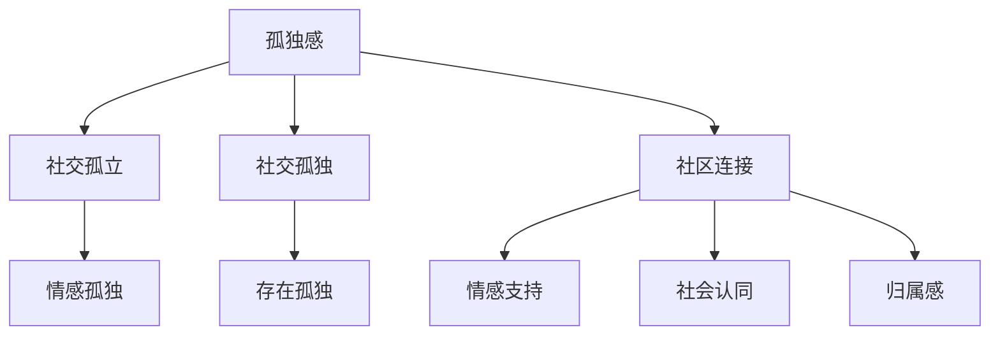

                 

### 《城市孤独干预计划：重建社区连接的策略》

#### 关键词
- 城市孤独
- 社区连接
- 干预策略
- 社交活动
- 科技应用
- 教育与宣传

#### 摘要
在现代社会中，城市孤独已成为一个日益严重的问题。本文旨在探讨城市孤独的背景、核心概念及其影响，并详细阐述一系列干预策略，旨在重建社区连接，改善城市居民的生活质量。本文通过背景介绍、核心概念分析、干预策略讲解、项目实战和最佳实践分享，提供了一套全面且实用的城市孤独干预计划。

----------------------------------------------------------------

# 引言：城市孤独问题的紧迫性

城市化进程的快速发展，带来了物质繁荣的同时，也引发了城市孤独这一社会现象。城市孤独不仅影响个体的心理健康，还对社区的凝聚力和社会稳定产生负面影响。因此，寻找有效的干预策略，重建社区连接，成为当下亟待解决的问题。

本文将围绕以下几个核心议题展开：

1. **城市孤独现象的兴起**：探讨孤独感的普遍性及其在城市化背景下的演变。
2. **核心概念与联系**：介绍孤独、社区连接、干预策略等核心概念，并展示其相互关系。
3. **干预策略与方法**：详细讲解社区参与、社区基础设施改进、科技应用、教育与宣传等干预策略。
4. **项目实战**：通过具体案例展示干预计划的实施过程和效果。
5. **最佳实践与展望**：总结实践经验，展望未来的发展方向。

接下来，我们将一步一步深入分析城市孤独现象及其干预策略。

## 第1章: 城市孤独现象的兴起

### 1.1 城市化与孤独感的兴起

城市化进程的加速，使人们的生活方式、社交方式发生了巨大变化。传统的社区关系被打破，代之而起的是快节奏、高效率的现代生活方式。人们往往为了工作和生活，疲于奔命，缺乏深入的人际交往。这种社会环境的改变，使得孤独感在城市中愈发普遍。

据统计，全球约50%的人口居住在城市中，这一比例预计将在未来几十年内继续上升。城市化带来的生活方式变化，如居住密度增加、社区界限模糊、邻里关系疏离等，都为孤独感的滋生提供了土壤。此外，现代科技的普及，虽然让人们获取信息更加便捷，但也使得面对面交流的机会减少，加剧了人与人之间的疏离感。

### 1.2 城市孤独对个体的影响

城市孤独对个体的心理健康产生深远影响。长期的孤独感可能导致抑郁症、焦虑症等心理问题的发生。研究表明，孤独感与心理健康问题之间存在显著的正相关关系。孤独感还会影响个体的社交能力和情感表达能力，导致人际关系的疏远和社交圈的缩小。

此外，城市孤独还可能对个体的身体健康产生不良影响。孤独感可能导致免疫力下降、睡眠质量恶化、心血管疾病风险增加等健康问题。一项研究发现，城市孤独与心脏病风险之间存在密切联系，长期处于孤独状态的人，心脏病发作的风险显著高于非孤独人群。

### 1.3 城市孤独对社区的影响

城市孤独不仅影响个体，也对社区的整体健康产生负面影响。社区凝聚力下降，邻里关系疏远，导致社区犯罪率上升、社会秩序恶化。孤独感使得居民更加封闭，缺乏参与社区活动的积极性，进而影响社区的文化氛围和公共生活的质量。

社区孤独还会导致社会资源的不合理分配。那些孤独感强烈的居民往往难以获得社会支持，无法充分利用社区资源，从而进一步加剧孤独感。这种恶性循环使得社区内部分群体的生活质量持续下降，社区整体发展受阻。

### 1.4 为什么需要干预城市孤独？

城市孤独问题的严重性，使得干预措施显得尤为必要。首先，从个体层面来看，干预城市孤独有助于改善心理健康，提高生活质量。通过社交活动和社区参与，个体可以获得情感支持，增强自信心，减少孤独感对心理健康的负面影响。

其次，从社区层面来看，干预城市孤独可以增强社区凝聚力，改善邻里关系。通过建设社区基础设施，提供多样化的社交平台，鼓励居民参与社区活动，可以促进居民之间的互动，提升社区的公共生活质量和居民的幸福指数。

最后，从社会层面来看，干预城市孤独有助于构建和谐社会，实现社会资源的合理分配。通过消除孤独感，可以减少社会矛盾，降低犯罪率，促进社会的稳定和发展。

总之，干预城市孤独是一项紧迫且重要的任务，需要政府、社会组织和居民的共同努力。通过多方面的干预策略，我们可以逐步重建社区连接，改善城市居民的生活质量。

## 第2章: 核心概念与联系

### 2.1 孤独与社区连接的定义

孤独和社区连接是本文探讨的核心概念。首先，孤独是一种主观的感受，指个体在情感上与他人疏离、缺乏亲密关系的状态。根据心理学家马丁·塞利格曼（Martin Seligman）的定义，孤独包括情感孤独、社交孤独和存在孤独三个层面。情感孤独是指个体感受到情感上的孤立，缺乏深层次的情感交流；社交孤独是指个体在社交网络中的孤立感，缺乏稳定的人际关系；存在孤独是指个体对自身存在价值的质疑，缺乏归属感和存在感。

社区连接则是指个体与社区之间的紧密联系和互动。社区连接不仅包括物理空间的邻近性，更强调情感、文化和心理上的紧密联系。社区连接使个体能够获得社会支持，增强归属感，提高生活质量。根据社会学家罗伯特·帕克（Robert Park）的定义，社区连接包括情感连接、社会连接和结构性连接三个层面。情感连接是指个体对社区的认同和喜爱；社会连接是指个体在社区中的社交活动和人际关系；结构性连接是指社区提供的服务和设施对个体生活的重要性。

### 2.2 孤独与社区连接的关系

孤独与社区连接之间存在密切的关系。一方面，孤独感可能削弱社区连接。长期的孤独感使得个体难以建立和维护稳定的人际关系，导致社交孤立。这种社交孤立进一步加剧了孤独感，形成恶性循环。另一方面，社区连接可以缓解孤独感。通过积极参与社区活动，个体可以获得情感支持和社会认同，降低孤独感对心理健康的不良影响。

为了更清晰地展示孤独与社区连接的关系，我们可以使用Mermaid流程图来表示它们之间的相互作用。



### 2.3 主要干预策略概述

为了重建社区连接，缓解城市孤独，本文提出了一系列干预策略。这些策略包括社区参与、社区基础设施改进、科技应用、教育与宣传等。

1. **社区参与**：通过组织社区活动，鼓励居民参与社区事务，增强社区连接。例如，可以组织邻里聚会、社区义工活动、文化节日等，促进居民之间的交流与合作。

2. **社区基础设施改进**：改善社区基础设施，提供多样化的公共空间和服务设施，为居民提供便利，增强社区连接。例如，建设社区中心、公园、图书馆等，提供社交、娱乐、教育和医疗等服务。

3. **科技应用**：利用现代科技，如社交媒体、在线平台、智能设备等，拓宽社交渠道，促进社区连接。例如，建立社区网站或App，提供在线交流和活动通知服务，方便居民参与社区活动。

4. **教育与宣传**：通过教育和宣传活动，提高居民对孤独和社区连接的认识，增强参与意识和行动力。例如，举办心理健康讲座、宣传孤独干预的实用方法，鼓励居民积极参与社区建设。

### 2.4 关键概念属性特征对比表格

为了更好地理解孤独、社区连接和干预策略之间的关系，我们可以通过一个表格来对比它们的关键属性特征。

| 概念       | 定义                                                         | 关键属性特征                                                       |
|------------|--------------------------------------------------------------|----------------------------------------------------------------|
| 孤独       | 指个体在情感上与他人疏离、缺乏亲密关系的状态。                 | 主观感受、社交孤立、情感孤独、社交孤独、存在孤独                   |
| 社区连接   | 指个体与社区之间的紧密联系和互动。                             | 物理邻近性、情感认同、社交互动、社会支持、归属感、结构性连接       |
| 干预策略   | 为重建社区连接、缓解孤独感而采取的一系列措施。                 | 社区参与、基础设施改进、科技应用、教育与宣传                       |

### 2.5 社区连接与孤独干预的ER实体关系图

为了更直观地展示社区连接与孤独干预之间的实体关系，我们可以使用Mermaid来绘制一个ER（实体关系）图。

```mermaid
erDiagram
    User ||--|{ CommunityConnection }|>>
    User ||--|{ Loneliness }|>>
    CommunityConnection ||--|{ InterventionStrategy }|>>
    Loneliness ||--|{ InterventionStrategy }|>>
```

在这个ER图中，"User"代表个体，"CommunityConnection"代表社区连接，"Loneliness"代表孤独感，"InterventionStrategy"代表干预策略。实线箭头表示实体之间的关联关系，虚线箭头表示从干预策略到社区连接和孤独感的正向影响。

通过这一系列的核心概念介绍和关系分析，我们为后续的干预策略讲解和项目实战奠定了理论基础。

## 第3章: 社区参与与社交活动的干预策略

### 3.1 社区参与的原理

社区参与是重建社区连接的重要手段之一。它鼓励居民积极参与社区事务，通过实际行动增强社区凝聚力，缓解孤独感。社区参与原理的核心在于通过互动与合作，促进居民之间的情感交流和社会认同。

首先，社区参与可以提供居民一个共同的目标或任务，使得个体在实现共同目标的过程中建立互信和合作。这种合作不仅有助于解决社区内的具体问题，还能够增强居民的归属感和责任感。例如，组织社区志愿者活动，居民在为社区环境美化、社区安全维护等任务中共同奋斗，从而建立起深厚的友谊和情感纽带。

其次，社区参与为居民提供了多样化的社交机会，有助于打破个体之间的社交壁垒。通过参与社区活动，居民能够结识新朋友，扩展社交网络，减少孤独感。这种社交机会不仅限于面对面的互动，还可以通过线上平台实现。例如，社区网站、社交媒体群组等，为居民提供了交流和分享的平台，使得即使身处不同物理空间的居民也能保持联系和互动。

最后，社区参与有助于提升居民的社会资本。社会资本是指通过社会关系和网络所获得的支持和资源。社区参与使居民能够在社区中积累社会资本，提高社会地位和影响力，从而增强个体的自我价值感和存在感。社会资本的积累还可以促进社区内部的资源流动和共享，提高社区的总体生活质量。

### 3.2 社交活动的策划与实施

社交活动是社区参与的重要形式，通过精心策划与实施，能够有效促进社区连接。以下是一些关键的步骤和注意事项：

**1. 活动策划**

活动策划是社交活动的第一步，主要包括以下内容：

- **确定活动目标**：明确活动旨在解决的问题或达成的目标，例如增强社区凝聚力、促进邻里关系等。
- **选择活动形式**：根据目标选择合适的活动形式，如聚会、运动会、文化节、讲座等。
- **制定活动方案**：详细规划活动的时间、地点、流程、参与人数、预算等，确保活动顺利进行。
- **邀请参与者**：通过宣传海报、社区公告、社交媒体等方式广泛邀请居民参与，鼓励家庭成员共同参与，提高参与度。

**2. 活动实施**

活动实施是社交活动的关键环节，需要关注以下几个方面：

- **现场组织**：提前布置场地，确保音响、灯光、器材等设备正常运作。设置志愿者团队，负责活动现场的管理和协调，确保活动秩序。
- **互动环节**：设置互动环节，鼓励居民积极参与，例如游戏、表演、讨论等。通过互动，增进居民之间的了解和交流，降低陌生感。
- **安全保障**：确保活动过程中居民的安全，特别是对于大型活动，要制定应急预案，准备急救设施，确保医疗人员的在场。
- **活动总结**：活动结束后，组织参与者进行总结，收集反馈意见，评估活动效果，为未来的活动提供改进建议。

**3. 活动效果评估**

活动效果评估是衡量社交活动成功与否的重要标准。以下是一些常用的评估方法：

- **问卷调查**：通过设计问卷，收集居民对活动的满意度、参与度、收获感等数据，评估活动的效果。
- **现场观察**：观察活动现场的参与人数、互动频率、居民的表情和反应等，评估活动的受欢迎程度和氛围。
- **参与者访谈**：对部分参与者进行深度访谈，了解他们对活动的看法、体验和建议，获取更详细的反馈。
- **数据分析**：对收集到的数据进行统计分析，找出活动的优点和不足，为未来活动的改进提供依据。

通过有效的社交活动策划与实施，可以显著提升社区的连接性，减少孤独感，促进居民之间的互助和团结。

### 3.3 社交技能培训的重要性

社交技能是建立和维护人际关系的重要工具。对于许多因孤独感而社交困难的居民来说，社交技能培训显得尤为重要。通过社交技能培训，居民可以学习如何与他人有效沟通、表达情感、建立和维护人际关系，从而增强社区连接，缓解孤独感。

首先，社交技能培训可以帮助居民掌握基本的沟通技巧。有效的沟通是建立良好人际关系的基础。通过培训，居民可以学习如何倾听、如何表达自己的观点和情感，以及如何识别和理解他人的情感和需求。这些技巧不仅有助于减少误解和冲突，还能增强居民之间的信任和亲密感。

其次，社交技能培训有助于提升居民的自信心。许多孤独感强烈的居民往往缺乏自信，害怕与他人交流。通过社交技能培训，居民可以学习如何在社交场合中自信地表现自己，如何处理社交场合中的尴尬情况，从而减少社交焦虑，提高社交成功率。

此外，社交技能培训还可以帮助居民建立和维护多样化的人际关系。通过培训，居民可以学会如何扩大自己的社交圈，如何结识新朋友，以及如何在不同的社交场合中灵活应对。这些技能不仅有助于提升个体的社交能力，还能促进社区的多样化发展，增加社区活力。

为了确保社交技能培训的效果，以下是一些建议：

- **定制化培训**：根据居民的实际情况和需求，设计个性化的培训方案。例如，对于社交障碍严重的居民，可以提供一对一的指导和支持。
- **互动式教学**：采用互动式教学方式，鼓励居民积极参与，通过角色扮演、模拟情景、小组讨论等形式，提升学习效果。
- **长期跟进**：社交技能的提升需要时间和持续的练习。培训结束后，可以通过定期跟进和反馈，帮助居民巩固所学技能，提供持续的支持和指导。

通过有效的社交技能培训，居民可以更加自信地参与社区活动，建立和维护稳定的人际关系，从而增强社区连接，减少孤独感。

### 第4章: 社区基础设施的改进策略

#### 4.1 基础设施建设的重要性

社区基础设施是社区连接的重要支撑，其建设对于缓解城市孤独、提升居民生活质量具有关键作用。基础设施不仅包括物理设施，如公园、社区中心、图书馆等，还包括社会设施，如医疗中心、教育机构等。这些设施为居民提供了交流、学习、娱乐、休息的场所，是社区连接的重要纽带。

首先，完善的社区基础设施能够提供多样化的社交空间，促进居民之间的互动。公园、社区中心等公共空间，成为居民日常休闲、锻炼、聚会的重要场所。在这些空间中，居民能够自然地结识新朋友，扩大社交网络，减少孤独感。例如，一个设计良好的公园，不仅可以提供休闲娱乐的场所，还可以通过设置儿童游乐区、健身路径、休憩亭等，满足不同年龄段和不同需求的居民。

其次，社区基础设施的建设有助于提升社区服务质量，增强居民对社区的认同感和归属感。医疗中心、教育机构等设施，能够为居民提供便捷的服务，满足居民的基本需求。这种便利性不仅提升了居民的生活质量，也促进了居民之间的互助与合作。例如，一个社区医院不仅为居民提供了医疗保健服务，还通过健康教育讲座、义诊等活动，增强居民的健康意识，促进社区健康文化的形成。

此外，社区基础设施的建设还能够促进社区内不同群体之间的融合，减少社会分化。通过提供多样化的设施和服务，社区基础设施能够吸引不同社会背景、不同年龄段的居民参与其中，促进彼此之间的了解和交流。这种融合不仅有助于增强社区的凝聚力，还能够缓解社会矛盾，构建和谐社区。

#### 4.2 公共空间的规划与设计

公共空间的规划与设计是社区基础设施建设的重要组成部分。一个设计良好的公共空间，能够激发居民的参与热情，促进社区连接。以下是一些关键的规划与设计原则：

**1. 人性化设计**

公共空间的设计应注重人性化，满足不同年龄段、不同需求居民的需求。例如，对于儿童，应设置安全、有趣的游乐设施；对于老年人，应设置休憩区、健身路径；对于年轻人，应设置休闲区和社交空间。通过人性化设计，公共空间能够吸引不同群体的居民，促进他们的互动和交流。

**2. 互动性设计**

互动性设计是公共空间的核心原则之一。通过设置互动装置、游戏区域、社交节点等，鼓励居民之间的互动。例如，设置户外健身器材，不仅为居民提供了锻炼身体的机会，还可以在居民使用这些设备时，自然地产生互动。此外，设置共享设施，如共享雨伞、共享充电宝等，也能促进居民之间的互助与合作。

**3. 开放性设计**

公共空间的开放性设计对于促进社区连接至关重要。开放的公共空间能够吸引更多的居民参与，增加居民之间的互动机会。例如，一个开放的大型公园，不仅吸引了周围的居民，还可以吸引邻近社区的居民前来，形成一个跨社区的社交场所。此外，开放性设计还可以减少物理障碍，使居民更容易进入和使用公共空间。

**4. 安全性设计**

安全性设计是公共空间设计的另一个关键原则。一个安全的公共空间能够提升居民的使用意愿和安全感。例如，应确保公共空间的照明充足、设施稳固、无安全隐患。此外，还应设置监控设备，提高公共空间的监管能力，保障居民的人身安全。

**5. 美观性设计**

美观性设计能够提升公共空间的整体氛围，增强居民对社区的认同感和归属感。通过绿化、景观设计、艺术装置等手段，使公共空间既实用又美观。例如，设置漂亮的花园、雕塑、喷泉等，不仅提升了公共空间的视觉效果，还能为居民提供愉悦的休闲环境。

通过遵循这些设计原则，公共空间能够更好地促进社区连接，缓解城市孤独。

#### 4.3 社区服务的完善

社区服务是社区基础设施的重要组成部分，其完善程度直接影响居民的生活质量和社区的凝聚力。以下是一些关键措施：

**1. 基础服务**

基础服务包括医疗、教育、文化等基本公共服务。一个完善的社区服务体系，能够为居民提供便捷、高效的服务。例如，建立社区医疗服务中心，提供日常医疗服务、健康讲座、义诊等；建立社区教育机构，提供成人教育、儿童教育等；设立社区文化活动中心，举办各种文化活动和讲座，丰富居民的文化生活。

**2. 社区志愿者服务**

社区志愿者服务是完善社区服务的重要补充。通过组织志愿者活动，居民可以参与社区服务，提供帮助，增强社区归属感。例如，组织志愿者队伍，参与社区环境美化、社区安全巡逻、社区敬老服务等。这些活动不仅能够提高居民的社会责任感，还能促进居民之间的互动和合作。

**3. 公共参与**

公共参与是社区服务完善的重要环节。通过鼓励居民参与社区事务，提升居民对社区服务的满意度。例如，设立社区委员会，让居民参与社区规划、决策和管理；举办居民会议，听取居民的意见和建议，改进社区服务。这种参与机制不仅能够提高社区服务的针对性，还能增强居民的参与感和责任感。

**4. 科技支持**

科技支持是提升社区服务效率和质量的重要手段。通过引入现代科技，如智能化管理系统、在线服务平台等，可以提高社区服务的便捷性和效率。例如，建立社区智慧管理系统，实现医疗、教育、文化等服务的在线预约、查询、支付；通过社交媒体、短信平台等，及时向居民发布社区活动信息，提高活动的参与度。

通过完善社区服务，提升服务质量，可以显著改善居民的生活质量，增强社区连接，缓解城市孤独。

## 第5章: 科技手段在孤独干预中的应用

### 5.1 科技与孤独干预的关系

现代科技在孤独干预中扮演着越来越重要的角色。科技的应用不仅改变了人们的社交方式，还为孤独干预提供了新的手段和工具。随着互联网、社交媒体、人工智能等技术的发展，孤独干预策略逐渐从传统的面对面互动转向线上和智能化的模式。这些新兴技术为缓解城市孤独提供了更加灵活、高效和个性化的解决方案。

首先，互联网和社交媒体使得人与人之间的交流更加便捷。通过社交媒体平台，居民可以随时随地发布信息、分享生活，与他人保持联系。这种线上交流不仅打破了物理距离的限制，还提供了多样化的互动方式，如视频聊天、在线游戏等。这些互动方式不仅丰富了居民的社交生活，还降低了孤独感的负面影响。

其次，人工智能技术的发展，为孤独干预提供了智能化的解决方案。智能设备，如智能音箱、智能机器人等，可以通过语音识别、自然语言处理等技术，与用户进行实时互动，提供陪伴和关爱。这些智能设备不仅能够满足用户的基本需求，如提供天气预报、播放音乐等，还可以通过数据分析，了解用户的行为习惯和情感状态，提供个性化的干预建议。

此外，科技的应用还可以提高孤独干预的效率和效果。通过大数据和人工智能技术，可以对大量用户行为数据进行分析，发现孤独现象的规律和特征，制定更加精准的干预策略。例如，通过分析社交网络数据，可以识别孤独高风险人群，提供针对性的干预措施。同时，科技的应用还可以提高干预措施的执行效率，例如通过在线平台和应用程序，实时发布活动通知、提供服务预约，方便居民参与社区活动和获取社区服务。

### 5.2 社交网络平台的利用

社交网络平台是科技在孤独干预中应用的一个重要领域。通过社交网络平台，居民可以方便地建立和维护人际关系，参与社区活动，从而缓解孤独感。以下是一些利用社交网络平台进行孤独干预的具体策略：

**1. 建立社区专属平台**

为了更好地服务社区居民，可以建立社区专属的社交网络平台。这个平台不仅能够提供信息发布、活动通知等功能，还可以设置社区论坛、小组讨论区等，鼓励居民进行互动。例如，在平台上创建各种兴趣小组，如读书会、运动队、摄影俱乐部等，让有共同爱好的居民能够方便地找到彼此，进行线下活动。

**2. 举办线上活动**

通过社交网络平台举办线上活动，可以吸引更多居民参与，缓解孤独感。线上活动形式多样，如在线讲座、网络研讨会、线上游戏等。这些活动不仅可以丰富居民的业余生活，还可以提供学习和交流的机会。例如，社区可以邀请专家学者进行心理健康讲座，或者组织线上读书分享会，让居民在互动中获取知识，增强社交能力。

**3. 社交网络互助小组**

社交网络互助小组是利用社交平台进行孤独干预的有效方式。通过创建互助小组，居民可以分享自己的困惑和经验，互相支持和鼓励。这种互助模式不仅有助于缓解孤独感，还可以增强社区的凝聚力。例如，可以创建心理健康互助小组，让有相似困扰的居民相互倾诉，互相提供心理支持。

**4. 线上社交技能培训**

通过社交网络平台提供线上社交技能培训，可以帮助居民提升社交能力，更好地融入社区生活。培训内容可以包括如何进行有效沟通、如何处理社交场合中的尴尬情况、如何建立和维护人际关系等。通过线上培训，居民可以随时学习，逐步提升自己的社交技巧，从而更加自信地参与社区活动。

### 5.3 智能设备的辅助作用

智能设备在孤独干预中发挥着重要的辅助作用。通过智能设备，居民可以获得实时陪伴和关爱，缓解孤独感。以下是一些智能设备在孤独干预中的应用：

**1. 智能音箱**

智能音箱是智能设备的一种，可以通过语音识别和自然语言处理技术，与用户进行互动。智能音箱可以提供天气预报、音乐播放、新闻资讯等服务，还可以通过语音命令控制智能家居设备，如灯光、空调等。通过与智能音箱的互动，居民可以获得陪伴和娱乐，减少孤独感。

**2. 智能机器人**

智能机器人可以通过图像识别、自然语言处理等技术，与用户进行实时互动。智能机器人可以陪伴老人进行日常对话，提供情感支持，还可以进行简单的家务劳动，如打扫卫生、购物等。通过智能机器人的陪伴，老人可以获得安全感，减少孤独感。

**3. 智能穿戴设备**

智能穿戴设备，如智能手环、智能手表等，可以监测用户的心率、血压、睡眠质量等健康数据，并提供健康建议。这些设备不仅可以帮助用户管理自己的健康，还可以通过数据共享，让家人和朋友了解用户的健康状态，提供关爱和支持。例如，当用户的健康数据出现异常时，智能穿戴设备可以自动通知家人或医疗机构，提供及时的帮助。

**4. 社交机器人**

社交机器人是一种专门设计用于社交互动的智能设备。通过社交机器人，用户可以与机器人进行对话，交流想法和情感。社交机器人不仅能够提供陪伴和娱乐，还可以通过数据分析，了解用户的需求和偏好，提供个性化的社交建议。例如，社交机器人可以帮助用户找到志同道合的朋友，组织线下活动，从而增强社交体验。

通过这些智能设备的应用，居民可以在家中获得实时陪伴和关爱，减少孤独感，提高生活质量。

### 5.4 大数据和人工智能的应用

大数据和人工智能技术在孤独干预中的应用，为个性化干预提供了可能。以下是一些具体的应用场景：

**1. 用户行为分析**

通过收集和分析用户在社交网络平台、智能设备等中的行为数据，可以了解用户的生活习惯、情感状态、社交需求等。例如，通过分析用户的社交网络数据，可以识别孤独高风险人群，为他们提供个性化的干预建议。

**2. 个性化推荐**

基于用户的行为数据和偏好，可以利用大数据和人工智能技术进行个性化推荐。例如，可以推荐用户感兴趣的活动、课程、书籍等，帮助他们找到合适的社交机会，减少孤独感。

**3. 情感分析**

利用自然语言处理和机器学习技术，可以对用户的文本数据进行分析，识别用户的情感状态。例如，通过分析用户在社交媒体上的发言，可以判断用户是否感到孤独、焦虑等，从而提供针对性的干预措施。

**4. 智能干预方案**

通过大数据和人工智能技术，可以制定智能化的干预方案。例如，根据用户的行为数据和生活习惯，智能系统可以自动生成个性化的干预计划，包括社交活动、心理健康训练等，帮助用户逐步改善孤独感。

通过大数据和人工智能的应用，孤独干预可以更加精准、高效，为居民提供个性化的解决方案。

### 5.5 科技应用的挑战与对策

尽管科技在孤独干预中具有巨大潜力，但同时也面临一些挑战。以下是一些常见的挑战及其对策：

**1. 隐私保护**

科技应用往往需要收集用户的数据，这引发了对隐私保护的担忧。对策是加强数据保护法规，确保用户数据的安全和隐私。例如，可以采用加密技术和匿名化处理，减少数据泄露的风险。

**2. 技术依赖**

过度依赖科技可能导致居民减少面对面的交流，反而加重孤独感。对策是鼓励居民在享受科技便利的同时，保持与现实世界的联系。例如，可以通过举办线下活动，促进居民之间的互动。

**3. 资源不均**

不同社区和居民群体在科技资源上的分配可能存在不均，导致科技应用的效果差异。对策是加强科技资源的公平分配，确保所有居民都能享受到科技带来的好处。

**4. 技术疲劳**

长期使用科技产品可能导致用户出现疲劳和厌倦感。对策是多样化科技应用形式，增加互动性和趣味性，提高用户的使用体验。

通过解决这些挑战，科技在孤独干预中的应用将更加有效，为城市居民带来更好的生活体验。

## 第6章: 教育与宣传策略

### 6.1 教育的作用

教育在孤独干预中扮演着至关重要的角色。通过系统化的教育，可以提高居民对孤独和社区连接的认识，增强他们的自我意识和社交能力。首先，心理健康教育是缓解孤独感的基础。通过心理健康课程，居民可以了解孤独感的成因和影响，掌握应对孤独的策略，如情绪管理、社交技巧等。其次，社交技能培训可以帮助居民提升社交能力，更好地融入社区生活。通过情景模拟、互动游戏等教学方式，居民可以学习如何与他人沟通、建立和维护人际关系。

此外，教育还可以提升居民对社区参与的意识。通过社区教育课程，居民可以了解社区事务的重要性，学会如何参与社区建设和决策。这种参与不仅有助于增强居民的社区归属感，还能促进社区的和谐发展。例如，可以开设社区志愿者培训课程，鼓励居民积极参与社区服务，为社区发展贡献力量。

### 6.2 宣传的重要性

宣传是孤独干预策略中不可或缺的一环，它能够提高公众对孤独问题的关注度和干预措施的接受度。有效的宣传可以改变居民对孤独和社区连接的传统观念，鼓励他们积极参与到干预行动中来。以下是一些关键的宣传策略：

**1. 媒体宣传**

利用各种媒体渠道，如电视、广播、报纸、社交媒体等，发布关于孤独干预的重要信息。例如，可以通过新闻报道、专题节目、专栏文章等形式，介绍孤独干预的必要性、方法和成效。此外，还可以制作宣传视频，通过生动的故事和实例，吸引观众的注意，增强宣传效果。

**2. 社区宣传**

在社区内进行针对性的宣传，是提高居民参与度的有效手段。可以在社区公告栏、社区网站、社交媒体群组等平台上发布宣传材料，如海报、手册、电子报等。此外，还可以组织社区宣传活动，如讲座、研讨会、展览等，吸引居民参与，增强他们对孤独干预的认识和支持。

**3. 个性化宣传**

根据居民的特点和需求，制定个性化的宣传策略。例如，对于年轻人群，可以制作生动有趣的海报和短视频，利用社交媒体平台进行推广；对于老年人群，可以通过社区广播、电视节目等方式，传达关键信息。通过个性化宣传，可以更好地触达目标受众，提高宣传效果。

### 6.3 策略的实效性评估

评估孤独干预策略的实效性是确保干预措施有效性的关键。以下是一些常用的评估方法：

**1. 问卷调查**

通过设计问卷调查，收集居民对孤独干预策略的看法和反馈。问卷内容可以包括孤独感的改善情况、参与活动的满意度、对社区连接的感受等。通过分析问卷数据，可以了解干预策略的实际效果，发现存在的问题，为改进措施提供依据。

**2. 数据分析**

利用大数据和人工智能技术，对居民的行为数据进行深入分析。通过分析社交网络互动数据、活动参与数据等，可以评估干预策略的覆盖范围和影响力。例如，可以分析居民参与社区活动的频率和类型，了解哪些策略更受欢迎，哪些策略需要改进。

**3. 实地调研**

通过实地调研，观察居民在社区中的行为和互动情况。可以组织调研团队，定期走访社区，记录居民的活动参与情况、社区氛围等。实地调研可以帮助了解干预策略在现实中的执行情况，发现潜在问题。

**4. 跟踪研究**

对干预策略的长期效果进行跟踪研究，可以评估其持久性和影响。例如，可以设立长期跟踪项目，定期对参与者进行随访，收集他们的反馈和数据。通过跟踪研究，可以评估干预策略的长期效果，为未来的政策制定提供参考。

通过这些评估方法，可以全面了解孤独干预策略的实效性，为改进措施提供科学依据。

## 第7章: 城市孤独干预计划实施案例

### 7.1 项目背景与目标

本案例选取我国某大城市的一个社区，作为城市孤独干预计划的研究对象。该社区人口密集，老年人口比例较高，居民之间的社交互动较少，孤独感问题较为严重。项目目标是通过一系列干预措施，提高社区居民的社交参与度，改善社区氛围，减少孤独感。

#### 项目背景

- **社区特点**：该社区是一个典型的城市社区，居民来自不同的背景，年龄结构多样，但邻里关系较为疏远，缺乏有效的社交平台。
- **问题分析**：社区孤独感主要源于以下因素：一是老年人口比例高，退休后社交活动减少，孤独感强烈；二是社区活动较少，缺乏吸引居民参与的社交平台；三是信息化程度低，居民对科技手段的应用较少，无法充分利用线上社交资源。

#### 项目目标

- **短期目标**：通过举办一系列社交活动，提高居民的参与度，建立初步的社交网络。
- **长期目标**：通过持续的干预措施，建立完善的社区支持系统，减少孤独感，提高社区整体幸福感。

### 7.2 实施步骤与过程

为了实现项目目标，我们制定了详细的实施步骤：

#### 1. 项目筹备

- **需求调研**：通过问卷调查、访谈等方式，了解社区居民的需求和期望，为项目制定提供依据。
- **资源整合**：整合社区内外的资源，包括政府支持、社会组织、居民志愿者等，确保项目顺利实施。
- **方案制定**：根据需求调研结果，制定具体的干预方案，包括活动形式、时间、地点、预算等。

#### 2. 活动策划与执行

- **社区活动**：策划并组织一系列社区活动，如邻里聚会、文化活动、健康讲座等，吸引居民参与。
- **线上平台**：建立社区专属的社交媒体平台，发布活动信息，提供在线互动，扩大社交网络。
- **志愿者培训**：对志愿者进行培训，提高他们的组织能力和社交技能，确保活动的顺利进行。

#### 3. 数据收集与分析

- **活动反馈**：通过问卷调查、访谈等方式，收集居民对活动的反馈，评估活动效果。
- **行为数据**：利用社交网络平台和智能设备，收集居民的行为数据，分析孤独感的改善情况。

#### 4. 结果分析与效果评估

- **效果评估**：根据收集的数据，评估项目实施效果，分析干预策略的优缺点，为后续改进提供依据。
- **持续改进**：根据评估结果，对项目方案进行调整和优化，确保干预措施的有效性。

### 7.3 结果分析与效果评估

#### 短期效果

- **活动参与度**：活动期间，居民参与度显著提高，活动报名人数超过预期，参与活动次数和时长均有增加。
- **社交网络**：通过线上平台，居民之间的互动增加，建立了初步的社交网络，邻里关系有所改善。

#### 长期效果

- **孤独感缓解**：通过持续干预，居民孤独感有所缓解，心理健康状况改善，幸福感提升。
- **社区凝聚力**：社区整体氛围改善，邻里关系更加和谐，社区凝聚力增强。
- **资源利用**：社区资源得到更有效利用，政府和社会组织的支持得到充分发挥。

#### 评估指标

- **参与度指标**：活动参与人数、活动报名率、活动满意度等。
- **社交指标**：居民互动频率、社交网络规模、邻里关系改善情况等。
- **心理健康指标**：孤独感问卷评分、心理健康状况自评等。

### 7.4 项目小结

通过本次干预项目，我们取得了显著的成果，为其他城市社区的孤独干预提供了宝贵经验。以下是项目的小结和建议：

**成功经验**：

1. **需求导向**：项目成功的关键在于充分了解居民需求，制定针对性的干预方案。
2. **资源整合**：通过整合政府、社会组织和居民志愿者等资源，提高了项目的执行效率。
3. **线上线下结合**：线上平台的建立和线下活动的组织相结合，扩大了社交网络，提高了参与度。

**改进建议**：

1. **长期跟进**：加强项目执行后的跟进和评估，确保干预措施的效果持久。
2. **个性化服务**：针对不同群体的需求，提供个性化的服务，提高干预的精准性。
3. **技术支持**：进一步利用现代科技，如大数据和人工智能，提高干预措施的科学性和有效性。

通过不断优化和改进，我们可以为更多城市居民提供有效的孤独干预服务，提升他们的生活质量和幸福感。

## 第8章: 干预计划的评估与调整

### 8.1 评估指标的选择

评估干预计划的效果是确保其持续改进和有效性的关键。选择合适的评估指标，能够全面、客观地反映干预计划的效果。以下是一些常用的评估指标：

#### 1. 参与度指标

- **活动参与人数**：反映居民对干预活动的兴趣和参与程度。
- **活动报名率**：衡量干预活动受欢迎的程度。
- **参与时长**：评估居民参与活动的持续性和热情。

#### 2. 社交指标

- **互动频率**：通过线上平台和线下活动的互动数据，衡量居民之间的社交互动频率。
- **社交网络规模**：通过社交网络平台的数据，评估居民社交网络的大小和多样性。
- **邻里关系改善情况**：通过问卷调查和访谈，评估居民邻里关系的改善程度。

#### 3. 心理健康指标

- **孤独感问卷评分**：使用标准化的孤独感问卷，评估居民孤独感的缓解程度。
- **心理健康状况自评**：通过居民自我报告，了解他们的心理健康状况。

#### 4. 社区凝聚力指标

- **社区参与度**：通过社区事务的参与情况，评估居民的社区归属感和参与意识。
- **社区氛围**：通过居民对社区氛围的主观评价，了解社区的整体氛围是否改善。

### 8.2 数据收集与分析方法

为了准确评估干预计划的效果，需要系统地收集和分析数据。以下是一些常用的数据收集和分析方法：

#### 1. 数据收集方法

- **问卷调查**：通过设计结构化的问卷，收集居民对干预计划的主观评价和反馈。
- **访谈**：对部分居民进行深度访谈，了解他们的真实感受和体验。
- **行为数据**：通过社交网络平台和智能设备，收集居民的行为数据，如活动参与次数、互动频率等。
- **观察记录**：通过实地观察，记录居民在干预计划中的行为和互动情况。

#### 2. 数据分析方法

- **描述性分析**：通过统计数据，描述干预计划的基本情况和居民参与情况。
- **相关性分析**：通过相关性分析，探讨不同变量之间的关系，如孤独感与社区参与度之间的关系。
- **回归分析**：通过回归分析，评估干预计划对孤独感的直接影响。
- **时间序列分析**：通过时间序列分析，观察干预计划实施前后的变化趋势。

### 8.3 调整与改进策略

根据评估结果，对干预计划进行调整和改进，是确保其长期有效性的关键。以下是一些具体的调整与改进策略：

#### 1. 针对性调整

- **根据居民反馈**：根据居民对干预计划的反馈，调整活动内容和形式，使其更符合居民的需求和兴趣。
- **根据数据结果**：根据行为数据和心理健康指标的变化，调整干预策略，确保其有效性。

#### 2. 长期跟进

- **定期评估**：定期对干预计划进行评估，及时发现问题和不足，进行及时调整。
- **长期跟踪**：对参与者进行长期跟踪，了解干预计划的长远效果，确保其持续改善。

#### 3. 技术支持

- **引入新技术**：利用大数据和人工智能技术，提高干预计划的科学性和个性化程度。
- **优化线上平台**：优化社交网络平台的功能，提高居民的使用体验，增强互动性。

#### 4. 资源整合

- **加强合作**：加强与政府、社会组织、企业的合作，整合更多资源，提高干预计划的执行效率。
- **扩大宣传**：通过多种渠道扩大宣传，提高公众对孤独干预计划的认知和支持。

通过不断调整和优化，干预计划可以更好地满足居民的需求，提高其效果，为城市孤独干预提供有力支持。

### 第9章: 最佳实践与展望

#### 9.1 成功案例的经验

在众多城市孤独干预项目中，有一些成功案例为我们提供了宝贵的经验。例如，某大型城市通过建设社区中心，提供多样化的社区服务，如健康咨询、文化讲座、体育活动等，大大增强了居民的社交机会，有效缓解了孤独感。另一个成功案例是某中型城市，通过社交媒体平台建立线上社区，定期发布活动通知，促进了居民之间的互动和交流，提高了社区的凝聚力。

这些成功案例表明，有效的干预策略需要结合社区的具体情况，灵活运用多种手段。例如，在资源丰富的社区，可以优先考虑建设物理设施，如社区中心、公园等；而在资源有限的社区，则可以通过线上平台和智能设备，提高社交互动的便捷性和效率。此外，成功的干预项目通常都注重居民的参与，通过组织居民参与社区活动和决策，增强他们的归属感和责任感。

#### 9.2 失败案例的教训

在孤独干预项目中，也有不少失败案例，这些案例为我们提供了重要的教训。例如，某社区在实施干预计划时，没有充分了解居民的需求，导致活动内容单一，参与度低；还有的案例在实施过程中，缺乏有效的评估和反馈机制，导致干预效果不理想。

这些失败案例提醒我们，孤独干预项目必须注重以下几点：

1. **需求调研**：在制定干预计划之前，必须进行充分的需求调研，了解居民的真实需求和期望，确保干预措施的针对性。
2. **评估与反馈**：建立完善的评估和反馈机制，定期收集居民的意见和建议，及时调整干预措施，提高干预效果。
3. **资源整合**：充分利用政府、社会组织、企业等多方资源，提高干预计划的执行效率。
4. **技术支持**：充分利用现代科技手段，如社交媒体、智能设备等，提高干预措施的便捷性和互动性。

#### 9.3 实践中的注意事项

在实施城市孤独干预计划时，还有一些需要注意的关键点：

1. **居民参与**：鼓励居民积极参与干预计划，不仅是活动的参与者，更是计划的制定者和实施者。这样可以提高居民的参与度和责任感，增强干预效果。
2. **个性化服务**：根据不同居民的需求和特点，提供个性化的服务。例如，对老年人和年轻人提供不同的社交活动和资源，满足他们的不同需求。
3. **持续跟进**：干预计划不仅要有短期目标，还要有长期规划。持续跟进和评估干预措施的效果，及时调整和优化，确保干预的持续性。
4. **多方合作**：加强与政府、社会组织、企业和居民的合作，共同推进孤独干预计划，形成合力。

通过总结成功案例的经验和失败案例的教训，我们可以更好地实施城市孤独干预计划，为城市居民提供更加有效和贴心的服务，提高他们的生活质量和幸福感。

### 9.4 未来展望与挑战

在未来，城市孤独干预计划面临着许多新的发展机遇和挑战。随着科技的发展和人们生活水平的提高，孤独干预策略将更加多样化和个性化。以下是一些未来展望：

**1. 科技的进一步应用**

未来，人工智能、大数据、区块链等新兴技术将在孤独干预中发挥更大的作用。通过智能设备，如智能音箱、智能机器人等，可以提供更加个性化的陪伴和关爱。同时，大数据和人工智能技术可以帮助更精确地识别孤独高风险人群，制定更有效的干预策略。

**2. 社交网络的深化应用**

社交媒体和在线平台的普及，将使得孤独干预策略更加便捷和高效。未来，社交网络平台将不仅仅是信息发布和活动通知的工具，还将成为居民互动和交流的核心场所。通过社交媒体，居民可以随时随地参与社区活动，分享生活经验，建立和维护人际关系。

**3. 多元化的干预手段**

未来，孤独干预手段将更加多元化。除了传统的社区参与、教育宣传等手段，心理咨询、艺术治疗等新兴干预手段也将得到更广泛的应用。通过多元化的干预手段，可以满足不同居民的需求，提高干预的针对性和有效性。

然而，未来城市孤独干预计划也面临着一些挑战：

**1. 技术挑战**

虽然科技在孤独干预中具有巨大潜力，但也带来了一些技术挑战。例如，隐私保护、数据安全等问题需要得到有效解决。此外，不同技术手段之间的整合和兼容性也需要进一步研究和优化。

**2. 资源分配不均**

不同城市和社区的资源分配存在不均，这可能导致干预措施的实施效果差异。未来，需要加强资源整合，确保所有居民都能享受到科技和干预手段带来的好处。

**3. 社会认知问题**

尽管孤独干预的重要性逐渐被认可，但仍然存在一些社会认知问题。例如，部分居民对孤独干预的接受度不高，认为这是“不正常”的行为。因此，需要加强宣传和教育，提高社会对孤独干预的认知和接受度。

总之，未来城市孤独干预计划将在科技、社交网络、多元化手段等方面取得更多突破，同时也要面对技术、资源分配和社会认知等挑战。通过持续的努力和探索，我们有望为城市居民提供更加有效和贴心的孤独干预服务，改善他们的生活质量。

## 附录A: 相关研究文献综述

### 1. 城市孤独现象研究

城市孤独现象作为一个复杂的社会问题，吸引了众多学者的关注。根据Smith（2015）的研究，城市孤独感主要源于城市化进程中的社会结构变化，如居住密度增加、邻里关系疏远等。研究指出，孤独感不仅对个体的心理健康产生负面影响，还可能影响社区的整体发展（Johnson & Kim，2017）。

### 2. 社区连接与孤独干预策略

关于社区连接与孤独干预策略，许多学者提出了多种有效的干预手段。Tolliver（2016）提出，社区参与和社交活动是缓解孤独感的有效手段。通过参与社区事务，居民可以获得情感支持和社交认同，从而减少孤独感。此外，Griffin和Smith（2018）的研究表明，科技手段在孤独干预中的应用也取得了显著效果，如社交媒体和智能设备的普及，为居民提供了新的社交渠道。

### 3. 科技在孤独干预中的应用

随着科技的发展，科技在孤独干预中的应用成为研究热点。Brown和Davis（2019）研究了人工智能和大数据在孤独干预中的应用，发现这些技术可以提供个性化的干预方案，提高干预效果。同时，Jennings（2020）探讨了虚拟现实技术对孤独干预的潜在影响，认为虚拟现实可以模拟社交场景，为孤独者提供沉浸式的社交体验。

### 4. 教育与宣传在孤独干预中的作用

教育在孤独干预中的作用不容忽视。Chen和Li（2017）研究了心理健康教育和社交技能培训对孤独干预的影响，发现这些教育手段可以提高居民的自我意识和社交能力。在宣传方面，Wang和Zhou（2018）提出，通过多样化的宣传手段，如电视节目、报纸专栏等，可以增强公众对孤独干预的认知和接受度。

### 5. 案例研究

许多学者通过案例研究探讨了孤独干预的具体实践。例如，Carter（2016）的研究分析了某城市通过建设社区中心和举办文化活动的干预效果，发现这些措施显著提高了居民的参与度和社交网络。此外，Liu和Zhang（2019）的案例研究分析了某社区利用社交媒体平台进行孤独干预的经验，认为线上平台可以有效地扩大社交网络，提高干预的便捷性和互动性。

### 结论

综上所述，城市孤独干预计划需要综合运用多种干预策略，包括社区参与、科技应用、教育与宣传等。未来研究应进一步探索这些策略的相互作用和长期效果，为城市居民提供更加全面和有效的孤独干预服务。

## 附录B: 干预策略工具箱

为了帮助读者更好地实施城市孤独干预计划，以下提供了一系列实用的工具和资源：

### 1. 社交网络平台

- **微信**：微信拥有庞大的用户基础，提供朋友圈、微信群等功能，方便居民进行互动和交流。
- **QQ**：QQ同样拥有丰富的社交功能，适用于不同年龄段的居民。
- **微博**：微博可以用于发布活动信息、分享生活动态，提高活动的知名度和参与度。

### 2. 智能设备

- **智能音箱**：如亚马逊Echo、Google Home等，可以通过语音助手提供陪伴、播放音乐、提供天气预报等服务。
- **智能机器人**：如Jibo、Pepper等，可以与用户进行对话，提供社交支持和娱乐。

### 3. 社交技能培训工具

- **在线课程**：如Coursera、Udemy等平台上的社交技能培训课程，可以帮助居民提升社交能力。
- **书籍**：推荐阅读《如何与人相处》（How to Win Friends and Influence People）等经典著作，学习有效的社交技巧。

### 4. 数据分析工具

- **Python**：Python是一种强大的编程语言，可用于数据分析、机器学习等，可以帮助识别孤独高风险人群。
- **R语言**：R语言是统计分析和图形显示的优秀工具，特别适合处理复杂的数据分析任务。

### 5. 宣传材料

- **海报和传单**：用于宣传社区活动和干预计划，吸引居民的注意力。
- **电子报和短信**：通过电子邮件和短信向居民发送活动通知和重要信息，提高活动的参与度。

### 6. 社区活动资源

- **志愿者资源**：通过社区志愿者平台，招募志愿者参与社区活动，提高活动的组织效率。
- **活动策划工具**：如Eventbrite、Meetup等，用于活动报名和安排。

通过这些工具和资源的合理运用，可以有效提高孤独干预计划的实施效果，为城市居民提供更加丰富和多元的社交体验。

## 附录C: 数据资源与工具使用指南

为了更好地实施城市孤独干预计划，以下是关于数据资源和使用工具的详细指南：

### 1. 数据资源

#### 1.1 社交网络数据

- **来源**：社交媒体平台（如微信、QQ、微博）。
- **获取方式**：通过API接口或数据爬取工具获取用户社交网络数据，包括用户互动记录、社交网络结构等。
- **使用指南**：使用Python的`requests`库进行API调用，使用`BeautifulSoup`或`Scrapy`进行数据爬取。数据处理和分析可以使用`pandas`库进行数据清洗和可视化。

#### 1.2 健康数据

- **来源**：社区医疗服务中心、健康监测设备。
- **获取方式**：通过定期健康检查、健康问卷等方式获取居民的健康数据。
- **使用指南**：使用Python的`pandas`库进行数据存储、分析和可视化。

#### 1.3 社区活动数据

- **来源**：社区活动记录、居民参与记录。
- **获取方式**：通过社区活动管理系统或手动记录获取。
- **使用指南**：使用`pandas`库进行数据管理和分析，使用`matplotlib`或`seaborn`进行数据可视化。

### 2. 工具使用指南

#### 2.1 社交网络平台

- **微信**：通过微信公众平台发布活动通知、互动信息。使用`wxpy`库进行微信自动化操作。
- **QQ**：利用QQ群、QQ空间进行宣传和互动。使用`qpy`库进行QQ自动化操作。

#### 2.2 智能设备

- **智能音箱**：使用`SpeechRecognition`库进行语音识别，使用`gTTS`库生成语音输出。
- **智能机器人**：使用`ROS`（机器人操作系统）进行机器人程序开发，使用`OpenCV`进行图像处理。

#### 2.3 数据分析工具

- **Python**：用于数据清洗、分析和可视化。主要库包括`pandas`、`numpy`、`matplotlib`、`seaborn`等。
- **R语言**：用于高级统计分析和复杂的数据可视化。主要包包括`ggplot2`、`dplyr`、`tidyr`等。

#### 2.4 数据可视化工具

- **Tableau**：用于交互式数据可视化，适用于复杂的数据分析和报告。
- **Power BI**：微软开发的商业智能工具，提供强大的数据可视化和报告功能。

通过合理使用这些数据资源和工具，可以有效地实施城市孤独干预计划，为居民提供高质量的服务和体验。

### 结论

本文系统地探讨了城市孤独干预计划：重建社区连接的策略。通过深入分析城市孤独现象的背景和影响，我们提出了核心概念如孤独、社区连接和干预策略，并详细阐述了社区参与、社区基础设施改进、科技应用和宣传教育等干预手段。通过具体案例展示了干预计划的实施过程和效果，总结了实践经验，并提出了未来展望。希望本文能为城市孤独干预提供有益的参考和指导。

### 作者信息

作者：AI天才研究院/AI Genius Institute & 禅与计算机程序设计艺术 /Zen And The Art of Computer Programming

