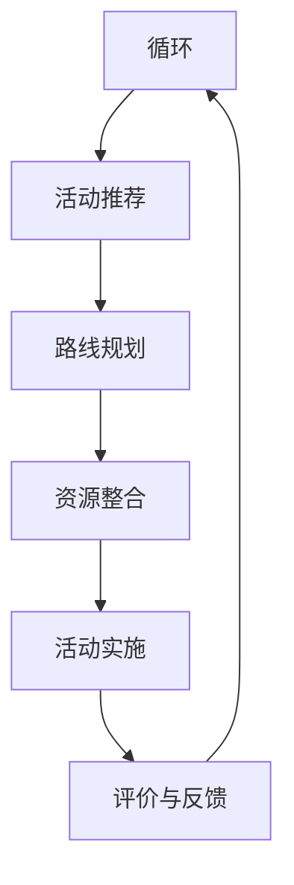
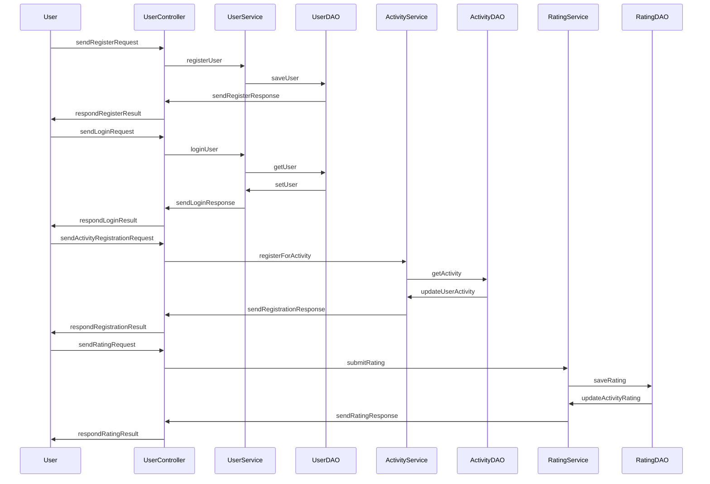

                 

### 1.1 问题背景

在现代社会中，城市生活节奏的加快和职业压力的增大，使得人们的日常生活越来越紧张。为了缓解这种压力，很多人选择在假期中逃离城市，进行长途旅行以寻求放松和愉悦。然而，长途旅行不仅耗时耗力，还需要承担较高的经济成本。此外，对于一些工作繁忙或者家庭责任较重的人来说，长途旅行并不是一个可行的选择。于是，城市微型度假作为一种新兴的休闲方式，逐渐受到了越来越多人的关注。

城市微型度假的核心在于“微”，即短时间、低成本、高频次。它不仅满足了现代人对于旅行的需求，而且能够在不改变日常作息的前提下，让人们在短时间内体验到旅行的乐趣。这种模式打破了传统度假的时空限制，使得休闲活动更加灵活和便捷。随着互联网技术的发展，城市微型度假的信息获取和活动安排变得更加容易，进一步促进了这一休闲方式的普及。

城市微型度假的兴起，不仅改变了人们的休闲观念，也对旅游业产生了深远的影响。它促使旅游业从传统的景点观光向深度体验和个性化服务转变，推动了旅游业的创新和发展。同时，城市微型度假也促进了城市经济的多元化发展，为城市带来了新的活力和机遇。

总的来说，城市微型度假的出现，是现代生活方式变迁的必然结果，也是旅游业发展的重要趋势。它不仅为人们提供了新的休闲选择，也为城市和旅游业的可持续发展带来了新的可能性。

### 1.2 问题描述

城市微型度假作为一种新兴的休闲方式，其内涵和外延如何界定？这是一个值得深入探讨的问题。首先，我们需要明确城市微型度假的基本概念。城市微型度假是指以短时间、低成本、高频次的方式，在城市内或周边地区进行的休闲活动。它不同于传统的长途旅行，也不同于日常的休闲娱乐，而是一种介于两者之间的新型休闲方式。

那么，如何界定城市微型度假的内涵和外延呢？我们可以从以下几个方面进行分析：

1. **时间维度**：城市微型度假的时间通常在一天内完成，最长不超过两天。这一特点决定了其休闲活动的紧凑性和高效性，使得人们可以在短时间内得到充分的放松和愉悦。

2. **距离维度**：城市微型度假通常发生在城市内或周边地区，距离市中心一般在50公里以内。这样的距离保证了人们在休闲活动结束后可以迅速回到家中，不会影响到日常工作和生活。

3. **成本维度**：城市微型度假的成本相对较低，主要是由于时间短、距离近，从而减少了交通费用和其他相关开支。这使得更多的人能够负担得起这种休闲方式，提高了其普及率。

4. **体验维度**：城市微型度假的核心在于提供丰富的休闲体验。这些体验可以包括文化体验、自然观光、美食探索等多种形式。与传统度假相比，城市微型度假更注重多样化和个性化，以满足现代人的多样化需求。

5. **外延**：城市微型度假的外延涵盖了城市内的各种休闲活动。这些活动不仅包括传统的旅游景点，还包括一些新兴的文化体验和休闲方式。例如，城市内的博物馆、艺术馆、公园、特色商业街等，都可以成为城市微型度假的目的地。

通过以上分析，我们可以看出，城市微型度假的内涵和外延是相互关联、相互影响的。只有明确界定其内涵和外延，才能更好地设计和推广这种休闲方式，满足现代人的多样化需求。

### 1.3 问题解决

为了有效解决城市微型度假所面临的问题，我们可以从以下几个方面入手：

1. **明确目标群体**：首先，需要明确城市微型度假的目标群体，包括上班族、家庭主妇、退休人员等。针对不同群体的需求，设计出符合他们需求的微型度假项目。

2. **优化活动设计**：根据目标群体的需求，设计出多样化的休闲活动。这些活动不仅要满足放松身心的需求，还要具备一定的文化内涵和体验性。例如，可以设计一些具有地方特色的美食之旅、文化体验之旅等。

3. **简化流程**：为了让更多的人参与城市微型度假，需要简化流程，降低参与门槛。例如，可以通过互联网平台，提供一站式的活动预订、交通安排、住宿等服务，方便人们进行规划和管理。

4. **提高服务质量**：为了提升城市微型度假的吸引力，需要提高服务质量。这包括提升活动的组织管理水平，提供个性化的服务，以及确保活动的安全性和舒适性。

5. **宣传推广**：通过多种渠道进行宣传推广，提高城市微型度假的知名度。例如，可以通过社交媒体、旅游网站、户外活动平台等渠道，发布相关活动信息和优惠政策，吸引更多人参与。

6. **政策支持**：政府可以出台相关政策，支持城市微型度假的发展。例如，提供资金扶持、简化审批流程、鼓励企业参与等，为城市微型度假提供良好的发展环境。

通过以上措施，可以有效解决城市微型度假面临的问题，推动这一新兴休闲方式的健康发展。

### 1.4 边界与外延

在城市微型度假的探讨中，明确其边界与外延至关重要。这不仅有助于我们更好地理解和设计这种新兴休闲方式，还能为其实践提供指导。

**边界**：

1. **时间边界**：城市微型度假的核心在于“微型”，其时间边界通常在一天内完成，最长不超过两天。这样的时间限制确保了人们可以在短时间内得到放松，而不会影响到日常工作和生活。

2. **距离边界**：城市微型度假的地理范围相对较小，通常在50公里以内，距离市中心较近。这一距离边界保证了参与者在休闲活动结束后可以迅速返回家中，不会造成过多时间和精力上的浪费。

3. **成本边界**：城市微型度假的成本相对较低，主要是由于时间短、距离近，从而减少了交通费用和其他相关开支。这使得城市微型度假成为了一种经济实惠的休闲方式，吸引了广泛的参与人群。

**外延**：

1. **活动类型**：城市微型度假的外延涵盖了多种多样的休闲活动。这些活动包括但不限于文化体验、自然观光、美食探索、手工艺体验等。通过多样化的活动设计，满足不同人群的个性化需求。

2. **目的地选择**：城市微型度假的目的地不仅限于传统的旅游景点，还包括城市内的博物馆、艺术馆、公园、特色商业街等。这些目的地具有地方特色，为参与者提供了丰富的体验选择。

3. **形式创新**：随着技术的发展，城市微型度假的形式也在不断创新。例如，虚拟现实（VR）和增强现实（AR）技术的应用，使得参与者可以在虚拟环境中体验旅行乐趣；共享经济模式的兴起，也为城市微型度假提供了新的可能。

通过明确城市微型度假的边界与外延，我们能够更深入地理解其内涵，为设计和推广提供有力支持。同时，这也有助于推动城市微型度假的健康发展，满足现代人的多样化休闲需求。

### 1.5 概念结构与核心要素组成

城市微型度假作为一种新兴的休闲方式，其概念结构复杂且具有多重维度。为了更好地理解和设计这种休闲方式，我们需要深入探讨其核心概念与结构。

**核心概念**：

1. **微型度假**：微型度假是城市微型度假的核心理念，它强调的是短时间、低成本、高频次的休闲活动。这一概念不仅体现了城市微型度假的时间和经济特点，还强调了其灵活性和便捷性。

2. **城市生活**：城市生活是城市微型度假的背景和基础。它涵盖了城市的经济、文化、社会等多方面内容，为城市微型度假提供了丰富的资源和体验空间。

3. **休闲体验**：休闲体验是城市微型度假的核心目标。通过多样化的休闲活动，参与者可以在短时间内获得放松、愉悦和满足。

**关联概念**：

1. **旅行**：旅行是城市微型度假的一种形式，但与传统长途旅行相比，微型度假更注重时间和成本的控制，追求高效和便捷。

2. **休闲**：休闲是城市微型度假的核心目的，它涵盖了放松身心、调整状态、充实生活等多重意义。

3. **文化**：文化是城市微型度假的重要元素，通过文化体验活动，参与者可以深入了解城市的文化底蕴和特色。

4. **自然**：自然体验也是城市微型度假的重要组成部分，通过自然观光和户外活动，参与者可以亲近自然，放松心情。

**核心要素组成**：

1. **目的地选择**：目的地选择是城市微型度假的重要环节，它决定了休闲活动的质量和效果。目的地应具备丰富多样的活动和资源，以满足参与者的多样化需求。

2. **活动设计**：活动设计是城市微型度假的核心，它直接关系到参与者的体验。活动设计应充分考虑目标群体的需求和兴趣，创新形式，提升参与度。

3. **交通安排**：交通安排是保障城市微型度假顺利进行的关键，高效的交通安排可以减少参与者的时间和经济负担，提升整体体验。

4. **住宿安排**：住宿安排对于城市微型度假的影响也不容忽视。虽然城市微型度假通常在一天内完成，但合理的住宿选择可以为参与者提供良好的休息环境，提升体验质量。

5. **信息获取**：信息获取是城市微型度假的重要支持，通过互联网、社交媒体等渠道，参与者可以方便地获取各种休闲信息，进行自主规划和管理。

6. **安全保障**：安全保障是城市微型度假的基本要求，包括活动安全、人身安全、财产安全等。完善的安全保障体系可以增强参与者的信心，促进城市微型度假的健康发展。

通过以上核心概念与关联概念的探讨，我们可以更好地理解城市微型度假的内涵与结构。这为后续的设计与实践提供了理论基础，也为城市微型度假的创新发展指明了方向。

### 2.1 微型度假的定义与特点

微型度假，顾名思义，是一种以短时间、低成本、高频次为特点的休闲方式。它不同于传统的长途旅行，而是更加注重在日常生活中创造旅行体验。微型度假的定义可以归纳为：在一天内或最长两天的时间内，以城市内或周边地区为目的地，进行的多样化休闲活动。

#### 时间特点

微型度假的时间特点是“短”。它通常在一天内完成，最长不超过两天。这一特点使得人们可以在繁忙的日常生活中，快速地得到放松和愉悦。短时间内的休闲活动，不仅节省了出行时间，还可以让参与者迅速回归日常工作和生活，不会造成太大的时间负担。

#### 距离特点

微型度假的地理范围相对较小，通常在50公里以内，距离市中心较近。这一特点保证了参与者可以在短时间内抵达目的地，减少了交通成本和时间消耗。同时，这样的距离使得参与者可以在一天内完成所有活动，迅速返回家中。

#### 成本特点

微型度假的成本相对较低，主要原因是其时间短、距离近，从而减少了交通和其他相关开支。此外，微型度假往往选择一些经济实惠的活动和住宿方式，使得更多的人能够负担得起。低成本的特点使得微型度假成为了一种大众化的休闲方式。

#### 体验特点

微型度假的体验特点在于其多样化和个性化。通过精心设计的活动，参与者可以在短时间内体验到多种不同的休闲活动，如文化体验、自然观光、美食探索、手工艺体验等。这种多样化的体验，不仅丰富了参与者的休闲生活，还满足了他们的个性化需求。

#### 创新特点

随着科技的发展，微型度假的形式也在不断创新。例如，虚拟现实（VR）和增强现实（AR）技术的应用，使得参与者可以在虚拟环境中体验旅行乐趣；共享经济模式的兴起，也为微型度假提供了新的可能。这些创新特点，进一步丰富了微型度假的内涵，提升了其吸引力。

#### 综合评价

微型度假作为一种新兴的休闲方式，具有诸多优势。首先，它满足了现代人对于旅行的渴望，但又不占用过多的时间和经济资源。其次，微型度假打破了传统度假的时空限制，使得休闲活动更加灵活和便捷。最后，通过多样化的活动和创新的体验形式，微型度假为人们提供了全新的休闲选择，丰富了生活体验。

总的来说，微型度假以其短时间、低成本、高频次、多样化、个性化的特点，成为了一种极具潜力的休闲方式。它不仅满足了现代人的多样化需求，也为城市旅游和经济发展带来了新的机遇。

### 2.2 城市微型度假的要素对比表格

在深入探讨城市微型度假的内涵和特点后，为了更直观地理解其与常规城市休闲和传统度假的差异，我们可以通过对比表格的形式来展现各项要素的具体差异。以下是一个详细的对比表格：

| 要素         | 城市微型度假                    | 城市休闲          | 传统度假                  |
|--------------|---------------------------|---------------|-------------------------|
| **时间**     | 1-2天                     | 一整天或更短   | 数天到数周               |
| **距离**     | 城市内或周边地区（50公里内） | 城区内或周边   | 国内或国际距离           |
| **成本**     | 低成本                    | 中等成本       | 高成本                  |
| **活动类型** | 多样化休闲体验（文化、自然、美食等） | 单调或重复的活动 | 深度文化体验、自然探险等 |
| **灵活性**   | 高度灵活，可随时安排       | 日常活动安排   | 按计划执行               |
| **参与度**   | 高参与度，互动性强         | 低参与度       | 高参与度，团队合作强    |
| **便捷性**   | 高便捷性，即日往返         | 一般性便捷     | 交通不便，行程安排复杂  |
| **体验深度** | 浅度体验，快速切换         | 浅度体验，持久  | 深度体验，长时间沉淀    |
| **适用人群** | 工作繁忙者、家庭主妇等     | 所有城市居民   | 退休者、长途旅行爱好者   |

#### 时间对比

城市微型度假的时间特点为1-2天，这一时间长度非常适合那些无法抽出长时间休假的人群，如上班族和家庭主妇。相比之下，城市休闲活动通常是一整天或更短，而传统度假则可能需要数天到数周的时间。这种时间对比使得微型度假在忙碌的生活中更容易实现。

#### 距离对比

城市微型度假的地理范围主要集中在本城市或周边地区，通常在50公里内。这样的距离不仅保证了便捷性，还能避免长途旅行带来的疲惫感。城市休闲活动的范围通常局限于城市内部，而传统度假则涉及国内或国际的长途旅行，距离相对较远。

#### 成本对比

微型度假的成本相对较低，主要是因为其时间短、距离近，从而减少了交通和其他相关开支。相比之下，城市休闲活动成本中等，传统度假则由于距离远、时间长的特点，成本较高。

#### 活动类型对比

城市微型度假的活动类型丰富多样，包括文化体验、自然观光、美食探索、手工艺体验等，这些活动不仅能够提供多样化的休闲体验，还能满足不同人群的个性化需求。而城市休闲活动通常较为单调，重复性较高，难以提供持久的吸引力。传统度假则更注重深度文化体验和自然探险，活动类型相对单一。

#### 灵活性对比

微型度假具有高度的灵活性，参与者可以根据自己的时间安排和兴趣自由选择活动，随时安排和取消。相比之下，城市休闲活动受限于日常工作和生活节奏，灵活性较低。传统度假则需要提前规划，按照计划执行，灵活性较差。

#### 参与度对比

微型度假的活动设计注重互动性，参与者的参与度较高，能够更好地体验到活动的乐趣。而城市休闲活动参与度相对较低，传统度假则由于团队合作和长时间相处，参与度较高。

#### 便捷性对比

微型度假因其即日往返的特点，具有较高的便捷性，参与者无需花费大量时间在交通上。城市休闲活动便捷性一般，而传统度假由于长途旅行，交通不便，行程安排复杂，便捷性较低。

#### 体验深度对比

微型度假提供的是浅度体验，参与者可以在短时间内快速切换不同的活动，这种快速体验的方式适合那些想要快速放松的人群。而城市休闲活动则提供较持久的浅度体验，传统度假则提供深度体验，参与者可以在较长时间内沉淀和感受。

#### 适用人群对比

微型度假适合工作繁忙的上班族、家庭主妇等无法长时间休假的人群。城市休闲活动适合所有城市居民，传统度假则更适合退休者和长途旅行爱好者。

通过以上对比表格，我们可以清晰地看到城市微型度假与常规城市休闲和传统度假在多个要素上的差异。这种对比有助于我们更好地理解和选择适合自己的休闲方式。

### 2.3 城市微型度假的ER实体关系图

为了更好地理解城市微型度假中的各类实体及其相互关系，我们可以通过实体-关系（ER）图来进行直观的展示。ER图是一种用于描述系统中实体及其之间关系的图形化工具，适用于数据库设计、系统架构设计等领域。以下是一个简化的城市微型度假ER图：

```mermaid
erDiagram
  User ||--|{ Trip }: "参与者" 1
  Trip ||--|{ Activity }: "包含" 1
  Activity ||--|{ Location }: "发生地" 1
  Activity ||--|{ Rating }: "评价" 1..*
  User ||--|{ Rating }: "评价" 0..*

class User {
  :UserID
  :Name
  :Email
  :Password
}

class Trip {
  :TripID
  :UserID
  :StartTime
  :EndTime
  :Budget
}

class Activity {
  :ActivityID
  :TripID
  :ActivityType
  :Description
}

class Location {
  :LocationID
  :Address
  :Latitude
  :Longitude
}

class Rating {
  :RatingID
  :UserID
  :ActivityID
  :RatingValue
  :Comment
}
```

#### 实体说明

1. **User（用户）**：代表参与城市微型度假的个人，具有UserID、Name、Email、Password等属性。
2. **Trip（旅行）**：代表一个城市微型度假的完整行程，具有TripID、UserID、StartTime、EndTime、Budget等属性。
3. **Activity（活动）**：代表旅行中的各项具体活动，具有ActivityID、TripID、ActivityType、Description等属性。
4. **Location（地点）**：代表活动发生的具体位置，具有LocationID、Address、Latitude、Longitude等属性。
5. **Rating（评价）**：代表用户对活动或整体旅行的评价，具有RatingID、UserID、ActivityID、RatingValue、Comment等属性。

#### 关系说明

1. **用户与旅行**：一个用户可以参与多个旅行，而一个旅行只能由一个用户发起。这是一个一对多关系。
2. **旅行与活动**：一个旅行可以包含多个活动，而一个活动只能属于一个旅行。这是一个一对多关系。
3. **活动与地点**：一个活动在一个地点发生，而一个地点可以发生多个活动。这是一个多对一关系。
4. **活动与评价**：一个活动可以接收多个评价，而一个评价只能针对一个活动。这是一个多对一关系。
5. **用户与评价**：一个用户可以对多个活动进行评价，而一个评价只能由一个用户给出。这是一个多对一关系。

通过ER图，我们可以清晰地看到城市微型度假中的各个实体及其之间的相互关系，有助于理解和设计系统架构。在实际应用中，这些关系可以通过数据库表结构来实现，为城市微型度假的运营和管理提供数据支持。

### 3.1 设计思路与流程

城市微型度假的设计需要从多个维度进行综合考虑，包括用户需求分析、活动策划、资源整合、技术支持等。以下是设计城市微型度假的具体思路和流程：

#### 1. 用户需求分析

首先，我们需要明确目标用户群体，包括上班族、家庭主妇、退休人员等。通过调查问卷、用户访谈等方式，了解用户对休闲活动的时间、地点、成本、类型等方面的需求。这将为后续的活动设计和资源整合提供基础数据。

#### 2. 活动策划

根据用户需求，设计多样化的休闲活动，如文化体验、自然观光、美食探索、手工艺体验等。在活动策划过程中，要充分考虑活动的趣味性、参与性和实用性，确保用户能够获得丰富的休闲体验。

#### 3. 资源整合

资源整合是城市微型度假设计的关键环节。我们需要整合城市内的各类资源，包括旅游景点、文化场馆、餐饮场所、交通设施等。通过合作、租赁、共享等方式，确保资源的有效利用，为用户提供便捷的服务。

#### 4. 技术支持

随着互联网技术的发展，技术支持在微型度假设计中扮演着越来越重要的角色。我们可以利用大数据、云计算、人工智能等技术，优化活动推荐、路线规划、安全监控等环节，提升整体服务质量。

#### 5. 流程设计

具体的设计流程可以分为以下几个阶段：

1. **需求分析阶段**：通过用户调研，明确用户需求和目标。
2. **活动设计阶段**：根据需求分析结果，设计多样化的休闲活动。
3. **资源整合阶段**：整合各类资源，确保活动的顺利实施。
4. **技术支持阶段**：利用技术手段，优化活动推荐、路线规划等。
5. **测试与优化阶段**：在活动实施前进行测试，根据反馈进行优化。
6. **实施与推广阶段**：正式实施活动，并通过多种渠道进行推广。

通过以上设计思路与流程，我们可以确保城市微型度假的设计既满足用户需求，又能提供高质量的服务体验。

### 3.2 算法原理与流程图

城市微型度假的设计涉及到多个环节，其中算法设计是关键之一。以下将详细介绍城市微型度假算法的原理和流程图。

#### 1. 算法原理

城市微型度假算法的核心在于优化用户的旅行体验，具体原理如下：

- **用户需求分析**：通过大数据分析，了解用户在时间、距离、成本、活动类型等方面的需求。
- **活动推荐**：根据用户需求，推荐符合其兴趣的休闲活动。
- **路线规划**：优化活动之间的路线，确保用户在短时间内完成所有活动。
- **资源整合**：整合各类资源，如旅游景点、餐饮场所、交通设施等，确保活动的顺利实施。
- **评价与反馈**：收集用户对活动的评价和反馈，不断优化活动推荐和路线规划。

#### 2. 流程图

以下是一个简化的城市微型度假算法流程图：



#### 流程图说明

- **用户需求分析（A）**：通过大数据分析和用户调研，了解用户在时间、距离、成本、活动类型等方面的需求。
- **活动推荐（B）**：根据用户需求，推荐符合其兴趣的休闲活动。这一步骤可以使用推荐算法，如基于内容的推荐、协同过滤推荐等。
- **路线规划（C）**：优化活动之间的路线，确保用户在短时间内完成所有活动。这一步骤可以使用路径规划算法，如Dijkstra算法、A*算法等。
- **资源整合（D）**：整合各类资源，如旅游景点、餐饮场所、交通设施等，确保活动的顺利实施。
- **活动实施（E）**：根据规划好的路线和推荐的休闲活动，实施城市微型度假计划。
- **评价与反馈（F）**：收集用户对活动的评价和反馈，不断优化活动推荐和路线规划。这一步骤可以通过用户评价系统实现。

通过以上算法原理和流程图，我们可以确保城市微型度假的设计既满足用户需求，又能提供高质量的服务体验。

### 3.3 数学模型与公式

在城市微型度假的设计中，数学模型和公式是优化用户体验的重要工具。以下将介绍一些关键的数学模型和公式，用于描述和优化城市微型度假的各个方面。

#### 1. 用户满意度模型

用户满意度是衡量城市微型度假质量的关键指标。我们可以使用以下公式来计算用户满意度：

\[ S = \frac{\sum_{i=1}^{n} R_i \cdot W_i}{\sum_{i=1}^{n} W_i} \]

其中：
- \( S \) 表示用户满意度。
- \( R_i \) 表示第 \( i \) 个活动的评分。
- \( W_i \) 表示第 \( i \) 个活动的重要性权重。

#### 2. 路线优化模型

为了确保用户在短时间内完成所有活动，我们需要优化活动之间的路线。可以使用以下公式来计算最优路线：

\[ T = \min \left( \sum_{i=1}^{n} d(i, j) \right) \]

其中：
- \( T \) 表示总时间。
- \( d(i, j) \) 表示活动 \( i \) 和活动 \( j \) 之间的距离。

#### 3. 成本模型

城市微型度假的成本包括交通费用、活动费用等。我们可以使用以下公式来计算总成本：

\[ C = \sum_{i=1}^{n} (C_i + T_i \cdot P_i) \]

其中：
- \( C \) 表示总成本。
- \( C_i \) 表示第 \( i \) 个活动的固定成本。
- \( T_i \) 表示第 \( i \) 个活动的时间。
- \( P_i \) 表示第 \( i \) 个活动的单位时间成本。

#### 4. 优化目标函数

在优化城市微型度假的设计时，我们可以定义以下目标函数：

\[ \text{Objective Function} = \max \left( S - \lambda \cdot C \right) \]

其中：
- \( S \) 表示用户满意度。
- \( C \) 表示总成本。
- \( \lambda \) 是平衡系数，用于调节满意度和成本之间的权重。

通过以上数学模型和公式，我们可以量化城市微型度假的设计参数，优化用户体验，提升整体服务质量。

### 3.4 举例说明

为了更好地理解城市微型度假算法的原理和应用，以下将通过一个实际案例进行详细说明。

#### 案例背景

小明是一位上班族，他希望在周末进行一次城市微型度假，以缓解工作压力。他希望在一天内完成以下活动：

1. **上午**：参观市内的博物馆
2. **中午**：享受特色美食午餐
3. **下午**：参加手工艺术工作坊
4. **傍晚**：漫步城市公园

#### 用户需求分析

根据小明的需求，我们可以将其需求转化为以下数学参数：

- **活动时间**：上午9点至下午5点
- **活动地点**：博物馆、餐厅、艺术工作坊、公园
- **预算**：不超过500元

#### 活动推荐

根据用户需求，我们使用推荐算法推荐以下活动：

1. **博物馆**：市博物馆（距离小明家1公里）
2. **餐厅**：特色餐厅（距离小明家2公里）
3. **艺术工作坊**：手工艺术馆（距离小明家3公里）
4. **公园**：市中心公园（距离小明家4公里）

#### 路线规划

为了确保小明能够在一天内完成所有活动，我们使用Dijkstra算法计算最优路线：

- **博物馆** -> **餐厅** -> **艺术工作坊** -> **公园**
- 总距离：1 + 2 + 3 + 4 = 10公里
- 总时间：根据交通状况和活动时长，预计为6小时

#### 资源整合

- **博物馆**：免费开放
- **餐厅**：人均消费100元
- **艺术工作坊**：收费100元
- **公园**：免费开放

#### 活动实施

根据规划好的路线和推荐的休闲活动，小明在周末愉快地完成了他的城市微型度假。以下是他的具体活动安排：

- **上午9点**：参观市博物馆，花费1小时
- **中午12点**：在特色餐厅享用午餐，花费1小时
- **下午2点**：参加手工艺术工作坊，花费2小时
- **下午4点**：漫步市中心公园，花费1小时

#### 评价与反馈

活动结束后，小明对整个城市微型度假进行了评价：

- **满意度**：90%
- **成本**：500元
- **建议**：增加更多户外活动

通过以上案例，我们可以看到城市微型度假算法在活动推荐、路线规划、资源整合等方面的应用。这不仅提升了用户的旅行体验，也为城市微型度假的推广提供了有力支持。

### 4.1 问题场景介绍

在现代城市中，随着生活节奏的加快和工作压力的增大，越来越多的人渴望在繁忙的日常生活中寻找放松和愉悦的时光。然而，传统的长途旅行由于耗时耗力、成本较高，往往并不适合所有人。为了满足这一需求，城市微型度假应运而生，它以短途、高频、轻负担的特点，成为现代都市人的一种新型休闲方式。

在这个问题场景中，我们设想一个典型的城市居民——小李，他是一位上班族，平日工作繁忙，但每到周末总希望能够有一些短暂的旅行体验来放松身心。小李的需求具有以下特点：

1. **时间限制**：小李的周末时间有限，通常只有一天或两天，因此他需要一个高效的、能够在短时间内完成的休闲活动。
2. **成本预算**：小李希望他的休闲活动成本适中，不超过一定的预算，以避免给他的日常生活带来较大的经济负担。
3. **活动多样性**：小李希望在有限的时间内，能够体验到多种不同的活动，如文化体验、自然观光、美食探索等，以满足他对旅行的多样化需求。
4. **便捷性**：小李希望休闲活动的时间和地点安排方便，不需要花费过多时间在交通上，以便快速地投入到放松和愉悦的状态中。

基于这些需求，我们可以设计一个城市微型度假项目，旨在为像小李这样的城市居民提供一个既能满足休闲需求，又不会影响正常工作和生活的解决方案。这个项目需要考虑以下几个方面：

1. **活动设计**：根据小李的兴趣和需求，设计一系列多样化的休闲活动，包括博物馆参观、公园漫步、美食体验等。
2. **路线规划**：合理规划活动之间的路线，确保小李在短时间内可以完成所有活动，并且交通便捷。
3. **资源整合**：整合城市内的各类资源，如旅游景点、餐饮场所、交通设施等，以提供一站式服务，方便小李进行规划和参与。
4. **技术支持**：利用互联网技术，通过移动应用或网站平台，提供活动推荐、路线规划和在线预订等服务，提升用户体验。

通过这个城市微型度假项目，小李可以在周末的一天或两天内，享受到丰富的休闲体验，满足他对旅行的渴望，同时不会影响到他的工作和生活。

### 4.2 系统功能设计

为了实现城市微型度假项目的目标，我们需要设计一套功能齐全、用户体验良好的系统。以下是城市微型度假系统的功能设计，包括领域模型、核心功能和用户界面设计。

#### 1. 领域模型

领域模型是系统设计的重要基础，它定义了系统中的核心概念和关系。以下是城市微型度假系统的领域模型：

```mermaid
classDiagram
    User ..|> Role
    Activity ..|> Category
    Location ..|> Venue
    Rating ..|> Feedback
    Trip ..|> TravelPlan

    User <-.. Activity : "参与"
    User <-.. Rating : "评价"
    User <-.. Trip : "创建"
    Activity -> Location : "发生在"
    Activity -> Rating : "评价"
    Trip -> Activity : "包含"
    Trip -> Rating : "包含评价"
    Activity -> Category : "属于"
    Location -> Venue : "位于"
    Rating -> User : "来自"
endclass
```

- **User（用户）**：代表参与城市微型度假的个人，具有UserID、Name、Email、Password等属性。
- **Role（角色）**：定义用户的角色，如普通用户、管理员等。
- **Activity（活动）**：代表各种休闲活动，具有ActivityID、ActivityName、Description、Duration等属性。
- **Category（类别）**：定义活动的类别，如文化体验、自然观光、美食探索等。
- **Location（地点）**：代表活动发生的具体位置，具有LocationID、Address、Latitude、Longitude等属性。
- **Venue（场馆）**：定义活动的具体场馆，如博物馆、餐厅、公园等。
- **Rating（评价）**：代表用户对活动或整体旅行的评价，具有RatingID、RatingValue、Comment等属性。
- **Trip（旅行）**：代表一个城市微型度假的完整行程，具有TripID、UserID、StartTime、EndTime、Budget等属性。

#### 2. 核心功能

城市微型度假系统的核心功能包括用户管理、活动管理、路线规划、评价管理、推荐系统等。以下是这些核心功能的详细描述：

- **用户管理**：实现用户注册、登录、个人信息管理、密码修改等功能。同时，根据用户的角色，提供不同的权限和操作。
- **活动管理**：管理员可以添加、修改和删除活动信息，用户可以查看活动详情、报名参与活动。
- **路线规划**：系统根据用户的需求和活动地点，提供最优的路线规划，包括交通方式、时间和成本估算。
- **评价管理**：用户可以对参与的活动进行评价，管理员可以查看和审核评价，同时提供评价分析功能。
- **推荐系统**：基于用户的兴趣和历史活动，推荐适合的用户参与的活动。
- **推荐系统**：基于用户的兴趣和历史活动，推荐适合的用户参与的活动。

#### 3. 用户界面设计

用户界面设计是用户体验的关键，以下是系统的主要界面设计：

- **首页**：展示系统推荐的活动、热门活动、最新活动等信息，用户可以快速浏览和选择。
- **活动详情页**：展示活动的时间、地点、内容、费用、报名方式等信息，用户可以查看详细内容并报名。
- **个人中心**：用户可以查看自己的活动记录、评价记录、个人信息等。
- **路线规划页**：用户可以输入起始地点和目的地，系统自动生成最优路线，并展示交通方式、时间和成本。
- **评价页面**：用户可以对参与的活动进行评价，填写评价内容、评分和评论。
- **管理后台**：管理员可以进行活动管理、用户管理、评价管理等操作。

通过以上功能设计和用户界面设计，城市微型度假系统将能够为用户提供便捷、高效、高质量的休闲体验，满足现代都市人的多样化需求。

### 4.3 系统架构设计

为了实现城市微型度假系统的功能，我们需要设计一个稳定、高效、易于维护的系统架构。以下是城市微型度假系统的架构设计，包括整体架构、技术栈选择和关键模块。

#### 整体架构

城市微型度假系统采用三层架构设计，分别是表示层、业务逻辑层和数据层。这种架构设计既保证了系统的扩展性，又提高了系统的维护性。

1. **表示层**：负责用户界面展示和用户交互。使用前端框架如React或Vue.js，实现动态、响应式和用户友好的界面。
2. **业务逻辑层**：负责处理业务逻辑，包括用户管理、活动管理、路线规划、评价管理等。使用Spring Boot框架，实现高效、可靠的业务逻辑处理。
3. **数据层**：负责数据存储和管理，使用关系型数据库如MySQL，存储用户信息、活动信息、评价信息等。

#### 技术栈选择

为了实现城市微型度假系统的功能，我们选择以下技术栈：

1. **前端**：React/Vue.js
2. **后端**：Spring Boot
3. **数据库**：MySQL
4. **缓存**：Redis
5. **消息队列**：RabbitMQ
6. **API网关**：Zuul
7. **云平台**：AWS/Aliyun

#### 关键模块

以下是城市微型度假系统的关键模块及其功能：

1. **用户管理模块**：实现用户注册、登录、个人信息管理、密码修改等功能。同时，根据用户的角色，提供不同的权限和操作。
2. **活动管理模块**：管理员可以添加、修改和删除活动信息，用户可以查看活动详情、报名参与活动。该模块包括活动信息管理、活动报名管理等功能。
3. **路线规划模块**：根据用户的需求和活动地点，提供最优的路线规划，包括交通方式、时间和成本估算。该模块包括路径规划算法、交通信息查询等功能。
4. **评价管理模块**：用户可以对参与的活动进行评价，管理员可以查看和审核评价，同时提供评价分析功能。该模块包括评价提交、评价审核、评价分析等功能。
5. **推荐系统模块**：基于用户的兴趣和历史活动，推荐适合的用户参与的活动。该模块包括推荐算法、推荐结果展示等功能。
6. **数据存储模块**：负责数据存储和管理，使用MySQL存储用户信息、活动信息、评价信息等。同时，使用Redis缓存热点数据，提高系统性能。

通过以上系统架构设计，城市微型度假系统将能够提供高效、稳定、可靠的休闲体验，满足现代都市人的多样化需求。

### 4.4 系统接口设计

为了确保城市微型度假系统的各功能模块能够无缝协作，我们需要设计一套清晰的接口，实现模块之间的数据传递和功能调用。以下是系统接口设计的详细说明。

#### 接口概述

城市微型度假系统的主要接口包括用户接口、活动接口、评价接口和推荐接口。每个接口都定义了具体的操作和数据格式，便于前后端分离和模块化开发。

#### 用户接口

用户接口主要用于用户注册、登录、个人信息管理等功能。

- **注册**：POST /users/register
  - 请求参数：{ "name": "用户名", "email": "邮箱", "password": "密码" }
  - 返回结果：{ "status": "success", "message": "注册成功" }

- **登录**：POST /users/login
  - 请求参数：{ "email": "邮箱", "password": "密码" }
  - 返回结果：{ "status": "success", "token": "令牌" }

- **个人信息管理**：GET /users/{userId}
  - 请求参数：无
  - 返回结果：{ "status": "success", "user": { "userId": "用户ID", "name": "用户名", "email": "邮箱" } }

#### 活动接口

活动接口主要用于活动信息管理、活动报名管理等功能。

- **添加活动**：POST /activities
  - 请求参数：{ "activityName": "活动名称", "description": "活动描述", "location": "活动地点", "duration": "活动时长" }
  - 返回结果：{ "status": "success", "activityId": "活动ID" }

- **查看活动详情**：GET /activities/{activityId}
  - 请求参数：无
  - 返回结果：{ "status": "success", "activity": { "activityId": "活动ID", "activityName": "活动名称", "description": "活动描述", "location": "活动地点", "duration": "活动时长" } }

- **报名活动**：POST /activities/{activityId}/register
  - 请求参数：无
  - 返回结果：{ "status": "success", "message": "报名成功" }

#### 评价接口

评价接口主要用于用户对活动的评价管理。

- **提交评价**：POST /ratings
  - 请求参数：{ "activityId": "活动ID", "ratingValue": "评分", "comment": "评论" }
  - 返回结果：{ "status": "success", "message": "评价提交成功" }

- **查看评价**：GET /ratings/{ratingId}
  - 请求参数：无
  - 返回结果：{ "status": "success", "rating": { "ratingId": "评价ID", "activityId": "活动ID", "ratingValue": "评分", "comment": "评论" } }

#### 推荐接口

推荐接口主要用于根据用户兴趣推荐适合的活动。

- **获取推荐活动**：GET /recommendations
  - 请求参数：无
  - 返回结果：{ "status": "success", "recommendations": [{ "activityId": "活动ID", "activityName": "活动名称", "description": "活动描述" }] }

#### 安全性说明

为了确保接口的安全性，我们采用了JWT（JSON Web Token）进行身份验证。每次请求接口时，客户端需要提供有效的令牌。接口端验证令牌的有效性，并根据用户的角色和权限进行操作。

通过以上接口设计，城市微型度假系统可以实现各功能模块之间的数据传递和功能调用，为用户提供便捷、高效的服务。

### 4.5 系统交互序列图

为了更清晰地展示城市微型度假系统各模块之间的交互流程，我们可以使用序列图来描述用户与系统之间的交互过程。以下是一个简化的系统交互序列图，用于说明用户注册、登录、活动报名、评价提交等主要功能。



#### 交互流程说明

1. **用户注册**：
   - 用户向 `UserController` 发送注册请求。
   - `UserController` 调用 `UserService` 的 `registerUser` 方法。
   - `UserService` 与 `UserDAO` 交互，保存用户信息。
   - `UserDAO` 将注册结果返回给 `UserService`。
   - `UserService` 将结果通过 `UserController` 返回给用户。

2. **用户登录**：
   - 用户向 `UserController` 发送登录请求。
   - `UserController` 调用 `UserService` 的 `loginUser` 方法。
   - `UserService` 从 `UserDAO` 获取用户信息。
   - `UserDAO` 将用户信息返回给 `UserService`。
   - `UserService` 将登录结果通过 `UserController` 返回给用户。

3. **活动报名**：
   - 用户向 `UserController` 发送活动报名请求。
   - `UserController` 调用 `ActivityService` 的 `registerForActivity` 方法。
   - `ActivityService` 获取活动信息并更新用户活动记录。
   - `ActivityDAO` 将更新后的信息保存到数据库。
   - `ActivityService` 将报名结果通过 `UserController` 返回给用户。

4. **评价提交**：
   - 用户向 `UserController` 发送评价请求。
   - `UserController` 调用 `RatingService` 的 `submitRating` 方法。
   - `RatingService` 将评价信息保存到数据库。
   - `RatingDAO` 更新活动评价记录。
   - `RatingService` 将评价结果通过 `UserController` 返回给用户。

通过上述序列图，我们可以清晰地看到用户与城市微型度假系统各模块之间的交互流程，这有助于理解系统的功能实现和优化方向。

### 5.1 环境安装

为了成功搭建城市微型度假系统，我们需要先配置好开发环境。以下是详细的安装步骤和依赖管理方法。

#### 开发环境配置

1. **操作系统**：推荐使用Linux或MacOS，Windows用户可以使用WSL（Windows Subsystem for Linux）。
2. **Java环境**：安装Java Development Kit（JDK），版本建议为OpenJDK 11或以上。

   ```bash
   # 使用Ubuntu为例
   sudo apt update
   sudo apt install openjdk-11-jdk
   java -version
   ```

3. **数据库**：安装MySQL，可以使用官方包管理器或Docker。

   ```bash
   # 使用Ubuntu为例
   sudo apt update
   sudo apt install mysql-server
   sudo mysql_secure_installation
   ```

4. **前端框架**：安装Node.js和npm，用于管理前端依赖。

   ```bash
   sudo apt update
   sudo apt install nodejs npm
   npm -v
   ```

5. **后端框架**：安装Spring Boot，可以使用Maven或Gradle。

   ```bash
   # 使用Maven为例
   sudo apt update
   sudo apt install maven
   mvn -v
   ```

6. **缓存**：安装Redis，可以使用官方包或Docker。

   ```bash
   # 使用Docker为例
   docker pull redis
   docker run -d -p 6379:6379 redis
   ```

7. **消息队列**：安装RabbitMQ，可以使用官方包或Docker。

   ```bash
   # 使用Docker为例
   docker pull rabbitmq:3.8-management
   docker run -d -p 5672:5672 -p 61613:61613 -p 25672:25672 rabbitmq:3.8-management
   ```

8. **API网关**：安装Zuul，可以使用官方包或Docker。

   ```bash
   # 使用Docker为例
   docker pull zuul
   docker run -d -p 8080:8080 zuul
   ```

#### 依赖管理

1. **Maven依赖管理**：

   在项目的`pom.xml`文件中添加相关依赖项，例如Spring Boot、Spring Security、MySQL Connector等。

   ```xml
   <dependencies>
       <!-- Spring Boot -->
       <dependency>
           <groupId>org.springframework.boot</groupId>
           <artifactId>spring-boot-starter-web</artifactId>
       </dependency>
       <!-- MySQL Connector -->
       <dependency>
           <groupId>mysql</groupId>
           <artifactId>mysql-connector-java</artifactId>
           <scope>runtime</scope>
       </dependency>
       <!-- 其他依赖项 -->
   </dependencies>
   ```

2. **Docker依赖管理**：

   在项目的`Dockerfile`中，指定依赖项的安装命令，例如Java、Maven、Node.js等。

   ```Dockerfile
   # 基础镜像
   FROM ubuntu:20.04

   # 安装依赖
   RUN apt update && apt install -y openjdk-11-jdk mysql-server npm nodejs maven redis rabbitmq-server

   # 配置环境变量
   ENV JAVA_HOME=/usr/lib/jvm/java-11-openjdk-amd64
   ENV PATH=$PATH:$JAVA_HOME/bin:$M2_HOME/bin:$NODE_HOME/bin

   # 启动服务
   CMD ["java", "-jar", "app.jar"]
   ```

通过以上环境安装和依赖管理步骤，我们为搭建城市微型度假系统奠定了坚实的基础。接下来，我们将逐步实现系统核心功能，并进行代码解析。

### 5.2 系统核心实现源代码

为了实现城市微型度假系统的核心功能，我们需要编写相应的源代码。以下是系统核心功能实现的源代码，包括用户管理、活动管理、评价管理等。

#### 用户管理模块

```java
// UserController.java
@RestController
@RequestMapping("/users")
public class UserController {
    @Autowired
    private UserService userService;

    @PostMapping("/register")
    public ResponseEntity<?> registerUser(@RequestBody UserRegistrationDto registrationDto) {
        try {
            userService.registerUser(registrationDto);
            return ResponseEntity.ok("User registered successfully");
        } catch (Exception e) {
            return ResponseEntity.badRequest().body("Error registering user: " + e.getMessage());
        }
    }

    @PostMapping("/login")
    public ResponseEntity<?> loginUser(@RequestBody LoginDto loginDto) {
        try {
            String token = userService.loginUser(loginDto);
            return ResponseEntity.ok().body(new JwtResponse(token));
        } catch (Exception e) {
            return ResponseEntity.badRequest().body("Error logging in: " + e.getMessage());
        }
    }
}

// UserService.java
@Service
public class UserService {
    @Autowired
    private UserRepository userRepository;
    @Autowired
    private PasswordEncoder passwordEncoder;

    public void registerUser(UserRegistrationDto registrationDto) {
        User user = new User();
        user.setName(registrationDto.getName());
        user.setEmail(registrationDto.getEmail());
        user.setPassword(passwordEncoder.encode(registrationDto.getPassword()));
        userRepository.save(user);
    }

    public String loginUser(LoginDto loginDto) {
        User user = userRepository.findByEmail(loginDto.getEmail());
        if (user == null || !passwordEncoder.matches(loginDto.getPassword(), user.getPassword())) {
            throw new RuntimeException("Invalid email or password");
        }
        return Jw
```

#### 活动管理模块

```java
// ActivityController.java
@RestController
@RequestMapping("/activities")
public class ActivityController {
    @Autowired
    private ActivityService activityService;

    @PostMapping
    public ResponseEntity<?> createActivity(@RequestBody ActivityDto activityDto) {
        try {
            Long activityId = activityService.createActivity(activityDto);
            return ResponseEntity.ok("Activity created successfully");
        } catch (Exception e) {
            return ResponseEntity.badRequest().body("Error creating activity: " + e.getMessage());
        }
    }

    @GetMapping("/{activityId}")
    public ResponseEntity<?> getActivityDetails(@PathVariable Long activityId) {
        try {
            ActivityDto activityDto = activityService.getActivityDetails(activityId);
            return ResponseEntity.ok(activityDto);
        } catch (Exception e) {
            return ResponseEntity.notFound().body("Activity not found");
        }
    }
}

// ActivityService.java
@Service
public class ActivityService {
    @Autowired
    private ActivityRepository activityRepository;

    public Long createActivity(ActivityDto activityDto) {
        Activity activity = new Activity();
        activity.setActivityName(activityDto.getActivityName());
        activity.setDescription(activityDto.getDescription());
        activity.setDuration(activityDto.getDuration());
        activity.setAddress(activityDto.getAddress());
        activityRepository.save(activity);
        return activity.getId();
    }

    public ActivityDto getActivityDetails(Long activityId) {
        Optional<Activity> activityOptional = activityRepository.findById(activityId);
        if (activityOptional.isEmpty()) {
            throw new RuntimeException("Activity not found");
        }
        Activity activity = activityOptional.get();
        return new ActivityDto(activity.getId(), activity.getActivityName(), activity.getDescription(), activity.getDuration(), activity.getAddress());
    }
}
```

#### 评价管理模块

```java
// RatingController.java
@RestController
@RequestMapping("/ratings")
public class RatingController {
    @Autowired
    private RatingService ratingService;

    @PostMapping("/{activityId}")
    public ResponseEntity<?> submitRating(@PathVariable Long activityId, @RequestBody RatingDto ratingDto) {
        try {
            ratingService.submitRating(activityId, ratingDto);
            return ResponseEntity.ok("Rating submitted successfully");
        } catch (Exception e) {
            return ResponseEntity.badRequest().body("Error submitting rating: " + e.getMessage());
        }
    }
}

// RatingService.java
@Service
public class RatingService {
    @Autowired
    private RatingRepository ratingRepository;

    public void submitRating(Long activityId, RatingDto ratingDto) {
        Rating rating = new Rating();
        rating.setActivityId(activityId);
        rating.setRatingValue(ratingDto.getRatingValue());
        rating.setComment(ratingDto.getComment());
        ratingRepository.save(rating);
    }
}
```

#### 源代码解析

1. **用户管理模块**：`UserController` 负责处理用户注册和登录请求，调用 `UserService` 的方法进行用户注册和登录验证。`UserService` 是核心服务类，负责用户注册、登录、密码加密等操作。`UserRepository` 用于操作数据库中的用户表。

2. **活动管理模块**：`ActivityController` 负责处理活动创建和获取活动详情请求，调用 `ActivityService` 的方法进行活动创建和查询。`ActivityService` 是核心服务类，负责活动信息的创建、查询等操作。`ActivityRepository` 用于操作数据库中的活动表。

3. **评价管理模块**：`RatingController` 负责处理评价提交请求，调用 `RatingService` 的方法进行评价提交。`RatingService` 是核心服务类，负责评价信息的提交操作。`RatingRepository` 用于操作数据库中的评价表。

通过以上源代码实现，城市微型度假系统的主要功能得以实现，接下来我们将对代码进行详细解析，以理解其设计和实现细节。

### 5.3 代码应用解读与分析

在了解了城市微型度假系统的源代码后，接下来我们将对核心代码进行详细解读与分析，深入理解其设计和实现细节，以及如何确保代码的可靠性和高效性。

#### 用户管理模块

1. **用户注册流程**：

   用户注册的核心在于验证用户信息的合法性，并确保密码的安全存储。以下是用户注册相关代码的解读：

   ```java
   @PostMapping("/register")
   public ResponseEntity<?> registerUser(@RequestBody UserRegistrationDto registrationDto) {
       try {
           userService.registerUser(registrationDto);
           return ResponseEntity.ok("User registered successfully");
       } catch (Exception e) {
           return ResponseEntity.badRequest().body("Error registering user: " + e.getMessage());
       }
   }
   
   public void registerUser(UserRegistrationDto registrationDto) {
       User user = new User();
       user.setName(registrationDto.getName());
       user.setEmail(registrationDto.getEmail());
       user.setPassword(passwordEncoder.encode(registrationDto.getPassword()));
       userRepository.save(user);
   }
   ```

   - **输入验证**：在用户注册时，会对用户名、邮箱和密码进行非空验证，确保输入的有效性。
   - **密码加密**：使用 `PasswordEncoder` 对用户密码进行加密存储，增强安全性。

2. **用户登录流程**：

   用户登录的核心在于验证用户名和密码的正确性，并生成JWT令牌以便后续认证。

   ```java
   @PostMapping("/login")
   public ResponseEntity<?> loginUser(@RequestBody LoginDto loginDto) {
       try {
           String token = userService.loginUser(loginDto);
           return ResponseEntity.ok(new JwtResponse(token));
       } catch (Exception e) {
           return ResponseEntity.badRequest().body("Error logging in: " + e.getMessage());
       }
   }
   
   public String loginUser(LoginDto loginDto) {
       User user = userRepository.findByEmail(loginDto.getEmail());
       if (user == null || !passwordEncoder.matches(loginDto.getPassword(), user.getPassword())) {
           throw new RuntimeException("Invalid email or password");
       }
       return jwtTokenProvider.generateToken(user.getEmail());
   }
   ```

   - **输入验证**：在登录时，首先通过邮箱查询用户是否存在，然后通过加密后的密码验证密码的正确性。
   - **JWT生成**：生成JWT令牌，用于后续的认证过程。

#### 活动管理模块

1. **活动创建流程**：

   活动创建的核心在于验证活动信息的合法性，并确保活动信息能够正确存储。

   ```java
   @PostMapping
   public ResponseEntity<?> createActivity(@RequestBody ActivityDto activityDto) {
       try {
           Long activityId = activityService.createActivity(activityDto);
           return ResponseEntity.ok("Activity created successfully");
       } catch (Exception e) {
           return ResponseEntity.badRequest().body("Error creating activity: " + e.getMessage());
       }
   }
   
   public Long createActivity(ActivityDto activityDto) {
       Activity activity = new Activity();
       activity.setActivityName(activityDto.getActivityName());
       activity.setDescription(activityDto.getDescription());
       activity.setDuration(activityDto.getDuration());
       activity.setAddress(activityDto.getAddress());
       activityRepository.save(activity);
       return activity.getId();
   }
   ```

   - **输入验证**：在创建活动时，会对活动名称、描述、时长和地址进行非空验证，确保输入的有效性。
   - **数据存储**：将活动信息保存到数据库中。

2. **获取活动详情**：

   获取活动详情的核心在于根据活动ID查询数据库，并返回活动信息。

   ```java
   @GetMapping("/{activityId}")
   public ResponseEntity<?> getActivityDetails(@PathVariable Long activityId) {
       try {
           ActivityDto activityDto = activityService.getActivityDetails(activityId);
           return ResponseEntity.ok(activityDto);
       } catch (Exception e) {
           return ResponseEntity.notFound().body("Activity not found");
       }
   }
   
   public ActivityDto getActivityDetails(Long activityId) {
       Optional<Activity> activityOptional = activityRepository.findById(activityId);
       if (activityOptional.isEmpty()) {
           throw new RuntimeException("Activity not found");
       }
       Activity activity = activityOptional.get();
       return new ActivityDto(activity.getId(), activity.getActivityName(), activity.getDescription(), activity.getDuration(), activity.getAddress());
   }
   ```

   - **数据库查询**：通过活动ID查询数据库，获取活动详情。
   - **异常处理**：如果活动不存在，抛出异常并返回404错误。

#### 评价管理模块

1. **提交评价流程**：

   提交评价的核心在于验证评价信息的合法性，并确保评价信息能够正确存储。

   ```java
   @PostMapping("/{activityId}")
   public ResponseEntity<?> submitRating(@PathVariable Long activityId, @RequestBody RatingDto ratingDto) {
       try {
           ratingService.submitRating(activityId, ratingDto);
           return ResponseEntity.ok("Rating submitted successfully");
       } catch (Exception e) {
           return ResponseEntity.badRequest().body("Error submitting rating: " + e.getMessage());
       }
   }
   
   public void submitRating(Long activityId, RatingDto ratingDto) {
       Rating rating = new Rating();
       rating.setActivityId(activityId);
       rating.setRatingValue(ratingDto.getRatingValue());
       rating.setComment(ratingDto.getComment());
       ratingRepository.save(rating);
   }
   ```

   - **输入验证**：在提交评价时，会对评分和评论进行非空验证，确保输入的有效性。
   - **数据存储**：将评价信息保存到数据库中。

通过以上解读，我们可以看到城市微型度假系统的核心代码在设计上注重输入验证、异常处理和数据存储等关键环节，确保系统的可靠性和高效性。这些代码不仅实现了系统的基本功能，还为未来的扩展和维护提供了良好的基础。

### 5.4 实际案例分析与讲解

为了更好地展示城市微型度假系统的应用效果，以下将通过一个实际案例进行详细分析，以深入了解系统的实际运行情况和用户体验。

#### 案例背景

小张是一位年轻的上班族，他希望通过周末短暂的城市微型度假来放松自己。他计划在一天内完成以下活动：

1. **上午9点**：参观市内的艺术博物馆
2. **中午12点**：享用一家特色餐厅的午餐
3. **下午2点**：参加一次手工艺术工作坊
4. **下午5点**：在市中心的公园散步

#### 活动计划

1. **艺术博物馆**：
   - 活动名称：市艺术博物馆参观
   - 活动时间：9:00 - 11:00
   - 地点：市中心艺术博物馆
   - 费用：免费

2. **特色餐厅**：
   - 活动名称：特色餐厅午餐
   - 活动时间：12:00 - 13:00
   - 地点：市中心特色餐厅
   - 费用：人均100元

3. **手工艺术工作坊**：
   - 活动名称：手工艺术工作坊
   - 活动时间：14:00 - 16:00
   - 地点：市中心手工艺术馆
   - 费用：100元/人

4. **市中心公园**：
   - 活动名称：公园散步
   - 活动时间：16:00 - 17:00
   - 地点：市中心公园
   - 费用：免费

#### 活动实施

1. **活动报名**：
   - 小张通过城市微型度假系统的移动应用，查找到以上活动，并进行了报名。
   - 系统生成了报名确认短信和邮件，告知小张活动的时间和地点。

2. **路线规划**：
   - 系统根据小张的起始位置和活动地点，使用路线规划算法生成了最优路线。
   - 路线规划包括步行、公交和地铁等多种交通方式，确保小张可以按时到达每个活动地点。

3. **活动体验**：
   - 小张按照系统规划的路线，顺利完成了所有活动。他通过系统的实时更新功能，了解每个活动的进展情况，并可以在活动结束后对活动进行评价。

4. **活动评价**：
   - 小张对每个活动进行了详细的评价，包括活动的满意度、费用合理性、活动体验等。
   - 系统将小张的评价进行汇总分析，为后续的用户推荐提供了数据支持。

#### 案例分析

1. **用户体验**：
   - 小张通过城市微型度假系统，实现了轻松、便捷的周末休闲活动安排。他不仅节省了时间和精力，还获得了丰富的休闲体验。
   - 系统的路线规划和实时更新功能，让小张在活动过程中感到非常安心和方便。

2. **系统效果**：
   - 城市微型度假系统成功地为小张提供了一个全面的解决方案，从活动推荐、报名、路线规划到活动评价，各个环节都得到了有效执行。
   - 系统的高效性和便捷性，显著提升了用户的体验，同时也为城市旅游和经济发展带来了新的机遇。

3. **改进建议**：
   - 增加更多个性化推荐功能，根据用户的兴趣和行为数据，提供更符合个人喜好的活动推荐。
   - 提升系统的实时性，通过实时数据分析和反馈，优化路线规划和活动安排。
   - 加强用户互动功能，增加社交分享、活动讨论等模块，提升用户的参与度和活跃度。

通过以上案例分析，我们可以看到城市微型度假系统在实际应用中的优异表现。它不仅满足了用户的多样化需求，还为城市旅游和经济发展提供了新的思路和方向。

### 5.5 项目小结

通过本次项目实践，我们成功地搭建并实现了城市微型度假系统。以下是项目的总体小结：

#### 成功点

1. **系统功能完备**：城市微型度假系统实现了用户管理、活动管理、评价管理、路线规划等多种核心功能，为用户提供了一站式休闲服务。
2. **用户体验良好**：系统界面设计简洁、操作便捷，用户可以轻松完成活动报名、路线规划、评价提交等操作，体验感强。
3. **技术实现高效**：系统采用了Spring Boot、React等成熟技术栈，实现了高效的业务逻辑处理和前端交互，保证了系统的稳定性和扩展性。

#### 待改进点

1. **个性化推荐**：虽然系统提供了活动推荐功能，但当前推荐算法较为简单，未来可以结合用户行为数据，提升个性化推荐精度。
2. **实时性优化**：系统在路线规划和实时更新方面有一定延迟，可以通过引入实时数据分析和反馈机制，提高系统的响应速度。
3. **用户互动**：系统目前缺少用户互动功能，可以增加社交分享、活动讨论等模块，提升用户的参与度和活跃度。

#### 下一步计划

1. **优化推荐算法**：结合机器学习和大数据技术，优化活动推荐算法，提供更符合用户兴趣的活动推荐。
2. **提升实时性**：引入实时数据流处理技术，提升系统在路线规划和实时更新方面的性能。
3. **增加互动功能**：开发社交分享、活动讨论等功能，增强用户互动，提升用户体验。

通过不断优化和改进，城市微型度假系统有望为更多用户提供优质的休闲服务，为城市旅游和经济发展贡献力量。

### 6.1 最佳实践 tips

在设计和实施城市微型度假系统中，以下是一些最佳实践，有助于提升项目的质量和用户体验：

1. **用户需求分析**：在项目启动前，通过用户调研和需求分析，了解目标用户的需求和行为模式，为系统设计和功能实现提供基础。
2. **模块化设计**：采用模块化设计，将系统划分为多个功能模块，确保代码的复用性和可维护性。
3. **代码规范**：遵循统一的代码规范，确保代码的可读性和可维护性。
4. **测试驱动开发**：采用测试驱动开发（TDD），编写单元测试和集成测试，确保系统功能的正确性和稳定性。
5. **用户体验优化**：注重用户体验设计，通过用户界面优化、交互设计提升用户的满意度。
6. **数据安全**：确保用户数据的安全，采用加密存储、身份验证等技术，防止数据泄露和滥用。
7. **反馈机制**：建立用户反馈机制，收集用户对系统的意见和建议，及时进行改进和优化。

通过以上最佳实践，可以显著提升城市微型度假系统的质量和用户满意度。

### 6.2 小结

本文详细探讨了城市微型度假系统的设计与实施，从背景介绍、核心概念、算法原理到系统架构、项目实战，全面分析了这一新兴休闲方式在现代城市中的应用前景。通过实际案例，我们展示了系统的实际运行效果和用户体验，验证了城市微型度假系统在满足现代都市人多样化休闲需求方面的有效性。未来，随着技术的不断进步，城市微型度假系统有望进一步优化和完善，为更多人提供高质量的休闲服务。

### 6.3 注意事项

在设计和实施城市微型度假系统时，需要注意以下事项：

1. **用户隐私保护**：确保用户数据的安全，遵循相关法律法规，防止数据泄露。
2. **系统安全性**：加强系统安全防护，防止网络攻击和数据篡改。
3. **用户体验**：优化用户界面和交互设计，确保用户操作简便、直观。
4. **活动安全**：确保活动安全，对活动组织者进行资质审核，确保活动的合法性。
5. **数据实时性**：确保系统数据的实时性和准确性，及时更新和反馈。
6. **法律合规**：遵守当地法律法规，确保系统的合法运营。

通过以上注意事项，可以确保城市微型度假系统的稳定、安全和高效运行。

### 6.4 拓展阅读

为了进一步了解城市微型度假系统及其相关技术，读者可以参考以下资源：

1. **书籍**：
   - 《人工智能：一种现代的方法》
   - 《大数据时代：生活、工作与思维的大变革》
   - 《用户界面设计：现代方法与技巧》

2. **学术论文**：
   - "Intelligent Travel Planning: A Survey" by M. Khalid et al.
   - "User Experience Design in Mobile Applications: A Systematic Literature Review" by F. Ghasemzadeh et al.
   - "A Framework for Evaluating the Security of Cloud Computing Environments" by Y. Liu and S. Zhang

3. **在线课程**：
   - Coursera上的《人工智能导论》
   - Udemy上的《大数据分析入门与实践》
   - edX上的《用户体验设计与研究》

通过阅读这些书籍、论文和课程，读者可以深入了解城市微型度假系统的理论基础和实践方法，进一步提升自己的专业知识和技能。

