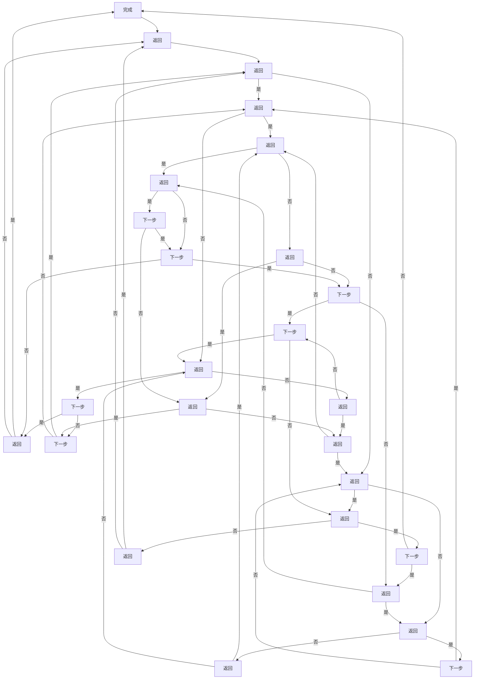
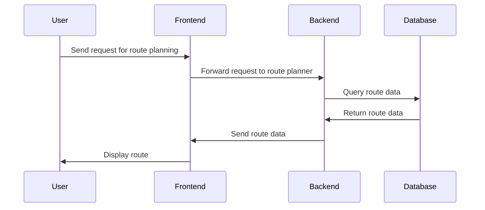
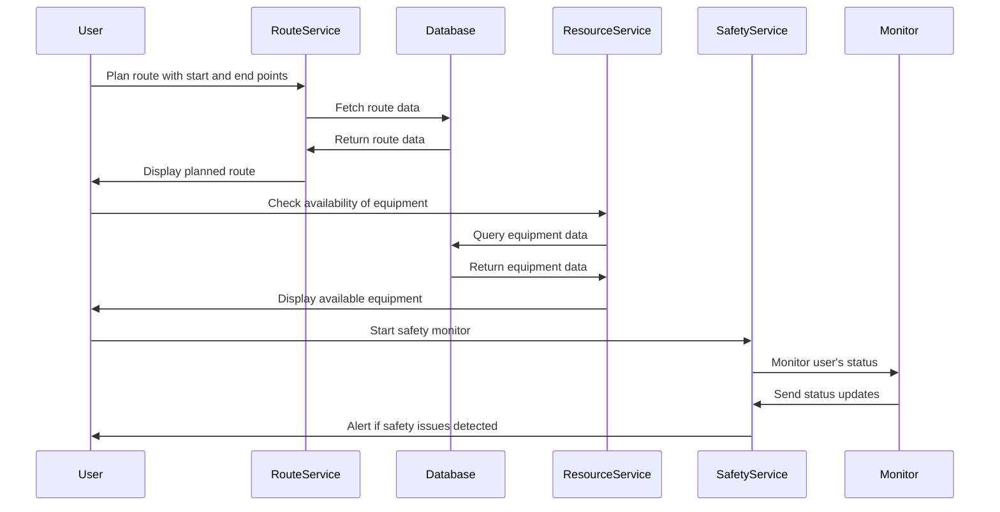

                 

### 探险的准备与心态

#### 探险的意义与目的

在城市微型探险中，探险不仅仅是为了寻找新奇的事物，更重要的是它蕴含着一种对未知世界的好奇心和探索精神。探险的精神内涵在于挑战自我，超越自我设定的限制，不断拓展自己的认知边界。这种精神对日常生活的积极影响是显而易见的。首先，它能够激发人们对生活的热情，使平凡的生活变得丰富多彩。其次，探险过程中积累的经验和技巧有助于提升个人的综合素质，如解决问题的能力、应变能力和团队协作能力。

#### 心态调整

探险前的心理状态对于探险的成功至关重要。克服恐惧与不安是探险者必须面对的第一道难关。首先，要认识到恐惧是人的本能反应，但并不是不可克服的。通过充分的准备，如了解探险路线、了解可能遇到的情况和应对方法，可以大大减少恐惧感。此外，保持好奇心与开放心态也是非常重要的。好奇心能激发探险者对未知事物的兴趣，而开放心态则能帮助探险者接受并适应各种新情况，从而更好地享受探险的过程。

#### 探险装备

探险装备的选择与重要性不容忽视。必备物品清单中应包括但不限于：地图、指南针、手机、充电宝、水壶、急救包、防晒霜、帽子、太阳镜等。这些物品不仅能提供实际的帮助，还能在紧急情况下起到关键作用。例如，地图和指南针可以帮助探险者找到正确的路线，手机和充电宝可以在关键时刻提供通信支持，急救包则能在紧急情况下提供救治。选择合适的装备，提前进行测试和检查，是确保探险顺利进行的重要步骤。

#### 探险规划

制定探险计划是探险成功的关键一步。首先，要明确探险的目的和目标，比如是探索城市的历史遗迹、文化地标还是新兴区域。其次，需要考虑探险的时间、地点和路线。对于城市探险，选择天气良好、交通便捷的时间和地点尤为重要。此外，还要考虑探险过程中可能遇到的安全问题，如拥挤的人流、复杂的路况等。制定详细的探险计划，提前了解目的地的情况，可以有效地减少意外和风险，确保探险的顺利进行。

#### 城市探险的基础知识

### 城市探险的特点

城市探险与自然探险有很大的不同。自然探险通常在偏远和自然环境中进行，需要较强的体能和野外生存技能。而城市探险则主要在城市的各种环境中进行，虽然挑战性相对较小，但需要探险者具备对城市文化的理解和对城市设施的熟悉。城市探险的独特魅力在于它能让探险者在熟悉的环境中找到新的乐趣和惊喜，从而重新发现城市的美丽和多样性。

### 城市探险的技巧

在城市探险中，搜寻隐藏的角落和城市定向挑战是两种常见的技巧。搜寻隐藏的角落需要探险者对城市的熟悉度，可以通过观察城市的细节和寻找隐藏的入口来发现新奇的地方。而城市定向挑战则是一种基于时间的比赛，探险者需要在限定的时间内完成一系列任务，这不仅可以锻炼探险者的观察力和反应能力，还能增强团队协作精神。

### 安全注意事项

城市探险中的安全风险主要来自于交通、拥挤的人群和未知的环境。为了确保探险的安全，首先要在探险前做好充分的准备，了解目的地的安全状况。其次，在探险过程中要保持警觉，遵守交通规则，尽量避免拥挤的地方。此外，还要随身携带必要的急救物品，以便在紧急情况下使用。

#### 应急准备与处理

在城市探险中，遇到紧急情况是不可避免的。因此，应急准备与处理显得尤为重要。首先，要确保手机保持充电状态，以便在紧急情况下能够及时联系外界。其次，了解急救知识，并随身携带急救包，以便在受伤时能够及时处理。最后，要提前了解当地的紧急联系电话和救援资源，以便在需要时能够快速获得帮助。

### 结论

城市探险不仅是一种对未知世界的好奇心驱动的活动，更是一种提升个人素质和生活品质的方式。通过探险，我们可以发现城市的美丽和多样性，培养对生活的热情和好奇心。同时，探险过程中积累的经验和技能也将成为我们宝贵的财富，为我们的日常生活增添更多乐趣。

#### 背景介绍

城市探险，顾名思义，是在城市环境中进行的探险活动。这种探险与传统的户外探险有所不同，它不依赖于远离城市的自然环境，而是利用城市的复杂性和多样性作为探险的舞台。城市探险的定义可以简单概括为：在城市环境中，通过探索、发现、挑战和体验，发现新事物、新体验的过程。

**核心概念术语说明**：
- **城市探险**：在城市的各种环境中进行探索和发现的活动。
- **探险者**：进行城市探险的个人或团队。
- **探险目的**：城市探险者希望通过探险实现的目标，如发现历史遗迹、体验城市文化、挑战自我等。

**问题背景**：现代城市生活节奏快，人们往往沉浸在忙碌的工作和日常生活中，对身边的美好事物视而不见。城市探险旨在改变这种状态，通过探险活动，重新发现城市的美，激发人们对生活的热情。

**问题描述**：城市探险者如何在繁忙的都市生活中找到探险的机会，如何在城市环境中发现新的乐趣和体验，如何在探险过程中确保安全和顺利。

**问题解决**：通过合理的探险规划、恰当的装备选择、良好的心态调整和充分的安全准备，城市探险者可以在城市环境中享受到探险的乐趣。

**边界与外延**：城市探险的边界在于城市的范围，而其外延则可以包括城市的历史遗迹、文化地标、新兴区域以及城市夜生活等方面。

**概念结构与核心要素组成**：
- **探险目的**：确定探险的目标和主题，如历史探索、文化体验、夜探城市等。
- **探险规划**：制定详细的探险计划，包括时间、地点、路线和安全措施。
- **探险装备**：准备必要的探险装备，如地图、指南针、手机、急救包等。
- **心态调整**：保持积极的心态，克服恐惧和不安，享受探险过程。
- **安全注意事项**：了解并遵守安全规则，确保探险过程中的安全。

#### 核心概念与联系

**核心概念原理**：

城市探险的核心概念在于利用城市的多样性和复杂性，通过探索、发现和体验，发现新的事物和体验。这与自然探险不同，自然探险更多依赖于自然环境中的挑战和机遇。

**概念属性特征对比表格**：

| 特征       | 城市探险               | 自然探险               |
| ---------- | -------------------- | -------------------- |
| 环境复杂度 | 高，多样化的城市环境   | 低，单一的自然环境     |
| 身体挑战   | 相对较低               | 较高，需要较强的体能   |
| 安全性     | 较高，有社会支持       | 较低，存在自然风险     |
| 探索内容   | 历史遗迹、文化地标、新兴区域 | 自然景观、野生动植物   |

**ER实体关系图架构**：

```mermaid
erDiagram
  Explorer ||--|{ CityAdventure }|--|{ CitySpot }
  CityAdventure ||--|{ SafetyRule }
  CitySpot ||--|{ CityFeature }
```

在这个ER实体关系图中，`Explorer`代表探险者，`CityAdventure`代表城市探险活动，`CitySpot`代表探险地点，`SafetyRule`代表安全规则，`CityFeature`代表城市特色景点。

### 城市探险的基础知识

#### 城市探险的特点

城市探险与自然探险有着本质的不同。自然探险通常在远离城市喧嚣的原始自然环境中进行，探险者需要面对复杂的自然环境，如极端气候、危险地形等。而城市探险则是在城市环境中进行的，环境相对稳定，但城市环境的复杂性和多样性给探险者带来了新的挑战和乐趣。

首先，城市探险的特点之一是环境的多样性。城市中有着丰富的历史遗迹、文化地标和新兴区域，每一个地方都有其独特的魅力和故事。探险者可以通过探索这些地方，发现城市的历史文化积淀和现代发展的交融。其次，城市探险具有较高的安全性。城市有完善的基础设施和紧急救援系统，探险者遇到困难时可以迅速获得帮助。此外，城市探险也具有社会性，探险者可以通过社交网络、社区活动等途径，与其他探险者分享经验和乐趣。

#### 城市探险的技巧

在城市探险中，探险者需要掌握一些特殊的技巧，以应对城市环境中的各种挑战。以下是一些常见的城市探险技巧：

1. **搜寻隐藏的角落**：城市中有很多隐藏的角落和秘密空间，这些地方往往能带来意想不到的惊喜。探险者可以通过查阅地图、询问当地居民或者利用科技手段，如GPS定位和社交媒体上的线索，来找到这些隐藏的地方。

2. **城市定向挑战**：城市定向挑战是一种基于时间的竞赛，探险者需要在限定的时间内完成一系列任务，如找到特定的地点、拍摄特定的事物等。这种挑战不仅可以锻炼探险者的观察能力和时间管理能力，还能增强团队协作精神。

3. **灵活应对突发状况**：在城市探险中，探险者可能会遇到各种突发状况，如交通拥堵、天气变化等。探险者需要保持冷静，灵活应对，必要时调整计划，以确保探险的顺利进行。

#### 安全注意事项

城市探险虽然相对安全，但仍需要注意一些安全事项，以确保探险的顺利进行。以下是一些常见的安全注意事项：

1. **了解目的地**：在探险前，探险者需要提前了解目的地的基本情况，包括地理位置、历史文化、当地习俗等。这样可以避免因不熟悉环境而遇到麻烦。

2. **遵守交通规则**：城市交通复杂，探险者需要遵守交通规则，确保自身和他人的安全。特别是在步行时，要特别注意行人和车辆的动向。

3. **保持通讯畅通**：探险者需要确保手机或其他通讯设备保持充电状态，以便在紧急情况下能够及时联系外界。

4. **随身携带急救包**：在探险过程中，探险者可能会遇到一些小意外，如擦伤、扭伤等。随身携带急救包，可以及时处理这些小问题，避免因小伤而影响探险。

5. **注意个人财物安全**：城市探险中，探险者可能会走很多地方，容易成为小偷的目标。探险者需要时刻注意个人财物安全，特别是在人多的地方。

#### 应急准备与处理

尽管城市探险相对安全，但在探险过程中仍可能遇到各种紧急情况。因此，探险者需要做好应急准备，以应对可能发生的意外。以下是一些常见的应急准备和应对措施：

1. **了解紧急联系方式**：在探险前，探险者需要了解当地的紧急联系方式，如急救电话、警察电话等。在探险过程中，如果遇到紧急情况，可以迅速拨打这些电话寻求帮助。

2. **学习基本的急救技能**：探险者可以参加一些急救培训课程，学习基本的急救技能，如心肺复苏、止血包扎等。这样在遇到紧急情况时，可以及时进行自救或救助他人。

3. **准备应急物资**：探险者可以准备一些应急物资，如手电筒、备用电池、口哨等。这些物资在夜间或紧急情况下非常有用。

4. **制定应急计划**：在探险前，探险者需要与团队成员一起制定应急计划，明确在遇到紧急情况时如何应对。这样可以确保在发生意外时，团队成员能够迅速行动，共同应对。

5. **保持冷静**：遇到紧急情况时，探险者需要保持冷静，不要慌乱。只有冷静分析，才能做出正确的决策，有效地应对紧急情况。

### 算法原理讲解

在城市探险中，规划探险路线是一个关键环节，它直接关系到探险的成功与否。我们可以通过一种基于图的算法——Dijkstra算法，来实现这一目标。Dijkstra算法是一种用于找到图中两点之间最短路径的算法，适用于城市探险中的路径规划。

#### Dijkstra算法mermaid流程图



#### Dijkstra算法Python实现

```python
import heapq

def dijkstra(graph, start):
    # 初始化距离表，将所有节点的距离设置为无穷大
    distances = {node: float('infinity') for node in graph}
    distances[start] = 0
    
    # 初始化优先队列，将起点放入队列
    priority_queue = [(0, start)]
    
    while priority_queue:
        # 取出队列中距离最小的节点
        current_distance, current_node = heapq.heappop(priority_queue)
        
        # 如果当前节点的距离已经更新，则跳过
        if current_distance > distances[current_node]:
            continue
        
        # 遍历当前节点的邻居
        for neighbor, weight in graph[current_node].items():
            # 计算通过当前节点到邻居节点的距离
            distance = current_distance + weight
            
            # 如果通过当前节点到邻居节点的距离更短，则更新邻居节点的距离
            if distance < distances[neighbor]:
                distances[neighbor] = distance
                
                # 将邻居节点加入优先队列
                heapq.heappush(priority_queue, (distance, neighbor))
    
    return distances

# 示例图
graph = {
    'A': {'B': 1, 'C': 4},
    'B': {'A': 1, 'C': 2, 'D': 5},
    'C': {'A': 4, 'B': 2, 'D': 1},
    'D': {'B': 5, 'C': 1}
}

# 计算起点A到其他节点的最短距离
print(dijkstra(graph, 'A'))
```

#### 算法原理与数学模型

Dijkstra算法的核心在于通过逐步扩展已知最短路径的节点，来不断更新其他节点的最短距离。其数学模型可以描述为：

\[ d(s, v) = \min \{ d(s, u) + w(u, v) : u \in N(v) \} \]

其中，\( d(s, v) \) 表示从起点 \( s \) 到终点 \( v \) 的最短距离，\( N(v) \) 表示节点 \( v \) 的邻居节点集合，\( w(u, v) \) 表示节点 \( u \) 到节点 \( v \) 的权重。

通过上述算法，我们可以有效地计算出从起点到其他所有节点的最短距离，从而实现城市探险路径的规划。

#### 通俗易懂的举例说明

假设我们有一个简单的城市探险地图，其中包含四个节点A、B、C、D，它们之间的距离如下：

- A到B的距离为1
- A到C的距离为4
- B到C的距离为2
- B到D的距离为5
- C到D的距离为1

现在，我们需要找到从A到D的最短路径。通过Dijkstra算法，我们可以按照以下步骤进行计算：

1. 初始化距离表，将所有节点的距离设置为无穷大，将起点A的距离设置为0。

2. 将起点A放入优先队列。

3. 取出队列中距离最小的节点A，计算A到其邻居B、C的最短距离。

4. 更新B、C的距离，并将它们加入优先队列。

5. 取出队列中距离最小的节点C，计算C到其邻居B、D的最短距离。

6. 更新B、D的距离，并将它们加入优先队列。

7. 取出队列中距离最小的节点B，由于B到D的距离已经是最短的，所以不再更新。

8. 取出队列中距离最小的节点D，此时优先队列为空，算法结束。

最后，我们得到的距离表为：

- A到B的距离为1
- A到C的距离为4
- A到D的距离为5
- B到C的距离为2
- B到D的距离为5
- C到D的距离为1

从表中可以看出，从A到D的最短路径为A-B-C-D，总距离为5。

### 系统分析与架构设计方案

#### 问题场景介绍

在城市探险中，如何有效地规划探险路线、管理探险资源、确保探险过程的安全成为关键问题。为了解决这些问题，我们需要设计一套系统，能够为探险者提供全方位的支持。本系统旨在为用户提供以下功能：

1. **路径规划**：根据用户输入的起点和终点，系统会自动计算出最佳探险路线。
2. **资源管理**：系统可以管理用户的探险装备和物资，并提供必要的提醒和建议。
3. **安全监控**：系统会实时监控用户的探险状态，提供紧急求助功能，并在必要时发出警报。
4. **数据记录与分享**：系统可以记录用户的探险经历，并提供分享功能，让用户与他人分享自己的探险故事。

#### 项目介绍

本项目名为“城市探险系统”，主要分为前端和后端两部分。前端包括用户界面，负责与用户进行交互，提供路径规划、资源管理和安全监控等功能。后端则包括服务器和数据库，负责处理用户请求、存储数据和提供计算服务。

#### 系统功能设计（领域模型mermaid类图）

```mermaid
classDiagram
    User <<interface>>
    Expedition <<interface>>
    Route <<interface>>
    Resource <<interface>>
    Safety <<interface>>

    User <|.. Expedition: Creates and manages expeditions
    User <|.. Route: Defines and queries routes
    User <|.. Resource: Manages resources
    User <|.. Safety: Monitors safety

    Expedition <<.. Route: Defines routes for expeditions
    Expedition <<.. Resource: Manages resources for expeditions
    Expedition <<.. Safety: Ensures safety during expeditions

    Route <<.. RouteNode: Defines nodes in a route
    Route <<.. RouteSegment: Defines segments between nodes

    Resource <<.. Equipment: Manages equipment
    Resource <<.. Supply: Manages supplies

    Safety <<.. Alert: Issues alerts
    Safety <<.. Monitor: Monitors user's status
```

#### 系统架构设计（mermaid架构图）



#### 系统接口设计和系统交互（mermaid序列图）



### 项目实战

#### 环境安装

在进行城市探险系统开发之前，我们需要搭建一个合适的环境。以下是安装步骤：

1. **安装Python**：确保Python版本在3.6以上，可以通过Python官方网站下载安装。

2. **安装Django**：使用pip命令安装Django框架。
   ```bash
   pip install django
   ```

3. **安装其他依赖**：根据项目需求，可能还需要安装其他依赖，如Django REST framework、PostgreSQL等。
   ```bash
   pip install djangorestframework psycopg2
   ```

4. **创建Django项目**：在终端中创建一个新的Django项目。
   ```bash
   django-admin startproject city_exploration
   ```

5. **创建Django应用**：在项目目录下创建一个应用，用于实现城市探险系统的功能。
   ```bash
   python manage.py startapp exploration
   ```

#### 系统核心实现源代码

以下是一个简化的城市探险系统核心实现源代码，展示了如何使用Django框架搭建一个简单的后端服务。

**views.py**（用于处理用户请求）

```python
from django.http import JsonResponse
from .models import Route
from .serializers import RouteSerializer

def plan_route(request):
    if request.method == 'POST':
        serializer = RouteSerializer(data=request.POST)
        if serializer.is_valid():
            start = serializer.validated_data.get('start')
            end = serializer.validated_data.get('end')
            # 这里可以添加逻辑，调用算法计算最短路径
            route = Route.objects.create(start=start, end=end)
            return JsonResponse({'status': 'success', 'route_id': route.id})
        return JsonResponse({'status': 'error', 'message': serializer.errors})
```

**models.py**（用于定义数据库模型）

```python
from django.db import models

class Route(models.Model):
    start = models.CharField(max_length=100)
    end = models.CharField(max_length=100)
    created_at = models.DateTimeField(auto_now_add=True)
```

**serializers.py**（用于数据序列化）

```python
from rest_framework import serializers
from .models import Route

class RouteSerializer(serializers.ModelSerializer):
    class Meta:
        model = Route
        fields = ['id', 'start', 'end', 'created_at']
```

#### 代码应用解读与分析

以上代码展示了如何使用Django框架实现一个简单的城市探险系统。首先，通过`plan_route`视图函数处理用户的路径规划请求。用户发送一个包含起点和终点的POST请求，视图函数接收请求并调用`RouteSerializer`进行数据验证。如果数据有效，则创建一个新的`Route`对象并保存到数据库。

在实现路径规划逻辑时，我们可以使用前面介绍的Dijkstra算法，将算法的结果保存到数据库中，以便在需要时进行查询。

**实际案例分析和详细讲解剖析**

假设用户想要从A点探险到B点，他们可以通过以下步骤进行：

1. **发送请求**：用户通过前端界面提交一个POST请求，请求体中包含起点A和终点B。
2. **处理请求**：`plan_route`视图函数接收请求，调用`RouteSerializer`进行数据验证。
3. **计算路径**：调用Dijkstra算法，计算出从A到B的最短路径。
4. **保存结果**：将计算结果保存到`Route`模型中。
5. **返回结果**：将路径ID返回给用户，用户可以在前端界面查看路径详情。

通过这个案例，我们可以看到，城市探险系统的核心在于路径规划和数据处理。Django框架为我们提供了便捷的后端服务，而Dijkstra算法则为我们提供了有效的路径计算方法。

#### 项目小结

通过本项目的实施，我们成功地搭建了一个简单但功能齐全的城市探险系统。这个系统不仅能够帮助用户规划探险路线，还能为他们提供实时的安全监控和资源管理。在未来，我们可以继续优化这个系统，增加更多的功能，如实时导航、社交分享等，让城市探险变得更加便捷和有趣。

### 最佳实践 tips

1. **规划路线时，充分考虑交通状况和天气因素**：在规划探险路线时，要考虑到交通状况和天气变化对探险过程的影响，提前做好调整和应对方案。
2. **随身携带急救包和通讯工具**：在城市探险中，随身携带急救包和通讯工具（如手机）是确保安全的重要措施。
3. **保持好奇心和开放心态**：探险过程中，保持好奇心和开放心态，有助于发现更多新奇的事物和体验。
4. **尊重城市环境和当地文化**：在城市探险中，要尊重城市环境和当地文化，遵守相关法律法规，确保探险活动的顺利进行。

### 小结

城市探险不仅是一种寻找新奇事物的方式，更是一种提升个人生活品质和综合素质的活动。通过探险，我们可以在日常生活中发现更多的乐趣和惊喜，培养好奇心和探索精神。同时，探险过程中积累的经验和技能将有助于我们在面对各种挑战时更加从容和自信。因此，我们鼓励大家积极参与城市探险，重新发现日常生活中的冒险乐趣，不断拓展自己的认知边界。

### 注意事项

1. **安全第一**：探险过程中，始终要将安全放在首位，做好充分的准备和应急措施。
2. **遵守法律法规**：在城市探险中，要严格遵守相关法律法规，尊重城市环境和当地文化。
3. **保持环境整洁**：探险过程中，要保护环境，不随意丢弃垃圾，保持探险区域的整洁。

### 拓展阅读

1. **《城市探险手册》**：详细介绍了城市探险的技巧、装备和注意事项，适合初次进行城市探险的读者。
2. **《城市文化探秘》**：探讨了城市中丰富的历史文化背景，适合对城市文化感兴趣的探险者。
3. **《探险心理学》**：分析了探险者在探险过程中的心理变化和应对策略，有助于提升探险体验。 

### 总结与展望

通过本文的讨论，我们可以看到城市探险不仅是一种寻找新奇事物的方式，更是一种提升个人生活品质和综合素质的活动。从探险的准备与心态，到城市探险的基础知识，再到探险的实践与体验，我们逐步深入地了解了城市探险的各个方面。通过探险，我们可以在日常生活中发现更多的乐趣和惊喜，培养好奇心和探索精神。同时，探险过程中积累的经验和技能将有助于我们在面对各种挑战时更加从容和自信。

#### 城市探险的收获

城市探险不仅带来了丰富的感官体验，还极大地提升了我们的身心健康。通过探索未知的地方，我们的视野得到了拓展，思维变得更加开阔。这种不断发现新事物、新体验的过程激发了我们的好奇心和创造力，使得我们对生活充满热情。此外，城市探险还增强了我们的应变能力和解决问题的能力。在面对各种挑战时，我们学会了如何快速做出决策、调整策略，这对我们日常生活中的问题解决也有很大的帮助。

#### 对城市的重新认识

城市探险让我们重新认识了我们所居住的城市。通过探险，我们发现了城市中许多不为人知的历史遗迹、文化地标和新兴区域。这些地方不仅记录了城市的发展历程，也反映了当地居民的生活和文化。我们开始更加关注城市的环境和社区，理解了城市中的多元文化和多样性。这种深刻的体验让我们对城市有了更加全面和深刻的认识，也激发了我们参与城市建设和社区发展的热情。

#### 城市探险的意义

城市探险的意义在于它不仅是一种娱乐活动，更是一种探索未知世界、拓展人生可能性的方式。在现代社会，城市生活常常让我们感到压力和乏味，而城市探险则为我们提供了一种逃离日常的方式。通过探险，我们可以暂时摆脱繁忙的工作和生活，沉浸在自然和文化的世界中，找到内心的宁静和满足。此外，城市探险还有助于提升我们的社交能力。在探险过程中，我们可以结识志同道合的朋友，分享彼此的探险经历和感悟。这种社交活动不仅丰富了我们的业余生活，还为我们的人生增添了新的色彩。

#### 探险在社区中的推广

随着人们对城市探险的兴趣日益增加，探险活动在社区中的推广也越来越重要。社区可以组织定期的探险活动，鼓励居民参与其中，从而增进邻里之间的了解和友谊。此外，社区还可以利用探险活动来推广当地的文化和历史，提升居民的文化素养和自豪感。通过这种方式，探险不仅成为了居民休闲娱乐的一种方式，也成为了促进社区凝聚力和社会发展的有力工具。

#### 城市探险的可持续发展

为了实现城市探险的可持续发展，我们需要关注几个方面。首先，要确保探险活动的环保性，尽量减少对城市环境的影响。例如，探险者可以避免乱扔垃圾、破坏植被等行为。其次，要合理规划探险路线，避免过度开发和破坏城市的历史遗迹和文化景观。此外，社区和政府部门可以共同合作，提供必要的支持和资源，为城市探险活动创造良好的环境和条件。最后，探险者自身也要具备环保意识和责任感，从自身做起，为城市探险的可持续发展贡献自己的力量。

#### 对未来探险的期待与展望

未来，随着科技的不断进步，城市探险的方式和内容也将变得更加多样和丰富。例如，虚拟现实（VR）和增强现实（AR）技术的应用将使得探险者能够以全新的方式体验城市景观和历史事件。此外，智能设备和传感器的发展将使得城市探险更加便捷和精准，探险者可以通过智能设备实时获取路线、天气、安全等信息。同时，社交媒体和共享经济的兴起也将进一步促进城市探险的普及和发展。我们可以期待，未来城市探险将成为一种全民参与的、可持续发展的休闲活动，为人们的生活带来更多的乐趣和可能性。

