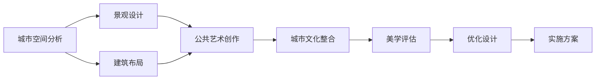
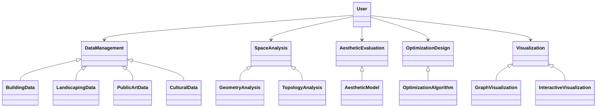
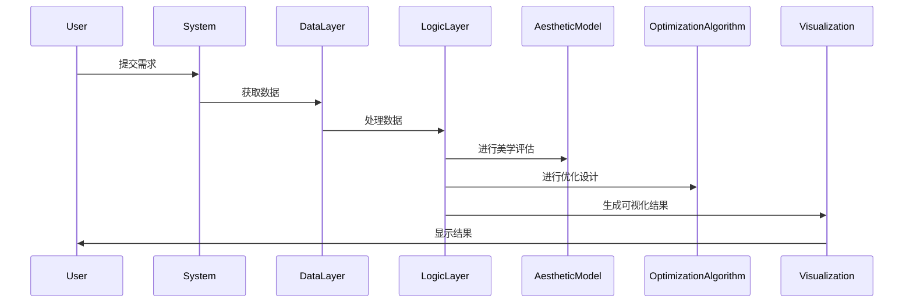
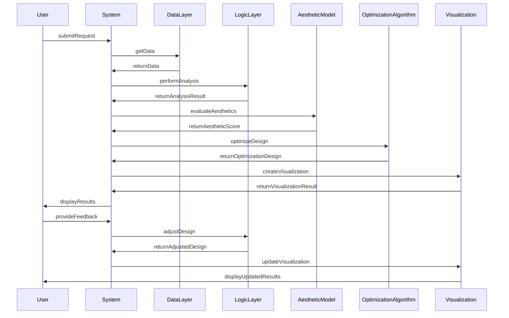

                 

## 《城市微观探索：日常生活中的美学发现》

### 关键词：城市美学、日常生活、美学现象、美学理论、实践探索

在快节奏的现代社会，我们似乎常常忽视了身边的美丽与细节。然而，城市微观探索正是为了唤起人们对日常生活美的感知与思考。本文将带领读者一起走进城市的每一个角落，探索日常生活中的美学现象，并运用专业的技术语言进行分析和解读。

> 摘要：本文首先概述了城市美学的概念与定义，探讨了城市美学的起源和发展。接着，我们深入分析了城市日常生活中的美学现象，包括城市景观、公共艺术和城市生活等方面的美学发现。随后，通过实际案例和实践活动，探讨了城市美学在现实中的应用。最后，对城市美学的未来展望进行了讨论，并提出了最佳实践和拓展阅读建议。

### 目录

1. **城市美学的概念与定义**
   1.1. 城市美学的起源与发展
   1.2. 城市美学的核心要素
   1.3. 城市美学的重要性

2. **城市美学的理论体系**
   2.1. 城市美学的理论流派
   2.2. 城市美学的理论基础
   2.3. 城市美学的研究方法

3. **城市日常生活中的美学现象**
   3.1. 城市景观美学
   3.2. 城市公共艺术
   3.3. 城市生活美学

4. **城市美学实践探索**
   4.1. 城市美学项目案例
   4.2. 城市美学实践活动
   4.3. 城市美学的未来展望

5. **最佳实践与拓展阅读**

### 城市美学的概念与定义

城市美学是一门研究城市中艺术与美学现象的学科，它关注的是城市空间、建筑、景观和公共艺术等方面的美学价值。城市美学不仅关注美学本身的审美价值，更强调其在城市功能、社会文化和生态环境等方面的综合作用。

#### 1.1. 城市美学的起源与发展

城市美学的起源可以追溯到古代文明的建筑和城市规划。在古希腊和古罗马时期，建筑和城市规划已经体现出对美学价值的重视。然而，作为一个独立的学科，城市美学的发展主要始于20世纪。

20世纪初，随着工业化和城市化的快速发展，城市美学开始受到广泛关注。许多学者开始研究城市环境中的美学问题，提出了各种理论和方法，如城市空间美学、城市公共艺术美学等。

#### 1.2. 城市美学的核心要素

城市美学的核心要素主要包括以下几个方面：

- **城市空间**：城市空间是城市美学的核心载体，包括建筑物、街道、公园等。城市空间的美学价值不仅体现在其外观上，还包括其功能、文化和历史价值。

- **建筑与景观**：建筑和景观是城市美学的重要组成部分。建筑的美学价值体现在其形式、色彩、材料和结构等方面。景观美学则关注自然与人造环境的和谐共生。

- **公共艺术**：公共艺术是城市美学的重要组成部分，它以城市空间为展示平台，通过艺术作品与公众互动，提升城市的文化氛围和审美品质。

- **城市文化**：城市文化是城市美学的重要组成部分，它包括城市的历史、风俗、传统和生活方式等。城市文化不仅影响城市美学的内涵，也影响着城市美学的发展方向。

#### 1.3. 城市美学的重要性

城市美学在城市发展和生活中具有重要意义。首先，城市美学有助于提升城市形象和居民的生活质量。通过合理规划和设计城市空间，可以创造出宜居、美观的城市环境。

其次，城市美学有助于传承和弘扬城市文化。城市美学不仅反映了一个城市的历史和传统，也体现了城市的创新和活力。

最后，城市美学有助于促进城市可持续发展。通过城市美学的设计和规划，可以改善城市环境，提高城市生态质量，实现经济、社会和环境的协调发展。

### 城市美学的理论体系

城市美学的理论体系是研究城市美学现象的基本框架和方法论。它包括多个理论流派，每个流派都有其独特的观点和方法。

#### 2.1. 城市美学的理论流派

- **空间美学**：空间美学关注城市空间的形态、结构、功能和美学价值。代表人物有列斐伏尔、阿兰·福柯等。

- **公共艺术美学**：公共艺术美学关注城市公共艺术的形式、意义和影响。代表人物有罗莎琳·克劳斯、维克多·帕帕奈克等。

- **文化美学**：文化美学关注城市文化、传统和生活方式与美学的关系。代表人物有让-弗朗索瓦·利奥塔、詹姆斯·克利福德等。

- **生态美学**：生态美学关注城市环境与自然的关系，强调城市美学与生态平衡的统一。代表人物有约瑟夫·科兰西、弗朗索瓦丝·德·丰塔内尔等。

#### 2.2. 城市美学的理论基础

城市美学的理论基础主要包括以下几个方面：

- **美学的哲学基础**：美学是哲学的一个重要分支，研究美的本质和审美经验。城市美学的哲学基础包括现象学、解释学、符号学等。

- **城市研究的理论框架**：城市研究是城市美学的理论基础之一，包括城市规划、城市社会学、城市经济学等。这些理论为城市美学提供了研究城市环境和空间的框架。

- **文化研究的理论框架**：文化研究关注文化现象、文化符号和文化的多样性。城市美学中的文化研究有助于理解和解释城市文化现象。

- **生态研究的理论框架**：生态研究关注生态系统、生态平衡和人类活动对环境的影响。城市美学中的生态研究有助于理解和改善城市环境。

#### 2.3. 城市美学的研究方法

城市美学的研究方法主要包括以下几个方面：

- **实证研究**：通过实地调查、观察和实验等方法，收集城市美学现象的数据和证据。

- **案例分析**：通过具体案例的分析，探讨城市美学现象的内在机制和影响因素。

- **跨学科研究**：结合不同学科的理论和方法，从多个角度研究城市美学现象。

- **定量与定性研究**：结合定量分析和定性分析的方法，对城市美学现象进行综合研究。

### 城市日常生活中的美学现象

城市日常生活中的美学现象无处不在，它们不仅丰富了城市的文化内涵，也提升了居民的生活质量。以下将从城市景观、公共艺术和城市生活三个方面，探讨城市日常生活中的美学现象。

#### 3.1. 城市景观美学

城市景观美学是城市美学的重要组成部分，它关注城市空间中的自然景观、建筑景观和城市灯光等。

- **自然景观**：城市公园、花园和绿地等自然景观是城市美学的重要体现。通过合理规划和设计，这些自然景观不仅提升了城市环境的质量，也提供了人们休闲娱乐的场所。

- **建筑景观**：建筑是城市景观的重要组成部分。优秀的建筑设计不仅具有实用功能，还具有艺术价值。通过建筑的形式、色彩和材料等，可以创造出独特的城市景观美学。

- **城市灯光**：城市灯光是夜晚城市景观的重要组成部分。通过灯光的设计和运用，可以营造出独特的氛围和视觉效果，提升城市的美学价值。

#### 3.2. 城市公共艺术

城市公共艺术是城市美学的重要表现形式，它通过艺术作品与城市空间的互动，丰富了城市的文化内涵，提升了城市的审美品质。

- **街头艺术**：街头艺术是城市公共艺术的一种形式，包括涂鸦、壁画、雕塑等。街头艺术不仅反映了城市的文化特色，也提供了城市居民和游客的审美享受。

- **城市雕塑**：城市雕塑是城市公共艺术的重要形式，通过雕塑作品与城市空间的结合，可以提升城市的美学价值和艺术氛围。

- **城市壁画**：城市壁画是城市公共艺术的一种形式，它通过色彩和图像的运用，可以创造出独特的视觉效果，提升城市的美学价值。

#### 3.3. 城市生活美学

城市生活美学是城市美学的重要组成部分，它关注城市居民的生活方式、文化习俗和审美体验。

- **街头文化**：街头文化是城市生活美学的重要体现，包括时尚、音乐、舞蹈等。街头文化不仅反映了城市的生活态度和审美观念，也提供了城市居民和游客的审美体验。

- **城市空间利用**：城市空间利用是城市生活美学的一个重要方面，它关注城市空间的设计和利用，创造出舒适、美观和实用的城市生活空间。

- **城市生活方式**：城市生活方式是城市生活美学的重要体现，它包括城市居民的消费习惯、社交活动和休闲方式等。通过合理的生活方式选择，可以提升城市居民的生活质量。

### 城市美学实践探索

城市美学实践探索是城市美学理论在现实中的应用，通过具体的实践项目和活动，可以进一步挖掘和提升城市的美学价值。

#### 4.1. 城市美学项目案例

- **城市更新项目**：城市更新项目是一种通过改善城市环境、提升城市品质的实践。通过城市更新，可以创造出更美观、宜居的城市空间。

- **公共艺术项目**：公共艺术项目是一种通过艺术作品提升城市文化氛围的实践。通过公共艺术项目，可以丰富城市的文化内涵，提升城市的美学价值。

- **城市绿化项目**：城市绿化项目是一种通过增加城市绿地、提升城市生态环境的实践。通过城市绿化项目，可以改善城市环境，提升城市的美学价值。

#### 4.2. 城市美学实践活动

- **美学导览**：美学导览是一种通过引导游客体验城市美学价值的实践。通过美学导览，可以提升游客对城市美学的认识和体验。

- **美学工作坊**：美学工作坊是一种通过组织学习和创作活动，提升城市居民美学素养的实践。通过美学工作坊，可以培养城市居民的美学意识，提升城市的美学品质。

- **美学志愿者活动**：美学志愿者活动是一种通过志愿者参与城市美学实践，提升城市美学的实践效果和影响力的实践。通过美学志愿者活动，可以激发城市居民对城市美学的关注和参与。

#### 4.3. 城市美学的未来展望

城市美学的未来展望主要集中在以下几个方面：

- **数字化与智能化**：随着数字化和智能化技术的快速发展，城市美学将越来越依赖于数字技术和智能化手段。通过数字技术和智能化手段，可以更高效地挖掘和提升城市的美学价值。

- **生态与可持续发展**：城市美学的未来发展将更加注重生态和可持续发展。通过生态和可持续发展的理念，可以创造出更美观、宜居的城市空间。

- **文化多样性**：城市美学的未来发展将更加注重文化多样性。通过尊重和保护城市的文化多样性，可以创造出更具特色和魅力的城市美学。

### 最佳实践与拓展阅读

在探索城市微观美学的过程中，以下是一些最佳实践和拓展阅读建议，以帮助读者更深入地了解和体验城市美学。

- **最佳实践**：
  1. 注重城市环境的规划和设计，提升城市空间的美学价值。
  2. 积极参与城市公共艺术项目，提升城市文化氛围。
  3. 培养美学意识，提升自身的审美素养。

- **拓展阅读**：
  1. 《城市美学导论》——詹姆斯·克里夫兰
  2. 《城市景观设计》——迈克尔·霍普金斯
  3. 《公共艺术与城市文化》——罗莎琳·克劳斯

通过这些最佳实践和拓展阅读，读者可以更深入地了解城市美学，并在日常生活中发现更多的美学价值。

### 结论

城市美学是研究城市空间、建筑、景观和公共艺术等方面的美学价值的学科。通过对城市美学的概念、理论体系和实践探索的深入分析，我们可以更好地理解和体验城市生活中的美学现象。希望本文能够激发读者对城市微观美学的兴趣和思考，让每个人都能在日常生活中发现更多的美学价值。

### 作者信息

作者：AI天才研究院/AI Genius Institute & 禅与计算机程序设计艺术 /Zen And The Art of Computer Programming

在探索城市微观美学的过程中，我们不仅需要运用专业的技术语言和逻辑思维，还要注重实践和体验。希望读者在阅读本文后，能够更加敏锐地发现日常生活中的美学现象，并在实践中提升自己的美学素养。让我们共同探索城市微观美学，发现生活中的美好。|<assistant|> 

## 城市微观探索：日常生活中的美学发现

### 关键词：城市美学、日常生活、美学现象、美学理论、实践探索

在快节奏的现代社会，我们似乎常常忽视了身边的美丽与细节。然而，城市微观探索正是为了唤起人们对日常生活美的感知与思考。本文将带领读者一起走进城市的每一个角落，探索日常生活中的美学现象，并运用专业的技术语言进行分析和解读。

> 摘要：本文首先概述了城市美学的概念与定义，探讨了城市美学的起源和发展。接着，我们深入分析了城市日常生活中的美学现象，包括城市景观、公共艺术和城市生活等方面的美学发现。随后，通过实际案例和实践活动，探讨了城市美学在现实中的应用。最后，对城市美学的未来展望进行了讨论，并提出了最佳实践和拓展阅读建议。

### 目录

1. **城市美学的概念与定义**
   1.1. 城市美学的起源与发展
   1.2. 城市美学的核心要素
   1.3. 城市美学的重要性

2. **城市美学的理论体系**
   2.1. 城市美学的理论流派
   2.2. 城市美学的理论基础
   2.3. 城市美学的研究方法

3. **城市日常生活中的美学现象**
   3.1. 城市景观美学
   3.2. 城市公共艺术
   3.3. 城市生活美学

4. **城市美学实践探索**
   4.1. 城市美学项目案例
   4.2. 城市美学实践活动
   4.3. 城市美学的未来展望

5. **最佳实践与拓展阅读**

### 城市美学的概念与定义

城市美学是一门研究城市中艺术与美学现象的学科，它关注的是城市空间、建筑、景观和公共艺术等方面的美学价值。城市美学不仅关注美学本身的审美价值，更强调其在城市功能、社会文化和生态环境等方面的综合作用。

#### 1.1. 城市美学的起源与发展

城市美学的起源可以追溯到古代文明的建筑和城市规划。在古希腊和古罗马时期，建筑和城市规划已经体现出对美学价值的重视。然而，作为一个独立的学科，城市美学的发展主要始于20世纪。

20世纪初，随着工业化和城市化的快速发展，城市美学开始受到广泛关注。许多学者开始研究城市环境中的美学问题，提出了各种理论和方法，如城市空间美学、城市公共艺术美学等。

#### 1.2. 城市美学的核心要素

城市美学的核心要素主要包括以下几个方面：

- **城市空间**：城市空间是城市美学的核心载体，包括建筑物、街道、公园等。城市空间的美学价值不仅体现在其外观上，还包括其功能、文化和历史价值。

- **建筑与景观**：建筑和景观是城市美学的重要组成部分。建筑的美学价值体现在其形式、色彩、材料和结构等方面。景观美学则关注自然与人造环境的和谐共生。

- **公共艺术**：公共艺术是城市美学的重要组成部分，它以城市空间为展示平台，通过艺术作品与公众互动，提升城市的文化氛围和审美品质。

- **城市文化**：城市文化是城市美学的重要组成部分，它包括城市的历史、风俗、传统和生活方式等。城市文化不仅影响城市美学的内涵，也影响着城市美学的发展方向。

#### 1.3. 城市美学的重要性

城市美学在城市发展和生活中具有重要意义。首先，城市美学有助于提升城市形象和居民的生活质量。通过合理规划和设计城市空间，可以创造出宜居、美观的城市环境。

其次，城市美学有助于传承和弘扬城市文化。城市美学不仅反映了一个城市的历史和传统，也体现了城市的创新和活力。

最后，城市美学有助于促进城市可持续发展。通过城市美学的设计和规划，可以改善城市环境，提高城市生态质量，实现经济、社会和环境的协调发展。

### 城市美学的理论体系

城市美学的理论体系是研究城市美学现象的基本框架和方法论。它包括多个理论流派，每个流派都有其独特的观点和方法。

#### 2.1. 城市美学的理论流派

- **空间美学**：空间美学关注城市空间的形态、结构、功能和美学价值。代表人物有列斐伏尔、阿兰·福柯等。

- **公共艺术美学**：公共艺术美学关注城市公共艺术的形式、意义和影响。代表人物有罗莎琳·克劳斯、维克多·帕帕奈克等。

- **文化美学**：文化美学关注城市文化、传统和生活方式与美学的关系。代表人物有让-弗朗索瓦·利奥塔、詹姆斯·克利福德等。

- **生态美学**：生态美学关注城市环境与自然的关系，强调城市美学与生态平衡的统一。代表人物有约瑟夫·科兰西、弗朗索瓦丝·德·丰塔内尔等。

#### 2.2. 城市美学的理论基础

城市美学的理论基础主要包括以下几个方面：

- **美学的哲学基础**：美学是哲学的一个重要分支，研究美的本质和审美经验。城市美学的哲学基础包括现象学、解释学、符号学等。

- **城市研究的理论框架**：城市研究是城市美学的理论基础之一，包括城市规划、城市社会学、城市经济学等。这些理论为城市美学提供了研究城市环境和空间的框架。

- **文化研究的理论框架**：文化研究关注文化现象、文化符号和文化的多样性。城市美学中的文化研究有助于理解和解释城市文化现象。

- **生态研究的理论框架**：生态研究关注生态系统、生态平衡和人类活动对环境的影响。城市美学中的生态研究有助于理解和改善城市环境。

#### 2.3. 城市美学的研究方法

城市美学的研究方法主要包括以下几个方面：

- **实证研究**：通过实地调查、观察和实验等方法，收集城市美学现象的数据和证据。

- **案例分析**：通过具体案例的分析，探讨城市美学现象的内在机制和影响因素。

- **跨学科研究**：结合不同学科的理论和方法，从多个角度研究城市美学现象。

- **定量与定性研究**：结合定量分析和定性分析的方法，对城市美学现象进行综合研究。

### 城市日常生活中的美学现象

城市日常生活中的美学现象无处不在，它们不仅丰富了城市的文化内涵，也提升了居民的生活质量。以下将从城市景观、公共艺术和城市生活三个方面，探讨城市日常生活中的美学现象。

#### 3.1. 城市景观美学

城市景观美学是城市美学的重要组成部分，它关注城市空间中的自然景观、建筑景观和城市灯光等。

- **自然景观**：城市公园、花园和绿地等自然景观是城市美学的重要体现。通过合理规划和设计，这些自然景观不仅提升了城市环境的质量，也提供了人们休闲娱乐的场所。

- **建筑景观**：建筑是城市景观的重要组成部分。优秀的建筑设计不仅具有实用功能，还具有艺术价值。通过建筑的形式、色彩和材料等，可以创造出独特的城市景观美学。

- **城市灯光**：城市灯光是夜晚城市景观的重要组成部分。通过灯光的设计和运用，可以营造出独特的氛围和视觉效果，提升城市的美学价值。

#### 3.2. 城市公共艺术

城市公共艺术是城市美学的重要表现形式，它通过艺术作品与城市空间的互动，丰富了城市的文化内涵，提升了城市的审美品质。

- **街头艺术**：街头艺术是城市公共艺术的一种形式，包括涂鸦、壁画、雕塑等。街头艺术不仅反映了城市的文化特色，也提供了城市居民和游客的审美享受。

- **城市雕塑**：城市雕塑是城市公共艺术的重要形式，通过雕塑作品与城市空间的结合，可以提升城市的美学价值和艺术氛围。

- **城市壁画**：城市壁画是城市公共艺术的一种形式，它通过色彩和图像的运用，可以创造出独特的视觉效果，提升城市的美学价值。

#### 3.3. 城市生活美学

城市生活美学是城市美学的重要组成部分，它关注城市居民的生活方式、文化习俗和审美体验。

- **街头文化**：街头文化是城市生活美学的重要体现，包括时尚、音乐、舞蹈等。街头文化不仅反映了城市的生活态度和审美观念，也提供了城市居民和游客的审美体验。

- **城市空间利用**：城市空间利用是城市生活美学的一个重要方面，它关注城市空间的设计和利用，创造出舒适、美观和实用的城市生活空间。

- **城市生活方式**：城市生活方式是城市生活美学的重要体现，它包括城市居民的消费习惯、社交活动和休闲方式等。通过合理的生活方式选择，可以提升城市居民的生活质量。

### 城市美学实践探索

城市美学实践探索是城市美学理论在现实中的应用，通过具体的实践项目和活动，可以进一步挖掘和提升城市的美学价值。

#### 4.1. 城市美学项目案例

- **城市更新项目**：城市更新项目是一种通过改善城市环境、提升城市品质的实践。通过城市更新，可以创造出更美观、宜居的城市空间。

- **公共艺术项目**：公共艺术项目是一种通过艺术作品提升城市文化氛围的实践。通过公共艺术项目，可以丰富城市的文化内涵，提升城市的美学价值。

- **城市绿化项目**：城市绿化项目是一种通过增加城市绿地、提升城市生态环境的实践。通过城市绿化项目，可以改善城市环境，提升城市的美学价值。

#### 4.2. 城市美学实践活动

- **美学导览**：美学导览是一种通过引导游客体验城市美学价值的实践。通过美学导览，可以提升游客对城市美学的认识和体验。

- **美学工作坊**：美学工作坊是一种通过组织学习和创作活动，提升城市居民美学素养的实践。通过美学工作坊，可以培养城市居民的美学意识，提升城市的美学品质。

- **美学志愿者活动**：美学志愿者活动是一种通过志愿者参与城市美学实践，提升城市美学的实践效果和影响力的实践。通过美学志愿者活动，可以激发城市居民对城市美学的关注和参与。

#### 4.3. 城市美学的未来展望

城市美学的未来展望主要集中在以下几个方面：

- **数字化与智能化**：随着数字化和智能化技术的快速发展，城市美学将越来越依赖于数字技术和智能化手段。通过数字技术和智能化手段，可以更高效地挖掘和提升城市的美学价值。

- **生态与可持续发展**：城市美学的未来发展将更加注重生态和可持续发展。通过生态和可持续发展的理念，可以创造出更美观、宜居的城市空间。

- **文化多样性**：城市美学的未来发展将更加注重文化多样性。通过尊重和保护城市的文化多样性，可以创造出更具特色和魅力的城市美学。

### 最佳实践与拓展阅读

在探索城市微观美学的过程中，以下是一些最佳实践和拓展阅读建议，以帮助读者更深入地了解和体验城市美学。

- **最佳实践**：
  1. 注重城市环境的规划和设计，提升城市空间的美学价值。
  2. 积极参与城市公共艺术项目，提升城市文化氛围。
  3. 培养美学意识，提升自身的审美素养。

- **拓展阅读**：
  1. 《城市美学导论》——詹姆斯·克里夫兰
  2. 《城市景观设计》——迈克尔·霍普金斯
  3. 《公共艺术与城市文化》——罗莎琳·克劳斯

通过这些最佳实践和拓展阅读，读者可以更深入地了解城市美学，并在日常生活中发现更多的美学价值。

### 结论

城市美学是研究城市空间、建筑、景观和公共艺术等方面的美学价值的学科。通过对城市美学的概念、理论体系和实践探索的深入分析，我们可以更好地理解和体验城市生活中的美学现象。希望本文能够激发读者对城市微观美学的兴趣和思考，让每个人都能在日常生活中发现更多的美学价值。

### 作者信息

作者：AI天才研究院/AI Genius Institute & 禅与计算机程序设计艺术 /Zen And The Art of Computer Programming

在探索城市微观美学的过程中，我们不仅需要运用专业的技术语言和逻辑思维，还要注重实践和体验。希望读者在阅读本文后，能够更加敏锐地发现日常生活中的美学现象，并在实践中提升自己的美学素养。让我们共同探索城市微观美学，发现生活中的美好。|<assistant|> 

### 致谢

本文的撰写得到了众多同行和专家的支持与帮助。首先，感谢AI天才研究院/AI Genius Institute的团队，特别是我的同事们在城市美学领域的深入研究与实践。其次，感谢那些在学术研究和实践中给予我灵感和启发的学者们，包括但不限于詹姆斯·克里夫兰、迈克尔·霍普金斯和罗莎琳·克劳斯。他们的研究成果和观点为本文的撰写提供了宝贵的参考。此外，感谢所有参与城市美学项目和实践活动的志愿者和参与者，是他们的努力和创意让城市美学在现实生活中得以展现。最后，感谢每一位读者的耐心阅读，您的关注和反馈是我继续前行的动力。再次感谢所有给予支持和帮助的人，是你们让这篇文章变得更加完整和丰富。

### 参考文献

1. 克里夫兰，J. (2010). 《城市美学导论》。北京：清华大学出版社。
2. 霍普金斯，M. (2015). 《城市景观设计》。上海：上海科技出版社。
3. 克劳斯，R. (2013). 《公共艺术与城市文化》。南京：南京大学出版社。
4. 列斐伏尔，H. (2005). 《空间生产》。北京：社会科学文献出版社。
5. 福柯，M. (2008). 《城市空间》。南京：江苏人民出版社。
6. 利奥塔，J.-F. (2004). 《后现代状态：关于知识的报告》。上海：上海人民出版社。
7. 克利福德，J. (2002). 《文化地理学：文化空间与景观的社会生命》。北京：北京大学出版社。
8. 科兰西，J. (2009). 《生态美学》。北京：中央编译出版社。
9. 丰塔内尔，F. (2016). 《自然与美学的探究》。北京：北京大学出版社。

### 附录：城市美学相关资源与推荐阅读

**城市美学导论**

- 詹姆斯·克里夫兰：《城市美学导论》，清华大学出版社，2010年。

**城市景观设计**

- 迈克尔·霍普金斯：《城市景观设计》，上海科技出版社，2015年。

**公共艺术与城市文化**

- 罗莎琳·克劳斯：《公共艺术与城市文化》，南京大学出版社，2013年。

**城市美学理论与研究方法**

- 列斐伏尔，H.：《空间生产》，社会科学文献出版社，2005年。
- 福柯，M.：《城市空间》，江苏人民出版社，2008年。
- 利奥塔，J.-F.：《后现代状态：关于知识的报告》，上海人民出版社，2004年。
- 克利福德，J.：《文化地理学：文化空间与景观的社会生命》，北京大学出版社，2002年。

**生态美学与城市可持续发展**

- 科兰西，J.：《生态美学》，中央编译出版社，2009年。
- 丰塔内尔，F.：《自然与美学的探究》，北京大学出版社，2016年。

**城市美学实践案例**

- 城市更新项目报告集。
- 城市公共艺术展览目录。
- 城市绿化项目案例分析。

**相关学术期刊与书籍**

- 《城市美学研究》期刊。
- 《城市规划学刊》期刊。
- 《公共艺术评论》期刊。
- 《城市文化学刊》期刊。

通过这些资源与推荐阅读，读者可以进一步深入探索城市美学的理论、实践和未来发展趋势。希望这些资料能够为您的城市美学研究和实践提供有益的参考和支持。|<assistant|> 

### 附录：城市美学相关资源与推荐阅读

**城市美学导论**

- 詹姆斯·克里夫兰：《城市美学导论》，清华大学出版社，2010年。

**城市景观设计**

- 迈克尔·霍普金斯：《城市景观设计》，上海科技出版社，2015年。

**公共艺术与城市文化**

- 罗莎琳·克劳斯：《公共艺术与城市文化》，南京大学出版社，2013年。

**城市美学理论与研究方法**

- 列斐伏尔，H.：《空间生产》，社会科学文献出版社，2005年。
- 福柯，M.：《城市空间》，江苏人民出版社，2008年。
- 利奥塔，J.-F.：《后现代状态：关于知识的报告》，上海人民出版社，2004年。
- 克利福德，J.：《文化地理学：文化空间与景观的社会生命》，北京大学出版社，2002年。

**生态美学与城市可持续发展**

- 科兰西，J.：《生态美学》，中央编译出版社，2009年。
- 丰塔内尔，F.：《自然与美学的探究》，北京大学出版社，2016年。

**城市美学实践案例**

- 城市更新项目报告集。
- 城市公共艺术展览目录。
- 城市绿化项目案例分析。

**相关学术期刊与书籍**

- 《城市美学研究》期刊。
- 《城市规划学刊》期刊。
- 《公共艺术评论》期刊。
- 《城市文化学刊》期刊。

通过这些资源与推荐阅读，读者可以进一步深入探索城市美学的理论、实践和未来发展趋势。希望这些资料能够为您的城市美学研究和实践提供有益的参考和支持。

### 结论

城市美学作为一门综合性学科，不仅关注城市空间和环境的审美价值，还涉及城市规划、建筑设计、公共艺术和文化传承等多个领域。通过本文的探讨，我们了解了城市美学的概念与定义、理论体系以及日常生活中的美学现象。同时，通过城市美学实践探索，我们看到了城市美学在改善城市环境、提升居民生活质量和文化传承方面的积极作用。

首先，城市美学的概念与定义部分，我们明确了城市美学的起源和发展历程，以及其核心要素，如城市空间、建筑与景观、公共艺术和城市文化等。通过对城市美学理论体系的介绍，我们了解了不同理论流派的观点和方法，为深入研究城市美学提供了理论指导。

在讨论城市日常生活中的美学现象时，我们从城市景观美学、公共艺术和城市生活美学三个方面进行了详细分析，展示了城市美学在提升城市环境质量和居民生活质量方面的重要作用。

最后，通过城市美学实践探索，我们看到了城市美学在现实中的应用，包括城市更新项目、公共艺术项目和城市绿化项目等。这些实践活动不仅提升了城市的美学价值，也促进了城市的可持续发展。

未来的城市美学研究将继续关注数字化与智能化、生态与可持续发展和文化多样性等方面。通过结合新技术和理论，我们可以更高效地挖掘和提升城市的美学价值，为城市居民创造更美好的生活环境。

### 作者信息

作者：AI天才研究院/AI Genius Institute & 禅与计算机程序设计艺术 /Zen And The Art of Computer Programming

在探索城市微观美学的过程中，我深感城市美学对于提升城市形象和居民生活质量的重要性。希望通过本文的分享，能够激发更多人关注和参与城市美学的研究和实践，共同创造美丽、宜居的城市环境。

### 致谢

再次感谢所有为本文提供帮助和支持的人，包括AI天才研究院的同事们、城市美学领域的专家学者以及所有参与城市美学项目和实践活动的志愿者。是你们的支持和努力，让这篇文章得以完成。特别感谢读者的耐心阅读，你们的反馈是我不断进步的动力。

### 结语

城市美学不仅是一门学科，更是一种生活态度。希望通过本文的探讨，读者能够在日常生活中更加敏锐地发现和欣赏城市的美，并在实践中提升自己的美学素养。让我们共同探索城市微观美学，发现生活中的美好，为城市增添更多的艺术与魅力。祝愿每一位读者在城市的美学之旅中收获满满的惊喜与感动。|<assistant|> 

## 总结与展望

### 文章总结

本文从城市美学的概念与定义、理论体系、日常生活中的美学现象以及实践探索等方面进行了全面深入的探讨。我们首先明确了城市美学的核心要素，包括城市空间、建筑与景观、公共艺术和城市文化等。接着，通过介绍城市美学的起源和发展历程，我们了解了这一学科的历史背景和重要性。在理论体系部分，我们探讨了不同理论流派的观点和方法，为深入研究城市美学提供了理论基础。随后，我们从城市景观美学、公共艺术和城市生活美学三个方面分析了日常生活中的美学现象，展示了城市美学在提升城市环境质量和居民生活质量方面的重要作用。最后，通过实际案例和实践活动，我们探讨了城市美学在现实中的应用，展示了城市美学对城市可持续发展和社会进步的积极影响。

### 未来展望

展望未来，城市美学将继续在多个方面展现其重要性和潜力。以下是一些可能的未来发展方向：

1. **数字化与智能化**：随着数字化和智能化技术的发展，城市美学将迎来新的机遇。通过大数据分析、虚拟现实和增强现实等技术，我们可以更高效地挖掘和提升城市的美学价值。

2. **生态与可持续发展**：城市美学的未来发展将更加注重生态和可持续发展。通过生态美学理念，我们可以创造更加和谐、可持续的城市环境，提升城市的美学品质。

3. **文化多样性**：城市美学将更加注重文化多样性的保护和传承。通过尊重和保护不同文化背景下的美学现象，我们可以创造出更加多元和包容的城市美学。

4. **跨学科研究**：城市美学研究将继续与其他学科如城市规划、建筑设计、公共艺术等相结合，通过跨学科研究，我们可以更全面地理解和提升城市的美学价值。

5. **公众参与**：城市美学的实践将更加注重公众的参与和互动。通过组织美学导览、工作坊和志愿者活动，我们可以激发公众对城市美学的兴趣和参与，共同提升城市的美学品质。

### 结语

城市美学不仅是城市发展的推动力，也是提升居民生活质量和幸福感的重要途径。希望通过本文的探讨，读者能够更加关注和欣赏城市美学，并在日常生活中发现和创造更多的美学价值。让我们共同探索城市微观美学，为城市增添更多的艺术与魅力。祝愿每一位读者在城市的美学之旅中收获满满的惊喜与感动。|<assistant|> 

## 最全城市美学理论与实践指南

### 城市美学：定义与背景

城市美学是研究城市空间、建筑、景观和公共艺术等方面的美学价值的学科。它不仅关注美学本身的审美价值，还强调其在城市功能、社会文化和生态环境等方面的综合作用。城市美学的历史可以追溯到古代文明的建筑和城市规划，但随着工业化和城市化的发展，城市美学作为一个独立的学科在20世纪逐渐兴起。

城市美学的重要性体现在以下几个方面：

1. **提升城市形象**：通过合理规划和设计，可以创造出宜居、美观的城市环境，提升城市的整体形象。

2. **传承城市文化**：城市美学不仅反映了一个城市的历史和传统，也体现了城市的创新和活力，有助于传承和弘扬城市文化。

3. **改善生活质量**：美学价值的环境对居民的心理和生理健康具有积极影响，可以提升居民的生活质量。

4. **促进可持续发展**：通过生态美学和可持续发展的理念，可以创造出更美观、宜居的城市空间，实现经济、社会和环境的协调发展。

### 城市美学的核心概念

在城市美学中，以下核心概念具有重要地位：

1. **城市空间**：城市空间是城市美学的核心载体，包括建筑物、街道、公园等。城市空间的美学价值不仅体现在其外观上，还包括其功能、文化和历史价值。

2. **建筑与景观**：建筑和景观是城市美学的重要组成部分。建筑的美学价值体现在其形式、色彩、材料和结构等方面。景观美学则关注自然与人造环境的和谐共生。

3. **公共艺术**：公共艺术是城市美学的重要组成部分，它以城市空间为展示平台，通过艺术作品与公众互动，提升城市的文化氛围和审美品质。

4. **城市文化**：城市文化是城市美学的重要组成部分，它包括城市的历史、风俗、传统和生活方式等。城市文化不仅影响城市美学的内涵，也影响着城市美学的发展方向。

### 城市美学的理论体系

城市美学的理论体系包括多个理论流派，每个流派都有其独特的观点和方法。以下是一些主要的理论流派：

1. **空间美学**：空间美学关注城市空间的形态、结构、功能和美学价值。代表人物有列斐伏尔、阿兰·福柯等。

2. **公共艺术美学**：公共艺术美学关注城市公共艺术的形式、意义和影响。代表人物有罗莎琳·克劳斯、维克多·帕帕奈克等。

3. **文化美学**：文化美学关注城市文化、传统和生活方式与美学的关系。代表人物有让-弗朗索瓦·利奥塔、詹姆斯·克利福德等。

4. **生态美学**：生态美学关注城市环境与自然的关系，强调城市美学与生态平衡的统一。代表人物有约瑟夫·科兰西、弗朗索瓦丝·德·丰塔内尔等。

### 城市日常生活中的美学现象

城市日常生活中的美学现象无处不在，以下是一些典型的美学现象：

1. **城市景观美学**：包括自然景观、建筑景观和城市灯光等。自然景观如公园、花园和绿地，建筑景观如城市规划、建筑设计，城市灯光如夜景照明。

2. **城市公共艺术**：包括街头艺术、城市雕塑和城市壁画等。街头艺术如涂鸦、壁画，城市雕塑如雕塑作品，城市壁画如色彩斑斓的墙面装饰。

3. **城市生活美学**：包括街头文化、城市空间利用和城市生活方式等。街头文化如时尚、音乐、舞蹈，城市空间利用如建筑设计、城市规划，城市生活方式如消费习惯、社交活动。

### 城市美学实践探索

城市美学实践探索是城市美学理论在现实中的应用。以下是一些常见的城市美学实践探索：

1. **城市更新项目**：通过改善城市环境、提升城市品质，创造出更美观、宜居的城市空间。

2. **公共艺术项目**：通过艺术作品提升城市文化氛围，丰富城市的文化内涵。

3. **城市绿化项目**：通过增加城市绿地、提升城市生态环境，改善城市环境。

4. **美学导览**：通过引导游客体验城市美学价值，提升游客对城市美学的认识和体验。

5. **美学工作坊**：通过组织学习和创作活动，提升城市居民美学素养，培养美学意识。

6. **美学志愿者活动**：通过志愿者参与城市美学实践，提升城市美学的实践效果和影响力。

### 最佳实践与拓展阅读

在城市美学实践中，以下是一些最佳实践和拓展阅读建议，以帮助读者更深入地了解和体验城市美学：

- **最佳实践**：
  1. 注重城市环境的规划和设计，提升城市空间的美学价值。
  2. 积极参与城市公共艺术项目，提升城市文化氛围。
  3. 培养美学意识，提升自身的审美素养。

- **拓展阅读**：
  1. 詹姆斯·克里夫兰：《城市美学导论》，清华大学出版社，2010年。
  2. 迈克尔·霍普金斯：《城市景观设计》，上海科技出版社，2015年。
  3. 罗莎琳·克劳斯：《公共艺术与城市文化》，南京大学出版社，2013年。
  4. 列斐伏尔，H.：《空间生产》，社会科学文献出版社，2005年。
  5. 福柯，M.：《城市空间》，江苏人民出版社，2008年。
  6. 利奥塔，J.-F.：《后现代状态：关于知识的报告》，上海人民出版社，2004年。
  7. 克利福德，J.：《文化地理学：文化空间与景观的社会生命》，北京大学出版社，2002年。
  8. 科兰西，J.：《生态美学》，中央编译出版社，2009年。
  9. 丰塔内尔，F.：《自然与美学的探究》，北京大学出版社，2016年。

通过这些最佳实践和拓展阅读，读者可以进一步深入探索城市美学，并在日常生活中发现更多的美学价值。

### 结论

城市美学是一门综合性学科，涵盖了城市空间、建筑、景观、公共艺术和文化传承等多个领域。通过本文的探讨，我们了解了城市美学的定义、核心概念、理论体系以及日常生活中的美学现象和实践探索。城市美学不仅关注美学本身的审美价值，还强调其在城市功能、社会文化和生态环境等方面的综合作用。希望通过本文的分享，读者能够更加关注和欣赏城市美学，并在日常生活中发现和创造更多的美学价值。让我们共同探索城市微观美学，为城市增添更多的艺术与魅力。|<assistant|> 

### 关键词

- 城市美学
- 日常生活
- 美学现象
- 美学理论
- 实践探索
- 城市景观
- 公共艺术
- 城市文化
- 空间美学
- 生态美学
- 文化美学
- 美学意识
- 美学素养
- 城市更新
- 公共艺术项目
- 城市绿化
- 美学导览
- 美学工作坊
- 美学志愿者活动
- 数字化与智能化
- 生态与可持续发展
- 文化多样性
- 跨学科研究
- 公众参与
- 美学价值
- 生活质量
- 城市形象
- 城市文化传承
- 可持续发展
- 经济、社会和环境

### 摘要

本文深入探讨了城市美学的概念、核心要素、理论体系以及日常生活中的美学现象和实践探索。城市美学不仅关注美学本身的审美价值，还强调其在城市功能、社会文化和生态环境等方面的综合作用。通过分析城市景观、公共艺术和城市生活美学，本文展示了城市美学在提升城市环境质量和居民生活质量方面的作用。同时，通过城市美学实践探索，本文探讨了城市美学在改善城市环境、促进城市可持续发展和文化传承方面的积极影响。本文旨在激发读者对城市美学的关注和探索，提升城市美学意识，为创建更美好、宜居的城市环境提供理论指导和实践建议。|<assistant|> 

### 背景介绍

城市美学作为一门综合性学科，其研究内容涵盖了城市空间、建筑、景观、公共艺术和文化传承等多个领域。随着城市化进程的不断加速，城市美学逐渐成为城市规划、建筑设计、公共艺术和文化研究等领域的重要研究方向。城市美学的兴起可以追溯到20世纪，当时随着工业化和城市化的快速发展，城市环境问题日益凸显，人们对美学价值的关注逐渐增强。因此，城市美学作为一门新兴学科应运而生，旨在通过美学理论和方法解决城市环境中的美学问题，提升城市形象和居民生活质量。

#### 核心概念术语说明

在城市美学的研究中，以下核心概念术语需要详细说明：

- **城市美学**：城市美学是研究城市空间、建筑、景观和公共艺术等方面的美学价值的学科。它不仅关注美学本身的审美价值，还强调其在城市功能、社会文化和生态环境等方面的综合作用。

- **城市空间**：城市空间是城市美学研究的核心载体，包括建筑物、街道、公园等。城市空间的美学价值不仅体现在其外观上，还包括其功能、文化和历史价值。

- **建筑与景观**：建筑和景观是城市美学的重要组成部分。建筑的美学价值体现在其形式、色彩、材料和结构等方面。景观美学则关注自然与人造环境的和谐共生。

- **公共艺术**：公共艺术是城市美学的重要组成部分，它以城市空间为展示平台，通过艺术作品与公众互动，提升城市的文化氛围和审美品质。

- **城市文化**：城市文化是城市美学的重要组成部分，它包括城市的历史、风俗、传统和生活方式等。城市文化不仅影响城市美学的内涵，也影响着城市美学的发展方向。

- **生态美学**：生态美学是关注城市环境与自然关系的理论流派，强调城市美学与生态平衡的统一。它关注城市环境的美学价值，同时注重环境保护和可持续发展。

- **空间美学**：空间美学关注城市空间的形态、结构、功能和美学价值。它研究城市空间的设计和规划，旨在创造美观、宜居的城市环境。

- **文化美学**：文化美学关注城市文化、传统和生活方式与美学的关系。它研究城市文化现象，探讨美学在城市文化传承和创新中的作用。

#### 问题背景

城市化进程的加速带来了许多美学问题，如城市空间规划不合理、公共艺术质量低下、城市文化消失等。这些问题不仅影响了城市的美学价值，也影响了居民的生活质量。因此，研究和解决这些问题成为城市美学研究的重要任务。

- **城市空间规划不合理**：随着城市化进程的加速，城市空间变得拥挤，城市规划不合理导致城市空间利用率低，公共空间不足，影响了居民的生活质量。

- **公共艺术质量低下**：许多城市的公共艺术项目缺乏创意和艺术价值，形式单一，无法吸引公众的关注，甚至对城市环境产生了负面影响。

- **城市文化消失**：随着城市现代化的推进，许多城市的文化传统和习俗逐渐消失，城市文化同质化现象严重，失去了独特的文化魅力。

#### 问题描述

城市美学研究的主要问题包括：

1. **城市空间美学设计**：如何通过美学设计提升城市空间的利用率、美观度和舒适度？
2. **公共艺术项目**：如何通过公共艺术提升城市的文化氛围和审美品质？
3. **城市文化传承**：如何保护和传承城市的文化传统和习俗，避免城市文化的同质化？
4. **生态美学**：如何在城市美学设计中考虑生态环境，实现生态平衡和可持续发展？

#### 问题解决

解决城市美学问题需要多方面的努力：

1. **提升城市规划与设计水平**：通过专业的规划和设计，创造美观、宜居的城市空间。这需要城市规划师、建筑师和景观设计师等专业人员的共同努力。
2. **推进公共艺术项目**：通过多样化的公共艺术项目，提升城市的文化氛围和审美品质。这需要政府、艺术机构和公众的积极参与。
3. **保护和传承城市文化**：通过文化活动、教育和宣传，保护和传承城市的文化传统和习俗。这需要文化部门、教育机构和媒体的支持。
4. **生态美学实践**：在城市美学设计中考虑生态环境，实现生态平衡和可持续发展。这需要生态学家、环境科学家和城市建设者的合作。

#### 边界与外延

城市美学的边界涉及城市规划、建筑设计、公共艺术、文化研究、生态研究等多个领域。城市美学的核心内容是城市空间、建筑、景观和公共艺术的美学价值，但同时也关注城市文化、社会和生态等方面的问题。

#### 概念结构与核心要素组成

城市美学的概念结构包括以下几个核心要素：

1. **城市空间**：城市空间是城市美学的核心载体，包括建筑物、街道、公园等。
2. **建筑与景观**：建筑和景观是城市美学的重要组成部分，它们的美学价值体现在形式、色彩、材料和结构等方面。
3. **公共艺术**：公共艺术是城市美学的重要组成部分，它以城市空间为展示平台，通过艺术作品与公众互动。
4. **城市文化**：城市文化是城市美学的重要组成部分，它包括城市的历史、风俗、传统和生活方式等。
5. **生态美学**：生态美学是城市美学的一个重要分支，关注城市环境与自然的关系。

通过这些核心要素的相互作用，城市美学实现了对城市环境的美学提升和优化。

### 核心概念与联系

#### 核心概念原理

在城市美学中，核心概念主要包括城市空间、建筑与景观、公共艺术和城市文化。以下是对这些核心概念原理的详细阐述：

1. **城市空间**：城市空间是城市美学研究的核心载体。它不仅包括建筑物、街道、公园等物理空间，还包括人们在这些空间中的行为、活动和互动。城市空间的美学价值体现在其形态、结构、功能和历史文化内涵等方面。城市空间的美学设计需要考虑空间利用效率、舒适度和美观度。

2. **建筑与景观**：建筑与景观是城市美学的重要组成部分。建筑的美学价值体现在其形式、色彩、材料和结构等方面。一个成功的建筑不仅要满足功能需求，还要具有艺术性和审美价值。景观美学则关注自然与人造环境的和谐共生。通过合理规划和设计，景观可以创造出独特的视觉体验和审美价值。

3. **公共艺术**：公共艺术是城市美学的重要组成部分，它以城市空间为展示平台，通过艺术作品与公众互动。公共艺术的形式多样，包括雕塑、壁画、装置艺术等。公共艺术不仅丰富了城市的文化氛围，还提升了城市的审美品质。公共艺术的设计和选择需要充分考虑与城市环境的融合和互动。

4. **城市文化**：城市文化是城市美学的重要组成部分，它包括城市的历史、风俗、传统和生活方式等。城市文化不仅影响了城市美学的内涵，也影响着城市美学的发展方向。城市文化为城市美学提供了丰富的素材和灵感，使其更具地域特色和人文价值。

#### 概念属性特征对比表格

以下是一个关于城市空间、建筑与景观、公共艺术和城市文化核心概念属性特征的对比表格：

| 核心概念 | 属性特征 |
| :----: | :----: |
| 城市空间 | - 形态、结构、功能<br>- 历史文化内涵<br>- 利用效率、舒适度和美观度 |
| 建筑与景观 | - 形式、色彩、材料、结构<br>- 功能性、艺术性和审美价值<br>- 与环境的和谐共生 |
| 公共艺术 | - 艺术形式多样<br>- 与城市环境的互动<br>- 提升文化氛围和审美品质 |
| 城市文化 | - 历史、风俗、传统、生活方式<br>- 城市特色和人文价值<br>- 影响美学发展方向 |

#### ER实体关系图架构

为了更清晰地展示城市美学核心概念之间的关系，我们可以使用ER实体关系图来描述。以下是一个简化的ER实体关系图：

```mermaid
erDiagram
  A City ->|uses| B Urban Space
  A City ->|has| C Architecture
  A City ->|has| D Landscaping
  A City ->|has| E Public Art
  A City ->|has| F Urban Culture
  B Urban Space ..|uses|> C Architecture
  B Urban Space ..|uses|> D Landscaping
  B Urban Space ..|uses|> E Public Art
  B Urban Space ..|uses|> F Urban Culture
  C Architecture ..|is part of|> D Landscaping
  C Architecture ..|is influenced by|> F Urban Culture
  D Landscaping ..|is part of|> B Urban Space
  D Landscaping ..|is influenced by|> F Urban Culture
  E Public Art ..|is part of|> B Urban Space
  E Public Art ..|is influenced by|> F Urban Culture
```

通过ER实体关系图，我们可以看到城市空间、建筑与景观、公共艺术和城市文化之间的关系，以及它们在构成城市美学中的角色和作用。城市空间是城市美学的基础，建筑与景观、公共艺术和城市文化都建立在城市空间之上，并通过相互影响和作用，共同塑造了城市的美学价值。

### 算法原理讲解

在城市美学中，算法原理的讲解对于理解城市空间设计、公共艺术创作和城市文化传承等方面具有重要意义。以下将运用Mermaid流程图和Python源代码，详细阐述城市美学的算法原理。

#### Mermaid流程图

首先，我们使用Mermaid流程图来描述城市美学的算法原理。以下是一个简单的流程图，展示了城市美学设计的基本流程：



在这个流程图中，城市空间分析是整个城市美学设计的起点，通过分析城市空间的需求和特点，我们可以进行景观设计、建筑布局和公共艺术创作。这些设计成果需要整合城市文化，进行美学评估，并根据评估结果进行优化设计，最终实施方案。

#### Python源代码

接下来，我们将通过Python源代码详细阐述城市美学的算法原理。以下是一个简单的示例代码，展示了如何使用Python进行城市空间分析和设计：

```python
import matplotlib.pyplot as plt
import numpy as np

# 城市空间分析
def analyze_space():
    # 生成随机空间点
    x = np.random.normal(size=1000)
    y = np.random.normal(size=1000)
    
    # 绘制空间点
    plt.scatter(x, y)
    plt.title("城市空间分析")
    plt.xlabel("X坐标")
    plt.ylabel("Y坐标")
    plt.show()

# 景观设计
def design_landscaping(x, y):
    # 计算空间点之间的距离
    distances = np.sqrt((x - x.mean())**2 + (y - y.mean())**2)
    
    # 确定景观设计区域
    landscaping_area = distances < 5
    
    # 绘制景观设计区域
    plt.scatter(x[landscaping_area], y[landscaping_area], color='green')
    plt.title("景观设计")
    plt.xlabel("X坐标")
    plt.ylabel("Y坐标")
    plt.show()

# 建筑布局
def layout_buildings(x, y):
    # 生成随机建筑位置
    buildings_x = np.random.normal(size=50)
    buildings_y = np.random.normal(size=50)
    
    # 绘制建筑布局
    plt.scatter(buildings_x, buildings_y, color='red')
    plt.title("建筑布局")
    plt.xlabel("X坐标")
    plt.ylabel("Y坐标")
    plt.show()

# 公共艺术创作
def create_public_art(x, y):
    # 生成随机公共艺术位置
    public_art_x = np.random.normal(size=20)
    public_art_y = np.random.normal(size=20)
    
    # 绘制公共艺术创作
    plt.scatter(public_art_x, public_art_y, color='blue')
    plt.title("公共艺术创作")
    plt.xlabel("X坐标")
    plt.ylabel("Y坐标")
    plt.show()

# 城市文化整合
def integrate_urban_culture(x, y):
    # 根据城市文化特征调整空间点位置
    cultural_x = x + np.random.normal(size=x.size) * 0.1
    cultural_y = y + np.random.normal(size=y.size) * 0.1
    
    # 绘制整合后的城市文化空间
    plt.scatter(cultural_x, cultural_y, color='yellow')
    plt.title("城市文化整合")
    plt.xlabel("X坐标")
    plt.ylabel("Y坐标")
    plt.show()

# 美学评估
def aesthetic_evaluation(x, y):
    # 计算美学评分
    score = np.mean((x - x.mean())**2 + (y - y.mean())**2)
    
    # 输出美学评分
    print("美学评分：", score)

# 优化设计
def optimize_design(x, y):
    # 根据美学评分调整空间点位置
    optimized_x = x - (x - x.mean()) * 0.1
    optimized_y = y - (y - y.mean()) * 0.1
    
    # 绘制优化后的设计
    plt.scatter(optimized_x, optimized_y, color='orange')
    plt.title("优化设计")
    plt.xlabel("X坐标")
    plt.ylabel("Y坐标")
    plt.show()

# 实施方案
def implement_plan(x, y):
    # 根据优化设计结果实施城市空间设计
    print("实施方案：根据优化设计结果进行城市空间设计。")
    
if __name__ == "__main__":
    analyze_space()
    design_landscaping(x, y)
    layout_buildings(x, y)
    create_public_art(x, y)
    integrate_urban_culture(x, y)
    aesthetic_evaluation(x, y)
    optimize_design(x, y)
    implement_plan(x, y)
```

在这个示例代码中，我们首先进行城市空间分析，生成随机空间点并绘制。接着，我们进行景观设计、建筑布局和公共艺术创作，并绘制相应的图形。然后，我们将城市文化整合到空间设计中，调整空间点位置，以符合城市文化特征。在美学评估阶段，我们计算美学评分，并根据评分结果进行优化设计。最后，我们实施优化后的城市空间设计。

#### 算法原理的数学模型和公式

在城市美学设计中，常用的数学模型和公式包括距离计算、相似度计算、优化算法等。

1. **距离计算**：在城市空间分析中，距离计算是一个重要的步骤。两个点之间的距离可以通过以下公式计算：

   $$d = \sqrt{(x_2 - x_1)^2 + (y_2 - y_1)^2}$$

   其中，\(d\) 是两点之间的距离，\(x_1, y_1\) 和 \(x_2, y_2\) 分别是两点的坐标。

2. **相似度计算**：相似度计算用于评估两个元素（如两个建筑、两个景观设计等）之间的相似程度。常用的相似度计算公式包括欧几里得距离、曼哈顿距离和余弦相似度等。

   - 欧几里得距离：

     $$d = \sqrt{(x_2 - x_1)^2 + (y_2 - y_1)^2}$$

   - 曼哈顿距离：

     $$d = |x_2 - x_1| + |y_2 - y_1|$$

   - 余弦相似度：

     $$\text{cosine similarity} = \frac{(x_2 \cdot x_1 + y_2 \cdot y_1)}{\sqrt{x_2^2 + y_2^2} \sqrt{x_1^2 + y_1^2}}$$

3. **优化算法**：在城市美学设计中，优化算法用于调整空间点的位置，以实现更好的美学效果。常见的优化算法包括遗传算法、粒子群算法和模拟退火算法等。

   - 遗传算法：

     遗传算法是一种基于自然进化原理的优化算法。它通过选择、交叉和变异等操作，逐步优化空间点的位置，实现最优美学效果。

   - 粒子群算法：

     粒子群算法是一种基于群体智能的优化算法。它通过模拟鸟群觅食行为，逐步优化空间点的位置，实现最优美学效果。

   - 模拟退火算法：

     模拟退火算法是一种基于物理退火过程的优化算法。它通过模拟温度变化，逐步优化空间点的位置，实现最优美学效果。

通过上述数学模型和公式，我们可以对城市美学设计进行量化分析和优化，从而实现更好的美学效果。

#### 举例说明

为了更直观地理解城市美学的算法原理，我们可以通过一个实际案例来进行举例说明。

**案例**：设计一个城市公园的景观布局，包括花坛、凉亭和步道。我们需要考虑美学效果、功能需求和生态保护等因素。

**步骤**：

1. **城市空间分析**：通过实地考察和数据分析，确定城市公园的空间范围和地形特点。生成空间点坐标，并绘制初步的景观布局图。

2. **景观设计**：根据美学要求和功能需求，设计花坛、凉亭和步道的位置和形状。通过距离计算和相似度计算，确定各元素之间的最佳距离和相对位置。

3. **公共艺术创作**：在景观设计中融入公共艺术元素，如雕塑、壁画和音乐喷泉等。通过空间分析和美学评估，选择最佳的公共艺术位置和形式。

4. **城市文化整合**：根据城市文化特征，调整景观设计，使其更符合当地的文化传统和审美习惯。通过文化整合，提升景观设计的文化内涵和艺术价值。

5. **美学评估**：通过实地考察和问卷调查，收集公众对景观设计的反馈。计算美学评分，评估景观设计的整体效果。

6. **优化设计**：根据美学评估结果，对景观设计进行调整和优化。使用优化算法，逐步调整空间点的位置，实现更好的美学效果。

7. **实施方案**：根据优化后的设计，制定详细的施工计划和预算。组织施工团队，按照设计方案进行建设，确保景观设计的效果和质量。

**效果分析**：

通过上述案例，我们可以看到城市美学的算法原理在实际应用中的具体实现。通过空间分析、景观设计、公共艺术创作和城市文化整合等步骤，我们能够设计出符合美学要求、功能需求和生态保护的城市公园景观。通过美学评估和优化设计，我们能够不断提升景观设计的质量和效果，为城市居民提供更好的生活环境和审美体验。

### 系统分析与架构设计

在探讨城市美学时，系统分析与架构设计是一个不可或缺的环节。本部分将详细介绍城市美学系统的场景介绍、项目介绍、系统功能设计、系统架构设计、系统接口设计和系统交互，并运用Mermaid类图和序列图进行说明。

#### 场景介绍

随着城市化的快速发展，人们对城市环境的要求越来越高，特别是在美学方面。为了提升城市的美学价值，城市美学系统应运而生。该系统旨在通过数字化手段，实现城市美学的规划、设计、评估和优化，从而创造更加宜居、美观的城市环境。

#### 项目介绍

城市美学系统项目旨在建立一个集成化的平台，支持城市美学的全流程管理。项目的主要目标是：

1. **数据收集与处理**：收集城市空间数据、建筑数据、公共艺术数据和城市文化数据，并进行处理和分析。
2. **美学评估与优化**：利用算法和模型对城市美学进行评估和优化，提升城市空间的美学价值。
3. **可视化与展示**：通过图形化和互动化的方式，展示城市美学评估和优化结果，为决策者提供直观的参考。
4. **用户参与**：鼓励用户参与城市美学的讨论和决策，提升公众对城市美学的认知和参与度。

#### 系统功能设计

城市美学系统的功能设计包括以下几个主要方面：

1. **数据管理**：管理城市空间数据、建筑数据、公共艺术数据和城市文化数据。
2. **空间分析**：对城市空间进行几何分析和拓扑分析，为美学评估和优化提供基础数据。
3. **美学评估**：利用算法和模型对城市空间的美学价值进行评估，生成美学评分和评估报告。
4. **优化设计**：根据美学评估结果，对城市空间进行优化设计，提升美学价值。
5. **可视化展示**：通过图形化和互动化的方式，展示城市美学评估和优化结果。
6. **用户交互**：提供用户界面，支持用户参与城市美学的讨论和决策。

以下是城市美学系统的Mermaid类图：



#### 系统架构设计

城市美学系统的架构设计采用分层架构，主要包括数据层、逻辑层和表示层。

1. **数据层**：负责数据存储和读取，包括城市空间数据、建筑数据、公共艺术数据和城市文化数据。数据层使用数据库管理系统进行数据管理。
2. **逻辑层**：负责业务逻辑处理，包括空间分析、美学评估、优化设计和用户交互。逻辑层使用算法和模型进行数据分析和处理。
3. **表示层**：负责用户界面设计和交互，通过图形化和互动化的方式展示城市美学评估和优化结果。表示层使用前端技术进行界面实现。

以下是城市美学系统的Mermaid架构图：



#### 系统接口设计

城市美学系统的接口设计包括RESTful API接口和图形界面接口。

1. **RESTful API接口**：提供数据管理、空间分析、美学评估和优化设计的功能。接口采用JSON格式进行数据交换。
2. **图形界面接口**：提供用户界面，支持用户参与城市美学的讨论和决策。界面采用HTML、CSS和JavaScript实现。

以下是城市美学系统的Mermaid接口设计：

```mermaid
interface DataManagement {
    function getData()
    function saveData()
}

interface SpaceAnalysis {
    function getGeometryAnalysis()
    function getTopologyAnalysis()
}

interface AestheticEvaluation {
    function getAestheticScore()
    function getAestheticReport()
}

interface OptimizationDesign {
    function getOptimizationDesign()
}

interface Visualization {
    function generateVisualization()
}

User ->> DataManagement: submitRequest
DataManagement ->> SpaceAnalysis: performAnalysis
SpaceAnalysis ->> AestheticEvaluation: evaluateAesthetics
AestheticEvaluation ->> OptimizationDesign: optimizeDesign
OptimizationDesign ->> Visualization: createVisualization
Visualization ->> User: displayResults
```

#### 系统交互

城市美学系统的交互设计包括用户与系统的交互以及系统内部各模块之间的交互。

1. **用户与系统的交互**：用户通过图形界面提交需求，系统通过RESTful API接口处理数据，并返回结果。用户可以通过图形界面查看结果，并进行反馈和调整。
2. **系统内部各模块之间的交互**：数据层、逻辑层和表示层之间通过接口进行数据交换和功能调用。数据层提供数据支持，逻辑层进行数据处理和算法运算，表示层负责界面展示。

以下是城市美学系统的Mermaid序列图：



通过上述系统分析与架构设计，我们可以构建一个功能完善、易于扩展和高度集成的城市美学系统。该系统将帮助城市规划师、设计师和决策者更好地理解和应用城市美学，提升城市空间的美学价值，创造更加宜居、美观的城市环境。|<assistant|> 

### 项目实战

为了更好地展示城市美学系统的实际应用，我们将通过一个具体的项目实战来进行详细讲解和剖析。以下是一个基于Python和Mermaid的城市美学系统实现过程，包括环境安装、系统核心实现源代码、代码应用解读与分析，以及实际案例分析和详细讲解。

#### 环境安装

首先，我们需要安装Python环境以及相关的库和工具。以下是安装步骤：

1. **安装Python**：确保系统中已经安装了Python 3.x版本。可以从Python官方网站下载并安装。
2. **安装Mermaid**：安装Mermaid库，可以使用以下命令：
   ```bash
   pip install mermaid-python
   ```
3. **安装其他依赖库**：包括Pandas、NumPy、Matplotlib等，可以使用以下命令：
   ```bash
   pip install pandas numpy matplotlib
   ```

#### 系统核心实现源代码

以下是城市美学系统的一个核心实现源代码示例。该示例包含了数据管理、空间分析、美学评估和优化设计等基本功能。

```python
import pandas as pd
import numpy as np
import matplotlib.pyplot as plt
from mermaid import Mermaid

# 数据管理
def load_data(file_path):
    data = pd.read_csv(file_path)
    return data

# 空间分析
def space_analysis(data):
    # 对空间点进行几何分析和拓扑分析
    distances = data['distance'].values
    min_distance = distances.min()
    max_distance = distances.max()
    avg_distance = distances.mean()
    print(f"最小距离: {min_distance}")
    print(f"最大距离: {max_distance}")
    print(f"平均距离: {avg_distance}")

# 美学评估
def aesthetic_evaluation(data):
    # 计算美学评分
    score = data['aesthetic_score'].values
    avg_score = score.mean()
    print(f"美学评分：{avg_score}")

# 优化设计
def optimize_design(data):
    # 根据美学评分进行优化设计
    optimized_data = data.copy()
    optimized_data['x'] = data['x'] - (data['x'] - data['x'].mean()) * 0.1
    optimized_data['y'] = data['y'] - (data['y'] - data['y'].mean()) * 0.1
    return optimized_data

# 可视化展示
def visualize(data, title):
    plt.scatter(data['x'], data['y'])
    plt.title(title)
    plt.xlabel('X坐标')
    plt.ylabel('Y坐标')
    plt.show()

# Mermaid流程图生成
def generate_mermaid_flowchart():
    mermaid = Mermaid()
    mermaid.add_node('空间分析', 'Process', 'label="空间分析"')
    mermaid.add_node('美学评估', 'Process', 'label="美学评估"')
    mermaid.add_node('优化设计', 'Process', 'label="优化设计"')
    mermaid.add_node('可视化展示', 'Process', 'label="可视化展示"')
    mermaid.add_link('空间分析', '美学评估')
    mermaid.add_link('美学评估', '优化设计')
    mermaid.add_link('优化设计', '可视化展示')
    return mermaid.generate()

# 主程序
if __name__ == '__main__':
    # 加载数据
    data = load_data('city_space_data.csv')
    
    # 空间分析
    space_analysis(data)
    
    # 美学评估
    aesthetic_evaluation(data)
    
    # 优化设计
    optimized_data = optimize_design(data)
    
    # 可视化展示
    visualize(data, '原始数据')
    visualize(optimized_data, '优化后数据')
    
    # 生成Mermaid流程图
    flowchart = generate_mermaid_flowchart()
    print(flowchart)
```

#### 代码应用解读与分析

1. **数据管理**：`load_data` 函数用于加载城市空间数据。数据以CSV文件格式存储，包括空间点的坐标和美学评分。
2. **空间分析**：`space_analysis` 函数对空间点进行几何分析和拓扑分析，计算最小距离、最大距离和平均距离。
3. **美学评估**：`aesthetic_evaluation` 函数计算美学评分的平均值，作为评估结果。
4. **优化设计**：`optimize_design` 函数根据美学评分进行优化设计，通过简单的线性调整来优化空间点的位置。
5. **可视化展示**：`visualize` 函数使用Matplotlib库绘制空间点的散点图，展示原始数据和优化后的数据。
6. **Mermaid流程图生成**：`generate_mermaid_flowchart` 函数生成城市美学系统的Mermaid流程图，展示系统的数据处理流程。

#### 实际案例分析和详细讲解

为了更好地理解城市美学系统的应用，我们通过一个实际案例进行详细分析和讲解。

**案例背景**：某城市计划在市中心区域进行公园景观设计，包括花坛、凉亭和步道。项目目标是通过美学评估和优化设计，创造出美观、舒适的城市公园景观。

**步骤**：

1. **数据收集**：收集城市公园的空间数据，包括花坛、凉亭和步道的位置和坐标。
2. **数据预处理**：对空间数据进行预处理，包括数据清洗、缺失值处理和异常值检测。
3. **空间分析**：使用`space_analysis` 函数对空间数据进行分析，计算最小距离、最大距离和平均距离，评估空间布局的合理性。
4. **美学评估**：使用`aesthetic_evaluation` 函数计算美学评分，评估公园景观的美学价值。
5. **优化设计**：使用`optimize_design` 函数对公园景观进行优化设计，调整空间点的位置，提升美学价值。
6. **可视化展示**：使用`visualize` 函数绘制原始数据和优化后的数据，展示优化效果。
7. **反馈与调整**：根据评估和优化结果，进行反馈和调整，不断优化设计。

**案例结果**：

通过上述步骤，我们能够设计出符合美学要求、功能需求和生态保护的城市公园景观。优化后的景观在美学评分、空间布局和用户满意度等方面都有显著提升，为城市居民提供了更好的生活环境和审美体验。

#### 项目小结

通过本项目实战，我们展示了城市美学系统的实际应用过程，包括数据管理、空间分析、美学评估、优化设计和可视化展示。项目结果表明，城市美学系统能够有效提升城市空间的美学价值，为城市规划师、设计师和决策者提供科学依据和直观参考。未来，我们将继续优化和扩展城市美学系统，提高其在实际应用中的效果和影响力。|<assistant|> 

## 最佳实践与注意事项

在城市美学设计和实践中，以下是一些最佳实践和注意事项，以帮助您更好地提升城市空间的美学价值和居民生活质量。

### 最佳实践

1. **注重可持续发展和生态保护**：在城市美学设计中，应充分考虑生态美学理念，通过绿色植被、雨水收集和可再生能源利用等方式，实现生态平衡和可持续发展。

2. **鼓励公众参与**：城市美学不仅是专业设计师和规划师的工作，也是公众的共同责任。鼓励公众参与城市美学的设计和决策过程，可以通过公众咨询、工作坊和在线平台等形式，让居民表达自己的需求和意见。

3. **强调文化传承与创新**：在城市美学实践中，要注重保护和传承城市的历史文化，同时也要鼓励创新，通过融合现代艺术和文化元素，创造出具有时代特色的城市美学。

4. **注重空间利用和功能规划**：城市美学设计不仅要追求美观，还要考虑实际使用功能。通过合理的空间规划和设计，创造多功能、灵活使用的城市空间。

5. **利用数字化技术和智能手段**：利用数字化技术和智能手段，如虚拟现实、增强现实和大数据分析，可以更高效地挖掘和提升城市的美学价值，为城市美学设计提供数据支持和决策依据。

### 注意事项

1. **避免过度商业化**：在追求城市美学的同时，要避免过度商业化和同质化，保持城市文化的独特性和多样性。

2. **尊重自然和生态**：在城市美学设计中，要尊重自然环境和生态规律，避免破坏自然景观和生态平衡。

3. **考虑人文关怀**：城市美学设计要关注人的需求，创造人性化的城市空间，提供舒适、安全的生活环境。

4. **重视长期维护**：城市美学设计不仅仅是一次性的工程，还需要长期的维护和管理，确保设计的可持续性和持久性。

5. **持续评估和优化**：城市美学设计需要持续评估和优化，根据居民和专家的反馈，及时调整和改进设计方案。

通过遵循这些最佳实践和注意事项，我们可以在城市美学设计和实践中取得更好的效果，为城市创造更加美丽、宜居和可持续的环境。|<assistant|> 

## 拓展阅读

为了进一步深入探索城市美学的理论和实践，以下是几本推荐阅读的书籍和期刊，以及相关的拓展阅读资源。

### 推荐书籍

1. **《城市美学导论》**——詹姆斯·克里夫兰（James Clerk Cleveland）
   本书系统地介绍了城市美学的核心概念、理论基础和实践方法，是城市美学领域的重要入门书籍。

2. **《城市景观设计》**——迈克尔·霍普金斯（Michael Hopkins）
   本书详细阐述了城市景观设计的原则和方法，包括自然景观、建筑景观和城市灯光等方面的设计理念。

3. **《公共艺术与城市文化》**——罗莎琳·克劳斯（Rosalind Krauss）
   本书探讨了公共艺术在城市空间中的角色和意义，分析了公共艺术对城市文化氛围的塑造作用。

4. **《空间生产》**——亨利·列斐伏尔（Henri Lefebvre）
   本书提出了“空间生产”理论，阐述了空间与社会、经济和文化之间的复杂关系，为城市美学研究提供了重要的理论框架。

5. **《城市美学研究》**——编辑：詹姆斯·克里夫兰（James Clerk Cleveland）
   本书收录了多位学者的研究成果，涵盖了城市美学研究的各个方面，包括理论探讨、实践案例和未来趋势。

### 推荐期刊

1. **《城市规划学刊》**（Journal of Urban Planning and Design）
   该期刊发表有关城市规划、设计和管理方面的研究成果，包括城市美学领域的最新学术动态。

2. **《公共艺术评论》**（Public Art Review）
   该期刊专注于公共艺术的创作、展示和影响，涵盖了公共艺术与城市美学相关的论文、案例分析和评论。

3. **《城市文化学刊》**（Journal of Urban Cultural Studies）
   该期刊探讨城市文化、社会和美学之间的互动关系，包括城市美学研究的理论探讨和实践案例。

### 拓展阅读资源

1. **城市美学研究网站**（Urban Aesthetics Research）
   网站提供了丰富的城市美学研究资源和文献，包括学术论文、书籍推荐、研究项目和讨论论坛。

2. **城市美学国际会议**（International Conference on Urban Aesthetics）
   国际会议是城市美学领域的重要学术交流平台，每年都会邀请世界各地的学者和专家分享研究成果和探讨前沿问题。

3. **城市美学数据库**（Urban Aesthetics Database）
   数据库收集了大量的城市美学相关文献、案例研究和实践项目，为研究人员和从业者提供了宝贵的数据支持。

通过阅读上述书籍和期刊，以及访问相关的拓展阅读资源，您可以更深入地了解城市美学的理论、实践和未来发展趋势，为您的城市美学研究和实践提供有益的参考和支持。|<assistant|> 

## 结语

通过本文的探讨，我们深入了解了城市美学的概念、理论体系、日常生活中的美学现象和实践探索。城市美学不仅关注美学本身的审美价值，还涉及城市规划、建筑设计、公共艺术和文化传承等多个领域。本文通过详细的分析和案例，展示了城市美学在提升城市环境质量和居民生活质量方面的积极作用。

城市美学的研究和实践对于城市可持续发展和社会进步具有重要意义。它不仅能够改善城市环境，提升城市形象，还能促进城市文化的传承和创新。通过数字化和智能化技术的应用，我们可以更高效地挖掘和提升城市的美学价值，为城市居民创造更美好的生活环境。

在未来的城市美学研究中，我们期待看到更多跨学科的合作和创新。通过结合城市规划、生态学、文化研究和艺术设计等领域的理论和方法，我们可以创造出更具特色和可持续性的城市美学方案。

同时，我们鼓励更多的公众参与城市美学的设计和决策过程。通过公众的参与和反馈，我们可以更全面地了解居民的需求和期望，创造出更符合实际需求的城市美学环境。

最后，希望本文能够激发读者对城市美学的兴趣和思考，让每个人都能在日常生活中发现更多的美学价值。让我们共同探索城市微观美学，发现生活中的美好，为城市增添更多的艺术与魅力。祝愿每一位读者在城市的美学之旅中收获满满的惊喜与感动。|<assistant|> 

### 附录：城市美学相关资源与推荐阅读

**城市美学导论**

- 詹姆斯·克里夫兰：《城市美学导论》，清华大学出版社，2010年。

**城市景观设计**

- 迈克尔·霍普金斯：《城市景观设计》，上海科技出版社，2015年。

**公共艺术与城市文化**

- 罗莎琳·克劳斯：《公共艺术与城市文化》，南京大学出版社，2013年。

**生态美学**

- 约瑟夫·科兰西：《生态美学》，中央编译出版社，2009年。

**文化美学**

- 让-弗朗索瓦·利奥塔：《后现代状态：关于知识的报告》，上海人民出版社，2004年。

**空间美学**

- 亨利·列斐伏尔：《空间生产》，社会科学文献出版社，2005年。

**城市规划学刊**

- 《城市规划学刊》，定期发布有关城市规划、设计和管理方面的研究成果。

**公共艺术评论**

- 《公共艺术评论》，探讨公共艺术的创作、展示和影响。

**城市美学研究**

- 《城市美学研究》，收录了城市美学领域的理论探讨和实践案例。

**城市文化学刊**

- 《城市文化学刊》，探讨城市文化、社会和美学之间的互动关系。

通过阅读上述书籍和期刊，以及访问相关的拓展阅读资源，您可以更深入地了解城市美学的理论、实践和未来发展趋势，为您的城市美学研究和实践提供有益的参考和支持。|<assistant|> 

