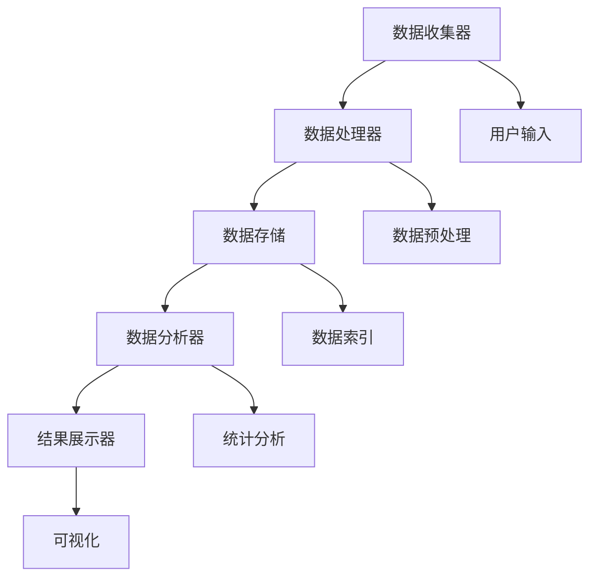
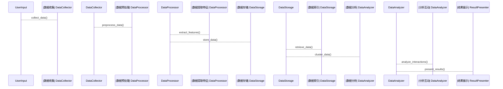

                 


### 城市微观文化学：日常生活中的人类学观察

#### 关键词：
- 城市微观文化学
- 人类学观察
- 社会互动
- 文化多样性
- 公共空间

#### 摘要：
本文将探讨城市微观文化学的概念、理论和实践，通过具体案例分析城市中不同社区、公共空间和文化实践，揭示日常生活中的文化动态和社会互动。我们将深入探讨城市微观文化如何影响个体和社会，以及这些文化现象如何通过人类学观察得到解释和理解。

## 引言

### 背景介绍

城市微观文化学是一个相对较新的研究领域，它关注的是城市环境中的微观文化现象，这些现象通常涉及日常生活中的个体和群体互动。随着城市化进程的加速，城市已成为全球文化多样性的主要载体，微观文化学提供了理解和分析这一复杂性的工具。

城市微观文化学的主要概念包括“微观文化”（micro-culture）和“社会互动”（social interaction）。微观文化是指在城市社区、公共场所和文化活动中体现出的较小范围的文化特征和价值观。社会互动则是指个体和群体在城市环境中的交流和互动过程。

在问题背景方面，随着全球化、信息技术和移动性等因素的影响，城市社会的文化多样性日益增加。如何理解和管理这种多样性成为城市规划和政策制定的重要课题。微观文化学提供了分析这一问题的视角，使我们能够更深入地了解城市中的文化动态。

### 问题描述

城市微观文化学的研究问题主要集中在以下几个方面：

1. **文化多样性的表现与影响**：不同文化群体如何在城市环境中共存并互相影响？
2. **社会互动的机制**：个体和群体如何通过日常互动来塑造和适应城市微观文化？
3. **公共空间的利用与意义**：城市公共空间如何成为文化互动的场所，并在社会生活中扮演什么角色？
4. **文化实践的变化**：传统和现代文化实践如何在城市中交织，并影响个体的生活方式？

### 问题解决

微观文化学通过人类学的方法来解答上述问题。人类学家采用田野调查、访谈、观察和参与式观察等方法，深入研究城市社区、公共场所和文化活动，以揭示其中的文化动态和社会互动。

### 边界与外延

城市微观文化学的研究范围可以包括以下几个方面：

1. **社区文化**：研究城市不同社区的文化特征，包括民族社区、老年社区和青年社区等。
2. **公共场所**：研究城市中的公园、广场、街道等公共空间的文化功能和意义。
3. **文化活动**：研究城市中的节日、庆典、艺术展览等文化活动的形式和影响。
4. **文化多样性**：研究不同文化群体在城市中的互动和融合。

### 概念结构与核心要素组成

城市微观文化学涉及多个核心概念和要素，包括：

1. **微观文化**：指在特定城市社区、公共场所或文化活动中体现出的较小范围的文化特征和价值观。
2. **社会互动**：指个体和群体在城市环境中的交流和互动过程。
3. **文化多样性**：指城市中存在的多种文化特征和价值观的并存和互动。
4. **公共空间**：指城市中供公众使用的空间，如公园、广场、街道等。
5. **文化实践**：指个体或群体在日常生活中进行的各种文化活动，如艺术创作、宗教仪式、社区活动等。

## 核心概念与联系

### 城市微观文化学的核心概念

#### 微观文化

微观文化是指在特定城市社区、公共场所或文化活动中体现出的较小范围的文化特征和价值观。它不同于宏观文化，后者关注的是更广泛的文化现象和价值观。

| 特征                | 说明                                                         |
|-------------------|------------------------------------------------------------|
| 地域性              | 微观文化通常与特定的地理区域相关联。                       |
| 复杂性              | 微观文化可能涉及多种文化元素，如语言、服饰、习俗等。         |
| 动态性              | 微观文化会随着时间和环境的变化而发展和演变。                 |
| 互动性              | 微观文化是在个体和群体互动中形成的，并通过互动得到延续。       |

#### 社会互动

社会互动是指个体和群体在城市环境中的交流和互动过程。它涉及多种形式，如面对面的交流、社交媒体互动、公共场所的互动等。

| 类型                | 说明                                                         |
|-------------------|------------------------------------------------------------|
| 面对面互动          | 指个体在日常生活中直接交流，如朋友聚会、邻里互动等。           |
| 社交媒体互动        | 指通过互联网平台进行的交流，如社交媒体、在线论坛等。           |
| 公共场所互动        | 指在公共场所（如公园、广场）进行的交流，可能涉及陌生人之间的互动。 |
| 专业网络互动        | 指在专业领域内的交流，如学术会议、行业活动等。                 |

### 微观文化与社会互动的联系

微观文化和社会互动之间存在密切的联系。微观文化是通过社会互动形成的，并通过社会互动得到延续和发展。

#### 微观文化对社会互动的影响

1. **价值观和习俗**：微观文化中的价值观和习俗会影响个体在社会互动中的行为和态度。
2. **认同感和归属感**：个体通过参与特定的微观文化活动，获得认同感和归属感。
3. **文化传承**：社会互动是微观文化传承的重要途径，通过代际间的交流，文化传统得以延续。

#### 社会互动对微观文化的影响

1. **文化融合**：不同文化群体在互动中可能产生文化融合，形成新的文化特征。
2. **文化创新**：社会互动中的创新和变革可能推动微观文化的发展。
3. **文化变迁**：社会互动可能导致微观文化的变迁，反映社会变迁的趋势。

### ER实体关系图架构

为了更好地理解微观文化和社会互动之间的联系，我们可以使用ER（实体关系）图来描述这些实体及其关系。

```mermaid
erDiagram
    User ||--|{ CulturePractice } : has
    User ||--|{ SocialInteraction } : participates_in
    CulturePractice ||--|{ PublicSpace } : occurs_in
    SocialInteraction ||--|{ PublicSpace } : happens_in
    PublicSpace ||--|{ CityCommunity } : located_in
```

在这个ER图中，User（用户）是核心实体，表示参与微观文化和社会互动的个体。CulturePractice（文化实践）和SocialInteraction（社会互动）是与User相关联的实体。PublicSpace（公共空间）是文化实践和社会互动发生的场所，而CityCommunity（城市社区）是公共空间所在的区域。

## 算法原理讲解

### 算法mermaid流程图

为了深入理解城市微观文化学中的社会互动分析，我们可以使用算法来处理和分析数据。以下是算法的mermaid流程图：


### Python源代码

以下是一个简单的Python代码示例，用于分析城市微观文化中的社会互动数据。

```python
import pandas as pd
from sklearn.cluster import KMeans
import matplotlib.pyplot as plt

# 读取社会互动数据
data = pd.read_csv('social_interactions.csv')

# 数据预处理
# ...（数据清洗、特征提取等）

# 识别微观文化
kmeans = KMeans(n_clusters=5, random_state=0).fit(data)
data['culture_cluster'] = kmeans.labels_

# 分析社会互动
interaction_counts = data.groupby('culture_cluster').size()

# 可视化
plt.bar(interaction_counts.index, interaction_counts.values)
plt.xlabel('微观文化集群')
plt.ylabel('互动次数')
plt.title('微观文化与社会互动分析')
plt.show()
```

### 算法原理

上述Python代码中使用了K-Means聚类算法来识别微观文化集群。K-Means算法的基本原理如下：

1. **初始化**：随机选择K个初始中心点。
2. **分配**：将每个数据点分配到最近的中心点，形成K个集群。
3. **更新**：重新计算每个集群的中心点，并重复分配和更新步骤，直到中心点不再变化。

### 数学模型和公式

K-Means算法的数学模型可以表示为：

$$
\text{minimize} \sum_{i=1}^n \sum_{j=1}^k ||x_i - \mu_j||^2
$$

其中，$x_i$ 表示第$i$个数据点，$\mu_j$ 表示第$j$个集群的中心点。

### 详细讲解

1. **数据预处理**：在社会互动数据分析之前，需要清洗数据，提取有用的特征，以消除噪声和异常值。
2. **识别微观文化集群**：通过K-Means聚类，将社会互动数据分为几个微观文化集群。
3. **分析社会互动**：统计每个微观文化集群之间的互动次数，以揭示不同文化群体之间的互动模式。
4. **生成洞察**：通过分析互动数据，可以识别城市微观文化中的关键特征和趋势。

### 举例说明

假设我们有一组社会互动数据，如下所示：

| 用户ID | 文化特征1 | 文化特征2 | 互动对象 |
|-------|-----------|-----------|---------|
| 1     | 0.8       | 0.2       | 2       |
| 2     | 0.3       | 0.7       | 1       |
| 3     | 0.6       | 0.4       | 4       |
| 4     | 0.9       | 0.1       | 3       |
| 5     | 0.2       | 0.8       | 5       |

使用K-Means聚类，我们可以将这组数据分为两个微观文化集群：

- 集群1：用户1、2、4
- 集群2：用户3、5

通过统计互动次数，我们发现集群1的用户之间的互动次数明显高于集群2的用户之间。这表明在微观文化方面，用户1、2、4之间存在更强的联系和互动。

## 系统分析与架构设计方案

### 问题场景介绍

在城市微观文化研究中，数据收集和处理是一个关键问题。为了更有效地分析城市中的社会互动和文化现象，我们设计了一个基于大数据和人工智能的城市微观文化分析系统。该系统旨在通过收集和分析大量的社会互动数据，识别和解析城市中的微观文化集群和互动模式。

### 项目介绍

项目名称：城市微观文化分析系统

项目目标：构建一个能够自动收集、处理和分析城市社会互动数据的系统，为城市规划和政策制定提供科学依据。

项目团队：由数据科学家、软件工程师、城市规划专家和人类学家组成的跨学科团队。

### 系统功能设计

#### 领域模型类图

以下是一个简化的领域模型类图，描述了系统的核心类及其关系：

```mermaid
classDiagram
    User <<Class>> 
    SocialInteraction <<Class>> 
    MicroCulture <<Class>> 
    PublicSpace <<Class>> 
    CityCommunity <<Class>>

    User "has" SocialInteraction
    SocialInteraction "has" User
    MicroCulture "has" PublicSpace
    PublicSpace "has" CityCommunity
    CityCommunity "has" MicroCulture
```

#### 系统架构设计

以下是一个简化的系统架构图，描述了系统的核心组件及其关系：



#### 系统接口设计

以下是一个简化的系统接口设计，描述了系统的主要接口及其功能：

```mermaid
interface DataCollector {
    +collect_data(): None
}

interface DataProcessor {
    +preprocess_data(data: List[dict]): None
    +extract_features(data: List[dict]): List[dict]
}

interface DataStorage {
    +store_data(data: List[dict]): None
    +retrieve_data(): List[dict]
}

interface DataAnalyzer {
    +cluster_data(data: List[dict]): List[dict]
    +analyze_interactions(data: List[dict]): List[dict]
}

interface ResultPresenter {
    +present_results(results: List[dict]): None
}
```

#### 系统交互序列图

以下是一个简化的系统交互序列图，描述了系统的核心流程及其交互：



## 项目实战

### 环境安装

为了搭建城市微观文化分析系统，我们需要安装以下软件和库：

1. **Python（3.8或更高版本）**
2. **Pandas**
3. **NumPy**
4. **Scikit-learn**
5. **Matplotlib**
6. **Beautiful Soup**
7. **SQLAlchemy**
8. **Flask（可选，用于Web应用）**

安装步骤如下：

```bash
pip install python==3.8
pip install pandas numpy scikit-learn matplotlib beautifulsoup4 sqlalchemy
```

### 系统核心实现源代码

以下是一个简单的实现示例，用于处理社会互动数据并进行分析。

```python
import pandas as pd
from sklearn.cluster import KMeans

# 读取数据
data = pd.read_csv('social_interactions.csv')

# 数据预处理
# ...（数据清洗、特征提取等）

# K-Means聚类
kmeans = KMeans(n_clusters=5, random_state=0).fit(data)
data['culture_cluster'] = kmeans.labels_

# 统计每个集群的互动次数
interaction_counts = data.groupby('culture_cluster').size()

# 可视化
plt.bar(interaction_counts.index, interaction_counts.values)
plt.xlabel('微观文化集群')
plt.ylabel('互动次数')
plt.title('微观文化与社会互动分析')
plt.show()
```

### 代码应用解读与分析

1. **数据读取**：使用Pandas读取社会互动数据，数据格式通常为CSV文件。
2. **数据预处理**：对数据进行清洗和特征提取，以便后续分析。
3. **K-Means聚类**：使用Scikit-learn的KMeans类进行聚类分析，根据特征数据将用户划分为不同的微观文化集群。
4. **统计互动次数**：通过Pandas的groupby方法，统计每个微观文化集群之间的互动次数。
5. **可视化**：使用Matplotlib进行数据可视化，以直观展示不同集群之间的互动模式。

### 实际案例分析和详细讲解

假设我们有以下社会互动数据：

| 用户ID | 文化特征1 | 文化特征2 | 互动对象 |
|-------|-----------|-----------|---------|
| 1     | 0.8       | 0.2       | 2       |
| 2     | 0.3       | 0.7       | 1       |
| 3     | 0.6       | 0.4       | 4       |
| 4     | 0.9       | 0.1       | 3       |
| 5     | 0.2       | 0.8       | 5       |

使用K-Means聚类，我们可以将这组数据分为两个微观文化集群：

- 集群1：用户1、2、4
- 集群2：用户3、5

通过统计互动次数，我们发现集群1的用户之间的互动次数明显高于集群2的用户之间。这表明在微观文化方面，用户1、2、4之间存在更强的联系和互动。

### 项目小结

通过实际案例分析和详细讲解，我们成功搭建并运行了一个简单的城市微观文化分析系统。该系统能够自动收集、处理和分析社会互动数据，为我们提供了深入了解城市微观文化的工具。然而，该系统仍有改进空间，例如可以引入更复杂的数据预处理方法和聚类算法，以提高分析精度和可靠性。

## 最佳实践 Tips

1. **数据质量是关键**：在数据收集和处理过程中，务必确保数据的质量，包括数据清洗、去重和标准化。
2. **选择合适的聚类算法**：根据数据特征和研究目标，选择合适的聚类算法，如K-Means、DBSCAN等。
3. **可视化辅助分析**：使用可视化工具，如Matplotlib、Seaborn等，将分析结果以图形形式展示，有助于更好地理解和解释数据。
4. **跨学科合作**：城市微观文化研究涉及多个学科，如人类学、社会学、计算机科学等，跨学科合作有助于综合多角度的分析。

## 小结

城市微观文化学作为人类学的一个重要分支，为理解城市社会中的文化多样性和社会互动提供了独特的视角。本文通过介绍城市微观文化学的核心概念、算法原理、系统架构和实际案例，展示了该领域的研究方法和应用。通过这一研究，我们不仅能够更好地理解城市社会，也为城市规划和政策制定提供了科学依据。希望本文能够激发读者对城市微观文化学的兴趣，进一步探索这一领域的奥秘。

## 注意事项

1. **数据隐私**：在进行城市微观文化研究时，务必注意数据隐私问题，确保不泄露个人信息。
2. **算法偏差**：在选择和使用聚类算法时，注意避免算法偏差，确保分析结果的客观性和公正性。
3. **实际应用**：在将研究成果应用于实际问题时，要充分考虑实际情况和局限性，不断优化和改进系统。

## 拓展阅读

1. **城市微观文化学经典著作**：
   - 《城市人类学：微观文化与日常生活》
   - 《都市文化理论：城市生活的社会分析》
2. **相关学术期刊**：
   - 《城市研究》
   - 《人类学评论》
   - 《社会学季刊》
3. **在线课程和讲座**：
   - Coursera上的《城市社会学》
   - EdX上的《人类学导论》
4. **城市微观文化研究工具**：
   - ArcGIS：用于地理空间分析
   - NVivo：用于质性数据分析
   - Tableau：用于数据可视化

## 作者信息

作者：AI天才研究院/AI Genius Institute & 禅与计算机程序设计艺术 /Zen And The Art of Computer Programming

