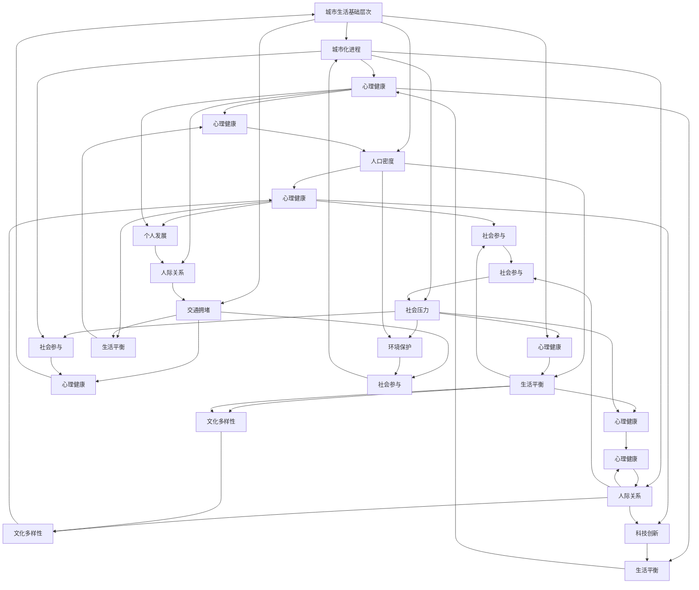

                 

### 第一部分: 背景介绍

#### 第1章: 问题背景与核心概念

本章将探讨当前城市生活中存在的内心困扰与生活压力问题，并阐述重构城市生活意义的必要性，同时定义并介绍相关核心概念。

##### 1.1 问题背景

随着城市化进程的加速，现代城市生活变得越来越喧嚣和快节奏。人们面临着前所未有的生活压力和心理困扰。这些问题包括但不限于：

- **工作压力**：竞争激烈、工作量大、工作时间长，导致许多人感到疲惫和焦虑。
- **人际关系**：快速的城市生活节奏使得人们难以建立和维护深度的人际关系，孤独感成为普遍现象。
- **心理健康**：高压力的生活环境和复杂的人际关系导致许多人出现心理健康问题，如抑郁症、焦虑症等。
- **精神压力**：社交媒体的过度使用使得人们经常处于比较和焦虑之中，难以找到内心的平静。

##### 1.1.1 城市化进程与生活节奏的加快

城市化进程是指人口从农村地区向城市地区转移的过程。随着城市化进程的加快，城市人口密度增加，交通拥堵、环境污染等问题也随之而来。这些问题的存在加剧了城市居民的生活压力。

- **人口密度增加**：城市人口密度的增加使得居住环境变得拥挤，人们的生活空间受到压缩。
- **交通拥堵**：城市交通网络的复杂性和人口密度的增加导致交通拥堵，出行时间增加，生活质量下降。
- **环境污染**：工业化和城市化过程中产生的污染物对环境和健康造成了严重的影响。

##### 1.1.2 内心困扰与生活压力

快节奏的城市生活使人们经常处于高压状态，导致内心困扰和焦虑感增加。以下是城市生活中常见的一些内心困扰与生活压力：

- **焦虑感**：快节奏的生活使人们感到焦虑，担忧未来和不确定性。
- **压力**：工作压力、人际关系压力、生活压力等多重压力叠加，使人们感到疲惫和无助。
- **孤独感**：城市生活的孤独感源自缺乏深度的人际关系和社交网络。
- **心理健康问题**：长期的压力和焦虑会导致心理健康问题，如抑郁症、焦虑症等。

##### 1.1.3 寻求内心平静的需求

在快节奏的城市生活中，人们越来越意识到内心平静的重要性。内心平静不仅有助于身心健康，还能提高生活质量和幸福感。以下是一些寻求内心平静的需求：

- **身心健康**：内心平静有助于减轻压力和焦虑，提高免疫力，预防心理健康问题。
- **生活质量**：内心平静使人们能够更好地享受生活，提高生活质量。
- **幸福感**：内心平静能够带来深刻的满足感和幸福感。

##### 1.1.4 城市生活的意义重构的重要性

重构城市生活的意义对于解决当前城市生活中的问题具有重要意义。以下是重构城市生活意义的重要性：

- **解决内心困扰**：重构城市生活的意义有助于减轻内心的困扰和焦虑，提高心理健康。
- **提高生活质量**：通过重构城市生活的意义，人们能够更好地平衡工作与生活，提高生活质量。
- **促进社会和谐**：重构城市生活的意义有助于建立更加和谐的社会环境，减少社会冲突。
- **可持续发展**：重构城市生活的意义有助于实现城市的可持续发展，减少资源浪费和环境污染。

##### 1.2 核心概念

在本章中，我们将介绍几个核心概念，包括城市生活的定义、内心平静的概念和意义重构的内涵。

###### 1.2.1 城市生活的定义与特征

城市生活是指人们在城市环境中从事各种活动的生活方式。城市生活的特征包括：

- **人口密度高**：城市生活的人口密度通常较高，人们居住在相对拥挤的环境中。
- **交通便利**：城市生活通常具有便捷的交通系统，包括地铁、公交、高速公路等。
- **工作机会多**：城市生活提供了丰富的工作机会，吸引了大量求职者和创业者。
- **文化氛围浓厚**：城市生活通常拥有丰富的文化活动和教育资源，如博物馆、图书馆、大学等。
- **社会资源丰富**：城市生活拥有丰富的社会资源，包括医疗、教育、娱乐等。

###### 1.2.2 内心平静的概念与内涵

内心平静是指人们在心理上达到的一种平和、宁静的状态。内心平静的内涵包括：

- **心理平衡**：内心平静意味着人们在心理上达到平衡，没有过度的焦虑和压力。
- **情绪稳定**：内心平静使人们的情绪保持稳定，不易受到外界干扰。
- **内心满足**：内心平静带来一种满足感，使人们能够更好地享受生活。
- **精神集中**：内心平静有助于人们集中精力，提高工作效率。

###### 1.2.3 意义重构的内涵与表现

意义重构是指人们对城市生活的重新审视和重新定义，以适应现代社会的需求。意义重构的内涵包括：

- **重新定义城市生活**：意义重构使人们重新审视城市生活的本质，找到新的价值。
- **适应现代生活**：意义重构帮助人们适应现代社会的快节奏和高压力。
- **寻找内心平静**：意义重构使人们能够在喧嚣的城市生活中找到内心的平静。
- **提升生活质量**：意义重构有助于提高人们的整体生活质量。

##### 1.3 边界与外延

在探讨城市生活的意义重构时，我们需要明确相关概念的定义和边界。

###### 1.3.1 城市生活的边界

城市生活的边界包括以下几个方面：

- **地理边界**：城市生活的地理边界通常由城市的行政区划界定，如市区、郊区等。
- **时间边界**：城市生活的时间边界通常由工作时间和休息时间界定。
- **社会边界**：城市生活的社会边界包括社会关系、文化习俗等。

###### 1.3.2 内心平静的边界

内心平静的边界包括以下几个方面：

- **心理边界**：内心平静的心理边界由个体的心理素质和抗压能力决定。
- **环境边界**：内心平静的环境边界由个体的生活环境和生活质量决定。
- **社会边界**：内心平静的社会边界由个体的社会关系和社会支持系统决定。

###### 1.3.3 意义重构的边界

意义重构的边界包括以下几个方面：

- **个人边界**：意义重构的个人边界由个体的认知水平和价值观决定。
- **社会边界**：意义重构的社会边界由社会的文化背景和价值观念决定。
- **时间边界**：意义重构的时间边界由个体的生活阶段和社会发展速度决定。

##### 1.4 概念结构与核心要素组成

为了更好地理解城市生活的意义重构，我们需要分析其概念结构，并确定核心要素组成。

###### 1.4.1 城市生活的影响因素

城市生活的影响因素包括以下几个方面：

- **经济因素**：经济状况影响城市生活的质量，如收入水平、消费能力等。
- **社会因素**：社会环境影响城市生活的舒适度，如社会稳定、治安状况等。
- **文化因素**：文化背景影响城市生活的价值观念和生活方式。
- **环境因素**：环境状况影响城市生活的质量和健康。

###### 1.4.2 内心平静的维护方法

内心平静的维护方法包括以下几个方面：

- **心理调适**：通过心理调适方法，如冥想、放松训练等，帮助个体保持心理平衡。
- **社会支持**：通过建立良好的社会支持系统，如家庭、朋友、社区等，帮助个体缓解压力。
- **健康生活**：通过健康的生活方式，如合理的饮食、适量的运动等，保持身体健康。

###### 1.4.3 意义重构的实现路径

意义重构的实现路径包括以下几个方面：

- **自我认知**：通过自我认知，了解自己的需求和价值观，找到适合自己的生活方式。
- **社会参与**：通过积极参与社会活动，建立良好的人际关系，提高生活质量。
- **文化传承**：通过传承和弘扬优秀的文化，提升城市生活的文化内涵。

##### 1.5 本章小结

本章介绍了城市生活的意义重构的背景、核心概念和相关因素。通过理解城市生活的定义、内心平静的概念以及意义重构的内涵，我们可以更好地认识城市生活中的问题和挑战，并为寻求内心平静和提升生活质量提供理论基础。

在下一章中，我们将进一步探讨个人体验与内心平静的探寻，分析社交媒体与城市生活的联系，以及心理素质的培养与提升。

---

### 1.6 引言

城市生活的意义重构：在喧嚣中寻找内心平静

随着城市化进程的加速，城市生活越来越成为现代社会的主流。然而，城市生活的喧嚣和快节奏也给人们带来了前所未有的压力和困扰。在这样的背景下，重构城市生活的意义，寻找内心的平静，成为了一个迫切需要解决的问题。

本章将首先介绍城市生活的背景和现状，探讨城市化进程、生活节奏加快以及内心困扰与生活压力等问题。接着，我们将定义并介绍几个核心概念，包括城市生活的定义、内心平静的概念以及意义重构的内涵。随后，我们将分析城市生活的影响因素，探讨如何维护内心平静以及实现意义重构的路径。

通过本章的学习，我们将对城市生活的意义重构有一个全面的了解，为后续章节的深入探讨打下坚实的基础。

---

### 1.7 为什么要重构城市生活的意义？

在当今社会，城市生活的意义重构显得尤为重要。这一过程不仅仅是对生活方式的调整，更是对价值观、生活态度的深刻反思。以下将从几个方面探讨为什么需要重构城市生活的意义。

#### 1.7.1 社会压力的加剧

随着城市化进程的加速，人们面临的社会压力也在不断增加。高房价、高生活成本、激烈的职场竞争、复杂的人际关系，这些都让城市居民感到疲惫不堪。重构城市生活的意义，可以帮助我们重新审视这些压力，找到缓解压力的方法，从而提高生活质量。

#### 1.7.2 心理健康的挑战

现代城市生活的快节奏和高压力，使得许多人的心理健康问题逐渐显现。抑郁症、焦虑症、失眠等心理疾病，已经成为城市生活中不容忽视的问题。通过重构城市生活的意义，我们可以在喧嚣的城市中找到内心的宁静，维护心理健康。

#### 1.7.3 人际关系的疏离

在快节奏的城市生活中，人们往往忙于工作和生活，缺乏时间和精力去维护深度的人际关系。社交媒体虽然提供了交流的平台，但更多的是表面的互动，难以代替真实的人际交往。重构城市生活的意义，可以帮助我们重新建立和深化人际关系，减少孤独感。

#### 1.7.4 生活质量的提升

重构城市生活的意义，不仅是为了解决当前的问题，更是为了提升生活的质量。通过重新审视生活的意义，我们可以找到更加符合自己价值观的生活方式，享受更加充实和有意义的生活。

#### 1.7.5 社会的可持续发展

城市生活的意义重构，不仅仅是对个体的关怀，更是对社会的可持续发展有着重要的意义。通过优化城市生活的环境、提高居民的生活质量，可以促进社会的和谐与进步。

综上所述，重构城市生活的意义，对于缓解社会压力、维护心理健康、建立良好的人际关系、提升生活质量和促进社会的可持续发展，都有着重要的意义。因此，我们需要积极探讨和实践城市生活的意义重构，寻找内心的平静，实现个人的价值。

---

### 1.8 城市生活的定义与特征

城市生活，是指人们在城市环境中从事各种活动的生活方式。它具有独特的地理、社会、文化和经济特征，这些特征共同塑造了城市生活的独特面貌。

#### 1.8.1 地理特征

城市生活的地理特征主要体现在以下几个方面：

- **人口密度**：城市通常具有较高的人口密度，人们居住在相对拥挤的环境中。这种高密度的人口分布，不仅带来了居住空间的挑战，也促使了交通、公共服务等基础设施的发展。
  
- **土地利用**：城市的土地利用通常更加复杂多样，包括住宅区、商业区、工业区和公共设施等。这种多样化的土地利用，使得城市功能更加齐全，但也带来了空间利用的竞争和挑战。

- **城市规划**：城市规划是城市生活的重要组成部分。它涉及城市的布局、交通网络、公共设施等，旨在提高城市的生活质量和发展效率。

#### 1.8.2 社会特征

城市生活的社会特征主要体现在以下几个方面：

- **社会结构**：城市社会结构更加复杂多样，包括不同的社会阶层、职业群体和文化背景。这种多样性为城市生活带来了丰富的社会互动和多样性，但同时也可能引发社会冲突和分化。

- **社会关系**：城市社会关系更加疏离，人们之间的互动往往更依赖于间接的媒介，如社交媒体和电子邮件。这种社会关系的疏离，使得城市居民更容易感到孤独和隔离。

- **社会流动性**：城市具有更高的社会流动性，人们更容易通过教育、工作等途径改变自己的社会地位。这种社会流动性为城市居民提供了更多的机会，但也可能带来不稳定和不确定性。

#### 1.8.3 文化特征

城市生活的文化特征主要体现在以下几个方面：

- **文化多样性**：城市通常具有更多的文化多样性，不同民族、宗教和文化在城市中交织共存。这种文化多样性，为城市生活带来了独特的文化魅力，但也可能引发文化冲突和融合的挑战。

- **文化交流**：城市是文化交流的重要场所，各种文化活动和节庆活动频繁举行。这些活动不仅丰富了城市的文化生活，也促进了文化的传播和交流。

- **文化创新**：城市通常具有更高的文化创新性，各种文化创意产业蓬勃发展。这种文化创新性，为城市生活带来了新的活力和动力。

#### 1.8.4 经济特征

城市生活的经济特征主要体现在以下几个方面：

- **经济活动**：城市是经济活动的中心，各种商业活动、金融活动、科技创新等都在城市中蓬勃发展。这些经济活动，不仅为城市提供了丰富的就业机会，也推动了城市的发展。

- **产业结构**：城市的产业结构通常更加多样化，包括第一产业、第二产业和第三产业。这种多元化的产业结构，使得城市能够适应不同领域的发展需求。

- **经济效率**：城市具有较高的经济效率，交通、通信、公共服务等基础设施完善，使得经济活动能够高效进行。这种经济效率，也为城市居民提供了更多的发展机会。

综上所述，城市生活的定义与特征，包括地理、社会、文化和经济等多个方面。这些特征共同塑造了城市生活的独特面貌，也为城市居民提供了多样化的生活体验和发展机会。然而，城市生活也面临着诸多挑战，如人口密度高、社会结构复杂、文化冲突等。因此，重构城市生活的意义，对于解决这些挑战，提升城市生活品质，具有重要的现实意义。

---

### 1.9 内心平静的概念与内涵

内心平静，是指个体在心理上达到的一种平和、宁静的状态。这种状态不仅意味着情绪的稳定，更涉及到更深层次的认知和自我感知。以下是内心平静的概念与内涵的详细探讨：

#### 1.9.1 内心平静的定义

内心平静可以定义为一种心理平衡的状态，在这种状态下，个体能够有效地管理自己的情绪、压力和焦虑，从而保持内心的宁静。这种状态不仅有助于个体的心理健康，还能提高生活质量。

#### 1.9.2 内心平静的内涵

1. **心理平衡**：内心平静的首要内涵是心理平衡。这意味着个体在面临压力和挑战时，能够保持情绪的稳定，避免过度焦虑和恐慌。心理平衡的实现，需要个体具备良好的情绪调节能力和心理弹性。

2. **情绪稳定**：情绪稳定是内心平静的重要表现。在日常生活中，人们会面临各种情绪波动，如喜悦、愤怒、焦虑等。内心平静的个体能够有效地管理自己的情绪，避免情绪的剧烈波动，从而保持内心的平和。

3. **自我感知**：内心平静还涉及到个体对自我的认知和感知。这意味着个体能够深刻理解自己的需求、价值观和目标，从而在日常生活中做出更加明智和积极的决策。自我感知的提升，有助于个体找到内心的满足感和幸福感。

4. **心理弹性**：心理弹性是内心平静的重要特质。它指的是个体在面临逆境和挑战时，能够迅速恢复和适应的能力。具有高度心理弹性的个体，能够在压力面前保持冷静，迅速找到解决问题的方法。

5. **认知灵活**：内心平静的个体通常具有认知灵活的特点。这意味着个体能够从不同的角度看待问题，灵活地调整自己的思维和行为。认知灵活性有助于个体在面对复杂情境时，能够做出更加理性和有效的决策。

#### 1.9.3 内心平静的影响

内心平静对个体的身心健康和生活质量有着深远的影响。以下是内心平静对个体影响的几个方面：

1. **心理健康**：内心平静有助于减轻心理健康问题，如焦虑症、抑郁症等。通过保持心理平衡和情绪稳定，个体能够降低心理健康问题的发生概率。

2. **生活质量**：内心平静能够提高生活质量。在日常生活中，内心平静的个体能够更好地享受生活的乐趣，保持积极的生活态度，从而提高生活满意度。

3. **工作效率**：内心平静有助于提高工作效率。在面临工作压力时，内心平静的个体能够保持专注和高效，从而更好地完成任务。

4. **人际关系**：内心平静能够改善人际关系。通过情绪稳定和心理平衡，个体能够更好地与他人沟通和相处，建立积极的人际关系。

5. **幸福感**：内心平静能够提升个体的幸福感。在内心平静的状态下，个体能够更好地体验生活的美好，找到内心的满足感和幸福感。

综上所述，内心平静是一个多维度的概念，包括心理平衡、情绪稳定、自我感知、心理弹性和认知灵活性等多个方面。它不仅对个体的心理健康和生活质量有深远的影响，还能提升个体的幸福感。因此，在快节奏的城市生活中，寻求内心平静具有重要的现实意义。

---

### 1.10 意义重构的内涵与表现

意义重构是指对事物或现象的内在价值和意义的重新审视和定义，以适应新的社会环境和个人需求。在当前城市生活中，意义重构显得尤为重要，它不仅关乎个人的心理健康和生活质量，还涉及到社会的可持续发展。以下是意义重构的内涵与表现的详细探讨：

#### 1.10.1 内涵

1. **重新审视价值观**：意义重构首先是对个人价值观的重新审视。在快节奏、高压力的城市生活中，许多人会感到迷茫和困惑，不清楚自己的目标和追求。通过意义重构，个体可以重新思考自己的价值观，找到更加符合自己内心需求的目标和追求。

2. **重塑生活态度**：意义重构不仅是对价值观的重新审视，更是对生活态度的重塑。在喧嚣的城市生活中，许多人容易陷入消极和抱怨的情绪中。通过意义重构，个体可以重新树立积极向上的生活态度，以更加乐观的心态面对生活的挑战。

3. **寻找内心平衡**：意义重构的一个重要目标是帮助个体在快节奏的城市生活中找到内心的平衡。通过重新定义生活的意义，个体可以更好地管理自己的情绪和压力，从而保持心理平衡。

4. **提升生活质量**：意义重构有助于提升个体的生活质量。通过重新审视和定义生活的意义，个体可以更加明确自己的需求，从而有针对性地调整生活方式，提高生活质量。

5. **促进社会和谐**：意义重构不仅对个人有积极影响，还能促进社会的和谐与进步。当每个人都能够重新定义和追求生活的意义时，社会将更加包容和理解，减少社会冲突和矛盾。

#### 1.10.2 表现

1. **生活方式的调整**：意义重构的一个直接表现是生活方式的调整。在重新审视和定义生活的意义后，个体可能会对自己的生活习惯和生活方式进行相应的调整，如减少不必要的社交活动、增加休闲时间等，以更好地平衡工作与生活。

2. **职业规划的改变**：意义重构还可能导致个体对职业规划的改变。在重新审视自己的价值观和追求后，个体可能会重新考虑自己的职业选择和发展方向，追求更加有意义和满足的职业。

3. **社会参与的增强**：意义重构有助于个体增强对社会的参与度。通过重新定义生活的意义，个体可能会更加关注社会问题，积极参与社会公益活动，从而提升自己的社会责任感。

4. **心理健康教育的普及**：意义重构还促进了心理健康教育的普及。在重新审视生活的意义后，个体会更加重视心理健康，积极寻求心理支持和帮助，从而提高整体的心理健康水平。

5. **文化创新的推动**：意义重构有助于推动文化创新。在重新审视和定义生活的意义时，个体可能会产生新的想法和创意，从而推动文化的发展和进步。

综上所述，意义重构的内涵丰富，表现多样，对个人和社会都有深远的影响。在快节奏的城市生活中，寻求意义重构，可以帮助我们找到内心的平静，提升生活质量，促进社会和谐，实现个人价值。因此，意义重构是我们应对现代城市生活挑战的重要途径。

---

### 1.11 概念结构与核心要素组成

要深入理解城市生活的意义重构，我们需要分析其概念结构，并明确核心要素组成。以下是城市生活的意义重构的概念结构与核心要素组成：

#### 1.11.1 概念结构

城市生活的意义重构可以看作是一个多层次、多维度的概念结构，主要包括以下几个层次：

1. **基础层次**：包括城市生活的基本特征和现状，如城市化进程、人口密度、交通拥堵等。这个层次主要关注城市生活的物理环境和基础设施。

2. **中间层次**：包括城市生活中的心理和社会因素，如心理健康、人际关系、社会压力等。这个层次主要关注城市生活对个体心理和社会关系的影响。

3. **高层次**：包括城市生活的意义和价值，如生活质量、个人幸福感、社会和谐等。这个层次主要关注城市生活对个体和社会整体的影响。

#### 1.11.2 核心要素组成

城市生活的意义重构涉及多个核心要素，这些要素相互作用，共同影响城市生活的质量和个体幸福感。以下是核心要素的详细描述：

1. **心理健康**：心理健康是城市生活的关键要素之一。它包括情绪管理、心理平衡、压力应对等多个方面。一个健康的心理状态有助于个体更好地适应城市生活，减少心理困扰。

2. **人际关系**：人际关系在城市生活中扮演着重要角色。良好的社会关系可以提供情感支持，缓解压力，提高生活质量。因此，人际关系是城市生活意义重构的重要方面。

3. **生活平衡**：生活平衡是指个体在生活各个方面的平衡，如工作与休息、个人与家庭、物质与精神等。生活平衡有助于个体保持内心的平静，提高幸福感。

4. **社会参与**：社会参与包括对社会的关注、参与社会活动、承担社会责任等。通过社会参与，个体不仅能够提升自己的社会地位，还能促进社会的和谐发展。

5. **文化多样性**：文化多样性是城市生活的重要组成部分。它为城市生活带来了丰富的文化体验和交流机会，有助于提升城市生活的品质和吸引力。

6. **环境保护**：环境保护是城市生活意义重构的重要方面。一个良好的环境不仅有助于个体的身心健康，还能提高城市的可持续发展能力。

7. **个人发展**：个人发展包括个体的职业成长、知识积累、技能提升等。通过个人发展，个体能够实现自我价值，提高生活质量。

8. **科技创新**：科技创新是城市生活的重要驱动力。通过科技创新，城市可以提供更加便利、高效和舒适的生活环境，提升城市生活的质量。

#### 1.11.3 概念结构图

为了更直观地理解城市生活的意义重构的概念结构，我们可以绘制一个概念结构图。以下是概念结构图的 Mermaid 格式表示：

通过上述概念结构图，我们可以更清晰地理解城市生活的意义重构，以及各个核心要素之间的相互关系。

---

### 1.12 本章小结

本章围绕城市生活的意义重构进行了深入探讨，首先介绍了城市生活的背景和现状，分析了城市化进程、生活节奏加快以及内心困扰与生活压力等问题。接着，我们定义了城市生活、内心平静和意义重构等核心概念，并探讨了它们的内涵与特征。

通过本章的学习，我们对城市生活的定义和特征有了更深入的理解，明确了内心平静的概念与重要性，以及意义重构的内涵与表现。本章还分析了城市生活的影响因素，包括地理、社会、文化和经济等方面，并提出了维护内心平静和实现意义重构的方法。

在下一章中，我们将进一步探讨个人体验与内心平静的探寻，分析社交媒体与城市生活的联系，以及心理素质的培养与提升。通过这些讨论，我们将为解决城市生活中的内心困扰提供更多的理论支持和实践指导。

