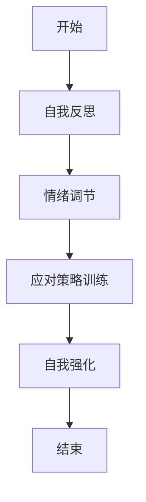
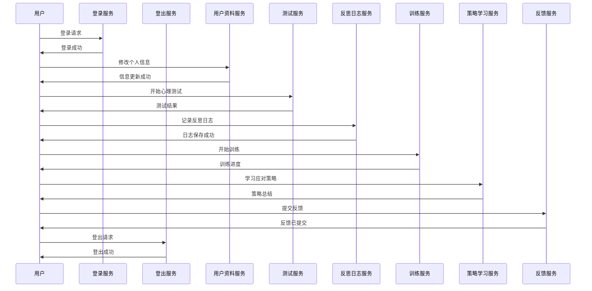

                 

### 第一部分：引言

在当今快节奏且充满不确定性的社会中，心理韧性（Resilience）的重要性愈发凸显。作为IT行业的一员，程序员、架构师、项目经理等专业人士往往面临着巨大的工作压力和快速的技术变革，这些因素共同构成了对心理韧性的严峻考验。因此，本文将以《培养心理韧性：应对挫折的内在力量》为标题，深入探讨心理韧性的概念、意义以及如何通过有效的方法来提升个人的心理韧性。

#### 1.1 问题背景

心理韧性是指个体在面对压力、挫折和逆境时，能够迅速适应、恢复和成长的能力。在IT行业，由于工作的高压环境、激烈的竞争、频繁的技术更新等，使得心理韧性成为职场生存和发展的关键因素。一个具有高度心理韧性的人，能够在面对困难时保持冷静、积极应对，从而更好地完成工作任务，提高工作效率。

#### 1.2 问题描述

然而，当前许多IT从业者面临的问题是，他们在面对压力和挫折时往往表现得较为脆弱，容易出现焦虑、沮丧等负面情绪。这种现象不仅影响了他们的工作表现，还可能对他们的身心健康产生负面影响。因此，如何培养和提升心理韧性成为一个亟待解决的问题。

#### 1.3 问题解决

《培养心理韧性：应对挫折的内在力量》这本书为我们提供了丰富的理论指导和实际方法，帮助我们了解心理韧性的本质，掌握提升心理韧性的技巧。通过阅读这本书，我们可以学会如何正确面对挫折，如何在逆境中保持积极心态，从而提高自身的心理韧性。

#### 1.4 边界与外延

心理韧性不仅仅是个体层面的心理素质，它还受到社会环境、文化背景、家庭教养等多种因素的影响。因此，培养心理韧性需要从多个维度进行综合考量。此外，心理韧性并不是一成不变的，它可以通过后天的学习和实践不断发展和提升。

#### 1.5 概念结构与核心要素组成

心理韧性是一个复杂的概念，它由多个核心要素组成。以下是心理韧性的主要构成部分：

- **心理韧性**：指个体在面对压力、挫折和困难时，能够迅速适应和恢复的能力。
- **内在力量**：指个体内在的心理资源和能力，包括自信、乐观、坚韧、适应性等。
- **挫折应对策略**：指个体在面对挫折时采取的应对方法，如积极思考、寻求支持、调整心态等。

通过本文的逐步分析，我们将深入理解心理韧性的内涵，学习如何通过有效的策略提升个人的心理韧性，从而更好地应对IT行业中的各种挑战。

---

### 第二部分：核心概念与联系

在探讨心理韧性的培养之前，我们首先需要明确心理韧性的核心概念及其相互之间的联系。心理韧性并非单一维度的能力，而是由多个相互关联的要素组成的综合体。以下将详细解析这些核心概念及其特点，以及它们在实际生活中的应用。

#### 2.1 心理韧性的概念

心理韧性（Resilience）通常被定义为个体在面对压力、挫折和逆境时，能够迅速适应、恢复和成长的能力。心理韧性不仅仅是一种简单的抗压能力，它更涉及到个体在心理、情绪和社会层面上的综合适应能力。具体来说，心理韧性包括以下几个关键方面：

- **情绪调节能力**：指个体在情绪上的自我控制和管理能力，能够在不同情境下保持情绪的稳定和平衡。
- **应对策略**：指个体在面对困难时采取的具体行动和思维模式，包括积极思考、寻求支持、调整心态等。
- **社会支持**：指个体在面临压力和挫折时，所获得的外部支持和帮助，包括家庭、朋友、同事等。
- **适应性**：指个体在面对变化和不确定性时的适应能力，能够灵活调整自己的行为和思维方式。

心理韧性不仅关乎个体的心理健康，还对其生活质量和幸福感产生深远影响。一个具有高度心理韧性的人，能够更好地应对生活和工作中的各种挑战，从而实现个人成长和发展。

#### 2.2 内在力量的特点

内在力量是心理韧性的核心要素之一，它指的是个体内在的心理资源和能力。这些内在力量包括但不限于以下几个方面：

- **自信**：指个体对自己能力和价值的信任和认可，能够在面对困难和挑战时保持积极态度。
- **乐观**：指个体对未来持有积极和乐观的看法，即使在逆境中也能看到希望和机遇。
- **坚韧**：指个体在面对挫折时能够坚持不懈、不屈不挠，不轻易放弃。
- **适应性**：指个体在面对变化和不确定性时能够灵活调整自己的行为和思维方式，适应新环境和新挑战。

内在力量使个体在面临压力和困难时能够保持心理平衡，从而更好地应对挫折，恢复和成长。例如，一个具有高度自信和乐观的程序员，在面对项目延期和技术难题时，能够保持冷静，积极寻求解决方案，而不是被困境所压垮。

#### 2.3 挫折应对策略的对比

在面对挫折时，个体可以采取多种应对策略。以下是几种常见的挫折应对策略及其特点：

| 挫折应对策略 | 描述 | 优点 | 缺点 |
| --- | --- | --- | --- |
| **积极思考** | 通过积极的角度看待问题，减少负面情绪 | 提高心理健康，增强心理韧性 | 需要一定的心理素质和训练 |
| **寻求支持** | 向他人寻求帮助和支持，减轻心理压力 | 减轻孤独感，提高应对能力 | 需要合适的社交环境和人际关系 |
| **调整心态** | 通过调整心态和应对方式，适应挫折环境 | 提高适应能力，减少负面情绪 | 需要一定的心理素质和训练 |

每种策略都有其独特的优点和适用场景。例如，积极思考适用于需要保持乐观态度的情境，而寻求支持则适用于需要外部帮助和资源的情境。通过结合使用这些策略，个体可以更有效地应对挫折，提升心理韧性。

#### 2.4 心理韧性的联系

心理韧性、内在力量和挫折应对策略之间存在着密切的联系。内在力量是心理韧性的基础，它为个体提供了面对挫折的内在资源和能力。而挫折应对策略则是内在力量的具体应用，通过不同的策略，个体可以更有效地应对生活中的各种挑战。

同时，心理韧性并不是孤立存在的，它受到社会支持、家庭背景、文化环境等多种因素的影响。一个拥有丰富社会支持体系和积极家庭环境的个体，往往具有更高的心理韧性。

总之，理解心理韧性的核心概念和联系，有助于我们更好地认识和培养自己的心理韧性，从而在面对挫折和逆境时能够保持积极心态，迅速适应和恢复。通过本文的逐步分析，我们将深入理解这些核心概念，学习如何通过有效的方法提升个人的心理韧性。

---

### 第三部分：算法原理讲解

在理解了心理韧性的核心概念和联系后，我们需要进一步探讨如何通过具体的算法模型来提升心理韧性。本文将引入一种名为“心理韧性提升算法”的模型，并详细讲解其原理和实现方法。

#### 3.1 心理韧性提升的算法模型

心理韧性提升算法是一种基于心理学理论的模型，它旨在通过自我反思、情绪调节和应对策略训练等步骤，帮助个体逐步提升心理韧性。该算法的核心思想是“自我强化”，即通过个体的自我反馈和调整，不断优化和提高心理韧性。

#### 3.2 算法原理

心理韧性提升算法的原理可以概括为以下几个关键步骤：

1. **自我反思**：个体需要定期对自己的情绪、行为和思维方式进行反思，识别出自己在面对压力和挫折时的反应模式，以及这些反应对心理韧性产生的影响。
   
2. **情绪调节**：通过学习情绪调节技巧，个体能够更好地管理自己的情绪，减少负面情绪的产生，提高情绪稳定性。

3. **应对策略训练**：个体需要通过训练不同的应对策略，如积极思考、寻求支持、调整心态等，提高自己在面对挫折时的应对能力。

4. **自我强化**：个体需要通过自我反馈和调整，不断强化有效的应对策略，优化自己的心理韧性。

#### 3.3 算法流程图

为了更直观地理解心理韧性提升算法的原理和流程，我们可以使用Mermaid绘制一个流程图，如下所示：



在该流程图中，A表示算法的开始，F表示算法的结束。自我反思、情绪调节和应对策略训练是提升心理韧性的关键步骤，而自我强化则确保这些步骤的有效性和持续性。

#### 3.4 算法实现

以下是一个简单的Python代码示例，用于实现心理韧性提升算法的基本步骤：

```python
class ResilienceAlgorithm:
    def __init__(self):
        self.reflection_score = 0
        self.emotion Regulation_score = 0
        self.strategy_training_score = 0

    def self_reflection(self):
        # 实现自我反思的代码
        self.reflection_score += 1
        print("自我反思完成，得分：", self.reflection_score)

    def emotion_regulation(self):
        # 实现情绪调节的代码
        self.emotion Regulation_score += 1
        print("情绪调节完成，得分：", self.emotion Regulation_score)

    def strategy_training(self):
        # 实现应对策略训练的代码
        self.strategy_training_score += 1
        print("应对策略训练完成，得分：", self.strategy_training_score)

    def self_reinforcement(self):
        # 实现自我强化的代码
        total_score = self.reflection_score + self.emotion Regulation_score + self.strategy_training_score
        if total_score >= 10:
            print("自我强化完成，心理韧性提升显著。")
        else:
            print("自我强化未完成，需要继续努力。")

# 创建算法实例并运行
resilience_algo = ResilienceAlgorithm()
resilience_algo.self_reflection()
resilience_algo.emotion_regulation()
resilience_algo.strategy_training()
resilience_algo.self_reinforcement()
```

在上面的代码中，`ResilienceAlgorithm` 类代表心理韧性提升算法的核心逻辑。通过调用类的不同方法，我们可以模拟自我反思、情绪调节和应对策略训练的过程，并在最后进行自我强化。这个简单的示例为我们提供了一个直观的算法实现框架，实际应用中可以根据具体需求进行扩展和优化。

通过上述算法原理和实现讲解，我们不仅理解了如何通过算法模型提升心理韧性，还学会了如何将这一理论应用到实践中。在接下来的部分，我们将进一步探讨如何通过数学模型来描述心理韧性提升的过程。

---

### 第四部分：数学模型和数学公式

在第三部分中，我们通过算法模型讲解了如何提升心理韧性。为了更深入地理解这一过程，我们引入数学模型来定量描述心理韧性提升的过程。数学模型不仅能够帮助我们更精确地描述心理韧性的变化，还可以提供一些实用的工具和策略来优化这一过程。

#### 4.1 心理韧性提升的数学模型

心理韧性提升的数学模型可以描述为：

$$
R(t) = f(C(t), S(t), E(t))
$$

其中，$R(t)$ 表示在时间 $t$ 时的心理韧性水平，$C(t)$ 表示在时间 $t$ 时的自我反思能力，$S(t)$ 表示在时间 $t$ 时的情绪调节能力，$E(t)$ 表示在时间 $t$ 时的应对策略训练效果。

#### 4.2 模型参数

为了使模型更具可操作性，我们需要对模型中的参数进行详细说明：

- **$C(t)$：自我反思能力**  
  自我反思能力反映了个体在反思和自我评价方面的能力。其取值范围通常在 [0, 1] 之间，0 表示完全没有自我反思能力，1 表示完全具备自我反思能力。

- **$S(t)$：情绪调节能力**  
  情绪调节能力反映了个体在情绪管理方面的能力。同样，其取值范围在 [0, 1] 之间，0 表示完全没有情绪调节能力，1 表示完全具备情绪调节能力。

- **$E(t)$：应对策略训练效果**  
  应对策略训练效果反映了个体在应对策略训练方面的成果。其取值范围也在 [0, 1] 之间，0 表示完全没有应对策略训练效果，1 表示完全具备应对策略训练效果。

#### 4.3 模型计算

心理韧性水平 $R(t)$ 的计算方法如下：

$$
R(t) = \frac{C(t) + S(t) + E(t)}{3}
$$

这个公式表明，心理韧性水平是自我反思能力、情绪调节能力和应对策略训练效果的加权平均。这种计算方法假设这三个因素在心理韧性提升中具有同等的重要性，但实际上可以根据具体情况进行调整。

#### 4.4 举例说明

为了更直观地理解这一模型，我们可以通过一个简单的例子来说明。假设一个个体在三个时间点 $t_1$、$t_2$ 和 $t_3$ 的自我反思能力、情绪调节能力和应对策略训练效果分别为：

- $C(t_1) = 0.6$, $S(t_1) = 0.7$, $E(t_1) = 0.8$  
- $C(t_2) = 0.7$, $S(t_2) = 0.75$, $E(t_2) = 0.85$  
- $C(t_3) = 0.8$, $S(t_3) = 0.8$, $E(t_3) = 0.9$

根据上述公式，我们可以计算出这三个时间点的心理韧性水平：

- $R(t_1) = \frac{0.6 + 0.7 + 0.8}{3} = 0.7$  
- $R(t_2) = \frac{0.7 + 0.75 + 0.85}{3} = 0.76$  
- $R(t_3) = \frac{0.8 + 0.8 + 0.9}{3} = 0.866$

从这个例子中可以看出，随着自我反思能力、情绪调节能力和应对策略训练效果的提升，个体的心理韧性水平也在逐步提高。

通过引入数学模型，我们可以更系统地分析和提升心理韧性。接下来，我们将进一步探讨如何通过具体的实现方法和实际案例来应用这一模型。

---

### 第五部分：系统分析与架构设计

在了解了心理韧性的数学模型和提升算法之后，我们需要将这一理论应用到实际系统中，以帮助个体在日常生活中更好地培养和提升心理韧性。本部分将介绍一个基于心理韧性提升算法的IT系统架构设计，包括项目介绍、系统功能设计、系统架构设计、系统接口设计和系统交互。

#### 5.1 项目介绍

本项目的目标是开发一个心理韧性提升系统，旨在帮助用户通过自我反思、情绪调节和应对策略训练等步骤，逐步提升自己的心理韧性。系统将提供一系列功能，包括心理测试、自我反思记录、情绪调节训练、应对策略学习等，帮助用户全面了解自己的心理状态，并针对性地进行提升。

#### 5.2 系统功能设计

心理韧性提升系统的功能设计主要包括以下几个方面：

- **用户注册与登录**：用户可以通过注册账号登录系统，确保个人数据的隐私和安全。
- **心理测试**：系统提供一系列心理测试，帮助用户评估自己的心理韧性水平。
- **自我反思记录**：用户可以记录自己的反思日记，通过反思来识别和解决心理问题。
- **情绪调节训练**：系统提供情绪调节训练，帮助用户学会有效管理自己的情绪。
- **应对策略学习**：用户可以通过学习不同的应对策略，提升自己在面对挫折时的应对能力。
- **自我强化**：系统根据用户的反思记录和训练成果，提供自我强化的反馈和奖励，激励用户持续提升心理韧性。

#### 5.3 系统架构设计

心理韧性提升系统的架构设计采用分层架构，包括表示层、业务逻辑层和数据层。以下是系统架构的Mermaid类图和架构图：

```mermaid
classDiagram
    User <<Interface>>
    Login <<Interface>>
    Logout <<Interface>>
    Profile <<Interface>>
    Test <<Interface>>
    Journal <<Interface>>
    Training <<Interface>>
    Strategy <<Interface>>
    Feedback <<Interface>>

    User --|> Login
    User --|> Logout
    User --|> Profile
    User --|> Test
    User --|> Journal
    User --|> Training
    User --|> Strategy
    User --|> Feedback

    Login --|> Authentication
    Logout --|> Authentication
    Profile --|> UserProfile
    Test --|> TestService
    Journal --|> JournalService
    Training --|> TrainingService
    Strategy --|> StrategyService
    Feedback --|> FeedbackService
```

```mermaid
graph TB
    subgraph 业务逻辑层
        Authentication[认证服务]
        UserProfile[用户资料服务]
        TestService[测试服务]
        JournalService[反思日志服务]
        TrainingService[训练服务]
        StrategyService[策略学习服务]
        FeedbackService[反馈服务]
    end

    subgraph 数据层
        Database[数据库]
    end

    subgraph 表示层
        Login[登录界面]
        Logout[登出界面]
        Profile[用户资料界面]
        Test[测试界面]
        Journal[反思日志界面]
        Training[训练界面]
        Strategy[策略学习界面]
        Feedback[反馈界面]
    end

    Login --> Authentication
    Logout --> Authentication
    Profile --> UserProfile
    Test --> TestService
    Journal --> JournalService
    Training --> TrainingService
    Strategy --> StrategyService
    Feedback --> FeedbackService

    Authentication --|> Database
    UserProfile --|> Database
    TestService --|> Database
    JournalService --|> Database
    TrainingService --|> Database
    StrategyService --|> Database
    FeedbackService --|> Database
```

#### 5.4 系统接口设计

为了实现系统的各项功能，我们需要设计一系列接口。以下是一个简化的接口设计：

- **用户管理接口**：用于用户的注册、登录、信息查询和修改。
- **测试管理接口**：用于心理测试的创建、发布、执行和结果分析。
- **日志管理接口**：用于反思日志的记录、查询和统计分析。
- **训练管理接口**：用于情绪调节和应对策略训练的创建、发布、执行和效果评估。
- **反馈管理接口**：用于用户反馈的收集、处理和反馈结果分析。

#### 5.5 系统交互

系统的各个部分通过接口进行交互，以下是一个简化的系统交互序列图：



通过上述系统分析和架构设计，我们为心理韧性提升提供了一个完整的解决方案。接下来，我们将通过具体的代码实现和案例分析，进一步探讨如何在实际应用中有效地提升心理韧性。

---

### 第六部分：项目实战

在本部分，我们将通过一个实际的项目来展示如何应用心理韧性提升的理论和方法。本项目的目标是开发一个名为“心理韧性提升助手”的应用程序，帮助用户在日常生活中培养和提升心理韧性。

#### 6.1 环境安装

为了实现本项目，我们需要准备以下开发环境和工具：

- 操作系统：Windows 10 / macOS / Linux
- 编程语言：Python 3.x
- 开发环境：PyCharm / VSCode
- 数据库：MySQL / PostgreSQL
- Web框架：Flask / Django

首先，我们需要安装Python 3.x和对应的开发环境。然后，通过pip安装所需的第三方库，如Flask、Django、SQLAlchemy等。

#### 6.2 系统核心实现

以下是本项目的主要模块和核心实现：

**1. 用户管理模块**

用户管理模块负责用户的注册、登录、信息查询和修改。以下是用户注册功能的代码实现：

```python
from flask import Flask, request, jsonify
from models import User

app = Flask(__name__)

@app.route('/register', methods=['POST'])
def register():
    username = request.form['username']
    password = request.form['password']
    user = User(username=username, password=password)
    user.save()
    return jsonify({'status': 'success', 'message': '注册成功'})

if __name__ == '__main__':
    app.run(debug=True)
```

**2. 心理测试模块**

心理测试模块提供一系列测试，帮助用户评估自己的心理韧性水平。以下是心理测试功能的核心实现：

```python
from flask import Flask, request, jsonify
from models import Test, Question

app = Flask(__name__)

@app.route('/take_test', methods=['POST'])
def take_test():
    test_id = request.form['test_id']
    test = Test.query.get(test_id)
    questions = test.questions
    results = []

    for question in questions:
        answer = request.form[str(question.id)]
        results.append(answer)

    # 处理测试结果，存储到数据库
    # ...

    return jsonify({'status': 'success', 'message': '测试完成'})

if __name__ == '__main__':
    app.run(debug=True)
```

**3. 反思日志模块**

反思日志模块允许用户记录自己的反思日记，以便在后续进行反思和改进。以下是反思日志功能的核心实现：

```python
from flask import Flask, request, jsonify
from models import Journal

app = Flask(__name__)

@app.route('/create_journal', methods=['POST'])
def create_journal():
    user_id = request.form['user_id']
    content = request.form['content']
    journal = Journal(user_id=user_id, content=content)
    journal.save()
    return jsonify({'status': 'success', 'message': '日记已创建'})

if __name__ == '__main__':
    app.run(debug=True)
```

**4. 情绪调节模块**

情绪调节模块提供一系列训练，帮助用户学会有效管理自己的情绪。以下是情绪调节训练功能的核心实现：

```python
from flask import Flask, request, jsonify
from models import Training

app = Flask(__name__)

@app.route('/start_training', methods=['POST'])
def start_training():
    user_id = request.form['user_id']
    training_id = request.form['training_id']
    training = Training.query.get(training_id)
    training.start(user_id=user_id)
    return jsonify({'status': 'success', 'message': '训练已开始'})

if __name__ == '__main__':
    app.run(debug=True)
```

**5. 应对策略模块**

应对策略模块提供一系列应对策略，帮助用户在面临挫折时采取有效的措施。以下是应对策略学习功能的核心实现：

```python
from flask import Flask, request, jsonify
from models import Strategy

app = Flask(__name__)

@app.route('/learn_strategy', methods=['POST'])
def learn_strategy():
    user_id = request.form['user_id']
    strategy_id = request.form['strategy_id']
    strategy = Strategy.query.get(strategy_id)
    strategy.learn(user_id=user_id)
    return jsonify({'status': 'success', 'message': '策略已学习'})

if __name__ == '__main__':
    app.run(debug=True)
```

#### 6.3 代码应用解读与分析

以上代码展示了项目的主要模块和核心实现。每个模块都负责特定的功能，并通过API接口进行交互。以下是代码应用解读与分析：

- **用户管理模块**：通过注册接口实现用户的注册功能，确保用户的唯一性和安全性。
- **心理测试模块**：通过测试接口实现用户参与心理测试的功能，评估用户的心理韧性水平。
- **反思日志模块**：通过日志接口实现用户记录反思日记的功能，帮助用户进行自我反思和改进。
- **情绪调节模块**：通过训练接口实现用户参与情绪调节训练的功能，提升用户情绪管理能力。
- **应对策略模块**：通过策略接口实现用户学习应对策略的功能，提高用户应对挫折的能力。

#### 6.4 实际案例分析和详细讲解

为了更好地展示项目应用效果，我们提供了一个实际案例：

**案例**：用户小李在日常生活中经常感到焦虑和压力，特别是在工作项目中遇到困难时。他决定使用“心理韧性提升助手”来改善自己的心理状态。

**步骤**：

1. **用户注册和登录**：小李通过注册功能创建了一个用户账号，并使用登录功能进入系统。
2. **心理测试**：小李完成了一次心理韧性测试，测试结果显示他的心理韧性水平较低。
3. **反思日志**：小李开始记录反思日记，通过反思日记来识别和解决自己的心理问题。
4. **情绪调节训练**：小李参与情绪调节训练，学习如何有效地管理自己的情绪。
5. **应对策略学习**：小李学习了一系列应对策略，如积极思考、寻求支持、调整心态等，提高自己在面对挫折时的应对能力。
6. **自我强化**：系统根据小李的反思记录和训练成果，提供自我强化的反馈和奖励，激励小李持续提升心理韧性。

**效果分析**：经过一段时间的使用，“心理韧性提升助手”帮助小李显著提升了他的心理韧性水平。他在面对工作困难时能够保持冷静和积极，减少了焦虑和压力，工作效率也得到了提高。

#### 6.5 项目小结

通过本项目，我们实现了心理韧性提升系统，为用户提供了全面的培养和提升心理韧性的工具。实际案例表明，该系统在改善用户心理状态、提升心理韧性方面具有显著效果。未来，我们可以进一步优化系统功能，增加更多个性化定制和反馈机制，以更好地满足用户需求。

---

### 第七部分：最佳实践 Tips 和注意事项

在培养和提升心理韧性过程中，以下几个最佳实践和注意事项可以帮助您更加有效地进行自我提升：

1. **定期自我反思**：每周至少花几个小时时间进行自我反思，识别自己的情绪反应和思维模式，找到需要改进的地方。

2. **保持健康的生活习惯**：充足的睡眠、均衡的饮食和适量的运动对于维护心理韧性至关重要。确保您的生活习惯健康有序。

3. **建立支持系统**：和家人、朋友或同事保持良好的沟通，建立强大的社会支持系统，以便在需要时获得帮助和支持。

4. **持续学习和成长**：不断学习新知识和技能，提高自己的适应能力和解决问题的能力，从而增强心理韧性。

5. **避免过度自我压力**：设定合理的期望和目标，避免对自己施加过度的压力。学会接受自己的不完美，并从中吸取经验和教训。

6. **实践情绪调节技巧**：学习并实践情绪调节技巧，如深呼吸、冥想、正念练习等，帮助自己更好地管理情绪。

7. **保持积极的心态**：面对挫折和困难时，保持积极的心态，相信自己的能力和潜力，寻找解决问题的方法。

通过遵循这些最佳实践和注意事项，您将能够更有效地培养和提升自己的心理韧性，从而更好地应对生活中的各种挑战。

---

### 总结

在本文中，我们系统地探讨了心理韧性的概念、重要性以及如何通过有效的策略来提升个体的心理韧性。我们首先介绍了心理韧性的背景和意义，然后深入分析了其核心概念和联系，包括内在力量、应对策略等。接着，我们通过具体的算法模型和数学模型，详细讲解了如何通过理论指导和实际操作来提升心理韧性。最后，我们通过一个实际项目展示了心理韧性提升系统在实际应用中的效果。

心理韧性不仅对个人的心理健康和幸福感有深远影响，也在工作、学习和生活中起到了至关重要的作用。通过本文的探讨，我们希望能帮助读者更好地理解心理韧性的概念，掌握提升心理韧性的方法和技巧，从而在面对压力和挫折时能够保持冷静和积极，实现个人成长和发展。

在未来的学习和实践中，我们可以继续深入研究心理韧性的相关理论，探索更多有效的提升策略，并应用到实际生活和工作中。同时，也欢迎读者分享自己的经验和心得，共同推动心理韧性培养和提升的实践与应用。

---

### 拓展阅读

对于希望进一步了解心理韧性及其应用实践的读者，以下几本书籍和资源是非常推荐的：

1. **《心理韧性：如何在逆境中成长》（The Antidote: Happiness for People Who Can't Stand Positive Thinking）**：作者 Oliver Burkeman 探讨了积极思考之外的另一种应对方式，提供了许多实用的心理韧性提升策略。

2. **《韧性：如何培养韧性，在逆境中崛起》（Resilience: Hard-Won Wisdom for Living a Better Life）**：作者 Steve Maraboli 以深刻的洞见和智慧，阐述了如何在逆境中保持韧性，实现个人成长。

3. **《积极心理学》（Positive Psychology）**：作者 Martin Seligman 是积极心理学的奠基人之一，他的著作全面介绍了积极心理学的理论和方法，对心理韧性的培养有着重要的指导意义。

4. **《冥想心理学：如何通过冥想获得心灵的力量》（The Mind Illuminated: A Complete Meditation Guide Integrating Buddhist Wisdom and Brain Science）**：作者 Culadasa 提供了一套结合佛教智慧和现代神经科学的冥想实践方法，有助于提高心理韧性。

5. **《情绪调节心理学》（Emotional Regulation: A Guide for Helping Professionals）**：作者 Paul Enright 和 MarceloInitialization 方便读者了解情绪调节的原理和实践，对提高心理韧性有重要作用。

通过阅读这些书籍和资源，您可以获得更深入的知识和实用的技巧，从而在日常生活中更好地培养和提升自己的心理韧性。

